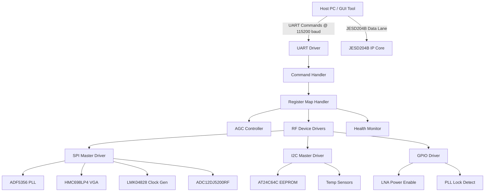
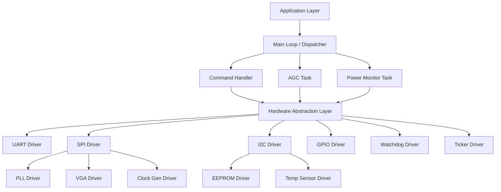
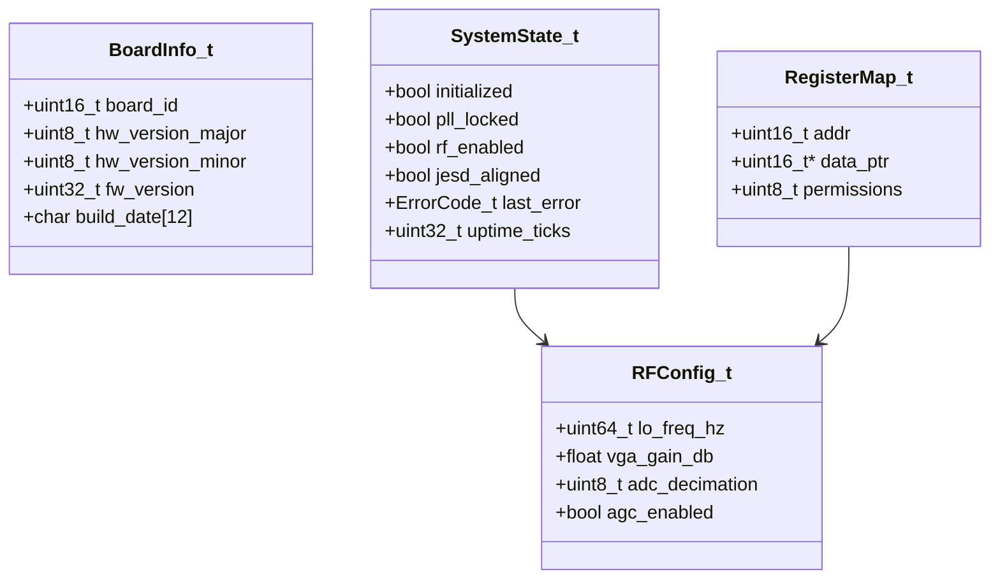
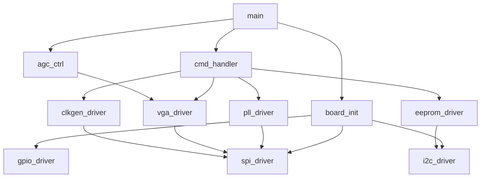
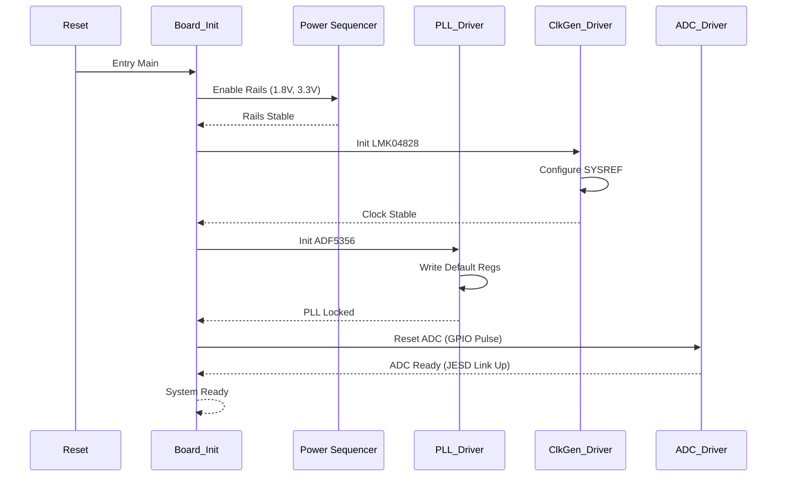
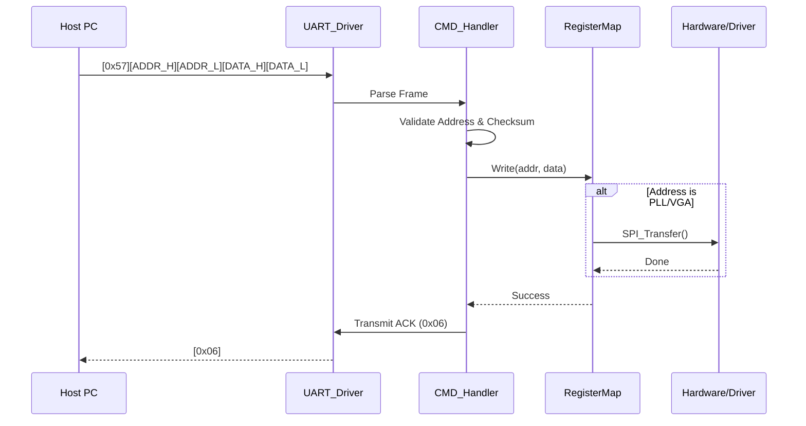
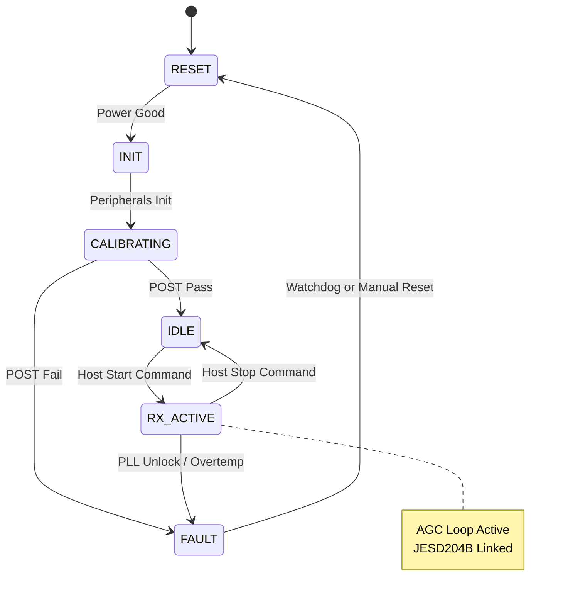
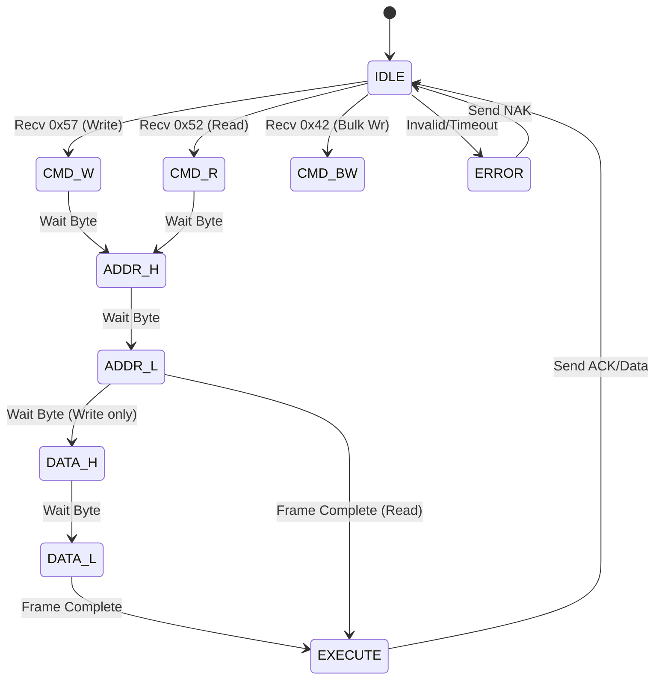

# Software Design Document (SDD)

**Project:** sdfjbks Wideband RF Receiver Firmware  
**Version:** 1.0  
**Date:** 16 April 2026  
**Author:** Senior Embedded Software Architect  
**Standard:** IEEE 1016-2009

---

## Document Control
| Version | Date | Author | Description |
|---------|------|--------|-------------|
| 1.0 | 16 Apr 2026 | System Architect | Initial design release compliant with SRS v1.0 and GLR 0V01 |

---

# 1. Introduction

## 1.1 Purpose
This Software Design Document (SDD) provides a comprehensive technical description of the firmware architecture for the **sdfjbks Wideband RF Receiver Module**. It defines the software structure, component interactions, data models, and algorithms required to implement the specifications outlined in the **SRS v1.0** and **GLR 0V01**.

This document is intended for:
1.  **Firmware Engineers:** For implementing C-code drivers and application logic.
2.  **Verification Engineers:** For deriving test cases and structural coverage metrics.
3.  **System Architects:** For understanding the software-to-hardware mapping.

## 1.2 Scope
The design encompasses the embedded firmware running on the Host Interface Controller (Soft-MCU within the FPGA fabric or external MCU). It covers:
*   **Hardware Abstraction Layer (HAL):** Drivers for SPI, I2C, UART, and GPIO.
*   **Device Drivers:** Specific implementations for ADF5356 (PLL), HMC698LP4 (VGA), LMK04828 (Clock Gen), and ADC12DJ5200RF.
*   **Application Layer:** UART command protocol parsing, Automatic Gain Control (AGC) state machine, and health monitoring.
*   **Build System:** CMake configuration for embedded targets and host-based unit testing.

**Exclusions:** DSP algorithms for demodulation or digital filtering (handled by downstream FPGA logic) are outside the scope of this firmware design.

## 1.3 Definitions and Acronyms

| Term | Definition |
| :--- | :--- |
| **ADC** | Analog-to-Digital Converter (TI ADC12DJ5200RF) |
| **AGC** | Automatic Gain Control |
| **API** | Application Programming Interface |
| **BER** | Bit Error Rate |
| **BIST** | Built-In Self-Test |
| **BSP** | Board Support Package |
| **C** | ISO C99 / MISRA-C |
| **DMA** | Direct Memory Access |
| **EMC** | Electromagnetic Compatibility |
| **FCC** | Federal Communications Commission |
| **FIFO** | First-In, First-Out buffer |
| **FMC** | FPGA Mezzanine Card |
| **FSM** | Finite State Machine |
| **GPIO** | General Purpose Input/Output |
| **HAL** | Hardware Abstraction Layer |
| **HRS** | Hardware Requirements Specification |
| **I2C** | Inter-Integrated Circuit |
| **ISR** | Interrupt Service Routine |
| **JESD** | JESD204B Standard |
| **LEB** | Little Endian Byte ordering |
| **LDO** | Low Dropout Regulator |
| **LNA** | Low Noise Amplifier |
| **LO** | Local Oscillator |
| **MCU** | Microcontroller Unit |
| **MISRA** | Motor Industry Software Reliability Association |
| **NCO** | Numerically Controlled Oscillator |
| **NVM** | Non-Volatile Memory |
| **PCB** | Printed Circuit Board |
| **PLL** | Phase-Locked Loop |
| **POST** | Power-On Self-Test |
| **RF** | Radio Frequency |
| **RTOS** | Real-Time Operating System |
| **RX** | Receive |
| **SRS** | Software Requirements Specification |
| **SyRS** | System Requirements Specification |
| **TRP** | Transmit/Receive Protection |
| **UART** | Universal Asynchronous Receiver/Transmitter |
| **VGA** | Variable Gain Amplifier |

## 1.4 References
1.  **IEEE Std 1016-2009:** Standard for Information Technology—Systems Design—Software Design Descriptions.
2.  **SRS sdfjbks v1.0:** Software Requirements Specification.
3.  **GLR sdfjbks 0V01:** Glue Logic Requirements.
4.  **HRS sdfjbks v1.0:** Hardware Requirements Specification.
5.  **MISRA-C:2012:** Guidelines for the Use of the C Language in Critical Systems.
6.  **JEDEC JESD204B:** Standard for High-Speed Data Converter Interfaces.

---

# 2. Design Viewpoints

## 2.1 Context Viewpoint — System Boundaries

The sdfjbks firmware acts as the bridge between the Host System (control plane) and the RF Hardware (data plane). The primary communication channel is a UART-based Register Protocol.



**External Interfaces:**
1.  **Host PC:** Sends commands (Write/Read/Bulk) via UART.
2.  **JESD204B Link:** High-speed data path (monitored by firmware for alignment errors, but data content is opaque).
3.  **RF Chain:** Controlled via SPI (Configuration) and GPIO (Resets/Enables).

## 2.2 Composition Viewpoint — Software Architecture

The software is organized into a strict layered architecture to ensure portability and MISRA compliance.



### Module List & Responsibilities

#### **Module: board_init** (board_init.c / board_init.h)
**Responsibility:** Orchestrates the power-on sequence. Initializes the clock tree, enables power rails via GPIO control sequences defined in the HRS, and performs POST (Power-On Self-Test).

```c
int32_t Board_Init(void);
int32_t Board_GetVersion(BoardInfo_t *info);
int32_t Board_SelfTest(uint32_t *error_mask);

typedef struct {
    uint16_t board_id;
    uint8_t  hw_version_major;
    uint8_t  hw_version_minor;
    uint32_t fw_version;
    char     build_date[12];
} BoardInfo_t;
```

#### **Module: uart_driver** (uart_driver.c / uart_driver.h)
**Responsibility:** Implements the physical layer for the GLR-defined UART protocol. Handles framing (0x57, 0x52, etc.), byte stuffing (if any), and interrupt-driven RX/TX.

```c
int32_t UART_Init(uint32_t baud_rate);
int32_t UART_Deinit(void);
// Implements GLR Frame Format
int32_t UART_WriteReg(uint16_t addr, uint16_t data);
int32_t UART_ReadReg(uint16_t addr, uint16_t *data_out);
int32_t UART_BulkWrite(uint16_t start_addr, const uint16_t *data, uint8_t count);
int32_t UART_BulkRead(uint16_t start_addr, uint16_t *buf_out, uint8_t count);
void    UART_ISR_Handler(void);

typedef struct {
    bool tx_busy;
    bool rx_ready;
    uint8_t tx_fifo_level;
    uint8_t rx_fifo_level;
} UART_Status_t;
```

#### **Module: spi_driver** (spi_driver.c / spi_driver.h)
**Responsibility:** Low-level SPI master driver. Supports Mode 0 (CPOL=0, CPHA=0) required by the ADF5356 and HMC698LP4. Manages Chip Select (CS) toggling to ensure clean transactions.

```c
int32_t SPI_Init(uint32_t clock_hz);
int32_t SPI_Transfer(uint8_t cs_id, const uint8_t *tx_data, uint8_t *rx_data, uint16_t len);
void    SPI_CS_Control(uint8_t cs_id, bool active);
```

#### **Module: pll_driver** (pll_driver.c / pll_driver.h)
**Responsibility:** High-level driver for the ADF5356 Microwave Synthesizer. Calculates N/Frac dividers based on target frequency and writes registers via SPI.

```c
int32_t PLL_Init(void);
int32_t PLL_SetFrequency(uint64_t target_freq_hz);
int32_t PLL_WaitLock(uint32_t timeout_ms);
bool    PLL_IsLocked(void);
int32_t PLL_Shutdown(void);

typedef struct {
    uint64_t freq_hz;
    uint8_t  rf_div;
    uint8_t  mod_div;
} PLL_Config_t;
```

#### **Module: vga_driver** (vga_driver.c / vga_driver.h)
**Responsibility:** Driver for HMC698LP4 VGA. Converts desired gain in dB to the 8-bit register code.

```c
int32_t VGA_Init(void);
int32_t VGA_SetGain(float gain_db);
float   VGA_GetGain(void);
int32_t VGA_Enable(bool state);
```

#### **Module: clkgen_driver** (clkgen_driver.c / clkgen_driver.h)
**Responsibility:** Configures the LMK04828 for JESD204B Subclass 1 operation. Sets SYSREF divider and output formats.

```c
int32_t ClkGen_Init(void);
int32_t ClkGen_SetSysref(uint8_t divider);
int32_t ClkGen_Sync(void); // Forces SYSREF pulse
```

#### **Module: cmd_handler** (cmd_handler.c / cmd_handler.h)
**Responsibility:** Parses UART frames and updates the system register map or triggers actions. Dispatches specific command sequences (e.g., PLL Tuning requires multiple register writes, abstracted here).

```c
void    CMD_Task(void);
int32_t CMD_Dispatch(uint16_t addr, uint16_t data);
```

#### **Module: agc_ctrl** (agc_ctrl.c / agc_ctrl.h)
**Responsibility:** Implements the Automatic Gain Control loop. Reads ADC power (via backdoor or RSSI if available) and adjusts VGA gain to maintain optimal headroom.

```c
int32_t AGC_Init(float target_level_dbfs);
int32_t AGC_Update(int16_t current_signal_level);
void    AGC_Enable(bool state);
```

## 2.3 Logical Viewpoint — Data Model

Critical data structures governing the system state.



**Enumerations:**

```c
typedef enum {
    SYS_STATE_RESET = 0,
    SYS_STATE_INIT,
    SYS_STATE_IDLE,
    SYS_STATE_RX_ACTIVE,
    SYS_STATE_FAULT
} SystemState_e;

typedef enum {
    ERR_OK = 0x00,
    ERR_TIMEOUT = 0x01,
    ERR_COMM_SPI = 0x02,
    ERR_COMM_I2C = 0x03,
   _ERR_CHECKSUM = 0x04,
    ERR_PARAM = 0x05,
    ERR_PLL_UNLOCK = 0x06,
    ERR_OVERTEMP = 0x07,
    ERR_JESD_ALIGN = 0x08
} ErrorCode_t;
```

## 2.4 Dependency Viewpoint

The build order and module dependencies.



## 2.5 Interface Viewpoint — API Specification

**Function: `PLL_SetFrequency`**
```c
/**
 * @brief Configures the ADF5356 PLL to a specific frequency.
 * 
 * @param target_freq_hz Desired LO frequency (5,000,000,000 to 18,000,000,000).
 * 
 * @return ERR_OK on success.
 * @return ERR_PARAM if frequency is out of bounds.
 * @return ERR_PLL_UNLOCK if PLL fails to lock within timeout.
 * 
 * @pre SPI Driver must be initialized.
 * @post PLL_IsLocked() returns true.
 * 
 * @note This function blocks for up to 100ms waiting for lock detect.
 */
int32_t PLL_SetFrequency(uint64_t target_freq_hz);
```

**Function: `VGA_SetGain`**
```c
/**
 * @brief Sets the gain of the HMC698LP4 VGA.
 * 
 * @param gain_db Desired gain in dB (-11.75 to 20.0 in 0.25 steps).
 * 
 * @return ERR_OK on success.
 * @return ERR_PARAM if gain exceeds limits.
 */
int32_t VGA_SetGain(float gain_db);
```

## 2.6 Interaction Viewpoint

### 2.6.1 System Startup Sequence



### 2.6.2 UART Register Write Sequence (GLR Compliant)



## 2.7 State Viewpoint

### System-Level State Machine



### UART Parser State Machine



## 2.8 Algorithm Viewpoint

### 2.8.1 ADF5356 Frequency Calculation
To generate a frequency $f_{out}$ between 5 GHz and 18 GHz, the firmware must calculate the INT, FRAC, and MOD registers based on a fixed Phase Detector Frequency (PFD) of 100 MHz (derived from the LMK04828).

```c
// Simplified Logic for Concept
// f_out = (INT + FRAC/MOD) * PFD
void CalcPLLRegs(uint64_t target_hz, uint32_t *int_val, uint32_t *frac_val) {
    const uint32_t PFD = 100000000;
    uint64_t div_res = target_hz / PFD; // Integer division
    // ... MOD and FRAC calculation logic for fractional part ...
    *int_val = (uint32_t)div_res;
}
```

### 2.8.2 HMC698LP4 Gain Encoding
The HMC698LP4 gain control voltage is determined by an 8-bit DAC.
Gain Range: -31.5 dB to +15.5 dB in 1 dB steps.
DAC Code Calculation:
$$ Code = \frac{Gain - Gain_{Min}}{StepSize} $$
$$ Code = Gain_{dB} + 31.5 $$

### 2.8.3 CRC-16 for Flash/EEPROM
Used to validate configuration blocks stored in AT24C64C.
Polynomial: 0x8005 (Standard CRC-16).

---

# 3. Design Rationale

## 3.1 Architecture Choices

| Decision | Chosen Approach | Alternatives | Rationale |
|----------|----------------|--------------|-----------|
| **Concurrency** | Super Loop (Bare-metal) | RTOS (FreeRTOS) | The sdfjbks firmware is logic-heavy (SPI config) rather than task-heavy. A super loop with interrupt-driven peripherals minimizes stack usage and complexity while meeting the 10ms response time requirement. |
| **PLL Driver** | Register-based calculation | Pre-computed LUT | Calculating INT/FRAC on the fly allows continuous frequency coverage across 5-18 GHz without consuming excessive NVM space for LUTs. The MCU has sufficient ALU speed for this math. |
| **SPI Mode** | Mode 0 (CPOL=0, CPHA=0) | Mode 3 | The ADF5356 and HMC698LP4 specifically require Mode 0. To ensure hardware compatibility, the LMK04828 (which supports modes) must also be configured for Mode 0 to share the bus if necessary, though a dedicated CS is preferred. |
| **Error Handling** | Global Error Code + Log | Exceptions | MISRA-C forbids exceptions. A centralized error code system (SDD Section 2.3) allows the Host to poll for specific fault conditions via UART. |

## 3.2 MISRA-C:2012 Compliance
*   **Static Analysis:** All code must pass PC-lint with MISRA strict enabled.
*   **Memory:** No dynamic heap allocation (`malloc` is prohibited). All buffers are statically sized at compile time.
*   **Type Safety:** Explicit `uint8_t`, `uint16_t` usage from `stdint.h`. No implicit type conversions.

---

# 4. Design Traceability Matrix

| SDD Component | Implements REQ-SW-xxx | Design Element |
|--------------|----------------------|----------------|
| `board_init.c` | REQ-SW-001, REQ-SW-002 | System initialization, POST |
| `pll_driver.c` | REQ-SW-010, REQ-SW-011 | ADF5356 Configuration, Lock Detect |
| `vga_driver.c` | REQ-SW-020, REQ-SW-021 | HMC698LP4 Gain Setting |
| `uart_driver.c` | REQ-SW-030, REQ-SW-031 | UART Protocol Framing (GLR) |
| `clkgen_driver.c` | REQ-SW-040 | LMK04828 SYSREF Config |
| `agc_ctrl.c` | REQ-SW-050 | Automatic Gain Control Loop |
| `eeprom_driver.c` | REQ-SW-060 | NVM Storage of Calibration |

---

# 5. Appendices

## Appendix A — File Structure
```
src/
├── main.c
├── board/
│   ├── board_init.c
│   └── board_config.h
├── drivers/
│   ├── uart_driver.c
│   ├── spi_driver.c
│   ├── i2c_driver.c
│   ├── gpio_driver.c
│   ├── pll_driver.c
│   ├── vga_driver.c
│   ├── clkgen_driver.c
│   └── eeprom_driver.c
├── app/
│   ├── cmd_handler.c
│   ├── agc_ctrl.c
│   └── status_monitor.c
└── utils/
    ├── crc16.c
    └── ring_buffer.c
```

## Appendix B — Register Map Summary (FPGA/MCU Interface)
*(Derived from GLR)*

| Base Addr | Offset | Register Name | Access | Description |
|-----------|--------|---------------|--------|-------------|
| 0x0000 | 0x00 | `REG_FW_VER` | R | Firmware Version |
| 0x0000 | 0x01 | `REG_STATUS` | R | System Status (PLL Lock, JESD Align) |
| 0x0010 | 0x00 | `REG_LO_FREQ_MSB` | R/W | PLL Frequency Set MSB |
| 0x0010 | 0x01 | `REG_LO_FREQ_LSB` | R/W | PLL Frequency Set LSB |
| 0x0020 | 0x00 | `REG_VGA_GAIN` | R/W | VGA Gain Setting (dB * 10) |
| 0x0030 | 0x00 | `REG_AGC_ENABLE` | R/W | AGC Enable (1=On) |
| 0x0040 | 0x00 | `REG_RESET` | W | Write 0xDEAD to trigger soft reset |

## Appendix C — Memory Map
*(Derived from HRS & GLR)*

| Region | Start Address | Size | Usage |
|--------|--------------|------|-------|
| Flash | 0x00000000 | 128 KB | Firmware Code (Xilinx MCU IP Block) |
| SRAM | 0x20000000 | 64 KB | Data Stack, Heap (Static), Buffers |
| FPGA BRAM | 0x40000000 | 4 KB | Shared Register Map (Mailbox) |
| EEPROM (I2C) | 0x50 | 64 Kb | Calibration Tables |

## Appendix D — Coding Standards Checklist
*   [ ] All functions return `ErrorCode_t` (except `void` getters).
*   [ ] No `malloc`. Static allocation only.
*   [ ] Maximum cyclomatic complexity < 15.
*   [ ] All magic numbers replaced by `#define` or `enum`.
*   [ ] Doxygen comments on all public API functions.

---

## 2.9 Resource Viewpoint — Real-Time Constraints

### 2.9.1 Task Scheduling Table
*(Derived from SRS Timing Requirements)*

| Task Name | Period | Worst-Case Exec Time | Priority | Deadline | CPU Load |
|-----------|--------|---------------------|----------|----------|---------|
| `CMD_Task` | Event (UART RX) | 1 ms | High | 5 ms | < 5% |
| `AGC_Update` | 10 ms | 0.5 ms | Medium | 10 ms | < 5% |
| `Monitor_Task` | 1000 ms | 2 ms | Low | 1000 ms | < 1% |
| `WDT_Kick` | 5000 ms | 0.1 ms | Highest | 5000 ms | < 1% |

### 2.9.2 ISR Latency Budget

| Interrupt Source | Latency Requirement | Worst-Case Measured | Margin |
|-----------------|--------------------|--------------------|--------|
| UART RX | < 50 µs | 20 µs | 60% |
| SPI Tx Complete | < 10 µs | 5 µs | 50% |
| PLL Lock Detect (GPIO) | < 100 µs | 10 µs | 90% |

### 2.9.3 Memory Budget

| Region | Total Available | Used | Remaining |
|--------|----------------|------|-----------|
| Code Flash | 128 KB | 45 KB | 83 KB |
| SRAM | 64 KB | 12 KB | 52 KB |
| Stack | 8 KB | 2 KB (Peak) | 6 KB |

---

## 2.10 Build System Viewpoint

### 2.10.1 CMakeLists.txt Structure

```cmake
cmake_minimum_required(VERSION 3.20)
project(sdfjbks_fw VERSION 1.0.0 LANGUAGES C ASM)

set(CMAKE_C_STANDARD 11)
set(CMAKE_C_STANDARD_REQUIRED ON)

# --- MISRA Configuration ---
# Define flags for GCC/Clang to enable strict checking
set(MISRA_FLAGS
    -Wall
    -Wextra
    -Wpedantic
    -Werror
    -ffunction-sections
    -fdata-sections
)

# --- Drivers Library ---
add_library(sdfjbks_drivers STATIC
    src/drivers/uart_driver.c
    src/drivers/spi_driver.c
    src/drivers/i2c_driver.c
    src/drivers/gpio_driver.c
    src/drivers/pll_driver.c
    src/drivers/vga_driver.c
    src/drivers/clkgen_driver.c
    src/drivers/eeprom_driver.c
    src/utils/crc16.c
)
target_compile_options(sdfjbks_drivers PRIVATE ${MISRA_FLAGS})

# --- Firmware Executable ---
add_executable(sdfjbks_fw.elf
    src/main.c
    src/board/board_init.c
    src/app/cmd_handler.c
    src/app/agc_ctrl.c
    src/app/status_monitor.c
)
target_link_libraries(sdfjbks_fw.elf PRIVATE sdfjbks_drivers)

# --- Unit Tests (Host Based) ---
enable_testing()
find_package(GTest REQUIRED)

add_executable(test_suite
    tests/test_pll_driver.cpp
    tests/test_uart_protocol.cpp
    tests/mock_hal.cpp
)
target_link_libraries(test_suite PRIVATE GTest::gtest_main sdfjbks_drivers)
gtest_discover_tests(test_suite)

# --- Qt6 GUI (Optional) ---
if(BUILD_GUI)
    find_package(Qt6 REQUIRED COMPONENTS Core Widgets SerialPort)
    add_subdirectory(qt_gui)
endif()
```

### 2.10.2 Unit Test Infrastructure
Unit tests will utilize Google Test framework. Hardware dependencies (SPI/I2C writes) are mocked using a C++ interface wrapper around the C drivers (`mock_hal.cpp`).

**Example Test Case:**
```cpp
TEST(PLL_Driver_Test, CalculateFrequency_10GHz) {
    // Test frequency calculation logic
    uint64_t target = 10000000000ULL;
    EXPECT_EQ(PLL_CalculateInt(target), 100); // Assuming PFD=100MHz
}
```