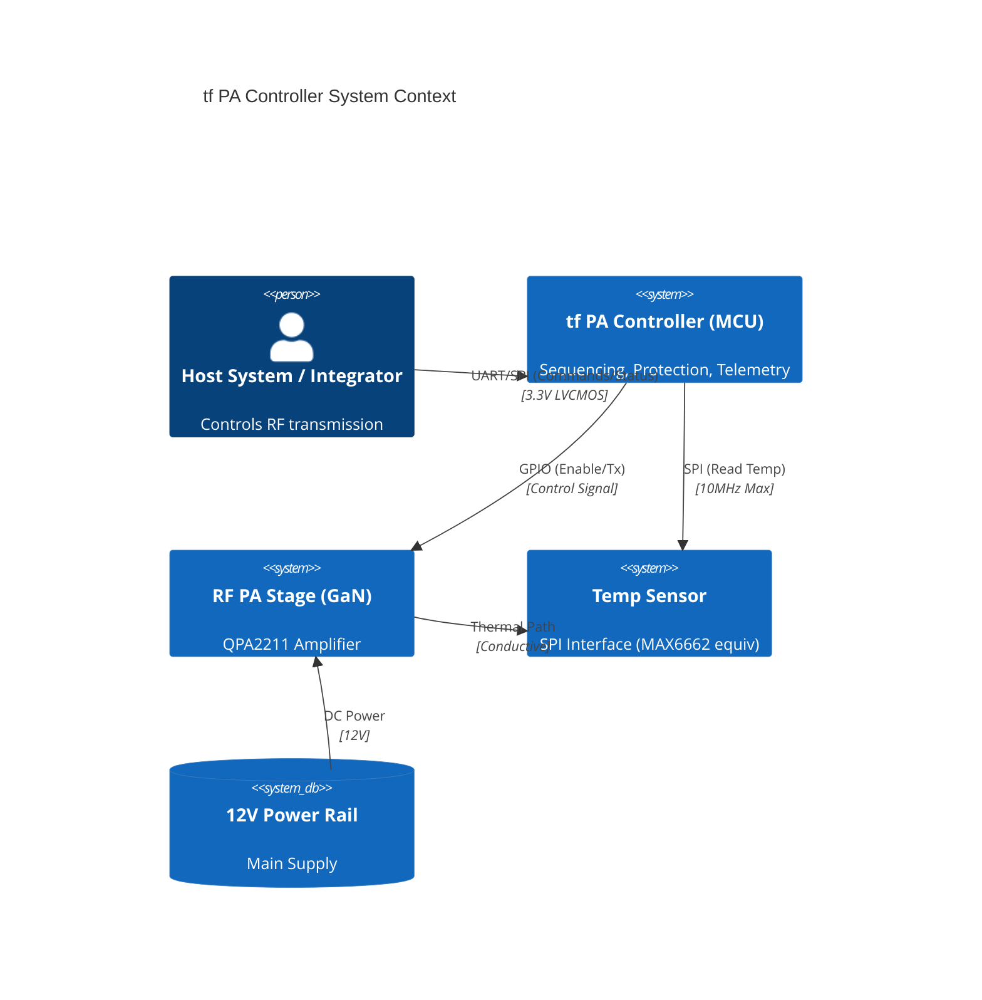
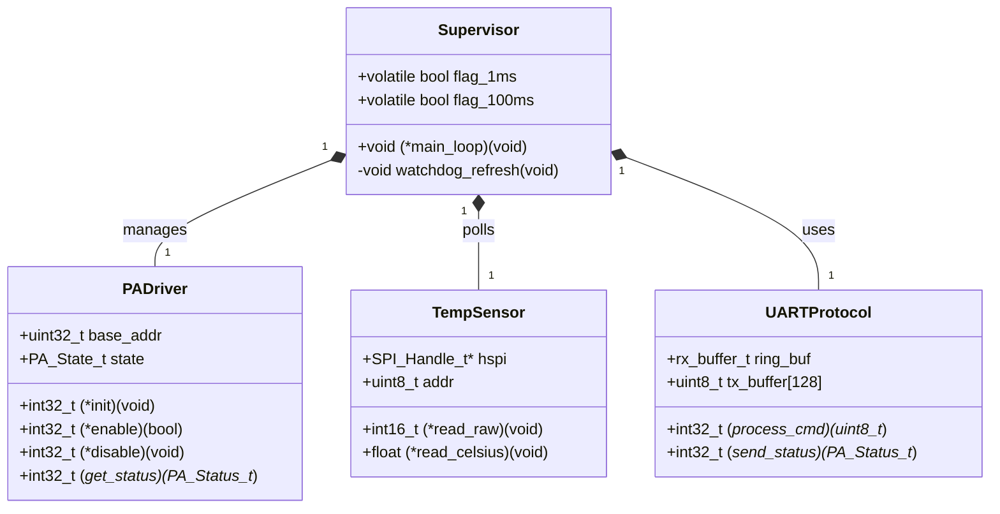
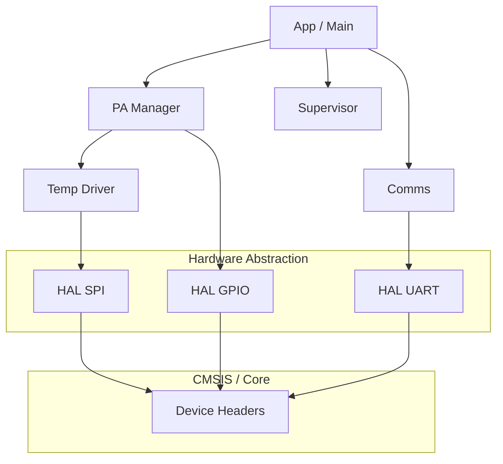
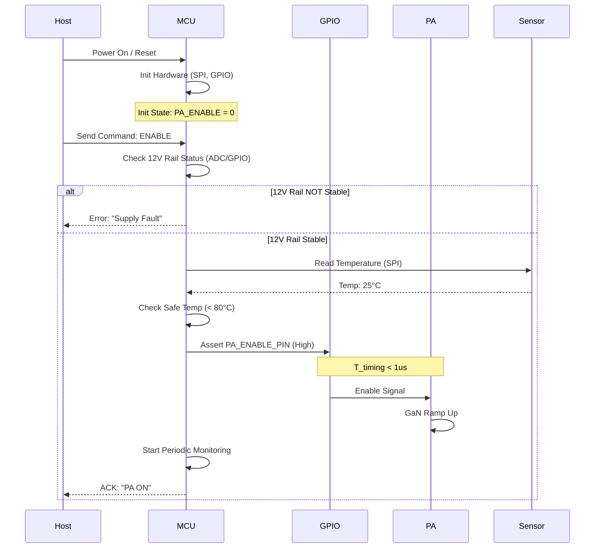
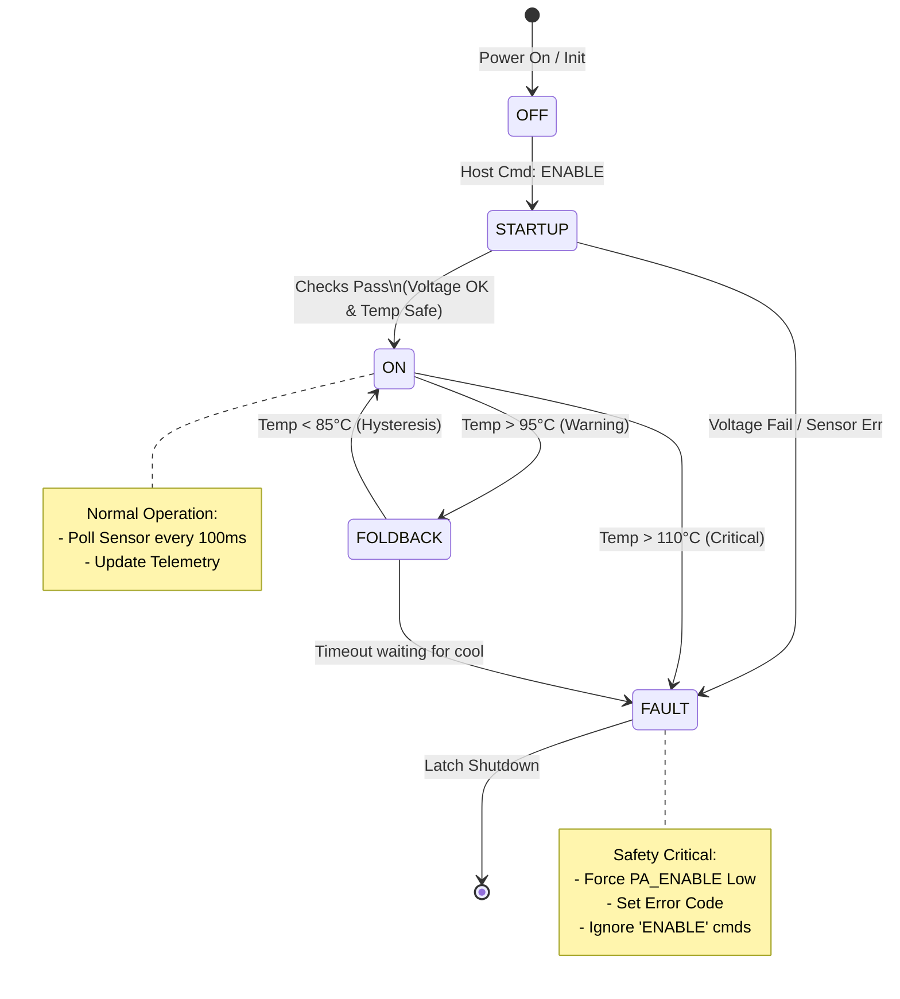

# Software Design Document (SDD) for tf PA Controller

**Project ID:** tf
**Document Version:** 1.0
**Date:** 2026-04-04
**Author:** Senior Software Architect
**Status:** Preliminary
**Standard:** IEEE 1016-2009

---

# 1. Introduction

## 1.1 Purpose
This document describes the software architecture and detailed design of the firmware for the **tf Power Amplifier (PA) Digital Control Module**. It translates the **tf Software Requirements Specification (SRS)** and **Glue Logic Requirements (GLR)** into a concrete implementation plan using a modular, MISRA-C compliant approach. The design focuses on safety-critical sequencing, hardware abstraction, and robust state management for a GaN RF PA environment.

## 1.2 Scope
The design covers the firmware running on the target MCU (STM32G0 series assumed for 32-bit Cortex-M0+ performance within power constraints).
*   **In Scope:** Device drivers (GPIO, SPI, UART), Hardware Abstraction Layer (HAL), PA Control Logic, Safety State Machine, Fault Management, and Host Communication Protocol.
*   **Out of Scope:** RF signal processing algorithms (analog domain), Host PC application software, and Bootloader logic (assumed pre-existing).

## 1.3 Definitions
*   **GLR:** Glue Logic Requirements - Defines electrical and timing constraints between MCU and peripherals.
*   **PAE:** Power Added Efficiency - A metric monitored via indirect telemetry (current/temp).
*   **GaN:** Gallium Nitride - The PA technology requiring strict bias sequencing.
*   **VSWR:** Voltage Standing Wave Ratio - High VSWR causes thermal stress.
*   **MISRA-C:** Motor Industry Software Reliability Association C guidelines.

## 1.4 References
1.  **tf Software Requirements Specification (SRS)**, Rev 1.0.
2.  **tf Glue Logic Requirements (GLR)**, Rev 1.0.
3.  **tf Hardware Requirements Specification (HRS)**, Rev A.
4.  **IEEE 1016-2009:** Standard for Information Technology—Systems Design—Software Design Descriptions.
5.  **MISRA-C:2012:** Guidelines for the use of the C language in critical systems.
6.  **QPA2211 Datasheet**, Qorvo.

---

# 2. Design Viewpoints

## 2.1 Context Viewpoint
The **tf** Controller acts as a gateway between the Host System and the analog RF PA hardware. It enforces safety interlocks that the Host cannot bypass.



## 2.2 Composition Viewpoint
The firmware is divided into five distinct subsystems to ensure separation of concerns and testability.

1.  **HAL (Hardware Abstraction Layer):** Direct register access for GPIO, SPI, UART.
2.  **Sensor Driver:** Handles communication with the external temperature sensor.
3.  **PA Manager:** Implements the bias sequencing and safety state machine.
4.  **Comms Manager:** Handles UART protocol parsing and JSON generation.
5.  **Supervisor:** Main loop control and watchdog management.

```mermaid
componentDiagram
    namespace Main {
        component "Main Loop" as Main
        component "Supervisor" as Sup
    }

    namespace HAL {
        component "GPIO Driver" as Gpio
        component "SPI Driver" as Spi
        component "UART Driver" as Uart
        component "SysTick" as Timer
    }

    namespace Logic {
        component "PA Manager" as PAM
        component "Thermal Monitor" as Temp
        component "Comms Handler" as Comm
    }

    Main -- Sup : Schedules
    Sup -- PAM : [1ms] Tick
    Sup -- Temp : [100ms] Tick
    Sup -- Comm : [Async] RX

    PAM -- Gpio : Set Enable
    Temp -- Spi : Read Sensor
    Comm -- Uart : TX/RX Bytes
    Sup -- Timer : Timebase
```

## 2.3 Logical Viewpoint
The design utilizes a layered class structure (represented as C structs with function pointers) to allow for Mocking during Unit Testing.



## 2.4 Dependency Viewpoint
The build order and module dependencies are strictly managed to prevent circular dependencies.
*   **Level 0:** Compiler definitions (CMSIS).
*   **Level 1:** Hardware Abstraction Layer (GPIO, SPI, UART).
*   **Level 2:** Peripheral Drivers (TempSensor, PA IO).
*   **Level 3:** Business Logic (State Machine, Protocol Parser).
*   **Level 4:** Main Application Entry.



## 2.5 Interface Viewpoint

### 2.5.1 Data Structures
The following structures define the data layout passed between modules, ensuring strict typing (MISRA-C).

```c
#include <stdint.h>
#include <stdbool.h>

/* PA States */
typedef enum {
    PA_STATE_UNINIT = 0,
    PA_STATE_OFF,
    PA_STATE_STARTUP,
    PA_STATE_ON,
    PA_STATE_FAULT,
    PA_STATE_THERMAL_FOLDBACK
} PA_State_e;

/* Status Structure for Telemetry */
typedef struct {
    float temp_celsius;        /* Normalized -40.0 to +125.0 */
    uint32_t uptime_sec;       /* Seconds since boot */
    PA_State_e state;          /* Current state machine state */
    uint8_t fault_code;        /* 0=OK, 1=Overtemp, 2=Comms Err */
    uint8_t pa_enabled;        /* 1 if GPIO High, 0 if Low */
} PA_Status_t;

/* Memory Map for Temperature Sensor (SPI) */
typedef struct __attribute__((packed)) {
    uint8_t REG_TEMP_H;     /* 0x00: Temperature MSB */
    uint8_t REG_TEMP_L;     /* 0x01: Temperature LSB */
    uint8_t REG_CONFIG;     /* 0x02: Configuration */
    uint8_t REG_THYST;      /* 0x03: Hysteresis */
} TempSensor_RegMap_t;

/* Static assert to ensure size integrity */
_Static_assert(sizeof(TempSensor_RegMap_t) == 4, "TempSensor register map size error");
```

### 2.5.2 Function Prototypes
*Signature definitions for the public API.*

```c
/**
 * @brief Initializes the PA Controller hardware and state machine.
 * @param None
 * @retval int32_t 0 on success, negative error code on failure.
 */
int32_t TF_PA_Init(void);

/**
 * @brief Main loop scheduler. Must be called continuously in while(1).
 * @param None
 * @retval None
 */
void TF_PA_Run(void);

/**
 * @brief Command to set PA Enable/Disable state.
 * @param enable 1 to Enable, 0 to Disable.
 * @retval int32_t 0 on success, -1 if Safety Interlock prevents action.
 */
int32_t TF_PA_SetState(uint8_t enable);

/**
 * @brief Retrieves the current system status.
 * @param status Pointer to PA_Status_t struct to populate.
 * @retval int32_t 0 on success, -1 on NULL pointer.
 */
int32_t TF_PA_GetStatus(PA_Status_t* const status);
```

### 2.5.3 Register Access Macros (GLR Compliance)
Direct mapping to hardware registers based on GLR Address Map.

```c
/* GPIO Base Address (Assuming STM32G0 GPIOA) */
#define GPIOA_BASE_ADDR (0x48000000UL)

/* GPIO Register Map Definition */
typedef struct {
    volatile uint32_t MODER;    /* Offset 0x00 */
    volatile uint32_t OTYPER;   /* Offset 0x04 */
    volatile uint32_t OSPEEDR;  /* Offset 0x08 */
    volatile uint32_t PUPDR;    /* Offset 0x0C */
    volatile uint32_t IDR;      /* Offset 0x10 */
    volatile uint32_t ODR;      /* Offset 0x14 */
    volatile uint32_t BSRR;     /* Offset 0x18 */
} GPIO_Reg_t;

/* Macro Definition for PA Enable Pin */
#define PA_ENABLE_PORT   ((GPIO_Reg_t*) GPIOA_BASE_ADDR)
#define PA_ENABLE_PIN    (5U) /* Pin 5 */

/* Bit Manipulation Macros */
#define PA_ENABLE_SET()   (PA_ENABLE_PORT->BSRR = (1U << PA_ENABLE_PIN))
#define PA_ENABLE_CLR()   (PA_ENABLE_PORT->BSRR = (1U << (PA_ENABLE_PIN + 16U)))
#define PA_ENABLE_READ()  ((PA_ENABLE_PORT->IDR & (1U << PA_ENABLE_PIN)) >> PA_ENABLE_PIN)
```

## 2.6 Interaction Viewpoint
**Sequence: Cold Start and Bias Sequencing**
This diagram illustrates the critical timing requirement (REQ-SW-002) where the PA Enable signal must not be asserted until the 12V supply is stable.



## 2.7 State Viewpoint
The PA Manager is implemented as a Hierarchical State Machine (HSM) to handle complex fault conditions and recovery logic.

*   **OFF:** Initial state. Quiescent current consumption.
*   **STARTUP:** Transition state where voltage/temp is validated.
*   **ON:** Operational state. Bias enabled.
*   **FAULT:** Irrecoverable state entered upon critical failure (e.g., Overtemp > 110°C). Requires host command or power cycle to clear.
*   **FOLDBACK:** Recoverable state (e.g., Overtemp > 90°C). PA is disabled, but system continues monitoring temp to auto-restart.



## 2.8 Algorithm Viewpoint

### 2.8.1 Temperature Monitoring (SPI)
The SPI transaction must adhere to the GLR timing constraints (10 MHz max, Setup/Hold times).
*   **CPOL:** 0 (Clock idle low)
*   **CPHA:** 0 (Sample on leading edge)

**Pseudocode:**
```text
FUNCTION ReadTemperature():
    ASSERT_CS_LOW()
    DELAY(10us) // Sensor setup time
    
    // Write Read Command (Assume Reg 0x00)
    SPI_TRANSMIT(0x80)
    
    // Read 2 Bytes (MSB First)
    msb = SPI_RECEIVE()
    lsb = SPI_RECEIVE()
    
    ASSERT_CS_HIGH()
    
    // Convert to signed int (12-bit value in top bits)
    raw = (msb << 8) | lsb
    raw_signed = raw >> 4 // Adjust based on sensor datasheet bit alignment
    
    RETURN (raw_signed * 0.0625) // 0.0625 degC resolution
END FUNCTION
```

### 2.8.2 Thermal Foldback Algorithm
*   **Requirement:** Prevent thermal shock.
*   **Logic:** If temperature crosses threshold, disable PA. Do not re-enable until temperature drops `hysteresis` degrees below threshold.

**Pseudocode:**
```text
CONSTANT TEMP_LIMIT = 95.0
CONSTANT TEMP_HYST = 5.0

FUNCTION MonitorThermal():
    current_temp = ReadTemperature()
    
    IF (State == ON) AND (current_temp > TEMP_LIMIT):
        SET_STATE(FOLDBACK)
        DISABLE_PA()
        SET_ERROR_CODE(ERR_THERMAL)
        
    ELSE IF (State == FOLDBACK) AND (current_temp < (TEMP_LIMIT - TEMP_HYST)):
        // Clear fault and attempt restart
        CLR_ERROR_CODE(ERR_THERMAL)
        SET_STATE(ON)
        ENABLE_PA()
        
    ELSE IF (current_temp > 110.0):
        SET_STATE(FAULT)
        DISABLE_PA()
        SET_ERROR_CODE(ERR_CRITICAL)
    END IF
END FUNCTION
```

---

# 3. Design Rationale

## 3.1 Architectural Choices
*   **Why State Machine?** The PA requires strict sequencing (Voltage -> Enable -> RF). A state machine enforces this order in code, preventing "illegal" states like enabling the PA before the 12V rail is stable. This directly addresses **REQ-SW-002**.
*   **Why HAL Layer?** To support MISRA-C compliance and testing. Abstracting `GPIO_Set()` allows the core logic to be unit tested on a PC (host-based simulation) without hardware.
*   **Why SPI Polling over Interrupts?** Given the low frequency (100ms) of thermal checks, polling the SPI flag is simpler and creates less overhead than setting up DMA/Interrupt chains for a single 2-byte transaction. The MCU is not resource-constrained.

## 3.2 Trade-offs
*   **Safety vs. Responsiveness:** The design defaults to a safe state (PA Off) on any SPI communication error. This trades availability (uptime) for safety (preventing run-away thermal events).
*   **Memory vs. Speed:** The UART uses a fixed-size ring buffer (128 bytes) rather than dynamic allocation (malloc) to strictly avoid heap fragmentation risks in embedded systems.

---

# 4. Traceability

| SRS ID | Requirement | Design Element | Verification |
| :--- | :--- | :--- | :--- |
| **REQ-SW-001** | Init Hardware | `TF_PA_Init()`, HAL Module | Unit Test: Init returns 0 |
| **REQ-SW-002** | Sequence Timing | State Machine (OFF -> STARTUP -> ON) | Integration Test: Scope on Enable Pin |
| **REQ-SW-003** | Thermal Shutdown | `MonitorThermal()` Algo, State: FAULT | Environmental Chamber: Heat gun test |
| **REQ-SW-004** | SPI Sensor Read | `TempSensor` Driver, `ReadTemperature()` | Logic Analyzer: SPI Frame capture |
| **REQ-SW-005** | JSON Telemetry | `UARTProtocol` Module, `PA_Status_t` | Terminal: Check JSON validity |
| **GLR-002** | SPI Voltage Levels | Hardware Config (MCU IO Controller) | Multimeter: Check VIH/VIL |
| **GLR-004** | SPI Timing | SPI Prescaler Config | Scope: Check clock < 10MHz |