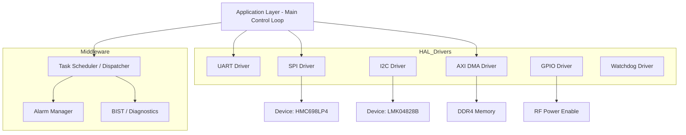
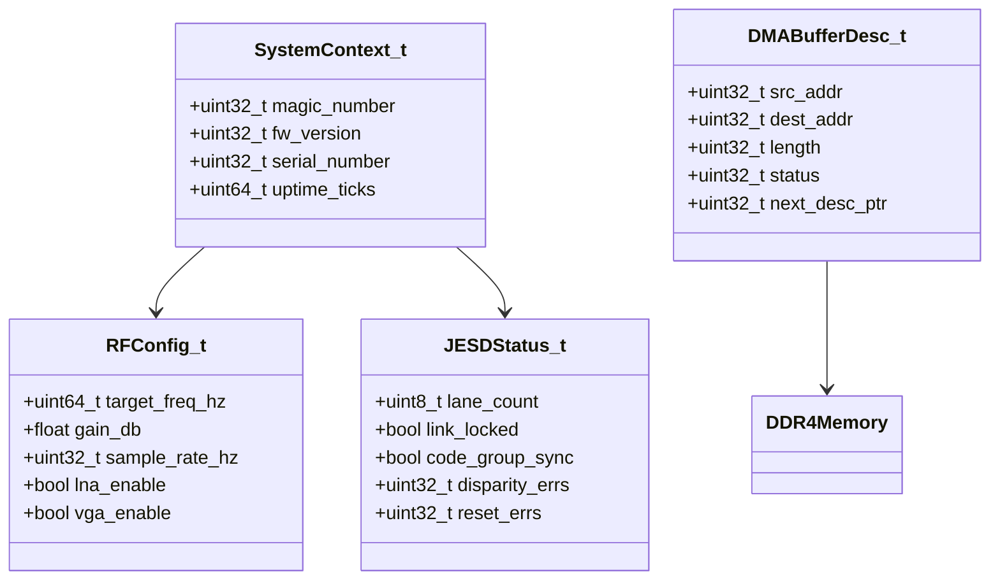
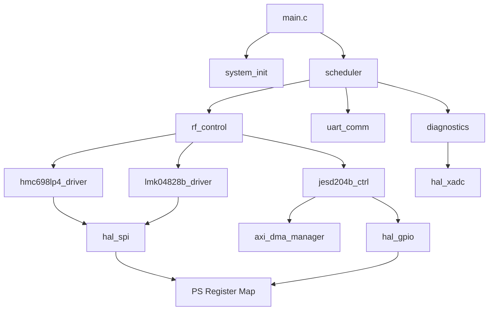
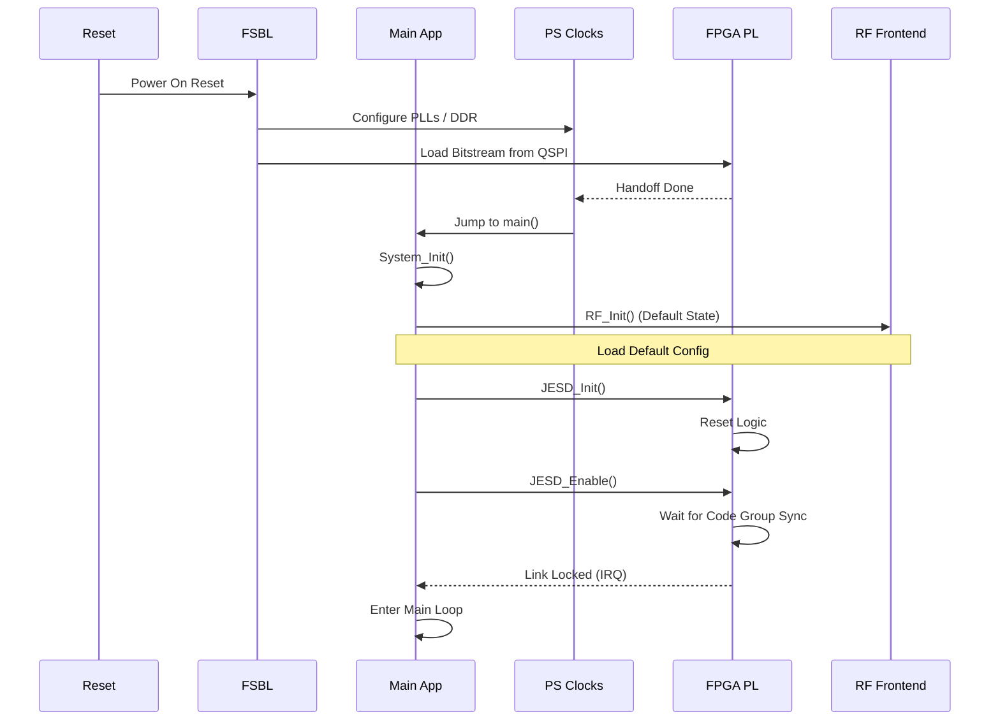
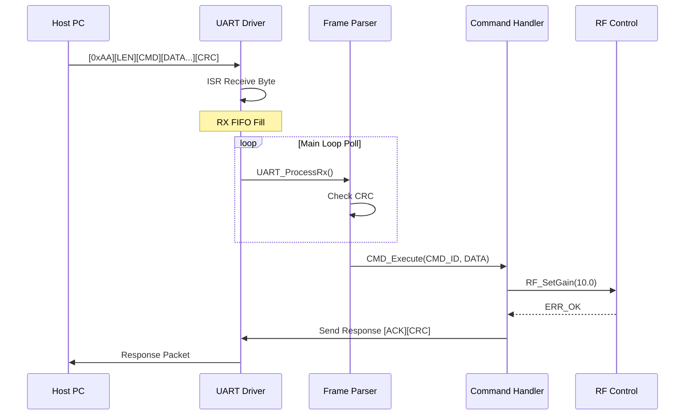
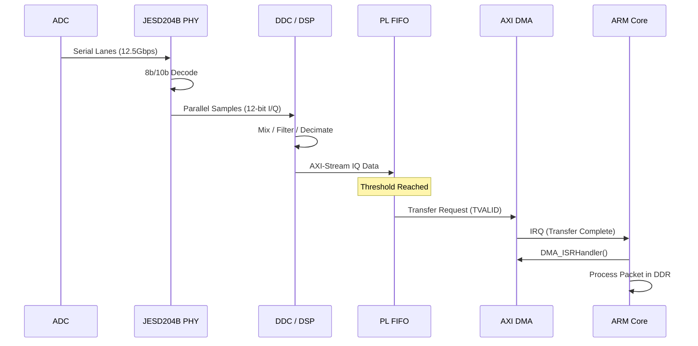
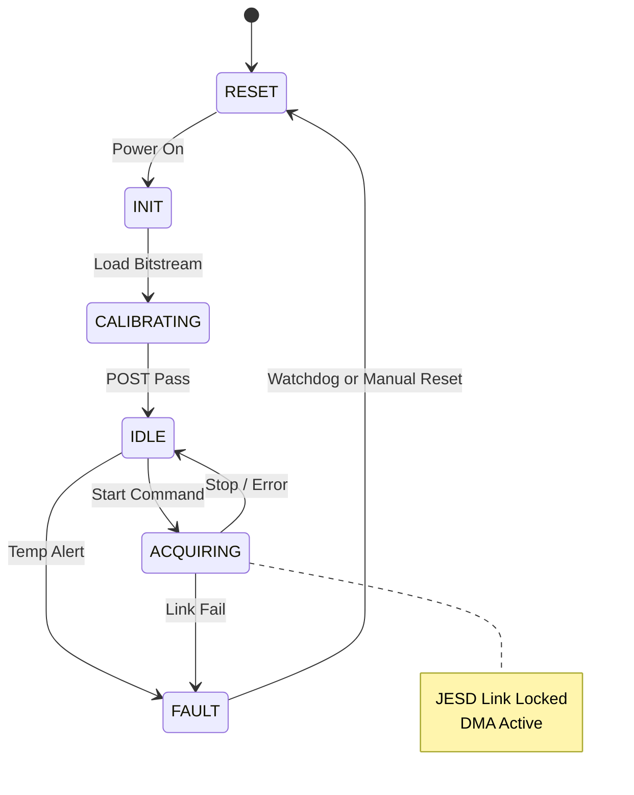
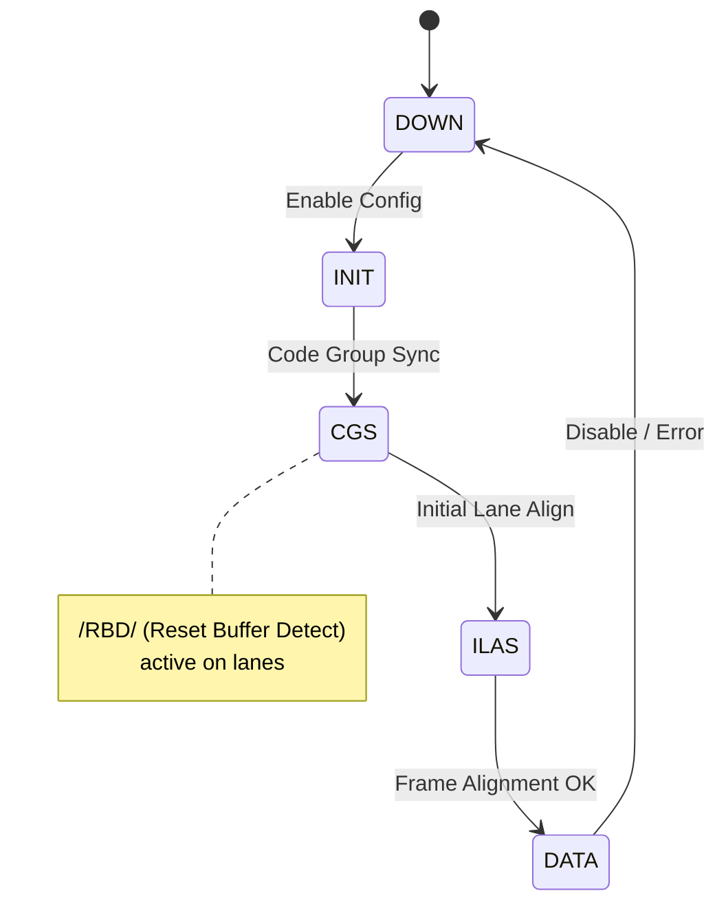

# Software Design Document (SDD)

**Project:** uyj Wideband RF Receiver System  
**Version:** 1.0  
**Date:** 15 April 2026

## Document Control
| Version | Date | Author | Description |
|---------|------|--------|-------------|
| 1.0 | 15 April 2026 | Lead Firmware Architect | Initial design release for uyj Embedded System |

---

# 1. Introduction

## 1.1 Purpose
This Software Design Document (SDD) provides the comprehensive architectural and detailed design for the **uyj** Wideband RF Receiver System embedded software. This document describes the software structure residing on the Xilinx Zynq UltraScale+ (XCZU9EG) Processing System (PS), the firmware architecture for the Programmable Logic (PL), and the interaction mechanisms between them. 

The intended audience includes firmware engineers, FPGA developers, test engineers, and system integrators. This SDD defines the implementation strategy to satisfy the requirements outlined in the **uyj Software Requirements Specification (SRS)** Rev 1.0.

## 1.2 Scope
The design encompasses the following software domains:
1.  **Bootloader & Initialization:** FSBL configuration, DDR4 calibration, and PLL locking sequences.
2.  **Hardware Abstraction Layer (HAL):** Drivers for SPI, I2C, UART, GPIO, and high-performance AXI DMA interfaces.
3.  **Control Logic:** Firmware for configuring the RF Front-End (LNA/VGA), JESD204B ADC link alignment, and Clock Generator (LMK04828B).
4.  **Signal Processing Firmware:** RTL design for the JESD204B RX PHY, Digital Down-Converter (DDC), and Packetizing DMA.
5.  **Host Communication:** UART command parser and register map abstraction.

**Exclusions:** This document does not cover the host PC GUI source code or the mechanical design of the enclosure. It assumes the hardware described in the **HRS** (Rev 1.0) is functionally correct.

## 1.3 Definitions and Acronyms

| Acronym | Definition |
| :--- | :--- |
| **ADC** | Analog-to-Digital Converter (TI ADC12DJ5200RF) |
| **AXI** | Advanced eXtensible Interface (Xilinx bus protocol) |
| **BIST** | Built-In Self-Test |
| **BSD** | Big Endian / Small Endian (Byte ordering) |
| **CDR** | Clock and Data Recovery |
| **CDDC** | Common Data Link Layer (JESD204B) |
| **CORE** | Cortex-A53 Quad-core Processor |
| **DMA** | Direct Memory Access |
| **DDR4** | Double Data Rate 4 SDRAM |
| **DDC** | Digital Down-Converter |
| **FPGA** | Field-Programmable Gate Array |
| **FSBL** | First Stage Bootloader |
| **FSM** | Finite State Machine |
| **GPO** | General Purpose Output |
| **GPI** | General Purpose Input |
| **HAL** | Hardware Abstraction Layer |
| **HRS** | Hardware Requirements Specification |
| **I2C** | Inter-Integrated Circuit |
| **ISR** | Interrupt Service Routine |
| **JESD** | JESD204B High-Speed Data Converter Interface |
| **LFSR** | Linear Feedback Shift Register |
| **LNA** | Low Noise Amplifier (HMC1099LP5DE) |
| **LVDS** | Low-Voltage Differential Signaling |
| **MIPI** | Mobile Industry Processor Interface |
| **MISR** | Multiple Input Signature Register |
| **NCO** | Numerically Controlled Oscillator |
| **OS** | Operating System (Bare-metal or RTOS) |
| **PCB** | Printed Circuit Board |
| **PLL** | Phase-Locked Loop |
| **PS** | Processing System (ARM Side of Zynq) |
| **PL** | Programmable Logic (FPGA Side of Zynq) |
| **QSPI** | Quad Serial Peripheral Interface |
| **RAM** | Random Access Memory |
| **RF** | Radio Frequency |
| **RTL** | Register Transfer Level |
| **SCR** | Scratchpad Register |
| **SGMII** | Serial Gigabit Media Independent Interface |
| **SITH** | System Integration Test Harness |
| **SPI** | Serial Peripheral Interface |
| **SRS** | Software Requirements Specification |
| **TCM** | Tightly Coupled Memory |
| **UART** | Universal Asynchronous Receiver/Transmitter |
| **VGA** | Variable Gain Amplifier (HMC698LP4) |
| **WDT** | Watchdog Timer |

## 1.4 References
1.  **IEEE Std 1016-2009**: Standard for Information Technology—Systems Design—Software Design Descriptions.
2.  **uyj SRS (Rev 1.0)**: Software Requirements Specification.
3.  **uyj HRS (Rev 1.0)**: Hardware Requirements Specification.
4.  **uyj GLR (Rev 0V01)**: Glue Logic Requirements.
5.  **Xilinx UG1085 (v2.6)**: Zynq UltraScale+ Device Register Reference.
6.  **Xilinx PG272**: AXI DMA v7.1 LogiCore IP Product Guide.
7.  **TI ADC12DJ5200RF Datasheet**: JESD204B Interface specifics.
8.  **Analog Devices HMC698LP4 Datasheet**: SPI Serial Interface definition.

---

# 2. Design Viewpoints

## 2.1 Context Viewpoint — System Boundaries

The **uyj** software system resides entirely within the FPGA SoC. It interfaces with an external Host PC via UART for control and provides processed IQ data via Ethernet (though this SDD focuses on the internal generation and buffering of that data).

```mermaid
graph TD
    HOST[Host PC / Controller] -->|UART Configuration Command| UART[UART Driver]
    HOST -->|Ethernet Data / Status| ETH[Ethernet Driver]
    
    subgraph "uyj Embedded Software (Zynq PS)"
        UART --> CMD[Command Parser]
        CMD --> REG[Register Map Handler]
        REG --> SPI[SPI Driver]
        REG --> I2C[I2C Driver]
        
        SPI --> VGA_CFG[HMC698LP4 VGA Controller]
        I2C --> CLK_CFG[LMK04828B Clock Gen Controller]
        
        APP[Main Control Task] --> JESD_CTRL[JESD204B PHY Ctrl]
        APP --> DMA_CTL[AXI DMA Manager]
    end

    subgraph "FPGA Firmware (Zynq PL)"
        JESD_CTRL --> PHY[JESD204B RX PHY]
        PHY --> DDC[Digital Down Converter]
        DDC --> PKT[Packetizer]
        PKT --> DMA_CTL
    end

    PHY -->-|Serial Lanes 12.5 Gbps| ADC[ADC12DJ5200RF]
```

**External Interfaces:**
*   **Host PC:** Sends configuration commands (Frequency, Gain, Sample Rate) via UART. Receives status responses.
*   **ADC12DJ5200RF:** Sends digitized RF data via JESD204B (C-ML).
*   **HMC698LP4 (VGA):** Receives gain settings via SPI.
*   **LMK04828B (Clock Gen):** Receives divider settings via SPI to generate JESD204B device clocks.

## 2.2 Composition Viewpoint — Software Architecture

The software adopts a layered architecture: Application Layer at the top, followed by Middleware/Services, Hardware Abstraction Layer (HAL), and the Hardware/RTOS layer.



### Module List with Responsibilities

#### Module: system_init (system_init.c / system_init.h)
*   **Responsibility:** Handles the C startup environment, initializes the BSS and data sections, configures the MPU (Memory Protection Unit), and launches the main application. Manages the FSBL handoff.
*   **Public API:**
    *   `int32_t System_Init(void);`
    *   `void System_Handler(void);`
*   **Internal State:**
    *   `SystemState_e sys_state;`
    *   `uint32_t system_ticks;`

#### Module: clock_manager (clock_manager.c / clock_manager.h)
*   **Responsibility:** Configures the PS PLLs (PLLs for ARM, DDR, and PL clocks). Ensures the PL clocks (for JESD204B logic) are stable before releasing reset to the PL.
*   **Public API:**
    *   `int32_t CLK_Init(void);`
    *   `int32_t CLK_SetPLLFreq(CLK_Source_e src, uint32_t hz);`
    *   `bool CLK_IsLocked(CLK_Source_e src);`
*   **Internal State:**
    *   `CLK_Config_t current_config;`

#### Module: jesd204b_ctrl (jesd204b_ctrl.c / jesd204b_ctrl.h)
*   **Responsibility:** Manages the JESD204B IP core state machine. Handles subclass configuration, lane alignment (code group synchronization), and error monitoring (disparity errors).
*   **Public API:**
    *   `int32_t JESD_Init(const JESD_Config_t *cfg);`
    *   `int32_t JESD_Enable(void);`
    *   `int32_t JESD_Disable(void);`
    *   `int32_t JESD_GetStatus(JESD_Status_t *status);`
*   **Internal State:**
    *   `JESD_StateMachine_e jesd_sm_state;`
    *   `uint32_t alignment_error_count;`

#### Module: rf_control (rf_control.c / rf_control.h)
*   **Responsibility:** High-level API for configuring the RF chain. Validates frequency ranges, sets LNA bypass, and calculates VGA SPI register values based on desired gain.
*   **Public API:**
    *   `int32_t RF_SetFrequency(uint64_t freq_hz);`
    *   `int32_t RF_SetGain(float gain_db);`
    *   `int32_t RF_SetBandwidth(uint32_t bw_hz);`
*   **Internal State:**
    *   `RF_Settings_t current_settings;`

#### Module: hmc698lp4_driver (hmc698lp4_driver.c / hmc698lp4_driver.h)
*   **Responsibility:** Low-level SPI driver for the HMC698LP4 VGA. Handles the 24-bit register write protocol.
*   **Public API:**
    *   `int32_t VGA_Init(uint8_t spi_id);`
    *   `int32_t VGA_WriteReg(uint8_t addr, uint16_t data);`
    *   `int32_t VGA_SetGain(float db);`
*   **Internal State:**
    *   `uint8_t device_spi_addr;`

#### Module: lmk04828b_driver (lmk04828b_driver.c / lmk04828b_driver.h)
*   **Responsibility:** SPI driver for the LMK04828B clock generator. Configures VCO dividers and output formats to match ADC requirements.
*   **Public API:**
    *   `int32_t CLKGEN_Init(void);`
    *   `int32_t CLKGEN_WriteReg(uint16_t reg_addr, uint8_t data);`
    *   `int32_t CLKGEN_Sync(void);`

#### Module: axi_dma_manager (axi_dma_manager.c / axi_dma_manager.h)
*   **Responsibility:** Manages the AXI DMA IP core. Sets up Scatter Gather engines to move IQ data from the PL FIFO to DDR4 memory.
*   **Public API:**
    *   `int32_t DMA_Init(void);`
    *   `int32_t DMA_StartTransfer(uint32_t src_addr, uint32_t dest_addr, uint32_t len);`
    *   `bool DMA_IsBusy(void);`
    *   `void DMA_ISRHandler(void);`

#### Module: uart_comm (uart_comm.c / uart_comm.h)
*   **Responsibility:** Parses incoming byte streams from UART. Implements the framing protocol (SOP, LEN, CMD, DATA, CRC, EOP). Dispatches valid commands to `cmd_handler`.
*   **Public API:**
    *   `int32_t UART_Init(uint32_t baudrate);`
    *   `void UART_ProcessRx(void);`
    *   `int32_t UART_SendResponse(const uint8_t *buf, uint16_t len);`

#### Module: cmd_handler (cmd_handler.c / cmd_handler.h)
*   **Responsibility:** Maps command IDs to function calls. Acts as the bridge between the comm layer and the application logic (RF Control, Diagnostics).
*   **Public API:**
    *   `int32_t CMD_Execute(uint8_t cmd_id, const uint8_t *payload, uint16_t len);`

#### Module: diagnostics (diagnostics.c / diagnostics.h)
*   **Responsibility:** Runs POST routines. Monitors internal voltages and temperatures via XADC.
*   **Public API:**
    *   `int32_t DIAG_RunPOST(void);`
    *   `int32_t DIAG_GetXADC(float *temp_c, float *vcc_int);`

## 2.3 Logical Viewpoint — Data Model



### Key Data Structures

```c
/* RF Configuration Structure */
typedef struct {
    uint64_t frequency_hz;
    float    gain_db;
    uint32_t bandwidth_hz;
    uint8_t  attenuation_steps;
} RFConfig_t;

/* JESD204B Link Status */
typedef struct {
    uint32_t link_state;      /* 0=Off, 1=Init, 2=Locked */
    uint32_t lane_status_mask;
    uint32_t error_count;
    uint32_t buffer_occupancy;
} JESDStatus_t;

/* AXI DMA Descriptor (aligned to 64-bit boundary) */
typedef struct {
    volatile uint32_t src_addr;
    volatile uint32_t dest_addr;
    volatile uint32_t control;      /* Bit 31: IRQ on completion */
    volatile uint32_t status;
    volatile uint32_t next_desc_ptr;
    uint8_t  reserved[24];          /* Pad to 64 bytes */
    uint32_t app_data[4];
} DMADescriptor_t __attribute__((aligned(64)));
```

## 2.4 Dependency Viewpoint



**Dependency Rules:**
1.  Application tasks depend only on HAL APIs, not hardware registers directly.
2.  The `axi_dma_manager` is dependent on the `jesd204b_ctrl` to know when data is valid.
3.  All drivers depend on `system_init` to have configured clocks and MPU.

## 2.5 Interface Viewpoint — Complete API Specification

### Function: `RF_SetFrequency`
```c
/**
 * @brief Sets the RF Front End operating frequency.
 * 
 * @param freq_hz Target frequency in Hz (5.0e9 to 18.0e9).
 * @return int32_t ERR_OK on success.
 * @return ERR_FREQ_OUT_OF_RANGE if freq_hz is invalid.
 * @return ERR_SPI_COMM if SPI write to HMC698LP4 fails.
 * 
 * @pre System_Init() must have been called.
 * @post LNA and VGA are re-tuned. JESD link may briefly lose lock during transition.
 * 
 * Thread Safety: This function is not reentrant. A mutex 'rf_mutex' must be held.
 */
int32_t RF_SetFrequency(uint64_t freq_hz);
```

### Function: `JESD_Enable`
```c
/**
 * @brief Enables the JESD204B PHY and initiates lane alignment.
 * 
 * @return int32_t ERR_OK if alignment sequence started successfully.
 * @return ERR_PLL_NOT_LOCKED if the reference clock is not stable.
 * 
 * @post JESD204B Subclass 1 link initiates code group sync.
 * 
 * Note: This is a non-blocking call. Polling JESD_GetStatus is required to verify lock.
 */
int32_t JESD_Enable(void);
```

### Function: `DMA_StartTransfer`
```c
/**
 * @brief Starts an AXI DMA transfer from PL FIFO to DDR4.
 * 
 * @param bd_ptr Pointer to the first buffer descriptor in the chain.
 * @param num_bd Number of descriptors in the chain.
 * 
 * @pre DMA_Init() must have been called and hardware idle.
 * @post DMA engine begins fetching data based on descriptors.
 * 
 * @warning Ensure destination buffers in DDR4 are physically contiguous and large enough.
 */
int32_t DMA_StartTransfer(DMADescriptor_t *bd_ptr, uint32_t num_bd);
```

## 2.6 Interaction Viewpoint — Sequence Diagrams

### System Startup Sequence


### UART Command Processing


### Data Capture Loop


## 2.7 State Viewpoint — State Machines

### System Level State Machine


### JESD204B Link State Machine


## 2.8 Algorithm Viewpoint — Key Algorithms

### 2.8.1 JESD204B Lane Alignment (CGS)
The firmware initializes the PHY by setting the `SYNC~` signal low. The ADC IP detects this and begins sending `K28.5` characters (compliance pattern) on all lanes. The PHY counts valid `K28.5` characters. Once `N` successful characters are received on all lanes, `SYNC~` is released.

### 2.8.2 CRC-16 Calculation for UART
Used to validate command packets.
```c
uint16_t CRC16_Calc(const uint8_t *data, uint32_t len) {
    uint16_t crc = 0xFFFF;
    for (uint32_t i = 0; i < len; i++) {
        crc ^= (uint16_t)data[i];
        for (uint8_t j = 0; j < 8; j++) {
            if (crc & 0x0001) {
                crc = (crc >> 1) ^ 0xA001;
            } else {
                crc >>= 1;
            }
        }
    }
    return crc;
}
```

---

# 3. Design Rationale

## 3.1 Architecture Choices

1.  **Bare-Metal vs. RTOS:**
    *   *Decision:* Implement Bare-Metal with a custom cooperative scheduler.
    *   *Rationale:* The **uyj** system has hard real-time requirements for the DMA and JESD maintenance tasks but relatively few concurrent threads. Removing an RTOS reduces complexity, licensing costs, and potential context-switch overhead.
    *   *Trade-off:* Developers must manually manage stack usage and prevent task starvation.

2.  **PL vs. PS Processing:**
    *   *Decision:* Perform DDC (Digital Down Conversion) entirely in the FPGA PL.
    *   *Rationale:* The input rate (up to 5.2 GSPS) far exceeds the memory bandwidth available to the PS AXI bus. Processing must occur in hardware before the data is packetized for the ARM core.

3.  **SPI for HMC698LP4:**
    *   *Decision:* Use the PS SPI controller rather than bit-banging GPIO.
    *   *Rationale:* The HMC698LP4 requires SPI clock rates up to 20 MHz for fast gain changes. Hardware SPI offloads the CPU and ensures precise timing.

## 3.2 MISRA-C:2012 Compliance Strategy
*   **Static Analysis:** All code will be verified using Coverity or PC-lint Plus with the MISRA C:2012 configuration enabled.
*   **Memory Safety:** Use of `MISRA Rule 11.8` (memory allocation) prohibits dynamic memory. All buffers are static arrays defined at compile time.
*   **Type Safety:** Strong typing is enforced via `stdiint.h` types (e.g., `uint32_t`, `int16_t`).

---

# 4. Design Traceability Matrix

| SDD Component | Implements REQ-SW-xxx | Description |
|---------------|----------------------|-------------|
| `system_init.c` | REQ-SW-001 | Initialization and startup |
| `jesd204b_ctrl.c` | REQ-SW-010 | JESD204B Interface Setup |
| `hmc698lp4_driver.c` | REQ-SW-020 | VGA Gain Control |
| `lmk04828b_driver.c` | REQ-SW-021 | Clock Generator Config |
| `axi_dma_manager.c` | REQ-SW-030 | Data Packet Buffering |
| `uart_comm.c` | REQ-SW-040 | UART Command Parser |
| `rf_control.c` | REQ-SW-025 | Frequency Tuning API |
| `diagnostics.c` | REQ-SW-050 | Built-In Self Test (BIST) |
| `ddc_core.vhd` | REQ-SW-035 | Digital Down Converter Logic |
| `watchdog.c` | REQ-SW-060 | System Fault Recovery |

---

# 5. Appendices

## Appendix A — File Structure
```
/project_uyj
├── src/
│   ├── main.c
│   ├── system_init.c
│   ├── rf_control.c
│   ├── drivers/
│   │   ├── spi.c
│   │   ├── i2c.c
│   │   ├── uart.c
│   │   ├── gpio.c
│   │   ├── xadc.c
│   │   ├── hmc698lp4.c
│   │   └── lmk04828b.c
│   ├── services/
│   │   ├── jesd_ctrl.c
│   │   ├── dma_manager.c
│   │   ├── cmd_handler.c
│   │   └── diagnostics.c
│   └── utils/
│       ├── crc16.c
│       └── ring_buffer.c
├── rtl/
│   ├── jesd204b_rx_wrapper.v
│   ├── ddc_chain.v
│   └── packetizer.v
└── include/
    ├── uyj_config.h
    └── uyj_types.h
```

## Appendix B — Memory Map (PS Address Space)
| Base Address | Region | Size | Description |
|--------------|--------|------|-------------|
| 0xFF000000 | QSPI | 16 MB | Boot Flash |
| 0x00000000 | DDR4 | 4 GB | Main System Memory (IQ Data) |
| 0x80000000 | AXI_PCIE | 1 MB | Configuration Space (Future) |
| 0xFFE00000 | UART | 64 KB | PS UART Controller |
| 0xFF0F0000 | SPI | 64 KB | PS SPI Controller (RF) |
| 0xFF0E0000 | I2C | 64 KB | PS I2C Controller |
| 0x80000000 | GP0_AXI | 4 GB | Port to PL Registers |

## Appendix C — Pinout / Glue Logic Map
Derived from GLR 0V01:
*   MIO[12, 13] : UART TX/RX
*   MIO[14, 15] : I2C SDA/SCL (Clock Gen)
*   EMIO[0] : RF_1_EN (GPO)
*   EMIO[1] : RF_2_EN (GPO)
*   Bank 55 : SPI (HMC698LP4) via EMIO shifters

## Appendix D — Coding Standards Checklist
*   [ ] All functions return `ErrorCode_t` (except void getters).
*   [ ] No `malloc` or `free` used.
*   [ ] All loops have a bounded upper limit.
*   [ ] Magic numbers defined as `#define` or `const`.
*   [ ] Code compiles with `-Wall -Werror -pedantic`.