# Software Design Document (SDD)

## Document Control

| Version | Date | Author | Description |
|---------|------|--------|-------------|
| 1.0 | 24 April 2026 | Embedded Software Architecture | Initial design release |
| 0.9 | 17 April 2026 | Embedded Software Architecture | Design review draft |
| 0.5 | 10 April 2026 | Senior Firmware Engineer | Preliminary architecture |

---

# 1. Introduction

## 1.1 Purpose

This Software Design Document (SDD) provides the complete, implementation-ready software architecture and detailed design for the **yhh** 4-channel monopulse radar RF front-end control firmware. The software executes on the Xilinx MicroBlaze soft processor instantiated within the Artix-7 XC7A200T-1FBG676I FPGA. 

This SDD translates the requirements defined in the Software Requirements Specification (YHH-FW-SRS-001) into concrete data structures, algorithmic descriptions, module decompositions, state machines, and interface definitions. The intended audience includes:

- **Firmware Engineers**: Implementing the C source code from the function prototypes, state machines, and algorithms specified herein.
- **RTL Designers**: Verifying the FPGA register map interface and memory-mapped I/O boundary between the MicroBlaze subsystem and the custom glue logic.
- **Test Engineers**: Deriving unit test cases from the API contracts, sequence diagrams, and state machine transitions documented in this SDD.
- **Systems Engineers**: Validating requirement traceability from design elements back to the SRS, HRS, and GLR.

This document strictly complies with IEEE 1016-2009 (Standard for Software Design Descriptions) and covers all required design viewpoints: Context, Composition, Logical, Dependency, Interface, Interaction, State, Algorithm, Resource, and Build System.

## 1.2 Scope

### 1.2.1 Software Components Designed

This SDD covers the design of the following software subsystems:

1. **Board Support Package (BSP)**: Power-on initialization, clock tree setup, and MicroBlaze processor configuration.
2. **Hardware Abstraction Layer (HAL)**: Peripheral drivers for UART, SPI, I2C, and GPIO.
3. **Device Drivers**: High-level drivers for EEPROM (AT25160B), Configuration Flash (S25FL064L), PLL, and Watchdog Timer.
4. **Application Layer**: System manager, command handler, active bias controller, temperature monitor, power monitor, monopulse comparator manager, fault logger, and POST/CBIT modules.
5. **Utility Libraries**: CRC-32, ring buffer, and fixed-point math.

### 1.2.2 Explicitly Out of Scope

- FPGA VHDL/Verilog RTL design for the MicroBlaze subsystem or glue logic.
- DSP algorithms for monopulse angle estimation or beamforming.
- Host PC GUI application (Qt6 C++ interface specification is provided as a build system reference only).
- Downconverter, LO, or ADC driver software.
- FPGA bitstream synthesis, place-and-route, or timing closure.

### 1.2.3 Target Hardware Platform

- **FPGA**: Xilinx Artix-7 XC7A200T-1FBG676I (Speed Grade -1, Industrial)
- **Processor**: MicroBlaze soft-core (v10.0), 100 MHz clock, 32-bit RISC
- **Local Memory**: 64 KB Block RAM (tightly coupled instruction/data)
- **External Memory**: None (bare-metal, no external DDR)
- **Debug Interface**: JTAG via Xilinx MicroBlaze Debug Module (MDM)

### 1.2.4 Programming Language and Toolchain

- **Language**: C99 (strictly MISRA-C:2012 compliant)
- **Compiler**: `mb-gcc` (Xilinx MicroBlaze GNU Toolchain, gcc version 9.2.0)
- **Linker**: `mb-ld` with custom linker script (`yhh-firmware.ld`)
- **Build System**: CMake 3.20+ with cross-compilation toolchain file
- **Static Analysis**: PC-lint Plus 1.4, Helix QAC for MISRA compliance
- **IDE**: Xilinx Vitis 2023.2

## 1.3 Definitions and Acronyms

| Acronym / Term | Definition |
| :--- | :--- |
| **ADC** | Analog-to-Digital Converter |
| **API** | Application Programming Interface |
| **BIT** | Built-In Test |
| **BIST** | Built-In Self-Test |
| **BPF** | Bandpass Filter |
| **BSP** | Board Support Package |
| **CBIT** | Continuous Built-In Test |
| **CLB** | Configurable Logic Block |
| **CRC** | Cyclic Redundancy Check |
| **DAC** | Digital-to-Analog Converter |
| **DMA** | Direct Memory Access |
| **EEPROM** | Electrically Erasable Programmable Read-Only Memory |
| **FIFO** | First-In, First-Off data buffer |
| **FPGA** | Field Programmable Gate Array |
| **GaAs pHEMT** | Gallium Arsenide Pseudomorphic High Electron Mobility Transistor |
| **GLR** | Glue Logic Requirements |
| **GPIO** | General Purpose Input/Output |
| **HAL** | Hardware Abstraction Layer |
| **HRS** | Hardware Requirements Specification |
| **I2C** | Inter-Integrated Circuit bus |
| **IIP3** | Input Third-Order Intercept Point |
| **ISR** | Interrupt Service Routine |
| **JTAG** | Joint Test Action Group debug interface |
| **LNA** | Low Noise Amplifier |
| **LVTTL** | Low-Voltage Transistor-Transistor Logic |
| **MDM** | MicroBlaze Debug Module |
| **MMIC** | Monolithic Microwave Integrated Circuit |
| **MISRA** | Motor Industry Software Reliability Association |
| **NVM** | Non-Volatile Memory |
| **OIP3** | Output Third-Order Intercept Point |
| **PBRR** | Power-On Reset |
| **PLL** | Phase-Locked Loop |
| **POST** | Power-On Self-Test |
| **RAM** | Random Access Memory |
| **RF** | Radio Frequency |
| **RTOS** | Real-Time Operating System |
| **SDD** | Software Design Description |
| **SPI** | Serial Peripheral Interface |
| **SPDT** | Single-Pole, Double-Throw switch |
| **SRS** | Software Requirements Specification |
| **TRP** | Transmit/Receive Pin |
| **UART** | Universal Asynchronous Receiver-Transmitter |
| **WDT** | Watchdog Timer |

## 1.4 References

| Ref ID | Document ID | Title / Description | Relevance |
| :--- | :--- | :--- | :--- |
| [REF-1] | IEEE 1016-2009 | IEEE Standard for Software Design Descriptions | Governs the structure and content of this SDD |
| [REF-2] | YHH-FW-SRS-001 v1.0 | yhh Software Requirements Specification | Primary input: all functional requirements trace to this |
| [REF-3] | YHH-HRS-001 v1.0 | yhh Hardware Requirements Specification | Hardware interfaces, power rails, RF chain topology |
| [REF-4] | YHH-GLR-001 v0V01 | yhh Glue Logic Requirements | FPGA pinout, UART protocol, register map, module specs |
| [REF-5] | MISRA C:2012 | Guidelines for the Use of the C Language in Critical Systems | Mandatory coding standard for all firmware source |
| [REF-6] | DS181 (DS-XC7A200T) | Xilinx Artix-7 XC7A200T Datasheet | FPGA electrical characteristics and block RAM map |
| [REF-7] | UG984 | Xilinx MicroBlaze Processor Reference Guide | MicroBlaze instruction set and interrupt behavior |
| [REF-8] | AT25160B Datasheet | Microchip AT25160B SPI EEPROM Datasheet | EEPROM SPI protocol for calibration storage |
| [REF-9] | S25FL064L Datasheet | Infineon S25FL064L Flash Datasheet | Configuration flash SPI protocol |
| [REF-10] | LM75B Datasheet | NXP LM75B I2C Temperature Sensor Datasheet | Temperature sensor I2C protocol and register map |
| [REF-11] | INA219 Datasheet | Texas Instruments INA219 Power Monitor Datasheet | Power monitor I2C protocol and calibration |
| [REF-12] | MIL-STD-810H | Environmental Engineering Considerations | Temperature and vibration constraints |

---

# 2. Design Viewpoints

## 2.1 Context Viewpoint — System Boundaries

The yhh firmware operates within the MicroBlaze soft processor inside the Artix-7 FPGA. It is the sole software component responsible for all control, monitoring, and diagnostic functions of the 4-channel monopulse radar RF front-end. The firmware interacts with external hardware peripherals via FPGA I/O pins and communicates with the external Host PC via a USB-UART bridge.

### 2.1.1 System Context Diagram

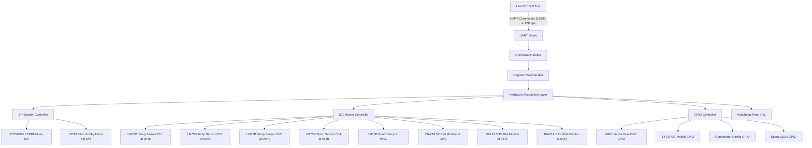

### 2.1.2 External Interface Summary

| Interface | Direction | Protocol | Physical Layer | Counterpart |
|-----------|-----------|----------|----------------|-------------|
| Host PC UART | Bidirectional | Register R/W protocol | USB-UART bridge at 115200/12Mbps | Host PC GUI |
| JTAG Debug | Bidirectional | IEEE 1149.1 | 4-pin JTAG header | Xilinx Vitis / xsdb |
| SPI to EEPROM | Master out/in | SPI Mode 0, 10 MHz | 4-wire SPI (CLK, MOSI, MISO, CS_N) | AT25160B (2 KB) |
| SPI to Flash | Master out/in | SPI Mode 0, 50 MHz | 4-wire SPI (shared bus, separate CS) | S25FL064L (8 MB) |
| I2C to Temp Sensors | Master out/in | I2C 400 kHz | 2-wire (SCL, SDA) | 5x LM75B at 0x48-0x4C |
| I2C to Power Monitors | Master out/in | I2C 400 kHz | 2-wire (shared I2C bus) | 3x INA219 at 0x40-0x42 |
| GPIO to Bias DACs | Output | Direct write | LVTTL 3.3V | 8x DAC channels (bias setpoints) |
| GPIO to T/R Switches | Output | Direct write | LVTTL 3.3V | 4x SPDT TR switch control lines |
| GPIO to Comparator | Output | Direct write | LVTTL 3.3V | Channel select and phase trim |
| GPIO to LEDs | Output | Direct write | LVTTL 3.3V | 4x status LEDs |
| Watchdog HW | Output | Direct write | FPGA internal WDT IP | System reset |

## 2.2 Composition Viewpoint — Software Architecture

### 2.2.1 Layered Architecture Overview

The firmware follows a strict 4-layer architecture. Dependencies flow downward only — upper layers call lower layers, never the reverse. No layer bypasses the layer directly below it.

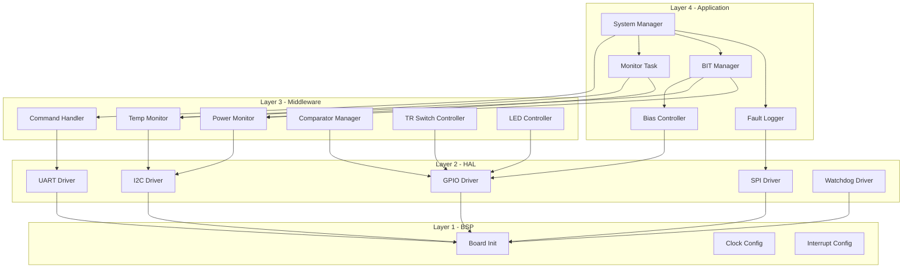

### 2.2.2 Complete Module Catalog

The following table lists every software module with its source files and a summary of responsibilities.

| Module Name | Source File | Header File | Layer | Responsibility |
|-------------|------------|-------------|-------|----------------|
| board_init | board_init.c | board_init.h | BSP | Power-on initialization, MicroBlaze cache enable, clock setup |
| uart_driver | uart_driver.c | uart_driver.h | HAL | UART framing, TX/RX FIFO management, register protocol transport |
| spi_driver | spi_driver.c | spi_driver.h | HAL | SPI master transfers for EEPROM and Flash, chip select management |
| i2c_driver | i2c_driver.c | i2c_driver.h | HAL | I2C master read/write with polling, bus error recovery |
| gpio_driver | gpio_driver.c | gpio_driver.h | HAL | Memory-mapped GPIO read/write for all control and status signals |
| wdt_driver | wdt_driver.c | wdt_driver.h | HAL | Watchdog timer initialization, petting, and reset detection |
| flash_driver | flash_driver.c | flash_driver.h | Driver | S25FL064L flash read/write/erase with CRC verification |
| eeprom_driver | eeprom_driver.c | eeprom_driver.h | Driver | AT25160B EEPROM read/write for calibration and fault log |
| pll_driver | pll_driver.c | pll_driver.h | Driver | Clock PLL configuration and lock monitoring |
| cmd_handler | cmd_handler.c | cmd_handler.h | Middleware | UART frame parsing, command dispatch, response formatting |
| temp_monitor | temp_monitor.c | temp_monitor.h | Middleware | 5x LM75B polling, temperature conversion, alert evaluation |
| power_monitor | power_monitor.c | power_monitor.h | Middleware | 3x INA219 polling, voltage/current conversion, fault detection |
| bias_controller | bias_controller.c | bias_controller.h | Middleware | 8-channel DAC bias setpoint calculation and temperature compensation |
| tr_switch | tr_switch.c | tr_switch.h | Middleware | T/R switch state management with timing guard |
| comparator_mgr | comparator_mgr.c | comparator_mgr.h | Middleware | Monopulse comparator channel select and phase trim |
| led_controller | led_controller.c | led_controller.h | Middleware | 4-LED status pattern driver (blink, solid, fast-flash) |
| fault_logger | fault_logger.c | fault_logger.h | Middleware | EEPROM circular buffer fault recording with timestamps |
| post | post.c | post.h | Application | Power-On Self-Test sequence orchestrator |
| cbit | cbit.c | cbit.h | Application | Continuous Built-In Test runtime monitor |
| system_mgr | system_mgr.c | system_mgr.h | Application | Top-level state machine, task scheduler, initialization |
| crc32 | crc32.c | crc32.h | Utility | IEEE 802.3 CRC-32 computation and verification |
| ring_buffer | ring_buffer.c | ring_buffer.h | Utility | Lock-free byte ring buffer for UART RX/TX |

---

## 2.2.3 Detailed Module Specifications

### Module: board_init (board_init.c / board_init.h)

**Responsibility**: Performs the fundamental power-on initialization sequence for the MicroBlaze processor subsystem. Enables the instruction and data caches, configures the base address of the memory-mapped FPGA register space, initializes the interrupt controller, and verifies the FPGA fabric revision ID against the expected value.

**Internal State Variables**:
```c
static bool g_board_initialized = false;
static BoardInfo_t g_board_info;
static uint32_t g_fpga_revision_expected = 0x0100A701U; /* v1.0 for Artix-7 A200T */
```

**Configuration Constants**:
```c
#define FPGA_REGISTER_BASE      (0x40000000U)
#define FPGA_REVISION_REG       (FPGA_REGISTER_BASE + 0x0000U)
#define MICROBLAZE_CLOCK_HZ     (100000000U)  /* 100 MHz */
#define CACHE_LINE_SIZE_BYTES    (16U)
```

**Public API**:
```c
/**
 * @brief Perform complete board-level initialization.
 * Enables caches, verifies FPGA revision, returns board info.
 * @return ERR_OK on success, ERR_HARDWARE if FPGA revision mismatch.
 */
int32_t Board_Init(void);

/**
 * @brief Retrieve board identification and version information.
 * @param info Pointer to BoardInfo_t structure to populate.
 * @return ERR_OK on success, ERR_PARAM if info is NULL.
 */
int32_t Board_GetVersion(BoardInfo_t *info);

/**
 * @brief Execute Power-On Self-Test and return pass/fail mask.
 * @param test_mask Pointer to uint32_t bitmask of POST results (1 = pass).
 * @return ERR_OK if all critical tests pass, ERR_HARDWARE otherwise.
 */
int32_t Board_SelfTest(uint32_t *test_mask);

/**
 * @brief Check if board initialization has completed successfully.
 * @return true if Board_Init() completed, false otherwise.
 */
bool Board_IsInitialized(void);

/**
 * @brief Perform emergency hardware shutdown of all RF paths.
 * Disables all MMIC biases, mutes RF, turns off LEDs except FAULT.
 */
void Board_EmergencyShutdown(void);
```

**Data Structures**:
```c
typedef struct {
    uint16_t board_id;           /* Unique board identifier, 0xA701 */
    uint8_t  hw_version_major;   /* Hardware major version, 1 */
    uint8_t  hw_version_minor;   /* Hardware minor version, 0 */
    uint32_t fw_version;         /* Firmware version BCD: 0x01000000 */
    uint32_t fpga_revision;      /* Fabric revision register value */
    char     build_date[12];     /* Compilation date string __DATE__ */
} BoardInfo_t;
```

---

### Module: uart_driver (uart_driver.c / uart_driver.h)

**Responsibility**: Manages the MicroBlaze UART Lite IP core for communication with the Host PC via the USB-UART bridge. Handles TX and RX FIFO management, provides both blocking and non-blocking transfer modes, and generates interrupts on RX data available. The UART operates at 115200 bps by default with support for 12 Mbps high-speed mode.

**Internal State Variables**:
```c
static bool g_uart_initialized = false;
static RingBuffer_t g_uart_rx_buf;    /* 256-byte RX ring buffer */
static RingBuffer_t g_uart_tx_buf;    /* 256-byte TX ring buffer */
static uint32_t g_uart_baud_rate = 115200U;
static volatile bool g_tx_busy = false;
```

**Configuration Constants**:
```c
#define UART_BASE_ADDR          (0x40001000U)
#define UART_BAUD_DEFAULT       (115200U)
#define UART_BAUD_HIGH_SPEED    (12000000U)
#define UART_RX_FIFO_DEPTH      (16U)
#define UART_TX_FIFO_DEPTH      (16U)
#define UART_RX_RING_BUF_SIZE   (256U)
#define UART_TX_RING_BUF_SIZE   (256U)
#define UART_FRAME_TIMEOUT_MS   (10U)
```

**Public API**:
```c
/**
 * @brief Initialize the UART peripheral.
 * Configures baud rate, enables FIFOs, clears buffers.
 * @param baud_rate Target baud rate: 115200 or 12000000.
 * @return ERR_OK on success, ERR_PARAM or ERR_HARDWARE on failure.
 */
int32_t UART_Init(uint32_t baud_rate);

/**
 * @brief Deinitialize the UART peripheral and disable interrupts.
 * @return ERR_OK on success.
 */
int32_t UART_Deinit(void);

/**
 * @brief Transmit a single byte (blocking with timeout).
 * @param byte The byte to transmit.
 * @param timeout_ms Maximum time to wait for TX FIFO space.
 * @return ERR_OK on success, ERR_TIMEOUT if FIFO full.
 */
int32_t UART_WriteByte(uint8_t byte, uint32_t timeout_ms);

/**
 * @brief Receive a single byte (blocking with timeout).
 * @param byte_out Pointer to store received byte.
 * @param timeout_ms Maximum time to wait for RX data.
 * @return ERR_OK on success, ERR_TIMEOUT if no data.
 */
int32_t UART_ReadByte(uint8_t *byte_out, uint32_t timeout_ms);

/**
 * @brief Transmit a buffer of bytes (blocking).
 * @param data Pointer to data buffer.
 * @param len Number of bytes to transmit.
 * @param timeout_ms Total timeout for the entire transfer.
 * @return ERR_OK on success, ERR_TIMEOUT or ERR_PARAM on failure.
 */
int32_t UART_WriteBuffer(const uint8_t *data, uint16_t len, uint32_t timeout_ms);

/**
 * @brief Receive a buffer of bytes (blocking).
 * @param buf_out Pointer to output buffer.
 * @param len Number of bytes to receive.
 * @param timeout_ms Total timeout for the entire transfer.
 * @return ERR_OK on success.
 */
int32_t UART_ReadBuffer(uint8_t *buf_out, uint16_t len, uint32_t timeout_ms);

/**
 * @brief Query the UART driver status.
 * @param status Pointer to UART_Status_t to populate.
 * @return ERR_OK on success.
 */
int32_t UART_GetStatus(UART_Status_t *status);

/**
 * @brief UART interrupt service routine.
 * Called by the MicroBlaze interrupt controller on RX data available.
 */
void UART_ISR(void);

/**
 * @brief Set the UART baud rate dynamically.
 * @param baud_rate New baud rate.
 * @return ERR_OK on success.
 */
int32_t UART_SetBaudRate(uint32_t baud_rate);
```

**Data Structures**:
```c
typedef struct {
    bool     tx_busy;
    bool     rx_available;
    bool     frame_error;
    bool     parity_error;
    bool     overrun_error;
    uint16_t tx_fifo_count;
    uint16_t rx_fifo_count;
    uint32_t baud_rate;
    uint32_t rx_overflow_count;
    uint32_t tx_total_bytes;
    uint32_t rx_total_bytes;
} UART_Status_t;
```

---

### Module: spi_driver (spi_driver.c / spi_driver.h)

**Responsibility**: Manages the MicroBlaze SPI IP core for communication with the AT25160B EEPROM and S25FL064L Flash memory devices on the shared SPI bus with independent chip select lines. Supports SPI Mode 0 (CPOL=0, CPHA=0) at clock rates up to 10 MHz for EEPROM and 50 MHz for Flash.

**Internal State Variables**:
```c
static bool g_spi_initialized = false;
static uint8_t g_spi_current_cs = SPI_CS_NONE;
static uint32_t g_spi_clock_hz = 10000000U;
```

**Configuration Constants**:
```c
#define SPI_BASE_ADDR           (0x40002000U)
#define SPI_CLOCK_EEPROM_HZ     (10000000U)  /* 10 MHz for AT25160B */
#define SPI_CLOCK_FLASH_HZ      (50000000U)  /* 50 MHz for S25FL064L */
#define SPI_CS_NONE             (0xFFU)
#define SPI_CS_EEPROM           (0U)         /* CS_N pin 0 */
#define SPI_CS_FLASH            (1U)         /* CS_N pin 1 */
#define SPI_TRANSFER_TIMEOUT_MS (500U)
#define SPI_DEFAULT_CPOL        (0U)
#define SPI_DEFAULT_CPHA        (0U)
```

**Public API**:
```c
/**
 * @brief Initialize the SPI master controller.
 * @param clock_hz SPI clock frequency in Hz.
 * @param cpol Clock polarity (0 or 1).
 * @param cpha Clock phase (0 or 1).
 * @return ERR_OK on success.
 */
int32_t SPI_Init(uint32_t clock_hz, uint8_t cpol, uint8_t cpha);

/**
 * @brief Perform a full-duplex SPI transfer.
 * @param tx_data Pointer to TX data buffer (NULL for RX-only).
 * @param rx_data Pointer to RX data buffer (NULL for TX-only).
 * @param len Number of bytes to transfer.
 * @return ERR_OK on success, ERR_TIMEOUT or ERR_COMM on failure.
 */
int32_t SPI_Transfer(const uint8_t *tx_data, uint8_t *rx_data, uint16_t len);

/**
 * @brief Assert or de-assert a specific chip select line.
 * @param cs_idx Chip select index (0=EEPROM, 1=Flash).
 * @param active true to assert (low), false to de-assert (high).
 * @return ERR_OK on success, ERR_PARAM if cs_idx invalid.
 */
int32_t SPI_ChipSelect(uint8_t cs_idx, bool active);

/**
 * @brief Deinitialize the SPI controller.
 * @return ERR_OK on success.
 */
int32_t SPI_Deinit(void);
```

---

### Module: i2c_driver (i2c_driver.c / i2c_driver.h)

**Responsibility**: Manages the MicroBlaze I2C IP core for communication with the LM75B temperature sensors (5 devices at addresses 0x48-0x4C) and INA219 power monitors (3 devices at addresses 0x40-0x42). Operates in I2C master mode at 400 kHz (Fast Mode). Implements polling-based transfers with bus error detection and recovery via software reset.

**Internal State Variables**:
```c
static bool g_i2c_initialized = false;
static uint32_t g_i2c_clock_hz = 400000U;
static uint32_t g_i2c_bus_error_count = 0U;
```

**Configuration Constants**:
```c
#define I2C_BASE_ADDR           (0x40003000U)
#define I2C_CLOCK_HZ            (400000U)   /* 400 kHz Fast Mode */
#define I2C_TRANSFER_TIMEOUT_MS (50U)
#define I2C_MAX_RETRIES         (3U)
```

**I2C Device Addresses**:
```c
#define I2C_ADDR_TEMP_CH1       (0x48U)  /* LM75B Channel 1 */
#define I2C_ADDR_TEMP_CH2       (0x49U)  /* LM75B Channel 2 */
#define I2C_ADDR_TEMP_CH3       (0x4AU)  /* LM75B Channel 3 */
#define I2C_ADDR_TEMP_CH4       (0x4BU)  /* LM75B Channel 4 */
#define I2C_ADDR_TEMP_BOARD     (0x4CU)  /* LM75B Board ambient */
#define I2C_ADDR_PWR_5V         (0x40U)  /* INA219 +5V rail */
#define I2C_ADDR_PWR_3V3        (0x41U)  /* INA219 +3.3V rail */
#define I2C_ADDR_PWR_1V8        (0x42U)  /* INA219 +1.8V rail */
```

**Public API**:
```c
/**
 * @brief Initialize the I2C master controller.
 * @param clock_hz I2C clock frequency in Hz (400000 for Fast Mode).
 * @return ERR_OK on success.
 */
int32_t I2C_Init(uint32_t clock_hz);

/**
 * @brief Write data to an I2C device.
 * @param dev_addr 7-bit I2C device address.
 * @param data Pointer to data buffer to write.
 * @param len Number of bytes to write.
 * @return ERR_OK on success, ERR_COMM or ERR_TIMEOUT on failure.
 */
int32_t I2C_Write(uint8_t dev_addr, const uint8_t *data, uint8_t len);

/**
 * @brief Read data from an I2C device.
 * @param dev_addr 7-bit I2C device address.
 * @param buf Pointer to buffer for received data.
 * @param len Number of bytes to read.
 * @return ERR_OK on success.
 */
int32_t I2C_Read(uint8_t dev_addr, uint8_t *buf, uint8_t len);

/**
 * @brief Write a value to an I2C device register.
 * Sends device address + register address + data byte.
 * @param dev_addr 7-bit I2C device address.
 * @param reg_addr 8-bit register address within the device.
 * @param val Value to write.
 * @return ERR_OK on success.
 */
int32_t I2C_WriteReg(uint8_t dev_addr, uint8_t reg_addr, uint8_t val);

/**
 * @brief Read a value from an I2C device register.
 * @param dev_addr 7-bit I2C device address.
 * @param reg_addr 8-bit register address within the device.
 * @param val_out Pointer to store the read value.
 * @return ERR_OK on success.
 */
int32_t I2C_ReadReg(uint8_t dev_addr, uint8_t reg_addr, uint8_t *val_out);

/**
 * @brief Read a 16-bit value from an I2C device register (MSB first).
 * @param dev_addr 7-bit I2C device address.
 * @param reg_addr 8-bit register address within the device.
 * @param val_out Pointer to store the 16-bit value.
 * @return ERR_OK on success.
 */
int32_t I2C_ReadReg16(uint8_t dev_addr, uint8_t reg_addr, uint16_t *val_out);

/**
 * @brief Perform I2C bus recovery (9 clock pulses with SDA high).
 * @return ERR_OK on success.
 */
int32_t I2C_BusRecovery(void);

/**
 * @brief Deinitialize the I2C controller.
 * @return ERR_OK on success.
 */
int32_t I2C_Deinit(void);
```

---

### Module: gpio_driver (gpio_driver.c / gpio_driver.h)

**Responsibility**: Manages all general-purpose I/O signals via the memory-mapped FPGA GPIO register bank. Provides atomic bit-level set/clear/toggle operations for MMIC bias DAC load strobes, T/R switch control lines, comparator configuration, and LED control. All GPIO outputs are defined with explicit safe default states.

**Internal State Variables**:
```c
static bool g_gpio_initialized = false;
static uint32_t g_gpio_shadow;  /* Shadow register for read-modify-write */
```

**Configuration Constants — GPIO Bit Assignments**:
```c
#define GPIO_BASE_ADDR              (0x40004000U)

/* Bias DAC control — 8 channels (4 channels x 2 stages) */
#define GPIO_BIAS_DAC_DATA_MASK     (0x00FFU) /* Bits [7:0]: DAC data bus */
#define GPIO_BIAS_DAC_CLK_BIT       (8U)      /* Bit 8: DAC serial clock */
#define GPIO_BIAS_DAC_LOAD_BIT      (9U)      /* Bit 9: DAC load strobe */
#define GPIO_BIAS_DAC_CHSEL_MASK    (0x0F00U << 10U) /* Bits [13:10]: channel select */

/* T/R switch control — 4 channels */
#define GPIO_TR_SW_CH1_BIT          (16U)
#define GPIO_TR_SW_CH2_BIT          (17U)
#define GPIO_TR_SW_CH3_BIT          (18U)
#define GPIO_TR_SW_CH4_BIT          (19U)
#define GPIO_TR_SW_ALL_MASK         (0x000FU << 16U)

/* Comparator control */
#define GPIO_COMP_CHSEL_MASK        (0x0003U << 20U) /* Bits [21:20]: channel select */
#define GPIO_COMP_PHASE_TRIM_MASK   (0x000FU << 22U) /* Bits [25:22]: phase trim */
#define GPIO_COMP_AMP_TRIM_MASK     (0x0003U << 26U) /* Bits [27:26]: amplitude trim */

/* LED control — 4 LEDs */
#define GPIO_LED_STATUS_BIT         (28U)  /* Green: system OK */
#define GPIO_LED_FAULT_BIT          (29U)  /* Red: fault */
#define GPIO_LED_ACTIVITY_BIT       (30U)  /* Yellow: UART activity */
#define GPIO_LED_RF_BIT             (31U)  /* Blue: RF enabled */
#define GPIO_LED_ALL_MASK           (0xFU << 28U)

/* Safe default state: all biases off, TR switch in receive mode, LEDs off */
#define GPIO_DEFAULT_OUTPUT_VALUE   (0x0000U | GPIO_TR_SW_ALL_MASK)
```

**Public API**:
```c
/**
 * @brief Initialize the GPIO controller and set all outputs to safe defaults.
 * @return ERR_OK on success.
 */
int32_t GPIO_Init(void);

/**
 * @brief Set specified GPIO bits (atomic read-modify-write).
 * @param bits Mask of bits to set.
 * @return ERR_OK on success, ERR_NOT_INIT if GPIO not initialized.
 */
int32_t GPIO_SetBits(uint32_t bits);

/**
 * @brief Clear specified GPIO bits (atomic read-modify-write).
 * @param bits Mask of bits to clear.
 * @return ERR_OK on success.
 */
int32_t GPIO_ClearBits(uint32_t bits);

/**
 * @brief Toggle specified GPIO bits.
 * @param bits Mask of bits to toggle.
 * @return ERR_OK on success.
 */
int32_t GPIO_ToggleBits(uint32_t bits);

/**
 * @brief Write the full 32-bit GPIO output register.
 * @param value Full register value to write.
 * @return ERR_OK on success.
 */
int32_t GPIO_Write(uint32_t value);

/**
 * @brief Read the full 32-bit GPIO register (inputs + outputs).
 * @param value Pointer to store register value.
 * @return ERR_OK on success.
 */
int32_t GPIO_Read(uint32_t *value);

/**
 * @brief Read only the GPIO input bits (external pin states).
 * @param value Pointer to store input value.
 * @return ERR_OK on success.
 */
int32_t GPIO_ReadInputs(uint32_t *value);
```

---

### Module: wdt_driver (wdt_driver.c / wdt_driver.h)

**Responsibility**: Manages the Xilinx Watchdog Timer IP core for system health supervision. The watchdog must be serviced (petted) every 5 seconds; otherwise, a system reset is generated. The driver also provides the ability to detect whether the current boot is the result of a watchdog reset.

**Internal State Variables**:
```c
static bool g_wdt_initialized = false;
static bool g_wdt_enabled = false;
static uint32_t g_wdt_timeout_ms = 5000U;
```

**Configuration Constants**:
```c
#define WDT_BASE_ADDR           (0x40005000U)
#define WDT_TIMEOUT_MS          (5000U)
#define WDT_PET_KEY             (0x0BADC0DEU)
```

**Public API**:
```c
/**
 * @brief Initialize the watchdog timer.
 * @param timeout_ms Timeout period in milliseconds.
 * @return ERR_OK on success.
 */
int32_t WDT_Init(uint32_t timeout_ms);

/**
 * @brief Pet (service) the watchdog timer to prevent reset.
 * @return ERR_OK on success, ERR_NOT_INIT if not initialized.
 */
int32_t WDT_Pet(void);

/**
 * @brief Check if the current boot was caused by a watchdog reset.
 * @return true if watchdog reset occurred, false otherwise.
 */
bool WDT_WasResetCause(void);

/**
 * @brief Enable the watchdog timer.
 * @return ERR_OK on success.
 */
int32_t WDT_Enable(void);

/**
 * @brief Disable the watchdog timer (for debug builds only).
 * @return ERR_OK on success.
 */
int32_t WDT_Disable(void);
```

---

### Module: flash_driver (flash_driver.c / flash_driver.h)

**Responsibility**: Provides high-level read, write, and erase operations for the S25FL064L SPI NOR flash memory (8 MB). Implements page-program with CRC-32 verification, sector erase with timeout management, and read-ID for device validation. The flash stores FPGA configuration bitstreams and factory calibration data.

**Internal State Variables**:
```c
static bool g_flash_initialized = false;
static uint32_t g_flash_page_size = 256U;
static uint32_t g_flash_sector_size = 65536U;
static uint32_t g_flash_size_bytes = 0x800000U; /* 8 MB */
```

**Configuration Constants**:
```c
/* S25FL064L Command Set */
#define FLASH_CMD_READ           (0x03U)
#define FLASH_CMD_PAGE_PROGRAM   (0x02U)
#define FLASH_CMD_SECTOR_ERASE   (0xD8U)
#define FLASH_CMD_WRITE_ENABLE   (0x06U)
#define FLASH_CMD_READ_STATUS    (0x05U)
#define FLASH_CMD_READ_ID        (0x9FU)
#define FLASH_CMD_CHIP_ERASE     (0xC7U)
#define FLASH_STATUS_BUSY_BIT    (0x01U)
#define FLASH_STATUS_WEL_BIT     (0x02U)
#define FLASH_PAGE_SIZE          (256U)
#define FLASH_SECTOR_SIZE        (65536U)
#define FLASH_TOTAL_SIZE         (0x800000U) /* 8 MB */
#define FLASH_ERASE_TIMEOUT_MS   (3000U)
#define FLASH_PAGE_PROG_TIMEOUT  (100U)
```

**Public API**:
```c
int32_t Flash_Init(void);
int32_t Flash_Deinit(void);
int32_t Flash_ReadID(uint32_t *id_out);
int32_t Flash_Read(uint32_t addr, uint8_t *buf, uint32_t len);
int32_t Flash_WritePage(uint32_t addr, const uint8_t *data, uint32_t len);
int32_t Flash_EraseSector(uint32_t sector_addr);
int32_t Flash_EraseChip(void);
int32_t Flash_WaitReady(uint32_t timeout_ms);
bool    Flash_IsBusy(void);
int32_t Flash_WriteWithVerify(uint32_t addr, const uint8_t *data, uint32_t len);
```

---

### Module: eeprom_driver (eeprom_driver.c / eeprom_driver.h)

**Responsibility**: Manages the AT25160B SPI EEPROM (2 KB = 2048 bytes) used for storing calibration coefficients and fault log records. Supports byte-level and block-level read/write operations with built-in poll-for-completion after writes. Memory is partitioned into a calibration region (0x000-0x0FF, 256 bytes) and a circular fault log region (0x100-0x7FF, 1792 bytes).

**Internal State Variables**:
```c
static bool g_eeprom_initialized = false;
static uint16_t g_fault_log_head = 0x100U;  /* Next write address */
```

**Configuration Constants**:
```c
/* AT25160B Command Set */
#define EEPROM_CMD_READ          (0x03U)
#define EEPROM_CMD_WRITE         (0x02U)
#define EEPROM_CMD_WR_ENABLE     (0x06U)
#define EEPROM_CMD_RD_STATUS     (0x05U)
#define EEPROM_CMD_WR_STATUS     (0x01U)
#define EEPROM_STATUS_BUSY_BIT   (0x01U)
#define EEPROM_TOTAL_SIZE        (2048U)
#define EEPROM_CAL_REGION_START  (0x0000U)
#define EEPROM_CAL_REGION_SIZE   (256U)
#define EEPROM_FAULT_REGION_START (0x0100U)
#define EEPROM_FAULT_REGION_SIZE (1792U)
#define EEPROM_PAGE_SIZE         (16U)
#define EEPROM_WRITE_TIMEOUT_MS  (10U)
```

**Public API**:
```c
int32_t EEPROM_Init(void);
int32_t EEPROM_Deinit(void);
int32_t EEPROM_ReadByte(uint16_t addr, uint8_t *data_out);
int32_t EEPROM_WriteByte(uint16_t addr, uint8_t data);
int32_t EEPROM_ReadBlock(uint16_t addr, uint8_t *buf, uint16_t len);
int32_t EEPROM_WriteBlock(uint16_t addr, const uint8_t *data, uint16_t len);
int32_t EEPROM_ReadCalibration(CalibrationData_t *cal);
int32_t EEPROM_WriteCalibration(const CalibrationData_t *cal);
```

---

### Module: pll_driver (pll_driver.c / pll_driver.h)

**Responsibility**: Configures the clock PLL IP core within the FPGA to generate the required system and sampling clocks from the 100 MHz reference. Provides lock detection with configurable timeout and automatic retry on loss of lock.

**Internal State Variables**:
```c
static bool g_pll_initialized = false;
static bool g_pll_locked = false;
static PLL_Config_t g_pll_config;
```

**Configuration Constants**:
```c
#define PLL_BASE_ADDR            (0x40006000U)
#define PLL_REF_FREQ_HZ          (100000000U) /* 100 MHz */
#define PLL_VCO_FREQ_HZ          (800000000U) /* 800 MHz */
#define PLL_LOCK_TIMEOUT_MS      (100U)
#define PLL_MAX_RETRIES          (3U)
```

**Public API**:
```c
int32_t PLL_Init(const PLL_Config_t *cfg);
int32_t PLL_SetFrequency(uint32_t freq_hz);
int32_t PLL_WaitLock(uint32_t timeout_ms);
bool    PLL_IsLocked(void);
int32_t PLL_Reset(void);
int32_t PLL_GetConfig(PLL_Config_t *cfg_out);

typedef struct {
    uint32_t ref_freq_hz;
    uint32_t target_freq_hz;
    uint16_t n_divider;
    uint8_t  r_divider;
    uint8_t  clk_outputs_mask;
} PLL_Config_t;
```

---

### Module: cmd_handler (cmd_handler.c / cmd_handler.h)

**Responsibility**: Parses incoming UART frames per the GLR Section 9.1 register protocol. Supports four command types: single register write (0x57), single register read (0x52), bulk register write (0x42), and bulk register read (0x62). Validates addresses against the valid register map range. Dispatches read/write operations to the register map handler. Formats and transmits response frames including ACK (0x06), NAK (0x15), or data payload.

**Internal State Variables**:
```c
static CmdParserState_e g_parser_state = CMD_STATE_IDLE;
static uint8_t g_cmd_byte = 0U;
static uint16_t g_cmd_addr = 0U;
static uint16_t g_cmd_data = 0U;
static uint8_t g_byte_counter = 0U;
static uint32_t g_frame_timeout_counter = 0U;
static uint32_t g_cmd_count_total = 0U;
static uint32_t g_cmd_count_errors = 0U;
```

**Public API**:
```c
int32_t CmdHandler_Init(void);
void    CmdHandler_Process(void);
int32_t CmdHandler_ExecuteWrite(uint16_t addr, uint16_t data);
int32_t CmdHandler_ExecuteRead(uint16_t addr, uint16_t *data_out);
int32_t CmdHandler_ExecuteBulkWrite(uint16_t start_addr, const uint16_t *data, uint8_t count);
int32_t CmdHandler_ExecuteBulkRead(uint16_t start_addr, uint16_t *buf_out, uint8_t count);
```

**Enumerations**:
```c
typedef enum {
    CMD_STATE_IDLE = 0,
    CMD_STATE_WAIT_ADDR_H,
    CMD_STATE_WAIT_ADDR_L,
    CMD_STATE_WAIT_DATA_H,
    CMD_STATE_WAIT_DATA_L,
    CMD_STATE_WAIT_COUNT,
    CMD_STATE_WAIT_BULK_DATA_H,
    CMD_STATE_WAIT_BULK_DATA_L,
    CMD_STATE_EXECUTE
} CmdParserState_e;

#define CMD_WRITE_REG    (0x57U)  /* 'W' */
#define CMD_READ_REG     (0x52U)  /* 'R' */
#define CMD_BULK_WRITE   (0x42U)  /* 'B' */
#define CMD_BULK_READ    (0x62U)  /* 'b' */
#define CMD_ACK          (0x06U)
#define CMD_NAK          (0x15U)
```

---

### Module: temp_monitor (temp_monitor.c / temp_monitor.h)

**Responsibility**: Periodically reads all 5 LM75B temperature sensors via I2C. Converts raw 11-bit two's complement readings to degrees Celsius. Compares each reading against configurable high/low thresholds with hysteresis. Generates alerts to the system manager when over-temperature conditions are detected, triggering RF mute to protect the MMICs. Operates on a 1-second polling cycle.

**Internal State Variables**:
```c
static bool g_temp_initialized = false;
static TempMon_Data_t g_temp_data;
static float g_thresh_high_degC = 85.0f;   /* Default high alert threshold */
static float g_thresh_low_degC = -40.0f;   /* Default low alert threshold */
static float g_hysteresis_degC = 5.0f;     /* Alert clear hysteresis */
static float g_critical_degC = 100.0f;     /* Emergency shutdown threshold */
```

**Configuration Constants**:
```c
#define TEMPMON_NUM_SENSORS      (5U)
#define TEMPMON_POLL_PERIOD_MS   (1000U)
#define TEMPMON_DEFAULT_HIGH     (85.0f)
#define TEMPMON_DEFAULT_LOW      (-40.0f)
#define TEMPMON_CRITICAL         (100.0f)
#define TEMPMON_HYSTERESIS       (5.0f)

/* LM75B Register Addresses */
#define LM75_REG_TEMP    (0x00U)
#define LM75_REG_CONFIG  (0x01U)
#define LM75_REG_T_HYST  (0x02U)
#define LM75_REG_T_OS    (0x03U)
```

**Public API**:
```c
int32_t TempMon_Init(const TempMon_Config_t *cfg);
int32_t TempMon_ReadAll(TempMon_Data_t *data_out);
int32_t TempMon_ReadSensor(uint8_t sensor_idx, float *temp_degC);
int32_t TempMon_SetAlertThresh(float high_degC, float low_degC);
bool    TempMon_IsAlert(void);
void    TempMon_Task(void);
int32_t TempMon_GetStatus(TempMon_Status_t *status);

typedef struct {
    float thresh_high_degC;
    float thresh_low_degC;
    float hysteresis_degC;
    float critical_degC;
} TempMon_Config_t;

typedef struct {
    float sensor_degC[5];  /* Ch1, Ch2, Ch3, Ch4, Board */
    bool  alert_active[5];
    bool  global_alert;
    bool  critical_alert;
} TempMon_Data_t;

typedef struct {
    uint32_t poll_count;
    uint32_t alert_count;
    uint32_t comm_error_count;
    float    peak_temp_degC;
    float    min_temp_degC;
} TempMon_Status_t;
```

---

### Module: power_monitor (power_monitor.c / power_monitor.h)

**Responsibility**: Periodically reads voltage and current measurements from the 3 INA219 power monitors via I2C. Each INA219 monitors one of the three main power rails (+5V, +3.3V, +1.8V). Compares readings against voltage tolerance windows (±5% nominal) and over-current thresholds. Generates fault alerts to the system manager.

**Internal State Variables**:
```c
static bool g_pwr_initialized = false;
static PwrMon_Data_t g_pwr_data;
static PwrMon_Thresholds_t g_thresholds;
```

**Configuration Constants**:
```c
#define PWRMON_NUM_RAILS         (3U)
#define PWRMON_POLL_PERIOD_MS    (500U)
#define PWRMON_TOLERANCE_PCT     (5.0f)

/* INA219 Register Addresses */
#define INA219_REG_CONFIG        (0x00U)
#define INA219_REG_SHUNT_VOLT   (0x01U)
#define INA219_REG_BUS_VOLT     (0x02U)
#define INA219_REG_POWER        (0x03U)
#define INA219_REG_CURRENT      (0x04U)
#define INA219_REG_CALIB        (0x05U)

/* Rail nominal values and shunt resistor values */
#define RAIL_5V_NOMINAL          (5.0f)
#define RAIL_3V3_NOMINAL         (3.3f)
#define RAIL_1V8_NOMINAL         (1.8f)
#define SHUNT_RESISTOR_OHMS      (0.1f)    /* 100 mOhm shunt */
#define INA219_CALIB_VALUE       (4096U)   /* Calibration for 0.1 Ohm shunt */
```

**Public API**:
```c
int32_t PwrMon_Init(const PwrMon_Config_t *cfg);
int32_t PwrMon_ReadRail(uint8_t rail_idx, float *voltage_V, float *current_A);
int32_t PwrMon_ReadAll(PwrMon_Data_t *data_out);
bool    PwrMon_IsFault(void);
void    PwrMon_Task(void);
int32_t PwrMon_SetThresholds(const PwrMon_Thresholds_t *thresh);
int32_t PwrMon_GetStatus(PwrMon_Status_t *status);

typedef struct {
    float voltage_V[PWRMON_NUM_RAILS];  /* 5V, 3.3V, 1.8V */
    float current_A[PWRMON_NUM_RAILS];
    bool  rail_fault[PWRMON_NUM_RAILS];
    bool  global_fault;
} PwrMon_Data_t;

typedef struct {
    float v_min[PWRMON_NUM_RAILS];
    float v_max[PWRMON_NUM_RAILS];
    float i_max[PWRMON_NUM_RAILS];
} PwrMon_Thresholds_t;

typedef struct {
    float nominal_V[PWRMON_NUM_RAILS];
    float shunt_O[PWRMON_NUM_RAILS];
    uint16_t ina219_calib[PWRMON_NUM_RAILS];
} PwrMon_Config_t;

typedef struct {
    uint32_t poll_count;
    uint32_t fault_count;
    uint32_t comm_error_count;
    float    peak_voltage_V[PWRMON_NUM_RAILS];
    float    peak_current_A[PWRMON_NUM_RAILS];
} PwrMon_Status_t;
```

---

### Module: bias_controller (bias_controller.c / bias_controller.h)

**Responsibility**: Manages the active bias networks for all 8 MMIC amplifier stages (4 channels × 2 stages per channel). Calculates gate bias voltage setpoints for each GaAs pHEMT device using temperature-compensated lookup tables. Writes setpoints to the bias DAC via GPIO bit-banged SPI. Monitors drain current via ADC feedback (if available) to verify MMIC health.

**Internal State Variables**:
```c
static bool g_bias_initialized = false;
static BiasConfig_t g_bias_config[BIAS_NUM_CHANNELS][BIAS_STAGES_PER_CH];
static BiasState_t g_bias_state[BIAS_NUM_CHANNELS][BIAS_STAGES_PER_CH];
static bool g_bias_enabled = false;
```

**Configuration Constants**:
```c
#define BIAS_NUM_CHANNELS        (4U)
#define BIAS_STAGES_PER_CH       (2U)   /* LNA + Gain Block */
#define BIAS_TOTAL_STAGES        (BIAS_NUM_CHANNELS * BIAS_STAGES_PER_CH)
#define BIAS_DAC_RESOLUTION      (8U)   /* 8-bit DAC */
#define BIAS_DAC_MAX_CODE        (0xFFU)
#define BIAS_DEFAULT_GATE_V      (-0.4f)  /* Default GaAs pHEMT Vgs */
#define BIAS_DEFAULT_DRAIN_MA    (60.0f)  /* Default Id target */
```

**Public API**:
```c
int32_t Bias_Init(void);
int32_t Bias_SetChannel(uint8_t channel, uint8_t stage, const BiasConfig_t *cfg);
int32_t Bias_EnableChannel(uint8_t channel, uint8_t stage);
int32_t Bias_DisableChannel(uint8_t channel, uint8_t stage);
int32_t Bias_EnableAll(void);
int32_t Bias_DisableAll(void);
int32_t Bias_ApplyTemperatureCompensation(float temp_degC);
int32_t Bias_ReadStatus(BiasStatus_t *status);
bool    Bias_IsEnabled(void);
void    Bias_Task(void);

typedef struct {
    float gate_voltage_nominal;
    float drain_current_target_ma;
    uint8_t dac_code_default;
    int16_t temp_coeff_mv_per_degC;  /* mV/degC compensation */
} BiasConfig_t;

typedef struct {
    bool enabled;
    uint8_t dac_code_actual;
    float drain_current_ma;
    bool fault;
} BiasState_t;

typedef struct {
    BiasState_t stages[BIAS_NUM_CHANNELS][BIAS_STAGES_PER_CH];
    bool all_enabled;
    uint32_t fault_mask;
} BiasStatus_t;
```

---

### Module: tr_switch (tr_switch.c / tr_switch.h)

**Responsibility**: Controls the 4 SPDT T/R (Transmit/Receive) switch control lines via GPIO. Manages the switch state (TX path enabled or RX path enabled) with a minimum guard time of 10 µs between state transitions to prevent RF hot-switching damage. Ensures all switches default to the receive (safe) state at power-on.

**Internal State Variables**:
```c
static bool g_tr_initialized = false;
static TRSwitchState_e g_tr_state[TR_NUM_CHANNELS];
static uint32_t g_last_switch_time_ms = 0U;
```

**Configuration Constants**:
```c
#define TR_NUM_CHANNELS          (4U)
#define TR_GUARD_TIME_US         (10U)    /* 10 µs minimum between transitions */
#define TR_STATE_RX              (0U)     /* GPIO high = RX path */
#define TR_STATE_TX              (1U)     /* GPIO low = TX path */
```

**Public API**:
```c
int32_t TR_Init(void);
int32_t TR_SetChannel(uint8_t channel, TRSwitchState_e state);
int32_t TR_SetAll(TRSwitchState_e state);
TRSwitchState_e TR_GetChannel(uint8_t channel);
int32_t TR_GetAll(uint8_t *state_mask);

typedef enum {
    TR_STATE_RECEIVE = 0,
    TR_STATE_TRANSMIT = 1
} TRSwitchState_e;
```

---

### Module: comparator_mgr (comparator_mgr.c / comparator_mgr.h)

**Responsibility**: Manages the monopulse comparator network configuration via GPIO. Controls the channel selection for the 4-way combining network (Mini-Circuits SCA-4-132+ based), phase trim DACs, and amplitude trim settings. Supports calibration profiles stored in EEPROM.

**Internal State Variables**:
```c
static bool g_comp_initialized = false;
static CompConfig_t g_comp_config;
```

**Configuration Constants**:
```c
#define COMP_NUM_CHANNELS        (4U)
#define COMP_NUM_OUTPUTS         (4U)   /* Sum, DeltaEL, DeltaAZ, DeltaDelta */
```

**Public API**:
```c
int32_t Comp_Init(void);
int32_t Comp_SetChannel(uint8_t channel);
int32_t Comp_SetPhaseTrim(uint8_t channel, uint8_t trim_code);
int32_t Comp_SetAmpTrim(uint8_t channel, uint8_t trim_code);
int32_t Comp_LoadCalibration(const CalibrationData_t *cal);
int32_t Comp_GetConfig(CompConfig_t *cfg);

typedef struct {
    uint8_t active_channel;
    uint8_t phase_trim[COMP_NUM_CHANNELS];
    uint8_t amp_trim[COMP_NUM_CHANNELS];
} CompConfig_t;
```

---

### Module: led_controller (led_controller.c / led_controller.h)

**Responsibility**: Controls the 4 status LEDs (Green-STATUS, Red-FAULT, Yellow-ACTIVITY, Blue-RF) via GPIO. Supports solid-on, solid-off, slow-blink (1 Hz), and fast-flash (5 Hz) patterns. Blink timing is derived from the system tick.

**Internal State Variables**:
```c
static bool g_led_initialized = false;
static LEDPattern_e g_led_pattern[LED_NUM_LEDS];
static uint32_t g_led_last_toggle_ms[LED_NUM_LEDS];
```

**Public API**:
```c
int32_t LED_Init(void);
int32_t LED_SetPattern(uint8_t led_idx, LEDPattern_e pattern);
int32_t LED_SetAllOff(void);
void    LED_Task(void);

typedef enum {
    LED_PATTERN_OFF = 0,
    LED_PATTERN_ON,
    LED_PATTERN_BLINK_SLOW,    /* 1 Hz */
    LED_PATTERN_BLINK_FAST,    /* 5 Hz */
    LED_PATTERN_FLASH_ONCE
} LEDPattern_e;

#define LED_IDX_STATUS    (0U)  /* Green */
#define LED_IDX_FAULT     (1U)  /* Red */
#define LED_IDX_ACTIVITY  (2U)  /* Yellow */
#define LED_IDX_RF        (3U)  /* Blue */
#define LED_NUM_LEDS      (4U)
```

---

### Module: fault_logger (fault_logger.c / fault_logger.h)

**Responsibility**: Records fault events to the EEPROM circular buffer. Each record contains a timestamp (system uptime), fault code, severity level, and associated data value. The circular buffer management ensures the oldest records are overwritten when the buffer is full.

**Internal State Variables**:
```c
static bool g_fault_initialized = false;
static uint16_t g_fault_head_addr = EEPROM_FAULT_REGION_START;
static uint16_t g_fault_record_count = 0U;
```

**Public API**:
```c
int32_t FaultLog_Init(void);
int32_t FaultLog_Record(ErrorCode_t code, FaultSeverity_e severity, uint32_t data);
int32_t FaultLog_Read(uint16_t record_idx, FaultRecord_t *record);
int32_t FaultLog_GetCount(uint16_t *count);
int32_t FaultLog_Clear(void);

typedef struct {
    uint32_t timestamp_ms;
    ErrorCode_t fault_code;
    FaultSeverity_e severity;
    uint32_t data;
    uint16_t crc16;
} FaultRecord_t;

typedef enum {
    FAULT_SEVERITY_INFO = 0,
    FAULT_SEVERITY_WARNING,
    FAULT_SEVERITY_ERROR,
    FAULT_SEVERITY_CRITICAL
} FaultSeverity_e;

#define FAULT_RECORD_SIZE       (16U)
#define FAULT_MAX_RECORDS       (EEPROM_FAULT_REGION_SIZE / FAULT_RECORD_SIZE) /* 112 records */
```

---

### Module: post (post.c / post.h)

**Responsibility**: Orchestrates the Power-On Self-Test sequence executed immediately after Board_Init(). Verifies FPGA fabric revision, tests UART loopback, reads EEPROM and Flash IDs, validates I2C bus connectivity to all sensors, and confirms GPIO output functionality. Returns a 32-bit pass/fail mask where each bit corresponds to a specific sub-test.

**Public API**:
```c
int32_t POST_Execute(uint32_t *result_mask);
int32_t POST_GetResultString(uint32_t result_mask, char *buf, uint16_t buf_len);

/* POST Test Bit Definitions */
#define POST_BIT_FPGA_REV       (0x00000001U)
#define POST_BIT_UART           (0x00000002U)
#define POST_BIT_SPI_EEPROM     (0x00000004U)
#define POST_BIT_SPI_FLASH      (0x00000008U)
#define POST_BIT_I2C_TEMP1      (0x00000010U)
#define POST_BIT_I2C_TEMP2      (0x00000020U)
#define POST_BIT_I2C_TEMP3      (0x00000040U)
#define POST_BIT_I2C_TEMP4      (0x00000080U)
#define POST_BIT_I2C_TEMP5      (0x00000100U)
#define POST_BIT_I2C_PWR1       (0x00000200U)
#define POST_BIT_I2C_PWR2       (0x00000400U)
#define POST_BIT_I2C_PWR3       (0x00000800U)
#define POST_BIT_GPIO           (0x00001000U)
#define POST_BIT_PLL            (0x00002000U)
#define POST_BIT_BIAS           (0x00004000U)
#define POST_BIT_WDT            (0x00008000U)
#define POST_ALL_TESTS          (0x0000FFFFU)
```

---

### Module: cbit (cbit.c / cbit.h)

**Responsibility**: Implements the Continuous Built-In Test functionality that runs concurrently with normal system operation during the RUNNING state. Periodically verifies I2C bus health, temperature sensor connectivity, power monitor communication, PLL lock status, and watchdog timer responsiveness. Reports failures to the fault logger.

**Public API**:
```c
int32_t CBIT_Init(void);
void    CBIT_Task(void);
int32_t CBIT_GetStatus(CBIT_Status_t *status);
bool    CBIT_IsHealthy(void);

typedef struct {
    uint32_t cycles_completed;
    uint32_t errors_detected;
    uint32_t last_error_code;
    uint32_t uptime_sec;
    bool     healthy;
} CBIT_Status_t;
```

---

### Module: system_mgr (system_mgr.c / system_mgr.h)

**Responsibility**: Top-level system state machine and cooperative task scheduler. Manages system transitions through RESET, INIT, RUNNING, FAULT, and SHUTDOWN states. Calls all periodic task functions at their configured rates using a 1 ms system tick.

**Internal State Variables**:
```c
static SystemState_e g_system_state = SYS_STATE_RESET;
static uint32_t g_system_tick_ms = 0U;
static SystemDiagnostics_t g_diagnostics;
```

**Public API**:
```c
int32_t SysMgr_Init(void);
void    SysMgr_Run(void);  /* Main loop — never returns */
SystemState_e SysMgr_GetState(void);
void    SysMgr_RequestStateChange(SystemState_e new_state);
void    SysMgr_TickHandler(void);  /* Called from 1ms timer ISR */
int32_t SysMgr_GetDiagnostics(SystemDiagnostics_t *diag);
```

---

### Module: crc32 (crc32.c / crc32.h)

**Responsibility**: Implements the IEEE 802.3 CRC-32 algorithm using a lookup table for fast computation. Used for flash data integrity verification and fault record validation.

**Public API**:
```c
uint32_t CRC32_Compute(const uint8_t *data, uint32_t len);
uint32_t CRC32_Continue(uint32_t crc, const uint8_t *data, uint32_t len);
bool     CRC32_Verify(const uint8_t *data, uint32_t len, uint32_t expected_crc);
```

---

### Module: ring_buffer (ring_buffer.c / ring_buffer.h)

**Responsibility**: Implements a lock-free, power-of-two sized byte ring buffer suitable for ISR-to-main-loop communication. Used by the UART driver for RX and TX FIFO extensions.

**Public API**:
```c
int32_t RingBuf_Init(RingBuffer_t *rb, uint8_t *storage, uint16_t size);
int32_t RingBuf_Push(RingBuffer_t *rb, uint8_t byte);
int32_t RingBuf_Pop(RingBuffer_t *rb, uint8_t *byte_out);
uint16_t RingBuf_Count(const RingBuffer_t *rb);
bool    RingBuf_IsFull(const RingBuffer_t *rb);
bool    RingBuf_IsEmpty(const RingBuffer_t *rb);
int32_t RingBuf_Flush(RingBuffer_t *rb);

typedef struct {
    uint8_t  *buffer;
    uint16_t  mask;       /* size - 1, for fast modulo */
    volatile uint16_t head;
    volatile uint16_t tail;
} RingBuffer_t;
```

---

## 2.3 Logical Viewpoint — Data Model

### 2.3.1 Core Data Structures

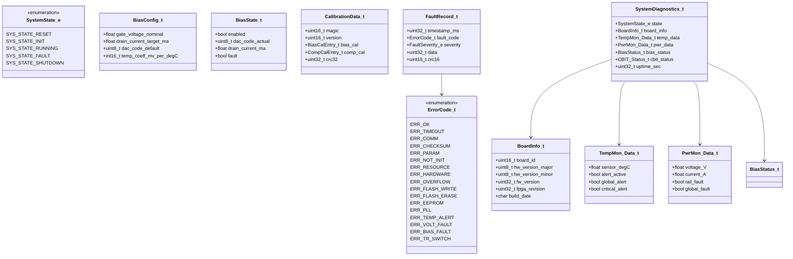

### 2.3.2 Complete Enumeration Definitions

```c
/* System State Machine */
typedef enum {
    SYS_STATE_RESET    = 0,
    SYS_STATE_INIT     = 1,
    SYS_STATE_RUNNING  = 2,
    SYS_STATE_FAULT    = 3,
    SYS_STATE_SHUTDOWN = 4
} SystemState_e;

/* Error Codes — positive values are success, negative are errors */
typedef enum {
    ERR_OK            = 0x00,
    ERR_TIMEOUT       = 0x01,
    ERR_COMM          = 0x02,
    ERR_CHECKSUM      = 0x03,
    ERR_PARAM         = 0x04,
    ERR_NOT_INIT      = 0x05,
    ERR_RESOURCE      = 0x06,
    ERR_HARDWARE      = 0x07,
    ERR_OVERFLOW      = 0x08,
    ERR_FLASH_WRITE   = 0x0A,
    ERR_FLASH_ERASE   = 0x0B,
    ERR_EEPROM        = 0x0C,
    ERR_PLL           = 0x0D,
    ERR_TEMP_ALERT    = 0x0E,
    ERR_VOLT_FAULT    = 0x0F,
    ERR_BIAS_FAULT    = 0x10,
    ERR_TR_SWITCH     = 0x11,
    ERR_COMP_CONFIG   = 0x12,
    ERR_WDT           = 0x13
} ErrorCode_t;

/* Fault Severity Levels */
typedef enum {
    FAULT_SEVERITY_INFO     = 0,
    FAULT_SEVERITY_WARNING  = 1,
    FAULT_SEVERITY_ERROR    = 2,
    FAULT_SEVERITY_CRITICAL = 3
} FaultSeverity_e;

/* LED Patterns */
typedef enum {
    LED_PATTERN_OFF        = 0,
    LED_PATTERN_ON         = 1,
    LED_PATTERN_BLINK_SLOW = 2,
    LED_PATTERN_BLINK_FAST = 3,
    LED_PATTERN_FLASH_ONCE = 4
} LEDPattern_e;

/* T/R Switch States */
typedef enum {
    TR_STATE_RECEIVE  = 0,
    TR_STATE_TRANSMIT = 1
} TRSwitchState_e;

/* Command Parser States */
typedef enum {
    CMD_STATE_IDLE            = 0,
    CMD_STATE_WAIT_ADDR_H     = 1,
    CMD_STATE_WAIT_ADDR_L     = 2,
    CMD_STATE_WAIT_DATA_H     = 3,
    CMD_STATE_WAIT_DATA_L     = 4,
    CMD_STATE_WAIT_COUNT      = 5,
    CMD_STATE_WAIT_BULK_DATA_H = 6,
    CMD_STATE_WAIT_BULK_DATA_L = 7,
    CMD_STATE_EXECUTE         = 8
} CmdParserState_e;
```

### 2.3.3 Calibration Data Structure

```c
#define CAL_DATA_MAGIC          (0xCA1FU)
#define CAL_DATA_VERSION        (0x0100U)

typedef struct {
    float gain_target_db;
    float phase_target_deg;
    uint8_t gate_bias_dac_code;
    uint8_t phase_trim_code;
    uint8_t amp_trim_code;
    uint8_t reserved;
} BiasCalEntry_t;

typedef struct {
    uint8_t phase_trim_code;
    uint8_t amp_trim_code;
    int16_t phase_offset_deg_x100;
    int16_t amp_offset_db_x100;
} CompCalEntry_t;

typedef struct {
    uint16_t magic;                                     /* 0xCA1F */
    uint16_t version;                                   /* 0x0100 */
    BiasCalEntry_t bias_cal[4][2];                      /* [channel][stage] */
    CompCalEntry_t comp_cal[4];                         /* [channel] */
    TempMon_Config_t temp_thresholds;
    PwrMon_Thresholds_t pwr_thresholds;
    uint32_t crc32;                                     /* CRC over entire struct excluding this field */
} CalibrationData_t;
```

---

## 2.4 Dependency Viewpoint — Module Dependencies

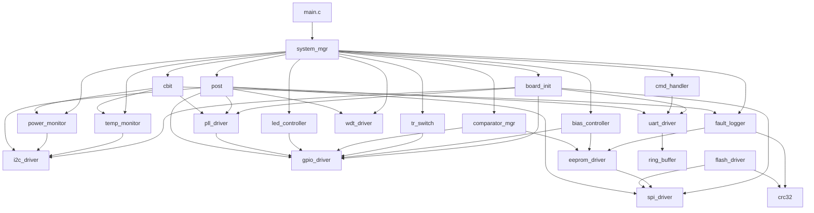

### 2.4.1 Build Order

The compilation and linking order follows the dependency graph from leaves to root:

1. **Utility Layer**: crc32.c, ring_buffer.c (no dependencies)
2. **HAL Layer**: uart_driver.c, spi_driver.c, i2c_driver.c, gpio_driver.c, wdt_driver.c (depend on BSP constants only)
3. **Device Driver Layer**: eeprom_driver.c, flash_driver.c, pll_driver.c (depend on SPI, GPIO)
4. **Middleware Layer**: cmd_handler.c, temp_monitor.c, power_monitor.c, bias_controller.c, tr_switch.c, comparator_mgr.c, led_controller.c, fault_logger.c (depend on HAL and drivers)
5. **Application Layer**: post.c, cbit.c, system_mgr.c (depend on all lower layers)
6. **Entry Point**: main.c (depends on system_mgr)

---

## 2.5 Interface Viewpoint — Complete API Specification

This section provides the full API contract for every public function. Each specification includes the function signature, parameter descriptions with valid ranges, return values, preconditions, postconditions, thread safety notes, and usage examples.

### 2.5.1 Board Init API

```c
/**
 * @brief Perform complete board-level initialization.
 *
 * Executes the following sequence:
 * 1. Enable MicroBlaze instruction and data caches
 * 2. Configure FPGA register base address mapping
 * 3. Verify FPGA fabric revision ID against expected value
 * 4. Initialize interrupt controller (Xilinx INTC)
 * 5. Populate board info structure
 *
 * @param  void
 * @return int32_t Error code:
 *         - ERR_OK: All initialization steps completed successfully
 *         - ERR_HARDWARE: FPGA revision mismatch (read value != 0x0100A701)
 *
 * @pre  Processor is out of reset, stack pointer initialized by crt0.
 * @post All HAL modules are ready for Init() calls. Board_IsInitialized() returns true.
 * @note Not thread-safe. Must be called exactly once at startup before any other API.
 *
 * @example
 *   int32_t ret = Board_Init();


 *   if (ret != ERR_OK) {
 *       /@ * FATAL: Board initialization failed. Halt or trigger WDT reset. *@ /
 *       while (1) { /@ * Wait for WDT *@ / }
 *   }
 */
int32_t Board_Init(void);
```

```c
/**
 * @brief Retrieve board identification and version information.
 *
 * @param[out] info Pointer to BoardInfo_t structure to populate. Must not be NULL.
 * @return int32_t Error code:
 *         - ERR_OK: Info retrieved successfully
 *         - ERR_PARAM: info pointer is NULL
 *         - ERR_NOT_INIT: Board_Init() has not been called
 *
 * @pre  Board_Init() must have been called successfully.
 * @post info structure is populated with current board data.
 * @note Thread-safe for concurrent reads after initialization.
 */
int32_t Board_GetVersion(BoardInfo_t *info);
```

```c
/**
 * @brief Execute Power-On Self-Test and return pass/fail mask.
 *
 * Iterates through all POST sub-tests defined by POST_BIT_xxx macros.
 * Tests I2C bus connectivity, SPI device IDs, UART loopback, and GPIO toggling.
 *
 * @param[out] test_mask Pointer to uint32_t bitmask of POST results.
 *             Bit set (1) = test passed. Bit clear (0) = test failed.
 * @return int32_t Error code:
 *         - ERR_OK: All critical tests passed
 *         - ERR_HARDWARE: One or more critical tests failed
 *         - ERR_PARAM: test_mask is NULL
 *
 * @pre  Board_Init() completed. All HAL drivers initialized.
 * @post System state is fully verified.
 */
int32_t Board_SelfTest(uint32_t *test_mask);
```

```c
/**
 * @brief Check if board initialization has completed successfully.
 * @return true if Board_Init() completed, false otherwise.
 */
bool Board_IsInitialized(void);
```

```c
/**
 * @brief Perform emergency hardware shutdown of all RF paths.
 *
 * Disables all MMIC bias DACs, sets T/R switches to receive mode,
 * turns off STATUS and RF LEDs, activates FAULT LED, and disables
 * the PLL clock outputs.
 *
 * @param  void
 * @return void
 *
 * @pre  None. Can be called from any state, including fault conditions.
 * @post All RF outputs are muted. System is in a safe, benign state.
 * @note This function does not return an error code. It acts as a
 *       best-effort emergency shutdown mechanism.
 */
void Board_EmergencyShutdown(void);
```

### 2.5.2 UART Driver API

```c
/**
 * @brief Initialize the UART peripheral for register protocol communication.
 *
 * Configures the Xilinx UART Lite IP core, sets the baud rate,
 * enables the RX FIFO interrupt, and initializes the internal
 * ring buffers.
 *
 * @param baud_rate Target baud rate in bits/second.
 *                  Valid range: 115200 or 12000000.
 * @return int32_t Error code:
 *         - ERR_OK: UART initialized successfully
 *         - ERR_PARAM: baud_rate is not a supported value
 *         - ERR_HARDWARE: UART IP core did not respond
 *
 * @pre  Board_Init() completed. System clock is stable at 100 MHz.
 * @post UART is ready for UART_WriteByte/UART_ReadByte calls.
 * @note Not thread-safe. Call only during initialization phase.
 *
 * @example
 *   if (UART_Init(115200) != ERR_OK) { FATAL_ERROR(); }
 */
int32_t UART_Init(uint32_t baud_rate);
```

```c
/**
 * @brief Transmit a single byte (blocking with timeout).
 *
 * @param byte       The byte to transmit (0x00 to 0xFF).
 * @param timeout_ms Maximum time to wait for TX FIFO space.
 *                   Valid range: 1 to 10000 ms. 0 = non-blocking.
 * @return int32_t Error code:
 *         - ERR_OK: Byte transmitted to FIFO
 *         - ERR_TIMEOUT: TX FIFO full for longer than timeout_ms
 *         - ERR_NOT_INIT: UART not initialized
 */
int32_t UART_WriteByte(uint8_t byte, uint32_t timeout_ms);
```

```c
/**
 * @brief Receive a single byte (blocking with timeout).
 *
 * @param[out] byte_out Pointer to store received byte. Must not be NULL.
 * @param timeout_ms    Maximum time to wait for RX data.
 * @return int32_t Error code:
 *         - ERR_OK: Byte read successfully
 *         - ERR_TIMEOUT: No data received within timeout
 *         - ERR_PARAM: byte_out is NULL
 */
int32_t UART_ReadByte(uint8_t *byte_out, uint32_t timeout_ms);
```

```c
/**
 * @brief Transmit a buffer of bytes (blocking).
 *
 * @param data       Pointer to data buffer to transmit. Must not be NULL.
 * @param len        Number of bytes to transmit (1 to 65535).
 * @param timeout_ms Total timeout for the entire transfer.
 * @return int32_t Error code:
 *         - ERR_OK: All bytes transmitted
 *         - ERR_TIMEOUT: Transfer did not complete in time
 *         - ERR_PARAM: data is NULL or len is 0
 */
int32_t UART_WriteBuffer(const uint8_t *data, uint16_t len, uint32_t timeout_ms);
```

```c
/**
 * @brief Receive a buffer of bytes (blocking).
 *
 * @param[out] buf_out Pointer to output buffer. Must not be NULL.
 * @param len          Number of bytes to receive (1 to 65535).
 * @param timeout_ms   Total timeout for the entire transfer.
 * @return int32_t Error code:
 *         - ERR_OK: All bytes received
 *         - ERR_TIMEOUT: Transfer did not complete in time
 *         - ERR_PARAM: buf_out is NULL or len is 0
 */
int32_t UART_ReadBuffer(uint8_t *buf_out, uint16_t len, uint32_t timeout_ms);
```

```c
/**
 * @brief Query the UART driver status.
 * @param[out] status Pointer to UART_Status_t to populate.
 * @return ERR_OK on success, ERR_PARAM if status is NULL.
 */
int32_t UART_GetStatus(UART_Status_t *status);
```

```c
/**
 * @brief UART interrupt service routine.
 *
 * Called by the MicroBlaze interrupt controller when RX FIFO is non-empty.
 * Reads all available bytes from the UART RX FIFO and pushes them into
 * the internal ring buffer. Starts TX interrupt if TX ring buffer has data.
 *
 * @note This function must NOT be called directly by application code.
 *       It is registered as the ISR callback during UART_Init().
 */
void UART_ISR(void);
```

```c
/**
 * @brief Set the UART baud rate dynamically.
 * @param baud_rate New baud rate (115200 or 12000000).
 * @return ERR_OK on success, ERR_PARAM if baud_rate invalid.
 */
int32_t UART_SetBaudRate(uint32_t baud_rate);
```

```c
/**
 * @brief Deinitialize the UART peripheral and disable interrupts.
 * @return ERR_OK on success.
 */
int32_t UART_Deinit(void);
```

### 2.5.3 SPI Driver API

```c
/**
 * @brief Initialize the SPI master controller.
 *
 * @param clock_hz SPI clock frequency in Hz.
 *                 Valid: 10000000 (EEPROM) or 50000000 (Flash).
 * @param cpol     Clock polarity (0 or 1). Must be 0 for this hardware.
 * @param cpha     Clock phase (0 or 1). Must be 0 for this hardware.
 * @return int32_t Error code:
 *         - ERR_OK: SPI initialized
 *         - ERR_PARAM: Invalid clock_hz, cpol, or cpha
 *         - ERR_HARDWARE: SPI IP core not responding
 *
 * @pre  Board_Init() completed.
 * @post SPI bus is idle, all chip selects de-asserted (high).
 */
int32_t SPI_Init(uint32_t clock_hz, uint8_t cpol, uint8_t cpha);
```

```c
/**
 * @brief Perform a full-duplex SPI transfer.
 *
 * Clocks out tx_data bytes while simultaneously reading in rx_data bytes.
 * Either tx_data or rx_data may be NULL for half-duplex operation.
 * Chip select must be managed externally via SPI_ChipSelect().
 *
 * @param tx_data Pointer to TX data buffer. NULL for RX-only transfer.
 * @param rx_data Pointer to RX data buffer. NULL for TX-only transfer.
 * @param len     Number of bytes to transfer (1 to 65535).
 * @return int32_t Error code:
 *         - ERR_OK: Transfer completed
 *         - ERR_TIMEOUT: Transfer stalled longer than 500ms
 *         - ERR_PARAM: len is 0
 *         - ERR_NOT_INIT: SPI not initialized
 */
int32_t SPI_Transfer(const uint8_t *tx_data, uint8_t *rx_data, uint16_t len);
```

```c
/**
 * @brief Assert or de-assert a specific chip select line.
 * @param cs_idx Chip select index. Valid: 0 (EEPROM) or 1 (Flash).
 * @param active true to assert CS (drive low), false to de-assert (drive high).
 * @return int32_t Error code:
 *         - ERR_OK: CS state changed
 *         - ERR_PARAM: cs_idx > 1
 *         - ERR_NOT_INIT: SPI not initialized
 */
int32_t SPI_ChipSelect(uint8_t cs_idx, bool active);
```

```c
/**
 * @brief Deinitialize the SPI controller.
 * De-asserts all CS lines and disables the SPI IP core.
 * @return ERR_OK on success.
 */
int32_t SPI_Deinit(void);
```

### 2.5.4 I2C Driver API

```c
/**
 * @brief Initialize the I2C master controller.
 * @param clock_hz I2C clock frequency in Hz. Valid: 400000 (Fast Mode).
 * @return int32_t Error code:
 *         - ERR_OK: I2C initialized
 *         - ERR_PARAM: Invalid clock_hz
 *         - ERR_HARDWARE: I2C IP core not responding
 *
 * @pre  Board_Init() completed.
 * @post I2C bus is idle (SCL and SDA high).
 */
int32_t I2C_Init(uint32_t clock_hz);
```

```c
/**
 * @brief Write data to an I2C device.
 *
 * @param dev_addr 7-bit I2C device address (0x00 to 0x7F).
 * @param data     Pointer to data buffer. Must not be NULL.
 * @param len      Number of bytes to write (1 to 255).
 * @return int32_t Error code:
 *         - ERR_OK: Write completed with ACK from device
 *         - ERR_TIMEOUT: No response within 50ms
 *         - ERR_COMM: NACK received from device
 *         - ERR_PARAM: Invalid parameters
 */
int32_t I2C_Write(uint8_t dev_addr, const uint8_t *data, uint8_t len);
```

```c
/**
 * @brief Read data from an I2C device.
 *
 * @param dev_addr 7-bit I2C device address.
 * @param[out] buf Pointer to buffer for received data. Must not be NULL.
 * @param len      Number of bytes to read (1 to 255).
 * @return int32_t Error code:
 *         - ERR_OK: Read completed
 *         - ERR_TIMEOUT: Device did not respond
 *         - ERR_COMM: NACK received
 */
int32_t I2C_Read(uint8_t dev_addr, uint8_t *buf, uint8_t len);
```

```c
/**
 * @brief Write a value to an I2C device register.
 *
 * Sends: START + dev_addr(W) + reg_addr + val + STOP.
 *
 * @param dev_addr 7-bit device address.
 * @param reg_addr 8-bit register address.
 * @param val      Value to write (0x00 to 0xFF).
 * @return ERR_OK on success, ERR_COMM/ERR_TIMEOUT on failure.
 */
int32_t I2C_WriteReg(uint8_t dev_addr, uint8_t reg_addr, uint8_t val);
```

```c
/**
 * @brief Read a value from an I2C device register.
 *
 * Sends: START + dev_addr(W) + reg_addr + RESTART + dev_addr(R) + val + STOP.
 *
 * @param dev_addr     7-bit device address.
 * @param reg_addr     8-bit register address.
 * @param[out] val_out Pointer to store read value. Must not be NULL.
 * @return ERR_OK on success, ERR_COMM/ERR_TIMEOUT on failure.
 */
int32_t I2C_ReadReg(uint8_t dev_addr, uint8_t reg_addr, uint8_t *val_out);
```

```c
/**
 * @brief Read a 16-bit value from an I2C device register (MSB first).
 *
 * @param dev_addr     7-bit device address.
 * @param reg_addr     8-bit register address.
 * @param[out] val_out Pointer to store 16-bit value. Must not be NULL.
 * @return ERR_OK on success.
 */
int32_t I2C_ReadReg16(uint8_t dev_addr, uint8_t reg_addr, uint16_t *val_out);
```

```c
/**
 * @brief Perform I2C bus recovery.
 *
 * Toggles SCL through 9 clock cycles with SDA held high to release
 * any stuck device. Re-initializes the I2C controller afterwards.
 *
 * @return ERR_OK on success.
 */
int32_t I2C_BusRecovery(void);
```

```c
/**
 * @brief Deinitialize the I2C controller.
 * @return ERR_OK on success.
 */
int32_t I2C_Deinit(void);
```

### 2.5.5 GPIO Driver API

```c
/**
 * @brief Initialize the GPIO controller and set all outputs to safe defaults.
 *
 * Safe default state:
 * - All bias DAC data bits = 0x00
 * - All T/R switches = RX mode (bits high)
 * - All comparator control = 0x00
 * - All LEDs = OFF
 *
 * @return ERR_OK on success, ERR_HARDWARE if GPIO IP core not responding.
 *
 * @pre  Board_Init() completed.
 * @post All outputs are in the safe default state.
 */
int32_t GPIO_Init(void);
```

```c
/**
 * @brief Set specified GPIO bits (atomic read-modify-write).
 *
 * @param bits Mask of bits to set (1 = set, 0 = unchanged).
 * @return ERR_OK on success, ERR_NOT_INIT if GPIO not initialized.
 */
int32_t GPIO_SetBits(uint32_t bits);
```

```c
/**
 * @brief Clear specified GPIO bits (atomic read-modify-write).
 * @param bits Mask of bits to clear (1 = clear, 0 = unchanged).
 * @return ERR_OK on success.
 */
int32_t GPIO_ClearBits(uint32_t bits);
```

```c
/**
 * @brief Toggle specified GPIO bits.
 * @param bits Mask of bits to toggle.
 * @return ERR_OK on success.
 */
int32_t GPIO_ToggleBits(uint32_t bits);
```

```c
/**
 * @brief Write the full 32-bit GPIO output register.
 * @param value Full register value to write.
 * @return ERR_OK on success.
 */
int32_t GPIO_Write(uint32_t value);
```

```c
/**
 * @brief Read the full 32-bit GPIO register.
 * @param[out] value Pointer to store register value. Must not be NULL.
 * @return ERR_OK on success, ERR_PARAM if value is NULL.
 */
int32_t GPIO_Read(uint32_t *value);
```

```c
/**
 * @brief Read only the GPIO input bits.
 * @param[out] value Pointer to store input value. Must not be NULL.
 * @return ERR_OK on success.
 */
int32_t GPIO_ReadInputs(uint32_t *value);
```

### 2.5.6 Watchdog Driver API

```c
/**
 * @brief Initialize the watchdog timer.
 *
 * @param timeout_ms Timeout period in milliseconds.
 *                   Valid range: 100 to 30000 ms. Recommended: 5000 ms.
 * @return int32_t Error code:
 *         - ERR_OK: WDT initialized
 *         - ERR_PARAM: timeout_ms outside valid range
 *
 * @pre  Board_Init() completed.
 * @post WDT is configured but NOT yet enabled. Call WDT_Enable() to start.
 */
int32_t WDT_Init(uint32_t timeout_ms);
```

```c
/**
 * @brief Pet the watchdog timer to prevent system reset.
 *
 * Must be called at least once every timeout_ms period after WDT_Enable().
 * Failure to pet within the timeout generates a full MicroBlaze reset.
 *
 * @return int32_t Error code:
 *         - ERR_OK: WDT petted successfully
 *         - ERR_NOT_INIT: WDT not initialized
 */
int32_t WDT_Pet(void);
```

```c
/**
 * @brief Check if the current boot was caused by a watchdog reset.
 * @return true if the previous reset was a WDT timeout, false otherwise.
 */
bool WDT_WasResetCause(void);
```

```c
/**
 * @brief Enable the watchdog timer.
 * @return ERR_OK on success.
 */
int32_t WDT_Enable(void);
```

```c
/**
 * @brief Disable the watchdog timer.
 *
 * @return ERR_OK on success.
 * @warning Only available in DEBUG builds. WDT cannot be disabled in RELEASE.
 */
int32_t WDT_Disable(void);
```

### 2.5.7 Flash Driver API

```c
/**
 * @brief Initialize the flash driver.
 *
 * Verifies communication by reading the S25FL064L JEDEC ID.
 * Expected ID: Manufacturer=0x01 (Spansion), Type=0x60, Capacity=0x17.
 *
 * @return int32_t Error code:
 *         - ERR_OK: Flash detected and ready
 *         - ERR_HARDWARE: JEDEC ID mismatch or SPI failure
 */
int32_t Flash_Init(void);
```

```c
/**
 * @brief Read the flash JEDEC ID.
 * @param[out] id_out Pointer to store 24-bit ID (MSB: manufacturer).
 * @return ERR_OK on success.
 */
int32_t Flash_ReadID(uint32_t *id_out);
```

```c
/**
 * @brief Read data from flash memory.
 *
 * @param addr   Starting byte address (0x000000 to 0x7FFFFF).
 * @param[out] buf Output buffer. Must not be NULL.
 * @param len    Number of bytes to read (1 to 0x800000).
 * @return int32_t Error code:
 *         - ERR_OK: Data read successfully
 *         - ERR_PARAM: addr+len exceeds flash size or buf is NULL
 */
int32_t Flash_Read(uint32_t addr, uint8_t *buf, uint32_t len);
```

```c
/**
 * @brief Write a page (up to 256 bytes) to flash memory.
 *
 * Requires that the target sector is already erased (all 0xFF).
 * Automatically sets Write Enable before programming.
 *
 * @param addr Starting byte address (must be within flash range).
 * @param data Pointer to data to write. Must not be NULL.
 * @param len  Number of bytes to write (1 to 256, must not cross page boundary).
 * @return int32_t Error code:
 *         - ERR_OK: Page programmed successfully
 *         - ERR_FLASH_WRITE: Program failed or verify failed
 *         - ERR_PARAM: Invalid parameters
 */
int32_t Flash_WritePage(uint32_t addr, const uint8_t *data, uint32_t len);
```

```c
/**
 * @brief Erase a 64 KB sector.
 *
 * @param sector_addr Any address within the sector to erase.
 *                    Sector aligned to 64 KB boundary.
 * @return int32_t Error code:
 *         - ERR_OK: Sector erased
 *         - ERR_FLASH_ERASE: Erase timeout (3 seconds)
 */
int32_t Flash_EraseSector(uint32_t sector_addr);
```

```c
/**
 * @brief Erase the entire flash chip (8 MB).
 * @return ERR_OK on success, ERR_FLASH_ERASE on timeout.
 */
int32_t Flash_EraseChip(void);
```

```c
/**
 * @brief Wait until the flash is no longer busy.
 * @param timeout_ms Maximum wait time.
 * @return ERR_OK if ready, ERR_TIMEOUT if still busy.
 */
int32_t Flash_WaitReady(uint32_t timeout_ms);
```

```c
/**
 * @brief Check if the flash is currently busy.
 * @return true if BUSY bit set, false otherwise.
 */
bool Flash_IsBusy(void);
```

```c
/**
 * @brief Write data with CRC-32 readback verification.
 *
 * Automatically handles page alignment, multi-page writes,
 * sector erase if needed, and CRC verification.
 *
 * @param addr Starting address.
 * @param data Pointer to data to write.
 * @param len  Total bytes to write.
 * @return ERR_OK if write and CRC verify pass, ERR_CHECKSUM on mismatch.
 */
int32_t Flash_WriteWithVerify(uint32_t addr, const uint8_t *data, uint32_t len);
```

### 2.5.8 EEPROM Driver API

```c
/**
 * @brief Initialize the EEPROM driver.
 *
 * Verifies communication by reading a known calibration magic word.
 *
 * @return ERR_OK on success, ERR_HARDWARE on SPI failure.
 */
int32_t EEPROM_Init(void);
```

```c
/**
 * @brief Read a single byte from EEPROM.
 * @param addr     Address (0x0000 to 0x07FF).
 * @param[out] data_out Pointer to store byte. Must not be NULL.
 * @return ERR_OK on success, ERR_PARAM if addr out of range.
 */
int32_t EEPROM_ReadByte(uint16_t addr, uint8_t *data_out);
```

```c
/**
 * @brief Write a single byte to EEPROM.
 * @param addr Address (0x0000 to 0x07FF).
 * @param data Byte value to write.
 * @return ERR_OK on success.
 */
int32_t EEPROM_WriteByte(uint16_t addr, uint8_t data);
```

```c
/**
 * @brief Read a block of bytes from EEPROM.
 * @param addr     Starting address.
 * @param[out] buf Output buffer. Must not be NULL.
 * @param len      Number of bytes (1 to 2048).
 * @return ERR_OK on success.
 */
int32_t EEPROM_ReadBlock(uint16_t addr, uint8_t *buf, uint16_t len);
```

```c
/**
 * @brief Write a block of bytes to EEPROM (handles page boundary crossing).
 * @param addr Starting address.
 * @param data Pointer to data. Must not be NULL.
 * @param len  Number of bytes (1 to 2048).
 * @return ERR_OK on success.
 */
int32_t EEPROM_WriteBlock(uint16_t addr, const uint8_t *data, uint16_t len);
```

```c
/**
 * @brief Read the calibration data structure from EEPROM.
 * @param[out] cal Pointer to CalibrationData_t. Must not be NULL.
 * @return ERR_OK on success, ERR_CHECKSUM if CRC fails.
 */
int32_t EEPROM_ReadCalibration(CalibrationData_t *cal);
```

```c
/**
 * @brief Write the calibration data structure to EEPROM with CRC.
 * @param cal Pointer to CalibrationData_t. Must not be NULL.
 * @return ERR_OK on success.
 */
int32_t EEPROM_WriteCalibration(const CalibrationData_t *cal);
```

### 2.5.9 PLL Driver API

```c
/**
 * @brief Initialize the clock PLL.
 *
 * @param cfg Pointer to PLL_Config_t. Must not be NULL.
 * @return int32_t Error code:
 *         - ERR_OK: PLL configured and locked
 *         - ERR_PLL: PLL failed to lock within 100ms
 *         - ERR_PARAM: cfg is NULL or contains invalid dividers
 */
int32_t PLL_Init(const PLL_Config_t *cfg);
```

```c
/**
 * @brief Change the PLL output frequency dynamically.
 *
 * @param freq_hz Target frequency in Hz.
 * @return ERR_OK on success, ERR_PLL if lock fails.
 */
int32_t PLL_SetFrequency(uint32_t freq_hz);
```

```c
/**
 * @brief Wait for PLL to achieve lock.
 * @param timeout_ms Maximum wait time.
 * @return ERR_OK if locked, ERR_TIMEOUT if not locked in time.
 */
int32_t PLL_WaitLock(uint32_t timeout_ms);
```

```c
/**
 * @brief Check if PLL is currently locked.
 * @return true if LOCKED bit is set, false otherwise.
 */
bool PLL_IsLocked(void);
```

```c
/**
 * @brief Reset the PLL and re-apply the last configuration.
 * @return ERR_OK on success.
 */
int32_t PLL_Reset(void);
```

```c
/**
 * @brief Get the current PLL configuration.
 * @param[out] cfg_out Pointer to store config. Must not be NULL.
 * @return ERR_OK on success.
 */
int32_t PLL_GetConfig(PLL_Config_t *cfg_out);
```

### 2.5.10 Command Handler API

```c
/**
 * @brief Initialize the command handler.
 *
 * Resets the parser state machine to IDLE, clears error counters.
 *
 * @return ERR_OK on success.
 */
int32_t CmdHandler_Init(void);
```

```c
/**
 * @brief Process incoming UART data and execute commands.
 *
 * Must be called repeatedly from the main loop (at least every 1 ms).
 * Reads available bytes from the UART RX ring buffer, feeds them
 * through the parser state machine, and executes register operations.
 *
 * @return void
 *
 * @pre  UART_Init() and CmdHandler_Init() completed.
 * @post Completed commands are executed. Responses are transmitted.
 */
void CmdHandler_Process(void);
```

```c
/**
 * @brief Execute a register write command.
 * @param addr Register address (0x0000 to 0xFFFF).
 * @param data 16-bit data value to write.
 * @return ERR_OK on success, ERR_PARAM if address invalid.
 */
int32_t CmdHandler_ExecuteWrite(uint16_t addr, uint16_t data);
```

```c
/**
 * @brief Execute a register read command.
 * @param addr     Register address.
 * @param[out] data_out Pointer to store 16-bit value.
 * @return ERR_OK on success.
 */
int32_t CmdHandler_ExecuteRead(uint16_t addr, uint16_t *data_out);
```

```c
/**
 * @brief Execute a bulk register write command.
 * @param start_addr Starting register address.
 * @param data       Pointer to array of 16-bit values.
 * @param count      Number of registers to write (1 to 64).
 * @return ERR_OK on success.
 */
int32_t CmdHandler_ExecuteBulkWrite(uint16_t start_addr, const uint16_t *data, uint8_t count);
```

```c
/**
 * @brief Execute a bulk register read command.
 * @param start_addr Starting register address.
 * @param[out] buf_out Pointer to output array.
 * @param count    Number of registers to read (1 to 64).
 * @return ERR_OK on success.
 */
int32_t CmdHandler_ExecuteBulkRead(uint16_t start_addr, uint16_t *buf_out, uint8_t count);
```

### 2.5.11 Temperature Monitor API

```c
/**
 * @brief Initialize the temperature monitoring subsystem.
 *
 * Configures all 5 LM75B sensors: sets OS (Overtemperature Shutdown)
 * threshold and hysteresis via I2C. Begins periodic polling.
 *
 * @param cfg Pointer to TempMon_Config_t. Must not be NULL.
 * @return ERR_OK on success, ERR_COMM if any sensor fails to respond.
 */
int32_t TempMon_Init(const TempMon_Config_t *cfg);
```

```c
/**
 * @brief Read all temperature sensors.
 * @param[out] data_out Pointer to TempMon_Data_t. Must not be NULL.
 * @return ERR_OK on success, ERR_COMM on partial failure.
 */
int32_t TempMon_ReadAll(TempMon_Data_t *data_out);
```

```c
/**
 * @brief Read a single temperature sensor.
 * @param sensor_idx   Sensor index (0 to 4).
 * @param[out] temp_degC Pointer to store temperature in Celsius.
 * @return ERR_OK on success, ERR_PARAM if index invalid.
 */
int32_t TempMon_ReadSensor(uint8_t sensor_idx, float *temp_degC);
```

```c
/**
 * @brief Set temperature alert thresholds.
 * @param high_degC High threshold in Celsius (-55.0 to 125.0).
 * @param low_degC  Low threshold in Celsius.
 * @return ERR_OK on success, ERR_PARAM if values invalid.
 */
int32_t TempMon_SetAlertThresh(float high_degC, float low_degC);
```

```c
/**
 * @brief Check if any temperature alert is active.
 * @return true if any sensor exceeds threshold, false otherwise.
 */
bool TempMon_IsAlert(void);
```

```c
/**
 * @brief Periodic temperature monitoring task handler.
 * Called every 1000 ms by the system manager task scheduler.
 */
void TempMon_Task(void);
```

### 2.5.12 Power Monitor API

```c
/**
 * @brief Initialize the power monitoring subsystem.
 *
 * Configures all 3 INA219 devices: writes calibration registers,
 * sets operating mode to continuous shunt+bus voltage measurement.
 *
 * @param cfg Pointer to PwrMon_Config_t. Must not be NULL.
 * @return ERR_OK on success, ERR_COMM if any device fails.
 */
int32_t PwrMon_Init(const PwrMon_Config_t *cfg);
```

```c
/**
 * @brief Read a single power rail measurement.
 * @param rail_idx    Rail index (0=5V, 1=3.3V, 2=1.8V).
 * @param[out] voltage_V Pointer to store voltage in Volts.
 * @param[out] current_A Pointer to store current in Amps.
 * @return ERR_OK on success.
 */
int32_t PwrMon_ReadRail(uint8_t rail_idx, float *voltage_V, float *current_A);
```

```c
/**
 * @brief Read all power rails.
 * @param[out] data_out Pointer to PwrMon_Data_t. Must not be NULL.
 * @return ERR_OK on success.
 */
int32_t PwrMon_ReadAll(PwrMon_Data_t *data_out);
```

```c
/**
 * @brief Check if any power rail fault is active.
 * @return true if voltage out of tolerance or over-current.
 */
bool PwrMon_IsFault(void);
```

```c
/**
 * @brief Periodic power monitoring task handler.
 * Called every 500 ms by the system manager task scheduler.
 */
void PwrMon_Task(void);
```

```c
/**
 * @brief Set voltage and current fault thresholds.
 * @param thresh Pointer to PwrMon_Thresholds_t. Must not be NULL.
 * @return ERR_OK on success.
 */
int32_t PwrMon_SetThresholds(const PwrMon_Thresholds_t *thresh);
```

### 2.5.13 Bias Controller API

```c
/**
 * @brief Initialize the bias controller.
 * Loads default bias configurations for all 8 MMIC stages.
 * All biases are in the DISABLED state after initialization.
 * @return ERR_OK on success.
 */
int32_t Bias_Init(void);
```

```c
/**
 * @brief Configure a specific bias channel.
 * @param channel Channel index (0 to 3).
 * @param stage   Stage index (0=LNA, 1=Gain Block).
 * @param cfg     Pointer to BiasConfig_t. Must not be NULL.
 * @return ERR_OK on success, ERR_PARAM if channel/stage invalid.
 */
int32_t Bias_SetChannel(uint8_t channel, uint8_t stage, const BiasConfig_t *cfg);
```

```c
/**
 * @brief Enable bias for a specific channel and stage.
 * @param channel Channel index (0 to 3).
 * @param stage   Stage index (0 or 1).
 * @return ERR_OK on success, ERR_BIAS_FAULT if drain current out of range.
 */
int32_t Bias_EnableChannel(uint8_t channel, uint8_t stage);
```

```c
/**
 * @brief Disable bias for a specific channel and stage.
 * @param channel Channel index (0 to 3).
 * @param stage   Stage index (0 or 1).
 * @return ERR_OK on success.
 */
int32_t Bias_DisableChannel(uint8_t channel, uint8_t stage);
```

```c
/**
 * @brief Enable bias for all channels and stages.
 * @return ERR_OK on success, ERR_BIAS_FAULT if any stage fails.
 */
int32_t Bias_EnableAll(void);
```

```c
/**
 * @brief Disable bias for all channels and stages.
 * @return ERR_OK on success.
 */
int32_t Bias_DisableAll(void);
```

```c
/**
 * @brief Apply temperature compensation to all bias setpoints.
 * @param temp_degC Current board temperature in Celsius.
 * @return ERR_OK on success.
 */
int32_t Bias_ApplyTemperatureCompensation(float temp_degC);
```

```c
/**
 * @brief Periodic bias monitoring task handler.
 * Called every 1000 ms. Reads drain currents, checks for faults.
 */
void Bias_Task(void);
```

### 2.5.14 T/R Switch Controller API

```c
/**
 * @brief Initialize all T/R switches to receive mode.
 * @return ERR_OK on success.
 */
int32_t TR_Init(void);
```

```c
/**
 * @brief Set a single T/R switch state.
 * @param channel Channel index (0 to 3).
 * @param state   TR_STATE_RECEIVE or TR_STATE_TRANSMIT.
 * @return ERR_OK on success, ERR_TR_SWITCH if guard time not elapsed.
 */
int32_t TR_SetChannel(uint8_t channel, TRSwitchState_e state);
```

```c
/**
 * @brief Set all T/R switches to the same state.
 * @param state TR_STATE_RECEIVE or TR_STATE_TRANSMIT.
 * @return ERR_OK on success.
 */
int32_t TR_SetAll(TRSwitchState_e state);
```

```c
/**
 * @brief Get the current state of a T/R switch channel.
 * @param channel Channel index (0 to 3).
 * @return TRSwitchState_e current state.
 */
TRSwitchState_e TR_GetChannel(uint8_t channel);
```

### 2.5.15 LED Controller API

```c
/**
 * @brief Initialize LED controller. All LEDs off.
 * @return ERR_OK on success.
 */
int32_t LED_Init(void);
```

```c
/**
 * @brief Set the display pattern for a specific LED.
 * @param led_idx LED index (0=STATUS, 1=FAULT, 2=ACTIVITY, 3=RF).
 * @param pattern LED_PATTERN_OFF, ON, BLINK_SLOW, BLINK_FAST, or FLASH_ONCE.
 * @return ERR_OK on success, ERR_PARAM if led_idx out of range.
 */
int32_t LED_SetPattern(uint8_t led_idx, LEDPattern_e pattern);
```

```c
/**
 * @brief Turn all LEDs off.
 * @return ERR_OK on success.
 */
int32_t LED_SetAllOff(void);
```

```c
/**
 * @brief Periodic LED task handler.
 * Called every 100 ms to update blink patterns.
 */
void LED_Task(void);
```

### 2.5.16 Comparator Manager API

```c
/**
 * @brief Initialize the comparator manager.
 * Loads phase and amplitude trim settings from EEPROM calibration data.
 * @return ERR_OK on success.
 */
int32_t Comp_Init(void);
```

```c
/**
 * @brief Select the active monopulse comparator channel.
 * @param channel Channel index (0 to 3).
 * @return ERR_OK on success.
 */
int32_t Comp_SetChannel(uint8_t channel);
```

```c
/**
 * @brief Set phase trim code for a channel.
 * @param channel  Channel index (0 to 3).
 * @param trim_code Phase trim DAC code (0x00 to 0x0F).
 * @return ERR_OK on success.
 */
int32_t Comp_SetPhaseTrim(uint8_t channel, uint8_t trim_code);
```

```c
/**
 * @brief Set amplitude trim code for a channel.
 * @param channel  Channel index (0 to 3).
 * @param trim_code Amplitude trim code (0x00 to 0x03).
 * @return ERR_OK on success.
 */
int32_t Comp_SetAmpTrim(uint8_t channel, uint8_t trim_code);
```

```c
/**
 * @brief Load calibration data from EEPROM into the comparator.
 * @param cal Pointer to CalibrationData_t.
 * @return ERR_OK on success.
 */
int32_t Comp_LoadCalibration(const CalibrationData_t *cal);
```

### 2.5.17 Fault Logger API

```c
/**
 * @brief Initialize the fault logger.
 * Reads the circular buffer head pointer from EEPROM.
 * @return ERR_OK on success.
 */
int32_t FaultLog_Init(void);
```

```c
/**
 * @brief Record a fault event to EEPROM.
 * @param code     Error code identifying the fault type.
 * @param severity Severity level (INFO, WARNING, ERROR, CRITICAL).
 * @param data     Additional data value (e.g., temperature, voltage).
 * @return ERR_OK on success, ERR_EEPROM on write failure.
 */
int32_t FaultLog_Record(ErrorCode_t code, FaultSeverity_e severity, uint32_t data);
```

```c
/**
 * @brief Read a specific fault record from EEPROM.
 * @param record_idx Record index (0 = most recent).
 * @param[out] record Pointer to FaultRecord_t. Must not be NULL.
 * @return ERR_OK on success, ERR_PARAM if index out of range.
 */
int32_t FaultLog_Read(uint16_t record_idx, FaultRecord_t *record);
```

```c
/**
 * @brief Get the total number of fault records stored.
 * @param[out] count Pointer to store record count.
 * @return ERR_OK on success.
 */
int32_t FaultLog_GetCount(uint16_t *count);
```

```c
/**
 * @brief Clear all fault records.
 * @return ERR_OK on success.
 */
int32_t FaultLog_Clear(void);
```

### 2.5.18 POST API

```c
/**
 * @brief Execute the complete Power-On Self-Test sequence.
 * @param[out] result_mask Pointer to 32-bit pass/fail bitmask.
 * @return ERR_OK if all critical tests pass, ERR_HARDWARE otherwise.
 */
int32_t POST_Execute(uint32_t *result_mask);
```

```c
/**
 * @brief Convert a POST result mask to a human-readable string.
 * @param result_mask Bitmask from POST_Execute.
 * @param[out] buf    Output string buffer.
 * @param buf_len     Buffer length in bytes.
 * @return ERR_OK on success.
 */
int32_t POST_GetResultString(uint32_t result_mask, char *buf, uint16_t buf_len);
```

### 2.5.19 CBIT API

```c
/**
 * @brief Initialize the CBIT subsystem.
 * @return ERR_OK on success.
 */
int32_t CBIT_Init(void);
```

```c
/**
 * @brief Periodic CBIT task handler.
 * Called every 5000 ms. Verifies sensor connectivity and PLL lock.
 */
void CBIT_Task(void);
```

```c
/**
 * @brief Get the CBIT status.
 * @param[out] status Pointer to CBIT_Status_t.
 * @return ERR_OK on success.
 */
int32_t CBIT_GetStatus(CBIT_Status_t *status);
```

```c
/**
 * @brief Check if CBIT considers the system healthy.
 * @return true if no errors in last CBIT cycle, false otherwise.
 */
bool CBIT_IsHealthy(void);
```

### 2.5.20 System Manager API

```c
/**
 * @brief Initialize the system manager.
 *
 * Calls Board_Init(), initializes all drivers and middleware,
 * executes POST, and transitions to RUNNING state.
 *
 * @return ERR_OK on success, ERR_HARDWARE if POST fails.
 */
int32_t SysMgr_Init(void);
```

```c
/**
 * @brief Main system loop. Never returns.
 *
 * Implements the cooperative task scheduler. Calls periodic tasks
 * at their configured rates. Pets the watchdog. Transitions
 * between system states based on fault conditions.
 */
void SysMgr_Run(void);
```

```c
/**
 * @brief Get the current system state.
 * @return SystemState_e current state.
 */
SystemState_e SysMgr_GetState(void);
```

```c
/**
 * @brief Request a state transition.
 * @param new_state Requested target state.
 */
void SysMgr_RequestStateChange(SystemState_e new_state);
```

```c
/**
 * @brief 1 ms system tick handler.
 * Called from the timer ISR. Updates tick counters for task scheduling.
 * @note Must be called from ISR context only.
 */
void SysMgr_TickHandler(void);
```

```c
/**
 * @brief Get full system diagnostics structure.
 * @param[out] diag Pointer to SystemDiagnostics_t. Must not be NULL.
 * @return ERR_OK on success.
 */
int32_t SysMgr_GetDiagnostics(SystemDiagnostics_t *diag);
```

### 2.5.21 Utility APIs

```c
/**
 * @brief Compute CRC-32 (IEEE 802.3) over a data buffer.
 * @param data Pointer to data. Must not be NULL.
 * @param len  Number of bytes.
 * @return CRC-32 value.
 */
uint32_t CRC32_Compute(const uint8_t *data, uint32_t len);
```

```c
/**
 * @brief Continue a running CRC-32 computation.
 * @param crc  Previous CRC value (initial: 0xFFFFFFFF).
 * @param data Pointer to new data.
 * @param len  Number of new bytes.
 * @return Updated CRC-32 value.
 */
uint32_t CRC32_Continue(uint32_t crc, const uint8_t *data, uint32_t len);
```

```c
/**
 * @brief Verify data against an expected CRC-32.
 * @param data          Pointer to data.
 * @param len           Number of bytes.
 * @param expected_crc  Expected CRC value.
 * @return true if computed CRC matches expected_crc, false otherwise.
 */
bool CRC32_Verify(const uint8_t *data, uint32_t len, uint32_t expected_crc);
```

```c
/**
 * @brief Initialize a ring buffer.
 * @param rb      Pointer to RingBuffer_t. Must not be NULL.
 * @param storage Pointer to backing array. Must not be NULL.
 * @param size    Size of backing array. Must be a power of 2 (2 to 65536).
 * @return ERR_OK on success, ERR_PARAM if size is not power of 2.
 */
int32_t RingBuf_Init(RingBuffer_t *rb, uint8_t *storage, uint16_t size);
```

```c
/**
 * @brief Push a byte into the ring buffer.
 * @param rb   Pointer to RingBuffer_t.
 * @param byte Byte to push.
 * @return ERR_OK on success, ERR_OVERFLOW if buffer is full.
 */
int32_t RingBuf_Push(RingBuffer_t *rb, uint8_t byte);
```

```c
/**
 * @brief Pop a byte from the ring buffer.
 * @param rb        Pointer to RingBuffer_t.
 * @param[out] byte_out Pointer to store popped byte.
 * @return ERR_OK on success, ERR_RESOURCE if buffer is empty.
 */
int32_t RingBuf_Pop(RingBuffer_t *rb, uint8_t *byte_out);
```

```c
/**
 * @brief Get number of bytes currently in the ring buffer.
 * @param rb Pointer to RingBuffer_t.
 * @return uint16_t count of bytes.
 */
uint16_t RingBuf_Count(const RingBuffer_t *rb);
```

```c
/**
 * @brief Check if ring buffer is full.
 * @param rb Pointer to RingBuffer_t.
 * @return true if full, false otherwise.
 */
bool RingBuf_IsFull(const RingBuffer_t *rb);
```

```c
/**
 * @brief Check if ring buffer is empty.
 * @param rb Pointer to RingBuffer_t.
 * @return true if empty, false otherwise.
 */
bool RingBuf_IsEmpty(const RingBuffer_t *rb);
```

```c
/**
 * @brief Flush all data from the ring buffer.
 * @param rb Pointer to RingBuffer_t.
 * @return ERR_OK on success.
 */
int32_t RingBuf_Flush(RingBuffer_t *rb);
```

---

## 2.6 Interaction Viewpoint — Sequence Diagrams

### 2.6.1 System Startup Sequence

```mermaid
sequenceDiagram
    participant RST as Power-On Reset
    participant MAIN as main
    participant SYS as SysMgr
    participant BSP as Board_Init
    participant PLL as PLL_Init
    participant UART as UART_Init
    participant SPI as SPI_Init
    participant I2C as I2C_Init
    participant GPIO as GPIO_Init
    participant POST as POST_Execute
    participant CAL as EEPROM_ReadCal
    participant BIAS as Bias_EnableAll
    participant LED as LED_Init
    participant WDT as WDT_Enable
    participant LOOP as SysMgr_Run

    RST->>MAIN: Entry Point
    MAIN->>SYS: SysMgr_Init()
    SYS->>BSP: Board_Init()
    BSP->>BSP: Enable I-cache and D-cache
    BSP->>BSP: Set FPGA base address 0x40000000
    BSP->>BSP: Verify FPGA revision register
    BSP-->>SYS: ERR_OK
    SYS->>PLL: PLL_Init with 100MHz ref, 400MHz out
    PLL->>PLL: Write N divider, R divider
    PLL->>PLL: Enable PLL outputs
    PLL->>PLL: Poll LOCKED bit with 100ms timeout
    PLL-->>SYS: ERR_OK - PLL locked
    SYS->>UART: UART_Init with 115200 bps
    UART->>UART: Configure UART Lite IP
    UART->>UART: Enable RX interrupt
    UART-->>SYS: ERR_OK
    SYS->>SPI: SPI_Init with 10MHz, CPOL=0, CPHA=0
    SPI-->>SYS: ERR_OK
    SYS->>I2C: I2C_Init with 400kHz
    I2C-->>SYS: ERR_OK
    SYS->>GPIO: GPIO_Init
    GPIO->>GPIO: Set all outputs to safe defaults
    GPIO-->>SYS: ERR_OK
    SYS->>POST: POST_Execute with result_mask
    POST->>POST: Test FPGA revision
    POST->>POST: Test SPI EEPROM read ID
    POST->>POST: Test SPI Flash read ID
    POST->>POST: Test I2C all 5 temp sensors
    POST->>POST: Test I2C all 3 power monitors
    POST->>POST: Test GPIO loopback
    POST->>POST: Test PLL lock status
    POST-->>SYS: ERR_OK - all 16 tests passed
    SYS->>CAL: EEPROM_ReadCalibration
    CAL->>CAL: Read 256 bytes from EEPROM
    CAL->>CAL: Verify CRC-32
    CAL-->>SYS: ERR_OK - calibration loaded
    SYS->>BIAS: Bias_EnableAll
    BIAS->>BIAS: Set 8 DAC channels
    BIAS->>BIAS: Verify drain currents
    BIAS-->>SYS: ERR_OK
    SYS->>LED: LED_SetPattern STATUS = BLINK_SLOW
    SYS->>WDT: WDT_Enable with 5000ms
    WDT-->>SYS: ERR_OK
    SYS->>LOOP: SysMgr_Run - enter main loop
```

### 2.6.2 UART Register Write Command Sequence

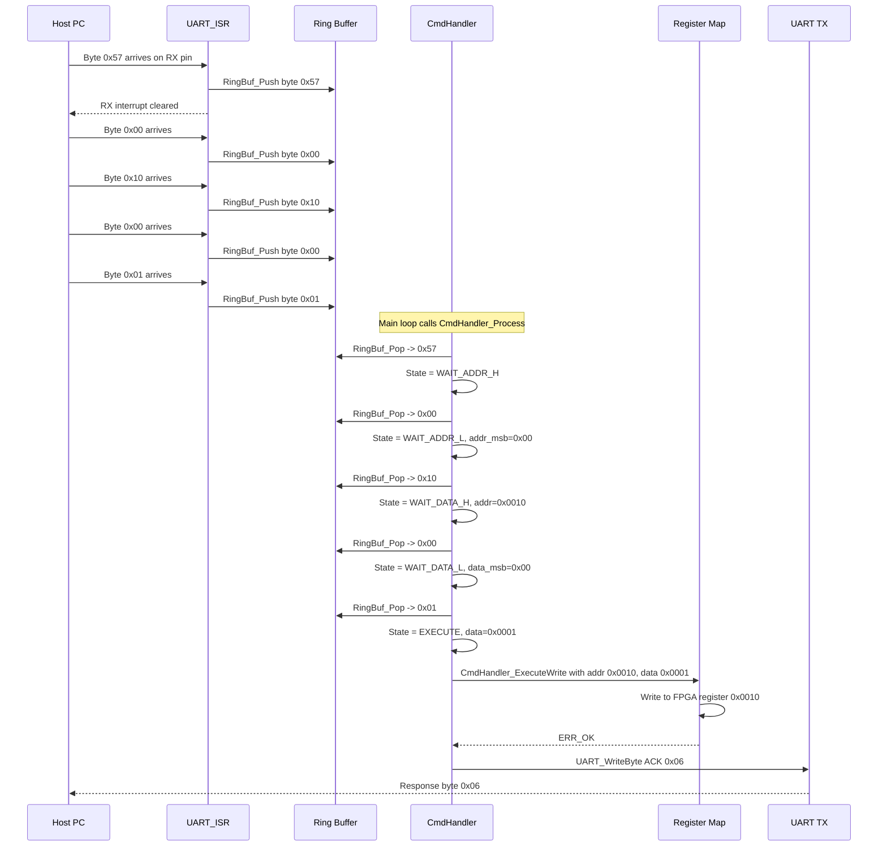

### 2.6.3 Temperature Alert and RF Shutdown Sequence

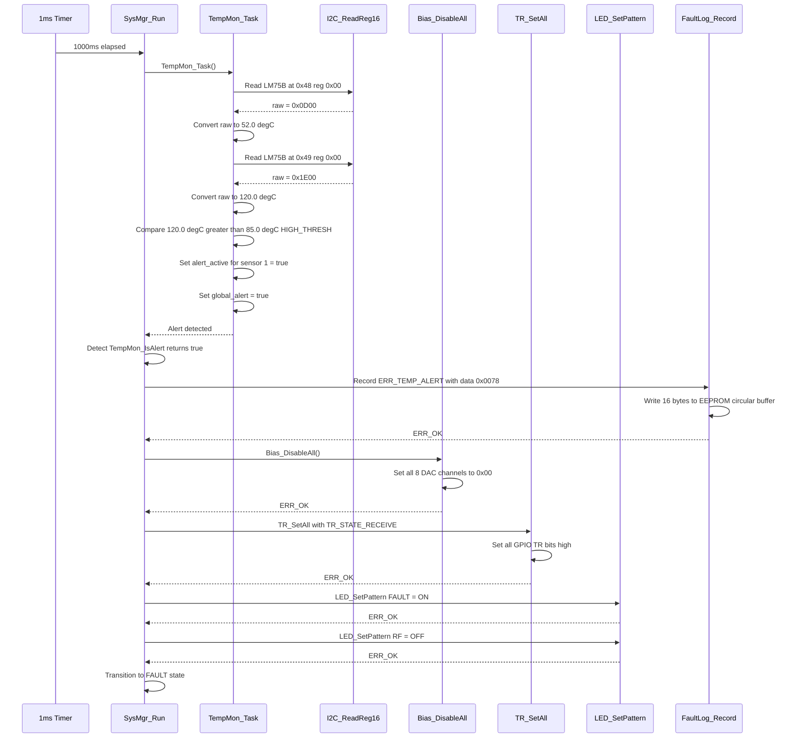

### 2.6.4 Flash Write with CRC Verification Sequence

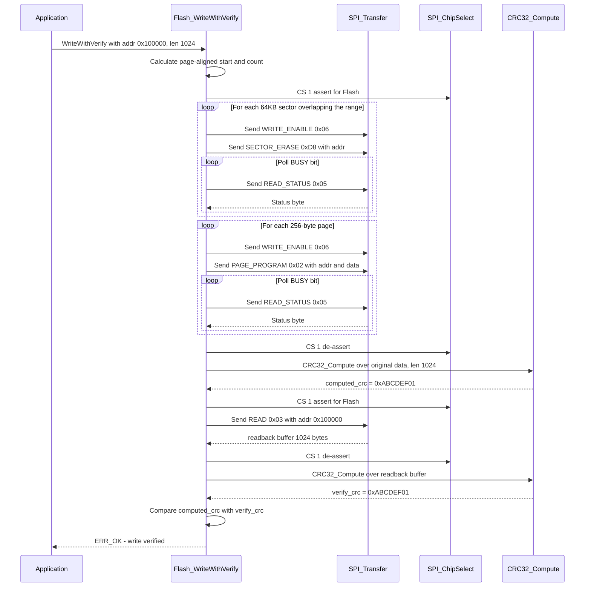

### 2.6.5 Power Rail Fault Detection Sequence

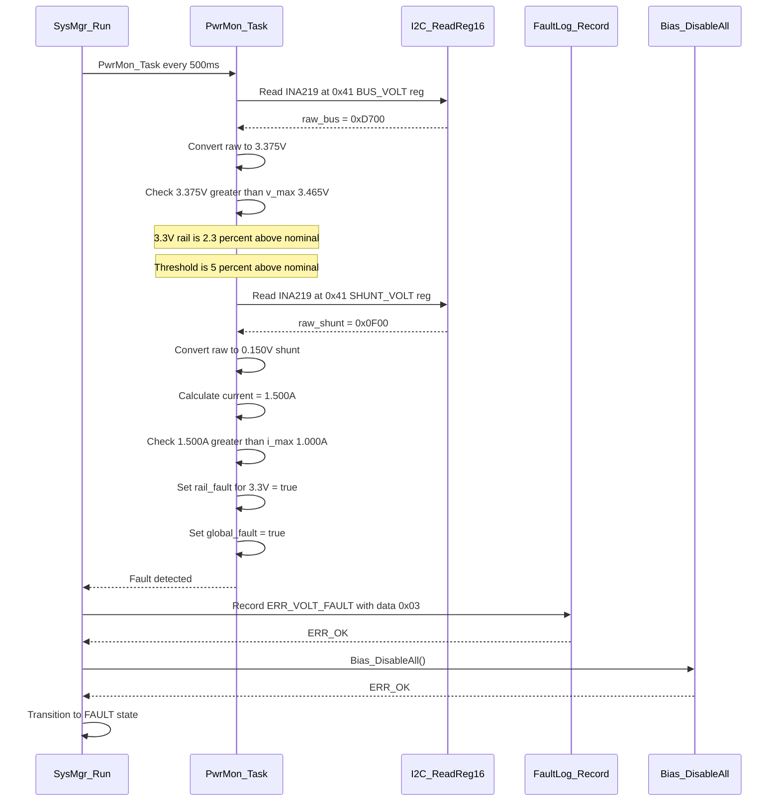

### 2.6.6 Calibration Load and Apply Sequence

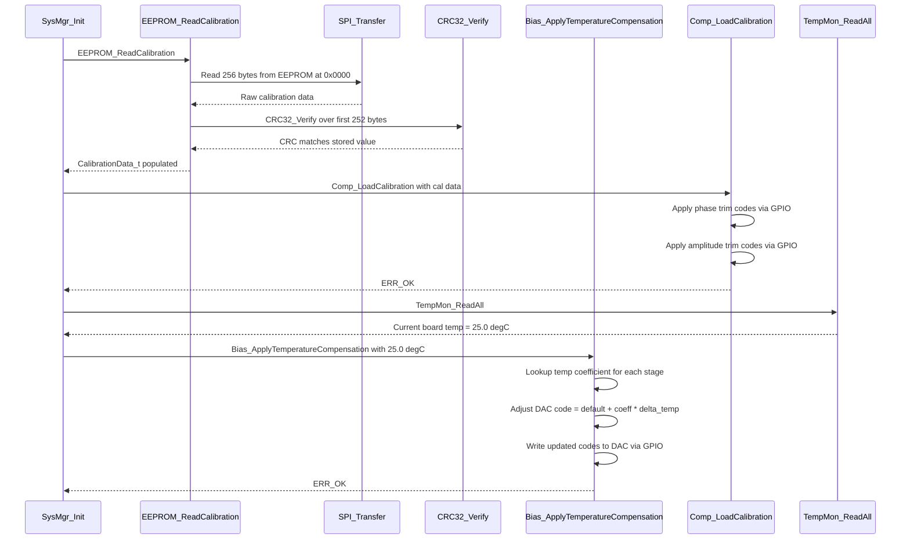

---

## 2.7 State Viewpoint — State Machines

### 2.7.1 System State Machine

The top-level system state machine governs the overall operating mode of the firmware. State transitions are triggered by fault conditions, watchdog resets, or host commands.

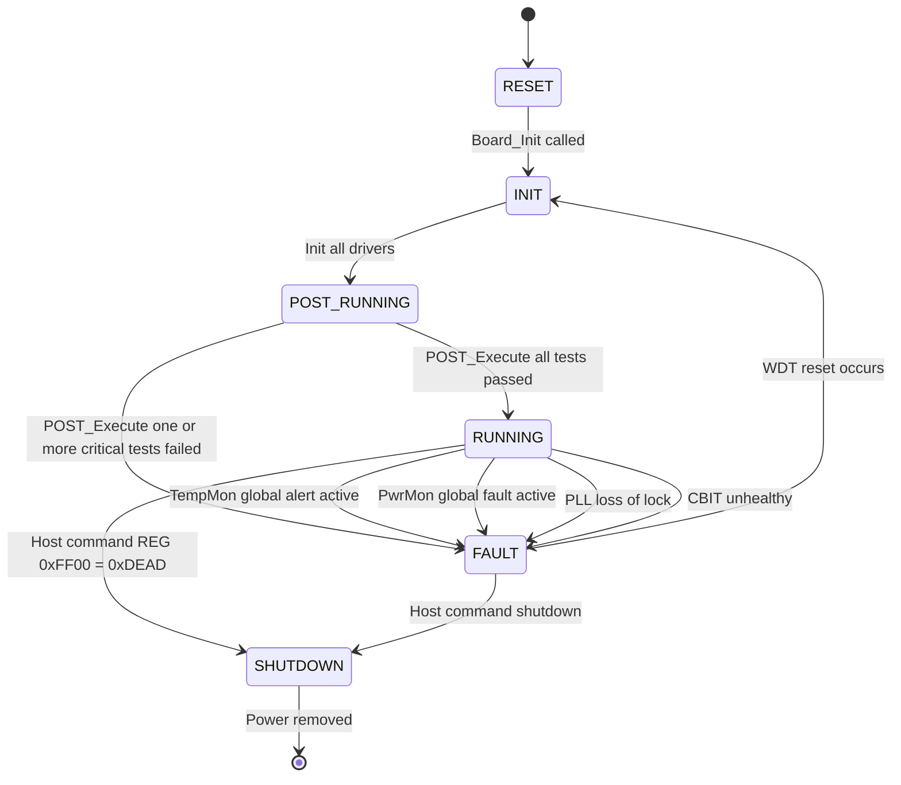

**State Descriptions**:

| State | Description | Actions on Entry |
|-------|-------------|-----------------|
| RESET | Initial state after power-on or WDT reset. MicroBlaze starts executing from vector 0x00000000. | Stack pointer initialized by crt0. All peripherals in power-on default state. |
| INIT | Board and driver initialization phase. | Board_Init(), PLL_Init(), UART_Init(), SPI_Init(), I2C_Init(), GPIO_Init(). |
| POST_RUNNING | Power-On Self-Test execution. | POST_Execute() tests all 16 sub-systems. EEPROM calibration loaded. |
| RUNNING | Normal operational state. Cooperative task scheduler active. | Bias enabled, LEDs show STATUS blink, WDT petting active, all monitors running. |
| FAULT | A critical fault has been detected. RF paths are muted. | Board_EmergencyShutdown() called. FAULT LED solid on. Fault recorded to EEPROM. WDT allowed to expire for auto-recovery. |
| SHUTDOWN | Graceful shutdown commanded by host. | All biases disabled, LEDs off, WDT petted until host confirms power removal. |

### 2.7.2 Command Handler State Machine

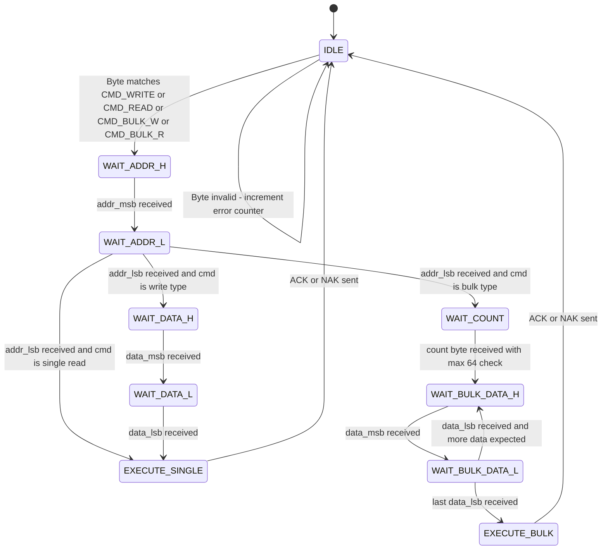

**Timeout Handling**: The parser resets to IDLE if the inter-byte gap exceeds 10 ms. A 1 ms system tick increments the timeout counter; any new byte reception resets it.

### 2.7.3 Temperature Monitor State Machine

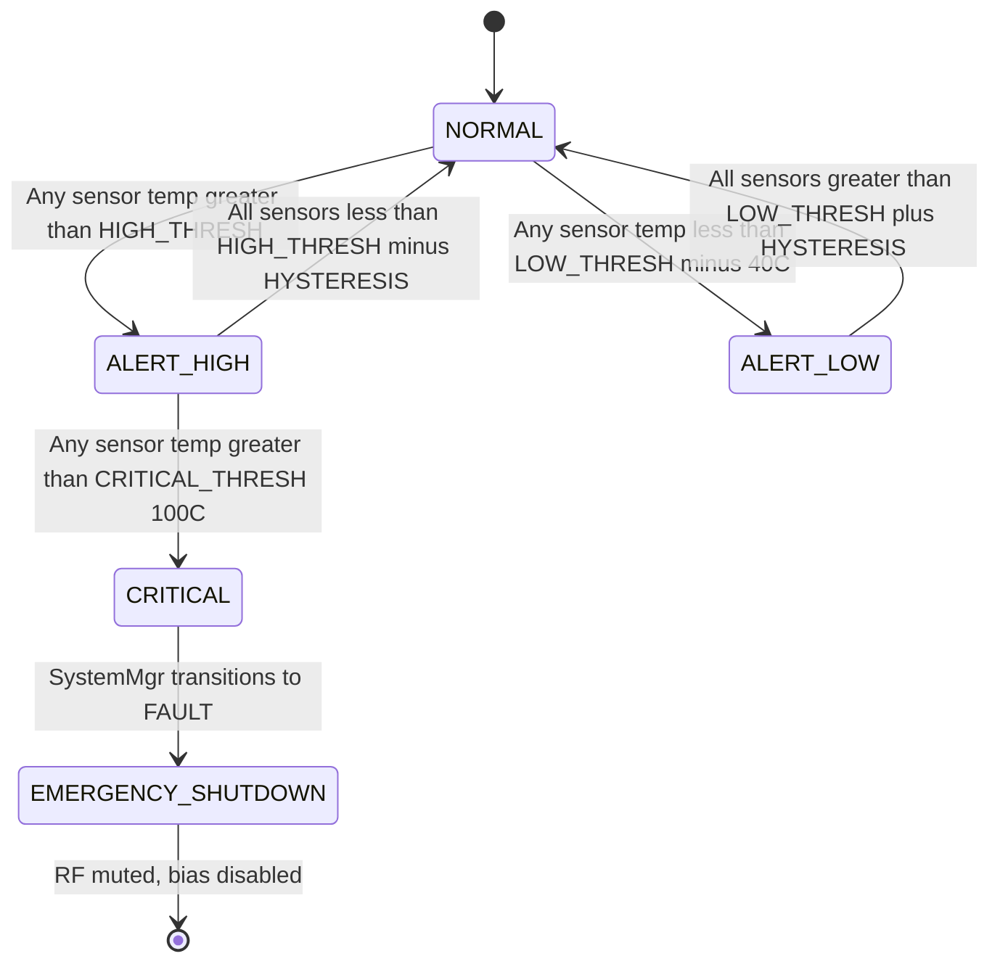

### 2.7.4 PLL State Machine

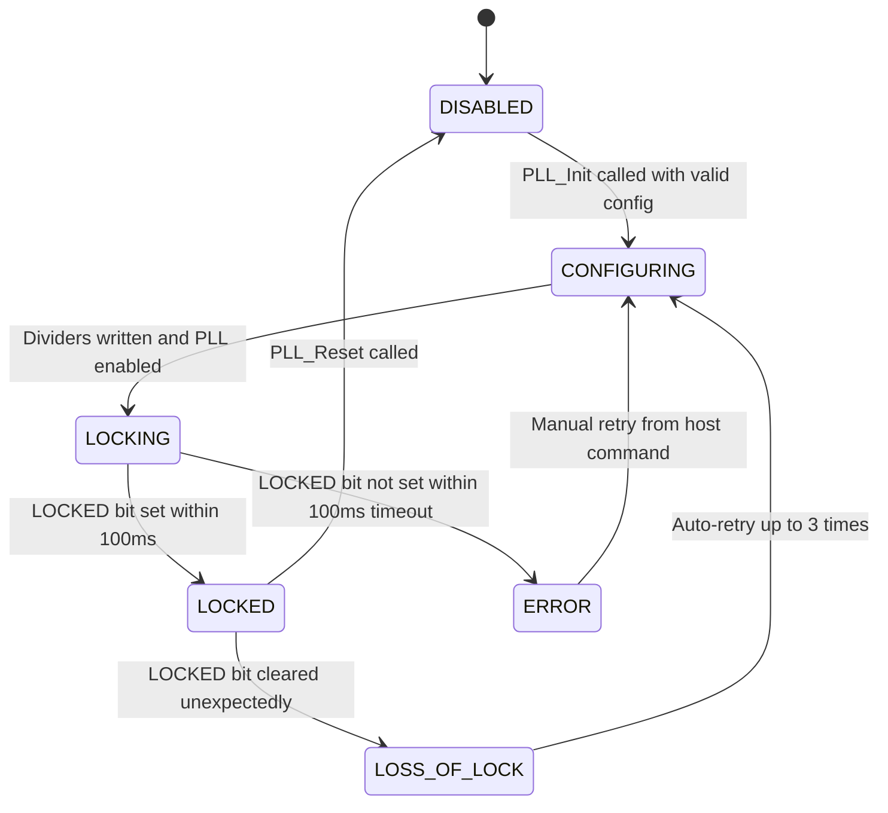

### 2.7.5 Bias Controller State Machine (per channel/stage)

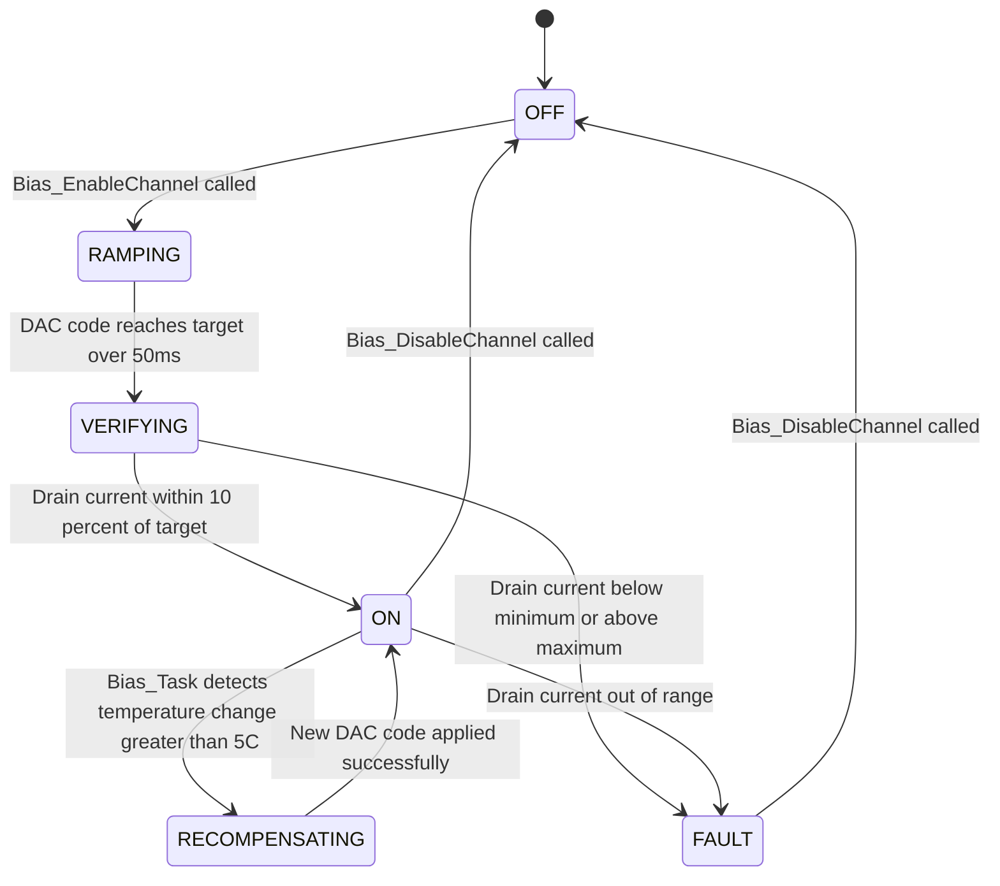

### 2.7.6 Watchdog Reset Recovery State Machine

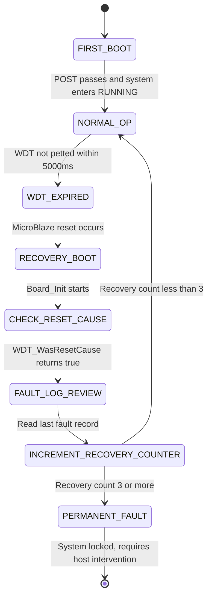

---

## 2.8 Algorithm Viewpoint — Key Algorithms

### 2.8.1 UART Frame Parser Algorithm

```c
/*
 * Algorithm: UART_FrameParser
 * Called by: CmdHandler_Process() in the main loop
 * Complexity: O(1) per byte, O(n) for n-byte bulk transfer
 * MISRA Compliance: All array accesses bounds-checked. No dynamic allocation.
 *
 * The parser operates as a Mealy state machine. Each call to
 * CmdHandler_Process() drains all available bytes from the UART RX
 * ring buffer and feeds them through the state machine.
 *
 * STATE TRANSITIONS:
 *
 * IDLE:
 *   Read byte from RX ring buffer.
 *   If byte == 0x57 (CMD_WRITE_REG):  set cmd = WRITE, goto WAIT_ADDR_H
 *   If byte == 0x52 (CMD_READ_REG):   set cmd = READ,  goto WAIT_ADDR_H
 *   If byte == 0x42 (CMD_BULK_WRITE): set cmd = BULK_W, goto WAIT_ADDR_H
 *   If byte == 0x62 (CMD_BULK_READ):  set cmd = BULK_R, goto WAIT_ADDR_H
 *   Else: discard byte, increment error counter, stay in IDLE.
 *
 * WAIT_ADDR_H:
 *   Store byte as addr_msb. Reset timeout counter. goto WAIT_ADDR_L.
 *
 * WAIT_ADDR_L:
 *   Store byte as addr_lsb. Compose addr = (addr_msb << 8) | addr_lsb.
 *   If cmd == READ: goto EXECUTE (single read).
 *   If cmd == BULK_R: goto WAIT_COUNT.
 *   Else: goto WAIT_DATA_H.
 *
 * WAIT_DATA_H:
 *   Store byte as data_msb. goto WAIT_DATA_L.
 *
 * WAIT_DATA_L:
 *   Store byte as data_lsb. Compose data = (data_msb << 8) | data_lsb.
 *   goto EXECUTE (single write).
 *
 * WAIT_COUNT:
 *   Store byte as bulk_count. Validate: 1 <= bulk_count <= 64.
 *   If invalid: send NAK, goto IDLE.
 *   If cmd == BULK_R: goto EXECUTE (bulk read).
 *   Else: reset bulk_index = 0, goto WAIT_BULK_DATA_H.
 *
 * WAIT_BULK_DATA_H / WAIT_BULK_DATA_L:
 *   Accumulate 16-bit data into bulk_data[bulk_index].
 *   Increment bulk_index.
 *   If bulk_index < bulk_count: stay in WAIT_BULK_DATA_H.
 *   If bulk_index == bulk_count: goto EXECUTE (bulk write).
 *
 * EXECUTE:
 *   Validate address range: 0x0000 <= addr <= 0xFFFE.
 *   Dispatch to CmdHandler_ExecuteWrite/Read/BulkWrite/BulkRead.
 *   On success: send ACK (0x06).
 *   On failure: send NAK (0x15) + error code byte.
 *   goto IDLE.
 *
 * TIMEOUT HANDLING:
 *   A 1ms tick increments g_frame_timeout_counter.
 *   If counter > UART_FRAME_TIMEOUT_MS (10ms): reset state to IDLE,
 *   discard partial frame, increment error counter.
 *   Any byte reception resets timeout counter to 0.
 */
```

### 2.8.2 Temperature Conversion Algorithm (LM75B)

```c
/*
 * Algorithm: TempMon_ConvertRawToCelsius
 *
 * The LM75B temperature register is a 16-bit read-only register
 * containing an 11-bit two's complement temperature value in bits [15:5].
 * Bits [4:0] are always 0.
 *
 * Resolution: 0.125 degrees Celsius per LSB.
 * Range: -55.0 degC to +125.0 degC
 *
 * Conversion Steps:
 * 1. Read 16-bit value from LM75B register 0x00 via I2C.
 *    raw = (msb << 8) | lsb;
 *
 * 2. Extract the 11-bit signed temperature:
 *    temp_raw = (int16_t)(raw >> 5);
 *    This right-shifts by 5 to remove the unused lower bits.
 *    The C compiler sign-extends because raw is cast to int16_t first.
 *
 * 3. Convert to Celsius:
 *    temp_degC = (float)temp_raw * 0.125f;
 *
 * Example 1: raw = 0x0D00 (positive)
 *   temp_raw = (int16_t)(0x0D00) >> 5 = 0x0068 = 104
 *   temp_degC = 104 * 0.125 = 13.0 degC
 *
 * Example 2: raw = 0xFFF0 (negative, -0.125 degC per bit)
 *   temp_raw = (int16_t)(0xFFF0) >> 5 = (int16_t)(0x07FF sign-extended)
 *   Wait: (int16_t)(0xFFF0) = -16.  -16 >> 5 = -1 (arithmetic shift).
 *   temp_degC = -1 * 0.125 = -0.125 degC
 *
 * Example 3: raw = 0xE700 (-25 degC)
 *   temp_raw = (int16_t)(0xE700) = -6400.  -6400 >> 5 = -200.
 *   temp_degC = -200 * 0.125 = -25.0 degC
 *
 * MISRA Note: Right-shifting signed integers is permitted under
 * MISRA C:2012 Rule 10.5 with explicit cast to int16_t first.
 */
float TempMon_ConvertRawToCelsius(uint16_t raw)
{
    int16_t temp_raw;
    float temp_degC;

    temp_raw = (int16_t)raw >> 5;   /* Arithmetic right shift, sign-extends */
    temp_degC = (float)temp_raw * 0.125f;

    return temp_degC;
}
```

### 2.8.3 Power Rail Voltage and Current Conversion (INA219)

```c
/*
 * Algorithm: PwrMon_ConvertINARaw
 *
 * The INA219 power monitor provides:
 * - Bus voltage register (0x02): 16-bit value
 *   Bits [15:3]: Bus voltage in increments of 4 mV
 *   Bits [2:0]: Always 0
 *   Range: 0V to 32V (for our rails: up to 5.0V)
 *   Conversion: voltage_V = (float)(raw >> 3) * 0.004f;
 *
 * - Shunt voltage register (0x01): 16-bit two's complement
 *   Value in increments of 10 uV (0.01 mV)
 *   Range: -320 mV to +320 mV
 *   Conversion: shunt_mV = (float)(int16_t)raw * 0.01f;
 *
 * - Current register (0x04): Calculated by INA219 from calibration
 *   Value in mA directly (after calibration register is set)
 *   Conversion: current_A = (float)raw * 0.001f;
 *
 * Calibration Register Calculation:
 *   For shunt resistor = 0.1 Ohm, max expected current = 1.6A:
 *   Current_LSB = 0.05 mA (minimum)
 *   Cal = trunc(0.04096 / (Current_LSB * R_shunt))
 *       = trunc(0.04096 / (0.00005 * 0.1))
 *       = trunc(8192) = 8192 = 0x2000
 *
 * Steps for reading a rail:
 * 1. Read BUS_VOLT register (reg 0x02)
 * 2. Shift right by 3 to extract voltage bits
 * 3. Multiply by 4 mV to get voltage
 * 4. Read SHUNT_VOLT register (reg 0x01)
 * 5. Cast to int16_t, multiply by 10 uV to get shunt voltage
 * 6. current_A = shunt_voltage_V / shunt_resistor_Ohms
 *    Alternatively, read CURRENT register (0x04) for direct mA.
 *
 * Voltage tolerance check:
 *   For 3.3V rail: v_min = 3.3 * 0.95 = 3.135V
 *                  v_max = 3.3 * 1.05 = 3.465V
 *   fault = (voltage < v_min) || (voltage > v_max)
 *
 * Over-current check:
 *   For 3.3V rail: i_max = 1.000A
 *   fault = (current > i_max)
 */
void PwrMon_ConvertINARaw(uint16_t raw_bus, uint16_t raw_shunt,
                          float *voltage_V, float *current_A)
{
    *voltage_V = (float)(raw_bus >> 3) * 0.004f;
    *current_A = (float)(int16_t)raw_shunt * 0.00001f / 0.1f;
}
```

### 2.8.4 Bias DAC Serial Load Algorithm (GPIO Bit-Bang)

```c
/*
 * Algorithm: Bias_LoadDAC
 *
 * The bias DAC is controlled via a GPIO bit-banged SPI interface.
 * The DAC accepts an 8-bit data word with a 4-bit channel address.
 * Total frame: 12 bits serial data, clocked on rising edge of DAC_CLK.
 *
 * GPIO signal mapping:
 *   Bits [7:0]  = DAC_DATA[7:0]  (shared data bus)
 *   Bit  8      = DAC_CLK        (serial clock)
 *   Bit  9      = DAC_LOAD       (load strobe, active low pulse)
 *   Bits [13:10]= DAC_CHSEL[3:0] (channel select)
 *
 * Steps to load a DAC channel:
 * 1. De-assert DAC_LOAD (set bit 9 high)
 * 2. Set DAC_CHSEL to target channel (bits [13:10])
 * 3. For bit_index = 11 down to 0:
 *    a. Set DAC_CLK low (clear bit 8)
 *    b. Set DAC_DATA bits to the appropriate slice of the 12-bit word
 *       word[11:0] = {DAC_CHSEL[3:0], DAC_DATA[7:0]}
 *    c. Set DAC_CLK high (set bit 8) - data latched on rising edge
 *    d. Delay 100 ns (10 clocks at 100 MHz)
 * 4. Assert DAC_LOAD (clear bit 9) for 500 ns
 * 5. De-assert DAC_LOAD (set bit 9 high)
 * 6. Set DAC_DATA to 0x00 and DAC_CLK low (safe idle state)
 *
 * Timing constraints:
 *   DAC clock frequency: max 10 MHz (100ns period)
 *   DAC load pulse width: min 50ns
 *   Setup/hold time: min 20ns
 *
 * MISRA Note: All GPIO operations use the atomic SetBits/ClearBits API.
 * No direct register writes outside the GPIO driver.
 */
```

