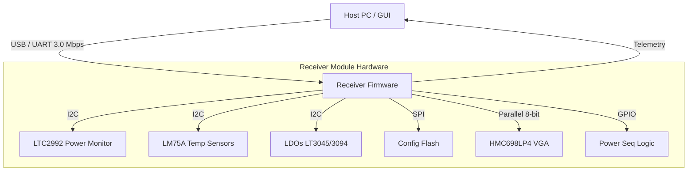
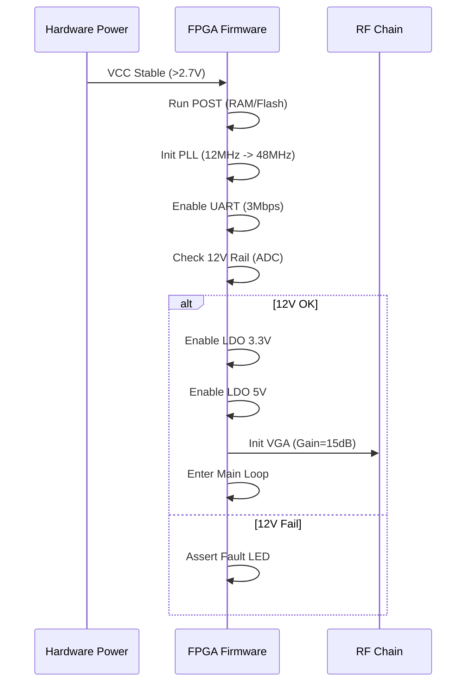
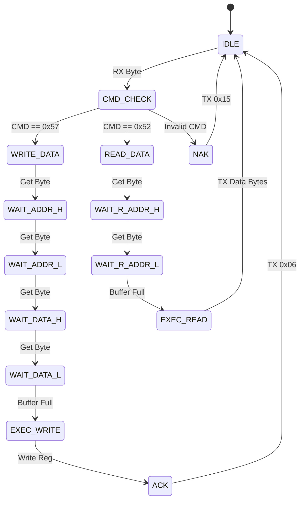
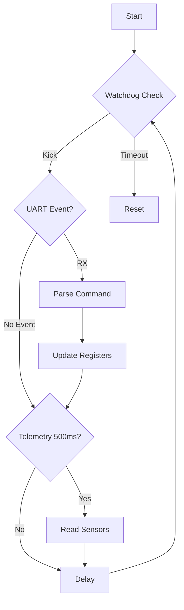
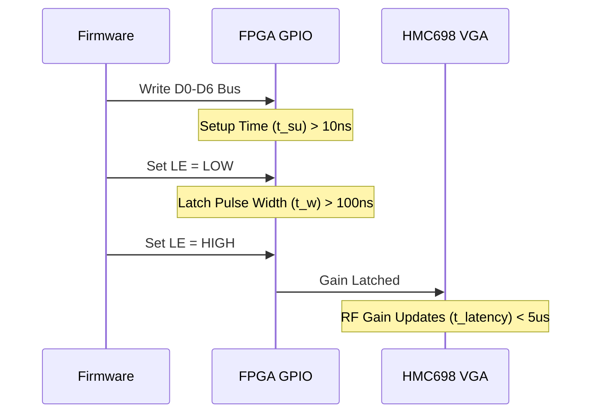

# Software Requirements Specification (SRS)
**Project:** Receiver Module Firmware
**Part Number:** 1000-REV-A
**Document Number:** 1000-SRS-001
**Date:** 17 April 2026

---

## Document Control
| Version | Date | Author | Changes |
|---------|------|--------|---------|
| 1.0 | 17 April 2026 | System Architect | Initial Release for Receiver Module Firmware |

---

# 1. Introduction

## 1.1 Purpose
The purpose of this Software Requirements Specification (SRS) is to define the comprehensive software and firmware requirements for the **Receiver Module (1000-REV-A)**. This document specifies the behavior, interfaces, performance constraints, and validation criteria for the embedded firmware running on the **Lattice iCE40HX4K FPGA**.

This SRS serves as the baseline for:
*   **Firmware Development:** Implementation of hardware abstraction layers (HAL), device drivers, and control logic.
*   **System Integration:** Defining the handshaking between the Host PC (via UART) and the RF Hardware (via GPIO/SPI).
*   **Verification & Validation (V&V):** Establishing specific pass/fail criteria for unit, integration, and system testing.

## 1.2 Scope
The software system specified herein is the **Embedded Control Firmware** resident on the iCE40HX4K FPGA. The scope includes:
*   **Boot Management:** Loading bitstream from SPI Flash and initializing the hardware state.
*   **Hardware Abstraction:** Drivers for I2C (LDOs, Temp Sensors), SPI (Flash), and GPIO (VGA Control, Power Sequencing).
*   **Communication Protocol:** Implementation of the UART command/response protocol for register access and telemetry streaming.
*   **Control Logic:** Automatic Gain Control (AGC) support, health monitoring, and fault handling.

**Exclusions:**
*   This document does not specify the Host PC GUI application source code, though the wire protocol is defined.
*   This document does not specify the FPGA RTL synthesis constraints or timing analysis, other than functional timing requirements.

## 1.3 Definitions, Acronyms, and Abbreviations

| Term | Definition |
| :--- | :--- |
| **AGC** | Automatic Gain Control. Firmware algorithm to adjust VGA gain based on IF power. |
| **API** | Application Programming Interface. |
| **BOM** | Bill of Materials. |
| **BRAM** | Block RAM. FPGA internal memory resource. |
| **BSP** | Board Support Package. Low-level hardware initialization code. |
| **C** | Programming Language (ISO C99/C11). |
| **CE** | Conformance Europec (or Common Era in dates). |
| **CLB** | Configurable Logic Block. |
| **CRC** | Cyclic Redundancy Check. |
| **DC** | Direct Current. |
| **DFA** | Design for Assembly. |
| **DMA** | Direct Memory Access. |
| **DoE** | Design of Experiments. |
| **DSPL** | Digital Signal Processing Logic. |
| **DUT** | Device Under Test. |
| **EMC** | Electromagnetic Compatibility. |
| **EMI** | Electromagnetic Interference. |
| **ESD** | Electrostatic Discharge. |
| **ESS** | Environmental Stress Screening. |
| **FIFO** | First-In-First-Out buffer. |
| **FPGA** | Field-Programmable Gate Array. |
| **FW** | Firmware. |
| **GLR** | Glue Logic Requirements. |
| **GPIO** | General Purpose Input/Output. |
| **HAL** | Hardware Abstraction Layer. |
| **HRS** | Hardware Requirements Specification. |
| **HW** | Hardware. |
| **I2C** | Inter-Integrated Circuit (Serial Protocol). |
| **ICE** | In-Circuit Emulator. |
| **IF** | Intermediate Frequency. |
| **IP** | Intellectual Property. |
| **ISR** | Interrupt Service Routine. |
| **LDO** | Low Dropout Regulator. |
| **LNA** | Low Noise Amplifier. |
| **LO** | Local Oscillator. |
| **LUT** | Look-Up Table. |
| **MHz** | Megahertz. |
| **MIL-STD** | United States Defense Standard. |
| **MISR** | Multiple Input Signature Register. |
| **MUX** | Multiplexer. |
| **NAK** | Negative Acknowledge. |
| **NF** | Noise Figure. |
| **NVM** | Non-Volatile Memory. |
| **OS** | Operating System. |
| **PC** | Personal Computer. |
| **PCB** | Printed Circuit Board. |
| **PLL** | Phase-Locked Loop. |
| **POST** | Power-On Self Test. |
| **PRBS** | Pseudo-Random Binary Sequence. |
| **RAM** | Random Access Memory. |
| **RF** | Radio Frequency. |
| **RM** | Register Map. |
| **ROM** | Read Only Memory. |
| **RTL** | Register Transfer Level. |
| **RTOS** | Real-Time Operating System. |
| **Rx** | Receive. |
| **SMA** | SubMiniature version A (Connector). |
| **SNR** | Signal-to-Noise Ratio. |
| **SPI** | Serial Peripheral Interface. |
| **SRS** | Software Requirements Specification. |
| **StRS** | Stakeholder Requirements Specification. |
| **SW** | Software. |
| **SyRS** | System Requirements Specification. |
| **Tx** | Transmit. |
| **UART** | Universal Asynchronous Receiver/Transmitter. |
| **USB** | Universal Serial Bus. |
| **VCC** | Supply Voltage. |
| **VGA** | Variable Gain Amplifier. |
| **WDT** | Watchdog Timer. |

## 1.4 References
| ID | Document Title | Document No. | Version/Date | Applicability |
|:---|:---|:---|:---|:---|
| **1** | **Hardware Requirements Specification (HRS)** | 1000-HRS-001 | Rev A | Defines RF and Power hardware behavior. |
| **2** | **Glue Logic Requirements (GLR)** | 1000-GLR-001 | V01 | Defines FPGA IO and Register Map. |
| **3** | **IEEE 830-1998** | Recommended Practice for SRS | 1998 | Standard for SRS structure. |
| **4** | **ISO/IEC/IEEE 29148:2018** | Requirements Engineering | 2018 | Standard for Requirements lifecycle. |
| **5** | **MISRA C:2012** | Guidelines for C Language | 2012 | Coding standard compliance. |
| **6** | **iCE40HX4K Datasheet** | FPGA Technical Document | DS10087 | Hardware resource constraints. |
| **7** | **HMC698LP4 Datasheet** | VGA Datasheet | Rev 0 | Driver interface requirements. |
| **8** | **LT3045 / LT3094 Datasheet** | LDO Regulators | Rev 0 | I2C programming sequences. |
| **9** | **LM75A Datasheet** | Digital Temp Sensor | Rev 0 | I2C telemetry format. |
| **10** | **LTC2992 Datasheet** | Power Monitor | Rev 0 | I2C telemetry format. |
| **11** | **MIL-STD-883** | Test Methods | Current | Environmental test procedures. |

## 1.5 Overview
The remainder of this document is organized as follows:
*   **Section 2 (Overall Description):** Provides the system context, product functions, and design constraints. It details the software stack from the Bare-metal/RAM layer up to the Control Logic.
*   **Section 3 (Specific Requirements):** Contains the detailed external interfaces, data structures, and 80+ numbered functional requirements (REQ-SW-001 through REQ-SW-080).
*   **Section 4 (Verification & Validation):** Outlines the testing strategy for unit, integration, and system levels.
*   **Section 5 (Traceability):** Maps software requirements to Hardware and Glue Logic sources.
*   **Appendices:** Provides error codes, register maps, and state machine diagrams.

---

# 2. Overall Description

## 2.1 Product Perspective
The firmware acts as the **Control Plane** for the Receiver Module. It sits between the Host System (External PC/Commander) and the RF Signal Chain.



**Context:**
*   **Lower Level:** The FPGA interfaces directly with hardware registers via its PL (Programmable Logic) blocks and Hard IP cores (SPI, I2C).
*   **Upper Level:** The firmware exports a virtual "Register Map" to the host, allowing read/write access to增益 (Gain) settings and telemetry values.

## 2.2 Product Functions
The firmware shall provide the following major functions:
1.  **System Initialization:** Configure PLL, enable power rails (sequencing), and initialize I2C/SPI peripherals.
2.  **Command Processing (UART):** Parse incoming byte streams, validate Checksums/CRC, and execute Read/Write operations.
3.  **VGA Gain Control:** Drive the 8-bit parallel bus to the HMC698LP4. Support immediate gain updates and ramped gain changes.
4.  **Health Monitoring:** Poll LM75A sensors and LTC2992 monitor every 100ms.
5.  **Fault Management:** Detect Over-Temperature or Under-Voltage and issue a Latch-Up or Shutdown command.
6.  **POST:** Execute RAM test and Peripheral Loopback on startup.
7.  **Housekeeping:** Watchdog timer service and LED status indication.

## 2.3 User Characteristics
*   **Firmware Engineers:** Require access to source code, makefiles, and debug symbols (via JTAG).
*   **Test Engineers:** Interact via the UART console to inject specific register values for production calibration.
*   **Integrators:** Utilize the register map API to integrate the module into higher-level assemblies.

## 2.4 Constraints
1.  **Compliance:** MISRA-C:2012 strict adherence.
2.  **Execution:** Bare-metal (no OS) or Super-loop architecture on iCE40.
3.  **Memory:** Total compiled image < 128 KB (Flash footprint), RAM usage < 8 KB.
4.  **Timing:** UART interrupt latency < 50 µs; I2C transaction < 1 ms.
5.  **Language:** C99. Assembly only for startup context switch.
6.  **Toolchain:** Lattice Radiant Software + GCC for RISC-V (if soft-core used) or Verilog simulation testbench.

## 2.5 Assumptions and Dependencies
1.  **Hardware Stability:** The +12V input is assumed to be stable and within ripple limits (per HRS) before the FPGA attempts to enable secondary rails.
2.  **Clock Source:** The 12 MHz oscillator (FPGA_CLK_12M) is assumed to be stable ±50 ppm.
3.  **LO Source:** The External LO is assumed to be present and powered; the firmware only detects IF power, not LO presence (unless a detector is added).

---

# 3. Specific Requirements

## 3.1 External Interface Requirements

### 3.1.1 Hardware Interfaces
**Hardware Interface 1: VGA Control (Parallel)**
*   **Type:** Parallel Bus (8 bits data + LE/Latch Enable).
*   **Speed:** Update rate < 1 µs.
*   **Mapping:** HMC698LP4 D0-D6 mapped to FPGA GPIO Bank 2.
*   **Driver:**
```c
typedef struct {
    uint8_t gain_code; // 7-bit gain code (0-127)
    bool    latched;   // true if LE pin is high
} VGA_State_t;

// Driver API
int32_t VGA_Init(void);
int32_t VGA_SetGain(uint8_t gain_code);
int32_t VGA_GetGain(uint8_t *current_gain);
```

**Hardware Interface 2: I2C Bus (Telemetry)**
*   **Bus:** Standard I2C (100 kHz).
*   **Devices:** LTC2992 (0x6F), LM75A (0x48, 0x49).
*   **Driver:**
```c
typedef enum {
    I2C_DEV_PWR_MON = 0x6F,
    I2C_DEV_TEMP_1  = 0x48,
    I2C_DEV_TEMP_2  = 0x49
} I2C_Device_t;

int32_t I2C_Init(uint32_t speed_hz);
int32_t I2C_ReadByte(uint8_t dev_addr, uint8_t reg_addr, uint8_t *data);
int32_t I2C_WriteByte(uint8_t dev_addr, uint8_t reg_addr, uint8_t data);
```

### 3.1.2 Software Interfaces
*   **Standard Library:** Limited `<stdio.h>` (re-targeted to UART).
*   **Math Library:** Fixed-point arithmetic only (libfixed); no floating point in ISRs.

### 3.1.3 Communication Interfaces
**Protocol: Binary UART Register Protocol**

| Command | CMD Byte | Frame Structure (Hex) | Response |
|:---|:---|:---|:---|
| **Single Write** | 0x57 | `[0x57][ADDR_H][ADDR_L][DATA_H][DATA_L]` | `[0x06]` (ACK) |
| **Single Read** | 0x52 | `[0x52][ADDR_H\|0x80][ADDR_L]` | `[DATA_H][DATA_L]` |
| **Bulk Write** | 0x42 | `[0x42][ADDR_H][ADDR_L][N][D0_H][D0_L]...` | `[0x06]` (ACK) |
| **Bulk Read** | 0x62 | `[0x62][ADDR_H\|0x80][ADDR_L][N]` | `[N*2 bytes of data]` |
| **Error NAK** | 0x15 | Sent by Firmware on CRC/Address error | — |

*   **Address Space:** 16-bit (0x0000 - 0xFFFF). Bit 15 of address set indicates Read.
*   **Byte Order:** Big Endian (High byte first).
*   **Timeout:** Inter-byte timeout 50ms. Parser resets on timeout.

## 3.2 Functional Requirements

### 3.2.1 System Initialization (REQ-SW-001 to REQ-SW-010)

| ID | Requirement | Source | Priority | Verification |
|:---|:---|:---|:---|:---|
| **REQ-SW-001** | The software SHALL complete power-on self-test (POST) within 200ms of VCC reaching 2.7V. | HRS §3.5 | [M] | [T] |
| **REQ-SW-002** | The software SHALL initialize the I2C peripheral to 100kHz (Standard Mode) before accessing the LTC2992. | GLR §8 | [M] | [T] |
| **REQ-SW-003** | The software SHALL configure the FPGA PLL to multiply the 12MHz input to 48MHz system clock within 50ms of boot. | GLR §8 | [M] | [A] |
| **REQ-SW-004** | The software SHALL enable the +3.3V LDO (LT3045) only after the +12V input is verified stable (>11.0V). | HRS §3.4 | [M] | [T] |
| **REQ-SW-005** | The software SHALL enable the +5V LDO (LT3094) after +3.3V is stable (PGOOD asserted). | GLR §4 | [M] | [T] |
| **REQ-SW-006** | The software SHALL configure the UART interface to 3,000,000 Baud, 8N1 format on startup. | GLR §5 | [M] | [T] |
| **REQ-SW-007** | The software SHALL read the MAC address / Serial ID from the SPI Flash (offset 0x0) and store it in RAM global variable `system_serial`. | GLR §5 | [M] | [I] |
| **REQ-SW-008** | The software SHALL initialize the watchdog timer to a 1-second timeout. | HRS §3.5 | [M] | [D] |
| **REQ-SW-009** | The software SHALL set all VGA control lines to Logic Low (Gain = 0dB / Min) during initialization to prevent power spikes. | HRS §3.1 | [M] | [I] |
| **REQ-SW-010** | The software SHALL validate the firmware CRC against the value stored in Flash (last page). | GLR §4 | [M] | [A] |

### 3.2.2 UART Command Handler (REQ-SW-011 to REQ-SW-025)

| ID | Requirement | Source | Priority | Verification |
|:---|:---|:---|:---|:---|
| **REQ-SW-011** | The UART driver SHALL implement a circular RX FIFO of depth 512 bytes. | GLR §5 | [M] | [T] |
| **REQ-SW-012** | The software SHALL parse the incoming byte stream; upon receiving `0x57` (Write), it SHALL read the next 4 bytes (Addr H/L, Data H/L). | GLR §7 | [M] | [T] |
| **REQ-SW-013** | For valid Single Write commands, the software SHALL write the 16-bit data to the target register address and transmit ACK byte `0x06`. | GLR §7 | [M] | [T] |
| **REQ-SW-014** | Upon receiving `0x52` (Read), the software SHALL read the target register and transmit the High Byte followed by Low Byte. | GLR §7 | [M] | [T] |
| **REQ-SW-015** | The software SHALL support the Bulk Write command (`0x42`) for writing up to 64 registers in one transaction. | GLR §7 | [M] | [T] |
| **REQ-SW-016** | The software SHALL check the inter-byte delay; if the gap exceeds 50ms, the parser state machine SHALL reset to IDLE. | GLR §7 | [M] | [T] |
| **REQ-SW-017** | The software SHALL verify that the address in a write command is not a Read-Only register; if RO, return NAK (`0x15`). | GLR §6 | [M] | [T] |
| **REQ-SW-018** | The software SHALL protect the VGA Gain register from writes exceeding `127` (max gain of HMC698LP4). | HRS §3.1 | [M] | [T] |
| **REQ-SW-019** | The UART driver SHALL utilize a TX FIFO to prevent blocking the main loop during transmission of ACK bytes. | GLR §5 | [M] | [A] |
| **REQ-SW-020** | The software SHALL ignore command bytes with Bit 7 set (if not a Read command) and NAK them. | GLR §7 | [M] | [T] |
| **REQ-SW-021** | The software SHALL implement a back-pressure mechanism: if RX FIFO is >90% full, assert hardware "RTS" line (if available) or drop bytes. | GLR §5 | [D] | [T] |
| **REQ-SW-022** | The software SHALL log the last 16 invalid UART commands to a "Fault Log" array in RAM. | HRS §3.4 | [O] | [I] |
| **REQ-SW-023** | The software SHALL provide a 'Factory Reset' command (Write to Magic Address `0xFFFE`) which resets all registers to default. | GLR §6 | [M] | [D] |
| **REQ-SW-024** | The software SHALL support CRC-16 (CCITT) mode if enabled in Config Register (Bit 0 of Addr `0x0001`). | GLR §7 | [O] | [T] |
| **REQ-SW-025** | The software SHALL respond to a Ping command (Write to `0x0000`) with ACK within 5ms. | GLR §7 | [M] | [T] |

### 3.2.3 VGA and RF Control (REQ-SW-026 to REQ-SW-035)

| ID | Requirement | Source | Priority | Verification |
|:---|:---|:---|:---|:---|
| **REQ-SW-026** | The software SHALL drive the 7-bit parallel bus (D0-D6) to the HMC698LP4 when a Gain Write command is received. | GLR §8 | [M] | [T] |
| **REQ-SW-027** | The software SHALL pulse the Latch Enable (LE) pin Low for 100ns, then High, to latch new gain settings. | HMC698 Datasheet | [M] | [T] |
| **REQ-SW-028** | The software SHALL support a "Gain Ramp Mode" where gain changes in 0.5dB steps every 10ms until target is reached. | HRS §3.1 | [D] | [T] |
| **REQ-SW-029** | The software SHALL prevent the gain code from wrapping around (e.g., 127 -> 0) if the target gain > 127. | HRS §3.1 | [M] | [T] |
| **REQ-SW-030** | The software SHALL read back the latched gain value from the internal shadow register. | GLR §6 | [M] | [I] |
| **REQ-SW-031** | The software SHALL provide a register map entry for `GAIN_SETPOINT` (Addr `0x0010`) and `GAIN_CURRENT` (Addr `0x0011`). | GLR §6 | [M] | [I] |
| **REQ-SW-032** | The software SHALL implement a mute function (Gain = -infinity) by setting a specific control GPIO (MUTE) high if supported by hardware. | GLR §4 | [O] | [D] |
| **REQ-SW-033** | The software SHALL update the gain within 1us of receiving the command (latency measure). | HRS §3.2 | [M] | [T] |
| **REQ-SW-034** | The software SHALL store the last used gain setting in NVM (Flash) and restore it on boot. | HRS §3.1 | [M] | [D] |
| **REQ-SW-035** | The software SHALL verify the calculated gain does not exceed the P1dB limit of the LNA indirectly via lookup table. | HRS §3.2 | [D] | [A] |

### 3.2.4 Telemetry & Sensors (REQ-SW-036 to REQ-SW-050)

| ID | Requirement | Source | Priority | Verification |
|:---|:---|:---|:---|:---|
| **REQ-SW-036** | The software SHALL poll the LTC2992 (Addr `0x6F`) every 500ms to read the +12V rail voltage. | GLR §4 | [M] | [T] |
| **REQ-SW-037** | The software SHALL poll the LM75A (Addr `0x48`) (Temp Sensor 1) every 500ms. | GLR §4 | [M] | [T] |
| **REQ-SW-038** | The software SHALL poll the LM75A (Addr `0x49`) (Temp Sensor 2) every 500ms. | GLR §4 | [M] | [T] |
| **REQ-SW-039** | The software SHALL convert raw ADC data to engineering units (Volts, Celsius) using fixed-point math. | GLR §4 | [M] | [I] |
| **REQ-SW-040** | The software SHALL update the "STATUS" register (Addr `0x0020`) with the OVERTEMP flag if any sensor > 125°C. | HRS §3.4 | [M] | [T] |
| **REQ-SW-041** | The software SHALL trigger a software interrupt if the +12V rail drops below 10.5V. | HRS §3.4 | [M] | [T] |
| **REQ-SW-042** | The software SHALL expose temperature readings via Read-Only registers `TEMP_1` (`0x0030`) and `TEMP_2` (`0x0031`). | GLR §6 | [M] | [T] |
| **REQ-SW-043** | The software SHALL expose voltage readings via Read-Only registers `VOLT_12V` (`0x0032`), `VOLT_5V` (`0x0033`), `VOLT_3V3` (`0x0034`). | GLR §6 | [M] | [T] |
| **REQ-SW-044** | The software SHALL compute the average of Temp 1 and Temp 2 for thermal reporting. | GLR §4 | [D] | [A] |
| **REQ-SW-045** | The software SHALL timestamp all telemetry readings with a 32-bit uptime counter (ms). | GLR §6 | [M] | [I] |
| **REQ-SW-046** | The software SHALL perform an I2C bus reset (toggle clock) if no ACK is received after 3 attempts. | GLR §8 | [M] | [T] |
| **REQ-SW-047** | The software SHALL halt telemetry polling if the FPGA internal temperature exceeds 90°C (if available). | GLR §6 | [M] | [T] |
| **REQ-SW-048** | The software SHALL log the minimum and maximum voltage observed since boot in RAM registers. | GLR §6 | [D] | [T] |
| **REQ-SW-049** | The software SHALL support a "Streaming Mode" where telemetry is automatically sent via UART every 100ms (Bit 1 of Config Reg). | GLR §7 | [O] | [D] |
| **REQ-SW-050** | The software SHALL mask the lower 4 bits of the temperature reading as per LM75A 11-bit resolution spec. | LM75A Datasheet | [M] | [I] |

### 3.2.5 Diagnostics & Faults (REQ-SW-051 to REQ-SW-060)

| ID | Requirement | Source | Priority | Verification |
|:---|:---|:---|:---|:---|
| **REQ-SW-051** | The software SHALL set the "FATAL" bit in the STATUS register if the Watchdog Timer expires. | HRS §3.5 | [M] | [T] |
| **REQ-SW-052** | The software SHALL disable the RF path (set Gain to 0) if the FATAL bit is set. | HRS §3.5 | [M] | [T] |
| **REQ-SW-053** | The software SHALL store the fault code (ERR_CODE) at address `0x0040` in non-volatile shadow registers. | GLR §6 | [M] | [I] |
| **REQ-SW-054** | The software SHALL implement a POST that verifies communication with the EEPROM/Flash. | GLR §4 | [M] | [D] |
| **REQ-SW-055** | The software SHALL perform a RAM BIST (March C-) on 2KB of internal SRAM during boot. | HRS §3.5 | [M] | [T] |
| **REQ-SW-056** | The software SHALL blink the Status LED at 2Hz if RAM BIST fails. | GLR §5 | [M] | [D] |
| **REQ-SW-057** | The software SHALL blink the Status LED at 4Hz if I2C device not found. | GLR §5 | [M] | [D] |
| **REQ-SW-058** | The software SHALL maintain a "Heartbeat" counter that increments every 10ms; readable at `0x0050`. | GLR §6 | [M] | [T] |
| **REQ-SW-059** | The software SHALL clear the "Fault Log" only upon explicit Write command to `FAULT_CLEAR` (`0x0041`). | GLR §6 | [M] | [I] |
| **REQ-SW-060** | The software SHALL assert a GPIO "ALERT" pin high when a critical fault occurs. | GLR §8 | [M] | [T] |

### 3.2.6 Housekeeping (REQ-SW-061 to REQ-SW-070)

| ID | Requirement | Source | Priority | Verification |
|:---|:---|:---|:---|:---|
| **REQ-SW-061** | The software SHALL service the Watchdog Timer (Kick/Pet) in the main loop every cycle. | HRS §3.5 | [M] | [I] |
| **REQ-SW-062** | The software SHALL measure the duration of the main loop execution and store it in `LOOP_TIME` (`0x0060`). | GLR §6 | [D] | [T] |
| **REQ-SW-063** | The software SHALL initialize the Stack Pointer to the top of RAM (0x2000) on startup. | GLR §4 | [M] | [A] |
| **REQ-SW-064** | The software SHALL disable all global interrupts during the critical PLL configuration phase. | GLR §4 | [M] | [I] |
| **REQ-SW-065** | The software SHALL implement a delay loop function `delay_us(uint32_t us)` calibrated to the 48MHz clock. | GLR §4 | [M] | [T] |
| **REQ-SW-066** | The software SHALL enable the internal pull-up resistors on all unused GPIO pins. | GLR §8 | [D] | [I] |
| **REQ-SW-067** | The software SHALL read the "Hardware Revision" strapping pins (3 pins) and store in `HW_REV` (`0x0070`). | GLR §8 | [M] | [T] |
| **REQ-SW-068** | The software SHALL implement a 32-bit CRC calculator for Flash data integrity. | GLR §5 | [M] | [T] |
| **REQ-SW-069** | The software SHALL map the 16-bit virtual address space to physical registers via a `Switch-Case` or `Jump-Table`. | GLR §7 | [M] | [I] |
| **REQ-SW-070** | The software SHALL set the default gain to 15dB (Code 30) on initial power-up. | HRS §3.1 | [M] | [T] |

### 3.2.7 Flash / NVM (REQ-SW-071 to REQ-SW-080)

| ID | Requirement | Source | Priority | Verification |
|:---|:---|:---|:---|:---|
| **REQ-SW-071** | The software SHALL implement a SPI driver capable of 10MHz SCK frequency. | GLR §5 | [M] | [T] |
| **REQ-SW-072** | The software SHALL read the Factory Calibration data from Flash Sector 0 (Addr 0x00000000) and parse into `Calibration_t` struct. | GLR §4 | [M] | [T] |
| **REQ-SW-073** | The software SHALL write user gain settings to Flash Sector 1 only on explicit "Save" command. | GLR §4 | [M] | [T] |
| **REQ-SW-074** | The software SHALL perform a Sector Erase (4KB) before writing new user settings. | Flash Datasheet | [M] | [I] |
| **REQ-SW-075** | The software SHALL verify the written data by reading back the bytes and comparing to buffer. | GLR §5 | [M] | [T] |
| **REQ-SW-076** | The software SHALL protect Sector 0 (Factory Cal) from write/erase commands by masking address ranges. | GLR §6 | [M] | [T] |
| **REQ-SW-077** | The software SHALL limit write cycles to the User Sector to < 10,000 cycles (monitor in SW). | Flash Datasheet | [M] | [A] |
| **REQ-SW-078** | The software SHALL implement a fast Quad-SPI read if supported by the iCE40 SPI controller. | GLR §8 | [O] | [T] |
| **REQ-SW-079** | The software SHALL return `ERR_FLASH_BUSY` if the Flash WIP (Write In Progress) bit is set. | Flash Datasheet | [M] | [T] |
| **REQ-SW-080** | The software SHALL perform a CRC-32 check of the entire Factory Cal sector on boot and fail-safe if corrupt. | GLR §4 | [M] | [T] |

## 3.3 Performance Requirements

| ID | Requirement | Value | Verification |
|:---|:---|:---|:---|
| **REQ-PERF-001** | **Boot Time:** Time from VCC stable to UART Ready. | < 200 ms | [T] |
| **REQ-PERF-002** | **UART Throughput:** Effective data rate excluding ACKs. | > 2.0 Mbps | [T] |
| **REQ-PERF-003** | **Gain Settling Time:** Time from command to RF output stable. | < 5 µs | [T] |
| **REQ-PERF-004** | **I2C Transaction Time:** Read cycle (Start-Stop). | < 1 ms | [T] |
| **REQ-PERF-005** | **Latency (Jitter):** Max jitter in telemetry loop. | < 50 µs | [T] |
| **REQ-PERF-006** | **Memory:** Total Flash usage. | < 64 KB | [I] |
| **REQ-PERF-007** | **Memory:** Total RAM usage. | < 4 KB | [I] |
| **REQ-PERF-008** | **Interrupt Response:** Max latency for UART RX. | < 20 µs | [A] |

## 3.4 Design Constraints
1.  **MISRA Compliance:** All code shall comply with MISRA-C:2012. Deviations must be documented.
2.  **Dynamic Allocation:** Heap usage (`malloc`, `free`) is strictly forbidden. All data structures shall be static or global.
3.  **Recursion:** Recursive function calls are forbidden.
4.  **Floating Point:** Hardware floating point is not available. Use `int32_t` with scaling factors (e.g., Temp in centidegrees).
5.  **Clock Speed:** System design assumes 48 MHz operation. Timing analysis must be re-run if clock changes.
6.  **Interrupts:** Maximum nesting depth = 2.
7.  **Compiler:** Lattice Radiant Diamond (v3.x) or compatible GCC toolchain.

## 3.5 Software System Attributes

### 3.5.1 Reliability
*   **MTBF:** The firmware shall be designed for an intrinsic MTBF of > 50,000 hours (assuming hardware reliability).
*   **Error Detection:** All I2C/SPI transactions shall use return codes.
*   **Recovery:** The Watchdog Timer shall reset the FPGA if the main loop hangs > 1s.

### 3.5.2 Availability
*   **Startup Time:** System shall be available for commands within 200ms of power application.
*   **Up-time:** Continuous operation for 72 hours required for MIL-STD burn-in.

### 3.5.3 Security
*   **Write Protection:** Critical system registers (Calibration) shall be read-only after boot.
*   **Command Validation:** All input data packets shall be validated for length and CRC before execution.

### 3.5.4 Maintainability
*   **Comments:** All functions shall have Doxygen headers.
*   **Magic Numbers:** No magic numbers in code; use `#define` or `enum`.

---

# 4. Verification and Validation

## 4.1 Unit Test Requirements
*   **Driver Tests:**
    *   `test_i2c_write_read`: Verify I2C packet generation on scope.
    *   `test_vga_gain_set`: Verify GPIO timing for latch pulse.
    *   `test_uart_parser`: Inject binary frames and verify callback execution.
*   **Logic Tests:**
    *   `test_crc16`: Verify calculation against known vectors.

## 4.2 Integration Test Requirements
*   **FPGA Loopback:** Connect TX to RX on UART; send 1000 random frames.
*   **Hardware Telemetry:** Heat the board with a heat gun; verify `TEMP_1` register increments and `ALERT` pin asserts.
*   **VGA Linearity:** Inject sine wave into RF; step gain from 0-127; verify output slope.

## 4.3 System Test Requirements
*   **ESS (Environmental Stress Screening):** Run continuous "Gain Ramp" and "Telemetry Stream" while cycling temp from -55C to +85C.
*   **MIL-STD-461:** Verify emissions are not degraded by software clock frequency changes (spread spectrum clocking check).

---

# 5. Requirements Traceability Matrix

| REQ-SW-xxx | Description | Traces To (REQ-HW-xxx / GLR) |
|:---|:---|:---|
| **REQ-SW-001** | POST Time < 200ms | HRS §3.5 |
| **REQ-SW-002** | I2C Init 100kHz | GLR §8 |
| **REQ-SW-003** | PLL 48MHz Config | GLR §8 |
| **REQ-SW-004** | Power Seq (+3.3V after +12V) | HRS §3.4 |
| **REQ-SW-005** | Power Seq (+5V after +3.3V) | GLR §4 |
| **REQ-SW-006** | UART 3Mbps Config | GLR §5 |
| **REQ-SW-007** | Serial ID Read | GLR §5 |
| **REQ-SW-008** | Watchdog Init | HRS §3.5 |
| **REQ-SW-009** | VGA Default Low | HRS §3.1 |
| **REQ-SW-010** | Firmware CRC Check | GLR §4 |
| **REQ-SW-011** | RX FIFO Depth 512 | GLR §5 |
| **REQ-SW-012** | Parse 0x57 Cmd | GLR §7 |
| **REQ-SW-013** | Write Reg & ACK | GLR §7 |
| **REQ-SW-014** | Read Reg & Return | GLR §7 |
| **REQ-SW-015** | Bulk Write Support | GLR §7 |
| **REQ-SW-016** | Inter-byte Timeout 50ms | GLR §7 |
| **REQ-SW-017** | RO Reg Protection | GLR §6 |
| **REQ-SW-018** | Max Gain Clamp | HRS §3.1 |
| **REQ-SW-019** | TX FIFO Usage | GLR §5 |
| **REQ-SW-020** | Invalid CMD NAK | GLR §7 |
| **REQ-SW-021** | Back-pressure Logic | GLR §5 |
| **REQ-SW-022** | Fault Log Storage | HRS §3.4 |
| **REQ-SW-023** | Factory Reset Cmd | GLR §6 |
| **REQ-SW-024** | CRC-16 Mode | GLR §7 |
| **REQ-SW-025** | Ping Response < 5ms | GLR §7 |
| **REQ-SW-026** | VGA Parallel Drive | GLR §8 |
| **REQ-SW-027** | LE Pulse Width 100ns | HMC698 DS |
| **REQ-SW-028** | Gain Ramp Mode | HRS §3.1 |
| **REQ-SW-029** | Gain Wrap Prevent | HRS §3.1 |
| **REQ-SW-030** | Shadow Readback | GLR §6 |
| **REQ-SW-031** | Gain Registers | GLR §6 |
| **REQ-SW-032** | Mute GPIO | GLR §4 |
| **REQ-SW-033** | Gain Latency < 1us | HRS §3.2 |
| **REQ-SW-034** | Gain Save to NVM | HRS §3.1 |
| **REQ-SW-035** | P1dB Lookup | HRS §3.2 |
| **REQ-SW-036** | Poll LTC2992 | GLR §4 |
| **REQ-SW-037** | Poll LM75A (1) | GLR §4 |
| **REQ-SW-038** | Poll LM75A (2) | GLR §4 |
| **REQ-SW-039** | Fixed Point Conv | GLR §4 |
| **REQ-SW-040** | Overtemp Flag | HRS §3.4 |
| **REQ-SW-041** | UVLO Interrupt | HRS §3.4 |
| **REQ-SW-042** | Temp Reg Expose | GLR §6 |
| **REQ-SW-043** | Volt Reg Expose | GLR §6 |
| **REQ-SW-044** | Temp Average | GLR §4 |
| **REQ-SW-045** | Timestamping | GLR §6 |
| **REQ-SW-046** | I2C Reset | GLR §8 |
| **REQ-SW-047** | FPGA Thermal Halt | GLR §6 |
| **REQ-SW-048** | Min/Max Volt | GLR §6 |
| **REQ-SW-049** | Stream Mode | GLR §7 |
| **REQ-SW-050** | LM75A Mask | LM75A DS |
| **REQ-SW-051** | WDT Fatal Flag | HRS §3.5 |
| **REQ-SW-052** | WDT RF Disable | HRS §3.5 |
| **REQ-SW-053** | Err Code Storage | GLR §6 |
| **REQ-SW-054** | EEPROM POST | GLR §4 |
| **REQ-SW-055** | RAM BIST | HRS §3.5 |
| **REQ-SW-056** | LED BIST Err | GLR §5 |
| **REQ-SW-057** | LED I2C Err | GLR §5 |
| **REQ-SW-058** | Heartbeat Cnt | GLR §6 |
| **REQ-SW-059** | Fault Clear | GLR §6 |
| **REQ-SW-060** | ALERT Pin | GLR §8 |
| **REQ-SW-061** | WDT Service | HRS §3.5 |
| **REQ-SW-062** | Loop Time | GLR §6 |
| **REQ-SW-063** | Stack Init | GLR §4 |
| **REQ-SW-064** | Int Disable PLL | GLR §4 |
| **REQ-SW-065** | Delay Us | GLR §4 |
| **REQ-SW-066** | Pull-up Config | GLR §8 |
| **REQ-SW-067** | HW Rev Read | GLR §8 |
| **REQ-SW-068** | CRC32 | GLR §5 |
| **REQ-SW-069** | Address Map | GLR §7 |
| **REQ-SW-070** | Default Gain 15dB | HRS §3.1 |
| **REQ-SW-071** | SPI Driver | GLR §5 |
| **REQ-SW-072** | Cal Read | GLR §4 |
| **REQ-SW-073** | User Save | GLR §4 |
| **REQ-SW-074** | Sector Erase | Flash DS |
| **REQ-SW-075** | Write Verify | GLR §5 |
| **REQ-SW-076** | Sector Prot | GLR §6 |
| **REQ-SW-077** | Cycle Limit | Flash DS |
| **REQ-SW-078** | Quad SPI | GLR §8 |
| **REQ-SW-079** | Busy Bit | Flash DS |
| **REQ-SW-080** | Cal CRC | GLR §4 |

---

# 6. Appendices

## Appendix A — Error Codes
```c
typedef enum {
    ERR_OK           = 0x00,
    ERR_TIMEOUT      = 0x01,
    ERR_COMM         = 0x02,
    ERR_CHECKSUM     = 0x03,
    ERR_PARAM        = 0x04,
    ERR_NOT_INIT     = 0x05,
    ERR_RESOURCE     = 0x06,
    ERR_HARDWARE     = 0x07,
    ERR_OVERFLOW     = 0x08,
    ERR_UNDERFLOW    = 0x09,
    ERR_FLASH_WRITE  = 0x0A,
    ERR_FLASH_ERASE  = 0x0B,
    ERR_EEPROM       = 0x0C,
    ERR_PLL          = 0x0D,
    ERR_TEMP_ALERT   = 0x0E,
    ERR_VOLT_FAULT   = 0x0F,
    ERR_LOOPBACK     = 0x10,
    ERR_POST_FAIL    = 0x11,
    ERR_WATCHDOG     = 0x12,
    ERR_ADDR_RANGE   = 0x13
} ErrorCode_t;
```

## Appendix B — FPGA Register Map Summary

| Address | Name | Access | Reset | Description |
|:---|:---|:---|:---|:---|
| **0x0000** | **FIRMWARE_ID** | R | 0xA5A5 | Fixed ID for Ping |
| **0x0001** | **CONFIG** | R/W | 0x0001 | Bit 0: CRC_EN |
| **0x0010** | **GAIN_SETPOINT** | W | 0x001E | Desired Gain (0-127) |
| **0x0011** | **GAIN_CURRENT** | R | 0x001E | Actual Latched Gain |
| **0x0020** | **STATUS** | R | 0x0000 | Bit0: OT, Bit1: UVLO, Bit2: WDT |
| **0x0030** | **TEMP_1** | R | 0x0000 | LDO Temp (0.1C) |
| **0x0031** | **TEMP_2** | R | 0x0000 | PA Temp (0.1C) |
| **0x0032** | **VOLT_12V** | R | 0x0000 | 12V Rail (mV) |
| **0x0040** | **ERR_CODE** | R | 0x00 | Last Fault |
| **0x0041** | **FAULT_CLEAR** | W | - | Write 0xDEAD to clear |
| **0x0050** | **HEARTBEAT** | R | - | 32-bit Counter |
| **0xFFFE** | **FACTORY_RESET** | W | - | Reset Cmd |

## Appendix C — Mermaid Diagrams

### System Initialization Sequence


### UART Protocol State Machine


### Main Loop Architecture


### VGA Timing Diagram
