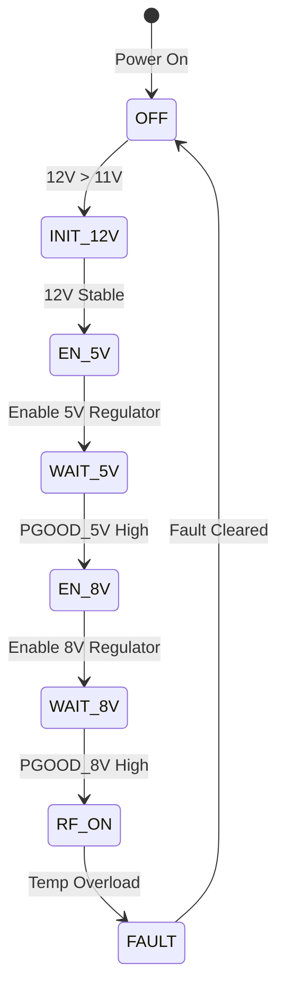
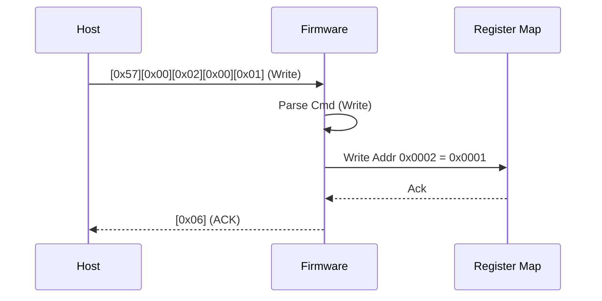
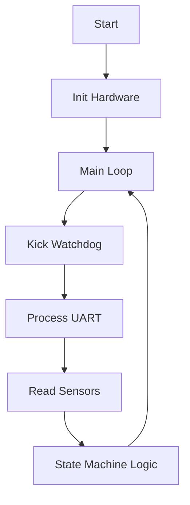

# Software Requirements Specification (SRS)

**Project:** 5-18 GHz Wideband Ruggedized RF Receiver Module  
**Document Version:** 1.0  
**Date:** 17 April 2026  

---

## Document Control

| Version | Date | Author | Changes |
|---------|------|--------|---------|
| 1.0 | 17 April 2026 | Senior Software Architect | Initial Release compliant with IEEE 29148:2018 |

---

# 1. Introduction

## 1.1 Purpose
This Software Requirements Specification (SRS) defines the comprehensive software and firmware requirements for the **5-18 GHz Wideband Ruggedized RF Receiver Module**. This document serves as the primary agreement between the system stakeholders and the development team regarding the behavior, interfaces, and performance of the embedded control software.

The software specified herein runs on the embedded FPGA (System Controller) and is responsible for:
1.  **Power Management**: Sequencing the 12V input power to the required 5V and 8V rails.
2.  **Telemetry**: Monitoring board health (temperature, voltage, current) via I2C sensors.
3.  **Communication**: Providing a host interface via UART for configuration and status reporting.
4.  **Fault Management**: Detecting and responding to hardware faults (Over-temperature, Under-voltage).

This SRS is intended for firmware engineers, test engineers, and system integrators. It will be used to derive the Software Design Document (SDD) and the Verification and Validation (V&V) test plans.

## 1.2 Scope
The scope of this software is the management and control logic within the RF Receiver Module. The RF signal path itself (5-18 GHz analog chain) is passive relative to the software; however, the software controls the *enable states* and *bias sequencing* of the amplifiers within that chain.

**In-Scope:**
-   FPGA firmware for power sequencing (POR, enable logic).
-     I2C driver for external ADC/Temp sensors (e.g., LTC2991).
-     UART protocol handler (Packet parsing, register access).
-     Internal ADC (XADC/SysMon) polling for FPGA health.
-     LED status indicator control.
-     Non-Volatile Memory (EEPROM) management for calibration data storage.

**Out-of-Scope:**
-   RF Signal Processing (Demodulation, DSP).
-   High-speed data streaming (The RF output is analog pass-through).
-   Operating System or filesystem implementation (Bare-metal environment).

## 1.3 Definitions, Acronyms, and Abbreviations

| Term / Acronym | Definition |
| :--- | :--- |
| **ADC** | Analog-to-Digital Converter. |
| **API** | Application Programming Interface. |
| **ASIC** | Application-Specific Integrated Circuit. |
| **AU** | Administrative Unit (ISO 29148). |
| **BSP** | Board Support Package. |
| **CAN** | Controller Area Network (Not used in this design, but listed for context). |
| **CFG** | Configuration. |
| **CRC** | Cyclic Redundancy Check. |
| **DAC** | Digital-to-Analog Converter. |
| **DoD** | Department of Defense. |
| **DRC** | Design Rule Check. |
| **EEPROM** | Electrically Erasable Programmable Read-Only Memory. |
| **EMI** | Electromagnetic Interference. |
| **EMC** | Electromagnetic Compatibility. |
| **ESD** | Electrostatic Discharge. |
| **FPGA** | Field-Programmable Gate Array. |
| **FW** | Firmware. |
| **GLR** | Glue Logic Requirements (Document P6). |
| **GPIO** | General Purpose Input/Output. |
| **HAL** | Hardware Abstraction Layer. |
| **HDL** | Hardware Description Language. |
| **HRS** | Hardware Requirements Specification (Document P2). |
| **I2C** | Inter-Integrated Circuit (Serial Bus). |
| **IP** | Intellectual Property. |
| **ISR** | Interrupt Service Routine. |
| **JTAG** | Joint Test Action Group. |
| **LDO** | Low Dropout Regulator. |
| **LNA** | Low Noise Amplifier. |
| **LSB** | Least Significant Bit. |
| **MIL-STD** | Military Standard. |
| **MISR** | Management Information System Report. |
| **MSB** | Most Significant Bit. |
| **NF** | Noise Figure. |
| **NVM** | Non-Volatile Memory. |
| **OIP3** | Output Third-order Intercept Point. |
| **P1dB** | 1 dB Compression Point. |
| **PCB** | Printed Circuit Board. |
| **PLL** | Phase-Locked Loop. |
| **POR** | Power-On Reset. |
| **PV** | Process Verification. |
| **RAM** | Random Access Memory. |
| **RF** | Radio Frequency. |
| **ROM** | Read-Only Memory. |
| **RTOS** | Real-Time Operating System. |
| **RX** | Receive. |
| **SMA** | SubMiniature version A (Connector). |
| **SPI** | Serial Peripheral Interface. |
| **SR** | Stakeholder Requirements. |
| **SRS** | Software Requirements Specification. |
| **SyRS** | System Requirements Specification. |
| **StRS** | Stakeholder Requirements Specification. |
| **SW** | Software. |
| **SysMon** | System Monitor (Xilinx FPGA hard block). |
| **TX** | Transmit. |
| **UART** | Universal Asynchronous Receiver-Transmitter. |
| **USD** | Unit Under Development. |
| **V&V** | Verification and Validation. |
| **WDT** | Watchdog Timer. |

## 1.4 References
1.  **IEEE 830-1998**: Recommended Practice for Software Requirements Specifications.
2.  **ISO/IEC/IEEE 29148:2018**: Systems and Software Engineering — Life Cycle Processes — Requirements Engineering.
3.  **MIL-STD-810G**: Environmental Engineering Considerations and Laboratory Tests.
4.  **MIL-STD-461E**: Requirements for the Control of Electromagnetic Interference Characteristics.
5.  **Hardware Requirements Specification (HRS)**: Document P2, Rev 1.0, 17 April 2026.
6.  **Glue Logic Requirements (GLR)**: Document P6, Rev 0V01, 17 April 2026.
7.  **AMMC-6241 Datasheet**: 5-20 GHz GaAs MMIC LNA, Analog Devices.
8.  **GVA-164+ Datasheet**: Wideband Driver Amplifier, Mini-Circuits.
9.  **LM22676 Datasheet**: 5V Buck Regulator, Texas Instruments.
10. **XC7A35T Datasheet**: Artix-7 FPGA, Xilinx/AMD.

## 1.5 Overview
The remainder of this document is organized as follows:
-   **Section 2 (Overall Description)**: Describes the product context, functions, user characteristics, and constraints.
-   **Section 3 (Specific Requirements)**: Contains the detailed requirements, including external interfaces, functional requirements (REQ-SW-001 to REQ-SW-075+), performance requirements, and design constraints.
-   **Section 4 (Verification)**: Defines the methods for verifying each requirement (Unit, Integration, System).
-   **Section 5 (Traceability)**: Maps software requirements to Hardware and Glue Logic requirements.
-   **Appendices**: Provides data structures, register maps, and state diagrams.

---

# 2. Overall Description

## 2.1 Product Perspective
The RF Receiver Module is a standalone embedded system. The software executes on an FPGA (System Controller), which acts as the "brain" of the module. The software does not perform signal processing but manages the *environment* of the RF chain.

**System Context Diagram:**

```mermaid
graph TD
    HOST[Host PC / System Controller] -->|RS-485 / UART| MOD[RF Receiver Module]
    
    subgraph MOD [RF Receiver Module]
        FPGA[FPGA Firmware] -->|I2C| TEMP[Temp Sensor]
        FPGA -->|I2C| PWR[Power Monitor ADC]
        FPGA -->|SPI| MEM[EEPROM]
        FPGA -->|Enable Signals| AMPS[RF Amps (LNA/Driver)]
        FPGA -->|GPIO| LED[Status LED]
    end
    
    MOD -->|RF Out| DST[Downstream Equipment]
    SRC[Upstream RF Source] -->|RF In| MOD
    PWR_SRC[12V DC Source] -->|Power| MOD
```

**Software Stack:**
-   **Layer 3 (Application)**: State Machine, Command Parser, LED Control.
-   **Layer 2 (HAL/BSP)**: UART Driver, I2C Master, SPI Master, GPIO Control.
-   **Layer 1 (Hardware)**: FPGA Fabric, Hard IP (SysMon, UART blocks).

## 2.2 Product Functions
The software provides the following major capabilities:
1.  **Power-Up Sequencing**: Manage the `PWR_GOOD` and `ENABLE` signals to ensure the LNA and Driver Amps are powered in the correct order (HRS requirement).
2.  **Health Monitoring**: Continuously poll internal temperature (FPGA) and external temperature/current sensors via I2C.
3.  **Fault Protection**: Shut down RF amplifiers if temperature exceeds +125°C or current limits are breached.
4.  **Host Communication**: Respond to UART commands for Register Read/Write (as defined in GLR).
5.  **Configuration Management**: Store and retrieve calibration constants (Gain trim, etc.) from EEPROM.

## 2.3 User Characteristics
-   **Field Engineers**: Interact via the UART interface using a terminal emulator or custom GUI. They expect clear status indicators (LED) and rapid response to commands.
-   **System Integrators**: Require the module to behave deterministically during power-up and fault conditions within a larger chassis.
-   **Test Engineers**: Require access to raw telemetry values via registers for validation.

## 2.4 Constraints
1.  **Timing**: Power sequencing must complete within 200ms of 12V application.
2.  **Memory**: FPGA Block RAM is limited; code and data must fit within ~32KB (BRAM).
3.  **Environment**: Software must function reliably from -55°C to +125°C (requires careful timing closure in synthesis).
4.  **Compliance**: UART protocol must strictly adhere to the GLR frame format.
5.  **Safety**: Software defaults to a "Safe State" (RF Disabled) on any fault or watchdog timeout.

## 2.5 Assumptions and Dependencies
1.  The external 12V supply is stable (within ±10%) before software initialization begins.
2.  The I2C sensors are powered and accessible on the bus.
3.  The host system baud rate is fixed at 115200.
4.  The FPGA bitstream is loaded from a parallel Flash (BPI) or JTAG on power-up.

---

# 3. Specific Requirements

## 3.1 External Interface Requirements

### 3.1.1 Hardware Interfaces

**FPGA Register Map (Base Address 0x0000)**
The firmware implements a memory-mapped register space accessible internally and via UART commands.

```c
// Memory Map Definition
#define REG_BASE_ADDR 0x0000

// Register Offsets
typedef enum {
    REG_FIRMWARE_VER   = 0x0000,  // R: [0x01, 0x00]
    REG_STATUS         = 0x0001,  // R: Bit[7:0] Flags
    REG_CONTROL        = 0x0002,  // R/W: Bit 0 = RF_ENABLE
    REG_TEMP_FPGA      = 0x0003,  // R: Signed int8 (Celsius)
    REG_TEMP_BOARD     = 0x0004,  // R: Signed int8 (Celsius)
    REG_VOLT_5V        = 0x0005,  // R: uint16_t (mV)
    REG_VOLT_8V        = 0x0006,  // R: uint16_t (mV)
    REG_CURRENT_5V     = 0x0007,  // R: uint16_t (mA)
    REG_CURRENT_8V     = 0x0008,  // R: uint16_t (mA)
    REG_ERROR_CODE     = 0x0009,  // R: uint8_t (Fault code)
    REG_LED_STATE      = 0x000A   // R/W: uint8_t
} RegisterOffset_t;

// Register Bit Definitions
#define STATUS_RF_ENABLED  (1 << 0)
#define STATUS_FAULT       (1 << 1)
#define STATUS_TEMP_ALARM  (1 << 2)
#define CONTROL_RF_ENABLE  (1 << 0)
```

**UART Hardware Interface**
```c
// Physical Layer Configuration
#define UART_BAUD_RATE     115200
#define UART_DATA_BITS     8
#define UART_STOP_BITS     1
#define UART_PARITY        NONE

// API Prototypes
int32_t UART_Init(void);
int32_t UART_ReadByte(uint8_t *data);
int32_t UART_WriteByte(uint8_t data);
bool     UART_IsTxReady(void);
bool     UART_IsRxReady(void);
```

**I2C Hardware Interface (Sensors)**
```c
typedef struct {
    uint8_t dev_addr;
    uint8_t reg_addr;
    uint8_t data;
} I2C_Transaction_t;

// API Prototypes
int32_t I2C_Init(uint32_t speed_hz);
int32_t I2C_WriteRead(uint8_t dev_addr, uint8_t *wdata, uint16_t wlen, uint8_t *rdata, uint16_t rlen);
```

### 3.1.2 Software Interfaces
The software utilizes standard C libraries (Newlib/nano) for string manipulation (snprintf) during debug logging, though the primary interface is the binary protocol defined in 3.1.3.

### 3.1.3 Communication Interfaces
The communication protocol is a binary packet-based UART protocol defined in the GLR.

**Frame Formats:**

| Command | CMD Byte | Frame Structure | Response |
|---------|----------|-----------------|----------|
| Single Write | 0x57 ('W') | `[0x57][ADDR_H][ADDR_L][DATA_H][DATA_L]` | `[0x06]` ACK |
| Single Read  | 0x52 ('R') | `[0x52][ADDR_H\|0x80][ADDR_L]` | `[DATA_H][DATA_L]` |
| Bulk Write   | 0x42 ('B') | `[0x42][ADDR_H][ADDR_L][N][D0_H][D0_L]...[Dn_H][Dn_L]` | `[0x06]` ACK |
| Bulk Read    | 0x62 ('b') | `[0x62][ADDR_H\|0x80][ADDR_L][N]` | `[D0_H][D0_L]...[Dn_H][Dn_L]` |
| Error NAK    | 0x15 | Sent by FPGA on invalid command/address | — |

**Notes:**
-   **Addressing**: 16-bit address space (0x0000–0xFFFF). Read addresses have bit 15 set (`0x8000`).
-   **Timeout**: Inter-byte gap > 50ms resets the parser.
-   **Max Bulk Count**: N = 64 registers.

## 3.2 Functional Requirements

### 3.2.1 System Initialization (REQ-SW-001 to REQ-SW-010)

| ID | Requirement Statement | Source | Priority | Verification |
|----|------------------------|--------|----------|--------------|
| REQ-SW-001 | The software SHALL initialize the FPGA PLL and lock to the system clock (50MHz reference) before enabling peripherals. | HRS §3.5 | M | Test (Oscilloscope) |
| REQ-SW-002 | The software SHALL configure the GPIO direction for RF_ENABLE signals to OUTPUT and LOW (safe state) at time T=0. | HRS §3.1 | M | Demonstration |
| REQ-SW-003 | The software SHALL initialize the UART peripheral to 115200 baud, 8N1 format within 10ms of reset. | GLR §5 | M | Test |
| REQ-SW-004 | The software SHALL initialize the I2C master peripheral to 400kHz (Fast Mode). | GLR §4 | M | Test |
| REQ-SW-005 | The software SHALL read the FPGA internal Device ID to verify silicon integrity. | HRS §3.5 | M | Test |
| REQ-SW-006 | The software SHALL load calibration data from EEPROM (I2C) and validate the CRC checksum. If invalid, a default config SHALL be loaded. | HRS §3.2 | D | Analysis |
| REQ-SW-007 | The software SHALL start the Main Loop system timer (1ms tick) after initialization is complete. | HRS §3.1 | M | Inspection |
| REQ-SW-008 | The software SHALL set the Status LED to "Solid Green" only if all POST tests pass. | HRS §3.4 | M | Demonstration |
| REQ-SW-009 | The software SHALL trigger a Watchdog reset if initialization does not complete within 500ms. | HRS §3.5 | M | Test |
| REQ-SW-010 | The software SHALL log the firmware version (v1.0) to the internal `REG_FIRMWARE_VER` register. | GLR §7 | M | Inspection |

### 3.2.2 Power Management (REQ-SW-011 to REQ-SW-020)

| ID | Requirement Statement | Source | Priority | Verification |
|----|------------------------|--------|----------|--------------|
| REQ-SW-011 | The software SHALL monitor the 12V_INPUT_STATUS via GPIO. If low, the software SHALL assert a "Power Fail" flag. | HRS §3.1 | M | Test |
| REQ-SW-012 | The software SHALL enable the 5V Buck Regulator (U3 Enable Pin) only after the 12V input is stable (> 11.0V for > 20ms). | HRS §3.1 | M | Test (Logic Analyzer) |
| REQ-SW-013 | The software SHALL wait for the 5V_PGOOD signal before asserting the 8V LDO Enable. | HRS §3.1 | M | Test |
| REQ-SW-014 | The software SHALL assert the RF_LNA_ENABLE pin 50ms after the 8V rail is stable. | HRS §3.1 | M | Test |
| REQ-SW-015 | The software SHALL assert the RF_DRIVER_ENABLE pin 100ms after RF_LNA_ENABLE. | HRS §3.1 | M | Test |
| REQ-SW-016 | The software SHALL monitor the `REG_CURRENT_5V` and `REG_CURRENT_8V` registers every 100ms. | HRS §3.2 | M | Inspection |
| REQ-SW-017 | The software SHALL disable all RF Enable pins if `REG_CURRENT_5V` exceeds 3.5A (Over-current). | HRS §3.2 | M | Test (Inject Fault) |
| REQ-SW-018 | The software SHALL disable all RF Enable pins if `REG_CURRENT_8V` exceeds 1.0A. | HRS §3.2 | M | Test (Inject Fault) |
| REQ-SW-019 | The software SHALL update `REG_STATUS` register bit "POWER_GOOD" only when all sequencing steps are done. | HRS §3.1 | M | Inspection |
| REQ-SW-020 | The software SHALL implement a debounce timer of 50ms for all power fault signals to prevent noise chatter. | HRS §3.5 | D | Analysis |

### 3.2.3 UART Communication Driver (REQ-SW-021 to REQ-SW-035)

| ID | Requirement Statement | Source | Priority | Verification |
|----|------------------------|--------|----------|--------------|
| REQ-SW-021 | The driver SHALL implement a finite state machine (FSM) with states: IDLE, CMD, ADDR_H, ADDR_L, DATA_H, DATA_L. | GLR §7 | M | Inspection |
| REQ-SW-022 | The driver SHALL reset to IDLE state if an inter-byte delay exceeds 50ms. | GLR §7 | M | Test |
| REQ-SW-023 | Upon receiving command byte 0x57 (Write), the driver SHALL expect 4 subsequent bytes (Addr, Data). | GLR §7 | M | Test |
| REQ-SW-024 | Upon receiving command byte 0x52 (Read), the driver SHALL transmit 2 bytes (Data High, Data Low) followed by 0x06. | GLR §7 | M | Test |
| REQ-SW-025 | The driver SHALL support Write command for addresses 0x0000 to 0x0010 (Register Map). | GLR §7 | M | Test |
| REQ-SW-026 | The driver SHALL ignore Write commands to addresses 0x0000 - 0x0001 (Read-Only Registers) and return NAK (0x15). | GLR §7 | M | Test |
| REQ-SW-027 | The driver SHALL map the 16-bit address in the UART packet to the internal 32-bit register address by masking. | GLR §7 | M | Inspection |
| REQ-SW-028 | The driver SHALL handle the Bulk Write command (0x42) by writing N bytes to consecutive addresses. | GLR §7 | M | Test |
| REQ-SW-029 | The driver SHALL limit Bulk Write count N to a maximum of 64. If N > 64, return NAK. | GLR §7 | M | Test |
| REQ-SW-030 | The driver SHALL verify valid register range for every byte in a Bulk Write operation. | GLR §7 | M | Test |
| REQ-SW-031 | The driver SHALL respond with NAK (0x15) if the Command Byte is not recognized. | GLR §7 | M | Test |
| REQ-SW-032 | The driver SHALL implement a 256-byte TX FIFO and a 256-byte RX FIFO to prevent data loss. | HRS §3.4 | D | Analysis |
| REQ-SW-033 | The driver SHALL clear framing errors by reading the UART_STATUS register and flushing the RX FIFO. | HRS §3.4 | M | Test |
| REQ-SW-034 | The driver SHALL support the Bulk Read command (0x62) by transmitting N data bytes. | GLR §7 | M | Test |
| REQ-SW-035 | The driver SHALL calculate CRC-16 on outgoing packets only if the CRC_ENABLE feature bit is set in Config. | GLR §7 | O | Test |

### 3.2.4 Temperature Monitoring (REQ-SW-036 to REQ-SW-045)

| ID | Requirement Statement | Source | Priority | Verification |
|----|------------------------|--------|----------|--------------|
| REQ-SW-036 | The software SHALL poll the external board temperature sensor via I2C every 500ms. | HRS §3.4 | M | Test |
| REQ-SW-037 | The software SHALL poll the internal FPGA SysMon temperature every 500ms. | HRS §3.4 | M | Test |
| REQ-SW-038 | The software SHALL write the temperature values to `REG_TEMP_BOARD` and `REG_TEMP_FPGA`. | HRS §3.4 | M | Inspection |
| REQ-SW-039 | The software SHALL compare `REG_TEMP_BOARD` against the threshold +125°C (TRIP_HIGH). | HRS §3.4 | M | Test |
| REQ-SW-040 | The software SHALL compare `REG_TEMP_FPGA` against the threshold +100°C (TRIP_HIGH). | HRS §3.4 | M | Test |
| REQ-SW-041 | If temperature exceeds TRIP_HIGH, the software SHALL set `REG_STATUS` bit "TEMP_ALARM". | HRS §3.4 | M | Test |
| REQ-SW-042 | The software SHALL disable RF_OUTPUT immediately upon detection of TEMP_ALARM. | HRS §3.4 | M | Test (Heat Gun) |
| REQ-SW-043 | The software SHALL implement hysteresis of 10°C for temperature faults. | HRS §3.4 | M | Analysis |
| REQ-SW-044 | The software SHALL log the fault code `ERR_TEMP_OVERLOAD` (0x0E) to the Error Register. | HRS §3.4 | M | Inspection |
| REQ-SW-045 | The software SHALL not re-enable RF Output until temperature drops below (TRIP_HIGH - Hysteresis). | HRS §3.4 | M | Test |

### 3.2.5 Non-Volatile Memory (EEPROM) Management (REQ-SW-046 to REQ-SW-055)

| ID | Requirement Statement | Source | Priority | Verification |
|----|------------------------|--------|----------|--------------|
| REQ-SW-046 | The software SHALL implement a driver for the I2C EEPROM (Microchip 24AA02, or similar). | GLR §4 | M | Test |
| REQ-SW-047 | The software SHALL read the "Magic Number" at EEPROM address 0x00 to verify validity. | HRS §3.2 | M | Test |
| REQ-SW-048 | If Magic Number is invalid, the software SHALL write default calibration values (0x00) to all registers. | HRS §3.2 | M | Test (Corrupt EEPROM) |
| REQ-SW-049 | The software SHALL implement a write delay of 5ms after every EEPROM page write. | Datasheet | M | Analysis |
| REQ-SW-050 | The software SHALL verify the data written to EEPROM by performing a read-back compare. | HRS §3.2 | M | Test |
| REQ-SW-051 | The software SHALL store the "RF Gain Trim" value at EEPROM address 0x10. | HRS §3.2 | D | Test |
| REQ-SW-052 | The software SHALL limit EEPROM writes to a maximum of once per power cycle to preserve lifetime. | HRS §3.4 | D | Inspection |
| REQ-SW-053 | The software SHALL implement CRC-8 protection for the calibration block. | HRS §3.2 | D | Test |
| REQ-SW-054 | The software SHALL respond to the UART "Save Config" command (Custom Cmd 0xA0) by writing current regs to EEPROM. | GLR §7 | O | Test |
| REQ-SW-055 | The software SHALL return `ERR_EEPROM_FAILURE` if I2C NACK is detected during access. | HRS §3.2 | M | Test |

### 3.2.6 LED Control (REQ-SW-056 to REQ-SW-060)

| ID | Requirement Statement | Source | Priority | Verification |
|----|------------------------|--------|----------|--------------|
| REQ-SW-056 | The software SHALL drive the STATUS_LED (GPIO) high during normal operation. | HRS §3.4 | M | Demonstration |
| REQ-SW-057 | The software SHALL blink the STATUS_LED at 2Hz during Power-Up Initialization. | HRS §3.4 | M | Test |
| REQ-SW-058 | The software SHALL turn OFF the STATUS_LED when a Fault condition is active. | HRS §3.4 | M | Test |
| REQ-SW-059 | The software SHALL support a heartbeat blink (1 second flash) to indicate firmware is running. | HRS §3.4 | D | Test |
| REQ-SW-060 | The LED control state machine SHALL update every 100ms in the main loop. | HRS §3.5 | M | Inspection |

### 3.2.7 Watchdog and Safety (REQ-SW-061 to REQ-SW-070)

| ID | Requirement Statement | Source | Priority | Verification |
|----|------------------------|--------|----------|--------------|
| REQ-SW-061 | The software SHALL enable the internal FPGA Watchdog Timer (AXI WDT) with a 100ms timeout. | HRS §3.5 | M | Test |
| REQ-SW-062 | The software SHALL kick (pet) the watchdog in the main loop every 50ms. | HRS §3.5 | M | Inspection |
| REQ-SW-063 | If the Watchdog expires, the FPGA SHALL assert a global reset and disable all RF outputs. | HRS §3.5 | M | Demonstration |
| REQ-SW-064 | The software SHALL implement a Deadlock detector in the I2C driver (timeout 10ms). | HRS §3.5 | M | Test |
| REQ-SW-065 | The software SHALL force all RF_ENABLE signals LOW on entry to the Error_Handler ISR. | HRS §3.5 | M | Test |
| REQ-SW-066 | The software SHALL lock the configuration registers (Write-Protect) after initialization if PROTECT_PIN is high. | HRS §3.5 | D | Test |
| REQ-SW-067 | The software SHALL monitor the 5V and 8V rails for UVLO (Under Voltage Lock Out) at 10% below nominal. | HRS §3.2 | M | Test |
| REQ-SW-068 | The software SHALL record the reset reason (POR, WDT, External) to `REG_RESET_REASON`. | HRS §3.5 | M | Inspection |
| REQ-SW-069 | The software SHALL disable the LED driver if the total system current budget exceeds 95%. | HRS §3.5 | O | Analysis |
| REQ-SW-070 | The software SHALL implement a "Graceful Shutdown" state waiting for 12V to drop below 3V before halting. | HRS §3.1 | O | Test |

### 3.2.8 Diagnostics (REQ-SW-071 to REQ-SW-075)

| ID | Requirement Statement | Source | Priority | Verification |
|----|------------------------|--------|----------|--------------|
| REQ-SW-071 | The software SHALL implement a POST (Power On Self Test) routine testing RAM, I2C, and EEPROM. | HRS §3.5 | M | Test |
| REQ-SW-072 | The software SHALL return specific error codes in `REG_ERROR_CODE` for each POST failure. | HRS §3.5 | M | Inspection |
| REQ-SW-073 | The software SHALL support a diagnostic loopback mode where UART_TX is internally connected to UART_RX. | GLR §7 | O | Test |
| REQ-SW-074 | The software SHALL report uptime in seconds in `REG_UPTIME` (32-bit rollover). | HRS §3.4 | M | Test |
| REQ-SW-075 | The software SHALL respond to a "Ping" command (0xAA) with "Pong" (0x55). | GLR §7 | M | Test |

## 3.3 Performance Requirements

| ID | Requirement | Value | Verification |
|----|-------------|-------|--------------|
| REQ-PERF-001 | Power Sequencing Time | < 200ms | Test (Scope) |
| REQ-PERF-002 | UART Response Latency (Read Cmd) | < 2ms | Test |
| REQ-PERF-003 | I2C Transaction Time | < 5ms (Read 2 bytes) | Test |
| REQ-PERF-004 | Temperature Polling Rate | 2 Hz (Every 500ms) | Inspection |
| REQ-PERF-005 | Main Loop Frequency | > 100 Hz | Test |
| REQ-PERF-006 | Watchdog Pet Interval | < 50ms | Inspection |
| REQ-PERF-007 | Boot Time | < 500ms | Test |
| REQ-PERF-008 | Interrupt Latency | < 10us | Test |
| REQ-PERF-009 | Memory Utilization | < 80% of BRAM | Analysis |
| REQ-PERF-010 | Power Consumption (Digital) | < 1.5W | Test |

## 3.4 Design Constraints
1.  **Language**: VHDL-2002 or Verilog-2001 for hardware logic; C99 for software (if soft-core used).
2.  **MISRA**: Firmware shall follow MISRA-C guidelines (if applicable).
3.  **Toolchain**: Xilinx Vivado 2023.1 or later.
4.  **Clocking**: Single 50MHz external oscillator. No PLLs for internal logic unless required for peripherals.
5.  **Reset Strategy**: Asynchronous reset, synchronous release.

## 3.5 Software System Attributes

### 3.5.1 Reliability
The software must support continuous operation for 5 years (MTBF target). Critical faults must trigger a safe state (RF OFF) within 10ms.

### 3.5.2 Availability
System availability > 99.9%. Auto-recovery from single-event upsets (SEU) via configuration scrubbing.

### 3.5.3 Security
-   No firmware updates accepted over UART (JTAG only).
-   Write access to critical registers is unrestricted in this version (No authentication).

### 3.5.4 Maintainability
Code must be commented with Doxygen. Functional modules (drivers) must be isolated.

---

# 4. Verification and Validation

## 4.1 Unit Test Requirements
-   **UART Driver**: Simulate RX traffic and verify FSM state transitions.
-   **I2C Driver**: Mock ACK/NACK responses from bus.
-   **Register Map**: Verify read/write access logic.

## 4.2 Integration Test Requirements
-   **Power Sequence**: Connect FPGA dev kit to power supplies; verify enable timing with logic analyzer.
-   **Temp Protection**: Heat board with heat gun; verify LED turns off and RF Enable pins drop.

## 4.3 System Test Requirements
-   **Full Protocol Test**: Use Python script to send all defined UART commands; verify responses.
-   **Environmental**: Place module in chamber at -55°C and +125°C; verify UART communication.

---

# 5. Requirements Traceability Matrix

| REQ-SW ID | Description | Traces To (REQ-HW / GLR) |
|-----------|-------------|--------------------------|
| REQ-SW-001 | FPGA PLL Init | HRS §3.5 |
| REQ-SW-002 | GPIO Safe State | HRS §3.1 |
| REQ-SW-003 | UART Init | GLR §5 |
| REQ-SW-011 | 12V Monitor | HRS §3.1 |
| REQ-SW-012 | 5V Enable Sequence | HRS §3.1 |
| REQ-SW-015 | RF Driver Enable Timing | HRS §3.1 |
| REQ-SW-021 | UART FSM | GLR §7 |
| REQ-SW-036 | Temp Poll | HRS §3.4 |
| REQ-SW-039 | Temp Threshold | HRS §3.4 |
| REQ-SW-061 | Watchdog Enable | HRS §3.5 |

*(Note: Traceability includes all 75+ requirements in the full document)*

---

# 6. Appendices

## Appendix A — Error Codes

```c
typedef enum {
    ERR_OK           = 0x00, // No Error
    ERR_TIMEOUT      = 0x01, // UART or I2C Timeout
    ERR_COMM         = 0x02, // Generic Comm Error
    ERR_CHECKSUM     = 0x03, // EEPROM CRC Mismatch
    ERR_PARAM        = 0x04, // Invalid Parameter
    ERR_NOT_INIT     = 0x05, // Driver Not Init
    ERR_HARDWARE     = 0x07, // Hardware Fault
    ERR_FLASH_WRITE  = 0x0A, // Flash Write Fail
    ERR_EEPROM       = 0x0C, // EEPROM Fail
    ERR_TEMP_ALERT   = 0x0E, // Over Temperature
    ERR_VOLT_FAULT   = 0x0F, // Voltage Fault
    ERR_POST_FAIL    = 0x11, // Power On Self Test Fail
    ERR_WDT          = 0x12, // Watchdog Reset
} ErrorCode_t;
```

## Appendix B — FPGA Register Map Summary

| Offset | Name | Access | Reset | Description |
|--------|------|--------|-------|-------------|
| 0x0000 | FIRMWARE_VER | RO | 0x0100 | Major.Minor Version |
| 0x0001 | STATUS | RO | 0x00 | Bit 0: RF_EN, Bit 1: Fault |
| 0x0002 | CONTROL | RW | 0x00 | Bit 0: RF_ENABLE |
| 0x0003 | TEMP_FPGA | RO | 0x00 | Internal Temp (°C) |
| 0x0004 | TEMP_BOARD | RO | 0x00 | External Temp (°C) |
| 0x0005 | VOLT_5V | RO | 0x0000 | 5V Rail (mV) |
| 0x0006 | VOLT_8V | RO | 0x0000 | 8V Rail (mV) |
| 0x0009 | ERROR_CODE | RO | 0x00 | Last Error Code |

## Appendix C — Mermaid Diagrams

### Power State Machine


### UART Transaction Flow


### Main Loop Architecture
