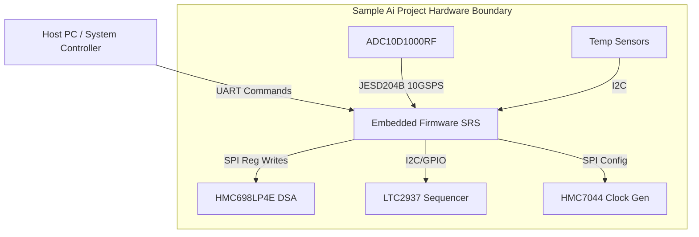
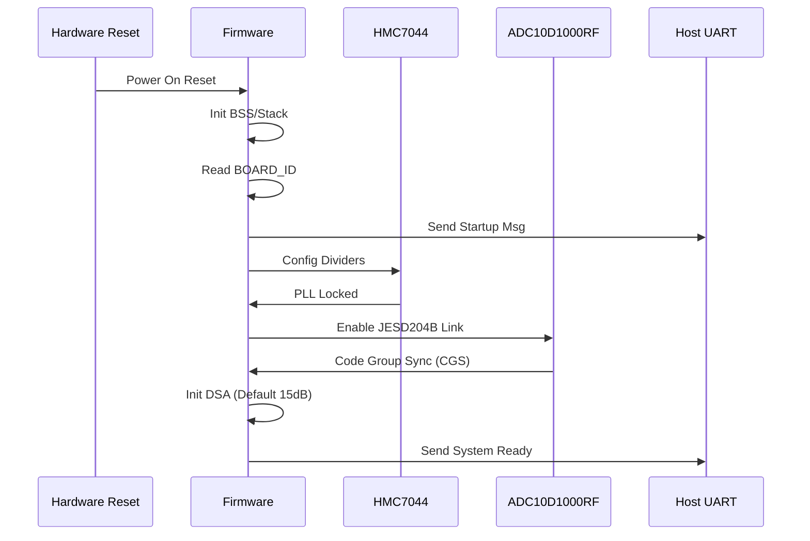
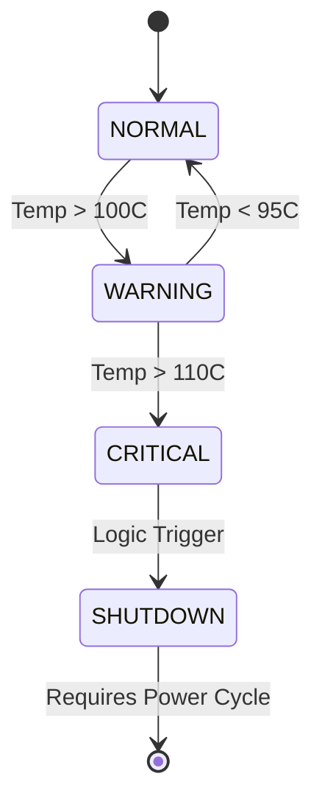
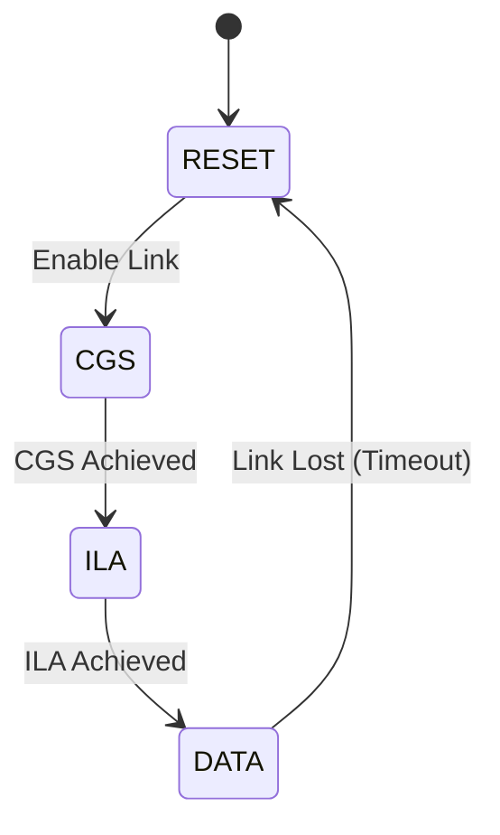
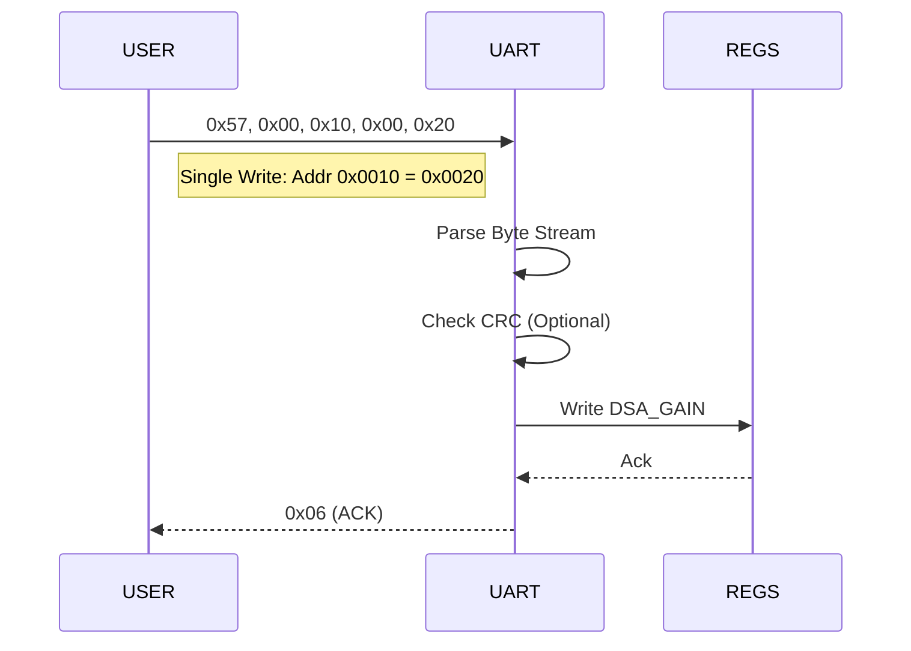
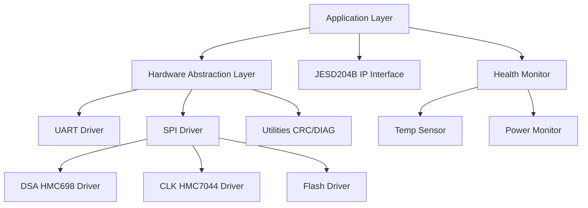

# Software Requirements Specification (SRS)

**Project:** Sample Ai Project
**Document Version:** 1.0
**Date:** 16 April 2026
**Author:** System Architect

---

## Document Control

| Version | Date | Author | Changes |
|---------|------|--------|---------|
| 1.0 | 16 April 2026 | System Architect | Initial Release of SRS for Sample Ai Project |

---

# 1. Introduction

## 1.1 Purpose
This Software Requirements Specification (SRS) document defines the comprehensive software and firmware requirements for the **Sample Ai Project**, a military-grade 5-18 GHz wideband RF receiver system. This document serves as the primary technical reference for the development of the embedded firmware executing on the RT-Kintex-7-RT FPGA and associated microcontroller subsystems.

The purpose of this SRS is to:
1.  Specify the functional behavior of the firmware, including RF front-end control (gain/attenuation), data acquisition via JESD204B, and external communication interfaces.
2.  Define performance constraints regarding timing (latency, jitter), memory usage, and throughput.
3.  Ensure compliance with safety-critical coding standards (MISRA-C:2012) and environmental constraints (radiation tolerance, temperature extremes).
4.  Provide a baseline for verification, validation, and traceability to the Hardware Requirements Specification (HRS) and Glue Logic Requirements (GLR).

## 1.2 Scope
The software scope encompasses the **Embedded Control Software** and **Firmware IP Cores** required to operate the RF receiver module. Specifically, this includes:
*   **System Initialization:** Power-on sequencing (LTC2937 interaction), clock tree configuration (HMC7044), and FPGA configuration loading.
*   **RF Control:** SPI drivers for the HMC698LP4E Digital Step Attenuator (DSA) to implement Automatic Gain Control (AGC).
*   **Data Path:** JESD204B Link Layer logic to receive 10 GSPS ADC data, frame alignment, and buffering.
*   **Host Communication:** UART command parser implementing the register read/write protocol and I2C expansion bus for sensors.
*   **Diagnostics:** Built-In Self-Test (BIST), power supply monitoring, and temperature protection interlocks.

**Exclusions:** This SRS does not cover the host-side PC software used for spectrum visualization or the physical design of the PCB.

## 1.3 Definitions, Acronyms, and Abbreviations

| Term | Definition |
| :--- | :--- |
| **AGC** | Automatic Gain Control. Firmware algorithm adjusting DSA to maintain optimal ADC input level. |
| **API** | Application Programming Interface. |
| **BGA** | Ball Grid Array. |
| **BIST** | Built-In Self-Test. |
| **BRAM** | Block RAM. Memory resource within the FPGA. |
| **BSP** | Board Support Package. Low-level drivers for hardware peripherals. |
| **CMOS** | Complementary Metal-Oxide-Semiconductor. |
| **CPLD** | Complex Programmable Logic Device. |
| **CRC** | Cyclic Redundancy Check. |
| **CS** | Chip Select. |
| **DAC** | Digital-to-Analog Converter. |
| **DSA** | Digital Step Attenuator. |
| **DUT** | Device Under Test. |
| **EMI** | Electromagnetic Interference. |
| **EMC** | Electromagnetic Compatibility. |
| **FIFO** | First-In, First-Out. Data buffer structure. |
| **FPGA** | Field-Programmable Gate Array. |
| **GLR** | Glue Logic Requirements. The document defining register maps and pinouts. |
| **GPIO** | General Purpose Input/Output. |
| **GSPS** | Giga-Samples Per Second. |
| **HAL** | Hardware Abstraction Layer. |
| **HRS** | Hardware Requirements Specification. |
| **I2C** | Inter-Integrated Circuit. Serial bus protocol. |
| **ICD** | Interface Control Document. |
| **IP** | Intellectual Property (Core). |
| **IRQ** | Interrupt Request. |
| **ISR** | Interrupt Service Routine. |
| **JTAG** | Joint Test Action Group. Debug interface. |
| **JESD204B** | JEDEC Standard for High-Speed Data Converter Interfaces. |
| **LDO** | Low Dropout Regulator. |
| **LNA** | Low Noise Amplifier. |
| **LUT** | Look-Up Table. |
| **LVDS** | Low-Voltage Differential Signaling. |
| **MCU** | Microcontroller Unit. |
| **MMIC** | Monolithic Microwave Integrated Circuit. |
| **MOS** | Mean Opinion Score. |
| **MoSCoW** | Must Have, Should Have, Could Have, Won't Have. |
| **MSB** | Most Significant Bit. |
| **MTBF** | Mean Time Between Failures. |
| **NVM** | Non-Volatile Memory. |
| **PCB** | Printed Circuit Board. |
| **PLL** | Phase-Locked Loop. |
| **POST** | Power-On Self-Test. |
| **QSPI** | Quad Serial Peripheral Interface. |
| **RAM** | Random Access Memory. |
| **RF** | Radio Frequency. |
| **ROM** | Read-Only Memory. |
| **RTOS** | Real-Time Operating System. |
| **RTM** | Requirements Traceability Matrix. |
| **Rx** | Receive. |
| **SFDR** | Spurious-Free Dynamic Range. |
| **SNR** | Signal-to-Noise Ratio. |
| **SPI** | Serial Peripheral Interface. |
| **StRS** | Stakeholder Requirements Specification. |
| **SyRS** | System Requirements Specification. |
| **SRS** | Software Requirements Specification. |
| **TTL** | Transistor-Transistor Logic. |
| **UART** | Universal Asynchronous Receiver-Transmitter. |
| **VID** | Vendor ID. |
| **WDT** | Watchdog Timer. |
| **XML** | Extensible Markup Language. |

## 1.4 References
1.  **IEEE 830-1998**: Recommended Practice for Software Requirements Specifications.
2.  **ISO/IEC/IEEE 29148:2018**: Systems and Software Engineering — Life Cycle Processes — Requirements Engineering.
3.  **MISRA C:2012**: Guidelines for the Use of the C Language in Critical Systems.
4.  **DO-178C**: Software Considerations in Airborne Systems and Equipment Certification (for design rigor reference).
5.  **JESD204B Standard**: JEDEC Solid State Technology Association.
6.  **RT-Kintex-7-RT Datasheet**: Xilinx/AMD UG470.
7.  **ADC10D1000RF Datasheet**: Texas Instruments.
8.  **HMC698LP4E Datasheet**: Analog Devices.
9.  **HMC7044 Datasheet**: Analog Devices.
10. **Sample Ai Project HRS (P2)**: Internal Hardware Requirements Specification.
11. **Sample Ai Project GLR (P6)**: Internal Glue Logic Requirements.

## 1.5 Overview
The remainder of this document is organized as follows:
*   **Section 2 (Overall Description)**: Provides the product perspective, context diagrams, and a summary of major functions. It details the user characteristics and constraints (MISRA-C, Military Temperature).
*   **Section 3 (Specific Requirements)**: The core section containing all detailed software requirements. It is subdivided into External Interfaces, Functional Requirements (75+ IDs), Performance Requirements, and Design Constraints.
*   **Section 4 (Verification)**: Describes the methods used to verify the requirements (Unit, Integration, System).
*   **Section 5 (Traceability)**: Maps software requirements to hardware and stakeholder requirements.
*   **Appendices**: Contains data structures (C code), error codes, register maps, and behavioral diagrams.

---

# 2. Overall Description

## 2.1 Product Perspective
The **Sample Ai Project** firmware operates as a bare-metal/RTOS hybrid on the **RT-Kintex-7-RT FPGA**. The system is a closed-loop RF receiver. The firmware acts as the "control brain" bridging the high-speed analog domain (5-18 GHz) with the digital host interface (UART).

**System Context:**
The software accepts commands via a UART interface from a host controller. It configures the RF Chain (LNA/DSA) and reads digitized samples from the ADC via the JESD204B interface. It continuously monitors environmental sensors (Temperature, Voltage) to ensure safe operation within military standards.



## 2.2 Product Functions
The major software functions are:
1.  **System Initialization:** Execution of POST, configuration of PLLs (HMC7044), and clearing of FIFOs.
2.  **UART Protocol Handler:** Interpretation of Single/Bulk Read/Write commands to access the FPGA register space.
3.  **AGC Algorithm:** Monitoring signal power from the ADC and dynamically adjusting the DSA attenuation to prevent saturation while maximizing SNR.
4.  **JESD204B Link Management:** Establishing the high-speed link with the ADC, handling lane alignment, and detecting link errors.
5.  **Health Monitoring:** Polling temperature sensors and power rails; initiating shutdown if limits are exceeded (-55°C to +125°C).
6.  **Non-Volatile Storage Management:** Reading calibration data from EEPROM and managing flash sectors for configuration storage.
7.  **Watchdog Service:** Kicking the watchdog timer every 100ms to prevent spurious resets.

## 2.3 User Characteristics
*   **Firmware Engineers:** Use this SRS to implement HDL cores and embedded C drivers. They require detailed register maps and timing constraints.
*   **Test Engineers:** Use the functional requirements to develop automated test scripts (Python/TCL) for the manufacturing floor.
*   **Integrators:** Use the UART Protocol section (3.1.3) to integrate the RF module into larger systems.

## 2.4 Constraints
1.  **Compliance:** Firmware SHALL comply with MISRA-C:2012 standards.
2.  **Environment:** SHALL operate reliably from -55°C to +125°C (No dynamic allocation allowed due to heap fragmentation risks in extreme temps).
3.  **Real-Time:** The firmware SHALL respond to UART commands within 10ms.
4.  **Resources:** FPGA BRAM utilization must not exceed 80% to allow for routing.
5.  **Timing:** All setup/hold times for the JESD204B interface must meet the ADC10D1000RF datasheet specifications.

## 2.5 Assumptions and Dependencies
1.  The **LTC2937** Sequencer has successfully brought up all voltage rails before the FPGA exits configuration.
2.  The Reference Clock is stable and within phase noise requirements (<100fs jitter) before software attempts JESD204B link training.
3.  The Host system UART driver is 8-N-1 (8 data bits, No parity, 1 stop bit).

---

# 3. Specific Requirements

## 3.1 External Interface Requirements

### 3.1.1 Hardware Interfaces

**3.1.1.1 Digital Step Attenuator (DSA) Interface (SPI)**
The firmware interfaces with the **HMC698LP4E** via SPI to control gain.
*   **Protocol:** SPI Mode 0 (CPOL=0, CPHA=0).
*   **Max Clock:** 20 MHz.
*   **Bit Width:** 16-bit data chain.
*   **Timing:** Chip Select (CS#) setup time min 10ns, Hold time min 10ns.

**C Struct Definition:**
```c
#include <stdint.h>

typedef struct {
    volatile uint32_t CTRL;      // 0x0000: Control Register (Enable/Soft Reset)
    volatile uint32_t DIVIDER;   // 0x0004: Clock Divisor for SPI SCK
    volatile uint32_t TX_DATA;   // 0x0008: 16-bit data to shift out
    volatile uint32_t RX_DATA;   // 0x000C: 16-bit data shifted in
    volatile uint32_t STATUS;    // 0x0010: Transaction Done bit
} SPI_RegMap_t;

// HMC698LP4E specific packet structure (MSB first)
typedef union {
    uint16_t word;
    struct {
        uint16_t attenuation : 6; // 0-31.75 dB in 0.5 dB steps
        uint16_t reserved   : 4;
        uint16_t load       : 1; // 1 = Load attenuation, 0 = Hold
        uint16_t cs         : 1; // Internal Chip Select control
        uint16_t rsvd2      : 4;
    } bits;
} HMC698_CMD_t;
```

**Driver API:**
```c
/**
 * @brief  Initialize the SPI master controller for DSA interface
 * @param  clk_hz: Frequency in Hz (Max 20MHz)
 * @return 0 on success, -1 on error
 */
int32_t SPI_Init(uint32_t clk_hz);

/**
 * @brief  Write attenuation value to HMC698LP4E
 * @param  atten_db: Floating point attenuation value (0.0 to 31.75)
 * @return 0 on success, -2 if parameter out of range
 */
int32_t DSA_SetAttenuation(float atten_db);
```

**3.1.1.2 Clock Generator (HMC7044) Interface (SPI)**
The HMC7044 requires a 32-bit write sequence for register configuration.

**Driver API:**
```c
/**
 * @brief  Initialize HMC7044 Clock Gen
 * @param  config_profile: Pointer to profile array (from Flash)
 * @return 0 on success
 */
int32_t CLK_Init(const uint32_t *config_profile);

/**
 * @brief  Check PLL Lock Status
 * @param  *locked: Pointer to bool result
 * @return 0 if status read successfully
 */
int32_t CLK_IsLocked(bool *locked);
```

### 3.1.2 Software Interfaces
*   **Standard Library:** ISO C99 Standard Library (limits.h, stdint.h, stdbool.h).
*   **JESD204B IP Core:** Vendor provided IP (Xilinx JESD204B PHY) with specific AXI-Lite configuration interface.

### 3.1.3 Communication Interfaces

**UART Protocol Specification**
The firmware implements a packet-based protocol allowing the host to read/write internal FPGA registers (representing status, ADC samples, or DSA settings).

**Frame Formats:**

| Command | CMD Byte | Frame Structure | Description |
| :--- | :--- | :--- | :--- |
| **Single Write** | 0x57 ('W') | `[0x57][ADDR_H][ADDR_L][DATA_H][DATA_L]` | Write 16-bit value to Address. |
| **Single Read** | 0x52 ('R') | `[0x52][ADDR_H\|0x80][ADDR_L]` | Read 16-bit value from Address. MSB of Addr_H indicates Read. |
| **Bulk Write** | 0x42 ('B') | `[0x42][ADDR_H][ADDR_L][N][D0_H][D0_L]...[Dn_H][Dn_L]` | Write N registers starting at Address. |
| **Bulk Read** | 0x62 ('b') | `[0x62][ADDR_H\|0x80][ADDR_L][N]` | Read N registers from Address. |
| **Error NAK** | 0x15 | `[0x15]` | Returned on invalid command/CRC. |

**Timing Rules:**
1.  **Inter-Byte Gap:** If the gap between bytes exceeds 10ms, the receiver resets the state machine.
2.  **Addressing:** 16-bit address space. Read addresses force Bit 15 high (0x8000).
3.  **Bulk Count:** N is an 8-bit count (1 to 64).

## 3.2 Functional Requirements

### 3.2.1 System Initialization (REQ-SW-001 to REQ-SW-010)

| ID | Requirement Statement | Source | Priority | Verification |
|:---|:---|:---|:---|:---|
| **REQ-SW-001** | The software SHALL complete Power-On Self-Test (POST) within 500ms of the FPGA `DONE` signal going high. | HRS 3.4 | Mandatory | Test |
| **REQ-SW-002** | The software SHALL verify the `BOARD_ID` register (Addr 0x0000) matches the constant 0xA150; failure SHALL halt initialization and assert the `FAULT_LED`. | GLR 7.1 | Mandatory | Test |
| **REQ-SW-003** | The software SHALL configure the JESD204B link to Subclass 1 (deterministic latency) mode using the `SYSREF` signal from the HMC7044. | GLR 4.0 | Mandatory | Analysis |
| **REQ-SW-004** | The software SHALL poll the `JESD204_LINK_STATUS` register; the system SHALL not enter `RUN_STATE` until the link is aligned (Code Group Sync = 1). | GLR 4.0 | Mandatory | Test |
| **REQ-SW-005** | The software SHALL load the initial default attenuation value (15.0 dB) from non-volatile EEPROM (Addr 0x0010) and apply it to the DSA via SPI. | HRS 3.1.3 | Mandatory | Demonstration |
| **REQ-SW-006** | The software SHALL initialize the UART baud rate generator to 115200 baud, 8-N-1 format on startup. | HRS 3.1 | Mandatory | Inspection |
| **REQ-SW-007** | The software SHALL initialize the Watchdog Timer (WDT) to 500ms countdown; the main loop SHALL service the WDT every 100ms. | HRS 3.2 | Mandatory | Test |
| **REQ-SW-008** | The software SHALL verify that the `HMC7044_PLL_LOCK` bit is set before asserting the `ADC_EN` signal. | GLR 5.0 | Mandatory | Test |
| **REQ-SW-009** | The software SHALL clear all ADC data FIFOs (BRAM blocks) during initialization to prevent stale data transmission. | HRS 3.2 | Mandatory | Inspection |
| **REQ-SW-010** | The software SHALL set the `SYSTEM_STATUS` register to `0x0001` (Initializing) upon boot and transition to `0x0002` (Ready) only after POST passes. | HRS 3.1 | Mandatory | Demonstration |

### 3.2.2 UART Communication Driver (REQ-SW-011 to REQ-SW-020)

| ID | Requirement Statement | Source | Priority | Verification |
|:---|:---|:---|:---|:---|
| **REQ-SW-011** | The UART driver SHALL support baud rates of 9600, 19200, 38400, 57600, and 115200 baud. | HRS 3.3 | Mandatory | Test |
| **REQ-SW-012** | The UART driver SHALL implement the `Single Write` command (0x57) frame format precisely as defined in GLR Section 6. | GLR 6.0 | Mandatory | Test |
| **REQ-SW-013** | The UART driver SHALL parse the `Single Read` command (0x52) and transmit the 16-bit data payload in Little Endian format. | GLR 6.0 | Mandatory | Test |
| **REQ-SW-014** | The UART driver SHALL support `Bulk Write` operations for up to 32 registers in a single transaction. | GLR 6.0 | Mandatory | Test |
| **REQ-SW-015** | The UART driver SHALL respond to any invalid command byte (not 0x57, 0x52, 0x42, 0x62) with a NAK byte (0x15) within 1ms. | GLR 6.0 | Mandatory | Test |
| **REQ-SW-016** | The UART driver SHALL implement a 16-byte deep hardware FIFO for Rx and Tx to prevent overrun at 115200 baud. | HRS 3.1 | Mandatory | Analysis |
| **REQ-SW-017** | The UART driver SHALL calculate and verify the CRC-16-CCITT checksum if the `CRC_ENABLE` configuration bit is set. | GLR 6.0 | Optional | Test |
| **REQ-SW-018** | The UART driver SHALL ignore writes to Read-Only (RO) registers and return a NAK (0x15). | GLR 7.0 | Mandatory | Test |
| **REQ-SW-019** | The UART driver SHALL reset the command parser state machine if an inter-character gap of > 50ms is detected. | GLR 6.0 | Mandatory | Test |
| **REQ-SW-020** | The UART driver SHALL handle the `Special Diagnostic` command (0xD0) by dumping the 64-word fault log to the host. | GLR 9.0 | Desirable | Demonstration |

### 3.2.3 Gain Control (DSA) (REQ-SW-021 to REQ-SW-030)

| ID | Requirement Statement | Source | Priority | Verification |
|:---|:---|:---|:---|:---|
| **REQ-SW-021** | The software SHALL provide a function `DSA_SetAttenuation(float)` that accepts values from 0.0 to 31.75 dB. | HRS 3.1.3 | Mandatory | Test |
| **REQ-SW-022** | The DSA driver SHALL convert the floating-point dB value to a 6-bit integer code rounding to the nearest 0.5 dB step. | GLR 4.1 | Mandatory | Analysis |
| **REQ-SW-023** | The software SHALL assert the DSA `LE` (Latch Enable) pin for 10ns (min) after shifting the 16-bit data to register the gain. | GLR 4.1 | Mandatory | Inspection |
| **REQ-SW-024** | The software SHALL limit the step size between successive gain changes to 5.0 dB to prevent abrupt transients in the RF chain. | HRS 3.1 | Desirable | Test |
| **REQ-SW-025** | The software SHALL store the last set attenuation value in a global variable `current_gain_state`. | GLR 4.1 | Mandatory | Analysis |
| **REQ-SW-026** | The software SHALL implement a `DSA_GetAttenuation()` function that reads the `current_gain_state`. | GLR 4.1 | Mandatory | Test |
| **REQ-SW-027** | The software SHALL verify the 6-bit attenuation code is <= 0x3F before transmitting to SPI; invalid values shall log error `ERR_PARAM`. | GLR 4.1 | Mandatory | Test |
| **REQ-SW-028** | The software SHALL not change the DSA attenuation while the JESD204B link is down. | HRS 3.2 | Mandatory | Analysis |
| **REQ-SW-029** | The software SHALL implement a hysteresis of 2 dB for the AGC algorithm to prevent gain dithering. | HRS 3.1.2 | Desirable | Test |
| **REQ-SW-030** | The software SHALL write to the DSA via SPI at a clock frequency not exceeding 20 MHz. | GLR 4.1 | Mandatory | Inspection |

### 3.2.4 Data Acquisition (JESD204B) (REQ-SW-031 to REQ-SW-040)

| ID | Requirement Statement | Source | Priority | Verification |
|:---|:---|:---|:---|:---|
| **REQ-SW-031** | The software SHALL monitor the `JESD204_RX_ADDR` register status bits for `Code Group Sync` (CGS) and `ILA` (Initial Lane Alignment). | GLR 5.0 | Mandatory | Test |
| **REQ-SW-032** | Upon loss of link (CGS=0), the software SHALL increment the `LINK_ERR_COUNT` register and attempt re-synchronization. | GLR 5.0 | Mandatory | Test |
| **REQ-SW-033** | The software SHALL buffer incoming ADC samples into a 2KB circular buffer implemented in FPGA BRAM. | HRS 3.2 | Mandatory | Inspection |
| **REQ-SW-034** | The software SHALL assert the `DATA_OVF` flag if the BRAM buffer write pointer overruns the read pointer. | GLR 5.0 | Mandatory | Test |
| **REQ-SW-035** | The software SHALL implement the JESD204B Subclass 1 LMFC (Local Multi-Frame Clock) alignment phase. | GLR 5.0 | Mandatory | Demonstration |
| **REQ-SW-036** | The software SHALL support a Scrambler seed value of `0xAAAA` for the JESD204B data stream. | GLR 5.0 | Mandatory | Inspection |
| **REQ-SW-037** | The software SHALL report the number of detected disparity errors per second in the `DISP_ERR_CNT` register. | GLR 5.0 | Mandatory | Test |
| **REQ-SW-038** | The software SHALL check the `EITHER_EOB` flag from the ADC to frame the data correctly. | GLR 5.0 | Mandatory | Inspection |
| **REQ-SW-039** | The software SHALL map the 22 LVDS lanes to the FPGA GTX transceivers according to the Netlist (P4). | GLR 4.0 | Mandatory | Inspection |
| **REQ-SW-040** | The software SHALL reset the JESD204B PHY digital logic via a soft-reset toggle if the link fails to lock within 100ms. | HRS 3.2 | Mandatory | Test |

### 3.2.5 Power and Temperature Monitoring (REQ-SW-041 to REQ-SW-050)

| ID | Requirement Statement | Source | Priority | Verification |
|:---|:---|:---|:---|:---|
| **REQ-SW-041** | The software SHALL poll the on-board temperature sensor via I2C every 1 second. | HRS 3.4 | Mandatory | Test |
| **REQ-SW-042** | The software SHALL trigger a thermal shutdown (set `RF_DISABLE` pin high) if the temperature exceeds 110°C. | HRS 3.4 | Mandatory | Test |
| **REQ-SW-043** | The software SHALL log the minimum and maximum temperature seen since boot in registers `TEMP_MIN` and `TEMP_MAX`. | GLR 8.0 | Mandatory | Demonstration |
| **REQ-SW-044** | The software SHALL monitor the 12V input current via the LTC2937 ADC interface. | GLR 6.0 | Mandatory | Test |
| **REQ-SW-045** | The software SHALL assert a fault if the 12V current draw exceeds 6.0A (indicating a short circuit). | HRS 3.2 | Mandatory | Test |
| **REQ-SW-046** | The software SHALL read the FPGA internal XADC temperature sensor via the DRP (Dynamic Reconfiguration Port). | GLR 4.0 | Mandatory | Test |
| **REQ-SW-047** | The software SHALL implement a hysteresis of 5°C for the thermal warning alert to prevent chattering. | HRS 3.4 | Mandatory | Analysis |
| **REQ-SW-048** | The software SHALL expose the supply voltages (1.0V, 1.2V, 1.8V, 2.5V, 3.3V, 5.0V) via readable registers `RAIL_Vxx`. | GLR 6.0 | Mandatory | Test |
| **REQ-SW-049** | The software SHALL indicate a "Power Good" status in the `SYSTEM_STATUS` register only if all rails are within 5% of nominal. | HRS 3.2 | Mandatory | Test |
| **REQ-SW-050** | The software SHALL log the timestamp of the last power rail fault to `FAULT_LOG`. | GLR 8.0 | Mandatory | Test |

### 3.2.6 Clock Management (REQ-SW-051 to REQ-SW-055)

| ID | Requirement Statement | Source | Priority | Verification |
|:---|:---|:---|:---|:---|
| **REQ-SW-051** | The software SHALL program the HMC7044 dividers to generate 250 MHz ADC clock and 100 MHz FPGA reference. | GLR 5.0 | Mandatory | Inspection |
| **REQ-SW-052** | The software SHALL verify the PLL lock bit `PLL1_LOCK` and `PLL2_LOCK` are high before proceeding. | GLR 5.0 | Mandatory | Test |
| **REQ-SW-053** | The software SHALL implement a software timer to timeout PLL locking attempts after 50ms. | HRS 3.2 | Mandatory | Test |
| **REQ-SW-054** | The software SHALL allow overriding the default clock profile via a write to register `CLK_PROFILE_ID`. | GLR 5.0 | Desirable | Test |
| **REQ-SW-055** | The software SHALL gate the ADC clock output if the `ADC_EN` bit is low. | GLR 5.0 | Mandatory | Inspection |

### 3.2.7 Non-Volatile Memory (REQ-SW-056 to REQ-SW-060)

| ID | Requirement Statement | Source | Priority | Verification |
|:---|:---|:---|:---|:---|
| **REQ-SW-056** | The software SHALL implement a write algorithm for the SPI Flash that performs an erase-before-write cycle. | GLR 7.0 | Mandatory | Test |
| **REQ-SW-057** | The software shall calculate a CRC-32 of the configuration block before saving to Flash. | HRS 3.1 | Mandatory | Test |
| **REQ-SW-058** | The software SHALL check the CRC-32 of the configuration block on boot; if invalid, load factory defaults. | GLR 7.0 | Mandatory | Test |
| **REQ-SW-059** | The software SHALL limit write cycles to the EEPROM/Flash sector to less than 10,000 cycles per hour (wear leveling). | HRS 3.1 | Mandatory | Analysis |
| **REQ-SW-060** | The software SHALL store the serial number and calibration date in Flash at addresses 0x0000-0x0010. | GLR 7.0 | Mandatory | Inspection |

### 3.2.8 Diagnostics and Fault Handling (REQ-SW-061 to REQ-SW-075)

| ID | Requirement Statement | Source | Priority | Verification |
|:---|:---|:---|:---|:---|
| **REQ-SW-061** | The software SHALL implement a POST routine that tests the RAM (walking 1s) and ROM (CRC check). | HRS 3.1 | Mandatory | Test |
| **REQ-SW-062** | The software SHALL log any POST failure to the `FAULT_STATUS` register with a specific error code. | GLR 8.0 | Mandatory | Test |
| **REQ-SW-063** | The software SHALL support a loopback mode where the UART RX is internally connected to UART TX for self-test. | GLR 9.0 | Desirable | Test |
| **REQ-SW-064** | The software SHALL increment a watchdog reset counter in NVM if a watchdog reset occurs. | HRS 3.2 | Mandatory | Test |
| **REQ-SW-065** | The software SHALL provide a unique 32-bit fault code for every distinct failure mode (Temp, Overcurrent, Link Loss). | GLR 8.0 | Mandatory | Inspection |
| **REQ-SW-066** | The software SHALL implement a `Run-Time BIST` that can be triggered via UART command (0xB0). | GLR 9.0 | Desirable | Test |
| **REQ-SW-067** | The software SHALL disable RF output immediately if the CRC of the firmware image in Flash fails. | HRS 3.1 | Mandatory | Analysis |
| **REQ-SW-068** | The software SHALL store the last 64 UART commands received in a circular buffer for debugging. | GLR 8.0 | Desirable | Test |
| **REQ-SW-069** | The software SHALL freeze the `FAULT_LOG` registers on the first fatal error to prevent overwriting the crash data. | GLR 8.0 | Mandatory | Inspection |
| **REQ-SW-070** | The software SHALL provide a heartbeat counter (incrementing every 10ms) in register `HEARTBEAT`. | GLR 7.0 | Mandatory | Demonstration |
| **REQ-SW-071** | The software SHALL assert the `FAULT_LED` (GPIO) low upon detection of any critical error. | HRS 3.1 | Mandatory | Test |
| **REQ-SW-072** | The software SHALL implement a software reset of the JESD204B IP core if the lane deskew fails. | GLR 5.0 | Mandatory | Test |
| **REQ-SW-073** | The software SHALL support a Factory Reset command (0xFF) via UART that erases user settings. | GLR 6.0 | Desirable | Test |
| **REQ-SW-074** | The software SHALL validate the integrity of the SPI Flash page before copying execution code to RAM (if applicable). | HRS 3.1 | Mandatory | Analysis |
| **REQ-SW-075** | The software SHALL report the device uptime in seconds via register `UPTIME_SEC`. | GLR 7.0 | Mandatory | Test |

## 3.3 Performance Requirements

| ID | Requirement Statement | Verification |
|:---|:---|:---|
| **REQ-PERF-001** | The firmware SHALL complete the initialization sequence (Power-On to Ready State) within 500ms. | Test |
| **REQ-PERF-002** | The SPI transaction to update the DSA gain SHALL complete within 20us. | Test |
| **REQ-PERF-003** | The UART command parser SHALL respond to a Single Read command with data within 2ms of receiving the command byte. | Test |
| **REQ-PERF-004** | The JESD204B Link SHALL achieve synchronization within 50ms of power-up. | Test |
| **REQ-PERF-005** | The watchdog timer SHALL be serviced (kicked) at a minimum frequency of 5Hz (every 200ms). | Analysis |
| **REQ-PERF-006** | The interrupt latency for the UART RX interrupt SHALL not exceed 50us. | Test |
| **REQ-PERF-007** | The main loop cycle time SHALL not exceed 10ms during normal operation. | Test |
| **REQ-PERF-008** | The firmware SHALL support an incoming UART data rate of 115200 baud without data loss. | Test |
| **REQ-PERF-009** | The temperature polling loop SHALL execute once every 1000ms ± 50ms. | Test |
| **REQ-PERF-010** | The CRC-32 calculation for a 4KB Flash block SHALL complete in less than 5ms. | Analysis |

## 3.4 Design Constraints
1.  **MISRA-C:** All C code SHALL comply with MISRA-C:2012 guidelines.
2.  **Compiler:** SHALL use GCC cross-compiler (arm-none-eabi or riscv32-unknown-elf) or Xilinx Vitis.
3.  **Concurrency:** No dynamic memory allocation (`malloc`, `free`) SHALL be used after initialization.
4.  **Stack Size:** The stack size for each thread SHALL be statically defined and sufficient for worst-case function call depth.
5.  **Coding Style:** indentation SHALL be 4 spaces. No tab characters allowed.
6.  **Interrupts:** Interrupt Service Routines (ISRs) SHALL be minimal; processing SHALL be deferred to main loop where possible.
7.  **Constants:** All "Magic Numbers" SHALL be replaced by `#define` constants or `enum` values.

## 3.5 Software System Attributes

### 3.5.1 Reliability
*   **MTBF:** The firmware shall be designed to support a system MTBF of > 10,000 hours.
*   **Watchdog:** A hardware watchdog must be implemented to recover from firmware hangs.

### 3.5.2 Availability
*   **Recovery Time:** System shall recover from a non-fatal error (e.g., temporary link loss) within 100ms without requiring a power cycle.

### 3.5.3 Security
*   **Command Validation:** All UART commands must validate address ranges to prevent unauthorized memory access.

### 3.5.4 Maintainability
*   **Comments:** All functions shall have Doxygen headers explaining parameters and return values.

---

# 4. Verification and Validation

## 4.1 Unit Test Requirements
*   **SPI Driver:** Verify bit-banging against logic analyzer. Check correct framing of 16-bit commands.
*   **CRC Module:** Verify correct checksum generation for standard test vectors.
*   **UART Parser:** Inject valid and invalid frame sequences; verify ACK/NAK response and register updates.

## 4.2 Integration Test Requirements
*   **RF Chain:** Send DSA commands via UART, verify gain change using a spectrum analyzer.
*   **Clock Chain:** Verify HMC7044 lock status is asserted and ADC samples are valid.
*   **Thermal:** Heat the unit with a heat gun; verify thermal shutdown occurs at specified temperature.

## 4.3 System Test Requirements
*   **Full Loop:** Host sends commands -> Unit adjusts gain -> ADC samples data -> Unit sends status back.
*   **Endurance:** Run for 72 hours at max temperature (125°C chamber) and monitor for UART errors.

---

# 5. Requirements Traceability Matrix

| REQ-SW-ID | Requirement Summary | Source (HRS/GLR ID) | Priority | Verification |
|:---|:---|:---|:---|:---|
| REQ-SW-001 | POST < 500ms | HRS 3.4 | Mandatory | Test |
| REQ-SW-002 | BOARD_ID Check | GLR 7.1 | Mandatory | Test |
| REQ-SW-003 | JESD204B Subclass 1 | GLR 4.0 | Mandatory | Analysis |
| REQ-SW-004 | Link Status Poll | GLR 4.0 | Mandatory | Test |
| REQ-SW-005 | Load Default Gain | HRS 3.1.3 | Mandatory | Demo |
| REQ-SW-006 | UART Init 115200 | HRS 3.1 | Mandatory | Insp |
| REQ-SW-007 | Watchdog 500ms | HRS 3.2 | Mandatory | Test |
| REQ-SW-008 | HMC7044 Lock Check | GLR 5.0 | Mandatory | Test |
| REQ-SW-009 | Clear FIFOs | HRS 3.2 | Mandatory | Insp |
| REQ-SW-010 | Status Register State | HRS 3.1 | Mandatory | Demo |
| REQ-SW-011 | UART Baud Rates | HRS 3.3 | Mandatory | Test |
| REQ-SW-012 | Cmd 0x57 Format | GLR 6.0 | Mandatory | Test |
| REQ-SW-013 | Cmd 0x52 Format | GLR 6.0 | Mandatory | Test |
| REQ-SW-014 | Bulk Write Support | GLR 6.0 | Mandatory | Test |
| REQ-SW-015 | NAK Response | GLR 6.0 | Mandatory | Test |
| REQ-SW-016 | FIFO Depth 16 | HRS 3.1 | Mandatory | Ana |
| REQ-SW-017 | CRC Support | GLR 6.0 | Optional | Test |
| REQ-SW-018 | RO Protect | GLR 7.0 | Mandatory | Test |
| REQ-SW-019 | Parser Reset 50ms | GLR 6.0 | Mandatory | Test |
| REQ-SW-020 | Diag Command 0xD0 | GLR 9.0 | Desirable | Demo |
| REQ-SW-021 | DSA Set Function | HRS 3.1.3 | Mandatory | Test |
| REQ-SW-022 | Float to 6-bit | GLR 4.1 | Mandatory | Ana |
| REQ-SW-023 | LE Pulse 10ns | GLR 4.1 | Mandatory | Insp |
| REQ-SW-024 | Gain Step Limit 5dB | HRS 3.1 | Desirable | Test |
| REQ-SW-025 | Global Gain State | GLR 4.1 | Mandatory | Ana |
| REQ-SW-026 | Get Attenuation | GLR 4.1 | Mandatory | Test |
| REQ-SW-027 | Param Check | GLR 4.1 | Mandatory | Test |
| REQ-SW-028 | Gain Hold on Link Loss | HRS 3.2 | Mandatory | Ana |
| REQ-SW-029 | AGC Hysteresis 2dB | HRS 3.1.2 | Desirable | Test |
| REQ-SW-030 | SPI Clk 20MHz | GLR 4.1 | Mandatory | Insp |
| REQ-SW-031 | Monitor CGS/ILA | GLR 5.0 | Mandatory | Test |
| REQ-SW-032 | Link Retry Logic | GLR 5.0 | Mandatory | Test |
| REQ-SW-033 | 2KB BRAM Buffer | HRS 3.2 | Mandatory | Insp |
| REQ-SW-034 | OVF Flag | GLR 5.0 | Mandatory | Test |
| REQ-SW-035 | LMFC Align | GLR 5.0 | Mandatory | Demo |
| REQ-SW-036 | Scrambler Seed | GLR 5.0 | Mandatory | Insp |
| REQ-SW-037 | Disp Err Cnt | GLR 5.0 | Mandatory | Test |
| REQ-SW-038 | EOB Check | GLR 5.0 | Mandatory | Insp |
| REQ-SW-039 | GTX Mapping | GLR 4.0 | Mandatory | Insp |
| REQ-SW-040 | PHY Reset Timeout | HRS 3.2 | Mandatory | Test |
| REQ-SW-041 | Temp Poll 1s | HRS 3.4 | Mandatory | Test |
| REQ-SW-042 | Shutdown 110C | HRS 3.4 | Mandatory | Test |
| REQ-SW-043 | Min/Max Log | GLR 8.0 | Mandatory | Demo |
| REQ-SW-044 | Mon Current | GLR 6.0 | Mandatory | Test |
| REQ-SW-045 | OC Limit 6A | HRS 3.2 | Mandatory | Test |
| REQ-SW-046 | XADC Temp | GLR 4.0 | Mandatory | Test |
| REQ-SW-047 | Hyst 5C | HRS 3.4 | Mandatory | Ana |
| REQ-SW-048 | Rail Regs | GLR 6.0 | Mandatory | Test |
| REQ-SW-049 | Pwr Good 5% | HRS 3.2 | Mandatory | Test |
| REQ-SW-050 | Fault Timestamp | GLR 8.0 | Mandatory | Test |
| REQ-SW-051 | HMC7044 Dividers | GLR 5.0 | Mandatory | Insp |
| REQ-SW-052 | PLL Lock Check | GLR 5.0 | Mandatory | Test |
| REQ-SW-053 | Lock Timeout 50ms | HRS 3.2 | Mandatory | Test |
| REQ-SW-054 | Profile Override | GLR 5.0 | Desirable | Test |
| REQ-SW-055 | Clock Gating | GLR 5.0 | Mandatory | Insp |
| REQ-SW-056 | Flash Erase/Write | GLR 7.0 | Mandatory | Test |
| REQ-SW-057 | CRC 32 Save | HRS 3.1 | Mandatory | Test |
| REQ-SW-058 | CRC 32 Boot | GLR 7.0 | Mandatory | Test |
| REQ-SW-059 | Wear Leveling | HRS 3.1 | Mandatory | Ana |
| REQ-SW-060 | Serial Store | GLR 7.0 | Mandatory | Insp |
| REQ-SW-061 | RAM/ROM POST | HRS 3.1 | Mandatory | Test |
| REQ-SW-062 | Fault Log | GLR 8.0 | Mandatory | Test |
| REQ-SW-063 | UART Loopback | GLR 9.0 | Desirable | Test |
| REQ-SW-064 | WDT Count | HRS 3.2 | Mandatory | Test |
| REQ-SW-065 | Unique Error Codes | GLR 8.0 | Mandatory | Insp |
| REQ-SW-066 | Run BIST | GLR 9.0 | Desirable | Test |
| REQ-SW-067 | FW CRC Check | HRS 3.1 | Mandatory | Ana |
| REQ-SW-068 | UART History | GLR 8.0 | Desirable | Test |
| REQ-SW-069 | Fault Freeze | GLR 8.0 | Mandatory | Insp |
| REQ-SW-070 | Heartbeat | GLR 7.0 | Mandatory | Demo |
| REQ-SW-071 | Fault LED | HRS 3.1 | Mandatory | Test |
| REQ-SW-072 | Deskew Reset | GLR 5.0 | Mandatory | Test |
| REQ-SW-073 | Factory Reset | GLR 6.0 | Desirable | Test |
| REQ-SW-074 | Image Check | HRS 3.1 | Mandatory | Ana |
| REQ-SW-075 | Uptime Counter | GLR 7.0 | Mandatory | Test |

---

# 6. Appendices

## Appendix A: Error Codes
```c
typedef enum {
    ERR_OK                = 0x00,
    ERR_TIMEOUT           = 0x01,
    ERR_COMM_UART         = 0x02,
    ERR_CHECKSUM          = 0x03,
    ERR_PARAM_RANGE       = 0x04,
    ERR_NOT_INIT          = 0x05,
   _ERR_RESOURCE_LOCKED   = 0x06,
    ERR_HARDWARE_SPI      = 0x07,
    ERR_OVERFLOW_FIFO     = 0x08,
   _ERR_UNDERFLOW_FIFO    = 0x09,
    ERR_FLASH_WRITE       = 0x0A,
    ERR_FLASH_ERASE       = 0x0B,
    ERR_EEPROM_FAIL       = 0x0C,
    ERR_PLL_UNLOCKED      = 0x0D,
    ERR_TEMP_CRITICAL     = 0x0E,
    ERR_VOLTAGE_FAULT     = 0x0F,
    ERR_LOOPBACK_FAIL     = 0x10,
    ERR_POST_FAIL         = 0x11,
    ERR_WATCHDOG_TRIP     = 0x12,
    ERR_ADDR_INVALID      = 0x13,
    ERR_LINK_LOSS         = 0x14,
    ERR_NAK_RECEIVED      = 0x15
} ErrorCode_t;
```

## Appendix B: FPGA Register Map Summary

| Base Address | Offset | Register Name | Width | R/W | Reset | Description |
|:---|:---|:---|:---|:---|:---|:---|
| 0x0000 | 0x00 | `BOARD_ID` | 16 | RO | 0xA150 | Board Identifier |
| 0x0000 | 0x01 | `FIRMWARE_VER` | 16 | RO | 0x0100 | Firmware Version |
| 0x0000 | 0x02 | `SYSTEM_STATUS` | 16 | RW | 0x0001 | 0=Init, 1=Ready, 2=Error |
| 0x0000 | 0x03 | `HEARTBEAT` | 16 | RO | 0x0000 | Incrementing Counter |
| 0x0010 | 0x00 | `DSA_GAIN` | 16 | RW | 0x001E | Default 15dB |
| 0x0020 | 0x00 | `JESD_CTRL` | 16 | RW | 0x0000 | Link Enable Bit |
| 0x0020 | 0x01 | `JESD_STATUS` | 16 | RO | 0x0000 | CGS & ILA Bits |
| 0x0020 | 0x02 | `LINK_ERR_CNT` | 16 | RO | 0x0000 | Error Counter |
| 0x0030 | 0x00 | `TEMP_CURRENT` | 16 | RO | 0x0000 | Degrees C |
| 0x0030 | 0x01 | `TEMP_MAX` | 16 | RO | 0x0000 | Max Temp Recorded |
| 0x0040 | 0x00 | `RAIL_12V_CURRENT` | 16 | RO | 0x0000 | mA |
| 0x0050 | 0x00 | `FAULT_LOG` | 16 | RO | 0x0000 | Last Fault Code |

## Appendix C: Mermaid Diagrams

### System Initialization Sequence


### Temperature Alert State Machine


### JESD204B Link State Machine


### UART Command Flow


### Software Architecture Graph
