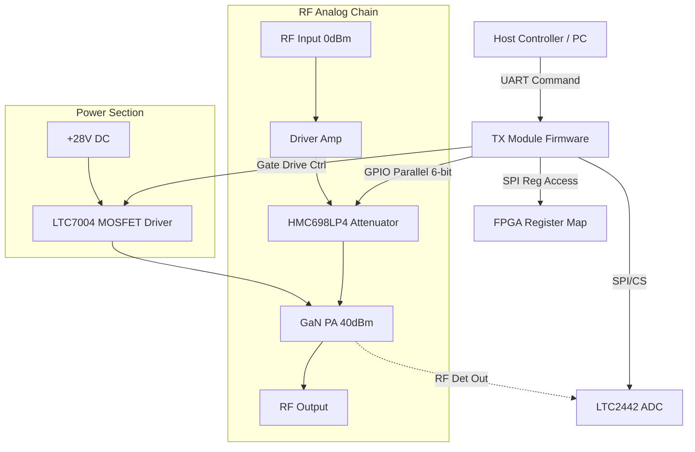
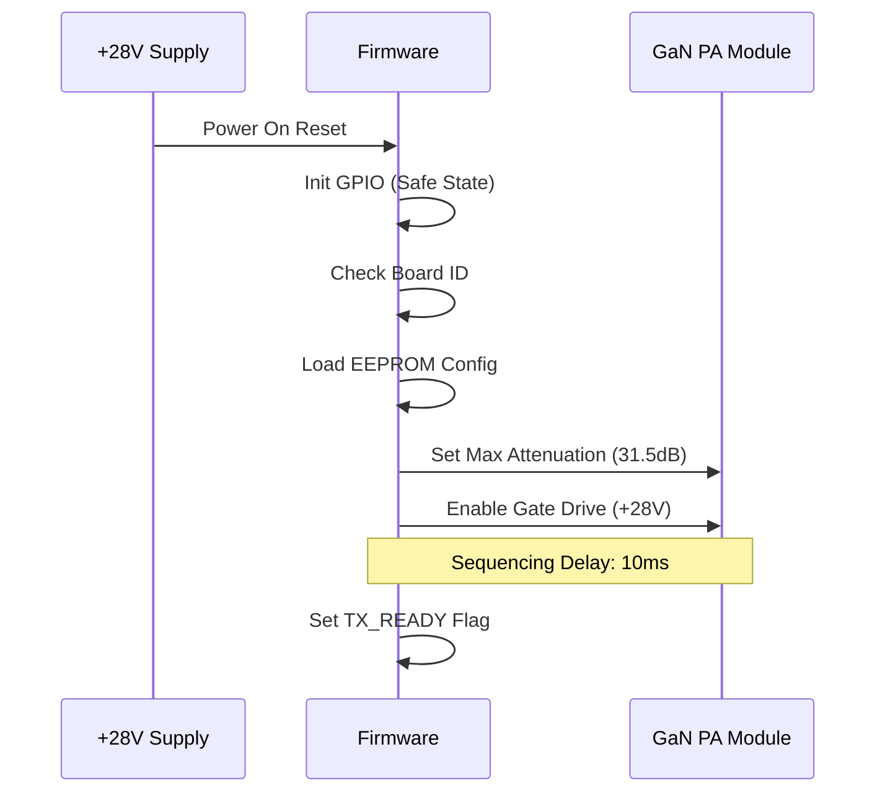
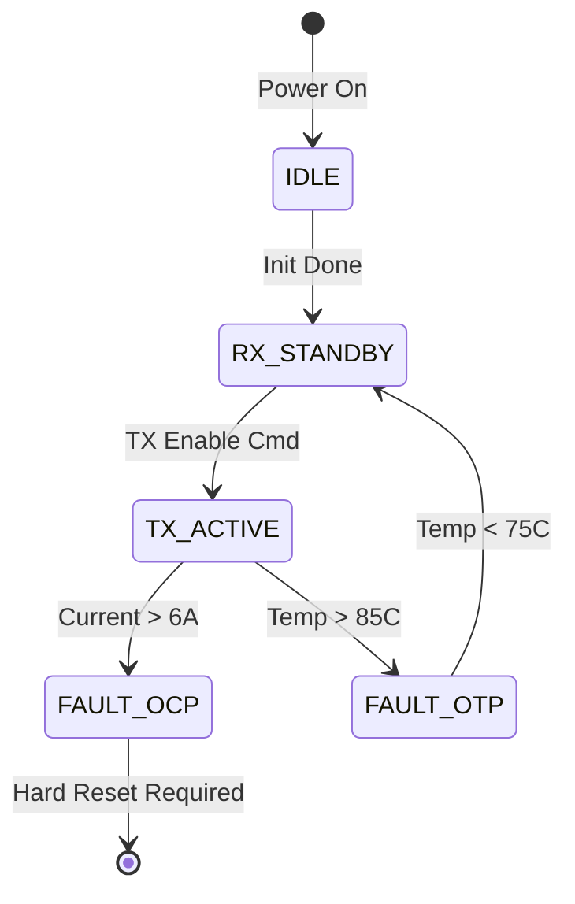

```markdown
# Software Requirements Specification (SRS)
## TX Module Firmware

---

## Document Control

| Version | Date       | Author              | Changes                                 |
|---------|------------|---------------------|-----------------------------------------|
| 1.0     | 2026-04-14 | Senior Architect    | Initial Release                         |

---

# 1. Introduction

## 1.1 Purpose
This Software Requirements Specification (SRS) defines the comprehensive software and firmware requirements for the **TX Module** (Project P2). This document specifies the behavior of the embedded firmware controlling the RF Power Amplifier chain, Power Management Unit (PMU), and Glue Logic interfaces.

The intended audience includes:
*   **Firmware Engineers:** Responsible for RTOS implementation, HAL development, and application logic.
*   **Hardware Engineers:** Verifying register map compliance and electrical timing.
*   **System Integrators:** Integrating the TX Module into the wider platform via UART/SPI interfaces.
*   **Test Engineers:** Developing validation test plans based on these requirements.

This SRS establishes the baseline for the software development lifecycle, including unit testing, integration, and formal qualification against IEEE 29148:2018.

## 1.2 Scope
The software scope encompasses the control logic embedded within the TX Module's FPGA and associated microcontroller logic. It covers:
*   **Initialization:** Power-up sequencing, PLL locking (if applicable), and configuration of the HMC698LP4 attenuator.
*   **RF Control:** Gain adjustment via 6-bit parallel interface and TX Enable sequencing.
*   **Monitoring:** Telemetry acquisition of voltage, current, temperature, and RF output power via ADC (LTC2442).
*   **Protection:** Hardware protection logic (watchdog, interlocks) implemented in firmware.
*   **Communication:** UART command protocol for remote configuration and diagnostics.

**Exclusions:** The waveform generation (modulation) is handled by an upstream exciter; this firmware only controls the amplification chain parameters.

## 1.3 Definitions, Acronyms, and Abbreviations

| Term  | Definition |
|-------|------------|
| **ADC** | Analog-to-Digital Converter (LTC2442 used for telemetry) |
| **BIST** | Built-In Self-Test |
| **DAC** | Digital-to-Analog Converter |
| **FPGA** | Field Programmable Gate Array (U_FPGA) |
| **GLR** | Glue Logic Requirements |
| **GPIO** | General Purpose Input/Output |
| **HAL** | Hardware Abstraction Layer |
| **HRS** | Hardware Requirements Specification |
| **I2C** | Inter-Integrated Circuit (Serial Protocol) |
| **ISR** | Interrupt Service Routine |
| **LDO** | Low Dropout Regulator |
| **MOSFET** | Metal-Oxide-Semiconductor Field-Effect Transistor |
| **PA** | Power Amplifier (GMMT2021-215 GaN MMIC) |
| **POST** | Power-On Self Test |
| **RTL** | Register Transfer Level (FPGA code logic) |
| **RX/TX** | Receive/Transmit |
| **SMP** | Subminiature Push-on (RF Connector) |
| **SPI** | Serial Peripheral Interface |
| **UART** | Universal Asynchronous Receiver-Transmitter |
| **VSWR** | Voltage Standing Wave Ratio |

## 1.4 References
1.  IEEE Std 830-1998: Recommended Practice for Software Requirements Specifications.
2.  IEEE Std 29148-2018: Systems and software engineering — Life cycle processes — Requirements engineering.
3.  **HRS-P2:** Hardware Requirements Specification for TX Module (Rev 1.0).
4.  **GLR-P6:** Glue Logic Requirements Specification for TX Module (Rev 0V01).
5.  **GMMT2021-215 Datasheet:** GaN MMIC 5-18 GHz, 10W Power Amplifier.
6.  **HMC698LP4 Datasheet:** GaAs 6-bit Digital Attenuator.
7.  **LTC2442 Datasheet:** 24-Bit High Speed ADC.
8.  **LTC7004 Datasheet:** High Side Gate Driver.

## 1.5 Overview
Section 2 describes the overall system architecture, including the block diagram and interfaces.
Section 3 details the specific requirements, including external interfaces and 50+ functional software requirements (REQ-SW).
Section 4 defines verification and validation criteria.
Section 5 provides the traceability matrix mapping software requirements to hardware sources.

---

# 2. Overall Description

## 2.1 Product Perspective

The TX Module firmware acts as the control layer between the external system commander and the high-power RF analog chain. It runs on an embedded soft-core processor or equivalent logic within the **U_FPGA**.

**System Context:**


## 2.2 Product Functions
1.  **Power Sequencing:** Control the external LTC7004/MOSFET pair to ramp +28V to the GaN PA drain safely.
2.  **Gain Control:** Set the HMC698LP4 6-bit attenuation value (0 dB to 31.5 dB).
3.  **Telemetry:** Monitor Forward Power (via AD8318), PA Current, PA Voltage, and PCB Temperature.
4.  **Fault Management:** Detect over-temperature, over-current, and VSWR faults; trigger hardware shutdown.
5.  **Communication:** Respond to UART register read/write commands.
6.  **Non-Volatile Storage:** Store calibration tables and attenuation setpoints in EEPROM.

## 2.3 User Characteristics
*   **System Operators:** Require high-level commands (Enable TX, Set Gain) via UART.
*   **Maintainers:** Require access to raw telemetry registers for debugging.
*   **Automated Test Equipment (ATE):** Requires fast register access for production calibration.

## 2.4 Constraints
1.  **Timing:** The TX Enable gate signal must be asserted *before* the RF signal is applied to prevent damage.
2.  **Environment:** Software must operate reliably in -40°C to +85°C ambient temperature.
3.  **Latency:** UART command response time < 10ms.
4.  **Standards:** Code must comply with MISRA-C:2012 guidelines.

## 2.5 Assumptions and Dependencies
1.  The +28V input power is stable and capable of supplying 10A peak current.
2.  The external host UART operates at standard baud rates (9600, 115200).
3.  The FPGA provides a stable system clock (e.g., 50 MHz).

---

# 3. Specific Requirements

## 3.1 External Interface Requirements

### 3.1.1 Hardware Interfaces

#### 3.1.1.1 GPIO Interface (HMC698LP4 Attenuator)
The firmware drives a 6-bit parallel interface to control the attenuation. Data is latched via a dedicated strobe signal.

**C Struct Definition:**
```c
/**
 * @brief HMC698LP4 Attenuator Register Map
 * Note: Driven via FPGA GPIO Pins mapped to memory.
 */
typedef struct {
    uint8_t LE;          /**< Latch Enable (Strobe) - Bit 0 of GPIO Bank 1 */
    uint8_t DATA[6];     /**< Parallel Data Bits D5-D0 - Bits 0-5 of GPIO Bank 2 */
} HMC698_Regs_t;

/* 
 * Parallel Logic Mapping:
 * D5 (MSB) : 16.0 dB
 * D4       : 8.0 dB
 * D3       : 4.0 dB
 * D2       : 2.0 dB
 * D1       : 1.0 dB
 * D0 (LSB) : 0.5 dB
 */

/**
 * @brief Set the attenuation level.
 * @param atten_db Desired attenuation (0.0 to 31.5 dB, 0.5 dB steps).
 * @return 0 on success, -1 on invalid parameter.
 */
int32_t HMC698_SetAttenuation(float atten_db);
```

#### 3.1.1.2 SPI Interface (LTC2442 ADC)
High-precision (24-bit) ADC for reading telemetry.

**C Struct Definition:**
```c
typedef struct {
    volatile uint32_t CTRL;     /**< 0x00: Control Register (CS, SCK) */
    volatile uint32_t DATA;     /**< 0x04: RX/TX Data Register */
    volatile uint32_t STATUS;   /**< 0x08: Status Flags (EOC) */
} LTC2442_RegMap_t;

/* Driver API */
int32_t ADC_Init(uint32_t base_addr);
int32_t ADC_ReadChannel(uint8_t ch, float *result_volts);
// Channels: 0=PA_Voltage, 1=PA_Current, 2=Temp, 3=RF_Detector
```

#### 3.1.1.3 UART Interface
Standard UART for control and status.

```c
typedef struct {
    volatile uint16_t BAUD;     /**< Baud Rate Divisor */
    volatile uint16_t CTRL;     /**< Control (TX_EN, RX_EN) */
    volatile uint16_t STATUS;   /**< Status (RX_READY, TX_EMPTY) */
    volatile uint16_t DATA;     /**< Data Buffer */
} UART_RegMap_t;

/* Driver API */
int32_t UART_Init(uint32_t baud_rate);
int32_t UART_WriteByte(uint8_t data);
int32_t UART_ReadByte(uint8_t *data, uint32_t timeout_ms);
```

### 3.1.2 Software Interfaces
*   **HAL Layer:** All hardware access shall pass through a Hardware Abstraction Layer (HAL).
*   **Circular Buffer:** UART RX data shall be buffered using a thread-safe circular buffer.

### 3.1.3 Communication Interfaces (Protocol)
**UART Command Frame Format (Binary):**
*   `0x57` `ADDR_MSB` `ADDR_LSB` `DATA_LSB` `DATA_MSB` `CRC8`
*   Response: `0x06` (ACK) or `0x15` (NAK)

---

## 3.2 Functional Requirements

### 3.2.1 System Initialization (REQ-SW-001 to REQ-SW-010)

**REQ-SW-001:** The firmware SHALL initialize all GPIO pins to a safe state (Low) within 10ms of power-on reset.
**REQ-SW-002:** The firmware SHALL configure the HMC698LP4 Data lines to 0x00 (Max Attenuation / Min Gain) during initialization to prevent power spikes.
**REQ-SW-003:** The firmware SHALL verify the Board ID register at address `0x0000` matches `0xA5A5` to confirm FPGA bitstream integrity.
**REQ-SW-004:** The firmware SHALL initialize the SPI peripheral to 1MHz clock rate for ADC communication.
**REQ-SW-005:** The firmware SHALL perform a read-back of the PA Voltage ADC channel; if the reading is < 20V, the firmware SHALL assert the `FAULT_UNDERVOLT` flag.
**REQ-SW-006:** The firmware SHALL initialize the UART interface to 115200 baud, 8N1 format by default.
**REQ-SW-007:** The firmware SHALL load the default attenuation setpoint (stored in EEPROM at address `0x0010`) and apply it to the HMC698LP4.
**REQ-SW-008:** The firmware SHALL enable the watchdog timer with a 100ms timeout after the successful completion of POST.
**REQ-SW-009:** The firmware SHALL configure the MOSFET Driver control pin (Gate Drive) as Output and set it Low (PA OFF).
**REQ-SW-010:** The firmware SHALL log the firmware version string "TX_MOD_FW_v1.0.0" to the UART debug port upon completion of initialization.

### 3.2.2 RF Control (REQ-SW-011 to REQ-SW-020)

**REQ-SW-011:** The firmware SHALL provide a function to accept a floating-point gain value (0-40dB) and calculate the corresponding attenuation for the HMC698LP4.
**REQ-SW-012:** The firmware SHALL calculate attenuation using the formula: `Attenuation (dB) = 40.0 - Requested_Gain`.
**REQ-SW-013:** The firmware SHALL clamp the calculated attenuation to a minimum of 0.0 dB and maximum of 31.5 dB (hardware limit of attenuator).
**REQ-SW-014:** The firmware SHALL convert the attenuation value to a 6-bit binary code (0.5 dB steps) before writing to GPIO.
**REQ-SW-015:** The firmware SHALL assert the `LE` (Latch Enable) pin HIGH for at least 10ns, then LOW, to load new data into the HMC698LP4.
**REQ-SW-016:** The firmware SHALL provide a command `TX_SET_GAIN` (Addr 0x10) accessible via UART.
**REQ-SW-017:** When `TX_ENABLE` command is received, the firmware SHALL wait 50us (settling time) before asserting the PA Gate Drive signal.
**REQ-SW-018:** The firmware SHALL store the last applied gain setting in a global variable `g_CurrentGain`.
**REQ-SW-019:** The firmware SHALL ignore `TX_SET_GAIN` commands if the `TX_ENABLE` bit is not set (Safe State).
**REQ-SW-020:** The firmware SHALL update the `STATUS_GAIN_CHANGED` flag in the status register whenever a new attenuation value is latched.

### 3.2.3 Power Sequencing & Protection (REQ-SW-021 to REQ-SW-030)

**REQ-SW-021:** The firmware SHALL implement a power-up sequence: Enable +5V Logic -> Wait 10ms -> Enable +28V PA Drain.
**REQ-SW-022:** The firmware SHALL monitor the PA Current via ADC every 100ms.
**REQ-SW-023:** If PA Current exceeds 6.0A, the firmware SHALL immediately clear the PA Gate Drive signal (Latch OFF).
**REQ-SW-024:** Upon detecting an Over-Current fault, the firmware SHALL set the `FAULT_OCP` bit in the STATUS register and cease all RF operations.
**REQ-SW-025:** The firmware SHALL require a full power cycle (Hard Reset) to clear a `FAULT_OCP` latch.
**REQ-SW-026:** The firmware SHALL monitor the PCB temperature sensor (ADC Channel 2).
**REQ-SW-027:** If the PCB temperature exceeds 85°C, the firmware SHALL enter Thermal Shutdown (Disable PA).
**REQ-SW-028:** If the PCB temperature exceeds 100°C (Critical), the firmware SHALL assert a Critical Alarm via the dedicated GPIO pin `ALARM_CRIT`.
**REQ-SW-029:** The firmware SHALL implement a hysteresis of 10°C for thermal shutdown (do not re-enable until temp < 75°C).
**REQ-SW-030:** The firmware SHALL ensure the +28V rail is switched OFF within 5us of receiving a `TX_DISABLE` command.

### 3.2.4 Telemetry & Monitoring (REQ-SW-031 to REQ-SW-040)

**REQ-SW-031:** The firmware SHALL read the RF Power Detector (AD8318) output via the ADC (Channel 3) every 50ms.
**REQ-SW-032:** The firmware SHALL convert the raw ADC voltage to dBm using a linear interpolation lookup table stored in EEPROM.
**REQ-SW-033:** The firmware SHALL provide a register `RF_POWER_READBACK` (0x20) containing the converted power value in dBm.
**REQ-SW-034:** The firmware SHALL implement a digital moving average filter (window size 4) on the PA Voltage reading to stabilize displayed values.
**REQ-SW-035:** The firmware SHALL calculate Power Added Efficiency (PAE) internally for diagnostics: `PAE = (Pout - Pin) / (Vpa * Ipa)`.
**REQ-SW-036:** The firmware SHALL make the calculated PAE value available via register `TELEMETRY_PAE` (0x25).
**REQ-SW-037:** The firmware SHALL timestamp all telemetry readings based on an internal millisecond counter.
**REQ-SW-038:** The firmware SHALL support a "Continuous Mode" where telemetry packets are streamed out via UART at 10Hz.
**REQ-SW-039:** The firmware SHALL verify the ADC SPI connection by reading a known register value (0x0000) during initialization.
**REQ-SW-040:** The firmware SHALL handle ADC Read Timeouts (no EOC within 200ms) by setting `FAULT_SENSOR_COMMS`.

### 3.2.5 Communication & Protocol (REQ-SW-041 to REQ-SW-050)

**REQ-SW-041:** The firmware SHALL implement the UART command parser to recognize the header byte `0x57`.
**REQ-SW-042:** The firmware SHALL validate the CRC-8 of incoming packets. If invalid, it SHALL send NAK `0x15`.
**REQ-SW-043:** The firmware SHALL respond to valid write commands with ACK `0x06` within 2ms.
**REQ-SW-044:** The firmware SHALL support a bulk read command (`CMD_BURST_READ`) to return the contents of the entire register map (0x00 to 0x50).
**REQ-SW-045:** The firmware SHALL ignore any UART commands received while the device is in `FAULT` state, except for `CMD_RESET_STATUS`.
**REQ-SW-046:** The firmware SHALL utilize a non-blocking state machine for UART RX processing to prevent main loop starvation.
**REQ-SW-047:** The firmware SHALL implement a "Watchdog Kick" function that must be called every 50ms.
**REQ-SW-048:** If the main loop blocks for > 100ms, the watchdog timer SHALL reset the MCU/FPGA.
**REQ-SW-049:** The firmware SHALL support a firmware update command via UART (`CMD_BOOTLOADER_JUMP`) at address 0xFE.
**REQ-SW-050:** The firmware SHALL protect the EEPROM write cycles by implementing a wear-leveling algorithm or limiting writes to < 10,000 cycles lifetime.

---

## 3.3 Performance Requirements

| ID | Requirement | Metric |
|----|-------------|--------|
| REQ-PERF-001 | Boot Time | < 200ms from Power-On to TX_READY flag asserted. |
| REQ-PERF-002 | Gain Step Response | < 10us to latch new gain value to hardware. |
| REQ-PERF-003 | Fault Response Time | < 5us to disable PA Gate upon Over-Current detection. |
| REQ-PERF-004 | UART Throughput | Support command processing rate up to 100 Hz. |
| REQ-PERF-005 | ADC Conversion Accuracy | 24-bit ADC effective resolution must be > 18 bits (noise-free). |
| REQ-PERF-006 | Telemetry Update Rate | 10 Hz update rate for RF Power monitoring. |
| REQ-PERF-007 | SPI Clock Speed | SPI Interface to ADC must operate at 1 MHz (stable). |
| REQ-PERF-008 | Thermal Hysteresis Accuracy | +/- 1.0°C on thermal trip points. |

## 3.4 Design Constraints
1.  **Memory:** Code size must fit within 256kB Flash; RAM usage must not exceed 64kB.
2.  **Compliance:** MISRA-C:2012 compliance enforced by the compiler.
3.  **Interrupts:** Maximum Interrupt Service Routine (ISR) duration = 20us.
4.  **Concurrency:** No dynamic memory allocation (`malloc`) allowed in the final binary.

## 3.5 Software System Attributes
*   **Reliability:** The software must support 24/7 continuous operation with a MTBF of > 10,000 hours.
*   **Availability:** Recovery from watchdog reset must be automatic and logged.
*   **Security:** Undefined commands must be ignored without crashing the system.
*   **Maintainability:** All 'Magic Numbers' must be defined as `#define` constants with units in comments.

---

# 4. Verification and Validation

## 4.1 Unit Test Requirements
*   **HMC698 Driver Test:** Verify that requesting 20dB gain results in the correct 6-bit code (approx 10.5dB attenuation, 0b101010).
*   **CRC Test:** Verify calculation of CRC-8 for known good vectors.
*   **ADC Filter Test:** Verify moving average logic handles boundary conditions (start of stream).

## 4.2 Integration Test Requirements
*   **RF Loopback:** Inject RF signal, verify power readback matches expected values within +/- 1dB.
*   **Fault Injection:** Force voltage below 20V, verify PA_DISABLE GPIO asserts.
*   **UART Stress:** Send 10,000 random commands, verify no buffer overflows or hangs.

---

# 5. Requirements Traceability Matrix

| REQ-SW ID | Description | Traces To |
|-----------|-------------|-----------|
| REQ-SW-001 | Init GPIO Safe State | HRS: Safety |
| REQ-SW-002 | Init Max Attenuation | GLR: HMC698LP4 Interface |
| REQ-SW-003 | Board ID Check | HRS: System Config |
| REQ-SW-004 | SPI ADC Init | GLR: LTC2442 Interface |
| REQ-SW-005 | UVLO Check | HRS: Power Supply (+28V) |
| REQ-SW-011 | Gain Calc Function | HRS: Output Power (40dBm) |
| REQ-SW-021 | Power Seq Logic | GLR: LTC7004 / MOSFET Timing |
| REQ-SW-023 | OCP Fault | HRS: PA Protection |
| REQ-SW-031 | RF Det Read | GLR: AD8318 Interface |
| REQ-SW-041 | UART Protocol | HRS: Control Interface |

---

# 6. Appendices

## Appendix A: Error Codes
```c
typedef enum {
    ERR_OK = 0x00,
    ERR_INVALID_GAIN = 0x01,
    ERR_OCP = 0x02,
   _ERR_OTP = 0x03,
    ERR_COMMS = 0x04,
    ERR_CRC = 0x05
} ErrorCode_t;
```

## Appendix B: Register Map (Partial)
| Address | Name | Access | Description |
|---------|------|--------|-------------|
| 0x00 | REG_STATUS | R | Status Flags (Ready, Fault) |
| 0x10 | REG_GAIN_CTL | W | 0-40dB Gain Setting |
| 0x20 | REG_RF_PWR | R | Current Output Power (dBm) |
| 0xFE | REG_BOOT | W | Jump to Bootloader |

## Appendix C: Sequence Diagrams

### Power Up Sequence


### Fault Handling

```