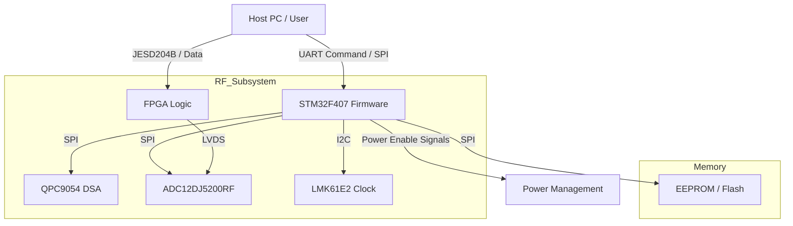
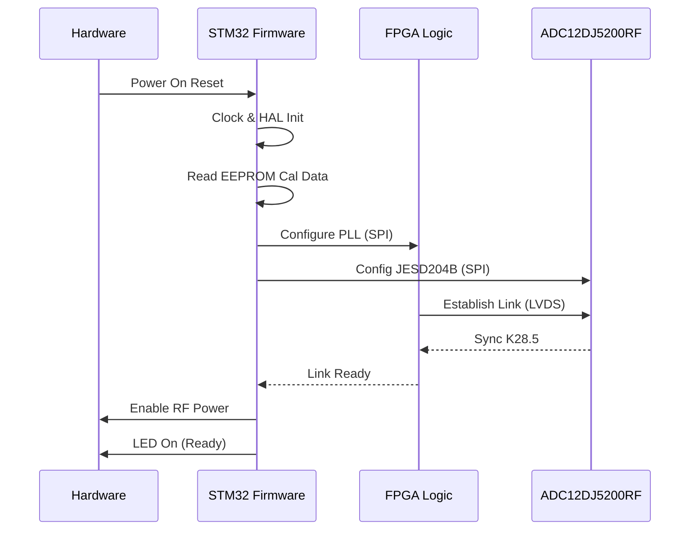
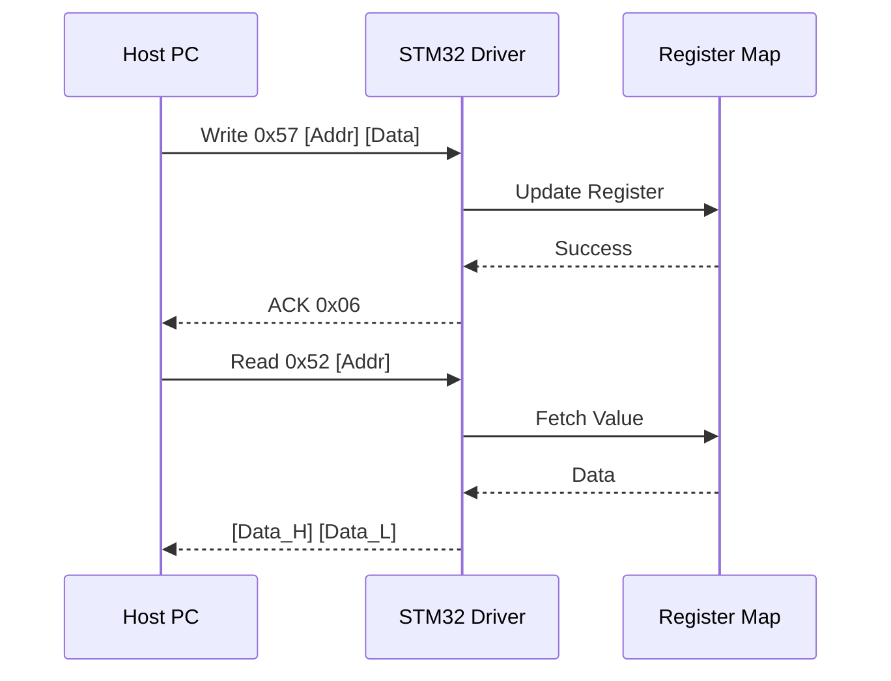
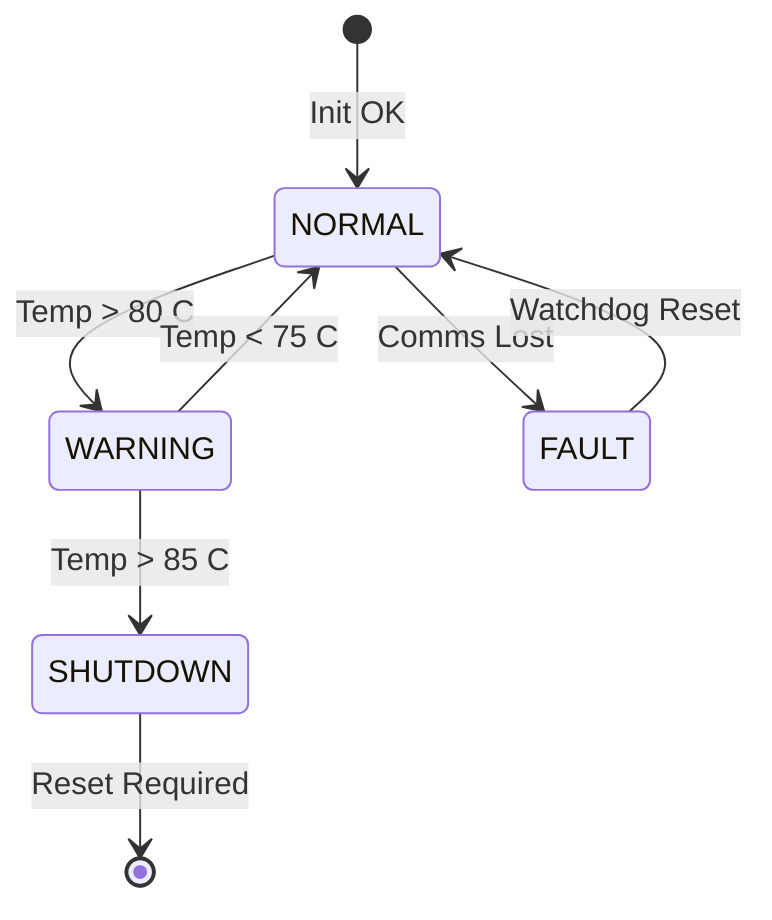
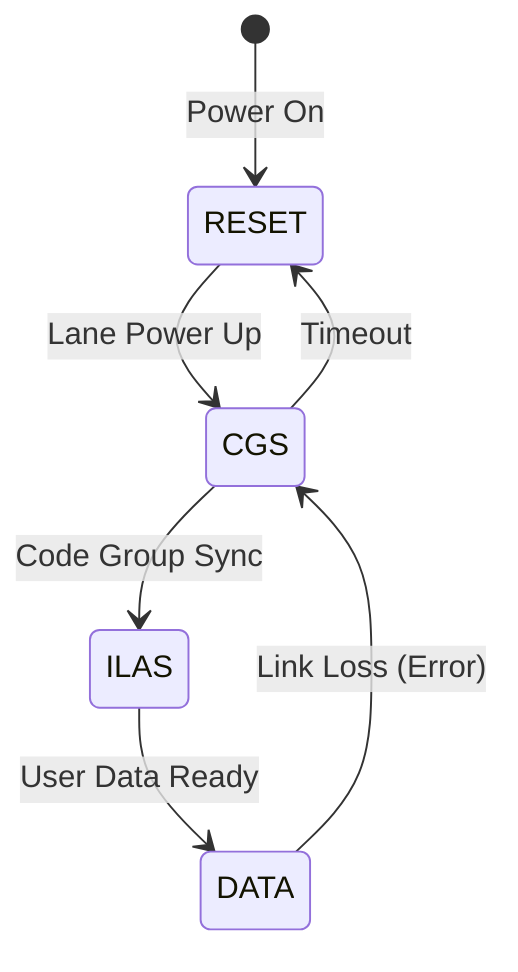
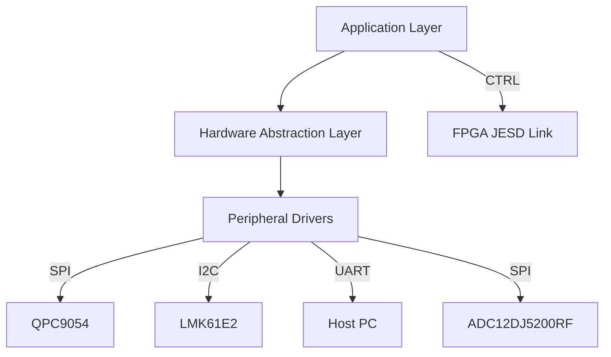

# Software Requirements Specification (SRS)

**Project:** Wideband RF Receiver System (Test)
**Version:** 1.0
**Date:** 17 April 2026

---

## Document Control

| Version | Date | Author | Changes |
|---------|------|--------|---------|
| 1.0 | 17 April 2026 | System Architecture | Initial Release compliant with IEEE 29148:2018 |

---

# 1. Introduction

## 1.1 Purpose
This Software Requirements Specification (SRS) defines the comprehensive software and firmware requirements for the **Wideband RF Receiver System** (Project: Test). This document specifies the requirements for the embedded control software executing on the **STM32F407VGT6** Microcontroller Unit (MCU) and the logic requirements for the **FPGA/SoC** responsible for JESD204B/C interface handling.

The purpose of this document is to:
*   Establish a complete functional and performance baseline for the firmware controlling the RF Front-End (LNA/DSA).
*   Define the communication protocols between the Host PC, MCU, and FPGA.
*   Specify the data handling requirements for the high-speed JESD204B/C link.
*   Ensure compliance with the hardware constraints defined in the Hardware Requirements Specification (HRS) and Glue Logic Requirements (GLR).
*   Serve as the binding agreement for verification and validation (V&V) activities.

This SRS is intended for embedded firmware engineers, FPGA engineers, test engineers, and system integrators.

## 1.2 Scope
The scope of this software specification covers the firmware required to operate the RF Receiver Module. This includes the low-level drivers for the SPI peripherals (ADC, DSA, Clock), the UART communication protocol handler, the hardware abstraction layer (HAL), and the FPGA logic for JESD204B/C interface and data buffering.

**In-Scope Elements:**
*   **MCU Firmware (STM32F407):** Boot sequence, SPI drivers for QPC9054 (DSA) and ADC12DJ5200RF, I2C monitoring, UART Command/Response handler.
*   **FPGA Logic:** JESD204B/C IP core configuration, lane alignment, frame buffering, and DMA interface to the host.
*   **Communication Protocols:** Host-to-MCU UART register protocol and Host-to-FPGA data streaming interface.
*   **Calibration & Diagnostics:** Storage of calibration data in EEPROM, Built-In Self-Test (BIST), and fault reporting.

**Exclusions:**
*   Host PC application software (GUI/CLI) is specified in a separate Interface Control Document (ICD).
*   Signal processing algorithms (FFT, filtering) inside the FPGA are considered "Application Layer" and are defined in the DSP Requirements Specification, though data transport mechanisms are defined here.

## 1.3 Definitions, Acronyms, and Abbreviations

| Term | Definition |
| :--- | :--- |
| **ADC** | Analog-to-Digital Converter. |
| **AGC** | Automatic Gain Control. |
| **API** | Application Programming Interface. |
| **BGA** | Ball Grid Array. |
| **BIST** | Built-In Self-Test. |
| **BRAM** | Block RAM (FPGA on-chip memory). |
| **BSP** | Board Support Package. |
| **CFR** | Copper Clad Laminate. |
| **CRC** | Cyclic Redundancy Check. |
| **DSA** | Digital Step Attenuator. |
| **EMC** | Electromagnetic Compatibility. |
| **EEPROM** | Electrically Erasable Programmable Read-Only Memory. |
| **ENOB** | Effective Number of Bits. |
| **FIFO** | First-In, First-Out Buffer. |
| **FPGA** | Field-Programmable Gate Array. |
| **FSM** | Finite State Machine. |
| **GLR** | Glue Logic Requirements. |
| **GPIO** | General Purpose Input/Output. |
| **HAL** | Hardware Abstraction Layer. |
| **HRS** | Hardware Requirements Specification. |
| **I2C** | Inter-Integrated Circuit (Serial Protocol). |
| **ICD** | Interface Control Document. |
| **ISR** | Interrupt Service Routine. |
| **JESD** | JESD204 High-Speed Data Converter Interface Standard. |
| **LDO** | Low Dropout Regulator. |
| **LNA** | Low Noise Amplifier. |
| **LVDS** | Low-Voltage Differential Signaling. |
| **MCU** | Microcontroller Unit. |
| **MISRA** | Motor Industry Software Reliability Association. |
| **NF** | Noise Figure. |
| **NVM** | Non-Volatile Memory. |
| **PCB** | Printed Circuit Board. |
| **PLL** | Phase-Locked Loop. |
| **POST** | Power-On Self-Test. |
| **P1dB** | 1 dB Compression Point. |
| **QSPI** | Quad Serial Peripheral Interface. |
| **RF** | Radio Frequency. |
| **RTL** | Register Transfer Level. |
| **SFDR** | Spurious-Free Dynamic Range. |
| **SNR** | Signal-to-Noise Ratio. |
| **SPI** | Serial Peripheral Interface. |
| **SR** | Software Requirements. |
| **StRS** | Stakeholder Requirements Specification. |
| **SyRS** | System Requirements Specification. |
| **TRP** | Transmit/Receive Point. |
| **UART** | Universal Asynchronous Receiver-Transmitter. |
| **VCO** | Voltage-Controlled Oscillator. |

## 1.4 References

| ID | Document Title | Publisher/Source | Date/Version |
| :--- | :--- | :--- | :--- |
| [1] | **IEEE 830-1998** | Recommended Practice for Software Requirements Specifications | IEEE | 1998 |
| [2] | **ISO/IEC/IEEE 29148:2018** | Systems and Software Engineering — Life Cycle Processes — Requirements Engineering | IEEE/ISO | 2018 |
| [3] | **MISRA C:2012** | Guidelines for the Use of the C Language in Critical Systems | MISRA | 2012 |
| [4] | **Hardware Requirements Specification (HRS)** | Project: Test (P2) | Internal | 17.04.2026 |
| [5] | **Glue Logic Requirements (GLR)** | Project: Test (P6) | Internal | 17.04.2026 |
| [6] | **JESD204B Standard** | JEDEC Standard for High Speed Data Interface | JEDEC | 2011 |
| [7] | **STM32F407VGT6 Datasheet** | High-Performance MCUs, DSP, FPU | STMicroelectronics | Rev 7 |
| [8] | **QPC9054 Datasheet** | DC to 18 GHz Digital Step Attenuator | Qorvo | Revision 1.1 |
| [9] | **LMK61E2 Datasheet** | Low Phase Noise Oscillator/Synthesizer | Texas Instruments | SNAS665D |
| [10] | **ADC12DJ5200RF Datasheet** | 12-bit/14-bit, 10.25 GSPS, RF Sampling ADC | Texas Instruments | SBAS160E |

## 1.5 Overview
The remainder of this document is organized as follows:
*   **Section 2: Overall Description** provides a high-level view of the system architecture, hardware interfaces, and general constraints.
*   **Section 3: Specific Requirements** details the functional, performance, and design constraints. This includes the UART protocol specification, C-level driver APIs, and the FPGA logic requirements.
*   **Section 4: Verification and Validation** outlines the test strategy for unit, integration, and system testing.
*   **Section 5: Requirements Traceability Matrix** maps software requirements to source hardware requirements.
*   **Appendices** provide detailed register maps, error codes, and supporting diagrams.

---

# 2. Overall Description

## 2.1 Product Perspective
The Wideband RF Receiver System software is a distributed embedded system consisting of an MCU (Control Plane) and an FPGA (Data Plane).

**System Context Diagram**



The software operates on two primary processing units:
1.  **MCU (STM32F407):** Responsible for system initialization, power sequencing, configuration of the RF chain (Gain/Attenuation), and handling legacy UART commands from the host.
2.  **FPGA/SoC:** Responsible for receiving high-speed JESD204B/C data from the ADC, performing lane alignment, buffering data in BRAM, and transferring it to the host via high-speed DMA (PCIe or Ethernet).

## 2.2 Product Functions
1.  **System Initialization:** Execute power-on sequence, configure clocks, and verify PLL lock.
2.  **Hardware Abstraction:** Provide drivers for SPI, I2C, UART, and GPIO.
3.  **Gain Control:** Adjust the DSA (QPC9054) from 0 to 31.75 dB in 0.25 dB steps based on user command or AGC algorithm.
4.  **Clock Management:** Program the LMK61E2 for the desired sampling frequency.
5.  **Data Acquisition:** Configure ADC12DJ5200RF (JESD204B subclass) and manage data flow in FPGA.
6.  **Thermal Monitoring:** Read temperature sensors via I2C and trigger shutdown/fault if thresholds exceeded.
7.  **Fault Management:** Detect over/under voltage, loss of clock, and SPI communication errors.
8.  **Communication:** Implement the "Glue Logic" UART protocol for register read/write.
9.  **Calibration:** Store and apply calibration tables (Gain slope vs Frequency, DC offset).

## 2.3 User Characteristics
*   **Firmware Engineers:** Develop and maintain the C-code for the STM32. Need clear API documentation (Doxygen) and register maps.
*   **FPGA Engineers:** Develop the RTL for the data path. Need timing diagrams and JESD204B interface specifications.
*   **Test Engineers:** Integrate the module into test fixtures. Need clear command sets and diagnostic feedback.
*   **System Integrators:** Use the module in a larger system. Need high-level status indicators (LEDs, UART status).

## 2.4 Constraints
1.  **MISRA-C Compliance:** Firmware shall adhere to MISRA C:2012 standards (Safety/Quality).
2.  **Real-Time:** SPI transactions must complete within strict timing windows to prevent ADC buffer overflows.
3.  **Memory:** STM32F407 has 1MB Flash, 192KB RAM. Code and data must fit within these bounds.
4.  **Jitter:** Clock distribution jitter must be < 200fs RMS to ensure SNR performance (REQ-HW-004).
5.  **Environment:** Software must operate correctly from 0°C to +70°C (REQ-HW-007).

## 2.5 Assumptions and Dependencies
1.  The hardware power rails (5V, 3.3V, 1.8V, 1.0V) are stabilized within 5ms of system power-up.
2.  The external 10MHz reference clock (if used) is stable and within 10ppb accuracy.
3.  The Host PC driver supports the defined JESD204B lane rate.
4.  EEPROM is initialized with factory calibration data at production time.

---

# 3. Specific Requirements

## 3.1 External Interface Requirements

### 3.1.1 Hardware Interfaces

#### 3.1.1.1 SPI Interface (DSA & ADC Control)
The MCU uses SPI interfaces to configure the RF front end.
**Protocol:** Standard SPI Mode 0 (CPOL=0, CPHA=0).
**Timing Constraints:**
*   Max Clock Speed: 10 MHz (Conservative for high-speed layout stability).
*   Setup Time (t_su): 10 ns.
*   Hold Time (t_h): 10 ns.

**C Struct Definition for Memory-Mapped SPI (Hardware Abstraction):**
```c
/**
 * @brief SPI Hardware Register Map Structure
 * Base Address: 0x40013000 (SPI2 - Example)
 */
typedef struct {
    volatile uint32_t CR1;      // 0x00: Control Register 1
    volatile uint32_t CR2;      // 0x04: Control Register 2
    volatile uint32_t SR;       // 0x08: Status Register
    volatile uint32_t DR;       // 0x0C: Data Register
    volatile uint32_t CRCPR;    // 0x10: CRC Polynomial Register
    volatile uint32_t RXCRCR;   // 0x14: RX CRC Register
    volatile uint32_t TXCRCR;   // 0x18: TX CRC Register
    volatile uint32_t I2SCFGR;  // 0x1C: I2S Configuration Register
    volatile uint32_t I2SPR;    // 0x20: I2S Prescaler Register
} SPI_RegMap_t;
```

**Driver API:**
```c
/**
 * @brief Initialize SPI peripheral for DSA/ADC control.
 * @param hspi Pointer to SPI handle structure
 * @return HAL_OK on success, HAL_ERROR on failure.
 */
int32_t SPI_Init(void *hspi);

/**
 * @brief Write to a specific register on the QPC9054 DSA.
 * @param reg_addr 8-bit register address.
 * @param data 8-bit data to write.
 * @return 0 on success, -1 on timeout.
 */
int32_t DSA_WriteReg(uint8_t reg_addr, uint8_t data);

/**
 * @brief Read from a specific register on the QPC9054 DSA.
 * @param reg_addr 8-bit register address.
 * @param data Pointer to store read data.
 * @return 0 on success, -1 on timeout.
 */
int32_t DSA_ReadReg(uint8_t reg_addr, uint8_t *data);

/**
 * @brief Set Attenuation value.
 * @param attenuation_db Float value (0.0 to 31.75).
 * @return 0 on success, -1 on invalid range.
 */
int32_t DSA_SetAttenuation(float attenuation_db);
```

#### 3.1.1.2 I2C Interface (Clock & Temp Sensors)
**Protocol:** I2C Standard Mode (100 kHz).
**Addressing:** 7-bit addressing.

**C Struct Definition:**
```c
typedef struct {
    volatile uint32_t CR1;      // 0x00
    volatile uint32_t CR2;      // 0x04
    volatile uint32_t OAR1;     // 0x08
    volatile uint32_t OAR2;     // 0x0C
    volatile uint32_t DR;       // 0x10
    volatile uint32_t SR1;      // 0x14
    volatile uint32_t SR2;      // 0x18
    volatile uint32_t CCR;      // 0x1C
    volatile uint32_t TRISE;    // 0x20
} I2C_RegMap_t;
```

**Driver API:**
```c
/**
 * @brief Initialize I2C for PMIC and Clock monitoring.
 */
int32_t I2C_Init(void);

/**
 * @brief Read temperature from on-board sensor (e.g., TMP100).
 * @param temp_c Pointer to store temperature in Celsius.
 * @return 0 on success.
 */
int32_t TEMP_Read(float *temp_c);

/**
 * @brief Configure LMK61E2 Clock Generator via I2C.
 * @param freq_hz Target output frequency.
 */
int32_t CLK_Configure(uint32_t freq_hz);
```

### 3.1.2 Software Interfaces
*   **CMSIS-Core:** ARM Cortex-M4 core access layer.
*   **STM32 HAL:** Hardware abstraction layer for peripheral configuration.
*   **STDIO:** Retargeted to UART for debug logging.

### 3.1.3 Communication Interfaces (UART Protocol)

**Frame Formats (from GLR Section 7):**

The MCU implements a slave UART protocol allowing the Host to read/write registers in the FPGA register map.

| Command | CMD byte | Frame Structure | Response |
|---------|----------|-----------------|----------|
| Single Write | 0x57 ('W') | [0x57][ADDR_H][ADDR_L][DATA_H][DATA_L] | [0x06] ACK |
| Single Read  | 0x52 ('R') | [0x52][ADDR_H\|0x80][ADDR_L] | [DATA_H][DATA_L] |
| Bulk Write   | 0x42 ('B') | [0x42][ADDR_H][ADDR_L][N][D0_H][D0_L]...[Dn_H][Dn_L] | [0x06] ACK |
| Bulk Read    | 0x62 ('b') | [0x62][ADDR_H\|0x80][ADDR_L][N] | [D0_H][D0_L]...[Dn_H][Dn_L] |
| Error NAK    | 0x15 | Sent by MCU on invalid command/address | — |

**Protocol Details:**
*   **Baud Rate:** 115200 bps (Default), configurable up to 921600 bps.
*   **Address Space:** 16-bit (0x0000–0xFFFF). MSB (Bit 15) indicates Read operation in commands.
*   **Bulk Count (N):** 8-bit value (0-255).
*   **Terminator:** None (Strict length parsing).

## 3.2 Functional Requirements

### 3.2.1 System Initialization (REQ-SW-001 to REQ-SW-010)

| ID | Requirement Statement | Source | Priority | Verification |
|----|-----------------------|--------|----------|---------------|
| **REQ-SW-001** | The software SHALL complete power-on self-test (POST) within 500ms of reset de-assertion. | HRS 2.0 | [M]andatory | [T]est |
| **REQ-SW-002** | The software SHALL verify the BOARD_ID register (Address 0x0000) matches expected value 0xA50A on startup; fault if mismatch. | GLR 8.1 | [M]andatory | [I]nspection |
| **REQ-SW-003** | The software SHALL configure the system PLLs to generate the required 100MHz reference for the FPGA within 50ms. | HRS 3.1 | [M]andatory | [T]est |
| **REQ-SW-004** | The software SHALL poll the LMK61E2 PLL_STATUS.LOCKED bit with a 100ms timeout; assert ERROR if timeout. | HRS 3.1 | [M]andatory | [A]nalysis |
| **REQ-SW-005** | The software SHALL initialize the SPI peripherals (for DSA and ADC) before enabling the RF front-end power supply. | GLR 5 | [M]andatory | [D]emonstration |
| **REQ-SW-006** | The software SHALL load calibration data from EEPROM into RAM on startup. | HRS 3.4 | [M]andatory | [T]est |
| **REQ-SW-007** | The software SHALL initialize the Independent Watchdog (IWDG) with a 1000ms timeout before entering the main loop. | HRS 3.1 | [M]andatory | [T]est |
| **REQ-SW-008** | The software SHALL log the firmware version string to the UART debug interface upon successful boot. | GLR 4 | [D]esirable | [I]nspection |
| **REQ-SW-009** | The software SHALL perform a RAM BIST (March C-) on the first 64KB of internal SRAM. | HRS 3.5 | [O]ptional | [T]est |
| **REQ-SW-010** | The software SHALL set the STATUS_LED to blink at 2Hz during initialization and solid ON upon completion. | GLR 5 | [D]esirable | [D]emonstration |

### 3.2.2 UART Communication Driver (REQ-SW-011 to REQ-SW-020)

| ID | Requirement Statement | Source | Priority | Verification |
|----|-----------------------|--------|----------|---------------|
| **REQ-SW-011** | The UART driver SHALL support baud rates of 115200, 230400, 460800, and 921600 bps. | GLR 7 | [M]andatory | [T]est |
| **REQ-SW-012** | The driver SHALL implement the Single Write command (0x57) as defined in GLR Section 7 frame format. | GLR 7 | [M]andatory | [T]est |
| **REQ-SW-013** | The driver SHALL implement the Single Read command (0x52) with ADDR bit15 set to 1. | GLR 7 | [M]andatory | [T]est |
| **REQ-SW-014** | The driver SHALL implement the Bulk Write command (0x42) for up to 64 consecutive registers. | GLR 7 | [M]andatory | [T]est |
| **REQ-SW-015** | The driver SHALL implement the Bulk Read command (0x62) for up to 64 consecutive registers. | GLR 7 | [M]andatory | [T]est |
| **REQ-SW-016** | The driver SHALL respond to an invalid command byte with NAK (0x15) within 200µs. | GLR 7 | [M]andatory | [A]nalysis |
| **REQ-SW-017** | The driver SHALL support a hardware RX FIFO of at least 16 bytes to handle interrupt latency. | STM32 Datasheet | [M]andatory | [I]nspection |
| **REQ-SW-018** | The driver SHALL verify the checksum (if enabled) of the incoming frame before executing write operations. | GLR 7 | [O]ptional | [T]est |
| **REQ-SW-019** | The driver SHALL clear the UART_STATUS.OVERRUN flag before reading the data register. | STM32 Datasheet | [M]andatory | [A]nalysis |
| **REQ-SW-020** | The driver SHALL recover from framing errors by flushing the RX buffer and resetting the state machine. | GLR 7 | [M]andatory | [T]est |

### 3.2.3 RF Front-End Control (REQ-SW-021 to REQ-SW-030)

| ID | Requirement Statement | Source | Priority | Verification |
|----|-----------------------|--------|----------|---------------|
| **REQ-SW-021** | The software SHALL set the QPC9054 attenuation to 0dB (Max Gain) upon initialization. | HRS 3.2 | [M]andatory | [T]est |
| **REQ-SW-022** | The software SHALL allow attenuation adjustment from 0dB to 31.75dB in steps of 0.25dB. | QPC9054 Datasheet | [M]andatory | [T]est |
| **REQ-SW-023** | The software SHALL apply the calculated attenuation value within 2ms of receiving the set command. | HRS 3.2 | [M]andatory | [A]nalysis |
| **REQ-SW-024** | The software SHALL verify the "Latch" bit in the DSA status register after every gain change. | QPC9054 Datasheet | [M]andatory | [T]est |
| **REQ-SW-025** | The software SHALL ignore gain set requests that exceed 31.75dB or are negative, returning an error code. | GLR 5 | [M]andatory | [T]est |
| **REQ-SW-026** | The software SHALL store the current gain setting in a non-volatile register map readable via UART. | HRS 3.4 | [M]andatory | [I]nspection |
| **REQ-SW-027** | The software SHALL implement a "Safe Mode" (Max attenuation) if the temperature sensor reports > 85°C. | HRS 3.3 | [M]andatory | [T]est |
| **REQ-SW-028** | The software SHALL disable the RF input path (if a switch is present) during configuration to prevent transients. | HRS 3.2 | [D]esirable | [D]emonstration |
| **REQ-SW-029** | The software SHALL log the last 10 gain change commands to a circular buffer for diagnostics. | GLR 8 | [O]ptional | [I]nspection |
| **REQ-SW-030** | The software SHALL provide a command to read the current RF power detector ADC value (if equipped). | GLR 5 | [O]ptional | [T]est |

### 3.2.4 ADC and JESD204B Configuration (REQ-SW-031 to REQ-SW-040)

| ID | Requirement Statement | Source | Priority | Verification |
|----|-----------------------|--------|----------|---------------|
| **REQ-SW-031** | The software SHALL configure the ADC12DJ5200RF for JESD204B Subclass 1 operation. | ADC Datasheet | [M]andatory | [T]est |
| **REQ-SW-032** | The software SHALL set the ADC sampling rate to 5.0 GSPS via the SPI config register. | HRS 3.2 | [M]andatory | [A]nalysis |
| **REQ-SW-033** | The software SHALL program the JESD204B LANEX_IF_RATE register to match the FPGA SERDES capability. | GLR 6 | [M]andatory | [T]est |
| **REQ-SW-034** | The software SHALL assert the ADC RESET_N pin low for at least 10ms during initialization. | ADC Datasheet | [M]andatory | [T]est |
| **REQ-SW-035** | The software SHALL monitor the ADC PLL_LOCK bit; the system shall not enter "RUN" state unless locked. | HRS 3.1 | [M]andatory | [T]est |
| **REQ-SW-036** | The software SHALL enable the ADC test pattern (e.g., ramp or 0x1A alternating) for diagnostics mode. | GLR 6 | [O]ptional | [T]est |
| **REQ-SW-037** | The software SHALL configure the K value (Framer) to match the L value (Deserializer) of the FPGA. | JESD204B Std | [M]andatory | [I]nspection |
| **REQ-SW-038** | The software SHALL support programming the M (number of converters) value via the configuration struct. | JESD204B Std | [M]andatory | [T]est |
| **REQ-SW-039** | The software SHALL read the ADC device ID register (0x00) and compare it to 0x51 (expected) on boot. | ADC Datasheet | [M]andatory | [T]est |
| **REQ-SW-040** | The software SHALL disable the JESD204B outputs when the system is in STANDBY mode to save power. | HRS 3.2 | [M]andatory | [A]nalysis |

### 3.2.5 Power Management (REQ-SW-041 to REQ-SW-050)

| ID | Requirement Statement | Source | Priority | Verification |
|----|-----------------------|--------|----------|---------------|
| **REQ-SW-041** | The software SHALL enable the 5V input rail via a GPIO signal only after 3.3V and 1.8V are stable. | GLR 5 | [M]andatory | [T]est |
| **REQ-SW-042** | The software SHALL monitor the Power Good (PG) signals of TPS7A47 and TPS7A8300 via GPIO interrupts. | HRS 3.1 | [M]andatory | [T]est |
| **REQ-SW-043** | The software SHALL assert a FAULT condition if the 1.0V rail drops below 0.95V. | HRS 3.1 | [M]andatory | [T]est |
| **REQ-SW-044** | The software SHALL implement a shutdown sequence: Disable ADC -> Disable DSA -> Disable 5V Rail. | GLR 5 | [M]andatory | [D]emonstration |
| **REQ-SW-045** | The software SHALL calculate total power consumption based on I2C PMIC current readings every 1 second. | HRS 3.2 | [O]ptional | [A]nalysis |
| **REQ-SW-046** | The software SHALL enter STOP mode (MCU low power) if the FPGA asserts the IDLE request line. | STM32 Ref Manual | [D]esirable | [T]est |
| **REQ-SW-047** | The software SHALL wake from STOP mode via UART interrupt or Watchdog interrupt. | STM32 Ref Manual | [M]andatory | [T]est |
| **REQ-SW-048** | The software SHALL maintain the RTC (Real Time Clock) time during low-power modes using the LSE (32.768kHz) oscillator. | STM32 Ref Manual | [D]esirable | [T]est |
| **REQ-SW-049** | The software SHALL implement a software-over-current protection by disabling the 5V rail if the current limit exceeds 2.5A for >100ms. | HRS 3.1 | [O]ptional | [T]est |
| **REQ-SW-050** | The software SHALL log power faults to EEPROM with a timestamp. | HRS 3.5 | [M]andatory | [T]est |

### 3.2.6 Diagnostics and Built-In Test (REQ-SW-051 to REQ-SW-060)

| ID | Requirement Statement | Source | Priority | Verification |
|----|-----------------------|--------|----------|---------------|
| **REQ-SW-051** | The software SHALL implement a Power-On Self-Test (POST) covering RAM BIST, peripheral communication check, and PLL lock verification. | HRS 3.5 | [M]andatory | [T]est |
| **REQ-SW-052** | The software SHALL log all detected faults to a circular fault log buffer in EEPROM (minimum 64 entries, FIFO). | GLR 9 | [M]andatory | [T]est |
| **REQ-SW-053** | The software SHALL expose a UART diagnostic command (0xD0) that dumps the fault log buffer to the host. | GLR 7 | [M]andatory | [T]est |
| **REQ-SW-054** | The software SHALL maintain a software execution counter (uptime seconds) readable via UART register. | GLR 8 | [D]esirable | [I]nspection |
| **REQ-SW-055** | The software SHALL implement a built-in loopback test for the UART driver (internal Tx→Rx at startup). | GLR 9 | [M]andatory | [T]est |
| **REQ-SW-056** | The software SHALL verify the integrity of the calibration data in EEPROM using a CRC-32 checksum. | HRS 3.4 | [M]andatory | [T]est |
| **REQ-SW-057** | The software SHALL return a specific error code for each unique failure scenario (e.g., ERR_PLL, ERR_TEMP). | GLR 9 | [M]andatory | [I]nspection |
| **REQ-SW-058** | The software SHALL allow the host to trigger a manual self-test via UART command 0xDA. | GLR 7 | [O]ptional | [T]est |
| **REQ-SW-059** | The software SHALL measure the internal MCU VREFINT voltage via the internal ADC to detect supply issues. | STM32 Ref Manual | [D]esirable | [A]nalysis |
| **REQ-SW-060** | The software SHALL clear the "System Ready" flag if any self-test fails after boot. | HRS 3.5 | [M]andatory | [D]emonstration |

### 3.2.7 FPGA Data Path Requirements (REQ-SW-061 to REQ-SW-070)

| ID | Requirement Statement | Source | Priority | Verification |
|----|-----------------------|--------|----------|---------------|
| **REQ-SW-061** | The FPGA logic SHALL implement a JESD204B receiver IP core supporting lane rates up to 12.5 Gbps. | GLR 6 | [M]andatory | [T]est |
| **REQ-SW-062** | The FPGA logic SHALL perform 8b/10b decoding and lane alignment (Code Group Sync) automatically. | JESD204B Std | [M]andatory | [T]est |
| **REQ-SW-063** | The FPGA logic SHALL buffer incoming ADC samples in a 4096-deep Block RAM FIFO. | GLR 6 | [M]andatory | [A]nalysis |
| **REQ-SW-064** | The FPGA logic SHALL assert a "Buffer Overflow" flag if the host does not read data fast enough. | GLR 6 | [D]esirable | [T]est |
| **REQ-SW-065** | The FPGA logic SHALL allow the host to configure the destination address for DMA transfers via a Memory Mapped Register. | GLR 6 | [M]andatory | [I]nspection |
| **REQ-SW-066** | The FPGA logic SHALL implement a 32-bit alignment marker detection for JESD204B Subclass 1. | JESD204B Std | [M]andatory | [T]est |
| **REQ-SW-067** | The FPGA logic SHALL report the Link Status (INIT, SYNC, DATA) in the STATUS register at offset 0x04. | GLR 8 | [M]andatory | [I]nspection |
| **REQ-SW-068** | The FPGA logic SHALL strip the JESD204B header/trailer bits and output raw 14-bit ADC samples. | HRS 3.2 | [M]andatory | [A]nalysis |
| **REQ-SW-069** | The FPGA logic SHALL support a "Test Pattern Mode" where it generates a pseudo-ramp internally if no ADC is connected. | GLR 6 | [O]ptional | [T]est |
| **REQ-SW-070** | The FPGA logic SHALL reset the JESD204B PHY state machine upon receipt of a soft-reset command (0x01) from the MCU. | GLR 6 | [M]andatory | [T]est |

### 3.2.8 Calibration and Configuration (REQ-SW-071 to REQ-SW-075)

| ID | Requirement Statement | Source | Priority | Verification |
|----|-----------------------|--------|----------|---------------|
| **REQ-SW-071** | The software SHALL store DSA attenuation correction values (flatness table) in EEPROM at addresses 0x1000-0x10FF. | HRS 3.4 | [D]esirable | [T]est |
| **REQ-SW-072** | The software SHALL apply the frequency-dependent gain correction based on the current operating frequency (if known from host). | HRS 3.2 | [O]ptional | [T]est |
| **REQ-SW-073** | The software SHALL allow the host to write new calibration values via the UART Bulk Write command. | GLR 7 | [D]esirable | [T]est |
| **REQ-SW-074** | The software SHALL lock the EEPROM write area if the "Config Lock" bit is set to prevent accidental erasure. | HRS 3.5 | [M]andatory | [T]est |
| **REQ-SW-075** | The software SHALL default to factory calibration values if the user checksum is invalid. | HRS 3.5 | [M]andatory | [T]est |

## 3.3 Performance Requirements

| ID | Requirement Statement | Verification |
|----|-----------------------|--------------|
| **REQ-PERF-001** | The MCU main loop SHALL complete within 1ms under normal load (excluding data transfer). | [A]nalysis |
| **REQ-PERF-002** | The SPI Write operation to the DSA SHALL complete within 50µs end-to-end. | [T]est |
| **REQ-PERF-003** | The UART command response SHALL be transmitted within 5ms of receiving the final byte. | [T]est |
| **REQ-PERF-004** | The JESD204B Link synchronization SHALL complete within 100ms of reset release. | [T]est |
| **REQ-PERF-005** | The System startup (Power to Ready) SHALL complete within 500ms. | [T]est |
| **REQ-PERF-006** | ISR latency for SPI and UART SHALL not exceed 20µs. | [A]nalysis |
| **REQ-PERF-007** | Watchdog pet interval SHALL be at least once every 500ms. | [I]nspection |
| **REQ-PERF-008** | RAM usage SHALL not exceed 80% of available 192KB SRAM. | [A]nalysis |
| **REQ-PERF-009** | Flash usage SHALL not exceed 90% of available 1MB Flash. | [A]nalysis |
| **REQ-PERF-010** | JESD204B Lane Bit Error Rate (BER) SHALL be < 1e-12 after synchronization. | [T]est |

## 3.4 Design Constraints

1.  **Coding Standard:** Firmware C source code SHALL strictly adhere to MISRA-C:2012 guidelines. Deviations must be documented and approved.
2.  **Compiler:** The project SHALL be compiled using GCC ARM Embedded (or Keil MDK-ARM) with C99 standard.
3.  **Dynamic Memory:** Heap usage (`malloc`/`free`) is prohibited. All data structures SHALL be statically allocated.
4.  **Concurrency:** Shared global variables accessed by ISRs and main loop SHALL be protected by `volatile` qualifiers and atomic access patterns or critical sections (`__disable_irq()`).
5.  **Interrupts:** Nested interrupts are disabled. All ISRs SHALL be short (<50µs execution time).
6.  **FPGA Logic:** FPGA design SHALL use synchronous logic with a single clock domain (except for specifically designed CDC - Clock Domain Crossing buffers).
7.  **Reset Strategy:** The firmware SHALL handle both Power-On Reset (POR) and Watchdog Reset identically, checking the RCC->CSR flags to determine the source.

## 3.5 Software System Attributes

### 3.5.1 Reliability
*   The system SHALL achieve a Mean Time Between Failures (MTBF) of >10,000 hours.
*   The software SHALL implement a 2-level watchdog (Hardware IWDG and Window WDT if available) to catch runaway code/loops.

### 3.5.2 Availability
*   System recovery from a non-fatal fault (e.g., SPI timeout) SHALL occur without requiring a power cycle.
*   The system SHALL support a "Graceful Shutdown" command via UART to allow safe data saving.

### 3.5.3 Security
*   Firmware updates (if supported via bootloader) SHALL perform a CRC-32 check before jumping to the new application.
*   Write access to critical calibration EEPROM SHALL be protected by a software unlock sequence (Write 0xAA, 0x55).

### 3.5.4 Maintainability
*   Code SHALL be modularized with clear separation between HAL, Drivers, and Application layers.
*   Public APIs SHALL be documented with Doxygen-compatible comments.

---

# 4. Verification and Validation

## 4.1 Unit Test Requirements
For each software module, the following test cases shall be executed:
1.  **SPI Driver:**
    *   Test: Write valid data to DSA, Read back. Expected: Data matches.
    *   Test: Write to invalid address. Expected: Timeout/NAK.
2.  **UART Protocol:**
    *   Test: Send Single Read command 0x52. Expected: Valid 16-bit data response.
    *   Test: Send Single Write command 0x57 with bad CRC. Expected: NAK 0x15.
3.  **EEPROM Manager:**
    *   Test: Read/Write calibration data. Expected: Values persist after reset.
4.  **JESD204B PHY (FPGA):**
    *   Test: Inject K28.5 characters. Expected: Link syncs successfully.

## 4.2 Integration Test Requirements
1.  **RF Chain Integration:**
    *   Set attenuation to 10dB. Inject known RF power. Measure ADC output. Verify gain is within 0.5dB.
2.  **Temperature Protection:**
    *   Heat sensor to 90°C. Verify system enters "Safe Mode" (Max attenuation).
3.  **Host Interface:**
    *   Continuous register read/write via UART for 10,000 iterations. Verify zero errors.

## 4.3 System Test Requirements
1.  **Endurance Test:** Run system at max sample rate, max gain, 25°C ambient for 72 hours.
2.  **Environmental Stress:** Cycle temperature from 0°C to 70°C. Verify functionality at extremes.
3.  **EMC/EMI:** Verify UART integrity during RF transmission at max power.

---

# 5. Requirements Traceability Matrix

| REQ-SW-xxx | Description | Traces To (REQ-HW-xxx / GLR Section) |
|-----------|-------------|--------------------------------------|
| REQ-SW-001 | POST complete within 500ms | HRS 3.1 / GLR 5 |
| REQ-SW-002 | Verify BOARD_ID | GLR 8.1 |
| REQ-SW-003 | Configure PLL 100MHz | HRS 3.1 / GLR 4 |
| REQ-SW-004 | Poll LMK61E2 Lock | HRS 3.1 |
| REQ-SW-005 | Init SPI before RF Enable | GLR 5 |
| REQ-SW-006 | Load Cal Data | HRS 3.4 |
| REQ-SW-007 | Init Watchdog | HRS 3.1 |
| REQ-SW-011 | UART Baud Rates | GLR 7 |
| REQ-SW-012 | Single Write (0x57) | GLR 7 |
| REQ-SW-013 | Single Read (0x52) | GLR 7 |
| REQ-SW-014 | Bulk Write (0x42) | GLR 7 |
| REQ-SW-015 | Bulk Read (0x62) | GLR 7 |
| REQ-SW-021 | Init DSA 0dB | HRS 3.2 (Gain Range) |
| REQ-SW-022 | Attenuation Step 0.25dB | QPC9054 Datasheet |
| REQ-SW-031 | Config JESD204B SC1 | HRS 3.2 / ADC Datasheet |
| REQ-SW-032 | Set Sample Rate 5.0GSPS | HRS 3.2 |
| REQ-SW-041 | Power Sequencing | HRS 3.1 / GLR 5 |
| REQ-SW-043 | Monitor 1.0V Rail | HRS 3.1 |
| REQ-SW-051 | POST Features | HRS 3.5 |
| REQ-SW-052 | Fault Log EEPROM | GLR 9 |
| REQ-SW-061 | FPGA JESD204B RX | HRS 3.2 / GLR 6 |
| REQ-SW-063 | BRAM FIFO | GLR 6 |
| REQ-SW-071 | Cal Data Storage | HRS 3.4 |

---

# 6. Appendices

## Appendix A — Error Codes
```c
typedef enum {
    ERR_OK           = 0x00,
    ERR_TIMEOUT      = 0x01,
    ERR_COMM         = 0x02,
    ERR_CHECKSUM     = 0x03,
    ERR_PARAM        = 0x04,
    ERR_NOT_INIT     = 0x05,
    ERR_RESOURCE     = 0x06,
    ERR_HARDWARE     = 0x07,
    ERR_OVERFLOW     = 0x08,
    ERR_UNDERFLOW    = 0x09,
    ERR_FLASH_WRITE  = 0x0A,
    ERR_FLASH_ERASE  = 0x0B,
    ERR_EEPROM       = 0x0C,
    ERR_PLL          = 0x0D,
    ERR_TEMP_ALERT   = 0x0E,
    ERR_VOLT_FAULT   = 0x0F,
    ERR_LOOPBACK     = 0x10,
    ERR_POST_FAIL    = 0x11,
    ERR_WATCHDOG     = 0x12,
    ERR_ADDR_RANGE   = 0x13,
    ERR_SPI_LOCK     = 0x14,
    ERR_JESD_SYNC    = 0x15,
    ERR_DMA          = 0x16
} ErrorCode_t;
```

## Appendix B — Register Map Summary (FPGA)
Accessible via Host Interface (Virtual Registers mapped to MCU/FPGA).

| Base Address | Block | Offset | Register Name | Width | R/W | Reset Value | Description |
|-------------|-------|--------|--------------|-------|-----|-------------|-------------|
| 0x0000 | SYS | 0x00 | BOARD_ID | 16 | RO | 0xA50A | Identifier |
| 0x0000 | SYS | 0x01 | FIRMWARE_VER | 16 | RO | 0x0100 | Version 1.0 |
| 0x0000 | SYS | 0x02 | STATUS | 16 | RO | 0x0000 | Bit 0: Ready |
| 0x0000 | SYS | 0x03 | COMMAND | 16 | WO | 0x0000 | 0xDA=Test |
| 0x0100 | RF | 0x00 | GAIN_CTRL | 16 | RW | 0x0000 | 0-31.75dB |
| 0x0100 | RF | 0x01 | FREQ_MHZ | 16 | RW | 12000 | Center Freq |
| 0x0200 | ADC | 0x00 | ADC_RATE | 16 | RW | 5000 | Sampling Rate |
| 0x0200 | ADC | 0x01 | ADC_STATUS | 16 | RO | - | Bit 0: PLL Lock |

## Appendix C — Mermaid Diagrams

### System Initialization Sequence


### UART Register Command Flow


### Temperature Alert State Machine


### JESD204B Link State Machine


### Software Layer Architecture
