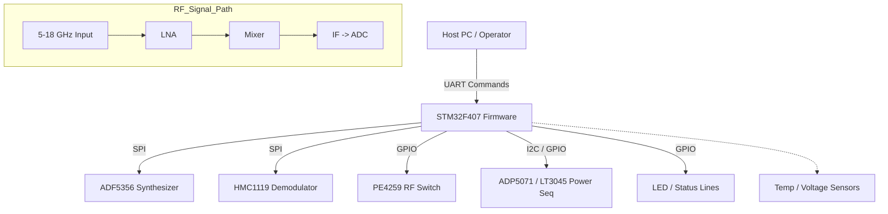
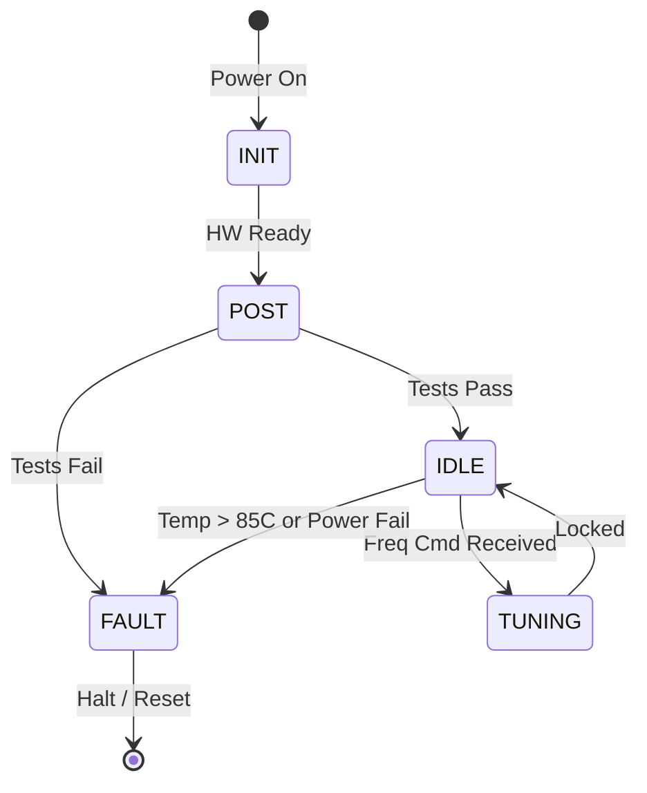
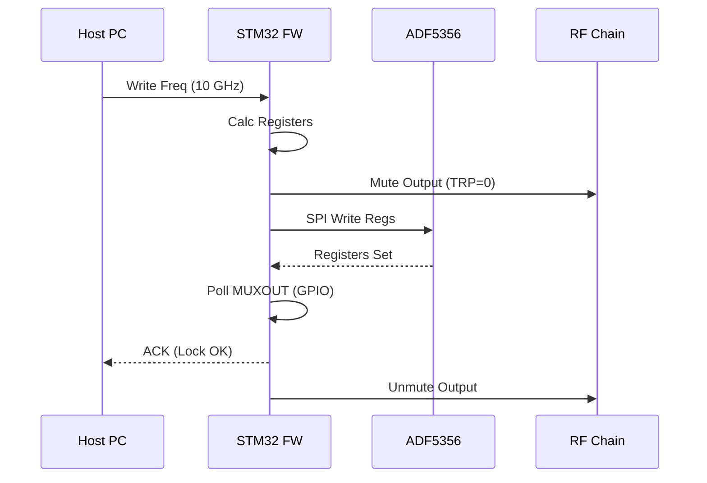
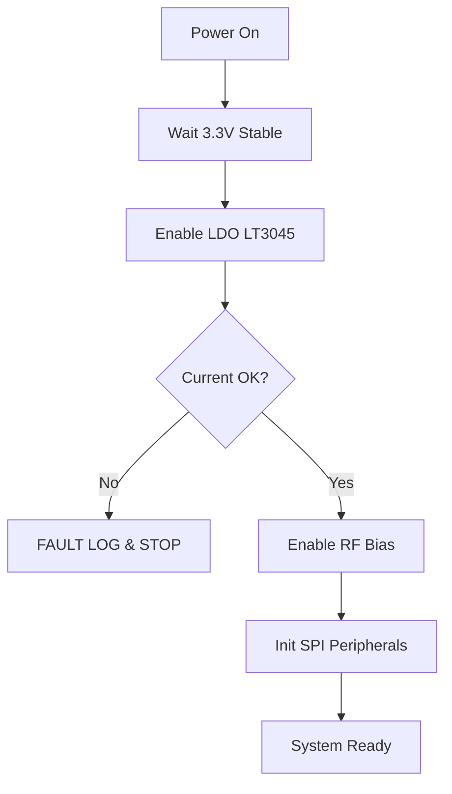

# Software Requirements Specification (SRS)
**Project:** ajsfdvhjs Wideband RF Receiver
**Version:** 1.0
**Date:** 15 April 2026
**Author:** Senior Software Architect

---

## Document Control
| Version | Date | Author | Changes |
|---------|------|--------|---------|
| 1.0 | 15 April 2026 | — | Initial Release for ajsfdvhjs RF Receiver Firmware |

---

# 1. Introduction

## 1.1 Purpose
This Software Requirements Specification (SRS) document describes the functional and non-functional requirements for the embedded firmware controlling the **ajsfdvhjs Wideband RF Receiver**. This firmware, designated **SW-RF-CTRL-FW**, executes on the **STM32F407VGT6** microcontroller. Its primary purpose is to manage the configuration and health monitoring of the RF analog chain (5–18 GHz), control the Local Oscillator (LO) synthesizer, manage power sequencing, and facilitate high-speed data capture coordination between the **AD9208** ADC and the host system via UART.

## 1.2 Scope
The scope of this software includes the complete embedded stack for the STM32F407, written in C (C99 standard).
**In-Scope:**
*   **Hardware Abstraction Layer (HAL):** Direct control of STM32 peripherals (SPI, I2C, UART, GPIO, Timers, DMA).
*   **RF Control Drivers:** SPI drivers for the ADF5356 (LO), HMC1119 (IQ Demod), and PE4259 (RF Switch).
*   **Power Management:** Sequencing logic for ADP5071 and LT3045/LT3094 regulators via GPIO and I2C.
*   **Sensor Monitoring:** Reading internal ADC for external temperature/voltage sensors and internal MCU temperature.
*   **Communication Interface:** A command/response protocol over UART (115200 baud) for register access and status reporting.
*   **Fault Management:** Watchdog timer handling and hardware fault logging.

**Out-of-Scope:**
*   DSP algorithms (implemented on the downstream FPGA/host).
*   FPGA firmware logic (JESD204B link training is managed by FPGA, monitored by MCU via GPIO).
*   PC-side Host GUI software.

## 1.3 Definitions, Acronyms, and Abbreviations
| Term | Definition |
| :--- | :--- |
| **ADC** | Analog-to-Digital Converter (Context: AD9208 or Internal MCU ADC) |
| **BSP** | Board Support Package |
| **CRC** | Cyclic Redundancy Check |
| **DAC** | Digital-to-Analog Converter |
| **DMA** | Direct Memory Access |
| **EEPROM** | Electrically Erasable Programmable Read-Only Memory |
| **FIFO** | First-In, First-Out Buffer |
| **FPGA** | Field-Programmable Gate Array |
| **GPIO** | General Purpose Input/Output |
| **HAL** | Hardware Abstraction Layer |
| **HRS** | Hardware Requirements Specification |
| **HMC** | Hittite Microwave Corporation (part ID prefix) |
| **I2C** | Inter-Integrated Circuit (Serial Interface) |
| **IRQ** | Interrupt Request |
| **ISR** | Interrupt Service Routine |
| **JESD** | JESD204B/C High-Speed Data Converter Interface Standard |
| **LED** | Light Emitting Diode |
| **LO** | Local Oscillator |
| **LNA** | Low Noise Amplifier |
| **MCU** | Microcontroller Unit (STM32F407) |
| **MISRA** | Motor Industry Software Reliability Association (Coding Standard) |
| **MMIC** | Monolithic Microwave Integrated Circuit |
| **NVM** | Non-Volatile Memory |
| **PCB** | Printed Circuit Board |
| **PLL** | Phase-Locked Loop |
| **POST** | Power-On Self Test |
| **RF** | Radio Frequency |
| **SDD** | Software Design Document |
| **SFDR** | Spurious-Free Dynamic Range |
| **SPI** | Serial Peripheral Interface |
| **SRS** | Software Requirements Specification |
| **TRP** | Transmit/Receive Pulse |
| **UART** | Universal Asynchronous Receiver/Transmitter |
| **WDT** | Watchdog Timer |

## 1.4 References
1.  **IEEE Std 830-1998**: Recommended Practice for Software Requirements Specifications.
2.  **IEEE Std 29148-2018**: Systems and software engineering — Life cycle processes — Requirements engineering.
3.  **MISRA-C:2012**: Guidelines for the use of the C language in critical systems.
4.  **HRS (ajsfdvhjs)**: Hardware Requirements Specification, Rev 1.0, 15 April 2026.
5.  **GLR (ajsfdvhjs)**: Glue Logic Requirements, Rev 0V01, 15 April 2026.
6.  **STMicroelectronics**: STM32F407 Datasheet and Reference Manual (RM0090).
7.  **Analog Devices**: AD9208 Datasheet (Dual, 14-Bit, 3 GSPS ADC).
8.  **Analog Devices**: ADF5356 Datasheet (Microwave Wideband Synthesizer).

## 1.5 Overview
Section 2 provides a high-level description of the system context, product functions, and user characteristics. Section 3 details the specific requirements, including external interfaces and 50+ functional requirements. Section 4 covers verification and validation, and Section 5 provides the requirements traceability matrix. Appendices include error codes and sequence diagrams.

---

# 2. Overall Description

## 2.1 Product Perspective
The ajsfdvhjs firmware operates as the control plane for the RF receiver hardware. It abstracts the complexity of the analog front end (AFE) from the system operator.



The software is organized into three distinct layers:
1.  **Hardware Abstraction Layer (HAL):** STM32 HAL drivers or register-level access for SPI, I2C, UART.
2.  **Driver Layer:** Specific device logic for the ADF5356, HMC1119, and power regulators.
3.  **Application Layer:** State machine, command parser, and health monitoring.

## 2.2 Product Functions
1.  **Power Sequencing:** Control enable pins and I2C regulators to ensure the LNA and Mixer receive power in the correct order (protecting GaAs/GaN devices).
2.  **Frequency Tuning:** Calculate and write register values to the ADF5356 to set the LO frequency for 5–18 GHz down-conversion.
3.  **Gain Control:** Adjust gain via the HMC1119 internal VGA.
4.  **Temperature Compensation:** Read onboard temperature sensors (via I2C or internal ADC) and adjust gain or raise alarms if thresholds are exceeded.
5.  **Data Link Monitoring:** Monitor FPGA status GPIOs to confirm JESD204B link integrity.
6.  **UART Command Interface:** Parse binary commands to read/write registers and update system parameters.
7.  **Non-Volatile Storage:** Store calibration data and serial numbers in onboard EEPROM (I2C).
8.  **Self-Test:** Execute POST on startup to verify SPI communication and hardware ID checks.

## 2.3 User Characteristics
*   **Firmware Engineers:** Develop and maintain the code using ST-Link JTAG/SWD interfaces.
*   **Test Engineers:** Interact via UART to verify RF performance parameters (Gain, NF, P1dB).
*   **System Integrators:** Integrate the module into larger racks, monitoring status LEDs.

## 2.4 Constraints
1.  **MISRA-C:2012 Compliance:** All code shall adhere to MISRA-C:2012 rules for safety and reliability.
2.  **Real-Time Processing:** The SPI interface to the LO synthesizer must complete register writes within 10ms to meet tuning speed requirements.
3.  **Memory Constraints:** Code must fit within 1MB Flash and use < 128KB RAM (STM32F407VGT6 limits).
4.  **No Dynamic Allocation:** Heap usage (`malloc`, `free`) is strictly prohibited.
5.  **Language:** ISO C99 is the only allowed language; C++ is excluded.
6.  **Timing:** Power-up sequencing must adhere to strict timing delays (e.g., 100ms delay between LNA and Mixer enable) defined in the HRS.

## 2.5 Assumptions and Dependencies
1.  The Hardware (PCB) is manufactured to the revision defined in the HRS.
2.  The JESD204B SYSREF signals are generated externally by the FPGA.
3.  The Host system sends UART commands terminated with a checksum.
4.  The +12V DC supply is stable and within tolerance before firmware init begins.

---

# 3. Specific Requirements

## 3.1 External Interface Requirements

### 3.1.1 Hardware Interfaces

**3.1.1.1 UART Interface (Command/Control)**
The primary control interface. The STM32F407 USART2 is used.
*   **Baud Rate:** 115200
*   **Data Bits:** 8
*   **Parity:** None
*   **Stop Bits:** 1

```c
typedef struct {
    volatile uint32_t SR;     // Status Register
    volatile uint32_t DR;     // Data Register
    volatile uint32_t BRR;    // Baud Rate Register
    volatile uint32_t CR1;    // Control Register 1
} UART_RegMap_t;

// Driver API
int32_t UART_Init(void);
int32_t_UART_SendByte(uint8_t data);
int32_t UART_ReceiveByte(uint8_t *data);
int32_t UART_SendPacket(const uint8_t *buf, uint16_t len);
```

**3.1.1.2 SPI Interface (RF Control)**
The MCU uses SPI1 (Master Mode) to communicate with the ADF5356 (Synth) and HMC1119 (Demod).
*   **Clock Speed:** Max 10 MHz (due to cabling length to RF modules).
*   **Mode:** Mode 0 (CPOL=0, CPHA=0).
*   **Frame Size:** 8-bit bytes.

```c
typedef struct {
    uint16_t device_id;      // Chip Select or GPIO Pin
    SPI_TypeDef *instance;   // SPI1 or SPI2
} SPI_Device_t;

typedef struct {
    uint8_t *tx_buffer;
    uint8_t *rx_buffer;
    uint16_t length;
} SPI_Transaction_t;

// Driver API
int32_t RF_SPI_Init(void);
int32_t RF_SPI_WriteRegister(uint8_t cs_pin, uint32_t reg_data, uint8_t bytes);
int32_t RF_SPI_ReadRegister(uint8_t cs_pin, uint32_t *reg_data, uint8_t bytes);
```

**3.1.1.3 I2C Interface (PMBus/EEPROM)**
Used for reading configuration EEPROMs and power management telemetry.
*   **Speed:** 100 kHz (Standard).
*   **Addressing:** 7-bit addressing.

```c
typedef struct {
    uint8_t dev_addr;
    uint8_t reg_addr;
    uint8_t data;
} I2C_Transaction_t;

// Driver API
int32_t PM_I2C_Init(void);
int32_t EEPROM_Write(uint16_t addr, uint8_t *data, uint16_t len);
int32_t EEPROM_Read(uint16_t addr, uint8_t *data, uint16_t len);
int32_t TempSensor_Read(int16_t *temp_c);
```

### 3.1.2 Software Interfaces
*   **CMSIS-Core:** ARM Cortex-M4 core access definitions.
*   **STM32 HAL:** Hardware abstraction layer for peripheral configuration.

### 3.1.3 Communication Interfaces
**Protocol Definition: "ajsfdvhjs-Ctrl-v1"**
*   **Frame Format:** `[HEADER][CMD][ADDR][DATA_LEN][DATA][CRC8][TAIL]`
*   **Header:** `0xAA` `0x55`
*   **CMD:** `0x01` (Write), `0x02` (Read), `0x03` (Freq Tune)
*   **Tail:** `0x0D` `0x0A`

## 3.2 Functional Requirements

### 3.2.1 System Initialization (REQ-SW-001 to REQ-SW-010)

| ID | Requirement | Trace to HRS/GLR |
|----|-------------|------------------|
| **REQ-SW-001** | The software SHALL initialize the system clock to 168 MHz using the external 8 MHz crystal within 5ms of power-on reset. | GLR: STM32 Clock Config |
| **REQ-SW-002** | The software SHALL configure the Watchdog Timer (IWDG) to a timeout period of 1000ms. | HRS: Reliability |
| **REQ-SW-003** | The software SHALL perform a Power-On Self-Test (POST) that verifies I2C connectivity to the EEPROM. | HRS: REQ-HW-007 |
| **REQ-SW-004** | The software SHALL read the Board ID from EEPROM address `0x0000` and compare it against `0xAJS`; software SHALL halt if mismatch occurs. | GLR: EEPROM Layout |
| **REQ-SW-005** | The software SHALL initialize the UART interface to 115200 baud, 8N1 format, and transmit the boot message "ajsfdvhjs_READY". | HRS: Control Interface |
| **REQ-SW-006** | The software SHALL configure all SPI Chip Select (CS) pins (LO, Demod, Switch) to High (inactive) state before enabling the SPI peripheral. | GLR: SPI Logic |
| **REQ-SW-007** | The software SHALL read the internal MCU temperature sensor via ADC1 and ensure it is below 60°C before enabling RF Power Amplifiers. | HRS: Thermal Constraints |
| **REQ-SW-008** | The software SHALL initialize the DMA controller for circular buffer mode on UART RX. | GLR: Data Handling |
| **REQ-SW-009** | The software SHALL set the RF Enable GPIO (PE4259 CTRL pin) LOW (Disabled) immediately after boot. | HRS: Power Safety |
| **REQ-SW-010** | The software SHALL enable the External XTAL oscillator for the ADF5356 by toggling the appropriate GPIO. | GLR: GLR-OSC-CTRL |

### 3.2.2 RF Synthesizer Control (REQ-SW-011 to REQ-SW-020)

| ID | Requirement | Trace to HRS/GLR |
|----|-------------|------------------|
| **REQ-SW-011** | The software SHALL calculate the ADF5356 Integer-N and Fractional registers based on a desired RF frequency input between 5000 MHz and 18000 MHz. | HRS: REQ-HW-001 |
| **REQ-SW-012** | The software SHALL write the calculated register map to the ADF5356 via SPI in a single atomic burst (4 registers). | GLR: ADF5356 Driver |
| **REQ-SW-013** | The software SHALL poll the ADF5356 MUXOUT pin (via GPIO) for `0x06` (Digital Lock Detect) after a frequency change. | HRS: Phase Stability |
| **REQ-SW-014** | The software SHALL implement a retry mechanism of 3 attempts if PLL lock is not achieved within 10ms. | HRS: Reliability |
| **REQ-SW-015** | The software SHALL set the ADF5356 output power to `0x03` (4dBm) when tuning above 10 GHz to compensate for roll-off. | HRS: RF Performance |
| **REQ-SW-016** | The software SHALL mute the RF output (mute register bit) during frequency re-tuning to prevent spurs. | HRS: SFDR |
| **REQ-SW-017** | The software SHALL allow the Host to set the frequency via UART Command `0x03` (Frequency) with 1 Hz resolution. | GLR: Protocol Spec |
| **REQ-SW-018** | The software SHALL verify the programmed frequency by reading back the registers from the ADF5356. | HRS: Safety |
| **REQ-SW-019** | The software SHALL implement a lookup table (LUT) for Loop Filter bandwidth switching based on frequency band (Low/Mid/High). | HRS: Phase Noise |
| **REQ-SW-020** | The software SHALL log the last tuned frequency to NVM every 10 minutes. | HRS: Configuration |

### 3.2.3 Gain & Attenuation Control (REQ-SW-021 to REQ-SW-030)

| ID | Requirement | Trace to HRS/GLR |
|----|-------------|------------------|
| **REQ-SW-021** | The software SHALL write to the HMC1119 Gain Control register via SPI. | GLR: HMC1119 Driver |
| **REQ-SW-022** | The Gain control range SHALL be mapped from 0.0 dB to 30.0 dB with 0.5 dB step resolution. | HRS: REQ-HW-008 |
| **REQ-SW-023** | The software SHALL verify the gain setting by reading the HMC1119 "Readback" register. | GLR: HMC1119 Spec |
| **REQ-SW-024** | The software SHALL support a "Fast AGC" mode where gain is adjusted automatically based on ADC RMS reports received from the FPGA. | HRS: REQ-HW-003 (Dynamic Range) |
| **REQ-SW-025** | The software SHALL set the gain to minimum (0 dB) if the RF input is disabled. | HRS: Protection |
| **REQ-SW-026** | The software SHALL support UART command `0x04` (Set Gain) expecting a 16-bit integer representing gain in 0.1dB steps. | GLR: Protocol Spec |
| **REQ-SW-027** | The software SHALL clamp the gain value to a maximum of 30.0 dB even if the host sends a higher value. | HRS: Safety |
| **REQ-SW-028** | The software SHALL store the default gain setting in EEPROM address `0x0010`. | GLR: NVM Layout |
| **REQ-SW-029** | The software SHALL apply a temperature compensation offset to the gain based on the reading from the onboard sensor. | HRS: Thermal Drift |
| **REQ-SW-030** | The software SHALL delay 5us between writing the Baseband Gain register and the RF Gain register to avoid transients. | GLR: HMC1119 Timing |

### 3.2.4 Power Management & Protection (REQ-SW-031 to REQ-SW-040)

| ID | Requirement | Trace to HRS/GLR |
|----|-------------|------------------|
| **REQ-SW-031** | The software SHALL drive the PMIC Enable pin High only after the internal 3.3V rail is stable (using POR flag). | GLR: Power Sequencing |
| **REQ-SW-032** | The software SHALL enable the +5V LDO (LT3045) via GPIO before enabling the GaN LNA bias. | GLR: ADP5071 Logic |
| **REQ-SW-033** | The software SHALL monitor the "Power Good" signal from the ADP5071 via an External Interrupt (EXTI). | HRS: Reliability |
| **REQ-SW-034** | The software SHALL disable all RF outputs (TRP=LOW) within 10us of detecting a Power Loss interrupt. | HRS: Fault Response |
| **REQ-SW-035** | The software SHALL implement a hysteretic shutdown: If Temperature > 85°C, shut down; only restart when < 70°C. | HRS: Thermal Limits |
| **REQ-SW-036** | The software SHALL read the current monitor (INA219) via I2C every 100ms and assert an overcurrent fault if > 1.5A. | GLR: I2C Devices |
| **REQ-SW-037** | The software SHALL blink the Status LED at 2Hz if a non-fatal fault (e.g., high temp) is active. | GLR: UI Spec |
| **REQ-SW-038** | The software SHALL log the fault code to EEPROM address `0x0050` before shutting down. | GLR: NVM Logging |
| **REQ-SW-039** | The software SHALL utilize the Watchdog Timer "Independent Watchdog" (IWDG) to reset the MCU if the main loop hangs for > 1s. | HRS: Reliability |
| **REQ-SW-040** | The software SHALL provide a "Soft Power Down" command via UART that gracefully powers down the RF chain before cutting DC-DC converters. | GLR: Host Interface |

### 3.2.5 Communication & Diagnostics (REQ-SW-041 to REQ-SW-050)

| ID | Requirement | Trace to HRS/GLR |
|----|-------------|------------------|
| **REQ-SW-041** | The software SHALL respond to every valid UART command with an ACK packet containing the echoed command byte. | GLR: Protocol Spec |
| **REQ-SW-042** | The software SHALL respond with a NAK packet and error code if the CRC check fails. | GLR: Protocol Spec |
| **REQ-SW-043** | The software SHALL implement a command `0x05` (Status Request) which returns a struct containing Temp, Voltage, Freq, and Lock Status. | GLR: Telemetry |
| **REQ-SW-044** | The software SHALL implement a command `0x06` (Factory Reset) that restores EEPROM defaults. | HRS: Maintenance |
| **REQ-SW-045** | The software SHALL allow firmware updates via UART Bootloader (DFU mode) triggered by a specific GPIO pattern on boot. | GLR: Maintenance |
| **REQ-SW-046** | The software SHALL provide a "Ping" command `0x00` that responds with `0xAA` to verify connectivity. | GLR: Protocol Spec |
| **REQ-SW-047** | The software SHALL support a "Bulk Write" command for frequency sweep tables to allow rapid list tuning. | HRS: Sweep Speed |
| **REQ-SW-048** | The software SHALL report the device Serial Number (from EEPROM) in the boot message. | HRS: Identification |
| **REQ-SW-049** | The software SHALL calculate and append CRC-8 (Polynomial 0x07) to all outgoing UART packets. | GLR: Comms Integrity |
| **REQ-SW-050** | The software SHALL filter invalid commands (unsupported IDs) without modifying hardware state. | GLR: Robustness |

### 3.2.6 JESD / ADC Interface Monitoring (REQ-SW-051 to REQ-SW-055)

| ID | Requirement | Trace to HRS/GLR |
|----|-------------|------------------|
| **REQ-SW-051** | The software SHALL monitor the FPGA SYNC~ pin status via GPIO to determine if the JESD204B link is active. | HRS: REQ-HW-006 |
| **REQ-SW-052** | The software SHALL disable the ADC clock if the SYNC~ pin indicates a loss of link for > 100ms. | GLR: GLR-SYNC-CTRL |
| **REQ-SW-053** | The software SHALL set a status bit in the Status Register indicating "ADC Link Up" or "ADC Link Down". | HRS: Diagnostics |
| **REQ-SW-054** | The software SHALL read the AD9208 SPI status register (via bridging or shared SPI bus) to check for ADC errors. | GLR: AD9208 Driver |
| **REQ-SW-055** | The software SHALL log the number of JESD link re-initializations to a counter in RAM. | HRS: Maintenance |

## 3.3 Performance Requirements
| ID | Description |
|----|-------------|
| **REQ-PERF-001** | UART command response time (ACK/NAK) SHALL be < 2ms from receipt of last byte. |
| **REQ-PERF-002** | SPI Frequency tuning time (Register write + Lock detect) SHALL be < 15ms total. |
| **REQ-PERF-003** | The main control loop SHALL execute with a cycle time of 10ms (+/- 1ms). |
| **REQ-PERF-004** | Power sequencing (OFF to RF Output stable) SHALL complete within 500ms of 12V application. |
| **REQ-PERF-005** | Firmware startup time (Boot to Main Loop entry) SHALL NOT exceed 100ms. |
| **REQ-PERF-006** | EEPROM read/write cycle time SHALL be < 5ms per byte. |

## 3.4 Design Constraints
1.  **MISRA Compliance:** Code shall pass static analysis with zero MISRA-C:2012 deviations (unless documented).
2.  **Stack Size:** Main stack size shall be configured to 4KB; Interrupt stack size to 1KB.
3.  **Interrupt Priorities:** Watchdog and Safety interrupts shall have priority 0 (highest); UART communication priority 2.
4.  **Compiler:** GCC ARM Embedded (v10+) with `-O2` optimization.
5.  **Data Integrity:** All multi-byte variables (>8 bits) transmitted over UART shall be Big Endian.

## 3.5 Software System Attributes

### 3.5.1 Reliability
The system shall achieve an MTBF of 50,000 hours assuming operation within specified temperature ranges. The software must handle a single-bit error in NVM without failing to boot.

### 3.5.2 Availability
The firmware shall support 24/7 continuous operation. Watchdog resets are permitted, but the system must auto-recover without operator intervention.

### 3.5.3 Security
*   **REQ-SEC-001:** The firmware SHALL verify the CRC of the application code in Flash on startup.
*   **REQ-SEC-002:** The firmware SHALL not execute code from RAM.

### 3.5.4 Maintainability
Code shall be modular. Changes to the RF Front End (e.g., swapping ADF5356 for a different synth) shall only require changes to the `src/drivers/rf_synth.c` file.

---

# 4. Verification and Validation

## 4.1 Unit Test Requirements
*   **SPI Driver:** Verify write/read transactions using a loopback connector.
*   **CRC Module:** Verify correct checksum generation for 100 random packets.
*   **EEPROM Driver:** Verify write endurance handling (simulate wear).
*   **Command Parser:** Inject valid and invalid packets to ensure correct ACK/NAK.

## 4.2 Integration Test Requirements
*   **RF Chain:** Command frequency change; verify ADF5356 lock GPIO goes high.
*   **Power:** Trigger overcurrent fault; verify PMIC shuts down safely.
*   **Thermal:** Heat sensor > 85°C; verify system logs error and cuts RF power.

## 4.3 System Test Requirements
*   Full functionality test using the Host PC interface.
*   24-hour soak test at maximum temperature (+85°C ambient).

---

# 5. Requirements Traceability Matrix

| REQ-SW-ID | Description | Traces To |
|-----------|-------------|-----------|
| REQ-SW-001 | Clock Init (168MHz) | GLR: STM32 Clock Config |
| REQ-SW-003 | POST (EEPROM) | HRS: REQ-HW-007 |
| REQ-SW-005 | UART Init 115200 | HRS: REQ-HW-007 |
| REQ-SW-011 | LO Frequency Calc (5-18GHz) | HRS: REQ-HW-001 |
| REQ-SW-013 | PLL Lock Detect | HRS: REQ-HW-014 (LO Gen) |
| REQ-SW-022 | Gain Control (30dB range) | HRS: REQ-HW-008 |
| REQ-SW-031 | Power Sequencing (LDO before LNA) | GLR: ADP5071 / PMIC Logic |
| REQ-SW-035 | Thermal Hysteresis (85/70 deg C) | HRS: Thermal Spec |
| REQ-SW-041 | UART ACK/NAK | GLR: Protocol Spec |
| REQ-SW-051 | JESD Link Monitoring | HRS: REQ-HW-006 |

---

# 6. Appendices

## Appendix A — Error Codes
```c
typedef enum {
    ERR_OK           = 0x00, // No Error
    ERR_TIMEOUT      = 0x01, // Operation timed out
    ERR_COMM_SPI     = 0x02, // SPI Fault
    ERR_COMM_I2C     = 0x03, // I2C Fault
    ERR_CHECKSUM     = 0x04, // CRC Mismatch
    ERR_PARAM_RANGE  = 0x05, // Parameter out of range
   ERR_PLL_UNLOCK   = 0x06, // PLL failed to lock
    ERR_TEMP_HIGH    = 0x07, // Overtemp fault
    ERR_POWER_FAIL   = 0x08, // PMIC Power Good loss
    ERR_NVM_FAULT    = 0x09, // EEPROM Write fail
    ERR_CMD_UNKNOWN  = 0x0A  // Invalid Opcode
} ErrorCode_t;
```

## Appendix B — Mermaid Diagrams

### System State Machine


### Frequency Change Sequence


### Power Sequence Flowchart
