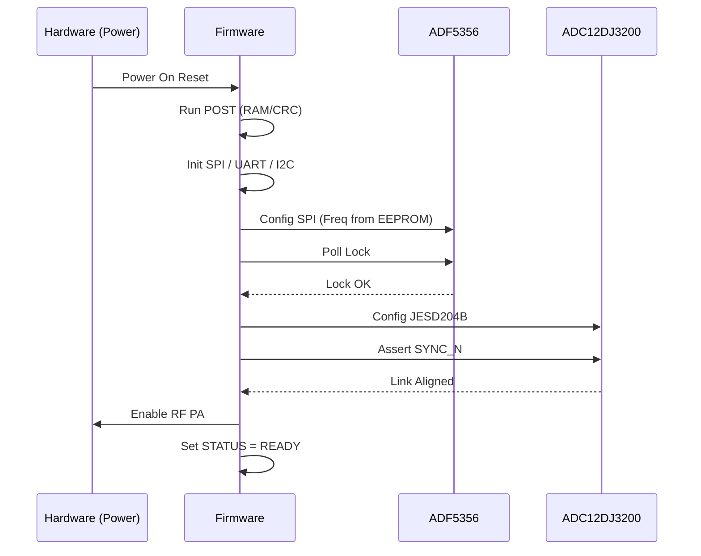
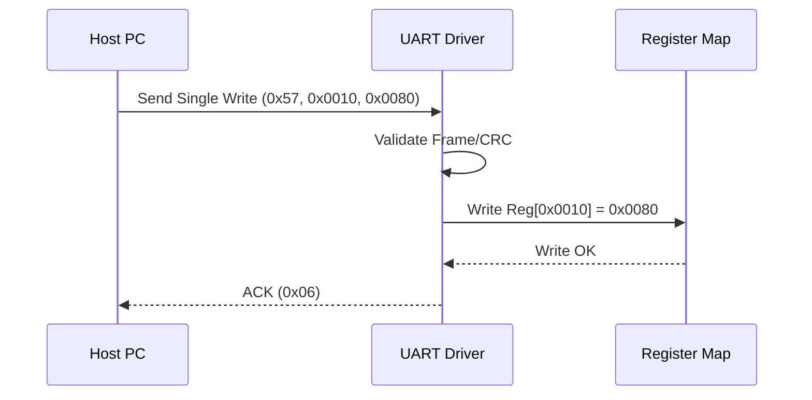
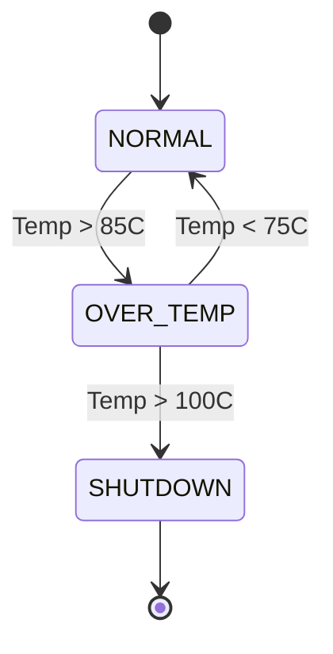
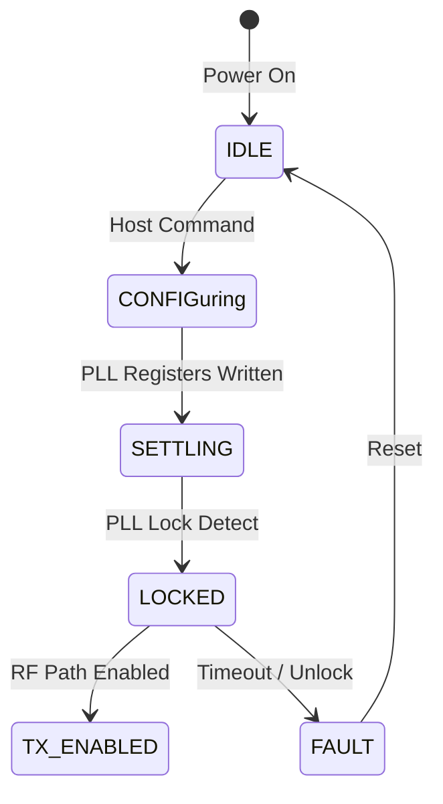
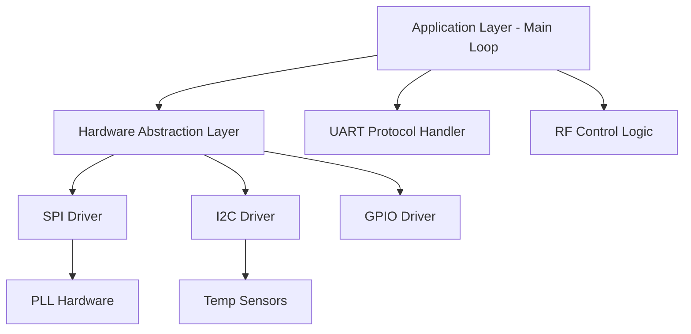

# Software Requirements Specification (SRS)

**Project:** dfbvd Wideband RF Receiver Module  
**Document Version:** 1.0  
**Date:** 16 April 2026  
**Author:** Senior Software Architect

---

## Document Control
| Version | Date | Author | Changes |
|---------|------|--------|---------|
| 1.0 | 16 April 2026 | System Architecture | Initial Release of SRS for dfbvd Embedded Control Software |

---

# 1. Introduction

## 1.1 Purpose
This Software Requirements Specification (SRS) defines the comprehensive software requirements for the **dfbvd** Wideband RF Receiver Module firmware. This document describes the system-level functional and non-functional requirements allocated to software, serving as the baseline for the software design, implementation, and testing phases.

The primary audience for this document includes:
*   **Firmware Engineers:** Responsible for implementing the embedded C code for the Artix-7 FPGA and associated microcontroller subsystems.
*   **Test Engineers:** Responsible for developing verification test plans and automated test scripts.
*   **System Integrators:** Responsible for integrating the dfbvd module into the larger host system.
*   **Verification and Validation Team:** Responsible for ensuring the software meets all safety and performance criteria.

This specification conforms to IEEE 830-1998 and ISO/IEC/IEEE 29148:2018 standards for Software Requirements Specifications.

## 1.2 Scope
The software scope for the **dfbvd** project encompasses all firmware necessary to control the RF chain, manage power sequences, communicate with the host, and transport digitized data.

**Specific In-Scope Software Functions:**
*   **System Initialization:** Execution of Power-On Self-Test (POST), clock tree configuration (PLL/Clock Cleaner), and peripheral bring-up.
*   **Hardware Abstraction Layer (HAL):** Drivers for SPI (PLL, ADC, VGA), I2C (EEPROM, Temperature Sensors), GPIO (Power Enables), and UART.
*   **RF Control Logic:** Configuration of the ADF5356 PLL, ADL5202 VGA gain staging, and HMC1022 Mixer bias.
*   **Data Path Management:** Handling JESD204B lane synchronization (SYSREF alignment) and monitoring link status.
*   **Host Communication:** Implementation of the register-based UART protocol for command, status, and telemetry.
*   **Fault Management:** Real-time monitoring of temperature (internal XADC and external sensors) and voltage rails; execution of fault mitigation sequences (shutdown).
*   **Firmware Update Support:** Bootloader functionality for secure field updates via UART.

**Exclusions:**
*   Signal processing algorithms (decimation, filtering) are performed by the host or downstream FPGA logic, not this control firmware.
*   PC-based GUI control software.

## 1.3 Definitions, Acronyms, and Abbreviations

| Term | Definition |
| :--- | :--- |
| **ADC** | Analog-to-Digital Converter (ADC12DJ3200). |
| **AGC** | Automatic Gain Control. |
| **API** | Application Programming Interface. |
| **BIST** | Built-In Self-Test. |
| **BOM** | Bill of Materials. |
| **BOOT** | Bootloader. |
| **BSP** | Board Support Package. |
| **CCITT** | International Telegraph and Telephone Consultative Committee (CRC standard). |
| **CONOPS** | Concept of Operations. |
| **CRC** | Cyclic Redundancy Check. |
| **DAC** | Digital-to-Analog Converter. |
| **DMA** | Direct Memory Access. |
| **DRC** | Design Rule Check. |
| **DSP** | Digital Signal Processing. |
| **DUT** | Device Under Test. |
| **EAP** | External Address Pointer. |
| **ECU** | Electronic Control Unit. |
| **EEPROM** | Electrically Erasable Programmable Read-Only Memory. |
| **EMAC** | Ethernet Media Access Controller. |
| **EMI** | Electromagnetic Interference. |
| **EPROM** | Erasable Programmable Read-Only Memory. |
| **FDR** | Functional Design Review. |
| **FPGA** | Field-Programmable Gate Array. |
| **FSM** | Finite State Machine. |
| **GND** | Ground. |
| **GPIO** | General Purpose Input/Output. |
| **HAL** | Hardware Abstraction Layer. |
| **HRS** | Hardware Requirements Specification. |
| **HS** | High Speed. |
| **I2C** | Inter-Integrated Circuit (Serial Bus). |
| **ICD** | Interface Control Document. |
| **ID** | Identifier. |
| **IEC** | International Electrotechnical Commission. |
| **IEEE** | Institute of Electrical and Electronics Engineers. |
| **INT** | Interrupt. |
| **IO** | Input/Output. |
| **IPC** | Inter-Process Communication. |
| **ISA** | Instruction Set Architecture. |
| **ISR** | Interrupt Service Routine. |
| **ISO** | International Organization for Standardization. |
| **ITAR** | International Traffic in Arms Regulations. |
| **JTAG** | Joint Test Action Group. |
| **LVDS** | Low-Voltage Differential Signaling. |
| **MCU** | Microcontroller Unit. |
| **MIPI** | Mobile Industry Processor Interface. |
| **MIPS** | Million Instructions Per Second. |
| **MISO** | Master In Slave Out. |
| **MOSI** | Master Out Slave In. |
| **MSPS** | Mega-Samples Per Second. |
| **NACK** | Negative Acknowledgement. |
| **NF** | Noise Figure. |
| **NMI** | Non-Maskable Interrupt. |
| **NVM** | Non-Volatile Memory. |
| **OSC** | Oscillator. |
| **PCB** | Printed Circuit Board. |
| **PLL** | Phase-Locked Loop. |
| **POST** | Power-On Self-Test. |
| **PWR** | Power. |
| **QSPI** | Quad Serial Peripheral Interface. |
| **RAM** | Random Access Memory. |
| **RBAC** | Role-Based Access Control. |
| **RF** | Radio Frequency. |
| **ROM** | Read-Only Memory. |
| **RPC** | Remote Procedure Call. |
| **RTC** | Real-Time Clock. |
| **RTOS** | Real-Time Operating System. |
| **RX** | Receive. |
| **SAS** | Serial Attached SCSI. |
| **SCSI** | Small Computer System Interface. |
| **SD** | Secure Digital. |
| **SDA** | Serial Data (I2C). |
| **SDO** | Serial Data Out. |
| **SFDR** | Spurious-Free Dynamic Range. |
| **SIL** | Safety Integrity Level. |
| **SLL** | Serial Low Latency. |
| **SMB** | System Management Bus. |
| **SOP** | Standard Operating Procedure. |
| **SPD** | Serial Presence Detect. |
| **SPI** | Serial Peripheral Interface. |
| **SRAM** | Static Random Access Memory. |
| **SRS** | Software Requirements Specification. |
| **SSD** | Solid State Drive. |
| **STA** | Spanning Tree Algorithm. |
| **STP** | Shielded Twisted Pair. |
| **SW** | Software. |
| **SYS** | System. |
| **SYSREF** | System Reference (JESD204B). |
| **TCU** | Telematics Control Unit. |
| **TEMP** | Temperature. |
| **TPM** | Trusted Platform Module. |
| **TRP** | Transmit/Receive Point. |
| **TS** | Technical Specification. |
| **TTL** | Transistor-Transistor Logic. |
| **TX** | Transmit. |
| **UART** | Universal Asynchronous Receiver/Transmitter. |
| **USB** | Universal Serial Bus. |
| **UTP** | Unshielded Twisted Pair. |
| **VCO** | Voltage Controlled Oscillator. |
| **VGA** | Variable Gain Amplifier. |
| **VHDL** | VHSIC Hardware Description Language. |
| **WDT** | Watchdog Timer. |
| **WLAN** | Wireless Local Area Network. |

## 1.4 References
1.  **IEEE Std 830-1998:** IEEE Recommended Practice for Software Requirements Specifications.
2.  **ISO/IEC/IEEE 29148:2018:** Systems and software engineering — Life cycle processes — Requirements engineering.
3.  **dfbvd Hardware Requirements Specification (HRS)**, Rev 1.0, 16 April 2026.
4.  **dfbvd Glue Logic Requirements (GLR)**, Rev 0V01, 16 April 2026.
5.  **MISRA C:2012:** Guidelines for the use of the C language in critical systems.
6.  **JEDEC JESD204B Standard:** Serial Interface for Data Converters.
7.  **Analog Devices ADF5356 Datasheet:** Wideband Synthesizer with Integrated VCO.
8.  **Texas Instruments ADC12DJ3200 Datasheet:** 12-Bit, 6.4 GSPS RF Sampling ADC.
9.  **Analog Devices ADL5202 Datasheet:** Digital Variable Gain Amplifier.
10. **Xilinx UG470:** 7 Series FPGA Configuration User Guide.

## 1.5 Overview
The remainder of this document is organized as follows:
*   **Section 2: Overall Description** provides a high-level view of the system architecture, including context diagrams, major functions, and design constraints.
*   **Section 3: Specific Requirements** details the functional, performance, and interface requirements. It defines the communication protocols and specific behaviors for initialization, RF control, and fault handling. This section includes the requirements traceability to the HRS and GLR.
*   **Section 4: Verification and Validation** outlines the testing strategy, including unit, integration, and system test requirements.
*   **Section 5: Requirements Traceability Matrix** provides a bidirectional mapping between Software Requirements (REQ-SW) and Hardware Requirements (REQ-HW) or Glue Logic sections.
*   **Section 6: Appendices** contains data structures, register maps, state diagrams, and error code definitions.

---

# 2. Overall Description

## 2.1 Product Perspective

The dfbvd software is embedded firmware running on the FPGA fabric (MicroBlaze soft-core or hard-processor if applicable) and dedicated logic blocks. It acts as the control plane for the RF hardware. The firmware does not perform signal processing on the high-speed data path (which flows directly from the ADC to the LVDS backplane via JESD204B SERDES blocks) but manages the configuration and health monitoring of the data path components.

**System Context Diagram:**
```mermaid
graph TD
    HOST[Host PC / System Controller] -->|UART Command/Control| FW[dfbvd Firmware]
    CONFIG[SPI Flash] -->|Boot Image| FW
    FW -->|SPI Config| RF_CHAIN[RF Front End]
    FW -->|I2C Control| CLK_SYNTH[Clock Synthesizer]
    FW -->|SPI Control| ADC[ADC Subsystem]
    FW -->|GPIO Enable| PWR[Power Management]
    RF_CHAIN -->|IF Signal| ADC
    ADC -->|JESD204B (High Speed Data)| BP[LVDS Backplane]
    FW -->|Status Telemetry| HOST
    TEMP[Temp Sensors] -->|I2C Data| FW
    FW -->|SPI Config| VGA[VGA]
```

## 2.2 Product Functions
1.  **System Initialization:** Configures clocks (PLL/CLK_Cleaner), enables power rails, initializes SPI/I2C peripherals, and executes POST.
2.  **RF Chain Configuration:**
    *   Programs ADF5356 PLL frequency.
    *   Sets ADL5202 VGA gain based on host command or AGC algorithm.
    *   Configures ADC12DJ3200 sampling rate and JESD204B lane parameters.
3.  **Host Communication:** Implements the UART protocol for register read/write, gain adjustment, and status querying.
4.  **Health Monitoring:** Continuously monitors board temperature via I2C/XADC and supply voltages via ADC internal monitors.
5.  **Fault Handling:** Automatic shutdown of RF amplifiers if over-temperature or voltage fault is detected.
6.  **Data Transport:** Bridges JESD204B data from ADC to LVDS outputs (ensure link alignment).
7.  **Non-Volatile Storage:** Reads/Writes calibration constants and configuration presets to EEPROM.
8.  **Watchdog Management:** Kicks the watchdog timer periodically; resets on timeout.

## 2.3 User Characteristics
*   **Field Engineers:** Interact via UART to setup intercept missions, set frequency, and gain. Require clear ACK/NAK responses.
*   **Maintenance Technicians:** Use the diagnostic interface to view fault logs and perform self-tests.
*   **Integration Developers:** Require a stable register map for host software driver development.

## 2.4 Constraints
1.  **MISRA-C Compliance:** All C code shall adhere to MISRA-C:2012 standards to ensure safety and reliability.
2.  **Real-Time Response:** The firmware must respond to UART commands within 10ms and handle interrupts within 100µs.
3.  **Memory Limits:** Firmware footprint must fit within the allocated 512KB BRAM/DDR with 128KB reserved for stack/heap.
4.  **Timing:** PLL lock sequence must complete within 100ms of power-up.
5.  **Safety:** Software shall not enable RF power amplifiers until clocks are stable and JESD link is aligned.

## 2.5 Assumptions and Dependencies
1.  The 10 MHz TCXO reference is stable and within +/- 1ppm tolerance.
2.  The 12V supply remains within +/- 5% tolerance (11.4V - 12.6V).
3.  The host UART driver implements the specified frame format with inter-byte gaps < 50ms.
4.  The hardware schematic matches the GLR v0V01 netlist.

---

# 3. Specific Requirements

## 3.1 External Interface Requirements

### 3.1.1 Hardware Interfaces

**3.1.1.1 RF Control Interface (SPI)**
The firmware controls the ADF5356 PLL and ADL5202 VGA via SPI.

```c
// SPI Configuration Structure for ADF5356
typedef struct {
    uint8_t int_frac;       // Integer divider (0xA), Frac (0xB), etc.
    uint32_t freq_hz;       // Target Frequency
} ADF5356_Config_t;

// Driver API
int32_t RF_SPI_Init(uint32_t clock_hz);
int32_t RF_PLL_Write(uint8_t reg_addr, uint32_t data);
int32_t RF_VGA_SetGain(int8_t gain_db); // -11dB to +25dB
```

**3.1.1.2 ADC Interface (JESD204B & SPI)**
The firmware configures the ADC12DJ3200 via SPI and monitors the SYNC_N signal.

```c
typedef struct {
    uint8_t  lane_mode;     // 1 lane or 2 lanes
    uint8_t  bits_per_sample; // 12 bits
    uint32_t msp_rate;      // 3000 MSPS
} JESD_Config_t;

// Driver API
int32_t ADC_SPI_Init(void);
int32_t ADC_JESD_Enable(void);
int32_t ADC_CheckSync(void);
```

**3.1.1.3 Memory Interface (I2C EEPROM)**
Storage for calibration tables.

```c
int32_t EEPROM_Init(uint32_t clock_khz);
int32_t EEPROM_Read(uint16_t addr, uint8_t *buf, uint16_t len);
int32_t EEPROM_Write(uint16_t addr, const uint8_t *buf, uint16_t len);
```

### 3.1.2 Software Interfaces
*   **Standard Library:** Embedded C Standard Library (newlib, newlib-nano).
*   **Xilinx Drivers:** Xilinx Standalone OS drivers (xil_spi, xil_uart, xil_iic, xil_gpio).

### 3.1.3 Communication Interfaces

**UART Protocol Specification (from GLR)**

The dfbvd firmware implements a slave-mode UART protocol. All communication is initiated by the Host.

| Command | CMD byte | Frame Structure | Response |
|---------|----------|-----------------|----------|
| Single Write | 0x57 ('W') | [0x57][ADDR_H][ADDR_L][DATA_H][DATA_L] | [0x06] ACK |
| Single Read  | 0x52 ('R') | [0x52][ADDR_H\|0x80][ADDR_L] | [DATA_H][DATA_L] |
| Bulk Write   | 0x42 ('B') | [0x42][ADDR_H][ADDR_L][N][D0_H][D0_L]...[Dn_H][Dn_L] | [0x06] ACK |
| Bulk Read    | 0x62 ('b') | [0x62][ADDR_H\|0x80][ADDR_L][N] | [D0_H][D0_L]...[Dn_H][Dn_L] |
| Error NAK    | 0x15 | Sent by firmware on invalid command/address | — |

*   **Address Space:** 16-bit (0x0000–0xFFFF).
*   **Read Flag:** Bit 15 of the address byte must be set (OR 0x8000).
*   **Maximum Bulk Count (N):** 64 registers per transaction.
*   **Timeout:** Firmware resets parser if inter-byte gap > 50ms.

## 3.2 Functional Requirements

### 3.2.1 System Initialization (REQ-SW-001 to REQ-SW-010)

**REQ-SW-001:** The software SHALL complete power-on self-test (POST) within 500ms of reset de-assertion.
*   **Source:** HRS REQ-HW-005 (Power on latency)
*   **Priority:** Mandatory
*   **Verification:** Test (T)

**REQ-SW-002:** The software SHALL verify the BOARD_ID register (Address 0x0000) matches the expected value 0xDFBVD; firmware shall halt if mismatch detected.
*   **Source:** GLR §8
*   **Priority:** Mandatory
*   **Verification:** Test (T)

**REQ-SW-003:** The software SHALL configure the ADF5356 PLL to the target frequency specified in EEPROM (Addr 0x0010-0x0013) within 100ms of initialization.
*   **Source:** HRS REQ-HW-001 (Frequency Range)
*   **Priority:** Mandatory
*   **Verification:** Analysis (A)

**REQ-SW-004:** The software SHALL poll the ADF5356 MUXOUT pin (via GPIO) for VDD high/low lock indication with a 100ms timeout.
*   **Source:** ADF5356 Datasheet
*   **Priority:** Mandatory
*   **Verification:** Test (T)

**REQ-SW-005:** The software SHALL initialize all SPI peripherals (PLL, VGA, Clock Cleaner) to their default safe states (outputs disabled/muted) before enabling application tasks.
*   **Source:** HRS REQ-HW-015 (Protection)
*   **Priority:** Mandatory
*   **Verification:** Inspection (I)

**REQ-SW-006:** The software SHALL load calibration data (gain slope, temp coefficients) from EEPROM into SRAM on startup.
*   **Source:** HRS REQ-HW-013 (Gain Control)
*   **Priority:** Desirable
*   **Verification:** Test (T)

**REQ-SW-007:** The software SHALL initialize the Watchdog Timer (WDT) to 100ms timeout before entering the main loop.
*   **Source:** Design Constraint
*   **Priority:** Mandatory
*   **Verification:** Test (T)

**REQ-SW-008:** The software SHALL log the firmware version string to UART register 0x0001 on startup.
*   **Source:** GLR §3.1.3
*   **Priority:** Mandatory
*   **Verification:** Inspection (I)

**REQ-SW-009:** The software SHALL perform a RAM BIST (March C-) on the internal BRAM used for stack/heap.
*   **Source:** HRS REQ-HW-011 (Reliability)
*   **Priority:** Optional
*   **Verification:** Test (T)

**REQ-SW-010:** The software SHALL set the SYSTEM_STATUS register (0x0002) to 0x01 (Initializing) during boot and 0x02 (Ready) upon completion.
*   **Source:** GLR §3.1.3
*   **Priority:** Mandatory
*   **Verification:** Test (T)

### 3.2.2 UART Communication Driver (REQ-SW-011 to REQ-SW-020)

**REQ-SW-011:** The UART driver SHALL support baud rates of 9600, 19200, 57600, and 115200 bps.
*   **Source:** GLR §8 (UART Config)
*   **Priority:** Mandatory
*   **Verification:** Test (T)

**REQ-SW-012:** The driver SHALL implement the Single Write command (0x57) as defined in the GLR frame format.
*   **Source:** GLR §3.1.3
*   **Priority:** Mandatory
*   **Verification:** Test (T)

**REQ-SW-013:** The driver SHALL implement the Single Read command (0x52) with address bit 15 set (0x8000).
*   **Source:** GLR §3.1.3
*   **Priority:** Mandatory
*   **Verification:** Test (T)

**REQ-SW-014:** The driver SHALL implement the Bulk Write command (0x42) for up to 64 consecutive registers.
*   **Source:** GLR §3.1.3
*   **Priority:** Mandatory
*   **Verification:** Test (T)

**REQ-SW-015:** The driver SHALL implement the Bulk Read command (0x62) for up to 64 consecutive registers.
*   **Source:** GLR §3.1.3
*   **Priority:** Mandatory
*   **Verification:** Test (T)

**REQ-SW-016:** The driver SHALL respond to an invalid command byte with NAK (0x15) within 200µs.
*   **Source:** GLR §3.1.3
*   **Priority:** Mandatory
*   **Verification:** Test (T)

**REQ-SW-017:** The driver SHALL support a hardware TX FIFO of at least 16 bytes to prevent underrun during bulk writes.
*   **Source:** Design Constraint
*   **Priority:** Mandatory
*   **Verification:** Analysis (A)

**REQ-SW-018:** The driver SHALL support an RX FIFO of at least 16 bytes to capture bulk commands without overrun.
*   **Source:** Design Constraint
*   **Priority:** Mandatory
*   **Verification:** Analysis (A)

**REQ-SW-019:** The driver SHALL clear the UART_STATUS.FRAME_ERR flag upon reading the status register.
*   **Source:** UART IP Spec
*   **Priority:** Mandatory
*   **Verification:** Test (T)

**REQ-SW-020:** The driver SHALL recover from framing errors by flushing the RX buffer and waiting for the next valid preamble (inter-byte timeout).
*   **Source:** GLR §3.1.3
*   **Priority:** Mandatory
*   **Verification:** Test (T)

### 3.2.3 RF Gain Control (REQ-SW-021 to REQ-SW-030)

**REQ-SW-021:** The software SHALL set the ADL5202 VGA gain based on the value written to the GAIN_SET register (0x0010).
*   **Source:** HRS REQ-HW-013
*   **Priority:** Mandatory
*   **Verification:** Test (T)

**REQ-SW-022:** The GAIN_SET register SHALL accept values from -11 dB to +25 dB, mapped linearly to an 8-bit parallel bus (0x00 to 0xFF).
*   **Source:** ADL5202 Datasheet
*   **Priority:** Mandatory
*   **Verification:** Inspection (I)

**REQ-SW-023:** The software SHALL verify that gain changes do not cause output power transients exceeding +10 dBm (compliance with HRS REQ-HW-005).
*   **Source:** HRS REQ-HW-005
*   **Priority:** Mandatory
*   **Verification:** Analysis (A)

**REQ-SW-024:** The software SHALL provide an Automatic Gain Control (AGC) mode enabled via bit 0 of MODE_CTRL register (0x0011).
*   **Source:** HRS REQ-HW-013
*   **Priority:** Desirable
*   **Verification:** Test (T)

**REQ-SW-025:** In AGC mode, the software SHALL adjust gain to maintain the ADC reading (monitoring register) within -10 dBFS to -3 dBFS.
*   **Source:** HRS REQ-HW-013
*   **Priority:** Desirable
*   **Verification:** Test (T)

**REQ-SW-026:** The software SHALL update the gain at a maximum rate of 10 Hz (100ms period) to prevent oscillation.
*   **Source:** Design Constraint
*   **Priority:** Mandatory
*   **Verification:** Analysis (A)

**REQ-SW-027:** The software SHALL store the current gain setting in non-volatile memory (EEPROM) every 60 seconds if changed.
*   **Source:** Design Constraint
*   **Priority:** Desirable
*   **Verification:** Test (T)

**REQ-SW-028:** The software SHALL assert the MUTE signal (GPIO) to the RF chain during PLL unlock events.
*   **Source:** HRS REQ-HW-015 (Protection)
*   **Priority:** Mandatory
*   **Verification:** Test (T)

**REQ-SW-029:** The software SHALL apply temperature compensation to the gain setting based on the TEMP_COEFF register (0x0020).
*   **Source:** HRS REQ-HW-013
*   **Priority:** Optional
*   **Verification:** Test (T)

**REQ-SW-030:** The software SHALL report the actual applied gain in register GAIN_ACTUAL (0x0012).
*   **Source:** GLR §3.1.3
*   **Priority:** Mandatory
*   **Verification:** Test (T)

### 3.2.4 Frequency Synthesis (REQ-SW-031 to REQ-SW-040)

**REQ-SW-031:** The software SHALL configure the ADF5356 PLL using the 64-bit Integer and Frac registers derived from the FREQ_TARGET register (0x0030).
*   **Source:** HRS REQ-HW-001
*   **Priority:** Mandatory
*   **Verification:** Test (T)

**REQ-SW-032:** The software SHALL write the calculated frequency registers to the ADF5356 via SPI at 10 MHz maximum clock rate.
*   **Source:** ADF5356 Datasheet
*   **Priority:** Mandatory
*   **Verification:** Test (T)

**REQ-SW-033:** The software SHALL verify the PLL lock bit (MUXOUT) after a frequency change.
*   **Source:** Design Constraint
*   **Priority:** Mandatory
*   **Verification:** Test (T)

**REQ-SW-034:** If the PLL fails to lock within 100ms, the software SHALL set the LOCK_STATUS register (0x0031) to 0x00 (Unlocked).
*   **Source:** Design Constraint
*   **Priority:** Mandatory
*   **Verification:** Test (T)

**REQ-SW-035:** The software SHALL support frequency hopping (changing FREQ_TARGET) with a maximum latency of 1ms between registers written and lock detect.
*   **Source:** HRS REQ-HW-001
*   **Priority:** Desirable
*   **Verification:** Test (T)

**REQ-SW-036:** The software SHALL disable the RF output during frequency hopping to prevent spurious emissions.
*   **Source:** HRS REQ-HW-004 (SFDR)
*   **Priority:** Mandatory
*   **Verification:** Test (T)

**REQ-SW-037:** The software SHALL load the MOD2 and FRAC1 registers with 0x0000 if the intended output requires integer-N mode operation.
*   **Source:** ADF5356 Datasheet
*   **Priority:** Mandatory
*   **Verification:** Inspection (I)

**REQ-SW-038:** The software SHALL calculate the prescaler value based on the target frequency band (5GHz vs 18GHz).
*   **Source:** HRS REQ-HW-001
*   **Priority:** Mandatory
*   **Verification:** Analysis (A)

**REQ-SW-039:** The software SHALL log the last successful frequency set operation in EEPROM address 0x0050.
*   **Source:** Design Constraint
*   **Priority:** Desirable
*   **Verification:** Test (T)

**REQ-SW-040:** The software SHALL expose the raw PLL registers via the UART bulk read map for advanced debugging (0x0100-0x0110).
*   **Source:** GLR §3.1.3
*   **Priority:** Desirable
*   **Verification:** Inspection (I)

### 3.2.5 Temperature Monitoring (REQ-SW-041 to REQ-SW-050)

**REQ-SW-041:** The software SHALL read the internal XADC temperature sensor every 1 second.
*   **Source:** HRS REQ-HW-008
*   **Priority:** Mandatory
*   **Verification:** Test (T)

**REQ-SW-042:** The software SHALL read the external I2C temperature sensor (located near the LNA) every 1 second.
*   **Source:** HRS REQ-HW-008
*   **Priority:** Mandatory
*   **Verification:** Test (T)

**REQ-SW-043:** The software SHALL write the maximum of the two temperature readings to the TEMP_CURRENT register (0x0040).
*   **Source:** Design Constraint
*   **Priority:** Mandatory
*   **Verification:** Test (T)

**REQ-SW-044:** The software SHALL generate a TEMP_ALERT interrupt when temperature exceeds +85°C.
*   **Source:** HRS REQ-HW-008
*   **Priority:** Mandatory
*   **Verification:** Test (T)

**REQ-SW-045:** Upon a TEMP_ALERT, the software SHALL disable the RF PA (Power Amplifier) via GPIO enable pin.
*   **Source:** HRS REQ-HW-015 (Protection)
*   **Priority:** Mandatory
*   **Verification:** Test (T)

**REQ-SW-046:** The software SHALL re-enable the RF PA when temperature drops below +75°C (10°C hysteresis).
*   **Source:** HRS REQ-HW-008
*   **Priority:** Mandatory
*   **Verification:** Test (T)

**REQ-SW-047:** The software SHALL log the timestamp of over-temperature events in EEPROM.
*   **Source:** HRS REQ-HW-011 (Logging)
*   **Priority:** Desirable
*   **Verification:** Test (T)

**REQ-SW-048:** The software shall read the temperature in degrees Celsius with a resolution of 0.5°C.
*   **Source:** Design Constraint
*   **Priority:** Mandatory
*   **Verification:** Inspection (I)

**REQ-SW-049:** The software SHALL perform a moving average filter over 5 samples for the temperature reading in TEMP_AVG register (0x0041).
*   **Source:** Design Constraint
*   **Priority:** Desirable
*   **Verification:** Test (T)

**REQ-SW-050:** The software shall trigger a board-level shutdown if temperature exceeds +100°C.
*   **Source:** HRS REQ-HW-015 (Protection)
*   **Priority:** Mandatory
*   **Verification:** Test (T)

### 3.2.6 Data Interface (JESD204B) (REQ-SW-051 to REQ-SW-060)

**REQ-SW-051:** The software SHALL configure the ADC12DJ3200 for JESD204B Class 1 operation via SPI.
*   **Source:** HRS REQ-HW-006
*   **Priority:** Mandatory
*   **Verification:** Test (T)

**REQ-SW-052:** The software SHALL assert the SYNC_N signal to the ADC for at least 1024 clock cycles to initiate lane alignment.
*   **Source:** JESD204B Spec
*   **Priority:** Mandatory
*   **Verification:** Test (T)

**REQ-SW-053:** The software SHALL poll the ADC PLL_LOCK bit and RBD_STATUS bits to confirm link alignment.
*   **Source:** ADC12DJ3200 Datasheet
*   **Priority:** Mandatory
*   **Verification:** Test (T)

**REQ-SW-054:** The software SHALL report the JESD204B link status in register LINK_STATUS (0x0050).
*   **Source:** GLR §3.1.3
*   **Priority:** Mandatory
*   **Verification:** Test (T)

**REQ-SW-055:** The software SHALL set the sampling rate (MSPS) via the ADC SPI interface based on the SMPL_CFG register (0x0051).
*   **Source:** HRS REQ-HW-006
*   **Priority:** Mandatory
*   **Verification:** Test (T)

**REQ-SW-056:** The software SHALL verify that the LMFS (Lane, M, F, S) configuration matches the FPGA IP core settings.
*   **Source:** Design Constraint
*   **Priority:** Mandatory
*   **Verification:** Analysis (A)

**REQ-SW-057:** The software SHALL clear buffer overflow flags in the FPGA JESD IP core every 100ms.
*   **Source:** Design Constraint
*   **Priority:** Mandatory
*   **Verification:** Inspection (I)

**REQ-SW-058:** The software SHALL disable the ADC outputs (power down) if the link fails to align after 5 retries.
*   **Source:** HRS REQ-HW-006
*   **Priority:** Mandatory
*   **Verification:** Test (T)

**REQ-SW-059:** The software SHALL provide a lane error counter accessible via register LANE_ERR_CNT (0x0052).
*   **Source:** GLR §3.1.3
*   **Priority:** Desirable
*   **Verification:** Test (T)

**REQ-SW-060:** The software SHALL handle the SYSREF signal generation if configured in Subclass 1 mode (optional).
*   **Source:** JESD204B Spec
*   **Priority:** Optional
*   **Verification:** Test (T)

### 3.2.7 Diagnostics and Built-In Test (REQ-SW-061 to REQ-SW-075)

**REQ-SW-061:** The software SHALL implement a Power-On Self-Test (POST) covering RAM, ROM CRC, and peripheral communication check.
*   **Source:** HRS REQ-HW-011
*   **Priority:** Mandatory
*   **Verification:** Test (T)

**REQ-SW-062:** The software SHALL log all detected faults to a circular fault log buffer in EEPROM (minimum 64 entries, FIFO).
*   **Source:** HRS REQ-HW-011
*   **Priority:** Mandatory
*   **Verification:** Test (T)

**REQ-SW-063:** The software SHALL expose a UART diagnostic command (0xD0) that dumps the fault log buffer to the host.
*   **Source:** GLR §3.1.3
*   **Priority:** Mandatory
*   **Verification:** Test (T)

**REQ-SW-064:** The software SHALL maintain a software execution counter (uptime seconds) readable via UART register 0x0060.
*   **Source:** GLR §3.1.3
*   **Priority:** Mandatory
*   **Verification:** Test (T)

**REQ-SW-065:** The software SHALL implement a built-in loopback test for the UART driver (internal Tx->Rx) on startup.
*   **Source:** Design Constraint
*   **Priority:** Mandatory
*   **Verification:** Test (T)

**REQ-SW-066:** The software SHALL calculate a CRC-16-CCITT on the firmware image in Flash at boot time.
*   **Source:** HRS REQ-HW-011
*   **Priority:** Mandatory
*   **Verification:** Test (T)

**REQ-SW-067:** The software SHALL assert an ERROR_LED GPIO if the CRC check fails.
*   **Source:** HRS REQ-HW-011
*   **Priority:** Mandatory
*   **Verification:** Test (T)

**REQ-SW-068:** The software SHALL respond to the PING command (0x50) with PONG (0x51) within 10ms.
*   **Source:** GLR §3.1.3
*   **Priority:** Mandatory
*   **Verification:** Test (T)

**REQ-SW-069:** The software shall support a Factory Reset command (0xFF) which restores EEPROM defaults.
*   **Source:** Design Constraint
*   **Priority:** Desirable
*   **Verification:** Test (T)

**REQ-SW-070:** The software SHALL verify the integrity of the SPI Flash contents before booting the application.
*   **Source:** Design Constraint
*   **Priority:** Mandatory
*   **Verification:** Test (T)

**REQ-SW-071:** The software SHALL implement a watchdog kick mechanism that runs in the main loop.
*   **Source:** Design Constraint
*   **Priority:** Mandatory
*   **Verification:** Test (T)

**REQ-SW-072:** The software SHALL disable interrupts during critical section configuration of the PLL.
*   **Source:** Design Constraint
*   **Priority:** Mandatory
*   **Verification:** Inspection (I)

**REQ-SW-073:** The software SHALL use a state machine to manage the RF Power-Up sequence (Enables -> Bias -> RF).
*   **Source:** HRS REQ-HW-005
*   **Priority:** Mandatory
*   **Verification:** Inspection (I)

**REQ-SW-074:** The software SHALL record the number of watchdog resets in register WDT_RESET_COUNT (0x0061).
*   **Source:** HRS REQ-HW-011
*   **Priority:** Mandatory
*   **Verification:** Test (T)

**REQ-SW-075:** The software SHALL allow the host to trigger a manual software reset via command 0xA5.
*   **Source:** GLR §3.1.3
*   **Priority:** Desirable
*   **Verification:** Test (T)

## 3.3 Performance Requirements

*   **REQ-PERF-001:** Main loop execution cycle SHALL complete within 10ms.
    *   *Verification:* Analysis (A)
*   **REQ-PERF-002:** UART register read command SHALL complete within 5ms end-to-end.
    *   *Verification:* Test (T)
*   **REQ-PERF-003:** Temperature read cycle SHALL complete within 2ms.
    *   *Verification:* Test (T)
*   **REQ-PERF-004:** SPI Flash write operation SHALL not block the main loop for more than 1ms (use polling/state machine).
    *   *Verification:* Analysis (A)
*   **REQ-PERF-005:** PLL lock acquisition SHALL complete within 100ms of register write.
    *   *Verification:* Test (T)
*   **REQ-PERF-006:** System startup (Power to Ready) SHALL complete within 500ms.
    *   *Verification:* Test (T)
*   **REQ-PERF-007:** ISR latency SHALL not exceed 20µs.
    *   *Verification:* Analysis (A)
*   **REQ-PERF-008:** Watchdog pet interval SHALL be 50ms maximum.
    *   *Verification:* Inspection (I)
*   **REQ-PERF-009:** RAM usage SHALL not exceed 80% of available BRAM.
    *   *Verification:* Analysis (A)
*   **REQ-PERF-010:** Flash usage SHALL not exceed 90% of available configuration flash.
    *   *Verification:* Analysis (A)
*   **REQ-PERF-011:** JESD204B Link initialization SHALL not exceed 200ms.
    *   *Verification:* Test (T)
*   **REQ-PERF-012:** Gain adjustment settling time SHALL be less than 10µs (hardware limited).
    *   *Verification:* Test (T)

## 3.4 Design Constraints

1.  **MISRA-C:** All source code must comply with MISRA-C:2012 mandatory rules.
2.  **Compiler:** GCC for ARM/RISC-V or Xilinx Vitis for MicroBlaze.
3.  **Dynamic Memory:** No use of `malloc()` or `free()` in the application firmware.
4.  **Recursion:** No recursive functions allowed.
5.  **Floating Point:** Avoid floating point operations in interrupt handlers; use fixed-point (Q15/Q31) math.
6.  **Interrupts:** Keep ISRs short; defer processing to main loop.
7.  **Concurrency:** Shared data between ISRs and main loop must be protected by `volatile` qualifiers or critical sections (disabling interrupts).
8.  **Clocking:** The software must tolerate a 10 MHz reference clock that starts slowly (ramp up).

## 3.5 Software System Attributes

### 3.5.1 Reliability
*   Target MTBF: > 10,000 hours.
*   The system must recover from watchdog resets without corrupting EEPROM.
*   Critical variables must be mirrored in NVM.

### 3.5.2 Availability
*   System Availability: 99.9% (excluding scheduled maintenance).
*   Restart time after fault: < 1 second.

### 3.5.3 Security
*   Firmware updates via UART must include a CRC-32 check.
*   No backdoor passwords; write access to critical control registers is unrestricted by design (physical port access).

### 3.5.4 Maintainability
*   Code shall be modular (HAL, Middleware, App).
*   Doxygen comments required for all public APIs.
*   Cyclomatic complexity: ≤ 10 per function.

### 3.5.5 Portability
*   All hardware-dependent code isolated in the `bsp/` directory.
*   Configuration via `board_config.h`.

---

# 4. Verification and Validation

## 4.1 Unit Test Requirements
*   **SPI Driver:** Verify write/read of ADF5356 registers using logic analyzer. Check MOSI/MISO timing.
*   **UART Parser:** Inject valid/invalid frames via UART. Check for correct ACK/NAK and buffer integrity.
*   **CRC Module:** Verify correct checksum calculation for known data patterns.
*   **State Machine:** Walk through all states of the Power-Up FSM.

## 4.2 Integration Test Requirements
*   **RF Control Loop:** Verify Host -> UART -> Firmware -> SPI -> PLL -> Lock Detect -> Firmware -> UART -> Host.
*   **Gain Control:** Verify VGA setting changes corresponding to register writes.
*   **JESD Link:** Verify Link Up status after power cycle.

## 4.3 System Test Requirements
*   **Thermal Chamber:** Operate unit at -40°C and +85°C. Verify fault handling at limits.
*   **Vibration:** Test functionality during vibration (HRS REQ-HW-011).
*   **EMC:** Verify no software crashes during radiated susceptibility testing.

---

# 5. Requirements Traceability Matrix

| REQ-SW-xxx | Description | Traces To (REQ-HW-xxx / GLR Section) | Priority | Verification |
|-----------|-------------|--------------------------------------|----------|-------------|
| REQ-SW-001 | POST Time | HRS REQ-HW-005 | M | T |
| REQ-SW-002 | BOARD_ID Check | GLR §8 | M | T |
| REQ-SW-003 | PLL Config | HRS REQ-HW-001 | M | A |
| REQ-SW-004 | PLL Lock Poll | ADF5356 DS | M | T |
| REQ-SW-005 | SPI Init | HRS REQ-HW-015 | M | I |
| REQ-SW-006 | Cal Load | HRS REQ-HW-013 | D | T |
| REQ-SW-011 | UART Baud | GLR §8 | M | T |
| REQ-SW-012 | Write Cmd | GLR §3.1.3 | M | T |
| REQ-SW-013 | Read Cmd | GLR §3.1.3 | M | T |
| REQ-SW-021 | VGA Control | HRS REQ-HW-013 | M | T |
| REQ-SW-025 | AGC Mode | HRS REQ-HW-013 | D | T |
| REQ-SW-031 | Freq Set | HRS REQ-HW-001 | M | T |
| REQ-SW-041 | Temp Read | HRS REQ-HW-008 | M | T |
| REQ-SW-045 | Temp Protect | HRS REQ-HW-015 | M | T |
| REQ-SW-051 | JESD Config | HRS REQ-HW-006 | M | T |
| REQ-SW-061 | POST | HRS REQ-HW-011 | M | T |
| REQ-SW-062 | Fault Log | HRS REQ-HW-011 | M | T |

---

# 6. Appendices

## Appendix A — Error Codes
```c
typedef enum {
    ERR_OK           = 0x00,
    ERR_TIMEOUT      = 0x01,
    ERR_COMM         = 0x02,
    ERR_CHECKSUM     = 0x03,
    ERR_PARAM        = 0x04,
    ERR_NOT_INIT     = 0x05,
    ERR_RESOURCE     = 0x06,
    ERR_HARDWARE     = 0x07,
    ERR_PLL_UNLOCK   = 0x08,
    ERR_OVER_TEMP    = 0x09,
    ERR_FLASH_WRITE  = 0x0A,
    ERR_EEPROM       = 0x0B,
    ERR_UART_FRAME   = 0x0C,
    ERR_JESD_ALIGN   = 0x0D,
} ErrorCode_t;
```

## Appendix B — FPGA Register Map (Software View)

| Base Address | Block | Offset | Register Name | Width | R/W | Reset Value | Description |
|-------------|-------|--------|--------------|-------|-----|-------------|-------------|
| 0x0000 | SYS | 0x00 | BOARD_ID | 16 | R | 0xDFBV | Board Identifier |
| 0x0000 | SYS | 0x01 | FW_VERSION | 16 | R | 0x0100 | Firmware v1.0 |
| 0x0000 | SYS | 0x02 | SYSTEM_STATUS | 8 | R | 0x01 | 1=Init, 2=Ready |
| 0x0000 | SYS | 0x03 | ERROR_CODE | 8 | R | 0x00 | Last Error Code |
| 0x0010 | RF | 0x10 | GAIN_SET | 8 | W | 0x80 | VGA Gain Setting |
| 0x0010 | RF | 0x11 | MODE_CTRL | 8 | R/W | 0x00 | Bit 0: AGC Enable |
| 0x0010 | RF | 0x12 | GAIN_ACTUAL | 8 | R | 0x80 | Current Gain |
| 0x0020 | TEMP | 0x20 | TEMP_RAW | 16 | R | - | ADC Temp Counts |
| 0x0020 | TEMP | 0x21 | TEMP_COEFF | 16 | R/W | 0x00 | Temp Comp Coef |
| 0x0030 | PLL | 0x30 | FREQ_TARGET | 64 | W | 0x00 | Target Hz |
| 0x0030 | PLL | 0x31 | LOCK_STATUS | 8 | R | 0x00 | 1=Locked |
| 0x0040 | ADC | 0x50 | LINK_STATUS | 8 | R | 0x00 | JESD Status |
| 0x0040 | ADC | 0x51 | SMPL_CFG | 8 | W | 0x01 | Sample Rate Div |

## Appendix C — Mermaid Diagrams

### System Initialization Sequence


### UART Register Command Flow


### Temperature Alert State Machine


### RF Control State Machine


### Software Layer Architecture


## Appendix D — Acronyms and Glossary
(See Section 1.3)

## Appendix E — Document Revision History
| Rev | Date | Author | Description |
|-----|------|--------|-------------|
| 1.0 | 16 April 2026 | System Architecture | Initial Release of dfbvd SRS |