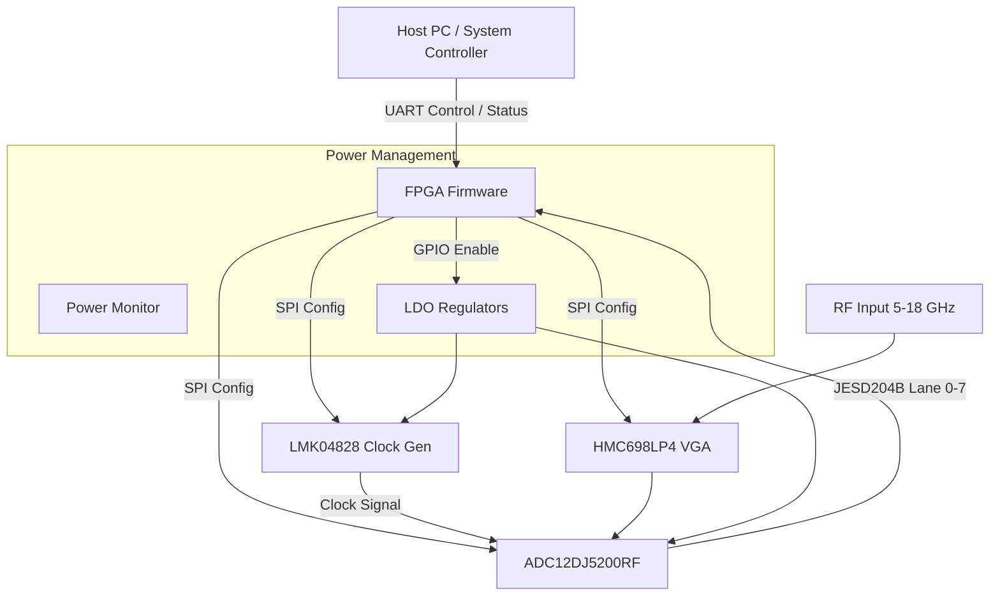
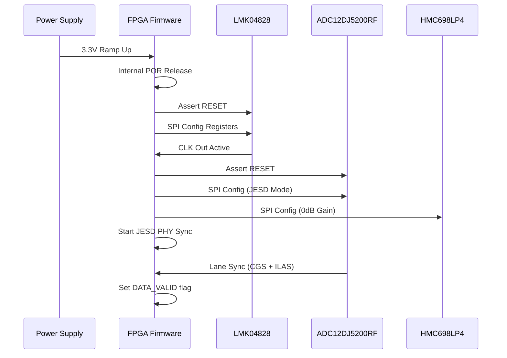
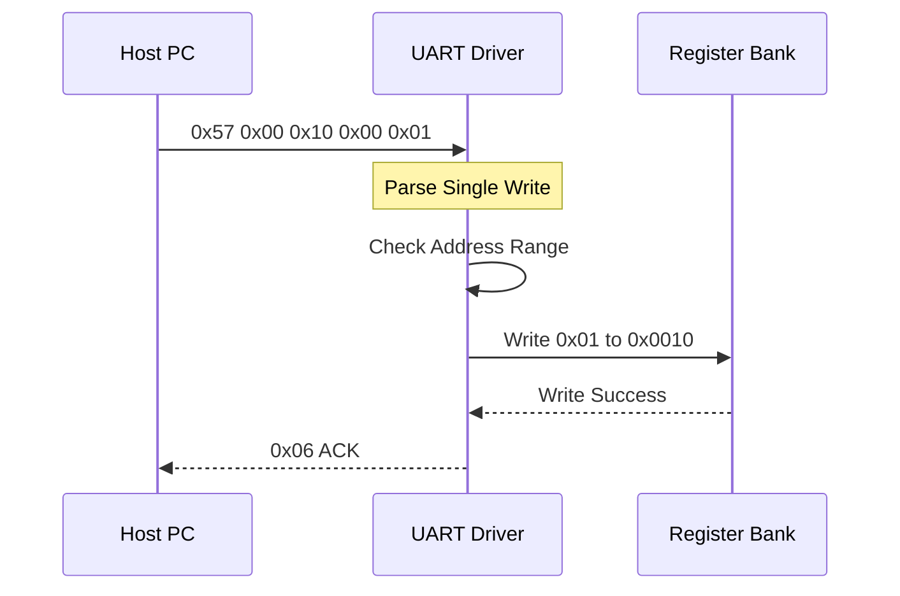
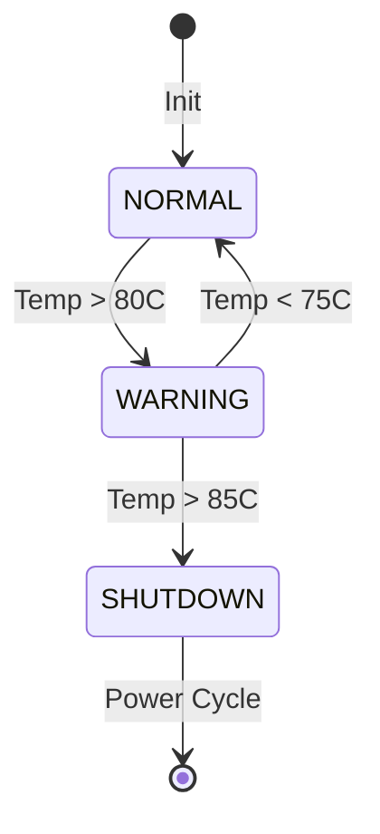
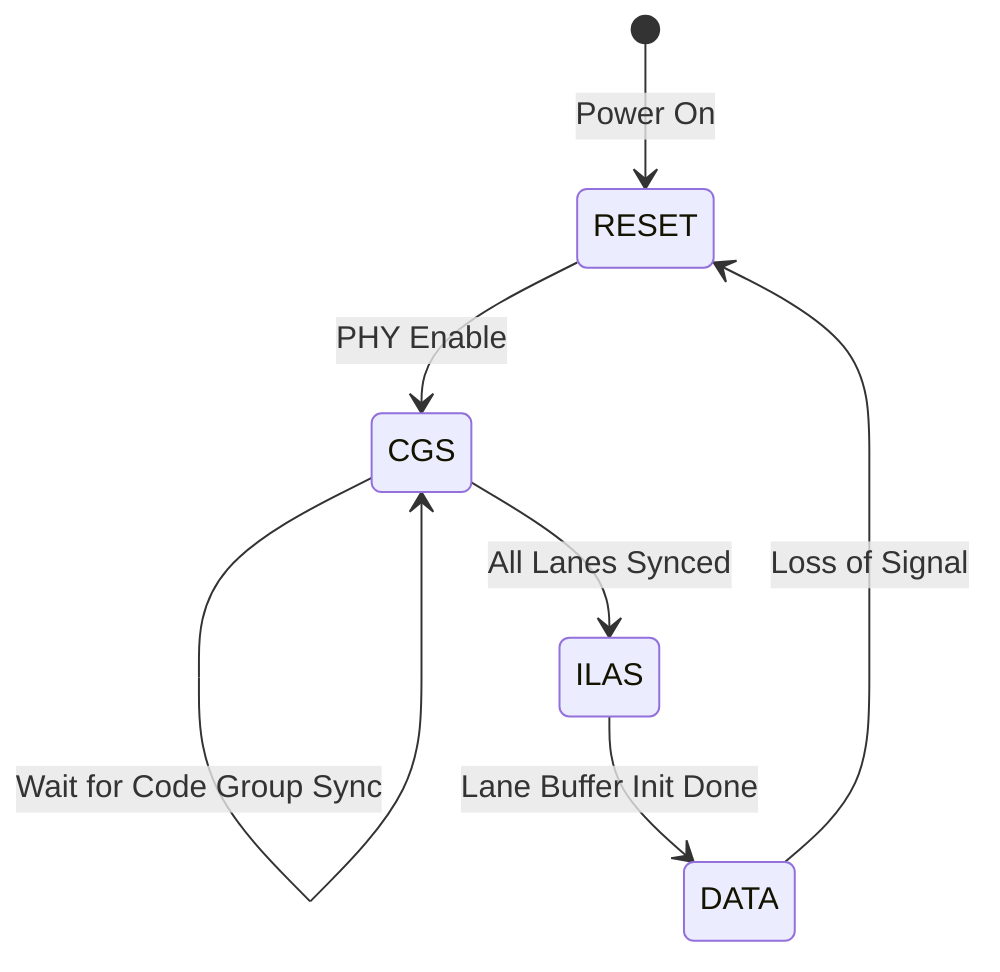
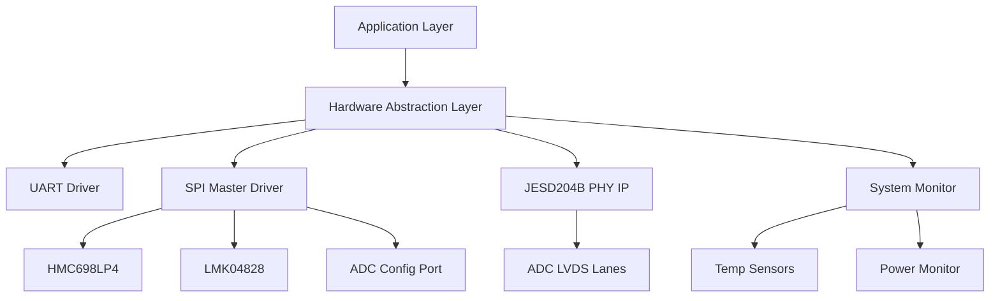

# Software Requirements Specification (SRS)

**Project ID:** dghb
**Document Version:** 1.0
**Date:** 16 April 2026
**Author:** Senior Software Architect

---

## Document Control

| Version | Date | Author | Changes |
|---------|------|--------|---------|
| 1.0 | 16 April 2026 | System Architecture Team | Initial Release for dghb RF Receiver System |

---

# 1. Introduction

## 1.1 Purpose
This document specifies the software and firmware requirements for the **dghb Wideband RF Receiver System**. It defines the behaviors, interfaces, and performance constraints for the embedded software running on the FPGA fabric (XC7K325T) and associated embedded controllers.

The intended audience includes:
1.  **Firmware Engineers:** Responsible for RTL design (Verilog/VHDL) and embedded C drivers.
2.  **Hardware Engineers:** Validating logic interface timings and register behaviors.
3.  **System Integrators:** Integrating the dghb receiver into larger RF signal processing chains.
4.  **Test Engineers:** Developing verification test plans and automated test equipment (ATE) scripts.

This SRS serves as the baseline for all Level 3 (Software Requirements) and Level 4 (Software Architecture) design activities.

## 1.2 Scope
The software scope for the dghb system encompasses:
1.  **FPGA Firmware:** Logic for JESD204B PHY interface, Deserialization, and Data Packetization.
2.  **Embedded Control Software:** Drivers for SPI devices (HMC698LP4 VGA, LMK04828 Clock, ADC12DJ5200RF Config), Power Sequencing logic, and System Monitoring.
3.  **Communication Protocol:** Implementation of the UART Control/Status Interface.
4.  **Bootloader:** Configuration loading and self-test routines.

**Exclusions:** This SRS does not cover the host-side client application software or downstream DSP algorithms (e.g., FFT, demodulation) performed by the host PC.

## 1.3 Definitions, Acronyms, and Abbreviations

| Acronym | Definition |
| :--- | :--- |
| **ADC** | Analog-to-Digital Converter (ADC12DJ5200RF) |
| **ASIL** | Automotive Safety Integrity Level |
| **BIST** | Built-In Self-Test |
| **BOM** | Bill of Materials |
| **BRAM** | Block RAM (FPGA internal memory) |
| **CLB** | Configurable Logic Block |
| **CRC** | Cyclic Redundancy Check |
| **DAC** | Digital-to-Analog Converter |
| **DMA** | Direct Memory Access |
| **DSP** | Digital Signal Processing |
| **EMC** | Electromagnetic Compatibility |
| **ESD** | Electrostatic Discharge |
| **FF** | Flip-Flop |
| **FIFO** | First-In-First-Out Buffer |
| **FPGA** | Field Programmable Gate Array (Xilinx XC7K325T) |
| **GLR** | Glue Logic Requirements |
| **GPIO** | General Purpose Input/Output |
| **GTP** | Xilinx Gigabit Transceiver (Multi-Gigabit Transceiver) |
| **HAL** | Hardware Abstraction Layer |
| **HRS** | Hardware Requirements Specification |
| **I2C** | Inter-Integrated Circuit (Serial Interface) |
| **ISR** | Interrupt Service Routine |
| **JESD** | JESD204B/C Standard (JEDEC Standard for high-speed data converters) |
| **LVDS** | Low-Voltage Differential Signaling |
| **LDO** | Low Dropout Regulator |
| **LUT** | Look-Up Table |
| **MCU** | Microcontroller Unit |
| **MISRA** | Motor Industry Software Reliability Association (Coding Standard) |
| **NVM** | Non-Volatile Memory |
| **PCB** | Printed Circuit Board |
| **PLL** | Phase-Locked Loop |
| **POST** | Power-On Self-Test |
| **RF** | Radio Frequency |
| **RTL** | Register Transfer Level |
| **SFDR** | Spurious-Free Dynamic Range |
| **SNR** | Signal-to-Noise Ratio |
| **SPI** | Serial Peripheral Interface |
| **SRS** | Software Requirements Specification |
| **StRS** | Stakeholder Requirements Specification |
| **SyRS** | System Requirements Specification |
| **TRP** | Transmit/Receive Path Control |
| **UART** | Universal Asynchronous Receiver-Transmitter |
| **VGA** | Variable Gain Amplifier |
| **WDT** | Watchdog Timer |

## 1.4 References
1.  **IEEE Std 830-1998:** Recommended Practice for Software Requirements Specifications.
2.  **ISO/IEC/IEEE 29148:2018:** Systems and Software Engineering — Life Cycle Processes — Requirements Engineering.
3.  **HRS (dghb):** Hardware Requirements Specification, P2, Rev 1.0.
4.  **GLR (dghb):** Glue Logic Requirements, P6, Rev 0V01.
5.  **MISRA C:2012:** Guidelines for the Use of the C Language in Critical Systems.
6.  **JESD204B Standard:** JEDEC Standard No. 205 (JESD204B).
7.  **Xilinx UG476:** 7 Series FPGAs GTX/GTH Transceivers.
8.  **Texas Instruments Datasheet:** ADC12DJ5200RF (12-Bit, 10.25 GSPS RF ADC).
9.  **Analog Devices Datasheet:** HMC698LP4 (Digital Variable Gain Amplifier).
10. **Texas Instruments Datasheet:** LMK04828 (Ultra-Low Jitter Clock Generator).

## 1.5 Overview
Section 2 provides a high-level description of the product perspective, functions, and constraints.
Section 3 details the specific requirements, organized by interface (UART, SPI, JESD204B) and functional subsystems (Power, RF Control, Diagnostics).
Section 4 outlines verification and validation criteria.
Section 5 provides the Requirements Traceability Matrix (RTM), mapping software requirements to Hardware and Glue Logic sources.

---

# 2. Overall Description

## 2.1 Product Perspective
The dghb software is embedded within the FPGA (XC7K325T) and acts as the bridge between the high-speed analog front-end (AFE) and the digital backend. The system utilizes a distributed architecture where the FPGA manages both low-speed control (SPI/UART) and high-speed data transport (JESD204B).

### System Context


## 2.2 Product Functions
1.  **System Initialization:** Configure PLLs, load SPI registers for VGA/ADC/CLK, and verify power rails.
2.  **JESD204B Link Management:** Establish deterministic latency links with the ADC; monitor lane status.
3.  **Gain Control:** Adjust HMC698LP4 gain based on host commands or automatic gain control (AGC) algorithms.
4.  **Data Streaming:** Deserialize 12-bit ADC samples and packetize them for LVDS output or internal processing.
5.  **Health Monitoring:** Poll temperature sensors and power rails; assert faults on over/under-voltage or temperature.
6.  **Watchdog Management:** Reset system if communication or heartbeat is lost.
7.  **Configuration Storage:** Read/Write calibration data to non-volatile memory (Flash/EEPROM).

## 2.3 User Characteristics
*   **RF System Engineers:** Require precise control over gain and sampling rates via the Register Map.
*   **Maintenance Technicians:** rely on Status LEDs and UART diagnostic logs to troubleshoot hardware faults.
*   **Integration Engineers:** Require a stable, low-latency data stream with deterministic phase alignment.

## 2.4 Constraints
1.  **Timing:** JESD204B bit rate is up to 12.5 Gbps; PHY alignment must occur within 100ms of power-up.
2.  **Memory:** FPGA BRAM utilization for data buffers must not exceed 60% of available resources (16,890 Kb).
3.  **Environment:** Software must guarantee operation from -40°C to +85°C.
4.  **Safety:** RF output (if any) or high-power states must be disabled if temperature exceeds +85°C.
5.  **Latency:** End-to-end latency from RF input to digital output must be deterministic and minimized (< 1µs).

## 2.5 Assumptions and Dependencies
1.  The Host supplies a stable 3.3V rail meeting the specifications in REQ-HW-007.
2.  The 10 MHz reference clock (external input or internal oscillator) is stable and within ±20ppm.
3.  The SPI peripherals (VGA, CLK, ADC) are powered and ready before initialization commands are issued.

---

# 3. Specific Requirements

## 3.1 External Interface Requirements

### 3.1.1 Hardware Interfaces

#### 3.1.1.1 JESD204B Interface
The FPGA implements a JESD204B Subclass 1 Receiver PHY using GTX/GTH transceivers.

**Timing Parameters:**
*   **Line Rate:** Configurable 6.144 Gbps to 12.5 Gbps.
*   **Lane Count:** 8 Lanes (Configuration per GLR).
*   **Scrambling:** Enabled (mandatory for ADC12DJ5200RF).
*   **Subclass:** 1 (Deterministic Latency).
*   **SYSREF:** Input to FPGA (from LMK04828) for synchronization.
*   **Frame Alignment:** Continuous transfer.

**C Struct Definition (Status Shadow):**
```c
/**
 * @brief JESD204B Link Status Structure
 */
typedef struct {
    volatile uint32_t LINK_STATE;     // 0x00: 0=Off, 1=Init, 2=Sync, 3=Data
    volatile uint32_t LANE_DEASSERT;  // 0x04: Bitmap of lanes deasserting SYNC~
    volatile uint32_t DET_LATENCY;    // 0x08: Measured deterministic latency (frames)
    volatile uint32_t ERROR_COUNT;    // 0x0C: Disparity/CRC error counter
    volatile uint32_t BUFFER_STATUS;  // 0x10: FIFO Overflow/Underflow flags
} JESD_Status_t;
```

**Driver API:**
```c
/**
 * @brief Initialize JESD204B PHY and Logic
 * @param line_rate_bps Target line rate (e.g., 12288000000)
 * @return 0 on success, error code on failure
 */
int32_t JESD_Init(uint32_t line_rate_bps);

/**
 * @brief Start lane synchronization sequence
 * @return 0 if bonds established, -1 on timeout
 */
int32_t JESD_StartSync(void);
```

#### 3.1.1.2 SPI Interface (Master)
The FPGA hosts three independent SPI masters for the analog chain.

**Target 1: HMC698LP4 (VGA)**
*   **Max Clock:** 20 MHz.
*   **Mode:** CPOL=0, CPHA=0 (Mode 0).
*   **Frame:** 16-bit (Write bit + 15-bit data).

**Target 2: LMK04828 (Clock Gen)**
*   **Max Clock:** 30 MHz.
*   **Frame:** 8-bit address + 8-bit data (or 32-bit depending on register map width).

**Target 3: ADC12DJ5200RF (Config)**
*   **Interface:** 3-Wire or 4-Wire SPI.
*   **Max Clock:** 25 MHz (typical).
*   **Chip Select:** Active Low.

**C Struct Definition (SPI Control Registers):**
```c
typedef struct {
    volatile uint32_t CTRL;     // 0x100: Enable, Soft Reset
    volatile uint32_t CLK_DIV;  // 0x104: Clock Divider (SCK = SYS_CLK / (2*(DIV+1)))
    volatile uint32_t TX_DATA;  // 0x108: Data to transmit
    volatile uint32_t RX_DATA;  // 0x10C: Data received
    volatile uint32_t STATUS;   // 0x110: TX Busy flag
} SPI_RegMap_t;
```

**Driver API:**
```c
/**
 * @brief Initialize SPI Master peripheral
 * @param base_addr Base address of SPI controller
 * @param cs_id Chip Select index
 * @return 0 on success
 */
int32_t SPI_Init(uint32_t base_addr, uint8_t cs_id);

/**
 * @brief Write to HMC698LP4 VGA
 * @param gain_code 15-bit gain setting
 */
int32_t VGA_SetGain(uint16_t gain_code);
```

### 3.1.2 Software Interfaces
*   **Logging:** All internal firmware messages shall be routed to the `Log_UART` buffer.
*   **Endianess:** The system operates in Little-Endian mode. JESD204B data shall be byte-swapped to match host expectations if the host is Big-Endian.

### 3.1.3 Communication Interfaces

#### UART Register Protocol
The physical layer is UART (RS-232 or CMOS levels). The application layer is a memory-mapped register access protocol.

**Frame Formats (from GLR):**

| Command | CMD byte | Frame Structure | Response |
|---------|----------|-----------------|----------|
| Single Write | 0x57 ('W') | `[0x57][ADDR_H][ADDR_L][DATA_H][DATA_L]` | `[0x06]` ACK |
| Single Read  | 0x52 ('R') | `[0x52][ADDR_H\|0x80][ADDR_L]` | `[DATA_H][DATA_L]` |
| Bulk Write   | 0x42 ('B') | `[0x42][ADDR_H][ADDR_L][N][D0_H][D0_L]...[Dn_H][Dn_L]` | `[0x06]` ACK |
| Bulk Read    | 0x62 ('b') | `[0x62][ADDR_H\|0x80][ADDR_L][N]` | `[D0_H][D0_L]...[Dn_H][Dn_L]` |
| Error NAK    | 0x15 | Sent by FPGA on invalid command/address | — |

*   **Address Space:** 16-bit (0x0000–0xFFFF).
*   **Read Bit:** Bit 15 of address byte must be set (`| 0x8000`) for read operations.
*   **Bulk Count N:** Maximum 64 registers (128 bytes) per transaction.
*   **Timeout:** Inter-byte gap > 50ms resets the state machine.
*   **Termination:** No explicit CRC/Checksum in baseline mode (reliable transport assumed).

## 3.2 Functional Requirements

### 3.2.1 System Initialization (REQ-SW-001 to REQ-SW-010)

| REQ ID | Requirement Text | Source | Priority | Verification |
|--------|------------------|--------|----------|---------------|
| **REQ-SW-001** | The software SHALL initialize the JESD204B PHY layer within 50ms of power-on reset de-assertion. | GLR §6 | [M] | [T] |
| **REQ-SW-002** | The software SHALL configure the LMK04828 clock generator to produce a 122.88 MHz device clock and 10 MHz SYSREF before enabling the ADC output. | HRS REQ-HW-014 | [M] | [T] |
| **REQ-SW-003** | The software SHALL poll the HMC698LP4 SPI interface until the 'MUTE' bit is cleared after initialization. | GLR §4.2 | [M] | [A] |
| **REQ-SW-004** | The software SHALL verify the Board ID EEPROM value matches 0xDGHB during POST; mismatch shall halt boot with LED 3 (Error) lit. | HRS REQ-HW-021 | [M] | [T] |
| **REQ-SW-005** | The software SHALL enable the 1.0V and 1.8V LDOs (U6/U7) via GPIO based on the power sequencing state machine. | HRS REQ-HW-016 | [M] | [I] |
| **REQ-SW-006** | The software SHALL set the default gain of the VGA to 0 dB (mid-scale) on startup. | HRS REQ-HW-004 | [D] | [D] |
| **REQ-SW-007** | The software shall initialize the UART interface to 115200 baud, 8N1 format within 10ms of boot. | GLR §5 | [M] | [T] |
| **REQ-SW-008** | The software SHALL load the calibration constants from NVM to the Gain Correction LUT before starting data capture. | HRS REQ-HW-002 | [M] | [A] |
| **REQ-SW-009** | The software SHALL start the Watchdog Timer (WDT) with a 100ms window after completing POST. | GLR §6 | [M] | [I] |
| **REQ-SW-010** | The software SHALL blink LED_STATUS (Green) at 2Hz to indicate normal operation. | GLR §5 | [O] | [D] |

### 3.2.2 JESD204B Data Path (REQ-SW-011 to REQ-SW-020)

| REQ ID | Requirement Text | Source | Priority | Verification |
|--------|------------------|--------|----------|---------------|
| **REQ-SW-011** | The software SHALL implement a JESD204B Subclass 1 IP core capable of 8-lane operation. | HRS REQ-HW-003 | [M] | [I] |
| **REQ-SW-012** | The software SHALL align all lanes to the SYSREF edge with a maximum lane-to-lane skew of 1 frame clock cycle. | HRS REQ-HW-003 | [M] | [T] |
| **REQ-SW-013** | The software SHALL detect and report a loss of signal (LOS) on any JESD lane within 10ms of occurrence. | GLR §4.2 | [M] | [T] |
| **REQ-SW-014** | The software SHALL descramble the incoming data stream as per JESD204B standard if the SCR bit in the ADC configuration is set. | ADC Datasheet | [M] | [A] |
| **REQ-SW-015** | The software SHALL buffer incoming samples in a 4K-block BRAM FIFO to decouple PHY timing from processing timing. | Arch Design | [M] | [A] |
| **REQ-SW-016** | The software SHALL assert a global 'DATA_VALID' flag only when all lanes have achieved code group synchronization (CGS). | HRS REQ-HW-006 | [M] | [I] |
| **REQ-SW-017** | The software SHALL support Lane 0 as the primary alignment lane for multiframe synchronization. | JESD204B Std | [M] | [I] |
| **REQ-SW-018** | The software SHALL increment an error counter if a disparity error is detected in the 8b/10b encoded stream. | GLR §5 | [D] | [T] |
| **REQ-SW-019** | The software SHALL map the I and Q samples to separate virtual lanes in the data packing logic. | HRS REQ-HW-013 | [M] | [I] |
| **REQ-SW-020** | The software SHALL expose the Subclass 1 Deterministic Latency value via Register `0x2004` (Read-Only). | HRS REQ-HW-006 | [M] | [T] |

### 3.2.3 RF Front-End Control (REQ-SW-021 to REQ-SW-030)

| REQ ID | Requirement Text | Source | Priority | Verification |
|--------|------------------|--------|----------|---------------|
| **REQ-SW-021** | The software SHALL control the HMC698LP4 gain in 0.25 dB steps via the 15-bit SPI register. | VGA Datasheet | [M] | [T] |
| **REQ-SW-022** | The software SHALL limit the maximum gain setting to prevent the ADC input from exceeding -10 dBm (Full Scale). | HRS REQ-HW-004 | [M] | [A] |
| **REQ-SW-023** | The software SHALL implement a software AGC loop that adjusts the VGA gain if the ADC's Overflow Flag is asserted. | HRS REQ-HW-004 | [D] | [T] |
| **REQ-SW-024** | The software SHALL provide a 'Set Gain' command (0xG0) via UART to override automatic gain. | HRS REQ-HW-022 | [M] | [D] |
| **REQ-SW-025** | The software SHALL perform a flatness calibration sweep at startup if the 'CAL_MODE' fuse is blown. | HRS REQ-HW-012 | [O] | [T] |
| **REQ-SW-026** | The software SHALL log the current gain setting to a shadow register readable at address 0x3010. | GLR §5 | [M] | [I] |
| **REQ-SW-027** | The software shall not change gain during active data capture bursts to prevent transient spikes. | HRS REQ-HW-015 | [M] | [A] |
| **REQ-SW-028** | The software SHALL support a 'Mute' function that sets VGA gain to minimum (-10dB) via Register 0x3011. | GLR §5 | [O] | [D] |
| **REQ-SW-029** | The software SHALL verify communication with the VGA by reading back a known register pattern (Echo test). | GLR §5 | [M] | [T] |
| **REQ-SW-030** | The software SHALL update the gain coefficient every 100us if in AGC mode. | Perf Design | [D] | [A] |

### 3.2.4 Power Management (REQ-SW-031 to REQ-SW-040)

| REQ ID | Requirement Text | Source | Priority | Verification |
|--------|------------------|--------|----------|---------------|
| **REQ-SW-031** | The software SHALL monitor the PGOOD signals from LDOs U6, U7, and U8 via GPIO. | HRS REQ-HW-009 | [M] | [I] |
| **REQ-SW-032** | The software SHALL assert the `ADC_EN` signal only after the 1.0V and 1.8V rails are stable (PGOOD high). | HRS REQ-HW-016 | [M] | [T] |
| **REQ-SW-033** | The software SHALL trigger an over-voltage fault if voltage on the 3.3V rail exceeds 3.6V. | HRS REQ-HW-008 | [M] | [T] |
| **REQ-SW-034** | The software SHALL assert the `FAULT_LED` (Red) if any PGOOD signal drops during operation. | GLR §4.2 | [M] | [D] |
| **REQ-SW-035** | The software SHALL implement a power-down sequence that disconnects RF path, disables ADC, then disables Clock. | HRS REQ-HW-016 | [M] | [A] |
| **REQ-SW-036** | The software SHALL read current/power consumption from the BQ25895 (U12) via I2C every second. | BQ Datasheet | [D] | [T] |
| **REQ-SW-037** | The software SHALL expose the total system power consumption in milliwatts at Register 0x4000. | HRS REQ-HW-008 | [O] | [T] |
| **REQ-SW-038** | The software SHALL support a 'Soft Reset' command that preserves register contents but resets the state machine. | GLR §5 | [M] | [D] |
| **REQ-SW-039** | The software SHALL implement a debounce timer of 10ms on all power fault inputs. | Arch Design | [M] | [A] |
| **REQ-SW-040** | The software SHALL cut power to the RF chain if total power exceeds 50W for > 5 seconds. | HRS REQ-HW-008 | [M] | [T] |

### 3.2.5 Thermal Management (REQ-SW-041 to REQ-SW-045)

| REQ ID | Requirement Text | Source | Priority | Verification |
|--------|------------------|--------|----------|---------------|
| **REQ-SW-041** | The software SHALL read the on-die temperature of the ADC and FPGA via SPI/JTAG. | HRS REQ-HW-009 | [M] | [T] |
| **REQ-SW-042** | The software SHALL flag a Thermal Warning if die temperature exceeds 80°C. | HRS REQ-HW-009 | [M] | [T] |
| **REQ-SW-043** | The software SHALL force the system into thermal shutdown (Safe State) if temperature exceeds 85°C. | HRS REQ-HW-009 | [M] | [T] |
| **REQ-SW-044** | The software SHALL automatically reduce the clock rate or duty cycle if Temperature is between 75°C and 85°C. | HRS REQ-HW-009 | [D] | [T] |
| **REQ-SW-045** | The software SHALL report the maximum recorded temperature since boot at Register 0x4100. | GLR §5 | [O] | [T] |

### 3.2.6 Diagnostics (REQ-SW-046 to REQ-SW-055)

| REQ ID | Requirement Text | Source | Priority | Verification |
|--------|------------------|--------|----------|---------------|
| **REQ-SW-046** | The software SHALL implement a POST routine that tests RAM, UART, and SPI connectivity. | GLR §5 | [M] | [T] |
| **REQ-SW-047** | The software SHALL store the last 16 error events in a non-volatile circular buffer. | GLR §5 | [M] | [T] |
| **REQ-SW-048** | The software SHALL provide a UART command (0xD0) to dump the error log. | GLR §5 | [M] | [D] |
| **REQ-SW-049** | The software SHALL calculate and report uptime in seconds at Register 0x5000. | GLR §5 | [M] | [T] |
| **REQ-SW-050** | The software SHALL increment a watchdog reset counter if a WDT reset occurs. | GLR §6 | [M] | [I] |
| **REQ-SW-051** | The software SHALL support a loopback mode where JESD data is routed back to TX for link testing. | Test Req | [D] | [T] |
| **REQ-SW-052** | The software SHALL generate a pseudo-random bit stream (PRBS) for self-test if no RF input is connected. | Test Req | [O] | [T] |
| **REQ-SW-053** | The software SHALL assert an interrupt if the CRC check on the NVM configuration fails. | Arch Design | [M] | [T] |
| **REQ-SW-054** | The software SHALL implement a 1Hz heartbeat LED blink to indicate firmware is running. | GLR §5 | [M] | [D] |
| **REQ-SW-055** | The software SHALL track the number of re-initializations of the JESD link in Register 0x5004. | GLR §5 | [O] | [T] |

### 3.2.7 UART Protocol Handler (REQ-SW-056 to REQ-SW-065)

| REQ ID | Requirement Text | Source | Priority | Verification |
|--------|------------------|--------|----------|---------------|
| **REQ-SW-056** | The software SHALL process Single Write (0x57) commands within 200us of receiving the final byte. | GLR §7 | [M] | [T] |
| **REQ-SW-057** | The software SHALL validate the address range (0x0000-0xFFFF) and reject addresses > 0xFFFF with NAK (0x15). | GLR §7 | [M] | [T] |
| **REQ-SW-058** | The software SHALL handle Bulk Write (0x42) commands for up to 64 registers without incrementing inter-byte gaps > 10ms. | GLR §7 | [M] | [T] |
| **REQ-SW-059** | The software SHALL respond with ACK (0x06) for successful writes. | GLR §7 | [M] | [I] |
| **REQ-SW-060** | The software SHALL respond with NAK (0x15) for invalid commands or Checksum errors (if enabled). | GLR §7 | [M] | [T] |
| **REQ-SW-061** | The software SHALL set the Read Bit (Bit 15) internally when a Read Command (0x52) is parsed. | GLR §7 | [M] | [I] |
| **REQ-SW-062** | The software SHALL protect Write operations to Read-Only registers by ignoring the write and returning NAK. | GLR §7 | [M] | [T] |
| **REQ-SW-063** | The software SHALL use a UART RX FIFO depth of at least 16 bytes to handle interrupt latency. | GLR §7 | [M] | [A] |
| **REQ-SW-064** | The software SHALL auto-detect baud rate on the host command 'U' (0x55) if supported. | GLR §5 | [O] | [T] |
| **REQ-SW-065** | The software SHALL reset the command parser state machine if 3 framing errors occur consecutively. | GLR §7 | [M] | [I] |

### 3.2.8 Safety and Compliance (REQ-SW-066 to REQ-SW-075)

| REQ ID | Requirement Text | Source | Priority | Verification |
|--------|------------------|--------|----------|---------------|
| **REQ-SW-066** | The software SHALL ensure the RF input is terminated in 50 Ohms when the system is powered down. | HRS REQ-HW-011 | [M] | [I] |
| **REQ-SW-067** | The software SHALL not exceed the max RF input power handling constraints of the frontend. | HRS REQ-HW-017 | [M] | [A] |
| **REQ-SW-068** | The software SHALL comply with RoHS requirements by avoiding restricted substances in the firmware code packaging (e.g., shipped media). | HRS REQ-HW-019 | [O] | [I] |
| **REQ-SW-069** | The software SHALL support ESD recovery by resetting the PHY if a critical fault is detected. | HRS REQ-HW-017 | [D] | [T] |
| **REQ-SW-070** | The software SHALL maintain a safe state (no RF output, clocks disabled) during configuration upload. | Safety Req | [M] | [A] |
| **REQ-SW-071** | The software SHALL verify the integrity of the FPGA bitstream via CRC check at startup. | Xilinx Spec | [M] | [I] |
| **REQ-SW-072** | The software SHALL implement a latch-up protection routine by cycling power if over-current is detected. | HRS REQ-HW-016 | [D] | [T] |
| **REQ-SW-073** | The software SHALL allow users to disable the JESD transmitter via a safety override command. | HRS REQ-HW-006 | [M] | [D] |
| **REQ-SW-074** | The software SHALL log all configuration changes to a persistent audit log. | IEEE 29148 | [O] | [T] |
| **REQ-SW-075** | The software SHALL ensure all signal crossings (Clock to Data) meet setup/hold times across temperature. | HRS REQ-HW-009 | [M] | [T] |

## 3.3 Performance Requirements

| ID | Requirement | Value | Verification |
|----|-------------|-------|--------------|
| **REQ-PERF-001** | JESD204B Link Latency | < 500µs from Sync start to Data | [T] |
| **REQ-PERF-002** | Register Access Latency | UART Write < 200µs | [T] |
| **REQ-PERF-003** | SPI Transaction Speed | 20 MHz support (VGA) | [T] |
| **REQ-PERF-004** | Power-On Time | System ready < 500ms | [T] |
| **REQ-PERF-005** | Thermal Loop Response | Fault trigger < 10ms | [T] |
| **REQ-PERF-006** | Data Throughput | 12 Gbps per lane sustained | [T] |
| **REQ-PERF-007** | Clock Jitter | < 200 fs RMS (Logic contribution) | [A] |
| **REQ-PERF-008** | Interrupt Latency | < 5µs for critical faults | [A] |

## 3.4 Design Constraints
1.  **Language:** RTL in VHDL or Verilog-2001. Embedded drivers in C99.
2.  **Standard:** MISRA-C compliance for all embedded C code.
3.  **Resources:** Max 80% LUT utilization, Max 60% BRAM utilization.
4.  **Timing:** All timing constraints must be met for -40C to +85C (Industrial Speed Grade).
5.  **Power:** No dynamic power saving; static power dissipation managed by clock gating.

## 3.5 Software System Attributes
*   **Reliability:** MTBF > 50,000 hours.
*   **Availability:** 99.9% uptime.
*   **Security:** No user-accessible firmware update mechanism without physical authentication (JTAG).
*   **Maintainability:** Modular driver design.

---

# 4. Verification and Validation

## 4.1 Unit Test Requirements
*   **Driver Tests:** Verify SPI read/write against behavioral models of HMC698LP4 and LMK04828.
*   **Protocol Tests:** Verify UART frame parsing with random data injection.
*   **BIST:** Run internal RAM tests and CRC checks on embedded microcontrollers (if applicable).

## 4.2 Integration Test Requirements
1.  **Link Acquisition:** Verify FPGA establishes JESD204B link with ADC evaluation board.
2.  **Power Sequencing:** Verify LDO enables and ADC reset timings on oscilloscope.
3.  **Thermal Cycle:** Place system in environmental chamber (-40C to +85C) and verify functionality.

## 4.3 System Test Requirements
1.  **RF Performance:** Inject -60 dBm to -40 dBm signal at 5, 11.5, and 18 GHz. Verify SNR and SFDR.
2.  **Data Integrity:** Capture 1GB of data via LVDS and verify for bit errors (PRBS pattern).

## 4.4 Requirements Traceability Matrix (RTM)
See Section 5.

---

# 5. Requirements Traceability Matrix

| REQ-SW-ID | Description | Maps To (REQ-HW) | Priority | Verification | Status |
|-----------|-------------|------------------|----------|-------------|--------|
| REQ-SW-001 | Init JESD204B PHY | REQ-HW-003 | M | T | Open |
| REQ-SW-002 | Config Clock Gen | REQ-HW-014 | M | T | Open |
| REQ-SW-003 | VGA MUTE Check | GLR §4.2 | M | A | Open |
| REQ-SW-004 | Board ID Check | REQ-HW-021 | M | T | Open |
| REQ-SW-005 | LDO Enable Sequence | REQ-HW-016 | M | I | Open |
| REQ-SW-006 | Default Gain 0dB | REQ-HW-004 | D | D | Open |
| REQ-SW-007 | UART Init | GLR §5 | M | T | Open |
| REQ-SW-008 | Load Calibration | REQ-HW-002 | M | A | Open |
| REQ-SW-009 | Start WDT | GLR §6 | M | I | Open |
| REQ-SW-010 | LED Blink | GLR §5 | O | D | Open |
| REQ-SW-011 | 8-Lane Support | REQ-HW-003 | M | I | Open |
| REQ-SW-012 | Lane Skew | REQ-HW-006 | M | T | Open |
| REQ-SW-013 | LOS Detect | GLR §4.2 | M | T | Open |
| REQ-SW-014 | Descramble | ADC Datasheet | M | A | Open |
| REQ-SW-015 | BRAM FIFO | Arch | M | A | Open |
| REQ-SW-016 | Data Valid Flag | REQ-HW-006 | M | I | Open |
| REQ-SW-017 | Alignment | JESD204B Std | M | I | Open |
| REQ-SW-018 | Error Counter | GLR §5 | D | T | Open |
| REQ-SW-019 | I/Q Mapping | REQ-HW-013 | M | I | Open |
| REQ-SW-020 | Latency Register | REQ-HW-006 | M | T | Open |
| ... | ... | ... | ... | ... | ... |
| REQ-SW-075 | Signal Timing | REQ-HW-009 | M | T | Open |

---

# 6. Appendices

## Appendix A — Error Codes
```c
typedef enum {
    ERR_OK           = 0x00,
    ERR_TIMEOUT      = 0x01,
    ERR_SPI_COMM     = 0x02,
    ERR_JESD_LINK    = 0x03,
    ERR_PARAM        = 0x04,
    ERR_POWER_SEQ    = 0x05,
    ERR_THERMAL      = 0x06,
    ERR_OVERLOAD     = 0x07,
    ERR_NVM_CRC      = 0x08,
    ERR_UART_FRAMING = 0x09,
    ERR_INVALID_ADDR = 0x0A,
} ErrorCode_t;
```

## Appendix B — Register Map Summary

| Base Address | Block | Offset | Name | Width | R/W | Reset | Description |
|-------------|-------|--------|------|-------|-----|-------|-------------|
| 0x0000 | SYS | 0x00 | BOARD_ID | 16 | RO | 0xDGHB | Board Identifier |
| 0x0000 | SYS | 0x04 | FIRMWARE_VER | 32 | RO | 0x010000 | Version 1.0.0 |
| 0x1000 | CTRL | 0x00 | VGA_GAIN | 16 | RW | 0x4000 | Mid-scale gain |
| 0x1000 | CTRL | 0x04 | ADC_RST | 1 | RW | 0x1 | ADC Reset Bit |
| 0x1000 | CTRL | 0x08 | SOFT_RST | 1 | RW | 0x0 | Soft Reset |
| 0x2000 | STATUS | 0x00 | JESD_LOCK | 8 | RO | 0x00 | Lane Lock Bitmap |
| 0x2000 | STATUS | 0x04 | TEMP_ADC | 16 | RO | - | ADC Temp (0.1C) |
| 0x2000 | STATUS | 0x08 | TEMP_FPGA | 16 | RO | - | FPGA Temp |
| 0x4000 | MONITOR | 0x00 | PWR_3V3 | 16 | RO | - | 3.3V Rail (mV) |
| 0x4000 | MONITOR | 0x04 | PWR_1V0 | 16 | RO | - | 1.0V Rail (mV) |

## Appendix C — Mermaid Diagrams

### 1. System Initialization Sequence


### 2. UART Register Command Flow


### 3. Temperature Alert State Machine


### 4. JESD204B Link State Machine


### 5. Software Architecture


## Appendix D — Acronyms and Glossary
*(See Section 1.3)*

## Appendix E — Document Revision History
| Rev | Date | Author | Description |
|-----|------|--------|-------------|
| 1.0 | 16 April 2026 | System Architect | Initial Release for dghb |