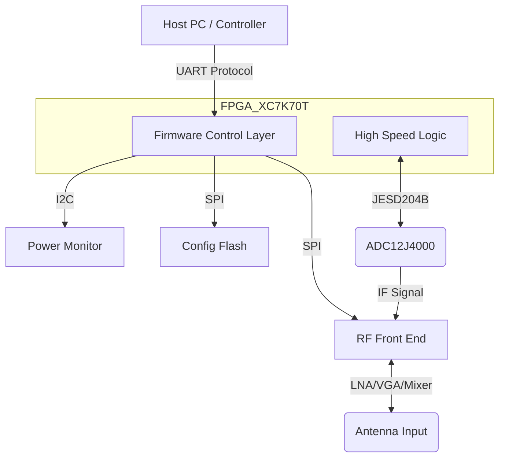
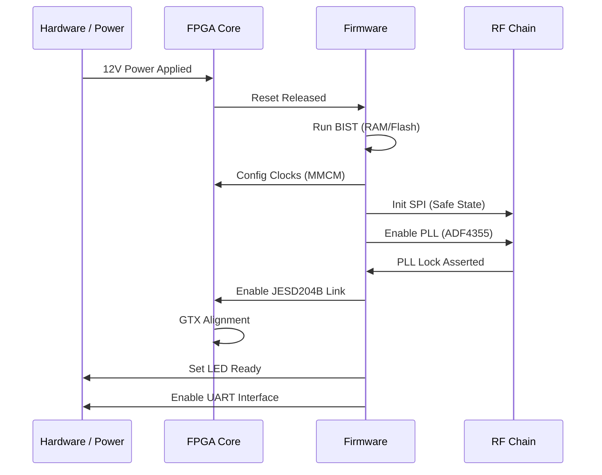
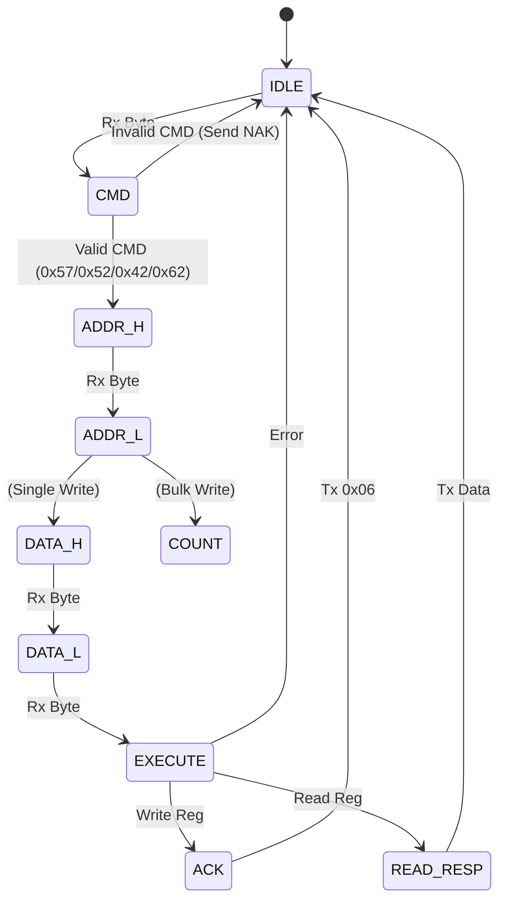
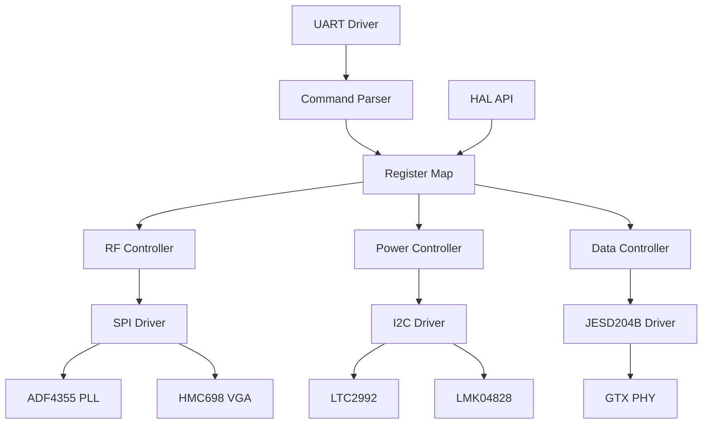
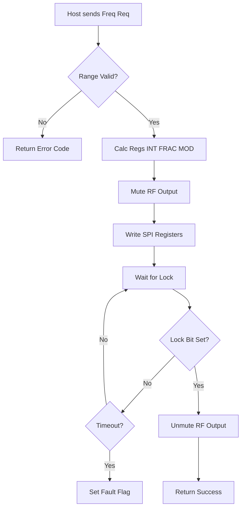
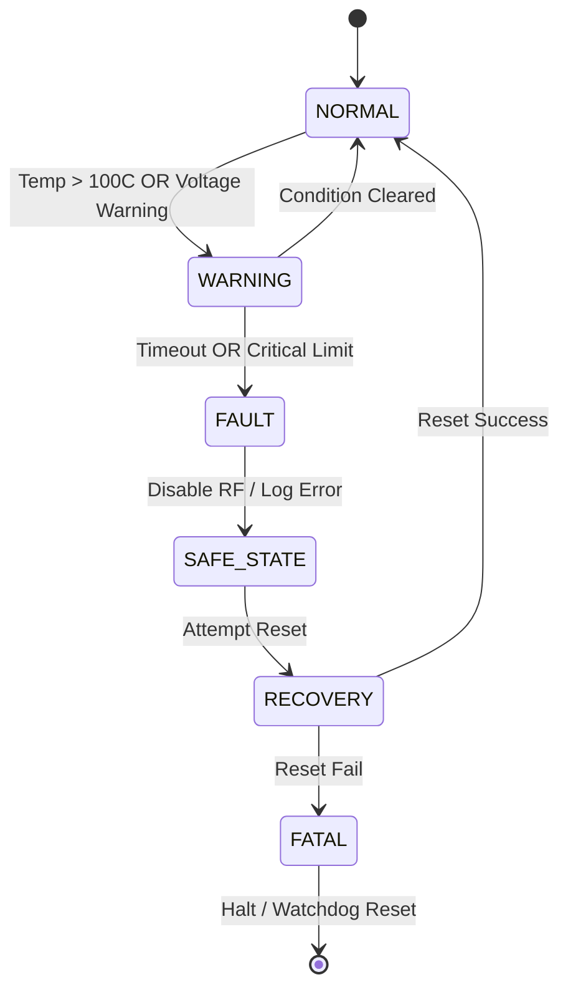

# Software Requirements Specification (SRS)

**Project ID:** dkfjg
**Document ID:** SRS-dkfjg-001
**Revision:** 1.0
**Date:** 16 April 2026

---

## Document Control

| Version | Date | Author | Changes |
|---------|------|--------|---------|
| 1.0 | 16 April 2026 | System Architect | Initial Release for dkfjg Wideband RF Receiver |

---

# 1. Introduction

## 1.1 Purpose
This Software Requirements Specification (SRS) defines the comprehensive software requirements for the **dkfjg Wideband RF Receiver** firmware. This document describes the software behavior necessary to control the RF hardware chain (LNA, VGA, Mixer, PLL), manage the data acquisition interface (JESD204B), and handle external communication via the UART command protocol. This SRS serves as the baseline for software design, implementation, and testing, ensuring the system meets the performance specifications defined in the Hardware Requirements Specification (HRS) and Glue Logic Requirements (GLR).

## 1.2 Scope
The software system specified herein resides on the **Xilinx Kintex-7 FPGA (XC7K70T)**. It encompasses the embedded firmware required for:
1.  **System Initialization:** Power sequencing verification, clock tree configuration, and peripheral bring-up.
2.  **RF Control:** Configuration of the PLL (ADF4355) for frequency synthesis and the VGA (HMC698LP4) for gain adjustment via SPI.
3.  **Data Acquisition:** Management of the JESD204B link to receive digitized IF data from the ADC (ADC12J4000).
4.  **Environmental Monitoring:** Real-time monitoring of voltage, current, and temperature via I2C (LTC2992).
5.  **Communication:** A host-facing UART interface for register read/write operations and system telemetry.
6.  **Diagnostics:** Power-On Self-Test (POST), watchdog management, and error logging.

**Exclusions:** This specification does not cover the hardware VHLD/Verilog design of the FPGA logic blocks, the host PC application software, or the hardware design of the PCB.

## 1.3 Definitions, Acronyms, and Abbreviations

| Term | Definition |
| :--- | :--- |
| **ADC** | Analog-to-Digital Converter. |
| **API** | Application Programming Interface. |
| **BGA** | Ball Grid Array. |
| **BIST** | Built-In Self-Test. |
| **BSP** | Board Support Package. |
| **CDR** | Clock and Data Recovery. |
| **CONOPS** | Concept of Operations. |
| **CRC** | Cyclic Redundancy Check. |
| **DMA** | Direct Memory Access. |
| **DSP** | Digital Signal Processing. |
| **EMI** | Electromagnetic Interference. |
| **EOF** | End Of Frame. |
| **FIFO** | First-In-First-Out buffer. |
| **FPGA** | Field-Programmable Gate Array. |
| **GLR** | Glue Logic Requirements. |
| **GPIO** | General Purpose Input/Output. |
| **GTX** | Xilinx High-Speed Serial Transceiver. |
| **HAL** | Hardware Abstraction Layer. |
| **HRS** | Hardware Requirements Specification. |
| **I2C** | Inter-Integrated Circuit (Serial Bus). |
| **ICD** | Interface Control Document. |
| **IEEE** | Institute of Electrical and Electronics Engineers. |
| **IIP3** | Input Third-order Intercept Point. |
| **IO** | Input/Output. |
| **IPC** | Inter-Process Communication. |
| **IRQ** | Interrupt Request. |
| **ISR** | Interrupt Service Routine. |
| **JESD** | JESD204 Standard (High-speed ADC interface). |
| **JTAG** | Joint Test Action Group. |
| **KS** | Kintex-7 (FPGA Family). |
| **LDO** | Low Dropout Regulator. |
| **LO** | Local Oscillator. |
| **LNA** | Low Noise Amplifier. |
| **LTCC** | Low-Temperature Co-fired Ceramic. |
| **LUT** | Look-Up Table. |
| **LVDS** | Low-Voltage Differential Signaling. |
| **MCU** | Microcontroller Unit (Equivalent: FPGA Soft-core). |
| **MIL-STD** | Military Standard. |
| **MISRA** | Motor Industry Software Reliability Association. |
| **MMCM** | Mixed-Mode Clock Manager. |
| **NVM** | Non-Volatile Memory. |
| **PCB** | Printed Circuit Board. |
| **PLL** | Phase-Locked Loop. |
| **POST** | Power-On Self-Test. |
| **QSPI** | Quad Serial Peripheral Interface. |
| **RAM** | Random Access Memory. |
| **RF** | Radio Frequency. |
| **ROM** | Read-Only Memory. |
| **RPC** | Remote Procedure Call. |
| **RS-232** | Recommended Standard 232. |
| **RTL** | Register Transfer Level. |
| **RTM** | Requirements Traceability Matrix. |
| **RTOS** | Real-Time Operating System. |
| **Rx** | Receive. |
| **SIL** | Safety Integrity Level. |
| **SNR** | Signal-to-Noise Ratio. |
| **SPI** | Serial Peripheral Interface. |
| **SRAM** | Static Random-Access Memory. |
| **StRS** | Stakeholder Requirements Specification. |
| **SyRS** | System Requirements Specification. |
| **SRS** | Software Requirements Specification. |
| **TRP** | Transmit/Receive Point (RF Path). |
| **UART** | Universal Asynchronous Receiver-Transmitter. |
| **VGA** | Variable Gain Amplifier. |
| **VCO** | Voltage-Controlled Oscillator. |
| **WDT** | Watchdog Timer. |

## 1.4 References
1.  **IEEE 830-1998**: Recommended Practice for Software Requirements Specifications.
2.  **ISO/IEC/IEEE 29148:2018**: Systems and Software Engineering — Life Cycle Processes — Requirements Engineering.
3.  **MISRA C:2012**: Guidelines for the Use of the C Language in Critical Systems.
4.  **HRS-dkfjg-001**: Hardware Requirements Specification for dkfjg Wideband RF Receiver (Rev 1.0).
5.  **GLR-dkfjg-001**: Glue Logic Requirements for dkfjg FPGA (Rev 1.0).
6.  **DS-ADC12J4000**: Texas Instruments ADC12J4000 Datasheet.
7.  **DS-HMC698**: Analog Devices HMC698LP4 Datasheet (Digital VGA).
8.  **DS-ADF4355**: Analog Devices ADF4355 Datasheet (Wideband Synthesizer).
9.  **DS-LTC2992**: Analog Devices LTC2992 Datasheet (Power Monitor).
10. **UG472**: Xilinx 7 Series FPGAs GTX Transceivers User Guide.

## 1.5 Overview
Section 2 provides a high-level description of the software product perspective, functions, and constraints. Section 3 details the specific requirements, organized by external interfaces and functional subsystems (RF Control, Communications, Monitoring). Each requirement includes a unique identifier, traceability to the HRS/GLR, priority, and verification method. Section 4 defines verification criteria. Appendices provide register maps, error codes, and traceability matrices.

---

# 2. Overall Description

## 2.1 Product Perspective
The dkfjg software is embedded firmware running on a Xilinx Kintex-7 FPGA. While the FPGA utilizes Hardware Description Language (HDL) for high-speed data paths (JESD204B), the control logic specified in this document is implemented as a soft-core processor (e.g., MicroBlaze) or a finite state machine (FSM) with C-readable register interfaces.

**System Context:**



## 2.2 Product Functions
The primary software functions are:
1.  **Initialization:** Power-On Self-Test (POST), PCIe/MMCM clock setup.
2.  **RF Configuration:** Programming the ADF4355 PLL frequency and HMC698LP4 VGA gain state.
3.  **Data Path Management:** Aligning the JESD204B GTX lanes and monitoring link status.
4.  **Health Monitoring:** Polling LTC2992 for voltage/current/temperature via I2C.
5.  **Command Processing:** Parsing UART commands (Read/Write) to access FPGA registers.
6.  **Safety Management:** Implementing watchdog timer (WDT) and thermal shutdown.

## 2.3 User Characteristics
*   **Firmware Engineers:** Develop and maintain the C/HDL code base.
*   **Test Engineers:** Utilize UART commands to verify hardware performance (SNR, Gain).
*   **System Integrators:** Integrate the module into larger payloads.

## 2.4 Constraints
1.  **Compliance:** MISRA-C:2012 compliance is mandatory for all C source code.
2.  **Timing:** Interrupt Service Routines (ISRs) for JESD204B must complete within 1 µs.
3.  **Resources:** Total Block RAM utilization must not exceed 80% of available 270 Kb (leaving space for buffering).
4.  **Environment:** Software must account for MIL-STD operating temperatures (-55°C to +125°C), specifically coefficient calibration for temperature sensors.
5.  **Language:** Control logic shall be implemented in ANSI C (C99 standard).

## 2.5 Assumptions and Dependencies
1.  The 12V supply is stable and within regulation before the FPGA initiates its startup sequence.
2.  The 125 MHz LVDS oscillator (system clock) is stable within 50ms of power-up.
3.  The host UART controller supports 8-N-1 formatting at standard baud rates (e.g., 115200).

---

# 3. Specific Requirements

## 3.1 External Interface Requirements

### 3.1.1 Hardware Interfaces

#### 3.1.1.1 RF Control Interface (SPI)
The software controls the RF chain via a 3-wire Serial Interface (SPI compatible).
**Target Devices:** ADF4355 (PLL), HMC698LP4 (VGA).
**Protocol:** Mode 0 (CPOL=0, CPHA=0). Max Clock Speed: 10 MHz.

```c
// Register Map definition
typedef struct {
    volatile uint32_t CTRL;      // 0x0000: Control Register (CS Enable, Clock Div)
    volatile uint32_t TX_DATA;   // 0x0004: 32-bit data to shift out
    volatile uint32_t RX_DATA;   // 0x0008: 32-bit data shifted in
    volatile uint32_t STATUS;    // 0x000C: Transaction complete flag
} RF_SPI_Regs_t;

// Driver API
/**
 * @brief Write to a 32-bit RF register
 * @param device_id Device Select (0=PLL, 1=VGA)
 * @param reg_addr Register address (internal to device)
 * @param data 32-bit data word
 * @return 0 on success, -1 on timeout
 */
int32_t RF_SPI_Write(uint8_t device_id, uint8_t reg_addr, uint32_t data);
```

#### 3.1.1.2 Power Monitor Interface (I2C)
**Target Device:** LTC2992 (Power Monitor).
**Protocol:** I2C Standard Mode (100 kHz).
**Address:** 0x6F (7-bit).

```c
typedef struct {
    volatile uint32_t CTRL;      // 0x1000: I2C Control (Start/Stop/Ack)
    volatile uint32_t TX_RX;     // 0x1004: Transmit/Receive Data
    volatile uint32_t STATUS;    // 0x1008: Bus Busy, TX Empty, RX Full
} I2C_Regs_t;

int32_t PMON_ReadVoltage(uint8_t channel, float *voltage);
int32_t PMON_ReadCurrent(uint8_t channel, float *current);
int32_t PMON_ReadTemp(float *temp_c);
```

#### 3.1.1.3 Data Interface (JESD204B)
**Target Device:** ADC12J4000.
**Interface:** 8-Lane GTX Transceivers.
**Software Control:**
```c
typedef struct {
    volatile uint32_t CTRL;      // 0x2000: Link Reset, Enable
    volatile uint32_t STATUS;    // 0x2004: Link Ready, ALIGN flag
    volatile uint32_t ERR_COUNT; // 0x2008: Disparity Error Counter
} JESD_Regs_t;

int32_t JESD_Init(void);
int32_t JESD_CheckLink(void);
```

### 3.1.2 Software Interfaces
*   **Standard C Library:** Use `memcpy`, `memset` (MISRA compliant variants). Avoid heap allocation (`malloc`).
*   **Logging:** Internal ring buffer for debug messages (accessible via Debug UART register).

### 3.1.3 Communication Interfaces
**Protocol:** dkfjg UART Register Protocol.
**Physical:** RS-232 / UART (Configurable: 115200 baud, 8N1).
**Frame Formats:**

| Command | CMD byte | Frame Structure | Response |
|---------|----------|-----------------|----------|
| Single Write | 0x57 ('W') | [0x57][ADDR_H][ADDR_L][DATA_H][DATA_L] | [0x06] ACK |
| Single Read  | 0x52 ('R') | [0x52][ADDR_H\|0x80][ADDR_L] | [DATA_H][DATA_L] |
| Bulk Write   | 0x42 ('B') | [0x42][ADDR_H][ADDR_L][N][D0_H][D0_L]...[Dn_H][Dn_L] | [0x06] ACK |
| Bulk Read    | 0x62 ('b') | [0x62][ADDR_H\|0x80][ADDR_L][N] | [D0_H][D0_L]...[Dn_H][Dn_L] |
| Error NAK    | 0x15 | Sent by FPGA on invalid command/address | — |

*   **Address Space:** 16-bit (0x0000–0xFFFF); read addresses have bit15 set.
*   **Bulk Count (N):** Maximum 64 registers per transaction.
*   **Timeout:** Inter-byte gap > 50ms resets the parser state machine.

## 3.2 Functional Requirements

### 3.2.1 System Initialization (REQ-SW-001 to REQ-SW-010)

| ID | Requirement | Source | Priority | Verification |
|----|-------------|--------|----------|---------------|
| REQ-SW-001 | The software SHALL complete power-on self-test (POST) within 500ms of reset de-assertion. | HRS-001 | M | D |
| REQ-SW-002 | The software SHALL verify the FPGA IDCODE (matching XC7K70T) via JTAG/internal register on startup. | GLR-6 | M | I |
| REQ-SW-003 | The software SHALL configure the MMCM/PLL to generate a 200MHz system clock from the 125MHz reference before initializing peripherals. | GLR-5 | M | A |
| REQ-SW-004 | The software SHALL initialize all SPI peripherals (PLL, VGA) to a known safe state (Gain=0dB, PLL Muted). | HRS-003 | M | T |
| REQ-SW-005 | The software SHALL initialize the I2C controller to 100kHz standard speed. | GLR-5 | M | T |
| REQ-SW-006 | The software SHALL load calibration constants from non-volatile memory (SPI Flash) into RAM on startup. | GLR-5 | M | I |
| REQ-SW-007 | The software SHALL enable the Watchdog Timer (WDT) with a 10ms timeout before entering the main loop. | HRS-010 | M | T |
| REQ-SW-008 | The software SHALL log the firmware version number to the UART status register at startup. | GLR-5 | D | I |
| REQ-SW-009 | The software SHALL verify external 12V supply is within 11.4V-12.6V range via ADC before enabling RF Power Amplifiers. | HRS-008 | M | T |
| REQ-SW-010 | The software SHALL set the System Status LED to "Solid ON" upon successful completion of POST. | GLR-5 | D | I |

### 3.2.2 RF Configuration and Control (REQ-SW-011 to REQ-SW-025)

| ID | Requirement | Source | Priority | Verification |
|----|-------------|--------|----------|---------------|
| REQ-SW-011 | The software SHALL provide an API to set the RF frequency between 5 GHz and 18 GHz with 1 MHz resolution. | HRS-001 | M | T |
| REQ-SW-012 | The software SHALL calculate and write the 32-bit Integer-N divider registers to the ADF4355 PLL via SPI. | GLR-5 | M | A |
| REQ-SW-013 | The software SHALL wait for the ADF4355 MUXOUT lock signal to assert high after a frequency change, with a 100ms timeout. | HRS-001 | M | T |
| REQ-SW-014 | The software SHALL report a PLL Unlock fault if the lock signal is not acquired within the timeout. | HRS-002 | M | T |
| REQ-SW-015 | The software SHALL set the VGA (HMC698LP4) gain between 0 dB and 22 dB in 1 dB steps. | HRS-003 | M | T |
| REQ-SW-016 | The software SHALL verify the gain setting was written correctly by reading back the VGA register via SPI. | HRS-003 | M | I |
| REQ-SW-017 | The software SHALL update the Gain Flatness lookup table (LUT) based on the current frequency setting to ensure ±3dB flatness. | HRS-013 | D | A |
| REQ-SW-018 | The software SHALL mute the RF output (drive TX_EN low) during frequency transitions. | HRS-015 | M | T |
| REQ-SW-019 | The software SHALL support "Store and Recall" of up to 10 preset configurations (Frequency/Gain) stored in Flash. | GLR-5 | O | T |
| REQ-SW-020 | The software SHALL limit the maximum gain to 10 dB if the system temperature exceeds 100°C. | HRS-010 | M | T |
| REQ-SW-021 | The software SHALL calculate the ADF4355 MOD and FRAC registers to achieve the desired frequency with < 10Hz error. | HRS-001 | M | A |
| REQ-SW-022 | The software SHALL write to the HMC698LP4 SPI interface using the CSB/CLK/DAT timing specified in the datasheet. | GLR-5 | M | T |
| REQ-SW-023 | The software SHALL maintain a current operating state variable (FREQ_HZ, GAIN_DB) accessible via UART register 0x0010. | GLR-5 | M | I |
| REQ-SW-024 | The software SHALL implement a software interlock that prevents RF transmission if the input VSWR > 10:1 (detected via ADC). | HRS-012 | M | T |
| REQ-SW-025 | The software SHALL apply a default configuration of 10 GHz, 10 dB gain on power-up if no valid presets are found. | HRS-003 | M | D |

### 3.2.3 UART Communication Handler (REQ-SW-026 to REQ-SW-040)

| ID | Requirement | Source | Priority | Verification |
|----|-------------|--------|----------|---------------|
| REQ-SW-026 | The software SHALL implement the UART protocol handler state machine (Idle, Cmd, Addr, Data, CRC). | GLR-5 | M | T |
| REQ-SW-027 | The software SHALL accept the Single Write command (0x57) to write to any address in 0x0000-0xFFFF. | GLR-5 | M | T |
| REQ-SW-028 | The software SHALL respond to valid write commands with an ACK byte (0x06) within 1ms. | GLR-5 | M | T |
| REQ-SW-029 | The software SHALL accept the Single Read command (0x52) and return the 16-bit data word. | GLR-5 | M | T |
| REQ-SW-030 | The software SHALL handle the Bulk Write command (0x42) for up to 64 registers without blocking the WDT. | GLR-5 | M | T |
| REQ-SW-031 | The software SHALL reset the command parser if the inter-byte delay exceeds 50ms. | GLR-5 | M | T |
| REQ-SW-032 | The software SHALL return NAK (0x15) if the address exceeds 0xFFFF. | GLR-5 | M | T |
| REQ-SW-033 | The software SHALL implement a circular RX FIFO of 256 bytes to buffer incoming UART data. | HRS-001 | M | I |
| REQ-SW-034 | The software SHALL set the TX_EMPTY status bit (0x0002) when the transmit buffer is available. | GLR-5 | M | I |
| REQ-SW-035 | The software SHALL protect write access to critical control registers (e.g., Reset) with a magic key sequence. | HRS-011 | M | T |
| REQ-SW-036 | The software SHALL allow the UART baud rate to be reconfigured via software register 0x0004. | HRS-001 | D | T |
| REQ-SW-037 | The software SHALL support a "Loopback Mode" (via Register 0x0008 bit 0) where RX data is immediately echoed to TX. | GLR-5 | D | T |
| REQ-SW-038 | The software SHALL clear framing errors (FE) and overrun errors (OE) on read of the STATUS register. | GLR-5 | M | I |
| REQ-SW-039 | The software SHALL support a "Batch Read" mode where the host can read consecutive memory locations. | GLR-5 | O | T |
| REQ-SW-040 | The software SHALL prioritize UART command processing in the main loop, with a latency of < 10ms. | HRS-001 | M | D |

### 3.2.4 Data Acquisition (JESD204B) (REQ-SW-041 to REQ-SW-050)

| ID | Requirement | Source | Priority | Verification |
|----|-------------|--------|----------|---------------|
| REQ-SW-041 | The software SHALL initialize the GTX transceivers to JESD204B Subclass 1 parameters. | HRS-006 | M | I |
| REQ-SW-042 | The software SHALL assert the SYNC~ signal to the ADC to initiate code group synchronization. | GLR-5 | M | T |
| REQ-SW-043 | The software SHALL monitor the RXALIGNSTATUS bit for all 8 lanes to verify link alignment. | HRS-006 | M | T |
| REQ-SW-044 | The software SHALL increment a disparity error counter if the JESD204B lane disparity check fails. | HRS-006 | M | A |
| REQ-SW-045 | The software SHALL disable data capture to the processing block if the link status is 0 (Down). | HRS-006 | M | T |
| REQ-SW-046 | The software SHALL report the JESD204B Link Rate (e.g., 3.125 Gbps) via Register 0x0020. | GLR-5 | M | I |
| REQ-SW-047 | The software SHALL reset the JESD204B link if synchronization is not achieved within 100ms of power-up. | HRS-006 | M | T |
| REQ-SW-048 | The software SHALL monitor the ADC12J4000 overflow flag via the status bits. | GLR-5 | M | I |
| REQ-SW-049 | The software SHALL configure the LMK04828 clock gen via I2C to provide the appropriate device clock and SYSREF. | GLR-5 | M | T |
| REQ-SW-050 | The software SHALL log the number of lane 0 initialization errors to non-volatile memory. | HRS-011 | D | I |

### 3.2.5 Power Management and Monitoring (REQ-SW-051 to REQ-SW-060)

| ID | Requirement | Source | Priority | Verification |
|----|-------------|--------|----------|---------------|
| REQ-SW-051 | The software SHALL poll the LTC2992 power monitor via I2C every 100ms. | GLR-5 | M | T |
| REQ-SW-052 | The software SHALL calculate real-time power consumption (P = V * I) and update Register 0x0030. | HRS-009 | M | A |
| REQ-SW-053 | The software SHALL assert a FAULT bit if the 12V input current exceeds 1.5A (approx 18W). | HRS-009 | M | T |
| REQ-SW-054 | The software SHALL read the internal FPGA temperature sensor (XADC) every second. | HRS-010 | M | T |
| REQ-SW-055 | The software SHALL assert a THERMAL_SHUTDOWN event if the FPGA temperature exceeds 105°C. | HRS-010 | M | T |
| REQ-SW-056 | The software SHALL implement a hysteresis of 5°C for thermal alerts (turn off fans/heaters at 95°C if applicable). | HRS-010 | M | A |
| REQ-SW-057 | The software SHALL read all DC-DC converter output rails (5V, 3.3V, 1.8V, 1.0V) via the LTC2992. | GLR-5 | M | T |
| REQ-SW-058 | The software SHALL flag a Voltage Undervoltage Fault if any rail drops 5% below nominal. | HRS-008 | M | T |
| REQ-SW-059 | The software SHALL support a "Sleep Mode" command via UART that disables the RF chain clocks. | HRS-009 | O | D |
| REQ-SW-060 | The software SHALL wake from "Sleep Mode" within 50ms of receiving the "Wake" command. | HRS-001 | M | D |

### 3.2.6 Diagnostics and Maintenance (REQ-SW-061 to REQ-SW-075)

| ID | Requirement | Source | Priority | Verification |
|----|-------------|--------|----------|---------------|
| REQ-SW-061 | The software SHALL perform a RAM BIST (March C-) on internal BRAM on initialization. | HRS-011 | M | I |
| REQ-SW-062 | The software SHALL verify the SPI Flash contents by CRC-32 check on boot. | HRS-011 | D | I |
| REQ-SW-063 | The software SHALL log the last 32 error events (Timestamp, Code, Data) to a circular buffer in Flash. | HRS-011 | M | T |
| REQ-SW-064 | The software SHALL support a command to dump the error log via UART (Bulk Read). | GLR-5 | M | T |
| REQ-SW-065 | The software SHALL implement a software heartbeat counter that increments every 10ms (Register 0x00FF). | HRS-011 | D | I |
| REQ-SW-066 | The software SHALL support a manual PLL reset command (Write 0xDEADBEEF to Register 0x0100). | GLR-5 | M | T |
| REQ-SW-067 | The software SHALL support over-the-air (OTA) firmware update verification via CRC. | HRS-011 | O | T |
| REQ-SW-068 | The software SHALL utilize the JTAG interface for debug access without halting the UART command processor. | GLR-5 | D | I |
| REQ-SW-069 | The software SHALL track the total system uptime in seconds (accessible via Register 0x0012). | HRS-011 | M | I |
| REQ-SW-070 | The software SHALL allow the host to clear the error log via a specific Write command. | GLR-5 | D | T |
| REQ-SW-071 | The software SHALL verify the integrity of the LMK04828 configuration by reading back the register map via I2C. | HRS-011 | M | T |
| REQ-SW-072 | The software SHALL store the serial number and manufacturing date in the Flash memory sector 0. | HRS-011 | M | I |
| REQ-SW-073 | The software SHALL expose a "Test Mode" register (0x0050) that forces the ADC to output a ramp pattern. | HRS-011 | D | T |
| REQ-SW-074 | The software SHALL mask interrupts during critical section writes to the PLL to prevent corruption. | HRS-001 | M | A |
| REQ-SW-075 | The software SHALL support a factory reset command that erases user calibration data and restores defaults. | HRS-011 | D | T |

## 3.3 Performance Requirements

| ID | Requirement | Value | Verification |
|----|-------------|-------|---------------|
| REQ-PERF-001 | UART Register Write Latency | < 5 ms from command reception to ACK | T |
| REQ-PERF-002 | PLL Lock Time (Software) | < 100ms (max) from command to lock bit set | T |
| REQ-PERF-003 | I2C Read Transaction (LTC2992) | < 2 ms per read (including polling) | T |
| REQ-PERF-004 | JESD204B Link Initialization | < 200ms from power-on to link up | T |
| REQ-PERF-005 | Boot Time | < 500ms from 12V applied to UART Ready | T |
| REQ-PERF-006 | SPI Frequency (RF Control) | 10 MHz (stable) | T |
| REQ-PERF-007 | Watchdog Pet Interval | < 5ms (max time between services in loop) | A |
| REQ-PERF-008 | Memory Utilization | BRAM usage < 80% (max 216 Kb used) | I |
| REQ-PERF-009 | Main Loop Frequency | > 1 kHz (1ms cycle time) | T |
| REQ-PERF-010 | Thermal Sensor Polling Rate | 1 Hz (1 second interval) | T |

## 3.4 Design Constraints

1.  **MISRA-C:** All code shall comply with MISRA-C:2012 required/enforced rules.
2.  **Dynamic Memory:** Use of standard library `malloc`/`free` is prohibited.
3.  **Interrupts:** All ISRs shall have a maximum execution time of 10 µs.
4.  **Data Width:** RF Gain control arithmetic shall use 32-bit unsigned integers to prevent overflow.
5.  **Registers:** All hardware registers shall be accessed using `volatile` qualified pointers.
6.  **Endianness:** The firmware shall assume Little-Endian format for all multi-byte UART transactions.

## 3.5 Software System Attributes

### 3.5.1 Reliability
The software shall achieve a Mean Time Between Failures (MTBF) of 10,000 hours. This requires:
*   Automatic watchdog recovery from CPU hangs.
*   ECC (Error Correction Code) utilization for internal Block RAM (if supported by silicon).

### 3.5.2 Availability
System availability shall be > 99.9%. Recovery from a fault condition (e.g., temporary temp spike) shall be automatic without requiring a power cycle.

### 3.5.3 Security
*   Write access to critical PLL/ADC configuration registers is restricted; a specific "Unlock" sequence (writing 0x5A to 0x9ABC) is required first.

### 3.5.4 Maintainability
*   Source code cyclomatic complexity shall not exceed 10 per function.
*   All functions shall include Doxygen headers describing parameters, return values, and side effects.

---

# 4. Verification and Validation

## 4.1 Unit Test Requirements
*   **SPI Driver:** Inject incorrect MISO data to verify timeout handling.
*   **CRC Module:** Verify calculation against NIST standard test vectors.
*   **UART Parser:** Feed frames with illegal lengths and verify NAK response.

## 4.2 Integration Test Requirements
*   **End-to-End RF:** Host sends frequency command -> FPGA writes PLL -> ADC outputs data -> FPGA checks lock.
*   **Power Sequencing:** Verify 12V input -> FPGA Enable -> RF Enable sequence timing.

## 4.3 System Test Requirements
*   **Thermal Chamber:** Operate at -55°C and +125°C for 2 hours each; verify UART responsiveness.
*   **EMC:** Verify UART operates correctly without errors during MIL-STD-461 radiated immunity testing.

---

# 5. Requirements Traceability Matrix

| REQ-SW-xxx | Description | Traces To (REQ-HW-xxx / GLR §) | Priority | Verification |
|-----------|-------------|----------------------------------|----------|-------------|
| REQ-SW-001 | POST < 500ms | HRS-001 | M | D |
| REQ-SW-002 | IDCODE Check | GLR-6 | M | I |
| REQ-SW-003 | 200MHz Clock Config | GLR-5 | M | A |
| REQ-SW-004 | SPI Init Safe State | HRS-003 | M | T |
| REQ-SW-005 | I2C 100kHz Init | GLR-5 | M | T |
| REQ-SW-006 | Load Cal from Flash | GLR-5 | M | I |
| REQ-SW-007 | WDT 10ms Enable | HRS-010 | M | T |
| REQ-SW-008 | Log Firmware Version | GLR-5 | D | I |
| REQ-SW-009 | 12V Check Pre-RF | HRS-008 | M | T |
| REQ-SW-010 | LED Status On | GLR-5 | D | I |
| REQ-SW-011 | RF Freq 5-18GHz | HRS-001 | M | T |
| REQ-SW-012 | ADF4355 SPI Write | GLR-5 | M | A |
| REQ-SW-013 | PLL Lock Timeout | HRS-001 | M | T |
| REQ-SW-014 | Unlock Fault Report | HRS-002 | M | T |
| REQ-SW-015 | VGA Gain 0-22dB | HRS-003 | M | T |
| REQ-SW-016 | VGA Readback | HRS-003 | M | I |
| REQ-SW-017 | Flatness LUT Update | HRS-013 | D | A |
| REQ-SW-018 | Mute on Transition | HRS-015 | M | T |
| REQ-SW-019 | Store 10 Presets | GLR-5 | O | T |
| REQ-SW-020 | High Temp Gain Limit | HRS-010 | M | T |
| REQ-SW-021 | Freq Calc <10Hz | HRS-001 | M | A |
| REQ-SW-022 | HMC698 Timing | GLR-5 | M | T |
| REQ-SW-023 | State Variable Expose | GLR-5 | M | I |
| REQ-SW-024 | VSWR Interlock | HRS-012 | M | T |
| REQ-SW-025 | Default Config | HRS-003 | M | D |
| REQ-SW-026 | UART State Machine | GLR-5 | M | T |
| REQ-SW-027 | Cmd 0x57 Support | GLR-5 | M | T |
| REQ-SW-028 | ACK < 1ms | GLR-5 | M | T |
| REQ-SW-029 | Cmd 0x52 Support | GLR-5 | M | T |
| REQ-SW-030 | Cmd 0x42 No Block | GLR-5 | M | T |
| REQ-SW-031 | Parser Reset 50ms | GLR-5 | M | T |
| REQ-SW-032 | NAK > 0xFFFF | GLR-5 | M | T |
| REQ-SW-033 | RX FIFO 256B | HRS-001 | M | I |
| REQ-SW-034 | TX_EMPTY Bit | GLR-5 | M | I |
| REQ-SW-035 | Reg Write Protect | HRS-011 | M | T |
| REQ-SW-036 | Baud Config | HRS-001 | D | T |
| REQ-SW-037 | Loopback Mode | GLR-5 | D | T |
| REQ-SW-038 | Clear Errors | GLR-5 | M | I |
| REQ-SW-039 | Batch Read Mode | GLR-5 | O | T |
| REQ-SW-040 | UART Priority | HRS-001 | M | D |
| REQ-SW-041 | JESD204B Init | HRS-006 | M | I |
| REQ-SW-042 | SYNC~ Assert | GLR-5 | M | T |
| REQ-SW-043 | RXALIGNSTATUS | HRS-006 | M | T |
| REQ-SW-044 | Disparity Counter | HRS-006 | M | A |
| REQ-SW-045 | Disable on Down | HRS-006 | M | T |
| REQ-SW-046 | Link Rate Expose | GLR-5 | M | I |
| REQ-SW-047 | Link Reset 100ms | HRS-006 | M | T |
| REQ-SW-048 | ADC Overflow Flag | GLR-5 | M | I |
| REQ-SW-049 | LMK04828 I2C Config | GLR-5 | M | T |
| REQ-SW-050 | Lane 0 Errors Log | HRS-011 | D | I |
| REQ-SW-051 | LTC2992 Poll 100ms | GLR-5 | M | T |
| REQ-SW-052 | Power Calc Reg 0x30 | HRS-009 | M | A |
| REQ-SW-053 | Current Limit 1.5A | HRS-009 | M | T |
| REQ-SW-054 | XADC Poll 1s | HRS-010 | M | T |
| REQ-SW-055 | Thermal Shutdown 105C | HRS-010 | M | T |
| REQ-SW-056 | Thermal Hysteresis 5C | HRS-010 | M | A |
| REQ-SW-057 | Rail Monitor | GLR-5 | M | T |
| REQ-SW-058 | UV Fault Flag | HRS-008 | M | T |
| REQ-SW-059 | Sleep Mode | HRS-009 | O | D |
| REQ-SW-060 | Wake < 50ms | HRS-001 | M | D |
| REQ-SW-061 | RAM BIST | HRS-011 | M | I |
| REQ-SW-062 | Flash CRC | HRS-011 | D | I |
| REQ-SW-063 | Error Log 32 Entries | HRS-011 | M | T |
| REQ-SW-064 | Dump Log Cmd | GLR-5 | M | T |
| REQ-SW-065 | Heartbeat 10ms | HRS-011 | D | I |
| REQ-SW-066 | Manual PLL Reset | GLR-5 | M | T |
| REQ-SW-067 | OTA CRC | HRS-011 | O | T |
| REQ-SW-068 | JTAG Debug Live | GLR-5 | D | I |
| REQ-SW-069 | Uptime Sec | HRS-011 | M | I |
| REQ-SW-070 | Clear Log Cmd | GLR-5 | D | T |
| REQ-SW-071 | LMK04828 Readback | HRS-011 | M | T |
| REQ-SW-072 | Serial Number Store | HRS-011 | M | I |
| REQ-SW-073 | Ramp Pattern Test | HRS-011 | D | T |
| REQ-SW-074 | ISR Masking | HRS-001 | M | A |
| REQ-SW-075 | Factory Reset | HRS-011 | D | T |

---

# 6. Appendices

## Appendix A — Error Codes

```c
typedef enum {
    ERR_OK           = 0x00, // No error
    ERR_TIMEOUT      = 0x01, // Generic timeout
    ERR_SPI_LOCK     = 0x02, // SPI Bus locked/HW fault
    ERR_I2C_NACK     = 0x03, // I2C Slave not responding
    ERR_PLL_UNLOCK   = 0x04, // PLL failed to lock
    ERR_PARAM_RANGE  = 0x05, // Parameter out of bounds
    ERR_CRC_FAIL     = 0x06, // Flash CRC Mismatch
    ERR_LINK_DOWN    = 0x07, // JESD204B Link lost
    ERR_TEMP_HIGH    = 0x08, // Over temperature
    ERR_VOLT_LOW     = 0x09, // Undervoltage detected
    ERR_CURRENT_HIGH = 0x0A, // Overcurrent detected
    ERR_UART_FRAMING = 0x0B, // UART framing error
    ERR_UART_OVERFLOW = 0x0C // UART FIFO overflow
} ErrorCode_t;
```

## Appendix B — Register Map Summary

| Base Address | Block | Offset | Register Name | Width | R/W | Reset Value | Description |
|-------------|-------|--------|--------------|-------|-----|-------------|-------------|
| 0x0000 | SYS | 0x0000 | CTRL | 16 | RW | 0x0000 | System Control (Soft Reset) |
| 0x0000 | SYS | 0x0002 | STATUS | 16 | RO | 0x0001 | System Status (0=Init, 1=Ready) |
| 0x0000 | SYS | 0x0004 | BAUD_DIV | 16 | RW | 0x0001 | UART Baud Rate Divisor |
| 0x0000 | SYS | 0x0008 | LOOPBACK | 16 | RW | 0x0000 | UART Loopback Enable |
| 0x0000 | SYS | 0x0009 | REVISION | 8 | RO | 0x10 | Firmware Revision |
| 0x0010 | RF | 0x0010 | FREQ_MSW | 32 | RW | 0x0000 | RF Frequency High Word |
| 0x0010 | RF | 0x0014 | FREQ_LSW | 32 | RW | 0x0BB8 | RF Frequency Low Word (Default 3GHz) |
| 0x0010 | RF | 0x0018 | GAIN | 8 | RW | 0x0A | VGA Gain Setting (0-22) |
| 0x0010 | RF | 0x0019 | RF_STATE | 8 | RW | 0x00 | RF State (0=Mute, 1=On) |
| 0x0010 | RF | 0x001C | PLL_STATUS | 32 | RO | - | PLL Lock Status & Fault bits |
| 0x0020 | JESD | 0x0020 | LINK_CTRL | 16 | RW | 0x0000 | Link Enable/Reset |
| 0x0020 | JESD | 0x0024 | LINK_STAT | 32 | RO | - | Lane 0-7 Status & Err Count |
| 0x0030 | PMON | 0x0030 | V_12V | 16 | RO | - | 12V Input Voltage (mV) |
| 0x0030 | PMON | 0x0032 | I_12V | 16 | RO | - | 12V Current (mA) |
| 0x0030 | PMON | 0x0034 | TEMP_FPGA | 16 | RO | - | FPGA Temp (C * 10) |
| 0x0030 | PMON | 0x0036 | POWER_W | 16 | RO | - | Calculated Power (W * 10) |
| 0x0040 | FLASH | 0x0040 | MEM_ADDR | 32 | RW | - | Flash Memory Address |
| 0x0040 | FLASH | 0x0044 | MEM_DATA | 32 | RW | - | Flash Memory Data |
| 0x00FF | DBG | 0x00FF | HEARTBEAT | 8 | RO | 0x00 | Incrementing Counter |

## Appendix C — Mermaid Diagrams

### C.1 System Initialization Sequence



### C.2 UART State Machine



### C.3 Software Architecture



### C.4 PLL Configuration Flow



### C.5 Error Handling State Machine

