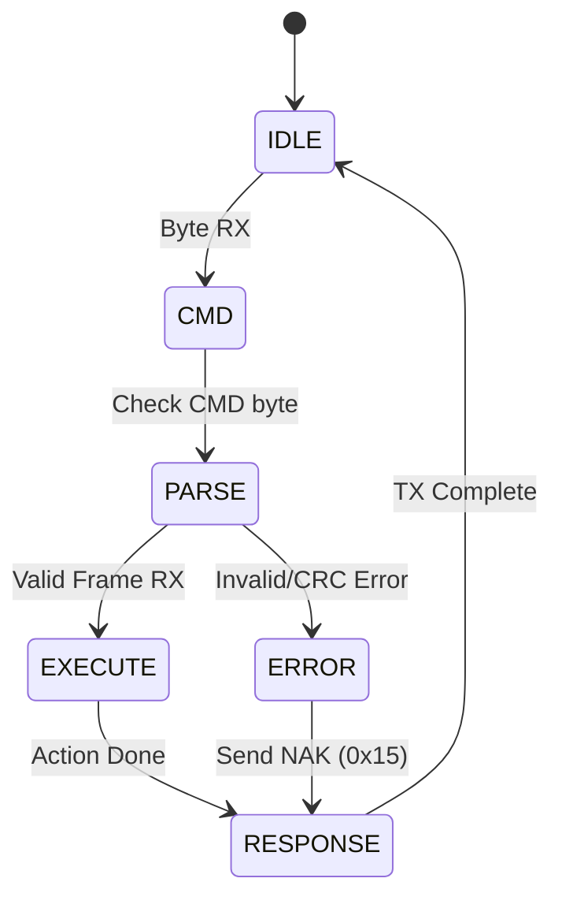
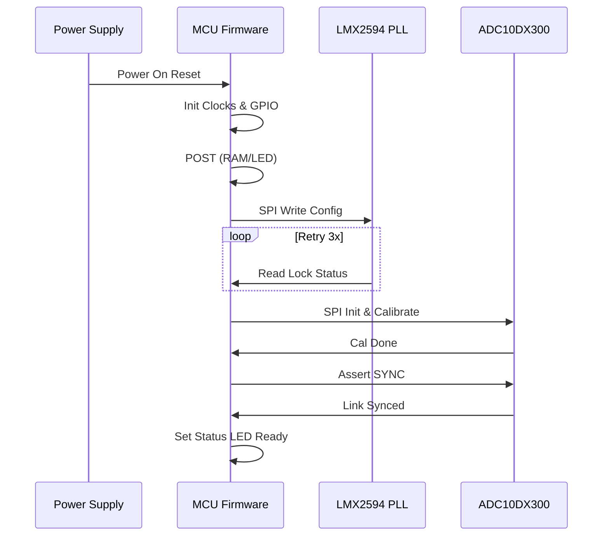
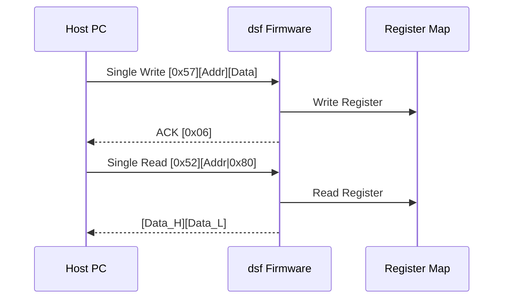
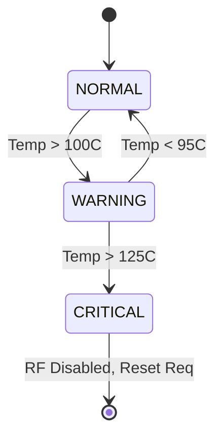

# Software Requirements Specification (SRS)

**Project:** dsf (5–18 GHz Wideband RF Receiver)
**Version:** 1.0
**Date:** 16 April 2026

---

## Document Control

| Version | Date | Author | Changes |
|---------|------|--------|---------|
| 1.0 | 16 April 2026 | System Architect | Initial Release |

---

# 1. Introduction

## 1.1 Purpose
The purpose of this Software Requirements Specification (SRS) is to define the comprehensive software and firmware requirements for the **dsf** Wideband RF Receiver Module. This document serves as the Level 3 (Software Requirements) artifact within the IEEE 29148:2018 hierarchy.

The software specified herein encompasses the Board Support Package (BSP), Hardware Abstraction Layer (HAL), control algorithms for the RF signal chain, and the data path management for the high-speed JESD204B interface.

**Intended Audience:**
- Embedded Firmware Engineers
- FPGA Design Engineers
- System Integration Engineers
- Verification and Validation Test Engineers

This document will be utilized as the primary baseline for software design, implementation, and unit/integration testing.

## 1.2 Scope
The scope of this SRS covers the complete firmware functionality required to operate the dsf hardware.

**Inclusions:**
- **Initialization:** Power-On Self-Test (POST), Clock Tree initialization (PLL/VCO), and peripheral bring-up.
- **RF Control:** SPI drivers for the LNA, Mixer, VGA, and Synthesizer (LMX2594) to manage gain, frequency, and bandwidth.
- **Data Acquisition:** Configuration of the ADC10DX300 and management of the JESD204B link.
- **Communication:** UART command/response protocol for register access and status reporting.
- **Safety:** Monitoring of temperature, voltage, and current via I2C; implementation of Watchdog Timer (WDT) and fault handling.
- **Diagnostics:** RAM tests, Flash integrity checks, and loopback tests.

**Exclusions:**
- High-level signal processing algorithms (e.g., DSP, FFT, demodulation) occurring downstream of the JESD204B interface.
- Mechanical housing or chassis management software.
- PC-based Host GUI software (outside the embedded module).

## 1.3 Definitions, Acronyms, and Abbreviations

| Term | Definition |
| :--- | :--- |
| **ADC** | Analog-to-Digital Converter |
| **AGC** | Automatic Gain Control |
| **API** | Application Programming Interface |
| **BGA** | Ball Grid Array |
| **BIOS** | Basic Input/Output System (Bootloader) |
| **BOM** | Bill of Materials |
| **BSP** | Board Support Package |
| **CPCI** | CompactPCI |
| **CRC** | Cyclic Redundancy Check |
| **DAC** | Digital-to-Analog Converter |
| **DMA** | Direct Memory Access |
| **EEPROM** | Electrically Erasable Programmable Read-Only Memory |
| **EMC** | Electromagnetic Compatibility |
| **ESD** | Electrostatic Discharge |
| **FCC** | Federal Communications Commission |
| **FIFO** | First-In-First-Out |
| **FPGA** | Field-Programmable Gate Array |
| **GLR** | Glue Logic Requirements |
| **GPIO** | General Purpose Input/Output |
| **HAL** | Hardware Abstraction Layer |
| **HRS** | Hardware Requirements Specification |
| **I2C** | Inter-Integrated Circuit |
| **IF** | Intermediate Frequency |
| **ISR** | Interrupt Service Routine |
| **JESD** | JESD204 Standard (JEDEC) |
| **LED** | Light Emitting Diode |
| **LDO** | Low Dropout Regulator |
| **LO** | Local Oscillator |
| **LNA** | Low Noise Amplifier |
| **LVDS** | Low-Voltage Differential Signaling |
| **MCU** | Microcontroller Unit |
| **MISRA** | Motor Industry Software Reliability Association |
| **NVM** | Non-Volatile Memory |
| **OS** | Operating System (or RTOS) |
| **PCB** | Printed Circuit Board |
| **PLL** | Phase-Locked Loop |
| **POST** | Power-On Self-Test |
| **QFN** | Quad Flat No-leads package |
| **RF** | Radio Frequency |
| **ROM** | Read-Only Memory |
| **RTC** | Real-Time Clock |
| **RTOS** | Real-Time Operating System |
| **RX** | Receive |
| **SFDR** | Spurious-Free Dynamic Range |
| **SNR** | Signal-to-Noise Ratio |
| **SPI** | Serial Peripheral Interface |
| **StRS** | Stakeholder Requirements Specification |
| **SyRS** | System Requirements Specification |
| **SRS** | Software Requirements Specification |
| **TRP** | Transmit/Receive Point (Antenna) |
| **UART** | Universal Asynchronous Receiver/Transmitter |
| **VCO** | Voltage-Controlled Oscillator |
| **VGA** | Variable Gain Amplifier |
| **VSWR** | Voltage Standing Wave Ratio |
| **WDT** | Watchdog Timer |

## 1.4 References
1.  **IEEE 830-1998:** Recommended Practice for Software Requirements Specifications.
2.  **ISO/IEC/IEEE 29148:2018:** Systems and Software Engineering — Life Cycle Processes — Requirements Engineering.
3.  **MISRA C:2012:** Guidelines for the Use of the C Language in Critical Systems.
4.  **dsf Hardware Requirements Specification (HRS),** Rev 1.0, 16 April 2026.
5.  **dsf Glue Logic Requirements (GLR),** Rev 0V01, 16 April 2026.
6.  **Texas Instruments ADC10DX300 Datasheet.**
7.  **Texas Instruments LMX2594 Datasheet.**
8.  **Analog Devices HMC698LP2/HMC698LP4E Datasheet.**
9.  **JEDEC JESD204B Standard:** Standard for high-speed data converter interfaces.

## 1.5 Overview
The remainder of this document is organized as follows:
- **Section 2 (Overall Description)** provides the system context, block diagrams, and general operational constraints.
- **Section 3 (Specific Requirements)** contains the detailed functional, performance, and interface requirements, including the UART protocol and driver APIs.
- **Section 4 (Verification and Validation)** outlines the testing strategy for unit and integration levels.
- **Section 5 (Requirements Traceability)** maps software requirements to hardware and system sources.
- **Appendices** provide data structures, register maps, and diagrams.

---

# 2. Overall Description

## 2.1 Product Perspective

### System Context
The dsf firmware operates as the control layer between a host system (via UART) and the analog/digital hardware. It runs on a microcontroller (or soft-core) interfaced directly with the RF Front End (LNA/Mixer/VGA), the Synthesizer, and the high-speed ADC.

```mermaid
graph TD
    HOST[Host System / PC] -->|UART Control/Status| MCU[Microcontroller / MCU]
    
    subgraph Firmware [dsf Firmware Scope]
        MCU --> HAL[Hardware Abstraction Layer]
        HAL --> SPI_DRV[SPI Driver]
        HAL --> I2C_DRV[I2C Driver]
        HAL --> UART_DRV[UART Driver]
        HAL --> GPIO_DRV[GPIO Driver]
        
        MCU --> APP[Application Logic]
        APP --> AGC[Auto Gain Control]
        APP --> DIAG[Diagnostics]
    end

    SPI_DRV --> RF_CTRL[RF Front End Control]
    subgraph Hardware [Hardware (External to Scope)]
        RF_CTRL --> LNA[HMC698LP4E LNA]
        RF_CTRL --> VGA[HMC698LP2 VGA]
        RF_CTRL --> MIX[HMC1048LC4 Mixer]
        RF_CTRL --> SYNTH[LMX2594 Synthesizer]
    end

    I2C_DRV --> MONITOR[Power & Temp Monitor]
    
    MCU -->|JESD204B Config| ADC[ADC10DX300]
    ADC -->|LVDS Data | BACKEND[Backend Processor / FPGA]
```

### Hardware Interfaces
The firmware directly controls the following hardware blocks defined in the HRS:
1.  **RF Chain:** HMC698LP4E (LNA), HMC1048LC4 (Mixer), HMC698LP2 (VGA), ADA4817-1 (IF Amp).
2.  **Frequency Generation:** LMX2594 PLL/Synthesizer.
3.  **Digitization:** ADC10DX300 (10 GSPS).
4.  **Power Management:** LTM4644IY, LT3045, LT3094 regulators; monitored via I2C PMIC.
5.  **User Interface:** UART for debug/command; LEDs for status.

## 2.2 Product Functions
The software performs the following major functions:

1.  **System Initialization & Boot:**
    *   Configure PLLs and system clocks.
    *   Initialize SPI, I2C, and UART peripherals.
    *   Execute Power-On Self-Test (POST).
2.  **Hardware Abstraction (HAL):**
    *   SPI drivers for RF ICs (operating at 10 MHz max).
    *   I2C drivers for temperature and power sensors.
    *   GPIO control for ESD protection enable, LEDs, and Reset lines.
3.  **RF Configuration:**
    *   Tune LO frequency via LMX2594 SPI interface.
    *   Adjust VGA gain (0-42 dB range) via HMC698LP2 SPI interface.
    *   Configure Mixer bias.
4.  **ADC Interface Management:**
    *   Configure ADC10DX300 via SPI (Gain, Offset, Test Patterns).
    *   Monitor JESD204B link status (SYNC~ signals).
5.  **UART Command Protocol:**
    *   Parse incoming commands (Single Read/Write, Bulk Read/Write).
    *   Execute register accesses.
    *   Respond with ACK/NAK.
6.  **Environmental Monitoring:**
    *   Poll temperature sensors (MIL-TEMP range).
    *   Monitor current/voltage rails.
    *   Implement thermal shutdown (Software TRP disable) if >125°C.
7.  **Fault Management:**
    *   Watchdog Timer refresh.
    *   Error logging to non-volatile memory.

## 2.3 User Characteristics
*   **Firmware Engineers:** Develop low-level drivers and perform debugging via JTAG.
*   **Test Engineers:** Interact via UART to set frequencies and gains, check ADC link status.
*   **System Integrators:** Integrate the dsf module into larger chassis (CPCI/VITA).

## 2.4 Constraints
1.  **Timing:** The SPI clock for the LMX2594 must not exceed 30 MHz. The VGA SPI update rate must be fast enough to support AGC loops (<10 µs).
2.  **Memory:** On-chip Flash/RAM is limited. Code must be optimized for size (e.g., no floating point libraries if possible, use fixed-point).
3.  **Safety:** Incorrect frequency or gain settings must not damage the hardware. Software limits must enforce [REQ-HW-005] (IP1dB +5 dBm).
4.  **Environment:** Software must account for MIL-STD temperature variations (clock drifts, ADC gain drifts).
5.  **Standards:** Code must comply with MISRA-C:2012.

## 2.5 Assumptions and Dependencies
1.  The 12V supply is stable and within regulation before firmware boots.
2.  The external reference clock (for ADC/Synthesizer) is present and stable (10 MHz typical).
3.  The Host system supports the specified UART frame format.
4.  The JESD204B PHY layer is handled by the ADC hardware; software only handles configuration register access.

---

# 3. Specific Requirements

## 3.1 External Interface Requirements

### 3.1.1 Hardware Interfaces

#### 3.1.1.1 RF Control SPI Bus (LMX2594, HMC698LP2, HMC1048LC4)
The firmware shall implement a bit-bang or hardware SPI master driver to communicate with the RF front-end components.

**Timing Constraints:**
*   Max SCLK Frequency: 30 MHz.
*   CS_N Setup Time: 10 ns.
*   CS_N Hold Time: 10 ns.

**Driver API Definition:**
```c
/**
 * @brief Initialize the SPI peripheral for RF control.
 * @param clk_hz Target clock speed in Hz (max 30,000,000).
 * @return 0 on success, negative error code on failure.
 */
int32_t RF_SPI_Init(uint32_t clk_hz);

/**
 * @brief Write a 24-bit register to an RF device.
 * @param device_id Enum identifying LNA, MIXER, VGA, or PLL.
 * @param reg_addr 8-bit or 16-bit register address.
 * @param data 8-bit or 16-bit data to write.
 * @return 0 on success, -1 if device not ready.
 */
int32_t RF_WriteReg(uint8_t device_id, uint16_t reg_addr, uint16_t data);

/**
 * @brief Read a 24-bit register from an RF device.
 * @param device_id Enum identifying LNA, MIXER, VGA, or PLL.
 * @param reg_addr 8-bit or 16-bit register address.
 * @param data Pointer to store read data.
 * @return 0 on success, -1 on timeout.
 */
int32_t RF_ReadReg(uint8_t device_id, uint16_t reg_addr, uint16_t *data);
```

#### 3.1.1.2 ADC Control SPI Bus (ADC10DX300)
Interface to configure the ADC sampling parameters.

**Driver API Definition:**
```c
/**
 * @brief Initialize ADC interface (SPI CS, SCLK, SDIO).
 * @return 0 on success.
 */
int32_t ADC_Init(void);

/**
 * @brief Configure ADC JESD204B link parameters.
 * @param lanes Number of lanes (1-8).
 * @param scrambler_enable 1 to enable, 0 to disable.
 * @return 0 on success.
 */
int32_t ADC_ConfigureJESD(uint8_t lanes, uint8_t scrambler_enable);

/**
 * @brief Trigger ADC calibration cycle.
 * @return 0 on completion, -1 on timeout (max 5s).
 */
int32_t ADC_Calibrate(void);
```

#### 3.1.1.3 Sensor I2C Bus (Temperature/Power)
Standard I2C interface (100kHz standard mode).

**Driver API Definition:**
```c
/**
 * @brief Read temperature from on-board sensor.
 * @param sensor_id Instance ID (if multiple).
 * @param temp_c Pointer to store temp in Celsius.
 * @return 0 on success, -1 on I2C NACK.
 */
int32_t Sensor_ReadTemp(uint8_t sensor_id, float *temp_c);

/**
 * @brief Read power rail voltage via PMIC I2C.
 * @param rail_id Rail enum (e.g., RAIL_12V, RAIL_5V).
 * @param voltage_v Pointer to store voltage in Volts.
 * @return 0 on success.
 */
int32_t Sensor_ReadVoltage(uint8_t rail_id, float *voltage_v);
```

### 3.1.2 Software Interfaces
*   **Standard Library:** C Standard Library (stdio.h, stdlib.h, string.h) restricted to MISRA compliant subsets.
*   **RTOS:** No external RTOS used. Firmware is bare-metal, super-loop architecture with interrupt-driven servicing.

### 3.1.3 Communication Interfaces
The dsf module communicates with the Host PC via a UART interface. The protocol is a binary frame format.

**General Parameters:**
*   Baud Rate: 115200 bps (configurable to 921600 bps).
*   Data Bits: 8.
*   Parity: None.
*   Stop Bits: 1.
*   Flow Control: None.

**UART Frame Format Specification:**

| Command | CMD byte | Frame Structure | Response |
|---------|----------|-----------------|----------|
| Single Write | 0x57 ('W') | `[0x57][ADDR_H][ADDR_L][DATA_H][DATA_L]` | `[0x06]` ACK |
| Single Read  | 0x52 ('R') | `[0x52][ADDR_H\|0x80][ADDR_L]` | `[DATA_H][DATA_L]` |
| Bulk Write   | 0x42 ('B') | `[0x42][ADDR_H][ADDR_L][N][D0_H][D0_L]...[Dn_H][Dn_L]` | `[0x06]` ACK |
| Bulk Read    | 0x62 ('b') | `[0x62][ADDR_H\|0x80][ADDR_L][N]` | `[D0_H][D0_L]...[Dn_H][Dn_L]` |
| Error NAK    | 0x15 | Sent by MCU on invalid command/address or CRC error. | — |

**Addressing Rules:**
*   16-bit address space (0x0000–0xFFFF).
*   **Write Address:** Standard 16-bit address.
*   **Read Address:** Address ORed with `0x8000`.
*   **Bulk Count (N):** 0 to 64.

**State Machine:**


## 3.2 Functional Requirements

### 3.2.1 System Initialization (REQ-SW-001 to REQ-SW-010)

| ID | Requirement | Source | Priority | Verification |
|----|-------------|--------|----------|---------------|
| REQ-SW-001 | The software SHALL perform a reset of all SPI peripherals (Assert CS_N high) upon power-up. | GLR §4 | [M] | Inspection |
| REQ-SW-002 | The software SHALL complete the POST sequence within 500ms of 3.3V rail stability. | HRS REQ-HW-008 | [M] | Test |
| REQ-SW-003 | The software SHALL verify the BOARD_ID register (FPGA Addr 0x0000) reads 0xA5A5; if mismatch, set System Fault flag. | GLR §6 | [M] | Test |
| REQ-SW-004 | The software SHALL configure the system PLL to 100 MHz operation before initializing peripherals. | Design | [M] | Analysis |
| REQ-SW-005 | The software SHALL initialize the UART interface to 115200 baud, 8N1 format upon boot. | GLR §7 | [M] | Test |
| REQ-SW-006 | The software SHALL initialize the I2C sensor interface to 100 kHz. | HRS REQ-HW-009 | [M] | Test |
| REQ-SW-007 | The software SHALL enable the Watchdog Timer with a 10ms timeout and kick it every 5ms. | Safety | [M] | Demonstration |
| REQ-SW-008 | The software SHALL read the default configuration from Non-Volatile Memory (EEPROM) and apply it to the RF Chain. | HRS REQ-HW-011 | [D] | Test |
| REQ-SW-009 | The software SHALL set the STATUS_LED to blink at 2Hz during successful initialization. | UI Spec | [O] | Demonstration |
| REQ-SW-010 | The software SHALL perform a RAM BIST (March C-) on 4KB of internal SRAM. | Safety | [M] | Analysis |

### 3.2.2 RF Configuration and Control (REQ-SW-011 to REQ-SW-020)

| ID | Requirement | Source | Priority | Verification |
|----|-------------|--------|----------|---------------|
| REQ-SW-011 | The software SHALL set the LMX2594 LO frequency via SPI writes based on the desired RF center frequency. | HRS REQ-HW-001 | [M] | Test |
| REQ-SW-012 | The software SHALL verify the LMX2594 LOCK_STATUS bit after frequency change; if not locked after 100ms, generate Fault. | HRS REQ-HW-014 | [M] | Test |
| REQ-SW-013 | The software SHALL set the VGA gain (HMC698LP2) from 0 to 42 dB in 1 dB steps. | HRS REQ-HW-011 | [M] | Test |
| REQ-SW-014 | The software SHALL map the requested gain (dB) to the appropriate 6-bit register value for the HMC698LP2. | Datasheet | [M] | Inspection |
| REQ-SW-015 | The software SHALL implement a gain table in EEPROM to linearize the VGA response. | HRS REQ-HW-011 | [D] | Analysis |
| REQ-SW-016 | The software SHALL provide a register command (UART 0x57) to set the Center Frequency ( Addr 0x0010 ). | GLR §7 | [M] | Test |
| REQ-SW-017 | The software SHALL limit the Center Frequency setting to the range 5000 MHz to 18000 MHz. | HRS REQ-HW-001 | [M] | Test |
| REQ-SW-018 | The software SHALL provide a register command to set the Gain Index ( Addr 0x0011 ). | GLR §7 | [M] | Test |
| REQ-SW-019 | The software SHALL update the gain settings within 5 microseconds of the SPI command completion. | Timing | [M] | Analysis |
| REQ-SW-020 | The software SHALL assert the Mixer Enable GPIO pin high only after LO Lock is confirmed. | Safety | [M] | Test |

### 3.2.3 Data Acquisition and ADC Control (REQ-SW-021 to REQ-SW-030)

| ID | Requirement | Source | Priority | Verification |
|----|-------------|--------|----------|---------------|
| REQ-SW-021 | The software SHALL configure the ADC10DX300 for 10-bit, single-channel operation. | HRS REQ-HW-006 | [M] | Test |
| REQ-SW-022 | The software SHALL enable the JESD204B output lane scrambling to reduce EMI. | Datasheet | [M] | Inspection |
| REQ-SW-023 | The software SHALL monitor the ADC_SYNC_N pin to ensure link alignment. | GLR §5 | [M] | Test |
| REQ-SW-024 | The software SHALL initiate an ADC background calibration cycle every 60 seconds. | Maintenance | [O] | Test |
| REQ-SW-025 | The software SHALL report the ADC die temperature via UART register 0x0020. | HRS REQ-HW-009 | [D] | Test |
| REQ-SW-026 | The software SHALL disable the ADC clock output if the JESD204B link remains un-synced for >1 second. | Power Save | [M] | Test |
| REQ-SW-027 | The software SHALL allow configuration of the ADC test pattern (e.g., 1A 5C alternating) via UART register 0x0021. | Diagnostics | [M] | Test |
| REQ-SW-028 | The software SHALL log the number of JESD204B buffer overflows to register 0x0022. | Diagnostics | [M] | Test |
| REQ-SW-029 | The software SHALL implement a soft-reset for the ADC via register bit 0x0023[0]. | Recovery | [M] | Test |
| REQ-SW-030 | The software SHALL ensure the ADC is in standby mode until the PLL is locked. | Power Seq | [M] | Test |

### 3.2.4 Environmental Monitoring (REQ-SW-031 to REQ-SW-040)

| ID | Requirement | Source | Priority | Verification |
|----|-------------|--------|----------|---------------|
| REQ-SW-031 | The software SHALL poll the on-board temperature sensor every 500ms. | HRS REQ-HW-009 | [M] | Test |
| REQ-SW-032 | The software SHALL trigger a Critical Temperature Fault if the board temperature exceeds 125°C. | HRS REQ-HW-009 | [M] | Test |
| REQ-SW-033 | Upon Critical Temperature Fault, the software SHALL set the RF Enable signal to LOW (disable RF chain). | Safety | [M] | Test |
| REQ-SW-034 | The software SHALL monitor the +12V input voltage via I2C ADC. | HRS REQ-HW-008 | [M] | Test |
| REQ-SW-035 | The software SHALL assert an Under-Voltage Fault if +12V drops below 10.8V. | Power | [M] | Test |
| REQ-SW-036 | The software SHALL monitor the current draw on the +5V rail. | HRS REQ-HW-008 | [M] | Test |
| REQ-SW-037 | The software SHALL assert an Over-Current Fault if +5V current exceeds 10A. | HRS REQ-HW-008 | [M] | Test |
| REQ-SW-038 | The software SHALL report the current die temperature of the FPGA/CPU to register 0x0030. | Diagnostics | [D] | Test |
| REQ-SW-039 | The software SHALL implement a hysteresis of 5°C for temperature alerts (turn on at 125°C, off at 120°C). | Stability | [M] | Test |
| REQ-SW-040 | The software SHALL log the timestamp of the last fault to registers 0x0031 (Seconds) and 0x0032 (Millis). | Diagnostics | [D] | Test |

### 3.2.5 Non-Volatile Memory Management (REQ-SW-041 to REQ-SW-050)

| ID | Requirement | Source | Priority | Verification |
|----|-------------|--------|----------|---------------|
| REQ-SW-041 | The software SHALL implement a wear-leveling algorithm for EEPROM writes (address 0xA000-0xAFFF). | Reliability | [D] | Analysis |
| REQ-SW-042 | The software SHALL store the last configured frequency and gain in EEPROM (Address 0xA001) on power-down. | User Exp | [M] | Test |
| REQ-SW-043 | The software SHALL calculate a CRC-16-CCITT on the EEPROM configuration block at startup. | Safety | [M] | Test |
| REQ-SW-044 | If EEPROM CRC is invalid, the software SHALL load default parameters. | Safety | [M] | Test |
| REQ-SW-045 | The software SHALL protect the EEPROM area containing the serial number (Read-Only). | Id | [M] | Test |
| REQ-SW-046 | The software SHALL implement a "Factory Reset" command via UART register 0x0040 bit 0. | UI Spec | [M] | Test |
| REQ-SW-047 | The software SHALL allow the Host to read the firmware version string from EEPROM (Addr 0x0050). | Diagnostics | [M] | Test |
| REQ-SW-048 | The software SHALL write calibration data (Gain slopes) to EEPROM on completion of factory calibration. | HRS REQ-HW-011 | [M] | Test |
| REQ-SW-049 | The software SHALL limit the number of EEPROM write cycles to <10,000 per hour via rate limiting. | Hardware | [M] | Analysis |
| REQ-SW-050 | The software SHALL map the UART read commands to EEPROM addresses for bulk read operations. | GLR §7 | [M] | Test |

### 3.2.6 Diagnostics and Status (REQ-SW-051 to REQ-SW-060)

| ID | Requirement | Source | Priority | Verification |
|----|-------------|--------|----------|---------------|
| REQ-SW-051 | The software SHALL expose a System Status Register (Addr 0x0001) with bits for Lock, Temp Fault, and RF Enable. | GLR §7 | [M] | Inspection |
| REQ-SW-052 | The software SHALL blink the Red LED if a non-critical fault occurs. | UI Spec | [O] | Demonstration |
| REQ-SW-053 | The software SHALL illuminate the Green LED solidly during normal operation. | UI Spec | [O] | Demonstration |
| REQ-SW-054 | The software SHALL provide a UART loopback mode for internal testing (Addr 0x0060). | Diagnostics | [D] | Test |
| REQ-SW-055 | The software SHALL implement a Built-In Self-Test (BIST) for SPI RAM (if present) accessible via command 0xD0. | GLR §7 | [M] | Test |
| REQ-SW-056 | The software SHALL report the uptime in seconds since boot to register 0x0061 (32-bit). | Diagnostics | [M] | Test |
| REQ-SW-057 | The software SHALL count the number of Watchdog Resets since power-on and store in register 0x0062. | Reliability | [M] | Test |
| REQ-SW-058 | The software SHALL provide a mechanism to dump the fault log buffer (last 10 faults) via Bulk Read. | Diagnostics | [M] | Test |
| REQ-SW-059 | The software SHALL mask interrupts during critical register writes (atomicity). | RTOS | [M] | Inspection |
| REQ-SW-060 | The software SHALL provide a unique 64-bit Device ID (from EEPROM) readable via registers 0x0070-0x0077. | HRS | [M] | Test |

### 3.2.7 Watchdog and Recovery (REQ-SW-061 to REQ-SW-070)

| ID | Requirement | Source | Priority | Verification |
|----|-------------|--------|----------|---------------|
| REQ-SW-061 | The software SHALL service the Watchdog Timer at least once every 10ms. | Safety | [M] | Test |
| REQ-SW-062 | The software SHALL log the PC (Program Counter) value to a persistent register before a Watchdog Reset occurs (if WDT supports early warning). | Debug | [D] | Test |
| REQ-SW-063 | The software SHALL check the stack canary at the end of the main loop. | Safety | [M] | Analysis |
| REQ-SW-064 | The software SHALL disable global interrupts (IRQ) during the Watchdog kick sequence. | Safety | [M] | Inspection |
| REQ-SW-065 | The software SHALL re-initialize the SPI peripherals after a Watchdog reset. | Recovery | [M] | Test |
| REQ-SW-066 | The software SHALL retain the contents of the Fault Log across a Watchdog reset (stored in NVM). | Diagnostics | [M] | Test |
| REQ-SW-067 | The software SHALL increment the WDT_RESET_COUNT register on boot if the reset cause was WDT. | Diagnostics | [M] | Test |
| REQ-SW-068 | The software SHALL enter a low-power state if the UART line is idle for >60 seconds (optional feature). | Power | [O] | Test |
| REQ-SW-069 | The software SHALL trigger a software reset if the PLL loses lock and fails to re-lock within 200ms. | Recovery | [M] | Test |
| REQ-SW-070 | The software SHALL implement a Dead Man Switch interrupt (Timer) that resets the MCU if the main loop hangs. | Safety | [M] | Analysis |

### 3.2.8 JESD204B Interface Specifics (REQ-SW-071 to REQ-SW-080)

| ID | Requirement | Source | Priority | Verification |
|----|-------------|--------|----------|---------------|
| REQ-SW-071 | The software SHALL assert the ADC RESET_N signal low for at least 10ms on boot. | ADC Datasheet | [M] | Test |
| REQ-SW-072 | The software SHALL bring the ADC SYNC_N signal high to initiate lane alignment. | JESD Spec | [M] | Test |
| REQ-SW-073 | The software SHALL wait for the ADC CODE_GRP_SYNC signal to indicate alignment before declaring data valid. | JESD Spec | [M] | Test |
| REQ-SW-074 | The software SHALL allow the Host to configure the ADC subclass (Subclass 1 for SYSREF) via register 0x0080. | GLR | [M] | Test |
| REQ-SW-075 | The software SHALL support SYSREF input configuration for multi-device synchronization. | JESD Spec | [D] | Test |
| REQ-SW-076 | The software SHALL report the number of JESD204B initialization errors to register 0x0081. | Diagnostics | [M] | Test |
| REQ-SW-077 | The software SHALL disable the JESD204B outputs (put lanes in power down) if RF input power exceeds +5 dBm (Hardware interlock check). | HRS REQ-HW-005 | [M] | Test |
| REQ-SW-078 | The software SHALL verify the integrity of the JESD204B link by checking the ADC for 'Ramp' test patterns. | Production | [M] | Test |
| REQ-SW-079 | The software SHALL log the elapsed time for link acquisition to register 0x0082. | Diagnostics | [M] | Test |
| REQ-SW-080 | The software SHALL implement a Link Reset state machine that automatically retries 3 times on failure. | Robustness | [M] | Test |

## 3.3 Performance Requirements

| ID | Requirement | Value | Verification |
|----|-------------|-------|---------------|
| REQ-PERF-001 | RF Frequency Settling Time | < 5 ms (from SPI write to Lock Detect) | Test |
| REQ-PERF-002 | Gain Settling Time | < 5 µs (from VGA SPI write) | Test |
| REQ-PERF-003 | UART Command Response Time | < 2 ms (Command to ACK) | Test |
| REQ-PERF-004 | Boot Time | < 500 ms (Power to Ready LED) | Test |
| REQ-PERF-005 | I2C Read Speed | 100 kHz (Standard Mode) | Test |
| REQ-PERF-006 | SPI Write Speed | Max 30 MHz (Clock) | Test |
| REQ-PERF-007 | Watchdog Timeout | 10 ms (min) | Analysis |
| REQ-PERF-008 | ADC Config Time | < 100 ms (Including Calibration) | Test |
| REQ-PERF-009 | EEPROM Write Time | < 10 ms (Page Write) | Test |
| REQ-PERF-010 | Interrupt Latency | < 10 µs (Max) | Analysis |
| REQ-PERF-011 | Temperature Polling Rate | 2 Hz (Once every 500ms) | Test |
| REQ-PERF-012 | JESD Link Init Time | < 200 ms (Power up to SYNC high) | Test |

## 3.4 Design Constraints
1.  **MISRA Compliance:** All C code shall adhere to MISRA-C:2012 rules.
2.  **Compiler:** GCC for ARM (or applicable MCU architecture) with -Wall -Wextra.
3.  **Stack Size:** Main stack size shall not exceed 4KB.
4.  **Heap:** No dynamic memory allocation (malloc) is permitted.
5.  **Bit Manipulation:** All hardware register accesses shall be volatile qualified.
6.  **Floating Point:** Use of floating point math is prohibited in interrupt service routines (ISRs).
7.  **Atomicity:** 32-bit register reads on 16-bit architectures shall disable interrupts.

## 3.5 Software System Attributes

### 3.5.1 Reliability
*   **MTBF:** The software shall contribute to a system MTBF of >10,000 hours.
*   **Recovery:** Automatic recovery from Watchdog resets within 1 second.

### 3.5.2 Availability
*   **Downtime:** System unavailable for <500ms during power cycle.

### 3.5.3 Security
*   **Write Protection:** UART write commands to protected memory areas (Bootloader) shall be ignored unless unlocked via specific key sequence.

### 3.5.4 Maintainability
*   **Comments:** All functions shall have Doxygen headers.
*   **Modularity:** Drivers for LNA, Mixer, VGA, and PLL shall be separate source files.

---

# 4. Verification and Validation

## 4.1 Unit Test Requirements
*   **SPI Driver:** Verify write/read to real hardware (Loopback or scope verification of timing).
*   **I2C Driver:** Verify ACK/NACK detection and clock stretching handling.
*   **CRC Module:** Verify calculation against known test vectors.

## 4.2 Integration Test Requirements
*   **RF Chain Tuning:** Verify frequency can be set across 5-18 GHz and Lock Detect asserts.
*   **Gain Control:** Verify Gain Register 0-63 maps to correct dB attenuation/gain.
*   **Temperature Shutdown:** Heat sensor to 126°C, verify RF disables.
*   **ADC Link:** Verify SYNC_N goes high and data traffic starts on LVDS lines.

---

# 5. Requirements Traceability Matrix

| REQ-SW ID | Description | Traces To (HRS/GLR) |
|-----------|-------------|---------------------|
| REQ-SW-001 | SPI Peripheral Reset | GLR §4 |
| REQ-SW-002 | POST < 500ms | HRS REQ-HW-008 |
| REQ-SW-003 | Board ID Check | GLR §6 |
| REQ-SW-004 | PLL Init 100MHz | Design |
| REQ-SW-005 | UART Init 115200 | GLR §7 |
| REQ-SW-006 | I2C Init 100kHz | HRS REQ-HW-009 |
| REQ-SW-007 | WDT Enable 10ms | Safety Spec |
| REQ-SW-008 | EEPROM Config Load | HRS REQ-HW-011 |
| REQ-SW-009 | LED Blink 2Hz | UI Spec |
| REQ-SW-010 | RAM BIST | Safety |
| REQ-SW-011 | LMX2594 Freq Set | HRS REQ-HW-001 |
| REQ-SW-012 | PLL Lock Check | HRS REQ-HW-014 |
| REQ-SW-013 | VGA Gain 0-42dB | HRS REQ-HW-011 |
| REQ-SW-014 | VGA Reg Mapping | Datasheet |
| REQ-SW-015 | Gain Linearization | HRS REQ-HW-011 |
| REQ-SW-016 | UART Set Freq Cmd | GLR §7 |
| REQ-SW-017 | Freq Limit 5-18GHz | HRS REQ-HW-001 |
| REQ-SW-018 | UART Set Gain Cmd | GLR §7 |
| REQ-SW-019 | Gain Update < 5us | Timing Spec |
| REQ-SW-020 | Mixer Enable Logic | Safety |
| REQ-SW-021 | ADC Config 10-bit | HRS REQ-HW-006 |
| REQ-SW-022 | JESD Scrambler | Datasheet |
| REQ-SW-023 | SYNC_N Monitor | GLR §5 |
| REQ-SW-024 | ADC Cal Cycle | Maintenance |
| REQ-SW-025 | ADC Temp Report | HRS REQ-HW-009 |
| REQ-SW-026 | Link Unsync Disable | Power |
| REQ-SW-027 | ADC Test Pattern | Diagnostics |
| REQ-SW-028 | Overflow Count | Diagnostics |
| REQ-SW-029 | ADC Soft Reset | Recovery |
| REQ-SW-030 | ADC Standby Seq | Power Seq |
| REQ-SW-031 | Temp Poll 500ms | HRS REQ-HW-009 |
| REQ-SW-032 | Critical Temp >125C | HRS REQ-HW-009 |
| REQ-SW-033 | RF Disable on Fault | Safety |
| REQ-SW-034 | Monitor +12V | HRS REQ-HW-008 |
| REQ-SW-035 | UnderV Fault <10.8V | Power |
| REQ-SW-036 | Monitor +5V I | HRS REQ-HW-008 |
| REQ-SW-037 | OverCurrent Fault >10A | HRS REQ-HW-008 |
| REQ-SW-038 | CPU Temp Report | Diagnostics |
| REQ-SW-039 | Temp Hysteresis 5C | Stability |
| REQ-SW-040 | Fault Timestamp | Diagnostics |
| REQ-SW-041 | EEPROM Wear Level | Reliability |
| REQ-SW-042 | Store Last Config | User Exp |
| REQ-SW-043 | EEPROM CRC | Safety |
| REQ-SW-044 | Default Config Load | Safety |
| REQ-SW-045 | Serial RO | ID |
| REQ-SW-046 | Factory Reset Cmd | UI Spec |
| REQ-SW-047 | Firmware Ver Read | Diagnostics |
| REQ-SW-048 | Store Cal Data | HRS REQ-HW-011 |
| REQ-SW-049 | EEPROM Rate Limit | Hardware |
| REQ-SW-050 | UART EEPROM Map | GLR §7 |
| REQ-SW-051 | Status Register | GLR §7 |
| REQ-SW-052 | Red LED Fault | UI Spec |
| REQ-SW-053 | Green LED OK | UI Spec |
| REQ-SW-054 | UART Loopback | Diagnostics |
| REQ-SW-055 | BIST Command | GLR §7 |
| REQ-SW-056 | Uptime Seconds | Diagnostics |
| REQ-SW-057 | WDT Reset Count | Reliability |
| REQ-SW-058 | Fault Log Dump | Diagnostics |
| REQ-SW-059 | Atomic Writes | RTOS |
| REQ-SW-060 | Device ID Read | HRS |
| REQ-SW-061 | WDT Kick 10ms | Safety |
| REQ-SW-062 | PC Log on WDT | Debug |
| REQ-SW-063 | Stack Canary | Safety |
| REQ-SW-064 | IRQ Disable on Kick | Safety |
| REQ-SW-065 | Re-init on Reset | Recovery |
| REQ-SW-066 | Retain Fault Log | Diagnostics |
| REQ-SW-067 | WDT Count Reg | Diagnostics |
| REQ-SW-068 | Low Power Idle | Power |
| REQ-SW-069 | PLL Loss Reset | Recovery |
| REQ-SW-070 | Dead Man Switch | Safety |
| REQ-SW-071 | ADC Reset Timing | ADC Spec |
| REQ-SW-072 | SYNC_N High | JESD Spec |
| REQ-SW-073 | Code Grp Sync | JESD Spec |
| REQ-SW-074 | Subclass Config | GLR |
| REQ-SW-075 | SYSREF Support | JESD Spec |
| REQ-SW-076 | Link Err Count | Diagnostics |
| REQ-SW-077 | RF Input Interlock | HRS REQ-HW-005 |
| REQ-SW-078 | Ramp Pattern Check | Production |
| REQ-SW-079 | Link Time Log | Diagnostics |
| REQ-SW-080 | Link Retry State Mach | Robustness |

---

# 6. Appendices

## Appendix A — Error Codes

```c
typedef enum {
    ERR_OK           = 0x00,
    ERR_TIMEOUT      = 0x01,
    ERR_COMM_SPI     = 0x02,
    ERR_COMM_I2C     = 0x03,
    ERR_CHECKSUM     = 0x04,
    ERR_PARAM        = 0x05,
    ERR_NOT_INIT     = 0x06,
    ERR_HARDWARE     = 0x07,
    ERR_OVERFLOW     = 0x08,
    ERR_UNDERFLOW    = 0x09,
    ERR_FLASH_WRITE  = 0x0A,
    ERR_EEPROM       = 0x0B,
    ERR_PLL_UNLOCK   = 0x0C,
    ERR_TEMP_HIGH    = 0x0D,
    ERR_VOLT_LOW     = 0x0E,
    ERR_CURRENT_HIGH = 0x0F,
    ERR_UART_FRAME   = 0x10,
    ERR_UART_CRC     = 0x11,
    ERR_ADC_TIMEOUT  = 0x12,
} ErrorCode_t;
```

## Appendix B — Register Map Summary

| Base Address | Block | Offset | Register Name | Width | R/W | Reset | Description |
|-------------|-------|--------|--------------|-------|-----|-------------|-------------|
| 0x0000 | SYS | 0x00 | BOARD_ID | 16 | RO | 0xA5A5 | Board Identifier |
| 0x0000 | SYS | 0x01 | SYS_STATUS | 16 | RO | 0x0000 | Status Bits [0:Lock, 1:Fault, 2:RF_EN] |
| 0x0000 | SYS | 0x10 | CENTER_FREQ | 32 | WO | 0x0 | RF Frequency in Hz |
| 0x0000 | SYS | 0x11 | GAIN_INDEX | 8 | WO | 0x00 | VGA Gain 0-63 |
| 0x0000 | SYS | 0x20 | ADC_TEMP | 16 | RO | 0x0 | ADC Die Temp (0.1C) |
| 0x0000 | SYS | 0x21 | ADC_TEST_MODE | 8 | RW | 0x00 | Test Pattern Select |
| 0x0000 | SYS | 0x40 | FACTORY_RESET | 8 | WO | 0x00 | Bit 0 triggers reset |
| 0x0000 | SYS | 0x60 | UART_LOOPBACK | 8 | RW | 0x00 | 1=Enable Loopback |
| 0xA000 | NVM | 0x00-FF | CONFIG_BLK | 8 | RW | - | User Config Storage |

## Appendix C — Mermaid Diagrams

### System Initialization Sequence


### UART Register Command Flow


### Temperature Alert State Machine
