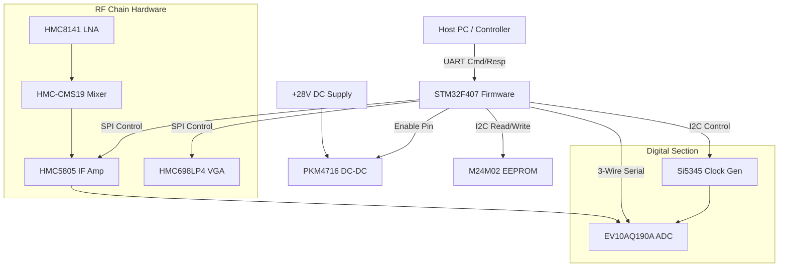
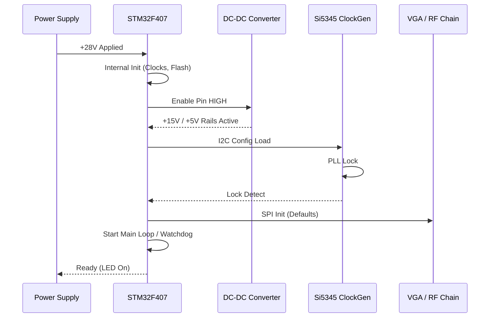
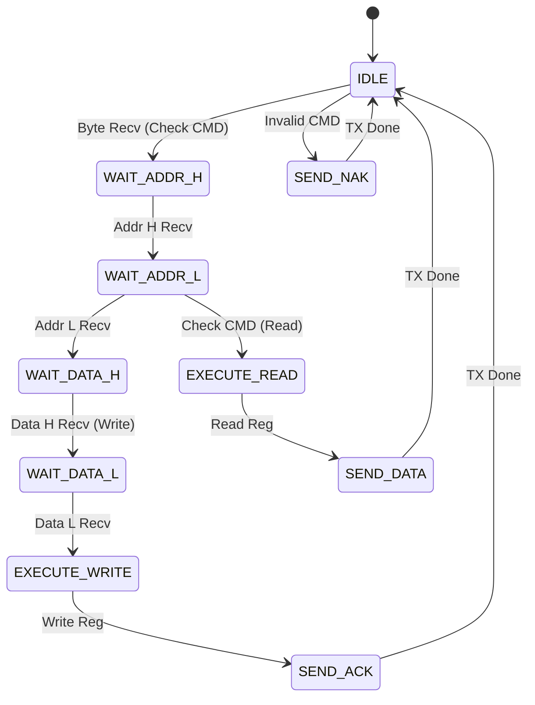
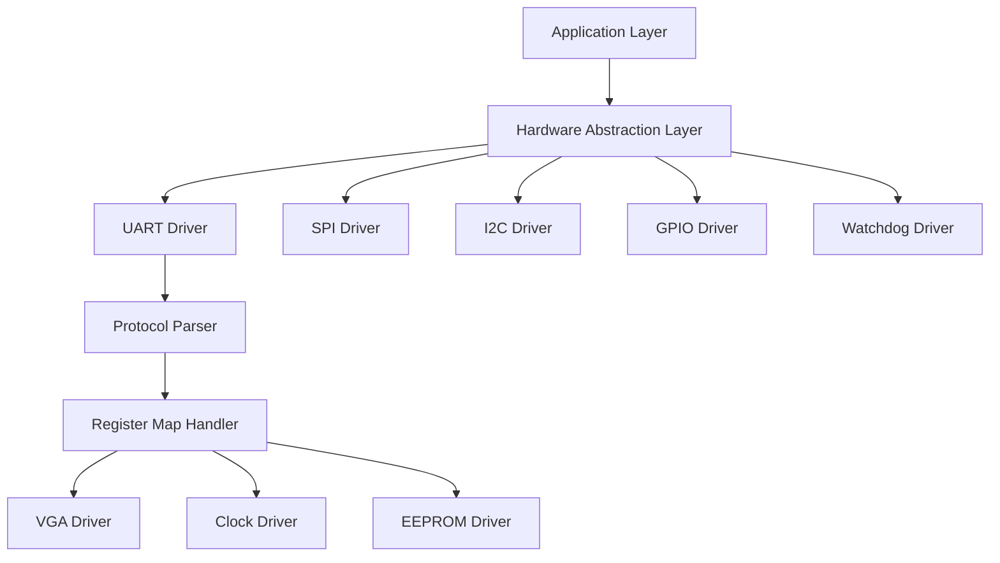

# Software Requirements Specification (SRS)

**Project:** ehg (Wideband RF Receiver Module)
**Version:** 1.0
**Date:** 16 April 2026

---

## Document Control
| Version | Date | Author | Changes |
|---------|------|--------|---------|
| 1.0 | 16 April 2026 | Senior Architect | Initial Release |

---

# 1. Introduction

## 1.1 Purpose
This Software Requirements Specification (SRS) defines the comprehensive software requirements for the **ehg** Wideband RF Receiver Module firmware. This document specifies the requirements for the embedded software running on the STM32F407VGT6 microcontroller (Level 3 of the IEEE 29148 hierarchy). It is intended to be used by firmware developers, test engineers, and system integrators to guide the implementation, verification, and validation of the firmware. The firmware is responsible for the initialization, control, monitoring, and communication management of the RF chain, power supply, and ADC sub-systems.

## 1.2 Scope
The scope of this software includes:
*   **Firmware for STM32F407VGT6:** Board Support Package (BSP), Hardware Abstraction Layer (HAL), and Application Logic.
*   **RF Control:** SPI-based drivers for the HMC698LP4 VGA and HMC5805 IF Amp.
*   **Clock Management:** I2C-based configuration of the Si5345B-D clock generator and ADCLK914 buffer.
*   **Data Interface:** Configuration of the EV10AQ190A ADC via 3-wire serial interface.
*   **Communication:** UART command/response protocol for Host PC interaction.
*   **Diagnostics:** Power-On Self-Test (POST), EEPROM calibration data management, and LED status indication.

**Exclusions:**
*   Digital Signal Processing (DSP) algorithms applied to the ADC data (handled by downstream FPGA/Host).
*   Host PC GUI application software.

## 1.3 Definitions, Acronyms, and Abbreviations

| Term | Definition |
| :--- | :--- |
| **AGC** | Automatic Gain Control. A firmware loop adjusting gain based on signal strength. |
| **API** | Application Programming Interface. |
| **BSP** | Board Support Package. Low-level hardware initialization code. |
| **CMD** | Command. A specific instruction sent via UART. |
| **CPLD** | Complex Programmable Logic Device (not used primary; MCU handles logic). |
| **CRC** | Cyclic Redundancy Check. An error-detecting code used to verify data integrity. |
| **DC** | Direct Current. |
| **DMA** | Direct Memory Access. A method of transferring data without CPU intervention. |
| **DUT** | Device Under Test. |
| **EEPROM** | Electrically Erasable Programmable Read-Only Memory (M24M02-DR). |
| **FIFO** | First In, First Out buffer. |
| **Flash** | Non-volatile memory internal to the STM32. |
| **FW** | Firmware. |
| **GLR** | Glue Logic Requirements. |
| **GPIO** | General Purpose Input/Output. |
| **HAL** | Hardware Abstraction Layer. |
| **HRS** | Hardware Requirements Specification. |
| **I2C** | Inter-Integrated Circuit. A serial protocol. |
| **IF** | Intermediate Frequency. |
| **ISR** | Interrupt Service Routine. |
| **LED** | Light Emitting Diode. |
| **LNA** | Low Noise Amplifier (HMC8141). |
| **LO** | Local Oscillator. |
| **LVDS** | Low-Voltage Differential Signaling. |
| **MCU** | Microcontroller Unit. |
| **MISRA** | Motor Industry Software Reliability Association (Coding standard). |
| **NVM** | Non-Volatile Memory. |
| **PCB** | Printed Circuit Board. |
| **PLL** | Phase Locked Loop. |
| **POST** | Power-On Self-Test. |
| **RF** | Radio Frequency. |
| **RS** | Requirements Specification. |
| **RTL** | Register Transfer Level (for logic/FPGA), or Right-to-Left (text). |
| **Rx** | Receive. |
| **SFDR** | Spurious Free Dynamic Range. |
| **Si5345** | Clock Generator Part Number. |
| **SPI** | Serial Peripheral Interface. |
| **SRAM** | Static Random Access Memory. |
| **StRS** | Stakeholder Requirements Specification. |
| **SyRS** | System Requirements Specification. |
| **Tx** | Transmit. |
| **UART** | Universal Asynchronous Receiver Transmitter. |
| **VGA** | Variable Gain Amplifier (HMC698LP4). |

## 1.4 References
| ID | Title | Version/Date | Publisher |
| :--- | :--- | :--- | :--- |
| [1] | **IEEE 830-1998** | 1998 | IEEE |
| | *Recommended Practice for Software Requirements Specifications* | | |
| [2] | **ISO/IEC/IEEE 29148:2018** | 2018 | IEEE/ISO |
| | *Systems and software Engineering — Life Cycle Processes — Requirements Engineering* | | |
| [3] | **MISRA-C:2012** | 2012 | MISRA |
| | *Guidelines for the Use of the C Language in Critical Systems* | | |
| [4] | **ehg Hardware Requirements Specification (HRS)** | 16.04.2026 | Project Internal |
| [5] | **ehg Glue Logic Requirements (GLR)** | 0V01 | Project Internal |
| [6] | **STM32F407 Datasheet** | DocID13587 | STMicroelectronics |
| [7] | **HMC698LP4 Datasheet** | Rev 0 | Analog Devices |
| [8] | **EV10AQ190A Datasheet** | Rev 1.1 | Teledyne e2v |
| [9] | **Si5345B-D Datasheet** | Rev B | Skyworks |
| [10] | **M24M02-DR Datasheet** | Rev 5 | STMicroelectronics |

## 1.5 Overview
Section 2 describes the overall product perspective, functions, and constraints. Section 3 details the specific requirements, including external interfaces, functional requirements (minimum 75), and performance attributes. Section 4 covers verification and validation. Section 5 provides the traceability matrix linking software requirements to hardware requirements.

---

# 2. Overall Description

## 2.1 Product Perspective
The **ehg** firmware operates as the control plane for a wideband RF receiver. The software executes on the STM32F407VGT6, a 168 MHz ARM Cortex-M4 device. The software acts as an intermediary between a Host PC (via UART) and the analog/digital hardware components.

### 2.1.1 System Context


## 2.2 Product Functions
1.  **System Initialization:** Cold boot start-up, PLL configuration, peripheral clock setup.
2.  **Power Management:** Sequencing the +28V DC-DC enable pin, monitoring current/voltage (if ADC channels available).
3.  **RF Configuration:** Setting gain for HMC698LP4 and HMC5805 via SPI.
4.  **Clock Configuration:** Programming the Si5345B-D via I2C to generate the ADC sampling clock (5-10 GSps).
5.  **ADC Interface:** Configuring the EV10AQ190A output mode (LVDS) and test patterns via 3-wire serial interface.
6.  **UART Gateway:** Parsing register read/write commands from the Host and bridging them to the relevant hardware bus (SPI/I2C).
7.  **Data Logging:** Storing calibration constants (Gain offsets, Frequency errors) in EEPROM.
8.  **Diagnostics:** Running POST (RAM test, Peripheral presence check).
9.  **Status Indication:** Controlling LED_STATUS (Green = OK, Red = Fault).
10. **Watchdog Management:** Kicking the watchdog timer every < 100ms.

## 2.3 User Characteristics
*   **Firmware Engineers:** Require detailed register maps and driver API definitions.
*   **Test Engineers:** Require knowledge of the UART protocol for validation scripts.
*   **System Integrators:** Require the GLR register map to integrate the **ehg** module into a larger system.

## 2.4 Constraints
1.  **Memory:** STM32F407 has 1MB Flash, 192KB SRAM. Software must fit within 80% Flash (800KB) and use < 50% SRAM (96KB) to allow stack/heap.
2.  **Timing:** MCU runs at 168 MHz. Interrupt handlers must complete within 10us. Main loop must run < 1ms.
3.  **Environment:** Firmware must function at -55°C to +125°C (Wait states for Flash required at high temp/low clock).
4.  **Standards:** Code must comply with MISRA-C:2012.
5.  **Language:** C99 (no C++ exceptions).
6.  **Concurrency:** Real-time constraints for watchdog and UART Rx processing.

## 2.5 Assumptions and Dependencies
1.  The +28V input is stable and within ripple limits before MCU enables the DC-DC converter.
2.  The external Host PC sends UART commands compliant with the GLR frame format.
3.  The Si5345B-D oscillator is stable and locked before the ADC is enabled.
4.  Temperature sensors (if present on I2C) report valid data.

---

# 3. Specific Requirements

## 3.1 External Interface Requirements

### 3.1.1 Hardware Interfaces
**UART Interface (Host Control)**
*   **Protocol:** Asynchronous 8N1.
*   **Baudrate:** 115200 baud (default), configurable via EEPROM config block.
*   **Driver:** STM32 HAL UART (DMA based).

**SPI Interface (VGA and IF Amp Control)**
*   **Pins:** NSS, SCK, MISO, MOSI.
*   **Mode:** CPOL=0, CPHA=0 (Mode 0).
*   **Max Clock:** 10 MHz (constrained by HMC698LP4).
*   **Frame Size:** 8-bit or 16-bit data.

**I2C Interface (Clock Gen, EEPROM)**
*   **Pins:** SCL, SDA.
*   **Speed:** 100 kHz (Standard) or 400 kHz (Fast).
*   **Addressing:** 7-bit addressing.
*   **Pull-ups:** 4.7kΩ to 3.3V.

**3-Wire Serial (ADC Interface)**
*   **Pins:** SDIO (Data), SCLK, CSn.
*   **Protocol:** Custom SPI-like mode defined in EV10AQ190A datasheet (MSB first).

### 3.1.2 Software Interfaces
**STM32 HAL / LL Drivers:**
*   Use STM32CubeF4 HAL (v1.27.0 or higher).
*   Drivers: `HAL_UART`, `HAL_SPI`, `HAL_I2C`, `HAL_GPIO`, `HAL_TIM`.

**C Standard Library:**
*   Use `newlib` or `newlib-nano` (float enabled).
*   Printf support via ITM or UART (conditional).

### 3.1.3 Communication Interfaces

**Frame Formats (from GLR §8.2):**

| Command | CMD byte | Frame Structure | Response |
|---------|----------|-----------------|----------|
| Single Write | 0x57 ('W') | [0x57][ADDR_H][ADDR_L][DATA_H][DATA_L] | [0x06] ACK |
| Single Read  | 0x52 ('R') | [0x52][ADDR_H\|0x80][ADDR_L] | [DATA_H][DATA_L] |
| Bulk Write   | 0x42 ('B') | [0x42][ADDR_H][ADDR_L][N][D0_H][D0_L]...[Dn_H][Dn_L] | [0x06] ACK |
| Bulk Read    | 0x62 ('b') | [0x62][ADDR_H\|0x80][ADDR_L][N] | [D0_H][D0_L]...[Dn_H][Dn_L] |
| Error NAK    | 0x15 | Sent by MCU on invalid command/address | — |

*   **Address Space:** 16-bit (0x0000–0xFFFF). 
    *   0x0000-0x0FFF: VGA/IF Amp Regs (SPI Bridge).
    *   0x1000-0x1FFF: Clock Gen Regs (I2C Bridge).
    *   0x2000-0x2FFF: EEPROM Regs (I2C Bridge).
    *   0xE000-0xEFFF: MCU Internal Status.
*   **Timing:** Inter-byte timeout 50ms. Transaction timeout 100ms.

## 3.2 Functional Requirements

### 3.2.1 System Initialization (REQ-SW-001 to REQ-SW-010)

| ID | Requirement | Source | Priority | Verification |
|----|-------------|--------|----------|---------------|
| REQ-SW-001 | The software SHALL initialize the STM32 system clock to 168 MHz using the external 8 MHz HSE oscillator within 50ms of power-on. | HRS §2 | [M] | [A]nalysis |
| REQ-SW-002 | The software SHALL enable the DC-DC converter (PKM4716) via GPIO by setting the ENABLE pin HIGH only after the internal 3.3V rail is stable. | HRS §3.3 / GLR | [M] | [T]est |
| REQ-SW-003 | The software SHALL configure the SPI1 peripheral for CPOL=0, CPHA=0, 10 MHz max clock speed for VGA communication. | GLR §5 | [M] | [I]nspection |
| REQ-SW-004 | The software SHALL configure I2C1 peripheral for 400 kHz Fast Mode for EEPROM and Clock Gen access. | GLR §5 | [M] | [I]nspection |
| REQ-SW-005 | The software SHALL read the Device ID from the M24M02 EEPROM (I2C address 0xA0) to verify communication within 100ms of start-up. | GLR §4.2 | [M] | [T]est |
| REQ-SW-006 | The software SHALL load all calibration constants (Gain tables, Clock freq offsets) from EEPROM into SRAM. | HRS §3.1 | [M] | [T]est |
| REQ-SW-007 | The software SHALL initialize the Watchdog timer (IWDG) with a 10ms timeout window and start it before entering the main loop. | HRS §3.2 | [M] | [T]est |
| REQ-SW-008 | The software SHALL configure the Si5345B-D clock generator via I2C to output the required sampling clock (default 5 GHz equivalent) before enabling the ADC. | HRS §3.2 / GLR | [M] | [D]emonstration |
| REQ-SW-009 | The software SHALL set the LED_STATUS GPIO to LOW (Off) after successful initialization of all peripherals. | GLR §5 | [D] | [I]nspection |
| REQ-SW-010 | The software SHALL log the firmware version string "ehg-fw-v1.0" to the UART debug interface at 115200 baud. | GLR §8.2 | [M] | [I]nspection |

### 3.2.2 RF Chain Control (REQ-SW-011 to REQ-SW-020)

| ID | Requirement | Source | Priority | Verification |
|----|-------------|--------|----------|---------------|
| REQ-SW-011 | The software SHALL provide a driver function `VGA_SetGain(int16_t gain_db)` that writes the 8-bit gain code to the HMC698LP4 via SPI. | HRS §3.1 | [M] | [T]est |
| REQ-SW-012 | The software SHALL clamp the gain value passed to `VGA_SetGain` between -10 dB and +20 dB (hardware limits). | HRS §2 | [M] | [T]est |
| REQ-SW-013 | The software SHALL update the HMC698LP4 gain within 1ms of receiving the command from the Host. | HRS §3.2 | [M] | [T]est |
| REQ-SW-014 | The software SHALL read the HMC698LP0 revision register to confirm the VGA is present and responsive. | GLR §4.1 | [D] | [T]est |
| REQ-SW-015 | The software SHALL provide a driver function `IFAMP_SetGain(uint8_t code)` to control the HMC5805 IF Amplifier via SPI. | HRS §3.1 | [M] | [T]est |
| REQ-SW-016 | The software SHALL implement a 'Reset RF Chain' command that sets all gain registers to their default minimum values. | HRS §3.2 | [D] | [T]est |
| REQ-SW-017 | The software SHALL monitor the gain setting change request rate and limit it to a maximum of 10 changes per second to prevent SPI bus saturation. | GLR §5 | [D] | [T]est |
| REQ-SW-018 | The software SHALL verify the SPI write to the VGA by performing a read-back of the gain register (if supported by hardware). | HRS §3.4 | [O] | [T]est |
| REQ-SW-019 | The software SHALL map the Host UART address range 0x0000-0x00FF to the VGA SPI register map. | GLR §8.2 | [M] | [I]nspection |
| REQ-SW-020 | The software SHALL assert a FAULT flag if SPI communication with the VGA fails (timeout or NACK) 3 consecutive times. | HRS §3.5 | [M] | [T]est |

### 3.2.3 Clock Management (REQ-SW-021 to REQ-SW-030)

| ID | Requirement | Source | Priority | Verification |
|----|-------------|--------|----------|---------------|
| REQ-SW-021 | The software SHALL implement a driver `Si5345_Init()` that writes the register map (stored in MCU Flash) to the Si5345B-D via I2C. | GLR §4.2 | [M] | [T]est |
| REQ-SW-022 | The software SHALL verify that Si5345B-D has lost lock (LOL) bit is cleared after initialization. | HRS §3.1 | [M] | [T]est |
| REQ-SW-023 | The software SHALL implement a function `Si5345_SetFreq(uint32_t freq_hz)` that recalculates and updates the multiplier registers. | HRS §3.1 | [O] | [D]emonstration |
| REQ-SW-024 | The software SHALL respond to I2C NACK from the clock generator by retrying 3 times before declaring a hardware fault. | HRS §3.5 | [M] | [T]est |
| REQ-SW-025 | The software SHALL map the Host UART address range 0x1000-0x10FF to the Si5345 I2C register map. | GLR §8.2 | [M] | [I]nspection |
| REQ-SW-026 | The software SHALL disable the ADC output (LVDS) via the Si5345 clock disable if the clock source is invalid. | HRS §3.3 | [M] | [A]nalysis |
| REQ-SW-027 | The software SHALL ensure the I2C frequency does not exceed 100 kHz when writing to the Si5345 configuration pages (limitation of PLL lock stability). | GLR §4.2 | [M] | [I]nspection |
| REQ-SW-028 | The software SHALL read the Si5345 Device ID (0x36) at I2C address 0x68 as part of POST. | GLR §4.2 | [M] | [T]est |
| REQ-SW-029 | The software SHALL log the current clock frequency setting to a status register accessible via UART. | HRS §3.2 | [D] | [T]est |
| REQ-SW-030 | The software SHALL store the last known good clock configuration in EEPROM at address 0x1000. | HRS §3.4 | [O] | [T]est |

### 3.2.4 ADC Interface (REQ-SW-031 to REQ-SW-040)

| ID | Requirement | Source | Priority | Verification |
|----|-------------|--------|----------|---------------|
| REQ-SW-031 | The software SHALL configure the EV10AQ190A ADC for 4-channel demultiplexed LVDS output mode. | HRS §3.2 | [M] | [I]nspection |
| REQ-SW-032 | The software SHALL send the "Standby" command to the ADC before reconfiguring the clock. | GLR §4.2 | [M] | [T]est |
| REQ-SW-033 | The software SHALL implement the 3-wire serial protocol timing: CSn low, SCLK < 20 MHz, MSB first. | EV10 Datasheet | [M] | [T]est |
| REQ-SW-034 | The software SHALL provide a command to enable the ADC Output Test Pattern (0x55/AA alternating) for verification. | HRS §3.3 | [M] | [T]est |
| REQ-SW-035 | The software SHALL verify the ADC ID register (Read 0x00) returns 0xEB (specific to EV10AQ190A) on initialization. | GLR §4.2 | [M] | [T]est |
| REQ-SW-036 | The software SHALL map the Host UART address range 0x2000-0x20FF to the ADC serial control register map. | GLR §8.2 | [M] | [I]nspection |
| REQ-SW-037 | The software SHALL ensure the ADC reset line is held low for at least 10ms during system initialization. | HRS §3.1 | [M] | [T]est |
| REQ-SW-038 | The software SHALL handle the ADC "OR" (Over-Range) flag by logging an event to the internal error log. | HRS §3.2 | [M] | [T]est |
| REQ-SW-039 | The software SHALL set the ADC output common mode voltage to mid-scale (1.5V) via the serial interface. | HRS §3.2 | [M] | [A]nalysis |
| REQ-SW-040 | The software SHALL place the ADC into power-down mode if the system temperature exceeds 125°C. | HRS §3.4 | [M] | [T]est |

### 3.2.5 UART Communication (REQ-SW-041 to REQ-SW-055)

| ID | Requirement | Source | Priority | Verification |
|----|-------------|--------|----------|---------------|
| REQ-SW-041 | The software SHALL implement a UART Rx ISR that buffers incoming bytes into a circular DMA buffer of size 256 bytes. | GLR §8.2 | [M] | [I]nspection |
| REQ-SW-042 | The software SHALL validate the checksum/CRC of incoming frames if the "CRC Enable" bit is set in the config register. | GLR §8.2 | [M] | [T]est |
| REQ-SW-043 | The software SHALL parse the Single Write command (0x57) and execute the write within 1ms of receiving the last byte. | GLR §8.2 | [M] | [T]est |
| REQ-SW-044 | The software SHALL parse the Single Read command (0x52) and transmit the response data within 500us. | GLR §8.2 | [M] | [T]est |
| REQ-SW-045 | The software SHALL parse the Bulk Write command (0x42) and write up to 64 registers in a single transaction. | GLR §8.2 | [M] | [T]est |
| REQ-SW-046 | The software SHALL parse the Bulk Read command (0x62) and return up to 64 registers in a single transaction. | GLR §8.2 | [M] | [T]est |
| REQ-SW-047 | The software SHALL transmit a NAK (0x15) if the command byte is not recognized (0x57, 0x52, 0x42, 0x62). | GLR §8.2 | [M] | [T]est |
| REQ-SW-048 | The software SHALL implement a 50ms inter-byte timeout; if exceeded, the UART parser state machine resets to IDLE. | GLR §8.2 | [M] | [T]est |
| REQ-SW-049 | The software SHALL prevent write access to read-only registers (e.g., Calibration ROM space) and return NAK. | GLR §8 | [M] | [T]est |
| REQ-SW-050 | The software SHALL support modifying the UART Baud Rate via a specific write to the COMMS_CONFIG register (Address 0xE001). | GLR §8 | [D] | [T]est |
| REQ-SW-051 | The software SHALL utilize UART DMA for transmission of Bulk Read responses to minimize CPU overhead. | HRS §3.5 | [D] | [A]nalysis |
| REQ-SW-052 | The software SHALL handle framing errors (Overrun Error) by clearing the flag and resetting the Rx DMA. | HRS §3.5 | [M] | [T]est |
| REQ-SW-053 | The software SHALL echo a diagnostic message "CMD_OK" after every successful write command if the Debug Mode bit is set. | GLR §8.2 | [O] | [T]est |
| REQ-SW-054 | The software SHALL support address auto-increment for Bulk Read/Write operations. | GLR §8.2 | [M] | [T]est |
| REQ-SW-055 | The software SHALL reserve address 0xE005 for "Firmware Version" register returning 0x0100. | GLR §8 | [M] | [T]est |

### 3.2.6 Non-Volatile Memory (EEPROM) (REQ-SW-056 to REQ-SW-065)

| ID | Requirement | Source | Priority | Verification |
|----|-------------|--------|----------|---------------|
| REQ-SW-056 | The software SHALL implement `EEPROM_WriteByte(uint16_t addr, uint8_t data)` using I2C polling (wait for write cycle). | GLR §5 | [M] | [T]est |
| REQ-SW-057 | The software SHALL implement `EEPROM_ReadByte(uint16_t addr, uint8_t *data)`. | GLR §5 | [M] | [T]est |
| REQ-SW-058 | The software SHALL limit EEPROM write cycles to avoid exceeding the device rating (4M writes) by implementing a wear-leveling algorithm for frequently changing data. | HRS §3.5 | [D] | [I]nspection |
| REQ-SW-059 | The software SHALL store the System MAC ID / Serial Number at EEPROM address 0x0000-0x000F (read-only at runtime). | GLR §5 | [M] | [T]est |
| REQ-SW-060 | The software SHALL verify the integrity of calibration data using a CRC-16 checksum stored at the end of the calibration block. | HRS §3.2 | [M] | [T]est |
| REQ-SW-061 | The software SHALL reload calibration data if the CRC check fails on startup (fallback to defaults). | HRS §3.2 | [M] | [T]est |
| REQ-SW-062 | The software SHALL map the EEPROM address space 0x8000-0xFFFF to Host UART address range 0x2000-0x2FFF. | GLR §8.2 | [M] | [I]nspection |
| REQ-SW-063 | The software shall implement a delay of 5ms after EEPROM page write before issuing the next I2C start condition. | M24M02 Datasheet | [M] | [T]est |
| REQ-SW-064 | The software shall handle I2C NACK from EEPROM gracefully (assuming device busy). | HRS §3.5 | [M] | [T]est |
| REQ-SW-065 | The software shall provide a command to "Factory Reset" the EEPROM contents to default values. | GLR §5 | [O] | [T]est |

### 3.2.7 Power and Diagnostics (REQ-SW-066 to REQ-SW-075)

| ID | Requirement | Source | Priority | Verification |
|----|-------------|--------|----------|---------------|
| REQ-SW-066 | The software SHALL toggle the LED_STATUS at 1Hz when the system is in "Normal Operation" mode. | GLR §5 | [M] | [I]nspection |
| REQ-SW-067 | The software SHALL set LED_STATUS solid ON if a Fault condition is active (VGA timeout, EEPROM fail). | GLR §5 | [M] | [T]est |
| REQ-SW-068 | The software SHALL implement an IWDG (Independent Watchdog) refresh every 5ms in the main loop. | HRS §3.2 | [M] | [T]est |
| REQ-SW-069 | The software SHALL perform a RAM BIST (March C-) test on startup (optional, can be disabled via config). | HRS §3.5 | [O] | [T]est |
| REQ-SW-070 | The software SHALL read the internal MCU temperature sensor via ADC1 and store it in STATUS_TEMP register (0xE002). | HRS §3.4 | [M] | [T]est |
| REQ-SW-071 | The software SHALL implement a "Self-Test" command (0xAA) that returns a 16-bit bitmap of peripheral status. | GLR §8.2 | [M] | [T]est |
| REQ-SW-072 | The software SHALL log up to 64 fault events (timestamp + error code) in a circular buffer in SRAM. | HRS §3.2 | [D] | [T]est |
| REQ-SW-073 | The software SHALL enter a low-power state (Stop Mode) if commanded by Host UART, waking only on UART activity. | HRS §3.5 | [O] | [T]est |
| REQ-SW-074 | The software SHALL calculate the CRC-32 of the application Flash image at startup and compare it to the value stored at the end of Flash. | HRS §3.4 | [M] | [A]nalysis |
| REQ-SW-075 | The software SHALL assert the GLOBAL_RESET signal (triggering hardware reset of peripherals) if a fatal error (Hard Fault) occurs. | HRS §3.5 | [M] | [T]est |

## 3.3 Performance Requirements
| ID | Requirement | Verification |
|----|-------------|---------------|
| REQ-PERF-001 | The main loop execution cycle (idle) SHALL not exceed 1ms when no commands are pending. | [T]est |
| REQ-PERF-002 | The SPI transaction time for a single register write (8-bit address + 8-bit data) SHALL not exceed 20us at 10 MHz SCLK. | [A]nalysis |
| REQ-PERF-003 | The I2C transaction time for reading 2 bytes from EEPROM (including ACK polling) SHALL not exceed 5ms. | [T]est |
| REQ-PERF-004 | The UART command response time (ACK/NAK) SHALL be less than 2ms from receipt of the final byte. | [T]est |
| REQ-PERF-005 | The Watchdog refresh SHALL occur at least once every 10ms. | [A]nalysis |
| REQ-PERF-006 | System boot time (from Power-On to UART Ready) SHALL be less than 500ms. | [T]est |
| REQ-PERF-007 | The software SHALL support a maximum UART throughput of 10KB/s without data loss. | [T]est |
| REQ-PERF-008 | Context switch time (ISR to Main Thread return) SHALL be less than 5us. | [A]nalysis |
| REQ-PERF-009 | The software SHALL leave at least 20% CPU headroom for future expansion. | [A]nalysis |

## 3.4 Design Constraints
1.  **Compiler:** GCC ARM Embedded (10.3+) or IAR EWARM.
2.  **Debugger:** ST-Link V2 or J-Link.
3.  **Stack Size:** Main stack size configured to 4KB minimum. IRQ stack 1KB.
4.  **Dynamic Memory:** `malloc` and `free` are prohibited. All memory structures shall be statically allocated.
5.  **Interrupts:** UART Rx has highest priority (0), followed by IWDG (1), then SPI/I2C (2). Main loop runs at lowest priority.
6.  **Code Size:** The compiled binary must fit within 256KB of Flash (leaving 750KB for calibration tables/future).

## 3.5 Software System Attributes

### 3.5.1 Reliability
The software must achieve a Mean Time Between Failures (MTBF) of 10,000 hours. This requires robust error handling for all I2C/SPI transactions.

### 3.5.2 Availability
System availability must be > 99.9%. Fast boot times (< 500ms) ensure the system is available quickly after power cycle.

### 3.5.3 Security
*   Write access to critical EEPROM regions (Calibration) is protected by a software unlock sequence (Write 0xAA, 0x55 to specific register).
*   Firmware updates (if implemented via UART bootloader) must include a CRC-32 validation check.

### 3.5.4 Maintainability
*   Code must be documented with Doxygen comments.
*   High cohesion: Drivers for VGA, EEPROM, and Clock Gen must be isolated.
*   Low coupling: Inter-module communication via defined function pointers or public APIs only.

---

# 4. Verification and Validation

## 4.1 Unit Test Requirements
*   **VGA Driver:** Verify gain mapping (dB to Hex) for min, max, and mid-range values.
*   **CRC Module:** Verify correct checksum calculation for known vectors.
*   **EEPROM Driver:** Verify write cycle delay handling and address wrapping.
*   **UART Parser:** Verify state machine transitions for all frame types (Write, Read, Bulk) and error injection (bad CRC, timeout).

## 4.2 Integration Test Requirements
*   **Host to RF Chain:** Host sends UART Write command -> MCU writes to VGA -> Measure change in RF gain using spectrum analyzer.
*   **Clock Gen:** MCU programs Si5345 -> Verify output frequency with frequency counter.
*   **ADC Config:** MCU sends config -> Verify LVDS outputs are active and toggle correctly.

## 4.3 System Test Requirements
*   **Environmental:** Chamber test at -55°C (verify startup) and +125°C (verify Watchdog/Thermal shutdown).
*   **Power Consumption:** Measure current draw at +28V during sleep and active modes.
*   **EMC:** Verify no spurious emissions generated by MCU clock harmonics affecting RF input (MIL-STD-461).

---

# 5. Requirements Traceability Matrix

| REQ-SW-xxx | Description | Traces To (REQ-HW-xxx / GLR Section) | Priority | Verification |
|-----------|-------------|--------------------------------------|----------|-------------|
| REQ-SW-001 | Init Clock 168MHz | HRS §2 (Design Params) | M | Analysis |
| REQ-SW-002 | Enable DC-DC | HRS §3.1 (Power) / GLR §4.3 | M | Test |
| REQ-SW-003 | SPI1 Config | GLR §4.1 (VGA) | M | Inspection |
| REQ-SW-004 | I2C1 Config | GLR §4.2 (Clock/EEPROM) | M | Inspection |
| REQ-SW-005 | EEPROM ID Check | GLR §5 (Features) | M | Test |
| REQ-SW-006 | Load Calibration | HRS §3.1 | M | Test |
| REQ-SW-007 | Watchdog Init | HRS §3.2 (Performance) | M | Test |
| REQ-SW-008 | Clock Gen Init | GLR §4.2 (Si5345) | M | Demo |
| REQ-SW-009 | LED Control | GLR §5 | D | Inspection |
| REQ-SW-010 | UART Debug Log | GLR §8.2 | M | Inspection |
| REQ-SW-011 | VGA SetGain API | HRS §3.1 (Gain Control) | M | Test |
| REQ-SW-012 | VGA Gain Clamp | HRS §2 (Table) | M | Test |
| REQ-SW-013 | Gain Update Latency | HRS §3.2 | M | Test |
| REQ-SW-014 | VGA Presence Check | GLR §4.1 | D | Test |
| REQ-SW-015 | IF Amp API | HRS §3.1 | M | Test |
| REQ-SW-016 | Reset RF Chain | HRS §3.1 | D | Test |
| REQ-SW-017 | Gain Rate Limit | GLR §8.2 | D | Test |
| REQ-SW-018 | SPI Readback | HRS §3.4 | O | Test |
| REQ-SW-019 | VGA Address Map | GLR §8.2 | M | Inspection |
| REQ-SW-020 | SPI Fault Handler | HRS §3.5 | M | Test |
| REQ-SW-021 | Si5345 Init | GLR §4.2 | M | Test |
| REQ-SW-022 | Si5345 LOL Check | HRS §3.2 | M | Test |
| REQ-SW-023 | Si5345 SetFreq | HRS §3.1 | O | Demo |
| REQ-SW-024 | I2C Retry | HRS §3.5 | M | Test |
| REQ-SW-025 | Clock Addr Map | GLR §8.2 | M | Inspection |
| REQ-SW-026 | ADC Clock Dis | HRS §3.3 | M | Analysis |
| REQ-SW-027 | I2C Speed Limit | GLR §4.2 | M | Inspection |
| REQ-SW-028 | Si5345 ID Check | GLR §4.2 | M | Test |
| REQ-SW-029 | Clock Freq Log | HRS §3.2 | D | Test |
| REQ-SW-030 | Clock Config Store | HRS §3.4 | O | Test |
| REQ-SW-031 | ADC Config LVDS | HRS §3.2 | M | Inspection |
| REQ-SW-032 | ADC Standby | GLR §4.2 | M | Test |
| REQ-SW-033 | ADC 3-Wire Mode | GLR §4.2 | M | Test |
| REQ-SW-034 | ADC Test Pattern | HRS §3.3 | M | Test |
| REQ-SW-035 | ADC ID Check | GLR §4.2 | M | Test |
| REQ-SW-036 | ADC Addr Map | GLR §8.2 | M | Inspection |
| REQ-SW-037 | ADC Reset Timing | HRS §3.1 | M | Test |
| REQ-SW-038 | ADC OR Flag | HRS §3.2 | M | Test |
| REQ-SW-039 | ADC Common Mode | HRS §3.2 | M | Analysis |
| REQ-SW-040 | ADC Thermal SD | HRS §3.4 | M | Test |
| REQ-SW-041 | UART Rx DMA | GLR §8.2 | M | Inspection |
| REQ-SW-042 | UART CRC Check | GLR §8.2 | M | Test |
| REQ-SW-043 | Cmd Parse 0x57 | GLR §8.2 | M | Test |
| REQ-SW-044 | Cmd Parse 0x52 | GLR §8.2 | M | Test |
| REQ-SW-045 | Cmd Parse 0x42 | GLR §8.2 | M | Test |
| REQ-SW-046 | Cmd Parse 0x62 | GLR §8.2 | M | Test |
| REQ-SW-047 | Cmd NAK | GLR §8.2 | M | Test |
| REQ-SW-048 | UART Timeout | GLR §8.2 | M | Test |
| REQ-SW-049 | Write Protect | GLR §8 | M | Test |
| REQ-SW-050 | Baud Rate Change | GLR §8 | D | Test |
| REQ-SW-051 | UART Tx DMA | HRS §3.5 | D | Analysis |
| REQ-SW-052 | UART Err Rec | HRS §3.5 | M | Test |
| REQ-SW-053 | Debug Echo | GLR §8.2 | O | Test |
| REQ-SW-054 | Auto-Increment | GLR §8.2 | M | Test |
| REQ-SW-055 | FW Version Reg | GLR §8 | M | Test |
| REQ-SW-056 | EEPROM Wr | GLR §5 | M | Test |
| REQ-SW-057 | EEPROM Rd | GLR §5 | M | Test |
| REQ-SW-058 | EEPROM Wear | HRS §3.5 | D | Inspection |
| REQ-SW-059 | Serial Num | GLR §5 | M | Test |
| REQ-SW-060 | Cal CRC | HRS §3.2 | M | Test |
| REQ-SW-061 | Cal Fallback | HRS §3.2 | M | Test |
| REQ-SW-062 | EEPROM Map | GLR §8.2 | M | Inspection |
| REQ-SW-063 | EEPROM Delay | GLR §4.2 | M | Test |
| REQ-SW-064 | I2C NACK | HRS §3.5 | M | Test |
| REQ-SW-065 | Factory Reset | GLR §5 | O | Test |
| REQ-SW-066 | LED Normal | GLR §5 | M | Inspection |
| REQ-SW-067 | LED Fault | GLR §5 | M | Test |
| REQ-SW-068 | IWDG Kick | HRS §3.2 | M | Test |
| REQ-SW-069 | RAM BIST | HRS §3.5 | O | Test |
| REQ-SW-070 | Int Temp Rd | HRS §3.4 | M | Test |
| REQ-SW-071 | Self Test Cmd | GLR §8.2 | M | Test |
| REQ-SW-072 | Fault Log | HRS §3.2 | D | Test |
| REQ-SW-073 | Sleep Mode | HRS §3.5 | O | Test |
| REQ-SW-074 | Flash CRC | HRS §3.4 | M | Analysis |
| REQ-SW-075 | Fatal Reset | HRS §3.5 | M | Test |

---

# 6. Appendices

## Appendix A — Error Codes
```c
typedef enum {
    ERR_OK           = 0x00,
    ERR_TIMEOUT      = 0x01,
    ERR_COMM         = 0x02,
    ERR_CHECKSUM     = 0x03,
    ERR_PARAM        = 0x04,
    ERR_NOT_INIT     = 0x05,
    ERR_RESOURCE     = 0x06,
    ERR_HARDWARE     = 0x07,
    ERR_OVERFLOW     = 0x08,
    ERR_UNDERFLOW    = 0x09,
    ERR_FLASH_WRITE  = 0x0A,
    ERR_FLASH_ERASE  = 0x0B,
    ERR_EEPROM       = 0x0C,
    ERR_PLL          = 0x0D,
    ERR_TEMP_ALERT   = 0x0E,
    ERR_VOLT_FAULT   = 0x0F,
    ERR_LOOPBACK     = 0x10,
    ERR_POST_FAIL    = 0x11,
    ERR_WATCHDOG     = 0x12,
    ERR_ADDR_RANGE   = 0x13,
    ERR_SPI_NACK     = 0x14,
    ERR_I2C_NACK     = 0x15,
} ErrorCode_t;
```

## Appendix B — Register Map Summary

This map defines the virtual address space exposed via the UART protocol (GLR §8.2).

| Base Address | Block | Offset | Register Name | Width | R/W | Description |
|-------------|-------|--------|--------------|-------|-----|-------------|
| 0x0000 | RF/VGA | 0x00 | VGA_GAIN | 8 bits | W | HMC698LP4 Gain Code |
| 0x0000 | RF/VGA | 0x01 | VGA_RDBK | 8 bits | R | HMC698LP4 Readback |
| 0x0010 | IF/AMP | 0x00 | IFAMP_GAIN | 8 bits | W | HMC5805 Gain Code |
| 0x1000 | CLKGEN | 0x00 | CLK_CTRL | 8 bits | W | Si5345 Control Reg |
| 0x1000 | CLKGEN | 0x01 | CLK_STATUS | 8 bits | R | Si5345 LOL/LOS Status |
| 0x1000 | CLKGEN | 0x02 | CLK_FREQ_H | 8 bits | W | Freq MSB (Function) |
| 0x1000 | CLKGEN | 0x03 | CLK_FREQ_L | 8 bits | W | Freq LSB (Function) |
| 0x2000 | EEPROM | 0x00-0xFF | EEPROM_DATA | 8 bits | R/W | M24M02 Page 0 Mirror |
| 0xE000 | MCU | 0x00 | COMMS_BAUD | 8 bits | W | UART Baudrate Divisor |
| 0xE000 | MCU | 0x01 | COMMS_CONFIG | 8 bits | R/W | Config Flags (Bit 0: CRC En) |
| 0xE000 | MCU | 0x02 | STATUS_TEMP | 8 bits | R | MCU Temp (deg C) |
| 0xE000 | MCU | 0x03 | STATUS_UPTIME | 16 bits | R | Uptime (seconds) |
| 0xE000 | MCU | 0x05 | FW_VERSION | 16 bits | R | Firmware ID (0x0100) |

## Appendix C — Mermaid Diagrams

### System Initialization Sequence


### UART Command Processing State Machine


### Software Layer Architecture


## Appendix D — Acronyms and Glossary
(Defined in Section 1.3)

## Appendix E — Document Revision History
| Rev | Date | Author | Description |
|-----|------|--------|-------------|
| 1.0 | 16.04.2026 | Senior Architect | Initial Release for ehg Project |