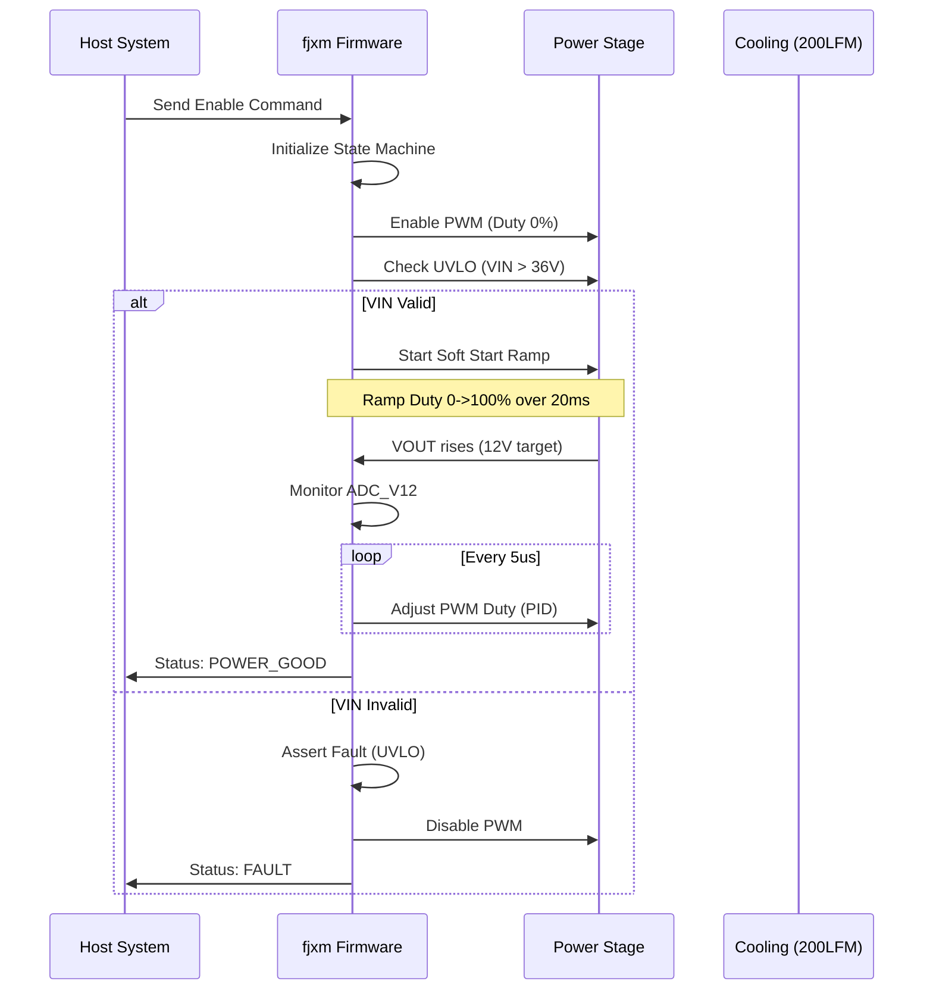

# Software Requirements Specification (SRS)
**Project:** fjxm Multi-Output Power Supply
**Version:** 1.0
**Date:** 2026-04-04
**Status:** Draft
**Standard:** IEEE 830-1998 / IEEE 29148:2018

---

## 1. Introduction

### 1.1 Purpose
This Software Requirements Specification (SRS) describes the functional and non-functional requirements for the **fjxm** embedded firmware. This firmware is responsible for the control, monitoring, and safety management of a 200W multi-output DC-DC power supply (48V Input to 12V/5V/3.3V Outputs). This document serves as the baseline for software design, implementation, and testing (V&V).

### 1.2 Scope
The firmware operates on the **fjxm** digital control platform (MCU-based). It manages the Active Clamp Forward Converter primary side control, secondary side linear post-regulation feedback, telemetry acquisition, and deterministic protection logic (OCP, OVP, UVP, OTP).
*   **In Scope:** Digital control loops, fault management, telemetry acquisition, communication interfaces (SPI/SMBus), and bootloader support.
*   **Out of Scope:** Host system GUI, high-level application layer running on the host system connected to the PSU.

### 1.3 Definitions, Acronyms, and Abbreviations

| Term | Definition |
| :--- | :--- |
| **ADC** | Analog-to-Digital Converter |
| **BOM** | Bill of Materials |
| **DSP** | Digital Signal Processing |
| **EMI** | Electromagnetic Interference |
| **FIFO** | First-In, First-Out buffer |
| **GPIO** | General Purpose Input/Output |
| **HRS** | Hardware Requirements Specification |
| **IRQ** | Interrupt Request |
| **LFM** | Linear Feet per Minute (Airflow) |
| **MCU** | Microcontroller Unit |
| **MIL-STD-1275** | 28V DC Military Vehicle Power Standard (Input transients) |
| **MIL-STD-461G** | EMC Standard |
| **MIL-STD-883** | Environmental Test Standard |
| **OCP** | Overcurrent Protection |
| **OVP** | Overvoltage Protection |
| **PID** | Proportional-Integral-Derivative (Control Loop) |
| **PWM** | Pulse Width Modulation |
| **RTOS** | Real-Time Operating System |
| **SRS** | Software Requirements Specification |
| **UVLO** | Under Voltage Lockout |
| **WDT** | Watchdog Timer |

### 1.4 References
1.  **fjxm Hardware Requirements Specification (P2)** (Rev 1.0)
2.  **fjxm Glue Logic Requirements (P6)** (Rev 1.0)
3.  IEEE Std 830-1998: IEEE Recommended Practice for Software Requirements Specifications.
4.  IEEE Std 29148-2018: Systems and software engineering — Life cycle processes — Requirements engineering.
5.  MIL-STD-461G: Requirements for the Control of Electromagnetic Interference Characteristics.
6.  MCU Datasheet: (Assumed ARM Cortex-M4F / 180MHz).

### 1.5 Overview
Section 2 provides a high-level description of the system architecture, operating modes, and user characteristics. Section 3 details the specific software requirements, including external interfaces, functional requirements (REQ-SW), performance constraints, and quality attributes. Section 4 outlines verification methods. Section 5 provides traceability to the hardware requirements.

---

## 2. Overall Description

### 2.1 Product Perspective
The **fjxm** firmware is an embedded real-time control system executing on a 32-bit MCU (ARM Cortex-M class). It interfaces directly with power stage hardware (gate drivers, op-amps, sensors) via high-speed GPIO, PWM, and ADC peripherals. The system operates autonomously once enabled but accepts configuration commands via a communication interface (e.g., SMBus/I2C).

**Architecture Context:**
*   **Hardware Layer:** Power electronics (FETs, Transformers), Analog Front End (Current sense amps, Voltage dividers).
*   **Firmware Layer:** Control loops (ISR based), Fault Handling (HW IRQ + SW Poll), State Machine.
*   **Host Interface:** Command/Status protocol.

### 2.2 Product Functions
1.  **Power Conversion Control:** Regulate PWM duty cycle to maintain 12V output within ±1% tolerance.
2.  **Post-Regulation:** Control Mag-amp/LDO reset timing to regulate 5V and 3.3V outputs.
3.  **Housekeeping:** Monitor input voltage, output voltages, currents, and board temperature.
4.  **Protection:** Detect and react to faults (OVP, OCP, UVLO, OTP, Reverse Polarity) within 10µs (hardware) to 5ms (software).
5.  **Communication:** Report telemetry and status to external host.

### 2.3 User Characteristics
*   **Primary User:** System Integrator / Host Processor. Interacts via digital communication bus (I2C/SPI) to query health and status.
*   **Secondary User:** Field Technician. Interacts via LED indicators (Pass/Fail status) for debugging.

### 2.4 Constraints
*   **MIL-STD-883:** Software must facilitate compliance (e.g., thermal cycling behaviors).
*   **MIL-STD-461G:** Switching frequency modulation (Spread Spectrum) must be implemented to minimize EMI.
*   **Timing:** Control loops must execute at a fixed frequency of 200 kHz (5µs period).
*   **Memory:** Must fit within 512KB Flash and 128KB RAM (Assumed MCU constraints).

### 2.5 Assumptions and Dependencies
*   The hardware provides clean, sampled ADC data valid at the start of the PWM cycle.
*   The 12V rail uses an Active Clamp Forward topology driven by a single PWM channel.
*   The 5V and 3.3V rails utilize mag-amp reset control driven by auxiliary PWM channels.
*   An external 3.3V LDO powers the MCU from the 5V rail.

---

## 3. Specific Requirements

### 3.1 External Interface Requirements

#### 3.1.1 Hardware Interfaces
The firmware interfaces with the Glue Logic and Power Stage via memory-mapped registers. The following C structures map to the hardware register definitions defined in the GLR (P6).

```c
/**
 * @brief Register Map Definition for ADC & PWM Peripherals
 * Based on fjxm GLR Specification
 */
typedef struct {
    __IO uint32_t CTRL;    // Control Register
    __IO uint32_t STATUS;  // Status Register
    __IO uint32_t DUTY;    // Duty Cycle Register (0-1000 -> 0-100%)
    __IO uint32_t PERIOD;  // Period Register
} PWM_Regs_t;

typedef struct {
    __IO uint32_t DATA;    // 12-bit ADC Result
    __IO uint32_t CFG;     // Config (Gain/Offset)
} ADC_Regs_t;

typedef struct {
    PWM_Regs_t PWM_12V;    // 0x4000_0000 - Primary Main Rail
    PWM_Regs_t PWM_5V;     // 0x4000_0100 - Mag-amp Reset 5V
    PWM_Regs_t PWM_3V3;    // 0x4000_0200 - Mag-amp Reset 3.3V
    ADC_Regs_t  ADC_VIN;   // 0x4000_0300 - Input Voltage Sense
    ADC_Regs_t  ADC_IIN;   // 0x4000_0304 - Input Current Sense
    ADC_Regs_t  ADC_V12;   // 0x4000_0308 - 12V Output Sense
    ADC_Regs_t  ADC_V5;    // 0x4000_030C - 5V Output Sense
    ADC_Regs_t  ADC_V33;   // 0x4000_0310 - 3.3V Output Sense
    ADC_Regs_t  ADC_TEMP;  // 0x4000_0314 - Board Temperature (NTC)
    uint32_t    RESERVED;  
    __IO uint32_t FAULTS;  // 0x4000_0400 - Fault Status Register (Latch)
} fjxm_Hardware_t;

#define fjxm_HW ((fjxm_Hardware_t*) 0x40000000)
```

#### 3.1.2 Software Interfaces

**API Signatures (Internal Firmware Modules):**

```c
/* Driver Layer */
void drv_pwm_init(uint32_t frequency_hz);
void drv_adc_start_conversion(uint8_t channel_mask);
uint16_t drv_adc_read(uint8_t channel);

/* Control Layer */
typedef enum {
    RAIL_12V = 0,
    RAIL_5V,
    RAIL_3V3
} RailId_t;

void control_loop_init(void);
void control_loop_update(void); // Called every 5us (200kHz)
void control_set_setpoint(RailId_t rail, float voltage);

/* Protection Layer */
typedef enum {
    ERR_NONE = 0,
    ERR_OCP_12V,    // Overcurrent 12V
    ERR_OVP_12V,    // Overvoltage 12V
    ERR_UVLO,       // Under Voltage Lock Out
    ERR_OTP,        // Over Temperature
    ERR_REVERSE_POLARITY
} ErrorCode_t;

void protection_monitor(void); // Called every 1ms
ErrorCode_t protection_get_last_fault(void);
```

#### 3.1.3 Communication Interfaces
*   **Protocol:** SMBus (I2C compatible).
*   **Address:** 0x48 (7-bit).
*   **Baudrate:** 400kHz.
*   **Commands:**
    *   `0x01`: Read VOUT (12V)
    *   `0x02`: Read IOUT (12V)
    *   `0x03`: Read Temperature
    *   `0x04`: Read Status Word
    *   `0x10`: Write Enable (Turn On/Off)

### 3.2 Functional Requirements

#### 3.2.1 Power Conversion Control
**REQ-SW-001 (Primary Control Loop):** The firmware shall implement a digital PID control loop executing at 200kHz (5µs period) to regulate the 12V output via the `PWM_12V` register.
*   *Trace:* REQ-HW-002, REQ-HW-021.
*   *Metric:* Jitter < 100ns.

**REQ-SW-002 (Post-Regulation):** The firmware shall generate complementary reset pulses for the 5V and 3.3V mag-amp regulators to maintain output stability within ±1% (REQ-HW-002).
*   *Trace:* REQ-HW-002.

**REQ-SW-003 (Soft Start):** Upon receiving the Enable command, the firmware shall ramp the PWM duty cycle from 0% to the operational setpoint over a period of 20ms ±5ms to limit inrush current.
*   *Trace:* REQ-HW-001.

#### 3.2.2 Monitoring (Telemetry)
**REQ-SW-004 (Voltage Telemetry):** The firmware shall sample `ADC_VIN`, `ADC_V12`, `ADC_V5`, and `ADC_V33` via oversampling (averaging 8 samples) at a rate of 1kHz and store the results in a global telemetry struct.
*   *Trace:* REQ-HW-001, REQ-HW-002.

**REQ-SW-005 (Current Telemetry):** The firmware shall calculate output current based on the differential ADC readings from the current sense amplifiers.
*   *Trace:* REQ-HW-008.

#### 3.2.3 Protection Logic
**REQ-SW-006 (Overcurrent Protection - OCP):** If the calculated current on any rail exceeds 120% of the nominal max (e.g., >14.4A for 12V) for a duration exceeding 5ms, the firmware shall set the `FAULTS` register, disable PWM outputs, and latch the system state (latch-off).
*   *Trace:* REQ-HW-008.
*   *Value:* 14.4A (12V), 9.6A (5V), 7.2A (3.3V). Response time < 10ms.

**REQ-SW-007 (Overvoltage Protection - OVP):** If any rail voltage exceeds 115% of nominal (13.8V for 12V), the firmware shall immediately shut down PWM generation within 50µs and assert the hardware fault pin.
*   *Trace:* REQ-HW-009.
*   *Value:* 13.8V, 5.75V, 3.8V.

**REQ-SW-008 (Under Voltage Lockout - UVLO):** The firmware shall monitor `ADC_VIN`. If `VIN < 36.0V`, the system shall disable operations. If `VIN < 38.0V` (Hysteresis), the system shall remain disabled.
*   *Trace:* REQ-HW-016.
*   *Value:* 36V Cut-off, 38V Resume.

**REQ-SW-009 (Reverse Polarity):** If `ADC_VIN` indicates a negative voltage (or > 60V but logic suggests reverse), the firmware enters a high-impedance state on all enable pins.
*   *Trace:* REQ-HW-015.

**REQ-SW-010 (Thermal Shutdown - OTP):** The firmware shall monitor `ADC_TEMP`. If temperature > 100°C, the system shall throttle PWM (reduce duty cycle by 50%). If temperature > 110°C, the system shall shut down (Latch-off).
*   *Trace:* Derived from MIL-STD-883 / Component limits.

#### 3.2.4 EMI Compliance Features
**REQ-SW-011 (Spread Spectrum Clocking):** To meet MIL-STD-461G RE102 requirements, the firmware shall modulate the switching frequency of the PWM by ±2% (198kHz - 202kHz) using a pseudo-random triangle profile generator.
*   *Trace:* REQ-HW-004 (EMI Requirement).

### 3.3 Performance Requirements
| Requirement ID | Metric | Value | Condition |
|---|---|---|---|
| PER-SW-001 | Control Loop Update Rate | 200 kHz | nominal operation |
| PER-SW-002 | Fault Response Time | < 50 µs | Hardware fast shutdown |
| PER-SW-003 | Telemetry Update Rate | 1 kHz | Main loop |
| PER-SW-004 | Communication Latency | < 5 ms | SMBus response |
| PER-SW-005 | Boot Time | < 100 ms | From 12V rail valid |

### 3.4 Design Constraints
*   **Language:** C99 (C++11 allowed for non-critical sections).
*   **Compiler:** ARM GCC 10.3 or higher.
*   **Stack Size:** Reserved 4KB minimum for Main Stack, 2KB for Interrupt Stack.
*   **Watchdog:** WDT must be serviced every 10ms in the background loop. Failure to feed triggers a hardware reset.

### 3.5 Software System Attributes

#### 3.5.1 Reliability
The software must detect a "hung" state via the Watchdog Timer and recover to a safe state (High Impedance outputs) within 20ms.

#### 3.5.2 Availability
The Mean Time Between Failures (MTBF) target for the firmware logic is > 100,000 hours (excluding hardware wear-out).

#### 3.5.3 Security
*   **Access Control:** SMBus commands shall utilize a simple checksum (CRC-8) to reject corrupted packets.
*   **Write Protection:** Critical OTP and Calibration bytes in Flash shall be write-protected after manufacturing test.

#### 3.5.4 Maintainability
The codebase shall be modular (HAL, Driver, App) with a Doxygen documentation coverage > 80%.

#### 3.5.5 Portability
Hardware Abstraction Layer (HAL) shall isolate silicon-specific register access from control logic algorithms to facilitate migration to other ARM Cortex-M variants.

---

## 4. Verification and Validation

### 4.1 Unit Test Requirements
*   **Test ID:** UT-SW-001. Verify PID output calculation for a fixed error input.
*   **Test ID:** UT-SW-002. Verify UVLO state machine transitions (36V/38V thresholds).
*   **Test ID:** UT-SW-003. Verify ADC to Voltage scaling math using fixed-point arithmetic.

### 4.2 Integration Test Requirements
*   **Test ID:** IT-SW-001. Connect MCU to a "Passive Load" test rig. Enable PWM and verify voltage rise time matches REQ-SW-003.
*   **Test ID:** IT-SW-002. Inject specific ADC values (using signal generator) to trigger OCP software logic (REQ-SW-006).

### 4.3 System Test Requirements
*   **Test ID:** ST-SW-001. Perform full thermal cycling (-40C to +85C) per MIL-STD-883. Verify software stability.
*   **Test ID:** ST-SW-002. Conduct conducted/radiated emissions test (MIL-STD-461G) with Spread Spectrum enabled (REQ-SW-011).

---

## 5. Traceability Matrix

| Software ID | Description | Trace to Hardware ID |
| :--- | :--- | :--- |
| **REQ-SW-001** | Primary Control Loop (12V) | REQ-HW-002, REQ-HW-021 |
| **REQ-SW-002** | Mag-amp Control (5V/3.3V) | REQ-HW-002 |
| **REQ-SW-003** | Soft Start Sequence | REQ-HW-001 |
| **REQ-SW-004** | Voltage Telemetry | REQ-HW-002, REQ-HW-009 |
| **REQ-SW-005** | Current Telemetry | REQ-HW-008 |
| **REQ-SW-006** | Overcurrent Protection (OCP) | REQ-HW-008 |
| **REQ-SW-007** | Overvoltage Protection (OVP) | REQ-HW-009 |
| **REQ-SW-008** | Under Voltage Lockout (UVLO) | REQ-HW-016 |
| **REQ-SW-009** | Reverse Polarity Handling | REQ-HW-015 |
| **REQ-SW-010** | Thermal Management (OTP) | REQ-HW-001 (Env) |
| **REQ-SW-011** | EMI Reduction (SSCG) | REQ-HW-004 |

---

## 6. Appendices

### Appendix A: Sequence Diagram - Normal Startup



### Appendix B: Error Codes

| Error Code | Name | Description |
| :--- | :--- | :--- |
| 0x00 | OK | System Normal |
| 0x01 | ERR_OCP_12V | Overcurrent on 12V Rail |
| 0x02 | ERR_OVP_12V | Overvoltage on 12V Rail |
| 0x03 | ERR_OCP_5V | Overcurrent on 5V Rail |
| 0x04 | ERR_OVP_5V | Overvoltage on 5V Rail |
| 0x05 | ERR_OCP_3V3 | Overcurrent on 3.3V Rail |
| 0x06 | ERR_OVP_3V3 | Overvoltage on 3.3V Rail |
| 0x10 | ERR_UVLO | Input Under Voltage |
| 0x11 | ERR_OTP | Over Temperature Shutdown |
| 0x12 | ERR_POLARITY | Reverse Polarity Detected |

### Appendix C: RTOS Task Mapping (Assumed FreeRTOS)

*   **TaskPwm (Priority 5):** 200kHz Timer IRQ. Drives the primary control loop. Minimal logic (ISR only).
*   **TaskControl (Priority 4):** 1kHz Periodic. Runs advanced PID math, Soft Start state machine.
*   **TaskMonitor (Priority 3):** 100Hz Periodic. Checks OVP, OCP, OTP averages.
*   **TaskComm (Priority 2):** Event driven. Handles SMBus/I2C commands.
*   **TaskBackground (Priority 1):** Continuous. Fault logging, LED flashing, Watchdog feed.