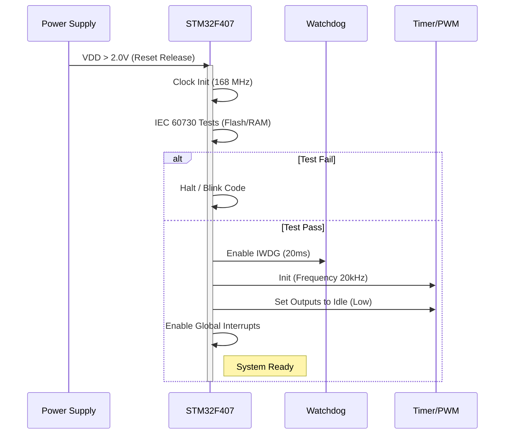
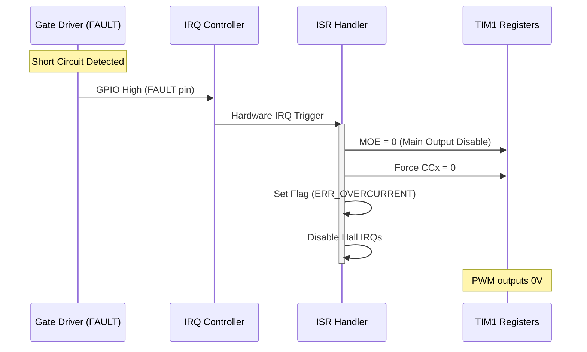

# Software Requirements Specification (SRS)
**Project:** fug 10kW BLDC Motor Controller
**Version:** 1.0
**Date:** 2026-04-02
**Status:** Preliminary
**Standard:** IEEE 830-1998 / IEEE 29148:2018

---

# 1. Introduction

## 1.1 Purpose
This document specifies the software and firmware requirements for the **fug** 10kW 3-Phase BLDC Motor Controller. It defines the functional behavior, performance constraints, safety mechanisms (IEC 60730 Class B), and interface definitions necessary to implement the control logic on the STM32F407VGT6 microcontroller. This SRS serves as the blueprint for firmware design, implementation, and verification.

## 1.2 Scope
The software scope includes:
*   **Kernel & Boot:** Hardware abstraction layer (HAL) initialization, clock configuration, and IEC 60730 Class B startup self-tests.
*   **Motor Control Loop:** 20 kHz high-speed control loop implementing 6-step trapezoidal commutation.
*   **Safety:** Real-time monitoring of voltage, current, and temperature; hardware fault reaction logic (Desaturation/OCP interlock).
*   **Communication:** Throttle input decoding, Hall sensor processing, and fault reporting.
*   **Diagnostics:** Data logging for system health monitoring.

## 1.3 Definitions, Acronyms, and Abbreviations

| Term | Definition |
| :--- | :--- |
| **API** | Application Programming Interface |
| **BLDC** | Brushless Direct Current |
| **DSP** | Digital Signal Processing |
| **FOC** | Field Oriented Control |
| **HAL** | Hardware Abstraction Layer |
| **HV** | High Voltage |
| **IRQ** | Interrupt Request |
| **MCU** | Microcontroller Unit |
| **OCP** | Over Current Protection |
| **OVLO** | Over Voltage Lock Out |
| **PWM** | Pulse Width Modulation |
| **RTOS** | Real-Time Operating System |
| **WDT** | Watchdog Timer |
| **UVLO** | Under Voltage Lock Out |
| **ISR** | Interrupt Service Routine |

## 1.4 References
1.  **IEEE 29148-2018:** Systems and software engineering — Life cycle processes — Requirements engineering.
2.  **ST-UM1052:** STM32F407xx Reference Manual.
3.  **IEC 60730-1:** Automatic Electrical Controls - Part 1: General Requirements (Class B Software).
4.  **fug Hardware Requirements Specification (P2):** REQ-HW-001 through REQ-HW-014.

## 1.5 Overview
The remainder of this document is organized as follows: Section 2 describes the system context and constraints. Section 3 details the specific software requirements, mapped to the hardware registers. Section 4 outlines verification criteria. Section 5 provides the traceability matrix.

---

# 2. Overall Description

## 2.1 Product Perspective
The **fug** firmware operates as a bare-metal/RTOS application on the STM32F407VGT6. It sits directly between the physical hardware (MOSFETs, Sensors) and the user (Throttle). The firmware is responsible for the high-speed timing required for 20 kHz switching and the safety-critical response times required for 10 kW power handling.

## 2.2 Product Functions
1.  **Power Stage Control:** Generate 6-state PWM sequences based on rotor position.
2.  **Telemetry:** Sample phase currents (shunts) and DC bus voltage via ADC.
3.  **Protection Logic:** Execute fault mitigation (shutdown) within 5 µs of hardware fault detection.
4.  **User Interface:** Decode PWM throttle signals (1-2 ms).
5.  **Compliance:** Execute IEC 60730 Class B self-tests (Clock, Flash, RAM) at startup and periodically.

## 2.3 User Characteristics
*   **End User:** Operates the vehicle via throttle. Expects smooth torque delivery and safe shutdown on faults.
*   **Integrator:** Configures vehicle parameters (max current, voltage limits) via configuration interface (CAN/UART - Phase 2).
*   **Safety Engineer:** Validates IEC 60730 compliance via logging and test points.

## 2.4 Constraints
*   **Real-Time Constraint:** Control loop must execute within 50 µs (20 kHz).
*   **Safety Constraint:** Fault reaction time < 5 µs.
*   **Environmental:** Software must operate reliably in -40°C to +85°C (handling watchdog resets due to timing drift).
*   **Memory:** STM32F407VGT6 provides 1MB Flash, 192KB RAM. Code must fit within 80% Flash capacity for bootloader/OTA overhead.

## 2.5 Assumptions and Dependencies
*   The Hardware provides accurate 3.3V level shifting for Hall sensors.
*   The 48V DC bus input is stabilized within the 36-60V range as per REQ-HW-001.
*   The PWM Throttle source is stable (jitter < 5%).

---

# 3. Specific Requirements

## 3.1 External Interface Requirements

### 3.1.1 Hardware Interfaces (Register Mapping & API)

#### A. Timer / PWM Interface (TIM1 Master)
The firmware controls the 3-phase bridge via TIM1 channels.
**C Struct Definition (Memory Mapped):**
```c
/**
 * @brief TIM1 Register Map for Phase Control
 * Base Address: 0x40010000
 */
typedef struct {
    __IO uint32_t CR1;    // Control Register 1 (CMS=011, ARPE=1)
    __IO uint32_t CR2;    // Control Register 2 (OIS1/2/3N bits)
    __IO uint32_t SMCR;   // Slave Mode Control
    __IO uint32_t DIER;   // DMA/Interrupt Enable
    __IO uint32_t SR;     // Status Register
    __IO uint32_t EGR;    // Event Generation
    __IO uint32_t CCMR1;  // Capture/Compare Mode 1 (PWM Mode 1)
    __IO uint32_t CCMR2;  // Capture/Compare Mode 2
    __IO uint32_t CCER;   // Capture/Compare Enable (CC1E, CC1NE)
    __IO uint32_t CNT;    // Counter
    __IO uint32_t PSC;    // Prescaler (APB2 / PSC)
    __IO uint32_t ARR;    // Auto-Reload Register (PWM Freq)
    __IO uint32_t RCR;    // Repetition Counter
    __IO uint32_t CCR1;   // Capture/Compare 1 (Phase U High)
    __IO uint32_t CCR2;   // Capture/Compare 2 (Phase V High)
    __IO uint32_t CCR3;   // Capture/Compare 3 (Phase W High)
} TIM_TypeDef_t;
```
**Driver API:**
```c
/**
 * @brief Initializes PWM for 20 kHz switching.
 * @param hz Frequency in Hz (Target: 20000).
 * @param dead_time_ns Dead time in nanoseconds (Target: 500ns).
 */
void PWM_Init(uint32_t hz, uint32_t dead_time_ns);

/**
 * @brief Sets the duty cycle for specific phase.
 * @param phase Phase ID (0=U, 1=V, 2=W).
 * @param duty Duty cycle 0.0 to 1.0.
 */
void PWM_SetDuty(uint8_t phase, float duty);

/**
 * @brief Forces PWM outputs Low immediately (Safety Shutdown).
 */
void PWM_Trip(void);
```

#### B. ADC Interface (Current & Voltage Sensing)
**C Struct Definition (ADC1):**
```c
typedef struct {
    __IO uint32_t SR;     // Status Register (OVR, AWD)
    __IO uint32_t CR1;    // Control Register 1 (AWDEN, OVRIE)
    __IO uint32_t CR2;    // Control Register 2 (SWSTART)
    __IO uint32_t SMPR1;  // Sample Time 1 (Cycles: 144)
    __IO uint32_t SMPR2;  // Sample Time 2
    __IO uint32_t JOFR1;  // Offset
    __IO uint32_t HTR;    // Watchdog High Threshold
    __IO uint32_t LTR;    // Watchdog Low Threshold
    __IO uint32_t SQR1;   // Regular Sequence (Length, Channels)
    __IO uint32_t DR;     // Data Register
} ADC_TypeDef_t;
```
**Driver API:**
```c
/**
 * @brief Configures ADC for Shunt and Bus measurements.
 * @param channel ADC Channel (0-2 for Shunts, 3 for Vbus).
 */
void ADC_InitSensor(uint8_t channel);

/**
 * @brief Reads Phase Current in Amperes.
 * @param phase Phase ID (0, 1, 2).
 * @return Current in Amps (Float).
 */
float ADC_ReadPhaseCurrent(uint8_t phase);
```

### 3.1.2 Software Interfaces
*   **CMSIS-Core:** STM32F4xx CMSIS interface for register access.
*   **IEC 60730 Library:** Internal self-test routines (Flash CRC, RAM March).

### 3.1.3 Communication Interfaces
*   **UART (Debug):** 115200 baud, 8N1. Used for logging faults and telemetry.
*   **GPIO (Hall):** 3x External Interrupt lines (EXTI0, EXTI1, EXTI2).

## 3.2 Functional Requirements

### REQ-SW-001: System Initialization
The firmware shall perform a cold-start initialization sequence within 100ms of power-up.
*   **Rationale:** Ensures hardware is in safe state before motor activation.
*   **Traceability:** REQ-HW-001 (DC Bus Input), REQ-HW-009 (IEC 60730).
*   **Logic:**
    1.  Enable Clocks (GPIO, TIM, ADC).
    2.  Run IEC 60730 Class B Tests (CPU Register, Flash, RAM).
    3.  Calibrate ADC Offset.
    4.  Enable Watchdog (IWDG).
*   **Prototype:** `void System_Init(void);`

### REQ-SW-002: DC Bus Monitoring (OVLO/UVLO)
The firmware shall continuously monitor DC Bus voltage. If V_BUS > 65.0V or V_BUS < 30.0V for > 100µs, the system shall set a Fault Flag and disable PWM.
*   **Rationale:** Protects capacitors and MOSFETs from voltage stress.
*   **Traceability:** REQ-HW-011.
*   **Algorithm:**
    *   Sample VBus ADC every 100µs.
    *   Apply low-pass filter: `V_Filt = V_Filt * 0.9 + V_New * 0.1`
    *   Check limits.
*   **Prototype:** `bool Mon_CheckVoltageLimits(void);`

### REQ-SW-003: PWM Throttle Decoding
The firmware shall decode the incoming throttle signal (1kHz-5kHz PWM) with a resolution of at least 10 bits.
*   **Traceability:** REQ-HW-003.
*   **Input:** 1.0ms (0%) to 2.0ms (100%).
*   **Fault:** If pulse width < 0.5ms or > 2.5ms, ignore input and set throttle to 0% (Safe State).
*   **Prototype:** `uint16_t Throttle_GetPercent(void);`

### REQ-SW-004: Hall Sensor Processing
The firmware shall determine the rotor sector (1-6) based on the 3-bit Hall state (HALL_U, HALL_V, HALL_W) using a lookup table.
*   **Traceability:** REQ-HW-004.
*   **Debounce:** No software debounce required (Schmitt triggers on HW), but input must be latched on change.
*   **Table:**
    *   101 = Sector 1
    *   001 = Sector 2
    *   011 = Sector 3
    *   010 = Sector 4
    *   110 = Sector 5
    *   100 = Sector 6
*   **Prototype:** `uint8_t Hall_GetSector(void);`

### REQ-SW-005: Commutation Control Loop
The firmware shall adjust the PWM output state based on Hall Sector changes to maintain 90° phase lead (Trapezoidal Control).
*   **Traceability:** REQ-HW-002, REQ-HW-014.
*   **Rate:** Update on Hall Edge interrupt.
*   **Mapping:**
    *   Sector 1: U-High, V-Low, W-Float
    *   Sector 2: U-High, W-Low, V-Float
    *   ...
*   **Prototype:** `void Commutation_Update(uint8_t sector);`

### REQ-SW-006: Overcurrent Protection (OCP) ISR
The firmware shall respond to the FAULT signal from the Gate Drivers within 5 µs.
*   **Traceability:** REQ-HW-010.
*   **Mechanism:** GPIO EXTI (Rising Edge) -> `PWM_Trip()`.
*   **State:** Transition to `STATE_FAULT`, latch error code `ERR_OVERCURRENT`.
*   **Requirement:** Code execution in ISR must not exceed 20 cycles (approx 250ns @ 168MHz) to meet hardware timing.

### REQ-SW-007: Current Control (Torque)
The firmware shall regulate motor phase current using a PI loop to match the Throttle command.
*   **Traceability:** REQ-HW-007 (Shunts).
*   **Input:** `Target_Current` (from Throttle), `Actual_Current` (from ADC).
*   **Output:** `PWM_Duty` (0% to 95%).
*   **Frequency:** Executed every 50µs (20 kHz) in ADC ISR.

### REQ-SW-008: Watchdog Service
The firmware shall service the Independent Watchdog (IWDG) every 10ms.
*   **Traceability:** REQ-HW-009.
*   **Timeout:** 20ms (Hardware).
*   **Action:** If loop hangs > 20ms, MCU resets, cutting PWM signals (Hardware default).

## 3.3 Performance Requirements

| ID | Metric | Min | Nominal | Max | Unit |
|---|---|---|---|---|---|
| PER-001 | Control Loop Freq | 18 | 20 | 22 | kHz |
| PER-002 | Current Sense Sampling Rate | - | 20 | - | kSps |
| PER-003 | Fault Response Time | - | 1 | 5 | µs |
| PER-004 | Throttle Latency | - | 10 | 50 | ms |
| PER-005 | Startup Time | - | - | 200 | ms |

## 3.4 Design Constraints
*   **Compiler:** GCC ARM Embedded (or IAR).
*   **C Standard:** C11 (Strict MISRA C compliance recommended).
*   **Stack Size:** Min 4KB allocated for Main/Interrupts.
*   **Heap:** Disabled (Static allocation only for safety).

## 3.5 Software System Attributes

### 3.5.1 Reliability
*   **Mean Time Between Failures (MTBF):** Target > 10,000 hours.
*   **Error Detection:** All function pointers and RAM variables used in control logic must be CRC checked periodically (IEC 60730).

### 3.5.2 Availability
*   The system shall be available to run the motor within 500ms of valid key-on.

### 3.5.3 Security
*   Firmware Read-Out Protection (RDP) Level 1 enabled.
*   No dynamic code execution.

### 3.5.4 Maintainability
*   All errors must be logged to a non-volatile memory register (Backup SRAM) with a timestamp for post-mortem analysis.

### 3.5.5 Portability
*   Hardware Abstraction Layer (HAL) shall separate STM32 specific code from generic Motor Control Logic.

---

# 4. Verification and Validation

## 4.1 Unit Test Requirements
*   **UT-001:** Verify `Hall_GetSector` returns correct sector 0-7 for all 8 combinations of 3-bit input.
*   **UT-002:** Verify `Mon_CheckVoltageLimits` triggers fault when ADC input corresponds to 66V and 29V.

## 4.2 Integration Test Requirements
*   **IT-001:** Connect STM32 to Gate Driver board. Verify PWM outputs are 3-phase complementary with dead-time insertion (measured on Oscilloscope).
*   **IT-002:** Inject signal into FAULT pin. Verify ISR fires and `PWM_Trip()` drops outputs to 0V within 5µs.

## 4.3 System Test Requirements
*   **ST-001:** Connect to 10kW Motor.
    1.  Apply 10% throttle. Verify motor spins.
    2.  Apply 100% throttle. Verify current does not exceed 210A (RMS) continuous limit (via current shunt logging).

---

# 5. Traceability Matrix

| Software ID | Requirement Description | Hardware ID | Verification Method |
| :--- | :--- | :--- | :--- |
| **REQ-SW-001** | Init & Self-Test | REQ-HW-009, REQ-HW-001 | Unit Test (UT) |
| **REQ-SW-002** | OVLO/UVLO Monitoring | REQ-HW-011, REQ-HW-001 | IT, HIL |
| **REQ-SW-003** | Throttle Decode | REQ-HW-003 | UT |
| **REQ-SW-004** | Hall Sensor Logic | REQ-HW-004 | UT |
| **REQ-SW-005** | Commutation Logic | REQ-HW-002, REQ-HW-014 | ST (System Test) |
| **REQ-SW-006** | OCP Fault Reaction | REQ-HW-010, REQ-HW-007 | IT, Oscilloscope |
| **REQ-SW-007** | PI Current Control | REQ-HW-007, REQ-HW-002 | ST, Dyno |
| **REQ-SW-008** | Watchdog Service | REQ-HW-009 | UT, Fault Injection |

---

# 6. Appendices

## Appendix A: Mermaid Sequence Diagrams

### 1. System Startup Sequence


### 2. Overcurrent Fault Reaction (Safety Critical)


## Appendix B: Error Codes
```c
typedef enum {
    ERR_NONE = 0x00,
    ERR_OVERVOLTAGE = 0x01,   // Vbus > 65V
    ERR_UNDERVOLTAGE = 0x02,  // Vbus < 30V
    ERR_OVERCURRENT = 0x04,   // Hardware Fault Latch
    ERR_HALL_SENSOR = 0x08,   // Invalid Hall State (000 or 111)
    ERR_THROTTLE = 0x10,      // Signal loss > 100ms
    ERR_WATCHDOG = 0x20,      // Reset caused by WDT
    ERR_CPU_SELFTEST = 0x40   // IEC 60730 Fail
} SystemErrorCode_t;
```