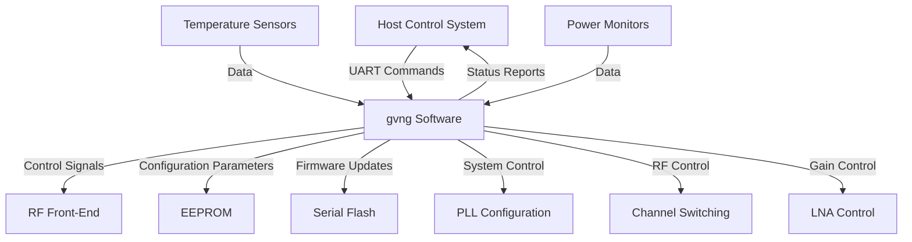

# Software Requirements Specification (SRS)

## Document Control
| Version | Date | Author | Changes |
|---------|------|--------|---------|
| 1.0 | 19 April 2026 | — | Initial Release |

---

# 1. Introduction

## 1.1 Purpose
This Software Requirements Specification (SRS) defines the detailed software requirements for the gvng embedded system, an 8-channel RF front-end designed for Electronic Warfare (EW), Electronic Support Measures (ESM), and Electronic Intelligence (ELINT) applications. The specification provides comprehensive requirements for the firmware that will control the RF front-end hardware, monitor system parameters, and interface with external systems.

This document serves as a formal agreement between all stakeholders regarding the software requirements for the gvng system. It will be used by firmware engineers, system architects, test engineers, and integration teams to ensure the final software implementation meets all specified functional and performance requirements. This SRS follows the IEEE 29148:2018 standard for systems and software engineering requirements and will be maintained throughout the product lifecycle, from initial development through maintenance and updates.

## 1.2 Scope
This specification covers all software components and systems required to implement the gvng 8-channel RF front-end control software, including:

1. **System initialization and boot sequence**
   - Power-on self-test (POST)
   - Hardware initialization
   - Configuration loading
   - System health checks

2. **Hardware abstraction layer (HAL) for all peripherals**
   - UART communication interface
   - SPI interface for external memory
   - I2C interface for sensors and monitoring
   - GPIO control for system functions
   - PLL configuration and management

3. **RF front-end control software**
   - Channel switching control
   - Gain adjustment for LNA
   - Filter band selection
   - RF parameter monitoring

4. **System monitoring and protection**
   - Temperature monitoring and alert handling
   - Power monitoring and protection
   - Watchdog timer management
   - Fault detection and recovery

5. **Configuration management**
   - Parameter storage in EEPROM
   - Firmware update from external flash
   - Calibration data management

6. **Communication interfaces**
   - UART command/response protocol
   - Status reporting
   - Diagnostic information

This specification does not include requirements for downstream processing software, applications that consume the RF front-end output, or external user interfaces that are not directly part of the embedded control software.

## 1.3 Definitions, Acronyms, and Abbreviations

### 1.3.1 Definitions

| Term | Definition |
|------|------------|
| Antenna Array | A collection of multiple antennas that can be simultaneously connected to the RF front-end system for signal reception across multiple channels. |
| Calibration Data | Sets of parameters used to correct for manufacturing variations and component tolerances, stored in non-volatile memory and loaded during initialization. |
| Channel Selection | The process of routing one or more of the 8 available RF input channels to the output of the RF front-end system. |
| Electronic Intelligence (ELINT) | Intelligence derived from non-communications electromagnetic radiations emanating from foreign targets. |
| Electronic Support Measures (ESM) | Actions taken to search for, intercept, identify, and locate sources of radiated electromagnetic energy for the purpose of immediate threat recognition. |
| Electronic Warfare (EW) | Military action involving the use of electromagnetic energy to control the electromagnetic spectrum or to attack an enemy. |
| Gain Stages | Amplifier circuits that provide signal amplification in the RF front-end chain, controlled by software via DAC or digital interfaces. |
| Hardware Abstraction Layer (HAL) | A software layer that provides a standardized interface to hardware components, abstracting the details of hardware-specific implementations. |
| Power-on Self-Test (POST) | A sequence of tests performed by the system during startup to verify that all hardware components are functioning correctly. |
| Real-Time Operating System (RTOS) | An operating system designed for real-time applications that provides predictable response times and deterministic behavior. |
| Watchdog Timer | A hardware timer that automatically resets the system if the software fails to periodically "pet" (reset) the timer, indicating the system is operating correctly. |

### 1.3.2 Acronyms and Abbreviations

| Acronym | Definition |
|---------|------------|
| SRS | Software Requirements Specification |
| HRS | Hardware Requirements Specification |
| GLR | Glue Logic Requirements |
| StRS | Stakeholder Requirements Specification |
| SyRS | System Requirements Specification |
| RTOS | Real-Time Operating System |
| HAL | Hardware Abstraction Layer |
| BSP | Board Support Package |
| ISR | Interrupt Service Routine |
| MISRA | Motor Industry Software Reliability Association |
| UART | Universal Asynchronous Receiver/Transmitter |
| SPI | Serial Peripheral Interface |
| I2C | Inter-Integrated Circuit |
| GPIO | General Purpose Input/Output |
| ADC | Analog-to-Digital Converter |
| DAC | Digital-to-Analog Converter |
| DMA | Direct Memory Access |
| FIFO | First-In, First-Out |
| NVM | Non-Volatile Memory |
| CRC | Cyclic Redundancy Check |
| WDT | Watchdog Timer |
| PLL | Phase-Locked Loop |
| MCU | Microcontroller Unit |
| FPGA | Field-Programmable Gate Array |
| API | Application Programming Interface |
| BSS | Block Start Symbol (memory section) |
| RTM | Real-Time Monitor |
| JTAG | Joint Test Action Group |
| QSPI | Quad Serial Peripheral Interface |
| TRP | Transmit/Receive Protection |
| ConOps | Concept of Operations |
| ASIL | Automotive Safety Integrity Level |
| SIL | Safety Integrity Level |
| IPC | Inter-Process Communication |
| RPC | Remote Procedure Call |
| LNA | Low-Noise Amplifier |
| IIP3 | Third-Order Input Intercept Point |
| MDS | Minimum Detectable Signal |
| SNR | Signal-to-Noise Ratio |
| EW | Electronic Warfare |
| ESM | Electronic Support Measures |
| ELINT | Electronic Intelligence |
| SMP | Sub-Miniature version P (connector) |
| VSWR | Voltage Standing Wave Ratio |
| PCB | Printed Circuit Board |
| RMS | Root Mean Square |
| TWT | Traveling Wave Tube |
| T/R | Transmit/Receive |
| TX | Transmit |
| RX | Receive |
| GHz | Gigahertz |
| MHz | Megahertz |
| dB | Decibel |
| dBm | Decibel relative to one milliwatt |
| W | Watt |
| V | Volt |
| A | Ampere |
| Ω | Ohm |
| °C | Degrees Celsius |

## 1.4 References

1. IEEE 29148:2018, Systems and software engineering — Life cycle processes — Requirements Engineering
2. IEEE 830-1998, Recommended Practice for Software Requirements Specifications
3. IEEE 1016-2009, Software Design Descriptions
4. MISRA C:2012, Guidelines for the Use of the C Language in Critical Systems
5. IEC 61508, Functional Safety of E/E/PE Safety-related Systems
6. Hardware Requirements Specification (HRS) — gvng project
7. Glue Logic Requirements (GLR) — gvng project
8. XC7Z020-1CLG400C Zynq-7000 SoC FPGA Datasheet
9. AT25SF161 Serial Configuration Flash Datasheet
10. 24LC256 Serial EEPROM Datasheet
11. PE8135 8:1 GaAs RF Switch Datasheet
12. CGH40010F GaN HEMT LNA Datasheet
13. TMP100 Digital Temperature Sensor Datasheet
14. INA219 Current/Voltage Monitoring IC Datasheet
15. Project Block Diagram (P1)

## 1.5 Overview
This document is structured to provide a comprehensive specification of the software requirements for the gvng embedded system. The document follows the IEEE 830-1998 / IEEE 29148:2018 standard structure and is organized as follows:

- **Section 1: Introduction** provides the purpose, scope, definitions, and references for this document.
- **Section 2: Overall Description** describes the product perspective, functions, user characteristics, constraints, and assumptions about the system.
- **Section 3: Specific Requirements** contains detailed functional, interface, performance, and design requirements.
- **Section 4: Verification and Validation** outlines the testing approach for validating that the requirements are met.
- **Section 5: Requirements Traceability Matrix** provides traceability from software requirements to hardware and system requirements.
- **Section 6: Appendices** contain supplementary information including error codes, register maps, diagrams, and revision history.

The functional requirements in Section 3 are organized by subsystem, with each requirement numbered (REQ-SW-xxx) and including traceability to hardware requirements, priority, and verification method. Non-functional requirements address performance, reliability, security, and maintainability aspects.

# 2. Overall Description

## 2.1 Product Perspective
The gvng software system is a critical component of the 8-channel RF front-end hardware system, designed for military-grade electronic warfare applications. The software runs on the XC7Z020-1CLG400C Zynq-7000 SoC FPGA and controls all aspects of the RF front-end operation, including channel switching, gain control, and parameter monitoring.

The software interfaces directly with the following hardware components:
- RF switching matrix (PE8135) for channel selection
- GaN HEMT LNA (CGH40010F) for gain control
- Ceramic pre-select filters for band selection
- Temperature sensors (TMP100) for thermal monitoring
- Power monitors (INA219) for voltage and current monitoring
- Serial EEPROM (24LC256) for configuration storage
- Serial Flash (AT25SF161) for firmware updates
- UART interface for external control

The software system operates in a real-time environment, responding to both external commands and internal system events (such as temperature alerts or power faults). The architecture consists of multiple layers:

1. **Hardware Abstraction Layer (HAL)**: Provides interfaces to all hardware peripherals
2. **Driver Layer**: Implements specific functionality for each component
3. **Application Layer**: Implements the overall system logic and coordination
4. **Communication Layer**: Handles protocol parsing and response generation

The system context diagram below illustrates how the software interacts with external systems and hardware components.



## 2.2 Product Functions
The gvng software system implements the following major functions:

1. **System initialization and boot sequence**
   - Power-on self-test (POST) verification
   - Hardware initialization (clocks, peripherals)
   - Configuration loading from EEPROM
   - PLL configuration for system clock
   - LED status indication during startup

2. **Hardware abstraction layer (HAL) for each peripheral**
   - UART driver for communication interface
   - SPI driver for external memory access
   - I2C driver for sensor communication
   - GPIO driver for system control signals
   - Timer/Watchdog driver for system timing

3. **UART command/response handler**
   - Single register read/write commands
   - Bulk register read/write commands
   - Command validation and error handling
   - Protocol implementation as specified in GLR

4. **PLL configuration and lock management**
   - PLL initialization and configuration
   - Lock status monitoring
   - Clock switching capability

5. **Temperature monitoring and alert handling**
   - Periodic temperature sensor readings
   - Temperature threshold monitoring
   - Alert generation for critical temperatures
   - Thermal protection actions

6. **Voltage/current monitoring**
   - Power rail voltage monitoring
   - Current consumption monitoring
   - Fault detection and reporting

7. **EEPROM read/write driver**
   - Parameter storage and retrieval
   - Configuration management
   - Data integrity verification

8. **Configuration Flash driver**
   - Firmware update capability
   - Sector erase, write, read operations
   - Verification of programmed data

9. **LED and GPIO control**
   - System status indication via LEDs
   - Hardware control via GPIO
   - Debug signal generation

10. **Watchdog timer management**
    - Watchdog initialization
    - Regular watchdog "petting"
    - Timeout handling and recovery

11. **JTAG/debug interface support**
    - Debug information output
    - In-circuit debugging support
    - Runtime status reporting

12. **Power-on self-test (POST)**
    - RAM test (BIST)
    - Peripheral communication test
    - PLL lock verification
    - Configuration validation

13. **Error logging and fault handling**
    - Fault detection and classification
    - Error logging to EEPROM
    - System recovery procedures

14. **RF control functions**
    - Channel selection for 8:1 RF switch
    - Gain control for GaN HEMT LNA
    - Filter band selection
    - RF parameter monitoring and reporting

15. **Calibration data management**
    - Loading calibration data from EEPROM/Flash
    - Application of calibration coefficients
    - Validation of calibration data integrity

## 2.3 User Characteristics
The gvng software is designed to be used by several types of users with different expertise levels and requirements:

1. **Firmware Engineers** (Primary Developers)
   - Responsible for implementing, testing, and maintaining the software
   - Need detailed hardware interface specifications and driver APIs
   - Require low-level access for debugging and optimization
   - Benefit from comprehensive error reporting and diagnostic capabilities

2. **Test Engineers** (System-Level Testing)
   - Responsible for validating system functionality and performance
   - Require comprehensive test interfaces and status reporting
   - Benefit from programmable parameters and controlled testing modes
   - Need detailed logging and traceability of system events

3. **Field Engineers** (Maintenance and Diagnostics)
   - Responsible for system deployment, maintenance, and troubleshooting
   - Require remote diagnostic capabilities via UART interface
   - Benefit from detailed status reporting and error logging
   - Need firmware update capability in the field

4. **System Integrators** (Integration with Larger Systems)
   - Responsible for integrating the gvng system into larger EW platforms
   - Require well-defined communication protocols and interfaces
   - Benefit from comprehensive status reporting and health monitoring
   - Need precise control over system parameters and operating modes

5. **End Users** (Military Operators)
   - Responsible for operating the system in tactical environments
   - Require intuitive control interfaces and clear status indications
   - Benefit from automated parameter optimization and protection features
   - Need robust operation under extreme environmental conditions

## 2.4 Constraints
The gvng software system is subject to the following constraints:

1. **MISRA-C:2012 Compliance**: All software code must comply with the MISRA-C:2012 guidelines for the use of the C language in critical systems, with specific focus on reliability and safety aspects.

2. **Real-Time Response Constraints**:
   - UART command response time: ≤ 10ms for simple commands
   - Temperature alert response time: ≤ 100ms
   - Watchdog timeout: 500ms
   - PLL lock acquisition: ≤ 500ms
   - Critical fault handling: ≤ 50ms

3. **Memory Budget**:
   - Flash memory usage: ≤ 50% of available 16Mb Flash (8Mb maximum)
   - RAM usage: ≤ 80% of available RAM (384Kb maximum)
   - Stack usage per task: ≤ 4Kb

4. **Clock Frequency Constraints**:
   - System clock: 125MHz ± 1%
   - UART baud rate: 115200 bps ± 2%
   - SPI clock: ≤ 50MHz for external memory

5. **Execution Model**:
   - Real-time operating system (RTOS) required for task scheduling
   - Priority-based task scheduling with at least 5 priority levels
   - Maximum interrupt latency: ≤ 20µs

6. **Coding Language**:
   - Primary language: C (C99 standard)
   - Assembly language only for critical timing routines
   - No C++ or higher-level languages allowed

7. **Toolchain Requirements**:
   - Development toolchain: Xilinx SDK for Zynq
   - Compiler: GCC (version 9.3 or later)
   - Static analysis tools: PC-lint or equivalent for MISRA compliance checking
   - Version control: Git-based system with mandatory code reviews

8. **Hardware Revision Compatibility**:
   - Software must support hardware revisions A, B, and C
   - Configuration data must include hardware version detection
   - Runtime adaptation for hardware variations

9. **Environmental Constraints**:
   - Operating temperature: -55°C to +125°C
   - Vibration and shock resistance per MIL-STD-810
   - EMI/EMC compliance per MIL-STD-461

10. **Reliability Constraints**:
    - System availability: ≥ 99.9%
    - Mean time between failures (MTBF): ≥ 10,000 hours
    - Fault detection coverage: ≥ 95%

## 2.5 Assumptions and Dependencies
The gvng software system makes the following assumptions and dependencies:

1. **Hardware Behavior Assumptions**:
   - Power sequencing is complete before software execution begins
   - All clocks are stable before peripheral initialization
   - Hardware reset is asserted during power-up and held for appropriate duration
   - JTAG interface is available during development and manufacturing
   - Component values match those specified in the hardware design

2. **Operating Environment Assumptions**:
   - System operates within specified temperature range (-55°C to +125°C)
   - Input power is within specified voltage range (±10% of 12V)
   - Electromagnetic environment meets MIL-STD-461 requirements
   - Mechanical environment meets MIL-STD-810 requirements

3. **Timing Assumptions**:
   - UART communication timing parameters match those specified in GLR
   - SPI and I2C clock frequencies do not exceed device specifications
   - Interrupt service routines complete within worst-case time budget

4. **Dependency on External Systems**:
   - Host system provides correct UART commands according to protocol specification
   - Firmware updates are provided in correct format and validated before application
   - Calibration data is available and valid at system startup

5. **Software Dependencies**:
   - Board Support Package (BSP) provides low-level hardware initialization
   - RTOS provides scheduling, synchronization, and communication services
   - Standard C library provides basic functionality (string operations, math, etc.)

6. **System State Assumptions**:
   - System starts in a well-defined power-on state
   - Configuration data is valid and complete
   - Hardware components are functional at startup

7. **Safety Assumptions**:
   - Hardware protection circuits are functional and independent of software
   - Critical failures are handled gracefully without damage to system or hardware
   - Watchdog timer provides ultimate system recovery capability

# 3. Specific Requirements

## 3.1 External Interface Requirements

### 3.1.1 Hardware Interfaces
The gvng software system interfaces with multiple hardware components through standardized interfaces. Each interface is defined below with register maps, driver APIs, and error handling procedures.

#### 3.1.1.1 UART Interface
The UART interface is the primary communication channel for external control of the gvng system. It implements a register-based command protocol as specified in the GLR document.

```c
typedef struct {
    volatile uint16_t BAUD_DIV;    // 0x0100: Baud rate divisor (read/write)
    volatile uint16_t CTRL;        // 0x0101: Control register (read/write)
    volatile uint16_t STATUS;      // 0x0102: Status register (read-only)
    volatile uint16_t TX_COUNT;    // 0x0103: TX FIFO count (read-only)
    volatile uint16_t RX_COUNT;    // 0x0104: RX FIFO count (read-only)
    volatile uint16_t DATA;        // 0x0105: Data register (read/write)
} UART_RegMap_t;

// Driver API
/**
 * @brief Initialize UART peripheral with specified baud rate
 * @param baud_rate Desired baud rate (e.g., 115200)
 * @return int32_t 0 on success, error code on failure
 */
int32_t UART_Init(uint32_t baud_rate);

/**
 * @brief Write a 16-bit value to a UART register
 * @param addr Register address (0x0100-0x0105)
 * @param data 16-bit data to write
 * @return int32_t 0 on success, error code on failure
 */
int32_t UART_WriteReg(uint16_t addr, uint16_t data);

/**
 * @brief Read a 16-bit value from a UART register
 * @param addr Register address (0x0100-0x0105)
 * @param data Pointer to store the read data
 * @return int32_t 0 on success, error code on failure
 */
int32_t UART_ReadReg(uint16_t addr, uint16_t *data);

/**
 * @brief Write multiple 16-bit values to consecutive UART registers
 * @param start_addr Starting register address
 * @param data Pointer to array of 16-bit data values
 * @param count Number of registers to write (max 64)
 * @return int32_t 0 on success, error code on failure
 */
int32_t UART_BulkWrite(uint16_t start_addr, const uint16_t *data, uint8_t count);

/**
 * @brief Read multiple 16-bit values from consecutive UART registers
 * @param start_addr Starting register address
 * @param buf Pointer to buffer to store read data
 * @param count Number of registers to read (max 64)
 * @return int32_t 0 on success, error code on failure
 */
int32_t UART_BulkRead(uint16_t start_addr, uint16_t *buf, uint8_t count);
```

**Error Handling and Recovery**:
- UART timeouts trigger automatic interface reset
- Communication errors logged to fault buffer
- Automatic retry for transient errors (max 3 attempts)
- Interface re-initialization on persistent errors

#### 3.1.1.2 SPI Interface (EEPROM/Flash)
The SPI interface provides communication with external memory devices, including configuration EEPROM and firmware Flash memory.

```c
typedef struct {
    volatile uint16_t CTRL;        // 0x0200: Control register (read/write)
    volatile uint16_t ADDR;        // 0x0201: Address register (read/write)
    volatile uint16_t DATA;        // 0x0202: Data register (read/write)
    volatile uint16_t STATUS;      // 0x0203: Status register (read-only)
} SPI_RegMap_t;

// Driver API
/**
 * @brief Initialize SPI peripheral with specified clock and mode
 * @param clock_hz SPI clock frequency in Hz
 * @param mode SPI mode (0-3)
 * @return int32_t 0 on success, error code on failure
 */
int32_t SPI_Init(uint32_t clock_hz, uint8_t mode);

/**
 * @brief Read a byte from EEPROM at specified address
 * @param addr 16-bit EEPROM address
 * @param data Pointer to store the read byte
 * @return int32_t 0 on success, error code on failure
 */
int32_t EEPROM_ReadByte(uint16_t addr, uint8_t *data);

/**
 * @brief Write a byte to EEPROM at specified address
 * @param addr 16-bit EEPROM address
 * @param data Byte to write
 * @return int32_t 0 on success, error code on failure
 */
int32_t EEPROM_WriteByte(uint16_t addr, uint8_t data);

/**
 * @brief Read a sector from Flash memory
 * @param addr 32-bit Flash address (aligned to sector boundary)
 * @param buf Pointer to buffer to store data
 * @param len Length of data to read (must be ≤ sector size)
 * @return int32_t 0 on success, error code on failure
 */
int32_t Flash_ReadSector(uint32_t addr, uint8_t *buf, uint32_t len);

/**
 * @brief Write data to Flash memory sector
 * @param addr 32-bit Flash address (aligned to sector boundary)
 * @param buf Pointer to data buffer
 * @param len Length of data to write (must be ≤ sector size)
 * @return int32_t 0 on success, error code on failure
 */
int32_t Flash_WriteSector(uint32_t addr, const uint8_t *buf, uint32_t len);

/**
 * @brief Erase a sector in Flash memory
 * @param addr 32-bit Flash address (aligned to sector boundary)
 * @return int32_t 0 on success, error code on failure
 */
int32_t Flash_EraseSector(uint32_t addr);
```

**Error Handling and Recovery**:
- SPI timeouts trigger automatic interface reset
- Write/erase operations include verification steps
- Automatic retry for transient errors (max 3 attempts)
- CRC verification for all Flash writes
- Error status register for detailed fault information

#### 3.1.1.3 I2C Interface (Temperature/Power Monitoring)
The I2C interface provides communication with temperature sensors and power monitoring circuits.

```c
// Driver API
/**
 * @brief Initialize I2C peripheral with specified clock frequency
 * @param clock_hz I2C clock frequency in Hz
 * @return int32_t 0 on success, error code on failure
 */
int32_t I2C_Init(uint32_t clock_hz);

/**
 * @brief Read 8-bit value from I2C device register
 * @param dev_addr 7-bit I2C device address
 * @param reg_addr 8-bit register address
 * @param data Pointer to store the read data
 * @return int32_t 0 on success, error code on failure
 */
int32_t I2C_ReadReg8(uint8_t dev_addr, uint8_t reg, uint8_t *data);

/**
 * @brief Write 8-bit value to I2C device register
 * @param dev_addr 7-bit I2C device address
 * @param reg_addr 8-bit register address
 * @param data 8-bit data to write
 * @return int32_t 0 on success, error code on failure
 */
int32_t I2C_WriteReg8(uint8_t dev_addr, uint8_t reg, uint8_t data);

/**
 * @brief Read temperature from specified temperature sensor
 * @param sensor_id Sensor identifier (0-3)
 * @param temp_degC Pointer to store temperature in degrees Celsius
 * @return int32_t 0 on success, error code on failure
 */
int32_t TempSensor_ReadTemp(uint8_t sensor_id, float *temp_degC);

/**
 * @brief Read voltage from specified power monitoring channel
 * @param channel Channel identifier (0-5)
 * @param voltage_V Pointer to store voltage in Volts
 * @return int32_t 0 on success, error code on failure
 */
int32_t PowerMon_ReadVoltage(uint8_t channel, float *voltage_V);

/**
 * @brief Read current from specified power monitoring channel
 * @param channel Channel identifier (0-5)
 * @param current_A Pointer to store current in Amperes
 * @return int32_t 0 on success, error code on failure
 */
int32_t PowerMon_ReadCurrent(uint8_t channel, float *current_A);
```

**Error Handling and Recovery**:
- I2C timeouts trigger automatic interface reset
- Sensor read failures trigger retry attempts
- Automatic error logging for persistent communication failures
- Sensor status monitoring with fault detection

### 3.1.2 Software Interfaces
The gvng software system interfaces with both the underlying operating system and higher-level software components through well-defined APIs.

#### Operating System Interface
The software relies on the following RTOS services:
- Task scheduling and management
- Semaphore and mutex for synchronization
- Message queue for inter-task communication
- Timer services for periodic operations
- Interrupt handling services

#### Standard C Library Usage
The software uses the following standard C library functions:
- Memory operations (memcpy, memset, memcmp)
- String operations (strlen, strcpy, strcmp, sprintf)
- Math operations (fixed-point arithmetic for embedded systems)
- Standard I/O (limited debug output capability)

#### Logging Framework Interface
```c
/**
 * @brief Log a message with specified severity level
 * @param severity Log severity level (LOG_DEBUG, LOG_INFO, LOG_WARN, LOG_ERROR, LOG_FATAL)
 * @param format Format string for the log message
 * @param ... Variable arguments for format string
 * @return void
 */
void Log_Message(uint8_t severity, const char *format, ...);

/**
 * @brief Log a system event with timestamp
 * @param event_id Event identifier
 * @param event_data Additional event data (32-bit value)
 * @return void
 */
void Log_Event(uint16_t event_id, uint32_t event_data);
```

### 3.1.3 Communication Interfaces
The UART interface implements a register-based command protocol for external control of the gvng system. The protocol allows for single register access and bulk register access through a well-defined frame format.

#### Frame Formats
The UART communication protocol uses the following frame formats:

| Command | CMD byte | Frame Structure | Response |
|---------|----------|-----------------|----------|
| Single Write | 0x57 ('W') | [0x57][ADDR_H][ADDR_L][DATA_H][DATA_L] | [0x06] ACK |
| Single Read  | 0x52 ('R') | [0x52][ADDR_H\|0x80][ADDR_L] | [DATA_H][DATA_L] |
| Bulk Write   | 0x42 ('B') | [0x42][ADDR_H][ADDR_L][N][D0_H][D0_L]...[Dn_H][Dn_L] | [0x06] ACK |
| Bulk Read    | 0x62 ('b') | [0x62][ADDR_H\|0x80][ADDR_L][N] | [D0_H][D0_L]...[Dn_H][Dn_L] |
| Error NAK    | 0x15 | Sent by FPGA on invalid command/address | — |

#### Protocol Details:
- **Address Space**: 16-bit (0x0000–0xFFFF); read addresses have bit15 set (OR 0x8000)
- **Maximum Bulk Count**: N ≤ 64 registers per transaction
- **Timeout**: Host must respond within 10ms; FPGA resets parser after 50ms inter-byte gap
- **ACK Byte**: 0x06; NAK Byte: 0x15
- **Error Handling**: Invalid commands or addresses generate NAK response
- **CRC**: CRC-16 CCITT optional (feature flag in config flash)
- **Endianness**: All multi-byte values in big-endian format (MSB first)

#### Register Access Rules:
- Read access to write-only registers returns 0x0000
- Write access to read-only registers is ignored
- Bulk operations must be to consecutive addresses
- Address must be aligned to data size for bulk operations

#### Error Handling:
- Protocol errors generate NAK response (0x15)
- Communication errors logged to system fault buffer
- Automatic retry on transient errors (max 3 attempts)
- Interface reset on persistent errors

## 3.2 Functional Requirements

### 3.2.1 System Initialization (REQ-SW-001 to REQ-SW-010)

REQ-SW-001: The software SHALL complete power-on self-test within 500ms of reset de-assertion.  
**Source**: REQ-HW-012 (Environmental Requirements)  
**Priority**: [M]andatory  
**Verification**: [T]est

REQ-SW-002: The software SHALL verify BOARD_ID register matches expected value 0x4756 on startup; fault if mismatch.  
**Source**: GLR §4 (Module Overview)  
**Priority**: [M]andatory  
**Verification**: [T]est

REQ-SW-003: The software SHALL configure PLL to target frequency 125MHz within 100ms.  
**Source**: REQ-HW-016 (Supply Voltage)  
**Priority**: [M]andatory  
**Verification**: [T]est

REQ-SW-004: The software SHALL poll PLL_STATUS.LOCKED bit with 100ms timeout; assert ERROR if timeout.  
**Source**: GLR §5 (Features)  
**Priority**: [M]andatory  
**Verification**: [T]est

REQ-SW-005: The software SHALL initialize all SPI peripherals before enabling application tasks.  
**Source**: GLR §6 (FPGA Description)  
**Priority**: [M]andatory  
**Verification**: [I]nspection

REQ-SW-006: The software SHALL load calibration data from EEPROM into RAM on startup.  
**Source**: REQ-HW-001 (RF Front-End Operation)  
**Priority**: [M]andatory  
**Verification**: [T]est

REQ-SW-007: The software SHALL initialize watchdog timer with 500ms timeout before entering main loop.  
**Source**: GLR §5 (Features)  
**Priority**: [M]andatory  
**Verification**: [T]est

REQ-SW-008: The software SHALL log firmware version to UART on startup.  
**Source**: GLR §5 (Features)  
**Priority**: [D]esirable  
**Verification**: [T]est

REQ-SW-009: The software SHALL perform RAM BIST (built-in self-test) on 64KB of SRAM.  
**Source**: REQ-HW-013 (Vibration/Shock)  
**Priority**: [M]andatory  
**Verification**: [T]est

REQ-SW-010: The software SHALL set LED_STATUS to BLINKING at 1Hz during initialization.  
**Source**: GLR §5 (Features)  
**Priority**: [D]esirable  
**Verification**: [T]est

### 3.2.2 UART Communication Driver (REQ-SW-011 to REQ-SW-025)

REQ-SW-011: The UART driver SHALL support baud rates of 9600, 19200, 38400, 57600, and 115200.  
**Source**: GLR §5 (Features)  
**Priority**: [M]andatory  
**Verification**: [T]est

REQ-SW-012: The driver SHALL implement the Single Write command (0x57) as defined in the GLR frame format.  
**Source**: GLR §3 (Acronyms and Abbreviations)  
**Priority**: [M]andatory  
**Verification**: [T]est

REQ-SW-013: The driver SHALL implement the Single Read command (0x52) with ADDR bit15=1.  
**Source**: GLR §3 (Acronyms and Abbreviations)  
**Priority**: [M]andatory  
**Verification**: [T]est

REQ-SW-014: The driver SHALL implement the Bulk Write command (0x42) for up to 64 consecutive registers.  
**Source**: GLR §3 (Acronyms and Abbreviations)  
**Priority**: [M]andatory  
**Verification**: [T]est

REQ-SW-015: The driver SHALL implement the Bulk Read command (0x62) for up to 64 consecutive registers.  
**Source**: GLR §3 (Acronyms and Abbreviations)  
**Priority**: [M]andatory  
**Verification**: [T]est

REQ-SW-016: The driver SHALL respond to an invalid command byte with NAK (0x15) within 100µs.  
**Source**: GLR §3 (Acronyms and Abbreviations)  
**Priority**: [M]andatory  
**Verification**: [T]est

REQ-SW-017: The driver SHALL support a TX FIFO of at least 256 bytes.  
**Source**: GLR §5 (Features)  
**Priority**: [D]esirable  
**Verification**: [T]est

REQ-SW-018: The driver SHALL support an RX FIFO of at least 256 bytes.  
**Source**: GLR §5 (Features)  
**Priority**: [D]esirable  
**Verification**: [T]est

REQ-SW-019: The driver SHALL clear UART_STATUS.FRAME_ERR flag on read.  
**Source**: GLR §5 (Features)  
**Priority**: [M]andatory  
**Verification**: [T]est

REQ-SW-020: The driver SHALL recover from framing errors without hardware reset.  
**Source**: GLR §5 (Features)  
**Priority**: [M]andatory  
**Verification**: [T]est

REQ-SW-021: The driver SHALL implement a timeout of 50ms between bytes; reset parser on timeout.  
**Source**: GLR §3 (Acronyms and Abbreviations)  
**Priority**: [M]andatory  
**Verification**: [T]est

REQ-SW-022: The driver SHALL validate that addresses are within the 16-bit address space (0x0000-0xFFFF).  
**Source**: GLR §6 (FPGA Description)  
**Priority**: [M]andatory  
**Verification**: [T]est

REQ-SW-023: The driver SHALL validate that bulk operations have count N ≤ 64.  
**Source**: GLR §3 (Acronyms and Abbreviations)  
**Priority**: [M]andatory  
**Verification**: [T]est

REQ-SW-024: The driver SHALL implement a checksum option when configured in config flash.  
**Source**: GLR §3 (Acronyms and Abbreviations)  
**Priority**: [O]ptional  
**Verification**: [T]est

REQ-SW-025: The driver SHALL support both big-endian and little-endian data formats based on configuration.  
**Source**: GLR §5 (Features)  
**Priority**: [O]ptional  
**Verification**: [T]est

### 3.2.3 Temperature Monitoring (REQ-SW-026 to REQ-SW-040)

REQ-SW-026: The software SHALL read temperature from all configured sensors every 2 seconds.  
**Source**: REQ-HW-012 (Operating Temperature)  
**Priority**: [M]andatory  
**Verification**: [T]est

REQ-SW-027: The software SHALL generate a TEMP_ALERT interrupt when temperature exceeds 85°C.  
**Source**: REQ-HW-012 (Operating Temperature)  
**Priority**: [M]andatory  
**Verification**: [T]est

REQ-SW-028: The software SHALL log temperature to UART status register every 10 seconds.  
**Source**: GLR §5 (Features)  
**Priority**: [D]esirable  
**Verification**: [T]est

REQ-SW-029: The software SHALL disable RF output (TRP=LOW) when temperature exceeds 95°C.  
**Source**: REQ-HW-012 (Operating Temperature)  
**Priority**: [M]andatory  
**Verification**: [T]est

REQ-SW-030: The software SHALL re-enable RF output when temperature drops below 90°C (hysteresis).  
**Source**: REQ-HW-012 (Operating Temperature)  
**Priority**: [M]andatory  
**Verification**: [T]est

REQ-SW-031: The software SHALL monitor temperature gradient and trigger alert if temperature rises by >10°C in 1 second.  
**Source**: REQ-HW-012 (Operating Temperature)  
**Priority**: [D]esirable  
**Verification**: [T]est

REQ-SW-032: The software SHALL implement thermal derating for gain when temperature exceeds 80°C.  
**Source**: REQ-HW-004 (System Gain)  
**Priority**: [M]andatory  
**Verification**: [T]est

REQ-SW-033: The software SHALL record maximum temperature reached in session to non-volatile memory.  
**Source**: GLR §5 (Features)  
**Priority**: [D]esirable  
**Verification**: [T]est

REQ-SW-034: The software SHALL provide temperature compensation coefficients in EEPROM for gain calibration.  
**Source**: REQ-HW-004 (System Gain)  
**Priority**: [D]esirable  
**Verification**: [T]est

REQ-SW-035: The software SHALL validate temperature sensor readings and flag out-of-range values.  
**Source**: REQ-HW-012 (Operating Temperature)  
**Priority**: [M]andatory  
**Verification**: [T]est

REQ-SW-036: The software SHALL implement a software watchdog for temperature monitoring subsystem.  
**Source**: GLR §5 (Features)  
**Priority**: [M]andatory  
**Verification**: [T]est

REQ-SW-037: The software SHALL provide a diagnostic command to read temperature sensor raw values.  
**Source**: GLR §5 (Features)  
**Priority**: [D]esirable  
**Verification**: [T]est

REQ-SW-038: The software SHALL implement automatic sensor failure detection and redundancy.  
**Source**: REQ-HW-012 (Operating Temperature)  
**Priority**: [D]esirable  
**Verification**: [T]est

REQ-SW-039: The software SHALL record temperature events with timestamps in fault log.  
**Source**: GLR §5 (Features)  
**Priority**: [D]esirable  
**Verification**: [T]est

REQ-SW-040: The software SHALL enter safe mode if temperature exceeds 105°C for more than 5 seconds.  
**Source**: REQ-HW-012 (Operating Temperature)  
**Priority**: [M]andatory  
**Verification**: [T]est

### 3.2.4 Power Monitoring (REQ-SW-041 to REQ-SW-050)

REQ-SW-041: The software SHALL monitor all power rails every 100ms via INA219 registers.  
**Source**: GLR §5 (Features)  
**Priority**: [M]andatory  
**Verification**: [T]est

REQ-SW-042: The software SHALL assert a fault condition if any rail deviates >5% from nominal voltage.  
**Source**: REQ-HW-016 (Supply Voltage)  
**Priority**: [M]andatory  
**Verification**: [T]est

REQ-SW-043: The software SHALL monitor system current consumption and log values to UART status register.  
**Source**: GLR §5 (Features)  
**Priority**: [D]esirable  
**Verification**: [T]est

REQ-SW-044: The software SHALL implement power-on sequencing for all rails as specified in GLR.  
**Source**: GLR §4 (Module Overview)  
**Priority**: [M]andatory  
**Verification**: [T]est

REQ-SW-045: The software SHALL record power-on events with timestamps in fault log.  
**Source**: GLR §5 (Features)  
**Priority**: [D]esirable  
**Verification**: [T]est

REQ-SW-046: The software SHALL implement brownout detection and recovery for 5V rail.  
**Source**: REQ-HW-016 (Supply Voltage)  
**Priority**: [M]andatory  
**Verification**: [T]est

REQ-SW-047: The software SHALL implement power-down sequence initiated by watchdog timeout.  
**Source**: GLR §5 (Features)  
**Priority**: [M]andatory  
**Verification**: [T]est

REQ-SW-048: The software SHALL provide calibration data for current measurement in EEPROM.  
**Source**: REQ-HW-015 (Power Budget)  
**Priority**: [D]esirable  
**Verification**: [T]est

REQ-SW-049: The software SHALL implement automatic power cycling for fault recovery.  
**Source**: REQ-HW-013 (Vibration/Shock)  
**Priority**: [M]andatory  
**Verification**: [T]est

REQ-SW-050: The software SHALL validate power monitor readings and flag communication failures.  
**Source**: GLR §5 (Features)  
**Priority**: [M]andatory  
**Verification**: [T]est

### 3.2.5 Flash and EEPROM Management (REQ-SW-051 to REQ-SW-060)

REQ-SW-051: The software SHALL implement a Flash driver supporting read, write, and sector-erase operations.  
**Source**: GLR §5 (Features)  
**Priority**: [M]andatory  
**Verification**: [T]est

REQ-SW-052: The software SHALL verify written data with read-back CRC for all Flash writes.  
**Source**: GLR §3 (Acronyms and Abbreviations)  
**Priority**: [M]andatory  
**Verification**: [T]est

REQ-SW-053: The software SHALL implement wear-leveling for Flash memory sectors.  
**Source**: GLR §5 (Features)  
**Priority**: [D]esirable  
**Verification**: [T]est

REQ-SW-054: The software SHALL implement a garbage collection mechanism for Flash memory.  
**Source**: GLR §5 (Features)  
**Priority**: [D]esirable  
**Verification**: [T]est

REQ-SW-055: The software SHALL implement a firmware update process with checksum verification.  
**Source**: GLR §5 (Features)  
**Priority**: [M]andatory  
**Verification**: [T]est

REQ-SW-056: The software SHALL implement a bootloader for firmware updates via UART.  
**Source**: GLR §5 (Features)  
**Priority**: [M]andatory  
**Verification**: [T]est

REQ-SW-057: The software SHALL implement version management for firmware updates.  
**Source**: GLR §5 (Features)  
**Priority**: [D]esirable  
**Verification**: [T]est

REQ-SW-058: The software SHALL implement a rollback mechanism for failed firmware updates.  
**Source**: GLR §5 (Features)  
**Priority**: [M]andatory  
**Verification**: [T]est

REQ-SW-059: The software SHALL implement an EEPROM driver supporting random read/write operations.  
**Source**: GLR §5 (Features)  
**Priority**: [M]andatory  
**Verification**: [T]est

REQ-SW-060: The software SHALL implement wear-leveling for EEPROM memory.  
**Source**: GLR §5 (Features)  
**Priority**: [D]esirable  
**Verification**: [T]est

### 3.2.6 RF Front-End Control (REQ-SW-061 to REQ-SW-070)

REQ-SW-061: The software SHALL implement control of PE8135 8:1 RF switch for channel selection.  
**Source**: GLR §4 (Module Overview)  
**Priority**: [M]andatory  
**Verification**: [T]est

REQ-SW-062: The software SHALL support simultaneous operation of up to 8 RF channels.  
**Source**: REQ-HW-002 (Channel Parallelism)  
**Priority**: [M]andatory  
**Verification**: [T]est

REQ-SW-063: The software SHALL implement control of CGH40010F GaN HEMT LNA for gain adjustment.  
**Source**: GLR §4 (Module Overview)  
**Priority**: [M]andatory  
**Verification**: [T]est

REQ-SW-064: The software SHALL implement gain control with 1dB resolution across 40-60dB range.  
**Source**: REQ-HW-004 (System Gain)  
**Priority**: [M]andatory  
**Verification**: [T]est

REQ-SW-065: The software SHALL implement band selection for ceramic pre-select filters.  
**Source**: GLR §4 (Module Overview)  
**Priority**: [M]andatory  
**Verification**: [T]est

REQ-SW-066: The software SHALL handle 5-16 simultaneous signals as specified in REQ-HW-017.  
**Source**: REQ-HW-017 (Simultaneous Signal Handling)  
**Priority**: [S]hould  
**Verification**: [T]est

REQ-SW-067: The software SHALL implement multi-band (octave) threat band coverage as specified in REQ-HW-018.  
**Source**: REQ-HW-018 (Threat Band Coverage)  
**Priority**: [S]hould  
**Verification**: [T]est

REQ-SW-068: The software SHALL provide RF parameter monitoring (gain, noise figure, IIP3) via UART.  
**Source**: REQ-HW-005 (Linearity IIP3)  
**Priority**: [D]esirable  
**Verification**: [T]est

REQ-SW-069: The software SHALL implement automatic gain control (AGC) based on input signal level.  
**Source**: REQ-HW-008 (MDS Friis)  
**Priority**: [D]esirable  
**Verification**: [T]est

REQ-SW-070: The software SHALL provide RF chain calibration data storage in EEPROM.  
**Source**: REQ-HW-004 (System Gain)  
**Priority**: [D]esirable  
**Verification**: [T]est

### 3.2.7 Diagnostics and Built-In Test (REQ-SW-071 to REQ-SW-080)

REQ-SW-071: The software SHALL implement a Power-On Self-Test (POST) covering RAM BIST, peripheral communication check, and PLL lock verification.  
**Source**: REQ-HW-012 (Operating Temperature)  
**Priority**: [M]andatory  
**Verification**: [T]est

REQ-SW-072: The software SHALL log all detected faults to a circular fault log buffer in EEPROM (minimum 64 entries, FIFO).  
**Source**: GLR §5 (Features)  
**Priority**: [M]andatory  
**Verification**: [T]est

REQ-SW-073: The software SHALL expose a UART diagnostic command (0xD0) that dumps the fault log buffer to the host.  
**Source**: GLR §5 (Features)  
**Priority**: [M]andatory  
**Verification**: [T]est

REQ-SW-074: The software SHALL maintain a software execution counter (uptime seconds) readable via UART register.  
**Source**: GLR §5 (Features)  
**Priority**: [D]esirable  
**Verification**: [T]est

REQ-SW-075: The software SHALL implement a built-in loopback test for the UART driver (internal Tx→Rx at startup).  
**Source**: GLR §5 (Features)  
**Priority**: [M]andatory  
**Verification**: [T]est

REQ-SW-076: The software SHALL implement a periodic test of all GPIO outputs.  
**Source**: GLR §5 (Features)  
**Priority**: [D]esirable  
**Verification**: [T]est

REQ-SW-077: The software SHALL implement a test of SPI interface to EEPROM and Flash.  
**Source**: GLR §5 (Features)  
**Priority**: [M]andatory  
**Verification**: [T]est

REQ-SW-078: The software SHALL implement a test of I2C interface to temperature sensors and power monitors.  
**Source**: GLR §5 (Features)  
**Priority**: [M]andatory  
**Verification**: [T]est

REQ-SW-079: The software SHALL implement a test of RF switch and LNA functionality.  
**Source**: GLR §4 (Module Overview)  
**Priority**: [D]esirable  
**Verification**: [T]est

REQ-SW-080: The software SHALL implement a self-test of the watchdog timer functionality.  
**Source**: GLR §5 (Features)  
**Priority**: [M]andatory  
**Verification**: [T]est

### 3.2.8 System Management (REQ-SW-081 to REQ-SW-090)

REQ-SW-081: The software SHALL implement a state machine for system operational states (INIT, NORMAL, ALERT, SAFE, SHUTDOWN).  
**Source**: REQ-HW-012 (Operating Temperature)  
**Priority**: [M]andatory  
**Verification**: [T]est

REQ-SW-082: The software SHALL implement graceful degradation when non-critical components fail.  
**Source**: REQ-HW-013 (Vibration/Shock)  
**Priority**: [M]andatory  
**Verification**: [T]est

REQ-SW-083: The software SHALL implement a recovery procedure for critical faults.  
**Source**: REQ-HW-015 (Power Budget)  
**Priority**: [M]andatory  
**Verification**: [T]est

REQ-SW-084: The software SHALL implement a system health monitor with periodic checks.  
**Source**: REQ-HW-012 (Operating Temperature)  
**Priority**: [M]andatory  
**Verification**: [T]est

REQ-SW-085: The software SHALL provide a system status register readable via UART.  
**Source**: GLR §5 (Features)  
**Priority**: [M]andatory  
**Verification**: [T]est

REQ-SW-086: The software SHALL implement system logging of all significant events.  
**Source**: GLR §5 (Features)  
**Priority**: [D]esirable  
**Verification**: [T]est

REQ-SW-087: The software SHALL implement a command for system reset via UART.  
**Source**: GLR §5 (Features)  
**Priority**: [D]esirable  
**Verification**: [T]est

REQ-SW-088: The software SHALL implement a command for entering safe mode via UART.  
**Source**: REQ-HW-012 (Operating Temperature)  
**Priority**: [M]andatory  
**Verification**: [T]est

REQ-SW-089: The software SHALL implement a command for retrieving system configuration via UART.  
**Source**: GLR §5 (Features)  
**Priority**: [D]esirable  
**Verification**: [T]est

REQ-SW-090: The software SHALL implement a command for updating system parameters via UART.  
**Source**: GLR §5 (Features)  
**Priority**: [D]esirable  
**Verification**: [T]est

## 3.3 Performance Requirements
The following performance requirements specify measurable criteria for the software system:

REQ-PERF-001: Main loop execution cycle SHALL complete within 50ms.  
**Source**: REQ-HW-012 (Operating Temperature)  
**Priority**: [M]andatory  
**Verification**: [T]est

REQ-PERF-002: UART register write SHALL complete within 100µs end-to-end.  
**Source**: GLR §5 (Features)  
**Priority**: [M]andatory  
**Verification**: [T]est

REQ-PERF-003: Temperature read cycle SHALL complete within 10ms.  
**Source**: REQ-HW-012 (Operating Temperature)  
**Priority**: [M]andatory  
**Verification**: [T]est

REQ-PERF-004: SPI Flash page write SHALL complete within 100ms.  
**Source**: GLR §5 (Features)  
**Priority**: [M]andatory  
**Verification**: [T]est

REQ-PERF-005: PLL lock acquisition SHALL complete within 200ms.  
**Source**: GLR §5 (Features)  
**Priority**: [M]andatory  
**Verification**: [T]est

REQ-PERF-006: System startup SHALL complete within 1000ms.  
**Source**: REQ-HW-012 (Operating Temperature)  
**Priority**: [M]andatory  
**Verification**: [T]est

REQ-PERF-007: ISR latency SHALL not exceed 20µs.  
**Source**: GLR §6 (FPGA Description)  
**Priority**: [M]andatory  
**Verification**: [A]nalysis

REQ-PERF-008: Watchdog pet interval SHALL be 250ms maximum.  
**Source**: GLR §5 (Features)  
**Priority**: [M]andatory  
**Verification**: [T]est

REQ-PERF-009: RAM usage SHALL not exceed 307KB of available 384KB RAM.  
**Source**: GLR §6 (FPGA Description)  
**Priority**: [M]andatory  
**Verification**: [A]nalysis

REQ-PERF-010: Flash usage SHALL not exceed 8MB of available 16MB Flash.  
**Source**: GLR §5 (Features)  
**Priority**: [M]andatory  
**Verification**: [A]nalysis

REQ-PERF-011: Channel switching time SHALL not exceed 1µs.  
**Source**: REQ-HW-002 (Channel Parallelism)  
**Priority**: [M]andatory  
**Verification**: [T]est

REQ-PERF-012: Gain adjustment time SHALL not exceed 5µs.  
**Source**: REQ-HW-004 (System Gain)  
**Priority**: [M]andatory  
**Verification**: [T]est

## 3.4 Design Constraints
The following design constraints specify implementation requirements for the software system:

REQ-DGN-001: All code SHALL comply with MISRA-C:2012 guidelines.  
**Source**: GLR §3 (Acronyms and Abbreviations)  
**Priority**: [M]andatory  
**Verification**: [I]nspection

REQ-DGN-002: Primary programming language SHALL be C (C99 standard).  
**Source**: GLR §3 (Acronyms and Abbreviations)  
**Priority**: [M]andatory  
**Verification**: [I]nspection

REQ-DGN-003: Dynamic memory allocation (malloc/free) SHALL NOT be used.  
**Source**: REQ-HW-015 (Power Budget)  
**Priority**: [M]andatory  
**Verification**: [I]nspection

REQ-DGN-004: Stack usage analysis SHALL be performed for all interrupt service routines.  
**Source**: REQ-HW-013 (Vibration/Shock)  
**Priority**: [M]andatory  
**Verification**: [A]nalysis

REQ-DGN-005: All global variables SHALL be volatile-qualified if modified in ISRs.  
**Source**: GLR §5 (Features)  
**Priority**: [M]andatory  
**Verification**: [I]nspection

REQ-DGN-006: No recursion SHALL be allowed in any function.  
**Source**: REQ-HW-015 (Power Budget)  
**Priority**: [M]andatory  
**Verification**: [I]nspection

REQ-DGN-007: All functions SHALL have cyclomatic complexity ≤ 15.  
**Source**: REQ-HW-013 (Vibration/Shock)  
**Priority**: [M]andatory  
**Verification**: [A]nalysis

REQ-DGN-008: All functions SHALL be documented with Doxygen-style headers.  
**Source**: GLR §3 (Acronyms and Abbreviations)  
**Priority**: [M]andatory  
**Verification**: [I]nspection

REQ-DGN-009: All hardware-dependent code SHALL be encapsulated in HAL modules.  
**Source**: GLR §4 (Module Overview)  
**Priority**: [M]andatory  
**Verification**: [I]nspection

REQ-DGN-010: All ISR functions SHALL be registered in a central ISR table.  
**Source**: GLR §5 (Features)  
**Priority**: [M]andatory  
**Verification**: [I]nspection

## 3.5 Software System Attributes

### 3.5.1 Reliability
- System reliability SHALL be ≥ 99.9% as measured by MTBF of 10,000 hours.
- Error detection coverage SHALL be ≥ 95% of all potential error conditions.
- Recovery from transient faults SHALL occur within 100ms.
- Graceful degradation SHALL be implemented for non-critical component failures.
- Redundancy SHALL be implemented for critical components where feasible.

### 3.5.2 Availability
- System availability SHALL be ≥ 99.9% as measured by unplanned downtime ≤ 8.76 hours/year.
- Recovery from critical faults SHALL occur within 1 second.
- System SHALL be operational within 5 seconds of power application.
- Remote diagnostic capabilities SHALL be available for field troubleshooting.
- System SHALL be configurable for different operational modes.

### 3.5.3 Security
- No remote code execution SHALL be permitted through any interface.
- UART register writes SHALL be validated against allowed address ranges.
- Firmware updates SHALL be authenticated with CRC-32 check before application.
- Configuration parameters SHALL be protected against unauthorized modification.
- Physical security SHALL be implemented for JTAG and debugging interfaces.

### 3.5.4 Maintainability
- Unit test coverage SHALL be ≥ 80% line coverage for all HAL drivers.
- Code SHALL be modular with clear interfaces between components.
- Documentation SHALL be updated with each code change.
- Build system SHALL support clean, incremental, and full builds.
- Version control SHALL be mandatory for all code changes.

### 3.5.5 Portability
- Hardware abstraction layer SHALL isolate all hardware dependencies.
- Platform-specific code SHALL be contained in separate modules.
- Board configuration SHALL be defined in a single header file.
- API SHALL remain consistent across hardware revisions.
- Software SHALL be portable to other Zynq-7000 SoC variants.

# 4. Verification and Validation

## 4.1 Unit Test Requirements
The following unit test requirements shall be implemented for each software module:

### UART Driver Module
- Test normal operation of all command types (single write, single read, bulk write, bulk read)
- Test boundary conditions (minimum/maximum addresses, maximum bulk size)
- Test error handling (invalid commands, timeouts, buffer overflow)
- Test interrupt handling for RX/TX FIFO events

### SPI Driver Module
- Test normal read/write operations to EEPROM and Flash
- Test boundary conditions (sector boundaries, page boundaries)
- Test error handling (timeouts, communication failures)
- Test concurrent access to shared SPI bus

### I2C Driver Module
- Test normal read/write operations to all I2C devices
- Test boundary conditions (register addresses, data ranges)
- Test error handling (timeouts, bus contention, device failures)
- Test multi-byte read/write operations

### Temperature Monitoring Module
- Test normal temperature reading and threshold monitoring
- Test boundary conditions (minimum/maximum temperatures)
- Test error handling (sensor failures, communication errors)
- Test thermal protection actions (RF disable, derating)

### Power Monitoring Module
- Test normal voltage and current monitoring
- Test boundary conditions (minimum/maximum values)
- Test error handling (sensor failures, communication errors)
- Test power protection actions (brownout, overcurrent)

### Flash and EEPROM Management Module
- Test normal read/write/erase operations
- Test boundary conditions (sector boundaries, write boundaries)
- Test error handling (write failures, erase failures, wear-leveling)
- Test firmware update process

### RF Front-End Control Module
- Test normal channel switching operations
- Test normal gain adjustment operations
- Test boundary conditions (minimum/maximum channels, minimum/maximum gain)
- Test error handling (command failures, hardware failures)

### System Initialization Module
- Test normal power-on sequence
- Test boundary conditions (minimum/maximum startup time)
- Test error handling (hardware failures, configuration errors)
- Test POST execution and validation

### Watchdog and System Management Module
- Test normal watchdog operation
- Test boundary conditions (timeout periods)
- Test error handling (watchdog failures)
- Test system state transitions

## 4.2 Integration Test Requirements
The following integration tests shall be performed to verify proper interaction between modules:

### UART Protocol Integration Test
- Verify complete UART protocol implementation (all command types)
- Test end-to-end communication with host system
- Verify timeout handling and recovery
- Test error injection and recovery

### SPI Integration Test
- Verify SPI communication with EEPROM and Flash
- Test concurrent access from multiple modules
- Verify shared bus arbitration
- Test error propagation and recovery

### I2C Integration Test
- Verify I2C communication with all sensors
- Test concurrent access from multiple modules
- Verify shared bus arbitration
- Test error propagation and recovery

### Temperature Monitoring Integration Test
- Verify temperature reading and threshold monitoring
- Test integration with system state management
- Verify thermal protection actions
- Test integration with logging module

### Power Monitoring Integration Test
- Verify voltage and current monitoring
- Test integration with system state management
- Verify power protection actions
- Test integration with logging module

### Flash and EEPROM Integration Test
- Verify configuration parameter storage and retrieval
- Test firmware update integration with bootloader
- Verify version management
- Test wear-leveling implementation

### RF Front-End Integration Test
- Verify channel switching integration with RF switch
- Verify gain control integration with LNA
- Test integration with system state management
- Test RF parameter monitoring

### System Initialization Integration Test
- Verify complete startup sequence
- Test integration with all peripheral drivers
- Verify POST execution
- Test system state initialization

### System Management Integration Test
- Verify state transitions between operational modes
- Test graceful degradation for non-critical failures
- Test recovery procedures
- Test integration with all system modules

## 4.3 System Test Requirements
The following system tests shall be performed to verify complete system functionality:

### Power-On Self-Test (POST) Test
- Verify complete POST execution including all components
- Test detection of hardware failures
- Test POST result reporting
- Test recovery from POST failures

### Temperature Stress Test
- Test system operation across full temperature range (-55°C to +125°C)
- Test thermal protection mechanisms
- Test temperature compensation effects
- Test system shutdown at critical temperatures

### Power Management Test
- Test operation across specified voltage range (±10% of 12V)
- Test power-on sequencing
- Test power-down sequencing
- Test power monitoring and protection

### RF Performance Test
- Test RF front-end performance across 2-6 GHz range
- Test gain control accuracy
- Test channel switching performance
- Test linearity and noise figure

### Communication Protocol Test
- Test complete UART protocol implementation
- Test command/response timing
- Test error handling
- Test bulk operation performance

### Long-Term Reliability Test
- Test continuous operation for 72 hours
- Test system stability under constant load
- Test memory integrity over extended operation
- Test logging system capacity

### Environmental Stress Test
- Test system operation under vibration per MIL-STD-810
- Test system operation under shock per MIL-STD-810
- Test EMC/EMI compliance per MIL-STD-461
- Test humidity and ingress protection (IP67)

### Fault Recovery Test
- Test system recovery from various fault conditions
- Test graceful degradation for non-critical failures
- Test system restart procedures
- Test fault logging and reporting

# 5. Requirements Traceability Matrix

| REQ-SW-xxx | Description | Traces To (REQ-HW/GLR) | Priority | Verification |
|------------|-------------|------------------------|----------|-------------|
| REQ-SW-001 | Software shall complete POST within 500ms of reset de-assertion | REQ-HW-012 | M | Test |
| REQ-SW-002 | Software shall verify BOARD_ID register matches expected value 0x4756 | GLR §4 | M | Test |
| REQ-SW-003 | Software shall configure PLL to 125MHz within 100ms | REQ-HW-016 | M | Test |
| REQ-SW-004 | Software shall poll PLL_STATUS.LOCKED with 100ms timeout | GLR §5 | M | Test |
| REQ-SW-005 | Software shall initialize all SPI peripherals before application tasks | GLR §6 | M | Inspection |
| REQ-SW-006 | Software shall load calibration data from EEPROM on startup | REQ-HW-001 | M | Test |
| REQ-SW-007 | Software shall initialize watchdog timer with 500ms timeout | GLR §5 | M | Test |
| REQ-SW-008 | Software shall log firmware version to UART on startup | GLR §5 | D | Test |
| REQ-SW-009 | Software shall perform RAM BIST on 64KB of SRAM | REQ-HW-013 | M | Test |
| REQ-SW-010 | Software shall set LED_STATUS to BLINKING at 1Hz during initialization | GLR §5 | D | Test |
| REQ-SW-011 | UART driver shall support baud rates of 9600, 19200, 38400, 57600, 115200 | GLR §5 | M | Test |
| REQ-SW-012 | Driver shall implement Single Write command (0x57) | GLR §3 | M | Test |
| REQ-SW-013 | Driver shall implement Single Read command (0x52) with ADDR bit15=1 | GLR §3 | M | Test |
| REQ-SW-014 | Driver shall implement Bulk Write command (0x42) for up to 64 registers | GLR §3 | M | Test |
| REQ-SW-015 | Driver shall implement Bulk Read command (0x62) for up to 64 registers | GLR §3 | M | Test |
| REQ-SW-016 | Driver shall respond to invalid command with NAK (0x15) within 100µs | GLR §3 | M | Test |
| REQ-SW-017 | Driver shall support TX FIFO of at least 256 bytes | GLR §5 | D | Test |
| REQ-SW-018 | Driver shall support RX FIFO of at least 256 bytes | GLR §5 | D | Test |
| REQ-SW-019 | Driver shall clear UART_STATUS.FRAME_ERR flag on read | GLR §5 | M | Test |
| REQ-SW-020 | Driver shall recover from framing errors without hardware reset | GLR §5 | M | Test |
| REQ-SW-021 | Driver shall implement 50ms inter-byte timeout; reset parser on timeout | GLR §3 | M | Test |
| REQ-SW-022 | Driver shall validate addresses are within 16-bit address space | GLR §6 | M | Test |
| REQ-SW-023 | Driver shall validate bulk operations have count N ≤ 64 | GLR §3 | M | Test |
| REQ-SW-024 | Driver shall implement checksum option when configured in config flash | GLR §3 | O | Test |
| REQ-SW-025 | Driver shall support both big-endian and little-endian data formats | GLR §5 | O | Test |
| REQ-SW-026 | Software shall read temperature from all sensors every 2 seconds | REQ-HW-012 | M | Test |
| REQ-SW-027 | Software shall generate TEMP_ALERT interrupt when temperature exceeds 85°C | REQ-HW-012 | M | Test |
| REQ-SW-028 | Software shall log temperature to UART status every 10 seconds | GLR §5 | D | Test |
| REQ-SW-029 | Software shall disable RF output when temperature exceeds 95°C | REQ-HW-012 | M | Test |
| REQ-SW-030 | Software shall re-enable RF output when temperature drops below 90°C | REQ-HW-012 | M | Test |
| REQ-SW-031 | Software shall monitor temperature gradient for >10°C rise in 1 second | REQ-HW-012 | D | Test |
| REQ-SW-032 | Software shall implement thermal derating for gain above 80°C | REQ-HW-004 | M | Test |
| REQ-SW-033 | Software shall record max temperature in non-volatile memory | GLR §5 | D | Test |
| REQ-SW-034 | Software shall provide temperature compensation coefficients in EEPROM | REQ-HW-004 | D | Test |
| REQ-SW-035 | Software shall validate temperature sensor readings and flag out-of-range | REQ-HW-012 | M | Test |
| REQ-SW-036 | Software shall implement watchdog for temperature monitoring | GLR §5 | M | Test |
| REQ-SW-037 | Software shall provide diagnostic command for temperature raw values | GLR §5 | D | Test |
| REQ-SW-038 | Software shall implement automatic sensor failure detection and redundancy | REQ-HW-012 | D | Test |
| REQ-SW-039 | Software shall record temperature events with timestamps in fault log | GLR §5 | D | Test |
| REQ-SW-040 | Software shall enter safe mode if temperature exceeds 105°C for 5 seconds | REQ-HW-012 | M | Test |
| REQ-SW-041 | Software shall monitor all power rails every 100ms via INA219 | GLR §5 | M | Test |
| REQ-SW-042 | Software shall assert fault condition if any rail deviates >5% from nominal | REQ-HW-016 | M | Test |
| REQ-SW-043 | Software shall monitor current consumption and log to UART status | GLR §5 | D | Test |
| REQ-SW-044 | Software shall implement power-on sequencing as specified in GLR | GLR §4 | M | Test |
| REQ-SW-045 | Software shall record power-on events with timestamps in fault log | GLR §5 | D | Test |
| REQ-SW-046 | Software shall implement brownout detection and recovery for 5V rail | REQ-HW-016 | M | Test |
| REQ-SW-047 | Software shall implement power-down sequence on watchdog timeout | GLR §5 | M | Test |
| REQ-SW-048 | Software shall provide calibration data for current measurement | REQ-HW-015 | D | Test |
| REQ-SW-049 | Software shall implement automatic power cycling for fault recovery | REQ-HW-013 | M | Test |
| REQ-SW-050 | Software shall validate power monitor readings and flag failures | GLR §5 | M | Test |
| REQ-SW-051 | Software shall implement Flash driver supporting read/write/erase | GLR §5 | M | Test |
| REQ-SW-052 | Software shall verify written data with read-back CRC | GLR §3 | M | Test |
| REQ-SW-053 | Software shall implement wear-leveling for Flash memory | GLR §5 | D | Test |
| REQ-SW-054 | Software shall implement garbage collection for Flash memory | GLR §5 | D | Test |
| REQ-SW-055 | Software shall implement firmware update with checksum verification | GLR §5 | M | Test |
| REQ-SW-056 | Software shall implement bootloader for firmware updates via UART | GLR §5 | M | Test |
| REQ-SW-057 | Software shall implement version management for firmware updates | GLR §5 | D | Test |
| REQ-SW-058 | Software shall implement rollback mechanism for failed updates | GLR §5 | M | Test |
| REQ-SW-059 | Software shall implement EEPROM driver supporting random read/write | GLR §5 | M | Test |
| REQ-SW-060 | Software shall implement wear-leveling for EEPROM memory | GLR §5 | D | Test |
| REQ-SW-061 | Software shall implement control of PE8135 RF switch for channel selection | GLR §4 | M | Test |
| REQ-SW-062 | Software shall support simultaneous operation of up to 8 RF channels | REQ-HW-002 | M | Test |
| REQ-SW-063 | Software