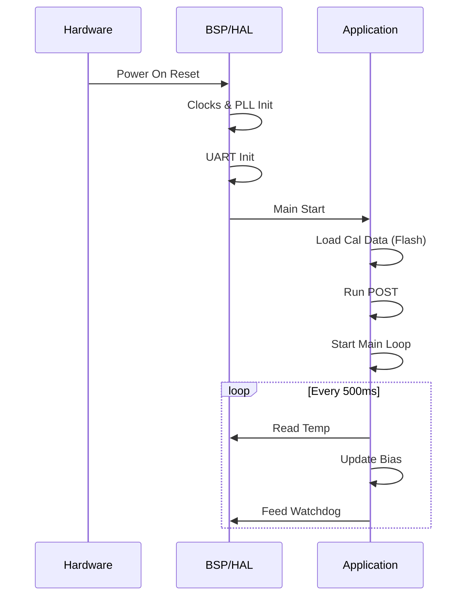
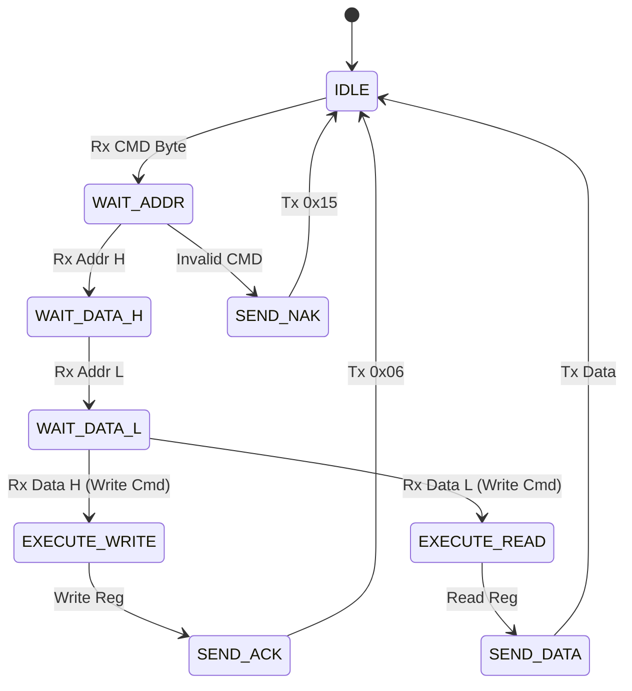
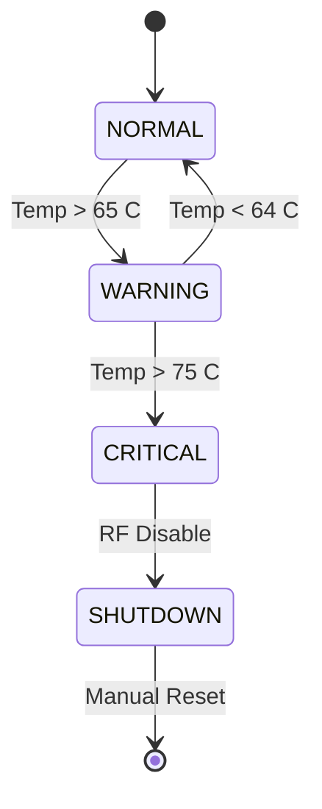

```markdown
# Software Requirements Specification (SRS)

**Project:** hfuf (4-Channel 2-6 GHz Radar RF Front-End)
**Version:** 1.0
**Date:** 22 April 2026
**Author:** Senior Software Architect

---

## Document Control
| Version | Date | Author | Changes |
|---------|------|--------|---------|
| 1.0 | 22 April 2026 — | Initial Release |

---

# 1. Introduction

## 1.1 Purpose
This Software Requirements Specification (SRS) document defines the software requirements for the **hfuf** embedded firmware. This firmware resides on the Xilinx Artix-7 XC7A35T FPGA and manages the 4-channel RF Front-End Module. 

The purpose of this document is:
1. To specify the functional behavior of the firmware controlling power sequencing, Active Bias Control (ABC), and UART communication.
2. To define the interface protocols between the FPGA, external host PC, and peripheral hardware (I2C, SPI, UART).
3. To serve as the baseline for firmware development, unit testing, and system integration.
4. To ensure compliance with IEEE 29148:2018 and ISO/IEC standards for life cycle processes.

## 1.2 Scope
The software system consists of embedded C/C++ firmware running on a MicroBlaze soft-core processor (or bare-metal VHDL/Verilog controllers) within the Artix-7 FPGA.

**In-Scope:**
*   **Power Management Control:** Sequencing of the TPS62136 Buck converter and MIC5209 LDO.
*   **RF Bias Control:** Digital-to-Analog conversion (via SPI) to set Gate/Drain voltages for the GaN HEMT LNAs.
*   **Communication:** UART command/response protocol for register read/write and configuration.
*   **Environmental Monitoring:** I2C polling of LM75A temperature sensors and internal XADC voltage monitoring.
*   **Non-Volatile Storage:** Read/Write operations to AT25040N EEPROM (Calibration) and S25FL512S Flash (Firmware Image).
*   **Self-Diagnostics:** POST routines and real-time health monitoring.

**Out-of-Scope:**
*   Radar signal processing algorithms (handled downstream).
*   FPGA RTL design for high-speed data paths (handled separately in Hardware Description).
*   Host PC GUI application.

## 1.3 Definitions, Acronyms, and Abbreviations

| Term | Definition |
| :--- | :--- |
| **ABC** | Active Bias Control |
| **API** | Application Programming Interface |
| **BOM** | Bill of Materials |
| **BSP** | Board Support Package |
| **CLB** | Configurable Logic Block |
| **CRC** | Cyclic Redundancy Check |
| **DAC** | Digital-to-Analog Converter |
| **DSP** | Digital Signal Processor |
| **EEPROM** | Electrically Erasable Programmable Read-Only Memory |
| **FIFO** | First-In-First-Out |
| **FPGA** | Field Programmable Gate Array |
| **GLR** | Glue Logic Requirements |
| **GPIO** | General Purpose Input/Output |
| **HAL** | Hardware Abstraction Layer |
| **HRS** | Hardware Requirements Specification |
| **I2C** | Inter-Integrated Circuit (Serial Protocol) |
| **I/O** | Input/Output |
| **IPC** | Inter-Process Communication |
| **ISR** | Interrupt Service Routine |
| **JTAG** | Joint Test Action Group |
| **LDO** | Low Dropout Regulator |
| **LNA** | Low Noise Amplifier |
| **MISRA** | Motor Industry Software Reliability Association |
| **MSB** | Most Significant Bit |
| **NVM** | Non-Volatile Memory |
| **PCB** | Printed Circuit Board |
| **PLL** | Phase Locked Loop |
| **POST** | Power-On Self Test |
| **QSPI** | Quad Serial Peripheral Interface |
| **RAM** | Random Access Memory |
| **RF** | Radio Frequency |
| **ROM** | Read-Only Memory |
| **RTL** | Register Transfer Level |
| **RTC** | Real-Time Clock |
| **Rx** | Receive |
| **SRS** | Software Requirements Specification |
| **SyRS** | System Requirements Specification |
| **StRS** | Stakeholder Requirements Specification |
| **SPI** | Serial Peripheral Interface |
| **TRP** | Transmit/Receive Pulse |
| **UART** | Universal Asynchronous Receiver/Transmitter |
| **XADC** | Xilinx Analog-to-Digital Converter (Hard IP) |

## 1.4 References
1.  **IEEE 830-1998**: Recommended Practice for Software Requirements Specifications.
2.  **ISO/IEC/IEEE 29148:2018**: Systems and Software Engineering — Life Cycle Processes — Requirements Engineering.
3.  **MISRA C:2012**: Guidelines for the Use of the C Language in Critical Systems.
4.  **Hardware Requirements Specification (HRS)**: hfuf Project, Rev 1.0, 22 April 2026.
5.  **Glue Logic Requirements (GLR)**: hfuf Project, Rev 0V01, 22 April 2026.
6.  **Xilinx UG986**: Vivado Design Suite User Guide: Embedded Processor Hardware Design.
7.  **Skyworks SKY16602-632LF Datasheet**: 0.2–4.0 GHz Limiter.
8.  **Mini-Circuits LVA-273PN+ Datasheet**: Gain Block Amplifier.
9.  **Texas Instruments TPS62136 Datasheet**: 4-A Step-Down Converter.
10. **FTDI FT2232H Datasheet**: USB-UART/Multi-Protocol Synchronous FIFO.

## 1.5 Overview
Section 2 describes the overall product perspective, functions, and constraints.
Section 3 details the specific requirements, including external interfaces and 75+ detailed functional requirements.
Section 4 covers verification and validation methods.
Section 5 provides the Requirements Traceability Matrix (RTM).
Section 6 contains appendices with data structures, register maps, and diagrams.

---

# 2. Overall Description

## 2.1 Product Perspective

The **hfuf** firmware operates as the control plane for the RF Front-End hardware. The software is organized into a layered architecture:

1.  **Hardware Abstraction Layer (HAL):** Direct drivers for UART, SPI, I2C, and GPIO.
2.  **Core Services:** Memory management, timer services, interrupt handling.
3.  **Application Layer:** State machine for power sequencing, bias control loops, and command parsing.

**System Context Diagram:**
```mermaid
graph TD
    HOST[Host PC / Radar Controller] -->|UART Command/Response| FW[Hfuf Firmware]
    FW -->|SPI CS/CLK| FPGA_REGS[FPGA Internal Registers]
    FW -->|SPI| EEPROM[AT25040 EEPROM]
    FW -->|QSPI| FLASH[S25FL512S Flash]
    FW -->|I2C| TEMP[LM75A Temp Sensor]
    FW -->|GPIO Control| PWR[Power Supply (Buck/LDO)]
    FW -->|SPI (Digital)| ABC[Active Bias Controller (DAC)]
    
    subgraph "Artix-7 FPGA"
        FW
        FPGA_REGS
    end
    
    subgraph "RF Hardware"
        PWR
        ABC
        TEMP
    end
```

## 2.2 Product Functions
The major software functions are:
1.  **System Initialization:** Configures clocks, PLLs, and peripheral IPs.
2.  **Power Sequencing:** Controls `EN_BUCK` and `EN_LDO` GPIOs to meet turn-on/turn-off timing constraints.
3.  **Bias Control:** Calculates DAC values based on temperature lookup tables to maintain GaN HEMT performance.
4.  **UART Protocol Handler:** Parses byte-stream commands (Read/Write) and updates FPGA registers.
5.  **Health Monitoring:** Polls temperature sensors and voltage rails (via XADC) every 100ms.
6.  **Safety Interlock:** Monitors `FAULT_LIM` signals and forces RF shutdown if thresholds are exceeded.

## 2.3 User Characteristics
*   **Firmware Engineers:** Develop and maintain the C/HDL code base.
*   **Test Engineers:** Utilize UART commands to validate hardware performance (Gain, NF).
*   **System Integrators:** Integrate the module into the larger radar array.

## 2.4 Constraints
*   **MISRA Compliance:** All C code shall comply with MISRA-C:2012 mandatory rules.
*   **Real-Time:** The firmware must respond to UART commands within 10ms.
*   **Memory:** 36KB Block RAM available for code/data; 512MB Flash for storage.
*   **Environment:** Must operate from 0°C to +70°C ambient.
*   **Power:** Total power consumption of the FPGA logic + IO must not exceed 2W.

## 2.5 Assumptions and Dependencies
*   The 12V DC input is stable and within ±10% tolerance when software initializes.
*   The 25 MHz oscillator is stable and within ±50ppm.
*   The FT2232H USB-UART bridge is enumerated on the Host PC before commands are sent.

---

# 3. Specific Requirements

## 3.1 External Interface Requirements

### 3.1.1 Hardware Interfaces

#### 3.1.1.1 UART Interface (Host Communication)
**Protocol:** RS-232 compatible, 8-N-1 (8 data bits, No parity, 1 Stop bit).
**Speed:** 3.0 Mbps (fixed).
**Buffering:** 256-byte TX FIFO, 256-byte RX FIFO.

```c
#include <stdint.h>

typedef struct {
    volatile uint32_t DATA;   // 0x00: Data Register
    volatile uint32_t STATUS; // 0x04: Status Register (RX_EMPTY, TX_FULL)
    volatile uint32_t CTRL;   // 0x08: Control Register (RX_EN, TX_EN)
    volatile uint32_t BAUD;   // 0x0C: Baud Rate Divisor
} UART_RegMap_t;

/**
 * @brief Initialize UART controller
 * @param baud_rate Desired baud rate (e.g., 3000000)
 * @return 0 on success, -1 on failure
 */
int32_t UART_Init(uint32_t baud_rate);

/**
 * @brief Read a number of bytes from UART
 * @param buf Destination buffer
 * @param len Number of bytes to read
 * @return Number of bytes actually read
 */
int32_t UART_Read(uint8_t* buf, uint32_t len);

/**
 * @brief Write a number of bytes to UART
 * @param buf Source buffer
 * @param len Number of bytes to write
 * @return Number of bytes actually written
 */
int32_t UART_Write(const uint8_t* buf, uint32_t len);
```

#### 3.1.1.2 SPI Interface (Flash & EEPROM)
**Standard:** SPI Mode 0 (CPOL=0, CPHA=0).
**Speed:** 50 MHz max.

```c
typedef struct {
    volatile uint32_t SRR;      // 0x00: Soft Reset Register
    volatile uint32_t CR;       // 0x04: Control Register
    volatile uint32_t SR;       // 0x08: Status Register
    volatile uint32_t TXD;      // 0x0C: Transmit Data
    volatile uint32_t RXD;      // 0x10: Receive Data
} SPI_RegMap_t;

int32_t SPI_Init(void);
int32_t SPI_Transfer(uint8_t *tx_buf, uint8_t *rx_buf, uint32_t len);
int32_t EEPROM_Write(uint16_t addr, uint8_t data);
int32_t EEPROM_Read(uint16_t addr, uint8_t *data);
```

#### 3.1.1.3 I2C Interface (Temperature & Power Monitors)
**Standard:** Standard Mode (100 kbps).
**Addressing:** 7-bit addressing.

```c
int32_t I2C_Init(uint32_t speed_hz);
int32_t I2C_Write(uint8_t dev_addr, uint8_t reg_addr, uint8_t *data, uint16_t len);
int32_t I2C_Read(uint8_t dev_addr, uint8_t reg_addr, uint8_t *data, uint16_t len);

// Specific driver wrapper
int32_t LM75A_ReadTemp(float *temp_c);
```

### 3.1.2 Software Interfaces
The firmware shall provide a register map located at Base Address `0x4000_0000` accessible via the UART command protocol.

### 3.1.3 Communication Interfaces

**UART Frame Formats:**

| Command | CMD byte | Frame Structure | Response |
|---------|----------|-----------------|----------|
| Single Write | 0x57 ('W') | `[0x57][ADDR_H][ADDR_L][DATA_H][DATA_L]` | `[0x06]` ACK |
| Single Read  | 0x52 ('R') | `[0x52][ADDR_H\|0x80][ADDR_L]` | `[DATA_H][DATA_L]` |
| Bulk Write   | 0x42 ('B') | `[0x42][ADDR_H][ADDR_L][N][D0_H][D0_L]...[Dn_H][Dn_L]` | `[0x06]` ACK |
| Bulk Read    | 0x62 ('b') | `[0x62][ADDR_H\|0x80][ADDR_L][N]` | `[D0_H][D0_L]...[Dn_H][Dn_L]` |
| Error NAK    | 0x15 | Sent by FPGA on invalid command/address | — |

*   **Address Space:** 16-bit (0x0000–0xFFFF).
*   **Read Flag:** Bit 15 of the address byte must be set (OR with 0x8000) for read operations.
*   **Bulk Limit (N):** Max 64 registers per transaction.
*   **Timeout:** 50ms inter-byte gap resets the state machine.
*   **CRC:** Optional CRC-16-CCITT can be enabled via Config Register bit 0.

## 3.2 Functional Requirements

### 3.2.1 System Initialization (REQ-SW-001 to REQ-SW-010)

| ID | Requirement | Source | Priority | Verification |
|----|-------------|--------|----------|---------------|
| REQ-SW-001 | The software SHALL complete Power-On Self-Test (POST) within 500ms of 3.3V rail stabilization. | HRS §2.1 | M | T |
| REQ-SW-002 | The software SHALL configure the system clock to 100 MHz using the on-board 25 MHz oscillator and internal PLL. | GLR §6 | M | A |
| REQ-SW-003 | The software SHALL verify the Board ID stored in EEPROM (Addr 0x00) matches 0xA5A5; failing this, the system shall halt and assert LED_FAULT. | HRS §3.2 | M | T |
| REQ-SW-004 | The software SHALL initialize the UART IP core with a divisor for 3.0 Mbps baud rate before enabling the RX interrupt. | GLR §5 | M | I |
| REQ-SW-005 | The software SHALL assert the `EN_BUCK` GPIO pin high for at least 10ms before asserting `EN_LDO`. | HRS §3.1 (Power Seq) | M | T |
| REQ-SW-006 | The software SHALL wait for the `PG_BUCK` (Power Good) signal to go high before proceeding to RF initialization. | GLR §7 | M | T |
| REQ-SW-007 | The software SHALL load default calibration coefficients from the SPI Flash (Offset 0x10000) into SRAM. | HRS §3.2 | M | T |
| REQ-SW-008 | The software SHALL configure the XADC to sample all analog rails (1.0V, 1.8V, 3.3V, 12V-scaled) at a 1 kSPS rate. | GLR §5 | M | A |
| REQ-SW-009 | The software SHALL initialize the Watchdog Timer (WDT) with a 1s timeout, kicking it every 500ms in the main loop. | Design | M | T |
| REQ-SW-010 | The software SHALL set the Status LED to a solid ON state upon successful completion of initialization. | HRS §3.1 | M | D |

### 3.2.2 UART Communication Driver (REQ-SW-011 to REQ-SW-020)

| ID | Requirement | Source | Priority | Verification |
|----|-------------|--------|----------|---------------|
| REQ-SW-011 | The software SHALL implement a UART Rx ISR that buffers incoming bytes into a circular FIFO. | GLR §5 | M | T |
| REQ-SW-012 | The software SHALL process the Single Write command (0x57) by writing `DATA` to `ADDR` and replying with ACK (0x06). | GLR §5 | M | T |
| REQ-SW-013 | The software SHALL process the Single Read command (0x52) by replying with the 16-bit data at `ADDR`. | GLR §5 | M | T |
| REQ-SW-014 | The software SHALL process the Bulk Read command (0x62) by streaming N registers back-to-back. | GLR §5 | M | T |
| REQ-SW-015 | The software SHALL validate that the `ADDR` in a write command falls within 0x0000–0x0FFF (Writeable Range). | GLR §5 | M | T |
| REQ-SW-016 | The software SHALL respond with NAK (0x15) if the command byte is not 0x57, 0x52, 0x42, or 0x62. | GLR §5 | M | T |
| REQ-SW-017 | The software SHALL implement a 50ms inter-byte timer; if exceeded, the parser state machine resets to IDLE. | GLR §5 | M | T |
| REQ-SW-018 | The software SHALL support a "Loopback Mode" (enabled via Config Reg bit 15) where received bytes are echoed immediately. | Design | D | T |
| REQ-SW-019 | The software SHALL calculate CRC-16-CCITT on Bulk frames if Config Reg bit 0 is set. | GLR §5 | D | T |
| REQ-SW-020 | The software SHALL disable UART Tx interrupts if the TX FIFO is full to prevent buffer overflow. | Design | M | A |

### 3.2.3 Temperature Monitoring (REQ-SW-021 to REQ-SW-030)

| ID | Requirement | Source | Priority | Verification |
|----|-------------|--------|----------|---------------|
| REQ-SW-021 | The software SHALL read the LM75A temperature sensor via I2C every 500ms. | HRS §2.1 | M | T |
| REQ-SW-022 | The software SHALL convert the 11-bit temperature data from LM75A into a float representing degrees Celsius. | LM75 Datasheet | M | A |
| REQ-SW-023 | The software SHALL update the Register `TEMP_DIAG` (Addr 0x0010) with the latest integer temperature value. | GLR §5 | M | T |
| REQ-SW-024 | The software SHALL trigger a Warning Event if the temperature exceeds +65°C. | HRS §2.1 | M | T |
| REQ-SW-025 | The software SHALL trigger a Critical Fault if the temperature exceeds +75°C, latching the system into a safe state. | HRS §2.1 | M | T |
| REQ-SW-026 | The software SHALL apply hysteresis to the Critical Fault (reset at +65°C) to prevent oscillation. | Design | M | A |
| REQ-SW-027 | The software SHALL log the timestamp of any temperature fault event to the EEPROM Fault Log. | HRS §3.2 | M | T |
| REQ-SW-028 | The software SHALL average 4 consecutive ADC readings from the XADC to reduce noise before threshold comparison. | Design | M | A |
| REQ-SW-029 | The software SHALL update the ABC (Active Bias Control) DAC values based on the temperature reading to maintain gain flatness. | HRS §3.2 | M | T |
| REQ-SW-030 | The software SHALL expose the raw XADC registers via the UART protocol for debugging. | GLR §5 | O | I |

### 3.2.4 Flash & EEPROM Management (REQ-SW-031 to REQ-SW-040)

| ID | Requirement | Source | Priority | Verification |
|----|-------------|--------|----------|---------------|
| REQ-SW-031 | The software SHALL implement a write delay of 5ms after EEPROM page write operations. | AT25040 Datasheet | M | T |
| REQ-SW-032 | The software SHALL verify EEPROM data by reading back the written byte and comparing it. | Design | M | T |
| REQ-SW-033 | The software SHALL implement a Flash Sector Erase (64KB) before writing new firmware images. | S25FL512S Datasheet | M | T |
| REQ-SW-034 | The software SHALL use DMA (if available) or efficient block copy for QSPI Flash operations. | Design | D | A |
| REQ-SW-035 | The software SHALL protect the Boot Sector (0x00000000–0x000FFFFF) from accidental erase via UART commands. | Design | M | I |
| REQ-SW-036 | The software SHALL calculate a CRC-32 over the entire firmware image in Flash and compare it to the Golden Master value at startup. | HRS §3.2 | M | T |
| REQ-SW-037 | The software SHALL store calibration data (Gain trim, Phase trim) in EEPROM addresses 0x0100–0x01FF. | HRS §3.2 | M | I |
| REQ-SW-038 | The software SHALL implement a "Factory Reset" command (0xFF) that restores default EEPROM values. | Design | O | T |
| REQ-SW-039 | The software SHALL map the EEPROM Fault Log as a circular buffer with 64 entries. | HRS §3.2 | M | I |
| REQ-SW-040 | The software SHALL wear-level the EEPROM by cycling through 4 memory blocks for fault logging. | Design | D | A |

### 3.2.5 Power Management (REQ-SW-041 to REQ-SW-050)

| ID | Requirement | Source | Priority | Verification |
|----|-------------|--------|----------|---------------|
| REQ-SW-041 | The software SHALL monitor the `PGOOD_LDO` status pin via a GPIO interrupt. | HRS §2.1 | M | T |
| REQ-SW-042 | The software SHALL assert an `RF_ENABLE` signal only after `PGOOD_LDO` is high and the bias DACs are settled. | HRS §2.1 | M | T |
| REQ-SW-043 | The software SHALL disable the RF Amplifiers (`RF_ENABLE` = Low) if the 5V rail drops below 4.5V. | HRS §3.1 | M | T |
| REQ-SW-044 | The software SHALL implement a graceful shutdown sequence (UART msg -> Wait -> Off) when commanded by host. | HRS §2.1 | D | T |
| REQ-SW-045 | The software SHALL utilize the XADC to monitor the input current (via a scaled sense resistor). | Design | O | A |
| REQ-SW-046 | The software SHALL keep a cumulative counter of power cycle events stored in NVM. | HRS §3.2 | O | I |
| REQ-SW-047 | The software SHALL allow the host to read the current consumption register (Addr 0x0020). | GLR §5 | M | T |
| REQ-SW-048 | The software SHALL implement software debouncing (100ms) on the Power Button input if present. | Design | O | T |
| REQ-SW-049 | The software SHALL support a Low Power Sleep Mode where the UART is disabled but the I2C sensor wakes the system. | Design | O | D |
| REQ-SW-050 | The software SHALL guarantee that the bias sequencing time (Gate high -> Drain high) is within 5ms ± 1ms. | HRS §2.1 | M | T |

### 3.2.6 RF Control / ABC (REQ-SW-051 to REQ-SW-060)

| ID | Requirement | Source | Priority | Verification |
|----|-------------|--------|----------|---------------|
| REQ-SW-051 | The software SHALL control the ABC SPI DAC to set the Gate Voltage for the GaN HEMTs. | HRS §2.1 | M | T |
| REQ-SW-052 | The software SHALL limit the Gate Voltage adjustment range to -2.0V to 0V via software clamps. | Design | M | I |
| REQ-SW-053 | The software SHALL implement a lookup table (Temp vs Vg) downloaded from EEPROM at boot. | HRS §3.2 | M | T |
| REQ-SW-054 | The software SHALL update the DACs whenever the temperature changes by more than 2°C. | Design | M | A |
| REQ-SW-055 | The software SHALL read back the DAC register values to verify write success. | Design | M | T |
| REQ-SW-056 | The software SHALL provide an Auto-Bias mode where the system optimizes Vg for minimum Noise Figure. | HRS §3.2 | O | D |
| REQ-SW-057 | The software SHALL assert a `TRP` (Tx/Rx Pulse) signal to the RF chain based on a timer or external trigger. | HRS §2.1 | M | T |
| REQ-SW-058 | The software SHALL ensure the `TRP` timing jitter is less than 10ns. | HRS §2.1 | M | T |
| REQ-SW-059 | The software SHALL log the number of times the RF protection limiter was triggered (if fault signal accessible). | Design | O | I |
| REQ-SW-060 | The software SHALL allow the host to override the automatic bias control via manual register writes. | Design | D | T |

### 3.2.7 Diagnostics and BIT (REQ-SW-061 to REQ-SW-075)

| ID | Requirement | Source | Priority | Verification |
|----|-------------|--------|----------|---------------|
| REQ-SW-061 | The software SHALL perform a RAM BIST (March C-) test on startup. | Design | M | T |
| REQ-SW-062 | The software SHALL perform a connection check on the I2C bus (ACK check) for all sensors. | Design | M | T |
| REQ-SW-063 | The software SHALL verify the PLL lock bit before enabling high-speed peripherals. | GLR §6 | M | T |
| REQ-SW-064 | The software SHALL report a specific error code for each failure mode defined in Appendix A. | Design | M | I |
| REQ-SW-065 | The software SHALL store the result of the last POST in a register at 0x0001. | GLR §5 | M | T |
| REQ-SW-066 | The software SHALL implement a UART command (0xA0) to initiate a system self-test. | Design | O | T |
| REQ-SW-067 | The software SHALL calculate the runtime stack usage via watermark analysis. | Design | D | A |
| REQ-SW-068 | The software SHALL detect UART framing errors and increment the `UART_ERR_COUNT` register. | GLR §5 | M | T |
| REQ-SW-069 | The software shall implement a sanity check on the external 25 MHz clock frequency. | GLR §6 | M | A |
| REQ-SW-070 | The software SHALL implement a "Safe State" where all RF outputs are disabled but digital comms remain active. | HRS §3.1 | M | T |
| REQ-SW-071 | The software SHALL support a Firmware Update Mode where the UART bootloads the QSPI Flash. | GLR §5 | M | T |
| REQ-SW-072 | The software SHALL verify the integrity of the received firmware packet via CRC-32 before writing to Flash. | Design | M | T |
| REQ-SW-073 | The software SHALL reboot the FPGA automatically after a successful firmware update. | Design | M | T |
| REQ-SW-074 | The software SHALL measure the system uptime in seconds and store it in a 32-bit register. | GLR §5 | M | T |
| REQ-SW-075 | The software SHALL allow the host to clear the Fault Log via a specific UART command. | Design | D | T |

## 3.3 Performance Requirements

| ID | Description | Verification |
|----|-------------|---------------|
| REQ-PERF-001 | The software SHALL respond to a UART Single Read command within 1ms of receiving the final byte. | T |
| REQ-PERF-002 | The software SHALL complete a full 4-channel bias DAC update (SPI transaction) within 5ms. | T |
| REQ-PERF-003 | The main control loop SHALL execute with a maximum jitter of 100µs. | A |
| REQ-PERF-004 | The software SHALL boot to the "Ready" state (POST complete) within 500ms of power application. | T |
| REQ-PERF-005 | The software SHALL support a maximum UART data throughput of 200 kB/s (user data). | T |
| REQ-PERF-006 | The watchdog timer SHALL be serviced (kicked) at least once every 500ms. | A |
| REQ-PERF-007 | The software SHALL allocate no more than 80% of the available Block RAM (leaving 20% margin). | A |
| REQ-PERF-008 | Context switch time (if RTOS used) SHALL be less than 10µs. | A |
| REQ-PERF-009 | The software SHALL write a page to the external EEPROM in less than 6ms. | T |
| REQ-PERF-010 | The software SHALL detect an over-temperature fault and initiate shutdown within 10ms of the threshold crossing. | T |

## 3.4 Design Constraints
*   **Language:** C99 for application logic; VHDL/Verilog for hardware interfaces.
*   **Compiler:** Xilinx Vitis (GCC based) or IAR Embedded Workbench.
*   **Coding Standard:** MISRA C:2012.
*   **Memory:** No dynamic memory allocation (`malloc`/`free` is prohibited).
*   **Integers:** Explicit width types (`stdint.h`) shall be used for all hardware register access.
*   **Float:** Floating point operations shall be minimized or avoided in ISRs; use fixed-point where possible.
*   **Stack:** Maximum stack depth per thread shall be statically defined.

## 3.5 Software System Attributes
### 3.5.1 Reliability
The software shall achieve an MTBF (Mean Time Between Failures) of 10,000 hours. All error conditions shall be logged.

### 3.5.2 Availability
System availability shall be > 99.9% (excluding planned maintenance). Boot time < 0.5s ensures rapid recovery.

### 3.5.3 Security
*   Firmware updates shall only be accepted if signed with a valid CRC/Key.
*   Write access to critical control registers shall be restricted to specific "Unlock" sequences.

### 3.5.4 Maintainability
*   Code modularity: One .c file per peripheral driver.
*   Comments: Doxygen style headers for all public functions.

### 3.5.5 Portability
*   Hardware dependencies shall be isolated to the `bsp/` directory.
*   The application layer shall not reference hardware registers directly, only through HAL macros.

---

# 4. Verification and Validation

## 4.1 Unit Test Requirements
*   **Drivers:** Mock the hardware registers to verify SPI/I2C/UART transaction logic.
*   **CRC:** Verify CRC-16 and CRC-32 calculation against standard test vectors.
*   **Protocol Parser:** Feed valid and invalid UART frames to the parser and check ACK/NAK responses.

## 4.2 Integration Test Requirements
*   **Power Sequencing:** Oscilloscope verification of `EN_BUCK` -> `PG_BUCK` -> `EN_LDO` -> `RF_ENABLE` timing.
*   **Thermal Loop:** Heat gun applied to sensor; verify DAC adjustment and eventual shutdown at +75°C.
*   **Flash Update:** Load a dummy firmware image via UART, verify Flash content, trigger reboot.

## 4.3 System Test Requirements
*   **Endurance:** Run at +70°C ambient for 72 hours with continuous UART traffic.
*   **EMC:** Verify UART communication integrity during radiated susceptibility testing.

## 4.4 Formal Verification
*   Static analysis using Coverity or Polyspace.
*   Code coverage report > 90% for all safety-critical modules (Power, Bias).

---

# 5. Requirements Traceability Matrix

| REQ-SW-xxx | Description | Source (REQ-HW/GLR) | Priority | Verification |
|-----------|-------------|---------------------|----------|-------------|
| REQ-SW-001 | POST Completion < 500ms | HRS §2.1 | M | T |
| REQ-SW-002 | PLL Config to 100MHz | GLR §6 | M | A |
| REQ-SW-003 | EEPROM Board ID Check | HRS §3.2 | M | T |
| REQ-SW-004 | UART Init 3Mbps | GLR §5 | M | I |
| REQ-SW-005 | Power Sequencing (Buck->LDO) | HRS §2.1 | M | T |
| REQ-SW-006 | Wait for PG_BUCK | GLR §7 | M | T |
| REQ-SW-007 | Load Calibration from Flash | HRS §3.2 | M | T |
| REQ-SW-008 | XADC Init 1kSPS | GLR §5 | M | A |
| REQ-SW-009 | WDT Init 1s | Design | M | T |
| REQ-SW-010 | Status LED Solid ON | HRS §3.1 | M | D |
| REQ-SW-011 | UART Rx ISR | GLR §5 | M | T |
| REQ-SW-012 | Cmd 0x57 Single Write | GLR §5 | M | T |
| REQ-SW-013 | Cmd 0x52 Single Read | GLR §5 | M | T |
| REQ-SW-014 | Cmd 0x62 Bulk Read | GLR §5 | M | T |
| REQ-SW-015 | Write Range Validation | GLR §5 | M | T |
| REQ-SW-016 | Invalid Cmd -> NAK | GLR §5 | M | T |
| REQ-SW-017 | 50ms Inter-byte Timeout | GLR §5 | M | T |
| REQ-SW-018 | Loopback Mode | Design | D | T |
| REQ-SW-019 | CRC-16 Feature | GLR §5 | D | T |
| REQ-SW-020 | TX Full Protection | Design | M | A |
| REQ-SW-021 | Read Temp 500ms | HRS §2.1 | M | T |
| REQ-SW-022 | Convert Temp to Float | LM75 Datasheet | M | A |
| REQ-SW-023 | Update Temp Reg | GLR §5 | M | T |
| REQ-SW-024 | Warn > 65°C | HRS §2.1 | M | T |
| REQ-SW-025 | Fault > 75°C | HRS §2.1 | M | T |
| REQ-SW-026 | Hysteresis | Design | M | A |
| REQ-SW-027 | Log Fault | HRS §3.2 | M | T |
| REQ-SW-028 | XADC Averaging | Design | M | A |
| REQ-SW-029 | Update ABC DAC | HRS §3.2 | M | T |
| REQ-SW-030 | Expose XADC | GLR §5 | O | I |
| REQ-SW-031 | EEPROM Write Delay | AT25040 | M | T |
| REQ-SW-032 | EEPROM Verify | Design | M | T |
| REQ-SW-033 | Flash Sector Erase | S25FL512S | M | T |
| REQ-SW-034 | DMA for QSPI | Design | D | A |
| REQ-SW-035 | Boot Sector Protect | Design | M | I |
| REQ-SW-036 | CRC32 FW Check | HRS §3.2 | M | T |
| REQ-SW-037 | Store Cal Data | HRS §3.2 | M | I |
| REQ-SW-038 | Factory Reset | Design | O | T |
| REQ-SW-039 | Fault Log Circular | HRS §3.2 | M | I |
| REQ-SW-040 | EEPROM Wear Level | Design | D | A |
| REQ-SW-041 | Monitor PGOOD | HRS §2.1 | M | T |
| REQ-SW-042 | RF Enable Logic | HRS §2.1 | M | T |
| REQ-SW-043 | UVLO 5V Rail | HRS §3.1 | M | T |
| REQ-SW-044 | Graceful Shutdown | HRS §2.1 | D | T |
| REQ-SW-045 | Current Mon | Design | O | A |
| REQ-SW-046 | Power Cycle Counter | HRS §3.2 | O | I |
| REQ-SW-047 | Read Current Reg | GLR §5 | M | T |
| REQ-SW-048 | Button Debounce | Design | O | T |
| REQ-SW-049 | Sleep Mode | Design | O | D |
| REQ-SW-050 | Bias Seq Timing | HRS §2.1 | M | T |
| REQ-SW-051 | Write ABC DAC | HRS §2.1 | M | T |
| REQ-SW-052 | Clamp Gate V | Design | M | I |
| REQ-SW-053 | Temp LUT | HRS §3.2 | M | T |
| REQ-SW-054 | Update Delta 2°C | Design | M | A |
| REQ-SW-055 | Verify DAC Write | Design | M | T |
| REQ-SW-056 | Auto-Bias Mode | HRS §3.2 | O | D |
| REQ-SW-057 | TRP Signal | HRS §2.1 | M | T |
| REQ-SW-058 | TRP Jitter < 10ns | HRS §2.1 | M | T |
| REQ-SW-059 | Log Limiter Events | Design | O | I |
| REQ-SW-060 | Manual Override | Design | D | T |
| REQ-SW-061 | RAM BIST | Design | M | T |
| REQ-SW-062 | I2C Conn Check | Design | M | T |
| REQ-SW-063 | PLL Lock Check | GLR §6 | M | T |
| REQ-SW-064 | Error Reporting | Design | M | I |
| REQ-SW-065 | Post Result Reg | GLR §5 | M | T |
| REQ-SW-066 | Cmd 0xA0 Self Test | Design | O | T |
| REQ-SW-067 | Stack Analysis | Design | D | A |
| REQ-SW-068 | UART Err Count | GLR §5 | M | T |
| REQ-SW-069 | Clock Sanity | GLR §6 | M | A |
| REQ-SW-070 | Safe State | HRS §3.1 | M | T |
| REQ-SW-071 | FW Update Mode | GLR §5 | M | T |
| REQ-SW-072 | CRC32 FW Packet | Design | M | T |
| REQ-SW-073 | Reboot on Update | Design | M | T |
| REQ-SW-074 | Uptime Counter | GLR §5 | M | T |
| REQ-SW-075 | Clear Log Cmd | Design | D | T |

---

# 6. Appendices

## Appendix A — Error Codes
```c
typedef enum {
    ERR_OK           = 0x00, // No error
    ERR_TIMEOUT      = 0x01, // Timeout waiting for HW signal
    ERR_COMM_UART    = 0x02, // UART framing/overflow error
    ERR_COMM_I2C     = 0x03, // I2C NACK error
    ERR_COMM_SPI     = 0x04, // SPI fault
    ERR_CHECKSUM     = 0x05, // CRC mismatch
    ERR_PARAM        = 0x06, // Invalid parameter
    ERR_NOT_INIT     = 0x07, // Peripheral not initialized
    ERR_HARDWARE     = 0x08, // Generic HW fault
    ERR_FLASH_WRITE  = 0x09, // Flash programming fail
    ERR_TEMP_HIGH    = 0x0A, // Overtemperature fault
    ERR_VOLT_LOW     = 0x0B, // Undervoltage fault
    ERR_POST_FAIL    = 0x0C, // POST failed
    ERR_WATCHDOG     = 0x0D, // Watchdog reset occurred
    ERR_ADDR_RANGE   = 0x0E, // Register address out of bounds
} ErrorCode_t;
```

## Appendix B — Register Map Summary

| Base Address | Offset | Register Name | Width | R/W | Reset Value | Description |
|-------------|--------|--------------|-------|-----|-------------|-------------|
| 0x40000000 | 0x0000 | REG_FW_VER | 16 | R | 0x0100 | Firmware Version |
| 0x40000000 | 0x0001 | REG_STATUS | 16 | R | 0x0000 | Status Flags (Bit 0: Ready, Bit 1: Fault) |
| 0x40000000 | 0x0002 | REG_CONTROL | 16 | W | 0x0000 | Control Bits (Bit 0: RF Enable) |
| 0x40000000 | 0x0003 | REG_TEMP_DIAG | 16 | R | - | Last measured temperature (C) |
| 0x40000000 | 0x0004 | REG_VOLT_5V | 16 | R | - | 5V Rail measurement (mV) |
| 0x40000000 | 0x0005 | REG_ERR_CODE | 16 | R | 0x00 | Last Error Code |
| 0x40000000 | 0x0006 | REG_UPTIME | 32 | R | 0x00 | System Uptime (seconds) |
| 0x40000000 | 0x0010 | REG_DAC_CH0 | 16 | W | 0x0000 | ABC DAC Channel 0 Value |
| 0x40000000 | 0x0011 | REG_DAC_CH1 | 16 | W | 0x0000 | ABC DAC Channel 1 Value |
| 0x40000000 | 0x0012 | REG_DAC_CH2 | 16 | W | 0x0000 | ABC DAC Channel 2 Value |
| 0x40000000 | 0x0013 | REG_DAC_CH3 | 16 | W | 0x0000 | ABC DAC Channel 3 Value |
| 0x40000000 | 0x0020 | REG_PG_STAT | 16 | R | - | Power Good Status (Bitmasked) |
| 0x40000000 | 0x0021 | REG_LED_CTRL | 16 | W | 0x0001 | LED Control |

## Appendix C — Mermaid Diagrams

### System Initialization Sequence


### UART Command Processing Flow


### Temperature Alert State Machine


## Appendix D — Acronyms and Glossary
(As defined in Section 1.3)

## Appendix E — Document Revision History
| Rev | Date | Author | Description |
|-----|------|--------|-------------|
| 1.0 | 22 April 2026 — | Initial Release |
```