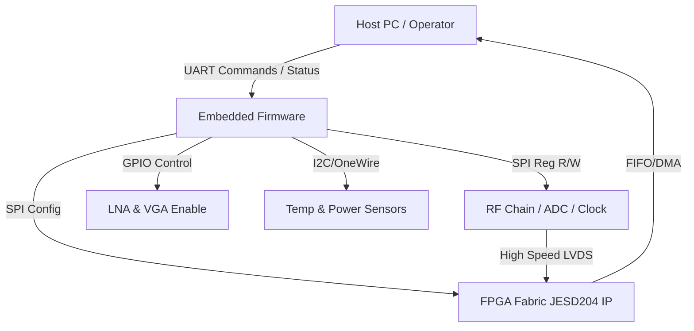
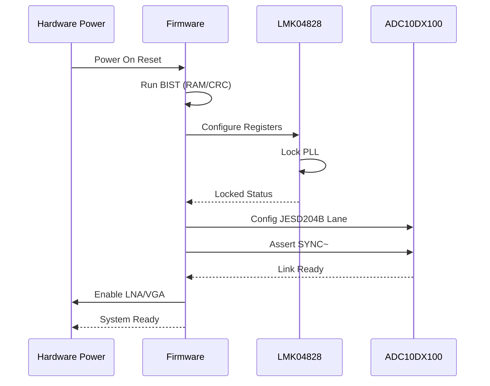
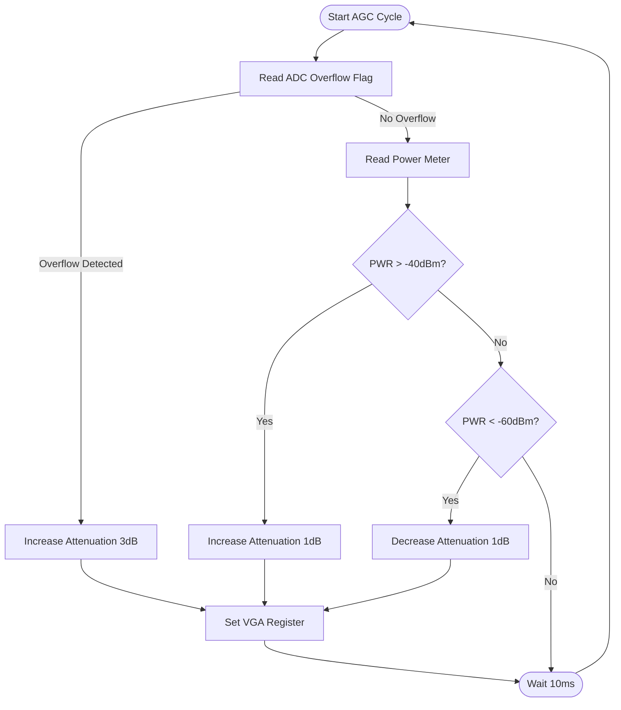
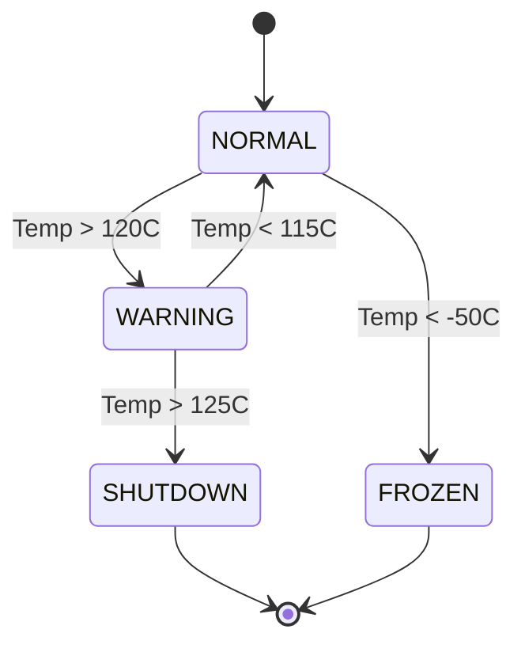

# Software Requirements Specification (SRS)

**Project:** hgyu Ultra-Wideband RF Receiver System  
**Document Version:** 1.0  
**Date:** 15 April 2026

---

## Document Control
| Version | Date | Author | Changes |
|---------|------|--------|---------|
| 1.0 | 15 April 2026 | System Architecture Team | Initial Release of SRS for hgyu Embedded Control Software |

---

# 1. Introduction

## 1.1 Purpose
The purpose of this Software Requirements Specification (SRS) document is to define the comprehensive software requirements for the **hgyu Embedded Control Software**. This document serves as the baseline for the design, development, verification, and validation of the firmware residing on the Host FPGA (Soft Microcontroller or Hard Core) and managing the hgyu RF Receiver hardware.

Specifically, this document shall:
1.  Specify the functional and performance requirements of the firmware drivers for the RF Front-End (LNA/VGA), High-Speed Digitizer (ADC), and Clock Management (PLL).
2.  Define the communication protocols (SPI, JESD204B) and power sequencing logic required to operate the hardware within defined environmental constraints (-55°C to +125°C).
3.  Establish traceability between the Hardware Requirements Specification (HRS) and the Software Implementation Level.
4.  Provide a binding reference for verification and validation (V&V) activities, ensuring compliance with MIL-STD-810 and project-specific performance goals.

## 1.2 Scope
The scope of this document encompasses the embedded software stack responsible for the initialization, control, and monitoring of the hgyu receiver module.

**In-Scope Items:**
*   **Hardware Abstraction Layer (HAL):** Drivers for SPI peripherals (ADC, Clock, Temp Sensors) and GPIO control (LNA/VGA Attenuation).
*   **System Initialization:** Power-up sequencing, clock configuration, and JESD204B link training.
*   **Communication Protocol:** Implementation of the UART command/response protocol for external host control.
*   **Control Loops:** Automatic Gain Control (AGC) algorithms and Temperature Monitoring interlocks.
*   **Diagnostics:** Built-In Self-Test (BIST) and fault logging.

**Exclusions:**
*   High-speed signal processing algorithms (DSP) implemented in the FPGA fabric (e.g., FFT, filtering) are specified in the FPGA Design Specification (P7), though the *configuration* of these blocks via software is included here.
*   Mechanical design or chassis management firmware.
*   Host PC GUI application software (external to the hgyu module).

## 1.3 Definitions, Acronyms, and Abbreviations

| Term / Acronym | Definition |
| :--- | :--- |
| **ADC** | Analog-to-Digital Converter. |
| **AGC** | Automatic Gain Control. |
| **API** | Application Programming Interface. |
| **BIST** | Built-In Self-Test. |
| **BRAM** | Block Random Access Memory (FPGA on-chip memory). |
| **BSP** | Board Support Package. |
| **CF** | Center Frequency. |
| **CRC** | Cyclic Redundancy Check. |
| **DAC** | Digital-to-Analog Converter. |
| **DMA** | Direct Memory Access. |
| **DSP** | Digital Signal Processing. |
| **EEPROM** | Electrically Erasable Programmable Read-Only Memory. |
| **FIFO** | First-In, First-Out buffer. |
| **FMC** | FPGA Mezzanine Card. |
| **FPGA** | Field-Programmable Gate Array. |
| **GLR** | Glue Logic Requirements. |
| **GPIO** | General Purpose Input/Output. |
| **HAL** | Hardware Abstraction Layer. |
| **HRS** | Hardware Requirements Specification. |
| **I2C** | Inter-Integrated Circuit (Serial Protocol). |
| **IP** | Intellectual Property (Core). |
| **ISR** | Interrupt Service Routine. |
| **JESD204** | JEDEC Standard for high-speed data converter interfaces. |
| **LNA** | Low Noise Amplifier. |
| **LVDS** | Low-Voltage Differential Signaling. |
| **MCU** | Microcontroller Unit. |
| **MISRA** | Motor Industry Software Reliability Association (C Coding Standard). |
| **NVM** | Non-Volatile Memory. |
| **PCB** | Printed Circuit Board. |
| **PLL** | Phase-Locked Loop. |
| **POST** | Power-On Self-Test. |
| **REG** | Register. |
| **RF** | Radio Frequency. |
| **RTL** | Register Transfer Level. |
| **RTOS** | Real-Time Operating System. |
| **Rx** | Receive. |
| **SRS** | Software Requirements Specification. |
| **StRS** | Stakeholder Requirements Specification. |
| **SPI** | Serial Peripheral Interface. |
| **SyRS** | System Requirements Specification. |
| **TEMP** | Temperature. |
| **TRP** | Transmit/Receive Power (or Control Signal). |
| **UART** | Universal Asynchronous Receiver/Transmitter. |
| **VGA** | Variable Gain Amplifier. |
| **WDT** | Watchdog Timer. |

## 1.4 References
| ID | Document Title | Version/Date | Publisher |
| :--- | :--- | :--- | --- |
| **IEEE 830** | Recommended Practice for Software Requirements Specifications | 1998 | IEEE |
| **IEEE 29148** | Systems and Software Engineering — Life Cycle Processes — Requirements Engineering | 2018 | IEEE/ISO |
| **MISRA-C** | Guidelines for the Use of the C Language in Critical Systems | 2012 | MISRA |
| **HRS-hgyu** | hgyu Hardware Requirements Specification | 15.04.2026 | Internal |
| **GLR-hgyu** | hgyu Glue Logic Requirements | 0V01 | Internal |
| **JESD204B** | Serial Interface for Data Converters | JESD204B.01 | JEDEC |
| **HMC1132** | HMC1132LP6GE Datasheet (LNA) | Rev. A | Analog Devices |
| **HMC698** | HMC698LP4 Datasheet (Attenuator) | Rev. 0 | Analog Devices |
| **ADC10DX100** | ADC10DX100 Datasheet (ADC) | 2019 | Texas Instruments |
| **LMK04828** | LMK04828 Datasheet (Clock Jitter Cleaner) | 2017 | Texas Instruments |

## 1.5 Overview
The remainder of this document is organized as follows:
*   **Section 2: Overall Description** provides the product perspective, context diagrams, and high-level functional summaries.
*   **Section 3: Specific Requirements** details the software functional requirements (REQ-SW), external interfaces, performance constraints, and design constraints.
*   **Section 4: Verification and Validation** outlines the testing strategy and traceability.
*   **Section 5: Requirements Traceability Matrix** maps software requirements to hardware sources.
*   **Appendices** contain protocol definitions, register maps, and error codes.

---

# 2. Overall Description

## 2.1 Product Perspective
The hgyu software is embedded firmware executing on a soft-core processor (e.g., MicroBlaze) or hard-core (e.g., ARM Cortex-R) within the Host FPGA. It acts as the control plane for the RF hardware, managing the slow-speed control interfaces (SPI/GPIO) while the FPGA fabric handles the high-speed data path (JESD204B).

**System Context Diagram:**



**Software Stack Layers:**
1.  **Application Layer:** State machines, command parsing, AGC algorithms, fault management.
2.  **HAL Layer:** Drivers for SPI, UART, I2C, GPIO, and Timers.
3.  **BSP Layer:** Hardware-specific initialization for the FPGA core and interrupt controllers.

## 2.2 Product Functions
1.  **System Initialization:** Sequencing power rails, configuring the LMK04828 PLL, and establishing the JESD204B link.
2.  **Hardware Abstraction:** Providing a C-API for all peripherals.
3.  **UART Command Handler:** Interpreting binary commands to read/write FPGA registers.
4.  **Gain Control:** Setting attenuation levels on HMC698 devices to optimize ADC input power (-60 to -40 dBm target).
5.  **Temperature Monitoring:** Polling sensors and triggering shutdowns if limits are exceeded (-55°C to +125°C).
6.  **Fault Reporting:** Logging errors to non-volatile memory and reporting via UART.
7.  **Watchdog Management:** Maintaining system health.

## 2.3 User Characteristics
*   **Firmware Engineers:** Use the SRS and HAL to implement control logic.
*   **Test Engineers:** Use UART commands to validate hardware performance (NF, IIP3).
*   **System Integrators:** Integrate the hgyu module into larger radar/comms systems.
*   **Field Engineers:** Use diagnostic commands for maintenance.

## 2.4 Constraints
1.  **MISRA Compliance:** Code shall strictly adhere to MISRA-C:2012 rules.
2.  **Timing:** The firmware control loop must complete within 1 ms.
3.  **Memory:** Code size < 500 KB; Data size < 64 KB (BRAM).
4.  **Real-Time:** Interrupt latency for JESD204B status flags must be < 10 µs.
5.  **Environment:** Software must operate correctly at -55°C and +125°C.

## 2.5 Assumptions and Dependencies
1.  The FPGA bitstream is loaded and stable before firmware execution begins.
2.  The +5V supply is stable and within tolerance (±5%) before the firmware enables the LNA.
3.  The external reference clock (100 MHz) is present and stable.

---

# 3. Specific Requirements

## 3.1 External Interface Requirements

### 3.1.1 Hardware Interfaces

The firmware interfaces with several peripherals via memory-mapped IO or standard protocols.

**3.1.1.1 SPI Interface (ADC & Clock)**
```c
/**
 * @brief SPI Configuration Structure for LMK04828 / ADC
 */
typedef struct {
    uint32_t base_addr;   /**< Base address of SPI controller */
    uint32_t clock_hz;    /**< SPI Clock Frequency (Max 20MHz for LMK) */
    uint8_t  mode;        /**< CPOL/CPHA Mode (Mode 0 for ADC) */
    uint8_t  chip_select; /**< GPIO ID for Chip Select */
} SPI_Config_t;

/* Function Prototypes */
/**
 * @brief Initialize the SPI peripheral
 * @param cfg Pointer to configuration structure
 * @return 0 on success, -1 on failure
 */
int32_t SPI_Init(const SPI_Config_t* cfg);

/**
 * @brief Write to a device register via SPI
 * @param device_id Device enumeration (0=LMK, 1=ADC)
 * @param reg_addr Register address
 * @param data Data to write
 */
int32_t SPI_WriteReg(uint8_t device_id, uint16_t reg_addr, uint8_t data);

/**
 * @brief Read from a device register via SPI
 */
int32_t SPI_ReadReg(uint8_t device_id, uint16_t reg_addr, uint8_t* data);
```

**3.1.1.2 Parallel GPIO Interface (Attenuators - HMC698)**
```c
/**
 * @brief HMC698 Attenuator Control Map
 * The HMC698 uses a 6-bit parallel interface + LE (Latch Enable) + CP (Common Point)
 */
typedef struct {
    volatile uint8_t *ctrl_port; /**< Pointer to GPIO Bank */
    uint8_t pin_le;              /**< Latch Enable Pin Offset */
    uint8_t pin_cp;              /**< Common Point Pin Offset */
} VGA_Control_t;

/**
 * @brief Set attenuation for the RF Chain
 * @param vga Pointer to VGA struct
 * @param atten_db Attenuation value in 0.5dB steps (0 to 31.5dB)
 * @note Drives 6-bit parallel bus then pulses LE high for 20ns
 */
void VGA_SetAttenuation(const VGA_Control_t* vga, float atten_db);
```

**3.1.1.3 UART Interface (Host Command)**
```c
typedef struct {
    volatile uint32_t STATUS; /**< 0x00: TX/RX Status Flags */
    volatile uint32_t CTRL;   /**< 0x04: Interrupt Enables */
    volatile uint32_t BAUD;   /**< 0x08: Baud Rate Divisor */
    volatile uint32_t TX_FIFO;/**< 0x0C: TX Data */
    volatile uint32_t RX_FIFO;/**< 0x10: RX Data */
} UART_RegMap_t;

/* API */
int32_t UART_Init(uint32_t baud_rate);
int32_t UART_ReadByte(uint8_t *data);
int32_t UART_WriteByte(uint8_t data);
```

### 3.1.2 Software Interfaces
*   **Standard Library:** Embedded C library (newlib, newlib-nano).
*   **Xilinx/Altera HAL Drivers:** For specific IP core control (UART Lite, SPI, GPIO).

### 3.1.3 Communication Interfaces
**Protocol: UART Register Access (Binary)**

The firmware implements a state machine to parse the following byte-level frames.

| Command | CMD Byte | Frame Structure (Hex) | Response |
|---------|----------|----------------------|----------|
| **Single Write** | 0x57 ('W') | `[0x57][ADDR_H][ADDR_L][DATA_H][DATA_L]` | `[0x06]` (ACK) |
| **Single Read** | 0x52 ('R') | `[0x52][ADDR_H\|0x80][ADDR_L]` | `[DATA_H][DATA_L]` |
| **Bulk Write** | 0x42 ('B') | `[0x42][ADDR_H][ADDR_L][N][D0_H][D0_L]...[Dn_H][Dn_L]` | `[0x06]` (ACK) |
| **Bulk Read** | 0x62 ('b') | `[0x62][ADDR_H\|0x80][ADDR_L][N]` | `[D0_H][D0_L]...[Dn_H][Dn_L]` |
| **Error NAK** | 0x15 | Sent by firmware on error | — |

**Protocol Rules:**
1.  **Addressing:** 16-bit address space. For Read commands, the most significant bit of the address byte (bit 7 of ADDR_H) must be set (OR'd with 0x80).
2.  **Bulk Count N:** Maximum 64 registers per transaction.
3.  **Timeout:** Firmware resets parser state if inter-byte delay exceeds 50ms.
4.  **ACK/NAK:** 0x06 indicates success. 0x15 indicates Invalid Address or Checksum Error (if enabled).

## 3.2 Functional Requirements

### 3.2.1 System Initialization (REQ-SW-001 to REQ-SW-010)

| REQ-ID | Requirement Statement | Source | Priority | Verification |
|--------|-----------------------|--------|----------|---------------|
| **REQ-SW-001** | The software SHALL perform Power-On Self-Test (POST) within 500ms of reset release. | HRS §3.1 | M | Test |
| **REQ-SW-002** | The software SHALL verify the BOARD_ID register (Addr 0x0000) matches 0xA5A5 before enabling RF outputs. | GLR §8 | M | Test |
| **REQ-SW-003** | The software SHALL configure the LMK04828 clock synthesizer to generate the ADC sampling clock (10 GSPS reference) and FPGA reference. | HRS REQ-HW-007 | M | Demonstration |
| **REQ-SW-004** | The software SHALL poll the LMK04828 STATUS Register (PLL_LOCK bit) with a 100ms timeout; initialization fails if timeout. | HRS REQ-HW-007 | M | Analysis |
| **REQ-SW-005** | The software SHALL initialize the JESD204B IP core in Subclass 1 mode. | GLR §7 | M | Inspection |
| **REQ-SW-006** | The software shall assert the SYNC~ signal to the ADC to align frame boundaries upon link initialization. | JESD204B Spec | M | Demonstration |
| **REQ-SW-007** | The software SHALL disable the LNA (HMC1132) and Attenuators (HMC698) during power-up until the PLL is locked. | HRS REQ-HW-010 | M | Test |
| **REQ-SW-008** | The software SHALL read calibration constants from NVM (EEPROM) and apply them to the VGA default state. | GLR §4 | M | Test |
| **REQ-SW-009** | The software SHALL configure the Watchdog Timer to 100ms maximum timeout prior to entering the main loop. | HRS REQ-HW-010 | M | Test |
| **REQ-SW-010** | The software SHALL log the firmware version string to the UART debug port at 115200 baud upon startup. | HRS REQ-HW-008 | D | Inspection |

### 3.2.2 RF and Gain Control (REQ-SW-011 to REQ-SW-020)

| REQ-ID | Requirement Statement | Source | Priority | Verification |
|--------|-----------------------|--------|----------|---------------|
| **REQ-SW-011** | The software SHALL provide an API to set the attenuation of the HMC698 in 0.5dB steps from 0dB to 31.5dB. | HRS REQ-HW-013 | M | Test |
| **REQ-SW-012** | The software SHALL drive the 6-bit parallel control lines to the HMC698 and toggle the Latch Enable (LE) pin for >10ns to register the setting. | GLR §5 | M | Demonstration |
| **REQ-SW-013** | The software SHALL implement an Automatic Gain Control (AGC) loop that adjusts attenuation to maintain ADC input between -60 dBm and -40 dBm. | HRS REQ-HW-005 | M | Analysis |
| **REQ-SW-014** | The software SHALL read the ADC "Overflow" flag via SPI every 10ms to check for signal clipping. | HRS REQ-HW-005 | M | Test |
| **REQ-SW-015** | If ADC overflow is detected, the software SHALL increase attenuation by 3dB immediately. | HRS REQ-HW-005 | M | Test |
| **REQ-SW-016** | The software SHALL enable the LNA (Vcc_Enable pin) only after the negative rail (-1.0V) is stable. | HRS REQ-HW-009 | M | Test |
| **REQ-SW-017** | The software SHALL support a manual override mode where attenuation is set via UART register write only. | HRS REQ-HW-013 | D | Test |
| **REQ-SW-018** | The software SHALL limit the minimum attenuation to 0dB and maximum to 31.5dB in software to prevent invalid hardware states. | HRS REQ-HW-013 | M | Analysis |
| **REQ-SW-019** | The software SHALL store the current attenuation setting in a global variable accessible by the UART read command (Addr 0x0010). | GLR §8 | M | Inspection |
| **REQ-SW-020** | The software SHALL implement a "Gain Freeze" mode where AGC is suspended and gains are held constant. | HRS REQ-HW-013 | D | Test |

### 3.2.3 Communication Protocol (REQ-SW-021 to REQ-SW-030)

| REQ-ID | Requirement Statement | Source | Priority | Verification |
|--------|-----------------------|--------|----------|---------------|
| **REQ-SW-021** | The software SHALL implement the UART command parser for Single Write (0x57), Single Read (0x52), Bulk Write (0x42), Bulk Read (0x62). | GLR §8 | M | Test |
| **REQ-SW-022** | The software SHALL set the MSB of the address byte (Bit 15 of 16-bit addr) to 1 for all Read operations. | GLR §8 | M | Test |
| **REQ-SW-023** | The software SHALL respond to a valid Write command with ACK (0x06) within 1ms. | GLR §8 | M | Test |
| **REQ-SW-024** | The software SHALL respond to an invalid command or address with NAK (0x15). | GLR §8 | M | Test |
| **REQ-SW-025** | The software SHALL support a bulk transfer of up to 64 registers (128 bytes) in a single transaction. | GLR §8 | M | Test |
| **REQ-SW-026** | The software SHALL discard incoming UART bytes if the RX FIFO is full. | GLR §8 | M | Test |
| **REQ-SW-027** | The software SHALL calculate a CRC-16 checksum on bulk write packets if the CRC_EN bit (Config Reg) is set. | GLR §8 | O | Test |
| **REQ-SW-028** | The software SHALL ignore whitespace or padding bytes between frames. | GLR §8 | D | Test |
| **REQ-SW-029** | The software SHALL echo a specific debug byte (0xFF) to UART when a fatal fault occurs. | GLR §8 | D | Test |
| **REQ-SW-030** | The software SHALL reset the UART command state machine if 50ms passes without receiving the full frame. | GLR §8 | M | Test |

### 3.2.4 Temperature and Power Monitoring (REQ-SW-031 to REQ-SW-040)

| REQ-ID | Requirement Statement | Source | Priority | Verification |
|--------|-----------------------|--------|----------|---------------|
| **REQ-SW-031** | The software SHALL poll the on-board temperature sensor via I2C every 1 second. | HRS REQ-HW-009 | M | Test |
| **REQ-SW-032** | The software SHALL trigger a thermal shutdown (Disable LNA, ADC) if temperature exceeds +125°C. | HRS REQ-HW-009 | M | Test |
| **REQ-SW-033** | The software SHALL trigger a thermal shutdown if temperature drops below -55°C (cold start lockout). | HRS REQ-HW-009 | M | Test |
| **REQ-SW-034** | The software SHALL monitor the +5V, +3.3V, +1.8V, and +1.0V power rails via ADC registers. | HRS REQ-HW-010 | M | Test |
| **REQ-SW-035** | The software SHALL assert a fault if any rail deviates by >5% from nominal. | HRS REQ-HW-010 | M | Test |
| **REQ-SW-036** | The software SHALL log the first 64 fault events to a non-volatile circular buffer in EEPROM. | HRS REQ-HW-011 | M | Test |
| **REQ-SW-037** | The software SHALL record the timestamp (uptime seconds) and error code for each fault. | HRS REQ-HW-011 | D | Inspection |
| **REQ-SW-038** | The software SHALL provide a UART command to dump the fault log (Addr 0x0200 - 0x02FF). | HRS REQ-HW-011 | M | Test |
| **REQ-SW-039** | The software SHALL measure the total current consumption via the power monitor chip and report it via UART register 0x0012. | HRS REQ-HW-010 | D | Test |
| **REQ-SW-040** | The software SHALL implement hysteresis for thermal alerts (Alert at 125°C, Clear at 120°C). | HRS REQ-HW-009 | M | Analysis |

### 3.2.5 Diagnostics and Test (REQ-SW-041 to REQ-SW-050)

| REQ-ID | Requirement Statement | Source | Priority | Verification |
|--------|-----------------------|--------|----------|---------------|
| **REQ-SW-041** | The software SHALL implement a RAM BIST (March C-) test on initialization covering the first 32KB of data memory. | HRS REQ-HW-011 | M | Test |
| **REQ-SW-042** | The software SHALL verify the SPI connection to the ADC by reading the CHIP_ID register (0x04). | HRS REQ-HW-007 | M | Test |
| **REQ-SW-043** | The software SHALL verify the SPI connection to the LMK04828 by reading the PRODUCT_ID register. | HRS REQ-HW-007 | M | Test |
| **REQ-SW-044** | The software SHALL implement an internal UART loopback test (connect TX to RX internally via FPGA fabric). | HRS REQ-HW-011 | D | Test |
| **REQ-SW-045** | The software SHALL expose a "Test Mode" bit (Reg 0x0001, Bit 0) to enable PRBS generation on the JESD204B link. | JESD204B Spec | O | Test |
| **REQ-SW-046** | The software SHALL count the number of PLL re-locks and store it in Register 0x0014. | HRS REQ-HW-011 | M | Inspection |
| **REQ-SW-047** | The software SHALL track system uptime in seconds and store it in a 32-bit register (0x0018). | HRS REQ-HW-011 | M | Test |
| **REQ-SW-048** | The software SHALL allow the user to trigger a software reset via UART command (Write 0xDEADBEEF to 0xFFFF). | HRS REQ-HW-011 | M | Test |
| **REQ-SW-049** | The software SHALL blink a LED at 2Hz during the POST phase and 1Hz during normal operation. | HRS REQ-HW-011 | M | Demonstration |
| **REQ-SW-050** | The software SHALL calculate the CRC of the application firmware in Flash and compare it to a stored value on boot. | HRS REQ-HW-011 | M | Test |

### 3.2.6 FPGA Interface Logic (REQ-SW-051 to REQ-SW-060)

| REQ-ID | Requirement Statement | Source | Priority | Verification |
|--------|-----------------------|--------|----------|---------------|
| **REQ-SW-051** | The software SHALL map the physical FPGA registers (defined in GLR) to virtual addresses for the CPU. | GLR §8 | M | Inspection |
| **REQ-SW-052** | The software SHALL ensure that writes to the 16-bit Register Map are atomic. | GLR §8 | M | Analysis |
| **REQ-SW-053** | The software SHALL mask unused bits in read-only registers to prevent accidental modification. | GLR §8 | M | Test |
| **REQ-SW-054** | The software SHALL handle the JESD204B Lane 0 interrupt when the link goes down. | GLR §7 | M | Test |
| **REQ-SW-055** | The software SHALL disable the ADC data stream to the FPGA fabric if the link integrity degrades (errors > 1e-12). | HRS REQ-HW-004 | M | Test |
| **REQ-SW-056** | The software SHALL control the FMC GA (GPIO) pins for module identification. | FMC Spec | M | Inspection |
| **REQ-SW-057** | The software SHALL provide a software trigger to synchronize the ADC sampling via a SPI command. | HRS REQ-HW-007 | M | Test |
| **REQ-SW-058** | The software SHALL read the error status from the JESD204B IP core and clear it upon reading. | GLR §7 | M | Test |
| **REQ-SW-059** | The software SHALL configure the JESD204B scrambling parameters via the IP core registers. | HRS REQ-HW-007 | M | Test |
| **REQ-SW-060** | The software SHALL support a bypass mode where raw ADC data is routed to a test port. | HRS REQ-HW-011 | O | Test |

### 3.2.7 Clock Subsystem (REQ-SW-061 to REQ-SW-070)

| REQ-ID | Requirement Statement | Source | Priority | Verification |
|--------|-----------------------|--------|----------|---------------|
| **REQ-SW-061** | The software SHALL program the LMK04828 to output SYSREF for JESD204B Subclass 1 synchronization. | HRS REQ-HW-007 | M | Test |
| **REQ-SW-062** | The software SHALL set the LMK04828 PLL charge pump current based on the VCO calibration value. | GLR §7 | M | Test |
| **REQ-SW-063** | The software SHALL monitor the LMK04828 loss-of-signal (LOS) flag and generate a system alarm. | HRS REQ-HW-007 | M | Test |
| **REQ-SW-064** | The software SHALL allow the user to switch between external reference (10MHz) and internal crystal oscillator via register bit. | HRS REQ-HW-014 | M | Test |
| **REQ-SW-065** | The software SHALL re-calibrate the VCO if the PLL fails to lock within 50ms. | HRS REQ-HW-007 | M | Test |
| **REQ-SW-066** | The software SHALL divide the input reference clock to generate the MCU system clock (if using external PLL). | HRS REQ-HW-007 | M | Inspection |
| **REQ-SW-067** | The software SHALL ensure clock phase alignment skew between lanes is < 1 UI (Unit Interval). | HRS REQ-HW-007 | M | Analysis |
| **REQ-SW-068** | The software SHALL log any loss of lock events to the fault log. | HRS REQ-HW-011 | M | Test |
| **REQ-SW-069** | The software SHALL read the frequency register from the LMK04828 to verify correct programming. | HRS REQ-HW-007 | D | Test |
| **REQ-SW-070** | The software SHALL disable clock outputs to the ADC during power down to protect the device. | HRS REQ-HW-009 | M | Test |

### 3.2.8 Data Processing (REQ-SW-071 to REQ-SW-075)

| REQ-ID | Requirement Statement | Source | Priority | Verification |
|--------|-----------------------|--------|----------|---------------|
| **REQ-SW-071** | The software SHALL compute the instantaneous power of the ADC signal (sum of squares) every 1ms. | HRS REQ-HW-005 | D | Test |
| **REQ-SW-072** | The software SHALL filter the instantaneous power measurement using a single-pole IIR filter (alpha = 0.1). | HRS REQ-HW-005 | D | Test |
| **REQ-SW-073** | The software SHALL map the 10-bit ADC data to signed integers in the output buffers. | HRS REQ-HW-007 | M | Inspection |
| **REQ-SW-074** | The software SHALL handle bit-reordering if the ADC MSB/LSB alignment differs from FPGA. | GLR §7 | M | Test |
| **REQ-SW-075** | The software SHALL support decimation bypass configuration (1x to 8x) in the JESD204B IP core. | HRS REQ-HW-007 | M | Test |

## 3.3 Performance Requirements

| REQ-ID | Requirement | Value | Verification |
|--------|-------------|-------|---------------|
| **REQ-PERF-001** | Boot Time (Power to Stable RF) | < 500 ms | T |
| **REQ-PERF-002** | UART Command Response Time | < 2 ms (end-to-end) | T |
| **REQ-PERF-003** | AGC Settling Time | < 10 ms (step change) | T |
| **REQ-PERF-004** | SPI Transaction Frequency | Up to 20 MHz (Clock) | I |
| **REQ-PERF-005** | Temperature Polling Rate | 1 Hz (Configurable) | A |
| **REQ-PERF-006** | JESD204B Link Lock Time | < 100 ms | T |
| **REQ-PERF-007** | Watchdog Pet Interval | < 50 ms | T |
| **REQ-PERF-008** | Max Current Consumption (Firmware Core) | < 200 mA | A |
| **REQ-PERF-009** | Memory Usage (Data) | < 32 KB SRAM | A |
| **REQ-PERF-010** | Code Size | < 256 KB Flash | A |

## 3.4 Design Constraints
1.  **Language:** C99 compliant.
2.  **Compiler:** GCC 9.2 or later for ARM/MB.
3.  **Runtime:** No dynamic memory allocation (malloc prohibited).
4.  **Stack:** Maximum stack depth per thread shall be 4KB.
5.  **Interrupts:** All ISRs must execute to completion in < 20us.
6.  **Concurrency:** Shared data between ISRs and Main Loop must use volatile qualifiers or critical sections.

## 3.5 Software System Attributes

### 3.5.1 Reliability
*   **MTBF:** > 50,000 hours.
*   **Error Detection:** All SPI reads must be checked for ACK/NAK.
*   **Watchdog:** Hardware watchdog must be enabled; failure to pet triggers system reset.

### 3.5.2 Availability
*   **Restart Time:** System shall be available for control within 500ms of power-on.

### 3.5.3 Security
*   **Write Protection:** Write access to critical NVM regions is blocked unless a specific unlock sequence is sent.

### 3.5.4 Maintainability
*   **Modularity:** Drivers for LNA, ADC, Clock shall be isolated in separate source files.

---

# 4. Verification and Validation

## 4.1 Unit Test Requirements
Each driver module (SPI, UART, VGA, TEMP) will have unit tests developed using a testing framework (e.g., Unity).
*   **Test 1:** Verify `SPI_WriteReg` toggles Chip Select correctly on logic analyzer.
*   **Test 2:** Verify `VGA_SetAttenuation` produces correct 6-bit parallel pattern.
*   **Test 3:** Verify UART parser rejects malformed frames.

## 4.2 Integration Test Requirements
*   **IT-01:** Verify Cold Start: Power on -> Check LEDs -> Check UART Output.
*   **IT-02:** Verify RF Path: Set Attenuation -> Inject Tone -> Check ADC data output.
*   **IT-03:** Verify Thermal: Heat sensor to 126°C -> Verify RF shuts down.

## 4.3 System Test Requirements
*   **ST-01:** 24-Hour Soak Test at 85°C.
*   **ST-02:** JESD204B Link Stability under vibration (MIL-STD-810).

---

# 5. Requirements Traceability Matrix

| REQ-SW-ID | Description | Source (HRS/GLR) | Priority | Verification |
|-----------|-------------|------------------|----------|---------------|
| REQ-SW-001 | POST within 500ms | HRS §3.1 | M | T |
| REQ-SW-002 | Verify BOARD_ID | GLR §8 | M | T |
| REQ-SW-003 | Config LMK04828 | HRS REQ-HW-007 | M | D |
| REQ-SW-004 | Poll PLL Lock | HRS REQ-HW-007 | M | A |
| REQ-SW-005 | Init JESD204B | GLR §7 | M | I |
| REQ-SW-006 | Assert SYNC~ | JESD204B Spec | M | D |
| REQ-SW-007 | Disable RF until Lock | HRS REQ-HW-010 | M | T |
| REQ-SW-008 | Load Cal Data | GLR §4 | M | T |
| REQ-SW-009 | Config Watchdog | HRS REQ-HW-010 | M | T |
| REQ-SW-010 | Log Version | HRS REQ-HW-008 | D | I |
| REQ-SW-011 | VGA API 0.5dB steps | HRS REQ-HW-013 | M | T |
| REQ-SW-012 | Toggle LE Pin | GLR §5 | M | D |
| REQ-SW-013 | AGC Loop -60 to -40dBm | HRS REQ-HW-005 | M | A |
| REQ-SW-014 | Read ADC Overflow | HRS REQ-HW-005 | M | T |
| REQ-SW-015 | AGC Increase Atten | HRS REQ-HW-005 | M | T |
| REQ-SW-016 | Enable LNA after -1V | HRS REQ-HW-009 | M | T |
| REQ-SW-017 | Manual Gain Mode | HRS REQ-HW-013 | D | T |
| REQ-SW-018 | Limit Gain Range | HRS REQ-HW-013 | M | A |
| REQ-SW-019 | Store Gain in Reg | GLR §8 | M | I |
| REQ-SW-020 | Gain Freeze Mode | HRS REQ-HW-013 | D | T |
| REQ-SW-021 | UART Parser | GLR §8 | M | T |
| REQ-SW-022 | Read Addr MSB Set | GLR §8 | M | T |
| REQ-SW-023 | Write ACK < 1ms | GLR §8 | M | T |
| REQ-SW-024 | Error NAK | GLR §8 | M | T |
| REQ-SW-025 | Bulk Transfer 64 | GLR §8 | M | T |
| REQ-SW-026 | Discard RX Overflow | GLR §8 | M | T |
| REQ-SW-027 | CRC Support | GLR §8 | O | T |
| REQ-SW-028 | Ignore Whitespace | GLR §8 | D | T |
| REQ-SW-029 | Fatal Fault Echo | GLR §8 | D | T |
| REQ-SW-030 | UART Parser Reset | GLR §8 | M | T |
| REQ-SW-031 | Poll Temp 1s | HRS REQ-HW-009 | M | T |
| REQ-SW-032 | Shutdown > 125C | HRS REQ-HW-009 | M | T |
| REQ-SW-033 | Shutdown < -55C | HRS REQ-HW-009 | M | T |
| REQ-SW-034 | Monitor Rails | HRS REQ-HW-010 | M | T |
| REQ-SW-035 | Fault 5% Deviation | HRS REQ-HW-010 | M | T |
| REQ-SW-036 | Log 64 Faults | HRS REQ-HW-011 | M | T |
| REQ-SW-037 | Log Timestamp | HRS REQ-HW-011 | D | I |
| REQ-SW-038 | Dump Log Cmd | HRS REQ-HW-011 | M | T |
| REQ-SW-039 | Measure Current | HRS REQ-HW-010 | D | T |
| REQ-SW-040 | Thermal Hysteresis | HRS REQ-HW-009 | M | A |
| REQ-SW-041 | RAM BIST | HRS REQ-HW-011 | M | T |
| REQ-SW-042 | Check ADC ID | HRS REQ-HW-007 | M | T |
| REQ-SW-043 | Check LMK ID | HRS REQ-HW-007 | M | T |
| REQ-SW-044 | UART Loopback | HRS REQ-HW-011 | D | T |
| REQ-SW-045 | PRBS Test Mode | JESD204B Spec | O | T |
| REQ-SW-046 | Count Relocks | HRS REQ-HW-011 | M | I |
| REQ-SW-047 | Uptime Counter | HRS REQ-HW-011 | M | T |
| REQ-SW-048 | Software Reset | HRS REQ-HW-011 | M | T |
| REQ-SW-049 | LED Blink POST | HRS REQ-HW-011 | M | D |
| REQ-SW-050 | Firmware CRC | HRS REQ-HW-011 | M | T |
| REQ-SW-051 | Reg Mapping | GLR §8 | M | I |
| REQ-SW-052 | Atomic Writes | GLR §8 | M | A |
| REQ-SW-053 | Mask RO Bits | GLR §8 | M | T |
| REQ-SW-054 | Link Down ISR | GLR §7 | M | T |
| REQ-SW-055 | Disable Bad Link | HRS REQ-HW-004 | M | T |
| REQ-SW-056 | FMC GPIO Ctrl | FMC Spec | M | I |
| REQ-SW-057 | SW Trigger | HRS REQ-HW-007 | M | T |
| REQ-SW-058 | Clear Err Status | GLR §7 | M | T |
| REQ-SW-059 | Config Scramble | HRS REQ-HW-007 | M | T |
| REQ-SW-060 | Bypass Mode | HRS REQ-HW-011 | O | T |
| REQ-SW-061 | SYSREF Config | HRS REQ-HW-007 | M | T |
| REQ-SW-062 | Pump Current | GLR §7 | M | T |
| REQ-SW-063 | LOS Flag | HRS REQ-HW-007 | M | T |
| REQ-SW-064 | Ext Ref Switch | HRS REQ-HW-014 | M | T |
| REQ-SW-065 | Recal VCO | HRS REQ-HW-007 | M | T |
| REQ-SW-066 | Clock Div | HRS REQ-HW-007 | M | I |
| REQ-SW-067 | Lane Skew | HRS REQ-HW-007 | M | A |
| REQ-SW-068 | Log Lock Loss | HRS REQ-HW-011 | M | T |
| REQ-SW-069 | Read Freq Reg | HRS REQ-HW-007 | D | T |
| REQ-SW-070 | Clk Dis PwrDn | HRS REQ-HW-009 | M | T |
| REQ-SW-071 | Calc Power | HRS REQ-HW-005 | D | T |
| REQ-SW-072 | IIR Filter | HRS REQ-HW-005 | D | T |
| REQ-SW-073 | Signed Map | HRS REQ-HW-007 | M | I |
| REQ-SW-074 | Bit Reorder | GLR §7 | M | T |
| REQ-SW-075 | Decimation Bypass | HRS REQ-HW-007 | M | T |

---

# 6. Appendices

## Appendix A — Error Codes

```c
typedef enum {
    ERR_OK                = 0x00, // No Error
    ERR_TIMEOUT           = 0x01, // Communication Timeout
    ERR_SPI_NACK          = 0x02, // SPI Slave NACK
    ERR_INVALID_ADDR      = 0x03, // Register Address Out of Range
    ERR_INVALID_PARAM     = 0x04, // Function Parameter Error
    ERR_PLL_UNLOCK        = 0x05, // PLL Lost Lock
    ERR_ADC_OVERFLOW      = 0x06, // ADC Full Scale Overflow
    ERR_TEMP_HIGH         = 0x07, // Overtemperature
    ERR_TEMP_LOW          = 0x08, // Undertemperature
    ERR_POWER_FAULT       = 0x09, // Voltage Rail Fault
    ERR_CRC_FAIL          = 0x0A, // Data Integrity Check Fail
    ERR_LINK_DOWN         = 0x0B, // JESD204B Link Down
    ERR_WATCHDOG          = 0x0C, // Watchdog Reset Occurred
    ERR_NOT_INITIALIZED   = 0x0D, // Driver Not Init
    ERR_HARDWARE          = 0x0E  // Generic Hardware Failure
} ErrorCode_t;
```

## Appendix B — Register Map Summary

| Base Address | Block | Offset | Name | Width | R/W | Reset | Description |
|--------------|-------|--------|------|-------|-----|-------|-------------|
| 0x0000 | SYS | 0x00 | BOARD_ID | 16 | R | 0xA5A5 | Board ID Register |
| 0x0000 | SYS | 0x01 | FIRMWARE_VER | 16 | R | 0x0100 | Firmware Version |
| 0x0000 | SYS | 0x02 | CTRL | 16 | R/W | 0x0000 | System Control Register |
| 0x0000 | SYS | 0x04 | STATUS | 16 | R | 0x0000 | System Status Flags |
| 0x0000 | SYS | 0x10 | VGA_GAIN | 16 | R/W | 0x0000 | Current VGA Attenuation Setting |
| 0x0000 | SYS | 0x12 | POWER_MON | 16 | R | 0x0000 | Power Monitor Current (mA) |
| 0x0000 | SYS | 0x14 | LOCK_COUNT | 16 | R | 0x0000 | PLL Re-lock Counter |
| 0x0000 | SYS | 0x18 | UPTIME | 32 | R | 0x0000 | System Uptime (seconds) |
| 0x0200 | NVM | 0x00 | FAULT_LOG | 8 * 64 | R | - | Fault Log Buffer |
| 0x4000 | RF | 0x00 | LNA_ENABLE | 1 | R/W | 0 | LNA Enable Bit |
| 0x4000 | RF | 0x04 | ADC_SPI_CTRL | 32 | W | - | ADC SPI Transaction Trigger |

## Appendix C — Mermaid Diagrams

### System Initialization Sequence


### AGC Control Loop


### Thermal Protection State Machine


## Appendix D — Document Revision History
| Rev | Date | Author | Description |
|-----|------|--------|-------------|
| 1.0 | 15.04.2026 | AI Architect | Initial Generation for hgyu Project |