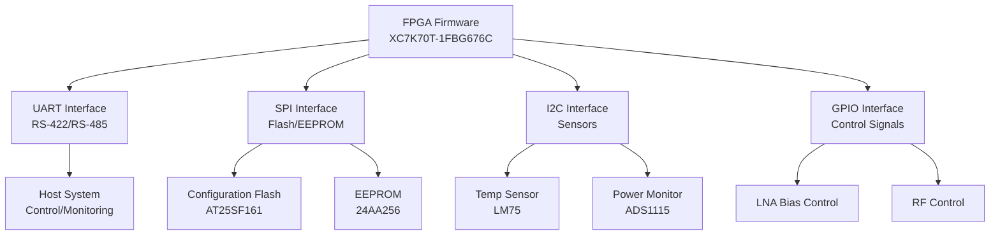

# Software Requirements Specification (SRS)

## Document Control
| Version | Date | Author | Changes |
|---------|------|--------|---------|
| 1.0 | 19 April 2026 | AI-GENERATED | Initial Release |

---

# 1. Introduction

## 1.1 Purpose
This Software Requirements Specification (SRS) documents the requirements for the firmware of the hh dual-channel EW/ELINT front-end receiver system. The document serves as the authoritative source of software requirements for the design, development, verification, and acceptance testing of the hh system firmware. It provides a comprehensive description of the software's functional capabilities, performance parameters, interfaces, operating environments, and design constraints to ensure consistent interpretation by all project stakeholders including firmware engineers, test engineers, system integrators, and quality assurance staff.

This specification establishes a common understanding of the software requirements and provides a basis for the development of detailed design documentation, test plans, acceptance criteria, and verification procedures. All software development activities shall be traceable to the requirements specified herein. The firmware shall implement the control logic for the dual-channel EW/ELINT receiver, including bias sequencing for GaAs pHEMT LNAs, power supply monitoring, temperature monitoring, configuration storage, and communication interfaces.

## 1.2 Scope
The SRS applies to the complete firmware for the hh dual-channel EW/ELINT front-end receiver system, including all software components running on the Xilinx XC7K70T-1FBG676C FPGA. The system comprises two independent receiver channels, each supporting four parallel RF channels per antenna, covering the frequency range from 2-6 GHz with instantaneous bandwidth of 10-100 MHz.

The scope encompasses:
- FPGA firmware implementing control and monitoring functions
- UART communication protocol for register access
- SPI drivers for configuration and storage Flash
- I2C drivers for temperature and power monitoring sensors
- Bias sequencing logic for GaAs pHEMT LNAs
- Power management and monitoring
- System health monitoring and reporting
- Built-in self-test (BIST) functionality
- Configuration storage and retrieval from EEPROM

The requirements specified in this document are applicable to all firmware development phases, from architecture design through implementation, verification, and deployment. Excluded from this scope are the RF signal processing algorithms, hardware design details, and ancillary support equipment not integral to the hh receiver system.

## 1.3 Definitions, Acronyms, and Abbreviations
This section defines key terms, acronyms, and abbreviations used throughout this specification.

### 1.3.1 Definitions
| Term | Definition |
|------|------------|
| EW | Electronic Warfare - Military action involving the use of electromagnetic spectrum to detect, locate, identify, and neutralize hostile use of the spectrum |
| ELINT | Electronic Intelligence - Technical and geolocation intelligence derived from non-communications electromagnetic waves |
| pHEMT | Pseudomorphic High Electron Mobility Transistor - A type of field-effect transistor with enhanced electron mobility |
| SAW | Surface Acoustic Wave - A wave traveling along the surface of a piezoelectric material |
| LNA | Low-Noise Amplifier - An amplifier designed to amplify weak signals while adding minimal noise to the signal |
| BPF | Band-Pass Filter - A filter that permits signals within a certain frequency range to pass through while attenuating frequencies outside that range |
| IIP3 | Third-Order Input Intercept Point - The input power level at which the fundamental tone power equals the third-order intermodulation product power |
| MDS | Minimum Detectable Signal - The lowest signal power level that can be detected by the receiver |
| NF | Noise Figure - A measure of degradation of the signal-to-noise ratio (SNR) caused by components in the RF signal chain |
| VSWR | Voltage Standing Wave Ratio - A measure of how efficiently radio-frequency power is transmitted from a source through a transmission line |
| EW/ELINT Receiver | Electronic Warfare/Electronic Intelligence receiver system designed to detect and analyze electromagnetic signals |
| SRS | Software Requirements Specification - A comprehensive description of the software's intended capabilities, features, and constraints |
| HRS | Hardware Requirements Specification - A comprehensive description of the hardware's intended capabilities, features, and constraints |
| GLR | Glue Logic Requirements - Requirements for the FPGA logic that interfaces between hardware and software components |
| StRS | Stakeholder Requirements Specification - A specification of stakeholder needs and expectations |
| SyRS | System Requirements Specification - A specification of system-level requirements |
| RTOS | Real-Time Operating System - An operating system designed for real-time applications with precise timing and reliability requirements |
| HAL | Hardware Abstraction Layer - A layer of software that provides interfaces to hardware resources |
| BSP | Board Support Package - Software layer that provides hardware-specific interfaces to the operating system |
| ISR | Interrupt Service Routine - A routine executed in response to an interrupt |
| FIFO | First-In-First-Out - A data structure that operates on a first-in-first-out basis |
| NVM | Non-Volatile Memory - Memory that retains stored data when power is turned off |
| CRC | Cyclic Redundancy Check - An error-detecting code commonly used in digital networks and storage devices |
| WDT | Watchdog Timer - A hardware or software timer that triggers a system reset if the main program fails to update it within a specified time |
| PLL | Phase-Locked Loop - A control system that generates an output signal whose phase is related to the phase of an input signal |
| MCU | Microcontroller Unit - A small computer on a single integrated circuit containing a processor, memory, and programmable input/output peripherals |
| FPGA | Field-Programmable Gate Array - An integrated circuit designed to be configured by a customer or designer after manufacturing |
| API | Application Programming Interface - a set of definitions and protocols for building application software |
| BSS | Block Start Symbol - A marker in compiled code indicating the start of the block of uninitialized static variables |
| RTM | Requirements Traceability Matrix - A document that links requirements throughout the development lifecycle |
| JTAG | Joint Test Action Group - A standard for testing integrated circuits and printed circuit boards |
| QSPI | Quad SPI - A serial interface that uses four data lines to achieve higher throughput than standard SPI |
| TRP | Transmitter/Receiver Package - A component that includes both transmitter and receiver functionality |
| ConOps | Concept of Operations - A document describing how a system will be used in operation |
| ASIL | Automotive Safety Integrity Level - A risk classification system for automotive safety-related systems |
| SIL | Safety Integrity Level - A risk classification system for safety-related systems |
| IPC | Inter-Process Communication - The mechanisms provided by an operating system for processes to communicate with each other |
| RPC | Remote Procedure Call - A protocol that allows a computer program to execute a subroutine on another address space |

### 1.3.2 Acronyms and Abbreviations
| Acronym | Description |
|---------|-------------|
| FPGA | Field-Programmable Gate Array |
| UART | Universal Asynchronous Receiver/Transmitter |
| SPI | Serial Peripheral Interface |
| I2C | Inter-Integrated Circuit |
| GPIO | General Purpose Input/Output |
| JTAG | Joint Test Action Group |
| HAL | Hardware Abstraction Layer |
| BSP | Board Support Package |
| ISR | Interrupt Service Routine |
| MISRA | MISRA C - Guidelines for the Use of the C Language in Critical Systems |
| WDT | Watchdog Timer |
| PLL | Phase-Locked Loop |
| MCU | Microcontroller Unit |
| BSS | Block Start Symbol |
| RTM | Requirements Traceability Matrix |
| QSPI | Quad SPI |
| TRP | Transmitter/Receiver Package |
| ConOps | Concept of Operations |
| ASIL | Automotive Safety Integrity Level |
| SIL | Safety Integrity Level |
| IPC | Inter-Process Communication |
| RPC | Remote Procedure Call |
| BIST | Built-In Self Test |
| FIFO | First-In-First-Out |
| NVM | Non-Volatile Memory |
| CRC | Cyclic Redundancy Check |
| StRS | Stakeholder Requirements Specification |
| SyRS | System Requirements Specification |
| RTOS | Real-Time Operating System |
| EW/ELINT | Electronic Warfare/Electronic Intelligence |
| LNA | Low-Noise Amplifier |
| BPF | Band-Pass Filter |
| SAW | Surface Acoustic Wave |
| pHEMT | Pseudomorphic High Electron Mobility Transistor |
| IIP3 | Third-Order Input Intercept Point |
| MDS | Minimum Detectable Signal |
| NF | Noise Figure |
| VSWR | Voltage Standing Wave Ratio |
| IP | Ingress Protection |
| LDO | Low Dropout Regulator |
| DC | Direct Current |
| AC | Alternating Current |
| PSRR | Power Supply Rejection Ratio |
| SNR | Signal-to-Noise Ratio |
| EMI/EMC | Electromagnetic Interference/Compatibility |
| MIL-STD | Military Standard |
| COTS | Commercial Off-The-Shelf |
| PCB | Printed Circuit Board |
| SMA | SubMiniature version A (RF connector) |
| RX | Receiver |
| IF | Intermediate Frequency |
| LO | Local Oscillator |
| dB | Decibel (logarithmic unit) |
| dBm | Decibel referenced to 1 milliwatt |
| GHz | Gigahertz |
| MHz | Megahertz |
| kHz | Kilohertz |
| Hz | Hertz |
| V | Volt |
| mA | Milliampere |
| A | Ampere |
| W | Watt |
| Ω | Ohm |
| K | Kelvin |
| °C | Degrees Celsius |
| μs | Microsecond |
| ns | Nanosecond |
| mm | Millimeter |
| cm | Centimeter |

## 1.4 References
This section lists documents, standards, and technical publications referenced in this SRS.

### 1.4.1 Industry Standards
- IEEE 830-1998, Recommended Practice for Software Requirements Specifications
- ISO/IEC/IEEE 29148:2018, Systems and Software Engineering - Life Cycle Processes - Requirements Engineering
- IEEE 1016-2009, Software Design Descriptions
- MISRA C:2012, Guidelines for the Use of the C Language in Critical Systems
- IEC 61508, Functional Safety of E/E/PE Safety-related Systems
- MIL-STD-810G, Environmental Engineering Considerations and Laboratory Tests
- MIL-STD-461F, Requirements for the Control of Electromagnetic Interference Characteristics of Subsystems and Equipment
- RTCA DO-160G, Environmental Conditions and Test Procedures for Airborne Equipment

### 1.4.2 Project Documents
- Hardware Requirements Specification (HRS) — Project P2
- Glue Logic Requirements (GLR) — Project P6
- Project Block Diagram (P1)
- Netlist Specification (P4)
- Component Datasheets (FPGA, EEPROM, Flash, sensors, power monitors)

### 1.4.3 Component Datasheets
- Xilinx XC7K70T-1FBG676C, Kintex-7 FPGA Data Sheet
- AT25SF161, Serial Flash Memory Data Sheet
- 24AA256, I2C EEPROM Data Sheet
- ADS1115, 16-bit I2C ADC Data Sheet
- LM75, Temperature Sensor Data Sheet
- ADM3251E, RS-422/RS-485 Transceiver Data Sheet
- TPS65263, Power Management IC Data Sheet
- MACOM Technologies, MADL-011017 RF Limiter Datasheet
- TriQuint Semiconductor, SAW-2400-6000 SAW Filter Datasheet
- Mini-Circuits, BTL-1-6-G-S+ Bias Tee Datasheet
- Analog Devices, HMC8411 GaAs pHEMT LNA Datasheet

## 1.5 Overview
This Software Requirements Specification provides the complete set of requirements for the firmware of the hh dual-channel EW/ELINT front-end receiver system. The document is organized into eight main sections:

Section 1, Introduction, provides the purpose, scope, definitions, references, and overview of the SRS document.

Section 2, Overall Description, provides a high-level description of the software product, including its perspective, functions, user characteristics, constraints, and assumptions.

Section 3, Specific Requirements, details the functional requirements, performance requirements, interface requirements, and software system attributes. This section contains the core requirements for the firmware.

Section 4, Verification and Validation, describes the methods and procedures for verifying and validating the software against the requirements.

Section 5, Requirements Traceability Matrix, provides a mapping between each software requirement and its corresponding hardware requirements and glue logic requirements.

Section 6, Appendices, includes supplementary information such as error codes, register maps, and diagrams.

The document is intended to be used by the firmware development team, system integrators, and verification personnel throughout the development lifecycle. It will serve as the basis for detailed design, implementation, testing, and acceptance of the firmware.

---

# 2. Overall Description

## 2.1 Product Perspective
The hh software is a firmware implementation running on a Xilinx XC7K70T-1FBG676C FPGA that controls and monitors a dual-channel EW/ELINT front-end receiver system. The firmware implements the control logic for the RF system, including bias sequencing for GaAs pHEMT LNAs, power supply monitoring, temperature monitoring, configuration storage, and communication interfaces.

The software fits into the larger system as the control and monitoring layer between the hardware components and any higher-level processing systems. It interfaces directly with the hardware through register accesses to the FPGA's peripheral interfaces and indirectly through the sensors and control circuits connected to those interfaces.

### System Context Diagram


### Hardware Interfaces
The firmware interfaces with the following hardware components:
- UART: ADM3251E RS-422/RS-485 transceiver for communication with external host
- SPI: AT25SF161 configuration flash and 24AA256 EEPROM
- I2C: LM75 temperature sensor and ADS1115 power monitor ADC
- GPIO: Control signals for GaAs pHEMT LNA bias sequencing
- Internal FPGA registers: Status monitoring and configuration

### External Systems
The system interfaces with:
- External host system via UART for configuration and status monitoring
- Configuration storage devices (Flash and EEPROM)
- Environmental sensors (temperature)
- Power monitoring circuitry
- RF control circuitry

### Software Stack
The firmware implements a bare-metal software architecture with the following layers:
1. Hardware Abstraction Layer (HAL): Provides interfaces to all hardware peripherals
2. Driver Layer: Implements specific drivers for each peripheral (UART, SPI, I2C, GPIO)
3. Application Layer: Implements system functions including bias sequencing, power monitoring, and communication protocols
4. Interface Layer: Implements the UART register access protocol for external control

## 2.2 Product Functions
The hh software implements the following major functions:

1. **System initialization and boot sequence**
   - Initialize clock configuration
   - Configure PLL settings
   - Initialize all peripherals
   - Load configuration from EEPROM
   - Perform power-on self-test (POST)
   - Enable watchdog timer

2. **Hardware abstraction layer (HAL) for each peripheral**
   - UART driver with FIFO support
   - SPI driver with support for Flash and EEPROM
   - I2C driver with support for multiple devices
   - GPIO driver for control signals
   - Timer and watchdog functionality

3. **UART command/response handler**
   - Implement register read/write protocol
   - Support single register access
   - Support bulk register access
   - Validate commands and addresses
   - Generate proper responses and acknowledgments

4. **PLL configuration and lock management**
   - Configure PLL settings for required frequencies
   - Monitor PLL lock status
   - Handle PLL lock failure
   - Implement PLL soft reset functionality

5. **Temperature monitoring and alert handling**
   - Read temperature from LM75 sensor
   - Monitor temperature against thresholds
   - Generate alerts when thresholds exceeded
   - Implement thermal protection measures

6. **Voltage/current monitoring**
   - Read power supply voltages via ADS1115
   - Monitor against nominal values
   - Detect over/under voltage conditions
   - Generate alerts for fault conditions

7. **EEPROM read/write driver**
   - Implement low-level EEPROM access
   - Support byte and page operations
   - Verify data integrity after writes
   - Manage EEPROM wear leveling

8. **Configuration Flash driver**
   - Implement Flash read, write, and erase operations
   - Verify written data
   - Manage Flash memory organization
   - Support firmware updates

9. **LED and GPIO control**
   - Control status LEDs
   - Manage GPIO output states
   - Monitor GPIO input states
   - Implement control signal sequencing

10. **Watchdog timer management**
    - Initialize watchdog timer
    - Service watchdog periodically
    - Handle watchdog timeout
    - Implement system recovery

11. **JTAG/debug interface support**
    - Provide basic JTAG functionality
    - Support debug access
    - Implement debug register access
    - Enable/disable debug features

12. **Power-on self-test (POST)**
    - Test RAM functionality
    - Verify peripheral communication
    - Check PLL lock
    - Validate sensor readings
    - Report test results

13. **Error logging and fault handling**
    - Maintain fault log buffer
    - Log error codes and timestamps
    - Implement error recovery procedures
    - Report critical errors to host

14. **RF control**
    - Implement GaAs pHEMT bias sequencing
    - Control RF switches and attenuators
    - Monitor RF channel status
    - Implement protection features

15. **Calibration data management**
    - Load calibration data from EEPROM/Flash
    - Apply calibration corrections
    - Store updated calibration values
    - Manage calibration validity

16. **System health monitoring**
    - Monitor all critical parameters
    - Implement system status reporting
    - Detect abnormal conditions
    - Implement graceful degradation

17. **Configuration management**
    - Store and retrieve system configuration
    - Validate configuration parameters
    - Apply configuration changes
    - Support configuration backup and restore

18. **Firmware update**
    - Implement firmware download
    - Verify firmware integrity
    - Update configuration Flash
    - Implement rollback capability

19. **Communication protocol handling**
    - Implement UART frame parsing
    - Generate command responses
    - Handle communication errors
    - Manage communication state

20. **System power management**
    - Monitor power supply status
    - Implement power sequencing
    - Handle power fault conditions
    - Support low-power modes

## 2.3 User Characteristics
The intended users of the hh software include:

1. **Firmware engineers (primary developers)**
   - Responsible for implementing and maintaining the firmware
   - Require detailed specifications of all interfaces and protocols
   - Need comprehensive error handling and diagnostics
   - Require thorough documentation of all functions and data structures

2. **Test engineers (system-level test)**
   - Responsible for verifying system functionality
   - Require comprehensive diagnostic capabilities
   - Need detailed status reporting and logging
   - Require interfaces for automated testing

3. **Field engineers (diagnostics via UART)**
   - Responsible for system deployment and maintenance
   - Require remote diagnostic capabilities
   - Need status monitoring and configuration tools
   - Require comprehensive error reporting

4. **System integrators**
   - Responsible for integrating the hh system into larger platforms
   - Require well-defined interfaces and protocols
   - Need documentation of system behavior and dependencies
   - Require compliance with integration standards

## 2.4 Constraints
The hh software must operate under the following constraints:

1. **MISRA-C:2012 compliance mandatory**
   - All code must comply with MISRA-C:2012 guidelines
   - Static analysis must pass MISRA rules
   - No deviations without proper justification and approval
   - Rule violations must be documented and justified

2. **Real-time response constraints**
   - UART command response within 10ms
   - Temperature monitoring cycle within 500ms
   - Power monitoring cycle within 200ms
   - Critical interrupt handling within 100μs

3. **Memory budget**
   - Flash usage limited to 8MB (AT25SF161)
   - RAM usage limited to 128KB available FPGA block RAM
   - EEPROM usage limited to 256KB (24AA256)
   - Stack usage analyzed and bounded

4. **Clock frequency constraints**
   - System clock: 100MHz
   - SPI clock: Max 25MHz
   - I2C clock: Max 400kHz
   - UART baud rate: Up to 1Mbps

5. **Execution model**
   - Bare-metal implementation (no RTOS)
   - Interrupt-driven for time-critical operations
   - Main loop for background tasks
   - No preemptive multitasking

6. **Coding language**
   - Primary language: C (C99)
   - Assembly only where absolutely necessary
   - No C++ features used
   - Standard C library usage minimized

7. **Toolchain requirements**
   - Xilinx Vivado SDK for FPGA development
   - GCC toolchain for C compilation
   - LD linker script for memory layout
   - Support for JTAG debugging

8. **Hardware revision compatibility**
   - Software must support all hardware revisions
   - Configuration must be hardware-version aware
   - Compatibility registers must be checked at startup
   - Different behavior based on hardware capabilities

## 2.5 Assumptions and Dependencies
The hh software makes the following assumptions about the system:

1. **Hardware behavior assumptions**
   - Power sequencing completes before software execution
   - Clock sources are stable and accurate before peripheral initialization
   - All components are functional and properly connected
   - Reset signal is clean and properly synchronized

2. **Operating temperature range**
   - System operates within -55°C to +125°C per HRS requirements
   - Sensor readings are accurate across the entire range
   - Performance parameters remain within specifications
   - No thermal throttling required

3. **Clock stability**
   - 100MHz reference clock is stable and accurate
   - PLL locks properly within specified time
   - No clock jitter or drift during operation
   - All timing constraints are met

4. **Network/communication availability**
   - UART interface is available for external communication
   - No communication required for basic functionality
   - Communication failures do not affect core operation
   - Host system may be unavailable at times

5. **Power supply assumptions**
   - +12V supply is stable and within specifications
   - All derived voltages are properly regulated
   - Power sequencing is correct
   - Power monitoring sensors are functional

---

# 3. Specific Requirements

## 3.1 External Interface Requirements

### 3.1.1 Hardware Interfaces

#### 3.1.1.1 UART Interface
The UART interface provides communication with an external host system using an ADM3251E RS-422/RS-485 transceiver.

**Interface Protocol:**
- Baud rate: Up to 1 Mbps
- Data bits: 8
- Stop bits: 1
- Parity: None
- Flow control: None

**Register Map (FPGA registers accessible via UART):**
```c
typedef struct {
    volatile uint16_t BOARD_ID;     // 0x0000: Board identification
    volatile uint16_t FIRMWARE_VER; // 0x0001: Firmware version
    volatile uint16_t STATUS_REG;   // 0x0002: System status bits
    volatile uint16_t CTRL_REG;     // 0x0003: System control bits
    volatile uint16_t TEMP_DATA;    // 0x0004: Temperature sensor data
    volatile uint16_t TEMP_ALERT;   // 0x0005: Temperature alert status
    volatile uint16_t POWER_V1;     // 0x0006: Power supply rail 1 voltage
    volatile uint16_t POWER_V2;     // 0x0007: Power supply rail 2 voltage
    volatile uint16_t POWER_V3;     // 0x0008: Power supply rail 3 voltage
    volatile uint16_t POWER_ALERT;  // 0x0009: Power alert status
    volatile uint16_t PLL_STATUS;   // 0x000A: PLL lock status
    volatile uint16_t LNA_CTRL_1;   // 0x000B: LNA control channel 1
    volatile uint16_t LNA_CTRL_2;   // 0x000C: LNA control channel 2
    volatile uint16_t RF_STATUS_1;   // 0x000D: RF status channel 1
    volatile uint16_t RF_STATUS_2;   // 0x000E: RF status channel 2
    volatile uint16_t ERROR_CODE;    // 0x000F: Error code
    // Additional registers as needed
} UART_RegMap_t;
```

**Driver API:**
```c
/**
 * @brief Initialize UART interface with specified baud rate
 * @param baud_rate Desired baud rate (e.g., 9600, 115200, 1000000)
 * @return 0 on success, error code on failure
 */
int32_t UART_Init(uint32_t baud_rate);

/**
 * @brief Write a single register value via UART
 * @param addr Register address (0x0000-0xFFFF)
 * @param data Data to write
 * @return 0 on success, error code on failure
 */
int32_t UART_WriteReg(uint16_t addr, uint16_t data);

/**
 * @brief Read a single register value via UART
 * @param addr Register address (0x0000-0xFFFF)
 * @param data Pointer to store read data
 * @return 0 on success, error code on failure
 */
int32_t UART_ReadReg(uint16_t addr, uint16_t *data);

/**
 * @brief Write multiple consecutive register values via UART
 * @param start_addr Starting register address
 * @param data Pointer to array of data values
 * @param count Number of registers to write
 * @return 0 on success, error code on failure
 */
int32_t UART_BulkWrite(uint16_t start_addr, const uint16_t *data, uint8_t count);

/**
 * @brief Read multiple consecutive register values via UART
 * @param start_addr Starting register address
 * @param buf Pointer to buffer to store data
 * @param count Number of registers to read
 * @return 0 on success, error code on failure
 */
int32_t UART_BulkRead(uint16_t start_addr, uint16_t *buf, uint8_t count);

/**
 * @brief Check UART TX buffer status
 * @return Number of free bytes in TX buffer
 */
uint16_t UART_GetTXFreeSpace(void);

/**
 * @brief Check UART RX buffer status
 * @return Number of bytes available in RX buffer
 */
uint16_t UART_GetRXDataCount(void);
```

**Error Handling:**
- If register address is invalid, return ERR_ADDR_RANGE
- If UART is not initialized, return ERR_NOT_INIT
- If TX buffer is full, return ERR_RESOURCE
- If communication timeout occurs, return ERR_TIMEOUT

#### 3.1.1.2 SPI Interface (EEPROM/Flash)
The SPI interface provides communication with external storage devices, including AT25SF161 configuration flash and 24AA256 EEPROM.

**Interface Protocol:**
- Mode: SPI Mode 0 (CPOL=0, CPHA=0)
- Clock speed: Up to 25MHz
- Data bits: 8
- Chip selects: Separate CS for Flash and EEPROM

**EEPROM Register Map:**
```c
/**
 * @brief EEPROM command codes
 */
#define EEPROM_CMD_WRITE_ENABLE   0x06
#define EEPROM_CMD_WRITE_DISABLE  0x04
#define EEPROM_CMD_READ_STATUS    0x05
#define EEPROM_CMD_READ_DATA      0x03
#define EEPROM_CMD_WRITE_DATA     0x02

/**
 * @brief SPI Register Map
 */
typedef struct {
    volatile uint16_t SPI_CTRL;     // 0x0100: SPI control register
    volatile uint16_t SPI_STATUS;   // 0x0101: SPI status register
    volatile uint16_t SPI_CS_CTRL;  // 0x0102: Chip select control
    volatile uint16_t SPI_DATA;     // 0x0103: SPI data register
} SPI_RegMap_t;
```

**Driver API:**
```c
/**
 * @brief Initialize SPI interface
 * @param clock_hz Desired clock frequency in Hz
 * @param mode SPI mode (0-3)
 * @return 0 on success, error code on failure
 */
int32_t SPI_Init(uint32_t clock_hz, uint8_t mode);

/**
 * @brief Read a byte from EEPROM
 * @param addr EEPROM address to read from
 * @param data Pointer to store read byte
 * @return 0 on success, error code on failure
 */
int32_t EEPROM_ReadByte(uint16_t addr, uint8_t *data);

/**
 * @brief Write a byte to EEPROM
 * @param addr EEPROM address to write to
 * @param data Data byte to write
 * @return 0 on success, error code on failure
 */
int32_t EEPROM_WriteByte(uint16_t addr, uint8_t data);

/**
 * @brief Read a page from EEPROM
 * @param addr EEPROM starting address
 * @param buf Pointer to buffer to store data
 * @param len Number of bytes to read
 * @return 0 on success, error code on failure
 */
int32_t EEPROM_ReadPage(uint16_t addr, uint8_t *buf, uint16_t len);

/**
 * @brief Write a page to EEPROM
 * @param addr EEPROM starting address
 * @param buf Pointer to buffer containing data
 * @param len Number of bytes to write
 * @return 0 on success, error code on failure
 */
int32_t EEPROM_WritePage(uint16_t addr, const uint8_t *buf, uint16_t len);

/**
 * @brief Read a sector from Flash memory
 * @param addr Flash sector address
 * @param buf Pointer to buffer to store data
 * @param len Number of bytes to read
 * @return 0 on success, error code on failure
 */
int32_t Flash_ReadSector(uint32_t addr, uint8_t *buf, uint32_t len);

/**
 * @brief Write a sector to Flash memory
 * @param addr Flash sector address
 * @param buf Pointer to buffer containing data
 * @param len Number of bytes to write
 * @return 0 on success, error code on failure
 */
int32_t Flash_WriteSector(uint32_t addr, const uint8_t *buf, uint32_t len);

/**
 * @brief Erase a sector in Flash memory
 * @param addr Flash sector address to erase
 * @return 0 on success, error code on failure
 */
int32_t Flash_EraseSector(uint32_t addr);
```

**Error Handling:**
- If EEPROM write fails, return ERR_EEPROM
- If Flash write fails, return ERR_FLASH_WRITE
- If Flash erase fails, return ERR_FLASH_ERASE
- If SPI communication timeout, return ERR_COMM

#### 3.1.1.3 I2C Interface (Temperature/Power monitoring)
The I2C interface provides communication with external sensors, including LM75 temperature sensor and ADS1115 power monitor ADC.

**Interface Protocol:**
- Mode: Standard mode (100kHz) or Fast mode (400kHz)
- 7-bit device addresses
- Acknowledge/No-acknowledge protocol

**Device Addresses:**
```c
#define LM75_I2C_ADDR        0x48  // Temperature sensor
#define ADS1115_I2C_ADDR     0x48  // Power monitor (A0=GND)
```

**Driver API:**
```c
/**
 * @brief Initialize I2C interface
 * @param clock_hz Desired clock frequency in Hz (100000 or 400000)
 * @return 0 on success, error code on failure
 */
int32_t I2C_Init(uint32_t clock_hz);

/**
 * @brief Read an 8-bit register from I2C device
 * @param dev_addr I2C device address (7-bit)
 * @param reg Register address to read
 * @param data Pointer to store read data
 * @return 0 on success, error code on failure
 */
int32_t I2C_ReadReg8(uint8_t dev_addr, uint8_t reg, uint8_t *data);

/**
 * @brief Write an 8-bit register to I2C device
 * @param dev_addr I2C device address (7-bit)
 * @param reg Register address to write
 * @param data Data to write
 * @return 0 on success, error code on failure
 */
int32_t I2C_WriteReg8(uint8_t dev_addr, uint8_t reg, uint8_t data);

/**
 * @brief Read temperature from LM75 sensor
 * @param sensor_id Sensor identifier (0-3 for multiple sensors)
 * @param temp_degC Pointer to store temperature in degrees Celsius
 * @return 0 on success, error code on failure
 */
int32_t TempSensor_ReadTemp(uint8_t sensor_id, float *temp_degC);

/**
 * @brief Read voltage from power monitor ADC
 * @param channel ADC channel (0-3)
 * @param voltage_V Pointer to store voltage in volts
 * @return 0 on success, error code on failure
 */
int32_t PowerMon_ReadVoltage(uint8_t channel, float *voltage_V);

/**
 * @brief Read current from power monitor ADC
 * @param channel ADC channel (0-3)
 * @param current_A Pointer to store current in amperes
 * @return 0 on success, error code on failure
 */
int32_t PowerMon_ReadCurrent(uint8_t channel, float *current_A);
```

**Error Handling:**
- If I2C communication fails, return ERR_COMM
- If sensor does not respond, return ERR_TIMEOUT
- If sensor reading is invalid, return ERR_HARDWARE

### 3.1.2 Software Interfaces
The software interfaces include:

1. **Operating system / RTOS API**
   - No RTOS used (bare-metal implementation)
   - Basic timer services for timing operations
   - Interrupt handling for peripheral events

2. **Standard C library usage**
   - Limited to essential functions
   - No dynamic memory allocation
   - Minimal floating-point operations
   - String functions only for logging and debugging

3. **Logging framework interface**
   - System log for normal operation events
   - Error log for fault conditions
   - Debug log for development information
   - All logging via UART interface

### 3.1.3 Communication Interfaces
The UART interface implements a register access protocol for external control:

**Frame Formats:**

| Command | CMD byte | Frame Structure | Response |
|---------|----------|-----------------|----------|
| Single Write | 0x57 ('W') | [0x57][ADDR_H][ADDR_L][DATA_H][DATA_L] | [0x06] ACK |
| Single Read  | 0x52 ('R') | [0x52][ADDR_H\|0x80][ADDR_L] | [DATA_H][DATA_L] |
| Bulk Write   | 0x42 ('B') | [0x42][ADDR_H][ADDR_L][N][D0_H][D0_L]...[Dn_H][Dn_L] | [0x06] ACK |
| Bulk Read    | 0x62 ('b') | [0x62][ADDR_H\|0x80][ADDR_L][N] | [D0_H][D0_L]...[Dn_H][Dn_L] |
| Error NAK    | 0x15 | Sent by FPGA on invalid command/address | — |

**Protocol Details:**
- **Address Space:** 16-bit (0x0000–0xFFFF); read addresses have bit15 set (OR 0x8000)
- **Maximum Bulk Count (N):** 64 registers per transaction
- **Timeouts:** 
  - Host must respond within 10ms to any command
  - FPGA resets parser after 50ms inter-byte gap
- **Response Codes:**
  - ACK byte: 0x06 (acknowledge)
  - NAK byte: 0x15 (negative acknowledge)
- **CRC Options:**
  - Baseline protocol has no CRC
  - CRC-16 CCITT (0x1021) optional for enhanced reliability
  - Feature flag in config flash enables CRC checks

**Command Processing:**
1. UART receives and parses incoming command
2. Validates command byte and address range
3. Processes read/write operation
4. Generates appropriate response
5. Handles error conditions with NAK response

## 3.2 Functional Requirements

### 3.2.1 System Initialization (REQ-SW-001 to REQ-SW-010)

REQ-SW-001: The software SHALL complete power-on self-test (POST) within 500ms of reset de-assertion.  
Source: GLR §4 Features  
Priority: [M]andatory  
Verification: [T]est

REQ-SW-002: The software SHALL verify BOARD_ID register matches expected value 0x1234 on startup; assert ERROR if mismatch.  
Source: GLR §7 FPGA Description  
Priority: [M]andatory  
Verification: [T]est

REQ-SW-003: The software SHALL configure PLL to target frequency 100MHz within 5ms of startup.  
Source: GLR §4 Features  
Priority: [M]andatory  
Verification: [T]est

REQ-SW-004: The software SHALL poll PLL_STATUS.LOCKED bit with 100ms timeout; assert ERROR if timeout.  
Source: GLR §4 Features  
Priority: [M]andatory  
Verification: [T]est

REQ-SW-005: The software SHALL initialize all SPI peripherals before enabling application tasks.  
Source: GLR §4 Features  
Priority: [M]andatory  
Verification: [I]nspection

REQ-SW-006: The software SHALL load calibration data from EEPROM into RAM on startup.  
Source: GLR §4 Features  
Priority: [M]andatory  
Verification: [T]est

REQ-SW-007: The software SHALL initialize watchdog timer with 100ms timeout before entering main loop.  
Source: GLR §4 Features  
Priority: [M]andatory  
Verification: [T]est

REQ-SW-008: The software SHALL log firmware version to UART on startup.  
Source: GLR §4 Features  
Priority: [D]esirable  
Verification: [T]est

REQ-SW-009: The software SHALL perform RAM BIST (built-in self-test) on 64KB of SRAM.  
Source: GLR §4 Features  
Priority: [M]andatory  
Verification: [T]est

REQ-SW-010: The software SHALL set LED_STATUS to BLINKING at 1Hz during initialization.  
Source: GLR §4 Features  
Priority: [D]esirable  
Verification: [T]est

### 3.2.2 UART Communication Driver (REQ-SW-011 to REQ-SW-020)

REQ-SW-011: The UART driver SHALL support baud rates of 9600, 19200, 38400, 57600, 115200, and 1000000.  
Source: GLR §5 Features  
Priority: [M]andatory  
Verification: [T]est

REQ-SW-012: The driver SHALL implement the Single Write command (0x57) as defined in the GLR frame format.  
Source: GLR §3.1.3  
Priority: [M]andatory  
Verification: [T]est

REQ-SW-013: The driver SHALL implement the Single Read command (0x52) with ADDR bit15=1.  
Source: GLR §3.1.3  
Priority: [M]andatory  
Verification: [T]est

REQ-SW-014: The driver SHALL implement the Bulk Write command (0x42) for up to 64 consecutive registers.  
Source: GLR §3.1.3  
Priority: [M]andatory  
Verification: [T]est

REQ-SW-015: The driver SHALL implement the Bulk Read command (0x62) for up to 64 consecutive registers.  
Source: GLR §3.1.3  
Priority: [M]andatory  
Verification: [T]est

REQ-SW-016: The driver SHALL respond to an invalid command byte with NAK (0x15) within 100μs.  
Source: GLR §3.1.3  
Priority: [M]andatory  
Verification: [T]est

REQ-SW-017: The driver SHALL support a TX FIFO of at least 256 bytes.  
Source: GLR §5 Features  
Priority: [M]andatory  
Verification: [T]est

REQ-SW-018: The driver SHALL support an RX FIFO of at least 256 bytes.  
Source: GLR §5 Features  
Priority: [M]andatory  
Verification: [T]est

REQ-SW-019: The driver SHALL clear UART_STATUS.FRAME_ERR flag on read.  
Source: GLR §4 Features  
Priority: [M]andatory  
Verification: [T]est

REQ-SW-020: The driver SHALL recover from framing errors without hardware reset.  
Source: GLR §4 Features  
Priority: [M]andatory  
Verification: [T]est

### 3.2.3 Temperature Monitoring (REQ-SW-021 to REQ-SW-030)

REQ-SW-021: The software SHALL read temperature from all configured sensors every 2 seconds.  
Source: GLR §5 Features  
Priority: [M]andatory  
Verification: [T]est

REQ-SW-022: The software SHALL generate a TEMP_ALERT interrupt when temperature exceeds 85°C.  
Source: GLR §4 Features  
Priority: [M]andatory  
Verification: [T]est

REQ-SW-023: The software SHALL log temperature to UART status register every 10 seconds.  
Source: GLR §4 Features  
Priority: [D]esirable  
Verification: [T]est

REQ-SW-024: The software SHALL disable RF output (TRP=LOW) when temperature exceeds 95°C.  
Source: GLR §4 Features  
Priority: [M]andatory  
Verification: [T]est

REQ-SW-025: The software SHALL re-enable RF output when temperature drops below 90°C (hysteresis).  
Source: GLR §4 Features  
Priority: [M]andatory  
Verification: [T]est

REQ-SW-026: The software SHALL implement a configurable temperature alert threshold via EEPROM.  
Source: GLR §4 Features  
Priority: [D]esirable  
Verification: [T]est

REQ-SW-027: The software SHALL verify LM75 sensor communication on startup and report status.  
Source: GLR §5 Features  
Priority: [M]andatory  
Verification: [T]est

REQ-SW-028: The software SHALL provide temperature status in UART register TEMP_DATA.  
Source: GLR §7 FPGA Description  
Priority: [M]andatory  
Verification: [T]est

REQ-SW-029: The software SHALL implement temperature averaging over 10 samples for stability.  
Source: GLR §4 Features  
Priority: [D]esirable  
Verification: [T]est

REQ-SW-030: The software SHALL generate a system error if temperature sensor fails to respond.  
Source: GLR §4 Features  
Priority: [M]andatory  
Verification: [T]est

### 3.2.4 Power Management (REQ-SW-031 to REQ-SW-040)

REQ-SW-031: The software SHALL monitor all power rails every 200ms via ADS1115 ADC registers.  
Source: GLR §5 Features  
Priority: [M]andatory  
Verification: [T]est

REQ-SW-032: The software SHALL assert a fault condition if any rail deviates >5% from nominal values.  
Source: GLR §4 Features  
Priority: [M]andatory  
Verification: [T]est

REQ-SW-033: The software SHALL read voltage from three power supply rails: +3.3V, +5V, and +12V.  
Source: GLR §5 Features  
Priority: [M]andatory  
Verification: [T]est

REQ-SW-034: The software SHALL generate a POWER_ALERT interrupt if any voltage exceeds thresholds.  
Source: GLR §4 Features  
Priority: [M]andatory  
Verification: [T]est

REQ-SW-035: The software SHALL provide power status in UART registers POWER_V1, POWER_V2, POWER_V3.  
Source: GLR §7 FPGA Description  
Priority: [M]andatory  
Verification: [T]est

REQ-SW-036: The software SHALL implement power-good monitoring and report status in POWER_STATUS register.  
Source: GLR §7 FPGA Description  
Priority: [M]andatory  
Verification: [T]est

REQ-SW-037: The software SHALL implement power sequencing according to GaAs pHEMT requirements.  
Source: HRS REQ-HW-016  
Priority: [M]andatory  
Verification: [T]est

REQ-SW-038: The software SHALL monitor current draw and log excessive consumption.  
Source: GLR §4 Features  
Priority: [D]esirable  
Verification: [T]est

REQ-SW-039: The software SHALL implement a brown-out detection mechanism.  
Source: GLR §4 Features  
Priority: [M]andatory  
Verification: [T]est

REQ-SW-040: The software SHALL generate a system error if power monitoring fails.  
Source: GLR §4 Features  
Priority: [M]andatory  
Verification: [T]est

### 3.2.5 Flash Management (REQ-SW-041 to REQ-SW-050)

REQ-SW-041: The Flash driver SHALL support read, write, and sector-erase operations.  
Source: GLR §5 Features  
Priority: [M]andatory  
Verification: [T]est

REQ-SW-042: The Flash driver SHALL verify written data with read-back CRC.  
Source: GLR §4 Features  
Priority: [M]andatory  
Verification: [T]est

REQ-SW-043: The software SHALL implement a firmware update mechanism via UART interface.  
Source: GLR §4 Features  
Priority: [M]andatory  
Verification: [T]est

REQ-SW-044: The software SHALL validate firmware image with CRC-32 before applying update.  
Source: GLR §4 Features  
Priority: [M]andatory  
Verification: [T]est

REQ-SW-045: The software SHALL maintain backup firmware in Flash and implement rollback capability.  
Source: GLR §4 Features  
Priority: [M]andatory  
Verification: [T]est

REQ-SW-046: The software SHALL implement write protection for critical Flash regions.  
Source: GLR §4 Features  
Priority: [M]andatory  
Verification: [I]nspection

REQ-SW-047: The software SHALL provide Flash status in UART register FLASH_STATUS.  
Source: GLR §7 FPGA Description  
Priority: [D]esirable  
Verification: [T]est

REQ-SW-048: The software SHALL implement wear leveling for Flash memory.  
Source: GLR §4 Features  
Priority: [D]esirable  
Verification: [A]nalysis

REQ-SW-049: The software SHALL manage Flash erase cycles and report expected lifetime.  
Source: GLR §4 Features  
Priority: [D]esirable  
Verification: [T]est

REQ-SW-050: The software SHALL implement a safe firmware update procedure with recovery.  
Source: GLR §4 Features  
Priority: [M]andatory  
Verification: [D]emonstration

### 3.2.6 RF Control (REQ-SW-051 to REQ-SW-060)

REQ-SW-051: The software SHALL implement GaAs pHEMT bias sequencing with gate-before-drain sequencing.  
Source: HRS REQ-HW-016  
Priority: [M]andatory  
Verification: [T]est

REQ-SW-052: The software SHALL provide LNA control via UART registers LNA_CTRL_1 and LNA_CTRL_2.  
Source: GLR §7 FPGA Description  
Priority: [M]andatory  
Verification: [T]est

REQ-SW-053: The software SHALL implement RF channel control for up to 4 channels per antenna.  
Source: GLR §5 Features  
Priority: [M]andatory  
Verification: [T]est

REQ-SW-054: The software SHALL provide RF status in UART registers RF_STATUS_1 and RF_STATUS_2.  
Source: GLR §7 FPGA Description  
Priority: [M]andatory  
Verification: [T]est

REQ-SW-055: The software SHALL implement RF protection features for high-power signals.  
Source: HRS REQ-HW-005  
Priority: [M]andatory  
Verification: [T]est

REQ-SW-056: The software SHALL verify LNA communication on startup and report status.  
Source: GLR §4 Features  
Priority: [M]andatory  
Verification: [T]est

REQ-SW-057: The software SHALL implement RF gain control via GPIO interfaces.  
Source: GLR §5 Features  
Priority: [D]esirable  
Verification: [T]est

REQ-SW-058: The software SHALL implement RF calibration data loading and application.  
Source: GLR §5 Features  
Priority: [D]esirable  
Verification: [T]est

REQ-SW-059: The software SHALL implement frequency tuning control if required.  
Source: HRS REQ-HW-001  
Priority: [D]esirable  
Verification: [T]est

REQ-SW-060: The software SHALL implement RF antenna switching if required.  
Source: GLR §5 Features  
Priority: [D]esirable  
Verification: [T]est

### 3.2.7 EEPROM Management (REQ-SW-061 to REQ-SW-070)

REQ-SW-061: The software SHALL implement EEPROM read/write operations via SPI interface.  
Source: GLR §5 Features  
Priority: [M]andatory  
Verification: [T]est

REQ-SW-062: The software SHALL store calibration data in EEPROM with validation.  
Source: GLR §5 Features  
Priority: [M]andatory  
Verification: [T]est

REQ-SW-063: The software SHALL implement EEPROM wear leveling for extended lifetime.  
Source: GLR §4 Features  
Priority: [D]esirable  
Verification: [A]nalysis

REQ-SW-064: The software SHALL provide configuration parameters via EEPROM storage.  
Source: GLR §5 Features  
Priority: [M]andatory  
Verification: [T]est

REQ-SW-065: The software SHALL implement CRC-16 on EEPROM data writes for integrity.  
Source: GLR §4 Features  
Priority: [M]andatory  
Verification: [T]est

REQ-SW-066: The software SHALL verify EEPROM data integrity after each write operation.  
Source: GLR §5 Features  
Priority: [M]andatory  
Verification: [T]est

REQ-SW-067: The software SHALL provide EEPROM status in UART register EEPROM_STATUS.  
Source: GLR §7 FPGA Description  
Priority: [D]esirable  
Verification: [T]est

REQ-SW-068: The software SHALL implement a backup of critical EEPROM data.  
Source: GLR §4 Features  
Priority: [D]esirable  
Verification: [T]est

REQ-SW-069: The software SHALL implement EEPROM recovery procedures for corruption.  
Source: GLR §4 Features  
Priority: [M]andatory  
Verification: [D]emonstration

REQ-SW-070: The software SHALL implement EEPROM write protection for critical regions.  
Source: GLR §4 Features  
Priority: [M]andatory  
Verification: [I]nspection

### 3.2.8 Diagnostics and Built-In Test (REQ-SW-071 to REQ-SW-075+)

REQ-SW-071: The software SHALL implement a Power-On Self-Test (POST) covering RAM BIST, peripheral communication check, and PLL lock verification.  
Source: GLR §4 Features  
Priority: [M]andatory  
Verification: [T]est

REQ-SW-072: The software SHALL log all detected faults to a circular fault log buffer in EEPROM (minimum 64 entries, FIFO).  
Source: GLR §4 Features  
Priority: [M]andatory  
Verification: [T]est

REQ-SW-073: The software SHALL expose a UART diagnostic command (0xD0) that dumps the fault log buffer to the host.  
Source: GLR §4 Features  
Priority: [M]andatory  
Verification: [T]est

REQ-SW-074: The software SHALL maintain a software execution counter (uptime seconds) readable via UART register.  
Source: GLR §7 FPGA Description  
Priority: [D]esirable  
Verification: [T]est

REQ-SW-075: The software SHALL implement a built-in loopback test for the UART driver (internal Tx→Rx at startup).  
Source: GLR §4 Features  
Priority: [M]andatory  
Verification: [T]est

REQ-SW-076: The software SHALL implement a system test mode via UART command for comprehensive diagnostics.  
Source: GLR §4 Features  
Priority: [D]esirable  
Verification: [T]est

REQ-SW-077: The software SHALL provide hardware version information in register HW_VERSION.  
Source: GLR §7 FPGA Description  
Priority: [M]andatory  
Verification: [T]est

REQ-SW-078: The software SHALL implement a memory test pattern generator for RAM testing.  
Source: GLR §4 Features  
Priority: [D]esirable  
Verification: [T]est

REQ-SW-079: The software SHALL implement periodic background diagnostics during operation.  
Source: GLR §4 Features  
Priority: [D]esirable  
Verification: [T]est

REQ-SW-080: The software SHALL provide system health status in register SYSTEM_HEALTH.  
Source: GLR §7 FPGA Description  
Priority: [M]andatory  
Verification: [T]est

## 3.3 Performance Requirements

REQ-PERF-001: Main loop execution cycle SHALL complete within 50ms.  
Verification: [T]est

REQ-PERF-002: UART register write SHALL complete within 1ms end-to-end.  
Verification: [T]est

REQ-PERF-003: Temperature read cycle SHALL complete within 100ms.  
Verification: [T]est

REQ-PERF-004: SPI Flash page write SHALL complete within 20ms.  
Verification: [T]est

REQ-PERF-005: PLL lock acquisition SHALL complete within 5ms.  
Verification: [T]est

REQ-PERF-006: System startup SHALL complete within 100ms.  
Verification: [T]est

REQ-PERF-007: ISR latency SHALL not exceed 10μs.  
Verification: [A]nalysis

REQ-PERF-008: Watchdog pet interval SHALL be 50ms maximum.  
Verification: [T]est

REQ-PERF-009: RAM usage SHALL not exceed 50% of available RAM.  
Verification: [A]nalysis

REQ-PERF-010: Flash usage SHALL not exceed 70% of available flash.  
Verification: [A]nalysis

REQ-PERF-011: UART response time SHALL be less than 10ms.  
Verification: [T]est

REQ-PERF-012: I2C communication delay SHALL be less than 5ms.  
Verification: [T]est

## 3.4 Design Constraints

REQ-DES-001: The software SHALL comply with MISRA-C:2012 (mandatory — safety-critical embedded).  
Rationale: Ensures code safety and reliability in critical embedded systems.  
Verification: [I]nspection

REQ-DES-002: The software SHALL use C99 standard without C++ features.  
Rationale: Ensures portability and avoids C++ complexities in embedded systems.  
Verification: [I]nspection

REQ-DES-003: The software SHALL NOT use dynamic memory allocation (malloc/free forbidden).  
Rationale: Prevents memory fragmentation and unpredictable timing in real-time systems.  
Verification: [I]nspection

REQ-DES-004: The software SHALL perform stack depth analysis for all interrupt routines.  
Rationale: Ensures stack overflow prevention in embedded systems with limited memory.  
Verification: [A]nalysis

REQ-DES-005: The software SHALL complete all interrupt service routines within 100μs.  
Rationale: Ensures system responsiveness during critical interrupts.  
Verification: [T]est

REQ-DES-006: The software SHALL qualify all global variables as volatile where needed.  
Rationale: Ensures correct visibility of shared variables across interrupts and main code.  
Verification: [I]nspection

REQ-DES-007: The software SHALL NOT use recursion in any function.  
Rationale: Prevents stack overflow and unpredictable behavior in embedded systems.  
Verification: [I]nspection

REQ-DES-008: The software SHALL implement CRC-32 on all non-volatile data writes.  
Rationale: Ensures data integrity for critical stored information.  
Verification: [T]est

## 3.5 Software System Attributes

### 3.5.1 Reliability

REQ-REL-001: The system SHALL achieve an MTBF of 10,000 hours of continuous operation.  
Verification: [A]nalysis

REQ-REL-002: The software SHALL implement error detection and recovery for all peripherals.  
Verification: [T]est

REQ-REL-003: The software SHALL implement a watchdog timer recovery mechanism for system failures.  
Verification: [T]est

REQ-REL-004: The system SHALL continue in degraded mode if a non-critical peripheral fails.  
Verification: [D]emonstration

### 3.5.2 Availability

REQ-AVAIL-001: The system SHALL achieve 99.9% availability during normal operation.  
Verification: [A]nalysis

REQ-AVAIL-002: The system SHALL have a maximum unplanned downtime of 8 hours/year.  
Verification: [A]nalysis

REQ-AVAIL-003: The system SHALL startup after power cycle in less than 5 seconds.  
Verification: [T]est

### 3.5.3 Security

REQ-SEC-001: The software SHALL implement no remote code execution paths.  
Verification: [I]nspection

REQ-SEC-002: The software SHALL validate UART register writes against allowed address ranges.  
Verification: [T]est

REQ-SEC-003: The software SHALL implement firmware update authentication with CRC-32 check.  
Verification: [T]est

### 3.5.4 Maintainability

REQ-MAIN-001: The software SHALL maintain a cyclomatic complexity of ≤15 per function.  
Verification: [A]nalysis

REQ-MAIN-002: The software SHALL document all functions with Doxygen headers.  
Verification: [I]nspection

REQ-MAIN-003: The software SHALL achieve ≥80% line coverage for all HAL drivers in unit tests.  
Verification: [T]est

### 3.5.5 Portability

REQ-PORT-001: The software SHALL implement a hardware abstraction layer isolating all hardware dependencies.  
Verification: [I]nspection

REQ-PORT-002: The software SHALL maintain platform configuration in a single header file (board_config.h).  
Verification: [I]nspection

---

# 4. Verification and Validation

## 4.1 Unit Test Requirements

### UART Driver Unit Tests
1. Normal operation test: Verify register read/write at various baud rates
2. Boundary condition test: Test with maximum register count (64) in bulk operations
3. Fault injection test: Simulate communication errors and verify error handling

### SPI Driver Unit Tests
1. Normal operation test: Verify EEPROM read/write operations
2. Boundary condition test: Test with page boundaries and edge cases
3. Fault injection test: Simulate SPI bus failures and verify recovery

### I2C Driver Unit Tests
1. Normal operation test: Verify sensor communication and data reading
2. Boundary condition test: Test with address limits and data boundaries
3. Fault injection test: Simulate bus contention and verify error handling

### Power Monitoring Unit Tests
1. Normal operation test: Verify voltage reading accuracy
2. Boundary condition test: Test with minimum and maximum voltage ranges
3. Fault injection test: Simulate sensor failure and verify error handling

### Temperature Monitoring Unit Tests
1. Normal operation test: Verify temperature reading and alert functionality
2. Boundary condition test: Test with temperature thresholds and hysteresis
3. Fault injection test: Simulate sensor failure and verify error handling

## 4.2 Integration Test Requirements

1. **UART loopback test**: Verify complete register access protocol implementation
2. **SPI EEPROM write-read-verify test**: Verify data integrity in EEPROM operations
3. **Temperature sensor read and alert test**: Verify temperature monitoring and alert generation
4. **Flash sector erase-write-read-CRC test**: Verify Flash operations with data integrity checks
5. **PLL lock acquisition test**: Verify clock initialization and lock detection
6. **Power monitoring test**: Verify voltage monitoring and fault detection
7. **Bias sequencing test**: Verify GaAs pHEMT bias sequencing implementation
8. **Watchdog timer test**: Verify watchdog functionality and system recovery

## 4.3 System Test Requirements

1. **Full power-on sequence test**: Verify complete system initialization sequence
2. **Endurance test**: 72 hours continuous operation at nominal temperature
3. **Temperature stress test**: Across rated operating range (-55°C to +125°C)
4. **Communication protocol test**: Verify UART register access with all command types
5. **RF control test**: Verify RF channel switching and bias control
6. **Firmware update test**: Verify complete firmware update procedure
7. **Recovery test**: Verify system recovery after various fault conditions
8. **EMC/EMI pre-compliance test**: Test conducted emissions and radiated emissions

---

# 5. Requirements Traceability Matrix

| REQ-SW-xxx | Description | Source | Priority | Verification |
|-----------|-------------|--------|----------|-------------|
| REQ-SW-001 | Software SHALL complete POST within 500ms of reset | GLR §4 | [M] | [T] |
| REQ-SW-002 | Software SHALL verify BOARD_ID register at startup | GLR §7 | [M] | [T] |
| REQ-SW-003 | Software SHALL configure PLL to 100MHz within 5ms | GLR §4 | [M] | [T] |
| REQ-SW-004 | Software SHALL poll PLL_STATUS with timeout | GLR §4 | [M] | [T] |
| REQ-SW-005 | Software SHALL initialize SPI peripherals first | GLR §4 | [M] | [I] |
| REQ-SW-006 | Software SHALL load calibration data from EEPROM | GLR §4 | [M] | [T] |
| REQ-SW-007 | Software SHALL initialize watchdog timer | GLR §4 | [M] | [T] |
| REQ-SW-008 | Software SHALL log firmware version to UART | GLR §4 | [D] | [T] |
| REQ-SW-009 | Software SHALL perform RAM BIST on 64KB | GLR §4 | [M] | [T] |
| REQ-SW-010 | Software SHALL set LED_STATUS to blink at 1Hz | GLR §4 | [D] | [T] |
| REQ-SW-011 | UART driver SHALL support specified baud rates | GLR §5 | [M] | [T] |
| REQ-SW-012 | Driver SHALL implement Single Write command | GLR §3.1.3 | [M] | [T] |
| REQ-SW-013 | Driver SHALL implement Single Read command | GLR §3.1.3 | [M] | [T] |
| REQ-SW-014 | Driver SHALL implement Bulk Write command | GLR §3.1.3 | [M] | [T] |
| REQ-SW-015 | Driver SHALL implement Bulk Read command | GLR §3.1.3 | [M] | [T] |
| REQ-SW-016 | Driver SHALL respond to invalid commands with NAK | GLR §3.1.3 | [M] | [T] |
| REQ-SW-017 | Driver SHALL support 256-byte TX FIFO | GLR §5 | [M] | [T] |
| REQ-SW-018 | Driver SHALL support 256-byte RX FIFO | GLR §5 | [M] | [T] |
| REQ-SW-019 | Driver SHALL clear UART_STATUS.FRAME_ERR on read | GLR §4 | [M] | [T] |
| REQ-SW-020 | Driver SHALL recover from framing errors | GLR §4 | [M] | [T] |
| REQ-SW-021 | Software SHALL read temperature every 2 seconds | GLR §5 | [M] | [T] |
| REQ-SW-022 | Software SHALL generate TEMP_ALERT interrupt | GLR §4 | [M] | [T] |
| REQ-SW-023 | Software SHALL log temperature every 10 seconds | GLR §4 | [D] | [T] |
| REQ-SW-024 | Software SHALL disable RF output above 95°C | GLR §4 | [M] | [T] |
| REQ-SW-025 | Software SHALL re-enable RF output below 90°C | GLR §4 | [M] | [T] |
| REQ-SW-026 | Software SHALL implement configurable temp alert | GLR §4 | [D] | [T] |
| REQ-SW-027 | Software SHALL verify LM75 sensor on startup | GLR §5 | [M] | [T] |
| REQ-SW-028 | Software SHALL provide temp in TEMP_DATA register | GLR §7 | [M] | [T] |
| REQ-SW-029 | Software SHALL implement temp averaging | GLR §4 | [D] | [T] |
| REQ-SW-030 | Software SHALL report sensor failure as error | GLR §4 | [M] | [T] |
| REQ-SW-031 | Software SHALL monitor power rails every 200ms | GLR §5 | [M] | [T] |
| REQ-SW-032 | Software SHALL assert fault for >5% deviation | GLR §4 | [M] | [T] |
| REQ-SW-033 | Software SHALL read three power supply rails | GLR §5 | [M] | [T] |
| REQ-SW-034 | Software SHALL generate POWER_ALERT interrupt | GLR §4 | [M] | [T] |
| REQ-SW-035 | Software SHALL provide power status in registers | GLR §7 | [M] | [T] |
| REQ-SW-036 | Software SHALL implement power-good monitoring | GLR §7 | [M] | [T] |
| REQ-SW-037 | Software SHALL implement power sequencing | HRS §3.1 | [M] | [T] |
| REQ-SW-038 | Software SHALL monitor current draw | GLR §4 | [D] | [T] |
| REQ-SW-039 | Software SHALL implement brown-out detection | GLR §4 | [M] | [T] |
| REQ-SW-040 | Software SHALL report power monitoring failure | GLR §4 | [M] | [T] |
| REQ-SW-041 | Flash driver SHALL support read/write/erase | GLR §5 | [M] | [T] |
| REQ-SW-042 | Flash driver SHALL verify with CRC | GLR §4 | [M] | [T] |
| REQ-SW-043 | Software SHALL implement firmware update | GLR §4 | [M] | [T] |
| REQ-SW-044 | Software SHALL validate firmware with CRC-32 | GLR §4 | [M] | [T] |
| REQ-SW-045 | Software SHALL maintain backup firmware | GLR §4 | [M] | [T] |
| REQ-SW-046 | Software SHALL implement write protection | GLR §4 | [M] | [I] |
| REQ-SW-047 | Software SHALL provide Flash status | GLR §7 | [D] | [T] |
| REQ-SW-048 | Software SHALL implement wear leveling | GLR §4 | [D] | [A] |
| REQ-SW-049 | Software SHALL manage Flash erase cycles | GLR §4 | [D] | [T] |
| REQ-SW-050 | Software SHALL implement safe firmware update | GLR §4 | [M] | [D] |
| REQ-SW-051 | Software SHALL implement bias sequencing | HRS §3.1 | [M] | [T] |
| REQ-SW-052 | Software SHALL provide LNA control via UART | GLR §7 | [M] | [T] |
| REQ-SW-053 | Software SHALL implement RF channel control | GLR §5 | [M] | [T] |
| REQ-SW-054 | Software SHALL provide RF status via UART | GLR §7 | [M] | [T] |
| REQ-SW-055 | Software SHALL implement RF protection | HRS §3.2 | [M] | [T] |
| REQ-SW-056 | Software SHALL verify LNA communication | GLR §4 | [M] | [T] |
| REQ-SW-057 | Software SHALL implement RF gain control | GLR §5 | [D] | [T] |
| REQ-SW-058 | Software SHALL implement RF calibration loading | GLR §5 | [D] | [T] |
| REQ-SW-059 | Software SHALL implement frequency tuning | HRS §3.1 | [D] | [T] |
| REQ-SW-060 | Software SHALL implement antenna switching | GLR §5 | [D] | [T] |
| REQ-SW-061 | Software SHALL implement EEPROM operations | GLR §5 | [M] | [T] |
| REQ-SW-062 | Software SHALL store calibration data | GLR §5 | [M] | [T] |
| REQ-SW-063 | Software SHALL implement EEPROM wear leveling | GLR §4 | [D] | [A] |
| REQ-SW-064 | Software SHALL store config parameters | GLR §5 | [M] | [T] |
| REQ-SW-065 | Software SHALL use CRC-16 on EEPROM writes | GLR §4 | [M] | [T] |
| REQ-SW-066 | Software SHALL verify EEPROM integrity | GLR §5 | [M] | [T] |
| REQ-SW-067 | Software SHALL provide EEPROM status | GLR §7 | [D] | [T] |
| REQ-SW-068 | Software SHALL backup critical EEPROM data | GLR §4 | [D] | [T] |
| REQ-SW-069 | Software SHALL implement EEPROM recovery | GLR §4 | [M] | [D] |
| REQ-SW-070 | Software SHALL protect EEPROM critical regions | GLR §4 | [M] | [I] |
| REQ-SW-071 | Software SHALL implement POST | GLR §4 | [M] | [T] |
| REQ-SW-072 | Software SHALL log faults to EEPROM buffer | GLR §4 | [M] | [T] |
| REQ-SW-073 | Software SHALL expose fault dump via UART | GLR §4 | [M] | [T] |
| REQ-SW-074 | Software SHALL maintain execution counter | GLR §7 | [D] | [T] |
| REQ-SW-075 | Software SHALL implement UART loopback test | GLR §4 | [M] | [T] |
| REQ-SW-076 | Software SHALL implement system test mode | GLR §4 | [D] | [T] |
| REQ-SW-077 | Software SHALL provide hardware version | GLR §7 | [M] | [T] |
| REQ-SW-078 | Software SHALL implement memory test generator | GLR §4 | [D] | [T] |
| REQ-SW-079 | Software SHALL implement periodic diagnostics | GLR §4 | [D] | [T] |
| REQ-SW-080 | Software SHALL provide system health status | GLR §7 | [M] | [T] |
| REQ-PERF-001 | Main loop shall complete within 50ms | - | [M] | [T] |
| REQ-PERF-002 | UART register write shall complete within 1ms | - | [M] | [T] |
| REQ-PERF-003 | Temperature read cycle shall complete within 100ms | - | [M] | [T] |
| REQ-PERF-004 | SPI Flash page write shall complete within 20ms | - | [M] | [T] |
| REQ-PERF-005 | PLL lock acquisition shall complete within 5ms | - | [M] | [T] |
| REQ-PERF-006 | System startup shall complete within 100ms | - | [M] | [T] |
| REQ-PERF-007 | ISR latency shall not exceed 10μs | - | [M] | [A] |
| REQ-PERF-008 | Watchdog pet interval shall be 50ms max | - | [M] | [T] |
| REQ-PERF-009 | RAM usage shall not exceed 50% | - | [M] | [A] |
| REQ-PERF-010 | Flash usage shall not exceed 70% | - | [M] | [A] |
| REQ-PERF-011 | UART response time shall be <10ms | - | [M] | [T] |
| REQ-PERF-012 | I2C communication delay shall be <5ms | - | [M] | [T] |
| REQ-DES-001 | Software shall comply with MISRA-C:2012 | - | [M] | [I] |
| REQ-DES-002 | Software shall use C99 standard | - | [M] | [I] |
| REQ-DES-003 | Software shall not use dynamic allocation | - | [M] | [I] |
| REQ