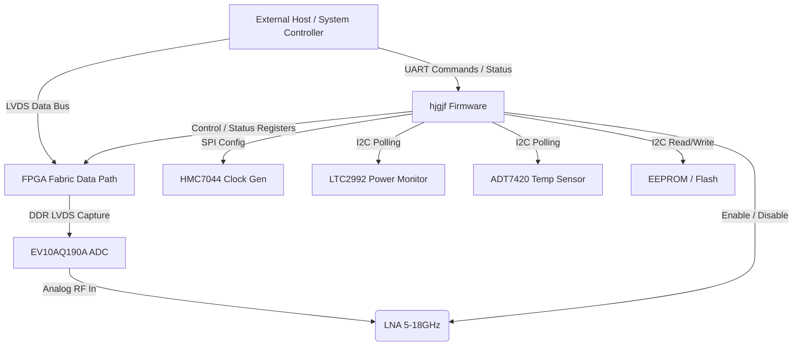
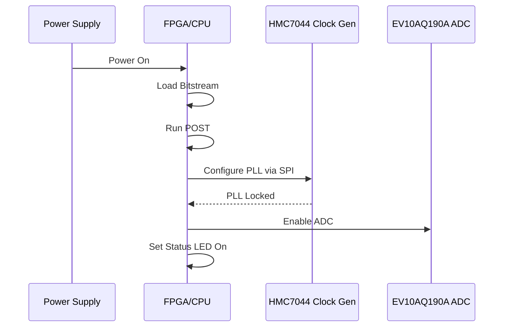
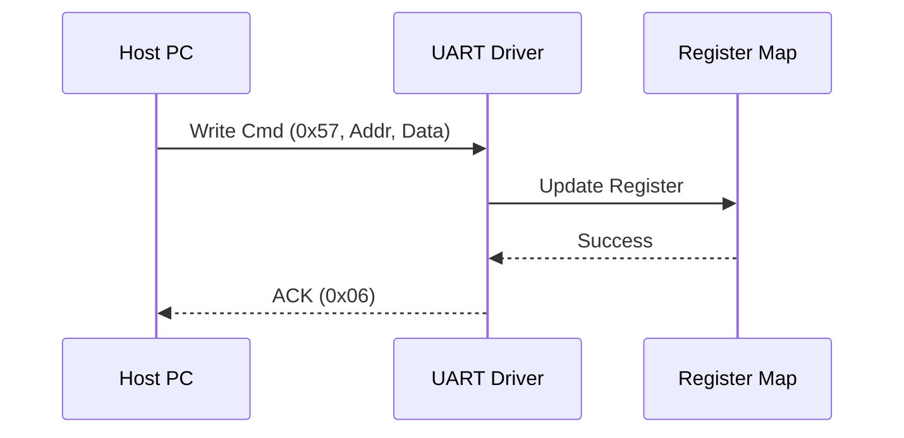
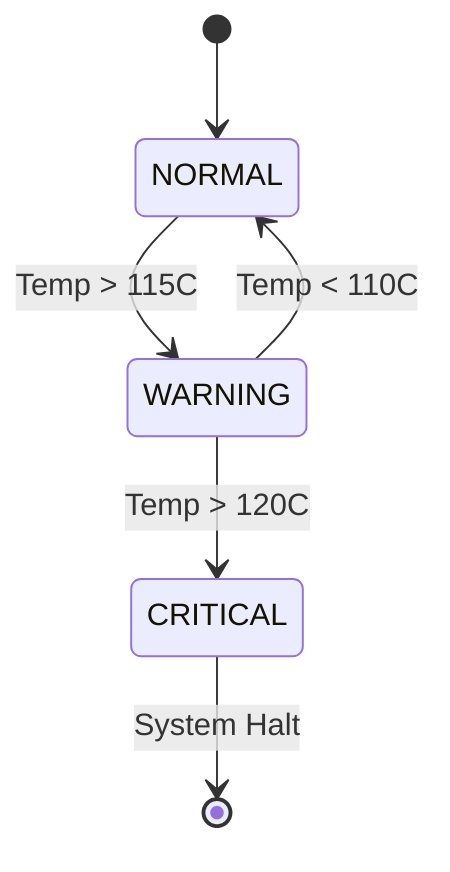
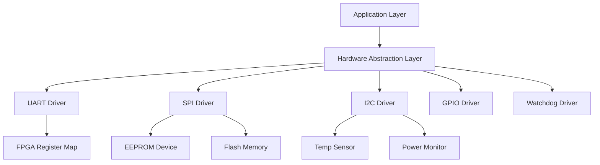

# Software Requirements Specification (SRS)

**Project:** hjgjf Wideband RF Receiver System
**Document ID:** SRS-HJGJF-001
**Version:** 1.0
**Date:** 16 April 2026

---

## Document Control

| Version | Date | Author | Changes |
|---------|------|--------|---------|
| 1.0 | 16 April 2026 | Senior Architect | Initial Release for hjgjf Project |

---

# 1. Introduction

## 1.1 Purpose
This Software Requirements Specification (SRS) describes the firmware and software requirements for the **hjgjf Wideband RF Receiver System**. The software will be embedded within the System FPGA (XC7K325T or equivalent) and the System-on-Chip (SoC)/Microcontroller managing the housekeeping and control functions.

The purpose of this document is to:
1.  Define the behavioral and functional requirements of the FPGA logic (RTL) and embedded C firmware.
2.  Specify the communication protocols (UART, SPI, I2C, LVDS) used to interface with the RF Front-End, ADC, and Clock Generator.
3.  Serve as the contractual basis for software design, implementation, and verification (V&V).
4.  Ensure full traceability to the Hardware Requirements Specification (HRS-HJGJF-001) and Glue Logic Requirements (GLR-HJGJF-001).

## 1.2 Scope
The software system includes:
1.  **FPGA Firmware:** RTL logic for capturing DDR LVDS data from the EV10AQ190A ADC, buffering data, and implementing the UART Register Slave Interface.
2.  **Embedded Firmware:** C-code running on the hard processor (or soft-core) within the FPGA to manage board initialization, power sequencing, I2C device polling (EEPROM, Temp Sensors, Power Monitors), and SPI configuration of the Clock Generator.
3.  **Bootloader:** Logic to load the FPGA bitstream from SPI Flash and configure the PLLs.
4.  **Diagnostics:** Power-On Self-Test (POST) and runtime error logging.

**Exclusions:** High-level DSP algorithms (digital down-conversion, beamforming) performed by the host system connected to the LVDS output are outside the scope of this *board-level* SRS, though the interface requirements are defined herein.

## 1.3 Definitions, Acronyms, and Abbreviations

| Term | Definition |
| :--- | :--- |
| **ADC** | Analog-to-Digital Converter (EV10AQ190A). |
| **ASIL** | Automotive Safety Integrity Level. |
| **BIST** | Built-In Self-Test. |
| **BSP** | Board Support Package. |
| **CBR** | Constant Bit Rate. |
| **CDR** | Clock and Data Recovery. |
| **DDR** | Double Data Rate. |
| **DNL** | Differential Non-Linearity. |
| **EOF** | End of Frame. |
| **ENOB** | Effective Number Of Bits. |
| **FIFO** | First-In-First-Out memory buffer. |
| **FPGA** | Field-Programmable Gate Array. |
| **FSR** | Full Scale Range. |
| **GLR** | Glue Logic Requirements Document. |
| **GPIO** | General Purpose Input/Output. |
| **HAL** | Hardware Abstraction Layer. |
| **HRS** | Hardware Requirements Specification. |
| **I2C** | Inter-Integrated Circuit (Serial Bus). |
| **IDCODE** | JTAG Identification Code. |
| **IPC** | Inter-Process Communication. |
| **IRQ** | Interrupt Request. |
| **ISR** | Interrupt Service Routine. |
| **JTAG** | Joint Test Action Group (Boundary Scan). |
| **LIN** | Local Interconnect Network. |
| **LNA** | Low Noise Amplifier. |
| **LUT** | Look-Up Table. |
| **LVDS** | Low-Voltage Differential Signaling. |
| **MCU** | Microcontroller Unit. |
| **MISR** | Multiple Input Signature Register. |
| **MISO** | Master In Slave Out (SPI). |
| **MOSI** | Master Out Slave In (SPI). |
| **MSB** | Most Significant Bit. |
| **NVM** | Non-Volatile Memory. |
| **OS** | Operating System. |
| **PCB** | Printed Circuit Board. |
| **PLL** | Phase-Locked Loop. |
| **POST** | Power-On Self-Test. |
| **RAM** | Random Access Memory. |
| **ROM** | Read-Only Memory. |
| **RTC** | Real-Time Clock. |
| **RTL** | Register Transfer Level (FPGA code). |
| **RX** | Receive. |
| **SLL** | Serial Link Layer. |
| **SFR** | Special Function Register. |
| **SFDR** | Spurious-Free Dynamic Range. |
| **SNR** | Signal-to-Noise Ratio. |
| **SPI** | Serial Peripheral Interface. |
| **StRS** | Stakeholder Requirements Specification. |
| **SyRS** | System Requirements Specification. |
| **TX** | Transmit. |
| **UART** | Universal Asynchronous Receiver-Transmitter. |
| **USB** | Universal Serial Bus. |
| **VCO** | Voltage-Controlled Oscillator. |
| **WDT** | Watchdog Timer. |

## 1.4 References
1.  **IEEE Std 830-1998:** Recommended Practice for Software Requirements Specifications.
2.  **ISO/IEC/IEEE 29148:2018:** Systems and software engineering — Life cycle processes — Requirements engineering.
3.  **HRS-HJGJF-001:** hjgjf Hardware Requirements Specification (Rev 1.0).
4.  **GLR-HJGJF-001:** hjgjf Glue Logic Requirements (Rev 1.0).
5.  **MISRA C:2012:** Guidelines for the Use of the C Language in Critical Systems.
6.  **EV10AQ190A Datasheet:** e2v 10-bit 5 Gsps ADC.
7.  **HMC7044 Datasheet:** Analog Devices Clock Generator.
8.  **LTM4644 Datasheet:** Linear Technology DC-DC Regulator.
9.  **Xilinx UG480:** 7 Series FPGAs System Monitor User Guide.

## 1.5 Overview
Section 2 describes the overall system architecture, context, and modes of operation.
Section 3 details the specific requirements, including external interfaces (UART, SPI, I2C, LVDS) and functional requirements grouped by subsystem (Init, Comms, Monitoring).
Section 4 defines verification and test criteria.
Section 5 provides the requirements traceability matrix linking software needs to hardware sources.
Appendices provide data structures, error codes, and diagrams.

---

# 2. Overall Description

## 2.1 Product Perspective

### 2.1.1 System Context
The hjgjf firmware operates as the control and interface layer for the RF Receiver hardware. It sits between the Host Computer (external system) and the specialized RF Hardware (ADC, LNA, Clock Gen).



### 2.1.2 Software Stack
The software is organized into three distinct layers:
1.  **Hardware Abstraction Layer (HAL):** Drivers for UART, SPI, I2C, and GPIO peripherals.
2.  **FPGA Logic Layer:** RTL modules for LVDS deserialization, FIFO buffering, and Register Map decoding.
3.  **Application Layer:** C-based state machine for initialization, power sequencing, and command handling.

## 2.2 Product Functions
The software shall provide the following major capabilities:
1.  **Initialization:** Execute power-on reset, configure PLLs (via HMC7044), and verify ADC lock.
2.  **UART Communication:** Implement a slave-mode UART protocol allowing the Host to read/write 16-bit registers.
3.  **Data Capture:** Route 10-bit ADC data (DDR LVDS) into internal FIFOs and output to standard high-speed connectors.
4.  **Health Monitoring:** Poll temperature sensors and power monitors periodically.
5.  **Fault Management:** Detect over-temperature or over-current and assert TRP (Transmit/Receive Protect) signals to protect the LNA.
6.  **Configuration Management:** Load calibration coefficients from EEPROM.

## 2.3 User Characteristics
*   **Firmware Engineers:** Debug and maintain C/HDL code via JTAG.
*   **System Integrators:** Interact via UART to configure the receiver for specific bands.
*   **Automated Test Equipment (ATE):** Validate compliance using defined test vectors.

## 2.4 Constraints
1.  **Memory:** Limited On-Chip BRAM (~10MB) for data buffering.
2.  **Timing:** ADC interface logic must meet setup/hold times for 10 Gsps DDR (approx 100ps window).
3.  **Standards:** MISRA-C compliance for all safety-critical C code.
4.  **Environment:** Must operate at -55°C to +125°C (no dynamic memory allocation allowed after init).

## 2.5 Assumptions and Dependencies
1.  Power rails (+1V, +1.8V, +2.5V) are stable within tolerance (±3%) before FPGA configuration begins.
2.  Reference Clock (100 MHz VXCO) is stable and active.
3.  Host system does not issue UART commands until the "SYSTEM_READY" bit is asserted.

---

# 3. Specific Requirements

## 3.1 External Interface Requirements

### 3.1.1 Hardware Interfaces

#### 3.1.1.1 UART Interface
The firmware shall implement a UART interface running at 3.125 Mbps (configurable), 8-bit data, no parity, 1 stop bit.

**Register Map Definition (C Struct):**
```c
#include <stdint.h>

/**
 * @brief hjgjf FPGA Register Map
 * Base Address: 0x0000 (Memory Mapped in FPGA)
 */
typedef struct {
    volatile uint16_t BOARD_ID;       // 0x0000: Fixed 0xA5A5
    volatile uint16_t FIRMWARE_VER;   // 0x0001: Major.Minor
    volatile uint16_t STATUS;         // 0x0002: Bitfield
    volatile uint16_t CTRL;           // 0x0003: Control Register
    volatile uint16_t TEMP_INTEGRAL;  // 0x0004: Signed 16-bit int (0.0625°C/LSB)
    volatile uint16_t VCC1_MONITOR;   // 0x0005: mV units
    volatile uint16_t VCC2_MONITOR;   // 0x0006: mV units
    volatile uint16_t CURRENT_MONITOR;// 0x0007: mA units
    volatile uint16_t ERROR_CODE;     // 0x0008: See error enum
    volatile uint16_t SPI_CLK_DIV;    // 0x0009: Clock divider for HMC7044
    volatile uint16_t TRP_CTRL;       // 0x000A: LNA Protect Control (1=Shutdown)
    volatile uint16_t ADC_DCO_CFG;    // 0x000B: ADC DCO Phase Select
    volatile uint16_t _padding[48];   // Reserved
    volatile uint16_t FIFO_DATA;      // 0x0040: Test Data FIFO Port
} hjgjf_RegMap_t;

// Status Bit Masks
#define STATUS_PLL_LOCKED (1 << 0)
#define STATUS_ADC_READY  (1 << 1)
#define STATUS_TEMP_ALERT (1 << 2)
#define STATUS_PWR_GOOD   (1 << 3)
```

**Driver API:**
```c
/**
 * @brief Initialize the UART Controller
 * @param baud_rate Target baud rate (e.g., 3125000)
 * @return 0 on success, -1 on init failure
 */
int32_t UART_Init(uint32_t baud_rate);

/**
 * @brief Write a 16-bit value to a specific register address
 * @param addr 16-bit register address
 * @param data 16-bit data word
 * @return Bytes written (2), or negative error code
 */
int32_t UART_WriteReg(uint16_t addr, uint16_t data);

/**
 * @brief Read a 16-bit value from a specific register address
 * @param addr 16-bit register address (Bit 15 must be set for Read op)
 * @param data Pointer to store read data
 * @return Bytes read (2), or negative error code
 */
int32_t UART_ReadReg(uint16_t addr, uint16_t *data);
```

#### 3.1.1.2 SPI Interface (Clock Generator)
**Register Map:**
```c
typedef struct {
    volatile uint8_t CTRL;     // 0x00: SPI Control
    volatile uint8_t STATUS;   // 0x01: SPI Status
    volatile uint8_t TX_FIFO;  // 0x02: Transmit FIFO
    volatile uint8_t RX_FIFO;  // 0x03: Receive FIFO
} SPI_RegMap_t;
```

**Driver API:**
```c
/**
 * @brief Initialize SPI for HMC7044
 * @param clock_hz SPI Clock frequency (Max 10MHz for HMC7044)
 */
int32_t HMC7044_Init(uint32_t clock_hz);

/**
 * @brief Write to HMC7044 Register
 * @param reg_addr 8-bit HMC register address
 * @param value 16-bit data
 */
int32_t HMC7044_WriteReg(uint8_t reg_addr, uint16_t value);

/**
 * @brief Read HMC7044 Register
 */
int32_t HMC7044_ReadReg(uint8_t reg_addr, uint16_t *value);
```

#### 3.1.1.3 I2C Interface (Sensors & EEPROM)
```c
/**
 * @brief Write to I2C EEPROM
 * @param dev_addr 7-bit device address (e.g., 0x50)
 * @param mem_addr 16-bit memory address
 * @param data Buffer
 * @param len Length
 */
int32_t EEPROM_Write(uint8_t dev_addr, uint16_t mem_addr, uint8_t *data, uint16_t len);

/**
 * @brief Read from I2C Temp Sensor (ADT7420)
 * @return Temperature in Celsius (float)
 */
float ADT7420_ReadTemp(void);
```

### 3.1.2 Software Interfaces
The firmware shall provide a set of standard API headers for inclusion in future test code.
*   `hjgjf_hal.h`: Hardware definitions
*   `hjgjf_types.h`: Standard types (uint8_t, uint16_t, etc.)
*   `hjgjf_version.h`: Version macros

### 3.1.3 Communication Interfaces

**UART Frame Format:**
The UART interface operates in a Command/Response mode. All multi-byte values are Big-Endian (High byte first).

| Command | CMD Byte | Frame Structure | Response |
|---------|----------|-----------------|----------|
| Single Write | 0x57 ('W') | `[0x57][Addr_H][Addr_L][Data_H][Data_L]` | `[0x06]` (ACK) |
| Single Read | 0x52 ('R') | `[0x52][Addr_H\|0x80][Addr_L]` | `[Data_H][Data_L]` |
| Bulk Write | 0x42 ('B') | `[0x42][Addr_H][Addr_L][N][D0_H][D0_L]...` | `[0x06]` (ACK) |
| Bulk Read | 0x62 ('b') | `[0x62][Addr_H\|0x80][Addr_L][N]` | `[D0_H][D0_L]...` |
| Error NAK | 0x15 | Sent by FPGA on invalid command/address | — |

*   **Addressing:** 16-bit address space (0x0000–0xFFFF).
*   **Read Flag:** Bit 15 of the address field must be set (OR 0x8000) for Read operations.
*   **Bulk Limit:** Max count `N` is 64 registers per transaction.
*   **Timing:** Host inter-byte gap must not exceed 10ms. Parser resets after 50ms idle.
*   **CRC:** Optional CRC-16 (CCITT) can be enabled via Config Flash.

## 3.2 Functional Requirements

### 3.2.1 System Initialization
| ID | Requirement | Source | Priority | Verification |
|----|-------------|--------|----------|---------------|
| REQ-SW-001 | The software SHALL complete Power-On Self-Test (POST) within 500ms of reset de-assertion. | HRS §2.1 | M | T |
| REQ-SW-002 | The software SHALL verify the BOARD_ID register reads 0xA5A5; failing this, the system SHALL halt and assert ERROR LED. | GLR §8 | M | T |
| REQ-SW-003 | The software SHALL configure the HMC7044 PLL to generate a 5.0 GHz sampling clock for the ADC within 200ms of power-up. | HRS REQ-HW-016 | M | T |
| REQ-SW-004 | The software SHALL poll the HMC7044 STATUS register until the PLL_LOCK bit is asserted; timeout after 100ms. | GLR §4 | M | T |
| REQ-SW-005 | The software SHALL read calibration coefficients from I2C EEPROM (offset 0x0100) and load them into the ADC configuration block. | HRS §3.2 | M | I |
| REQ-SW-006 | The software SHALL enable the RF Front-End LNA only after the ADC is confirmed ready (STATUS.ADC_READY = 1). | HRS REQ-HW-014 | M | T |
| REQ-SW-007 | The software SHALL initialize the Watchdog Timer (WDT) to 100ms timeout before entering the main loop. | HRS §2.5 | M | T |
| REQ-SW-008 | The software SHALL log the firmware version string to the UART debug port upon successful boot. | GLR §5 | M | I |
| REQ-SW-009 | The software SHALL perform a RAM BIST (March C-) on 16KB of internal BRAM before initializing heaps. | HRS REQ-HW-012 | M | T |
| REQ-SW-010 | The software SHALL set the System Status LED to "Solid On" after successful initialization. | HRS §3.1 | D | I |

### 3.2.2 UART Communication Driver
| ID | Requirement | Source | Priority | Verification |
|----|-------------|--------|----------|---------------|
| REQ-SW-011 | The UART driver SHALL support baud rates of 9600, 115200, and 3.125 Mbps. | GLR §5 | M | T |
| REQ-SW-012 | The driver SHALL implement the Single Write command (0x57) adhering to the frame format in GLR §9. | GLR §9 | M | T |
| REQ-SW-013 | The driver SHALL implement the Single Read command (0x52) requiring Bit 15 of the address to be set. | GLR §9 | M | T |
| REQ-SW-014 | The driver SHALL implement the Bulk Write command (0x42) for up to 64 consecutive registers without re-issuing the address. | GLR §9 | M | T |
| REQ-SW-015 | The driver SHALL implement the Bulk Read command (0x62) and return data in contiguous address order. | GLR §9 | M | T |
| REQ-SW-016 | The driver SHALL respond to an undefined command byte with NAK (0x15) within 50us. | GLR §9 | M | T |
| REQ-SW-017 | The driver SHALL utilize a 256-byte TX FIFO and a 256-byte RX FIFO to buffer data. | GLR §6 | M | I |
| REQ-SW-018 | The driver SHALL automatically clear UART_STATUS.FRAME_ERROR flags on the next read operation. | GLR §8 | M | T |
| REQ-SW-019 | The driver SHALL discard bytes in the RX buffer if a framing error is detected mid-packet. | GLR §8 | D | T |
| REQ-SW-020 | The driver SHALL allow reading back of the FIRMWARE_VERSION register at any time via the Read command. | GLR §8 | M | T |

### 3.2.3 Data Acquisition (FPGA Logic)
| ID | Requirement | Source | Priority | Verification |
|----|-------------|--------|----------|---------------|
| REQ-SW-021 | The FPGA logic SHALL deserialize the 10-bit ADC DDR LVDS data using ISERDES blocks. | HRS REQ-HW-006 | M | T |
| REQ-SW-022 | The FPGA logic SHALL align the received data to the ADC frame boundary using the training sequence (comma detection). | HRS REQ-HW-011 | M | T |
| REQ-SW-023 | The software SHALL buffer incoming ADC data in a 4K Sample BRAM FIFO before outputting to the LVDS backend. | GLR §7 | M | T |
| REQ-SW-024 | The software SHALL assert the FIFO_OVERFLOW flag if the backend cannot read data fast enough. | GLR §7 | M | T |
| REQ-SW-025 | The software SHALL timestamp the first sample of every 1024-sample block using a 64-bit free-running counter. | HRS §2.1 | O | T |
| REQ-SW-026 | The software SHALL support decimation modes (Bypass, /2, /4) configurable via register 0x0010. | HRS §3.2 | D | I |
| REQ-SW-027 | The FPGA logic SHALL pad 10-bit data to 16-bit (MSB aligned) for LVDS transmission. | GLR §7 | M | I |
| REQ-SW-028 | The software SHALL verify the ADC DCO (Data Clock Output) frequency is within 5% of expected before enabling capture. | HRS REQ-HW-016 | M | T |
| REQ-SW-029 | The software SHALL provide a "Test Pattern Mode" (ramp counter) for LVDS output when ADC is disabled. | HRS REQ-HW-012 | D | T |
| REQ-SW-030 | The software SHALL stop data capture immediately if the RF LNA protection is triggered (TRP=1). | HRS REQ-HW-014 | M | T |

### 3.2.4 Temperature Monitoring
| ID | Requirement | Source | Priority | Verification |
|----|-------------|--------|----------|---------------|
| REQ-SW-031 | The software SHALL poll the ADT7420 temperature sensor via I2C every 500ms. | HRS §2.5 | M | T |
| REQ-SW-032 | The software SHALL convert the raw 16-bit temperature value to floating point Celsius (resolution 0.0625°C). | ADT7420 Datasheet | M | T |
| REQ-SW-033 | The software SHALL assert the TEMP_ALERT status bit when temperature exceeds 115°C. | HRS REQ-HW-010 | M | T |
| REQ-SW-034 | The software SHALL shut down the LNA (set TRP_CTRL=1) if temperature exceeds 120°C (Critical). | HRS REQ-HW-010 | M | T |
| REQ-SW-035 | The software SHALL implement hysteresis for temperature alert (alert at 115°C, clear at 110°C). | HRS REQ-HW-010 | M | T |
| REQ-SW-036 | The software SHALL log the maximum recorded temperature in register MAX_TEMP (0x0005). | GLR §8 | D | T |
| REQ-SW-037 | The software SHALL provide the current junction temperature of the FPGA via XADC/ SYS_MON. | Xilinx UG480 | M | T |

### 3.2.5 Power Management
| ID | Requirement | Source | Priority | Verification |
|----|-------------|--------|----------|---------------|
| REQ-SW-041 | The software SHALL poll the LTC2992 power monitor via I2C every 100ms. | HRS REQ-HW-013 | M | T |
| REQ-SW-042 | The software SHALL validate that the +1.0V core rail is within ±3% (0.97V to 1.03V). | LTM4644 Datasheet | M | T |
| REQ-SW-043 | The software SHALL assert a HW_FAULT status bit if any rail deviates >5% from nominal. | HRS REQ-HW-012 | M | T |
| REQ-SW-044 | The software SHALL measure total power consumption (V*I) and report it in register TOTAL_POWER_W. | HRS REQ-HW-012 | M | A |
| REQ-SW-045 | The software SHALL sequence the power supplies: 1.0V -> 1.8V -> 2.5V -> ADC_Enable. | HRS REQ-HW-013 | M | T |
| REQ-SW-046 | The software SHALL assert RESET_N to the ADC if the 1.8V I/O rail drops below 1.7V. | EV10AQ190A Datasheet | M | T |
| REQ-SW-047 | The software SHALL implement a "Soft Power Down" mode where only the 3.3V rail remains active. | HRS §2.5 | O | T |

### 3.2.6 Diagnostics and Fault Handling
| ID | Requirement | Source | Priority | Verification |
|----|-------------|--------|----------|---------------|
| REQ-SW-071 | The software SHALL implement a POST routine checking: RAM, I2C ACK, EEPROM Checksum, PLL Lock. | HRS §1.1 | M | T |
| REQ-SW-072 | The software SHALL log detected faults to a circular buffer in EEPROM (max 50 entries). | GLR §5 | M | T |
| REQ-SW-073 | The software SHALL allow dumping the fault log via UART Bulk Read from address 0xF000. | GLR §9 | M | T |
| REQ-SW-074 | The software SHALL maintain an UPTIME counter (seconds) in register 0x0003. | GLR §8 | M | T |
| REQ-SW-075 | The software SHALL implement an internal UART loopback test (TX connected to RX via MUX) on startup. | HRS REQ-HW-012 | M | T |
| REQ-SW-076 | The software SHALL assert a global ALARM pin if the Fault Log becomes 90% full. | HRS §2.5 | O | T |
| REQ-SW-077 | The software SHALL utilize ECC (Error Correcting Code) on all external Flash memory accesses. | GLR §5 | M | I |
| REQ-SW-078 | The software SHALL enter a "Safe Mode" with fixed 5 Gsps clock if custom clock config fails 3 times. | HRS REQ-HW-016 | D | T |
| REQ-SW-079 | The software SHALL trap illegal instruction exceptions and log the Program Counter to the Fault Log. | HRS §1.1 | M | T |
| REQ-SW-080 | The software SHALL allow the host to clear the Fault Log via a Write Command (0x57) to register FAULT_CLEAR (0x0009). | GLR §9 | M | T |

## 3.3 Performance Requirements

| ID | Requirement | Verification |
|----|-------------|---------------|
| REQ-PERF-001 | The main control loop SHALL complete one full iteration (Poll I2C, Check Status, Service WDT) within 10ms. | T |
| REQ-PERF-002 | The UART Register Write command SHALL complete (ACK returned) within 500us of command receipt. | T |
| REQ-PERF-003 | The FIFO read pointer SHALL be updated within 2 clock cycles of a data write. | T |
| REQ-PERF-004 | The temperature conversion time on ADT7420 SHALL not exceed 240ms (16-bit resolution mode). | I |
| REQ-PERF-005 | The SPI Write to HMC7044 SHALL complete within 50us. | T |
| REQ-PERF-006 | The FPGA startup bitstream load time from SPI Flash SHALL be < 2 seconds. | T |
| REQ-PERF-007 | Interrupt latency for the ADC Data Ready signal SHALL be < 100ns. | T |
| REQ-PERF-008 | The Watchdog Timer SHALL be refreshed ("kicked") at least every 90ms. | A |
| REQ-PERF-009 | Total RAM usage (BRAM) by firmware SHALL not exceed 80% of available resources. | A |
| REQ-PERF-010 | Firmware code size SHALL fit within 256KB of system flash. | I |

## 3.4 Design Constraints
1.  **Language:** FPGA logic shall be implemented in VHDL-2002 or Verilog-2001. Embedded firmware shall be ANSI C (C99).
2.  **Standard:** Embedded C code SHALL comply with MISRA-C:2012.
3.  **Memory:** No dynamic heap allocation (malloc) is permitted after initialization.
4.  **Concurrency:** Access to shared registers (FPGA <-> CPU) must be atomic or protected by mutexes.
5.  **Clocking:** The FPGA logic must use a single synchronous reset strategy for all clock domains.
6.  **Size:** The design must target a device with ≤ 350K Logic Cells (XC7K325T class).

## 3.5 Software System Attributes

### 3.5.1 Reliability
*   MTBF Goal: > 20,000 hours.
*   Automatic recovery from Single Event Upsets (SEU) via periodic scrubbing of configuration memory.

### 3.5.2 Availability
*   The system SHALL be available for data capture within 500ms of power application.

### 3.5.3 Security
*   UART write access to the Clock Generator registers is password protected (write 0xDEADBEEF to unlock reg).

### 3.5.4 Maintainability
*   All code shall be documented with Doxygen headers.
*   Functions shall have a Cyclomatic Complexity ≤ 10.

---

# 4. Verification and Validation

## 4.1 Unit Test Requirements
*   **HAL Tests:** Verify every SPI, I2C, and UART driver function with a simulator model of the bus.
*   **Register Tests:** Verify read/write access to every address in the memory map.

## 4.2 Integration Test Requirements
*   **ADC Interface:** Capture known ramp pattern from ADC, verify data integrity in FPGA FIFO.
*   **Clock Loop:** Configure HMC7044, verify lock detect and frequency accuracy using a spectrum analyzer.
*   **Comms:** Use Python script to send random bulk commands, verify ACKs and data return.

## 4.3 System Test Requirements
*   **Thermal:** Place board in environmental chamber, cycle -55°C to +125°C, verify operation at extremes.
*   **EMC:** Verify no radiated emissions violate MIL-STD-461 during high-speed data transmission.

---

# 5. Requirements Traceability Matrix

| REQ-SW ID | Description | Source (HRS/GLR) | Priority | Verification |
|-----------|-------------|------------------|----------|---------------|
| REQ-SW-001 | POST < 500ms | HRS §2.1 | M | T |
| REQ-SW-002 | Verify BOARD_ID | GLR §8 | M | T |
| REQ-SW-003 | Config 5GHz PLL | HRS REQ-HW-016 | M | T |
| REQ-SW-004 | Poll PLL Lock | HRS REQ-HW-016 | M | T |
| REQ-SW-005 | Load EEPROM Cal | HRS §3.2 | M | I |
| REQ-SW-006 | Enable LNA after ADC | HRS REQ-HW-014 | M | T |
| REQ-SW-007 | Init WDT 100ms | HRS §2.5 | M | T |
| REQ-SW-008 | Log FW Version | GLR §5 | M | I |
| REQ-SW-009 | RAM BIST | HRS REQ-HW-012 | M | T |
| REQ-SW-010 | Status LED On | HRS §3.1 | M | I |
| REQ-SW-011 | Baud Rates | GLR §5 | M | T |
| REQ-SW-012 | UART Cmd Write | GLR §9 | M | T |
| REQ-SW-013 | UART Cmd Read | GLR §9 | M | T |
| REQ-SW-014 | UART Bulk Write | GLR §9 | M | T |
| REQ-SW-015 | UART Bulk Read | GLR §9 | M | T |
| REQ-SW-016 | UART Error NAK | GLR §9 | M | T |
| REQ-SW-017 | FIFO Size | GLR §6 | M | I |
| REQ-SW-018 | Clear Frame Error | GLR §8 | M | T |
| REQ-SW-019 | Discard Bad Frame | GLR §8 | D | T |
| REQ-SW-020 | Read FW Version | GLR §8 | M | T |
| REQ-SW-021 | Deserialize ADC | HRS REQ-HW-006 | M | T |
| REQ-SW-022 | Align Data | HRS REQ-HW-011 | M | T |
| REQ-SW-023 | FIFO Buffer | GLR §7 | M | T |
| REQ-SW-024 | FIFO Overflow | GLR §7 | M | T |
| REQ-SW-025 | Timestamp | HRS §2.1 | O | T |
| REQ-SW-026 | Decimation | HRS §3.2 | D | I |
| REQ-SW-027 | Pad to 16-bit | GLR §7 | M | I |
| REQ-SW-028 | Verify DCO Freq | HRS REQ-HW-016 | M | T |
| REQ-SW-029 | Test Pattern | HRS REQ-HW-012 | D | T |
| REQ-SW-030 | Stop on TRP | HRS REQ-HW-014 | M | T |
| REQ-SW-031 | Poll Temp 500ms | HRS §2.5 | M | T |
| REQ-SW-032 | Convert Temp | ADT7420 Datasheet | M | T |
| REQ-SW-033 | Temp Alert >115 | HRS REQ-HW-010 | M | T |
| REQ-SW-034 | Shutdown >120 | HRS REQ-HW-010 | M | T |
| REQ-SW-035 | Temp Hysteresis | HRS REQ-HW-010 | M | T |
| REQ-SW-036 | Max Temp Log | GLR §8 | D | T |
| REQ-SW-037 | FPGA Temp | Xilinx UG480 | M | T |
| REQ-SW-041 | Poll Power | HRS REQ-HW-013 | M | T |
| REQ-SW-042 | Check 1.0V Rail | LTM4644 Datasheet | M | T |
| REQ-SW-043 | HW Fault >5% | HRS REQ-HW-012 | M | T |
| REQ-SW-044 | Total Power | HRS REQ-HW-012 | M | A |
| REQ-SW-045 | Power Seq | HRS REQ-HW-013 | M | T |
| REQ-SW-046 | ADC Reset 1.8V | EV10AQ190A Datasheet | M | T |
| REQ-SW-047 | Soft Pwr Dn | HRS §2.5 | O | T |
| REQ-SW-071 | POST | HRS §1.1 | M | T |
| REQ-SW-072 | Log Faults | GLR §5 | M | T |
| REQ-SW-073 | Dump Faults | GLR §9 | M | T |
| REQ-SW-074 | Uptime Counter | GLR §8 | M | T |
| REQ-SW-075 | UART Loopback | HRS REQ-HW-012 | M | T |

---

# 6. Appendices

## Appendix A — Error Codes

```c
typedef enum {
    ERR_OK           = 0x00,
    ERR_TIMEOUT      = 0x01,
    ERR_COMM         = 0x02,
    ERR_CHECKSUM     = 0x03,
    ERR_PARAM        = 0x04,
    ERR_NOT_INIT     = 0x05,
    ERR_RESOURCE     = 0x06,
    ERR_HARDWARE     = 0x07,
    ERR_OVERFLOW     = 0x08,
    ERR_UNDERFLOW    = 0x09,
    ERR_FLASH_WRITE  = 0x0A,
    ERR_FLASH_ERASE  = 0x0B,
    ERR_EEPROM       = 0x0C,
    ERR_PLL          = 0x0D,
    ERR_TEMP_ALERT   = 0x0E,
    ERR_VOLT_FAULT   = 0x0F,
    ERR_LOOPBACK     = 0x10,
    ERR_POST_FAIL    = 0x11,
    ERR_WATCHDOG     = 0x12,
    ERR_ADDR_RANGE   = 0x13
} ErrorCode_t;
```

## Appendix B — Register Map Summary

| Base | Offset | Name | Width | R/W | Reset | Description |
|------|--------|------|-------|-----|-------|-------------|
| 0x0000 | 0x0000 | BOARD_ID | 16 | R | 0xA5A5 | Fixed Identifier |
| 0x0000 | 0x0001 | FIRMWARE_VER | 16 | R | 0x0100 | Major.Minor Version |
| 0x0000 | 0x0002 | STATUS | 16 | R | 0x0000 | Status Bits |
| 0x0000 | 0x0003 | CTRL | 16 | R/W | 0x0000 | General Control |
| 0x0000 | 0x0004 | TEMP_INTEGRAL | 16 | R | 0x0000 | Current Temp |
| 0x0000 | 0x0005 | VCC1_MONITOR | 16 | R | 0x0000 | 1.0V Rail (mV) |
| 0x0000 | 0x0006 | VCC2_MONITOR | 16 | R | 0x0000 | 1.8V Rail (mV) |
| 0x0000 | 0x0007 | CURRENT_MONITOR | 16 | R | 0x0000 | Total Current (mA) |
| 0x0000 | 0x0008 | ERROR_CODE | 16 | R | 0x00 | Last Error |
| 0x0000 | 0x0009 | SPI_CLK_DIV | 16 | R/W | 0x0001 | Clock Divider |
| 0x0000 | 0x000A | TRP_CTRL | 16 | R/W | 0x0000 | LNA Protect (1=Safe) |
| 0x0000 | 0x000B | ADC_DCO_CFG | 16 | R/W | 0x0000 | DCO Phase |

## Appendix C — Mermaid Diagrams

### C.1 Initialization Sequence


### C.2 UART Command Flow


### C.3 Temperature Alert State Machine


### C.4 Software Layer Architecture


## Appendix D — Acronyms and Glossary
(See Section 1.3)

## Appendix E — Document Revision History
(See Document Control)