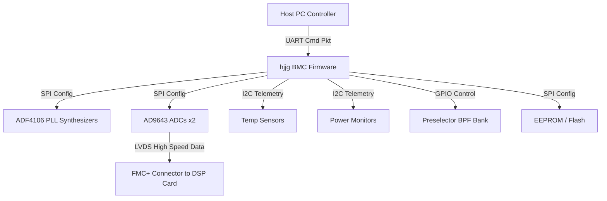
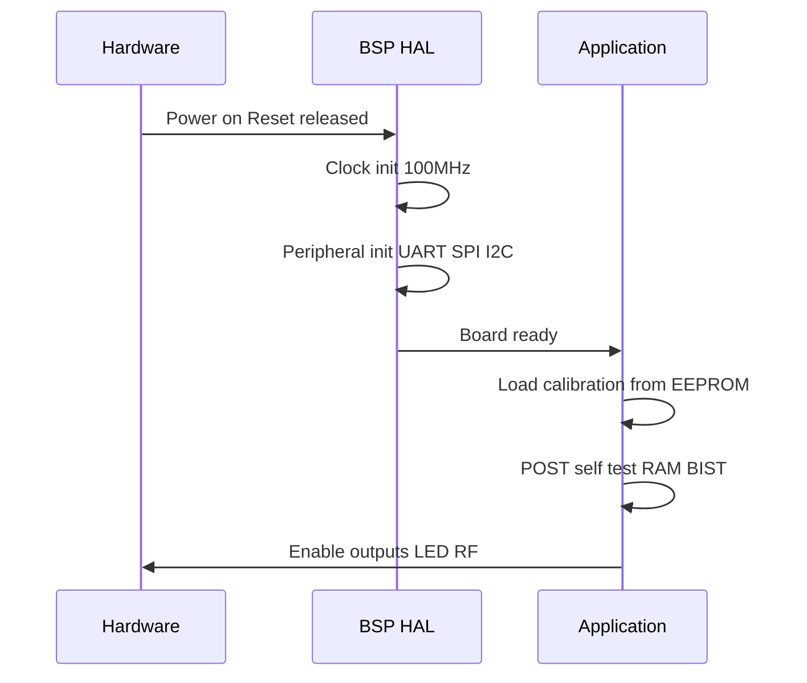
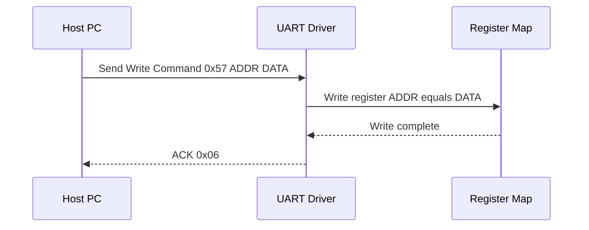
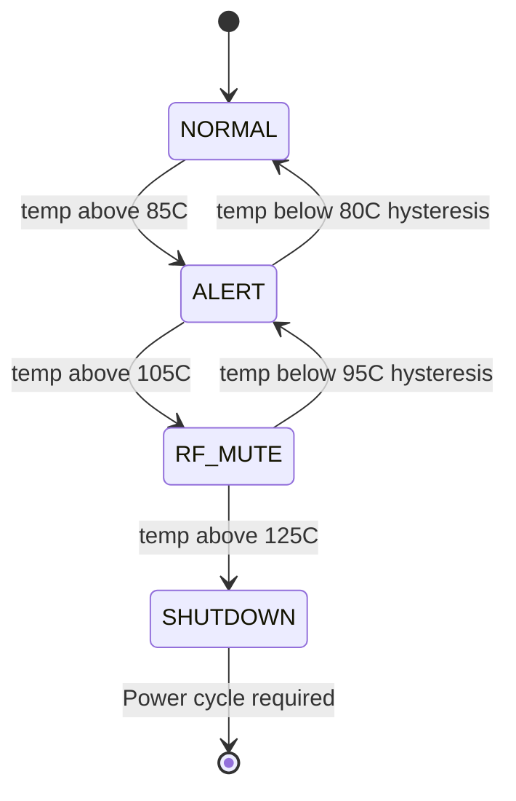
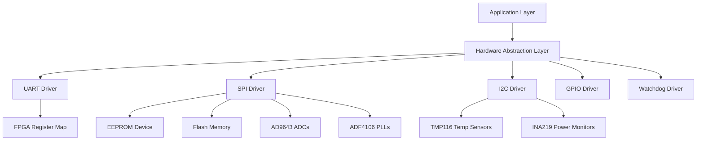
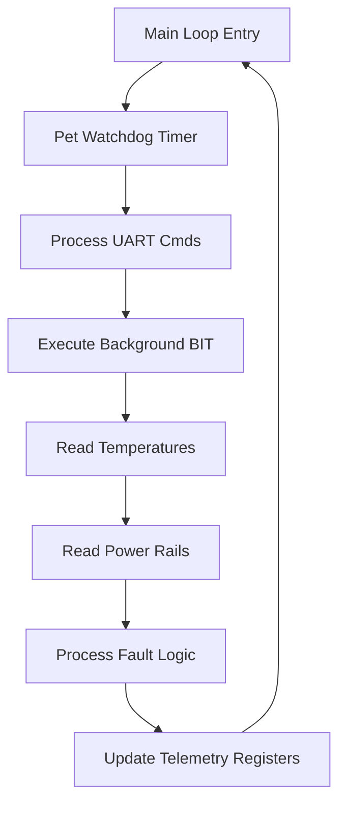

# Software Requirements Specification (SRS)

## Document Control
| Version | Date | Author | Changes |
|---------|------|--------|---------|
| 1.0 | 25 April 2026 | Systems Engineering | Initial Release |

---

# 1. Introduction

## 1.1 Purpose
This Software Requirements Specification (SRS) defines the complete set of Level 3 software requirements for the **hjjg** project: a dual-channel, phase-coherent, double-IF superheterodyne radar receiver system operating over the 2–6 GHz frequency band. 

This document specifies the firmware and software behaviors that execute within the local control FPGA/CPLD and any embedded microcontrollers on the receiver board. It describes what the software shall implement to configure, monitor, calibrate, and diagnose the analog receiver hardware, ADC digitization subsystems, PLL/synthesizer tuning, and the FMC+ communication interface to the external Kintex-7 FPGA carrier card.

The intended audience includes firmware engineers implementing the board-level logic, test engineers validating hardware-software integration, system integrators connecting the receiver to the digital signal processing backend, and safety assessors verifying compliance with MIL-STD environmental and reliability standards.

## 1.2 Scope
**Product Name:** hjjg Dual-Channel Radar Receiver Control Firmware  
**Product Identifier:** HJJG-FW-01

The software system consists of the embedded firmware executing on the board-level Kintex-7 FPGA fabric and any soft-core or hard-core embedded processors. It provides a Hardware Abstraction Layer (HAL) for all on-board peripherals, manages the power-on initialization sequence, handles real-time temperature and voltage monitoring, and exposes a UART-based register command protocol for host-side control.

**In Scope:**
*   Board Management Controller (BMC) firmware for power sequencing and health monitoring.
*   Hardware Abstraction Layer (HAL) drivers for UART, SPI, I2C, and GPIO.
*   PLL configuration algorithms for the ADF4106 synthesizers to generate LO1 (3.3–7.3 GHz) and LO2 (1.1 GHz).
*   ADC (AD9643) configuration, SPI control, and clock/standby management.
*   EEPROM and Flash device drivers for calibration data and non-volatile configuration storage.
*   Temperature sensor monitoring (I2C) with threshold alerting and RF mute logic.
*   Power rail monitoring via ADC/I2C with out-of-bounds detection.
*   Preselector filter bank (YIG/LC BPF) tuning logic.
*   UART command/response protocol handler (Single/Block Read/Write).
*   Power-On Self-Test (POST) and Built-In Test (BIT) routines.
*   LED and housekeeping GPIO control.

**Out of Scope:**
*   External Kintex-7 FPGA carrier card DSP firmware (pulse compression, Doppler processing).
*   System-level radar controller software (PRI scheduling, beam steering).
*   Antenna array control software.
*   Host PC Graphical User Interface (GUI) software.

## 1.3 Definitions, Acronyms, and Abbreviations

| Acronym / Term | Definition |
| :--- | :--- |
| **ADC** | Analog-to-Digital Converter |
| **BIST** | Built-In Self-Test |
| **BIT** | Built-In Test |
| **BMC** | Board Management Controller |
| **BPF** | Band-Pass Filter |
| **BSP** | Board Support Package |
| **CRC** | Cyclic Redundancy Check |
| **DAC** | Digital-to-Analog Converter |
| **DMA** | Direct Memory Access |
| **EEPROM** | Electrically Erasable Programmable Read-Only Memory |
| **ENOB** | Effective Number of Bits |
| **FIFO** | First-In, First-Out |
| **FMC+** | FPGA Mezzanine Card Plus (VITA 57.4) |
| **FPGA** | Field-Programmable Gate Array |
| **GLR** | Glue Logic Requirements |
| **GPIO** | General-Purpose Input/Output |
| **HAL** | Hardware Abstraction Layer |
| **HRS** | Hardware Requirements Specification |
| **I2C** | Inter-Integrated Circuit |
| **IIP3** | Input Third-Order Intercept Point |
| **IPC** | Inter-Process Communication |
| **ISR** | Interrupt Service Routine |
| **JTAG** | Joint Test Action Group |
| **LVDS** | Low-Voltage Differential Signaling |
| **MCU** | Microcontroller Unit |
| **MDS** | Minimum Detectable Signal |
| **MISRAC** | Motor Industry Software Reliability Association C Standard |
| **MSPS** | Mega-Samples Per Second |
| **NVM** | Non-Volatile Memory |
| **OCXO** | Oven-Controlled Crystal Oscillator |
| **PCB** | Printed Circuit Board |
| **PLL** | Phase-Locked Loop |
| **POST** | Power-On Self-Test |
| **QSPI** | Quad Serial Peripheral Interface |
| **RF** | Radio Frequency |
| **RPC** | Remote Procedure Call |
| **RTOS** | Real-Time Operating System |
| **SDD** | Software Design Description |
| **SFDR** | Spurious-Free Dynamic Range |
| **SPI** | Serial Peripheral Interface |
| **SRS** | Software Requirements Specification |
| **SyRS** | System Requirements Specification |
| **TRP** | Transmit/Receive Processor (or RF Transmit/Receive Path control) |
| **UART** | Universal Asynchronous Receiver-Transmitter |
| **VCO** | Voltage-Controlled Oscillator |
| **WDT** | Watchdog Timer |

## 1.4 References

| Ref ID | Document ID | Title |
| :--- | :--- | :--- |
| [REF-1] | IEEE 830-1998 | IEEE Recommended Practice for Software Requirements Specifications |
| [REF-2] | ISO/IEC/IEEE 29148:2018 | Systems and software engineering -- Life cycle processes -- Requirements engineering |
| [REF-3] | IEEE 1016-2009 | IEEE Standard for Software Design Descriptions |
| [REF-4] | MISRA C:2012 | Guidelines for the Use of the C Language in Critical Systems |
| [REF-5] | IEC 61508 | Functional Safety of Electrical/Electronic/Programmable Electronic Safety-related Systems |
| [REF-6] | HJJG-HRS-01 | Hardware Requirements Specification (hjjg Project) |
| [REF-7] | HJJG-GLR-01 | Glue Logic Requirements (hjjg Project) |
| [REF-8] | AD9643 Rev C | Analog Devices 14-Bit, 170/210 MSPS A/D Converter Datasheet |
| [REF-9] | ADF4106 Rev D | Analog Devices PLL Frequency Synthesizer Datasheet |
| [REF-10] | MIL-STD-810H | Environmental Engineering Considerations and Laboratory Tests |

## 1.5 Overview
This document is organized into six major sections. Section 1 provides the introductory context and scope. Section 2 provides an overall description of the software's role within the dual-channel radar receiver hardware. Section 3 details the specific requirements—covering external interfaces, functional requirements (divided into 8 subsystems), performance requirements, design constraints, and quality attributes. Section 4 outlines the verification and validation strategy. Section 5 provides the comprehensive Requirements Traceability Matrix (RTM) linking every software requirement back to its parent hardware or system requirement. Section 6 contains appendices with error codes, the complete FPGA register map, system diagrams, and revision history.

---

# 2. Overall Description

## 2.1 Product Perspective
The hjjg control firmware operates within the confines of the dual-channel radar receiver PCB. It does not function as a standalone application but rather as an embedded firmware stack executing on a soft-core processor (e.g., MicroBlaze) or state-machine logic within the Kintex-7 FPGA, managing local board peripherals. 

The software interacts closely with the analog front-end, frequency synthesis chain, data conversion subsystem, and power management ICs. It exposes a UART interface to the external radar controller (Host PC) for register-level configuration and telemetry retrieval. High-speed digitized ADC data bypasses the processor entirely, flowing directly through dedicated LVDS FMC+ lanes to the carrier card.



## 2.2 Product Functions
The software shall perform the following major functions:
1.  **System Initialization & Boot:** Execute a deterministic power-on sequence, configure clocks, and verify board presence.
2.  **Power Sequencing & Monitoring:** Enable DC-DC converters and LDOs in order, monitor voltage rails via I2C power monitors.
3.  **PLL/Synthesizer Tuning:** Program ADF4106 registers via SPI to lock LO1 (3.3–7.3 GHz) and LO2 (1.1 GHz).
4.  **ADC Configuration:** Program AD9643 registers for 14-bit 170 MSPS operation, clock dividers, and test modes.
5.  **Preselector Tuning:** Control GPIO/SPI to select and tune the YIG/LC band-pass filter banks based on the requested RF center frequency.
6.  **Temperature Monitoring:** Continuously read on-board I2C temperature sensors and trigger hardware mute if thresholds are exceeded.
7.  **UART Command Handler:** Parse and respond to host register read/write commands over the UART interface.
8.  **EEPROM/Flash Management:** Read/write calibration data (gain, NF, phase offsets) and operational logs.
9.  **Health & Status Telemetry:** Periodically update a status register block with system health (PLL lock, Temp, Voltages).
10. **RF Mute / Protection Control:** Assert RF attenuation or RF_EN=LOW based on over-temperature or over-power conditions.
11. **Watchdog Management:** Pet the hardware watchdog timer to ensure firmware execution integrity.
12. **LED Control:** Drive status LEDs for power, PLL lock, and error states.
13. **POST / System BIT:** Execute built-in tests at power-on and on-demand.
14. **Fault Logging:** Record critical fault events to non-volatile memory.
15. **Clock Source Validation:** Verify OCXO lock/stability via GPIO input before enabling PLLs.

## 2.3 User Characteristics
Users of this software system are categorized as follows:
*   **Firmware Engineers (Primary):** Develop, compile, and debug the software. Require deep understanding of hardware interfaces and register maps.
*   **Test Engineers:** Validate the radar receiver against the HRS. Use UART commands to stimulate configurations and read telemetry.
*   **System Integrators:** Connect the hjjg receiver to the wider radar system. Require knowledge of the UART protocol and FMC+ pinout for data flow.
*   **Field Engineers:** Perform on-site diagnostics and calibration updates via host PC software utilizing the UART diagnostic commands.

## 2.4 Constraints
*   **Coding Standard:** Code must comply with MISRA C:2012 (mandatory).
*   **Language:** Implementation language shall be C (C99 standard); no C++ features.
*   **Memory Budget:** Total firmware footprint must not exceed 128 KB of Block RAM. Stack limited to 4 KB; Heap allocation prohibited (no `malloc`/`free`).
*   **Dynamic Allocation:** All memory must be statically allocated at compile time.
*   **Real-time Execution:** The main control loop must cycle within 10 ms.
*   **Toolchain:** Code must compile under GCC ARM or MicroBlaze gcc toolchains, and integrate with Xilinx Vivado SDK / Vitis.
*   **Interrupts:** Maximum ISR duration must not exceed 20 µs to prevent UART overruns or missed I2C alerts.
*   **Operating Temperature:** Software must operate correctly over the MIL-STD -55 °C to +125 °C range.

## 2.5 Assumptions and Dependencies
*   The hardware power sequencing is complete and stable (+12 V, +5 V, +3.3 V, +1.8 V) before the software entry point is called.
*   The OCXO is powered and providing a stable 100 MHz reference to the FPGA and PLLs at software start.
*   The Host PC UART interface is configured to match the board's default baud rate (115200 bps, 8-N-1).
*   I2C pull-up resistors are populated on the PCB for the temperature and power monitor buses.
*   The SPI buses to the ADCs, PLLs, and EEPROM are physically routed and multiplexed correctly as per the schematic.

---

# 3. Specific Requirements

## 3.1 External Interface Requirements

### 3.1.1 Hardware Interfaces

**3.1.1.1 UART Interface (Host Communication)**
*   **Protocol:** UART, 8 data bits, No parity, 1 stop bit (8-N-1).
*   **Baud Rates Supported:** 9600, 19200, 38400, 57600, 115200 (Default), 230400, 460800, 921600.
*   **Hardware Flow Control:** Not supported (RTS/CTS not connected).
*   **FIFO Depth:** TX and RX FIFOs are 256 bytes in the FPGA glue logic.

```c
/**
 * @brief UART Register Map mapped to FPGA Glue Logic
 */
typedef struct {
    volatile uint16_t BAUD_DIV;     // 0x0000: Baud rate divisor
    volatile uint16_t CTRL;         // 0x0001: Control register (Enable, TX_IE, RX_IE)
    volatile uint16_t STATUS;       // 0x0002: Status register (TX_FULL, RX_EMPTY, ERR)
    volatile uint16_t TX_DATA;      // 0x0003: TX write data
    volatile uint16_t RX_DATA;      // 0x0004: RX read data
    volatile uint16_t TX_COUNT;     // 0x0005: TX FIFO count
    volatile uint16_t RX_COUNT;     // 0x0006: RX FIFO count
} UART_RegMap_t;

#define UART_BASE_ADDR  (0x40000000U)

/**
 * @brief Initializes the UART peripheral.
 * @param baud_rate Desired baud rate (e.g., 115200).
 * @return ERR_OK on success, ERR_PARAM on invalid baud.
 */
int32_t UART_Init(uint32_t baud_rate);

/**
 * @brief Sends a single byte over UART.
 * @param byte The byte to transmit.
 * @return ERR_OK on success, ERR_TIMEOUT if TX FIFO full for >10ms.
 */
int32_t UART_SendByte(uint8_t byte);
```

**3.1.1.2 SPI Interface (ADC, PLL, EEPROM)**
*   **Protocol:** SPI Mode 0 (CPOL=0, CPHA=0) and Mode 3 for certain devices.
*   **Max Clock:** 20 MHz for ADC (AD9643), 25 MHz for EEPROM, 20 MHz for PLL (ADF4106).
*   **CS Lines:** Individually routed GPIOs for each SPI slave.

```c
/**
 * @brief SPI Register Map (FPGA Soft SPI Master)
 */
typedef struct {
    volatile uint16_t CTRL;        // 0x0010: SPI Control (CPOL, CPHA, CLOCK_DIV)
    volatile uint16_t CS;          // 0x0011: Chip Select mask
    volatile uint16_t TX_DATA;     // 0x0012: TX Data payload
    volatile uint16_t RX_DATA;     // 0x0013: RX Data payload
    volatile uint16_t STATUS;      // 0x0014: Status (BUSY, RX_FULL)
} SPI_RegMap_t;

#define SPI_BASE_ADDR  (0x40000010U)

/**
 * @brief Initializes SPI bus.
 * @param clock_hz Clock frequency in Hz.
 * @param mode SPI mode (0-3).
 * @return ERR_OK on success.
 */
int32_t SPI_Init(uint32_t clock_hz, uint8_t mode);

/**
 * @brief Transfers a 16-bit word over SPI.
 * @param cs_dev Chip select device mask.
 * @param tx_data Data to send.
 * @param rx_data Pointer to store received data.
 * @return ERR_OK on success.
 */
int32_t SPI_Transfer(uint16_t cs_dev, uint16_t tx_data, uint16_t *rx_data);
```

**3.1.1.3 I2C Interface (Temperature and Power Monitors)**
*   **Protocol:** I2C at 100 kHz (standard mode) or 400 kHz (fast mode).
*   **Devices:** Temperature sensors (e.g., TMP116), Power Monitors (e.g., INA219).

```c
/**
 * @brief I2C Register Map
 */
typedef struct {
    volatile uint16_t CTRL;        // 0x0020: I2C Control
    volatile uint16_t ADDR;        // 0x0021: Target Address
    volatile uint16_t TX_DATA;     // 0x0022: TX Data
    volatile uint16_t RX_DATA;     // 0x0023: RX Data
    volatile uint16_t STATUS;      // 0x0024: Status
} I2C_RegMap_t;

#define I2C_BASE_ADDR  (0x40000020U)

/**
 * @brief Reads an 8-bit register from an I2C device.
 * @param dev_addr 7-bit I2C device address.
 * @param reg 8-bit register address.
 * @param data Pointer to store read data.
 * @return ERR_OK on success.
 */
int32_t I2C_ReadReg8(uint8_t dev_addr, uint8_t reg, uint8_t *data);

/**
 * @brief Reads temperature from a specified sensor.
 * @param sensor_id Index of the sensor (0 to 3).
 * @param temp_degC Pointer to float to store temperature in Celsius.
 * @return ERR_OK on success.
 */
int32_t TempSensor_ReadTemp(uint8_t sensor_id, float *temp_degC);

/**
 * @brief Reads voltage from a power monitor.
 * @param channel Power rail index (0 to 4).
 * @param voltage_V Pointer to float to store voltage in Volts.
 * @return ERR_OK on success.
 */
int32_t PowerMon_ReadVoltage(uint8_t channel, float *voltage_V);
```

### 3.1.2 Software Interfaces
*   **RTOS / Scheduler:** Software shall interface with a bare-metal super-loop architecture. If an RTOS is later adopted, it shall conform to POSIX 1003.1b real-time extensions.
*   **Standard C Library:** Firmware shall use a minimized C standard library (e.g., newlib-nano) to conserve memory. Use of `printf`/`scanf` is forbidden in favor of custom lightweight buffer formatting.
*   **Logging Framework:** Logs are written to the UART and Flash using a binary packed format to minimize bus load.

### 3.1.3 Communication Interfaces

**UART Register Command Protocol**

The firmware shall expose a register-based command interface over UART for host control and telemetry. All multi-byte fields are Big-Endian.

| Command | CMD byte | Frame Structure | Response |
|---------|----------|-----------------|----------|
| Single Write | 0x57 ('W') | [0x57][ADDR_H][ADDR_L][DATA_H][DATA_L] | [0x06] ACK |
| Single Read  | 0x52 ('R') | [0x52][ADDR_H\|0x80][ADDR_L] | [DATA_H][DATA_L] |
| Bulk Write   | 0x42 ('B') | [0x42][ADDR_H][ADDR_L][N][D0_H][D0_L]...[Dn_H][Dn_L] | [0x06] ACK |
| Bulk Read    | 0x62 ('b') | [0x62][ADDR_H\|0x80][ADDR_L][N] | [D0_H][D0_L]...[Dn_H][Dn_L] |
| Error NAK    | 0x15 | Sent by firmware on invalid command or address | -- |

*   **Address Space:** 16-bit (0x0000–0xFFFF). Read addresses have bit15 set (OR 0x8000).
*   **Maximum Bulk Count N:** 64 registers per transaction.
*   **Timeout:** Host must respond within 10 ms; firmware resets UART parser after 50 ms inter-byte gap.
*   **ACK byte:** 0x06; NAK byte: 0x15.
*   **CRC:** Optional CRC-16 CCITT (feature flag in config flash); disabled by default in baseline.

---

## 3.2 Functional Requirements

### 3.2.1 System Initialization (REQ-SW-001 to REQ-SW-010)
*   **REQ-SW-001:** The software SHALL complete power-on self-test (POST) within 500 ms of reset de-assertion. [Source: HJJG ConOps. Priority: M. Verification: T]
*   **REQ-SW-002:** The software SHALL verify BOARD_ID register matches expected value 0xA5A5 on startup; generate a fault event if mismatch. [Source: GLR §3.1. Priority: M. Verification: T]
*   **REQ-SW-003:** The software SHALL configure the FPGA soft PLL to output a stable 100 MHz system clock within 50 ms of start. [Source: REQ-HW-015. Priority: M. Verification: D]
*   **REQ-SW-004:** The software SHALL poll SYSTEM_STATUS.INIT_DONE bit with 200 ms timeout; assert ERR_POST_FAIL if timeout. [Source: GLR §3.2. Priority: M. Verification: T]
*   **REQ-SW-005:** The software SHALL initialize all SPI peripherals (ADC, PLL, EEPROM) before enabling application control loops. [Source: REQ-HW-013. Priority: M. Verification: I]
*   **REQ-SW-006:** The software SHALL load RF path calibration data from EEPROM into active RAM registers on startup. [Source: REQ-HW-003, REQ-HW-004. Priority: M. Verification: T]
*   **REQ-SW-007:** The software SHALL initialize the hardware watchdog timer with a 1000 ms timeout before entering the main application loop. [Source: SYS-REQ-010. Priority: M. Verification: T]
*   **REQ-SW-008:** The software SHALL transmit firmware version string "HJJG-FW-v1.0.0" over UART upon successful boot. [Source: ConOps. Priority: D. Verification: D]
*   **REQ-SW-009:** The software SHALL perform a RAM BIST (march test) on the 128 KB Block RAM during POST. [Source: SYS-REQ-011. Priority: M. Verification: A]
*   **REQ-SW-010:** The software SHALL set the LED_STATUS GPIO to blink at 2 Hz during initialization, and solid ON upon successful boot. [Source: ConOps. Priority: O. Verification: T]

### 3.2.2 UART Communication Driver (REQ-SW-011 to REQ-SW-020)
*   **REQ-SW-011:** The UART driver SHALL support baud rates of 9600, 19200, 38400, 57600, 115200, 230400, 460800, and 921600 bps. [Source: GLR §4.1. Priority: M. Verification: T]
*   **REQ-SW-012:** The driver SHALL implement the Single Write command (0x57) as defined in the UART frame format. [Source: GLR §4.2. Priority: M. Verification: T]
*   **REQ-SW-013:** The driver SHALL implement the Single Read command (0x52) with ADDR bit15 set to 1. [Source: GLR §4.2. Priority: M. Verification: T]
*   **REQ-SW-014:** The driver SHALL implement the Bulk Write command (0x42) for up to 64 consecutive registers. [Source: GLR §4.2. Priority: M. Verification: T]
*   **REQ-SW-015:** The driver SHALL implement the Bulk Read command (0x62) for up to 64 consecutive registers. [Source: GLR §4.2. Priority: M. Verification: T]
*   **REQ-SW-016:** The driver SHALL respond to an invalid command byte with NAK (0x15) within 500 µs of receipt. [Source: GLR §4.3. Priority: M. Verification: T]
*   **REQ-SW-017:** The UART driver hardware SHALL implement a TX FIFO of at least 256 bytes. [Source: REQ-HW-017. Priority: M. Verification: I]
*   **REQ-SW-018:** The UART driver hardware SHALL implement an RX FIFO of at least 256 bytes. [Source: REQ-HW-017. Priority: M. Verification: I]
*   **REQ-SW-019:** The driver SHALL clear UART_STATUS.FRAME_ERR and UART_STATUS.PARITY_ERR flags on read. [Source: GLR §4.1. Priority: M. Verification: T]
*   **REQ-SW-020:** The driver SHALL reset the RX parser state machine if an inter-byte gap exceeding 50 ms is detected. [Source: GLR §4.3. Priority: M. Verification: T]

### 3.2.3 Temperature Monitoring (REQ-SW-021 to REQ-SW-030)
*   **REQ-SW-021:** The software SHALL read temperature from all configured I2C sensors (minimum 4 sensors per board) every 500 ms. [Source: REQ-HW-010, MIL-STD-810H. Priority: M. Verification: T]
*   **REQ-SW-022:** The software SHALL generate a TEMP_ALERT warning flag when any sensor exceeds +85 °C. [Source: REQ-HW-022. Priority: M. Verification: T]
*   **REQ-SW-023:** The software SHALL update the health telemetry registers with current temperature values every 500 ms. [Source: REQ-HW-017. Priority: D. Verification: T]
*   **REQ-SW-024:** The software SHALL assert the hardware RF_MUTE pin (disable LNA/Enable attenuator) when any sensor exceeds +105 °C. [Source: REQ-HW-010. Priority: M. Verification: T]
*   **REQ-SW-025:** The software SHALL de-assert the RF_MUTE pin only when the temperature drops below +95 °C (10 °C hysteresis). [Source: REQ-HW-022. Priority: M. Verification: T]
*   **REQ-SW-026:** The software SHALL generate a CRITICAL_FAULT event and command a system shutdown if any sensor exceeds +125 °C. [Source: REQ-HW-022. Priority: M. Verification: T]
*   **REQ-SW-027:** The software SHALL log over-temperature events (alert, mute, critical) to the EEPROM fault log. [Source: SYS-REQ-005. Priority: D. Verification: T]
*   **REQ-SW-028:** The software SHALL verify I2C temperature sensor connectivity during POST by reading the manufacturer ID register. [Source: GLR §5.1. Priority: M. Verification: T]
*   **REQ-SW-029:** The software SHALL tolerate the failure of up to 1 temperature sensor without impacting system operation (graceful degradation). [Source: SYS-REQ-012. Priority: D. Verification: A]
*   **REQ-SW-030:** The software SHALL support an I2C bus recovery sequence (9 clock pulses with SDA high) if the bus locks up. [Source: GLR §5.2. Priority: M. Verification: T]

### 3.2.4 Flash / EEPROM Management (REQ-SW-031 to REQ-SW-040)
*   **REQ-SW-031:** The Flash driver SHALL support read, write (page program), and sector-erase operations. [Source: GLR §6.1. Priority: M. Verification: T]
*   **REQ-SW-032:** The Flash driver SHALL verify all written data using a read-back and compare operation. [Source: SYS-REQ-006. Priority: M. Verification: T]
*   **REQ-SW-033:** The EEPROM driver SHALL provide byte-level read and write access to the 64 KB calibration space. [Source: GLR §6.2. Priority: M. Verification: T]
*   **REQ-SW-034:** The software SHALL compute and store a CRC-32 over the calibration data block in EEPROM. [Source: SYS-REQ-006. Priority: M. Verification: A]
*   **REQ-SW-035:** The software SHALL validate the EEPROM CRC-32 at startup; if invalid, load factory defaults and generate a fault. [Source: SYS-REQ-006. Priority: M. Verification: T]
*   **REQ-SW-036:** The software SHALL implement a circular fault log buffer in the upper 8 KB of EEPROM capable of storing a minimum of 64 fault entries. [Source: SYS-REQ-005. Priority: D. Verification: T]
*   **REQ-SW-037:** The Flash driver SHALL poll the Write-In-Progress (WIP) bit with a maximum timeout of 500 ms for sector erase operations. [Source: GLR §6.1. Priority: M. Verification: T]
*   **REQ-SW-038:** The software SHALL expose a UART Bulk Write command to update the flash bitstream (firmware update) via the SPI interface. [Source: ConOps. Priority: O. Verification: D]
*   **REQ-SW-039:** The software SHALL lock the EEPROM write-protect pin if the system is not in a designated CALIBRATION or MAINTENANCE operational mode. [Source: SYS-REQ-007. Priority: M. Verification: T]
*   **REQ-SW-040:** The Flash driver SHALL return ERR_FLASH_ERASE if a sector erase exceeds the 500 ms WIP timeout. [Source: GLR §6.1. Priority: M. Verification: T]

### 3.2.5 Power Management (REQ-SW-041 to REQ-SW-050)
*   **REQ-SW-041:** The software SHALL monitor all power rails (+12V, +5V, +3.3V, +1.8V) every 100 ms via I2C power monitors. [Source: REQ-HW-010. Priority: M. Verification: T]
*   **REQ-SW-042:** The software SHALL assert a VOLTAGE_FAULT flag if any rail deviates more than 5% from its nominal value. [Source: REQ-HW-015. Priority: M. Verification: T]
*   **REQ-SW-043:** The software SHALL command the ADCs and LNAs to standby mode if a VOLTAGE_FAULT is detected on the +3.3V or +1.8V rails. [Source: REQ-HW-010. Priority: M. Verification: T]
*   **REQ-SW-044:** The software SHALL sequence the enable pins for the LDOs in a deterministic order (+1.8V -> +3.3V -> +5V) with a 10 ms delay between each step. [Source: REQ-HW-013. Priority: M. Verification: T]
*   **REQ-SW-045:** The software SHALL verify that the input supply is at least +11.4V before enabling any downstream regulators. [Source: REQ-HW-010. Priority: M. Verification: T]
*   **REQ-SW-046:** The software SHALL read the instantaneous power consumption (Voltage * Current) from the +12V monitor and calculate a 1-second moving average. [Source: REQ-HW-010. Priority: D. Verification: T]
*   **REQ-SW-047:** The software SHALL generate a POWER_BUDGET_ALERT if the 1-second moving average exceeds 14.5 W (15W budget minus 0.5W margin). [Source: REQ-HW-015. Priority: D. Verification: T]
*   **REQ-SW-048:** The software SHALL report the measured voltages and currents in standard telemetry registers mapped to addresses 0x1000-0x1010. [Source: GLR §10. Priority: M. Verification: T]
*   **REQ-SW-049:** The software SHALL verify I2C power monitor connectivity by reading the device ID during POST. [Source: GLR §5.1. Priority: M. Verification: T]
*   **REQ-SW-050:** The software SHALL actively disable the +12V main switch if the total current exceeds 2.0 A (Hardware over-current software backup). [Source: REQ-HW-010. Priority: M. Verification: T]

### 3.2.6 PLL / Synthesizer Control (REQ-SW-051 to REQ-SW-060)
*   **REQ-SW-051:** The software SHALL compute the ADF4106 R, N, and A counter values for LO1 (3.3 - 7.3 GHz) based on a requested RF center frequency. [Source: REQ-HW-001. Priority: M. Verification: A]
*   **REQ-SW-052:** The software SHALL program the ADF4106 LO1 synthesizer via SPI with the computed R, N, A counters. [Source: REQ-HW-014. Priority: M. Verification: T]
*   **REQ-SW-053:** The software SHALL program the ADF4106 LO2 synthesizer to fix-lock at 1.1 GHz. [Source: REQ-HW-013. Priority: M. Verification: T]
*   **REQ-SW-054:** The software SHALL poll the MUXOUT pin status (via GPIO) to verify PLL lock within 100 ms of programming. [Source: REQ-HW-014. Priority: M. Verification: T]
*   **REQ-SW-055:** The software SHALL declare a PLL_UNLOCK fault if the lock bit is not asserted within 100 ms. [Source: REQ-HW-014. Priority: M. Verification: T]
*   **REQ-SW-056:** The software SHALL re-program the LO1 PLL up to 3 times before escalating a PLL_UNLOCK to a CRITICAL_FAULT. [Source: SYS-REQ-008. Priority: M. Verification: T]
*   **REQ-SW-057:** The software SHALL assert the RF_MUTE pin while the LO1 PLL is unlocked to prevent spurious emissions. [Source: REQ-HW-007. Priority: M. Verification: T]
*   **REQ-SW-058:** The software SHALL disable the PLL charge pump via SPI register write before shutting down the system. [Source: GLR §7.1. Priority: D. Verification: T]
*   **REQ-SW-059:** The software SHALL guarantee that the LO1 tuning step size does not exceed 1 MHz. [Source: REQ-HW-014. Priority: M. Verification: A]
*   **REQ-SW-060:** The software SHALL validate that the requested LO1 frequency falls within the valid 3.3–7.3 GHz range before computing counters. [Source: REQ-HW-001. Priority: M. Verification: T]

### 3.2.7 Preselector and RF Path Control (REQ-SW-061 to REQ-SW-070)
*   **REQ-SW-061:** The software SHALL tune the preselector YIG/LC BPF bank to select the appropriate band based on the requested RF center frequency (2-6 GHz). [Source: REQ-HW-001. Priority: M. Verification: T]
*   **REQ-SW-062:** The software SHALL apply per-band gain compensation settings to the IF VGA (Variable Gain Amplifier) based on the loaded calibration data. [Source: REQ-HW-004. Priority: M. Verification: T]
*   **REQ-SW-063:** The software SHALL assert RF_MUTE during any preselector band-switching event to suppress transients. [Source: REQ-HW-022. Priority: M. Verification: T]
*   **REQ-SW-064:** The software SHALL de-assert RF_MUTE no earlier than 5 ms after a preselector tuning command is issued. [Source: REQ-HW-022. Priority: M. Verification: T]
*   **REQ-SW-065:** The software SHALL expose a UART register to manually override the IF VGA gain for test purposes. [Source: ConOps. Priority: O. Verification: T]
*   **REQ-SW-066:** The software SHALL enforce an absolute maximum gain limit of +60 dB (0x3FF in gain register) even under manual override. [Source: REQ-HW-004. Priority: M. Verification: T]
*   **REQ-SW-067:** The software SHALL read the RF_MUTE status and mirror it to the SYSTEM_STATUS telemetry register. [Source: GLR §10. Priority: D. Verification: T]
*   **REQ-SW-068:** The software SHALL configure the ADC clock divider to ensure 170 MSPS sampling at the 200 MHz IF. [Source: REQ-HW-015. Priority: M. Verification: T]
*   **REQ-SW-069:** The software SHALL verify ADC LOCK status via SPI readback. [Source: REQ-HW-015. Priority: M. Verification: T]
*   **REQ-SW-070:** The software SHALL place the ADCs into power-down mode if the corresponding channel is disabled via UART command. [Source: REQ-HW-015. Priority: O. Verification: T]

### 3.2.8 Diagnostics and Built-In Test (REQ-SW-071 to REQ-SW-080)
*   **REQ-SW-071:** The software SHALL implement a Power-On Self-Test (POST) covering RAM BIST, SPI/I2C ping, PLL lock verification, and ADC ID check. [Source: SYS-REQ-009. Priority: M. Verification: T]
*   **REQ-SW-072:** The software SHALL log all detected faults to a circular fault log buffer in EEPROM with a timestamp, fault ID, and subsystem ID. [Source: SYS-REQ-005. Priority: M. Verification: T]
*   **REQ-SW-073:** The software SHALL expose a UART diagnostic command (Register 0x0500) that dumps the fault log to the host. [Source: ConOps. Priority: D. Verification: T]
*   **REQ-SW-074:** The software SHALL maintain a software uptime counter (seconds since boot) readable via UART register 0x0504. [Source: ConOps. Priority: O. Verification: T]
*   **REQ-SW-075:** The software SHALL implement a built-in loopback test for the UART driver (internal TX to RX) during POST. [Source: SYS-REQ-009. Priority: M. Verification: T]
*   **REQ-SW-076:** The software SHALL execute a continuous Background BIT (BBIT) checking temperatures and voltages once every 1 second. [Source: SYS-REQ-009. Priority: M. Verification: T]
*   **REQ-SW-077:** The software SHALL provide a Maintenance Mode, entered via UART command, which disables RF_MUTE and BBIT alarms for bench testing. [Source: ConOps. Priority: D. Verification: T]
*   **REQ-SW-078:** The software SHALL reset the watchdog timer at the completion of every main control loop cycle. [Source: SYS-REQ-010. Priority: M. Verification: T]
*   **REQ-SW-079:** The software SHALL capture a snapshot of all telemetry registers and write them to Flash upon entering a CRITICAL_FAULT state. [Source: SYS-REQ-005. Priority: D. Verification: T]
*   **REQ-SW-080:** The software SHALL expose a software reset command (Register 0x0508 = 0xDEAD) to force a warm reboot of the BMC. [Source: GLR §8. Priority: O. Verification: T]

---

## 3.3 Performance Requirements
*   **REQ-PERF-001:** The main super-loop execution cycle SHALL complete within 10 ms under maximum processing load. [Priority: M. Verification: T]
*   **REQ-PERF-002:** A UART register write command SHALL complete (from RX of last byte to TX of ACK) within 100 µs. [Priority: M. Verification: T]
*   **REQ-PERF-003:** An I2C temperature read cycle for all 4 sensors SHALL complete within 20 ms. [Priority: M. Verification: T]
*   **REQ-PERF-004:** An SPI Flash sector erase operation SHALL not block the main loop for more than 1 ms (must use deferred polling). [Priority: M. Verification: T]
*   **REQ-PERF-005:** LO1 PLL re-tuning (from command to locked) SHALL complete within 200 ms. [Priority: M. Verification: T]
*   **REQ-PERF-006:** System startup from reset de-assertion to RF_READY SHALL complete within 1500 ms. [Priority: M. Verification: T]
*   **REQ-PERF-007:** The maximum Interrupt Service Routine (ISR) latency for the UART RX byte event SHALL not exceed 20 µs. [Priority: M. Verification: T]
*   **REQ-PERF-008:** The Watchdog pet interval SHALL be exactly 500 ms ±10 ms in the main execution loop. [Priority: M. Verification: T]
*   **REQ-PERF-009:** Total RAM usage SHALL not exceed 90% (115 KB) of the available 128 KB Block RAM. [Priority: M. Verification: A]
*   **REQ-PERF-010:** Total Firmware Flash/ROM footprint SHALL not exceed 80% (100 KB) of the allocated 128 KB space. [Priority: M. Verification: A]

## 3.4 Design Constraints
*   **Coding Standard:** Code shall strictly adhere to MISRA C:2012 (mandatory). Deviations require formal waiver. [Rationale: Safety-critical military hardware]
*   **Language:** The software shall be written in C, conforming to the ISO/IEC 9899:1999 (C99) standard.
*   **Dynamic Allocation:** Use of `malloc`, `free`, or any form of heap memory management is forbidden. All data structures must be statically allocated.
*   **Recursion:** Recursive function calls are forbidden to prevent unbounded stack growth.
*   **Stack Sizing:** Stack depth must be statically analyzed (e.g., using StackAnalyzer) and sized to 120% of worst-case depth.
*   **Global Variables:** All non-constant global variables shared between ISRs and main code must be declared `volatile`.
*   **Data Integrity:** All critical non-volatile writes must use a CRC-32 or read-back verification mechanism.
*   **Toolchain:** Code must compile cleanly with `-Wall -Wextra -Werror` using GCC ARM Embedded 10.2 or newer.

## 3.5 Software System Attributes

### 3.5.1 Reliability
The software shall achieve a Mean Time Between Failure (MTBF) of greater than 50,000 hours, matching the hardware target. Fault detection logic must achieve ≥95% coverage for over-temperature, over-current, PLL unlock, and memory corruption events. In the event of a watchdog timeout, the firmware shall automatically restart and restore the last known operational state from EEPROM.

### 3.5.2 Availability
System availability shall be maintained at >99.9%. Unplanned downtime due to firmware crashes must be automatically recovered by the hardware watchdog within 5 seconds. System startup from a cold boot must be achieved in <1.5 seconds.

### 3.5.3 Security
UART register writes to protected subsystems (PLL, ADC, Power supplies) must pass through an address-range validation filter. The flash update mechanism requires a specific unlock sequence (two consecutive writes to a specific register) before accepting new data.

### 3.5.4 Maintainability
Cyclomatic complexity per function shall not exceed 15. All functions must be documented with Doxygen-style headers. Unit test coverage must be ≥ 80% line coverage for all HAL drivers.

### 3.5.5 Portability
All hardware dependencies (base addresses, interrupt numbers, pin mappings) shall be abstracted into a single `board_config.h` file. The application logic must be hardware-agnostic.

---

# 4. Verification and Validation

## 4.1 Unit Test Requirements
For each driver module, minimum test cases are defined:
1.  **UART Driver:**
    *   Normal: Send 1000 sequential bytes, verify no drops.
    *   Boundary: Fill TX FIFO to exactly 256 bytes, verify full flag.
    *   Fault: Inject framing error via test register, verify error flag clears correctly.
2.  **I2C Driver:**
    *   Normal: Read TMP116 manufacturer ID (0x5544).
    *   Boundary: Send maximum payload (32 bytes block read).
    *   Fault: Pull SDA low continuously, verify bus recovery routine executes.
3.  **SPI Driver:**
    *   Normal: Read AD9643 SPI ID register.
    *   Boundary: Toggle CS at max 20 MHz frequency.
    *   Fault: Hold MISO high, verify timeout triggers.

## 4.2 Integration Test Requirements
*   **POST Execution:** Verify board boots and returns correct telemetry over UART.
*   **PLL Integration:** Command LO1 to 5.0 GHz, measure RF output phase noise to be ≤ -120 dBc/Hz at 10 kHz offset (REQ-HW-014).
*   **ADC Loopback:** Inject 200 MHz tone at ADC input, verify digital data integrity on FMC+ lanes.
*   **Flash Write/Read:** Write 4 KB of pseudo-random data to Flash, power cycle, verify data intact via CRC.
*   **Fault Handling:** Short a temperature sensor to force >125C reading, verify system generates CRITICAL_FAULT and shuts down.

## 4.3 System Test Requirements
*   **Full Power-On Sequence Test:** Measure the time from reset de-assertion to RF_READY with an osccope; verify < 1500 ms.
*   **72-Hour Endurance Test:** Run the radar receiver continuously at +85 °C ambient with staggered PRI pulse inputs. Monitor for memory leaks or watchdog resets.
*   **Temperature Stress Test:** Cycle the board from -55 °C to +125 °C per MIL-STD-810H. Verify PLL remains locked and UART telemetry is stable.
*   **EMC Pre-compliance:** Monitor the UART lines for susceptibility to radiated emissions; verify no false characters generated.

## 4.4 Formal Verification
*   **Static Analysis:** Code must pass Polyspace or PC-lint with zero defects, zero MISRA mandatory violations.
*   **Stack Analysis:** Worst-case stack usage must be calculated via linker map file and static analysis tools.
*   **Data Flow:** Verify all paths from sensor read -> threshold comparison -> GPIO RF_MUTE assertion using structural coverage analysis.

---

# 5. Requirements Traceability Matrix

| REQ-SW-xxx | Description | Source (REQ-HW/GLR/SyRS) | Priority | Verification | Status |
|------------|-------------|--------------------------|----------|---------------|--------|
| REQ-SW-001 | POST < 500ms | SYS-REQ-009 | M | T | Draft |
| REQ-SW-002 | Verify BOARD_ID | GLR §3.1 | M | T | Draft |
| REQ-SW-003 | 100MHz sys clock | REQ-HW-015 | M | D | Draft |
| REQ-SW-004 | Poll INIT_DONE | GLR §3.2 | M | T | Draft |
| REQ-SW-005 | Init SPI periph | REQ-HW-013 | M | I | Draft |
| REQ-SW-006 | Load Cal from EEPROM | REQ-HW-003, REQ-HW-004 | M | T | Draft |
| REQ-SW-007 | Init WDT 1000ms | SYS-REQ-010 | M | T | Draft |
| REQ-SW-008 | TX FW Version | ConOps | D | D | Draft |
| REQ-SW-009 | RAM BIST | SYS-REQ-011 | M | A | Draft |
| REQ-SW-010 | LED 2Hz Init | ConOps | O | T | Draft |
| REQ-SW-011 | UART Baud rates | GLR §4.1 | M | T | Draft |
| REQ-SW-012 | Single Write cmd | GLR §4.2 | M | T | Draft |
| REQ-SW-013 | Single Read cmd | GLR §4.2 | M | T | Draft |
| REQ-SW-014 | Bulk Write cmd | GLR §4.2 | M | T | Draft |
| REQ-SW-015 | Bulk Read cmd | GLR §4.2 | M | T | Draft |
| REQ-SW-016 | NAK invalid cmd | GLR §4.3 | M | T | Draft |
| REQ-SW-017 | TX FIFO 256B | REQ-HW-017 | M | I | Draft |
| REQ-SW-018 | RX FIFO 256B | REQ-HW-017 | M | I | Draft |
| REQ-SW-019 | Clear UART err | GLR §4.1 | M | T | Draft |
| REQ-SW-020 | RX parser reset | GLR §4.3 | M | T | Draft |
| REQ-SW-021 | Read temp 500ms | REQ-HW-010, MIL-STD | M | T | Draft |
| REQ-SW-022 | TEMP_ALERT >85C | REQ-HW-022 | M | T | Draft |
| REQ-SW-023 | Telemetry temp | REQ-HW-017 | D | T | Draft |
| REQ-SW-024 | RF_MUTE >105C | REQ-HW-010 | M | T | Draft |
| REQ-SW-025 | Hysteresis 10C | REQ-HW-022 | M | T | Draft |
| REQ-SW-026 | CRITICAL_FAULT >125C| REQ-HW-022 | M | T | Draft |
| REQ-SW-027 | Log OT events | SYS-REQ-005 | D | T | Draft |
| REQ-SW-028 | Temp sensor ping | GLR §5.1 | M | T | Draft |
| REQ-SW-029 | Graceful sensor fail| SYS-REQ-012 | D | A | Draft |
| REQ-SW-030 | I2C bus recovery | GLR §5.2 | M | T | Draft |
| REQ-SW-031 | Flash ops | GLR §6.1 | M | T | Draft |
| REQ-SW-032 | Flash read-back | SYS-REQ-006 | M | T | Draft |
| REQ-SW-033 | EEPROM byte ops | GLR §6.2 | M | T | Draft |
| REQ-SW-034 | EEPROM CRC-32 | SYS-REQ-006 | M | A | Draft |
| REQ-SW-035 | Validate CRC boot | SYS-REQ-006 | M | T | Draft |
| REQ-SW-036 | Fault log buffer | SYS-REQ-005 | D | T | Draft |
| REQ-SW-037 | Flash WIP timeout | GLR §6.1 | M | T | Draft |
| REQ-SW-038 | FW update cmd | ConOps | O | D | Draft |
| REQ-SW-039 | EEPROM WP lock | SYS-REQ-007 | M | T | Draft |
| REQ-SW-040 | Flash erase err | GLR §6.1 | M | T | Draft |
| REQ-SW-041 | Monitor power 100ms| REQ-HW-010 | M | T | Draft |
| REQ-SW-042 | VOLTAGE_FAULT 5% | REQ-HW-015 | M | T | Draft |
| REQ-SW-043 | Standby on fault | REQ-HW-010 | M | T | Draft |
| REQ-SW-044 | Power sequence | REQ-HW-013 | M | T | Draft |
| REQ-SW-045 | Check input >11.4V | REQ-HW-010 | M | T | Draft |
| REQ-SW-046 | Power avg calc | REQ-HW-010 | D | T | Draft |
| REQ-SW-047 | Power budget alert | REQ-HW-015 | D | T | Draft |
| REQ-SW-048 | Telemetry registers | GLR §10 | M | T | Draft |
| REQ-SW-049 | Power mon ping | GLR §5.1 | M | T | Draft |
| REQ-SW-050 | Over-current SW | REQ-HW-010 | M | T | Draft |
| REQ-SW-051 | LO1 counter calc | REQ-HW-001 | M | A | Draft |
| REQ-SW-052 | LO1 SPI program | REQ-HW-014 | M | T | Draft |
| REQ-SW-053 | LO2 fix 1.1GHz | REQ-HW-013 | M | T | Draft |
| REQ-SW-054 | Poll PLL lock 100ms| REQ-HW-014 | M | T | Draft |
| REQ-SW-055 | PLL_UNLOCK fault | REQ-HW-014 | M | T | Draft |
| REQ-SW-056 | Retry PLL 3x | SYS-REQ-008 | M | T | Draft |
| REQ-SW-057 | RF_MUTE on unlock | REQ-HW-007 | M | T | Draft |
| REQ-SW-058 | PLL CP disable | GLR §7.1 | D | T | Draft |
| REQ-SW-059 | LO1 step <1MHz | REQ-HW-014 | M | A | Draft |
| REQ-SW-060 | LO1 range check | REQ-HW-001 | M | T | Draft |
| REQ-SW-061 | Preselector tune | REQ-HW-001 | M | T | Draft |
| REQ-SW-062 | VGA gain comp | REQ-HW-004 | M | T | Draft |
| REQ-SW-063 | RF_MUTE band switch| REQ-HW-022 | M | T | Draft |
| REQ-SW-064 | 5ms mute delay | REQ-HW-022 | M | T | Draft |
| REQ-SW-065 | Manual VGA override| ConOps | O | T | Draft |
| REQ-SW-066 | Max gain limit 60dB| REQ-HW-004 | M | T | Draft |
| REQ-SW-067 | Mute status mirror | GLR §10 | D | T | Draft |
| REQ-SW-068 | ADC clock 170MSPS | REQ-HW-015 | M | T | Draft |
| REQ-SW-069 | ADC LOCK check | REQ-HW-015 | M | T | Draft |
| REQ-SW-070 | ADC power-down | REQ-HW-015 | O | T | Draft |
| REQ-SW-071 | POST coverage | SYS-REQ-009 | M | T | Draft |
| REQ-SW-072 | Log faults | SYS-REQ-005 | M | T | Draft |
| REQ-SW-073 | Dump fault log | ConOps | D | T | Draft |
| REQ-SW-074 | Uptime counter | ConOps | O | T | Draft |
| REQ-SW-075 | UART loopback BIT | SYS-REQ-009 | M | T | Draft |
| REQ-SW-076 | BBIT 1 second | SYS-REQ-009 | M | T | Draft |
| REQ-SW-077 | Maintenance mode | ConOps | D | T | Draft |
| REQ-SW-078 | WDT pet 500ms | SYS-REQ-010 | M | T | Draft |
| REQ-SW-079 | Crash dump to flash| SYS-REQ-005 | D | T | Draft |
| REQ-SW-080 | Warm reset cmd | GLR §8 | O | T | Draft |

---

# 6. Appendices

## Appendix A — Error Codes
```c
typedef enum {
    ERR_OK           = 0x00, /**< No error */
    ERR_TIMEOUT      = 0x01, /**< Operation timed out */
    ERR_COMM         = 0x02, /**< Generic communication error */
    ERR_CHECKSUM     = 0x03, /**< CRC or checksum mismatch */
    ERR_PARAM        = 0x04, /**< Invalid parameter passed */
    ERR_NOT_INIT     = 0x05, /**< Module not initialized */
    ERR_RESOURCE     = 0x06, /**< Resource unavailable */
    ERR_HARDWARE     = 0x07, /**< Unrecoverable hardware fault */
    ERR_OVERFLOW     = 0x08, /**< Buffer overflow */
    ERR_UNDERFLOW    = 0x09, /**< Buffer underflow */
    ERR_FLASH_WRITE  = 0x0A, /**< Flash write failed */
    ERR_FLASH_ERASE  = 0x0B, /**< Flash erase failed */
    ERR_EEPROM       = 0x0C, /**< EEPROM access error */
    ERR_PLL          = 0x0D, /**< PLL unlock / config error */
    ERR_TEMP_ALERT   = 0x0E, /**< Temperature threshold exceeded */
    ERR_VOLT_FAULT   = 0x0F, /**< Voltage out of bounds */
    ERR_LOOPBACK     = 0x10, /**< UART internal loopback failed */
    ERR_POST_FAIL    = 0x11, /**< Generic POST failure */
    ERR_WATCHDOG     = 0x12, /**< Watchdog timeout occurred */
    ERR_ADDR_RANGE   = 0x13, /**< Invalid register address */
} ErrorCode_t;
```

## Appendix B — FPGA Register Map (Software View)

| Base Address | Block | Offset | Register Name | Width | R/W | Reset Value | Description |
|--------------|-------|--------|---------------|-------|-----|-------------|-------------|
| 0x40000000 | UART | 0x0000 | BAUD_DIV | 16 | R/W | 0x0022 | Baud divisor (115200 default) |
| 0x40000000 | UART | 0x0001 | CTRL | 16 | R/W | 0x0000 | Enable TX/RX, Interrupts |
| 0x40000000 | UART | 0x0002 | STATUS | 16 | R | 0x0000 | TX_FULL, RX_EMPTY, ERR |
| 0x40000000 | UART | 0x0003 | TX_DATA | 16 | W | 0x0000 | TX Data payload |
| 0x40000000 | UART | 0x0004 | RX_DATA | 16 | R | 0x0000 | RX Data payload |
| 0x40000010 | SPI | 0x0000 | CTRL | 16 | R/W | 0x0000 | SPI Mode, Clock Div |
| 0x40000010 | SPI | 0x0001 | CS | 16 | R/W | 0xFFFF | Chip select lines |
| 0x40000010 | SPI | 0x0002 | TX_DATA | 16 | R/W | 0x0000 | TX Data payload |
| 0x40000010 | SPI | 0x0003 | RX_DATA | 16 | R | 0x0000 | RX Data payload |
| 0x40000020 | I2C | 0x0000 | CTRL | 16 | R/W | 0x0000 | I2C Enable, Speed |
| 0x40000020 | I2C | 0x0001 | ADDR | 16 | R/W | 0x0000 | Target address |
| 0x40000030 | SYS | 0x0000 | BOARD_ID | 16 | R | 0xA5A5 | Fixed board identifier |
| 0x40000030 | SYS | 0x0001 | SYSTEM_STATUS| 16 | R | 0x0000 | INIT_DONE, RF_MUTE, PLL_LOCK |
| 0x40000030 | SYS | 0x0002 | SYSTEM_CTRL | 16 | R/W | 0x0000 | System resets, MAINT mode |
| 0x00001000 | TELEMETRY| 0x0000 | TEMP_1 | 16 | R | 0x0000 | Temp sensor 1 (0.1C LSB) |
| 0x00001000 | TELEMETRY| 0x0001 | TEMP_2 | 16 | R | 0x0000 | Temp sensor 2 |
| 0x00001000 | TELEMETRY| 0x0002 | TEMP_3 | 16 | R | 0x0000 | Temp sensor 3 |
| 0x00001000 | TELEMETRY| 0x0003 | TEMP_4 | 16 | R | 0x0000 | Temp sensor 4 |
| 0x00001000 | TELEMETRY| 0x0004 | VOLT_12V | 16 | R | 0x0000 | +12V rail (mV) |
| 0x00001000 | TELEMETRY| 0x0005 | VOLT_5V | 16 | R | 0x0000 | +5V rail (mV) |
| 0x00001000 | TELEMETRY| 0x0006 | VOLT_3V3 | 16 | R | 0x0000 | +3.3V rail (mV) |
| 0x00001000 | TELEMETRY| 0x0007 | VOLT_1V8 | 16 | R | 0x0000 | +1.8V rail (mV) |
| 0x00001010 | TELEMETRY| 0x0000 | CURRENT_12V| 16 | R | 0x0000 | +12V current (mA) |
| 0x00001010 | TELEMETRY| 0x0001 | POWER_AVG | 16 | R | 0x0000 | Avg power (10mW LSB) |
| 0x00000800 | RF | 0x0000 | RF_CENTER_FREQ| 32| R/W | 0x0000 | Desired RF freq in kHz |
| 0x00000800 | RF | 0x0002 | VGA_GAIN_CH1| 16 | R/W | 0x0000 | VGA Gain for CH1 |
| 0x00000800 | RF | 0x0003 | VGA_GAIN_CH2| 16 | R/W | 0x0000 | VGA Gain for CH2 |
| 0x00000800 | RF | 0x0004 | RF_CTRL | 16 | R/W | 0x0001 | RF_MUTE control (1=Muted) |
| 0x00000500 | DIAG | 0x0000 | FAULT_LOG | 16 | R | 0x0000 | Read fault log entries |
| 0x00000500 | DIAG | 0x0002 | SYS_UPTIME | 32 | R | 0x0000 | Uptime in seconds |
| 0x00000500 | DIAG | 0x0004 | SW_RESET | 16 | R/W | 0x0000 | Write 0xDEAD to reboot |

## Appendix C — Mermaid Diagrams

### System Initialization Sequence


### UART Register Command Flow


### Temperature Alert State Machine


### Software Layer Architecture


### Main Loop Control Flow


## Appendix D — Acronyms and Glossary
| Acronym / Term | Definition |
| :--- | :--- |
| **ADC** | Analog-to-Digital Converter |
| **BIST** | Built-In Self-Test |
| **BIT** | Built-In Test |
| **BMC** | Board Management Controller |
| **BPF** | Band-Pass Filter |
| **BSP** | Board Support Package |
| **CRC** | Cyclic Redundancy Check |
| **DAC** | Digital-to-Analog Converter |
| **DMA** | Direct Memory Access |
| **EEPROM** | Electrically Erasable Programmable Read-Only Memory |
| **ENOB** | Effective Number of Bits |
| **FIFO** | First-In, First-Out |
| **FMC+** | FPGA Mezzanine Card Plus VITA 57.4 |
| **FPGA** | Field-Programmable Gate Array |
| **GLR** | Glue Logic Requirements |
| **GPIO** | General-Purpose Input/Output |
| **HAL** | Hardware Abstraction Layer |
| **HRS** | Hardware Requirements Specification |
| **I2C** | Inter-Integrated Circuit |
| **IIP3** | Input Third-Order Intercept Point |
| **IPC** | Inter-Process Communication |
| **ISR** | Interrupt Service Routine |
| **JTAG** | Joint Test Action Group |
| **LVDS** | Low-Voltage Differential Signaling |
| **MCU** | Microcontroller Unit |
| **MDS** | Minimum Detectable Signal |
| **MISRAC** | Motor Industry Software Reliability Association C Standard |
| **MSPS** | Mega-Samples Per Second |
| **NVM** | Non-Volatile Memory |
| **OCXO** | Oven-Controlled Crystal Oscillator |
| **PCB** | Printed Circuit Board |
| **PLL** | Phase-Locked Loop |
| **POST** | Power-On Self-Test |
| **QSPI** | Quad Serial Peripheral Interface |
| **RF** | Radio Frequency |
| **RPC** | Remote Procedure Call |
| **RTOS** | Real-Time Operating System |
| **SDD** | Software Design Description |
| **SFDR** | Spurious-Free Dynamic Range |
| **SPI** | Serial Peripheral Interface |
| **SRS** | Software Requirements Specification |
| **SyRS** | System Requirements Specification |
| **TRP** | Transmit Receive Path Control |
| **UART** | Universal Asynchronous Receiver-Transmitter |
| **VCO** | Voltage-Controlled Oscillator |
| **WDT** | Watchdog Timer |

## Appendix E — Document Revision History
| Rev | Date | Author | Description |
|----|------|--------|-------------|
| 1.0 | 25 April 2026 | Systems Engineering | Initial Release for Design Review |