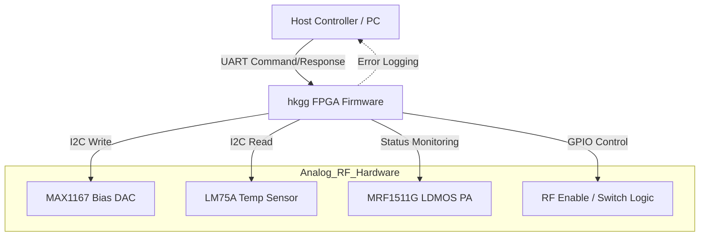
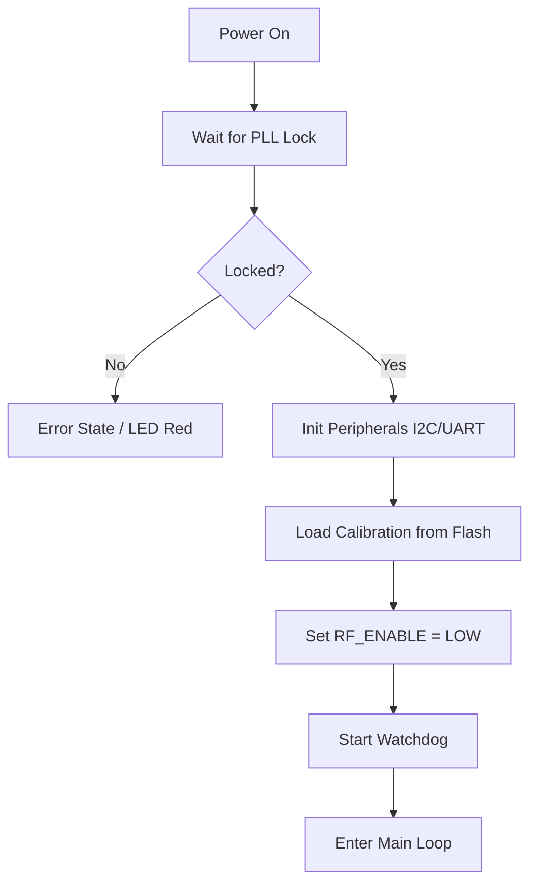
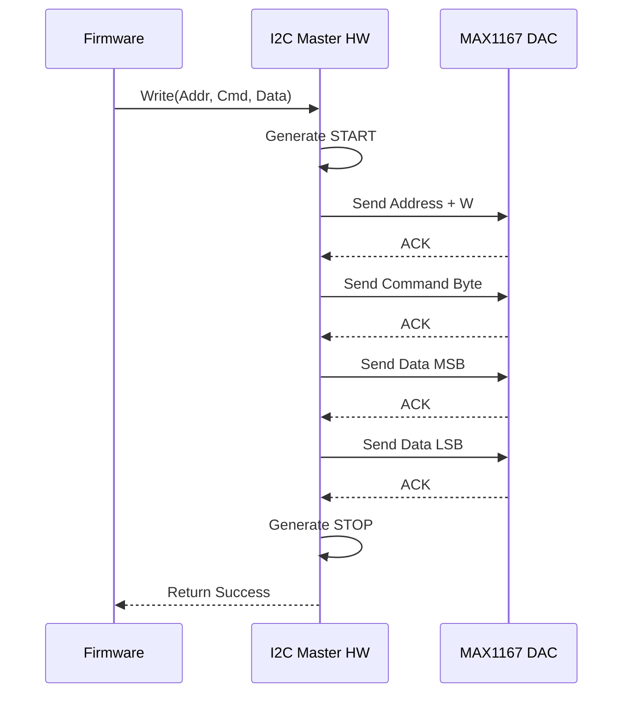
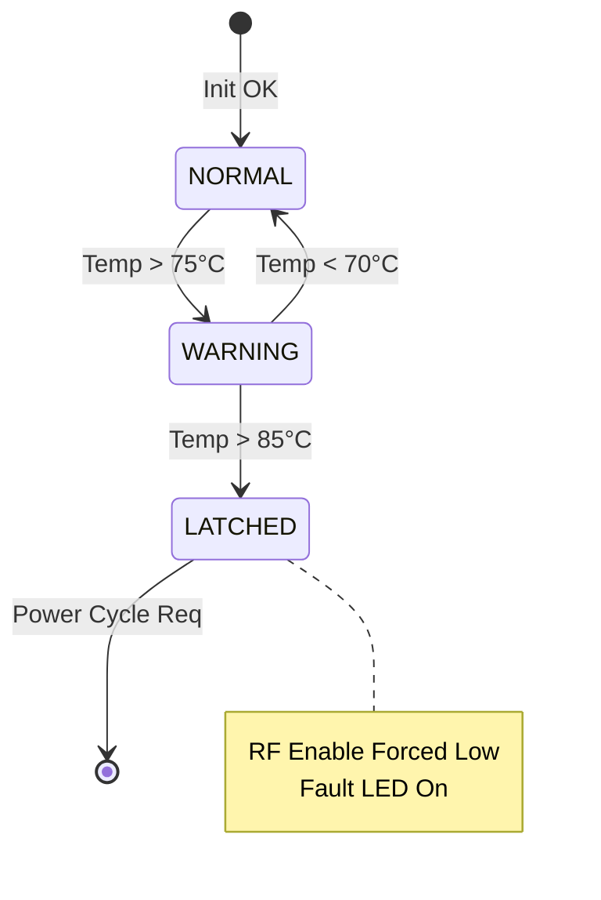
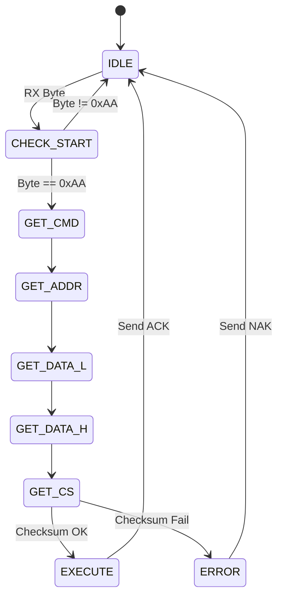
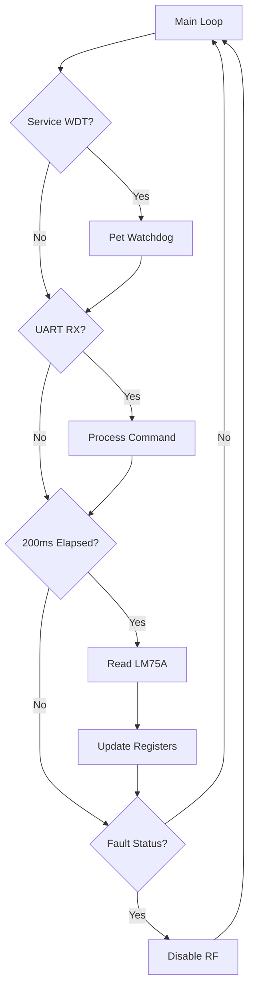

# Software Requirements Specification (SRS)

## Document Control
| Version | Date | Author | Changes |
|---------|------|--------|---------|
| 1.0 | 05 April 2026 | Senior Architect | Initial Release for hkgg Project |

---

# 1. Introduction

## 1.1 Purpose
The purpose of this document is to define the software and firmware requirements for the **hkgg RF Power Amplifier Control System**. This specification describes the behavior of the embedded firmware running on the Field Programmable Gate Array (FPGA) and associated microcontroller subsystem (if applicable within the FPGA fabric as a soft-core).

The intended audience includes:
*   **Firmware Engineers:** Responsible for RTL design (Verilog/VHDL) and C code (for Soft-core).
*   **Hardware Engineers:** Responsible for integrating the FPGA logic with the RF Power Stage (LDMOS) and analog support circuitry.
*   **Test Engineers:** Responsible for validating the system against the Hardware Requirements Specification (HRS).
*   **System Integrators:** Responsible for integrating the hkgg module into the wider platform.

## 1.2 Scope
The software scope encompasses the digital control logic required to safely operate and monitor the hkgg 10W RF Power Amplifier.
*   **Inclusions:**
    *   System initialization and Power-On Self-Test (POST).
    *   I2C Master driver for the MAX1167 DAC (Gate Bias control).
    *   I2C Master driver for the LM75A temperature sensor.
    *   UART Interface for register access (Read/Write) and status monitoring.
    *   Control logic for the RF Enable path (RF Switch and Bias sequencing).
    *   Hardware Abstraction Layer (HAL) for all peripherals defined in the Glue Logic Requirements (GLR).
    *   Fault detection and interlock management (Temperature, Overcurrent).
*   **Exclusions:**
    *   High-level waveform generation or modulation synthesis (RF Input is external).
    *   Ethernet/TCP-IP networking stack (unless specified for future expansion).
    *   User GUI for host control (only the wire protocol is specified).

## 1.3 Definitions, Acronyms, and Abbreviations

| Term | Definition |
| :--- | :--- |
| **ADC** | Analog-to-Digital Converter |
| **AFC** | Automatic Frequency Control |
| **API** | Application Programming Interface |
| **BOM** | Bill of Materials |
| **BSP** | Board Support Package |
| **CW** | Continuous Wave |
| **DAC** | Digital-to-Analog Converter |
| **DMA** | Direct Memory Access |
| **EMI** | Electromagnetic Interference |
| **FPGA** | Field Programmable Gate Array |
| **GPIO** | General Purpose Input/Output |
| **GLR** | Glue Logic Requirements |
| **HAL** | Hardware Abstraction Layer |
| **HRS** | Hardware Requirements Specification |
| **I2C** | Inter-Integrated Circuit (Serial Interface) |
| **ISR** | Interrupt Service Routine |
| **LDMOS** | Laterally Diffused Metal Oxide Semiconductor |
| **MMIC** | Monolithic Microwave Integrated Circuit |
| **NVM** | Non-Volatile Memory |
| **PA** | Power Amplifier |
| **PAE** | Power Added Efficiency |
| **PCB** | Printed Circuit Board |
| **PLL** | Phase Locked Loop |
| **POR** | Power-On Reset |
| **POST** | Power-On Self-Test |
| **PSAT** | Saturated Output Power |
| **RF** | Radio Frequency |
| **RTL** | Register Transfer Level |
| **RX** | Receive |
| **SMA** | SubMiniature version A (Connector) |
| **SPI** | Serial Peripheral Interface |
| **SRS** | Software Requirements Specification |
| **SW** | Software |
| **TTL** | Transistor-Transistor Logic |
| **TX** | Transmit |
| **UART** | Universal Asynchronous Receiver/Transmitter |
| **VSWR** | Voltage Standing Wave Ratio |

## 1.4 References
1.  **IEEE 830-1998:** *Recommended Practice for Software Requirements Specifications.*
2.  **IEEE 29148:2018:** *Systems and software engineering — Life cycle processes — Requirements engineering.*
3.  **MISRA C:2012:** *Guidelines for the use of the C language in critical systems.*
4.  **hkgg Hardware Requirements Specification (HRS)** (Project Doc P1/P2), Rev 1.0.
5.  **hkgg Glue Logic Requirements (GLR)** (Project Doc P6), Rev 0V01.
6.  **MAX1167 Datasheet:** 12-Bit DAC with Internal Reference, Maxim Integrated.
7.  **LM75A Datasheet:** Digital Temperature Sensor, NXP Semiconductors.
8.  **XC6SLX16 Datasheet:** Spartan-6 FPGA Family, Xilinx/AMD.

## 1.5 Overview
The remainder of this document is organized as follows:
*   **Section 2 (Overall Description):** Describes the system context, product functions, user characteristics, constraints, and assumptions.
*   **Section 3 (Specific Requirements):** Contains the detailed external interfaces, data structures, and functional requirements (numbered REQ-SW-001 to REQ-SW-050+).
*   **Section 4 (Verification and Validation):** Defines test cases for units, integration, and system levels.
*   **Section 5 (Traceability):** Maps software requirements to hardware and glue logic requirements.
*   **Appendices:** Contains error codes, register maps, and supporting diagrams.

---

# 2. Overall Description

## 2.1 Product Perspective
The hkgg software operates as the embedded control firmware within the Spartan-6 FPGA (XC6SLX16). It sits between the Host System (communicating via UART) and the RF Analog Hardware (Power Stages, Bias Circuits, Sensors).

### System Context Diagram


### Software Stack Layers
1.  **Hardware Layer:** FPGA Fabric, Spartan-6 primitives, IO Buffers.
2.  **Hardware Abstraction Layer (HAL):** Drivers for I2C, UART, GPIO, Timers.
3.  **Application Layer:** State Machine, POST, Command Parser, Fault Handling.

## 2.2 Product Functions
The system performs the following major functions:
1.  **System Initialization:** Configures clocks, PLLs, and IO buffers at power-up.
2.  **Power-On Self-Test (POST):** Verifies internal RAM, I2C device presence (ACK), and EEPROM integrity.
3.  **Bias Sequencing:** Controls the DAC ramp-up profile to prevent current surge in the LDMOS.
4.  **Thermal Monitoring:** Polls the LM75A sensor via I2C.
5.  **UART Interface:** Processes command packets (Read/Write) and responds with ACK/NAK.
6.  **Fault Management:** Implements hardware interlocks for over-temperature and RF Enable safety.
7.  **LED Indication:** Controls Status LEDs (Power, Fault, RF Active).
8.  **Register Map:** Maintains a virtual memory space accessible via UART for configuration.

## 2.3 User Characteristics
*   **Firmware Engineers:** Need clear RTL/C interfaces and timing constraints.
*   **Production Test Technicians:** Need robust UART responses for automated testing.
*   **Field Engineers:** Use the UART interface for diagnostics and configuration adjustments.

## 2.4 Constraints
1.  **Timing:** I2C transactions must complete within 1ms to prevent watchdog timeouts.
2.  **Resources:** Design must fit within XC6SLX16 resources (LUTs, Block RAM).
3.  **Compliance:** Firmware C code (if SoftMCU used) must be MISRA-C:2012 compliant.
4.  **Environment:** Must operate reliably from 0°C to +70°C ambient.
5.  **Power:** Logic consumption must not exceed 5% of total system budget (< 1W).
6.  **Latency:** RF Enable shut-off must occur within 10µs of a critical fault trigger.

## 2.5 Assumptions and Dependencies
1.  The +12V supply is stable and within tolerance before FPGA initialization completes.
2.  The external 50MHz reference oscillator (required by FPGA) is stable.
3.  The I2C bus lines (SDA/SCL) are pulled up to 3.3V as per schematic.
4.  The Host UART is configured to 115200 baud, 8N1, no flow control.

---

# 3. Specific Requirements

## 3.1 External Interface Requirements

### 3.1.1 Hardware Interfaces

#### 3.1.1.1 I2C Interface (Bias DAC & Temp Sensor)
The software implements an I2C Master controller operating in Standard Mode (100kHz).
*   **Protocol:** Philips I2C.
*   **Voltages:** 3.3V logic levels.
*   **Devices:**
    1.  **MAX1167 (DAC):** Address `0x10` (7-bit). Write-only (Control + Data).
    2.  **LM75A (Temp):** Address `0x48` (7-bit). Read-only (Temp Register).

```c
// I2C Hardware Abstraction Definition
typedef struct {
    volatile uint32_t CTRL;      // 0x00: Control Register (Enable, Speed)
    volatile uint32_t STATUS;    // 0x04: Status (Bus Busy, ACK Error)
    volatile uint32_t TX_FIFO;   // 0x08: Transmit Data
    volatile uint32_t RX_FIFO;   // 0x0C: Receive Data
    volatile uint32_t CMD;       // 0x10: Command Register (Start/Stop)
} I2C_RegMap_t;

// API Prototypes
int32_t I2C_Init(uint32_t clock_hz);
int32_t I2C_Write(uint8_t dev_addr, uint8_t reg_addr, const uint8_t *data, uint16_t len);
int32_t I2C_Read(uint8_t dev_addr, uint8_t reg_addr, uint8_t *data, uint16_t len);
```

#### 3.1.1.2 UART Interface (Host Command)
The software implements a UART controller at 115200 baud.
*   **Baud Rate:** 115200
*   **Data Bits:** 8
*   **Parity:** None
*   **Stop Bits:** 1

```c
// UART Register Definition
typedef struct {
    volatile uint32_t DATA;      // 0x00: R/W Data
    volatile uint32_t STATUS;    // 0x04: RX_Valid, TX_Full
    volatile uint32_t CTRL;      // 0x08: Interrupt Enable
    volatile uint32_t BAUD;      // 0x0C: Baud Rate Divisor
} UART_RegMap_t;

// API Prototypes
int32_t UART_Init(uint32_t baud);
char UART_GetChar(void);
void UART_PutChar(char c);
void UART_PutString(const char *str);
```

#### 3.1.1.3 GPIO Interface (RF Enable & LEDs)
```c
// GPIO Bank Definition
typedef struct {
    volatile uint32_t DATA_OUT;  // 0x00: Pin State
    volatile uint32_t DATA_IN;   // 0x04: Pin State
    volatile uint32_t DIR;       // 0x08: Direction (1=Output)
} GPIO_RegMap_t;

// Pin Assignments (derived from GLR)
#define PIN_RF_ENABLE  (1 << 0)  // Controls RF Switch/MOSFET Driver
#define PIN_LED_STATUS (1 << 1)  // System OK LED (Green)
#define PIN_LED_FAULT  (1 << 2)  // Fault LED (Red)
#define PIN_DAC_CS     (1 << 3)  // Chip Select (if SPI mode used)

int32_t GPIO_Init(void);
void GPIO_SetPin(uint32_t pin_mask);
void GPIO_ClearPin(uint32_t pin_mask);
uint32_t GPIO_GetPin(uint32_t pin_mask);
```

### 3.1.2 Software Interfaces
The firmware provides a register map accessible via UART to control internal parameters.

| Register Address | Name | Access | Description |
|------------------|------|--------|-------------|
| 0x00 | REG_CTRL | RW | Control Byte (Bit 0: RF Enable) |
| 0x01 | REG_STATUS | R | Status Flags (Bit 0: Temp OK, Bit 1: Fault) |
| 0x02 | REG_GATE_DAC | W | Gate Bias Setpoint (mV) |
| 0x03 | REG_TEMP | R | Current Temperature (°C) |
| 0x04 | REG_FW_VER | R | Firmware Version ID |

### 3.1.3 Communication Interfaces
**Protocol Frame Format (Binary):**
*   **Start Byte:** `0xAA`
*   **Command:** `0x57` (Write), `0x52` (Read)
*   **Address:** 8-bit Register Address
*   **Data:** 16-bit Data (for Write)
*   **Checksum:** Sum of bytes modulo 256.

**Sequence:**
1.  Host sends `[0xAA][Cmd][Addr][Data_L][Data_H][CS]`
2.  Firmware verifies Checksum.
3.  Firmware executes command.
4.  Firmware responds `[0x55][Addr][Data_L][Data_H][CS]` (Read) or `[0xCC][CS]` (Ack).

## 3.2 Functional Requirements

### 3.2.1 System Initialization (REQ-SW-001 to REQ-SW-010)

**REQ-SW-001:** The software SHALL initialize the PLL lock indicator within 20ms of power-on.
**REQ-SW-002:** The software SHALL configure all GPIO pins to their safe state (RF_ENABLE = LOW) before enabling peripherals.
**REQ-SW-003:** The software SHALL verify I2C General Call Acknowledge from the LM75A sensor during POST.
**REQ-SW-004:** The software SHALL load default calibration values from internal non-volatile memory (Flash) into RAM during startup.
**REQ-SW-005:** The software SHALL report "System Ready" via UART within 500ms of power-on.
**REQ-SW-006:** The software SHALL blink the Status LED at 2Hz during the initialization phase.
**REQ-SW-007:** The software SHALL halt initialization and assert FAULT_LED if the PLL fails to lock.
**REQ-SW-008:** The software SHALL set the default Gate Bias voltage to 0.0V (Safe State) upon reset.
**REQ-SW-009:** The software SHALL initialize the UART FIFO buffers before enabling the RX interrupt.
**REQ-SW-010:** The software SHALL enable the Watchdog Timer with a 10ms timeout after successful initialization.

### 3.2.2 I2C Driver & Sensor Management (REQ-SW-011 to REQ-SW-020)

**REQ-SW-011:** The software SHALL implement an I2C master controller capable of 100kHz operation.
**REQ-SW-012:** The software SHALL attempt up to 3 retries if an I2C device does not acknowledge (NACK).
**REQ-SW-013:** The software SHALL read the LM75A temperature register every 200ms.
**REQ-SW-014:** The software SHALL convert the 11-bit LM75A data to a float representing degrees Celsius with 0.125°C resolution.
**REQ-SW-015:** The software SHALL calculate the checksum of received I2C bytes; if corrupted, it SHALL increment the I2C_ERROR counter.
**REQ-SW-016:** The software SHALL write to the MAX1167 DAC using the specific sequence: `[Command Byte][MSB][LSB]`.
**REQ-SW-017:** The software SHALL limit the MAX1167 output voltage range to 0.0V to 5.0V in software, regardless of input value.
**REQ-SW-018:** The software SHALL ensure a minimum delay of 5µs between I2C START and STOP conditions.
**REQ-SW-019:** The software SHALL log an I2C Bus collision error if SDA is low when the software attempts to drive it high.
**REQ-SW-020:** The software SHALL disable the RF Enable signal if the LM75A sensor fails to respond for 5 consecutive reads.

### 3.2.3 RF Control & Bias Sequencing (REQ-SW-021 to REQ-SW-030)

**REQ-SW-021:** The software SHALL implement a "Soft Start" routine for the Gate Bias, ramping from 0V to target Vgs over 10ms.
**REQ-SW-022:** The software SHALL assert the RF_ENABLE pin HIGH only after the Gate Bias voltage has reached 90% of the target value.
**REQ-SW-023:** The software SHALL allow the user to set the Gate Bias via UART register `0x02`.
**REQ-SW-024:** The software SHALL ignore Gate Bias write commands if the RF_Enable bit is set (Safety Interlock).
**REQ-SW-025:** The software SHALL store the last valid Gate Bias setting in NVM for recovery after reset.
**REQ-SW-026:** The software SHALL immediately clear RF_Enable upon receipt of an Emergency Stop (0xFF) command.
**REQ-SW-027:** The software SHALL monitor the "RF Present" GPIO (if available) to confirm RF activity within 100ms of enable.
**REQ-SW-028:** The software SHALL implement a hysteresis of 5°C for thermal shutdown trips.
**REQ-SW-029:** The software SHALL update the DAC every 1ms only if the target value has changed by more than 10mV.
**REQ-SW-030:** The software SHALL clamp the maximum Gate Bias value to 4.0V (Absolute Max Rating protection).

### 3.2.4 UART Communication (REQ-SW-031 to REQ-SW-040)

**REQ-SW-031:** The software SHALL accept packets at 115200 baud, 8 data bits, no parity.
**REQ-SW-032:** The software SHALL discard any UART RX packet where the Start Byte is not `0xAA`.
**REQ-SW-033:** The software SHALL respond to valid Write commands with an ACK packet within 2ms.
**REQ-SW-034:** The software SHALL respond to valid Read commands with Data packet within 2ms.
**REQ-SW-035:** The software SHALL respond with a NAK (`0x15`) if the Checksum fails.
**REQ-SW-036:** The software SHALL echo the specific register address in the ACK packet to confirm transaction context.
**REQ-SW-037:** The software SHALL implement a 100ms timeout for incomplete packet reception.
**REQ-SW-038:** The software SHALL support the Bulk Read command (0x62) for up to 16 registers.
**REQ-SW-039:** The software SHALL treat writes to Read-Only registers as errors and return NAK.
**REQ-SW-040:** The software SHALL clear the UART RX FIFO if a Frame Error is detected.

### 3.2.5 Fault Handling & Safety (REQ-SW-041 to REQ-SW-050)

**REQ-SW-041:** The software SHALL enter "Latch-Up" state if temperature exceeds 85°C.
**REQ-SW-042:** The software SHALL require a full power-cycle (or specific Reset command) to exit "Latch-Up" state.
**REQ-SW-043:** The software SHALL set the FAULT_LED HIGH upon entering any fault state.
**REQ-SW-044:** The software SHALL disable the RF Enable signal within 10µs of a critical fault trigger.
**REQ-SW-045:** The software SHALL log the fault code to a specific status register readable via UART.
**REQ-SW-046:** The software SHALL continue to respond to UART "Read Status" commands even while in a Fault state.
**REQ-SW-047:** The software SHALL distinguish between Warning (Temp > 75°C) and Critical (Temp > 85°C) states.
**REQ-SW-048:** The software SHALL implement a "heartbeat" counter that increments every main loop cycle.
**REQ-SW-049:** The software SHALL assert the Watchdog reset if the main loop blocks for longer than 50ms.
**REQ-SW-050:** The software SHALL prevent writing to the `REG_CTRL` register if the System ID does not match `0xhkgg`.

### 3.2.6 Auxiliary Functions (REQ-SW-051 to REQ-SW-055)

**REQ-SW-051:** The software SHALL provide a command to erase and reset calibration data to factory defaults.
**REQ-SW-052:** The software SHALL toggle the Status LED state every time a valid UART packet is processed (Activity Indicator).
**REQ-SW-053:** The software SHALL calculate the current Power Added Efficiency (PAE) estimate based on dummy load values and return it to host.
**REQ-SW-054:** The software SHALL support a "Sleep Mode" command which disables all peripherals except UART and WDT.
**REQ-SW-055:** The software SHALL exit "Sleep Mode" upon receipt of any UART byte.

## 3.3 Performance Requirements

| ID | Metric | Requirement |
|---|---|---|
| REQ-PERF-001 | I2C Write Speed | Single byte write SHALL complete in < 200µs. |
| REQ-PERF-002 | UART Latency | Response to valid command SHALL be sent within 2ms. |
| REQ-PERF-003 | RF Enable Time | Time from "Enable Command" to "RF Active" SHALL be < 15ms. |
| REQ-PERF-004 | RF Disable Time | Time from "Fault Detect" to "RF Output Off" SHALL be < 10µs. |
| REQ-PERF-005 | Boot Time | Time from Power-On to "Ready" message SHALL be < 500ms. |
| REQ-PERF-006 | Temp Polling Rate | Temperature SHALL be read at least once every 200ms. |
| REQ-PERF-007 | Jitter | Main loop jitter SHALL be less than 5% of cycle time. |
| REQ-PERF-008 | Memory | RAM usage SHALL be < 80% of total Block RAM available. |
| REQ-PERF-009 | Watchdog | Watchdog SHALL be serviced every < 10ms. |

## 3.4 Design Constraints
1.  **MISRA-C:** All C code (Soft CPU) shall comply with MISRA-C:2012.
2.  **Static Allocation:** Dynamic memory allocation (malloc) is prohibited.
3.  **Interrupt Priority:** RF Fault interrupt must have the highest priority.
4.  **Clock Domain:** All I2C logic shall operate in the same clock domain to avoid metastability issues without synchronization.
5.  **Register Width:** All control registers shall be 16-bit wide.

## 3.5 Software System Attributes

### 3.5.1 Reliability
The system must achieve a Mean Time Between Failures (MTBF) of 10,000 hours. All I2C transactions must be verified with ACK checking.

### 3.5.2 Availability
The system shall be available for operation within 500ms of power application.

### 3.5.3 Security
Write access to the Bias DAC registers shall be ignored if the RF Enable is already latched on, preventing mid-run adjustment unless the system is placed in Config Mode.

### 3.5.4 Maintainability
Code shall be modularized such that the I2C driver can be replaced without modifying the Application layer.

---

# 4. Verification and Validation

## 4.1 Unit Test Requirements
*   **I2C Driver:** Simulate NACK from peripheral; verify retry logic.
*   **UART Parser:** Send frame with bad checksum; verify NAK response.
*   **State Machine:** Force temperature reading > 85°C; verify RF_DISABLE.

## 4.2 Integration Test Requirements
*   **FPGA on Board:** Connect to real LM75A. Read temp and compare with external thermometer.
*   **DAC Ramp:** Probe the Gate Bias line with oscilloscope. Verify 10ms rise time.

## 4.3 System Test Requirements
*   **Full Power:** Enable RF at 40dBm. Run for 1 hour. Verify VSWR protection.
*   **Thermal:** Heat unit to 85°C. Verify latch-off.

---

# 5. Requirements Traceability Matrix

| REQ-SW ID | Description | Traces To (HW/GLR) |
|-----------|-------------|--------------------|
| REQ-SW-001 | PLL Lock Init | GLR: System Clocking |
| REQ-SW-002 | GPIO Safe State | GLR: Section 4 (RF Enable) |
| REQ-SW-003 | I2C Sensor Check | GLR: Ref LM75A |
| REQ-SW-006 | LED Blink | HRS: REQ-HW-007 (Indicators) |
| REQ-SW-011 | I2C 100kHz | GLR: I2C Interface |
| REQ-SW-013 | Temp Read 200ms | HRS: REQ-HW-006 (Thermal) |
| REQ-SW-016 | MAX1167 Write | GLR: Ref MAX1167 |
| REQ-SW-021 | Soft Start | HRS: REQ-HW-009 (RF Enable) |
| REQ-SW-031 | UART Baud 115200 | GLR: UART Interface |
| REQ-SW-041 | Thermal Latchup | HRS: REQ-HW-006 (Safety) |
| REQ-SW-044 | Fast Fault Shutdown | HRS: REQ-HW-001 (Reliability) |
| REQ-SW-053 | PAE Calc | HRS: REQ-HW-005 (Efficiency) |

---

# 6. Appendices

## Appendix A — Error Codes
```c
typedef enum {
    ERR_OK         = 0x00,
    ERR_TIMEOUT    = 0x01, // Watchdog or I2C timeout
    ERR_CHECKSUM   = 0x02, // UART CRC fail
    ERR_I2C_NACK   = 0x03, // Device not present
    ERR_TEMP_HIGH  = 0x04, // > 85 deg C
    ERR_PARAM      = 0x05, // Invalid register write
    ERR latch      = 0x06, // System latched off
} ErrorCode_t;
```

## Appendix B — Mermaid Diagrams

### System Initialization Flow


### I2C Transaction Sequence


### Thermal Protection State Machine


### UART Command Handler State Machine


### Main Control Loop Architecture
