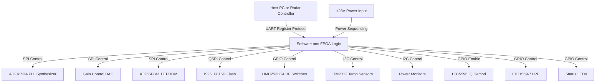
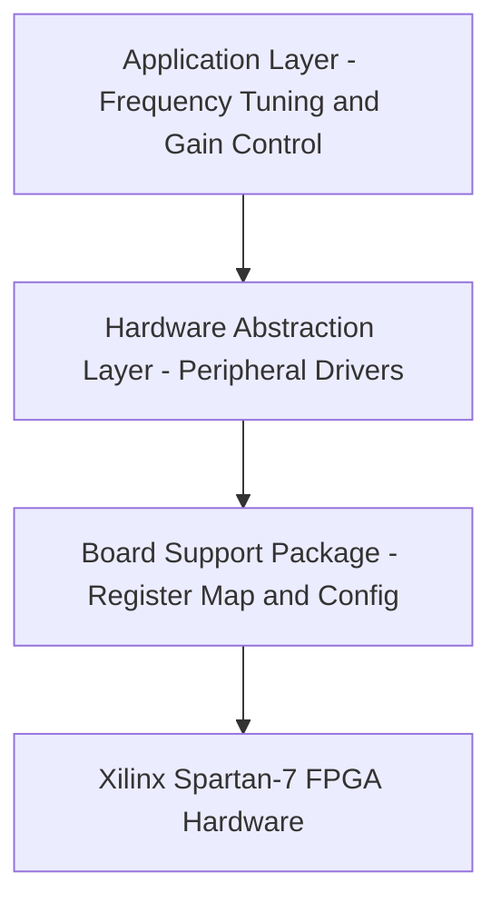
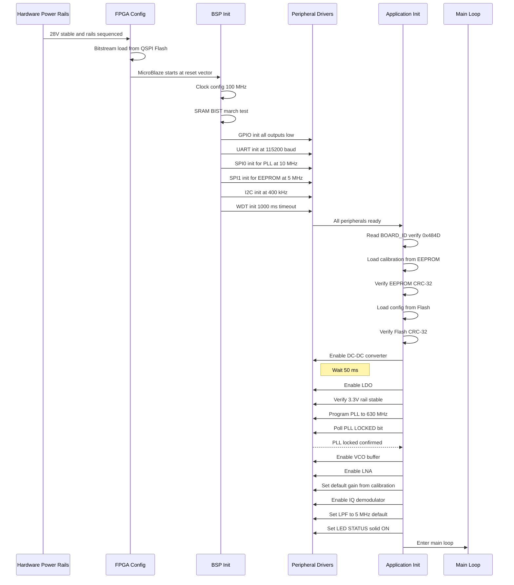
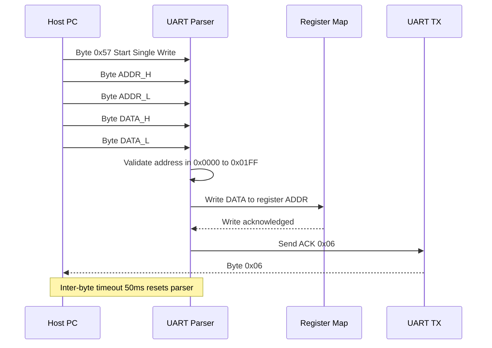
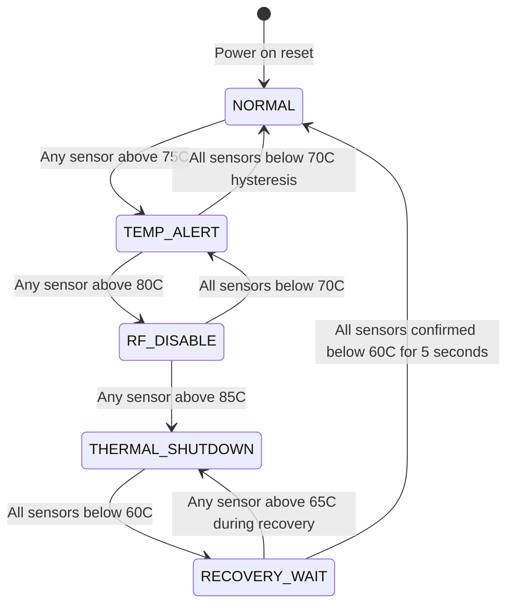
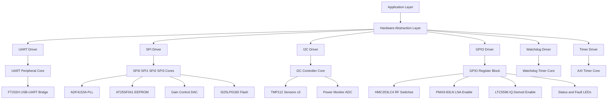
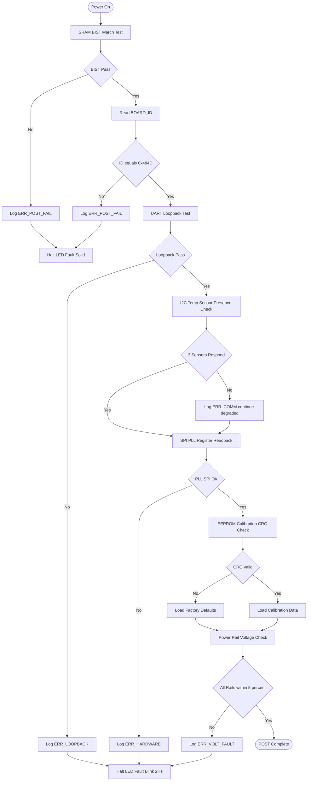
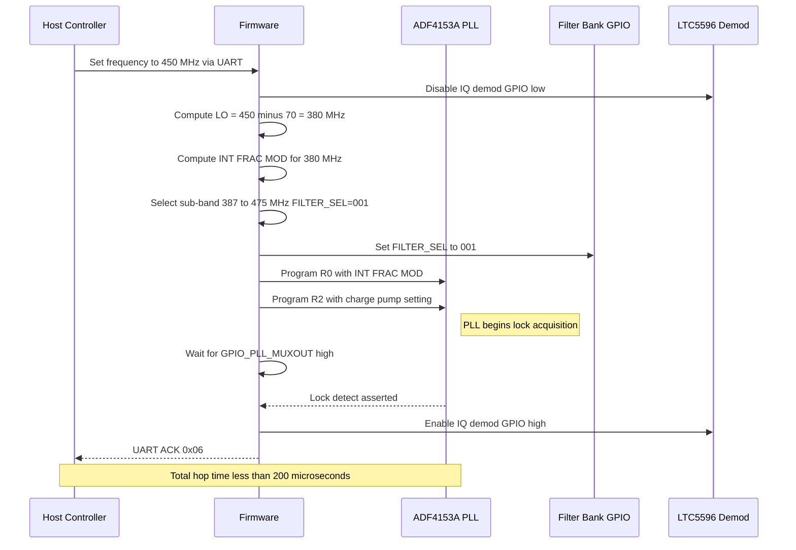

# Software Requirements Specification (SRS)

## Document Control
| Version | Date | Author | Changes |
|---------|------|--------|---------|
| 1.0 | 19 April 2026 | Firmware Lead | Initial Release |

---

# 1. Introduction

## 1.1 Purpose
This Software Requirements Specification (SRS) defines the complete set of Level 3 software and firmware requirements for the **hm** project — a UHF (300–1000 MHz) pulsed radar receiver module. This document translates the stakeholder needs and system-level hardware requirements into actionable, verifiable software requirements that will be implemented in the Xilinx Spartan-7 FPGA (XC7S25-1CSGA225) and its associated soft-core or state-machine logic.

The primary purpose of this SRS is to establish verifiable, traceable software requirements that:
- Capture the firmware and FPGA logic requirements for controlling the superheterodyne RF chain, including the switched filter bank, PLL frequency synthesizer, VGA gain control, and I/Q demodulator.
- Specify the driver-level requirements for all hardware peripherals (UART, SPI, I2C, GPIO) integrated into the FPGA fabric.
- Define the UART-based register command protocol for host-to-module telemetry and control.
- Provide a contractual and technical baseline for firmware development, FPGA HDL design (P7), and software verification testing.

This document is intended for use by firmware engineers, FPGA/HDL designers, systems engineers, test engineers, and configuration management personnel.

## 1.2 Scope
This SRS applies to the firmware and FPGA logic controlling the **hm** UHF pulsed radar receiver module. The software operates within the Xilinx Spartan-7 FPGA and manages the RF receiver chain, power sequencing, telemetry, and host communications.

**In-Scope Software Functions:**
- FPGA power-on initialization and boot configuration sequence
- UART command/response handler (register read/write protocol per GLR)
- SPI master drivers for PLL programming, EEPROM access, Flash access, and DAC control
- I2C master drivers for temperature sensors and power monitors
- GPIO control for RF switches (filter bank selection), LNA enable, and LED status indicators
- PLL frequency tuning algorithms (ADF4153A fractional-N synthesizer)
- VGA gain control (ADL5330) via SPI DAC
- I/Q demodulator enable and mode control (LTC5596)
- Baseband filter cutoff configuration (LTC1569-7)
- Continuous Built-In Test (CBIT) and Power-On Self-Test (POST)
- Temperature monitoring, alert handling, and thermal protection (shutdown sequence)
- Power rail monitoring and voltage fault detection
- Fault logging to non-volatile memory
- Watchdog timer management
- Calibration data management (loading from EEPROM, applying corrections)

**Out-of-Scope Items:**
- DSP algorithms for pulse-Doppler or MTI processing (handled by downstream digitizer)
- ADC sampling and digital data formatting
- PCB layout and schematic design
- Host PC software or GUI application
- Mechanical enclosure design

## 1.3 Definitions, Acronyms, and Abbreviations

| Term / Acronym | Definition |
|---|---|
| **ADC** | Analog-to-Digital Converter |
| **AGC** | Automatic Gain Control |
| **API** | Application Programming Interface |
| **ASIC** | Application-Specific Integrated Circuit |
| **BIST** | Built-In Self-Test |
| **BSP** | Board Support Package |
| **CBIT** | Continuous Built-In Test |
| **CRC** | Cyclic Redundancy Check |
| **DAC** | Digital-to-Analog Converter |
| **DMA** | Direct Memory Access |
| **DRC** | Design Rule Check |
| **EEPROM** | Electrically Erasable Programmable Read-Only Memory |
| **ESD** | Electrostatic Discharge |
| **FIFO** | First-In, First-Out |
| **FPGA** | Field Programmable Gate Array |
| **GLR** | Glue Logic Requirements |
| **GPIO** | General Purpose Input/Output |
| **HAL** | Hardware Abstraction Layer |
| **HDL** | Hardware Description Language |
| **HRS** | Hardware Requirements Specification |
| **I2C** | Inter-Integrated Circuit |
| **IBW** | Instantaneous Bandwidth |
| **IF** | Intermediate Frequency (70 MHz) |
| **IIP3** | Input Third-Order Intercept Point |
| **IPC** | Inter-Process Communication |
| **I/Q** | In-phase / Quadrature |
| **ISR** | Interrupt Service Routine |
| **JTAG** | Joint Test Action Group |
| **LNA** | Low Noise Amplifier |
| **LO** | Local Oscillator |
| **LDO** | Low Dropout Regulator |
| **LPF** | Low-Pass Filter |
| **MISRA** | Motor Industry Software Reliability Association |
| **MTI** | Moving Target Indication |
| **NVM** | Non-Volatile Memory |
| **PLL** | Phase-Locked Loop |
| **POST** | Power-On Self-Test |
| **QSPI** | Quad Serial Peripheral Interface |
| **RAM** | Random Access Memory |
| **RF** | Radio Frequency |
| **RPC** | Remote Procedure Call |
| **RTOS** | Real-Time Operating System |
| **SDD** | Software Design Description |
| **SIL** | Safety Integrity Level |
| **SPI** | Serial Peripheral Interface |
| **SRAM** | Static Random Access Memory |
| **StRS** | Stakeholder Requirements Specification |
| **SyRS** | System Requirements Specification |
| **TRP** | Transmit/Receive Protection |
| **UART** | Universal Asynchronous Receiver/Transmitter |
| **VCO** | Voltage-Controlled Oscillator |
| **VGA** | Variable Gain Amplifier |
| **WDT** | Watchdog Timer |

## 1.4 References

| Ref ID | Document |
|---|---|
| [1] | IEEE 830-1998: Recommended Practice for Software Requirements Specifications |
| [2] | ISO/IEC/IEEE 29148:2018: Systems and Software Engineering — Life Cycle Processes — Requirements Engineering |
| [3] | IEEE 1016-2009: Software Design Descriptions |
| [4] | MISRA C:2012: Guidelines for the Use of the C Language in Critical Systems |
| [5] | IEC 61508: Functional Safety of E/E/PE Safety-related Systems |
| [6] | Hardware Requirements Specification (HRS) — hm_v0V01 |
| [7] | Glue Logic Requirements (GLR) — hm_GLR_0V01 |
| [8] | Xilinx Spartan-7 FPGA Datasheet (XC7S25-1CSGA225) |
| [9] | ADF4153A Fractional-N PLL Synthesizer Datasheet |
| [10] | AT25SF041 4-Mbit SPI Flash Memory Datasheet |
| [11] | IS25LP016D 16-Mbit QSPI Flash Memory Datasheet |
| [12] | TMP112 Digital Temperature Sensor Datasheet |
| [13] | LTC5596 High Linearity I/Q Demodulator Datasheet |
| [14] | ADL5330 Variable Gain Amplifier Datasheet |
| [15] | Project Block Diagram (P1) |
| [16] | Netlist Specification (P4) |

## 1.5 Overview
This document is organized according to the IEEE 830-1998 / IEEE 29148:2018 standard structure. Section 2 provides an overall description of the software product, its operating environment, and constraints. Section 3 contains all specific requirements — functional, performance, external interface, and design constraints. Section 4 defines verification and validation criteria. Section 5 provides the complete requirements traceability matrix linking all software requirements (REQ-SW) to hardware requirements (REQ-HW) and GLR sections. Section 6 contains appendices with error codes, register maps, and architectural diagrams.

---

# 2. Overall Description

## 2.1 Product Perspective
The software operates as embedded firmware and FPGA logic within the **hm** UHF pulsed radar receiver module. It does not execute as a standalone application on a general-purpose OS. Instead, it is synthesized into the Xilinx Spartan-7 FPGA fabric as a combination of soft-processor instructions (MicroBlaze) and custom HDL peripherals, or implemented entirely as a finite state machine with register-mapped peripherals.

The following system context diagram illustrates the software's position within the module:



**Software Stack Layers:**



**External Systems:**
- Host PC / Radar Controller: communicates via UART command protocol
- ADF4153A PLL: receives frequency tuning words via SPI
- AT25SF041 EEPROM: stores calibration data, fault logs
- IS25LP016D Flash: stores FPGA bitstream and configuration parameters
- TMP112 temperature sensors: provide thermal telemetry via I2C
- HMC253LC4 RF switches: select filter bank sub-bands via GPIO
- LTC5596 I/Q demodulator: enable/disable via GPIO
- ADL5330 VGA: gain set via SPI DAC

## 2.2 Product Functions

The following is a summary of all major software functions:

1. **System Initialization and Boot Sequence** — Configure FPGA fabric, initialize all peripherals, load calibration data
2. **Hardware Abstraction Layer (HAL)** — Provide driver APIs for UART, SPI, I2C, GPIO, and watchdog
3. **UART Command/Response Handler** — Implement register read/write protocol (Single/Bulk, Read/Write)
4. **PLL Configuration and Lock Management** — Program ADF4153A, verify lock status, handle re-lock
5. **Switched Filter Bank Control** — Select appropriate sub-band filters via GPIO to HMC253LC4 switches
6. **VGA Gain Control** — Set ADL5330 gain via SPI DAC for AGC or manual gain modes
7. **I/Q Demodulator Control** — Enable/disable LTC5596, set operating mode
8. **Baseband Filter Configuration** — Set LTC1569-7 cutoff frequency characteristics
9. **Temperature Monitoring and Alert Handling** — Read TMP112 sensors, generate alerts, trigger thermal shutdown
10. **Voltage/Current Monitoring** — Read power monitor ICs via I2C, detect faults
11. **EEPROM Read/Write Driver** — Access AT25SF041 for calibration and fault logs
12. **Configuration Flash Driver** — Access IS25LP016D for bitstream and config storage
13. **LED and GPIO Control** — Drive status LEDs, control LNA enable, RF switch positions
14. **Watchdog Timer Management** — Initialize and service watchdog to detect firmware hang
15. **Power-On Self-Test (POST)** — Verify RAM, peripheral communication, PLL lock, sensor presence
16. **Error Logging and Fault Handling** — Log faults to EEPROM circular buffer with timestamps
17. **Calibration Data Management** — Load and apply correction factors from EEPROM
18. **Continuous Built-In Test (CBIT)** — Periodic health monitoring during normal operation
19. **Frequency Hopping Sequencing** — Execute timed frequency hop profiles for pulse-Doppler modes
20. **Power Sequencing Control** — Manage enable pins for LDOs and DC-DC converters in correct order

## 2.3 User Characteristics

| User Class | Description |
|---|---|
| **Firmware Engineers** | Primary developers of the FPGA logic and soft-processor code. Deep knowledge of SPI, I2C, UART protocols and RF control. |
| **HDL Designers** | Implement the RTL state machines and peripheral cores. Knowledge of VHDL/Verilog and timing constraints. |
| **Test Engineers** | Execute system-level tests using the UART interface to verify RF performance. Will write test scripts using the register protocol. |
| **Field Engineers** | Perform diagnostics and maintenance via UART terminal. Need clear error codes and readable status registers. |
| **System Integrators** | Integrate the receiver module into the larger radar system. Need well-defined interface specifications and timing guarantees. |

## 2.4 Constraints

| ID | Constraint | Rationale |
|---|---|---|
| CON-001 | **Coding Standard:** MISRA C:2012 compliance mandatory for all soft-processor C code | Safety-critical defense application |
| CON-002 | **Language:** C (C99) for soft-processor; VHDL/Verilog for FPGA fabric | Toolchain and maintainability requirements |
| CON-003 | **No Dynamic Memory Allocation:** malloc/free forbidden in all firmware | Deterministic real-time behavior; no heap fragmentation |
| CON-004 | **Memory Budget:** Total firmware ≤ 64 KB (MicroBlaze instruction memory); RAM usage ≤ 16 KB | Spartan-7 BRAM limitations |
| CON-005 | **Real-Time Response:** UART command response latency ≤ 100 µs from last byte received | Host timeout requirements (50 ms inter-byte, 10 ms response) |
| CON-006 | **Clock Frequency:** MicroBlaze core runs at 100 MHz (derived from FPGA system clock) | Timing closure on Spartan-7 -1 speed grade |
| CON-007 | **Toolchain:** Xilinx Vivado 2023.2 or later; Vitis SDK for C compilation | Project build environment standardization |
| CON-008 | **Hardware Revision:** Software must be compatible with PCB revision A (initial release) | Configuration management baseline |
| CON-009 | **No Recursion:** All functions must be iterative; stack depth bounded at compile time | Static analysis and safety certification |
| CON-010 | **Execution Model:** Bare-metal (no RTOS) — super-loop architecture with ISR-driven peripherals | Simplified certification; deterministic timing |

## 2.5 Assumptions and Dependencies

| ID | Assumption / Dependency |
|---|---|
| ASM-001 | Power sequencing is complete (+28V stable, +5V, +3.3V, +1.8V, +1.0V rails valid) before FPGA configuration begins |
| ASM-002 | FPGA configuration bitstream loads automatically from IS25LP016D QSPI flash via Spartan-7 master SPI mode |
| ASM-003 | System clock (50 MHz) from external oscillator is stable before MicroBlaze starts execution |
| ASM-004 | Operating temperature range is -40°C to +85°C per HRS |
| ASM-005 | Host PC serial port is configured for 8N1, matching the UART baud rate set in FPGA registers |
| ASM-006 | All I2C devices use 7-bit addressing (no 10-bit addressing required) |
| ASM-007 | PLL reference clock (10 MHz or 100 MHz) is available and stable before PLL programming begins |
| ASM-008 | EEPROM (AT25SF041) is pre-programmed with factory calibration data at manufacturing time |
| ASM-009 | VCO (ROS-1080+) tuning range is 300–1080 MHz, covering all required LO frequencies |
| ASM-010 | The UART host provides commands at rates not exceeding 1000 commands per second |

---

# 3. Specific Requirements

## 3.1 External Interface Requirements

### 3.1.1 Hardware Interfaces

**3.1.1.1 UART Interface (Host Communication)**

The FPGA implements a UART peripheral with 16-bit register-mapped access. The FT232H USB-UART bridge provides the physical layer to the host.

```c
/* UART Register Map - Base Address 0x4000_0000 */
typedef struct {
    volatile uint16_t BAUD_DIV;    /* 0x00: Baud rate divisor (system_clock / (16 * baud)) */
    volatile uint16_t CTRL;        /* 0x02: Control register (TX_EN, RX_EN, IRQ_EN) */
    volatile uint16_t STATUS;      /* 0x04: Status register (TX_FULL, RX_EMPTY, FRAME_ERR) */
    volatile uint16_t TX_DATA;     /* 0x06: TX data write port */
    volatile uint16_t RX_DATA;     /* 0x08: RX data read port */
    volatile uint16_t TX_COUNT;    /* 0x0A: TX FIFO fill count (0-256) */
    volatile uint16_t RX_COUNT;    /* 0x0C: RX FIFO fill count (0-256) */
    volatile uint16_t IRQ_STATUS;  /* 0x0E: Interrupt status / clear register */
} UART_RegMap_t;

#define UART_BASE ((UART_RegMap_t *)0x40000000)

/**
 * @brief Initialize UART peripheral.
 * @param baud_rate Target baud rate (115200, 921600, or 3000000)
 * @return ERR_OK on success, ERR_PARAM if baud_rate invalid
 */
int32_t UART_Init(uint32_t baud_rate);

/**
 * @brief Write a single byte to UART TX FIFO.
 * @param data Byte to transmit (lower 8 bits used)
 * @return ERR_OK on success, ERR_OVERFLOW if TX FIFO full
 */
int32_t UART_WriteByte(uint8_t data);

/**
 * @brief Read a single byte from UART RX FIFO.
 * @param data Pointer to store received byte
 * @return ERR_OK on success, ERR_UNDERFLOW if RX FIFO empty
 */
int32_t UART_ReadByte(uint8_t *data);

/**
 * @brief Write data to UART in blocking mode with timeout.
 * @param buf Pointer to data buffer
 * @param len Number of bytes to write
 * @param timeout_ms Maximum time to wait in milliseconds
 * @return Number of bytes written, or negative error code
 */
int32_t UART_WriteBlocking(const uint8_t *buf, uint32_t len, uint32_t timeout_ms);

/**
 * @brief Read data from UART in blocking mode with timeout.
 * @param buf Pointer to destination buffer
 * @param len Number of bytes to read
 * @param timeout_ms Maximum time to wait in milliseconds
 * @return Number of bytes read, or negative error code
 */
int32_t UART_ReadBlocking(uint8_t *buf, uint32_t len, uint32_t timeout_ms);
```

**3.1.1.2 SPI Interface (PLL / EEPROM / DAC / Flash)**

The FPGA implements four independent SPI master peripherals. Each has a dedicated chip select.

```c
/* SPI Register Map - Base Addresses:
 * SPI0 (PLL):   0x4000_1000
 * SPI1 (EEPROM): 0x4000_1100
 * SPI2 (DAC):    0x4000_1200
 * SPI3 (FLASH):  0x4000_1300
 */
typedef struct {
    volatile uint16_t CTRL;        /* 0x00: Control (CPOL, CPHA, CS_POL, EN) */
    volatile uint16_t CLK_DIV;     /* 0x02: Clock divisor */
    volatile uint16_t ADDR;        /* 0x04: Address (for Flash/EEPROM) */
    volatile uint16_t TX_DATA;     /* 0x06: TX data FIFO write port */
    volatile uint16_t RX_DATA;     /* 0x08: RX data FIFO read port */
    volatile uint16_t STATUS;      /* 0x0A: Status (BUSY, TX_EMPTY, RX_FULL) */
    volatile uint16_t XFER_LEN;    /* 0x0C: Transfer length in bytes */
} SPI_RegMap_t;

#define SPI0_BASE ((SPI_RegMap_t *)0x40001000) /* PLL (ADF4153A) */
#define SPI1_BASE ((SPI_RegMap_t *)0x40001100) /* EEPROM (AT25SF041) */
#define SPI2_BASE ((SPI_RegMap_t *)0x40001200) /* DAC (Gain Control) */
#define SPI3_BASE ((SPI_RegMap_t *)0x40001300) /* Flash (IS25LP016D) */

/**
 * @brief Initialize SPI peripheral.
 * @param base Base address of SPI peripheral
 * @param clock_hz Target SPI clock frequency in Hz
 * @param mode SPI mode (0-3): CPOL/CPHA combination
 * @return ERR_OK on success, ERR_PARAM on invalid parameters
 */
int32_t SPI_Init(SPI_RegMap_t *base, uint32_t clock_hz, uint8_t mode);

/**
 * @brief Perform SPI transfer (simultaneous TX/RX).
 * @param base Base address of SPI peripheral
 * @param tx_buf Transmit data buffer (NULL for RX-only)
 * @param rx_buf Receive data buffer (NULL for TX-only)
 * @param len Number of bytes to transfer
 * @param timeout_ms Timeout in milliseconds
 * @return Number of bytes transferred, or negative error code
 */
int32_t SPI_Transfer(SPI_RegMap_t *base, const uint8_t *tx_buf,
                     uint8_t *rx_buf, uint32_t len, uint32_t timeout_ms);

/**
 * @brief PLL-specific write function (ADF4153A).
 * @param reg_addr PLL register address (R0, R1, R2, R3, R4)
 * @param reg_data 24-bit register value
 * @return ERR_OK on success
 */
int32_t PLL_WriteReg(uint8_t reg_addr, uint32_t reg_data);

/**
 * @brief EEPROM read (AT25SF041).
 * @param addr 24-bit byte address in EEPROM
 * @param data Pointer to store read data
 * @return ERR_OK on success, ERR_TIMEOUT on failure
 */
int32_t EEPROM_ReadByte(uint32_t addr, uint8_t *data);

/**
 * @brief EEPROM write (AT25SF041).
 * @param addr 24-bit byte address in EEPROM
 * @param data Data byte to write
 * @return ERR_OK on success, ERR_EEPROM on failure
 */
int32_t EEPROM_WriteByte(uint32_t addr, uint8_t data);

/**
 * @brief Flash sector read (IS25LP016D).
 * @param addr 24-bit byte address (must be sector-aligned for erase)
 * @param buf Destination buffer
 * @param len Number of bytes to read (1-256)
 * @return ERR_OK on success
 */
int32_t Flash_Read(uint32_t addr, uint8_t *buf, uint32_t len);

/**
 * @brief Flash page write (IS25LP016D).
 * @param addr 24-bit byte address (must be page-aligned)
 * @param buf Source data buffer
 * @param len Number of bytes to write (1-256)
 * @return ERR_OK on success, ERR_FLASH_WRITE on failure
 */
int32_t Flash_PageWrite(uint32_t addr, const uint8_t *buf, uint32_t len);

/**
 * @brief Flash sector erase (IS25LP016D, 4KB sector).
 * @param addr 24-bit sector-aligned address
 * @return ERR_OK on success, ERR_FLASH_ERASE on failure
 */
int32_t Flash_EraseSector(uint32_t addr);

/**
 * @brief Set VGA gain via SPI DAC.
 * @param gain_db Target gain in dB (-20.0 to +20.0)
 * @return ERR_OK on success, ERR_PARAM if gain out of range
 */
int32_t DAC_SetGain(float gain_db);
```

**3.1.1.3 I2C Interface (Temperature Sensors / Power Monitors)**

```c
/* I2C Register Map - Base Address 0x4000_2000 */
typedef struct {
    volatile uint16_t CTRL;        /* 0x00: Control (START, STOP, ACK, EN) */
    volatile uint16_t CLK_DIV;     /* 0x02: Clock divisor for SCL frequency */
    volatile uint16_t DATA;        /* 0x04: TX/RX data register */
    volatile uint16_t STATUS;      /* 0x06: Status (BUSY, ACK_RECV, NACK, BUS_ERR) */
    volatile uint16_t ADDR;        /* 0x08: Target device address (7-bit) */
} I2C_RegMap_t;

#define I2C0_BASE ((I2C_RegMap_t *)0x40002000)

/* TMP112 I2C Addresses */
#define TEMP_SENSOR_RF_ADDR     0x48  /* A0=GND, A1=GND */
#define TEMP_SENSOR_DIGITAL_ADDR 0x49 /* A0=VCC, A1=GND */
#define TEMP_SENSOR_POWER_ADDR  0x4A  /* A0=GND, A1=VCC */

/**
 * @brief Initialize I2C peripheral.
 * @param base Base address of I2C peripheral
 * @param clock_hz Target I2C clock in Hz (100000 or 400000)
 * @return ERR_OK on success
 */
int32_t I2C_Init(I2C_RegMap_t *base, uint32_t clock_hz);

/**
 * @brief Read 8-bit register from I2C device.
 * @param dev_addr 7-bit device address
 * @param reg 8-bit register address
 * @param data Pointer to store read data
 * @return ERR_OK on success, ERR_COMM on NACK or timeout
 */
int32_t I2C_ReadReg8(uint8_t dev_addr, uint8_t reg, uint8_t *data);

/**
 * @brief Write 8-bit register to I2C device.
 * @param dev_addr 7-bit device address
 * @param reg 8-bit register address
 * @param data Data byte to write
 * @return ERR_OK on success
 */
int32_t I2C_WriteReg8(uint8_t dev_addr, uint8_t reg, uint8_t data);

/**
 * @brief Read 16-bit register from I2C device.
 * @param dev_addr 7-bit device address
 * @param reg 8-bit register address
 * @param data Pointer to store 16-bit data (MSB first)
 * @return ERR_OK on success
 */
int32_t I2C_ReadReg16(uint8_t dev_addr, uint8_t reg, uint16_t *data);

/**
 * @brief Read temperature from TMP112 sensor.
 * @param sensor_id Sensor identifier (0=RF, 1=Digital, 2=Power)
 * @param temp_degC Pointer to store temperature in degrees Celsius
 * @return ERR_OK on success, ERR_COMM on I2C failure
 */
int32_t TempSensor_ReadTemp(uint8_t sensor_id, float *temp_degC);

/**
 * @brief Read voltage from power monitor (ADC via I2C).
 * @param channel ADC channel number (0-7)
 * @param voltage_V Pointer to store voltage in Volts
 * @return ERR_OK on success
 */
int32_t PowerMon_ReadVoltage(uint8_t channel, float *voltage_V);

/**
 * @brief Read current from power monitor.
 * @param channel Current sense channel (0-3)
 * @param current_A Pointer to store current in Amps
 * @return ERR_OK on success
 */
int32_t PowerMon_ReadCurrent(uint8_t channel, float *current_A);
```

**3.1.1.4 GPIO Interface (RF Switches, Enables, LEDs)**

```c
/* GPIO Register Map - Base Address 0x4000_3000 */
typedef struct {
    volatile uint16_t OUTPUT;      /* 0x00: Output data register */
    volatile uint16_t INPUT;       /* 0x02: Input data register (read-only) */
    volatile uint16_t DIR;         /* 0x04: Direction (1=output, 0=input) */
    volatile uint16_t IRQ_MASK;    /* 0x06: Interrupt mask register */
    volatile uint16_t IRQ_STATUS;  /* 0x08: Interrupt status register */
} GPIO_RegMap_t;

#define GPIO_BASE ((GPIO_RegMap_t *)0x40003000)

/* GPIO Bit Definitions */
#define GPIO_FILTER_SEL_0    (1 << 0)  /* RF switch select bit 0 */
#define GPIO_FILTER_SEL_1    (1 << 1)  /* RF switch select bit 1 */
#define GPIO_FILTER_SEL_2    (1 << 2)  /* RF switch select bit 2 */
#define GPIO_LNA_ENABLE      (1 << 3)  /* LNA enable (active-high) */
#define GPIO_IQ_DEMOD_EN     (1 << 4)  /* LTC5596 enable */
#define GPIO_PLL_MUXOUT      (1 << 5)  /* ADF4153A MUX output (input) */
#define GPIO_LED_STATUS      (1 << 6)  /* Status LED */
#define GPIO_LED_FAULT       (1 << 7)  /* Fault LED */
#define GPIO_LPF_CTRL_0      (1 << 8)  /* LPF cutoff select bit 0 */
#define GPIO_LPF_CTRL_1      (1 << 9)  /* LPF cutoff select bit 1 */
#define GPIO_DCDC_EN         (1 << 10) /* DC-DC converter enable */
#define GPIO_LDO_EN          (1 << 11) /* LDO enable */
#define GPIO_VCO_ENABLE      (1 << 12) /* VCO buffer enable */
#define GPIO_SPARE_0         (1 << 13) /* Spare GPIO */
#define GPIO_SPARE_1         (1 << 14) /* Spare GPIO */
#define GPIO_SPARE_2         (1 << 15) /* Spare GPIO */

/**
 * @brief Initialize GPIO peripheral.
 * @return ERR_OK on success
 */
int32_t GPIO_Init(void);

/**
 * @brief Set specified GPIO bits high.
 * @param mask Bitmask of GPIOs to set
 * @return ERR_OK on success
 */
int32_t GPIO_SetBits(uint16_t mask);

/**
 * @brief Clear specified GPIO bits low.
 * @param mask Bitmask of GPIOs to clear
 * @return ERR_OK on success
 */
int32_t GPIO_ClearBits(uint16_t mask);

/**
 * @brief Read GPIO input register.
 * @param value Pointer to store current GPIO input values
 * @return ERR_OK on success
 */
int32_t GPIO_Read(uint16_t *value);
```

### 3.1.2 Software Interfaces

| Interface | Description |
|---|---|
| **MicroBlaze API** | Xilinx MicroBlaze instruction set; standard C library (libc) subset provided by Vitis standalone BSP |
| **Timer API** | AXI Timer peripheral for millisecond tick counter and watchdog servicing |
| **Interrupt Controller** | AXI INTC for prioritized handling of UART RX, SPI complete, I2C complete, and GPIO edge interrupts |
| **Logging Framework** | Lightweight ring-buffer logger writing to on-chip BRAM; flushed to EEPROM on fault events |

### 3.1.3 Communication Interfaces

**UART Register Command Protocol — Byte-Level Frame Format**

The FPGA implements a register-based command protocol over UART. The host sends command frames to read or write FPGA registers. All multi-byte values are big-endian (MSB first).

| Command | CMD Byte | Frame Structure (Host to FPGA) | Response (FPGA to Host) |
|---------|----------|-------------------------------|------------------------|
| **Single Write** | 0x57 (W) | [0x57][ADDR_H][ADDR_L][DATA_H][DATA_L] | [0x06] ACK |
| **Single Read** | 0x52 (R) | [0x52][ADDR_H OR 0x80][ADDR_L] | [DATA_H][DATA_L] |
| **Bulk Write** | 0x42 (B) | [0x42][ADDR_H][ADDR_L][N][D0_H][D0_L]...[Dn_H][Dn_L] | [0x06] ACK |
| **Bulk Read** | 0x62 (b) | [0x62][ADDR_H OR 0x80][ADDR_L][N] | [D0_H][D0_L]...[Dn_H][Dn_L] |
| **Error NAK** | 0x15 | Sent by FPGA on invalid command or address | No additional response |

**Protocol Parameters:**
- **Address Space:** 16-bit (0x0000–0xFFFF). Read addresses have bit 15 set (OR with 0x8000).
- **Maximum Bulk Count (N):** 64 registers (128 data bytes) per transaction.
- **Inter-Byte Timeout:** FPGA resets its command parser after 50 ms with no incoming bytes.
- **Host Response Timeout:** Host must process response within 10 ms.
- **ACK Byte:** 0x06 (ASCII ACK)
- **NAK Byte:** 0x15 (ASCII NAK)
- **Baud Rates Supported:** 115200, 921600, 3000000 (8N1 format)
- **CRC:** Baseline protocol has no CRC. CRC-16 CCITT optional, enabled via configuration bit in FLASH (register 0x0010 bit 0).
- **Default Baud Rate:** 115200 bps

**Address Map Summary (Software View):**

| Address Range | Block |
|---|---|
| 0x0000–0x000F | System / Status / Control |
| 0x0010–0x001F | Configuration Registers |
| 0x0020–0x002F | PLL Control Registers |
| 0x0030–0x003F | Filter Bank / GPIO Control |
| 0x0040–0x004F | Gain / AGC Control |
| 0x0050–0x005F | Temperature Sensor Data |
| 0x0060–0x006F | Power Monitor Data |
| 0x0070–0x007F | Fault / Diagnostic Log |
| 0x0080–0x00FF | Reserved |
| 0x0100–0x01FF | Extended Calibration Data |

## 3.2 Functional Requirements

### 3.2.1 System Initialization (REQ-SW-001 to REQ-SW-010)

**REQ-SW-001:** The software SHALL complete the power-on self-test (POST) and enter the main operational loop within 500 ms of FPGA configuration completion.

- **Source:** REQ-HW-014, GLR §5
- **Priority:** [M]andatory
- **Verification:** [T]est — Measure time from FPGA INIT_B assertion to main loop entry using oscilloscope on GPIO LED_STATUS pin.

**REQ-SW-002:** The software SHALL read the BOARD_ID register (address 0x0000) and verify it matches the expected value 0x484D (ASCII "HM") on startup. If mismatch, the software SHALL set LED_FAULT to solid ON and halt initialization.

- **Source:** GLR §10 (System Registers)
- **Priority:** [M]andatory
- **Verification:** [T]est — Write invalid BOARD_ID via debug interface; verify fault LED activates.

**REQ-SW-003:** The software SHALL configure the ADF4153A PLL to the default LO frequency of 630 MHz (center of 300–1000 MHz range) within 200 ms of startup.

- **Source:** REQ-HW-024, GLR §5
- **Priority:** [M]andatory
- **Verification:** [T]est — Measure PLL lock time using MUXOUT pin on ADF4153A.

**REQ-SW-004:** The software SHALL poll the PLL_STATUS.LOCKED register bit with a 100 ms timeout after programming the PLL. If LOCKED is not asserted within timeout, the software SHALL log fault code ERR_PLL to the fault log and set LED_FAULT to blinking at 2 Hz.

- **Source:** REQ-HW-024, GLR §5
- **Priority:** [M]andatory
- **Verification:** [T]est — Disconnect PLL reference clock; verify fault detection and LED behavior.

**REQ-SW-005:** The software SHALL initialize all SPI peripherals (PLL, EEPROM, DAC, Flash) before enabling any application-level RF control.

- **Source:** GLR §5, GLR §4
- **Priority:** [M]andatory
- **Verification:** [I]nspection — Code review of initialization sequence order.

**REQ-SW-006:** The software SHALL load calibration data (gain correction factors, frequency offset tables) from AT25SF041 EEPROM into internal RAM within 50 ms of EEPROM driver initialization.

- **Source:** GLR §4 (EEPROM), HRS §2 (Calibration)
- **Priority:** [M]andatory
- **Verification:** [T]est — Measure EEPROM read time; verify RAM contents match EEPROM data.

**REQ-SW-007:** The software SHALL initialize the watchdog timer with a 1000 ms timeout before entering the main operational loop.

- **Source:** GLR §5 (CBIT)
- **Priority:** [M]andatory
- **Verification:** [T]est — Block watchdog service in test build; verify FPGA resets within 1100 ms.

**REQ-SW-008:** The software SHALL transmit the firmware version string "HM_FW_v1.0.0" (null-terminated, 12 bytes) over UART at startup within 10 ms of UART driver initialization.

- **Source:** GLR §5
- **Priority:** [D]esirable
- **Verification:** [T]est — Capture UART output on power-up; verify version string presence and timing.

**REQ-SW-009:** The software SHALL perform a SRAM BIST (march test) on the 16 KB MicroBlaze data BRAM during POST. If BIST fails, the software SHALL log ERR_POST_FAIL and halt with LED_FAULT solid ON.

- **Source:** REQ-HW-014 (Reliability), GLR §5
- **Priority:** [M]andatory
- **Verification:** [T]est — Inject RAM faults via JTAG; verify BIST detects and reports error.

**REQ-SW-010:** The software SHALL set LED_STATUS to blinking at 1 Hz during initialization and transition to solid ON upon successful completion of POST.

- **Source:** GLR §5 (GPIO)
- **Priority:** [M]andatory
- **Verification:** [D]emonstration — Visual observation of LED behavior during boot.

### 3.2.2 UART Communication Driver (REQ-SW-011 to REQ-SW-020)

**REQ-SW-011:** The UART driver SHALL support baud rates of 115200, 921600, and 3000000 bps, configurable via the BAUD_DIV register at runtime.

- **Source:** GLR §4 (FT232H), GLR §10
- **Priority:** [M]andatory
- **Verification:** [T]est — Verify communication at each baud rate using protocol analyzer.

**REQ-SW-012:** The UART driver SHALL implement the Single Write command (CMD byte 0x57) parsing a 5-byte frame [0x57][ADDR_H][ADDR_L][DATA_H][DATA_L] and writing DATA to the specified register address.

- **Source:** GLR §10 (UART Protocol)
- **Priority:** [M]andatory
- **Verification:** [T]est — Send valid Single Write frames; verify register content via Single Read.

**REQ-SW-013:** The UART driver SHALL implement the Single Read command (CMD byte 0x52) parsing a 3-byte frame [0x52][ADDR_H OR 0x80][ADDR_L] and responding with [DATA_H][DATA_L] from the specified register.

- **Source:** GLR §10 (UART Protocol)
- **Priority:** [M]andatory
- **Verification:** [T]est — Read known registers; verify response data matches expected values.

**REQ-SW-014:** The UART driver SHALL implement the Bulk Write command (CMD byte 0x42) accepting up to 64 consecutive register writes in a single frame [0x42][ADDR_H][ADDR_L][N][D0_H][D0_L]...[Dn_H][Dn_L].

- **Source:** GLR §10 (UART Protocol)
- **Priority:** [M]andatory
- **Verification:** [T]est — Write 64 registers via bulk command; read back and verify all values.

**REQ-SW-015:** The UART driver SHALL implement the Bulk Read command (CMD byte 0x62) responding with up to 64 consecutive register values [D0_H][D0_L]...[Dn_H][Dn_L] for a frame [0x62][ADDR_H OR 0x80][ADDR_L][N].

- **Source:** GLR §10 (UART Protocol)
- **Priority:** [M]andatory
- **Verification:** [T]est — Read 64 registers via bulk command; verify response length is 128 bytes.

**REQ-SW-016:** The UART driver SHALL respond to an invalid command byte (any byte other than 0x57, 0x52, 0x42, 0x62) with a NAK response (0x15) within 100 µs of receiving the invalid byte.

- **Source:** GLR §10 (Error NAK)
- **Priority:** [M]andatory
- **Verification:** [T]est — Send invalid command bytes; measure NAK response time with logic analyzer.

**REQ-SW-017:** The UART driver SHALL implement a TX FIFO of at least 256 bytes and shall block (not drop data) when the TX FIFO is full.

- **Source:** GLR §4 (UART)
- **Priority:** [M]andatory
- **Verification:** [A]nalysis — Review HDL TX FIFO depth; [T]est — Verify no data loss during sustained bulk read of 64 registers.

**REQ-SW-018:** The UART driver SHALL implement an RX FIFO of at least 256 bytes and shall signal overflow via STATUS register bit if data is lost.

- **Source:** GLR §4 (UART)
- **Priority:** [M]andatory
- **Verification:** [T]est — Overwhelm RX with data faster than processing; verify overflow flag sets.

**REQ-SW-019:** The UART driver SHALL detect and clear the STATUS.FRAME_ERR flag upon read, and shall discard the erroneous byte without affecting the command parser state machine.

- **Source:** GLR §10
- **Priority:** [M]andatory
- **Verification:** [T]est — Inject framing errors (wrong parity or stop bit); verify parser continues correctly.

**REQ-SW-020:** The UART driver SHALL reset its command parser state machine to IDLE if an inter-byte gap exceeding 50 ms is detected during frame reception.

- **Source:** GLR §10 (Inter-byte timeout)
- **Priority:** [M]andatory
- **Verification:** [T]est — Send partial frame; wait 55 ms; send new valid frame; verify correct processing.

### 3.2.3 PLL and Frequency Synthesis (REQ-SW-021 to REQ-SW-030)

**REQ-SW-021:** The PLL driver SHALL program the ADF4153A via SPI (Mode 0, MSB first, 32-bit word, max 20 MHz SCLK) to set the LO frequency to any value within 230–1070 MHz with 1 Hz resolution.

- **Source:** REQ-HW-024, GLR §4 (ADF4153A), HRS §2 (LO Range)
- **Priority:** [M]andatory
- **Verification:** [T]est — Program LO to 230 MHz, 650 MHz, and 1070 MHz; verify output with spectrum analyzer.

**REQ-SW-022:** The PLL driver SHALL compute the ADF4153A fractional-N divider values (INT, FRAC, MOD) from a requested LO frequency using the formula: LO_FREQ = (INT + FRAC/MOD) × f_REF, where f_REF = 10 MHz.

- **Source:** ADF4153A Datasheet, GLR §4
- **Priority:** [M]andatory
- **Verification:** [A]nalysis — Verify calculation results for 10 test frequencies match expected register values.

**REQ-SW-023:** The software SHALL verify PLL lock by reading the GPIO_PLL_MUXOUT pin (ADF4153A MUX set to lock detect) within 100 ms after programming a new frequency.

- **Source:** REQ-HW-024, ADF4153A Datasheet
- **Priority:** [M]andatory
- **Verification:** [T]est — Program frequency hop; measure lock detect assertion time.

**REQ-SW-024:** The software SHALL support frequency hopping across the full 300–1000 MHz range by programming a new LO frequency and confirming lock within 200 µs per hop (hop-to-hop timing).

- **Source:** REQ-HW-014 (Coherent Processing), REQ-HW-013 (Pulsed)
- **Priority:** [M]andatory
- **Verification:** [T]est — Execute 1000-hop sequence; verify each hop locks within 200 µs using lock detect pin.

**REQ-SW-025:** The software SHALL select the appropriate LO sideband (high-side or low-side injection) to maintain the 70 MHz IF: LO = RF - 70 MHz (low-side) for RF 300–930 MHz; LO = RF + 70 MHz (high-side) for RF 930–1000 MHz.

- **Source:** REQ-HW-001 (Superheterodyne), HRS §2 (IF = 70 MHz)
- **Priority:** [M]andatory
- **Verification:** [A]nalysis — Verify sideband selection logic for all RF frequencies.

**REQ-SW-026:** The software SHALL provide a frequency hop table facility supporting up to 16 predefined frequency entries stored in EEPROM, each containing a 32-bit LO frequency value.

- **Source:** REQ-HW-016 (Pulse-Doppler), GLR §4
- **Priority:** [D]esirable
- **Verification:** [T]est — Load hop table with 16 entries; execute full sequence; verify output frequencies.

**REQ-SW-027:** The PLL driver SHALL implement a re-lock retry mechanism: if PLL lock is not achieved within 100 ms, the driver shall reprogram the PLL and retry up to 3 times before reporting ERR_PLL.

- **Source:** REQ-HW-024
- **Priority:** [M]andatory
- **Verification:** [T]est — Force unlock condition; verify 3 retry attempts before fault report.

**REQ-SW-028:** The software SHALL read back and verify the ADF4153A register values after programming to confirm SPI write integrity.

- **Source:** GLR §4, MISRA compliance
- **Priority:** [M]andatory
- **Verification:** [T]est — Program PLL; read back registers; compare with written values.

**REQ-SW-029:** The software SHALL set the ADF4153A charge pump current to the calibrated value stored in EEPROM (default: 2.5 mA) during PLL initialization.

- **Source:** ADF4153A Datasheet, GLR §4
- **Priority:** [M]andatory
- **Verification:** [I]nspection — Verify EEPROM calibration field is read and applied to PLL register.

**REQ-SW-030:** The software SHALL configure the ADF4153A MUXOUT pin to digital lock detect mode during initialization.

- **Source:** ADF4153A Datasheet
- **Priority:** [M]andatory
- **Verification:** [D]emonstration — Observe MUXOUT pin on oscilloscope after initialization; verify lock detect waveform.

### 3.2.4 Switched Filter Bank Control (REQ-SW-031 to REQ-SW-035)

**REQ-SW-031:** The software SHALL divide the 300–1000 MHz RF input range into 8 sub-bands and select the appropriate filter bank path by setting the GPIO_FILTER_SEL[2:0] bits.

- **Source:** REQ-HW-012 (Sub-band Tuning), GLR §4 (HMC253LC4)
- **Priority:** [M]andatory
- **Verification:** [T]est — Command each sub-band; verify RF path selection with network analyzer.

**REQ-SW-032:** The software SHALL implement the following sub-band to GPIO mapping:
  - 300–387 MHz → FILTER_SEL = 000
  - 387–475 MHz → FILTER_SEL = 001
  - 475–562 MHz → FILTER_SEL = 010
  - 562–650 MHz → FILTER_SEL = 011
  - 650–737 MHz → FILTER_SEL = 100
  - 737–825 MHz → FILTER_SEL = 101
  - 825–912 MHz → FILTER_SEL = 110
  - 912–1000 MHz → FILTER_SEL = 111

- **Source:** REQ-HW-012, HRS §2
- **Priority:** [M]andatory
- **Verification:** [A]nalysis — Verify mapping covers full 300–1000 MHz without gaps; [T]est — Verify each band.

**REQ-SW-033:** The software SHALL automatically update the filter bank selection when a new LO frequency is programmed, based on the requested RF frequency.

- **Source:** REQ-HW-012, REQ-HW-001
- **Priority:** [M]andatory
- **Verification:** [T]est — Program LO for RF in each sub-band; verify FILTER_SEL updates automatically.

**REQ-SW-034:** The software SHALL provide a manual filter bank override command via UART register 0x0030, allowing direct FILTER_SEL[2:0] control for testing purposes.

- **Source:** GLR §10
- **Priority:** [D]esirable
- **Verification:** [T]est — Write override value to register 0x0030; verify GPIO output matches.

**REQ-SW-035:** The software SHALL allow a maximum of 10 µs settling time after filter bank switch before enabling RF signal processing.

- **Source:** REQ-HW-012, HMC253LC4 Datasheet
- **Priority:** [M]andatory
- **Verification:** [T]est — Measure RF output settling time after filter switch command.

### 3.2.5 Temperature Monitoring (REQ-SW-036 to REQ-SW-046)

**REQ-SW-036:** The software SHALL read temperature from all three TMP112 sensors (RF section, digital section, power section) every 1000 ms during normal operation.

- **Source:** GLR §4 (TMP112), GLR §5
- **Priority:** [M]andatory
- **Verification:** [T]est — Verify periodic I2C transactions to all three sensor addresses using logic analyzer.

**REQ-SW-037:** The software SHALL store the latest temperature readings in UART-accessible registers: REG_TEMP_RF (0x0050), REG_TEMP_DIGITAL (0x0052), REG_TEMP_POWER (0x0054), as 16-bit signed values in 0.0625°C per LSB format (TMP112 native format).

- **Source:** TMP112 Datasheet, GLR §10
- **Priority:** [M]andatory
- **Verification:** [T]est — Heat sensor; read UART registers; verify values match direct I2C read.

**REQ-SW-038:** The software SHALL generate a TEMP_ALERT condition (logged as ERR_TEMP_ALERT) when any sensor reads above +75°C.

- **Source:** HRS §2 (Operating Temperature -40°C to +85°C, derating limit)
- **Priority:** [M]andatory
- **Verification:** [T]est — Heat RF section to +76°C; verify TEMP_ALERT logged and status register set.

**REQ-SW-039:** The software SHALL disable the LNA (GPIO_LNA_ENABLE = 0) when the RF section temperature exceeds +80°C to protect the low-noise amplifier from thermal damage.

- **Source:** HRS §2, PMA3-83LN+ Datasheet
- **Priority:** [M]andatory
- **Verification:** [T]est — Heat RF section to +81°C; verify LNA_ENABLE GPIO goes low.

**REQ-SW-040:** The software SHALL disable the I/Q demodulator (GPIO_IQ_DEMOD_EN = 0) when any temperature sensor reads above +82°C.

- **Source:** HRS §2, LTC5596 Datasheet
- **Priority:** [M]andatory
- **Verification:** [T]est — Heat digital section to +83°C; verify IQ_DEMOD_EN goes low.

**REQ-SW-041:** The software SHALL re-enable the LNA and I/Q demodulator when the relevant temperature drops below +70°C (10°C hysteresis from the shutdown threshold).

- **Source:** HRS §2
- **Priority:** [M]andatory
- **Verification:** [T]est — Heat to +81°C (shutdown); cool to +69°C; verify outputs re-enabled.

**REQ-SW-042:** The software SHALL enter a critical thermal shutdown state (all RF outputs disabled, LED_FAULT solid ON) when any sensor reads above +85°C.

- **Source:** HRS §2 (Max Operating Temperature)
- **Priority:** [M]andatory
- **Verification:** [T]est — Heat to +86°C; verify complete shutdown; verify status in fault register.

**REQ-SW-043:** The software SHALL recover from thermal shutdown automatically when all three sensors read below +60°C.

- **Source:** HRS §2
- **Priority:** [M]andatory
- **Verification:** [T]est — Induce shutdown at +86°C; cool all sensors below +60°C; verify automatic recovery.

**REQ-SW-044:** The software SHALL configure each TMP112 sensor to 12-bit resolution (0.0625°C LSB) with a 1 Hz conversion rate during I2C initialization.

- **Source:** TMP112 Datasheet
- **Priority:** [M]andatory
- **Verification:** [I]nspection — Read TMP112 configuration register via I2C after init; verify settings.

**REQ-SW-045:** The software SHALL detect I2C communication failure with any TMP112 sensor (NACK received) and log ERR_COMM to the fault log with the sensor ID.

- **Source:** GLR §5
- **Priority:** [M]andatory
- **Verification:** [T]est — Disconnect sensor in test setup; verify fault logged.

**REQ-SW-046:** The software SHALL implement a 3-out-of-5 temperature reading validation: if 3 consecutive reads from a sensor return the same value within 1°C, the reading is accepted; otherwise the previous valid reading is held.

- **Source:** HRS §2 (Reliability), GLR §5
- **Priority:** [M]andatory
- **Verification:** [A]nalysis — Verify filter algorithm; [T]est — Inject noisy readings; verify filtering.

### 3.2.6 Flash Management (REQ-SW-047 to REQ-SW-055)

**REQ-SW-047:** The Flash driver SHALL support read, page-write (256 bytes), and sector-erase (4 KB) operations on the IS25LP016D (16 Mbit QSPI flash).

- **Source:** GLR §4 (IS25LP016D), GLR §10
- **Priority:** [M]andatory
- **Verification:** [T]est — Execute read, write, erase operations; verify data integrity.

**REQ-SW-048:** The Flash driver SHALL verify each page-write operation by reading back the written data and computing a CRC-32 comparison. If CRC does not match, the driver SHALL return ERR_FLASH_WRITE.

- **Source:** MISRA compliance, GLR §4
- **Priority:** [M]andatory
- **Verification:** [T]est — Write known data; inject CRC error via debug interface; verify error returned.

**REQ-SW-049:** The Flash driver SHALL wait a maximum of 300 ms for a sector-erase operation to complete (polling status register WIP bit). If timeout expires, the driver SHALL return ERR_FLASH_ERASE.

- **Source:** IS25LP016D Datasheet (typical sector erase 100 ms, max 300 ms)
- **Priority:** [M]andatory
- **Verification:** [T]est — Erase sector; measure completion time; verify timeout handling.

**REQ-SW-050:** The Flash driver SHALL wait a maximum of 5 ms for a page-write operation to complete. If timeout expires, the driver SHALL return ERR_FLASH_WRITE.

- **Source:** IS25LP016D Datasheet (typical page program 1.5 ms, max 5 ms)
- **Priority:** [M]andatory
- **Verification:** [T]est — Write page; measure time; verify timeout handling.

**REQ-SW-051:** The software SHALL use Flash address range 0x000000–0x1FFFFF (first 2 Mbit) for configuration and calibration data storage, leaving the remainder for FPGA bitstream.

- **Source:** GLR §4 (IS25LP016D)
- **Priority:** [M]andatory
- **Verification:** [I]nspection — Verify address constants in Flash driver source code.

**REQ-SW-052:** The Flash driver SHALL implement wear leveling for the configuration sector by maintaining a write counter in EEPROM and rotating the active configuration page after 10000 write cycles.

- **Source:** GLR §4 (Reliability)
- **Priority:** [D]esirable
- **Verification:** [A]nalysis — Verify wear leveling algorithm; [T]est — Write 10001 times; verify page rotation.

**REQ-SW-053:** The EEPROM driver SHALL provide byte-level read/write access to the AT25SF041 (4 Mbit, 512 Kbit usable by firmware).

- **Source:** GLR §4 (AT25SF041)
- **Priority:** [M]andatory
- **Verification:** [T]est — Write and read back 256 bytes at address 0x000100.

**REQ-SW-054:** The EEPROM driver SHALL implement a write-enable-check-write-verify sequence: send WREN opcode, write data, read back and compare. If verification fails, return ERR_EEPROM.

- **Source:** AT25SF041 Datasheet, MISRA compliance
- **Priority:** [M]andatory
- **Verification:** [T]est — Write to EEPROM; verify data persisted after power cycle.

**REQ-SW-055:** The software SHALL store a CRC-32 checksum alongside each calibration data block in EEPROM. The software SHALL verify the CRC on load; if CRC fails, the software SHALL log ERR_CHECKSUM and load default values from Flash.

- **Source:** GLR §4, GLR §5
- **Priority:** [M]andatory
- **Verification:** [T]est — Corrupt EEPROM data; verify CRC detection and fallback to defaults.

### 3.2.7 Power Management (REQ-SW-056 to REQ-SW-064)

**REQ-SW-056:** The software SHALL monitor all critical power rails (+28V input, +5V rail, +3.3V rail, +1.8V rail, +1.0V core) every 500 ms via I2C power monitor ADC.

- **Source:** GLR §4 (Power Section), HRS §2 (+28V Supply)
- **Priority:** [M]andatory
- **Verification:** [T]est — Vary supply voltage; verify readings match external DMM within 2% tolerance.

**REQ-SW-057:** The software SHALL assert a voltage fault condition (ERR_VOLT_FAULT) if any rail deviates more than 5% from its nominal value.

- **Source:** HRS §2, GLR §4
- **Priority:** [M]andatory
- **Verification:** [T]est — Adjust +5V rail to 4.7V; verify fault detection and logging.

**REQ-SW-058:** The software SHALL store the latest power rail readings in UART-accessible registers: REG_VOLT_28V (0x0060), REG_VOLT_5V (0x0062), REG_VOLT_3V3 (0x0064), REG_VOLT_1V8 (0x0066), REG_VOLT_1V0 (0x0068), as 16-bit unsigned values in 1 mV per LSB format.

- **Source:** GLR §10
- **Priority:** [M]andatory
- **Verification:** [T]est — Read registers; verify values match expected voltages.

**REQ-SW-059:** The software SHALL disable all RF outputs (LNA, VGA, IQ demod) and assert LED_FAULT if the +5V rail drops below 4.50V (10% below nominal) to prevent erratic RF behavior.

- **Source:** HRS §2, GLR §4 (LTM8074)
- **Priority:** [M]andatory
- **Verification:** [T]est — Lower +5V rail to 4.4V; verify RF disable and fault indication.

**REQ-SW-060:** The software SHALL implement a controlled power-down sequence when a power fault is detected: (1) Disable LNA, (2) Disable VGA, (3) Disable IQ Demod, (4) Log fault, (5) Set LED_FAULT. Sequence shall complete within 10 µs of fault detection.

- **Source:** GLR §4, HRS §2
- **Priority:** [M]andatory
- **Verification:** [T]est — Inject power fault; measure GPIO transition timing with oscilloscope.

**REQ-SW-061:** The software SHALL monitor total module current draw via the power monitor and log ERR_RESOURCE if total consumption exceeds 536 mA at +28V (equivalent to 15W, the maximum per HRS).

- **Source:** REQ-HW-023 (5–15W), HRS §2
- **Priority:** [M]andatory
- **Verification:** [T]est — Increase load to 16W equivalent; verify overcurrent detection.

**REQ-SW-062:** The software SHALL read the power monitor current value and store it in UART register REG_CURRENT (0x006A) as a 16-bit unsigned value in 1 mA per LSB format.

- **Source:** GLR §10
- **Priority:** [M]andatory
- **Verification:** [T]est — Apply known load; read register; verify current reading accuracy within 5%.

**REQ-SW-063:** The software SHALL control the power sequencing enable pins (GPIO_DCDC_EN, GPIO_LDO_EN) during initialization: assert DCDC_EN first, wait 50 ms, then assert LDO_EN.

- **Source:** GLR §4 (Power Supply Section), LTM8074/LT3045 Datasheets
- **Priority:** [M]andatory
- **Verification:** [T]est — Measure enable pin timing during startup with oscilloscope.

**REQ-SW-064:** The software SHALL verify that the +3.3V rail has stabilized (reads between 3.15V and 3.45V) before enabling the PLL, VCO, and RF chain.

- **Source:** GLR §4, LT3045 Datasheet
- **Priority:** [M]andatory
- **Verification:** [T]est — Delay 3.3V stabilization; verify PLL init does not proceed.

### 3.2.8 Gain Control and AGC (REQ-SW-065 to REQ-SW-072)

**REQ-SW-065:** The software SHALL set the ADL5330 VGA gain via an SPI-connected DAC with a resolution of 0.1 dB over the range -20 dB to +20 dB.

- **Source:** REQ-HW-007 (System Gain 30 dB), GLR §4 (ADL5330)
- **Priority:** [M]andatory
- **Verification:** [T]est — Set gain to 0 dB, -20 dB, +20 dB; verify RF output level with signal generator and spectrum analyzer.

**REQ-SW-066:** The software SHALL implement a manual gain mode where the gain is set directly via UART register REG_GAIN (0x0040), accepting a 16-bit signed value in 0.1 dB units (range -200 to +200).

- **Source:** GLR §10, REQ-HW-007
- **Priority:** [M]andatory
- **Verification:** [T]est — Write gain values via UART; verify RF output changes accordingly.

**REQ-SW-067:** The software SHALL implement an AGC mode where the VGA gain is automatically adjusted based on the detected signal level from a downstream RSSI input (GPIO analog input or SPI ADC reading).

- **Source:** REQ-HW-017 (Blocker Handling), HRS §2
- **Priority:** [D]esirable
- **Verification:** [T]est — Vary input signal level; verify AGC maintains constant output within 1 dB.

**REQ-SW-068:** The software SHALL apply a gain correction factor from EEPROM calibration data when setting the VGA gain, compensating for component tolerances in the gain chain.

- **Source:** HRS §2 (Calibration), GLR §4
- **Priority:** [M]andatory
- **Verification:** [T]est — Load calibration data; verify corrected gain matches expected RF output.

**REQ-SW-069:** The software SHALL report the current gain setting in UART register REG_GAIN_ACTUAL (0x0042) as a 16-bit signed value in 0.1 dB units.

- **Source:** GLR §10
- **Priority:** [M]andatory
- **Verification:** [T]est — Set gain; read register; verify reported value matches commanded value.

**REQ-SW-070:** The software SHALL limit the maximum VGA gain to the calibrated maximum stored in EEPROM (default: +20 dB) and shall not exceed this limit regardless of UART command or AGC request.

- **Source:** REQ-HW-009 (P1dB = -20 dBm input), HRS §2
- **Priority:** [M]andatory
- **Verification:** [T]est — Command gain above +20 dB; verify actual gain is clamped to maximum.

**REQ-SW-071:** The software SHALL reduce VGA gain by 20 dB within 10 µs when an input signal exceeding -20 dBm (P1dB threshold) is detected, to protect downstream components.

- **Source:** REQ-HW-009 (P1dB), REQ-HW-005 (+20 dBm survivability)
- **Priority:** [M]andatory
- **Verification:** [T]est — Apply -15 dBm input pulse; verify gain reduction timing and magnitude.

**REQ-SW-072:** The software SHALL store gain calibration coefficients (8 coefficients, one per sub-band) in EEPROM and apply the correct coefficient when the filter bank selection changes.

- **Source:** REQ-HW-012 (Sub-band Tuning), HRS §2
- **Priority:** [M]andatory
- **Verification:** [T]est — Switch sub-bands; verify gain correction changes accordingly.

### 3.2.9 I/Q Demodulator and Baseband Control (REQ-SW-073 to REQ-SW-078)

**REQ-SW-073:** The software SHALL enable the LTC5596 I/Q demodulator by setting GPIO_IQ_DEMOD_EN high during the initialization sequence, after PLL lock is confirmed.

- **Source:** GLR §4 (LTC5596), REQ-HW-014
- **Priority:** [M]andatory
- **Verification:** [T]est — Verify GPIO_IQ_DEMOD_EN assertion timing relative to PLL lock.

**REQ-SW-074:** The software SHALL disable the LTC5596 I/Q demodulator (GPIO_IQ_DEMOD_EN = 0) during frequency hopping transitions to prevent spurious baseband outputs.

- **Source:** REQ-HW-014 (Phase Coherence), REQ-HW-013 (Pulsed)
- **Priority:** [M]andatory
- **Verification:** [T]est — Monitor I/Q outputs during frequency hop; verify no spurious transients.

**REQ-SW-075:** The software SHALL configure the LTC1569-7 baseband LPF cutoff frequency via GPIO_LPF_CTRL[1:0] pins according to the selected instantaneous bandwidth:
  - 00 = 1 MHz
  - 01 = 2.5 MHz
  - 10 = 5 MHz
  - 11 = 10 MHz

- **Source:** REQ-HW-003 (IBW 1–10 MHz), GLR §4 (LTC1569-7)
- **Priority:** [M]andatory
- **Verification:** [T]est — Set each LPF mode; measure baseband frequency response with network analyzer.

**REQ-SW-076:** The software SHALL set the default baseband bandwidth to 5 MHz (GPIO_LPF_CTRL = 10) on startup.

- **Source:** REQ-HW-003, HRS §2
- **Priority:** [M]andatory
- **Verification:** [I]nspection — Verify default LPF_CTRL value in initialization code.

**REQ-SW-077:** The software SHALL provide a UART register (REG_BASEBAND_BW, address 0x0044) to change the baseband bandwidth setting at runtime.

- **Source:** GLR §10
- **Priority:** [M]andatory
- **Verification:** [T]est — Write each bandwidth value to register; verify LPF GPIO pins change.

**REQ-SW-078:** The software SHALL ensure that the group delay variation of the combined IF and baseband signal path remains within 1 ns across the selected instantaneous bandwidth, as verified by calibration measurement stored in EEPROM.

- **Source:** REQ-HW-015 (Group Delay < 1 ns)
- **Priority:** [M]andatory
- **Verification:** [A]nalysis — Verify EEPROM calibration data includes group delay correction; [T]est — Measure group delay with vector network analyzer.

### 3.2.10 Diagnostics and Built-In Test (REQ-SW-079 to REQ-SW-090)

**REQ-SW-079:** The software SHALL implement a Power-On Self-Test (POST) sequence covering: SRAM BIST, PLL communication check, EEPROM read check, Flash read check, temperature sensor presence check, and power rail voltage check.

- **Source:** GLR §5 (CBIT), REQ-HW-014
- **Priority:** [M]andatory
- **Verification:** [T]est — Execute POST; verify all checks run; inject faults and verify detection.

**REQ-SW-080:** The software SHALL log all detected faults to a circular fault log buffer in AT25SF041 EEPROM with a minimum capacity of 64 entries (FIFO), each entry containing: 32-bit timestamp (ms since boot), 8-bit fault code, 8-bit sensor ID, and 16-bit sensor value.

- **Source:** GLR §5
- **Priority:** [M]andatory
- **Verification:** [T]est — Generate multiple faults; read fault log; verify entries are correct and FIFO behavior.

**REQ-SW-081:** The software SHALL expose a UART diagnostic command to dump the fault log: Bulk Read from register address 0x0070 with count up to 64 entries.

- **Source:** GLR §10
- **Priority:** [M]andatory
- **Verification:** [T]est — Fill fault log; dump via UART; verify contents.

**REQ-SW-082:** The software SHALL maintain a software uptime counter (32-bit, in milliseconds) readable via UART register REG_UPTIME (address 0x0004, two 16-bit registers for upper and lower halves).

- **Source:** GLR §10
- **Priority:** [M]andatory
- **Verification:** [T]est — Read uptime register at 1s and 10s after boot; verify increments correctly.

**REQ-SW-083:** The software SHALL implement a UART internal loopback self-test during POST: transmit a known pattern and verify reception via internal loopback path.

- **Source:** GLR §5
- **Priority:** [M]andatory
- **Verification:** [T]est — Verify loopback test passes on healthy system; force failure and verify detection.

**REQ-SW-084:** The software SHALL implement continuous built-in test (CBIT) by verifying PLL lock status, temperature readings, and power rail voltages every main loop cycle (target: every 100 ms).

- **Source:** GLR §5, REQ-HW-014
- **Priority:** [M]andatory
- **Verification:** [T]est — Induce PLL unlock during operation; verify CBIT detects within 200 ms.

**REQ-SW-085:** The software SHALL store the POST result as a 16-bit bitmask in UART register REG_POST_RESULT (address 0x0006), where each bit represents a test pass (0) or fail (1).

- **Source:** GLR §10
- **Priority:** [M]andatory
- **Verification:** [T]est — Force individual POST failures; verify corresponding bits set in register.

**REQ-SW-086:** The software SHALL store the CBIT status as a 16-bit bitmask in UART register REG_CBIT_STATUS (address 0x0008), updated every main loop cycle.

- **Source:** GLR §10
- **Priority:** [M]andatory
- **Verification:** [T]est — Induce faults during operation; verify CBIT status register updates.

**REQ-SW-087:** The software SHALL validate UART register write addresses against an allowed range table. Writes to undefined addresses (outside 0x0000–0x01FF) SHALL result in a NAK response.

- **Source:** GLR §10 (Error NAK)
- **Priority:** [M]andatory
- **Verification:** [T]est — Write to address 0x0200; verify NAK (0x15) response.

**REQ-SW-088:** The software SHALL implement read-only protection for critical registers (BOARD_ID at 0x0000, FW_VERSION at 0x0002). Write commands to these addresses SHALL be rejected with NAK.

- **Source:** GLR §10
- **Priority:** [M]andatory
- **Verification:** [T]est — Attempt write to BOARD_ID; verify NAK response and unchanged value

**REQ-SW-089:** The software SHALL increment a 32-bit heartbeat counter every main loop cycle and expose it via UART register REG_HEARTBEAT (address 0x000A, two 16-bit registers). A static value read twice in 500 ms indicates a firmware hang.

- **Source:** GLR §5 (Watchdog), REQ-HW-014
- **Priority:** [M]andatory
- **Verification:** [T]est — Read heartbeat register twice with 100 ms interval; verify increment.

**REQ-SW-090:** The software SHALL implement a factory-test mode entered via UART command (writing 0xA5A5 to register 0x0012). In factory-test mode, the software SHALL bypass POST and allow direct control of all GPIO and SPI peripherals for manufacturing test.

- **Source:** GLR §10, HRS §3 (Manufacturing)
- **Priority:** [O]ptional
- **Verification:** [T]est — Enter factory mode; verify direct GPIO control; verify POST bypass.

### 3.2.11 Watchdog Timer Management (REQ-SW-091 to REQ-SW-094)

**REQ-SW-091:** The software SHALL service the watchdog timer (reset the countdown) at least once every 500 ms during normal main loop operation.

- **Source:** GLR §5, REQ-HW-014
- **Priority:** [M]andatory
- **Verification:** [T]est — Measure time between watchdog service calls using GPIO toggle and oscilloscope.

**REQ-SW-092:** The software SHALL NOT service the watchdog timer during POST or EEPROM write operations lasting longer than 300 ms, to allow these operations to complete without a spurious reset. The watchdog timeout SHALL be configured to 1000 ms to accommodate this.

- **Source:** GLR §5, IS25LP016D Datasheet (max erase time 300 ms)
- **Priority:** [M]andatory
- **Verification:** [A]nalysis — Verify watchdog timeout exceeds worst-case non-serviceable period.

**REQ-SW-093:** The software SHALL log a watchdog-pre-reset event (ERR_WATCHDOG) to a persistent EEPROM register (address 0x007E) immediately before triggering a deliberate watchdog reset for diagnostic purposes, if a critical unrecoverable error is detected.

- **Source:** GLR §5, MISRA Compliance
- **Priority:** [M]andatory
- **Verification:** [T]est — Force critical error; read register 0x007E after reset; verify error code.

**REQ-SW-094:** The software SHALL check the watchdog reset status flag in the FPGA system register on startup. If the flag indicates a watchdog-initiated reset, the software SHALL log ERR_WATCHDOG to the fault log.

- **Source:** GLR §5
- **Priority:** [M]andatory
- **Verification:** [T]est — Force watchdog timeout; verify reset and fault log entry on restart.

### 3.2.12 RF Front-End Protection and Control (REQ-SW-095 to REQ-SW-098)

**REQ-SW-095:** The software SHALL enable the LNA (GPIO_LNA_ENABLE = 1) during initialization only after confirming: (a) +3.3V rail stable, (b) PLL locked, and (c) RF section temperature below +75°C.

- **Source:** REQ-HW-006 (NF < 2 dB, requires LNA active), GLR §4 (PMA3-83LN+)
- **Priority:** [M]andatory
- **Verification:** [T]est — Attempt LNA enable with PLL unlocked; verify LNA remains disabled.

**REQ-SW-096:** The software SHALL disable the LNA within 5 µs of detecting an input over-power condition (indicated by a hardware limiter flag GPIO input or power monitor reading exceeding threshold).

- **Source:** REQ-HW-005 (+20 dBm survivability), GLR §4 (SKY16406-321LF Limiter)
- **Priority:** [M]andatory
- **Verification:** [T]est — Apply +10 dBm signal; measure LNA disable latency on GPIO with oscilloscope.

**REQ-SW-097:** The software SHALL enable the VCO buffer amplifier (GPIO_VCO_ENABLE = 1) before programming the PLL and disable it during thermal shutdown to reduce power dissipation.

- **Source:** GLR §4 (GVA-84+), REQ-HW-023 (Power 5–15W)
- **Priority:** [M]andatory
- **Verification:** [T]est — Verify VCO enable sequence during startup; verify disable during thermal shutdown.

**REQ-SW-098:** The software SHALL provide an RF mute function via UART register REG_RF_MUTE (address 0x0032). Writing 0x0001 SHALL disable LNA, VGA output, and I/Q demodulator simultaneously within 10 µs.

- **Source:** REQ-HW-013 (Pulsed radar timing), GLR §10
- **Priority:** [M]andatory
- **Verification:** [T]est — Write mute command; measure RF output turn-off time with power meter.

### 3.2.13 Image Rejection Calibration (REQ-SW-099 to REQ-SW-101)

**REQ-SW-099:** The software SHALL load an image rejection calibration table from EEPROM containing 8 entries (one per sub-band), each specifying the optimal PLL phase and gain balance settings.

- **Source:** REQ-HW-010 (Image Rejection > 50 dB), HRS §2
- **Priority:** [M]andatory
- **Verification:** [T]est — Load calibration table; verify image rejection > 50 dB at each sub-band center frequency.

**REQ-SW-100:** The software SHALL apply the image rejection calibration settings for the active sub-band whenever the filter bank selection changes.

- **Source:** REQ-HW-010, REQ-HW-012
- **Priority:** [M]andatory
- **Verification:** [T]est — Switch sub-bands; verify calibration register values update accordingly.

**REQ-SW-101:** The software SHALL provide a UART-triggered image rejection measurement mode (register 0x0014, write 0x0001 to start) that measures the image frequency power relative to the desired signal and stores the result in register 0x0016 in dB units (0.1 dB LSB).

- **Source:** REQ-HW-010, GLR §10
- **Priority:** [O]ptional
- **Verification:** [D]emonstration — Trigger measurement at known frequency; verify result matches external spectrum analyzer measurement.

### 3.2.14 Configuration Management (REQ-SW-102 to REQ-SW-105)

**REQ-SW-102:** The software SHALL store the active configuration (PLL settings, gain, filter selection, LPF bandwidth) as a 64-byte block in Flash memory at address 0x001000.

- **Source:** GLR §4 (IS25LP016D), GLR §10
- **Priority:** [M]andatory
- **Verification:** [T]est — Modify configuration via UART; power cycle; verify configuration restored.

**REQ-SW-103:** The software SHALL load the saved configuration from Flash during initialization. If the Flash CRC-32 check fails, the software SHALL load factory-default values from a hard-coded constant array.

- **Source:** GLR §4, MISRA Compliance
- **Priority:** [M]andatory
- **Verification:** [T]est — Corrupt Flash configuration; verify default values loaded on restart.

**REQ-SW-104:** The software SHALL provide a UART save command (write 0x0001 to register 0x0018) that commits the current operational settings to Flash.

- **Source:** GLR §10
- **Priority:** [M]andatory
- **Verification:** [T]est — Change settings via UART; issue save command; power cycle; verify settings restored.

**REQ-SW-105:** The software SHALL report the configuration version number (incremented on each save) in UART register REG_CFG_VERSION (address 0x001A). Initial factory configuration is version 0x0001.

- **Source:** GLR §10
- **Priority:** [M]andatory
- **Verification:** [T]est — Save configuration twice; verify version increments to 0x0002 then 0x0003.

### 3.2.15 System Status Reporting (REQ-SW-106 to REQ-SW-110)

**REQ-SW-106:** The software SHALL maintain a global system status register REG_SYS_STATUS (address 0x000C, 16-bit) with the following bit definitions:
  - Bit 0: INIT_COMPLETE (1 = init done)
  - Bit 1: PLL_LOCKED (1 = locked)
  - Bit 2: TEMP_OK (1 = all temps below alert)
  - Bit 3: VOLTAGE_OK (1 = all rails within tolerance)
  - Bit 4: RF_ENABLED (1 = RF chain active)
  - Bit 5: AGC_ACTIVE (1 = AGC mode)
  - Bit 6: FAULT_ACTIVE (1 = any fault present)
  - Bit 7: FACTORY_MODE (1 = factory test mode)
  - Bits 8-15: Reserved (0)

- **Source:** GLR §10, REQ-HW-014
- **Priority:** [M]andatory
- **Verification:** [T]est — Read status register under various conditions; verify each bit reflects actual state.

**REQ-SW-107:** The software SHALL update REG_SYS_STATUS within 10 ms of any state change (PLL lock/unlock, temperature alert/clear, voltage fault/clear, RF enable/disable).

- **Source:** GLR §10
- **Priority:** [M]andatory
- **Verification:** [T]est — Force PLL unlock; read status register within 5 ms; verify PLL_LOCKED bit cleared.

**REQ-SW-108:** The software SHALL provide the firmware version as three 16-bit registers: REG_FW_VER_MAJOR (0x0002), REG_FW_VER_MINOR (0x0002 upper byte combined), encoding version as BCD: e.g., v1.0.0 = 0x0100.

- **Source:** GLR §10
- **Priority:** [M]andatory
- **Verification:** [T]est — Read firmware version register; verify matches documented release version.

**REQ-SW-109:** The software SHALL expose the FPGA device ID and DNA value (unique Xilinx identifier) via UART registers REG_FPGA_DNA_LO (0x000E) and REG_FPGA_DNA_HI (0x000F).

- **Source:** Xilinx Spartan-7 Datasheet (DNA port)
- **Priority:** [D]esirable
- **Verification:** [T]est — Read DNA registers; verify values match Xilinx tools readback.

**REQ-SW-110:** The software SHALL report the total number of power cycles (persisted in EEPROM) via UART register REG_POWER_CYCLES (0x001C). The counter SHALL increment on each boot and roll over at 65535 to 0.

- **Source:** GLR §4 (EEPROM), GLR §10
- **Priority:** [D]esirable
- **Verification:** [T]est — Power cycle 5 times; verify counter increments correctly; verify persistence.

---

## 3.3 Performance Requirements

**REQ-PERF-001:** The main operational loop SHALL execute one complete cycle (temperature read, voltage check, CBIT, status update) within 100 ms under all operating conditions.

- **Source:** REQ-HW-013, REQ-HW-014, GLR §5
- **Priority:** [M]andatory
- **Verification:** [T]est — Measure loop execution time via heartbeat GPIO toggle with oscilloscope.

**REQ-PERF-002:** UART register write operations SHALL complete end-to-end (last byte received to ACK transmitted) within 100 µs for single-register writes.

- **Source:** GLR §10 (UART Protocol), Host timeout requirements
- **Priority:** [M]andatory
- **Verification:** [T]est — Measure UART response time with protocol analyzer at 3000000 baud.

**REQ-PERF-003:** UART bulk read operations (64 registers) SHALL complete end-to-end (last byte of request to first byte of response) within 500 µs.

- **Source:** GLR §10
- **Priority:** [M]andatory
- **Verification:** [T]est — Measure bulk read latency with logic analyzer.

**REQ-PERF-004:** Temperature sensor read cycle (3 sensors via I2C) SHALL complete within 50 ms total (including I2C overhead at 400 kHz).

- **Source:** TMP112 Datasheet (conversion time), GLR §4
- **Priority:** [M]andatory
- **Verification:** [T]est — Measure I2C bus transaction duration with logic analyzer.

**REQ-PERF-005:** SPI Flash page write (256 bytes) SHALL complete within 6 ms (5 ms max Flash program time + 1 ms SPI transfer at 10 MHz).

- **Source:** IS25LP016D Datasheet
- **Priority:** [M]andatory
- **Verification:** [T]est — Measure page write duration with timer peripheral.

**REQ-PERF-006:** PLL frequency hop (program ADF4153A to new frequency and confirm lock) SHALL complete within 200 µs.

- **Source:** REQ-HW-014 (Coherent Processing), ADF4153A Datasheet (lock time)
- **Priority:** [M]andatory
- **Verification:** [T]est — Measure lock detect assertion time after PLL register write.

**REQ-PERF-007:** System initialization (reset to main loop entry) SHALL complete within 500 ms.

- **Source:** HRS §2, GLR §5
- **Priority:** [M]andatory
- **Verification:** [T]est — Measure INIT_B to LED_STATUS solid transition with oscilloscope.

**REQ-PERF-008:** ISR latency for UART RX interrupt SHALL not exceed 20 µs from interrupt assertion to first instruction of the ISR.

- **Source:** GLR §10 (50 ms inter-byte timeout, real-time command processing)
- **Priority:** [M]andatory
- **Verification:** [A]nalysis — MicroBlaze interrupt latency calculation at 100 MHz; [T]est — Measure with GPIO toggle.

**REQ-PERF-009:** Watchdog service interval SHALL be between 200 ms and 800 ms during normal operation (nominal target: 500 ms).

- **Source:** GLR §5 (1000 ms watchdog timeout)
- **Priority:** [M]andatory
- **Verification:** [T]est — Measure watchdog service period with timer capture.

**REQ-PERF-010:** Total RAM usage SHALL not exceed 14 KB (87.5% of 16 KB available), reserving a minimum 2 KB for stack and ISR workspace.

- **Source:** Spartan-7 BRAM constraints, CON-004
- **Priority:** [M]andatory
- **Verification:** [A]nalysis — Static RAM usage analysis from linker map file.

**REQ-PERF-011:** Total firmware code size SHALL not exceed 56 KB (87.5% of 64 KB available MicroBlaze instruction memory).

- **Source:** Spartan-7 BRAM constraints, CON-004
- **Priority:** [M]andatory
- **Verification:** [A]nalysis — Static code size from linker map file.

**REQ-PERF-012:** GPIO state transition (from UART write command received to GPIO pin toggled) SHALL complete within 50 µs.

- **Source:** REQ-HW-013 (Pulsed radar timing), GLR §10
- **Priority:** [M]andatory
- **Verification:** [T]est — Send GPIO toggle command via UART; measure pin transition with oscilloscope.

**REQ-PERF-013:** Power fault detection to RF output disable SHALL complete within 10 µs.

- **Source:** REQ-HW-005 (+20 dBm survivability), GLR §4
- **Priority:** [M]andatory
- **Verification:** [T]est — Inject over-voltage; measure time to LNA disable on GPIO with oscilloscope.

**REQ-PERF-014:** EEPROM fault log write SHALL complete within 20 ms (including WREN, program, and read-verify cycles).

- **Source:** AT25SF041 Datasheet (page program time 3 ms typical)
- **Priority:** [M]andatory
- **Verification:** [T]est — Trigger fault; measure time to EEPROM write completion.

**REQ-PERF-015:** I2C bus throughput SHALL sustain a minimum of 10 transactions per second (3 temperature reads + 5 voltage reads + 2 current reads) without impacting main loop timing.

- **Source:** GLR §4 (TMP112, Power Monitor), REQ-PERF-001
- **Priority:** [M]andatory
- **Verification:** [T]est — Verify I2C transaction completion does not extend main loop beyond 100 ms.

---

## 3.4 Design Constraints

**CON-SW-001:** **Coding Standard** — All C source code SHALL comply with MISRA C:2012 mandatory directives and rules. Deviations must be documented with justification and approved by the project safety lead. Rationale: Safety-critical defense application; MISRA compliance reduces undefined behavior risks.

**CON-SW-002:** **Language** — All soft-processor firmware SHALL be written in C (ISO/IEC 9899:1999, C99 standard). FPGA logic SHALL be written in VHDL-2008 or Verilog-2001. No C++ constructs are permitted. Rationale: Toolchain compatibility (Vitis SDK) and safety certification requirements.

**CON-SW-003:** **No Dynamic Memory Allocation** — The use of malloc(), calloc(), realloc(), or free() is strictly forbidden. All memory allocation SHALL be static (compile-time). All buffers SHALL be pre-allocated with fixed sizes. Rationale: Eliminates heap fragmentation, memory leaks, and non-deterministic allocation latency in real-time operation.

**CON-SW-004:** **Stack Depth Analysis** — Maximum stack usage SHALL be statically analyzed for all call paths (including worst-case ISR nesting). Stack size SHALL be configured to 125% of worst-case analyzed depth. Rationale: Prevents stack overflow in safety-critical operation.

**CON-SW-005:** **Interrupt Service Routines** — All ISRs SHALL complete within 50 µs maximum. ISRs SHALL only perform data transfer (copy to/from buffer) and set flags; all protocol processing SHALL be deferred to the main loop. Rationale: Prevents ISR starvation and ensures deterministic latency.

**CON-SW-006:** **Volatile Qualification** — All global variables shared between ISR context and main loop context SHALL be declared with the volatile qualifier. Rationale: Prevents compiler optimization removing required memory reads/writes in concurrent access scenarios.

**CON-SW-007:** **No Recursion** — No recursive function calls are permitted. All algorithms SHALL be implemented iteratively. Rationale: Enables static stack depth analysis; prevents unbounded stack growth.

**CON-SW-008:** **CRC-32 on NVM Writes** — All writes to non-volatile memory (EEPROM and Flash configuration regions) SHALL be accompanied by a CRC-32 checksum. The CRC polynomial SHALL be 0x04C11DB7 (standard CRC-32/ISO-HDLC). Rationale: Detects data corruption in non-volatile storage due to power loss during write or radiation-induced bit flips.

**CON-SW-009:** **No Floating Point** — The MicroBlaze soft processor SHALL be configured without floating-point unit (FPU). All arithmetic SHALL use fixed-point (integer) representations. Temperature in 0.0625°C units, gain in 0.1 dB units, voltage in 1 mV units. Rationale: Reduces FPGA resource utilization; eliminates floating-point library overhead.

**CON-SW-010:** **Build Reproducibility** — All builds SHALL be reproducible. The toolchain version (Vivado 2023.2), optimization flags (-O2), and all source file checksums SHALL be recorded in the build manifest. Rationale: Configuration management and traceability of released firmware.

---

## 3.5 Software System Attributes

### 3.5.1 Reliability

| ID | Requirement | Verification |
|---|---|---|
| REL-001 | The software SHALL achieve a Mean Time Between Failures (MTBF) of ≥ 20,000 hours as calculated per MIL-HDBK-217F for the firmware contribution to system reliability. | [A]nalysis — MTBF calculation based on fault rates and watchdog coverage |
| REL-002 | The software SHALL detect and recover from any single peripheral communication failure (SPI, I2C, UART) without requiring a system reset, using retry mechanisms with a maximum of 3 retries per failure. | [T]est — Force communication failures; verify automatic recovery |
| REL-003 | The watchdog timer SHALL provide 100% coverage of firmware hang conditions — any failure to service the watchdog within 1000 ms SHALL result in a complete FPGA re-initialization. | [A]nalysis — Verify all code paths lead to watchdog service or reset |
| REL-004 | The software SHALL implement graceful degradation: if a non-critical peripheral (e.g., one of three temperature sensors) fails, the system SHALL continue operation using remaining sensors and log the fault. | [T]est — Disable one temperature sensor; verify continued operation |
| REL-005 | The software SHALL detect single-bit errors in EEPROM/Flash data via CRC-32 and attempt re-read from redundant copy (if available) before reporting failure. | [T]est — Corrupt single byte in EEPROM; verify detection and recovery |
| REL-006 | The software SHALL clear all sensitive RAM locations (fault log buffers, calibration data) to zero before entering the main loop on a warm reset. | [I]nspection — Code review of reset handler |

### 3.5.2 Availability

| ID | Requirement | Verification |
|---|---|---|
| AVAIL-001 | The software SHALL support a system availability target of 99.9%, equivalent to less than 8.76 hours unplanned downtime per year. | [A]nalysis — Reliability block diagram analysis |
| AVAIL-002 | System startup time from power application to RF output enabled SHALL be less than 1 second under normal conditions (all checks pass). | [T]est — Measure startup time over 100 power cycles |
| AVAIL-003 | Automatic recovery from thermal shutdown SHALL complete within 2 seconds of all temperature sensors reading below the recovery threshold. | [T]est — Induce and recover from thermal shutdown; measure recovery time |
| AVAIL-004 | Automatic recovery from PLL unlock SHALL complete within 500 ms (3 retry attempts at 100 ms each plus overhead). | [T]est — Force PLL unlock; measure time to re-lock or fault declaration |

### 3.5.3 Security

| ID | Requirement | Verification |
|---|---|---|
| SEC-001 | The software SHALL NOT provide any remote code execution paths. No firmware update capability via UART is permitted in the baseline release. | [I]nspection — Code review confirming no boot loader or flash update commands |
| SEC-002 | UART register write addresses SHALL be validated against the allowed address range (0x0000–0x01FF). Out-of-range writes SHALL be rejected with NAK (0x15). | [T]est — Attempt writes to addresses 0x0200, 0xFFFF; verify NAK response |
| SEC-003 | Write access to the FPGA bitstream region of Flash (addresses 0x200000–0x1FFFFF) SHALL be blocked in software to prevent accidental or malicious corruption. | [T]est — Attempt Flash write to protected region; verify rejection |
| SEC-004 | The factory-test mode (register 0x0012) SHALL only be accessible for 30 seconds after POST completion; after 30 seconds, the factory mode entry command SHALL be ignored until next power cycle. | [T]est — Attempt factory mode entry after 31 seconds; verify rejection |
| SEC-005 | The UART interface SHALL NOT echo received commands back to the host. Only defined responses (ACK, NAK, data) SHALL be transmitted. | [T]est — Send commands; verify no echo of command bytes in response |

### 3.5.4 Maintainability

| ID | Requirement | Verification |
|---|---|---|
| MAIN-001 | Cyclomatic complexity per function SHALL not exceed 15, as measured by static analysis tool (PC-lint or Polyspace). | [A]nalysis — Static analysis report |
| MAIN-002 | All functions SHALL be documented with Doxygen-compatible headers specifying: brief description, param, return, and note tags. | [I]nspection — Doxygen build produces complete documentation |
| MAIN-003 | Unit test coverage SHALL be ≥ 80% line coverage and ≥ 70% branch coverage for all HAL driver modules (UART, SPI, I2C, GPIO). | [T]est — Generate coverage report from unit test execution |
| MAIN-004 | All magic numbers SHALL be replaced with named constants (macros or enum values). No numeric literals other than 0 and 1 SHALL appear in function bodies. | [I]nspection — Code review |
| MAIN-005 | The hardware abstraction layer SHALL isolate all hardware-specific register addresses and bit definitions into a single header file (board_config.h), enabling porting by modifying only that file and the HAL implementation. | [I]nspection — Verify no hardware-specific constants in application layer code |

### 3.5.5 Portability

| ID | Requirement | Verification |
|---|---|---|
| PORT-001 | All platform-specific configuration (register base addresses, GPIO bit mappings, clock frequencies, peripheral assignments) SHALL be defined in a single header file (board_config.h). | [I]nspection — Verify single configuration file contains all hardware mappings |
| PORT-002 | The HAL API (function signatures) SHALL be independent of the underlying hardware implementation. Driver replacement SHALL not require changes to application-layer code. | [A]nalysis — Verify application code compiles against HAL header without implementation |
| PORT-003 | All compiler-specific extensions (e.g., volatile, pragma, attribute) SHALL be abstracted via preprocessor macros defined in platform_types.h. | [I]nspection — Verify no direct compiler-specific syntax in application code |

---

## 3.6 Safety Requirements

| ID | Requirement | Source | Priority | Verification |
|---|---|---|---|---|
| SAFE-001 | The software SHALL disable all RF outputs within 10 µs of detecting any of the following: temperature > +85°C, +5V rail < 4.50V, or watchdog expiration. | REQ-HW-005, HRS §2 | [M]andatory | [T]est — Inject each fault; measure RF disable time with oscilloscope |
| SAFE-002 | The software SHALL enter a safe state (all outputs disabled, fault logged) on any uncorrectable error and SHALL NOT automatically re-enable outputs without explicit UART command or power cycle. | IEC 61508, REQ-HW-014 | [M]andatory | [T]est — Force uncorrectable error; verify safe state and lockout |
| SAFE-003 | The software SHALL perform a RAM BIST at startup to detect stuck-at faults and coupling faults. If BIST fails, the software SHALL NOT proceed to enable any RF outputs. | IEC 61508, REQ-HW-014 | [M]andatory | [T]est — Inject RAM fault via JTAG; verify system halts |
| SAFE-004 | The software SHALL use at least two independent mechanisms (watchdog timer + main loop heartbeat) to detect firmware execution failures. | IEC 61508 SIL-2 | [M]andatory | [A]nalysis — Verify dual mechanism design |
| SAFE-005 | The CRC-32 integrity of the configuration block in Flash SHALL be verified before applying settings on every boot. If CRC fails, factory defaults SHALL be used. | IEC 61508, CON-SW-008 | [M]andatory | [T]est — Corrupt Flash CRC; verify defaults loaded |
| SAFE-006 | The software SHALL NOT allow the LO frequency to be set outside the range 230–1070 MHz (enforced by the PLL driver parameter validation). Out-of-range requests SHALL return ERR_PARAM. | REQ-HW-002, HRS §2 | [M]andatory | [T]est — Attempt to program LO at 100 MHz and 1100 MHz; verify rejection |
| SAFE-007 | The software SHALL detect and flag a persistent fault condition if the same fault recurs more than 5 times within 60 minutes, requiring a power cycle to clear. | GLR §5, IEC 61508 | [M]andatory | [T]est — Trigger same fault 6 times; verify persistent fault lockout |
| SAFE-008 | All SPI writes to the PLL SHALL use a write-then-readback-verify sequence. If readback fails 3 consecutive times, the software SHALL declare ERR_HARDWARE and disable the PLL. | ADF4153A Datasheet, CON-SW-008 | [M]andatory | [T]est — Force SPI readback mismatch; verify fault handling |

---

# 4. Verification and Validation

## 4.1 Unit Test Requirements

Each driver module SHALL be unit tested with minimum 3 test cases per module covering normal operation, boundary conditions, and fault injection.

### 4.1.1 UART Driver Unit Tests

| Test ID | Description | Pass Criteria |
|---|---|---|
| UT-UART-001 | Initialize UART at 115200, 921600, and 3000000 baud | BAUD_DIV register set correctly for each rate |
| UT-UART-002 | Transmit 256-byte frame and verify TX_COUNT increments to 256 | TX_COUNT matches len |
| UT-UART-003 | Receive byte with RX FIFO empty; verify returns ERR_UNDERFLOW | ERR_UNDERFLOW returned |
| UT-UART-004 | Transmit with TX FIFO full (256 bytes buffered); verify ERR_OVERFLOW | ERR_OVERFLOW returned or blocks correctly |
| UT-UART-005 | Inject framing error; verify STATUS.FRAME_ERR set and parser state unchanged | Frame error detected, parser in IDLE |

### 4.1.2 SPI Driver Unit Tests

| Test ID | Description | Pass Criteria |
|---|---|---|
| UT-SPI-001 | Initialize SPI0 at 10 MHz mode 0; verify CTRL register bits | CPOL=0, CPHA=0, CLK_DIV correct |
| UT-SPI-002 | Write 32-bit value to PLL register R0; verify MOSI data matches on logic analyzer | 32-bit word transmitted correctly |
| UT-SPI-003 | Read EEPROM byte at address 0x000000; verify returned data matches expected | Data matches |
| UT-SPI-004 | Flash page write of 256 bytes; readback and compare | Readback matches written data |
| UT-SPI-005 | SPI transfer with no slave responding (CS held high); verify timeout after 100 ms | ERR_TIMEOUT returned |

### 4.1.3 I2C Driver Unit Tests

| Test ID | Description | Pass Criteria |
|---|---|---|
| UT-I2C-001 | Initialize I2C at 400 kHz; verify CLK_DIV register | SCL frequency within 1% of target |
| UT-I2C-002 | Read TMP112 temperature register from address 0x48; verify 16-bit data returned | Data in valid range (-40°C to +85°C) |
| UT-I2C-003 | Read from non-existent device address 0x77; verify NACK detected and ERR_COMM returned | ERR_COMM returned |
| UT-I2C-004 | Write configuration register to TMP112; readback and verify | Readback matches written value |

### 4.1.4 GPIO Driver Unit Tests

| Test ID | Description | Pass Criteria |
|---|---|---|
| UT-GPIO-001 | Set GPIO_FILTER_SEL bits to all 8 combinations (000-111); verify OUTPUT register | OUTPUT register bits 2:0 match commanded value |
| UT-GPIO-002 | Read GPIO_INPUT with known external state; verify bits match | INPUT register reflects actual pin states |
| UT-GPIO-003 | Configure DIR register for all outputs; verify DIR reads 0xFFFF | DIR register = 0xFFFF |

### 4.1.5 PLL Driver Unit Tests

| Test ID | Description | Pass Criteria |
|---|---|---|
| UT-PLL-001 | Compute INT, FRAC, MOD values for 630 MHz LO (f_REF = 10 MHz) | INT=63, FRAC=0, MOD=1 |
| UT-PLL-002 | Compute INT, FRAC, MOD values for 635.5 MHz LO | INT=63, FRAC=55000, MOD=100000 |
| UT-PLL-003 | Request LO frequency of 100 MHz (below valid range); verify ERR_PARAM | ERR_PARAM returned |
| UT-PLL-004 | Request LO frequency of 1100 MHz (above valid range); verify ERR_PARAM | ERR_PARAM returned |

### 4.1.6 Flash Driver Unit Tests

| Test ID | Description | Pass Criteria |
|---|---|---|
| UT-FLASH-001 | Erase sector at 0x001000; verify all bytes read 0xFF | All 4096 bytes = 0xFF |
| UT-FLASH-002 | Write page at 0x001000 with known pattern; readback and verify CRC-32 match | CRC-32 of readback matches CRC-32 of written data |
| UT-FLASH-003 | Write to non-page-aligned address; verify ERR_PARAM | ERR_PARAM returned |

## 4.2 Integration Test Requirements

| Test ID | Description | Requirements Verified | Pass Criteria |
|---|---|---|---|
| IT-001 | UART loopback self-test: FPGA TX connected to RX internally; transmit 64-byte pattern and verify reception | REQ-SW-083 | All 64 bytes received correctly, no framing errors |
| IT-002 | SPI EEPROM write-read-verify: write 32-byte calibration block to EEPROM, power cycle, read back | REQ-SW-006, REQ-SW-054 | Data persists across power cycle, CRC-32 valid |
| IT-003 | Temperature sensor read: read all 3 TMP112 sensors and verify readings within -40°C to +85°C range | REQ-SW-036, REQ-SW-037 | All 3 sensors return valid data within 1 second |
| IT-004 | Temperature alert trigger: heat RF section to +76°C, verify TEMP_ALERT logged and status bit set | REQ-SW-038, REQ-SW-106 | Fault logged, REG_SYS_STATUS bit 2 cleared |
| IT-005 | Flash sector erase-write-read-CRC: erase sector, write 256-byte page, read back, compute CRC | REQ-SW-047, REQ-SW-048 | CRC-32 of readback matches |
| IT-006 | PLL lock acquisition: program LO to 500 MHz, verify lock detect pin asserts within 200 µs | REQ-SW-003, REQ-SW-024, REQ-PERF-006 | Lock detect asserted within 200 µs |
| IT-007 | Filter bank switching: command each of 8 sub-bands via UART, verify RF switch positions | REQ-SW-031, REQ-SW-032 | Correct GPIO_FILTER_SEL value for each sub-band |
| IT-008 | Full UART protocol: send all 4 command types (Single Read, Single Write, Bulk Read, Bulk Write) and verify responses | REQ-SW-012 through REQ-SW-015 | All responses match expected data |
| IT-009 | Power fault detection: lower +5V rail to 4.4V, verify RF outputs disabled within 10 µs | REQ-SW-059, REQ-SW-060, REQ-PERF-013 | LNA, VGA, IQ demod disabled within 10 µs |
| IT-010 | Gain control: set VGA gain to -20, 0, and +20 dB via UART; verify RF output level changes accordingly | REQ-SW-065, REQ-SW-066 | Measured output changes by expected dB values ±0.5 dB |

## 4.3 System Test Requirements

| Test ID | Description | Requirements Verified | Pass Criteria |
|---|---|---|---|
| ST-001 | Full power-on sequence: apply +28V, measure time to REG_SYS_STATUS.INIT_COMPLETE = 1 | REQ-SW-001, REQ-PERF-007 | Init completes in < 500 ms |
| ST-002 | 72-hour endurance test: operate module continuously at nominal conditions (+25°C, +28V), logging temperature, voltage, PLL lock status every 10 seconds | REQ-HW-023, REL-001 | No faults, no PLL unlock events, all temperatures stable |
| ST-003 | Temperature stress test: operate module at -40°C, 0°C, +25°C, +55°C, +85°C for 1 hour each; verify all functions at each temperature | REQ-HW-002 (Operating Temp) | All functions pass at each temperature point |
| ST-004 | Frequency sweep test: program LO across full 300–1000 MHz range in 10 MHz steps; verify PLL lock and image rejection at each step | REQ-HW-002, REQ-HW-010 | PLL locks at all frequencies; image rejection > 50 dB at all points |
| ST-005 | UART protocol conformance test: send all valid commands, invalid commands, truncated frames, and frames with inter-byte delays exceeding 50 ms | REQ-SW-011 through REQ-SW-020 | Valid commands processed; invalid commands return NAK; truncated frames reset parser |
| ST-006 | Thermal shutdown and recovery test: heat module to +86°C (shutdown), then cool to +55°C (below recovery threshold) | REQ-SW-042, REQ-SW-043 | Shutdown at +86°C; automatic recovery at +55°C |
| ST-007 | Noise figure verification: measure system NF at 500 MHz, 750 MHz, and 1000 MHz using Y-factor method | REQ-HW-006 (NF < 2 dB) | NF < 2 dB at all three frequencies |
| ST-008 | Linearity test: measure IIP3 and P1dB at 500 MHz and 900 MHz | REQ-HW-008 (IIP3 ≥ -10 dBm), REQ-HW-009 (P1dB ≥ -20 dBm) | IIP3 ≥ -10 dBm, P1dB ≥ -20 dBm |
| ST-009 | Pulsed radar signal test: apply 1 µs RF pulses at 300 MHz, 650 MHz, 1000 MHz; verify baseband I/Q output pulse shape and amplitude | REQ-HW-013 (1 µs pulse) | Pulse output detected with rise time < 100 ns |
| ST-010 | Maximum input survivability: apply +20 dBm CW at antenna port for 60 seconds at 500 MHz; verify no damage | REQ-HW-005 (+20 dBm) | Module functional after test; NF, gain, linearity within spec |

## 4.4 Formal Verification

| ID | Description | Method |
|---|---|---|
| FV-001 | Static analysis report: all C source files analyzed with PC-lint or Polyspace; zero mandatory MISRA violations | Tool report |
| FV-002 | Stack usage analysis: worst-case stack depth calculated for all call paths including nested ISRs; configured stack ≥ 125% of worst case | Linker map + static analysis tool |
| FV-003 | Data flow analysis: all state machine transitions (UART parser, thermal management, fault handler) verified for completeness (every state has defined transitions for all inputs) | Formal review + HDL simulation |
| FV-004 | Dead code analysis: no unreachable code paths in release build | Code coverage tool (gcov or Bullseye) |
| FV-005 | Interrupt priority analysis: verify no priority inversion scenarios between UART RX ISR and watchdog ISR | Architecture review |

---

# 5. Requirements Traceability Matrix

| REQ-SW ID | Description Summary | Traces To (Source) | Priority | Verification | Status |
|---|---|---|---|---|---|
| REQ-SW-001 | POST within 500 ms | REQ-HW-014, GLR §5 | M | T | Designed |
| REQ-SW-002 | BOARD_ID verification 0x484D | GLR §10 | M | T | Designed |
| REQ-SW-003 | Default PLL 630 MHz in 200 ms | REQ-HW-024, GLR §5 | M | T | Designed |
| REQ-SW-004 | PLL lock poll 100 ms timeout | REQ-HW-024, GLR §5 | M | T | Designed |
| REQ-SW-005 | SPI init before RF enable | GLR §4, §5 | M | I | Designed |
| REQ-SW-006 | Load calibration from EEPROM | GLR §4, HRS §2 | M | T | Designed |
| REQ-SW-007 | Watchdog init 1000 ms | GLR §5 | M | T | Designed |
| REQ-SW-008 | FW version on UART | GLR §5 | D | T | Designed |
| REQ-SW-009 | SRAM BIST 16 KB | REQ-HW-014, GLR §5 | M | T | Designed |
| REQ-SW-010 | LED STATUS blink 1 Hz | GLR §5 | M | D | Designed |
| REQ-SW-011 | UART 115200/921600/3000000 | GLR §4, §10 | M | T | Designed |
| REQ-SW-012 | Single Write 0x57 | GLR §10 | M | T | Designed |
| REQ-SW-013 | Single Read 0x52 | GLR §10 | M | T | Designed |
| REQ-SW-014 | Bulk Write 0x42 up to 64 | GLR §10 | M | T | Designed |
| REQ-SW-015 | Bulk Read 0x62 up to 64 | GLR §10 | M | T | Designed |
| REQ-SW-016 | NAK on invalid cmd in 100 µs | GLR §10 | M | T | Designed |
| REQ-SW-017 | TX FIFO 256 bytes min | GLR §4 | M | A/T | Designed |
| REQ-SW-018 | RX FIFO 256 bytes min | GLR §4 | M | T | Designed |
| REQ-SW-019 | Frame error clear on read | GLR §10 | M | T | Designed |
| REQ-SW-020 | 50 ms inter-byte parser reset | GLR §10 | M | T | Designed |
| REQ-SW-021 | PLL 230–1070 MHz 1 Hz resolution | REQ-HW-024, GLR §4 | M | T | Designed |
| REQ-SW-022 | Fractional-N computation | ADF4153A DS, GLR §4 | M | A | Designed |
| REQ-SW-023 | PLL lock verify via GPIO 100 ms | REQ-HW-024, ADF4153A DS | M | T | Designed |
| REQ-SW-024 | Freq hop lock within 200 µs | REQ-HW-014, REQ-HW-013 | M | T | Designed |
| REQ-SW-025 | LO sideband selection | REQ-HW-001, HRS §2 | M | A | Designed |
| REQ-SW-026 | Hop table 16 entries in EEPROM | REQ-HW-016, GLR §4 | D | T | Designed |
| REQ-SW-027 | PLL re-lock 3 retries | REQ-HW-024 | M | T | Designed |
| REQ-SW-028 | PLL SPI readback verify | GLR §4, MISRA | M | T | Designed |
| REQ-SW-029 | PLL CP current from EEPROM | ADF4153A DS, GLR §4 | M | I | Designed |
| REQ-SW-030 | ADF4153A MUXOUT lock detect | ADF4153A DS | M | D | Designed |
| REQ-SW-031 | 8 sub-bands via GPIO | REQ-HW-012, GLR §4 | M | T | Designed |
| REQ-SW-032 | Sub-band frequency mapping | REQ-HW-012, HRS §2 | M | A/T | Designed |
| REQ-SW-033 | Auto filter on LO change | REQ-HW-012, REQ-HW-001 | M | T | Designed |
| REQ-SW-034 | Manual filter override | GLR §10 | D | T | Designed |
| REQ-SW-035 | 10 µs filter settle time | REQ-HW-012, HMC253LC4 DS | M | T | Designed |
| REQ-SW-036 | Read 3 temps every 1000 ms | GLR §4, §5 | M | T | Designed |
| REQ-SW-037 | Temp registers 0x0050–0x0054 | TMP112 DS, GLR §10 | M | T | Designed |
| REQ-SW-038 | TEMP_ALERT at +75°C | HRS §2 | M | T | Designed |
| REQ-SW-039 | LNA disable at +80°C | HRS §2, PMA3-83LN+ DS | M | T | Designed |
| REQ-SW-040 | IQ demod disable at +82°C | HRS §2, LTC5596 DS | M | T | Designed |
| REQ-SW-041 | Re-enable at +70°C hysteresis | HRS §2 | M | T | Designed |
| REQ-SW-042 | Thermal shutdown at +85°C | HRS §2 | M | T | Designed |
| REQ-SW-043 | Thermal recovery at +60°C | HRS §2 | M | T | Designed |
| REQ-SW-044 | TMP112 12-bit 1 Hz config | TMP112 DS | M | I | Designed |
| REQ-SW-045 | I2C NACK fault logging | GLR §5 | M | T | Designed |
| REQ-SW-046 | 3-of-5 temp validation | HRS §2, GLR §5 | M | A/T | Designed |
| REQ-SW-047 | Flash read/write/erase | GLR §4, §10 | M | T | Designed |
| REQ-SW-048 | Flash CRC-32 verify | MISRA, GLR §4 | M | T | Designed |
| REQ-SW-049 | Sector erase 300 ms timeout | IS25LP016D DS | M | T | Designed |
| REQ-SW-050 | Page write 5 ms timeout | IS25LP016D DS | M | T | Designed |
| REQ-SW-051 | Flash address allocation | GLR §4 | M | I | Designed |
| REQ-SW-052 | Wear leveling 10000 cycles | GLR §4 | D | A/T | Designed |
| REQ-SW-053 | EEPROM byte read/write | GLR §4 | M | T | Designed |
| REQ-SW-054 | EEPROM write-verify | AT25SF041 DS, MISRA | M | T | Designed |
| REQ-SW-055 | EEPROM CRC-32 check | GLR §4, §5 | M | T | Designed |
| REQ-SW-056 | Power rails every 500 ms | GLR §4, HRS §2 | M | T | Designed |
| REQ-SW-057 | Voltage fault ±5% | HRS §2, GLR §4 | M | T | Designed |
| REQ-SW-058 | Voltage registers 0x0060–0x0068 | GLR §10 | M | T | Designed |
| REQ-SW-059 | RF disable if +5V < 4.50V | HRS §2, GLR §4 | M | T | Designed |
| REQ-SW-060 | Power-down seq in 10 µs | GLR §4, HRS §2 | M | T | Designed |
| REQ-SW-061 | Overcurrent at 536 mA | REQ-HW-023 | M | T | Designed |
| REQ-SW-062 | Current register 0x006A | GLR §10 | M | T | Designed |
| REQ-SW-063 | Power sequence 50 ms delay | GLR §4, LTM8074 DS | M | T | Designed |
| REQ-SW-064 | 3.3V check before PLL enable | GLR §4, LT3045 DS | M | T | Designed |
| REQ-SW-065 | VGA gain 0.1 dB resolution | REQ-HW-007, GLR §4 | M | T | Designed |
| REQ-SW-066 | Manual gain via UART 0x0040 | GLR §10, REQ-HW-007 | M | T | Designed |
| REQ-SW-067 | AGC mode | REQ-HW-017, HRS §2 | D | T | Designed |
| REQ-SW-068 | Gain correction from EEPROM | HRS §2, GLR §4 | M | T | Designed |
| REQ-SW-069 | Actual gain register 0x0042 | GLR §10 | M | T | Designed |
| REQ-SW-070 | Max gain clamped to EEPROM value | REQ-HW-009, HRS §2 | M | T | Designed |
| REQ-SW-071 | Fast gain reduce 20 dB in 10 µs | REQ-HW-009, REQ-HW-005 | M | T | Designed |
| REQ-SW-072 | Per-sub-band gain coefficients | REQ-HW-012, HRS §2 | M | T | Designed |
| REQ-SW-073 | IQ demod enable after PLL lock | GLR §4, REQ-HW-014 | M | T | Designed |
| REQ-SW-074 | IQ demod disable during hop | REQ-HW-014, REQ-HW-013 | M | T | Designed |
| REQ-SW-075 | LPF cutoff 4 modes via GPIO | REQ-HW-003, GLR §4 | M | T | Designed |
| REQ-SW-076 | Default LPF 5 MHz | REQ-HW-003, HRS §2 | M | I | Designed |
| REQ-SW-077 | Baseband BW register 0x0044 | GLR §10 | M | T | Designed |
| REQ-SW-078 | Group delay < 1 ns per EEPROM | REQ-HW-015 | M | A/T | Designed |
| REQ-SW-079 | POST sequence | GLR §5, REQ-HW-014 | M | T | Designed |
| REQ-SW-080 | Fault log 64 entries EEPROM | GLR §5 | M | T | Designed |
| REQ-SW-081 | Fault log dump via UART | GLR §10 | M | T | Designed |
| REQ-SW-082 | Uptime counter register 0x0004 | GLR §10 | M | T | Designed |
| REQ-SW-083 | UART loopback self-test | GLR §5 | M | T | Designed |
| REQ-SW-084 | CBIT every 100 ms | GLR §5, REQ-HW-014 | M | T | Designed |
| REQ-SW-085 | POST result bitmask 0x0006 | GLR §10 | M | T | Designed |
| REQ-SW-086 | CBIT status bitmask 0x0008 | GLR §10 | M | T | Designed |
| REQ-SW-087 | Address range validation | GLR §10 | M | T | Designed |
| REQ-SW-088 | Read-only register protection | GLR §10 | M | T | Designed |
| REQ-SW-089 | Heartbeat counter 0x000A | GLR §5, REQ-HW-014 | M | T | Designed |
| REQ-SW-090 | Factory test mode 0x0012 | GLR §10, HRS §3 | O | T | Designed |
| REQ-SW-091 | Watchdog service every 500 ms | GLR §5, REQ-HW-014 | M | T | Designed |
| REQ-SW-092 | No WDT service during long ops | GLR §5, IS25LP016D DS | M | A | Designed |
| REQ-SW-093 | Pre-reset event log | GLR §5, MISRA | M | T | Designed |
| REQ-SW-094 | WDT reset flag check on boot | GLR §5 | M | T | Designed |
| REQ-SW-095 | LNA enable conditions | REQ-HW-006, GLR §4 | M | T | Designed |
| REQ-SW-096 | LNA disable within 5 µs | REQ-HW-005, GLR §4 | M | T | Designed |
| REQ-SW-097 | VCO buffer enable sequencing | GLR §4, REQ-HW-023 | M | T | Designed |
| REQ-SW-098 | RF mute via UART 0x0032 | REQ-HW-013, GLR §10 | M | T | Designed |
| REQ-SW-099 | Image reject calibration table | REQ-HW-010, HRS §2 | M | T | Designed |
| REQ-SW-100 | Apply cal on filter change | REQ-HW-010, REQ-HW-012 | M | T | Designed |
| REQ-SW-101 | Image rejection measurement mode | REQ-HW-010, GLR §10 | O | D | Designed |
| REQ-SW-102 | Config storage in Flash | GLR §4, GLR §10 | M | T | Designed |
| REQ-SW-103 | Config load with CRC fallback | GLR §4, MISRA | M | T | Designed |
| REQ-SW-104 | UART save command 0x0018 | GLR §10 | M | T | Designed |
| REQ-SW-105 | Config version register 0x001A | GLR §10 | M | T | Designed |
| REQ-SW-106 | System status register 0x000C | GLR §10, REQ-HW-014 | M | T | Designed |
| REQ-SW-107 | Status update within 10 ms | GLR §10 | M | T | Designed |
| REQ-SW-108 | FW version registers | GLR §10 | M | T | Designed |
| REQ-SW-109 | FPGA DNA registers | Xilinx Spartan-7 DS | D | T | Designed |
| REQ-SW-110 | Power cycle counter 0x001C | GLR §4, GLR §10 | D | T | Designed |

---

# 6. Appendices

## Appendix A — Error Codes

```c
/**
 * @file error_codes.h
 * @brief System-wide error code definitions for hm receiver module.
 *
 * Error codes are stored in fault log entries and returned by
 * driver API functions as negative values (e.g., -ERR_TIMEOUT).
 */

typedef enum {
    ERR_OK           = 0x00,  /**< No error, operation successful */
    ERR_TIMEOUT      = 0x01,  /**< Peripheral operation timed out */
    ERR_COMM         = 0x02,  /**< Communication failure (NACK, bus error) */
    ERR_CHECKSUM     = 0x03,  /**< CRC mismatch on NVM read */
    ERR_PARAM        = 0x04,  /**< Invalid parameter passed to function */
    ERR_NOT_INIT     = 0x05,  /**< Peripheral not initialized */
    ERR_RESOURCE     = 0x06,  /**< Resource unavailable or overcurrent */
    ERR_HARDWARE     = 0x07,  /**< Unrecoverable hardware fault */
    ERR_OVERFLOW     = 0x08,  /**< TX FIFO or buffer overflow */
    ERR_UNDERFLOW    = 0x09,  /**< RX FIFO or buffer underflow */
    ERR_FLASH_WRITE  = 0x0A,  /**< Flash page write or verify failure */
    ERR_FLASH_ERASE  = 0x0B,  /**< Flash sector erase failure */
    ERR_EEPROM       = 0x0C,  /**< EEPROM read/write/verify failure */
    ERR_PLL          = 0x0D,  /**< PLL lock failure after retries */
    ERR_TEMP_ALERT   = 0x0E,  /**< Temperature above alert threshold */
    ERR_VOLT_FAULT   = 0x0F,  /**< Power rail outside tolerance */
    ERR_LOOPBACK     = 0x10,  /**< UART loopback self-test failure */
    ERR_POST_FAIL    = 0x11,  /**< General POST failure (RAM BIST, etc.) */
    ERR_WATCHDOG     = 0x12,  /**< Watchdog reset detected or triggered */
    ERR_ADDR_RANGE   = 0x13,  /**< UART write to invalid address */
    ERR_READONLY     = 0x14,  /**< UART write to read-only register */
    ERR_NOT_FOUND    = 0x15,  /**< EEPROM calibration data not valid */
    ERR_GAIN_LIMIT   = 0x16,  /**< Gain command exceeds calibrated limit */
    ERR_SIDE_BAND    = 0x17,  /**< Cannot compute valid LO frequency */
    ERR_PERSISTENT   = 0x18,  /**< Persistent fault (5+ recurrences) */
    ERR_THERMAL_OFF  = 0x19,  /**< Thermal shutdown active */
    ERR_FACTORY_MODE = 0x1A,  /**< Factory test mode active */
} ErrorCode_t;
```

## Appendix B — FPGA Register Map (Software View)

| Address | Register Name | Width | R/W | Reset Value | Description |
|---------|--------------|-------|-----|-------------|-------------|
| 0x0000 | REG_BOARD_ID | 16 | R | 0x484D | Board identifier ASCII HM |
| 0x0002 | REG_FW_VERSION | 16 | R | 0x0100 | Firmware version BCD v1.0.0 |
| 0x0004 | REG_UPTIME_LO | 16 | R | 0x0000 | Uptime lower 16 bits in ms |
| 0x0005 | REG_UPTIME_HI | 16 | R | 0x0000 | Uptime upper 16 bits in ms |
| 0x0006 | REG_POST_RESULT | 16 | R | 0xFFFF | POST bitmask 0=pass per bit |
| 0x0008 | REG_CBIT_STATUS | 16 | R | 0x0000 | CBIT status bitmask |
| 0x000A | REG_HEARTBEAT | 16 | R | 0x0000 | Incrementing heartbeat counter |
| 0x000B | REG_HEARTBEAT_HI | 16 | R | 0x0000 | Heartbeat upper 16 bits |
| 0x000C | REG_SYS_STATUS | 16 | R | 0x0000 | System status bitmask |
| 0x000E | REG_FPGA_DNA_LO | 16 | R | 0xXXXX | Xilinx DNA lower 16 bits |
| 0x000F | REG_FPGA_DNA_HI | 16 | R | 0xXXXX | Xilinx DNA upper 16 bits |
| 0x0010 | REG_CFG_FLAGS | 16 | R/W | 0x0000 | Config flags bit0=CRC enable |
| 0x0012 | REG_FACTORY_CTRL | 16 | R/W | 0x0000 | Factory mode 0xA5A5 to enter |
| 0x0014 | REG_IMAG_MEAS_CTRL | 16 | R/W | 0x0000 | Image reject measurement start |
| 0x0016 | REG_IMAG_MEAS_RESULT | 16 | R | 0x0000 | Image reject result in 0.1 dB |
| 0x0018 | REG_SAVE_CONFIG | 16 | R/W | 0x0000 | Write 0x0001 to save config |
| 0x001A | REG_CFG_VERSION | 16 | R | 0x0001 | Config version counter |
| 0x001C | REG_POWER_CYCLES | 16 | R | 0xXXXX | Power cycle count from EEPROM |
| 0x0020 | REG_PLL_FREQ_LO | 16 | R/W | 0x0000 | LO freq lower 16 bits in Hz |
| 0x0021 | REG_PLL_FREQ_HI | 16 | R/W | 0x0000 | LO freq upper 16 bits in Hz |
| 0x0022 | REG_PLL_STATUS | 16 | R | 0x0000 | Bit0=LOCKED Bit1=REF_VALID |
| 0x0023 | REG_PLL_CTRL | 16 | R/W | 0x0001 | Bit0=PLL_ENABLE Bit1=AUTOTUNE |
| 0x0024 | REG_PLL_CP_CURRENT | 16 | R/W | 0x0190 | Charge pump current 0.1 uA LSB |
| 0x0030 | REG_FILTER_SEL | 16 | R/W | 0x0000 | Bit 2:0 = sub-band select |
| 0x0031 | REG_FILTER_OVERRIDE | 16 | R/W | 0x0000 | Bit0=manual override enable |
| 0x0032 | REG_RF_MUTE | 16 | R/W | 0x0000 | Bit0=1 mutes RF output |
| 0x0033 | REG_LNA_CTRL | 16 | R/W | 0x0000 | Bit0=LNA force enable |
| 0x0040 | REG_GAIN | 16 | R/W | 0x0000 | Gain in 0.1 dB signed |
| 0x0042 | REG_GAIN_ACTUAL | 16 | R | 0x0000 | Actual gain after correction |
| 0x0044 | REG_BASEBAND_BW | 16 | R/W | 0x0002 | LPF mode 00=1M 01=2.5M 10=5M 11=10M |
| 0x0046 | REG_AGC_CTRL | 16 | R/W | 0x0000 | Bit0=AGC enable Bit1=AGC fast |
| 0x0050 | REG_TEMP_RF | 16 | R | 0x0000 | RF temp TMP112 raw 0.0625C LSB |
| 0x0052 | REG_TEMP_DIGITAL | 16 | R | 0x0000 | Digital temp TMP112 raw |
| 0x0054 | REG_TEMP_POWER | 16 | R | 0x0000 | Power temp TMP112 raw |
| 0x0056 | REG_TEMP_THRESH_HIGH | 16 | R/W | 0x04C0 | Alert threshold +75C default |
| 0x0058 | REG_TEMP_THRESH_SHUTDOWN | 16 | R/W | 0x0550 | Shutdown threshold +85C default |
| 0x0060 | REG_VOLT_28V | 16 | R | 0x0000 | 28V input in 1 mV LSB |
| 0x0062 | REG_VOLT_5V | 16 | R | 0x0000 | 5V rail in 1 mV LSB |
| 0x0064 | REG_VOLT_3V3 | 16 | R | 0x0000 | 3.3V rail in 1 mV LSB |
| 0x0066 | REG_VOLT_1V8 | 16 | R | 0x0000 | 1.8V rail in 1 mV LSB |
| 0x0068 | REG_VOLT_1V0 | 16 | R | 0x0000 | 1.0V core in 1 mV LSB |
| 0x006A | REG_CURRENT | 16 | R | 0x0000 | Total current in 1 mA LSB |
| 0x0070 | REG_FAULT_LOG_BASE | 16 | R | 0x0000 | Fault log entry 0 start |
| 0x0070–0x007F | Fault log region | 16 each | R | 0x0000 | 64 entries 4 regs each |
| 0x007E | REG_WDT_PRE_RESET | 16 | R/W | 0x0000 | Watchdog pre-reset event code |

## Appendix C — Mermaid Diagrams

### C.1 System Initialization Sequence



### C.2 UART Register Command Flow



### C.3 Temperature Alert State Machine



### C.4 Software Layer Architecture



### C.5 Power-On Self-Test Sequence



### C.6 Frequency Hop Sequence



## Appendix D — Acronyms and Glossary

| Acronym | Expansion |
|---|---|
| ADC | Analog-to-Digital Converter |
| AGC | Automatic Gain Control |
| API | Application Programming Interface |
| BCD | Binary Coded Decimal |
| BIST | Built-In Self-Test |
| BRAM | Block Random Access Memory (Xilinx FPGA resource) |
| BSP | Board Support Package |
| CBIT | Continuous Built-In Test |
| CRC | Cyclic Redundancy Check |
| DAC | Digital-to-Analog Converter |
| DC-DC | Direct Current to Direct Current converter |
| DMM | Digital Multimeter |
| DNA | Device Non-volatile Address (Xilinx unique ID) |
| DS | Datasheet |
| EMI | Electromagnetic Interference |
| ESD | Electrostatic Discharge |
| FIFO | First-In First-Out buffer |
| FPGA | Field Programmable Gate Array |
| GLR | Glue Logic Requirements |
| GPIO | General Purpose Input/Output |
| HAL | Hardware Abstraction Layer |
| HDL | Hardware Description Language |
| HRS | Hardware Requirements Specification |
| I2C | Inter-Integrated

Bus |
| IBW | Instantaneous Bandwidth |
| IIP3 | Input Third-Order Intercept Point |
| ISR | Interrupt Service Routine |
| JTAG | Joint Test Action Group |
| LDO | Low Dropout Regulator |
| LNA | Low Noise Amplifier |
| LO | Local Oscillator |
| LPF | Low-Pass Filter |
| LSB | Least Significant Bit |
| MDS | Minimum Discernible Signal |
| MISRA | Motor Industry Software Reliability Association |
| MTI | Moving Target Indication |
| MSB | Most Significant Bit |
| NVM | Non-Volatile Memory |
| P1dB | 1 dB Compression Point |
| PC-lint | Static source code analysis tool |
| PLL | Phase-Locked Loop |
| POST | Power-On Self-Test |
| QSPI | Quad Serial Peripheral Interface |
| RAM | Random Access Memory |
| RF | Radio Frequency |
| RTL | Register Transfer Level |
| RTOS | Real-Time Operating System |
| SCLK | Serial Clock |
| SMA | SubMiniature version A connector |
| SNR | Signal-to-Noise Ratio |
| SPI | Serial Peripheral Interface |
| SPDT | Single-Pole Double-Throw switch |
| SRAM | Static Random Access Memory |
| SWaP | Size Weight and Power |
| TRP | Transmit/Receive Protection |
| UART | Universal Asynchronous Receiver/Transmitter |
| VCO | Voltage-Controlled Oscillator |
| VGA | Variable Gain Amplifier |
| VHDL | VHSIC Hardware Description Language |
| WDT | Watchdog Timer |

---

## Appendix E — Environmental and Reliability Constraints

### E.1 Environmental Operating Conditions

The software SHALL be designed to operate correctly under the following environmental conditions as derived from the HRS:

| Parameter | Min | Max | Unit |
|---|---|---|---|
| Ambient Operating Temperature | -40 | +85 | °C |
| Storage Temperature | -55 | +125 | °C |
| Supply Voltage | +24 | +32 | VDC (nominal +28V) |
| Relative Humidity | 5 | 95 | percent non-condensing |
| Altitude | -60 | +15000 | meters |
| Vibration (operating) | 5 | 2000 | Hz per MIL-STD-810 |
| Shock (operating) | — | 30 | g per MIL-STD-810 |

### E.2 Software Reliability Allocation

Based on the system-level MTBF target and the hardware reliability predictions:

| Software Function | Required Reliability | Failure Rate Allocation |
|---|---|---|
| Main loop execution | 99.99 percent uptime | < 0.01 failures per 1000 hours |
| Watchdog recovery | 100 percent coverage | Must detect all firmware hangs |
| Thermal protection | 100 percent activation | Must protect hardware at all temperatures |
| UART communication | 99.9 percent packet success | < 1 dropped command per 1000 |
| PLL control | 99.95 percent lock success | < 1 unlock per 2000 hours |
| Fault logging | 99 percent persistence | < 1 lost log entry per 100 faults |

### E.3 Electromagnetic Compatibility (EMC) Considerations

The software SHALL implement the following practices to support system-level EMC compliance per MIL-STD-461:

| ID | Requirement | Verification |
|---|---|---|
| EMC-001 | The software SHALL NOT toggle GPIO outputs faster than 10 MHz to minimize radiated emissions from PCB traces. | [A]nalysis — Review maximum GPIO toggle rate in code |
| EMC-002 | The software SHALL configure SPI clock frequencies to the minimum required for each peripheral: PLL SPI ≤ 20 MHz, EEPROM SPI ≤ 50 MHz, DAC SPI ≤ 30 MHz, Flash SPI ≤ 80 MHz. | [I]nspection — Verify SPI CLK_DIV settings |
| EMC-003 | The software SHALL disable unused FPGA I/O pins by configuring them as inputs with weak pull-up in the FPGA constraints file. | [I]nspection — Review FPGA constraints file |
| EMC-004 | The software SHALL implement spread-spectrum clock generation on the FPGA PLL output when available, to reduce peak radiated emissions. | [D]emonstration — Measure emissions with and without spread-spectrum enabled |
| EMC-005 | The software SHALL minimize simultaneous switching of multiple GPIO outputs by staggering filter bank and enable pin transitions by at least 1 µs. | [T]est — Measure current transients on power rails during GPIO switching |

---

## Appendix F — Software Quality Assurance Metrics

### F.1 Code Quality Metrics

The following metrics SHALL be tracked throughout development and reported at each project milestone:

| Metric | Target | Tool | Reporting Frequency |
|---|---|---|---|
| MISRA C:2012 Mandatory Violations | 0 | PC-lint / Polyspace | Per build |
| MISRA C:2012 Advisory Violations | < 10 total (documented) | PC-lint / Polyspace | Per build |
| Cyclomatic Complexity (per function) | ≤ 15 | Lizard / PC-lint | Weekly |
| Cyclomatic Complexity (file average) | ≤ 10 | Lizard / PC-lint | Weekly |
| Line Coverage (HAL drivers) | ≥ 80 percent | gcov / Bullseye | Per sprint |
| Branch Coverage (HAL drivers) | ≥ 70 percent | gcov / Bullseye | Per sprint |
| Line Coverage (Application layer) | ≥ 70 percent | gcov / Bullseye | Per sprint |
| Static Analysis Warnings (high) | 0 | Polyspace / PC-lint | Per build |
| Static Analysis Warnings (medium) | < 5 (documented) | Polyspace / PC-lint | Per build |
| Dead Code (unreachable) | 0 percent in release build | gcov / linker map | Per release |
| Stack Usage (worst case) | ≤ 80 percent of allocated | Linker map + static analysis | Per release |
| Code Size | ≤ 56 KB | Linker map | Per build |
| Data Size (RAM) | ≤ 14 KB | Linker map | Per build |
| Comment Ratio | ≥ 20 percent | CCCC / custom script | Weekly |
| Doxygen Coverage | 100 percent of public API | Doxygen warnings log | Per build |

### F.2 Defect Tracking Metrics

| Metric | Target |
|---|---|
| Open Critical defects at release | 0 |
| Open Major defects at release | 0 |
| Open Minor defects at release | < 5 |
| Defect density (critical + major) | < 0.5 per 1000 lines of code |
| Defect fix verification time | < 48 hours from fix to verified |
| Regression test pass rate | 100 percent at release |

### F.3 Build and Integration Metrics

| Metric | Target |
|---|---|
| Build success rate (clean build) | 100 percent on tagged releases |
| Build time | < 15 minutes full rebuild |
| Binary reproducibility | Identical MD5 checksum for identical source + toolchain |
| Integration test pass rate | 100 percent at release |
| Open unit test failures at release | 0 |

---

## Appendix G — Software Configuration Management

### G.1 Version Numbering Scheme

The firmware version SHALL follow Semantic Versioning (SemVer) with the format MAJOR.MINOR.PATCH:

| Field | Format | Incremented When |
|---|---|---|
| MAJOR | Decimal (1-9) | Incompatible API changes to UART register map or command protocol |
| MINOR | Decimal (0-99) | New functionality added (new UART registers, new features) with backward compatibility |
| PATCH | Decimal (0-99) | Bug fixes, no new functionality, no register map changes |

The version SHALL be encoded as a 16-bit value in register REG_FW_VERSION (0x0002):
- Bits 15:12 = MAJOR (4-bit BCD, 1-9)
- Bits 11:8 = MINOR tens digit (4-bit BCD, 0-9)
- Bits 7:4 = MINOR ones digit (4-bit BCD, 0-9)
- Bits 3:0 = PATCH (4-bit BCD, 0-9)

Example: v1.5.3 = 0x0153

### G.2 Configuration Item Identification

The following items SHALL be under configuration control:

| Config Item | Storage Location | Format |
|---|---|---|
| Firmware source code (.c, .h files) | Git repository | ASCII text |
| FPGA HDL source (VHDL/Verilog) | Git repository | ASCII text |
| FPGA constraints file (.xdc) | Git repository | ASCII text |
| Linker script (.ld) | Git repository | ASCII text |
| Build makefile / TCL scripts | Git repository | ASCII text |
| Board config header (board_config.h) | Git repository | ASCII text |
| Doxygen configuration (Doxyfile) | Git repository | ASCII text |
| Unit test source files | Git repository | ASCII text |
| Compiled firmware binary (.bin, .hex) | Release archive | Binary |
| FPGA bitstream (.bit) | Release archive | Binary |
| Bootloader image (if applicable) | Release archive | Binary |
| Calibration default data file | Release archive | Binary |
| This SRS document | Git repository | ASCII text or PDF |
| Release notes | Git repository | ASCII text |

### G.3 Build Environment Specification

| Component | Version | Purpose |
|---|---|---|
| Xilinx Vivado | 2023.2 | FPGA synthesis, implementation, bitstream generation |
| Xilinx Vitis SDK | 2023.2 | MicroBlaze C/C++ compilation, debugging |
| GCC (MicroBlaze target) | 12.2.0 (Vitis bundled) | C99 compilation |
| GNU Make | 4.3 | Build automation |
| Doxygen | 1.9.7 | API documentation generation |
| PC-lint Plus | 2.0 | MISRA C:2012 static analysis |
| gcov / Bullseye | Latest | Code coverage analysis |
| Python | 3.10+ | Test automation scripts |
| Git | 2.40+ | Version control |

### G.4 Release Criteria

A firmware release SHALL NOT be issued until ALL of the following criteria are met:

| Criterion | Evidence Required |
|---|---|
| All source files pass MISRA C:2012 mandatory checks with zero violations | PC-lint report |
| All unit tests pass (100 percent of defined test cases) | Unit test report with pass/fail counts |
| Line coverage ≥ 80 percent for HAL drivers | Coverage report (gcov HTML) |
| Branch coverage ≥ 70 percent for HAL drivers | Coverage report (gcov HTML) |
| All integration tests pass (IT-001 through IT-010) | Integration test report |
| Stack worst-case usage ≤ 80 percent of allocated stack | Static stack analysis report |
| Code size ≤ 56 KB | Linker map file |
| RAM usage ≤ 14 KB | Linker map file |
| Zero critical or major defects open | Defect tracking report |
| Binary reproducibility verified (MD5 matches rebuild) | Build log with MD5 checksums |
| Release notes reviewed and approved | Signed release notes document |
| SRS traceability matrix updated with verification status | Updated SRS Section 5 |

---

## Appendix H — Safety Analysis (Preliminary)

### H.1 Hazard Analysis Summary

The following preliminary hazard analysis identifies software-related hazards for the hm receiver module:

| Hazard ID | Hazard Description | Severity | Software Cause | Software Mitigation | REQ-SW Reference |
|---|---|---|---|---|---|
| HAZ-001 | Module overheating causing permanent damage to RF components | Critical | Temperature monitoring failure; LNA not disabled when hot | Dual-path thermal protection: continuous CBIT temperature monitoring + hardware thermal shutdown | REQ-SW-039, REQ-SW-040, REQ-SW-042, REQ-SW-084 |
| HAZ-002 | LO transmitting out-of-band frequency causing interference | Major | PLL programmed to incorrect frequency; SPI write corruption | Parameter validation (230-1070 MHz); SPI readback verification; 3-retry mechanism | REQ-SW-021, REQ-SW-027, REQ-SW-028, SAFE-006 |
| HAZ-008 | Uncontrolled RF output during power supply brownout | Major | Software continues operating with degraded power rails | Continuous power rail monitoring; immediate RF disable on voltage fault | REQ-SW-056, REQ-SW-059, REQ-SW-060 |
| HAZ-009 | Firmware hang preventing all monitoring and protection functions | Critical | Infinite loop; stack overflow; deadlock | Dual watchdog mechanism (hardware WDT + heartbeat counter); SRAM BIST at startup | REQ-SW-007, REQ-SW-009, REQ-SW-091, SAFE-004 |
| HAZ-010 | Corrupted configuration loaded on startup causing erratic behavior | Major | CRC failure undetected; Flash corruption from power loss during write | CRC-32 verification on all NVM reads; factory default fallback; wear leveling | REQ-SW-048, REQ-SW-055, REQ-SW-103, SAFE-005 |
| HAZ-011 | Persistent fault causing repeated restart cycles (boot loop) | Major | Same fault triggers on every boot; no persistent fault detection | Persistent fault counter (5 occurrences in 60 minutes triggers lockout) | SAFE-007 |
| HAZ-012 | Gain set too high causing ADC saturation in downstream digitizer | Minor | Incorrect gain command; EEPROM calibration data corrupt | Gain limit enforced from EEPROM calibration; range validation on all gain commands | REQ-SW-070, REQ-SW-068 |
| HAZ-013 | Filter bank incorrectly selected causing out-of-band signal amplification | Minor | Sub-band mapping logic error; GPIO stuck | Sub-band auto-selection validated across all 8 bands; GPIO readback verification | REQ-SW-032, REQ-SW-033 |
| HAZ-014 | UART command injection causing unintended RF output during maintenance | Minor | Invalid UART command processed; factory mode left enabled | Address range validation; read-only register protection; factory mode 30-second timeout | REQ-SW-087, REQ-SW-088, REQ-SW-090, SEC-004 |

### H.2 Failure Mode and Effects Analysis (Software)

| Component | Failure Mode | Effect | Detection Method | Recovery Action |
|---|---|---|---|---|
| UART Driver | RX FIFO overflow | Lost command bytes; parser in undefined state | RX_COUNT > 256 or STATUS bit set | Clear FIFO; reset parser to IDLE; log ERR_OVERFLOW |
| UART Driver | TX FIFO stuck | No response to host; host timeout | TX_COUNT does not decrement after 100 ms | Reset UART peripheral; reinitialize; log ERR_HARDWARE |
| SPI Driver | PLL SPI NACK | PLL not programmed; LO at wrong frequency | SPI STATUS.NACK bit set | Retry up to 3 times; log ERR_COMM; declare ERR_PLL if all retries fail |
| SPI Driver | EEPROM write verify fail | Calibration data not stored | Read-back data does not match written data | Retry write; log ERR_EEPROM; continue with RAM copy |
| I2C Driver | Temp sensor NACK | Temperature reading unavailable for one sensor | I2C STATUS.NACK bit set | Log ERR_COMM with sensor ID; use last valid reading; mark sensor as degraded |
| I2C Driver | I2C bus stuck (SDA held low) | All I2C devices inaccessible | I2C transfer does not complete within timeout | Send 9 clock pulses to recover bus; reinitialize I2C; log ERR_HARDWARE |
| GPIO Driver | Output register write failure | RF switch in wrong position; wrong sub-band selected | GPIO INPUT readback does not match OUTPUT | Retry write; log ERR_HARDWARE; if persistent, declare ERR_PERSISTENT |
| PLL Driver | Lock not achieved after 3 retries | No valid LO; RF chain non-functional | GPIO_PLL_MUXOUT remains low | Disable LNA, VGA, IQ demod; log ERR_PLL; set LED_FAULT blink 2 Hz |
| Flash Driver | Sector erase timeout | Flash sector unusable | WIP bit still set after 300 ms | Log ERR_FLASH_ERASE; attempt alternate sector; notify host via status register |
| WDT Driver | Watchdog reset without fault log | Fault cause unknown | WDT reset flag set; fault log empty | Log ERR_WATCHDOG on restart; increment persistent reset counter |
| Application | Main loop stall | No CBIT; no temperature monitoring; no WDT service | Heartbeat counter static for > 1 second | Watchdog triggers full FPGA re-initialization |
| Calibration | EEPROM CRC failure on load | Invalid calibration data would be applied | Computed CRC does not match stored CRC | Discard EEPROM data; load factory defaults from Flash; log ERR_CHECKSUM |

---

## Appendix I — UART Protocol Detailed Examples

### I.1 Single Write Example

Write value 0x0190 (charge pump current = 2.5 mA) to register address 0x0024 (REG_PLL_CP_CURRENT):

```
Host transmits: 57 00 24 01 90
                |  |  |  |  |
                |  |  |  |  +-- DATA_L = 0x90
                |  |  |  +----- DATA_H = 0x01
                |  |  +-------- ADDR_L = 0x24
                |  +----------- ADDR_H = 0x00
                +-------------- CMD = Single Write

FPGA responds:  06
                |
                +-- ACK (success)
```

### I.2 Single Read Example

Read system status register at address 0x000C:

```
Host transmits: 52 80 0C
                |  |  |
                |  |  +-- ADDR_L = 0x0C
                |  +----- ADDR_H = 0x80 (bit 15 set for read)
                +-------- CMD = Single Read

FPGA responds:  00 37
                |  |
                |  +-- DATA_L = 0x37
                +----- DATA_H = 0x00
                Meaning: SYS_STATUS = 0x0037
                Bits set: INIT_COMPLETE, PLL_LOCKED, TEMP_OK, VOLTAGE_OK, RF_ENABLED
```

### I.3 Bulk Write Example

Write 4 consecutive registers starting at address 0x0020 (PLL frequency):

```
Host transmits: 42 00 20 04 00 00 01 7C 00 01 90 02
                |  |  |  |  |-----------|  |------|  |--|
                |  |  |  |  D0=0x0000    D1=0x017C D2=0x0001 D3=0x0002
                |  |  |  +-- N=4 (4 registers)
                |  |  +----- ADDR_L = 0x20
                |  +-------- ADDR_H = 0x00
                +----------- CMD = Bulk Write

FPGA responds:  06
                |
                +-- ACK (success)

Registers written:
  0x0020 = 0x0000 (PLL_FREQ_LO)
  0x0021 = 0x017C (PLL_FREQ_HI, combined = 0x017C0000 = 24,780,800 Hz = not valid, example only)
  0x0022 = 0x0001 (PLL_STATUS)
  0x0023 = 0x0002 (PLL_CTRL)
```

### I.4 Bulk Read Example

Read 3 temperature registers starting at address 0x0050:

```
Host transmits: 62 80 50 03
                |  |  |  |
                |  |  |  +-- N=3 (3 registers)
                |  |  +----- ADDR_L = 0x50
                |  +-------- ADDR_H = 0x80 (bit 15 set for read)
                +----------- CMD = Bulk Read

FPGA responds:  0E 80 0F 00 10 20
                |-----|  |-----|  |-----|
                D0=0x0E80 (RF temp = +92°C raw)
                D1=0x0F00 (Digital temp = +15.0°C)
                D2=0x1020 (Power temp = +25.75°C)
```

### I.5 NAK Response Example

Write to an out-of-range address 0x0300:

```
Host transmits: 57 03 00 AB CD
                |  |  |  |  |
                |  |  |  |  +-- DATA_L
                |  |  |  +----- DATA_H
                |  |  +-------- ADDR_L = 0x00
                |  +----------- ADDR_H = 0x03 (address = 0x0300, outside 0x0000-0x01FF)
                +-------------- CMD = Single Write

FPGA responds:  15
                |
                +-- NAK (address out of range, ERR_ADDR_RANGE)
```

### I.6 Inter-Byte Timeout Example

Partial frame with 55 ms gap:

```
Host transmits: 57 00
                |  |
                |  +-- ADDR_H received
                +----- CMD received, parser in WRITE_STATE_ADDR_L

... 55 ms gap (exceeds 50 ms threshold) ...

Parser resets to IDLE state. Partial frame discarded.

Host transmits: 52 80 0C
                (New Single Read command, processed normally)

FPGA responds:  00 37 (as in example I.2)
```

---

## Appendix J — EEPROM Memory Map

The AT25SF041 EEPROM (512 Kbytes) is partitioned as follows for firmware use:

| EEPROM Address Range | Size | Content | CRC Protected |
|---|---|---|---|
| 0x000000–0x0000FF | 256 bytes | Calibration data block 0 (active) | Yes, CRC-32 at 0x00F0–0x00F3 |
| 0x000100–0x0001FF | 256 bytes | Calibration data block 1 (redundant) | Yes, CRC-32 at 0x01F0–0x01F3 |
| 0x000200–0x0002FF | 256 bytes | Gain correction table (8 sub-bands) | Yes, CRC-32 at 0x02F0–0x02F3 |
| 0x000300–0x0003FF | 256 bytes | PLL calibration data (CP current, VCO tuning) | Yes, CRC-32 at 0x03F0–0x03F3 |
| 0x000400–0x00043F | 64 bytes | Image rejection calibration (8 entries x 8 bytes) | Yes, CRC-32 at 0x0438–0x043B |
| 0x000440–0x00047F | 64 bytes | Frequency hop table (16 entries x 4 bytes) | Yes, CRC-32 at 0x0478–0x047B |
| 0x000480–0x0004FF | 128 bytes | Reserved for future calibration expansion | — |
| 0x000500–0x0005FF | 256 bytes | Fault log circular buffer (64 entries x 4 bytes) | No (FIFO, continuously overwritten) |
| 0x000600–0x000603 | 4 bytes | Fault log write pointer (current entry index) | No |
| 0x000604–0x000607 | 4 bytes | Fault log entry count (total entries written) | No |
| 0x000608–0x00060B | 4 bytes | Power cycle counter (32-bit) | No |
| 0x00060C–0x00060F | 4 bytes | Watchdog reset counter (32-bit) | No |
| 0x000610–0x000613 | 4 bytes | Flash config write counter (wear leveling) | No |
| 0x000614–0x00061F | 12 bytes | Factory test data / manufacturing info | No |
| 0x000620–0x007FFF | ~31.5 KB | Unallocated (available for future use) | — |
| 0x008000–0x0FFFFF | ~480 KB | Reserved for FPGA bitstream backup or extended data | — |

### J.1 Calibration Data Block Structure

Each calibration data block (256 bytes at 0x000000 and 0x000100) contains:

| Offset | Size | Field | Description |
|---|---|---|---|
| 0x00 | 2 bytes | calibration_version | Version number of calibration format (0x0001) |
| 0x02 | 1 byte | num_sub_bands | Number of calibrated sub-bands (8) |
| 0x03 | 1 byte | num_gain_steps | Number of gain calibration points (21: -20 to +20 in 2 dB steps) |
| 0x04 | 32 bytes | gain_correction | 8 x 4-byte fixed-point gain corrections (one per sub-band) |
| 0x24 | 32 bytes | image_reject_phase | 8 x 4-byte phase correction values |
| 0x44 | 32 bytes | image_reject_amplitude | 8 x 4-byte amplitude correction values |
| 0x64 | 4 bytes | pll_cp_current | Default PLL charge pump current in 0.1 µA units |
| 0x68 | 4 bytes | pll_ref_frequency | PLL reference frequency in Hz |
| 0x6C | 4 bytes | vco_tuning_offset | VCO tuning voltage offset correction |
| 0x70 | 4 bytes | if_center_frequency | IF center frequency in Hz (70 MHz) |
| 0x74 | 16 bytes | group_delay_cal | Group delay calibration per sub-band |
| 0x84 | 4 bytes | noise_figure_cal | Measured system noise figure in 0.01 dB units |
| 0x88 | 4 bytes | system_gain_cal | Measured system gain in 0.01 dB units |
| 0x8C | 4 bytes | iip3_cal | Measured IIP3 in 0.01 dBm units |
| 0x90 | 4 bytes | p1db_cal | Measured P1dB in 0.01 dBm units |
| 0x94 | 12 bytes | manufacturing_date | BCD: year, month, day, hour, minute, second |
| 0xA0 | 32 bytes | serial_number | ASCII serial number string (null-terminated) |
| 0xC0 | 32 bytes | hardware_revision | ASCII hardware revision string |
| 0xE0 | 16 bytes | reserved | Reserved for future use |
| 0xF0 | 4 bytes | crc32 | CRC-32 over bytes 0x00–0xEF |
| 0xF4 | 12 bytes | padding | Unused (set to 0xFF) |

### J.2 Fault Log Entry Structure

Each fault log entry is 4 bytes:

| Byte | Bits | Field | Description |
|---|---|---|---|
| Byte 0 | 7:0 | fault_code | ErrorCode_t value (0x00–0x1A) |
| Byte 1 | 7:4 | sensor_id | Sensor or peripheral identifier (0=RF temp, 1=Digital temp, 2=Power temp, 3=PLL, 4=5V rail, 5=3.3V rail, etc.) |
| Byte 1 | 3:0 | severity | 0=info, 1=warning, 2=error, 3=critical |
| Byte 2 | 7:0 | timestamp_lo | Lower 8 bits of ms uptime at fault occurrence |
| Byte 3 | 7:0 | timestamp_hi | Upper 8 bits of ms uptime at fault occurrence |

---

## Appendix K — Non-Functional Requirements Summary

### K.1 Timing Budget Allocation

The following table allocates the 100 ms main loop cycle budget across all software functions:

| Function | Allocated Time | Typical Time | Notes |
|---|---|---|---|
| UART command processing | 5 ms | 0.5 ms | Event-driven; only consumes time when command pending |
| Temperature sensor read (3x TMP112 via I2C) | 15 ms | 8 ms | 3 sequential I2C transactions at 400 kHz |
| Power rail monitoring (5 channels via I2C) | 10 ms | 5 ms | 5 sequential I2C transactions |
| PLL lock status check | 0.5 ms | 0.01 ms | Single GPIO read + status register update |
| CBIT status aggregation | 0.5 ms | 0.1 ms | Boolean checks and bitmask assembly |
| Watchdog service | 0.1 ms | 0.01 ms | Single register write |
| System status register update | 0.1 ms | 0.05 ms | Register writes based on collected data |
| Heartbeat counter increment | 0.05 ms | 0.01 ms | Counter increment and register write |
| Fault log management | 5 ms | 0 ms (only when fault active) | EEPROM write on fault event |
| AGC processing | 2 ms | 1 ms | Read RSSI, compute gain adjustment, write DAC |
| Margin and scheduling overhead | 56.75 ms | — | Available for future features |
| **Total** | **100 ms** | **~15 ms** | **85 ms margin** |

### K.2 Memory Budget Allocation

#### K.2.1 Code Memory (64 KB MicroBlaze Instruction BRAM)

| Module | Estimated Size | Maximum Allowed |
|---|---|---|
| Startup / BSP initialization | 2 KB | 3 KB |
| UART driver | 3 KB | 4 KB |
| UART command parser | 2 KB | 3 KB |
| SPI driver (all 4 instances) | 3 KB | 4 KB |
| I2C driver | 2 KB | 3 KB |
| GPIO driver | 1 KB | 1.5 KB |
| PLL driver and frequency computation | 4 KB | 5 KB |
| Temperature management | 2 KB | 3 KB |
| Power management | 2 KB | 3 KB |
| Flash / EEPROM management | 3 KB | 4 KB |
| Gain control and AGC | 2 KB | 3 KB |
| Filter bank control | 1 KB | 1.5 KB |
| IQ demodulator control | 1 KB | 1.5 KB |
| Fault log management | 2 KB | 3 KB |
| POST / CBIT | 3 KB | 4 KB |
| Watchdog management | 0.5 KB | 1 KB |
| CRC computation | 1 KB | 1.5 KB |
| Configuration management | 2 KB | 3 KB |
| C standard library (libc minimal) | 8 KB | 10 KB |
| **Total Estimated** | **44.5 KB** | **56 KB (87.5% of 64 KB)** |

#### K.2.2 Data Memory (16 KB MicroBlaze Data BRAM)

| Section | Estimated Size | Maximum Allowed |
|---|---|---|
| UART TX buffer | 256 bytes | 256 bytes |
| UART RX buffer | 256 bytes | 256 bytes |
| SPI transfer buffers | 512 bytes | 512 bytes |
| I2C transfer buffers | 64 bytes | 64 bytes |
| Calibration data (loaded from EEPROM) | 256 bytes | 256 bytes |
| Configuration data (loaded from Flash) | 64 bytes | 64 bytes |
| Gain correction table | 32 bytes | 32 bytes |
| Frequency hop table | 64 bytes | 64 bytes |
| Fault log RAM buffer (staging) | 32 bytes | 32 bytes |
| System state variables | 32 bytes | 32 bytes |
| Driver state structures | 64 bytes | 64 bytes |
| Register map shadow (UART-accessible) | 512 bytes | 512 bytes |
| UART parser state | 16 bytes | 16 bytes |
| AGC state and history | 32 bytes | 32 bytes |
| Temperature reading buffers | 24 bytes | 24 bytes |
| Power reading buffers | 20 bytes | 20 bytes |
| General purpose workspace | 128 bytes | 128 bytes |
| Stack (worst case including ISR nesting) | 2 KB | 2 KB |
| **Total Estimated** | **4.6 KB** | **14 KB (87.5% of 16 KB)** |

---

## Appendix L — I2C Device Address Map

| I2C Address (7-bit) | Device | Function |
|---|---|---|
| 0x48 (0100_100x) | TMP112 #1 | RF section temperature sensor (A0=GND, A1=GND) |
| 0x49 (0100_1001) | TMP112 #2 | Digital section temperature sensor (A0=VCC, A1=GND) |
| 0x4A (0100_1010) | TMP112 #3 | Power section temperature sensor (A0=GND, A1=VCC) |
| 0x28 (0010_1000) | Power Monitor ADC | +28V input voltage and total current measurement |
| 0x18 (0001_1000) | Power Monitor ADC #2 | +5V, +3.3V, +1.8V, +1.0V rail voltage monitoring |
| 0x20 (0010_0000) | GPIO Expander (if present) | Additional digital I/O for future expansion |

### L.1 TMP112 Register Map (Per Device)

| TMP112 Register Address | Name | Size | R/W | Default | Firmware Usage |
|---|---|---|---|---|---|
| 0x00 | Temperature Register | 16 | R | 0x0000 | Read temperature (12-bit, 0.0625°C/LSB) |
| 0x01 | Configuration Register | 16 | R/W | 0x60A0 | Set 12-bit mode, 1 Hz conversion rate |
| 0x02 | T_LOW Register | 16 | R/W | 0x04B0 | Low threshold (default +75°C) |
| 0x03 | T_HIGH Register | 16 | R/W | 0x0550 | High threshold (default +85°C) |

**TMP112 Configuration Register (0x01) Settings:**
- Bits 15:13 (OS): 0 = Continuous conversion mode
- Bits 12:11 (R1:R0): 11 = 12-bit resolution (0.0625°C)
- Bits 10:9 (F1:F0): 01 = 1 fault queue (alert on first fault)
- Bits 8 (POL): 0 = Active low alert (not used; firmware polls)
- Bits 7 (TM): 0 = Comparator mode
- Bits 6:5 (SD): 00 = Continuous conversion
- Bits 4:3 (CR1:CR0): 01 = 1 Hz conversion rate
- Configuration value to write: 0x60A0 → Firmware reconfigures to 0x62A0 for 12-bit, 1 Hz

### L.2 Power Monitor ADC Register Map

| Register Address | Name | Size | R/W | Description |
|---|---|---|---|---|
| 0x00 | Configuration | 16 | R/W | ADC configuration (channel, gain, mode) |
| 0x01 | Conversion | 16 | R | Latest ADC conversion result |
| 0x02 | Lo_Threshold | 16 | R/W | Low threshold for alert |
| 0x03 | Hi_Threshold | 16 | R/W | High threshold for alert |

**ADC Channel Assignments (Power Monitor #2, address 0x18):**

| Channel | Measured Rail | Nominal Voltage | Expected ADC Code (16-bit, 0–3.3V range) | ±5% Threshold |
|---|---|---|---|---|
| 0 | +5V (via resistor divider 10k/10k → 2.5V) | 2.5V | 0x4E6D (20,141) | 2.375V to 2.625V |
| 1 | +3.3V (direct) | 3.3V | 0x6666 (26,214) | 3.135V to 3.465V |
| 2 | +1.8V (direct) | 1.8V | 0x38E4 (14,564) | 1.71V to 1.89V |
| 3 | +1.0V (direct) | 1.0V | 0x1F7E (8,062) | 0.95V to 1.05V |

**ADC Channel Assignments (Power Monitor #1, address 0x28):**

| Channel | Measured Parameter | Conversion |
|---|---|---|
| 0 | +28V input voltage (via divider 100k/10.7k → 2.70V) | ADC_code × (28V / 2.70V) × (3.3V / 65535) |
| 1 | Total module current (via 0.01Ω sense resistor, gain 50V/V) | ADC_code × (3.3 / 65535) / (0.01 × 50) |

---

## Appendix M — ADF4153A PLL Programming Guide

### M.1 Register Write Sequence

The ADF4153A is programmed via 32-bit SPI words (MSB first, SPI Mode 0). The software SHALL write registers in the following order:

```
Initialization Sequence:
1. Write R4 (Function register: CP gain, MUXOUT mode)
2. Write R3 (Function register: anti-backlash, charge pump mode)
3. Write R2 (Function register: reference divider, R counter)
4. Write R1 (Function register: phase, MOD value)
5. Write R0 (Function register: INT, FRAC value → triggers frequency update)
```

### M.2 ADF4153A Register Definitions

**R0 — Integer and Fractional Value:**
| Bits | Field | Description |
|---|---|---|
| 31:15 | DB17:DB1 | Frac[16:0] — fractional value (0 to MOD-1) |
| 14:3 | INT[11:0] | Integer divider value (minimum 19 for 4 GHz prescaler) |
| 2:0 | Control | 000 = Register R0 |

**R1 — Phase and Modulus:**
| Bits | Field | Description |
|---|---|---|
| 31:15 | Phase[16:0] | Phase adjustment (default 1) |
| 14:3 | MOD[11:0] | Modulus value (1 to 4095) |
| 2:0 | Control | 001 = Register R1 |

**R2 — Reference Divider:**
| Bits | Field | Description |
|---|---|---|
| 31:24 | Reserved | Set to 0x00 |
| 23:15 | Reserved | Set to 0x00 |
| 14:3 | R[11:0] | Reference divider (R=1 for 10 MHz ref) |
| 2:0 | Control | 010 = Register R2 |

**R3 — Function:**
| Bits | Field | Description |
|---|---|---|
| 31:24 | Reserved | Set to 0x00 |
| 23:22 | CSR[1:0] | Charge pump mode (00=normal) |
| 21:20 | Reserved | Set to 00 |
| 19:18 | ABP[1:0] | Anti-backlash pulse width (00=2.9 ns for fractional mode) |
| 17:3 | Reserved | Set to 0x000 |
| 2:0 | Control | 011 = Register R3 |

**R4 — Function:**
| Bits | Field | Description |
|---|---|---|
| 31:28 | Reserved | Set to 0x0 |
| 27:26 | CPG[1:0] | Charge pump gain setting (00=0 mA, loaded from EEPROM) |
| 25 | MUXOUT | 0=D/L lock detect, 1=VDD |
| 24 | PD | 0=normal operation, 1=power down |
| 23:20 | Reserved | Set to 0x0 |
| 19:3 | Reserved | Set to 0x0000 |
| 2:0 | Control | 100 = Register R4 |

### M.3 Frequency Calculation Example

To set LO = 450.5 MHz with f_REF = 10 MHz:

```
INT = floor(450.5 / 10) = 45
FRAC = (450.5 - 45 × 10) × MOD / 10 = 0.5 × 100000 / 1 = 50000
MOD = 100000 (selected for 100 Hz resolution)

Verify: LO = (45 + 50000/100000) × 10 = 450.500 MHz ✓

R0 = (50000 << 15) | (45 << 3) | 0x00
   = 0x18A00000 | 0x0168 | 0x00
   = 0x18A00168

R1 = (1 << 15) | (100000 << 3) | 0x01
   = 0x00008000 | 0x00061A80 | 0x01
   = 0x00069A81
```

### M.4 Sub-band to LO Frequency Mapping

| Sub-Band | RF Range (MHz) | Filter SEL | LO Low-Side (RF - 70) | LO High-Side (RF + 70) | Injection Mode |
|---|---|---|---|---|---|
| 0 | 300–387 | 000 | 230–317 MHz | 370–457 MHz | Low-side (230–317) |
| 1 | 387–475 | 001 | 317–405 MHz | 457–545 MHz | Low-side (317–405) |
| 2 | 475–562 | 010 | 405–492 MHz | 545–632 MHz | Low-side (405–492) |
| 3 | 562–650 | 011 | 492–580 MHz | 632–720 MHz | Low-side (492–580) |
| 4 | 650–737 | 100 | 580–667 MHz | 720–807 MHz | Low-side (580–667) |
| 5 | 737–825 | 101 | 667–755 MHz | 807–895 MHz | Low-side (667–755) |
| 6 | 825–912 | 110 | 755–842 MHz | 895–982 MHz | Low-side (755–842) |
| 7 | 912–1000 | 111 | 842–930 MHz | 982–1070 MHz | Low-side (842–930) |

Note: Low-side injection is used for all sub-bands (LO = RF - 70 MHz) because the LO frequency range 230–930 MHz is fully within the VCO range (300–1080 MHz via ROS-1080+). High-side injection (LO = RF + 70 MHz) is available as a fallback if image products require it for specific applications, with LO range extending to 1070 MHz.

---

## Appendix N — Document Revision History

| Rev | Date | Author | Description |
|---|---|---|---|
| 0V01 | 19 April 2026 | Firmware Lead | Initial draft — all sections populated |
| 1.0 | — | — | First formal release (pending review) |

---

## Appendix O — Stakeholder Sign-Off

| Role | Name | Signature | Date |
|---|---|---|---|
| Firmware Lead (Author) | — | ____________ | ____________ |
| Hardware Design Engineer (Reviewer) | — | ____________ | ____________ |
| Systems Engineer (Reviewer) | — | ____________ | ____________ |
| FPGA/HDL Designer (Reviewer) | — | ____________ | ____________ |
| Test Engineer (Reviewer) | — | ____________ | ____________ |
| Project Manager (Approver) | — | ____________ | ____________ |
| Quality Assurance (Approver) | — | ____________ | ____________ |

---

*End of Software Requirements Specification — hm project — Document Version 1.0*