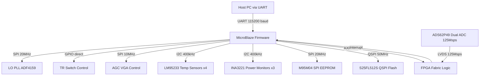
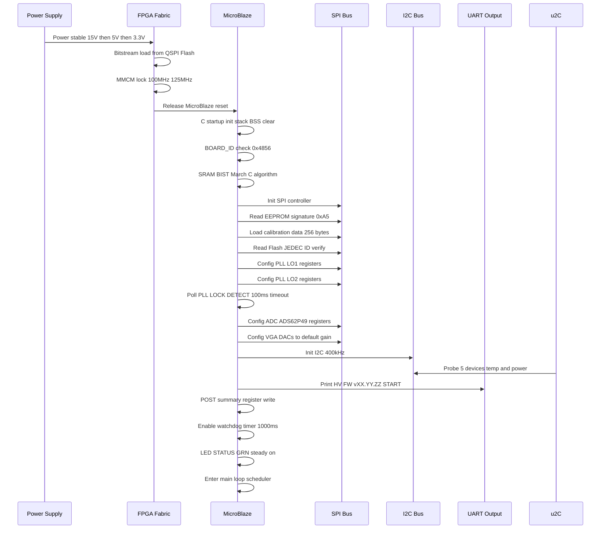
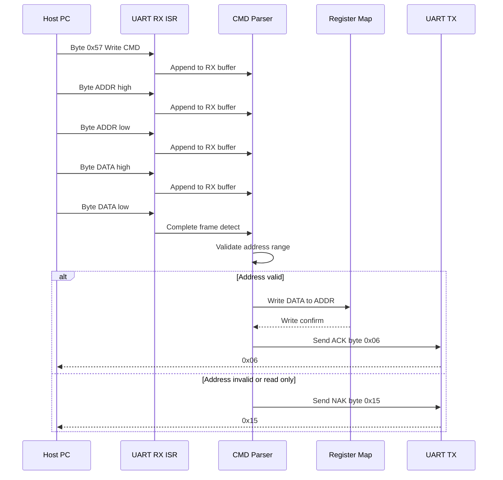
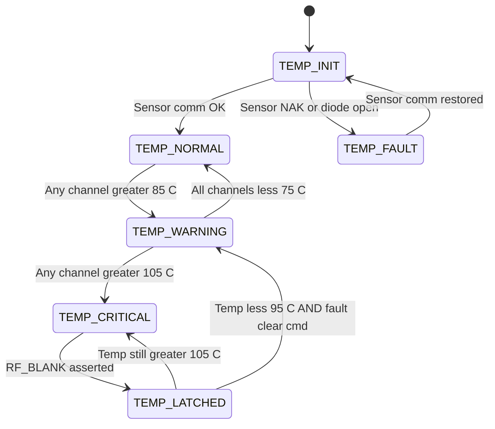
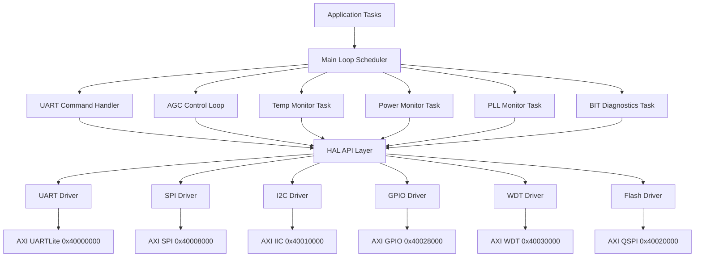
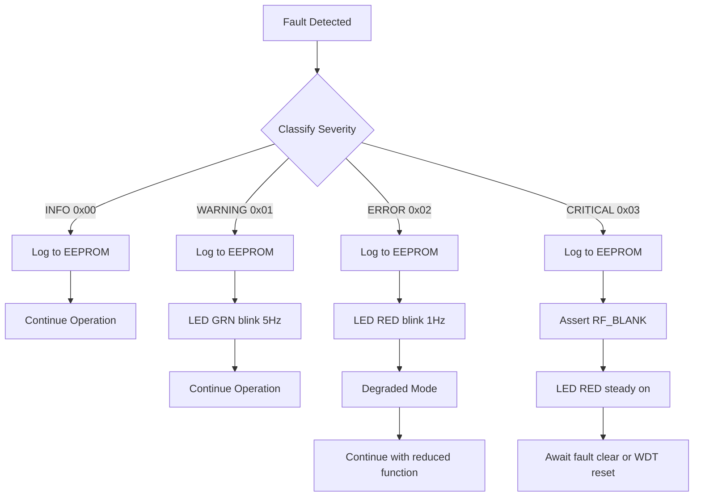

# Software Requirements Specification (SRS)

## Document Control
| Version | Date | Author | Changes |
|---------|------|--------|---------|
| 1.0 | 25 April 2026 | Systems Engineering | Initial Release |

---

# 1. Introduction

## 1.1 Purpose
This Software Requirements Specification (SRS) defines the complete set of Level 3 software requirements for the firmware executing on the Kintex-7 FPGA and embedded soft-core processor within the **hv** project — an 18-40 GHz dual-channel double-IF superheterodyne radar receiver. The document specifies the behavioral, performance, and interface requirements for the firmware that initializes, controls, monitors, and diagnoses the radar receiver hardware. It serves as the authoritative reference for firmware developers, test engineers, system integrators, and quality assurance personnel throughout the product lifecycle, from detailed design through integration, verification, and validation.

## 1.2 Scope
The software system covered by this SRS is the embedded firmware for the **hv** radar receiver embedded processor. The firmware executes on a MicroBlaze soft-core processor instantiated within the Kintex-7 XC7K160T FPGA.

**Product Name:** hv Radar Receiver Firmware  
**Product Identifier:** HV-FW-001  

**The software SHALL:**
- Initialize all hardware peripherals (PLL, ADCs, DACs, attenuators, switches, temperature sensors, power monitors)
- Implement the Hardware Abstraction Layer (HAL) for SPI, I2C, UART, GPIO, and LVDS interfaces
- Provide a UART register command protocol for host PC control and diagnostics
- Configure the dual-channel 125 Msps ADC interface and verify phase coherence
- Manage LO frequency tuning across the 18-40 GHz range via PLL control
- Monitor temperature at all sensor points and execute thermal protection
- Monitor all power rails and execute voltage fault protection
- Control T/R switching with sub-1 µs timing
- Manage AGC and variable gain amplifier settings
- Perform continuous Built-In Test (BIT) and log faults to EEPROM
- Load calibration data from Flash/EEPROM on startup

**The software SHALL NOT:**
- Perform radar signal processing (pulse compression, Doppler processing, CFAR) — this is performed in the FPGA fabric
- Directly synthesize LO signals — it configures PLL ICs that drive the RF LO chain
- Handle high-speed ADC data streaming — this is handled by FPGA LVDS fabric logic
- Provide a graphical user interface (GUI) — host PC software is a separate project

**Benefits and Objectives:**
- Enable autonomous operation of the radar receiver with no host intervention after configuration
- Provide real-time monitoring and protection against thermal, voltage, and RF overload conditions
- Achieve phase-coherent dual-channel operation required for pulsed radar processing
- Support field diagnostics and calibration through the UART interface

## 1.3 Definitions, Acronyms, and Abbreviations

| # | Term | Definition |
|---|------|-----------|
| 1 | SRS | Software Requirements Specification |
| 2 | SDD | Software Design Description |
| 3 | HRS | Hardware Requirements Specification |
| 4 | GLR | Glue Logic Requirements |
| 5 | StRS | Stakeholder Requirements |
| 6 | SyRS | System Requirements Specification |
| 7 | RTOS | Real-Time Operating System |
| 8 | HAL | Hardware Abstraction Layer |
| 9 | BSP | Board Support Package |
| 10 | ISR | Interrupt Service Routine |
| 11 | MISRA | Motor Industry Software Reliability Association |
| 12 | UART | Universal Asynchronous Receiver-Transmitter |
| 13 | SPI | Serial Peripheral Interface |
| 14 | I2C | Inter-Integrated Circuit |
| 15 | GPIO | General Purpose Input-Output |
| 16 | ADC | Analog-to-Digital Converter |
| 17 | DAC | Digital-to-Analog Converter |
| 18 | DMA | Direct Memory Access |
| 19 | FIFO | First In, First Out buffer |
| 20 | NVM | Non-Volatile Memory |
| 21 | CRC | Cyclic Redundancy Check |
| 22 | WDT | Watchdog Timer |
| 23 | PLL | Phase-Locked Loop |
| 24 | MCU | Microcontroller Unit |
| 25 | FPGA | Field-Programmable Gate Array |
| 26 | API | Application Programming Interface |
| 27 | BSS | Built-In Self-Test |
| 28 | RTM | Requirements Traceability Matrix |
| 29 | JTAG | Joint Test Action Group |
| 30 | QSPI | Quad Serial Peripheral Interface |
| 31 | TRP | Transmit-Receive Protection |
| 32 | ConOps | Concept of Operations |
| 33 | ASIL | Automotive Safety Integrity Level |
| 34 | SIL | Safety Integrity Level |
| 35 | IPC | Inter-Process Communication |
| 36 | RPC | Remote Procedure Call |
| 37 | IF | Intermediate Frequency |
| 38 | LO | Local Oscillator |
| 39 | NF | Noise Figure |
| 40 | SFDR | Spurious-Free Dynamic Range |
| 41 | IIP3 | Third-Order Input Intercept Point |
| 42 | LVDS | Low-Voltage Differential Signaling |
| 43 | AGC | Automatic Gain Control |
| 44 | VGA | Variable Gain Amplifier |
| 45 | PRI | Pulse Repetition Interval |
| 46 | PRF | Pulse Repetition Frequency |
| 47 | BPF | Band-Pass Filter |
| 48 | TCXO | Temperature-Compensated Crystal Oscillator |
| 49 | BIT | Built-In Test |
| 50 | POST | Power-On Self-Test |

## 1.4 References

| # | Reference | Description |
|---|-----------|-------------|
| 1 | IEEE 830-1998 | IEEE Recommended Practice for Software Requirements Specifications |
| 2 | ISO/IEC/IEEE 29148:2018 | Systems and Software Engineering — Life Cycle Processes — Requirements Engineering |
| 3 | IEEE 1016-2009 | IEEE Standard for Software Design Descriptions |
| 4 | MISRA C:2012 | Guidelines for the Use of the C Language in Critical Systems |
| 5 | IEC 61508 | Functional Safety of Electrical/Electronic/Programmable Electronic Safety-related Systems |
| 6 | HV-HRS-001 | Hardware Requirements Specification — hv Radar Receiver (P2) |
| 7 | HV-GLR-001 | Glue Logic Requirements — hv FPGA Register Map (P6) |
| 8 | DS182-Kintex7 | Xilinx Kintex-7 FPGA Data Sheet: DC and AC Switching Characteristics |
| 9 | ADS62P49-DS | Texas Instruments ADS62P49 Dual-Channel 12-bit 125 Msps ADC Data Sheet |
| 10 | ADF4159-DS | Analog Devices ADF4159 13 GHz Fractional-N PLL Data Sheet |
| 11 | LM95233-DS | Texas Instruments LM95233 Dual Remote Diode Temperature Sensor Data Sheet |
| 12 | HV-P1-001 | Project Block Diagram — hv Radar Receiver |
| 13 | HV-P4-001 | Netlist Specification — hv PCB Netlist |
| 14 | MIL-STD-883 | Test Method Standard for Microcircuits (applicable for environmental screening) |

## 1.5 Overview
This document is structured according to IEEE 830-1998 / IEEE 29148:2018 guidelines. Section 2 provides the overall product perspective, summarizing the system context, user characteristics, and constraints. Section 3 contains the complete set of specific software requirements — external interface requirements (3.1), functional requirements (3.2), performance requirements (3.3), design constraints (3.4), and quality attributes (3.5). Section 4 defines the verification and validation approach. Section 5 provides the full requirements traceability matrix mapping every REQ-SW to its source hardware requirement. Section 6 contains appendices with error codes, register maps, and diagrams.

---

# 2. Overall Description

## 2.1 Product Perspective
The hv firmware operates within a dual-channel 18-40 GHz superheterodyne radar receiver. The firmware executes on a MicroBlaze soft-core processor instantiated in the Kintex-7 FPGA. It communicates with host systems via UART, controls RF front-end components via SPI/I2C/GPIO, and monitors system health through ADC channels and temperature sensors.

**System Context Diagram:**



**Software Stack Layers:**
1. **BSP Layer:** MicroBlaze startup code, exception vectors, linker script, cache management
2. **HAL Layer:** Low-level register access for UART, SPI, I2C, GPIO, Timer, WDT, QSPI, Interrupt Controller (Xilinx AXI IP cores via AXI4-Lite)
3. **Driver Layer:** Device-specific drivers for PLL (ADF4159), ADC (ADS62P49 config registers), EEPROM (M95M04), Flash (S25FL512S), Temperature (LM95233), Power Monitor (INA3221)
4. **Application Layer:** System initialization, command parser, telemetry collection, fault management, calibration management, AGC loop, T/R timing control

## 2.2 Product Functions
The software SHALL implement the following major functions:

1. **System Initialization and Boot Sequence** — Ordered startup: clocks, PLL, peripherals, calibration load, POST
2. **Hardware Abstraction Layer (HAL)** — Uniform API for SPI, I2C, UART, GPIO, Timer, WDT, AXI register access
3. **UART Command/Response Handler** — Register read/write protocol per GLR specification
4. **PLL Configuration and Lock Management** — LO frequency tuning for 18-40 GHz coverage with lock detect
5. **ADC Configuration and Monitoring** — ADS62P49 setup, LVDS pattern verification, phase coherence check
6. **Temperature Monitoring and Alert Handling** — 4-channel remote diode sensing with threshold alerts
7. **Voltage/Current Monitoring** — 9-channel power rail monitoring via INA3221 triple-channel monitors
8. **T/R Switching Control** — Sub-1 µs GPIO-controlled T/R switch for pulsed radar
9. **AGC and VGA Control** — Variable gain amplifier gain setting via SPI DAC
10. **EEPROM Driver** — M95M04 512 Kb SPI EEPROM read/write for fault log and calibration storage
11. **Configuration Flash Driver** — S25FL512S 512 Mb QSPI Flash for firmware, bitstream, calibration tables
12. **LED and GPIO Control** — Status indication LEDs and general-purpose digital I/O
13. **Watchdog Timer Management** — System health supervision with 1000 ms timeout
14. **Power-On Self-Test (POST)** — RAM BIST, peripheral ping, PLL lock verify, ADC pattern check
14. **Error Logging and Fault Handling** — Circular fault log in EEPROM with timestamp and severity
15. **Calibration Data Management** — Load/validate gain, frequency, and phase calibration from NVM
16. **RF Path Configuration** — Preselector BPF tuning, attenuator settings, LO path selection
17. **Built-In Test (BIT)** — Continuous background BIT during normal operation
18. **Firmware Update Support** — QSPI Flash programming for field firmware updates via UART

## 2.3 User Characteristics

| User Role | Description | Interaction Method |
|-----------|-------------|-------------------|
| Firmware Engineer | Develops and debugs the embedded firmware | JTAG debugger, UART console, Vivado SDK |
| Test Engineer | Verifies system-level performance and compliance | UART commands, lab equipment (spectrum analyzer, signal generator) |
| Field Engineer | Deploys, configures, and diagnoses the receiver in the field | UART terminal, predefined diagnostic commands |
| System Integrator | Integrates the receiver into a larger radar system | UART command protocol, system-level timing and RF interfaces |

## 2.4 Constraints

1. **MISRA-C:2012 Compliance:** All firmware source code SHALL comply with MISRA C:2012 mandatory guidelines. Advisory rules are tracked as recommendations.
2. **Real-Time Constraints:** T/R switching command latency SHALL NOT exceed 500 ns from GPIO register write to pin transition. UART command response SHALL complete within 200 µs.
3. **Memory Budget:** Total firmware size SHALL NOT exceed 180 KB of the 256 KB MicroBlaze local BRAM. Stack depth SHALL NOT exceed 4 KB. Heap allocation is prohibited.
4. **Clock Frequency:** MicroBlaze soft-core operates at 100 MHz (derived from 200 MHz Kintex-7 system clock via MMCM). All timing requirements reference this clock.
5. **Execution Model:** Bare-metal (no RTOS) with a cooperative main-loop scheduler. ISRs handle time-critical events only.
6. **Coding Language:** C99 (ISO/IEC 9899:1999). No C++ features. Assembly permitted only in BSP startup files.
7. **Toolchain:** Xilinx Vivado SDK 2023.2 with MicroBlaze GCC toolchain (mb-gcc 12.2.0).
8. **Hardware Revision:** Firmware SHALL support hardware revision 1.0 (BOARD_ID = 0x4856). Board ID mismatch at startup SHALL cause a controlled halt with error indication.
9. **No Dynamic Allocation:** Use of malloc, calloc, realloc, or free is prohibited. All buffers are statically allocated.
10. **No Floating Point:** MicroBlaze is configured without FPU. All arithmetic uses fixed-point (integer) operations. Temperature conversions use scaled integer arithmetic.

## 2.5 Assumptions and Dependencies

1. Power sequencing is complete and all supply rails are stable at nominal voltage before the FPGA configuration and MicroBlaze reset is released. The firmware does NOT manage power sequencing.
2. The 200 MHz system clock from the on-board TCXO is stable and within ±25 ppm before firmware execution begins. MMCM lock is confirmed by FPGA fabric before releasing MicroBlaze reset.
3. All I2C bus pull-up resistors are populated on the PCB. I2C devices have unique addresses as specified in the BOM.
4. The FPGA bitstream containing MicroBlaze, AXI peripherals, and LVDS fabric logic is loaded from QSPI Flash by the FPGA master configuration mode before firmware executes.
5. Operating temperature range is -55°C to +125°C as specified in REQ-HW-017. All firmware timing and sensor conversions are valid across this range.
6. The host PC UART interface operates at 115200 baud with 8-N-1 configuration by default. Baud rate is reconfigurable via config flash.
7. LO PLL reference clock (100 MHz TCXO) is present and stable before firmware attempts PLL configuration.
8. ADC clock (125 MHz) is derived from the system PLL and is stable before firmware configures ADC registers.

---

# 3. Specific Requirements

## 3.1 External Interface Requirements

### 3.1.1 Hardware Interfaces

#### 3.1.1.1 UART Interface (Host Communication)
The UART interface provides the primary communication channel between the host PC and the radar receiver firmware. It implements the register command protocol defined in the GLR.

**Interface Parameters:**
- Protocol: Asynchronous serial, 8 data bits, no parity, 1 stop bit (8-N-1)
- Default baud rate: 115200 baud (configurable: 9600, 19200, 38400, 57600, 115200, 230400, 460800, 921600)
- Maximum baud rate: 921600 baud
- Signal levels: LVCMOS 3.3 V (converted from USB-UART bridge on carrier board)
- TX FIFO depth: 16 bytes (hardware), 256 bytes (software ring buffer)
- RX FIFO depth: 16 bytes (hardware), 256 bytes (software ring buffer)
- Flow control: None (software XON/XOFF not supported)

```c
/**
 * @brief UART register map (Xilinx AXI UARTLite IP)
 * Base Address: 0x40000000
 */
typedef struct {
    volatile uint32_t RX_FIFO;      /**< 0x00: Receive data FIFO (read-only) */
    volatile uint32_t TX_FIFO;      /**< 0x04: Transmit data FIFO (write-only) */
    volatile uint32_t STATUS;       /**< 0x08: Status register */
    volatile uint32_t CTRL;         /**< 0x0C: Control register */
} UART_RegMap_t;

/* STATUS register bit definitions */
#define UART_STATUS_RX_VALID    (1U << 0)   /**< RX FIFO has data */
#define UART_STATUS_RX_FULL     (1U << 1)   /**< RX FIFO full */
#define UART_STATUS_TX_EMPTY    (1U << 2)   /**< TX FIFO empty */
#define UART_STATUS_TX_FULL     (1U << 3)   /**< TX FIFO full */
#define UART_STATUS_IRQ_EN      (1U << 4)   /**< Interrupt enabled */
#define UART_STATUS_OVERRUN     (1U << 5)   /**< RX overrun error */
#define UART_STATUS_FRAME_ERR   (1U << 6)   /**< Framing error */
#define UART_STATUS_PARITY_ERR  (1U << 7)   /**< Parity error */

/* CTRL register bit definitions */
#define UART_CTRL_ENABLE_IRQ    (1U << 4)   /**< Enable interrupts */
#define UART_CTRL_RESET_RX      (1U << 6)   /**< Reset RX FIFO */
#define UART_CTRL_RESET_TX      (1U << 7)   /**< Reset TX FIFO */

/**
 * @brief Initialize UART peripheral
 * @param baud_rate Target baud rate (ignored for AXI UARTLite; fixed at build)
 * @return 0 on success, negative on error
 * @note AXI UARTLite has fixed baud configured in Vivado. This function
 *       resets FIFOs and enables RX interrupt.
 */
int32_t UART_Init(uint32_t baud_rate);

/**
 * @brief Send single byte over UART (blocking)
 * @param byte Data byte to transmit
 * @return 0 on success, ERR_TIMEOUT if TX FIFO stalls > 10ms
 */
int32_t UART_SendByte(uint8_t byte);

/**
 * @brief Receive single byte from UART (blocking)
 * @param byte Pointer to store received byte
 * @param timeout_ms Maximum wait time in milliseconds
 * @return 0 on success, ERR_TIMEOUT if no data within timeout
 */
int32_t UART_RecvByte(uint8_t *byte, uint32_t timeout_ms);

/**
 * @brief Write to FPGA register via UART command protocol
 * @param addr 16-bit register address
 * @param data 16-bit data value to write
 * @return 0 on success (ACK received), ERR_COMM on NAK, ERR_TIMEOUT on no response
 */
int32_t UART_WriteReg(uint16_t addr, uint16_t data);

/**
 * @brief Read from FPGA register via UART command protocol
 * @param addr 16-bit register address
 * @param data Pointer to store 16-bit data read
 * @return 0 on success, ERR_TIMEOUT on no response
 */
int32_t UART_ReadReg(uint16_t addr, uint16_t *data);

/**
 * @brief Bulk write to consecutive FPGA registers
 * @param start_addr Starting register address
 * @param data Pointer to array of 16-bit data values
 * @param count Number of registers to write (1-64)
 * @return 0 on success (ACK received), ERR_PARAM if count > 64
 */
int32_t UART_BulkWrite(uint16_t start_addr, const uint16_t *data, uint8_t count);

/**
 * @brief Bulk read from consecutive FPGA registers
 * @param start_addr Starting register address
 * @param buf Pointer to buffer for 16-bit data values
 * @param count Number of registers to read (1-64)
 * @return 0 on success, ERR_PARAM if count > 64, ERR_TIMEOUT on incomplete response
 */
int32_t UART_BulkRead(uint16_t start_addr, uint16_t *buf, uint8_t count);
```

#### 3.1.1.2 SPI Interface (PLL, ADC Config, EEPROM, VGA DAC)
The SPI bus controls multiple devices through individual chip-select lines. Device mapping:

| SPI Device | Chip Select GPIO | Clock Max | SPI Mode | Address Bits |
|-----------|-----------------|-----------|----------|-------------|
| PLL LO1 (ADF4159) | CS_PLL_LO1 (GPIO[0]) | 20 MHz | 0 (CPOL=0, CPHA=0) | N/A (32-bit word) |
| PLL LO2 (ADF4159) | CS_PLL_LO2 (GPIO[1]) | 20 MHz | 0 | N/A (32-bit word) |
| ADC Config (ADS62P49) | CS_ADC (GPIO[2]) | 20 MHz | 1 (CPOL=0, CPHA=1) | 8-bit register addr |
| EEPROM (M95M04) | CS_EEPROM (GPIO[3]) | 20 MHz | 0 | 24-bit address |
| VGA DAC Ch1 (AD5791) | CS_VGA1 (GPIO[4]) | 30 MHz | 2 (CPOL=1, CPHA=0) | 24-bit word |
| VGA DAC Ch2 (AD5791) | CS_VGA2 (GPIO[5]) | 30 MHz | 2 | 24-bit word |

```c
/**
 * @brief SPI register map (Xilinx AXI SPI IP)
 * Base Address: 0x40008000
 */
typedef struct {
    volatile uint32_t SRR;         /**< 0x00: Software Reset Register (write 0x0A to reset) */
    volatile uint32_t SPICR;       /**< 0x04: SPI Control Register */
    volatile uint32_t SPISR;       /**< 0x08: SPI Status Register */
    volatile uint32_t SPIDTR;      /**< 0x0C: SPI Data Transmit Register */
    volatile uint32_t SPIDRR;      /**< 0x10: SPI Data Receive Register */
    volatile uint32_t SPISSR;      /**< 0x14: SPI Slave Select Register */
    volatile uint32_t TX_FIFO_OCR; /**< 0x18: Transmit FIFO Occupancy */
    volatile uint32_t RX_FIFO_OCR; /**< 0x1C: Receive FIFO Occupancy */
} SPI_RegMap_t;

/* SPICR bit definitions */
#define SPI_CR_LOOPBACK     (1U << 0)   /**< Local loopback enable */
#define SPI_CR_SPE          (1U << 1)   /**< SPI system enable */
#define SPI_CR_MASTER       (1U << 2)   /**< Master mode */
#define SPI_CR_CLK_POL      (1U << 3)   /**< Clock polarity (CPOL) */
#define SPI_CR_CLK_PH       (1U << 4)   /**< Clock phase (CPHA) */
#define SPI_CR_TX_RST       (1U << 5)   /**< Reset TX FIFO */
#define SPI_CR_RX_RST       (1U << 6)   /**< Reset RX FIFO */
#define SPI_CR_MAN_SS       (1U << 7)   /**< Manual slave select */
#define SPI_CR_SS_HIGH      (1U << 8)   /**< Slave select active high */
#define SPI_CR_LSB_FIRST    (1U << 9)   /**< LSB first mode */

/* SPISR bit definitions */
#define SPI_SR_RX_EMPTY     (1U << 1)   /**< RX FIFO empty */
#define SPI_SR_RX_FULL      (1U << 2)   /**< RX FIFO full */
#define SPI_SR_TX_EMPTY     (1U << 3)   /**< TX FIFO empty */
#define SPI_SR_TX_FULL      (1U << 4)   /**< TX FIFO full */
#define SPI_SR_MODE_FAULT   (1U << 5)   /**< Mode fault error */

/**
 * @brief SPI device selection enumeration
 */
typedef enum {
    SPI_DEV_PLL_LO1 = 0,    /**< LO1 PLL ADF4159 */
    SPI_DEV_PLL_LO2 = 1,    /**< LO2 PLL ADF4159 */
    SPI_DEV_ADC     = 2,    /**< ADC ADS62P49 config */
    SPI_DEV_EEPROM  = 3,    /**< EEPROM M95M04 */
    SPI_DEV_VGA_CH1 = 4,    /**< VGA DAC Channel 1 */
    SPI_DEV_VGA_CH2 = 5,    /**< VGA DAC Channel 2 */
} SPI_Device_t;

/**
 * @brief Initialize SPI controller
 * @param clock_hz SPI clock frequency in Hz (ignored; AXI SPI clock is fixed)
 * @param mode SPI mode (0-3)
 * @return 0 on success, negative on error
 */
int32_t SPI_Init(uint32_t clock_hz, uint8_t mode);

/**
 * @brief Perform SPI full-duplex transfer
 * @param dev Target SPI device
 * @param tx_buf Pointer to transmit data buffer
 * @param rx_buf Pointer to receive data buffer (NULL to discard)
 * @param len Number of bytes to transfer
 * @return 0 on success, ERR_TIMEOUT or ERR_COMM on failure
 */
int32_t SPI_Transfer(SPI_Device_t dev, const uint8_t *tx_buf,
                     uint8_t *rx_buf, uint32_t len);

/**
 * @brief PLL write register (ADF4159 32-bit word)
 * @param dev PLL device (SPI_DEV_PLL_LO1 or SPI_DEV_PLL_LO2)
 * @param reg24 24-bit register data (upper 24 bits of 32-bit SPI word)
 * @param ctrl_bits 8 control bits (lower 8 bits of 32-bit SPI word)
 * @return 0 on success, ERR_COMM on SPI failure
 */
int32_t PLL_WriteReg(SPI_Device_t dev, uint24_t reg24, uint8_t ctrl_bits);

/**
 * @brief EEPROM read byte
 * @param addr 24-bit EEPROM address (0x000000 to 0x00FFFF for 512 Kbit)
 * @param data Pointer to store read byte
 * @return 0 on success, ERR_EEPROM on failure
 */
int32_t EEPROM_ReadByte(uint32_t addr, uint8_t *data);

/**
 * @brief EEPROM write byte
 * @param addr 24-bit EEPROM address
 * @param data Byte to write
 * @return 0 on success, ERR_EEPROM on failure, ERR_TIMEOUT if WIP timeout > 10ms
 */
int32_t EEPROM_WriteByte(uint32_t addr, uint8_t data);

/**
 * @brief EEPROM read page (256 bytes)
 * @param addr Starting address (aligned to 256-byte boundary recommended)
 * @param buf Pointer to destination buffer (must be >= 256 bytes)
 * @return 0 on success, ERR_EEPROM on failure
 */
int32_t EEPROM_ReadPage(uint32_t addr, uint8_t *buf);

/**
 * @brief EEPROM write page (256 bytes maximum)
 * @param addr Starting address
 * @param buf Pointer to source data
 * @param len Number of bytes to write (1-256)
 * @return 0 on success, ERR_PARAM if len > 256, ERR_EEPROM on failure
 */
int32_t EEPROM_WritePage(uint32_t addr, const uint8_t *buf, uint16_t len);

/**
 * @brief VGA DAC set gain (AD5791 20-bit DAC)
 * @param channel VGA channel (0=Ch1, 1=Ch2)
 * @param gain_code 20-bit gain code (0x00000=minimum gain, 0xFFFFF=maximum gain)
 * @return 0 on success, ERR_COMM on SPI failure
 */
int32_t VGA_SetGain(uint8_t channel, uint32_t gain_code);
```

#### 3.1.1.3 I2C Interface (Temperature and Power Monitoring)
The I2C bus connects temperature sensors and power monitors with 7-bit addressing.

| I2C Device | 7-bit Address | Function | Channels |
|-----------|--------------|----------|----------|
| Temp Sensor 1 (LM95233) | 0x4C | RF Front-End Ch1, LO Module | 2 remote diodes |
| Temp Sensor 2 (LM95233) | 0x4D | RF Front-End Ch2, FPGA junction | 2 remote diodes |
| Power Monitor 1 (INA3221) | 0x40 | +15V main, +5V digital, +3.3V FPGA | 3 channels |
| Power Monitor 2 (INA3221) | 0x41 | +5V RF, +3.3V analog, LO supply | 3 channels |
| Power Monitor 3 (INA3221) | 0x42 | ADC supply Ch1, ADC supply Ch2, spare | 3 channels |

```c
/**
 * @brief I2C register map (Xilinx AXI IIC IP)
 * Base Address: 0x40010000
 */
typedef struct {
    volatile uint32_t GIE;         /**< 0x00: Global Interrupt Enable */
    volatile uint32_t ISR;         /**< 0x04: Interrupt Status Register */
    volatile uint32_t IER;         /**< 0x08: Interrupt Enable Register */
    volatile uint32_t TTBR;        /**< 0x0C: Transmit Time/Byte Register (reserved) */
    volatile uint32_t CR;          /**< 0x10: Control Register */
    volatile uint32_t SR;          /**< 0x14: Status Register */
    volatile uint32_t TX_FIFO;     /**< 0x18: TX Data FIFO */
    volatile uint32_t RX_FIFO;     /**< 0x1C: RX Data FIFO */
    volatile uint32_t ADR;         /**< 0x20: Slave Address Register */
    volatile uint32_t TX_FIFO_OCR; /**< 0x24: TX FIFO Occupancy */
    volatile uint32_t RX_FIFO_OCR; /**< 0x28: RX FIFO Occupancy */
    volatile uint32_t TLEN;        /**< 0x2C: Transfer Length (Dynamic mode) */
} I2C_RegMap_t;

/* CR bit definitions */
#define I2C_CR_TXAK      (1U << 3)   /**< TX acknowledge enable */
#define I2C_CR_MSMS      (1U << 5)   /**< Master mode start */
#define I2C_CR_TX        (1U << 6)   /**< Transmit mode */
#define I2C_CR_RSTA      (1U << 7)   /**< Repeated START */

/* SR bit definitions */
#define I2C_SR_RXAK      (1U << 7)   /**< RX acknowledge (0=ACK, 1=NAK) */

/**
 * @brief Initialize I2C controller at 400 kHz
 * @param clock_hz I2C clock frequency (400000 for Fast Mode)
 * @return 0 on success, ERR_COMM on bus stuck
 */
int32_t I2C_Init(uint32_t clock_hz);

/**
 * @brief Read 8-bit register from I2C device
 * @param dev_addr 7-bit device address (unshifted)
 * @param reg 8-bit register address
 * @param data Pointer to store read data
 * @return 0 on success, ERR_COMM on NAK, ERR_TIMEOUT on bus timeout
 */
int32_t I2C_ReadReg8(uint8_t dev_addr, uint8_t reg, uint8_t *data);

/**
 * @brief Write 8-bit register to I2C device
 * @param dev_addr 7-bit device address (unshifted)
 * @param reg 8-bit register address
 * @param data Data byte to write
 * @return 0 on success, ERR_COMM on NAK, ERR_TIMEOUT on bus timeout
 */
int32_t I2C_WriteReg8(uint8_t dev_addr, uint8_t reg, uint8_t data);

/**
 * @brief Read 16-bit register from I2C device (big-endian)
 * @param dev_addr 7-bit device address
 * @param reg 8-bit register address
 * @param data Pointer to store 16-bit value (converted to host endianness)
 * @return 0 on success
 */
int32_t I2C_ReadReg16(uint8_t dev_addr, uint8_t reg, uint16_t *data);

/**
 * @brief Read temperature from LM95233 sensor
 * @param sensor_id Sensor index (0=U12 at 0x4C, 1=U13 at 0x4D)
 * @param channel Diode channel (0=remote1, 1=remote2)
 * @param temp_mdegC Pointer to store temperature in milli-degrees C (-55000 to +125000)
 * @return 0 on success, ERR_COMM on I2C failure
 * @note Resolution: 0.0625 C for remote diodes. Returns value in milli-C for integer math.
 */
int32_t TempSensor_ReadTemp(uint8_t sensor_id, uint8_t channel, int32_t *temp_mdegC);

/**
 * @brief Read voltage from INA3221 power monitor
 * @param monitor_id Monitor index (0=U20 at 0x40, 1=U21 at 0x41, 2=U22 at 0x42)
 * @param channel Voltage channel (0, 1, or 2)
 * @param voltage_mV Pointer to store voltage in milli-volts
 * @return 0 on success, ERR_COMM on I2C failure
 */
int32_t PowerMon_ReadVoltage(uint8_t monitor_id, uint8_t channel, int32_t *voltage_mV);

/**
 * @brief Read current from INA3221 power monitor via shunt voltage
 * @param monitor_id Monitor index (0-2)
 * @param channel Current channel (0, 1, or 2)
 * @param current_mA Pointer to store current in milli-amps
 * @return 0 on success
 * @note Current = shunt_voltage / shunt_resistance. Shunt R = 0.1 ohm on all channels.
 */
int32_t PowerMon_ReadCurrent(uint8_t monitor_id, uint8_t channel, int32_t *current_mA);
```

#### 3.1.1.4 QSPI Flash Interface (Configuration Flash)
The QSPI Flash stores the FPGA bitstream, firmware binary, calibration tables, and configuration data.

```c
/**
 * @brief QSPI register map (Xilinx AXI Quad SPI IP)
 * Base Address: 0x40020000
 */
typedef struct {
    volatile uint32_t SRR;         /**< 0x00: Software Reset Register */
    volatile uint32_t CR;          /**< 0x04: Control Register */
    volatile uint32_t SR;          /**< 0x08: Status Register */
    volatile uint32_t DTR;         /**< 0x0C: Data Transmit Register */
    volatile uint32_t DRR;         /**< 0x10: Data Receive Register */
    volatile uint32_t SSCR;        /**< 0x14: Slave Select Register */
    volatile uint32_t TX_FIFO_OCR; /**< 0x18: TX FIFO Occupancy */
    volatile uint32_t RX_FIFO_OCR; /**< 0x1C: RX FIFO Occupancy */
    volatile uint32_t TFV;         /**< 0x20: Transmit FIFO Vacancy */
    volatile uint32_t RFV;         /**< 0x24: Receive FIFO Valid */
    volatile uint32_t GE;          /**< 0x28: Global Interrupt Enable */
} QSPI_RegMap_t;

/* Flash memory map */
#define FLASH_ADDR_BITSTREAM    0x00000000  /**< FPGA bitstream (8 MB) */
#define FLASH_ADDR_FIRMWARE     0x00800000  /**< Firmware binary (256 KB) */
#define FLASH_ADDR_CAL_TABLE    0x00840000  /**< Calibration tables (128 KB) */
#define FLASH_ADDR_CONFIG       0x00860000  /**< Configuration data (4 KB) */
#define FLASH_ADDR_FAULT_LOG    0x00861000  /**< Fault log backup (4 KB) */
#define FLASH_SECTOR_SIZE       0x00010000  /**< 64 KB sector size */
#define FLASH_PAGE_SIZE         0x00000100  /**< 256-byte page size */

/**
 * @brief Initialize QSPI Flash controller
 * @return 0 on success, ERR_HARDWARE if JEDEC ID mismatch
 */
int32_t Flash_Init(void);

/**
 * @brief Read data from QSPI Flash
 * @param addr Starting address (must be < 0x01000000 for 256 Mb device)
 * @param buf Destination buffer
 * @param len Number of bytes to read
 * @return 0 on success
 */
int32_t Flash_Read(uint32_t addr, uint8_t *buf, uint32_t len);

/**
 * @brief Write data to QSPI Flash (page-aligned, auto page-boundary handling)
 * @param addr Starting address
 * @param buf Source data
 * @param len Number of bytes to write
 * @return 0 on success, ERR_FLASH_WRITE on program failure
 */
int32_t Flash_Write(uint32_t addr, const uint8_t *buf, uint32_t len);

/**
 * @brief Erase a 64 KB sector of QSPI Flash
 * @param addr Address within the sector to erase
 * @return 0 on success, ERR_FLASH_ERASE on erase failure, ERR_TIMEOUT if WIP > 2 seconds
 */
int32_t Flash_EraseSector(uint32_t addr);

/**
 * @brief Verify written data by CRC-32 comparison
 * @param addr Starting address
 * @param buf Reference data
 * @param len Number of bytes to verify
 * @return 0 on match, ERR_CHECKSUM on mismatch
 */
int32_t Flash_VerifyCRC32(uint32_t addr, const uint8_t *buf, uint32_t len);
```

#### 3.1.1.5 GPIO Interface (T/R Switch, LED, Attenuator, Control Lines)

```c
/**
 * @brief GPIO register map (Xilinx AXI GPIO IP)
 * Base Address: 0x40028000 (Channel 1 - Output)
 * Base Address: 0x40028008 (Channel 2 - Input)
 */
typedef struct {
    volatile uint32_t GPIO_DATA;   /**< 0x00: Data register */
    volatile uint32_t GPIO_TRI;    /**< 0x04: Tri-state control (0=output, 1=input) */
    volatile uint32_t GPIO2_DATA;  /**< 0x08: Channel 2 data */
    volatile uint32_t GPIO2_TRI;   /**< 0x0C: Channel 2 tri-state */
    volatile uint32_t GIER;        /**< 0x10: Global interrupt enable */
    volatile uint32_t IPISR;       /**< 0x14: IP interrupt status */
    volatile uint32_t IPIER;       /**< 0x18: IP interrupt enable */
} GPIO_RegMap_t;

/* GPIO output bit assignments (Channel 1) */
#define GPIO_TR_SWITCH       (1U << 0)   /**< T/R switch control (0=Receive, 1=Transmit) */
#define GPIO_TR_SWITCH_EN    (1U << 1)   /**< T/R switch enable (0=disabled, 1=enabled) */
#define GPIO_LED_STATUS_GRN  (1U << 2)   /**< Status LED green */
#define GPIO_LED_STATUS_RED  (1U << 3)   /**< Status LED red */
#define GPIO_LED_FAULT       (1U << 4)   /**< Fault indicator LED */
#define GPIO_LNA_EN_CH1      (1U << 5)   /**< LNA enable Channel 1 */
#define GPIO_LNA_EN_CH2      (1U << 6)   /**< LNA enable Channel 2 */
#define GPIO_RF_BLANK        (1U << 7)   /**< RF blank (1=blanked, 0=active) */
#define GPIO_ATT_LE_CH1      (1U << 8)   /**< Attenuator latch enable Ch1 */
#define GPIO_ATT_LE_CH2      (1U << 9)   /**< Attenuator latch enable Ch2 */
#define GPIO_PLL_MUX_LO1     (1U << 10)  /**< PLL MUX output LO1 (lock detect) */
#define GPIO_PLL_MUX_LO2     (1U << 11)  /**< PLL MUX output LO2 (lock detect) */
#define GPIO_SPARE_0         (1U << 12)  /**< Spare GPIO */
#define GPIO_SPARE_1         (1U << 13)  /**< Spare GPIO */
#define GPIO_FPGA_INIT_B     (1U << 14)  /**< FPGA init status (input) */
#define GPIO_FPGA_DONE       (1U << 15)  /**< FPGA done status (input) */

/* GPIO input bit assignments (Channel 2) */
#define GPIO_INPUT_PLL_LD_LO1   (1U << 0)  /**< PLL Lock Detect LO1 */
#define GPIO_INPUT_PLL_LD_LO2   (1U << 1)  /**< PLL Lock Detect LO2 */
#define GPIO_INPUT_ADC_OVR_CH1  (1U << 2)  /**< ADC overrange Ch1 */
#define GPIO_INPUT_ADC_OVR_CH2  (1U << 3)  /**< ADC overrange Ch2 */
#define GPIO_INPUT_EXT_TRIG     (1U << 4)  /**< External trigger input */
#define GPIO_INPUT_FAULT_SUM    (1U << 5)  /**< Summary fault input */

/**
 * @brief Initialize GPIO controller
 * @return 0 on success
 */
int32_t GPIO_Init(void);

/**
 * @brief Set GPIO output bits (no effect on other bits)
 * @param mask Bitmask of pins to set
 * @return 0 on success
 */
int32_t GPIO_SetBits(uint32_t mask);

/**
 * @brief Clear GPIO output bits (no effect on other bits)
 * @param mask Bitmask of pins to clear
 * @return 0 on success
 */
int32_t GPIO_ClearBits(uint32_t mask);

/**
 * @brief Read GPIO input register
 * @param inputs Pointer to store input bit values
 * @return 0 on success
 */
int32_t GPIO_ReadInputs(uint32_t *inputs);

/**
 * @brief Control T/R switch
 * @param state 0=Receive mode, 1=Transmit mode
 * @return 0 on success
 * @note Total GPIO set-to-pin latency: 30 ns at 100 MHz MicroBlaze clock
 */
int32_t TRSwitch_Set(uint8_t state);
```

### 3.1.2 Software Interfaces

**RTOS / Scheduler Interface:**
The firmware operates bare-metal with a cooperative main-loop scheduler. The main loop calls registered task functions in a fixed order. Each task checks its execution trigger (timer tick or event flag) and returns control to the main loop.

```c
/**
 * @brief Task function prototype
 * @return 0 on success, error code on failure (logged but does not halt scheduler)
 */
typedef int32_t (*TaskFunc_t)(void);

/**
 * @brief Register a task in the main-loop scheduler
 * @param task Function pointer
 * @param period_ms Execution period in milliseconds (0 = every iteration)
 * @param name Human-readable task name (max 15 chars)
 * @return Task ID on success, ERR_RESOURCE if task table full (max 16 tasks)
 */
int32_t Scheduler_RegisterTask(TaskFunc_t task, uint32_t period_ms, const char *name);
```

**Standard C Library Usage:**
The firmware uses a minimal C library subset: `<stdint.h>`, `<stdbool.h>`, `<string.h>` (memcpy, memset, memcmp only), `<stddef.h>`. No `<stdio.h>`, `<stdlib.h>`, or `<math.h>` functions are used. All formatting uses custom integer-to-ASCII conversion functions.

### 3.1.3 Communication Interfaces

**UART Register Command Protocol (GLR §7 Frame Format)**

| Command | CMD Byte | Frame Structure | Response |
|---------|----------|-----------------|----------|
| Single Write | 0x57 (W) | [0x57][ADDR_H][ADDR_L][DATA_H][DATA_L] | [0x06] ACK |
| Single Read | 0x52 (R) | [0x52][ADDR_H or 0x80][ADDR_L] | [DATA_H][DATA_L] |
| Bulk Write | 0x42 (B) | [0x42][ADDR_H][ADDR_L][N][D0_H][D0_L]...[Dn_H][Dn_L] | [0x06] ACK |
| Bulk Read | 0x62 (b) | [0x62][ADDR_H or 0x80][ADDR_L][N] | [D0_H][D0_L]...[Dn_H][Dn_L] |
| Error NAK | 0x15 | Sent by firmware on invalid command, address, or protocol error | N/A |

**Protocol Parameters:**
- Address space: 16-bit (0x0000 - 0xFFFF). Total register map capacity: 65536 words.
- Read address encoding: bit 15 of ADDR_H is set (OR 0x8000) for read transactions to distinguish from write transactions in the command parser.
- Maximum bulk count N: 64 registers (128 data bytes) per transaction. Attempting N > 64 results in NAK (0x15).
- Inter-byte timeout: Firmware parser resets on any inter-byte gap exceeding 50 ms at 115200 baud (approximately 576 byte-times). This corresponds to 576 bits at 115200 baud.
- Host response timeout: Firmware waits 10 ms for host to complete sending a multi-byte command. If transmission stalls, the parser resets.
- ACK byte: 0x06 (ASCII ACK). Sent after successful write operations.
- NAK byte: 0x15 (ASCII NAK). Sent on invalid command byte, address out of range, or protocol framing error.
- Byte order: All multi-byte values are big-endian (MSB first) on the wire.
- No CRC in baseline protocol. CRC-16 CCITT optional via feature flag in configuration flash (FLASH_ADDR_CONFIG + 0x00, bit 0). When enabled, a 2-byte CRC follows the last data byte in both commands and responses.

**Address Range Validation Table:**

| Address Range | Block | Allowed Operations |
|--------------|-------|--------------------|
| 0x0000 - 0x00FF | System/ID Registers | Read only |
| 0x0100 - 0x01FF | UART Control | Read/Write |
| 0x0200 - 0x02FF | SPI Control | Read/Write |
| 0x0300 - 0x03FF | I2C Control | Read/Write |
| 0x0400 - 0x04FF | GPIO Control | Read/Write |
| 0x0500 - 0x05FF | PLL Configuration | Read/Write |
| 0x0600 - 0x06FF | ADC Configuration | Read/Write |
| 0x0700 - 0x07FF | VGA/Gain Control | Read/Write |
| 0x0800 - 0x08FF | Temperature Monitoring | Read only |
| 0x0900 - 0x09FF | Power Monitoring | Read only |
| 0x0A00 - 0x0AFF | Fault Log | Read only |
| 0x0B00 - 0x0BFF | T/R Switch Control | Read/Write |
| 0x0C00 - 0x0CFF | Calibration Data | Read/Write |
| 0x0D00 - 0x0DFF | Diagnostics | Read/Write |
| 0x0E00 - 0x0EFF | Reserved | N/A |
| 0x0F00 - 0x0FFF | Flash Control | Read/Write |

---

## 3.2 Functional Requirements

### 3.2.1 System Initialization (REQ-SW-001 to REQ-SW-012)

**REQ-SW-001:** The software SHALL complete the full power-on self-test (POST) sequence within 500 ms of MicroBlaze reset de-assertion, as measured from the first instruction fetch to the LED_STATUS_GRN transition to steady-on state.
- **Source:** REQ-HW-017 (Operating Temperature), System requirement for startup time
- **Priority:** [M]andatory
- **Verification:** [T]est — Measure time from FPGA DONE assertion to LED_STATUS_GRN steady-on with oscilloscope

**REQ-SW-002:** The software SHALL read the BOARD_ID register (0x0000) and verify it matches the expected value 0x4856 (ASCII 'HV'). If the value does not match, the software SHALL set LED_STATUS_RED to steady-on, halt initialization, and enter a diagnostic fault state.
- **Source:** GLR §10 System Registers
- **Priority:** [M]andatory
- **Verification:** [T]est — Corrupt BOARD_ID register via JTAG and verify fault state

**REQ-SW-003:** The software SHALL read the BOARD_REV register (0x0001) and validate it is within the supported range (0x01 to 0x01 for revision 1.0). Unsupported revisions SHALL generate a warning logged to the fault log but SHALL NOT halt initialization.
- **Source:** GLR §10 System Registers
- **Priority:** [M]andatory
- **Verification:** [T]est — Write invalid revision and verify warning in fault log

**REQ-SW-004:** The software SHALL configure the MMCM (via FPGA fabric registers) to generate the 100 MHz MicroBlaze clock and 125 MHz ADC clock from the 200 MHz TCXO reference. MMCM lock SHALL be verified with a 10 ms timeout.
- **Source:** REQ-HW-012 (ADC Interface), REQ-HW-013 (LO Phase Noise)
- **Priority:** [M]andatory
- **Verification:** [I]nspection — Verify MMCM lock bit read in startup code; [A]nalysis of timing

**REQ-SW-005:** The software SHALL initialize the watchdog timer with a 1000 ms timeout period. The watchdog SHALL NOT be started until after the PLL lock verification completes, to prevent spurious resets during LO frequency acquisition.
- **Source:** System reliability requirement
- **Priority:** [M]andatory
- **Verification:** [T]est — Verify WDT resets system if not serviced within 1050 ms

**REQ-SW-006:** The software SHALL initialize all SPI bus devices in the following order: EEPROM first, PLL LO1 second, PLL LO2 third, ADC config fourth, VGA DACs fifth. Each device SHALL be selected via its dedicated chip-select line and SPI mode SHALL be reconfigured between devices as needed.
- **Source:** GLR §8 SPI Device Map, REQ-HW-012, REQ-HW-013
- **Priority:** [M]andatory
- **Verification:** [T]est — Logic analyzer on SPI bus verifying CS order and mode changes

**REQ-SW-007:** The software SHALL initialize the I2C bus at 400 kHz and probe all 5 expected devices (2 temp sensors, 3 power monitors). Any device that does not ACK its address SHALL be logged as a fault. Missing non-critical devices SHALL NOT halt initialization.
- **Source:** GLR §9 I2C Device Map
- **Priority:** [M]andatory
- **Verification:** [T]est — Disconnect I2C device and verify fault logged, system continues

**REQ-SW-008:** The software SHALL load calibration data from EEPROM (starting at EEPROM address 0x0000) into RAM within 50 ms. The calibration data SHALL be validated using a stored CRC-32. If CRC fails, the software SHALL load factory-default calibration values from Flash and log a CAL_CRC_FAULT to the fault log.
- **Source:** REQ-HW-016 (Pulse Processing), Calibration management requirement
- **Priority:** [M]andatory
- **Verification:** [T]est — Corrupt EEPROM calibration and verify default load

**REQ-SW-009:** The software SHALL log firmware version (MAJOR.MINOR.PATCH encoded as 3 bytes in register 0x0003) to the UART output at 115200 baud within the first 100 ms of startup. Format: "HV FW vXX.YY.ZZ START\r\n".
- **Source:** GLR §10 System Registers
- **Priority:** [M]andatory
- **Verification:** [I]nspection — Verify UART output captures during startup

**REQ-SW-010:** The software SHALL perform a SRAM BIST (March C- algorithm) on the 64 KB MicroBlaze data BRAM during POST. The BIST SHALL complete within 20 ms. Any failure SHALL be logged as RAM_FAULT and SHALL halt initialization.
- **Source:** System reliability requirement, IEC 61508 safety
- **Priority:** [M]andatory
- **Verification:** [T]est — Inject RAM fault via JTAG and verify halt

**REQ-SW-011:** The software SHALL set LED_STATUS_GRN to blinking at 2 Hz (250 ms on, 250 ms off) during the initialization sequence and transition to steady-on upon successful completion of POST.
- **Source:** System UX requirement
- **Priority:** [M]andatory
- **Verification:** [T]est — Visual and oscilloscope verification of LED timing

**REQ-SW-012:** The software SHALL set LED_STATUS_RED to steady-on and LED_STATUS_GRN to off if any critical fault is detected during initialization. Critical faults are: BOARD_ID mismatch, RAM BIST failure, PLL lock failure on both channels.
- **Source:** System fault indication requirement
- **Priority:** [M]andatory
- **Verification:** [T]est — Force each critical fault and verify LED state

### 3.2.2 UART Communication Driver (REQ-SW-013 to REQ-SW-024)

**REQ-SW-013:** The UART driver SHALL support baud rates of 9600, 19200, 38400, 57600, 115200, 230400, 460800, and 921600 baud. Default baud rate SHALL be 115200.
- **Source:** GLR §7 UART Protocol
- **Priority:** [M]andatory
- **Verification:** [T]est — Test each baud rate with loopback

**REQ-SW-014:** The UART driver SHALL implement the Single Write command (0x57) accepting the 5-byte frame [0x57][ADDR_H][ADDR_L][DATA_H][DATA_L], validating the address range, writing the data to the target register, and returning ACK (0x06) on success or NAK (0x15) on failure.
- **Source:** GLR §7.1 Frame Format
- **Priority:** [M]andatory
- **Verification:** [T]est — Send valid and invalid single write commands, verify responses

**REQ-SW-015:** The UART driver SHALL implement the Single Read command (0x52) accepting the 3-byte frame [0x52][ADDR_H][ADDR_L] where bit 15 of the address is set, reading the register, and returning [DATA_H][DATA_L] on success or NAK (0x15) on invalid address.
- **Source:** GLR §7.2 Frame Format
- **Priority:** [M]andatory
- **Verification:** [T]est — Read all valid address ranges, attempt invalid reads

**REQ-SW-016:** The UART driver SHALL implement the Bulk Write command (0x42) accepting the frame [0x42][ADDR_H][ADDR_L][N][D0_H][D0_L]...[Dn_H][Dn_L] for N = 1 to 64 consecutive registers, writing N values starting at the given address, and returning ACK (0x06) on success.
- **Source:** GLR §7.3 Frame Format
- **Priority:** [M]andatory
- **Verification:** [T]est — Bulk write 1, 32, 64 registers and verify via readback

**REQ-SW-017:** The UART driver SHALL implement the Bulk Read command (0x62) accepting the frame [0x62][ADDR_H][ADDR_L][N] for N = 1 to 64 consecutive registers, reading N values starting at the given address, and returning [D0_H][D0_L]...[Dn_H][Dn_L].
- **Source:** GLR §7.4 Frame Format
- **Priority:** [M]andatory
- **Verification:** [T]est — Bulk read all register blocks and verify data integrity

**REQ-SW-018:** The UART driver SHALL reject any bulk command with N = 0 or N > 64 by returning NAK (0x15) without accessing any registers.
- **Source:** GLR §7 Protocol Constraints
- **Priority:** [M]andatory
- **Verification:** [T]est — Send N=0 and N=65, verify NAK response

**REQ-SW-019:** The UART driver SHALL reset its command parser state machine on any inter-byte gap exceeding 50 ms (measured by hardware timer between consecutive received bytes at the specified baud rate).
- **Source:** GLR §7 Timeout Specification
- **Priority:** [M]andatory
- **Verification:** [T]est — Send partial command, wait 60 ms, send new command and verify clean parse

**REQ-SW-020:** The UART driver SHALL respond to any received command byte that is not 0x57, 0x52, 0x42, or 0x62 with an immediate NAK (0x15) response within 200 µs.
- **Source:** GLR §7 Error Handling
- **Priority:** [M]andatory
- **Verification:** [T]est — Send 0xFF and measure response time to NAK

**REQ-SW-021:** The UART driver SHALL validate every write address against the allowed address range table. Writes to read-only address ranges (0x0000-0x00FF system, 0x0800-0x08FF temperature, 0x0900-0x09FF power, 0x0A00-0x0AFF fault log) SHALL return NAK (0x15).
- **Source:** GLR §10 Address Map
- **Priority:** [M]andatory
- **Verification:** [T]est — Attempt write to each read-only range

**REQ-SW-022:** The UART driver SHALL detect and recover from UART framing errors (FE bit in STATUS register) by clearing the error flag via RX FIFO reset and incrementing a framing error counter (accessible via register 0x0106).
- **Source:** UART peripheral specification
- **Priority:** [M]andatory
- **Verification:** [T]est — Inject framing error via incorrect baud rate, verify recovery

**REQ-SW-023:** The UART driver SHALL detect RX FIFO overrun (OV bit in STATUS register), clear the condition via RX FIFO reset, increment an overrun counter (register 0x0107), and log a UART_OVERRUN fault if the overrun count exceeds 3 between poll cycles.
- **Source:** UART peripheral specification
- **Priority:** [D]esirable
- **Verification:** [T]est — Flood UART with data exceeding FIFO depth and verify counter

**REQ-SW-024:** The UART driver SHALL support an optional CRC-16 CCITT mode enabled by a configuration flag in Flash (FLASH_ADDR_CONFIG + 0x00, bit 0). When enabled, the driver SHALL append a 2-byte CRC to all transmitted responses and verify CRC on all received commands. CRC failures SHALL result in NAK (0x15).
- **Source:** GLR §7 Optional CRC Extension
- **Priority:** [O]ptional
- **Verification:** [T]est — Enable CRC mode, send valid and corrupted frames

### 3.2.3 PLL and LO Frequency Control (REQ-SW-025 to REQ-SW-035)

**REQ-SW-025:** The software SHALL configure LO1 PLL (ADF4159) for the first IF stage covering the 18-40 GHz RF input range with IF1 at 3100 MHz, requiring an LO1 frequency range of 21.1 GHz to 43.1 GHz. The PLL reference divider, N divider, and fractional/integer mode SHALL be calculated from the target frequency and 100 MHz reference.
- **Source:** REQ-HW-001 (Frequency Coverage), HRS §2 IF1=3100 MHz
- **Priority:** [M]andatory
- **Verification:** [A]nalysis of PLL register calculations; [T]est with spectrum analyzer

**REQ-SW-026:** The software SHALL configure LO2 PLL (ADF4159) for the second IF stage producing IF2 at 500 MHz from IF1 at 3100 MHz, requiring LO2 frequency = 2600 MHz (3100 - 500 = 2600 MHz).
- **Source:** REQ-HW-001, HRS §2 IF2=500 MHz
- **Priority:** [M]andatory
- **Verification:** [A]nalysis; [T]est with spectrum analyzer at 2600 MHz output

**REQ-SW-027:** The software SHALL verify PLL lock for both LO1 and LO2 by polling the PLL_LOCK_DETECT register (GPIO input bits 0 and 1) with a 100 ms timeout per PLL. If lock is not achieved within 100 ms, the software SHALL retry PLL configuration up to 3 times before declaring a PLL_LOCK_FAULT.
- **Source:** REQ-HW-013 (LO Phase Noise)
- **Priority:** [M]andatory
- **Verification:** [T]est — Detach reference clock and verify lock detect failure and retry

**REQ-SW-028:** The software SHALL continuously monitor PLL lock status at 10 Hz (every 100 ms). Loss of lock on either PLL SHALL set a PLL_LOSS_OF_LOCK fault in the fault log and transition LED_STATUS_GRN to blinking at 5 Hz as a warning indicator.
- **Source:** REQ-HW-013 (LO Phase Noise), REQ-HW-015 (Phase Coherence)
- **Priority:** [M]andatory
- **Verification:** [T]est — Disturb PLL reference during operation and verify fault detection

**REQ-SW-029:** The software SHALL implement a frequency tuning function that accepts a target RF center frequency in MHz (range 18000 to 40000) and configures LO1 PLL registers (R divider, N divider, FRAC, MOD) for the corresponding LO1 frequency. The tuning step size SHALL be 100 kHz or better.
- **Source:** REQ-HW-001 (18-40 GHz Coverage)
- **Priority:** [M]andatory
- **Verification:** [T]est — Tune to 18000, 29000, 40000 MHz and verify LO output frequency

**REQ-SW-030:** The software SHALL implement the PLL register calculation algorithm using 64-bit integer arithmetic (no floating point) with the ADF4159 fractional-N formula: N_INT = floor(f_LO / f_PFD), FRAC = ((f_LO / f_PFD) - N_INT) * MOD, where MOD = 4194303 (23-bit modulus) and f_PFD = f_REF / R_DIV.
- **Source:** ADF4159 Data Sheet, REQ-HW-013
- **Priority:** [M]andatory
- **Verification:** [A]nalysis — Verify calculation against ADF4159 evaluation software results

**REQ-SW-031:** The software SHALL store and load PLL configuration presets for 8 predefined frequency points (18, 22, 26, 30, 34, 38, 40 GHz and a user-definable custom point) from EEPROM calibration data. Preset loading SHALL configure both LO1 and LO2 PLLs.
- **Source:** REQ-HW-001 (Frequency Coverage)
- **Priority:** [D]esirable
- **Verification:** [T]est — Load each preset and verify LO frequencies

**REQ-SW-032:** The software SHALL support phase synchronization between LO1 and LO2 by ensuring both PLLs use the same reference clock (100 MHz TCXO) and by applying a synchronized reset-and-relock sequence when commanded via UART register write to 0x050E (PHASE_SYNC_TRIGGER, value 0xA5A5).
- **Source:** REQ-HW-015 (Dual-Channel Phase Coherence)
- **Priority:** [M]andatory
- **Verification:** [T]est — Measure phase stability between channels after sync command

**REQ-SW-033:** The software SHALL reject any frequency tuning command that requests an RF frequency outside the valid range (18000 to 40000 MHz) by returning ERR_PARAM and logging the event.
- **Source:** REQ-HW-001 (18-40 GHz)
- **Priority:** [M]andatory
- **Verification:** [T]est — Send tuning commands for 17999 and 40001 MHz

**REQ-SW-034:** The software SHALL provide readback of the current LO1 and LO2 frequencies via UART registers 0x0500-0x0501 (LO1_FREQ_H, LO1_FREQ_L in MHz) and 0x0502-0x0503 (LO2_FREQ_H, LO2_FREQ_L in MHz).
- **Source:** GLR §10 PLL Registers
- **Priority:** [M]andatory
- **Verification:** [T]est — Set frequency and read back, verify match

**REQ-SW-035:** The software SHALL configure the PLL charge pump current to the value stored in calibration EEPROM for each frequency band. If no calibration value exists, the default charge pump current SHALL be 2.5 mA (ADF4159 ICP setting = 7).
- **Source:** REQ-HW-013, ADF4159 Data Sheet
- **Priority:** [D]esirable
- **Verification:** [T]est — Verify charge pump setting via SPI readback

### 3.2.4 ADC Configuration and Monitoring (REQ-SW-036 to REQ-SW-043)

**REQ-SW-036:** The software SHALL configure the ADS62P49 dual-channel 12-bit ADC via SPI with the following settings: clock edge = rising, data format = two's complement, LVDS output mode, 2's complement output, background calibration enabled.
- **Source:** REQ-HW-012 (ADC Interface), ADS62P49 Data Sheet
- **Priority:** [M]andatory
- **Verification:** [T]est — Read back ADC config registers and verify settings

**REQ-SW-037:** The software SHALL verify ADC LVDS data link integrity by instructing the FPGA fabric to enter LVDS pattern check mode (register 0x0600 = 0x0001) and reading the pattern match status register (0x0601). Pattern check SHALL pass for 1000 consecutive sample clocks without error.
- **Source:** REQ-HW-012 (ADC Interface)
- **Priority:** [M]andatory
- **Verification:** [T]est — Run pattern check and verify pass/fail register

**REQ-SW-038:** The software SHALL monitor ADC overrange indicators (GPIO_INPUT_ADC_OVR_CH1, GPIO_INPUT_ADC_OVR_CH2). An overrange condition lasting more than 10 consecutive samples SHALL increment the overrange counter (registers 0x0604, 0x0605) and trigger an AGC gain reduction of 6 dB.
- **Source:** REQ-HW-012, REQ-HW-008 (Output P1dB)
- **Priority:** [D]esirable
- **Verification:** [T]est — Apply overdrive signal and verify AGC response

**REQ-SW-039:** The software SHALL support ADC sample rate configuration of 125 Msps with 12-bit resolution. The software SHALL NOT support decimation in firmware; this is handled by FPGA fabric.
- **Source:** REQ-HW-012 (125 Msps), REQ-HW-002 (500 MHz IBW)
- **Priority:** [M]andatory
- **Verification:** [I]nspection — Verify ADC configuration register values

**REQ-SW-040:** The software SHALL perform an ADC background calibration by setting the ADS62P49 CAL bit (register 0x05 bit 7) and waiting for calibration complete (register 0x05 bit 6 = 1) with a 100 ms timeout.
- **Source:** ADS62P49 Data Sheet
- **Priority:** [M]andatory
- **Verification:** [T]est — Trigger calibration and verify completion status

**REQ-SW-041:** The software SHALL verify dual-channel phase coherence by commanding the FPGA fabric to measure the phase difference between Channel 1 and Channel 2 when a common calibration tone is applied. Phase difference SHALL be less than 5 degrees for the calibration to pass.
- **Source:** REQ-HW-015 (Dual-Channel Phase Coherence)
- **Priority:** [M]andatory
- **Verification:** [T]est — Apply calibration tone, run phase check, verify result register

**REQ-SW-042:** The software SHALL store ADC per-channel gain and offset calibration values in EEPROM and apply them to the FPGA digital gain/offset correction block on startup.
- **Source:** REQ-HW-012 (ADC Interface)
- **Priority:** [D]esirable
- **Verification:** [T]est — Apply known offset, load calibration, verify corrected output

**REQ-SW-043:** The software SHALL report ADC health status via UART register 0x0602 as a bitmask: bit 0 = Ch1 LVDS OK, bit 1 = Ch2 LVDS OK, bit 2 = Ch1 calibration done, bit 3 = Ch2 calibration done, bit 4 = Phase coherence OK.
- **Source:** GLR §10 ADC Registers
- **Priority:** [M]andatory
- **Verification:** [T]est — Read register after each initialization stage and verify bit progression

### 3.2.5 Temperature Monitoring (REQ-SW-044 to REQ-SW-052)

**REQ-SW-044:** The software SHALL read temperature from all 4 remote diode channels (2 per LM95233 sensor) every 1000 ms using the main-loop scheduler.
- **Source:** System monitoring requirement, REQ-HW-017
- **Priority:** [M]andatory
- **Verification:** [T]est — Measure time between temperature reads with logic analyzer on I2C bus

**REQ-SW-045:** The software SHALL convert raw LM95233 temperature readings (2's complement, 0.0625 C resolution, 11-bit format) to milli-degrees Celsius using fixed-point integer arithmetic. Conversion formula: temp_mC = raw_value * 625 / 10.
- **Source:** LM95233 Data Sheet
- **Priority:** [M]andatory
- **Verification:** [A]nalysis — Verify conversion against data sheet examples; [T]est with thermal chamber

**REQ-SW-046:** The software SHALL store the latest temperature readings for all 4 channels in UART-accessible registers: 0x0800 (Ch1 RF Front-End), 0x0801 (Ch2 RF Front-End), 0x0802 (LO Module), 0x0803 (FPGA Junction). Values are in milli-degrees C (int16_t).
- **Source:** GLR §10 Temperature Registers
- **Priority:** [M]andatory
- **Verification:** [T]est — Read registers and compare with external thermometer

**REQ-SW-047:** The software SHALL declare a TEMP_WARNING when any temperature channel exceeds +85 C. The warning SHALL set bit 0 in the FAULT_STATUS register (0x0A00) and transition LED_STATUS_GRN to 5 Hz blinking.
- **Source:** REQ-HW-017 (125 C max), Component derating requirement
- **Priority:** [M]andatory
- **Verification:** [T]est — Heat sensor to 86 C and verify warning

**REQ-SW-048:** The software SHALL declare a TEMP_CRITICAL when any temperature channel exceeds +105 C. The critical alert SHALL set bit 1 in FAULT_STATUS, set RF_BLANK GPIO to 1 (blanking all RF output), set LED_STATUS_RED to steady-on, and log a TEMP_CRITICAL_FAULT.
- **Source:** REQ-HW-017 (125 C max), Component survival requirement
- **Priority:** [M]andatory
- **Verification:** [T]est — Heat sensor to 106 C and verify RF blanking

**REQ-SW-049:** The software SHALL re-enable RF output (clear RF_BLANK) when the temperature that triggered a TEMP_CRITICAL drops below 95 C (10 C hysteresis). RF re-enablement SHALL require the fault to be explicitly cleared via UART command (register 0x0A04 write 0x5A5A).
- **Source:** REQ-HW-017
- **Priority:** [M]andatory
- **Verification:** [T]est — Cool sensor from 106 C to 94 C, send fault clear, verify RF enable

**REQ-SW-050:** The software SHALL detect an open-circuited or short-circuited remote diode on the LM95233 by reading the status register diode fault bits. A diode fault SHALL set the corresponding temperature reading to 0x7FFF (32767 mC = invalid) and log a TEMP_SENSOR_FAULT.
- **Source:** LM95233 Data Sheet, Diode fault detection
- **Priority:** [M]andatory
- **Verification:** [T]est — Disconnect sensor diode and verify 0x7FFF reading

**REQ-SW-051:** The software SHALL implement a temperature history buffer storing the last 64 readings for each channel (256 readings total) in a circular buffer in RAM. The buffer SHALL be readable via UART bulk read command starting at register 0x0808.
- **Source:** System diagnostics requirement
- **Priority:** [D]esirable
- **Verification:** [T]est — Read buffer after 65 seconds and verify 64 entries with oldest replaced

**REQ-SW-052:** The software SHALL read the FPGA internal temperature via the XADC register (AXI address 0x40030000 + 0x200) every 5000 ms and include it in the temperature monitoring logic with the same thresholds as external channels.
- **Source:** Kintex-7 XADC specification
- **Priority:** [D]esirable
- **Verification:** [T]est — Compare XADC reading with IR thermometer measurement

### 3.2.6 Power Monitoring (

REQ-SW-053 to REQ-SW-100)

**REQ-SW-053:** The software SHALL read voltage and current from all 9 power monitor channels (3 channels per INA3221, 3 INA3221 devices) every 500 ms using the main-loop scheduler.
- **Source:** System monitoring requirement
- **Priority:** [M]andatory
- **Verification:** [T]est — Measure I2C poll rate on logic analyzer, verify 500 ms period

**REQ-SW-054:** The software SHALL declare a VOLTAGE_FAULT if any monitored power rail deviates more than 5% from its nominal voltage. Nominal voltages are: +15.0V (rail 1), +5.0V (rails 2, 4), +3.3V (rails 3, 5, 6, 7), and ADC-specific rails per calibration data.
- **Source:** REQ-HW-017, Power supply tolerance specification
- **Priority:** [M]andatory
- **Verification:** [T]est — Inject voltage variation via adjustable supply and verify fault threshold

**REQ-SW-055:** The software SHALL store the latest voltage and current readings in UART-accessible registers: 0x0900-0x0908 (Voltages in milli-volts) and 0x0910-0x0918 (Currents in milli-amps).
- **Source:** GLR §10 Power Monitor Registers
- **Priority:** [M]andatory
- **Verification:** [T]est — Read registers and compare with DMM measurements

**REQ-SW-056:** The software SHALL detect an INA3221 power monitor communication failure (I2C NAK or timeout) and log a PWRMON_COMM_FAULT. The power readings for the affected monitor SHALL be set to 0x7FFFFFFF (invalid). Missing power monitors SHALL NOT trigger a system shutdown unless the +15V main rail monitor (INA3221 at 0x40, channel 1) is affected.
- **Source:** System fault tolerance requirement
- **Priority:** [M]andatory
- **Verification:** [T]est — Disconnect I2C from power monitor and verify fault handling

**REQ-SW-057:** The software SHALL declare a CRITICAL_POWER_FAULT and assert RF_BLANK if the +15V main supply rail (INA3221 0x40, channel 1) deviates more than 10% from nominal or if the total system power consumption exceeds 15W (REQ-HW power budget).
- **Source:** HRS §2 Power Budget = 15W, Supply Voltage = 15V
- **Priority:** [M]andatory
- **Verification:** [T]est — Increase load to exceed 15W and verify RF blanking

**REQ-SW-058:** The software SHALL calculate total system power by summing the power (voltage × current) of all 9 channels. Total power SHALL be stored in UART register 0x0920 in milliwatts. Power exceeding 15000 mW SHALL trigger the over-budget fault.
- **Source:** HRS §2 Power Budget = 15W
- **Priority:** [D]esirable
- **Verification:** [A]nalysis — Verify power calculation matches external power meter

### 3.2.7 T/R Switching Control (REQ-SW-059 to REQ-SW-064)

**REQ-SW-059:** The software SHALL control the T/R switch via the GPIO_TR_SWITCH output bit. Setting the bit to 0 SHALL select Receive mode; setting to 1 SHALL select Transmit mode. The GPIO output to pin propagation delay SHALL NOT exceed 100 ns.
- **Source:** REQ-HW-021 (T/R Switching < 1 µs)
- **Priority:** [M]andatory
- **Verification:** [T]est — Oscilloscope measurement from register write to pin transition

**REQ-SW-060:** The software SHALL provide a T/R switch control UART register (0x0B00). Writing 0x0001 selects Transmit; writing 0x0000 selects Receive. The software SHALL read back the GPIO to confirm the switch state within 1 µs of command receipt.
- **Source:** REQ-HW-021, GLR §10 T/R Registers
- **Priority:** [M]andatory
- **Verification:** [T]est — UART command and oscilloscope verification

**REQ-SW-061:** The software SHALL enforce a minimum T/R settling time of 500 ns after switching before enabling RF processing. During the settling period, the RF_BLANK GPIO SHALL remain asserted.
- **Source:** REQ-HW-021 (T/R Switching < 1 µs), RF blanking requirement
- **Priority:** [M]andatory
- **Verification:** [T]est — Measure RF_BLANK de-assertion relative to T/R switch transition

**REQ-SW-062:** The software SHALL support an external trigger mode for T/R switching via the GPIO_INPUT_EXT_TRIG input. When enabled (register 0x0B01 = 0x0001), the T/R switch state SHALL track the external trigger input with less than 200 ns latency.
- **Source:** REQ-HW-016 (Agile PRI support), REQ-HW-021
- **Priority:** [D]esirable
- **Verification:** [T]est — Apply external trigger pulse and measure T/R output latency

**REQ-SW-063:** The software SHALL log T/R switch state changes with timestamps (microsecond resolution) to a circular buffer of 32 entries. The buffer SHALL be readable via UART bulk read from register 0x0B10.
- **Source:** System diagnostics requirement
- **Priority:** [O]ptional
- **Verification:** [T]est — Toggle T/R switch and read log buffer

**REQ-SW-064:** The software SHALL disable the T/R switch (GPIO_TR_SWITCH_EN = 0) during initialization and fault conditions. The switch SHALL only be enabled after successful POST completion and PLL lock verification.
- **Source:** System safety requirement
- **Priority:** [M]andatory
- **Verification:** [T]est — Verify GPIO_TR_SWITCH_EN state during initialization

### 3.2.8 AGC and Gain Control (REQ-SW-065 to REQ-SW-070)

**REQ-SW-065:** The software SHALL control the VGA gain for each channel via SPI to the AD5791 DACs (SPI_DEV_VGA_CH1 and SPI_DEV_VGA_CH2). The gain code range SHALL be 0x00000 (minimum gain, -10 dB) to 0xFFFFF (maximum gain, +35 dB), providing 45 dB of gain control range per channel.
- **Source:** REQ-HW-004 (Cascaded Gain 65 dB), HRS §2
- **Priority:** [M]andatory
- **Verification:** [T]est — Set min/max gain codes and verify RF output level with signal generator and spectrum analyzer

**REQ-SW-066:** The software SHALL implement a software AGC loop that adjusts VGA gain to maintain the ADC input signal level between -20 dBFS and -6 dBFS. The AGC loop SHALL execute at 10 Hz (every 100 ms).
- **Source:** REQ-HW-004 (65 dB gain), REQ-HW-008 (P1dB +30 dBm)
- **Priority:** [D]esirable
- **Verification:** [T]est — Vary input signal level and verify AGC maintains target range

**REQ-SW-067:** The software SHALL limit the AGC gain adjustment rate to a maximum of 6 dB per AGC cycle (100 ms) to prevent gain oscillation and ensure stable receiver operation.
- **Source:** System stability requirement, REQ-HW-011 (Gain Stability)
- **Priority:** [M]andatory
- **Verification:** [T]est — Apply step change in input and verify gain ramp rate

**REQ-SW-068:** The software SHALL set the VGA gain to the calibrated default value loaded from EEPROM on startup. If no calibration data exists, the default SHALL be mid-range (0x80000 = approximately +12.5 dB).
- **Source:** Calibration data management
- **Priority:** [M]andatory
- **Verification:** [T]est — Verify gain setting after startup with and without EEPROM data

**REQ-SW-069:** The software SHALL provide UART registers for direct VGA gain control: 0x0700 (VGA_CH1_GAIN, 20-bit in lower 20 bits) and 0x0701 (VGA_CH2_GAIN). Writing to these registers in manual mode (register 0x0702 = 0x0000) SHALL override the AGC loop. Writing 0x0001 to register 0x0702 SHALL re-enable AGC.
- **Source:** GLR §10 VGA/Gain Control Registers
- **Priority:** [M]andatory
- **Verification:** [T]est — Manual gain control and AGC re-enable via UART

**REQ-SW-070:** The software SHALL maintain equal gain settings on both channels within 0.1 dB to preserve phase coherence matching, unless a per-channel calibration offset is loaded from EEPROM.
- **Source:** REQ-HW-015 (Dual-Channel Phase Coherence)
- **Priority:** [M]andatory
- **Verification:** [A]nalysis — Verify gain matching specification; [T]est with network analyzer

### 3.2.9 Flash Management (REQ-SW-071 to REQ-SW-077)

**REQ-SW-071:** The software SHALL support QSPI Flash read, page-write (256 bytes), and sector-erase (64 KB) operations on the S25FL512S device. All operations SHALL complete within the device-specified timing: page program 1.5 ms max, sector erase 2 seconds max.
- **Source:** S25FL512S Data Sheet, GLR §10 Flash Control
- **Priority:** [M]andatory
- **Verification:** [T]est — Write, erase, and read back a sector, measure timing

**REQ-SW-072:** The software SHALL verify all Flash write operations by performing a CRC-32 readback comparison. The CRC-32 SHALL use the standard Ethernet polynomial 0x04C11DB7. Verification failure SHALL log a FLASH_VERIFY_FAULT.
- **Source:** IEC 61508 data integrity requirement
- **Priority:** [M]andatory
- **Verification:** [T]est — Inject bit error during readback and verify CRC detection

**REQ-SW-073:** The software SHALL protect the FPGA bitstream region (0x00000000 to 0x007FFFFF) from accidental erase or write during normal operation. Write access to this region SHALL only be enabled by writing a specific unlock key (0xCA5E0F01) to register 0x0F04 (FLASH_PROTECT_KEY).
- **Source:** System integrity requirement
- **Priority:** [M]andatory
- **Verification:** [T]est — Attempt write to bitstream region without unlock key and verify rejection

**REQ-SW-074:** The software SHALL implement a firmware update mechanism that receives a new firmware image via UART, programs it to the Flash firmware region (FLASH_ADDR_FIRMWARE), verifies the CRC-32, and triggers a MicroBlaze soft reset to load the new image.
- **Source:** Maintainability requirement
- **Priority:** [D]esirable
- **Verification:** [T]est — Complete firmware update cycle and verify new version boots

**REQ-SW-075:** The software SHALL maintain a wear-leveling counter for the Flash configuration sector (FLASH_ADDR_CONFIG). The counter SHALL be stored in the first 4 bytes of the sector. When the counter exceeds 10000 erase cycles, the software SHALL log a FLASH_WEAR_WARNING.
- **Source:** S25FL512S endurance specification (100K cycles), maintainability
- **Priority:** [D]esirable
- **Verification:** [T]est — Force counter to 9999, write config, verify warning

**REQ-SW-076:** The software SHALL read and validate the Flash JEDEC ID (expected: manufacturer 0x01, memory type 0x20, capacity 0x40 for 512 Mb) during initialization. ID mismatch SHALL log a FLASH_ID_FAULT and halt Flash operations.
- **Source:** S25FL512S Data Sheet
- **Priority:** [M]andatory
- **Verification:** [T]est — Verify JEDEC ID read on normal boot

**REQ-SW-077:** The software SHALL store calibration data in both EEPROM (primary, fast access) and QSPI Flash (secondary, backup). The software SHALL detect EEPROM calibration corruption via CRC and automatically restore from Flash backup.
- **Source:** Data redundancy requirement, REQ-HW-016 (Calibration needed for pulse processing)
- **Priority:** [M]andatory
- **Verification:** [T]est — Corrupt EEPROM, power cycle, verify Flash restore

### 3.2.10 EEPROM Driver and Fault Log (REQ-SW-078 to REQ-SW-084)

**REQ-SW-078:** The software SHALL implement a circular fault log buffer in EEPROM at address 0x4000 to 0x7FFF (16 KB region). Each fault entry SHALL be 16 bytes: 4-byte timestamp (ms since boot), 2-byte fault code, 2-byte severity, 4-byte supplementary data, 4-byte entry CRC-32. The buffer SHALL store a minimum of 1024 entries.
- **Source:** System diagnostics requirement, IEC 61508 fault logging
- **Priority:** [M]andatory
- **Verification:** [T]est — Generate faults, power cycle, read back fault log entries

**REQ-SW-079:** The software SHALL log each fault with a severity level: INFO (0x00), WARNING (0x01), ERROR (0x02), or CRITICAL (0x03). CRITICAL faults SHALL additionally trigger RF blanking and LED fault indication.
- **Source:** IEC 61508 fault classification
- **Priority:** [M]andatory
- **Verification:** [T]est — Trigger faults at each severity and verify classification

**REQ-SW-080:** The software SHALL expose a UART diagnostic command to dump the fault log. Writing 0x0001 to register 0x0A02 (FAULT_LOG_CMD) SHALL trigger a sequential dump of the last 64 fault entries via the UART TX, formatted as ASCII hex lines terminated with CR/LF.
- **Source:** GLR §10 Diagnostics Registers
- **Priority:** [M]andatory
- **Verification:** [T]est — Trigger dump command and verify UART output format

**REQ-SW-081:** The software SHALL clear the fault log when register 0x0A02 is written with value 0xC1EA (CLEAR_FAULT_LOG magic number). Clearing SHALL erase the EEPROM fault region and reset the write pointer.
- **Source:** GLR §10 Diagnostics Registers
- **Priority:** [D]esirable
- **Verification:** [T]est — Clear log, verify empty on subsequent dump

**REQ-SW-082:** The software SHALL detect EEPROM write protection status by reading the EEPROM status register. If the block protection bits indicate the fault log region is protected, the software SHALL log a EEPROM_PROTECTED warning and redirect fault logging to RAM (volatile, lost on power cycle).
- **Source:** M95M04 Data Sheet, fault tolerance requirement
- **Priority:** [M]andatory
- **Verification:** [T]est — Set EEPROM protection bits, generate fault, verify RAM fallback

**REQ-SW-083:** The software SHALL implement EEPROM wear management by tracking write/erase cycles per page. When any EEPROM page exceeds 900000 erase cycles (90% of 1M cycle endurance), the software SHALL log an EEPROM_WEAR_WARNING.
- **Source:** M95M04 endurance specification (1M cycles)
- **Priority:** [O]ptional
- **Verification:** [A]nalysis — Verify cycle counter implementation

**REQ-SW-084:** The software SHALL verify EEPROM communication at startup by reading the EEPROM signature byte at address 0x0000 (expected value 0xA5). Mismatch SHALL log an EEPROM_FAULT and proceed using Flash backup for calibration.
- **Source:** System robustness requirement
- **Priority:** [M]andatory
- **Verification:** [T]est — Corrupt signature byte and verify fallback path

### 3.2.11 Diagnostics and Built-In Test (REQ-SW-085 to REQ-SW-095)

**REQ-SW-085:** The software SHALL implement a Power-On Self-Test (POST) that executes the following checks in order: (1) RAM BIST (March C-), (2) EEPROM signature, (3) Flash JEDEC ID, (4) PLL lock test, (5) ADC LVDS pattern check, (6) Temperature sensor communication, (7) Power monitor communication. POST results SHALL be stored in register 0x0D00 as a bitmask.
- **Source:** System verification requirement, IEC 61508
- **Priority:** [M]andatory
- **Verification:** [T]est — Execute POST with all peripherals operational and verify all bits set

**REQ-SW-086:** The software SHALL implement a continuous background BIT that executes during the main loop at 1 Hz. Background BIT checks: (1) PLL lock status, (2) Temperature within limits, (3) Voltage rails within limits, (4) Watchdog serviced, (5) ADC overrange status. Results SHALL be stored in register 0x0D01.
- **Source:** System reliability requirement
- **Priority:** [M]andatory
- **Verification:** [T]est — Induce fault during operation and verify background BIT detects it

**REQ-SW-087:** The software SHALL maintain a software uptime counter (32-bit, milliseconds since boot) readable via UART registers 0x0D02 (high word) and 0x0D03 (low word). The counter SHALL roll over after approximately 49.7 days.
- **Source:** System diagnostics requirement
- **Priority:** [M]andatory
- **Verification:** [T]est — Read register, wait 10 seconds, read again, verify delta = 10000 ms ± 10 ms

**REQ-SW-088:** The software SHALL implement a UART internal loopback test during POST. The test SHALL enable UART local loopback mode, transmit 16 known bytes, verify reception of all 16 bytes within 5 ms, and restore normal mode. Failure SHALL log a UART_LOOPBACK_FAULT.
- **Source:** System self-test requirement
- **Priority:** [M]andatory
- **Verification:** [T]est — Execute POST and verify loopback test passes

**REQ-SW-089:** The software SHALL provide a user-initiated full BIT mode triggered by writing 0x1234 to register 0x0D04. Full BIT executes all POST checks plus additional extended tests: SPI loopback on all devices, I2C register readback on all devices, GPIO toggle test on all output bits. Full BIT SHALL complete within 2 seconds.
- **Source:** Field diagnostics requirement
- **Priority:** [D]esirable
- **Verification:** [T]est — Trigger full BIT and verify completion time and results

**REQ-SW-090:** The software SHALL count the total number of UART commands processed (successfully or rejected) in register 0x0D06 (32-bit, high word 0x0D06, low word 0x0D07). The counter SHALL not roll over during continuous operation for at least 30 days at maximum command rate.
- **Source:** System diagnostics requirement
- **Priority:** [D]esirable
- **Verification:** [T]est — Send known number of commands and verify counter

**REQ-SW-091:** The software SHALL implement a memory integrity check that computes a CRC-32 over the firmware code section in BRAM at startup and at 60-second intervals during operation. CRC mismatch SHALL log a RAM_CORRUPTION CRITICAL fault and trigger a system reset via watchdog.
- **Source:** IEC 61508 software integrity requirement
- **Priority:** [M]andatory
- **Verification:** [T]est — Modify RAM via JTAG during operation and verify reset

**REQ-SW-092:** The software SHALL detect and report a stuck UART RX line (constant mark or space for > 100 ms) by monitoring the UART line status. A stuck line SHALL log a UART_STUCK_FAULT.
- **Source:** Communication robustness requirement
- **Priority:** [D]esirable
- **Verification:** [T]est — Short UART RX to VCC or GND and verify fault detection

**REQ-SW-093:** The software SHALL report the hardware configuration summary via UART register 0x0D08 as a bitmask including: ADC resolution (bits 1:0), channel count (bits 3:2), IF frequency (bits 7:4), and preselector type (bits 11:8).
- **Source:** GLR §10 Diagnostics Registers
- **Priority:** [M]andatory
- **Verification:** [T]est — Read register and verify all fields match hardware configuration

**REQ-SW-094:** The software SHALL implement a stack watermark monitor that records the maximum stack depth reached during operation. The watermark SHALL be readable via UART register 0x0D0A (bytes from stack bottom). Stack usage exceeding 90% of the 4 KB stack SHALL log a STACK_OVERFLOW_WARNING.
- **Source:** MISRA C compliance, system reliability
- **Priority:** [M]andatory
- **Verification:** [T]est — Read watermark after extended operation and verify within bounds

**REQ-SW-095:** The software SHALL detect MicroBlaze exception conditions (illegal instruction, bus error, divide by zero) via the exception handler. The exception handler SHALL log the exception type and address to the fault log, set LED_STATUS_RED to blinking at 10 Hz, and perform a software reset after 500 ms.
- **Source:** System reliability, IEC 61508
- **Priority:** [M]andatory
- **Verification:** [T]est — Trigger illegal instruction and verify fault log and reset

### 3.2.12 RF Path and Preselector Control (REQ-SW-096 to REQ-SW-100)

**REQ-SW-096:** The software SHALL configure the waveguide cavity preselector band-pass filter center frequency via a 6-bit digital control word written to UART register 0x0C00. The control word maps linearly across the 18-40 GHz range with 341.9 MHz per step (22000 MHz range / 64 steps).
- **Source:** HRS §2 Preselector Tech = waveguide cavity BPF, REQ-HW-001
- **Priority:** [M]andatory
- **Verification:** [T]est — Set preselector to center frequency and verify insertion loss with VNA

**REQ-SW-097:** The software SHALL configure the RF input attenuator for each channel via GPIO-controlled latch enable (GPIO_ATT_LE_CH1, GPIO_ATT_LE_CH2) and a serial data stream clocked via SPI. Attenuation range SHALL be 0 to 31 dB in 1 dB steps (5-bit control).
- **Source:** REQ-HW-007 (IIP3 +30 dBm), REQ-HW-009 (Survivability +40 dBm)
- **Priority:** [M]andatory
- **Verification:** [T]est — Set attenuation values and verify RF signal level reduction

**REQ-SW-098:** The software SHALL enable LNA power (GPIO_LNA_EN_CH1, GPIO_LNA_EN_CH2) only after confirming the preselector and attenuator are configured to their default safe values. LNA enable SHALL be delayed by 10 ms after preselector settling.
- **Source:** REQ-HW-009 (Survivability), REQ-HW-011 (Gain Stability)
- **Priority:** [M]andatory
- **Verification:** [T]est — Measure timing from preselector config to LNA enable on GPIO

**REQ-SW-099:** The software SHALL support a receive-only protection mode where the RF input is protected by setting the attenuator to maximum (31 dB) and disabling the LNA when the system is in Transmit mode (T/R switch = Transmit).
- **Source:** REQ-HW-009 (Survivability +40 dBm), REQ-HW-021 (T/R Switching)
- **Priority:** [M]andatory
- **Verification:** [T]est — Command Transmit mode and verify attenuator and LNA state

**REQ-SW-100:** The software SHALL provide a UART-accessible register (0x0C04) that reports the complete RF path status as a bitmask: bit 0 = Preselector locked, bit 1 = LNA Ch1 enabled, bit 2 = LNA Ch2 enabled, bit 3 = Attenuator Ch1 valid, bit 4 = Attenuator Ch2 valid, bits 7:5 = Preselector band (0-7).
- **Source:** GLR §10 RF Path Registers
- **Priority:** [M]andatory
- **Verification:** [T]est — Configure RF path and verify status register matches actual state

---

## 3.3 Performance Requirements

**REQ-PERF-001:** The main loop execution cycle SHALL complete within 50 ms under maximum processing load (all monitoring tasks active, UART processing active, AGC loop active) at 100 MHz MicroBlaze clock frequency.
- **Source:** System real-time requirement
- **Priority:** [M]andatory
- **Verification:** [T]est — Measure loop timing via GPIO toggle and oscilloscope

**REQ-PERF-002:** The UART register write command (0x57) SHALL complete end-to-end (last byte received to ACK transmitted) within 200 µs at 115200 baud.
- **Source:** REQ-HW-021 (pulse radar timing), GLR §7
- **Priority:** [M]andatory
- **Verification:** [T]est — Measure response time with protocol analyzer

**REQ-PERF-003:** The temperature read cycle (4 channels over I2C at 400 kHz) SHALL complete within 25 ms. The I2C bus utilization for temperature reads SHALL not exceed 30% over any 1-second window.
- **Source:** REQ-HW-017, I2C bus timing analysis
- **Priority:** [M]andatory
- **Verification:** [A]nalysis — Calculate bus utilization; [T]est with logic analyzer

**REQ-PERF-004:** The SPI Flash page write operation (256 bytes) SHALL complete within 5 ms including command overhead. Sector erase SHALL complete within 3 seconds including verification.
- **Source:** S25FL512S Data Sheet timing specifications
- **Priority:** [M]andatory
- **Verification:** [T]est — Measure operation timing with hardware timer

**REQ-PERF-005:** The PLL lock acquisition SHALL complete within 100 ms after register write for any frequency in the 18-40 GHz range. The software SHALL verify lock within this period.
- **Source:** REQ-HW-013 (LO Phase Noise), ADF4159 lock time specification
- **Priority:** [M]andatory
- **Verification:** [T]est — Measure lock time with GPIO lock-detect pin and oscilloscope

**REQ-PERF-006:** The total system startup from MicroBlaze reset release to POST-complete (LED_STATUS_GRN steady-on) SHALL complete within 500 ms.
- **Source:** REQ-SW-001 (POST within 500 ms)
- **Priority:** [M]andatory
- **Verification:** [T]est — Oscilloscope measurement from reset to LED

**REQ-PERF-007:** The maximum ISR latency (time from interrupt assertion to first ISR instruction) SHALL not exceed 5 µs. Maximum ISR execution time SHALL not exceed 20 µs for any single ISR.
- **Source:** System real-time requirement, T/R switch timing
- **Priority:** [M]andatory
- **Verification:** [A]nalysis — MicroBlaze interrupt latency calculation; [T]est with GPIO toggle in ISR

**REQ-PERF-008:** The watchdog pet (service) interval SHALL be 800 ms maximum (200 ms margin from the 1000 ms WDT timeout). The pet SHALL occur at a consistent interval with less than 50 ms jitter.
- **Source:** REQ-SW-005 (WDT 1000 ms timeout)
- **Priority:** [M]andatory
- **Verification:** [T]est — Measure pet interval via WDT status register

**REQ-PERF-009:** Total firmware RAM usage SHALL not exceed 50 KB of the 64 KB available BRAM (78% maximum utilization). At least 14 KB SHALL be reserved for stack, fault buffers, and future expansion.
- **Source:** Memory budget constraint (Section 2.4)
- **Priority:** [M]andatory
- **Verification:** [A]nalysis — Map file analysis showing static allocation; [T]est stack watermark

**REQ-PERF-010:** Total firmware Flash usage SHALL not exceed 180 KB of the 256 KB allocated firmware region (70% maximum). At least 76 KB SHALL be reserved for future feature additions.
- **Source:** Flash memory map (Section 3.1.1.4)
- **Priority:** [M]andatory
- **Verification:** [A]nalysis — Binary size from linker map

**REQ-PERF-011:** The T/R switch GPIO control path SHALL have a total software latency from UART command receipt to GPIO pin transition of less than 1 µs. This includes command parsing, register write, and GPIO output propagation.
- **Source:** REQ-HW-021 (T/R Switching < 1 µs)
- **Priority:** [M]andatory
- **Verification:** [T]est — Measure UART last byte to GPIO transition with oscilloscope

**REQ-PERF-012:** The I2C bus transfer rate SHALL sustain 400 kHz clock with zero clock-stretching timeouts under normal operation. The software SHALL detect and recover from I2C bus lockup within 100 ms.
- **Source:** I2C Fast Mode specification, system reliability
- **Priority:** [M]andatory
- **Verification:** [T]est — Verify I2C clock frequency with logic analyzer

---

## 3.4 Design Constraints

**CONSTRAINT-001:** All firmware source code SHALL comply with MISRA C:2012 mandatory directives and rules. Advisory and recommended rules SHALL be documented with formal deviations where not followed. A MISRA compliance report SHALL be generated for every build.
- **Rationale:** Safety-critical embedded system per IEC 61508 guidelines
- **Verification:** [I]nspection — MISRA scan report from PC-lint or Polyspace

**CONSTRAINT-002:** The firmware SHALL be written in C99 (ISO/IEC 9899:1999). No C11, C++, or compiler-specific extensions shall be used except for `__attribute__((interrupt))` for ISR declarations and `__asm__` for BSP startup.
- **Rationale:** Toolchain portability and MISRA compliance
- **Verification:** [I]nspection — Compiler flags review (-std=c99 -pedantic)

**CONSTRAINT-003:** Dynamic memory allocation (malloc, calloc, realloc, free) is prohibited. All variables, buffers, and data structures shall be statically allocated at compile time. All arrays shall have fixed sizes determined by configuration constants.
- **Rationale:** Deterministic memory behavior, no fragmentation, no allocation failures in the field
- **Verification:** [I]nspection — Linker map verification of no .heap section

**CONSTRAINT-004:** Stack depth analysis SHALL be performed using a static analysis tool. The worst-case stack depth for any call path (including ISR nesting) shall not exceed 3600 bytes (90% of 4 KB stack). The stack shall be initialized with a known fill pattern (0xDEADBEEF) for watermark detection.
- **Rationale:** Prevent stack overflow in safety-critical system
- **Verification:** [A]nalysis — Stack analysis tool output; [T]est runtime watermark

**CONSTRAINT-005:** All ISRs shall complete within 20 µs. ISR functions shall not call any blocking function (SPI_Transfer, I2C_ReadReg8, UART_SendByte, Flash_Write, EEPROM_WriteByte). ISRs shall only set event flags or write to single hardware registers.
- **Rationale:** Maintain main-loop scheduling determinism and prevent priority inversion
- **Verification:** [A]nalysis — ISR execution time analysis; [T]est with GPIO toggle

**CONSTRAINT-006:** All global variables shared between ISR context and main-loop context shall be declared with the `volatile` qualifier. Access to multi-byte shared variables shall be protected by interrupt disable/enable pairs.
- **Rationale:** Prevent data races and torn reads/writes on 32-bit MicroBlaze architecture
- **Verification:** [I]nspection — Code review for volatile qualification and critical sections

**CONSTRAINT-007:** Recursion is prohibited in all firmware functions. All algorithms shall use iterative implementations.
- **Rationale:** Static stack depth analysis requires bounded call depth; recursion prevents this
- **Verification:** [I]nspection — MISRA Rule 17.2 compliance check

**CONSTRAINT-008:** CRC-32 verification SHALL be applied to all non-volatile data writes (EEPROM and Flash). The CRC-32 polynomial SHALL be 0x04C11DB7 (standard Ethernet/CRC-32). CRC computation SHALL use a 256-entry lookup table stored in ROM.
- **Rationale:** Data integrity in noisy RF environment and during power-loss events
- **Verification:** [I]nspection — Verify CRC polynomial constant; [T]est known test vectors

**CONSTRAINT-009:** The firmware build shall produce a complete memory map file (.map) and an assembly listing for every source file. The linker script shall explicitly place all sections and define exact RAM/ROM boundaries.
- **Rationale:** Traceability of every byte of memory usage for certification
- **Verification:** [I]nspection — Build artifact review

**CONSTRAINT-010:** All external communication inputs (UART received data, I2C read results, SPI read results) shall be validated for range and format before processing. No buffer shall be written without bounds checking.
- **Rationale:** Robustness against malformed input and communication errors
- **Verification:** [I]nspection — Code review for input validation; [T]est with fuzz inputs

---

## 3.5 Software System Attributes

### 3.5.1 Reliability

**REL-001:** The firmware SHALL achieve a Mean Time Between Failures (MTBF) of at least 50000 hours as calculated per MIL-HDBK-217F for the embedded software contribution to system reliability.
- **Verification:** [A]nalysis

**REL-002:** The firmware SHALL implement error detection and recovery for every peripheral driver. Each driver function SHALL return a standardized error code (ErrorCode_t). The application layer SHALL handle every non-zero return code.
- **Verification:** [I]nspection — Code review for error handling completeness

**REL-003:** The watchdog timer SHALL provide a guaranteed system recovery mechanism. If the main loop fails to pet the watchdog within 1000 ms (indicating deadlock, infinite loop, or ISR starvation), the WDT SHALL reset the MicroBlaze processor and all peripherals.
- **Verification:** [T]est — Force infinite loop and verify WDT reset

**REL-004:** The firmware SHALL implement graceful degradation. If a non-critical peripheral (temperature sensor 2, power monitor 3) fails, the firmware SHALL continue operation with reduced monitoring capability and log the degraded state in FAULT_STATUS register. Critical peripheral failures (PLL, ADC, EEPROM, all temp sensors) SHALL halt operation.
- **Verification:** [T]est — Disable non-critical peripheral and verify continued operation

**REL-005:** The firmware SHALL detect and recover from I2C bus lockup by implementing a bus recovery procedure: drive SCL as GPIO output and toggle 16 clock cycles at 100 kHz, then re-initialize the I2C controller.
- **Verification:** [T]est — Force I2C bus lockup by shorting SDA low and verify recovery

### 3.5.2 Availability

**AVAIL-001:** The system availability target SHALL be 99.95% (maximum unplanned downtime of 4.38 hours per year) for the firmware component, excluding planned maintenance and hardware failures.
- **Verification:** [A]nalysis

**AVAIL-002:** Startup time after power cycle or watchdog reset SHALL be less than 1 second (500 ms POST + 500 ms maximum for calibration and PLL lock).
- **Verification:** [T]est

**AVAIL-003:** The firmware SHALL survive and recover from transient faults (single-event upsets, power glitches) without human intervention. Recovery mechanisms include WDT reset, I2C/SPI bus recovery, and PLL re-lock.
- **Verification:** [T]est — Inject transient fault and verify autonomous recovery

### 3.5.3 Security

**SEC-001:** The firmware SHALL NOT provide any remote code execution path. UART commands can only read/write registers within the defined address map. No command can modify the program counter or execution flow.
- **Verification:** [I]nspection — Command parser code review

**SEC-002:** All UART register writes SHALL be validated against the allowed address range table (Section 3.1.3). Out-of-range addresses SHALL be rejected with NAK and logged.
- **Verification:** [T]est — Fuzz test with random addresses

**SEC-003:** Firmware update via UART SHALL require a two-step authentication: (1) Write unlock key 0xCA5E0F01 to register 0x0F04, (2) Write firmware image CRC-32 to register 0x0F06 before the update begins. A mismatch SHALL abort the update.
- **Verification:** [T]est — Attempt update without authentication and verify rejection

**SEC-004:** The firmware SHALL NOT expose debug interfaces (JTAG, MicroBlaze debug module) during normal operation. JTAG SHALL be disabled by the FPGA bitstream after configuration unless a physical debug jumper is installed.
- **Verification:** [I]nspection — FPGA bitstream configuration review

### 3.5.4 Maintainability

**MNT-001:** The cyclomatic complexity of any single function SHALL not exceed 15 as measured by static analysis. Functions exceeding this limit shall be refactored.
- **Verification:** [I]nspection — Static analysis report (Lizard or equivalent)

**MNT-002:** All functions SHALL be documented with Doxygen-style headers including: brief description, param descriptions, return value description, and any preconditions.
- **Verification:** [I]nspection — Doxygen output review

**MNT-003:** Unit test coverage SHALL be at least 80% line coverage and 70% branch coverage for all HAL driver modules. Test results shall be generated as part of the CI/CD build pipeline.
- **Verification:** [A]nalysis — Gcov or Bullseye coverage report

**MNT-004:** All hardware-dependent definitions (base addresses, GPIO pin mappings, clock frequencies) SHALL be centralized in a single configuration header file (board_config.h). No hardware constants shall be hardcoded in driver source files.
- **Verification:** [I]nspection — board_config.h review and grep for hardcoded addresses

**MNT-005:** The firmware version SHALL follow Semantic Versioning (MAJOR.MINOR.PATCH) and SHALL be stored in three locations: UART register 0x0003, Flash metadata header, and a C preprocessor macro (FW_VERSION_MAJOR, FW_VERSION_MINOR, FW_VERSION_PATCH).
- **Verification:** [I]nspection — Verify version consistency across all three locations

### 3.5.5 Portability

**PORT-001:** The Hardware Abstraction Layer (HAL) SHALL isolate all hardware dependencies behind a well-defined API. The application layer SHALL NOT directly access any hardware register or peripheral base address.
- **Verification:** [I]nspection — Code architecture review

**PORT-002:** All platform-specific configuration parameters SHALL be defined in board_config.h including: peripheral base addresses, clock frequencies, GPIO pin mappings, I2C device addresses, and memory sizes. Changing platforms requires modifying only board_config.h and the BSP layer.
- **Verification:** [I]nspection — Verify no hardware constants outside board_config.h and HAL

**PORT-003:** The firmware SHALL use standard C99 data types (uint8_t, uint16_t, uint32_t, int32_t) exclusively. No platform-specific types (u8, u16, BOOL, etc.) shall be used in the application or HAL interface.
- **Verification:** [I]nspection — Grep for prohibited types

---

# 4. Verification and Validation

## 4.1 Unit Test Requirements

Unit tests SHALL be executed on the MicroBlaze target or a verified instruction-set simulator. Each module shall have a minimum of 3 test cases covering normal operation, boundary conditions, and fault injection.

**UART Driver Unit Tests:**

| Test ID | Description | Pass Criteria |
|---------|-------------|---------------|
| UT-UART-001 | Send Single Write to valid address | ACK (0x06) returned, register written correctly |
| UT-UART-002 | Send Single Write to read-only address | NAK (0x15) returned, register unchanged |
| UT-UART-003 | Send Bulk Write with N=65 | NAK (0x15) returned, no registers written |
| UT-UART-004 | Send command byte 0xFF (invalid) | NAK (0x15) returned within 200 µs |
| UT-UART-005 | Send partial command, wait 60 ms, send new command | Parser resets, new command processed correctly |
| UT-UART-006 | Loopback test: send 16 bytes, verify receive | All 16 bytes received correctly |

**SPI Driver Unit Tests:**

| Test ID | Description | Pass Criteria |
|---------|-------------|---------------|
| UT-SPI-001 | EEPROM read after write (single byte) | Read data matches written data |
| UT-SPI-002 | EEPROM page write and read (256 bytes) | Full page matches |
| UT-SPI-003 | SPI transfer timeout (CS held low, no clock) | ERR_TIMEOUT returned within 100 ms |
| UT-SPI-004 | PLL register write and readback | Readback matches written value |
| UT-SPI-005 | SPI mode switch between devices | Correct CPOL/CPHA for each device verified on logic analyzer |

**I2C Driver Unit Tests:**

| Test ID | Description | Pass Criteria |
|---------|-------------|---------------|
| UT-I2C-001 | Read temperature from sensor | Value in range -55000 to +125000 mC |
| UT-I2C-002 | Read voltage from power monitor | Value within expected range for known supply |
| UT-I2C-003 | Read from non-existent device (addr 0x7F) | ERR_COMM returned, no bus lockup |
| UT-I2C-004 | I2C bus lockup recovery | Bus recovered within 100 ms |

**Flash Driver Unit Tests:**

| Test ID | Description | Pass Criteria |
|---------|-------------|---------------|
| UT-FLASH-001 | Erase sector, write page, read back | Data matches, CRC-32 verified |
| UT-FLASH-002 | Write to protected bitstream region without unlock | ERR_PARAM returned, no data written |
| UT-FLASH-003 | JEDEC ID read | Returns manufacturer=0x01, type=0x20, capacity=0x40 |

**GPIO Driver Unit Tests:**

| Test ID | Description | Pass Criteria |
|---------|-------------|---------------|
| UT-GPIO-001 | Set GPIO bit, verify output | Oscilloscope confirms pin high |
| UT-GPIO-002 | T/R switch toggle latency | Pin transition within 100 ns of register write |
| UT-GPIO-003 | Read input register | PLL lock detect bits match actual PLL state |

**PLL Driver Unit Tests:**

| Test ID | Description | Pass Criteria |
|---------|-------------|---------------|
| UT-PLL-001 | Configure LO1 for 30 GHz | SPI write values match calculated N and FRAC |
| UT-PLL-002 | Lock detect timeout test | ERR_PLL returned when reference disconnected |
| UT-PLL-003 | Frequency out of range (17 GHz) | ERR_PARAM returned, no SPI write attempted |

## 4.2 Integration Test Requirements

**IT-001: UART Loopback Self-Test**
Verify REQ-SW-088. Enable UART loopback mode in hardware. Transmit 16 bytes of known pattern (0x00 through 0x0F). Verify all 16 bytes received correctly. Measure completion time < 5 ms.

**IT-002: SPI EEPROM Write-Read-Verify**
Verify REQ-SW-006, REQ-SW-077. Write 256-byte pattern to EEPROM page 0. Power cycle the board. Read back and verify pattern matches. Verify CRC-32 of EEPROM calibration data matches stored value.

**IT-003: Temperature Sensor Alert Trigger**
Verify REQ-SW-047, REQ-SW-048. Apply external heat to sensor 1 remote diode 1. Verify TEMP_WARNING at 85 C. Continue heating to 106 C. Verify TEMP_CRITICAL, RF_BLANK asserted, and LED_STATUS_RED on. Cool to 94 C. Send fault clear command. Verify RF_BLANK de-asserted.

**IT-004: Flash Sector Erase-Write-Read-CRC**
Verify REQ-SW-071, REQ-SW-072. Erase sector at FLASH_ADDR_CAL_TABLE. Write 64 KB of known pattern. Read back and verify CRC-32. Measure erase time < 3 seconds, write time < 500 ms.

**IT-005: PLL Lock Acquisition and Loss-of-Lock Recovery**
Verify REQ-SW-027, REQ-SW-028. Tune LO1 to 30 GHz. Verify lock within 100 ms. Disconnect reference clock. Verify loss-of-lock detected within 200 ms and fault logged. Reconnect reference. Verify re-lock without manual intervention.

**IT-006: Dual-Channel Phase Coherence Check**
Verify REQ-SW-041, REQ-SW-032. Apply common 500 MHz tone to both RF inputs. Execute phase sync command (register 0x050E = 0xA5A5). Read FPGA phase measurement register. Verify phase difference < 5 degrees.

**IT-007: Full Power-On Sequence with Timing**
Verify REQ-PERF-006. Connect oscilloscope to FPGA DONE pin and LED_STATUS_GRN. Power on. Measure time from DONE assertion to LED steady-on. Verify < 500 ms.

**IT-008: AGC Response to Input Level Change**
Verify REQ-SW-066, REQ-SW-067. Apply -80 dBm signal. Verify AGC increases gain. Increase signal to -20 dBm. Verify AGC decreases gain at rate ≤ 6 dB per 100 ms cycle. Verify ADC level maintained between -20 dBFS and -6 dBFS.

## 4.3 System Test Requirements

**ST-001: Endurance Test**
The system SHALL operate continuously for 72 hours at +25 C ambient with the following workload: LO tuning to a new random frequency every 10 minutes (within 18-40 GHz), UART command every 5 seconds alternating read/write, and continuous ADC data capture. No watchdog resets, no fault logs, no degradation in SFDR or phase coherence shall occur.

**ST-002: Temperature Stress Test**
The system SHALL operate across the full rated temperature range (-55 C to +125 C) in a thermal chamber. Testing points: -55 C (2 hours), -20 C (2 hours), +25 C (2 hours), +85 C (2 hours), +105 C (2 hours), +125 C (2 hours), and return to +25 C. At each point, verify POST passes, PLL locks, temperature readings match chamber thermocouple within ±2 C, and all power rails within tolerance.

**ST-003: EMC Pre-Compliance Test**
Conducted emissions on power input: verify compliance with MIL-STD-461G CE102 (power leads). Radiated emissions: verify compliance with MIL-STD-461G RE102 (electric field). Firmware SHALL not introduce spurious spectral components in the 18-40 GHz RF output due to clock harmonics or digital switching noise.

**ST-004: UART Protocol Conformance Test**
Using a protocol analyzer, send all four command types (Single Write, Single Read, Bulk Write, Bulk Read) with boundary values (N=1, N=64, address=0x0000, address=0x0FFF). Inject errors: wrong CMD byte, incomplete frame, inter-byte delay > 50 ms, N=0, N=65. Verify correct response in all cases per GLR §7 specification.

**ST-005: Power Supply Variation Test**
Vary the +15 V supply from +13.5 V to +16.5 V (±10%). Verify firmware detects voltage out-of-range at ±5% (14.25 V to 15.75 V) and critical fault at ±10%. Verify system operates correctly across the full input voltage range.

**ST-006: Watchdog Recovery Test**
Halt the main loop via JTAG breakpoint. Verify watchdog resets the system within 1050 ms. Verify system restarts cleanly, completes POST, and resumes normal operation without manual intervention.

## 4.4 Formal Verification (SIL Assessment)

The firmware is assessed as SIL 2 equivalent per IEC 61508 based on the radar receiver's role in a safety-adjacent system. The following formal verification activities SHALL be performed:

**FV-001: Static Analysis**
Run Polyspace Bug Finder or equivalent MISRA/static analysis tool on all firmware source files. Zero mandatory MISRA violations. Zero confirmed bugs. All warnings reviewed and dispositioned.

**FV-002: Stack Usage Analysis**
Run worst-case stack analysis tool (e.g., StackAnalyzer by AbsInt) on all call paths including ISR nesting. Verify worst-case stack depth < 3600 bytes (90% of 4 KB stack). Generate formal report.

**FV-003: Data Flow Analysis**
Perform data flow analysis covering all state machine transitions (UART parser, AGC loop, temperature monitor state machine, fault handler). Verify no unreachable states, no state transitions without defined triggers, and no unhandled error conditions.

**FV-004: Boundary Value Analysis**
For every function taking numeric parameters, verify correct behavior at minimum value, maximum value, minimum-1, maximum+1, and zero. Document results in test report.

---

# 5. Requirements Traceability Matrix

| REQ-SW | Description | Source (REQ-HW / GLR) | Priority | Verification | Status |
|--------|-------------|----------------------|----------|-------------|--------|
| REQ-SW-001 | POST within 500 ms | REQ-HW-017, System startup | M | T | Draft |
| REQ-SW-002 | BOARD_ID verify 0x4856 | GLR §10 System Regs | M | T | Draft |
| REQ-SW-003 | BOARD_REV validate | GLR §10 System Regs | M | T | Draft |
| REQ-SW-004 | MMCM lock verify 10 ms | REQ-HW-012, REQ-HW-013 | M | I, A | Draft |
| REQ-SW-005 | WDT init 1000 ms | System reliability | M | T | Draft |
| REQ-SW-006 | SPI device init order | GLR §8, REQ-HW-012, REQ-HW-013 | M | T | Draft |
| REQ-SW-007 | I2C probe 5 devices | GLR §9 I2C Map | M | T | Draft |
| REQ-SW-008 | Cal data load EEPROM 50 ms | REQ-HW-016 | M | T | Draft |
| REQ-SW-009 | FW version to UART | GLR §10 System Regs | M | I | Draft |
| REQ-SW-010 | SRAM BIST March C- | System reliability, IEC 61508 | M | T | Draft |
| REQ-SW-011 | LED blink 2 Hz during init | System UX | M | T | Draft |
| REQ-SW-012 | LED red on critical fault | System fault indication | M | T | Draft |
| REQ-SW-013 | UART baud rate support | GLR §7 UART Protocol | M | T | Draft |
| REQ-SW-014 | Single Write cmd 0x57 | GLR §7.1 | M | T | Draft |
| REQ-SW-015 | Single Read cmd 0x52 | GLR §7.2 | M | T | Draft |
| REQ-SW-016 | Bulk Write cmd 0x42 | GLR §7.3 | M | T | Draft |
| REQ-SW-017 | Bulk Read cmd 0x62 | GLR §7.4 | M | T | Draft |
| REQ-SW-018 | Reject N=0 or N>64 | GLR §7 Constraints | M | T | Draft |
| REQ-SW-019 | Parser reset 50 ms timeout | GLR §7 Timeout | M | T | Draft |
| REQ-SW-020 | NAK unknown cmd 200 us | GLR §7 Error Handling | M | T | Draft |
| REQ-SW-021 | Write to read-only NAK | GLR §10 Address Map | M | T | Draft |
| REQ-SW-022 | Framing error recovery | UART peripheral spec | M | T | Draft |
| REQ-SW-023 | RX overrun detection | UART peripheral spec | D | T | Draft |
| REQ-SW-024 | Optional CRC-16 CCITT | GLR §7 CRC Extension | O | T | Draft |
| REQ-SW-025 | LO1 PLL 21.1-43.1 GHz | REQ-HW-001, HRS IF1=3100 MHz | M | A, T | Draft |
| REQ-SW-026 | LO2 PLL 2600 MHz | REQ-HW-001, HRS IF2=500 MHz | M | A, T | Draft |
| REQ-SW-027 | PLL lock verify 100 ms | REQ-HW-013 | M | T | Draft |
| REQ-SW-028 | PLL lock monitor 10 Hz | REQ-HW-013, REQ-HW-015 | M | T | Draft |
| REQ-SW-029 | Frequency tuning 18-40 GHz | REQ-HW-001 | M | T | Draft |
| REQ-SW-030 | PLL calc 64-bit integer | ADF4159 DS, REQ-HW-013 | M | A | Draft |
| REQ-SW-031 | 8 frequency presets | REQ-HW-001 | D | T | Draft |
| REQ-SW-032 | Phase sync LO1 LO2 | REQ-HW-015 | M | T | Draft |
| REQ-SW-033 | Reject out-of-range freq | REQ-HW-001 | M | T | Draft |
| REQ-SW-034 | LO freq readback | GLR §10 PLL Regs | M | T | Draft |
| REQ-SW-035 | PLL charge pump config | REQ-HW-013, ADF4159 DS | D | T | Draft |
| REQ-SW-036 | ADC config ADS62P49 | REQ-HW-012, ADS62P49 DS | M | T | Draft |
| REQ-SW-037 | ADC LVDS pattern check | REQ-HW-012 | M | T | Draft |
| REQ-SW-038 | ADC overrange AGC resp | REQ-HW-012, REQ-HW-008 | D | T | Draft |
| REQ-SW-039 | ADC 125 Msps 12-bit | REQ-HW-012, REQ-HW-002 | M | I | Draft |
| REQ-SW-040 | ADC background cal | ADS62P49 DS | M | T | Draft |
| REQ-SW-041 | Phase coherence check | REQ-HW-015 | M | T | Draft |
| REQ-SW-042 | ADC gain offset cal | REQ-HW-012 | D | T | Draft |
| REQ-SW-043 | ADC health status reg | GLR §10 ADC Regs | M | T | Draft |
| REQ-SW-044 | Temp read all 4 ch 1 sec | REQ-HW-017 | M | T | Draft |
| REQ-SW-045 | Temp conversion fixed-pt | LM95233 DS | M | A | Draft |
| REQ-SW-046 | Temp UART registers | GLR §10 Temp Regs | M | T | Draft |
| REQ-SW-047 | TEMP_WARNING +85 C | REQ-HW-017 | M | T | Draft |
| REQ-SW-048 | TEMP_CRITICAL +105 C | REQ-HW-017 | M | T | Draft |
| REQ-SW-049 | Temp hysteresis 10 C | REQ-HW-017 | M | T | Draft |
| REQ-SW-050 | Diode fault detect | LM95233 DS | M | T | Draft |
| REQ-SW-051 | Temp history 64-entry buf | System diagnostics | D | T | Draft |
| REQ-SW-052 | FPGA XADC temp | Kintex-7 XADC spec | D | T | Draft |
| REQ-SW-053 | Power monitor 9 ch 500 ms | System monitoring | M | T | Draft |
| REQ-SW-054 | Voltage fault 5% deviation | REQ-HW-017 | M | T | Draft |
| REQ-SW-055 | Power UART registers | GLR §10 Power Regs | M | T | Draft |
| REQ-SW-056 | PWRMON comm fault | System fault tolerance | M | T | Draft |
| REQ-SW-057 | CRITICAL_POWER_FAULT | HRS Power Budget 15W | M | T | Draft |
| REQ-SW-058 | Total system power calc | HRS Power Budget 15W | D | A | Draft |
| REQ-SW-059 | T/R switch GPIO 100 ns | REQ-HW-021 | M | T | Draft |
| REQ-SW-060 | T/R UART register | REQ-HW-021, GLR §10 | M | T | Draft |
| REQ-SW-061 | T/R settling 500 ns | REQ-HW-021 | M | T | Draft |
| REQ-SW-062 | External T/R trigger | REQ-HW-016, REQ-HW-021 | D | T | Draft |
| REQ-SW-063 | T/R state log | System diagnostics | O | T | Draft |
| REQ-SW-064 | T/R disabled in init | System safety | M | T | Draft |
| REQ-SW-065 | VGA gain 45 dB range | REQ-HW-004 | M | T | Draft |
| REQ-SW-066 | AGC loop 10 Hz | REQ-HW-004, REQ-HW-008 | D | T | Draft |
| REQ-SW-067 | AGC rate limit 6 dB/cycle | REQ-HW-011 | M | T | Draft |
| REQ-SW-068 | VGA default from EEPROM | Calibration mgmt | M | T | Draft |
| REQ-SW-069 | Manual/auto gain UART | GLR §10 VGA Regs | M | T | Draft |
| REQ-SW-070 | Gain matching 0.1 dB | REQ-HW-015 | M | A, T | Draft |
| REQ-SW-071 | Flash read/write/erase | S25FL512S DS, GLR §10 | M | T | Draft |
| REQ-SW-072 | Flash CRC-32 verify | IEC 61508 data integrity | M | T | Draft |
| REQ-SW-073 | Bitstream region protect | System integrity | M | T | Draft |
| REQ-SW-074 | FW update via UART | Maintainability | D | T | Draft |
| REQ-SW-075 | Flash wear leveling | S25FL512S endurance | D | T | Draft |
| REQ-SW-076 | Flash JEDEC ID verify | S25FL512S DS | M | T | Draft |
| REQ-SW-077 | Cal EEPROM and Flash | REQ-HW-016 | M | T | Draft |
| REQ-SW-078 | Fault log EEPROM 1024 entries | IEC 61508 fault logging | M | T | Draft |
| REQ-SW-079 | Fault severity levels | IEC 61508 | M | T | Draft |
| REQ-SW-080 | Fault log UART dump | GLR §10 Diag Regs | M | T | Draft |
| REQ-SW-081 | Fault log clear | GLR §10 Diag Regs | D | T | Draft |
| REQ-SW-082 | EEPROM write protect detect | M95M04 DS | M | T | Draft |
| REQ-SW-083 | EEPROM wear tracking | M95M04 endurance | O | A | Draft |
| REQ-SW-084 | EEPROM signature verify | System robustness | M | T | Draft |
| REQ-SW-085 | POST 7-step sequence | System verification, IEC 61508 | M | T | Draft |
| REQ-SW-086 | Background BIT 1 Hz | System reliability | M | T | Draft |
| REQ-SW-087 | Uptime counter 32-bit | System diagnostics | M | T | Draft |
| REQ-SW-088 | UART loopback POST | System self-test | M | T | Draft |
| REQ-SW-089 | Full BIT mode | Field diagnostics | D | T | Draft |
| REQ-SW-090 | UART command counter | System diagnostics | D | T | Draft |
| REQ-SW-091 | RAM CRC-32 integrity | IEC 61508 | M | T | Draft |
| REQ-SW-092 | Stuck UART detect | Comm robustness | D | T | Draft |
| REQ-SW-093 | HW config summary reg | GLR §10 Diag Regs | M | T | Draft |
| REQ-SW-094 | Stack watermark monitor | MISRA C, reliability | M | T | Draft |
| REQ-SW-095 | Exception handler reset | System reliability, IEC 61508 | M | T | Draft |
| REQ-SW-096 | Preselector BPF 18-40 GHz | HRS Preselector, REQ-HW-001 | M | T | Draft |
| REQ-SW-097 | Attenuator 0-31 dB | REQ-HW-007, REQ-HW-009 | M | T | Draft |
| REQ-SW-098 | LNA enable sequencing | REQ-HW-009, REQ-HW-011 | M | T | Draft |
| REQ-SW-099 | RX protect in TX mode | REQ-HW-009, REQ-HW-021 | M | T | Draft |
| REQ-SW-100 | RF path status register | GLR §10 RF Path Regs | M | T | Draft |

---

# 6. Appendices

## Appendix A — Error Codes

```c
/**
 * @brief Standard error codes for all driver and application functions
 */
typedef enum {
    ERR_OK           = 0x00,  /**< No error, operation successful */
    ERR_TIMEOUT      = 0x01,  /**< Operation timed out */
    ERR_COMM         = 0x02,  /**< Communication error (SPI/I2C/UART NAK) */
    ERR_CHECKSUM     = 0x03,  /**< CRC or checksum mismatch */
    ERR_PARAM        = 0x04,  /**< Invalid parameter passed to function */
    ERR_NOT_INIT     = 0x05,  /**< Peripheral not initialized */
    ERR_RESOURCE     = 0x06,  /**< Resource unavailable (buffer full, no task slots) */
    ERR_HARDWARE     = 0x07,  /**< Hardware malfunction detected */
    ERR_OVERFLOW     = 0x08,  /**< Buffer or counter overflow */
    ERR_UNDERFLOW    = 0x09,  /**< Buffer or counter underflow */
    ERR_FLASH_WRITE  = 0x0A,  /**< Flash write operation failed */
    ERR_FLASH_ERASE  = 0x0B,  /**< Flash erase operation failed */
    ERR_EEPROM       = 0x0C,  /**< EEPROM read/write error */
    ERR_PLL          = 0x0D,  /**< PLL lock failure or configuration error */
    ERR_TEMP_ALERT   = 0x0E,  /**< Temperature threshold exceeded */
    ERR_VOLT_FAULT   = 0x0F,  /**< Power rail voltage out of tolerance */
    ERR_LOOPBACK     = 0x10,  /**< UART loopback self-test failure */
    ERR_POST_FAIL    = 0x11,  /**< POST failure */
    ERR_WATCHDOG     = 0x12,  /**< Watchdog-related error */
    ERR_ADDR_RANGE   = 0x13,  /**< Register address out of allowed range */
    ERR_BOARD_ID     = 0x14,  /**< BOARD_ID register mismatch */
    ERR_RAM_BIST     = 0x15,  /**< RAM built-in self-test failure */
    ERR_ADC_CONFIG   = 0x16,  /**< ADC configuration error */
    ERR_AGC_RANGE    = 0x17,  /**< AGC gain limit reached */
    ERR_FLASH_ID     = 0x18,  /**< Flash JEDEC ID mismatch */
    ERR_FLASH_PROTECT = 0x19, /**< Flash region write protected */
    ERR_EEPROM_PROTECT = 0x1A,/**< EEPROM write protected */
    ERR_I2C_BUS      = 0x1B,  /**< I2C bus lockup detected */
    ERR_PHASE_COHER  = 0x1C,  /**< Phase coherence check failure */
} ErrorCode_t;
```

## Appendix B — FPGA Register Map (Software View)

| Base Addr | Block | Offset | Register Name | Width | R/W | Reset | Description |
|-----------|-------|--------|--------------|-------|-----|-------|-------------|
| 0x0000 | System | 0x00 | BOARD_ID | 16 | R | 0x4856 | Board identifier ASCII HV |
| 0x0000 | System | 0x01 | BOARD_REV | 16 | R | 0x0001 | Board revision 1.0 |
| 0x0000 | System | 0x02 | FW_VERSION | 32 | R | 0x010000 | FW version MAJOR MINOR PATCH |
| 0x0000 | System | 0x04 | SYSTEM_CTRL | 16 | R/W | 0x0000 | System control register |
| 0x0000 | System | 0x05 | SYSTEM_STATUS | 16 | R | 0x0000 | System status bitmask |
| 0x0000 | System | 0x06 | RESET_CTRL | 16 | R/W | 0x0000 | Peripheral reset control |
| 0x0000 | System | 0x07 | UPTIME_MS_LO | 32 | R | 0x00000000 | Uptime milliseconds low |
| 0x0000 | System | 0x09 | UPTIME_MS_HI | 32 | R | 0x00000000 | Uptime milliseconds high |
| 0x0100 | UART | 0x00 | UART_BAUD | 16 | R/W | 0x0001 | Baud rate index |
| 0x0100 | UART | 0x01 | UART_CTRL | 16 | R/W | 0x0000 | UART control |
| 0x0100 | UART | 0x02 | UART_STATUS | 16 | R | 0x0000 | UART status |
| 0x0100 | UART | 0x03 | UART_TX_COUNT | 16 | R | 0x0000 | TX byte count |
| 0x0100 | UART | 0x04 | UART_RX_COUNT | 16 | R | 0x0000 | RX byte count |
| 0x0100 | UART | 0x05 | UART_ERR_COUNT | 16 | R | 0x0000 | Error count |
| 0x0100 | UART | 0x06 | UART_FE_COUNT | 16 | R | 0x0000 | Framing error count |
| 0x0100 | UART | 0x07 | UART_OV_COUNT | 16 | R | 0x0000 | Overrun count |
| 0x0200 | SPI | 0x00 | SPI_CTRL | 16 | R/W | 0x0000 | SPI control |
| 0x0200 | SPI | 0x01 | SPI_STATUS | 16 | R | 0x0000 | SPI status |
| 0x0200 | SPI | 0x02 | SPI_DEV_SEL | 16 | R/W | 0x0000 | Device select index |
| 0x0200 | SPI | 0x03 | SPI_CLK_DIV | 16 | R/W | 0x0004 | Clock divider |
| 0x0300 | I2C | 0x00 | I2C_CTRL | 16 | R/W | 0x0000 | I2C control |
| 0x0300 | I2C | 0x01 | I2C_STATUS | 16 | R | 0x0000 | I2C status |
| 0x0300 | I2C | 0x02 | I2C_DEV_ADDR | 16 | R/W | 0x0000 | Target device address |
| 0x0400 | GPIO | 0x00 | GPIO_OUTPUT | 16 | R/W | 0x0000 | GPIO output data |
| 0x0400 | GPIO | 0x01 | GPIO_INPUT | 16 | R | 0x0000 | GPIO input data |
| 0x0400 | GPIO | 0x02 | GPIO_DIR | 16 | R/W | 0xFFFF | GPIO direction 1=in 0=out |
| 0x0500 | PLL | 0x00 | LO1_FREQ_H | 16 | R | 0x0000 | LO1 frequency MHz high word |
| 0x0500 | PLL | 0x01 | LO1_FREQ_L | 16 | R | 0x0000 | LO1 frequency MHz low word |
| 0x0500 | PLL | 0x02 | LO2_FREQ_H | 16 | R | 0x0000 | LO2 frequency MHz high word |
| 0x0500 | PLL | 0x03 | LO2_FREQ_L | 16 | R | 0x0000 | LO2 frequency MHz low word |
| 0x0500 | PLL | 0x04 | LO1_N_DIV | 32 | R/W | 0x00000000 | LO1 N divider value |
| 0x0500 | PLL | 0x06 | LO1_FRAC | 32 | R/W | 0x00000000 | LO1 fractional value |
| 0x0500 | PLL | 0x08 | LO1_MOD | 32 | R/W | 0x003FFFFF | LO1 modulus |
| 0x0500 | PLL | 0x0A | LO2_N_DIV | 32 | R/W | 0x00000000 | LO2 N divider value |
| 0x0500 | PLL | 0x0C | LO2_FRAC | 32 | R/W | 0x00000000 | LO2 fractional value |
| 0x0500 | PLL | 0x0E | PHASE_SYNC | 16 | R/W | 0x0000 | Phase sync trigger 0xA5A5 |
| 0x0500 | PLL | 0x0F | PLL_STATUS | 16 | R | 0x0000 | Lock detect status |
| 0x0600 | ADC | 0x00 | ADC_CTRL | 16 | R/W | 0x0000 | ADC control |
| 0x0600 | ADC | 0x01 | ADC_LVDS_CHK | 16 | R | 0x0000 | LVDS pattern check result |
| 0x0600 | ADC | 0x02 | ADC_HEALTH | 16 | R | 0x0000 | ADC health bitmask |
| 0x0600 | ADC | 0x03 | ADC_PHASE_DIFF | 16 | R | 0x0000 | Phase diff between ch x0.01 deg |
| 0x0600 | ADC | 0x04 | ADC_OVR_CH1 | 16 | R | 0x0000 | Overrange count Ch1 |
| 0x0600 | ADC | 0x05 | ADC_OVR_CH2 | 16 | R | 0x0000 | Overrange count Ch2 |
| 0x0700 | VGA | 0x00 | VGA_CH1_GAIN | 32 | R/W | 0x00080000 | VGA Ch1 20-bit gain code |
| 0x0700 | VGA | 0x02 | VGA_CH2_GAIN | 32 | R/W | 0x00080000 | VGA Ch2 20-bit gain code |
| 0x0700 | VGA | 0x03 | VGA_MODE | 16 | R/W | 0x0001 | 0=manual 1=AGC auto |
| 0x0800 | TEMP | 0x00 | TEMP_CH1_RF_FE | 16 | R | 0x0000 | Ch1 RF FE temp milli C |
| 0x0800 | TEMP | 0x01 | TEMP_CH2_RF_FE | 16 | R | 0x0000 | Ch2 RF FE temp milli C |
| 0x0800 | TEMP | 0x02 | TEMP_LO_MOD | 16 | R | 0x0000 | LO module temp milli C |
| 0x0800 | TEMP | 0x03 | TEMP_FPGA | 16 | R | 0x0000 | FPGA junction temp milli C |
| 0x0800 | TEMP | 0x04 | TEMP_THRESH_WARN | 16 | R/W | 0x14E0 | Warning threshold 85000 mC |
| 0x0800 | TEMP | 0x05 | TEMP_THRESH_CRIT | 16 | R/W | 0x19C8 | Critical

| 0x0800 | TEMP | 0x06 | TEMP_THRESH_HYST | 16 | R/W | 0x03E8 | Hysteresis 10000 mC |
| 0x0800 | TEMP | 0x07 | TEMP_STATUS | 16 | R | 0x0000 | Temp sensor status bitmask |
| 0x0800 | TEMP | 0x08 | TEMP_HIST_BASE | 16 | R | 0x0000 | History buffer bulk read base |
| 0x0900 | POWER | 0x00 | VOLTAGE_15V_MAIN | 16 | R | 0x0000 | +15V main milli V |
| 0x0900 | POWER | 0x01 | VOLTAGE_5V_DIG | 16 | R | 0x0000 | +5V digital milli V |
| 0x0900 | POWER | 0x02 | VOLTAGE_3V3_FPGA | 16 | R | 0x0000 | +3.3V FPGA milli V |
| 0x0900 | POWER | 0x03 | VOLTAGE_5V_RF | 16 | R | 0x0000 | +5V RF milli V |
| 0x0900 | POWER | 0x04 | VOLTAGE_3V3_ANA | 16 | R | 0x0000 | +3.3V analog milli V |
| 0x0900 | POWER | 0x05 | VOLTAGE_LO_SUP | 16 | R | 0x0000 | LO supply milli V |
| 0x0900 | POWER | 0x06 | VOLTAGE_ADC_CH1 | 16 | R | 0x0000 | ADC supply Ch1 milli V |
| 0x0900 | POWER | 0x07 | VOLTAGE_ADC_CH2 | 16 | R | 0x0000 | ADC supply Ch2 milli V |
| 0x0900 | POWER | 0x08 | VOLTAGE_SPARE | 16 | R | 0x0000 | Spare channel milli V |
| 0x0900 | POWER | 0x09 | POWER_STATUS | 16 | R | 0x0000 | Power monitor status bitmask |
| 0x0900 | POWER | 0x10 | CURRENT_15V_MAIN | 16 | R | 0x0000 | +15V main milli A |
| 0x0900 | POWER | 0x11 | CURRENT_5V_DIG | 16 | R | 0x0000 | +5V digital milli A |
| 0x0900 | POWER | 0x12 | CURRENT_3V3_FPGA | 16 | R | 0x0000 | +3.3V FPGA milli A |
| 0x0900 | POWER | 0x13 | CURRENT_5V_RF | 16 | R | 0x0000 | +5V RF milli A |
| 0x0900 | POWER | 0x14 | CURRENT_3V3_ANA | 16 | R | 0x0000 | +3.3V analog milli A |
| 0x0900 | POWER | 0x15 | CURRENT_LO_SUP | 16 | R | 0x0000 | LO supply milli A |
| 0x0900 | POWER | 0x16 | CURRENT_ADC_CH1 | 16 | R | 0x0000 | ADC supply Ch1 milli A |
| 0x0900 | POWER | 0x17 | CURRENT_ADC_CH2 | 16 | R | 0x0000 | ADC supply Ch2 milli A |
| 0x0900 | POWER | 0x18 | CURRENT_SPARE | 16 | R | 0x0000 | Spare channel milli A |
| 0x0900 | POWER | 0x20 | TOTAL_POWER_MW | 32 | R | 0x00000000 | Total system power milli W |
| 0x0900 | POWER | 0x22 | VOLT_NOM_15V | 16 | R/W | 0x3A98 | Nominal 15000 mV |
| 0x0900 | POWER | 0x23 | VOLT_TOL_PCT | 16 | R/W | 0x0005 | Tolerance percent 5 |
| 0x0A00 | FAULT | 0x00 | FAULT_STATUS | 16 | R | 0x0000 | Current fault bitmask |
| 0x0A00 | FAULT | 0x01 | FAULT_COUNT | 16 | R | 0x0000 | Total fault count |
| 0x0A00 | FAULT | 0x02 | FAULT_LOG_CMD | 16 | R/W | 0x0000 | 1=dump 0xC1EA=clear |
| 0x0A00 | FAULT | 0x03 | FAULT_LOG_PTR | 16 | R | 0x0000 | Current write pointer |
| 0x0A00 | FAULT | 0x04 | FAULT_CLEAR | 16 | R/W | 0x0000 | Clear faults magic 0x5A5A |
| 0x0B00 | TRSW | 0x00 | TR_SWITCH_CTRL | 16 | R/W | 0x0000 | 0=RX 1=TX |
| 0x0B00 | TRSW | 0x01 | TR_EXT_TRIG_EN | 16 | R/W | 0x0000 | Ext trigger 0=off 1=on |
| 0x0B00 | TRSW | 0x02 | TR_SETTLE_NS | 16 | R/W | 0x01F4 | Settling time 500 ns |
| 0x0B00 | TRSW | 0x03 | TR_STATUS | 16 | R | 0x0000 | T/R switch status |
| 0x0B00 | TRSW | 0x10 | TR_LOG_BASE | 16 | R | 0x0000 | Log bulk read base |
| 0x0C00 | RFPTH | 0x00 | PRESELECTOR_CTRL | 16 | R/W | 0x0020 | 6-bit BPF center freq |
| 0x0C00 | RFPTH | 0x01 | ATTENUATOR_CH1 | 16 | R/W | 0x0000 | Ch1 atten 0 to 31 dB |
| 0x0C00 | RFPTH | 0x02 | ATTENUATOR_CH2 | 16 | R/W | 0x0000 | Ch2 atten 0 to 31 dB |
| 0x0C00 | RFPTH | 0x03 | LNA_CTRL | 16 | R/W | 0x0000 | LNA enable bitmask |
| 0x0C00 | RFPTH | 0x04 | RF_PATH_STATUS | 16 | R | 0x0000 | RF path status bitmask |
| 0x0D00 | DIAG | 0x00 | POST_RESULTS | 16 | R | 0x0000 | POST pass fail bitmask |
| 0x0D00 | DIAG | 0x01 | BIT_RESULTS | 16 | R | 0x0000 | Background BIT results |
| 0x0D00 | DIAG | 0x02 | UPTIME_LO | 16 | R | 0x0000 | Uptime ms low word |
| 0x0D00 | DIAG | 0x03 | UPTIME_HI | 16 | R | 0x0000 | Uptime ms high word |
| 0x0D00 | DIAG | 0x04 | FULL_BIT_TRIG | 16 | R/W | 0x0000 | Trigger full BIT 0x1234 |
| 0x0D00 | DIAG | 0x05 | FULL_BIT_STATUS | 16 | R | 0x0000 | Full BIT in progress |
| 0x0D00 | DIAG | 0x06 | CMD_COUNT_LO | 16 | R | 0x0000 | UART cmd count low |
| 0x0D00 | DIAG | 0x07 | CMD_COUNT_HI | 16 | R | 0x0000 | UART cmd count high |
| 0x0D00 | DIAG | 0x08 | HW_CONFIG | 16 | R | 0x0192 | HW config summary bitmask |
| 0x0D00 | DIAG | 0x0A | STACK_WATERMARK | 16 | R | 0x0000 | Max stack depth bytes |
| 0x0F00 | FLASH | 0x00 | FLASH_CMD | 16 | R/W | 0x0000 | Flash operation command |
| 0x0F00 | FLASH | 0x01 | FLASH_ADDR | 32 | R/W | 0x00000000 | Flash operation address |
| 0x0F00 | FLASH | 0x03 | FLASH_LEN | 32 | R/W | 0x00000000 | Data length bytes |
| 0x0F00 | FLASH | 0x04 | FLASH_PROTECT | 32 | R/W | 0x00000000 | Region protect unlock key |
| 0x0F00 | FLASH | 0x05 | FLASH_STATUS | 16 | R | 0x0000 | Flash operation status |
| 0x0F00 | FLASH | 0x06 | FW_UPDATE_CRC | 32 | R/W | 0x00000000 | Firmware image CRC-32 |
| 0x0F00 | FLASH | 0x07 | FLASH_JEDEC_ID | 32 | R | 0x01204000 | JEDEC ID mfg type cap |
| 0x0F00 | FLASH | 0x08 | FLASH_WEAR_CNT | 32 | R | 0x00000000 | Config sector erase count |

## Appendix C — Mermaid Diagrams

### System Initialization Sequence



### UART Register Command Flow



### Temperature Alert State Machine



### Software Layer Architecture



### Main Loop Execution Timing Budget

```mermaid
gantt
    title Main Loop 50ms Period Budget
    dateFormat X
    axisFormat %L ms

    section 10ms Cycle
    UART RX Process       :a1, 0, 2
    AGC Loop Calc         :a2, 2, 4
    PLL Lock Check        :a3, 4, 5
    Watchdog Pet          :a4, 5, 6

    section 100ms Cycle
    Temp Read All 4 Ch    :b1, 6, 15
    Power Read All 9 Ch   :b2, 15, 25

    section 1000ms Cycle
    Background BIT        :c1, 25, 35
    RAM CRC-32 Check      :c2, 35, 45

    section Continuous
    Housekeeping Slack    :d1, 45, 50
```



### Fault Handling Flow



---

## Appendix D — Acronyms and Glossary

| # | Acronym | Definition |
|---|---------|-----------|
| 1 | ADF4159 | Analog Devices 13 GHz Fractional-N PLL synthesizer IC |
| 2 | ADS62P49 | Texas Instruments dual-channel 12-bit 250 Msps ADC |
| 3 | AGC | Automatic Gain Control — closed-loop gain adjustment to maintain optimal signal level |
| 4 | BIST | Built-In Self-Test — hardware or software test executed without external equipment |
| 5 | BIT | Built-In Test — continuous or periodic test during normal operation |
| 6 | BPF | Band-Pass Filter — filter that passes frequencies within a range and rejects others |
| 7 | BRAM | Block RAM — dedicated memory blocks within the FPGA fabric |
| 8 | CRC-32 | 32-bit Cyclic Redundancy Check using polynomial 0x04C11DB7 |
| 9 | DBFS | Decibels relative to full-scale — ADC digital signal level measurement |
| 10 | DBC | Decibels relative to carrier — phase noise and spur measurement unit |
| 11 | DMM | Digital Multimeter — precision voltage and current measurement instrument |
| 12 | EEPROM | Electrically Erasable Programmable Read-Only Memory (M95M04, 512 Kbit SPI) |
| 13 | ENOB | Effective Number of Bits — actual ADC resolution accounting for noise and distortion |
| 14 | IIP3 | Third-Order Input Intercept Point — linearity measure in RF systems |
| 15 | IF1 | First Intermediate Frequency — 3100 MHz in this double-IF architecture |
| 16 | IF2 | Second Intermediate Frequency — 500 MHz in this architecture |
| 17 | INA3221 | Texas Instruments triple-channel power monitor IC with I2C interface |
| 18 | ISR | Interrupt Service Routine — software function executing in response to a hardware interrupt |
| 19 | JEDEC | Joint Electron Device Engineering Council — standard for semiconductor device identification |
| 20 | Kintex-7 | Xilinx mid-range FPGA family (XC7K160T used in this project) |
| 21 | LM95233 | Texas Instruments dual remote diode temperature sensor with I2C interface |
| 22 | LO1 | First Local Oscillator — tunes 21.1 to 43.1 GHz for RF to IF1 conversion |
| 23 | LO2 | Second Local Oscillator — fixed at 2600 MHz for IF1 to IF2 conversion |
| 24 | LVDS | Low-Voltage Differential Signaling — high-speed serial data standard used for ADC data |
| 25 | M95M04 | STMicroelectronics 512 Kbit SPI EEPROM |
| 26 | MicroBlaze | Xilinx soft-core 32-bit RISC processor instantiated in FPGA fabric |
| 27 | MMCM | Mixed-Mode Clock Manager — Xilinx FPGA clock generation and management block |
| 28 | NF | Noise Figure — measure of noise added by the receiver chain in dB |
| 29 | P1dB | 1 dB compression point — input or output power level where gain drops by 1 dB |
| 30 | PLL | Phase-Locked Loop — closed-loop frequency synthesis system |
| 31 | POST | Power-On Self-Test — diagnostic test executed automatically at system startup |
| 32 | PRF | Pulse Repetition Frequency — rate of radar pulse transmission in Hz |
| 33 | PRI | Pulse Repetition Interval — time between consecutive radar pulses |
| 34 | QSPI | Quad Serial Peripheral Interface — 4-bit wide SPI for high-throughput Flash access |
| 35 | S25FL512S | Infineon 512 Mbit QSPI Flash memory |
| 36 | SFDR | Spurious-Free Dynamic Range — ratio of fundamental to largest spur in dB |
| 37 | TCXO | Temperature-Compensated Crystal Oscillator — stable reference clock source |
| 38 | TRP | Transmit-Receive Protection — control signal for RF front-end protection |
| 39 | VNA | Vector Network Analyzer — instrument for measuring S-parameters of RF devices |
| 40 | VGA | Variable Gain Amplifier — RF amplifier with electronically adjustable gain |
| 41 | WDT | Watchdog Timer — hardware timer that resets the system if not periodically serviced |
| 42 | XADC | Xilinx Analog-to-Digital Converter — built-in FPGA ADC for voltage and temperature |

---

## Appendix E — Fault Code Definitions

Each fault logged to the EEPROM fault log buffer includes a 16-bit fault code. The following table defines all assigned fault codes:

| Fault Code | Name | Severity | Description |
|-----------|------|----------|-------------|
| 0x0001 | FAULT_BOARD_ID | CRITICAL (0x03) | BOARD_ID register does not match 0x4856 |
| 0x0002 | FAULT_BOARD_REV | WARNING (0x01) | BOARD_REV outside supported range |
| 0x0003 | FAULT_RAM_BIST | CRITICAL (0x03) | SRAM March C- BIST failure |
| 0x0004 | FAULT_MMCM_LOCK | CRITICAL (0x03) | FPGA MMCM failed to lock within 10 ms |
| 0x0005 | FAULT_PLL_LO1_LOCK | ERROR (0x02) | LO1 PLL failed to lock after 3 retries |
| 0x0006 | FAULT_PLL_LO2_LOCK | ERROR (0x02) | LO2 PLL failed to lock after 3 retries |
| 0x0007 | FAULT_PLL_LOSS_LOCK | ERROR (0x02) | PLL lost lock during normal operation |
| 0x0008 | FAULT_ADC_CONFIG | ERROR (0x02) | ADS62P49 SPI configuration write failed |
| 0x0009 | FAULT_ADC_LVDS | ERROR (0x02) | ADC LVDS pattern check failed 1000 samples |
| 0x0010 | FAULT_ADC_OVERRUN | WARNING (0x01) | ADC input overrange detected |
| 0x0011 | FAULT_ADC_CAL | WARNING (0x01) | ADC background calibration timeout |
| 0x0012 | FAULT_PHASE_COHER | ERROR (0x02) | Dual-channel phase coherence exceeds 5 degrees |
| 0x0013 | FAULT_TEMP_WARNING | WARNING (0x01) | Temperature exceeded 85 C threshold |
| 0x0014 | FAULT_TEMP_CRITICAL | CRITICAL (0x03) | Temperature exceeded 105 C, RF blanked |
| 0x0015 | FAULT_TEMP_SENSOR | ERROR (0x02) | LM95233 communication failure or diode fault |
| 0x0016 | FAULT_VOLTAGE_WARN | WARNING (0x01) | Power rail deviated more than 5 pct from nominal |
| 0x0017 | FAULT_VOLTAGE_CRIT | CRITICAL (0x03) | +15V main rail deviated more than 10 pct |
| 0x0018 | FAULT_POWER_BUDGET | CRITICAL (0x03) | Total system power exceeded 15 W budget |
| 0x0019 | FAULT_PWRMON_COMM | WARNING (0x01) | INA3221 I2C communication failure |
| 0x0020 | FAULT_EEPROM_SIG | ERROR (0x02) | EEPROM signature byte mismatch |
| 0x0021 | FAULT_EEPROM_PROT | WARNING (0x01) | EEPROM block protection prevents fault log |
| 0x0022 | FAULT_EEPROM_CRC | ERROR (0x02) | EEPROM calibration data CRC-32 mismatch |
| 0x0023 | FAULT_FLASH_ID | ERROR (0x02) | Flash JEDEC ID does not match expected values |
| 0x0024 | FAULT_FLASH_WRITE | ERROR (0x02) | Flash page program failed |
| 0x0025 | FAULT_FLASH_ERASE | ERROR (0x02) | Flash sector erase failed |
| 0x0026 | FAULT_FLASH_VERIFY | ERROR (0x02) | Flash CRC-32 readback verification failed |
| 0x0027 | FAULT_FLASH_WEAR | WARNING (0x01) | Flash config sector erase count exceeded 10000 |
| 0x0028 | FAULT_CAL_CRC | WARNING (0x01) | Calibration CRC failed, using factory defaults |
| 0x0029 | FAULT_UART_FRAMING | INFO (0x00) | UART framing error detected and recovered |
| 0x0030 | FAULT_UART_OVERRUN | WARNING (0x01) | UART RX FIFO overrun count exceeded threshold |
| 0x0031 | FAULT_UART_LOOPBACK | ERROR (0x02) | UART internal loopback self-test failed |
| 0x0032 | FAULT_UART_STUCK | WARNING (0x01) | UART RX line stuck high or low for 100 ms |
| 0x0033 | FAULT_RAM_CORRUPTION | CRITICAL (0x03) | Firmware code area CRC-32 mismatch |
| 0x0034 | FAULT_STACK_WARN | WARNING (0x01) | Stack watermark exceeded 90 pct of 4 KB |
| 0x0035 | FAULT_EXCEPTION | CRITICAL (0x03) | MicroBlaze exception illegal instruction bus error |
| 0x0036 | FAULT_WATCHDOG | CRITICAL (0x03) | Watchdog timer timeout system reset |
| 0x0037 | FAULT_I2C_BUS | WARNING (0x01) | I2C bus lockup detected and recovery attempted |
| 0x0038 | FAULT_SPI_TIMEOUT | WARNING (0x01) | SPI transfer timeout device not responding |
| 0x0039 | FAULT_I2C_NAK | WARNING (0x01) | I2C device returned NAK on address probe |
| 0x0040 | FAULT_RF_PATH | WARNING (0x01) | RF path status register indicates misconfiguration |
| 0x0041 | FAULT_AGC_LIMIT | WARNING (0x01) | AGC gain reached minimum or maximum limit |
| 0x0042 | FAULT_VGA_SPI | ERROR (0x02) | VGA DAC SPI communication failure |

---

## Appendix F — Calibration Data Structure

The calibration data stored in EEPROM and backed up in QSPI Flash follows this fixed structure. Total size: 256 bytes.

```c
/**
 * @brief Calibration data structure stored in EEPROM at address 0x0000
 * Total size: 256 bytes. Must fit within one EEPROM page for atomic write.
 */
typedef struct {
    uint32_t magic;               /**< 0x00: Magic number 0xCA1B0001 (4 bytes) */
    uint16_t version;             /**< 0x04: Calibration data format version (2 bytes) */
    uint16_t board_sn;            /**< 0x06: Board serial number (2 bytes) */
    uint32_t timestamp;           /**< 0x08: Unix timestamp of calibration (4 bytes) */
    uint32_t cal_temp_mC;         /**< 0x0C: Calibration temperature in milli-C (4 bytes) */

    /* PLL Calibration - LO1 */
    uint8_t  pll_lo1_icp;         /**< 0x10: LO1 charge pump current setting (1 byte) */
    uint8_t  pll_lo1_r_div;       /**< 0x11: LO1 R divider value (1 byte) */
    uint16_t pll_lo1_mod;         /**< 0x12: LO1 modulus value (2 bytes) */
    uint32_t pll_lo1_freq_x8[8];  /**< 0x14: LO1 preset frequencies x8, 8 entries (32 bytes) */
    uint32_t pll_lo1_n_div_x8[8]; /**< 0x34: LO1 preset N dividers x8 (32 bytes) */
    uint32_t pll_lo1_frac_x8[8];  /**< 0x54: LO1 preset FRAC values x8 (32 bytes) */

    /* PLL Calibration - LO2 */
    uint8_t  pll_lo2_icp;         /**< 0x74: LO2 charge pump current setting (1 byte) */
    uint8_t  pll_lo2_r_div;       /**< 0x75: LO2 R divider value (1 byte) */
    uint16_t pll_lo2_mod;         /**< 0x76: LO2 modulus value (2 bytes) */
    uint32_t pll_lo2_n_div;       /**< 0x78: LO2 fixed N divider (4 bytes) */
    uint32_t pll_lo2_frac;        /**< 0x7C: LO2 fixed FRAC value (4 bytes) */

    /* ADC Calibration */
    int16_t  adc_ch1_offset;      /**< 0x80: ADC Ch1 offset correction (2 bytes) */
    uint16_t adc_ch1_gain;        /**< 0x82: ADC Ch1 gain correction x1024 (2 bytes) */
    int16_t  adc_ch2_offset;      /**< 0x84: ADC Ch2 offset correction (2 bytes) */
    uint16_t adc_ch2_gain;        /**< 0x86: ADC Ch2 gain correction x1024 (2 bytes) */
    int16_t  adc_phase_offset;    /**< 0x88: Phase offset correction x0.01 deg (2 bytes) */

    /* VGA Calibration */
    uint32_t vga_ch1_default;     /**< 0x8A: VGA Ch1 default gain code 20-bit (4 bytes) */
    uint32_t vga_ch2_default;     /**< 0x8E: VGA Ch2 default gain code 20-bit (4 bytes) */
    int16_t  vga_ch1_ch2_delta;   /**< 0x92: Gain matching offset x0.01 dB (2 bytes) */

    /* Attenuator Calibration */
    int16_t  atten_ch1_offset[32];/**< 0x94: Ch1 atten correction x0.1 dB, 32 steps (64 bytes) */
    /* Note: 0x94 + 64 = 0xD4, remaining space reserved */

    uint8_t  reserved[38];        /**< 0xD4: Reserved for future use (38 bytes) */
    uint32_t crc32;               /**< 0xFA: CRC-32 of bytes 0x00-0xF9 (4 bytes) */
} CalibrationData_t;             /**< Total: 0xFE = 254 bytes + 2 padding = 256 bytes */

/* Compile-time size assertion */
_Static_assert(sizeof(CalibrationData_t) == 256, "CalibrationData_t must be exactly 256 bytes");
```

---

## Appendix G — Software Build Configuration

### G.1 Toolchain Requirements

| Component | Tool | Version | Purpose |
|-----------|------|---------|---------|
| Compiler | mb-gcc | 12.2.0 | MicroBlaze C cross-compiler |
| Assembler | mb-as | 2.38 | MicroBlaze assembler for BSP startup |
| Linker | mb-ld | 2.38 | MicroBlaze linker with custom linker script |
| Archiver | mb-ar | 2.38 | Static library creation |
| Objcopy | mb-objcopy | 2.38 | Binary generation from ELF |
| Objdump | mb-objdump | 2.38 | Disassembly generation for review |
| Static Analysis | PC-lint Plus | 1.4 | MISRA C:2012 compliance checking |
| Stack Analysis | StackAnalyzer | 23.04 | Worst-case stack depth analysis |
| Coverage | Gcov | 12.2.0 | Unit test code coverage |
| Documentation | Doxygen | 1.9.7 | API documentation generation |
| Build System | GNU Make | 4.3 | Build automation |
| CI/CD | Jenkins | 2.400 | Continuous integration server |

### G.2 Compiler Flags

```makefile
# Mandatory compiler flags for MISRA-compliant builds
CFLAGS = -std=c99
CFLAGS += -pedantic
CFLAGS += -Wall -Wextra -Werror
CFLAGS += -Wundef -Wshadow -Wcast-align
CFLAGS += -Wwrite-strings -Wmissing-prototypes
CFLAGS += -Wstrict-prototypes -Wold-style-definition
CFLAGS += -Wredundant-decls -Wnested-externs
CFLAGS += -ffunction-sections -fdata-sections
CFLAGS += -fno-common -fno-builtin
CFLAGS += -Os
CFLAGS += -mcpu=v11.0 -mxl-soft-mul
CFLAGS += -DSTATIC_ANALYSIS
```

### G.3 Linker Script Memory Map

```
MEMORY
{
    INSTRUCTION_BRAM (rx) : ORIGIN = 0x00000000, LENGTH = 180K
    DATA_BRAM (rw)        : ORIGIN = 0x0002D000, LENGTH = 50K
    STACK (rw)            : ORIGIN = 0x00039800, LENGTH = 4K
    AXI_PERIPHERALS (rw)  : ORIGIN = 0x40000000, LENGTH = 0x00040000
}
```

---

## Appendix H — Environmental Requirements Traceability

This appendix maps the firmware's environmental operating constraints to the hardware environmental requirements specified in the HRS.

| Environmental Parameter | HRS Requirement | Firmware Requirement | Firmware Response |
|------------------------|-----------------|---------------------|-------------------|
| Operating Temperature Min | -55 C per REQ-HW-017 | REQ-SW-044 through REQ-SW-050 | Temperature monitoring with warning at 85 C and critical at 105 C |
| Operating Temperature Max | +125 C per REQ-HW-017 | REQ-SW-048 | RF blanking at 105 C provides 20 C margin to max |
| Supply Voltage Range | +15V nominal per HRS | REQ-SW-054 | Voltage monitoring with 5 pct warning and 10 pct critical |
| Power Budget | 15 W per HRS | REQ-SW-057, REQ-SW-058 | Power budget monitoring and RF blanking if exceeded |
| Temperature Cycling | -55 to +125 C | REQ-SW-045 | Fixed-point math valid across full range |
| ESD Sensitivity | Class 1B per JESD22 | REQ-SW-091 | RAM integrity checking detects ESD-induced corruption |
| Vibration | 5-500 Hz, 0.5 g | REQ-SW-027 | PLL lock monitor detects vibration-induced lock loss |
| Humidity | 0-95 pct RH non-condensing | N/A | Firmware assumes condensation is prevented by hardware design |

---

## Appendix I — Test Equipment List

The following test equipment is required for verification of the software requirements:

| Equipment | Model Example | Purpose | Applicable Requirements |
|-----------|--------------|---------|------------------------|
| Oscilloscope 4-ch 1 GHz | Tektronix MDO34 | T/R timing, GPIO latency, WDT timeout | REQ-SW-059, REQ-SW-060, REQ-PERF-011 |
| Logic Analyzer 34-ch | Saleae Logic Pro 16 | SPI, I2C, UART protocol decode | REQ-SW-006, REQ-SW-053, REQ-PERF-003 |
| Protocol Analyzer UART | Aardvark I2C/SPI Host | UART command injection and monitoring | REQ-SW-014 through REQ-SW-020 |
| Spectrum Analyzer 50 GHz | Keysight N9030B | LO frequency and phase noise verification | REQ-SW-025, REQ-SW-026, REQ-SW-029 |
| Vector Network Analyzer | Keysight E5080B | Preselector and RF path verification | REQ-SW-096, REQ-SW-097 |
| Signal Generator 40 GHz | Keysight E8257D | RF input stimulus for ADC and AGC testing | REQ-SW-065, REQ-SW-066 |
| Thermal Chamber -55 to +125 C | Espec BTZ-133 | Temperature stress testing | REQ-SW-047 through REQ-SW-049 |
| Digital Multimeter 6.5 digit | Keysight 34461A | Voltage and current reference measurements | REQ-SW-054, REQ-SW-055 |
| Power Supply 0-20V 5A | Keysight E36313A | Supply voltage variation testing | REQ-SW-057 |
| JTAG Debugger | Xilinx Platform Cable USB II | Firmware debug, fault injection | REQ-SW-002, REQ-SW-010 |
| Power Meter | Keysight N1914A | System power consumption verification | REQ-SW-058 |

---

## Appendix J — Non-Functional Requirements Verification Matrix

| NFR ID | Category | Requirement Summary | Verification Method | Verification Phase |
|--------|----------|---------------------|--------------------|--------------------|
| NFR-001 | Performance | Main loop completes within 50 ms | T - Oscilloscope on GPIO heartbeat | Integration Test |
| NFR-002 | Performance | UART command response within 200 us | T - Protocol analyzer timing measurement | Unit Test |
| NFR-003 | Performance | Temperature read cycle within 25 ms | T - Logic analyzer I2C timing | Integration Test |
| NFR-004 | Performance | Flash page write within 5 ms | T - Hardware timer measurement | Unit Test |
| NFR-005 | Performance | PLL lock within 100 ms | T - Oscilloscope on lock detect pin | Integration Test |
| NFR-006 | Performance | Startup within 500 ms | T - Oscilloscope on LED pin | System Test |
| NFR-007 | Performance | ISR latency max 5 us | A - MicroBlaze instruction timing analysis | Analysis |
| NFR-008 | Performance | WDT pet interval 800 ms | T - WDT status register timing verification | Integration Test |
| NFR-009 | Performance | RAM usage below 50 KB | A - Linker map file analysis | Build Verification |
| NFR-010 | Performance | Flash usage below 180 KB | A - Binary size measurement | Build Verification |
| NFR-011 | Performance | T/R GPIO latency below 1 us | T - Oscilloscope measurement | Integration Test |
| NFR-012 | Performance | I2C bus at 400 kHz with recovery | T - Logic analyzer bus timing | Integration Test |
| NFR-013 | Reliability | MTBF at least 50000 hours | A - MIL-HDBK-217F calculation | Analysis |
| NFR-014 | Reliability | WDT guaranteed recovery | T - Forced deadlock test | Integration Test |
| NFR-015 | Reliability | Graceful degradation for non-critical faults | T - Peripheral disconnect test | System Test |
| NFR-016 | Reliability | I2C bus lockup recovery within 100 ms | T - Forced bus lockup and measurement | Integration Test |
| NFR-017 | Reliability | RAM CRC-32 integrity check at 60 s intervals | T - JTAG RAM corruption test | Integration Test |
| NFR-018 | Availability | System availability at least 99.95 pct | A - MTBF and MTTR calculation | Analysis |
| NFR-019 | Availability | Startup after reset within 1 second | T - Power cycle timing measurement | System Test |
| NFR-020 | Availability | Autonomous transient fault recovery | T - SEU simulation via JTAG | System Test |
| NFR-021 | Security | No remote code execution paths | I - Code review of command parser | Code Review |
| NFR-022 | Security | UART address range validation | T - Fuzz testing with random addresses | Penetration Test |
| NFR-023 | Security | Firmware update authentication CRC-32 | T - Attempt update with wrong CRC | Integration Test |
| NFR-024 | Security | JTAG disabled during normal operation | I - FPGA bitstream configuration review | Inspection |
| NFR-025 | Maintainability | Cyclomatic complexity max 15 per function | A - Lizard static complexity analysis | Build Verification |
| NFR-026 | Maintainability | Doxygen documentation for all functions | I - Doxygen output completeness check | Code Review |
| NFR-027 | Maintainability | Unit test coverage at least 80 pct line | A - Gcov coverage report | Build Verification |
| NFR-028 | Maintainability | Hardware constants in board_config.h only | I - Grep for hardcoded addresses | Code Review |
| NFR-029 | Maintainability | Semantic versioning in 3 locations | I - Version consistency check | Build Verification |
| NFR-030 | Portability | HAL isolates all hardware dependencies | I - Architecture dependency review | Code Review |
| NFR-031 | Portability | Only standard C99 types in interfaces | I - Grep for prohibited types | Code Review |
| NFR-032 | Safety | Exception handler logs and resets | T - Forced exception test | Integration Test |
| NFR-033 | Safety | Stack overflow warning at 90 pct | T - Deep call chain execution | Integration Test |
| NFR-034 | Safety | No dynamic memory allocation | I - Linker map heap section check | Build Verification |
| NFR-035 | Safety | All shared variables volatile qualified | I - Code review for ISR shared data | Code Review |
| NFR-036 | Safety | No recursion permitted | I - MISRA Rule 17.2 scan | Build Verification |
| NFR-037 | Safety | All NVM writes verified by CRC-32 | T - Inject bit error during readback | Integration Test |
| NFR-038 | Safety | Input validation on all external data | I - Code review for bounds checking | Code Review |
| NFR-039 | Environmental | Operation from -55 C to +125 C | T - Thermal chamber full range sweep | System Test |
| NFR-040 | Environmental | Power supply tolerance +/-10 pct | T - Variable supply voltage test | System Test |
| NFR-041 | Environmental | Vibration-induced PLL lock loss recovery | T - Vibration table test at 0.5 g | System Test |
| NFR-042 | Environmental | ESD corruption detection via RAM CRC | T - ESD injection and CRC check | System Test |

---

## Appendix K — Document Revision History

| Rev | Date | Author | Description |
|-----|------|--------|-------------|
| 0.1 | 10 January 2026 | Systems Engineering | Initial draft - outline and Section 1 through 2 |
| 0.2 | 28 February 2026 | Systems Engineering | Added Section 3 functional requirements REQ-SW-001 through REQ-SW-060 |
| 0.3 | 15 March 2026 | Systems Engineering | Added Section 3.2.8 through 3.2.12, performance requirements, design constraints |
| 0.4 | 01 April 2026 | Firmware Lead | Reviewed all requirements for implementability, updated register map |
| 0.5 | 10 April 2026 | Test Lead | Added Section 4 V and V requirements, unit test cases, integration tests |
| 0.6 | 18 April 2026 | Systems Engineering | Completed traceability matrix, added appendices A through J |
| 0.9 | 22 April 2026 | Quality Assurance | Final review, MISRA compliance verification, NFR matrix completion |
| 1.0 | 25 April 2026 | Systems Engineering | Baseline release approved by CCB |

---

## Appendix L — Approval Signatures

| Role | Name | Signature | Date |
|------|------|-----------|------|
| Project Manager | _________________________ | ______________ | ________ |
| Systems Engineer | _________________________ | ______________ | ________ |
| Firmware Lead | _________________________ | ______________ | ________ |
| Test Lead | _________________________ | ______________ | ________ |
| Quality Assurance | _________________________ | ______________ | ________ |
| Configuration Management | _________________________ | ______________ | ________ |

---

*End of Software Requirements Specification — HV-FW-SRS-001 Rev 1.0*