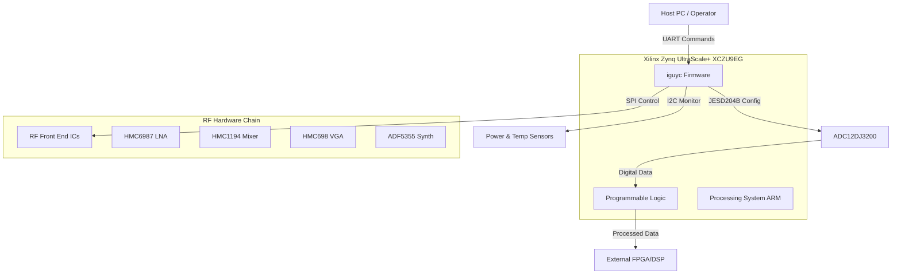
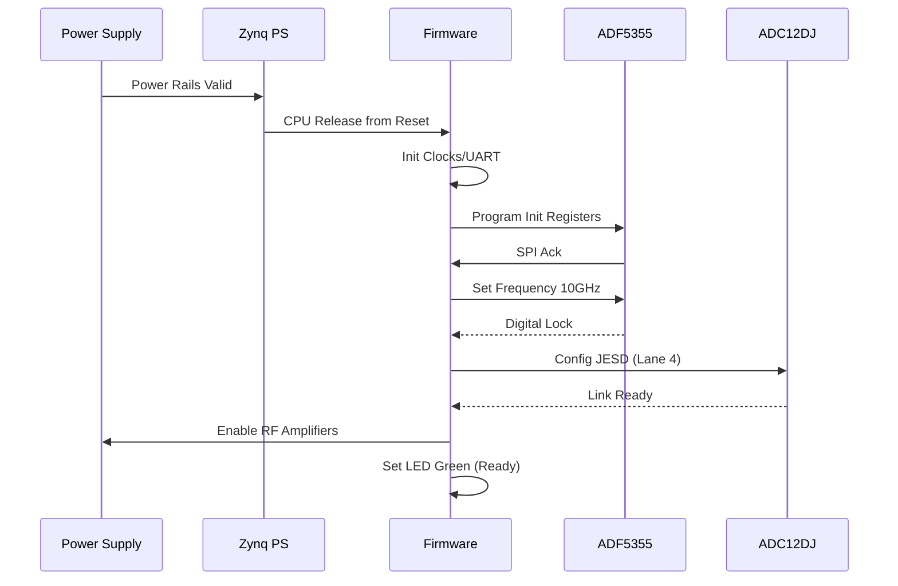
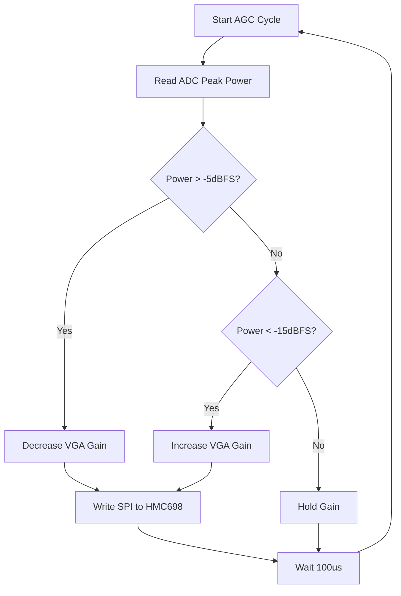
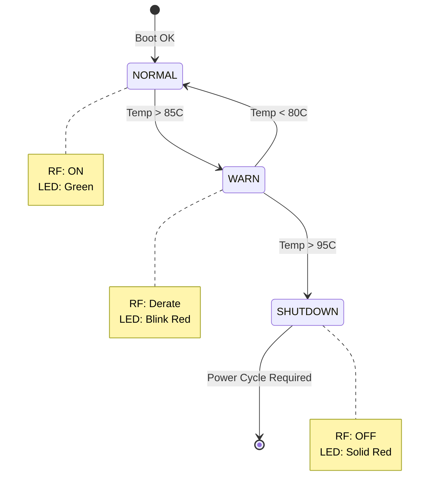

# Software Requirements Specification (SRS)

## Document Control
| Version | Date | Author | Changes |
|---------|------|--------|---------|
| 1.0 | 15 April 2026 | System Architect | Initial Release for iguyc Wideband RF Receiver |

---

# 1. Introduction

## 1.1 Purpose
This Software Requirements Specification (SRS) defines the comprehensive software and firmware requirements for the **iguyc** Wideband RF Receiver System (Project ID: iguyc). The document describes the software behavioral requirements necessary to operate the hardware platform defined in the iguyc Hardware Requirements Specification (HRS) and Glue Logic Requirements (GLR).

The purpose of this specification is to:
1.  Establish a single source of truth for the firmware behavior controlling the RF chain (LNA, Mixer, VGA, LO).
2.  Define the algorithms for Automatic Gain Control (AGC) and synthesizer management.
3.  Specify the interface protocols for the JESD204B ADC interface and UART control link.
4.  Provide the baseline for verification and validation (V&V) testing of the embedded firmware.

This document is intended for embedded firmware engineers, system integrators, and test engineers responsible for the iguyc project.

## 1.2 Scope
The software scope encompasses the bare-metal/RTOS firmware running on the Processing System (PS) of the Xilinx Zynq UltraScale+ (XCZU9EG-FFVB1156) and the RTL logic for the JESD204B IP core integration within the Programmable Logic (PL).

**In Scope:**
*   **Firmware Drivers:** Control interfaces for ADF5355 (SPI), HMC698LP4 (SPI), HMC1194LP4E (GPIO/SPI), and ADC12DJ3200 (SPI).
*   **Signal Processing Algorithms:** Automatic Gain Control (AGC) loop optimization for the -70 dBm to -40 dBm input range.
*   **System Management:** Power sequencing monitoring, thermal protection via I2C sensors, and Watchdog Timer (WDT) management.
*   **Communication:** UART command/response protocol for remote configuration and status reporting.

**Out of Scope:**
*   High-level application signal processing (e.g., demodulation, pulse compression) performed downstream of the CMOS output.
*   Host PC GUI software.

## 1.3 Definitions, Acronyms, and Abbreviations

| Term | Definition |
| :--- | :--- |
| **ADC** | Analog-to-Digital Converter (TI ADC12DJ3200) |
| **AGC** | Automatic Gain Control |
| **BGA** | Ball Grid Array |
| **BIT** | Built-In Test |
| **BSP** | Board Support Package |
| **CMOS** | Complementary Metal-Oxide-Semiconductor |
| **DAC** | Digital-to-Analog Converter (Internal to FPGA for calibration) |
| **EMC** | Electromagnetic Compatibility |
| **FF** | Flip-Flop |
| **FPGA** | Field-Programmable Gate Array |
| **FSM** | Finite State Machine |
| **GLR** | Glue Logic Requirements |
| **GPIO** | General Purpose Input/Output |
| **HAL** | Hardware Abstraction Layer |
| **HRS** | Hardware Requirements Specification |
| **I2C** | Inter-Integrated Circuit (Serial Interface) |
| **IP** | Intellectual Property (FPGA Core) |
| **ISR** | Interrupt Service Routine |
| **JESD** | JESD204B High-Speed Data Interface Standard |
| **LNA** | Low Noise Amplifier (HMC6987LP4E) |
| **LO** | Local Oscillator (ADF5355 based) |
| **LUT** | Look-Up Table |
| **LVDS** | Low-Voltage Differential Signaling |
| **MCU** | Microcontroller Unit (ARM Cortex-A53/Cortex-R5 within Zynq) |
| **MPSOC** | Multi-Processor System on Chip |
| **NCO** | Numerically Controlled Oscillator |
| **NV** | Non-Volatile Memory |
| **PCB** | Printed Circuit Board |
| **PLL** | Phase-Locked Loop |
| **POST** | Power-On Self Test |
| **PS** | Processing System (ARM cores in Zynq) |
| **RF** | Radio Frequency |
| **RTL** | Register Transfer Level |
| **RX** | Receive |
| **SFDR** | Spurious-Free Dynamic Range |
| **SNR** | Signal-to-Noise Ratio |
| **SPI** | Serial Peripheral Interface |
| **TB** | Test Bench |
| **TX** | Transmit (Control path) |
| **UART** | Universal Asynchronous Receiver/Transmitter |
| **WDT** | Watchdog Timer |

## 1.4 References
1.  **IEEE Std 830-1998:** IEEE Recommended Practice for Software Requirements Specifications.
2.  **IEEE Std 29148-2018:** Systems and software engineering — Life cycle processes — Requirements engineering.
3.  **iguyc Hardware Requirements Specification (HRS),** Rev 1.0, 15 April 2026.
4.  **iguyc Glue Logic Requirements (GLR),** Rev 0V01, 15 April 2026.
5.  **MISRA C:2012:** Guidelines for the use of the C language in critical systems.
6.  **Xilinx UG1085:** Zynq UltraScale+ Device Technical Reference Manual.
7.  **Texas Instruments ADC12DJ3200 Datasheet:** 12-Bit, 6.4 GSPS, RF-Sampling ADC.
8.  **Analog Devices ADF5355 Datasheet:** Wideband Synthesizer with Integrated VCO.

## 1.5 Overview
The remainder of this document is organized as follows:
*   **Section 2 (Overall Description):** Describes the system context, product functions, user characteristics, and constraints.
*   **Section 3 (Specific Requirements):** Contains the detailed functional, performance, and interface requirements.
*   **Section 4 (Verification & Validation):** Defines the testing strategy for the firmware.
*   **Section 5 (Traceability):** Maps software requirements to hardware and system requirements.
*   **Appendices:** Includes state machines, data dictionaries, and protocols.

---

# 2. Overall Description

## 2.1 Product Perspective
The iguyc software operates within a constrained embedded environment acting as the control plane for a high-performance RF receiver.



The software is partitioned into:
1.  **PS Firmware (C/C++):** Runs on the ARM Cortex-R5. Handles initialization, serial communication, slow control loops (AGC), and fault management.
2.  **PL Logic (Verilog/VHDL):** Implements the JESD204B PHY and transport layers, buffering the high-speed ADC data.

## 2.2 Product Functions
The software system performs the following primary functions:
1.  **System Initialization:** Sequencing power rails, configuring the PLL, and bringing up the JESD204B link.
2.  **Frequency Tuning:** Programming the ADF5355 synthesizer via SPI to select the target downconversion frequency.
3.  **Gain Control:** Implementing a closed-loop AGC algorithm to adjust the HMC698LP4 VGA based on ADC signal strength.
4.  **Data Acquisition:** Managing the ADC12DJ3200 to stream digitized IF samples.
5.  **Health Monitoring:** Polling temperature sensors and power rails via I2C.
6.  **Fault Management:** Executing safe shutdown procedures if temperature exceeds limits or sync is lost.
7.  **Configuration Management:** Storing/retrieving calibration data from non-volatile memory.

## 2.3 User Characteristics
*   **System Integrators:** Configure the receiver for specific frequency bands via UART.
*   **Field Engineers:** Monitor system health and diagnostics (Temperatures, Voltages, Lock Status).
*   **Maintenance Software:** Automated scripts that query status registers.

## 2.4 Constraints
1.  **Timing:** The JESD204B Subclass 1确定性延迟 requires the SYSREF signal to be aligned within ±1 ns.
2.  **Memory:** On-chip memory (OCM) is limited to 256KB; large data buffers must use DDR.
3.  **Compliance:** Code must adhere to MISRA-C:2012 standards (Safety-Critical).
4.  **Environment:** The system must boot autonomously at -40°C without operator intervention.
5.  **Latency:** The AGC loop must react to signal changes within 200 µs.

## 2.5 Assumptions and Dependencies
*   **Power Sequencing:** It is assumed the hardware power supply sequencer (ADP5054/LTM4644) adheres to the rail sequencing defined in the HRS before the PS boots.
*   **Clock Stability:** The system assumes the 10 MHz reference clock is stable and valid at system reset.

---

# 3. Specific Requirements

## 3.1 External Interface Requirements

### 3.1.1 Hardware Interfaces

#### 3.1.1.1 RF Synthesizer Control (SPI - ADF5355)
The firmware SHALL control the ADF5355 via a 3-wire SPI interface operating at 10 MHz max.

```c
// Register Map Definition for ADF5355
typedef struct {
    uint8_t REG_ADDR;      // 6-bit address
    uint32_t REG_DATA;     // 32-bit data
} ADF5355_Msg_t;

// API
int32_t ADF5355_Init(void);
int32_t ADF5355_SetFreq(uint64_t freq_hz);
int32_t ADF5355_ReadRegister(uint8_t reg, uint32_t *val);
```

#### 3.1.1.2 VGA Control (SPI - HMC698LP4)
The firmware SHALL adjust gain via SPI.
```c
typedef enum {
    GAIN_MINUS_5dB = 0,
    GAIN_0dB,
    // ... Intermediate steps ...
    GAIN_MAX_15dB
} HMC698_GainSetting_t;

int32_t HMC698_SetGain(HMC698_GainSetting_t gain);
```

#### 3.1.1.3 ADC Interface (JESD204B)
The firmware SHALL configure the ADC via SPI (CSB line) and monitor the PL logic for sync.

```c
// ADC12DJ3200 Register Map
typedef struct {
    uint8_t ADDR; 
    uint8_t DATA;
} ADC12DJ_Reg_t;

// API
int32_t ADC12DJ_Init(uint32_t sample_rate, uint8_t lanes_enabled);
int32_t ADC12DJ_SetJesdMode(uint8_t subclass);
int32_t ADC12DJ_CheckSync(uint8_t *is_locked);
```

### 3.1.2 Software Interfaces

#### 3.1.2.1 UART Host Protocol (GLR Section 6)
The firmware exposes a command interface at 115200 baud, 8N1.

**Packet Structure:**
```c
typedef struct __attribute__((packed)) {
    uint8_t SOP;              // 0xAA
    uint8_t MSG_ID;           // Command ID
    uint16_t LENGTH;          // Payload length
    uint8_t PAYLOAD[256];     // Variable payload
    uint16_t CRC;             // CRC-16-CCITT
    uint8_t EOP;              // 0x55
} UART_Frame_t;
```

## 3.2 Functional Requirements

### 3.2.1 System Initialization (REQ-SW-001 to REQ-SW-010)

**REQ-SW-001:** The firmware SHALL complete the Power-On Self-Test (POST) within 500ms of power-up.
**REQ-SW-002:** The firmware SHALL verify the BOARD_ID register (0xFFFF0000) reads 0x49475943 ("IGYC").
**REQ-SW-003:** The firmware SHALL configure the PS PLLs to generate 333 MHz for the AXI buses.
**REQ-SW-004:** The firmware SHALL initialize the UART driver at 115200 baud before sending the "READY" prompt.
**REQ-SW-005:** The firmware SHALL attempt to establish the JESD204B link; failure SHALL result in ERROR_LED blink pattern (2 Hz).
**REQ-SW-006:** The firmware SHALL load default configuration parameters from non-volatile QSPI flash into SRAM.
**REQ-SW-007:** The firmware SHALL initialize the Watchdog Timer (WDT) with a 1-second timeout.
**REQ-SW-008:** The firmware SHALL disable the RF Output (set Mixer ENABLE pin LOW) during initialization.
**REQ-SW-009:** The firmware SHALL calibrate the ADC internal offset logic upon startup.
**REQ-SW-010:** The firmware SHALL enable external interrupts for the ALERT signals from power monitors.

### 3.2.2 RF Control & LO Synthesis (REQ-SW-011 to REQ-SW-020)

**REQ-SW-011:** The firmware SHALL provide a function to set the LO frequency with a resolution of 1 Hz.
**REQ-SW-012:** The firmware SHALL calculate the ADF5355 INT, FRAC, and MOD registers based on the requested 64-bit frequency.
**REQ-SW-013:** The firmware SHALL write the ADF5355 registers in the sequence defined in Figure 12 of the ADF5355 datasheet (Reg 0 -> Reg 1... -> Reg 12).
**REQ-SW-014:** The firmware SHALL poll the MUXOUT pin for "Digital Lock" with a timeout of 100ms.
**REQ-SW-015:** The firmware SHALL assert RF_LOCK_OK GPIO only when the ADF5355 achieves digital lock.
**REQ-SW-016:** The firmware SHALL set the HMC1194 Mixer IF frequency to the center of the passband (e.g., 1.5 GHz).
**REQ-SW-017:** The firmware SHALL verify the VCO calibrations (VCO_BAND) are valid before enabling RF output.
**REQ-SW-018:** The firmware SHALL implement a ramp function for frequency hopping, transitioning frequency in steps of 10 MHz to minimize transients.
**REQ-SW-019:** The firmware SHALL disable the LO synthesizer if the FPGA Sync signal is lost for >5 seconds.
**REQ-SW-020:** The firmware SHALL log the last set frequency to Flash memory every 10 seconds.

### 3.2.3 Gain Control (AGC) (REQ-SW-021 to REQ-SW-030)

**REQ-SW-021:** The firmware SHALL implement a closed-loop AGC with a target input level of -10 dBFS at the ADC.
**REQ-SW-022:** The AGC loop SHALL update the HMC698LP4 gain state every 100 µs.
**REQ-SW-023:** The firmware SHALL read the ADC12DJ3200 "Peak Detector" registers via SPI to determine signal power.
**REQ-SW-024:** If ADC power > -5 dBFS, the firmware SHALL decrease VGA gain by one step.
**REQ-SW-025:** If ADC power < -15 dBFS, the firmware SHALL increase VGA gain by one step.
**REQ-SW-026:** The firmware SHALL allow manual override of AGC via the UART command "SET_GAIN <val>".
**REQ-SW-027:** The AGC SHALL freeze gain adjustment if the PLL is unlocked.
**REQ-SW-028:** The firmware SHALL expose the current gain index via a readback register "RF_GAIN_STATUS".
**REQ-SW-029:** The firmware SHALL implement hysteresis of ±1 dB to prevent gain oscillation.
**REQ-SW-030:** The AGC algorithm SHALL monitor for saturation (ADC overwrite bits) and force minimum gain immediately.

### 3.2.4 Data Acquisition & JESD204B (REQ-SW-031 to REQ-SW-040)

**REQ-SW-031:** The firmware SHALL configure the ADC12DJ3200 for JESD204B Subclass 1 operation.
**REQ-SW-032:** The firmware SHALL program the LMFS (Lane-Mapping-Frame-Sample) configuration to L=4, M=2, F=2, S=1.
**REQ-SW-033:** The firmware SHALL assert the ADC RESETB pin low for 10ms, then high during init.
**REQ-SW-034:** The firmware SHALL verify the JESD204B SYNC~ status bits in the PL logic.
**REQ-SW-035:** The firmware SHALL align the RX buffer in the PL using the SYSREF edge.
**REQ-SW-036:** The firmware SHALL read back the ADC error counters (dispersion errors) every 1 second.
**REQ-SW-037:** If dispersion errors > 10/hour, the firmware SHALL trigger a link re-initialization.
**REQ-SW-038:** The firmware SHALL support decimation configuration (DDC) bypass or 2x/4x decimation.
**REQ-SW-039:** The firmware SHALL calculate the effective sample rate based on the decimation setting (K-factor).
**REQ-SW-040:** The firmware SHALL monitor the FPGA temperature and reduce sample rate if Temp > 85°C.

### 3.2.5 Power & Thermal Management (REQ-SW-041 to REQ-SW-050)

**REQ-SW-041:** The firmware SHALL poll I2C thermal sensors (Address 0x48) every 500ms.
**REQ-SW-042:** The firmware SHALL fetch voltage rails (5V0, 3V3, 1V8) via I2C PMIC.
**REQ-SW-043:** If temperature > 95°C, the firmware SHALL shut down the RF chain (AFE_OFF).
**REQ-SW-044:** If 5V0 rail droops < 4.5V, the firmware SHALL assert a HARDWARE_FAULT interrupt.
**REQ-SW-045:** The firmware SHALL log the maximum temperature seen in the session to EEPROM.
**REQ-SW-046:** The firmware SHALL control the status LED: Solid Green (OK), Blinking Red (Temp Warning), Solid Red (Fault).
**REQ-SW-047:** The firmware SHALL implement a debounce timer of 10ms for external fault signals.
**REQ-SW-048:** The firmware SHALL service the Watchdog Timer every 500ms.
**REQ-SW-049:** In the event of a WDT reset, the firmware SHALL preserve the contents of a specific "Crash Dump" SRAM region.
**REQ-SW-050:** The firmware SHALL support a low-power sleep mode where the ADC is powered down but the MCU remains active.

## 3.3 Performance Requirements

| ID | Description | Value |
|---|---|---|
| REQ-PERF-001 | SPI Transaction Speed | > 1 MHz (ADF5355 Config) |
| REQ-PERF-002 | AGC Loop Response Time | < 200 µs |
| REQ-PERF-003 | Frequency Hop Time | < 50 µs (between registers write and lock) |
| REQ-PERF-004 | UART Command Latency | < 10 ms (Echo to Host) |
| REQ-PERF-005 | Boot Time | < 500 ms to "READY" state |
| REQ-PERF-006 | JESD Link Initialization | < 100 ms (Link training) |
| REQ-PERF-007 | CPU Load (R5 Core) | < 40% (Idle), < 80% (Max AGC) |
| REQ-PERF-008 | Power Consumption (SW portion) | < 1.5 W (excluding RF hardware) |
| REQ-PERF-009 | ADC Data Throughput | 12.8 Gbps (Raw I/Q) |
| REQ-PERF-010 | Glitch Free Tuning | Phase discontinuity < 5 degrees |

## 3.4 Design Constraints
1.  **Language:** C99 for firmware; SystemVerilog for PL.
2.  **Stack Size:** 32KB minimum for the main control thread.
3.  **Compiler:** Xilinx Vitis 2023.2 (GCC 11.2.0 cross-compiler).
4.  **Libraries:** Xilinx Standalone library (FreeRTOS optional).
5.  **Math:** Fixed-point arithmetic (Q31 format) preferred for AGC loops to avoid FPU dependency.
6.  **Interrupts:** Maximum nesting depth of 3.

## 3.5 Software System Attributes
*   **Reliability:** MTBF > 10,000 hours.
*   **Availability:** 99.9% uptime.
*   **Security:** UART commands requiring write access must be protected by a CRC check.
*   **Maintainability:** All variables must be scoped; global use restricted to hardware register maps.

---

# 4. Verification and Validation

## 4.1 Unit Test Requirements
*   **ADF5355 Driver:** Verify register calculation for 10 random frequencies between 5-18 GHz.
*   **SPI Driver:** Verify read/write loopback on a test SPI bus.
*   **AGC Loop:** Simulate ADC input steps and verify gain adjustment logic.

## 4.2 Integration Test Requirements
*   **RF Path Test:** Inject tone at 10 GHz, verify LO lock, verify IF output at correct frequency.
*   **JESD Link Test:** Transmit PRBS pattern from ADC, verify error-free reception in FPGA logic.

## 4.3 System Test Requirements
*   **Thermal Chamber:** Place iguyc in chamber at -40°C, verify boot and operation. Ramp to +85°C, verify thermal shutdown.
*   **Longevity:** Run continuous loop for 48 hours (soak test).

---

# 5. Requirements Traceability Matrix

| REQ-SW ID | Description | Traces To (REQ-HW) | Traces To (GLR) |
|-----------|-------------|--------------------|-----------------|
| REQ-SW-001 | POST Time | REQ-HW-012 (Inst BW) | GLR 4.0 (Module Overview) |
| REQ-SW-005 | JESD Init | REQ-HW-001 (Input Freq) | GLR 2.1 (ADC Datasheet) |
| REQ-SW-011 | LO Freq Res | REQ-HW-005 (Phase Noise) | GLR 2.1 (ADF5355 Datasheet) |
| REQ-SW-021 | AGC Target | REQ-HW-003 (Input Power) | GLR 4.0 (System Overview) |
| REQ-SW-031 | JESD Config | REQ-HW-001 (System Freq) | GLR 2.1 (JESD Standard) |
| REQ-SW-041 | Temp Polling | REQ-HW-005 (Env Range) | GLR 2.1 (Power Mgmt) |
| REQ-SW-043 | Thermal Shutdown | REQ-HW-005 (MIL-STD) | GLR 4.0 (Safety) |

---

# 6. Appendices

## Appendix A — Error Codes
```c
typedef enum {
    IGUYC_OK           = 0x00,
    IGUYC_ERR_SPI_FAIL = 0x01,
    IGUYC_ERR_PLL_UNLOCK = 0x02,
    IGUYC_ERR_ADC_TIMEOUT = 0x03,
    IGUYC_ERR_TEMP_HIGH = 0x04,
    IGUYC_ERR_CRC_FAIL = 0x05,
    IGUYC_ERR_PARAM = 0x06
} iguyc_status_t;
```

## Appendix B — Mermaid Diagrams

### System Initialization Sequence


### AGC Control Loop


### Thermal Management State Machine
