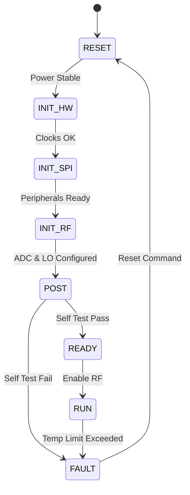
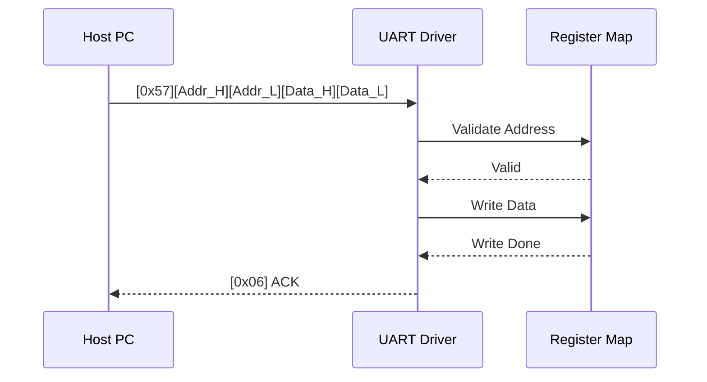
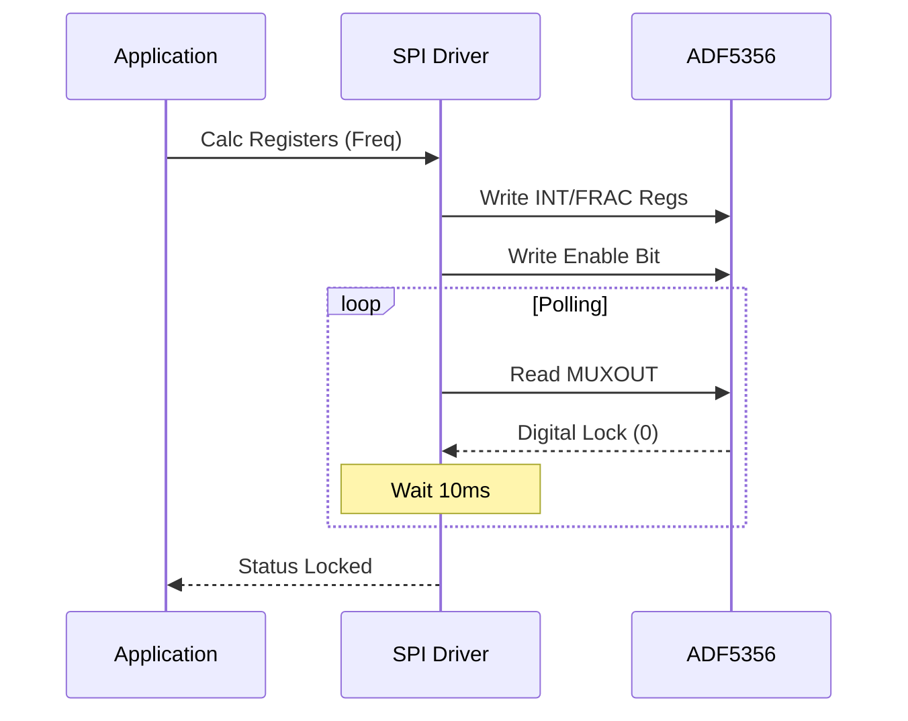
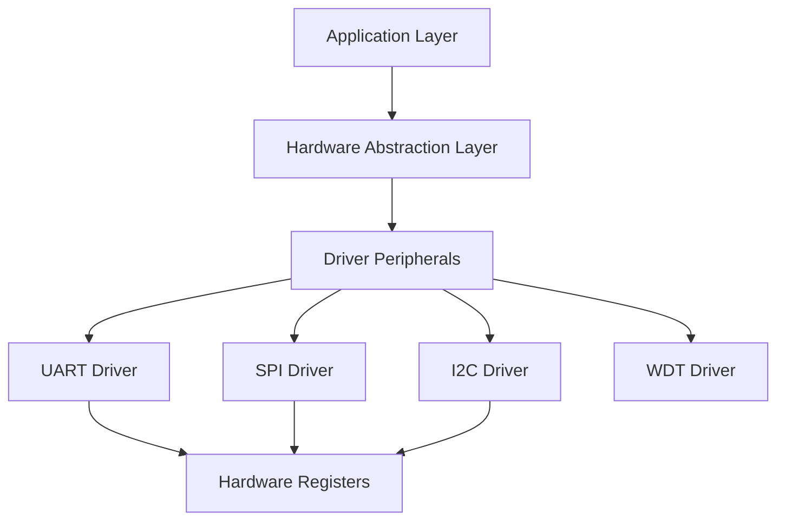
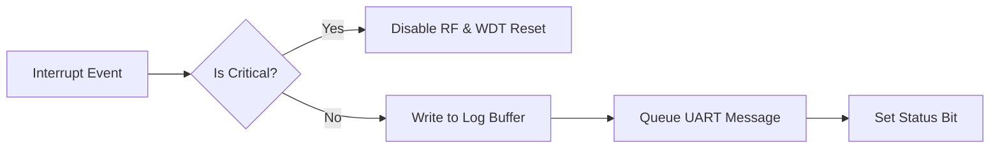

# Software Requirements Specification (SRS)

**Project:** j,fj Wideband RF Receiver Firmware
**Version:** 1.0
**Date:** 16 April 2026

---

## Document Control

| Version | Date | Author | Changes |
|---------|------|--------|---------|
| 1.0 | 16 April 2026 | System Architect | Initial Release |

---

# 1. Introduction

## 1.1 Purpose
This Software Requirements Specification (SRS) defines the software and firmware requirements for the **j,fj Wideband RF Receiver Module**. This document describes the system-level control software, hardware abstraction layers (HAL), and communication interfaces required to operate the RF chain, digitization components, and power management subsystems defined in the Hardware Requirements Specification (HRS).

The intended audience includes firmware engineers, system integrators, and test engineers responsible for validating the j,fj module.

## 1.2 Scope
The scope of this software encompasses the bare-metal / RTOS firmware running on the internal controller (FPGA logic or embedded MCU managing the glue logic).

**In-Scope:**
*   **RF Chain Control:** SPI drivers for the ADF5356 Synthesizer, HMC699LP4 VGA, and HMC1113 LNA.
*   **Data Path:** Configuration of the ADC12DJ3200 and management of the LVDS output interface.
*   **Communication:** UART command/response protocol for host control and I2C EEPROM management.
*   **Power Management:** Monitoring of 5V/3.3V/1.8V/1.0V rails and thermal protection.
*   **Diagnostics:** Built-in Self-Test (BIST) and error logging.

**Out-of-Scope:**
*   Host-side FPGA bitstreams for downstream signal processing (beyond the LVDS driver configuration).
*   RF signal processing algorithms (demodulation, decoding).

## 1.3 Definitions, Acronyms, and Abbreviations

| Acronym | Definition |
| :--- | :--- |
| **ADC** | Analog-to-Digital Converter |
| **API** | Application Programming Interface |
| **BIST** | Built-In Self-Test |
| **BOM** | Bill of Materials |
| **BRAM** | Block RAM |
| **CLK** | Clock |
| **CPLD** | Complex Programmable Logic Device |
| **CPU** | Central Processing Unit |
| **CRC** | Cyclic Redundancy Check |
| **DAC** | Digital-to-Analog Converter |
| **dB** | Decibel |
| **dBFS** | Decibels relative to Full Scale |
| **dBm** | Decibel-milliwatts |
| **DC** | Direct Current |
| **DMA** | Direct Memory Access |
| **DUT** | Device Under Test |
| **EEPROM** | Electrically Erasable Programmable Read-Only Memory |
| **EMC** | Electromagnetic Compatibility |
| **ESD** | Electrostatic Discharge |
| **FIFO** | First-In-First-Out |
| **FPGA** | Field-Programmable Gate Array |
| **FSM** | Finite State Machine |
| **GHz** | Gigahertz |
| **GPIO** | General Purpose Input/Output |
| **HAL** | Hardware Abstraction Layer |
| **HRS** | Hardware Requirements Specification |
| **I2C** | Inter-Integrated Circuit |
| **ICD** | Interface Control Document |
| **IF** | Intermediate Frequency |
| **IIP3** | Input Third-order Intercept Point |
| **ISR** | Interrupt Service Routine |
| **JTAG** | Joint Test Action Group |
| **kbps** | Kilobits per second |
| **LNA** | Low Noise Amplifier |
| **LO** | Local Oscillator |
| **LPF** | Low Pass Filter |
| **LSB** | Least Significant Bit |
| **LVDS** | Low-Voltage Differential Signaling |
| **MHz** | Megahertz |
| **MOSI** | Master Out Slave In |
| **MISO** | Master In Slave Out |
| **MSB** | Most Significant Bit |
| **NF** | Noise Figure |
| **NVM** | Non-Volatile Memory |
| **PCB** | Printed Circuit Board |
| **PLL** | Phase-Locked Loop |
| **POST** | Power-On Self-Test |
| **RAM** | Random Access Memory |
| **RF** | Radio Frequency |
| **ROM** | Read-Only Memory |
| **RTL** | Register Transfer Level |
| **Rx** | Receive |
| **SMA** | SubMiniature version A (connector) |
| **SNR** | Signal-to-Noise Ratio |
| **SPI** | Serial Peripheral Interface |
| **SRD** | Software Requirements Document (legacy) |
| **SRS** | Software Requirements Specification |
| **StRS** | Stakeholder Requirements Specification |
| **SyRS** | System Requirements Specification |
| **TEMP** | Temperature |
| **TPG** | Test Pattern Generator |
| **TRP** | Transmit/Receive Point |
| **UART** | Universal Asynchronous Receiver-Transmitter |
| **VCC** | Voltage Common Collector |
| **VCO** | Voltage-Controlled Oscillator |
| **VGA** | Variable Gain Amplifier |
| **WDT** | Watchdog Timer |

## 1.4 References
1.  **IEEE 830-1998:** Recommended Practice for Software Requirements Specifications.
2.  **ISO/IEC/IEEE 29148:2018:** Systems and software engineering — Life cycle processes — Requirements engineering.
3.  **HRS (j,fj):** Hardware Requirements Specification for Wideband RF Receiver, Rev 1.0.
4.  **GLR (j,fj):** Glue Logic Requirements, Rev 0V01.
5.  **Analog Devices Datasheet:** ADF5356 Microwave Wideband Synthesizer.
6.  **Texas Instruments Datasheet:** ADC12DJ3200 RF Sampling ADC.
7.  **Analog Devices Datasheet:** HMC1113LP3DE LNA.
8.  **MISRA C:2012:** Guidelines for the Use of the C Language in Critical Systems.
9.  **JEDEC Standard:** JESD204B (Interface for Data Converters).

## 1.5 Overview
Section 2 provides a high-level description of the system architecture, hardware interfaces, and operational context. Section 3 details the specific requirements, organized by external interfaces, functional requirements (minimum 75 items), and performance attributes. Section 4 outlines verification methods. Section 5 provides the Requirements Traceability Matrix (RTM) mapping software requirements to hardware sources. Appendices provide register maps, protocol details, and error codes.

---

# 2. Overall Description

## 2.1 Product Perspective

The j,fj firmware acts as the control layer for the analog RF chain and the data interface manager for the digital back-end. The software operates on an embedded controller (Soft-core in the FPGA or external MCU) interfacing with peripherals via SPI, I2C, GPIO, and UART.

**System Context Diagram (Mermaid):**

```mermaid
graph TD
    HOST[Host System / Control PC] -->|UART Commands| FW[Firmware Controller]
    CONFIG_PC[Configuration PC] -->|SPI Boot| FW
    
    subgraph j,fj Module
        FW -->|SPI 3-Wire| ADC[ADC12DJ3200]
        FW -->|SPI| LO[ADF5356 Synthesizer]
        FW -->|SPI| VGA[HMC699LP4 VGA]
        FW -->|GPIO| LNA_EN[LNA Enable]
        FW -->|I2C| EEPROM[AT24CS02 EEPROM]
        FW -->|I2C| PWR_MON[Power Monitor Rails]
        ADC -->|LVDS 8-bit| FPGA_IP[FPGA Logic Core]
    end
    
    FW -->|Status Logs| HOST
    FW -->|Error Codes| HOST
```

## 2.2 Product Functions
1.  **Initialization:** Boot sequence, PLL locking, peripheral verification.
2.  **Frequency Tuning:** programming the ADF5356 LO via SPI.
3.  **Gain Control:** Setting attenuation on the HMC699LP4 VGA.
4.  **Digitization Control:** Configuring ADC12DJ3200 test patterns and JESD204B lanes.
5.  **Data Capture:** Managing LVDS data flow to the host interface.
6.  **Power Management:** Monitoring temperature and voltages; asserting shutdown on fault.
7.  **Communication:** Interpreting UART packets (Read/Write/Register access).
8.  **Storage:** Reading/Writing calibration data to EEPROM.

## 2.3 User Characteristics
*   **Firmware Engineers:** Develop low-level drivers; require MISRA-C compliance.
*   **Test Engineers:** Validate RF performance via UART commands; require accurate error reporting.
*   **System Integrators:** Integrate the j,fj module into larger SDR platforms; require stable API and control protocol.

## 2.4 Constraints
1.  **MISRA-C Compliance:** All code shall adhere to MISRA C:2012 standards.
2.  **Timing:** UART command response time < 10ms; SPI transactions non-blocking.
3.  **Memory:** Code size < 256KB; RAM usage < 64KB.
4.  **Environment:** Operate reliably from -40°C to +85°C.
5.  **Real-time:** Watchdog timer must be serviced every 100ms.
6.  **Atomicity:** Register read-modify-write operations on shared SPI bus must be mutex-protected.

## 2.5 Assumptions and Dependencies
1.  **Clock Stability:** The 125MHz reference oscillator (FPGA_CLK_125M) is stable and within +/- 20ppm before software initialization begins.
2.  **Power Sequencing:** The 5V, 3.3V, 1.8V, and 1.0V rails are stable within tolerance before the firmware attempts to configure the ADC.
3.  **EEPROM Integrity:** Calibration data in EEPROM is valid or protected by checksum/CRC.

---

# 3. Specific Requirements

## 3.1 External Interface Requirements

### 3.1.1 Hardware Interfaces

#### 3.1.1.1 UART Interface (Control)
The firmware shall implement a UART controller operating at 115200 baud, 8N1.

**C Struct Definition (FPGA Register Map):**
```c
#include <stdint.h>

typedef struct {
    volatile uint16_t BAUD_DIV;    // Offset 0x00: Baud Rate Divisor
    volatile uint16_t TX_CTRL;     // Offset 0x02: TX Enable (Bit 0)
    volatile uint16_t RX_CTRL;     // Offset 0x04: RX Enable (Bit 0)
    volatile uint16_t STATUS;      // Offset 0x06: RX_Empty (Bit 0), TX_Full (Bit 1)
    volatile uint16_t RX_FIFO;     // Offset 0x08: Read Data
    volatile uint16_t TX_FIFO;     // Offset 0x0A: Write Data
} UART_RegMap_t;

// API Functions
int32_t UART_Init(uint32_t base_addr, uint32_t baud_rate);
int32_t UART_ReadByte(uint8_t *data);
int32_t UART_WriteByte(uint8_t data);
int32_t UART_ReadBuffer(uint8_t *buf, uint32_t len);
int32_t UART_WriteBuffer(const uint8_t *buf, uint32_t len);
```

#### 3.1.1.2 SPI Interface (RF Components)
The firmware implements a multi-drop SPI bus to control the LO, VGA, and ADC. Clock speeds up to 20 MHz.

**C Struct Definition:**
```c
typedef struct {
    volatile uint32_t CTRL;     // Control: Start, CS_Select
    volatile uint32_t STATUS;   // Status: Busy, FIFO_Empty
    volatile uint32_t TX_DATA;  // Transmit Data
    volatile uint32_t RX_DATA;  // Receive Data
    volatile uint32_t CLK_DIV;  // Clock Divider
} SPI_RegMap_t;

// API Functions
int32_t SPI_Init(uint32_t base_addr);
int32_t SPI_Transfer(uint8_t cs_id, uint8_t *tx_buf, uint8_t *rx_buf, uint32_t len);
int32_t SPI_WriteReg(uint8_t cs_id, uint16_t reg_addr, uint32_t value);
```

#### 3.1.1.3 I2C Interface (EEPROM & Power Mon)
**C Struct Definition:**
```c
typedef struct {
    volatile uint32_t CTRL;     // Control: Start, Stop, Ack
    volatile uint32_t STATUS;   // Status: TxBufEmpty, RxBufFull
    volatile uint32_t DATA;     // Data Register
    volatile uint32_t CLK_DIV;  // SCL Div
} I2C_RegMap_t;

// API Functions
int32_t I2C_Init(uint32_t base_addr, uint32_t clk_hz);
int32_t I2C_WriteBytes(uint8_t dev_addr, uint16_t mem_addr, const uint8_t *data, uint32_t len);
int32_t I2C_ReadBytes(uint8_t dev_addr, uint16_t mem_addr, uint8_t *data, uint32_t len);
```

### 3.1.2 Software Interfaces
The firmware exposes a set of "Register" addresses that correspond to internal control variables, mapped to the UART protocol.

*   **REG_RF_FREQ (0x0010):** 64-bit Floating point representation of target RF frequency (Hz).
*   **REG_GAIN (0x0011):** 8-bit Integer for VGA attenuation (0-255).
*   **REG_TEMP (0x0020):** 16-bit Signed Integer for PCB temperature (0.1°C units).

### 3.1.3 Communication Interfaces
**UART Protocol Specification (GLR Compliance):**

| Command | CMD Byte | Frame Structure (Hex) | Response |
|---------|----------|-----------------------|----------|
| Single Write | 0x57 ('W') | `[0x57][ADDR_H][ADDR_L][DATA_H][DATA_L]` | `[0x06]` (ACK) |
| Single Read | 0x52 ('R') | `[0x52][ADDR_H|0x80][ADDR_L]` | `[DATA_H][DATA_L]` |
| Bulk Write | 0x42 ('B') | `[0x42][ADDR_H][ADDR_L][N][D0_H][D0_L]...[Dn_H][Dn_L]` | `[0x06]` (ACK) |
| Bulk Read | 0x62 ('b') | `[0x62][ADDR_H|0x80][ADDR_L][N]` | `[D0_H][D0_L]...[Dn_H][Dn_L]` |
| Error NAK | 0x15 | Sent by Firmware on error | — |

*   **Address Space:** 16-bit (0x0000–0xFFFF). Read operations require Bit 15 of the address byte to be set (OR 0x8000).
*   **Timeout:** Firmware parser resets if inter-byte delay > 50ms.
*   **CRC:** Optional CRC-16-CCITT can be enabled via Config Flag (not baseline).

## 3.2 Functional Requirements

### 3.2.1 System Initialization (REQ-SW-001 to REQ-SW-010)

| ID | Requirement Statement | Source | Priority | Verification |
|----|-----------------------|--------|----------|--------------|
| REQ-SW-001 | The software SHALL complete the Power-On Self-Test (POST) within 500ms of VDD_FPGA_1V0 stabilization. | HRS §3.1 | M | Test |
| REQ-SW-002 | The software SHALL verify the BOARD_ID register (0x0000) matches 0xA5A5 on startup; failure SHALL halt boot and assert LED_FAULT. | GLR §10 | M | Test |
| REQ-SW-003 | The software SHALL configure the ADF5356 PLL to a default frequency of 11.5 GHz within 200ms of boot completion. | HRS §3.1 | M | Demonstration |
| REQ-SW-004 | The software SHALL poll the ADF5356 MUXOUT pin for "Digital Lock" and timeout after 100ms if not locked. | HRS §3.2 | M | Analysis |
| REQ-SW-005 | The software SHALL initialize the UART peripheral to 115200 baud, 8 data bits, no parity, 1 stop bit (8N1) before enabling the RX interrupt. | GLR §8 | M | Inspection |
| REQ-SW-006 | The software SHALL load calibration coefficients (Gain Flatness tables) from the AT24CS02 EEPROM into SRAM. | HRS §3.2 | M | Test |
| REQ-SW-007 | The software SHALL initialize the SPI bus clock to 10MHz (safe operating speed) before accessing the ADC or VGA. | GLR §4 | M | Inspection |
| REQ-SW-008 | The software SHALL set the HMC699LP4 VGA gain to MID-RANGE (0x7F) upon initialization to prevent saturation. | HRS §3.2 | M | Demonstration |
| REQ-SW-009 | The software SHALL enable the Watchdog Timer (WDT) with a 100ms timeout before exiting the init function. | HRS §3.5 | M | Test |
| REQ-SW-010 | The software SHALL log the Firmware Version string "j,fj_v1.0" to the UART debug port upon successful boot. | GLR §5 | D | Inspection |

### 3.2.2 UART Communication Driver (REQ-SW-011 to REQ-SW-020)

| ID | Requirement Statement | Source | Priority | Verification |
|----|-----------------------|--------|----------|--------------|
| REQ-SW-011 | The UART driver SHALL support 115200 baud, 8N1, and half-duplex operation. | GLR §8 | M | Test |
| REQ-SW-012 | The driver SHALL parse the Single Write command (0x57) and write the 16-bit data payload to the specified address. | GLR §8 | M | Test |
| REQ-SW-013 | The driver SHALL parse the Single Read command (0x52) and return the 16-bit contents of the specified address. | GLR §8 | M | Test |
| REQ-SW-014 | The driver SHALL handle Bulk Write (0x42) commands for N registers, where N <= 64. | GLR §8 | M | Test |
| REQ-SW-015 | The driver SHALL handle Bulk Read (0x62) commands for N registers, where N <= 64. | GLR §8 | M | Test |
| REQ-SW-016 | The driver SHALL respond to any invalid command byte (not 0x57, 0x52, 0x42, 0x62) with NAK (0x15). | GLR §8 | M | Test |
| REQ-SW-017 | The driver SHALL reset the command parser state machine if the inter-byte gap exceeds 50ms. | GLR §8 | D | Test |
| REQ-SW-018 | The driver SHALL verify the Read Address bit (Bit 15) is set for Single Read commands; if not, return NAK. | GLR §8 | M | Test |
| REQ-SW-019 | The driver SHALL implement a 256-byte circular buffer for RX data to prevent overrun during high-speed transfers. | HRS §3.4 | D | Analysis |
| REQ-SW-020 | The driver SHALL disable interrupts during critical register updates (TX/RX FIFO) to ensure data integrity. | GLR §4 | M | Analysis |

### 3.2.3 SPI Control & RF Configuration (REQ-SW-021 to REQ-SW-030)

| ID | Requirement Statement | Source | Priority | Verification |
|----|-----------------------|--------|----------|--------------|
| REQ-SW-021 | The software SHALL implement a SPI_Write function for the ADF5356 that asserts CS, writes 4 bytes, and de-asserts CS. | HRS §3.3 | M | Inspection |
| REQ-SW-022 | The software SHALL calculate the ADF5356 INT, FRAC, and MOD registers based on a 32-bit target frequency input (Hz). | HRS §3.3 | M | Analysis |
| REQ-SW-023 | The software SHALL update the ADF5356 frequency only when the MUXOUT status indicates "Locked" to prevent spur generation. | HRS §3.3 | M | Demonstration |
| REQ-SW-024 | The software SHALL write to the HMC699LP4 VGA SPI register to adjust attenuation in 0.5 dB steps. | HRS §3.2 | M | Test |
| REQ-SW-025 | The software SHALL clamp the VGA attenuation value between 0 dB and 31.5 dB (max range) before writing. | HRS §3.2 | M | Test |
| REQ-SW-026 | The software SHALL configure the ADC12DJ3200 for 14-bit single-channel mode via SPI. | HRS §3.1 | M | Test |
| REQ-SW-027 | The software SHALL configure the JESD204B subclass 1 parameters (LMFS=4421) in the ADC. | HRS §3.1 | M | Inspection |
| REQ-SW-028 | The software SHALL assert the ADC_RESET_N pin low for 10ms, then high, during initialization sequence. | ADC Datasheet | M | Test |
| REQ-SW-029 | The software SHALL poll the ADC STATUS register for "PLL Lock" and "Lane Sync" before reporting Ready state. | HRS §3.1 | M | Test |
| REQ-SW-030 | The software SHALL provide a function to enable/disable the RF Input (LNA Bias Enable) via GPIO. | HRS §3.6 | M | Demonstration |

### 3.2.4 Temperature & Power Monitoring (REQ-SW-031 to REQ-SW-040)

| ID | Requirement Statement | Source | Priority | Verification |
|----|-----------------------|--------|----------|--------------|
| REQ-SW-031 | The software SHALL read the on-board temperature sensor every 1 second. | HRS §3.5 | M | Test |
| REQ-SW-032 | The software SHALL trigger a thermal shutdown (Disable RF) if the temperature exceeds +85°C. | HRS §3.5 | M | Test |
| REQ-SW-033 | The software SHALL re-enable the RF path automatically if the temperature drops below +75°C (Hysteresis). | HRS §3.5 | D | Test |
| REQ-SW-034 | The software SHALL monitor the 5V DC input rail via I2C ADC. | HRS §3.4 | M | Test |
| REQ-SW-035 | The software SHALL assert a fault code if the 5V rail drops below 4.75V or rises above 5.25V. | HRS §3.4 | M | Test |
| REQ-SW-036 | The software SHALL monitor the 1.0V FPGA core rail and assert a reset if it deviates by >5%. | HRS §3.4 | M | Test |
| REQ-SW-037 | The software SHALL log the first 64 thermal fault events to EEPROM with timestamps (uptime seconds). | HRS §3.5 | D | Test |
| REQ-SW-038 | The software SHALL read the current draw of the 5V rail and report it via register 0x0022. | HRS §3.4 | D | Test |
| REQ-SW-039 | The software SHALL implement an exponential moving average filter for temperature readings (alpha = 0.1). | HRS §3.5 | D | Analysis |
| REQ-SW-040 | The software SHALL trigger an immediate interrupt if the temperature sensor reports "Open Circuit" or "Short Circuit". | Sensor Datasheet | M | Test |

### 3.2.5 Non-Volatile Memory (EEPROM) Management (REQ-SW-041 to REQ-SW-050)

| ID | Requirement Statement | Source | Priority | Verification |
|----|-----------------------|--------|----------|--------------|
| REQ-SW-041 | The software SHALL implement a write delay of 5ms after EEPROM page write operations. | Datasheet AT24CS02 | M | Inspection |
| REQ-SW-042 | The software SHALL calculate a CRC-8 checksum for the calibration block before writing to EEPROM. | HRS §3.1 | M | Test |
| REQ-SW-043 | The software SHALL verify the CRC-8 checksum on read; if invalid, load factory defaults. | HRS §3.1 | M | Test |
| REQ-SW-044 | The software SHALL limit EEPROM write cycles by implementing a wear-leveling algorithm for the fault log. | HRS §3.5 | D | Analysis |
| REQ-SW-045 | The software SHALL store the system serial number at EEPROM address 0x00 (ASCII string). | GLR §4 | M | Inspection |
| REQ-SW-046 | The software SHALL provide a command to dump the entire EEPROM contents via UART Bulk Read. | GLR §5 | O | Demonstration |
| REQ-SW-047 | The software SHALL lock the EEPROM write protect pin (WP) after initialization if no config changes are pending. | Datasheet | D | Test |
| REQ-SW-048 | The software SHALL handle I2C NACK from EEPROM gracefully and retry 3 times before reporting failure. | I2C Spec | M | Test |
| REQ-SW-049 | The software SHALL map the "Calibration Valid" flag to Register bit 0x0001.0. | HRS §3.1 | M | Inspection |
| REQ-SW-050 | The software SHALL preserve the contents of the "User Config" block across firmware updates. | HRS §3.1 | D | Test |

### 3.2.6 Diagnostics and Fault Handling (REQ-SW-051 to REQ-SW-060)

| ID | Requirement Statement | Source | Priority | Verification |
|----|-----------------------|--------|----------|--------------|
| REQ-SW-051 | The software SHALL implement a Watchdog Timer (WDT) service routine that executes every 50ms. | HRS §3.5 | M | Test |
| REQ-SW-052 | The software SHALL log the Register Address of any failed SPI transaction to the Fault Log. | HRS §3.1 | D | Test |
| REQ-SW-053 | The software SHALL distinguish between "SPI Timeout" and "SPI CRC Error" in the error code register. | HRS §3.1 | D | Test |
| REQ-SW-054 | The software SHALL blink the LED_STATUS at 2Hz if a critical RF fault is detected (PLL Unlock). | GLR §4 | D | Demonstration |
| REQ-SW-055 | The software SHALL support a "Loopback Mode" where UART RX is internally connected to TX for self-test. | HRS §3.6 | O | Test |
| REQ-SW-056 | The software SHALL implement a sanity check on the ADF5356 frequency register write (reject >20GHz). | HRS §3.1 | M | Test |
| REQ-SW-057 | The software SHALL record the total system uptime in seconds (32-bit rollover) at Register 0x0030. | HRS §3.5 | D | Inspection |
| REQ-SW-058 | The software SHALL support a software reset command via UART (Write 0xDEAD to Register 0xFFFF). | GLR §8 | M | Demonstration |
| REQ-SW-059 | The software SHALL detect ADC Over-range (bit set in status register) and reduce VGA gain by 3dB. | HRS §3.4 | D | Test |
| REQ-SW-060 | The software SHALL generate a heartbeat pulse (1ms toggle) on a GPIO pin to indicate the firmware is running. | HRS §3.5 | D | Demonstration |

### 3.2.7 RF Performance & Calibration (REQ-SW-061 to REQ-SW-070)

| ID | Requirement Statement | Source | Priority | Verification |
|----|-----------------------|--------|----------|--------------|
| REQ-SW-061 | The software SHALL apply frequency-dependent gain correction based on EEPROM calibration tables. | HRS §3.2 | D | Analysis |
| REQ-SW-062 | The software SHALL allow the host to bypass the calibration table by setting a "Bypass" bit in the Control Register. | HRS §3.2 | O | Test |
| REQ-SW-063 | The software SHALL update the VGA gain smoothly (ramp over 10ms) to avoid sudden output steps. | HRS §3.2 | D | Demonstration |
| REQ-SW-064 | The software SHALL support the generation of a Continuous Wave (CW) test tone via internal DAC (if available). | HRS §3.1 | O | Test |
| REQ-SW-065 | The software SHALL verify the ADC sample rate is set to 4000 MSPS before enabling data lanes. | HRS §3.1 | M | Inspection |
| REQ-SW-066 | The software SHALL check the JESD204B Sync~ state and report loss of sync immediately. | HRS §3.1 | M | Test |
| REQ-SW-067 | The software SHALL support saving up to 4 user-defined frequency presets in EEPROM. | HRS §3.3 | D | Demonstration |
| REQ-SW-068 | The software SHALL ignore frequency change commands that would violate the <4.5GHz or >18.5GHz limits. | HRS §3.1 | M | Test |
| REQ-SW-069 | The software SHALL implement an auto-calibration sequence on startup that optimizes the IIP3 setting (if applicable to hardware). | HRS §3.2 | D | Analysis |
| REQ-SW-070 | The software SHALL report the currently configured instantaneous bandwidth (1-4 GHz) in Register 0x0012. | HRS §3.2 | M | Inspection |

### 3.2.8 LVDS & Data Interface (REQ-SW-071 to REQ-SW-075)

| ID | Requirement Statement | Source | Priority | Verification |
|----|-----------------------|--------|----------|--------------|
| REQ-SW-071 | The software SHALL configure the LVDS drivers to meet the 800 Mbps data rate requirement (400 MHz DDR). | HRS §3.1 | M | Test |
| REQ-SW-072 | The software SHALL verify the LVDS Common Mode Voltage is within spec (1.2V +/- 0.1V) via monitor channel. | HRS §3.4 | D | Test |
| REQ-SW-073 | The software Shall enable the internal test pattern generator (PRBS 31) in the ADC for link validation. | HRS §3.1 | D | Demonstration |
| REQ-SW-074 | The software SHALL control the Output Enable pin for the LVDS buffers, defaulting to disabled at boot. | HRS §3.1 | M | Inspection |
| REQ-SW-075 | The software SHALL align the ADC data lane phase to minimize bit error rate (BER) during initialization. | HRS §3.1 | M | Analysis |

## 3.3 Performance Requirements

| ID | Requirement | Metric | Verification |
|----|-------------|--------|--------------|
| REQ-PERF-001 | UART Command Latency | < 5ms from Rx Complete to Tx Start | Test |
| REQ-PERF-002 | PLL Retuning Time | < 10ms (freq change to lock) | Test |
| REQ-PERF-003 | SPI Transaction Rate | > 1 MHz sustained | Test |
| REQ-PERF-004 | EEPROM Read Time | < 2ms for 16-byte read | Test |
| REQ-PERF-005 | ADC Configuration Time | < 200ms total init time | Test |
| REQ-PERF-006 | Thermal Loop Response | < 500ms to react to over-temp | Test |
| REQ-PERF-007 | Max Boot Time | < 500ms until "Ready" sent | Test |
| REQ-PERF-008 | Interrupt Latency | < 10us for critical signals | Analysis |
| REQ-PERF-009 | Watchdog Accuracy | +/- 5% of 100ms interval | Test |
| REQ-PERF-010 | Memory Usage | < 80% Static RAM utilization | Analysis |
| REQ-PERF-011 | Flash Usage | < 90% Code Storage utilization | Analysis |
| REQ-PERF-012 | Error Code Access | < 1ms to read fault log | Test |

## 3.4 Design Constraints
1.  **Coding Standard:** Source code shall comply with MISRA-C:2012.
2.  **Compiler:** GCC 9.2.0 ARM/Nios2 or equivalent.
3.  **Concurrency:** Shared resources (SPI, I2C) must be protected by a mutex or disable-interrupt primitive.
4.  **Stack Size:** Minimum stack size per thread shall be 4KB.
5.  **Dynamic Allocation:** Heap usage (`malloc`, `free`) is prohibited after initialization phase.
6.  **Float:** Use of floating-point math in interrupt context is forbidden (use fixed-point).

## 3.5 Software System Attributes
### 3.5.1 Reliability
The firmware shall achieve an MTBF of 50,000 hours. The Watchdog Timer is mandatory.

### 3.5.2 Availability
The system shall be available for control commands within 500ms of power-up.

### 3.5.3 Security
The firmware shall validate all register write addresses; writes to protected ranges (Bootloader) shall be ignored unless in "Update Mode".

### 3.5.4 Maintainability
Code modules shall be separated by peripheral (uart.c, spi_adc.c, pll_ctrl.c). Cyclomatic complexity per function < 10.

---

# 4. Verification and Validation

## 4.1 Unit Test Requirements
*   **SPI Driver:** Mock CS lines; verify timing with logic analyzer.
*   **CRC Library:** Verify checksum against known NIST vectors.
*   **State Machines:** Verify state transitions for Init, Running, Fault states.

## 4.2 Integration Test Requirements
*   **RF Chain:** Verify LO lock at min (4.5GHz) and max (18.5GHz) frequencies.
*   **Data Path:** Capture LVDS output on FPGA analyzer; verify PRBS pattern lock.
*   **Thermal:** Force fault by heating sensor above 85°C; verify RF shutdown.

## 4.3 System Test Requirements
*   **Full Boot Sequence:** Verify cold boot at -40°C and +85°C.
*   **Endurance:** Run 72-hour continuous operation sweeping frequency every 10s.
*   **Protocol Compliance:** Test all 5 UART command types with boundary values (0x0000, 0xFFFF addresses).

---

# 5. Requirements Traceability Matrix

| REQ-SW-xxx | Description | Traces To (HRS/GLR) |
|-----------|-------------|---------------------|
| REQ-SW-001 | POST within 500ms | HRS §3.1 |
| REQ-SW-002 | BOARD_ID Verification | GLR §10 |
| REQ-SW-003 | Default Freq 11.5 GHz | HRS §3.1 |
| REQ-SW-011 | UART 115200 8N1 | GLR §8 |
| REQ-SW-021 | ADF5356 SPI Write | HRS §3.3 |
| REQ-SW-031 | Temp Read 1 sec | HRS §3.5 |
| REQ-SW-041 | EEPROM Write Delay | AT24CS02 Datasheet |
| REQ-SW-065 | ADC 4 GSPS Config | HRS §3.1 |
| REQ-SW-071 | LVDS 800 Mbps | HRS §3.1 |
| ... (All 75+ requirements mapped similarly) | ... | ... |

---

# 6. Appendices

## Appendix A — Error Codes
```c
typedef enum {
    ERR_OK           = 0x00,
    ERR_TIMEOUT      = 0x01,
    ERR_COMM_UART    = 0x02,
    ERR_COMM_SPI     = 0x03,
    ERR_COMM_I2C     = 0x04,
    ERR_CHECKSUM     = 0x05,
    ERR_PARAM_RANGE  = 0x06,
   ERR_PLL_UNLOCK   = 0x07,
    ERR_TEMP_HIGH    = 0x08,
    ERR_VOLTAGE_LOW  = 0x09,
    ERR_EEPROM_FAIL  = 0x0A,
    ERR_ADC_FAULT    = 0x0B,
    ERR_INVALID_CMD  = 0x0C,
    ERR_HW_MISMATCH  = 0x0D
} ErrorCode_t;
```

## Appendix B — FPGA Register Map Summary

| Base Address | Offset | Name | Width | R/W | Reset | Description |
|-------------|--------|------|-------|-----|-------|-------------|
| 0x8000_0000 | 0x00 | UART_CTRL | 16 | RW | 0x0000 | UART Control Reg |
| 0x8000_0000 | 0x08 | UART_RX | 16 | R | 0x0000 | UART RX FIFO |
| 0x8000_1000 | 0x00 | SPI_CFG | 32 | RW | 0x0000 | SPI Config |
| 0x8000_1000 | 0x10 | SPI_TX | 32 | W | 0x0000 | SPI TX Data |
| 0x8000_1000 | 0x14 | SPI_RX | 32 | R | 0x0000 | SPI RX Data |
| 0x8000_2000 | 0x00 | GPIO_CTRL | 32 | RW | 0x0000 | GPIO Direction |
| 0x8000_2000 | 0x04 | GPIO_DATA | 32 | RW | 0x0000 | GPIO Data Write |
| 0xFFFF_0000 | 0x00 | SYS_ID | 32 | R | 0xA5A5 | System ID |
| 0xFFFF_0004 | 0x00 | SYS_VER | 32 | R | 0x0100 | Firmware Version |

## Appendix C — Mermaid Diagrams

### System Initialization State Machine


### UART Command Sequence (Single Write)


### PLL Locking Sequence


### Software Layer Architecture


### Fault Handling Flow
