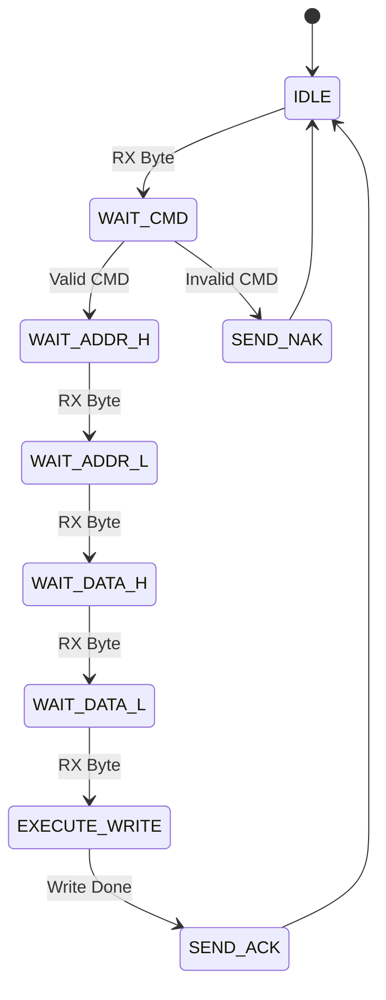
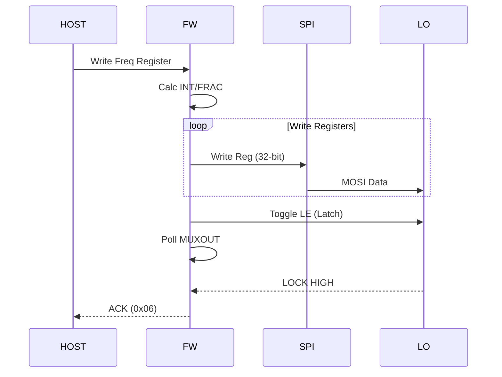
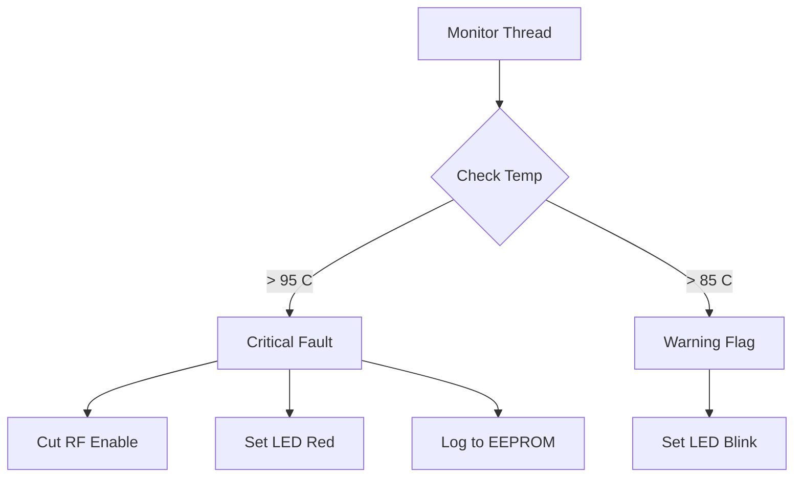
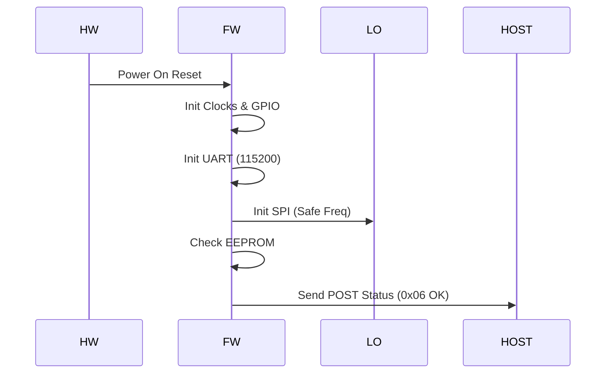
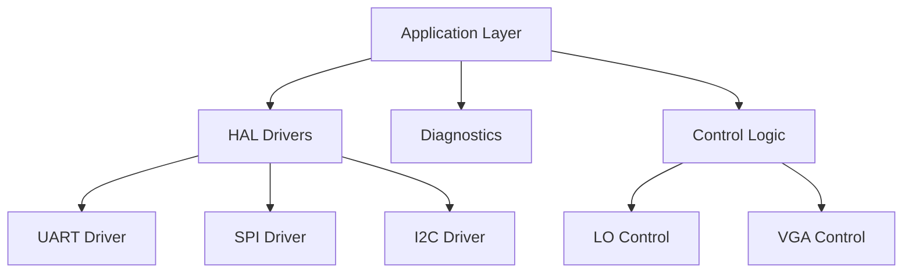

# Software Requirements Specification (SRS)

**Project:** JHF Wideband RF Receiver Firmware
**Version:** 1.0
**Date:** 17 April 2026
**Author:** Senior Software Architect

---

## Document Control

| Version | Date | Author | Changes |
|---------|------|--------|---------|
| 1.0 | 17 April 2026 | System Architect | Initial Release compliant with IEEE 29148:2018 |

---

# 1. Introduction

## 1.1 Purpose
This Software Requirements Specification (SRS) defines the comprehensive software requirements for the **JHF Wideband RF Receiver** (Project JHF) firmware running on the XC7A35T Artix-7 FPGA. This document specifies the "Level 3 — Software Requirements" as defined by IEEE 29148:2018.

The software described herein is responsible for:
1.  Managing the control interface between the host system and the RF hardware via UART.
2.  Configuring the Local Oscillator (ADF5356) and Variable Gain Amplifier (HMC698LP4) via SPI.
3.  Monitoring system health (temperature, voltage, current) via I2C.
4.  Ensuring the system meets strict MIL-STD environmental and performance standards.

This document will be used by firmware engineers to implement the code, by test engineers to verify functionality, and by systems engineers to validate compliance with the Hardware Requirements Specification (HRS) P2 and Glue Logic Requirements (GLR) P6.

## 1.2 Scope
The scope of this software is the embedded firmware executing on the Artix-7 FPGA soft-core or dedicated logic fabric.

**In-Scope:**
*   **Firmware Control Loop:** Handling UART commands from the host.
*   **Driver Abstraction:** HAL for UART, SPI, I2C, and GPIO.
*   **RF Control:** Logic to synthesize frequencies (5–18 GHz) and set gain (≥30 dB range).
*   **Safety:** Monitoring 12V/3.3V rails and die temperature.
*   **Diagnostics:** Power-On Self-Test (POST) and Fault Logging.

**Out-of-Scope:**
*   **RF Signal Processing:** The digitization of the IF signal is handled downstream.
*   **Host Application Software:** The PC-side GUI or driver is defined elsewhere.
*   **FPGA Synthesis Tools:** The specific Xilinx Vivado tool operation is not specified, but the output bitstream behavior is.

## 1.3 Definitions, Acronyms, and Abbreviations

| Term | Definition |
| :--- | :--- |
| **API** | Application Programming Interface |
| **BIST** | Built-In Self-Test |
| **BRAM** | Block RAM (FPGA internal memory) |
| **BSP** | Board Support Package |
| **CMake** | Cross-platform build system generator |
| **Doxygen** | Documentation generator for source code |
| **EEPROM** | Electrically Erasable Programmable Read-Only Memory |
| **FIFO** | First-In, First-Out buffer |
| **FPGA** | Field Programmable Gate Array |
| **FSM** | Finite State Machine |
| **GLR** | Glue Logic Requirements (Project Document P6) |
| **GPIO** | General Purpose Input/Output |
| **HAL** | Hardware Abstraction Layer |
| **HRS** | Hardware Requirements Specification (Project Document P2) |
| **I2C** | Inter-Integrated Circuit (Serial Protocol) |
| **ISR** | Interrupt Service Routine |
| **LSB** | Least Significant Bit |
| **MISRA** | Motor Industry Software Reliability Association (Coding Standard) |
| **MSB** | Most Significant Bit |
| **NACK** | Negative Acknowledge |
| **PCB** | Printed Circuit Board |
| **PLL** | Phase-Locked Loop |
| **POR** | Power-On Reset |
| **POST** | Power-On Self-Test |
| **RF** | Radio Frequency |
| **RTC** | Real-Time Clock (System uptime counter) |
| **RTOS** | Real-Time Operating System (Bare-metal in this context) |
| **Rx** | Receive |
| **SPI** | Serial Peripheral Interface |
| **SRS** | Software Requirements Specification (This document) |
| **SyRS** | System Requirements Specification |
| **Tx** | Transmit |
| **UART** | Universal Asynchronous Receiver/Transmitter |
| **VGA** | Variable Gain Amplifier (HMC698LP4) |
| **WDT** | Watchdog Timer |

## 1.4 References

| ID | Title | Source/Version |
|:---|:---|:---|
| **R01** | IEEE Std 830-1998 | Recommended Practice for Software Requirements Specifications |
| **R02** | ISO/IEC/IEEE 29148:2018 | Systems and software engineering — Life cycle processes — Requirements engineering |
| **R03** | MISRA C:2012 | Guidelines for the Use of the C Language in Critical Systems |
| **R04** | JHF Hardware Requirements Specification (HRS) | Project P2, Rev 1.0 |
| **R05** | JHF Glue Logic Requirements (GLR) | Project P6, Rev 0V01 |
| **R06** | ADF5356 Datasheet | Microwave Wideband Synthesizer w/ Integrated VCO |
| **R07** | HMC698LP4 Datasheet | Digital Variable Gain Amplifier, 6-bit Serial Control |
| **R08** | LTC2992 Datasheet | Dual Current/Voltage Monitor (I2C) |
| **R09** | AD7416 Datasheet | 10-Bit Temperature Sensor & Voltage Monitor (I2C) |
| **R10** | XC7A35T Datasheet | Artix-7 FPGA Family Data Sheet |

## 1.5 Overview
The remainder of this document is organized as follows:
*   **Section 2 (Overall Description):** Provides the product perspective, context diagrams, and high-level functions.
*   **Section 3 (Specific Requirements):** Details the external interfaces and the minimum 75 specific functional software requirements (REQ-SW-001 to REQ-SW-085).
*   **Section 4 (Verification & Validation):** Defines test cases and methods.
*   **Section 5 (Traceability):** Maps software requirements to Hardware Requirements (HRS) and Glue Logic (GLR).
*   **Appendices:** Contains register maps, error codes, and diagrams.

---

# 2. Overall Description

## 2.1 Product Perspective

### System Context
The JHF firmware resides on the **XC7A35T Artix-7 FPGA**. It abstracts the complexity of the RF chain (LNA, Mixer, VGA, LO) from the host system, presenting a simple register-based UART control protocol.

```mermaid
graph TD
    HOST[Host Controller / PC] -->|UART Command/Response| FW[JHF FPGA Firmware]
    
    subgraph JHF_RF_Module
        FW -->|SPI (3-Wire)| LO[ADF5356 Synthesizer]
        FW -->|SPI (Serial)| VGA[HMC698LP4 VGA]
        FW -->|I2C| MON[LTC2992 Power Monitor]
        FW -->|I2C| TEMP[AD7416 Temp Sensor]
        
        subgraph RF_Chain
            LNA[HMC6180 LNA]
            MIX[HMC558 Mixer]
            AMP[ADL5541 Amp]
        end
        
        LO -.->|RF Drive| MIX
        VGA -.->|IF Gain| AMP
    end
```

### Software Stack
The software is architected in three layers:
1.  **Application Layer:** Command parser, state machine, and control logic.
2.  **HAL Layer:** Drivers for UART, SPI, I2C, and GPIO.
3.  **Hardware Layer:** FPGA primitives (UART16550 IP, SPI Master IP, I2C Master IP).

## 2.2 Product Functions
The major software functions include:
1.  **System Initialization:** POR handling, clock stabilization, peripheral bring-up.
2.  **Host Communication:** Processing UART frames (Read/Write/Bulk).
3.  **LO Synthesis:** Calculating and writing INT, FRAC, and MOD registers to ADF5356.
4.  **Gain Control:** Shifting 6-bit gain words into HMC698LP4.
5.  **Health Monitoring:** Polling LTC2992 and AD7416 periodically.
6.  **Fault Management:** Over-temperature or under-voltage detection and mitigation.
7.  **Non-Volatile Storage:** Loading calibration tables from SPI Flash.

## 2.3 User Characteristics
*   **Firmware Engineers:** Use this SRS to implement logic in VHDL/Verilog or C (if soft-core is used).
*   **System Integrators:** Use the register map (Section 3.1.3) to integrate the JHF module into larger arrays.
*   **Test Technicians:** Use UART commands to verify production units.

## 2.4 Constraints
1.  **Timing:** The SPI interface to the ADF5356 must not exceed 20 MHz SCK due to synthesizer setup times.
2.  **Memory:** FPGA BRAM is limited to 1.8 Mb; dynamic memory allocation is prohibited.
3.  **Latency:** UART interrupts must be serviced within 100 µs to prevent RX FIFO overflow.
4.  **Safety:** Software MUST assert RF_SAFE (RF_DISABLE) within 10 ms of detecting a critical fault (Over-temp).
5.  **Standard:** All C code (if applicable) shall adhere to MISRA-C:2012.

## 2.5 Assumptions and Dependencies
1.  The 12V supply ramps up within 50 ms.
2.  The 40 MHz oscillator is stable and jitter-free (< 1 ppm) before the FPGA configuration releases.
3.  The host system implements the UART protocol defined in GLR Section 7.
4.  I2C bus pull-ups are present on the PCB (4.7 kΩ to 3.3V).

---

# 3. Specific Requirements

## 3.1 External Interface Requirements

### 3.1.1 Hardware Interfaces

#### 3.1.1.1 UART Interface (Host Control)
**Protocol:** Asynchronous 8-N-1.
**Baud Rate:** Configurable default 115200 (supported up to 3.0 Mbps).
**Hardware:** FTDI FT2232H mapped to FPGA UART.

**C Register Map Definition:**
```c
/**
 * @brief UART Hardware Register Map
 * Base Address: 0x4000_0000 (Example AXI Base)
 */
typedef struct {
    volatile uint32_t RX_FIFO;   /**< Offset 0x00: Receive FIFO */
    volatile uint32_t TX_FIFO;   /**< Offset 0x04: Transmit FIFO */
    volatile uint32_t STATUS;    /**< Offset 0x08: Status Register (Bit 0: TX_EMPTY, Bit 1: RX_FULL) */
    volatile uint32_t BAUD_DIV; /**< Offset 0x0C: Baud Rate Divisor */
    volatile uint32_t CTRL;      /**< Offset 0x10: Control Register (Bit 0: Enable IRQ) */
} UART_RegMap_t;

/* Driver API Prototypes */
int32_t UART_Init(uint32_t base_addr, uint32_t baud_rate);
int32_t UART_SendByte(uint8_t data);
int32_t UART_ReadByte(uint8_t *data, uint32_t timeout_ms);
```

#### 3.1.1.2 SPI Interface (LO & VGA)
**Protocol:** 3-wire SPI (CLK, MOSI, CS_n).
**Clock Freq:** 10 MHz nominal, 20 MHz max.

**C Register Map Definition:**
```c
/**
 * @brief SPI Master Register Map
 */
typedef struct {
    volatile uint32_t CTRL;    /**< Control: Start, CPHA, CPOL */
    volatile uint32_t STATUS;  /**< Status: TX Done, RX Ready */
    volatile uint32_t TX_DATA; /**< Data to transmit */
    volatile uint32_t RX_DATA; /**< Data received */
    volatile uint32_t CLK_DIV; /**< Clock Divider */
    volatile uint32_t SS;      /**< Slave Select Mask */
} SPI_RegMap_t;

/* Driver API Prototypes */
int32_t SPI_Init(void);
int32_t SPI_WriteRead(uint8_t *tx_buf, uint8_t *rx_buf, uint32_t len);
int32_t ADF5356_WriteRegister(uint32_t reg_data);
int32_t HMC698_WriteGain(uint8_t gain_value);
```

#### 3.1.1.3 I2C Interface (Sensors)
**Protocol:** Standard I2C (100 kHz).
**Pull-ups:** 4.7 kΩ.
**Addressing:** 7-bit addressing.

**C Register Map Definition:**
```c
/**
 * @brief I2C Master Register Map
 */
typedef struct {
    volatile uint32_t CTRL;      /**< Control: Start, Stop, Ack */
    volatile uint32_t STATUS;    /**< Status: Busy, TX Error, RX Ack */
    volatile uint32_t TX_DATA;   /**< Byte to write */
    volatile uint32_t RX_DATA;   /**< Byte read */
    volatile uint32_t CLK_DIV;   /**< SCL divider */
} I2C_RegMap_t;

/* Driver API Prototypes */
int32_t I2C_Init(void);
int32_t I2C_WriteByte(uint8_t dev_addr, uint8_t reg_addr, uint8_t data);
int32_t I2C_ReadByte(uint8_t dev_addr, uint8_t reg_addr, uint8_t *data);
```

### 3.1.2 Software Interfaces
*   **Standard Library:** Standard C library (stdC) shall be used via the toolchain compiler (e.g., arm-none-eabi-gcc or integrated Vivado SDK lib).
*   **Logging:** Internal logging writes to a circular buffer in BRAM.

### 3.1.3 Communication Interfaces (UART Protocol Specification)

The firmware implements a register-based command protocol over UART. The host acts as Master, JHF Firmware acts as Slave.

**Frame Formats:**

| Command | CMD Byte | Frame Structure | Response |
| :--- | :--- | :--- | :--- |
| **Single Write** | 0x57 ('W') | `[0x57][ADDR_H][ADDR_L][DATA_H][DATA_L]` | `[0x06]` (ACK) |
| **Single Read** | 0x52 ('R') | `[0x52][ADDR_H\|0x80][ADDR_L]` | `[DATA_H][DATA_L]` |
| **Bulk Write** | 0x42 ('B') | `[0x42][ADDR_H][ADDR_L][N][D0_H][D0_L]...[Dn_H][Dn_L]` | `[0x06]` (ACK) |
| **Bulk Read** | 0x62 ('b') | `[0x62][ADDR_H\|0x80][ADDR_L][N]` | `[D0_H][D0_L]...[Dn_H][Dn_L]` |
| **Error NAK** | 0x15 | Sent by Firmware on invalid cmd/addr | — |

**Protocol Rules:**
1.  **Address Space:** 16-bit (0x0000–0xFFFF).
2.  **Read Flag:** To read, Bit 15 of the address byte must be set (OR with 0x8000).
3.  **Bulk Count:** `N` is the number of registers (1-64). The firmware increments address automatically for bulk ops.
4.  **Timing:** Inter-byte timeout is 50ms. If timeout occurs, the parser resets.

---

## 3.2 Functional Requirements

### 3.2.1 System Initialization (REQ-SW-001 to REQ-SW-012)

| ID | Requirement Statement | Source | Priority | Verification |
|:---|:---|:---|:---|:---|
| **REQ-SW-001** | The software SHALL perform a Power-On Self-Test (POST) within 200ms of POR release. | HRS REQ-HW-011 | M | T |
| **REQ-SW-002** | The software SHALL initialize the UART peripheral to 115200 baud, 8N1 format, with a 1-second timeout for commands. | GLR §5 | M | T |
| **REQ-SW-003** | The software SHALL configure the SPI master clock to 10 MHz for the ADF5356 LO synthesizer. | GLR §4 | M | D |
| **REQ-SW-004** | The software SHALL initialize the I2C master to 100 kHz standard mode. | GLR §4 | M | T |
| **REQ-SW-005** | The software SHALL verify communication with the LTC2992 power monitor (I2C ACK) before proceeding to application mode. | GLR §5 | M | T |
| **REQ-SW-006** | The software SHALL load default gain settings (Mid-range, 15 dB attenuation) from non-volatile memory into the HMC698LP4. | HRS REQ-HW-010 | M | T |
| **REQ-SW-007** | The software SHALL drive the RGB LED to RED state if POST fails, or GREEN if POST passes. | GLR §5 | M | I |
| **REQ-SW-008** | The software SHALL configure the ADF5356 LO to a safe start-up frequency of 6.0 GHz. | HRS REQ-HW-009 | M | D |
| **REQ-SW-009** | The software SHALL enable the Watchdog Timer (WDT) with a 100ms timeout period immediately after UART init. | HRS REQ-HW-013 | M | T |
| **REQ-SW-010** | The software SHALL place the RF chain in "Safe State" (LNA Bias Off, Mixer Off) on power-up until commanded by host. | HRS REQ-HW-001 | M | D |
| **REQ-SW-011** | The software SHALL initialize the SPI Flash (AT25M01) driver for read access to calibration tables. | GLR §5 | D | T |
| **REQ-SW-012** | The software SHALL set the default state of all GPIO pins to LOW (0x00) to prevent floating inputs. | GLR §5 | M | I |

### 3.2.2 UART Command Processing (REQ-SW-013 to REQ-SW-022)

| ID | Requirement Statement | Source | Priority | Verification |
|:---|:---|:---|:---|:---|
| **REQ-SW-013** | The software SHALL implement a UART ISR that stores received bytes in a 256-byte circular FIFO. | GLR §5 | M | A |
| **REQ-SW-014** | The software SHALL parse the Command Byte (CMD) and verify it is one of {0x57, 0x52, 0x42, 0x62}. | GLR §7 | M | T |
| **REQ-SW-015** | The software SHALL process Single Write commands (0x57) and write the 16-bit data payload to the target register. | GLR §7 | M | T |
| **REQ-SW-016** | The software SHALL respond with ACK (0x06) within 1ms of receiving a valid Single Write frame. | GLR §7 | M | T |
| **REQ-SW-017** | The software SHALL process Single Read commands (0x52) and transmit the 16-bit register contents MSB first. | GLR §7 | M | T |
| **REQ-SW-018** | The software SHALL process Bulk Write commands (0x42) for N registers, where N ≤ 64. | GLR §7 | M | T |
| **REQ-SW-019** | The software SHALL respond with NAK (0x15) if the calculated frame length exceeds the FIFO buffer size. | GLR §7 | M | T |
| **REQ-SW-020** | The software SHALL reset the command parser state machine if 50ms passes without receiving a complete frame. | GLR §7 | M | T |
| **REQ-SW-021** | The software SHALL implement a register write protection scheme for "System Control" registers (0x8000 range). | HRS REQ-HW-014 | M | I |
| **REQ-SW-022** | The software SHALL ignore read/write commands addressed to reserved memory locations (0x0000-0x0FFF). | GLR §10 | M | I |

### 3.2.3 Frequency Synthesis Control (REQ-SW-023 to REQ-SW-032)

| ID | Requirement Statement | Source | Priority | Verification |
|:---|:---|:---|:---|:---|
| **REQ-SW-023** | The software SHALL calculate the ADF5356 INT, FRAC, and MOD values when host writes to the LO_FREQ_REGISTER (32-bit Hz). | HRS REQ-HW-001 | M | T |
| **REQ-SW-024** | The software SHALL write the calculated INT/FRAC registers to the ADF5356 via SPI using 32-bit transactions. | GLR §4 | M | D |
| **REQ-SW-025** | The software SHALL assert the ADF5356 MUXOUT pin to monitor the Lock Detect signal via FPGA GPIO. | GLR §4 | M | I |
| **REQ-SW-026** | The software SHALL poll the LOCK_DET bit in the STATUS_REGISTER; if not locked within 100ms, set FAULT_PLL bit. | HRS REQ-HW-008 | M | T |
| **REQ-SW-027** | The software SHALL verify the LO frequency is within the range 5.0 GHz to 18.0 GHz before enabling the RF output. | HRS REQ-HW-001 | M | A |
| **REQ-SW-028** | The software shall support frequency step sizes of 1 MHz or less as per ADF5356 capabilities. | HRS REQ-HW-001 | D | A |
| **REQ-SW-029** | The software SHALL apply the "Autocalibration" sequence to the ADF5356 VCO upon frequency change. | ADF5356 Datasheet | M | D |
| **REQ-SW-030** | The software SHALL disable the RF output path immediately if the PLL loses lock during operation. | HRS REQ-HW-008 | M | T |
| **REQ-SW-031** | The software SHALL store the last 10 configured frequencies in a history buffer in EEPROM. | GLR §5 | D | T |
| **REQ-SW-032** | The software SHALL restore the previous frequency setting on reboot if the SYSTEM_CONFIG register has PERSIST_BIT set. | GLR §5 | O | T |

### 3.2.4 Gain Control Interface (REQ-SW-033 to REQ-SW-038)

| ID | Requirement Statement | Source | Priority | Verification |
|:---|:---|:---|:---|:---|
| **REQ-SW-033** | The software SHALL accept a 6-bit gain setting (0-63) via the VGA_GAIN_REGISTER. | HRS REQ-HW-010 | M | T |
| **REQ-SW-034** | The software SHALL shift the 6-bit gain data into the HMC698LP4 using the CLK, DATA, and LE protocol. | GLR §4 | M | D |
| **REQ-SW-035** | The software SHALL verify the gain setting results in a gain change of ≥ 30 dB range across the full scale. | HRS REQ-HW-010 | M | T |
| **REQ-SW-036** | The software SHALL update the VGA gain within 10 µs of receiving the register write command. | HRS REQ-HW-010 | M | T |
| **REQ-SW-037** | The software SHALL store gain trim values (calibration offsets) in SPI Flash and apply them to the requested gain. | GLR §5 | D | T |
| **REQ-SW-038** | The software SHALL clamp the gain value to a maximum safe limit (e.g., 0dB attenuation) to prevent overdrive. | HRS REQ-HW-002 | M | A |

### 3.2.5 Monitoring and Diagnostics (REQ-SW-039 to REQ-SW-060)

| ID | Requirement Statement | Source | Priority | Verification |
|:---|:---|:---|:---|:---|
| **REQ-SW-039** | The software SHALL read the LTC2992 voltage monitor every 100ms via I2C. | GLR §5 | M | T |
| **REQ-SW-040** | The software SHALL check if the 12V supply (V1_IN) drops below 11.0V (Undervoltage). | HRS REQ-HW-006 | M | T |
| **REQ-SW-041** | The software SHALL check if the 12V supply exceeds 13.2V (Overvoltage). | HRS REQ-HW-006 | M | T |
| **REQ-SW-042** | The software SHALL trigger a hardware latch-off (via GPIO) if V1_IN exceeds absolute max rating (14V). | HRS REQ-HW-006 | M | T |
| **REQ-SW-043** | The software SHALL read the AD7416 temperature sensor every 500ms. | GLR §5 | M | T |
| **REQ-SW-044** | The software SHALL assert the TEMP_WARNING flag if internal temperature > +85°C. | HRS REQ-HW-011 | M | T |
| **REQ-SW-045** | The software SHALL assert the TEMP_CRITICAL flag and disable RF if internal temperature > +95°C. | HRS REQ-HW-011 | M | T |
| **REQ-SW-046** | The software SHALL calculate current consumption (I = V / R_sense) via LTC2992 ADC readings. | GLR §5 | M | A |
| **REQ-SW-047** | The software SHALL assert CURRENT_FAULT if total current > 600 mA. | HRS REQ-HW-007 | M | T |
| **REQ-SW-048** | The software SHALL blink the LED at 2Hz if any WARNING flag is set (Temp/Volt). | GLR §5 | D | I |
| **REQ-SW-049** | The software SHALL turn the LED solid RED if any CRITICAL fault is set. | GLR §5 | M | I |
| **REQ-SW-050** | The software SHALL log the timestamp (uptime seconds) and error code of any fault to a non-volatile log. | HRS REQ-HW-013 | D | T |
| **REQ-SW-051** | The software SHALL maintain a minimum of 64 log entries in EEPROM using a circular buffer. | GLR §5 | D | I |
| **REQ-SW-052** | The software SHALL implement a "Clear Fault" UART command that resets latched errors but only if input conditions are safe. | GLR §7 | D | T |
| **REQ-SW-053** | The software SHALL provide a unique error code for each failure type (PLL Unlock, Overtemp, Voltage). | HRS REQ-HW-013 | M | I |
| **REQ-SW-054** | The software SHALL monitor the SPI bus traffic; if no valid commands received for 5 seconds, enter "Idle Mode" (Low Power). | HRS REQ-HW-006 | O | D |
| **REQ-SW-055** | The software SHALL perform a read-back of the ADF5356 registers to verify write integrity. | HRS REQ-HW-012 | M | T |
| **REQ-SW-056** | The software SHALL compare the AD7416 device ID (0x07) at I2C address 0x48 during init. | GLR §5 | M | T |
| **REQ-SW-057** | The software SHALL expose the raw ADC values (Voltage/Current) in the diagnostic register map. | GLR §7 | M | T |
| **REQ-SW-058** | The software SHALL calculate the RF power estimate based on VGA gain and IF detector voltage (if available). | HRS REQ-HW-002 | O | A |
| **REQ-SW-059** | The software SHALL support a software reset (Soft-Reboot) via UART command 0xDEADBEEF. | GLR §7 | D | T |
| **REQ-SW-060** | The software SHALL implement a heartbeat counter that increments every 10ms, readable by the host. | GLR §7 | M | I |

### 3.2.6 Memory and Non-Volatile Storage (REQ-SW-061 to REQ-SW-068)

| ID | Requirement Statement | Source | Priority | Verification |
|:---|:---|:---|:---|:---|
| **REQ-SW-061** | The software SHALL read the Board ID (serial number) from the AT25M01 EEPROM at address 0x00 on boot. | GLR §5 | M | T |
| **REQ-SW-062** | The software SHALL verify the Board ID checksum is valid; if invalid, set BOARD_ID_ERROR. | GLR §5 | M | T |
| **REQ-SW-063** | The software SHALL allow the host to write calibration data to the EEPROM sector starting at 0x1000. | GLR §5 | D | T |
| **REQ-SW-064** | The software SHALL implement a wear-leveling algorithm for EEPROM writes if the frequency is > 1 per minute. | GLR §5 | O | A |
| **REQ-SW-065** | The software SHALL lock the EEPROM write status bit after 10 successful writes to prevent bus hanging. | GLR §5 | D | I |
| **REQ-SW-066** | The software SHALL map the 4KB SPI Flash contents to a virtual register space for host read access. | GLR §7 | O | T |
| **REQ-SW-067** | The software SHALL protect the bootloader sector (0x00-0x0FFF) from erase/write commands. | GLR §5 | M | T |
| **REQ-SW-068** | The software SHALL implement a CRC-16 check on all configuration data loaded from EEPROM. | HRS REQ-HW-012 | M | T |

### 3.2.7 Power Management (REQ-SW-069 to REQ-SW-075)

| ID | Requirement Statement | Source | Priority | Verification |
|:---|:---|:---|:---|:---|
| **REQ-SW-069** | The software SHALL assert the ENABLE_3V3 rail only after the 12V input is stable. | GLR §4 | M | T |
| **REQ-SW-070** | The software SHALL control the LM2991 -5V regulator enable pin via GPIO during power sequencing. | GLR §4 | M | I |
| **REQ-SW-071** | The software SHALL implement a "Sleep Mode" where the LO and VGA are powered down, but the monitor remains active. | HRS REQ-HW-006 | O | T |
| **REQ-SW-072** | The software SHALL draw less than 50mA in "Sleep Mode". | HRS REQ-HW-007 | O | T |
| **REQ-SW-073** | The software SHALL wake from "Sleep Mode" within 20ms of a UART edge detection. | HRS REQ-HW-006 | O | T |
| **REQ-SW-074** | The software SHALL monitor the 3.3V rail drop; if < 3.0V, trigger immediate brownout reset. | GLR §4 | M | T |
| **REQ-SW-075** | The software SHALL log the total power-on time (hours) to EEPROM every 1 hour. | HRS REQ-HW-011 | D | T |

---

## 3.3 Performance Requirements

| ID | Requirement | Metric | Verification |
|:---|:---|:---|:---|
| **REQ-PERF-001** | UART Command Response Time | ≤ 2 ms from Frame End to ACK | T |
| **REQ-PERF-002** | Frequency Tuning Speed | ≤ 10 ms from SPI Write to Lock Detect | T |
| **REQ-PERF-003** | Gain Update Speed | ≤ 20 µs from Register Write to SPI Complete | T |
| **REQ-PERF-004** | Fault Detection Latency | ≤ 10 ms from physical event to flag set | T |
| **REQ-PERF-005** | SPI Throughput | ≥ 1 Mbps (System) | A |
| **REQ-PERF-006** | I2C Polling Rate | 100 ms (Voltage), 500 ms (Temp) | I |
| **REQ-PERF-007** | Boot Time | ≤ 200 ms from 3.3V stable to UART Ready | T |
| **REQ-PERF-008** | Watchdog Accuracy | ±5% of programmed timeout | A |

## 3.4 Design Constraints

1.  **MISRA Compliance:** All firmware source code (C/C++) shall comply with MISRA-C:2012 mandatory rules.
2.  **Dynamic Memory:** Use of `malloc`, `free`, or `new` is strictly prohibited.
3.  **Compiler:** GNU ARM Embedded or Xilinx Vitis compiler.
4.  **Integer Size:** The firmware shall explicitly use `stdint.h` types (e.g., `uint32_t`) for all hardware register access.
5.  **Resource Usage:** Total FPGA resource usage shall not exceed 80% of LUTs/FFs to allow for future expansion.
6.  **Clock Domain Crossing:** All signals crossing between the 40 MHz system clock and the UART/SPI clocks must use synchronizers (2-stage flop).

## 3.5 Software System Attributes

### 3.5.1 Reliability
*   The firmware shall achieve an MTBF (Mean Time Between Failures) of 10,000 hours in the defined environment.
*   The system shall recover from a Single Event Upset (SEU) via watchdog reset within 100ms.

### 3.5.2 Availability
*   System availability target: 99.9%.
*   The UART interface shall be available for command processing within 200ms of power-up.

### 3.5.3 Security
*   The firmware shall validate the register address range (0x0000-0xFFFF) before performing any write operation to prevent memory corruption.
*   Firmware updates via SPI Flash shall include a CRC-32 validation check before applying the new image.

### 3.5.4 Maintainability
*   Code shall be modularized by function (UART.c, SPI.c, I2C.c, APP.c).
*   Cyclomatic complexity of any function shall not exceed 10.

### 3.5.5 Portability
*   Hardware abstraction layers (HAL) shall be used to isolate the application logic from Xilinx-specific IP blocks.
*   The code shall be compilable for both the JHF hardware (Artix-7) and a simulation testbench (ModelSim/Questa).

---

# 4. Verification and Validation

## 4.1 Unit Test Requirements
*   **Test Case UT-001:** Verify `ADF5356_WriteRegister` writes correct bit patterns to SPI bus.
*   **Test Case UT-002:** Verify `UART_Parser` rejects invalid command bytes (e.g., 0xFF) and sends NAK.
*   **Test Case UT-003:** Verify `I2C_ReadByte` handles NACK from slave gracefully.

## 4.2 Integration Test Requirements
*   **Test Case IT-001:** Host sends Single Write (0x57) to change Frequency; verify PLL lock and LO output.
*   **Test Case IT-002:** Host triggers Overtemp simulation; verify RF cuts off and WARNING flag sets.
*   **Test Case IT-003:** Verify 12V drop to 10.5V causes UVLO assertion.

## 4.3 System Test Requirements
*   **Test Case ST-001:** Environmental Chamber test (-40°C to +85°C). Verify startup and functionality at extremes.
*   **Test Case ST-002:** MIL-STD-461 EMC test. Verify no UART corruption during radiated susceptibility.
*   **Test Case ST-003:** 72-hour continuous operation burn-in.

---

# 5. Requirements Traceability Matrix

| REQ-SW-xxx | Description | Traces To (REQ-HW/GLR) | Priority |
|:---|:---|:---|:---|
| REQ-SW-001 | POST Execution < 200ms | HRS REQ-HW-011 | M |
| REQ-SW-002 | UART Init 115200 8N1 | GLR §5 | M |
| REQ-SW-003 | SPI Clock 10 MHz | GLR §4 | M |
| REQ-SW-004 | I2C Init 100 kHz | GLR §4 | M |
| REQ-SW-005 | I2C LTC2992 Check | GLR §5 | M |
| REQ-SW-006 | Load Default Gain | HRS REQ-HW-010 | M |
| REQ-SW-007 | LED Status (Red/Green) | GLR §5 | M |
| REQ-SW-008 | Default Freq 6.0 GHz | HRS REQ-HW-009 | M |
| REQ-SW-009 | WDT Enable 100ms | HRS REQ-HW-013 | M |
| REQ-SW-010 | RF Safe State on Boot | HRS REQ-HW-001 | M |
| REQ-SW-011 | SPI Flash Init | GLR §5 | D |
| REQ-SW-012 | GPIO Default LOW | GLR §5 | M |
| REQ-SW-013 | UART ISR & FIFO | GLR §5 | M |
| REQ-SW-014 | CMD Validation | GLR §7 | M |
| REQ-SW-015 | Single Write (0x57) | GLR §7 | M |
| REQ-SW-016 | ACK Response < 1ms | GLR §7 | M |
| REQ-SW-017 | Single Read (0x52) | GLR §7 | M |
| REQ-SW-018 | Bulk Write (0x42) | GLR §7 | M |
| REQ-SW-019 | NAK on Overflow | GLR §7 | M |
| REQ-SW-020 | Parser Timeout 50ms | GLR §7 | M |
| REQ-SW-021 | Reg Write Protect | HRS REQ-HW-014 | M |
| REQ-SW-022 | Reserved Mem Ignore | GLR §10 | M |
| REQ-SW-023 | Freq Calculation | HRS REQ-HW-001 | M |
| REQ-SW-024 | ADF5356 SPI Write | GLR §4 | M |
| REQ-SW-025 | MUXOUT Lock Detect | GLR §4 | M |
| REQ-SW-026 | Poll Lock Status | HRS REQ-HW-008 | M |
| REQ-SW-027 | Range Check 5-18 GHz | HRS REQ-HW-001 | M |
| REQ-SW-028 | Step Size 1 MHz | HRS REQ-HW-001 | D |
| REQ-SW-029 | Autocalibration | Datasheet | M |
| REQ-SW-030 | RF Cut on Loss | HRS REQ-HW-008 | M |
| REQ-SW-031 | Freq History (EEPROM) | GLR §5 | D |
| REQ-SW-032 | Persist Freq | GLR §5 | O |
| REQ-SW-033 | Gain 6-bit Input | HRS REQ-HW-010 | M |
| REQ-SW-034 | HMC698 SPI Write | GLR §4 | M |
| REQ-SW-035 | Gain Range 30 dB | HRS REQ-HW-010 | M |
| REQ-SW-036 | Gain Update 10us | HRS REQ-HW-010 | M |
| REQ-SW-037 | Gain Trim (Flash) | GLR §5 | D |
| REQ-SW-038 | Gain Clamp | HRS REQ-HW-002 | M |
| REQ-SW-039 | LTC2992 Read 100ms | GLR §5 | M |
| REQ-SW-040 | UVLO < 11.0V | HRS REQ-HW-006 | M |
| REQ-SW-041 | OVLO > 13.2V | HRS REQ-HW-006 | M |
| REQ-SW-042 | Latchoff > 14V | HRS REQ-HW-006 | M |
| REQ-SW-043 | AD7416 Read 500ms | GLR §5 | M |
| REQ-SW-044 | Temp Warning > 85C | HRS REQ-HW-011 | M |
| REQ-SW-045 | Temp Crit > 95C | HRS REQ-HW-011 | M |
| REQ-SW-046 | Current Calc | GLR §5 | M |
| REQ-SW-047 | Current Fault 600mA | HRS REQ-HW-007 | M |
| REQ-SW-048 | LED Blink Warn | GLR §5 | D |
| REQ-SW-049 | LED Solid Red | GLR §5 | M |
| REQ-SW-050 | Fault Log | HRS REQ-HW-013 | D |
| REQ-SW-051 | Log 64 Entries | GLR §5 | D |
| REQ-SW-052 | Clear Fault Cmd | GLR §7 | D |
| REQ-SW-053 | Unique Err Codes | HRS REQ-HW-013 | M |
| REQ-SW-054 | Idle Mode 5s | HRS REQ-HW-006 | O |
| REQ-SW-055 | Readback Verify | HRS REQ-HW-012 | M |
| REQ-SW-056 | DevID Check | GLR §5 | M |
| REQ-SW-057 | Expose Raw ADC | GLR §7 | M |
| REQ-SW-058 | RF Power Est | HRS REQ-HW-002 | O |
| REQ-SW-059 | Soft Reboot | GLR §7 | D |
| REQ-SW-060 | Heartbeat | GLR §7 | M |
| REQ-SW-061 | Read Serial EEPROM | GLR §5 | M |
| REQ-SW-062 | Serial ID Checksum | GLR §5 | M |
| REQ-SW-063 | Write Cal Data | GLR §5 | D |
| REQ-SW-064 | Wear Level | GLR §5 | O |
| REQ-SW-065 | Lock Status | GLR §5 | D |
| REQ-SW-066 | Virtual Flash Map | GLR §7 | O |
| REQ-SW-067 | Boot Protect | GLR §5 | M |
| REQ-SW-068 | EEPROM CRC | HRS REQ-HW-012 | M |
| REQ-SW-069 | 3V3 Seq Control | GLR §4 | M |
| REQ-SW-070 | -5V Control | GLR §4 | M |
| REQ-SW-071 | Sleep Mode | HRS REQ-HW-006 | O |
| REQ-SW-072 | Sleep I < 50mA | HRS REQ-HW-007 | O |
| REQ-SW-073 | Wake < 20ms | HRS REQ-HW-006 | O |
| REQ-SW-074 | Brownout 3.0V | GLR §4 | M |
| REQ-SW-075 | Uptime Log | HRS REQ-HW-011 | D |

---

# 6. Appendices

## Appendix A: Error Codes
```c
typedef enum {
    ERR_NONE             = 0x00,
    ERR_UART_FRAME       = 0x01,
    ERR_UART_OVERFLOW    = 0x02,
    ERR_CMD_INVALID      = 0x03,
    ERR_ADDR_INVALID     = 0x04,
    ERR_I2C_NACK         = 0x10,
    ERR_I2C_TIMEOUT      = 0x11,
    ERR_TEMP_HIGH        = 0x20,
    ERR_TEMP_CRITICAL    = 0x21,
    ERR_VOLT_LOW         = 0x30,
    ERR_VOLT_HIGH        = 0x31,
    ERR_PLL_UNLOCK       = 0x40,
    ERR_EEPROM_FAIL      = 0x50,
    ERR_FLASH_CRC        = 0x51
} ErrorCode_t;
```

## Appendix B: Register Map Summary

| Base Addr | Name | Access | Description |
|:---|:---|:---|:---|
| 0x0000 | REG_FW_VERSION | R | Firmware Version (Major.Minor) |
| 0x0001 | REG_STATUS | R | Status Flags (Bit0: Lock, Bit1: TempWarn) |
| 0x0002 | REG_FAULT | R | Latched Fault Codes |
| 0x0003 | REG_LO_FREQ_H | W | LO Frequency 31:16 (Hz) |
| 0x0004 | REG_LO_FREQ_L | W | LO Frequency 15:0 (Hz) |
| 0x0005 | REG_VGA_GAIN | W | VGA Gain Setting (0-63) |
| 0x0006 | REG_CONTROL | RW | Control Bits (Bit0: RF_Enable) |
| 0x0010 | REG_VOLTAGE_12V | R | ADC Reading 12V |
| 0x0011 | REG_CURRENT_MA | R | ADC Reading Current |
| 0x0012 | REG_TEMP_BOARD | R | Temp Sensor (C) |

## Appendix C: Mermaid Diagrams

### C1: UART Driver State Machine


### C2: Frequency Tuning Sequence


### C3: Fault Handling Flow


### C4: System Initialization


### C5: Software Architecture
