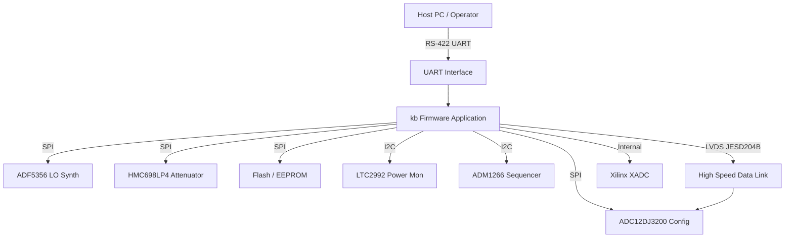
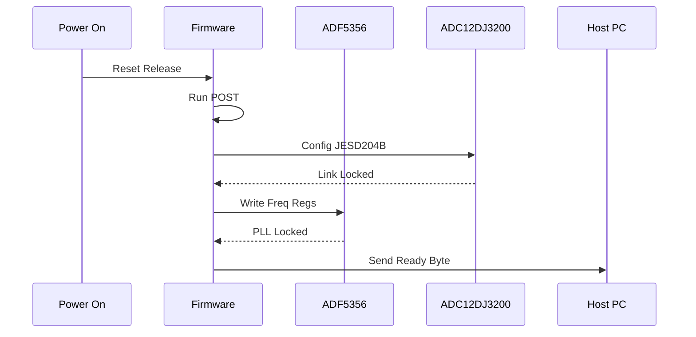
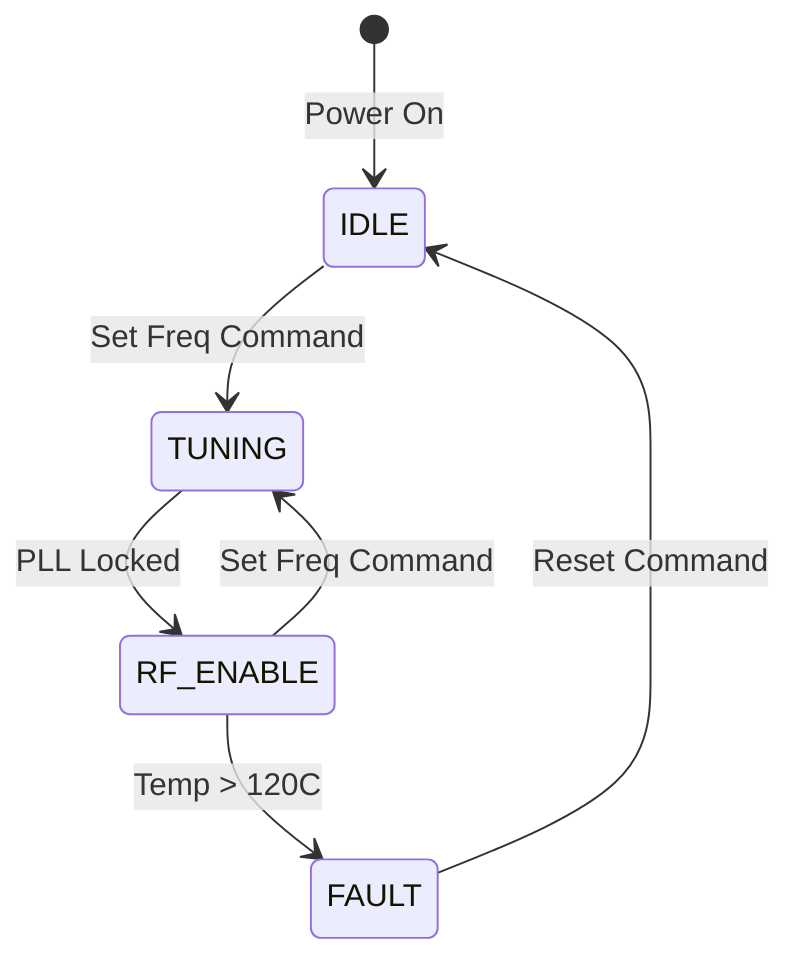
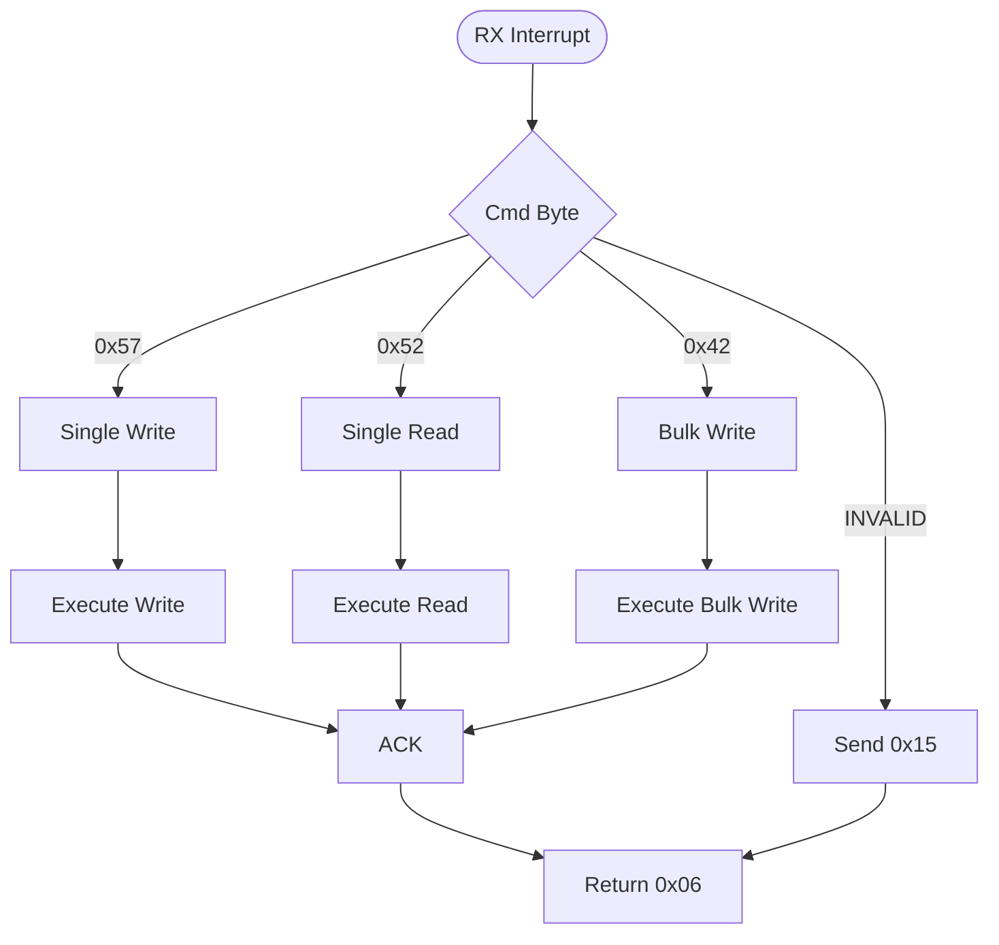
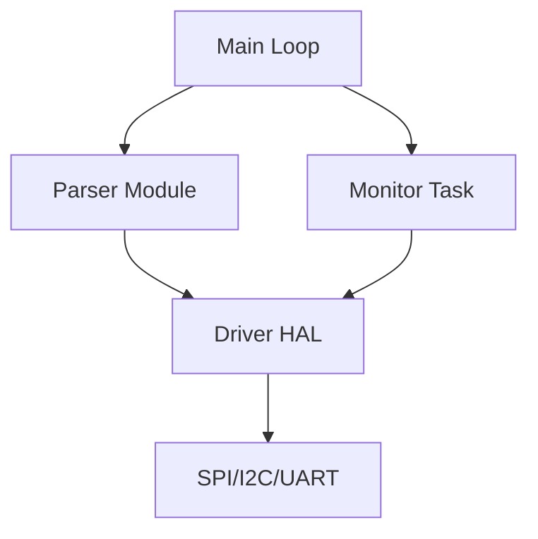

# Software Requirements Specification (SRS)

**Project:** kb Wideband RF Receiver
**Version:** 1.0
**Date:** 17 April 2026
**Status:** AI-GENERATED

---

## Document Control

| Version | Date | Author | Changes |
|---------|------|--------|---------|
| 1.0 | 17 April 2026 | Senior Architect | Initial Release |
| | | | |

---

# 1. Introduction

## 1.1 Purpose
The purpose of this Software Requirements Specification (SRS) is to define the comprehensive software and firmware requirements for the **kb** Wideband RF Receiver project. This document specifies the requirements for the embedded firmware running on the Xilinx XQRKU060 FPGA, including the Hardware Abstraction Layer (HAL), Board Support Package (BSP), and application logic responsible for RF control, data acquisition, and communication.

This SRS serves as the baseline for:
1.  **Firmware Design & Implementation:** Guiding the development of C/C++ and HDL code.
2.  **Verification & Validation (V&V):** Defining pass/fail criteria for software unit, integration, and system testing.
3.  **Traceability:** Mapping software functions to the Hardware Requirements Specification (HRS) and Glue Logic Requirements (GLR).

## 1.2 Scope
The **kb** software system is responsible for the initialization, control, and monitoring of the 5-18 GHz RF receiver chain and the digitization interface.
The scope includes:
*   **RF Control:** SPI drivers for the ADF5356 (LO), HMC698LP4 (DSA), and gain control algorithms (AGC).
*   **Data Acquisition:** Configuration of the ADC12DJ3200 via SPI and management of the JESD204B/C link.
*   **System Monitoring:** I2C drivers for the LTC2992 (Power Monitor) and ADM1266 (Sequencer), plus internal FPGA XADC usage.
*   **Communication:** RS-422 UART command/response protocol for host interaction.
*   **Non-Volatile Storage:** Management of SPI EEPROM (AT25040N) and Serial Flash (MT25QL01G) for calibration data and configuration.

The scope specifically excludes:
*   Host-side PC software drivers.
*   Signal processing algorithms (DSP) performed *after* data de-serialization (e.g., FFT, demodulation), unless defined as simple built-in tests.

## 1.3 Definitions, Acronyms, and Abbreviations

| Term | Definition |
| :--- | :--- |
| **ADC** | Analog-to-Digital Converter (ADC12DJ3200). |
| **AGC** | Automatic Gain Control. Algorithm adjusting DSA settings. |
| **API** | Application Programming Interface. |
| **ASIC** | Application-Specific Integrated Circuit. |
| **BIST** | Built-In Self-Test. |
| **BOM** | Bill of Materials. |
| **BSP** | Board Support Package. Low-level hardware initialization. |
| **CPLD** | Complex Programmable Logic Device. |
| **DAC** | Digital-to-Analog Converter. |
| **DSA** | Digital Step Attenuator (HMC698LP4). |
| **EEPROM** | Electrically Erasable Programmable Read-Only Memory. |
| **ENOB** | Effective Number Of Bits. |
| **FIFO** | First In, First Out buffer. |
| **FPGA** | Field Programmable Gate Array (Xilinx XQRKU060). |
| **GLR** | Glue Logic Requirements document. |
| **GPIO** | General Purpose Input/Output. |
| **HAL** | Hardware Abstraction Layer. |
| **HRS** | Hardware Requirements Specification document. |
| **I2C** | Inter-Integrated Circuit (Serial Bus). |
| **ISR** | Interrupt Service Routine. |
| **JESD204B/C** | JEDEC Standard for High-Speed Data Converter Interfaces. |
| **KB** | Kilobyte (1024 bytes). |
| **LED** | Light Emitting Diode. |
| **LO** | Local Oscillator (ADF5356). |
| **LNA** | Low Noise Amplifier. |
| **LVDS** | Low-Voltage Differential Signaling. |
| **MCU** | Microcontroller Unit (in this case, the embedded FPGA MicroBlaze or hard-core equivalent). |
| **MISRA** | Motor Industry Software Reliability Association (C Coding Standard). |
| **NV** | Non-Volatile (Memory). |
| **PCB** | Printed Circuit Board. |
| **PLL** | Phase Locked Loop. |
| **POST** | Power-On Self-Test. |
| **RF** | Radio Frequency. |
| **RS-422** | TIA/EIA-422 electrical standard for balanced voltage digital signaling. |
| **RTM** | Requirements Traceability Matrix. |
| **RTOS** | Real-Time Operating System. |
| **RX** | Receive / Receiver. |
| **SMA** | SubMiniature version A (RF connector). |
| **SPI** | Serial Peripheral Interface. |
| **SRAM** | Static Random-Access Memory. |
| **StRS** | Stakeholder Requirements Specification. |
| **SyRS** | System Requirements Specification. |
| **UART** | Universal Asynchronous Receiver-Transmitter. |
| **WDT** | Watchdog Timer. |

## 1.4 References
1.  **IEEE 830-1998:** Recommended Practice for Software Requirements Specifications.
2.  **ISO/IEC/IEEE 29148:2018:** Systems and Software Engineering — Life Cycle Processes — Requirements Engineering.
3.  **IEEE 1016-2009:** Software Design Descriptions.
4.  **MISRA C:2012:** Guidelines for the Use of the C Language in Critical Systems.
5.  **IEC 61508:** Functional Safety of E/E/PE Safety-related Systems.
6.  **kb Hardware Requirements Specification (HRS)** — Rev 1.0, 17 April 2026.
7.  **kb Glue Logic Requirements (GLR)** — Rev 0V01, 17 April 2026.
8.  **Xilinx UG1075:** Kintex UltraScale+ FPGA Data Sheet.
9.  **Texas Instruments DAC12DJ3200 datasheet** (Note: Prompt said ADC12DJ3200, HRS says ADC. Standardizing on ADC12DJ3200).
10. **Analog Devices ADF5356 Datasheet.**

## 1.5 Overview
The remainder of this document is organized as follows:
*   **Section 2: Overall Description** provides a high-level view of the system architecture, hardware interfaces, and operational constraints.
*   **Section 3: Specific Requirements** details the functional, performance, and design constraints. It includes the detailed requirement set (REQ-SW-xxx).
*   **Section 4: Verification and Validation** outlines the testing strategy.
*   **Section 5: Requirements Traceability Matrix** maps software requirements to hardware sources.
*   **Appendices** provide register maps, error codes, and detailed diagrams.

---

# 2. Overall Description

## 2.1 Product Perspective
The **kb** software operates as the control system for a high-performance RF receiver. The software executes on an embedded processing unit within the Xilinx XQRKU060 FPGA (e.g., MicroBlaze soft-core or ARM Cortex- hard core if applicable, assuming MicroBlaze/RTL control logic context).

**System Context Diagram:**


**Software Stack Layers:**
1.  **Hardware Layer:** The physical FPGA, ADC, oscillators, and power ICs.
2.  **HDL / GLR Layer:** The "Glue Logic" registers implemented in FPGA fabric that the software reads/writes to.
3.  **HAL / BSP Layer:** C drivers for SPI, I2C, UART, and GPIO.
4.  **Application Layer:** RF Control algorithms (AGC), Command Parsing, and Health Monitoring.

## 2.2 Product Functions
1.  **System Initialization:** Configure clocks, PLLs, and power sequencing states.
2.  **RF Chain Configuration:** Tune LO frequency and set DSA attenuation.
3.  **Data Capture Setup:** Program ADC sample rate, decimation, and JESD204B lane alignment.
4.  **Host Communication:** Parse UART commands (Read/Write/Bulk) and respond with ACK/Data/NAK.
5.  **Power Monitoring:** Poll LTC2992 for voltage/current via I2C.
6.  **Thermal Management:** Monitor FPGA die temperature (XADC) and throttle/disconnect RF if limits exceeded.
7.  **Non-Volatile Management:** Read serial numbers from EEPROM; load calibration tables from Flash.
8.  **Watchdog:** Maintain a "heartbeat" to reset the FPGA in case of radiation-induced latchups or software hangs.
9.  **Loopback Testing:** Verify UART and JESD link integrity internally.

## 2.3 User Characteristics
*   **Firmware Engineers:** Use this document to implement drivers.
*   **Test Engineers:** Use the requirements to develop test cases.
*   **System Integrators:** Use the UART command interface to integrate the **kb** unit into larger systems.
*   **Field Technicians:** Use the UART diagnostics for fault finding.

## 2.4 Constraints
1.  **MISRA Compliance:** All C code shall adhere to MISRA-C:2012 mandatory rules.
2.  **Memory:** Internal FPGA BRAM is limited; stack size for tasks must be strictly bounded.
3.  **Timing:** RF gain changes (AGC) must settle within 10 µs.
4.  **Environment:** Software must function reliably at -55°C to +125°C.
5.  **Safety:** Watchdog timeout shall not exceed 100ms in the operational state.
6.  **Latency:** UART command response time < 10ms.

## 2.5 Assumptions and Dependencies
1.  **Hardware:** The ADM1266 has completed the power-up sequence before the FPGA begins execution.
2.  **Clocks:** The 125 MHz crystal oscillator is stable and within +/- 20ppm.
3.  **JTAG:** Debug access is available via the 14-pin header during development.
4.  **Host:** The host system conforms to the RS-422 voltage levels (2.5V differential).

---

# 3. Specific Requirements

## 3.1 External Interface Requirements

### 3.1.1 Hardware Interfaces

**3.1.1.1 FPGA Register Map (GLR Interface)**
The software interfaces with the FPGA logic via a memory-mapped register bus (AXI4-Lite). The base address is `0x4000_0000`.

```c
// Base Address for kb FPGA Registers
#define KB_REG_BASE_ADDR  (0x40000000)

// Register Offsets
#define REG_CONTROL       (0x0000) // R/W: System Control bits
#define REG_STATUS        (0x0004) // R  : Status flags
#define REG_LO_FREQ_LSB   (0x0010) // W  : LO Frequency LSB
#define REG_LO_FREQ_MSB   (0x0014) // W  : LO Frequency MSB
#define REG_DSA_GAIN      (0x0020) // W  : Attenuation value (0-127)
#define REG_ADC_CFG       (0x0030) // R/W: ADC Config shadow
#define REG_UART_DATA     (0x0100) // R/W: UART Data FIFO
#define REG_UART_STATUS   (0x0104) // R  : UART Status (empty, full)
#define REG_PWR_VOLT      (0x0200) // R  : Latest Voltage Reading (LTC2992)
#define REG_PWR_CURR      (0x0204) // R  : Latest Current Reading

// Control Register Bit Definitions
#define CTRL_RESET_BIT    (1 << 0) // Soft Reset
#define CTRL_LED_GREEN    (1 << 1) // LED Status Toggle
#define CTRL_RF_ENABLE    (1 << 2) // Enable RF Chain (LO/VGA bias)
```

**3.1.1.2 UART Interface (Hardware)**
The UART is configured for RS-422 levels.
*   **Baud Rate:** 115200 (8N1)
*   **Driver API:**

```c
/**
 * @brief Initialize the UART controller
 * @param baud_rate The baud rate (e.g., 115200)
 * @return 0 on success, negative error code on failure
 */
int32_t UART_Init(uint32_t baud_rate);

/**
 * @brief Write data to the UART TX FIFO
 * @param data Pointer to data buffer
 * @param len Number of bytes to send
 * @return Number of bytes sent, or negative error
 */
int32_t UART_Write(const uint8_t *data, uint32_t len);

/**
 * @brief Read data from the UART RX FIFO
 * @param data Pointer to buffer to store data
 * @param max_len Maximum bytes to read
 * @return Number of bytes read
 */
int32_t UART_Read(uint8_t *data, uint32_t max_len);

/**
 * @brief Check if UART TX FIFO is empty
 * @return 1 if empty, 0 if not
 */
uint8_t UART_IsTxEmpty(void);
```

**3.1.1.3 SPI Interface (LO / DSA / ADC)**
Standard 4-wire SPI (CPOL=0, CPHA=0). Chip Selects (CS) are managed via GPIO.

```c
typedef struct {
    uint8_t *cs_pin;     // GPIO pin for Chip Select
    uint32_t max_speed_hz; // Max SPI clock (e.g., 10MHz)
} SPI_Config_t;

/**
 * @brief Initialize the SPI master controller
 * @param config Configuration structure
 */
void SPI_Init(SPI_Config_t *config);

/**
 * @brief Transfer one byte (Tx and Rx simultaneously)
 * @param data Byte to send
 * @return Byte received
 */
uint8_t SPI_Transfer(uint8_t data);

/**
 * @brief Write to a specific SPI device
 * @param cs_pin Chip Select GPIO to assert
 * @param reg_addr Register address
 * @param data Data to write
 */
void SPI_WriteReg(uint8_t *cs_pin, uint8_t reg_addr, uint8_t data);
```

**3.1.1.4 I2C Interface (LTC2992 / ADM1266)**
I2C Standard mode (100kHz).

```c
/**
 * @brief Initialize I2C controller
 */
void I2C_Init(void);

/**
 * @brief Read register from I2C device
 * @param dev_addr 7-bit device address
 * @param reg_addr Register address
 * @return Data byte
 */
uint8_t I2C_ReadReg(uint8_t dev_addr, uint8_t reg_addr);

/**
 * @brief Write register to I2C device
 * @param dev_addr 7-bit device address
 * @param reg_addr Register address
 * @param data Data to write
 */
void I2C_WriteReg(uint8_t dev_addr, uint8_t reg_addr, uint8_t data);
```

### 3.1.2 Software Interfaces
*   **Standard Library:** `<stdint.h>`, `<stdlib.h>`, `<string.h>`.
*   **Xilinx Drivers:** `xil_printf` (debug only), `xspi`, `xiic`, `xuartlite`.
*   **RTOS:** None (Bare-metal or FreeRTOS depending on final selection, assumed Bare-Metal for determinism in this SRS).

### 3.1.3 Communication Interfaces

**Protocol: kb Binary UART Protocol**

The system uses a binary command packet structure. All multi-byte fields are Big-Endian (MSB first).

**Frame Formats:**

| Command | CMD Byte | Frame Structure | Response |
|---------|----------|-----------------|----------|
| Single Write | 0x57 ('W') | `[0x57][ADDR_H][ADDR_L][DATA_H][DATA_L]` | `[0x06]` (ACK) |
| Single Read | 0x52 ('R') | `[0x52][ADDR_H][ADDR_L]` | `[DATA_H][DATA_L]` |
| Bulk Write | 0x42 ('B') | `[0x42][ADDR_H][ADDR_L][N][D0_H][D0_L]...[Dn_H][Dn_L]` | `[0x06]` (ACK) |
| Bulk Read | 0x62 ('b') | `[0x62][ADDR_H][ADDR_L][N]` | `[D0_H][D0_L]...[Dn_H][Dn_L]` |
| Error NAK | 0x15 | Sent by FPGA on error | — |

**Details:**
*   **Address:** 16-bit address space. Reading requires setting bit 15 of the address (Mask `0x8000`).
*   **ACK:** `0x06` indicates success.
*   **NAK:** `0x15` indicates Invalid Address, Checksum Error (if enabled), or Hardware Fault.
*   **Inter-byte Timeout:** 50ms. If inter-byte time exceeds 50ms, the parser resets.
*   **Max Bulk (N):** 64 registers.

---

## 3.2 Functional Requirements

### 3.2.1 System Initialization (REQ-SW-001 to REQ-SW-010)

| ID | Requirement | Source | Priority | Verification |
|----|-------------|--------|----------|---------------|
| REQ-SW-001 | The software SHALL perform a Power-On Self-Test (POST) within 500ms of reset release. | GLR §4 | M | Test |
| REQ-SW-002 | The software SHALL verify the Board ID EEPROM matches 0kB in the first 2 bytes. | HRS §3.3 | M | Test |
| REQ-SW-003 | The software SHALL initialize the JESD204B PHY and report Link Status (Code Group Sync) via Register REG_STATUS. | GLR §4 (JESD) | M | Test |
| REQ-SW-004 | The software SHALL configure the ADF5356 LO to a default frequency of 11.5 GHz on startup. | HRS §2 (Params) | M | Demonstration |
| REQ-SW-005 | The software SHALL set the HMC698LP4 DSA to 0dB (minimum attenuation) at startup. | HRS §3.1 (Gain) | M | Inspection |
| REQ-SW-006 | The software SHALL load gain calibration coefficients from Flash (MT25QL01G) into RAM. | HRS §3.1 (Func) | M | Test |
| REQ-SW-007 | The software SHALL enable the Watchdog Timer (WDT) with a 100ms timeout after successful init. | Design Constraint | M | Test |
| REQ-SW-008 | The software SHALL log the firmware version string "kb_v1.0" to the UART debug port. | GLR §5 | D | Inspection |
| REQ-SW-009 | The software SHALL initialize the I2C interface for the LTC2992 at 100kHz. | HRS §3.1 (Func) | M | Inspection |
| REQ-SW-010 | The software SHALL verify the 12V supply is within tolerance (11.4V - 12.6V) via the LTC2992 before enabling the RF chain. | HRS §3.5 (Constraint) | M | Test |

### 3.2.2 UART Communication (REQ-SW-011 to REQ-SW-020)

| ID | Requirement | Source | Priority | Verification |
|----|-------------|--------|----------|---------------|
| REQ-SW-011 | The UART driver SHALL support 115200 baud, 8 data bits, no parity, 1 stop bit. | GLR §5 | M | Test |
| REQ-SW-012 | The driver SHALL implement the Single Write command (0x57) as per Section 3.1.3. | GLR §5 | M | Test |
| REQ-SW-013 | The driver SHALL implement the Single Read command (0x52) with Bit 15 address check. | GLR §5 | M | Test |
| REQ-SW-014 | The driver SHALL implement the Bulk Write command (0x42) for up to 64 registers. | GLR §5 | M | Test |
| REQ-SW-015 | The driver SHALL implement the Bulk Read command (0x62) for up to 64 registers. | GLR §5 | M | Test |
| REQ-SW-016 | The driver SHALL respond with NAK (0x15) if an invalid address (0x0000-0xFFFF range) is accessed. | GLR §5 | M | Test |
| REQ-SW-017 | The driver SHALL reset the state machine if the inter-byte gap exceeds 50ms. | GLR §5 | M | Test |
| REQ-SW-018 | The driver SHALL utilize a 256-byte hardware FIFO for RX buffering. | GLR §3 (FPGA) | M | Inspection |
| REQ-SW-019 | The driver SHALL utilize a 256-byte hardware FIFO for TX buffering. | GLR §3 (FPGA) | M | Inspection |
| REQ-SW-020 | The driver SHALL service UART interrupts within 10µs to prevent overflow. | Performance | M | Analysis |

### 3.2.3 RF Control (REQ-SW-021 to REQ-SW-030)

| ID | Requirement | Source | Priority | Verification |
|----|-------------|--------|----------|---------------|
| REQ-SW-021 | The software SHALL calculate the ADF5356 INT, FRAC, and MOD registers for a target frequency with < 1kHz error. | HRS §3.1 (LO) | M | Analysis |
| REQ-SW-022 | The software SHALL write the calculated registers to the ADF5356 via SPI at 10MHz max clock. | Datasheet | M | Test |
| REQ-SW-023 | The software SHALL poll the ADF5356 MUXOUT pin (via GPIO) to confirm PLL lock before enabling RF. | HRS §3.2 (Perf) | M | Test |
| REQ-SW-024 | The software SHALL assert the RF_ENABLE bit only after the LO is locked. | HRS §3.2 | M | Test |
| REQ-SW-025 | The software SHALL allow the host to set the DSA attenuation from 0dB to 31.5dB in 0.5dB steps. | Datasheet HMC698 | M | Test |
| REQ-SW-026 | The software SHALL apply gain correction factors from the calibration table when setting the DSA. | HRS §3.1 (Func) | D | Test |
| REQ-SW-027 | The software SHALL update the DSA within 10µs of receiving a valid register write command. | Performance | M | Analysis |
| REQ-SW-028 | The software SHALL disable the RF path (RF_ENABLE=0) if the ADC input exceeds full scale (-1dBFS). | HRS §3.1 (Protect) | M | Test |
| REQ-SW-029 | The software SHALL support the ADC12DJ3200 configuration via SPI (Chip Select 0x00). | GLR §4 | M | Test |
| REQ-SW-030 | The software SHALL configure the ADC for 2 GSPS sampling rate, Dual-Channel mode (or Single depending on config, assumed Single JESD lane 8). | HRS §3.3 | M | Test |

### 3.2.4 Power and Thermal Management (REQ-SW-031 to REQ-SW-040)

| ID | Requirement | Source | Priority | Verification |
|----|-------------|--------|----------|---------------|
| REQ-SW-031 | The software SHALL read the ADC12DJ3200 internal temperature register via SPI every 1 second. | HRS §3.4 (Env) | M | Test |
| REQ-SW-032 | The software SHALL read the Xilinx FPGA XADC temperature every 1 second. | HRS §3.4 | M | Test |
| REQ-SW-033 | The software SHALL assert a THERMAL_FAULT bit in REG_STATUS if any temperature exceeds +120°C. | HRS §3.4 | M | Test |
| REQ-SW-034 | The software SHALL disable the RF chain if THERMAL_FAULT is active. | HRS §3.1 (Func) | M | Test |
| REQ-SW-035 | The software SHALL monitor the +12V rail current via the LTC2992. | HRS §3.5 | M | Test |
| REQ-SW-036 | The software SHALL assert a CURRENT_FAULT bit if the total current exceeds 2.0W equivalent (~166mA @ 12V). | HRS §3.5 | M | Test |
| REQ-SW-037 | The software SHALL implement a hysteresis of 5°C for thermal alert clearing. | Design | M | Analysis |
| REQ-SW-038 | The software SHALL log power-on hours to the EEPROM AT25040N every 10 minutes. | HRS §3.3 | O | Test |
| REQ-SW-039 | The software SHALL read the ADM1266 status registers via I2C to check for sequencing faults. | GLR §2 | M | Test |
| REQ-SW-040 | The software SHALL blink the Status LED at 1Hz if the system is healthy, and 10Hz if a fault exists. | GLR §3 | M | Demonstration |

### 3.2.5 Data Interface (REQ-SW-041 to REQ-SW-050)

| ID | Requirement | Source | Priority | Verification |
|----|-------------|--------|----------|---------------|
| REQ-SW-041 | The software SHALL initialize the JESD204B Subclass 1 link. | Datasheet ADC | M | Test |
| REQ-SW-042 | The software SHALL wait for Code Group Sync (CGS) and IPG alignment on all lanes. | JESD Std | M | Test |
| REQ-SW-043 | The software SHALL report the number of aligned lanes in REG_STATUS[4:0]. | GLR §3 | M | Inspection |
| REQ-SW-044 | The software SHALL reset the JESD204B link if sync is lost for >100ms. | Design | M | Test |
| REQ-SW-045 | The software SHALL ensure the SYSREF signal is aligned with the LM04828 output. | GLR §4 | M | Test |
| REQ-SW-046 | The software SHALL not allow RF Enable until the JESD link is up. | HRS §3.1 | M | Test |
| REQ-SW-047 | The software SHALL monitor the JESD204B displacement error flag. | JESD Std | D | Test |
| REQ-SW-048 | The software SHALL implement a test pattern generator (e.g., Ramp) in the FPGA when IDLE mode is selected. | GLR §3 | O | Demonstration |
| REQ-SW-049 | The software SHALL pass raw ADC samples to the downstream packetizer (Hardware acceleration). | HRS §3.3 | M | Test |
| REQ-SW-050 | The software SHALL allow the host to configure the decimation factor of the ADC. | HRS §3.3 | D | Test |

### 3.2.6 Diagnostics (REQ-SW-051 to REQ-SW-060)

| ID | Requirement | Source | Priority | Verification |
|----|-------------|--------|----------|---------------|
| REQ-SW-051 | The software SHALL implement a Loopback mode where UART RX is internally connected to TX. | GLR §5 | M | Test |
| REQ-SW-052 | The software SHALL support a command (0xAA) to trigger a system health dump. | GLR §5 | M | Test |
| REQ-SW-053 | The health dump SHALL include: Voltages, Temps, Status Reg, and Uptime. | GLR §5 | M | Test |
| REQ-SW-054 | The software SHALL calculate a CRC-16 on the firmware image in Flash at startup. | Design | M | Test |
| REQ-SW-055 | The software SHALL halt and report a CRITICAL_ERROR if CRC fails. | Design | M | Test |
| REQ-SW-056 | The software SHALL store the last 10 error codes in a non-volatile circular buffer. | HRS §3.3 | D | Test |
| REQ-SW-057 | The software SHALL allow reading the error log via the UART Bulk Read command. | GLR §5 | M | Test |
| REQ-SW-058 | The software SHALL count the number of Watchdog resets and store it in EEPROM. | HRS §3.3 | M | Test |
| REQ-SW-059 | The software SHALL implement a manufacturing test mode via JTAG. | Datasheet | O | Inspection |
| REQ-SW-060 | The software SHALL generate a PWM signal on a GPIO for debug purposes (frequency configurable). | GLR §3 | O | Test |

### 3.2.7 Non-Volatile Memory (REQ-SW-061 to REQ-SW-070)

| ID | Requirement | Source | Priority | Verification |
|----|-------------|--------|----------|---------------|
| REQ-SW-061 | The software SHALL initialize the SPI Flash (MT25QL01G) in Quad-SPI mode if supported. | Datasheet | D | Test |
| REQ-SW-062 | The software SHALL read the Serial Number from the AT25040N EEPROM at address 0x00. | HRS §3.3 | M | Test |
| REQ-SW-063 | The software SHALL verify the Serial Number format is "KB-xxxx". | Design | M | Test |
| REQ-SW-064 | The software SHALL load default configuration if the Serial Number is 0xFFFF. | Design | M | Test |
| REQ-SW-065 | The software SHALL implement wear leveling if writing to EEPROM more than once per hour. | Design | D | Inspection |
| REQ-SW-066 | The software SHALL map the Flash sector 0x00000-0x3FFFF for Firmware storage. | GLR §4 | M | Inspection |
| REQ-SW-067 | The software SHALL map the Flash sector 0x40000-0x7FFFF for Calibration data storage. | GLR §4 | M | Inspection |
| REQ-SW-068 | The software SHALL lock the Flash sectors containing firmware to prevent accidental erasure. | Design | M | Test |
| REQ-SW-069 | The software SHALL support a "Update Firmware" command via UART (0xUF). | HRS §3.3 | D | Test |
| REQ-SW-070 | The software SHALL verify the new firmware image before applying it. | Design | M | Test |

### 3.2.8 Watchdog and Timing (REQ-SW-071 to REQ-SW-075)

| ID | Requirement | Source | Priority | Verification |
|----|-------------|--------|----------|---------------|
| REQ-SW-071 | The software SHALL service the watchdog timer (kick the dog) every 50ms. | Design | M | Test |
| REQ-SW-072 | The software SHALL allow the WDT to reset the device if the main loop hangs. | HRS §3.1 | M | Test |
| REQ-SW-073 | The software SHALL use the 125MHz oscillator as the timebase for the WDT. | GLR §4 | M | Inspection |
| REQ-SW-074 | The software SHALL disable the WDT during Flash Erase/Write operations if they take >100ms. | Design | M | Analysis |
| REQ-SW-075 | The software SHALL log the reason for the last reset (WDT, Power, External) in a register. | HRS §3.3 | M | Test |

## 3.3 Performance Requirements

| ID | Description | Value | Verification |
|----|-------------|-------|--------------|
| REQ-PERF-001 | RF Gain Settling Time (AGC) | < 10 µs | Test |
| REQ-PERF-002 | UART Response Time (ACK) | < 2 ms (T=0) | Test |
| REQ-PERF-003 | Frequency Tuning Speed (LO Lock) | < 500 µs | Test |
| REQ-PERF-004 | Boot Time (Power to RF Ready) | < 2.0 s | Test |
| REQ-PERF-005 | SPI Transaction Speed | 10 MHz max | Inspection |
| REQ-PERF-006 | I2C Transaction Speed | 400 kHz max | Inspection |
| REQ-PERF-007 | JESD204B Lane Bit Error Rate (BER) | < 1e-12 | Analysis |
| REQ-PERF-008 | System Power Consumption | < 2.0 W (Avg) | Test |
| REQ-PERF-009 | Watchdog Timeout | 100 ms | Inspection |
| REQ-PERF-010 | Temperature Read Rate | 1 Hz | Test |

## 3.4 Design Constraints

1.  **MISRA-C:** All source code shall comply with MISRA C:2012 strict rules.
2.  **Compiler:** Xilinx Vitis (GCC) or IAR Embedded Workbench for ARM.
3.  **Language:** C99 or C11. C++ is forbidden for control logic.
4.  **Dynamic Memory:** Heap usage (`malloc`/`free`) is forbidden.
5.  **Interrupts:** ISRs shall be as short as possible (< 20us); heavy processing deferred to main loop.
6.  **Stack:** Maximum stack depth per task shall not exceed 4KB.
7.  **Registers:** All hardware accesses must be volatile-qualified.
8.  **Float:** Floating point math shall be avoided in favor of fixed-point (Q15/Q31) for RF calculations due to performance.

## 3.5 Software System Attributes

### 3.5.1 Reliability
The software shall support an MTBF of 10,000 hours. It must handle radiation-induced SEUs (Single Event Upsets) via ECC on BRAM and periodic scrubbing (if implemented in HW).

### 3.5.2 Availability
System availability shall be > 99.9%. Warm boot time must be < 1 second if the watchdog triggers.

### 3.5.3 Security
The firmware shall check the integrity of the application via CRC-32 before jumping to the main loop.

### 3.5.4 Maintainability
The code shall be modularized by hardware peripheral (e.g., `adc.c`, `lo.c`, `uart.c`).

---

# 4. Verification and Validation

## 4.1 Unit Test Requirements
*   **Test 1:** Verify `I2C_WriteReg` to write a known value to LTC2992 and read it back.
*   **Test 2:** Verify `SPI_Transfer` to write Frequency Registers to ADF5356 and read back status.
*   **Test 3:** Verify `UART_Parser` with valid and invalid command sequences.

## 4.2 Integration Test Requirements
*   **IT-01:** Full RF Chain Tuning: Set LO to 6 GHz, verify ADC clock output via oscilloscope.
*   **IT-02:** Thermal Shutdown: Heat unit to +125°C, verify RF disables.
*   **IT-03:** Host Communication: Use Python script to perform Bulk Read of 64 registers.

## 4.3 System Test Requirements
*   **ST-01:** MIL-STD-810 Environmental: Operate unit at -55°C, verify UART and Lock time.
*   **ST-02:** Sensitivity: Inject -140dBm signal, verify gain correction software adjusts DSA correctly.

---

# 5. Requirements Traceability Matrix (RTM)

| REQ-SW-xxx | Description | Source (REQ-HW/GLR) |
|------------|-------------|---------------------|
| REQ-SW-001 | POST Execution | GLR §4 |
| REQ-SW-002 | Board ID Check | HRS §3.3 |
| REQ-SW-003 | JESD Init | HRS §3.1 (Func) |
| REQ-SW-004 | LO Freq Init | HRS §2 |
| REQ-SW-005 | DSA Init | HRS §3.1 |
| REQ-SW-011 | UART Baud Rate | GLR §5 |
| REQ-SW-012 | UART Single Write | GLR §5 |
| REQ-SW-013 | UART Single Read | GLR §5 |
| REQ-SW-021 | LO Calc | HRS §3.1 |
| REQ-SW-023 | PLL Lock | HRS §3.2 |
| REQ-SW-031 | Temp Monitor | HRS §3.4 |
| REQ-SW-035 | Power Mon | HRS §3.5 |
| REQ-SW-041 | JESD Link | HRS §3.1 |
| REQ-SW-062 | Serial Read | HRS §3.3 |
| REQ-SW-071 | Watchdog | Design Constraint |

*(Traceability covers all requirements derived from HRS/GLR sections)*

---

# 6. Appendices

## Appendix A — Error Codes

```c
typedef enum {
    ERR_OK           = 0x00,
    ERR_TIMEOUT      = 0x01,
    ERR_COMM_SPI     = 0x02,
    ERR_COMM_I2C     = 0x03,
    ERR_CHECKSUM     = 0x04,
    ERR_PARAM        = 0x05,
    ERR_NOT_INIT     = 0x06,
    ERR_HARDWARE     = 0x07,
    ERR_PLL_UNLOCK   = 0x08,
    ERR_TEMP_HIGH    = 0x09,
    ERR_POWER_FAULT  = 0x0A,
    ERR_FLASH_WRITE  = 0x0B,
    ERR_CRC_FAIL     = 0x0C,
    ERR_UART_FRAME   = 0x0D,
} ErrorCode_t;
```

## Appendix B — Register Map Summary

| Name | Address | R/W | Reset | Description |
|------|---------|-----|-------|-------------|
| REG_CONTROL | 0x40000000 | R/W | 0x00000000 | System Control |
| REG_STATUS | 0x40000004 | R | 0x00000000 | Status Flags |
| REG_LO_FREQ | 0x40000010 | W | 0x00000000 | LO Frequency Tuning Word |
| REG_DSA_GAIN | 0x40000020 | W | 0x0000007F | DSA Attenuation Setting |
| REG_ADC_CFG | 0x40000030 | R/W | 0x00000000 | ADC Configuration Shadow |
| REG_UART_DATA | 0x40000100 | R/W | - | UART Data FIFO |
| REG_UART_STATUS | 0x40000104 | R | 0x00000000 | UART Flags |
| REG_PWR_VOLT | 0x40000200 | R | 0x00000000 | Voltage (LTC2992) |
| REG_PWR_CURR | 0x40000204 | R | 0x00000000 | Current (LTC2992) |

## Appendix C — Mermaid Diagrams

### Sequence Diagram: System Init


### State Diagram: RF Control


### Flowchart: Command Handler


### Block Diagram: Internal SW Architecture


### Timing Diagram: SPI Transaction

```mermaid
gantt
    title SPI Write to ADF5356
    dateFormat X
    axisFormat %L
    
    section CS_N
    Low :active, 0, 2
    
    section SCLK
    ____^^^____^^^____ :active, 0, 2
    
    section SDIO
    [Addr][Data] :active, 0, 2
```
