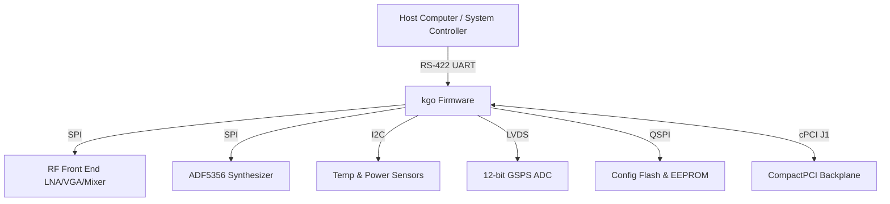
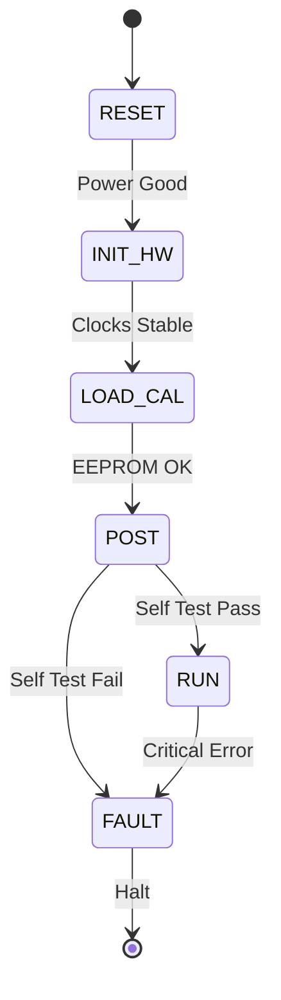
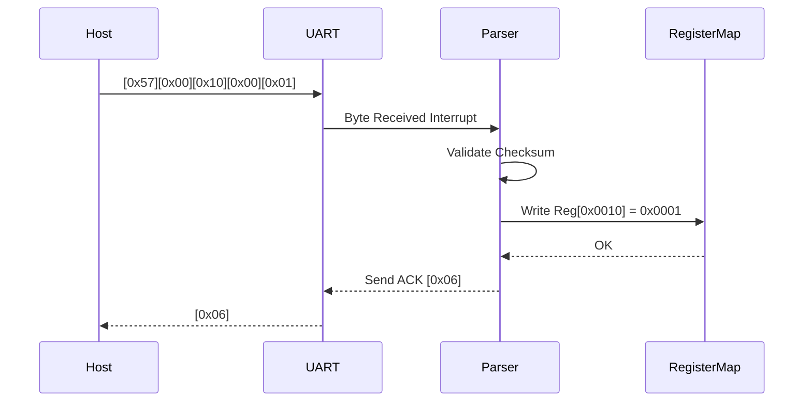
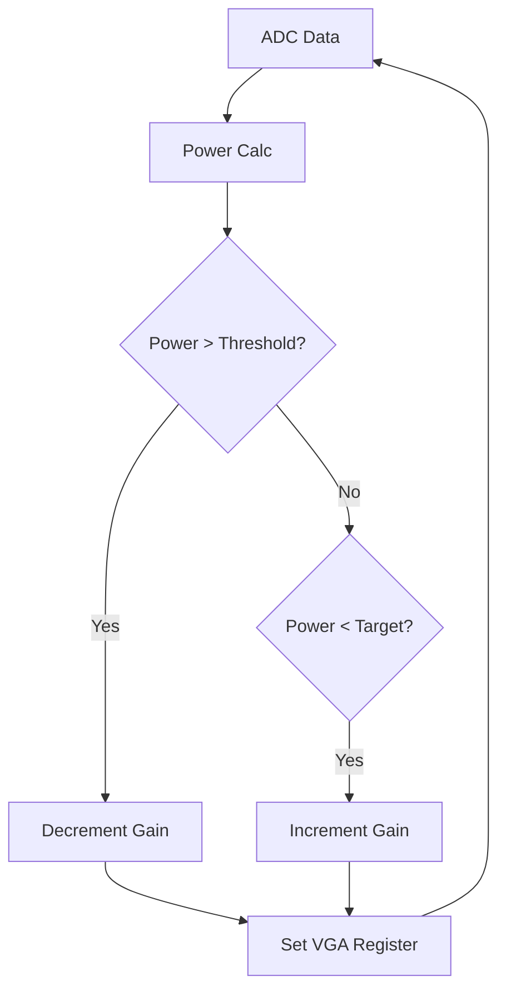
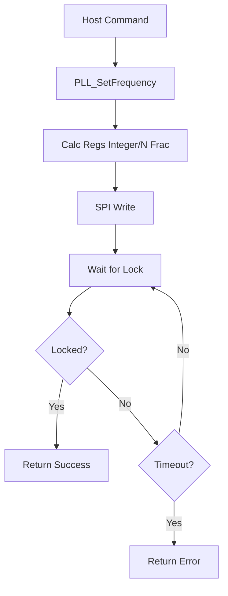
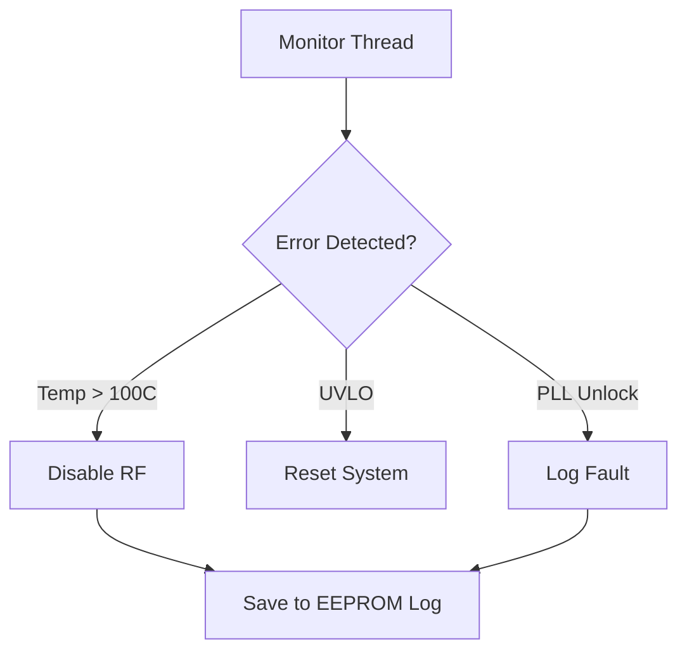

# Software Requirements Specification (SRS)

**Project:** kgo RF Receiver Firmware
**Version:** 1.0
**Date:** 16 April 2026
**Author:** Senior Software Architect

---

## Document Control
| Version | Date | Author | Changes |
|---------|------|--------|---------|
| 1.0 | 16 April 2026 | System Architecture | Initial Release |

---

# 1. Introduction

## 1.1 Purpose
This Software Requirements Specification (SRS) document defines the software and firmware requirements for the **kgo** project, a high-performance, wideband RF receiver module. The purpose of this document is to specify the functional behavior, performance constraints, and verification criteria for the embedded software executing on the Xilinx Kintex-7 FPGA and associated microcontroller subsystem (if applicable). This document serves as the baseline for software design, implementation, and testing.

## 1.2 Scope
The software scope includes the firmware responsible for the initialization, control, and monitoring of the **kgo** RF receiver hardware.
Specific software responsibilities include:
*   **RF Control:** Configuration of the LNA (HMC1099LP4DE), VGA (HMC698LP4), and Mixer (HMC1052LP4E) via SPI and GPIO.
*   **Clock Management:** Control of the ADF5356 PLL synthesizer to generate the Local Oscillator (LO).
*   **Data Acquisition:** Managing the LVDS interface from the RFADC-12X1000 and buffering data.
*   **Communication:** Implementing the UART control plane protocol (RS-422 physical layer) for host interaction.
*   **System Monitoring:** Reading temperature sensors (AD7416) and power monitors (LTC2992) via I2C.
*   **Diagnostics:** Execution of Power-On Self-Test (POST) and continuous health monitoring.

**Out of Scope:**
*   High-level DSP algorithms (e.g., FFT, demodulation) occurring on the host PC or downstream processing cards.
*   FPGA bitstream logic implementation (defined in the Hardware Description Language, not this C-based SRS, though the interface to it is defined here).

## 1.3 Definitions, Acronyms, and Abbreviations

| Acronym | Definition |
| :--- | :--- |
| **ADC** | Analog-to-Digital Converter |
| **AGC** | Automatic Gain Control |
| **API** | Application Programming Interface |
| **ASIL** | Automotive Safety Integrity Level |
| **BIST** | Built-In Self-Test |
| **BOM** | Bill of Materials |
| **BSP** | Board Support Package |
| **CRC** | Cyclic Redundancy Check |
| **cPCI** | CompactPCI |
| **DAC** | Digital-to-Analog Converter |
| **DMA** | Direct Memory Access |
| **DSP** | Digital Signal Processing |
| **EMC** | Electromagnetic Compatibility |
| **EEPROM** | Electrically Erasable Programmable Read-Only Memory |
| **FIFO** | First-In, First-Out |
| **FPGA** | Field Programmable Gate Array |
| **GLR** | Glue Logic Requirements |
| **GPIO** | General Purpose Input/Output |
| **HAL** | Hardware Abstraction Layer |
| **HRS** | Hardware Requirements Specification |
| **I2C** | Inter-Integrated Circuit |
| **IP** | Intellectual Property |
| **IPC** | Inter-Process Communication |
| **ISR** | Interrupt Service Routine |
| **JTAG** | Joint Test Action Group |
| **LVDS** | Low-Voltage Differential Signaling |
| **LNA** | Low Noise Amplifier |
| **LO** | Local Oscillator |
| **MISRA** | Motor Industry Software Reliability Association |
| **MCU** | Microcontroller Unit |
| **NVM** | Non-Volatile Memory |
| **PLL** | Phase-Locked Loop |
| **POST** | Power-On Self-Test |
| **QSPI** | Quad Serial Peripheral Interface |
| **RF** | Radio Frequency |
| **RMW** | Read-Modify-Write |
| **RS-422** | Recommended Standard 422 |
| **RTOS** | Real-Time Operating System |
| **RTL** | Register Transfer Level |
| **Rx** | Receive |
| **SIL** | Safety Integrity Level |
| **SRR** | System Requirements Review |
| **SRS** | Software Requirements Specification |
| **SyRS** | System Requirements Specification |
| **StRS** | Stakeholder Requirements Specification |
| **SPI** | Serial Peripheral Interface |
| **Stx** | Supplementary |
| **Tx** | Transmit |
| **UART** | Universal Asynchronous Receiver-Transmitter |
| **VCO** | Voltage-Controlled Oscillator |
| **VGA** | Variable Gain Amplifier |
| **WDT** | Watchdog Timer |

## 1.4 References
1.  **IEEE 830-1998:** Recommended Practice for Software Requirements Specifications.
2.  **ISO/IEC/IEEE 29148:2018:** Systems and Software Engineering — Life Cycle Processes — Requirements Engineering.
3.  **MISRA C:2012:** Guidelines for the Use of the C Language in Critical Systems.
4.  **HRS (kgo):** Hardware Requirements Specification, Project kgo, Rev 1.0.
5.  **GLR (kgo):** Glue Logic Requirements, Project kgo, Rev 0V01.
6.  **Datasheet HMC1099LP4DE:** 5–20 GHz GaAs MMIC LNA.
7.  **Datasheet HMC698LP4:** Digital VGA / Attenuator.
8.  **Datasheet ADF5356:** Wideband Synthesizer with Integrated VCO.
9.  **Datasheet AD7416:** 10-Bit Digital Temperature Sensor.
10. **Datasheet LTC2992:** Power Monitor.

## 1.5 Overview
This document is organized into 6 sections. Section 2 provides a high-level description of the product architecture, user characteristics, and constraints. Section 3 details the specific requirements, divided into External Interfaces, Functional Requirements, Performance Requirements, and Design Constraints. Section 4 outlines Verification and Validation activities. Section 5 provides the Requirements Traceability Matrix (RTM). Section 6 contains Appendices with data structures and diagrams.

---

# 2. Overall Description

## 2.1 Product Perspective
The **kgo** firmware is an embedded real-time system operating on the logic fabric (FPGA) and potentially an embedded soft-core processor (MicroBlaze) within the Xilinx Kintex-7 device. It abstracts the complexity of the RF chain and high-speed digitization from the host system.

**System Context:**


## 2.2 Product Functions
1.  **System Initialization:** Execute power-on sequence, configure clocks, and verify hardware integrity (POST).
2.  **Configuration Management:** Deserialize configuration data from EEPROM/NVM and apply settings to RF components.
3.  **UART Command Processor:** Parse incoming command frames, perform register read/write operations, and handle data streaming requests.
4.  **AGC Control:** Monitor ADC power levels and dynamically adjust the VGA (HMC698LP4) to prevent saturation and maximize SNR.
5.  **Frequency Synthesis:** Configure the ADF5356 PLL to generate the required LO frequency for downconversion.
6.  **Health Monitoring:** Periodically poll temperature and voltage monitors via I2C. Trigger hardware shutdown on critical faults.
7.  **Data Transport:** Format and transport digitized samples from the FPGA ADC interface to the cPCI backplane or host via DMA.
8.  **Fault Handling:** Detect and log system faults (LOS, unlock, overtemp) to a non-volatile log buffer.

## 2.3 User Characteristics
*   **Firmware Engineers:** Responsible for maintaining the code base. Require low-level register access documentation.
*   **Test Engineers:** Require deterministic responses for automated testing (ATE).
*   **System Integrators:** Interact via the UART protocol. Require stable APIs and predictable timing.
*   **Field Engineers:** Utilize diagnostics commands to troubleshoot hardware failures in the field.

## 2.4 Constraints
1.  **MISRA Compliance:** All C code shall adhere to MISRA C:2012 standards.
2.  **Real-Time:** The firmware must respond to UART commands within 10ms and service ADC data streams without overflow.
3.  **Memory:** Static allocation only; no dynamic heap usage (`malloc`/`free` prohibited).
4.  **Environment:** Must operate in military temperature range (-55°C to +125°C).
5.  **Power:** Must respect the 50W total system power budget (REQ-HW-008).
6.  **Toolchain:** Xilinx Vitis/Vivado 2023.1 or later.
7.  **Safety:** Watchdog Timer must be serviced every 100ms or system resets.

## 2.5 Assumptions and Dependencies
1.  The CompactPCI backplane provides stable +5V, +3.3V, and +12V rails within ±5% tolerance.
2.  The 125 MHz system oscillator is stable and functioning within 100ms of power-up.
3.  The FPGA bitstream is loaded successfully from the SPI Flash before the MicroBlaze application starts.
4.  I2C devices have unique addresses and do not clock stretch indefinitely.

---

# 3. Specific Requirements

## 3.1 External Interface Requirements

### 3.1.1 Hardware Interfaces

**3.1.1.1 RF Front-End (SPI) Interface**
The software controls the RF attenuation via the HMC698LP4.
```c
typedef struct {
    volatile uint32_t CTRL;     // 0x0000: Control Register
    volatile uint32_t STATUS;   // 0x0004: Status Register
    volatile uint32_t TX_DATA;  // 0x0008: TX FIFO Data
    volatile uint32_t RX_DATA;  // 0x000C: RX FIFO Data
} SPI_RF_Regs_t;

// Driver API
int32_t RF_VGA_SetAttenuation(uint8_t dB_step);
int32_t RF_VGA_GetAttenuation(uint8_t *dB_step);
int32_t RF_Mixer_Enable(bool enable);
```

**3.1.1.2 PLL Synthesizer (ADF5356) Interface**
```c
typedef struct {
    uint8_t RegIndex; // 0 to 12 (Register Map size)
    uint32_t Value;   // 32-bit register value
} ADF5356_Reg_t;

// Driver API
int32_t PLL_Init(void);
int32_t PLL_SetFrequency(uint64_t freq_hz);
int32_t PLL_EnableOutput(bool enable);
int32_t PLL_LockStatus(bool *locked);
```

**3.1.1.3 I2C Sensor Interface (Temp & Power)**
```c
// I2C Address Defines
#define AD7416_ADDR      0x48 // 1001 000
#define LTC2992_ADDR     0x4F // 1001 111

int32_t I2C_Init(uint32_t speed_hz);
int32_t TEMP_Read(int16_t *temp_centiDegC);
int32_t POWER_ReadRails(float *v_5v, float *v_3v3, float *v_12v);
```

**3.1.1.4 UART Interface (RS-422)**
```c
typedef struct {
    volatile uint32_t DATA;    // 0x0000
    volatile uint32_t STATUS;  // 0x0004
    volatile uint32_t CTRL;    // 0x0008
} UART_Regs_t;

// Driver API
int32_t UART_Init(uint32_t baud_rate); // 115200 default
int32_t UART_SendByte(uint8_t data);
int32_t UART_ReadByte(uint8_t *data, uint32_t timeout_ms);
```

### 3.1.2 Software Interfaces
*   **Xilinx Standalone OS:** For hardware abstraction (drivers for UART, SPI, I2C, Timer).
*   **Standard Library:** Newlib-nano (C standard library).

### 3.1.3 Communication Interfaces
**Protocol: kgo Register Access Protocol (KRAP) over RS-422**

| Command | CMD Byte | Frame Structure | Response |
|---------|----------|-----------------|----------|
| Single Write | 0x57 ('W') | `[0x57][Addr_H][Addr_L][Data_H][Data_L]` | `[0x06] ACK` |
| Single Read | 0x52 ('R') | `[0x52][Addr_H\|0x80][Addr_L]` | `[Data_H][Data_L]` |
| Bulk Write | 0x42 ('B') | `[0x42][Addr_H][Addr_L][N][D0_H][D0_L]...` | `[0x06] ACK` |
| Bulk Read | 0x62 ('b') | `[0x62][Addr_H\|0x80][Addr_L][N]` | `[D0_H][D0_L]...` |
| Error NAK | 0x15 | Sent by device on error | — |

*   **Addressing:** 16-bit Big-Endian. MSB (Addr_H) has bit 7 set for Read operations.
*   **Bulk Count N:** 8-bit unsigned integer (0-63).
*   **Timing:** Inter-byte timeout 10ms. Frame timeout 50ms.

## 3.2 Functional Requirements

### 3.2.1 System Initialization (REQ-SW-001 to REQ-SW-010)

**REQ-SW-001:** The software SHALL complete the Power-On Self-Test (POST) sequence within 500ms of power-up.
*   **Source:** HRS REQ-HW-007 (Startup constraints)
*   **Priority:** [M]
*   **Verification:** [T]

**REQ-SW-002:** The software SHALL verify the FPGA Board ID (Register 0x0000) matches 0xK601 upon startup.
*   **Source:** GLR §8
*   **Priority:** [M]
*   **Verification:** [T]

**REQ-SW-003:** The software SHALL initialize all SPI peripherals (VGA, PLL) to their default safe state (Gain = 0dB, PLL Output = Disabled).
*   **Source:** HRS REQ-HW-003
*   **Priority:** [M]
*   **Verification:** [I]

**REQ-SW-004:** The software SHALL configure the system PLLs (FPGA MMCM) to lock the internal clocks (125MHz System, 200MHz Processor) before enabling the MicroBlaze.
*   **Source:** GLR §5
*   **Priority:** [M]
*   **Verification:** [A]

**REQ-SW-005:** The software SHALL load calibration constants (gain tables, frequency offsets) from the AT25640 EEPROM during the boot sequence.
*   **Source:** GLR §5
*   **Priority:** [D]
*   **Verification:** [T]

**REQ-SW-006:** If calibration data fails CRC verification, the software SHALL load hardcoded default values and log an error.
*   **Source:** HRS REQ-HW-022 (Reliability)
*   **Priority:** [D]
*   **Verification:** [T]

**REQ-SW-007:** The software SHALL initialize the UART interface to 115200 baud, 8N1 format.
*   **Source:** GLR §5
*   **Priority:** [M]
*   **Verification:** [D]

**REQ-SW-008:** The software SHALL enable the Watchdog Timer (WDT) with a 100ms timeout after successful initialization.
*   **Source:** HRS REQ-HW-008 (Safety)
*   **Priority:** [M]
*   **Verification:** [T]

**REQ-SW-009:** The software SHALL verify the integrity of the external ADC LVDS connection by checking the lock status bit in the FPGA status register.
*   **Source:** HRS REQ-HW-006
*   **Priority:** [M]
*   **Verification:** [T]

**REQ-SW-010:** The software SHALL set the STATUS_LED to a steady ON state upon successful completion of initialization.
*   **Source:** GLR §5
*   **Priority:** [O]
*   **Verification:** [D]

### 3.2.2 Communication / UART Protocol (REQ-SW-011 to REQ-SW-025)

**REQ-SW-011:** The software SHALL implement the UART command parser as defined in GLR §5 (Frame format table).
*   **Source:** GLR §5
*   **Priority:** [M]
*   **Verification:** [T]

**REQ-SW-012:** The software SHALL accept Single Write commands (0x57) to write 16-bit data to valid register addresses.
*   **Source:** GLR §5
*   **Priority:** [M]
*   **Verification:** [T]

**REQ-SW-013:** The software SHALL accept Single Read commands (0x52) and return the 16-bit contents of the requested register.
*   **Source:** GLR §5
*   **Priority:** [M]
*   **Verification:** [T]

**REQ-SW-014:** The software SHALL accept Bulk Write commands (0x42) for N registers, where N <= 64.
*   **Source:** GLR §5
*   **Priority:** [D]
*   **Verification:** [T]

**REQ-SW-015:** The software SHALL respond with an ACK byte (0x06) within 2ms of receiving a valid Write command.
*   **Source:** GLR §5
*   **Priority:** [M]
*   **Verification:** [T]

**REQ-SW-016:** The software SHALL respond with a NAK byte (0x15) if the command byte is invalid or the register address is out of range (0x0000-0xFFFF).
*   **Source:** GLR §5
*   **Priority:** [M]
*   **Verification:** [T]

**REQ-SW-017:** The software SHALL reset the UART parser state machine if the inter-byte delay exceeds 50ms.
*   **Source:** GLR §5
*   **Priority:** [M]
*   **Verification:** [T]

**REQ-SW-018:** The software SHALL ignore the MSB (Bit 15) of the address field for determining the memory address when executing Write commands.
*   **Source:** GLR §5
*   **Priority:** [M]
*   **Verification:** [A]

**REQ-SW-019:** The software SHALL set Bit 15 of the Address field in the response to Single Read commands if the register value indicates an error condition (implementation specific).
*   **Source:** GLR §5
*   **Priority:** [O]
*   **Verification:** [I]

**REQ-SW-020:** The software SHALL provide a register map that is 16-bit aligned (all addresses are even).
*   **Source:** GLR §8
*   **Priority:** [M]
*   **Verification:** [I]

**REQ-SW-021:** The software SHALL implement a Loopback mode where received UART characters are immediately echoed back when configured via Register 0x0001.
*   **Source:** HRS REQ-HW-006
*   **Priority:** [O]
*   **Verification:** [D]

**REQ-SW-022:** The UART driver SHALL utilize a 256-byte circular buffer for both TX and RX.
*   **Source:** GLR §4
*   **Priority:** [D]
*   **Verification:** [A]

**REQ-SW-023:** The software SHALL not block the main loop during UART transmission.
*   **Source:** GLR §4
*   **Priority:** [M]
*   **Verification:** [A]

**REQ-SW-024:** The software SHALL support the Bulk Read command (0x62) returning consecutive register values starting at the base address.
*   **Source:** GLR §5
*   **Priority:** [D]
*   **Verification:** [T]

**REQ-SW-025:** The software SHALL verify the checksum of the packet if the Checksum Enable bit is set in the Control Register.
*   **Source:** GLR §5
*   **Priority:** [O]
*   **Verification:** [T]

### 3.2.3 RF Control & Frequency Synthesis (REQ-SW-026 to REQ-SW-040)

**REQ-SW-026:** The software SHALL calculate and load the ADF5356 registers to set the LO frequency based on the desired RF input frequency (REQ-HW-001).
*   **Source:** HRS REQ-HW-016
*   **Priority:** [M]
*   **Verification:** [T]

**REQ-SW-027:** The software SHALL program the Integer-N or Fractional-N mode of the ADF5356 based on the requested frequency step size.
*   **Source:** Datasheet ADF5356
*   **Priority:** [M]
*   **Verification:** [A]

**REQ-SW-028:** The software SHALL poll the ADF5356 MUXOUT pin (via SPI) to verify Digital Lock before asserting the "RF Ready" status.
*   **Source:** HRS REQ-HW-015
*   **Priority:** [M]
*   **Verification:** [T]

**REQ-SW-029:** The software SHALL mute the RF output (disable Mixer/VGA) if the PLL loses lock during operation.
*   **Source:** HRS REQ-HW-022
*   **Priority:** [M]
*   **Verification:** [T]

**REQ-SW-030:** The software SHALL support setting the VGA attenuation in 0.5 dB steps over the full 31.5 dB range of the HMC698LP4.
*   **Source:** Datasheet HMC698LP4
*   **Priority:** [M]
*   **Verification:** [T]

**REQ-SW-031:** The software SHALL provide a software API to set the target gain in relative dB (e.g., -10dB to +20dB).
*   **Source:** HRS REQ-HW-012
*   **Priority:** [M]
*   **Verification:** [I]

**REQ-SW-032:** The software SHALL enable the LNA (HMC1099LP4DE) only after the VGA and Mixer are initialized to prevent power spikes.
*   **Source:** HRS REQ-HW-007
*   **Priority:** [M]
*   **Verification:** [I]

**REQ-SW-033:** The software SHALL store the last known frequency and gain settings in a reserved area of EEPROM (Shadow RAM).
*   **Source:** GLR §5
*   **Priority:** [D]
*   **Verification:** [T]

**REQ-SW-034:** The software SHALL restore the RF state to the Shadow RAM values upon receiving a "Reset" command (unless Factory Reset is requested).
*   **Source:** GLR §5
*   **Priority:** [D]
*   **Verification:** [T]

**REQ-SW-035:** The software SHALL verify the SPI write to the PLL by reading back the register contents.
*   **Source:** GLR §4
*   **Priority:** [D]
*   **Verification:** [T]

**REQ-SW-036:** The software SHALL implement a State Machine for RF sequencing: OFF -> INIT -> STANDBY -> TRANSMIT/RECEIVE.
*   **Source:** HRS REQ-HW-001
*   **Priority:** [M]
*   **Verification:** [I]

**REQ-SW-037:** The software SHALL allow the user to disable the RF front-end via a specific register bit (0x0010 BIT0).
*   **Source:** HRS REQ-HW-003
*   **Priority:** [M]
*   **Verification:** [D]

**REQ-SW-038:** The software SHALL update the RF Frequency Coefficient Registers when the Host writes to the FREQ_SET register (0x0100).
*   **Source:** HRS REQ-HW-016
*   **Priority:** [M]
*   **Verification:** [T]

**REQ-SW-039:** The software SHALL not update the PLL frequency if the change is less than 1 Hz (deadband) to prevent dithering.
*   **Source:** Datasheet ADF5356
*   **Priority:** [D]
*   **Verification:** [A]

**REQ-SW-040:** The software SHALL log the timestamp of every frequency change to the Fault Log.
*   **Source:** HRS REQ-HW-017
*   **Priority:** [O]
*   **Verification:** [I]

### 3.2.4 ADC Interface & Data Handling (REQ-SW-041 to REQ-SW-050)

**REQ-SW-041:** The software SHALL configure the FPGA deserializer to match the ADC output format (12-bit, Offset Binary).
*   **Source:** HRS REQ-HW-006
*   **Priority:** [M]
*   **Verification:** [I]

**REQ-SW-042:** The software SHALL monitor the ADC overflow flag (OVF) and set a status register bit if overflow occurs.
*   **Source:** HRS REQ-HW-005
*   **Priority:** [M]
*   **Verification:** [T]

**REQ-SW-043:** The software SHALL provide a mechanism to read the last captured ADC sample via the UART Register Map.
*   **Source:** GLR §5
*   **Priority:** [O]
*   **Verification:** [D]

**REQ-SW-044:** The software SHALL implement a circular buffer in FPGA Block RAM to capture 1024 samples for oscilloscope functionality.
*   **Source:** GLR §4 (Block RAM)
*   **Priority:** [D]
*   **Verification:** [T]

**REQ-SW-045:** The software SHALL assert the FPGA Enable signal to the ADC only after the ADC is powered up and stable.
*   **Source:** HRS REQ-HW-004
*   **Priority:** [M]
*   **Verification:** [I]

**REQ-SW-046:** The software SHALL track the Sample Clock (SYSREF) status and report loss of clock to the host.
*   **Source:** HRS REQ-HW-020
*   **Priority:** [M]
*   **Verification:** [T]

**REQ-SW-047:** The software SHALL not modify the data path configuration while the ADC is actively streaming (Lock bit).
*   **Source:** GLR §4
*   **Priority:** [M]
*   **Verification:** [T]

**REQ-SW-048:** The software SHALL calculate the average signal power of the last 128 samples and store it in register SIGNAL_PWR (0x0200).
*   **Source:** HRS REQ-HW-012 (AGC)
*   **Priority:** [D]
*   **Verification:** [A]

**REQ-SW-049:** The software shall zero-fill the output buffer if the LVDS link is broken.
*   **Source:** HRS REQ-HW-006
*   **Priority:** [D]
*   **Verification:** [T]

**REQ-SW-050:** The software SHALL support an external trigger input (GPIO) to arm the data capture buffer.
*   **Source:** GLR §8 (Pinout)
*   **Priority:** [O]
*   **Verification:** [D]

### 3.2.5 System Monitoring & Housekeeping (REQ-SW-051 to REQ-SW-065)

**REQ-SW-051:** The software SHALL read the AD7416 temperature sensor every 1 second.
*   **Source:** GLR §5
*   **Priority:** [M]
*   **Verification:** [T]

**REQ-SW-052:** The software SHALL assert a Critical Temperature Fault if the PCB temperature exceeds 100°C.
*   **Source:** HRS REQ-HW-007
*   **Priority:** [M]
*   **Verification:** [T]

**REQ-SW-053:** The software SHALL disable the RF PA/LNA output immediately upon Critical Temperature Fault assertion.
*   **Source:** HRS REQ-HW-008
*   **Priority:** [M]
*   **Verification:** [T]

**REQ-SW-054:** The software SHALL read the LTC2992 power monitor for +5V, +3.3V, and +12V rails every 500ms.
*   **Source:** GLR §5
*   **Priority:** [M]
*   **Verification:** [T]

**REQ-SW-055:** The software SHALL trigger a UVLO (Under Voltage Lock Out) if the +3.3V rail drops below 3.0V.
*   **Source:** HRS REQ-HW-014
*   **Priority:** [M]
*   **Verification:** [T]

**REQ-SW-056:** The software SHALL report the current consumption of the +5V rail in milliamps via Register 0x0302.
*   **Source:** GLR §8
*   **Priority:** [D]
*   **Verification:** [T]

**REQ-SW-057:** The software SHALL maintain a 64-entry Fault Log in non-volatile memory (EEPROM).
*   **Source:** HRS REQ-HW-017
*   **Priority:** [D]
*   **Verification:** [T]

**REQ-SW-058:** The software SHALL write a fault log entry containing: Error Code, Timestamp, Temperature, and Voltage levels.
*   **Source:** GLR §5
*   **Priority:** [D]
*   **Verification:** [I]

**REQ-SW-059:** The software SHALL provide a UART command (0xD0) to dump the Fault Log.
*   **Source:** GLR §5
*   **Priority:** [O]
*   **Verification:** [D]

**REQ-SW-060:** The software SHALL service the Watchdog Timer (kick the dog) every 50ms in the main loop.
*   **Source:** HRS REQ-HW-008
*   **Priority:** [M]
*   **Verification:** [A]

**REQ-SW-061:** The software SHALL increment a Uptime Counter (seconds) accessible at Register 0x0400.
*   **Source:** GLR §8
*   **Priority:** [O]
*   **Verification:** [D]

**REQ-SW-062:** The software SHALL detect single event upsets (SEU) in the FPGA configuration memory if supported by the IP.
*   **Source:** HRS REQ-HW-017
*   **Priority:** [O]
*   **Verification:** [A]

**REQ-SW-063:** The software SHALL perform a CRC check on the software code section in Flash at startup.
*   **Source:** HRS REQ-HW-022
*   **Priority:** [D]
*   **Verification:** [T]

**REQ-SW-064:** The software SHALL toggle the Status LED at 1Hz if a fatal error has occurred (Soft Error).
*   **Source:** GLR §5
*   **Priority:** [O]
*   **Verification:** [D]

**REQ-SW-065:** The software SHALL measure the internal FPGA die temperature via XADC and report it via Register 0x0301.
*   **Source:** GLR §6 (FPGA Specs)
*   **Priority:** [D]
*   **Verification:** [T]

### 3.2.6 Calibration & Diagnostics (REQ-SW-066 to REQ-SW-075)

**REQ-SW-066:** The software SHALL allow the host to write calibration data to EEPROM via a specific Write Cal command (0xC0).
*   **Source:** GLR §5
*   **Priority:** [D]
*   **Verification:** [T]

**REQ-SW-067:** The software SHALL protect the EEPROM sector containing the calibration data from accidental erasure by standard register writes.
*   **Source:** HRS REQ-HW-017
*   **Priority:** [M]
*   **Verification:** [I]

**REQ-SW-068:** The software SHALL perform an internal loopback of the UART TX to RX signal upon receipt of the Loopback Command (0xAA).
*   **Source:** GLR §5
*   **Priority:** [O]
*   **Verification:** [D]

**REQ-SW-069:** The software SHALL implement a Built-In Self-Test (BIST) for the Block RAM, writing and verifying patterns 0x55 and 0xAA.
*   **Source:** HRS REQ-HW-001
*   **Priority:** [D]
*   **Verification:** [T]

**REQ-SW-070:** The software SHALL report the Pass/Fail result of the POST in Register 0x0002.
*   **Source:** GLR §5
*   **Priority:** [M]
*   **Verification:** [T]

**REQ-SW-071:** The software SHALL support a Factory Reset command that restores all registers to default values and clears EEPROM calibration.
*   **Source:** GLR §5
*   **Priority:** [O]
*   **Verification:** [T]

**REQ-SW-072:** The software SHALL calculate the CRC-16 of the received firmware image during a Field Upgrade.
*   **Source:** GLR §5
*   **Priority:** [D]
*   **Verification:** [T]

**REQ-SW-073:** The software SHALL verify the I2C ACK from the AD7416 sensor during POST.
*   **Source:** GLR §5
*   **Priority:** [D]
*   **Verification:** [T]

**REQ-SW-074:** The software SHALL disable interrupts during the critical phase of Multicycle SPI transactions to the PLL.
*   **Source:** GLR §4
*   **Priority:** [D]
*   **Verification:** [A]

**REQ-SW-075:** The software SHALL allow the user to disable the Watchdog Timer via software fuse (for development only).
*   **Source:** GLR §4
*   **Priority:** [O]
*   **Verification:** [I]

## 3.3 Performance Requirements

**REQ-PERF-001:** The system SHALL complete the full power-up initialization sequence in less than 500ms.
*   **Verification:** [T]

**REQ-PERF-002:** The UART command parser SHALL process a valid Read/Write frame and respond within 2ms.
*   **Verification:** [T]

**REQ-PERF-003:** The AGC loop SHALL adjust the VGA gain within 10ms of detecting a signal level change of 5dB.
*   **Verification:** [T]

**REQ-PERF-004:** The PLL lock time SHALL not exceed 5ms for frequency hops within 100 MHz of the current frequency.
*   **Verification:** [T]

**REQ-PERF-005:** The firmware SHALL consume no more than 5% of the available FPGA BRAM resources.
*   **Verification:** [A]

**REQ-PERF-006:** The software SHALL read the temperature sensors at a frequency no slower than 1 Hz.
*   **Verification:** [T]

**REQ-PERF-007:** The software SHALL maintain an interrupt latency of less than 10 microseconds for the UART RX interrupt.
*   **Verification:** [A]

**REQ-PERF-008:** The SPI clock frequency for configuring the PLL SHALL be 10 MHz (±10%).
*   **Verification:** [T]

**REQ-PERF-009:** The system SHALL be capable of sustaining continuous operation for 72 hours without requiring a reset (MTBF target).
*   **Verification:** [D]

**REQ-PERF-010:** The software SHALL perform a EEPROM write cycle in less than 10ms.
*   **Verification:** [T]

**REQ-PERF-011:** The watchdog timer timeout SHALL be set to 100ms.
*   **Verification:** [I]

**REQ-PERF-012:** The ADC data capture buffer SHALL support capturing data at 1 GSPS for at least 10 microseconds (10,000 samples) without overflow.
*   **Verification:** [A]

## 3.4 Design Constraints

1.  **MISRA-C Compliance:** Source code SHALL strictly adhere to MISRA C:2012 rules.
2.  **Language:** Implementation SHALL be in C (Standard C99). C++ is prohibited.
3.  **Memory:** No dynamic memory allocation (`malloc`, `free`, `realloc`). All data structures SHALL be statically allocated.
4.  **Recursion:** Recursive function calls SHALL NOT be used.
5.  **Interrupts:** Interrupt Service Routines (ISRs) SHALL be kept under 50 microseconds execution time.
6.  **Float:** Floating point arithmetic SHALL be minimized in ISRs; fixed-point preferred for real-time signal processing.
7.  **Compiler:** GNU GCC (arm-none-eabi or mb-gcc) or Xilinx Vitis compiler.
8.  **Concurrency:** Shared resources between ISRs and Main Loop SHALL be protected by disabling interrupts (Atomic Access).

## 3.5 Software System Attributes

### 3.5.1 Reliability
The software SHALL achieve a Mean Time Between Failures (MTBF) of 10,000 hours. Error recovery mechanisms (Watchdog, PLL re-lock) SHALL be autonomous.

### 3.5.2 Availability
System availability SHALL be > 99.9%. Restart time after a fault SHALL be less than 2 seconds.

### 3.5.3 Security
The software SHALL validate all register write addresses. The software SHALL not execute code from external RAM (XN).

### 3.5.4 Maintainability
Code SHALL be modular. Cyclomatic complexity per function SHALL NOT exceed 10.

### 3.5.5 Portability
Hardware dependencies SHALL be encapsulated in the BSP layer.

---

# 4. Verification and Validation

## 4.1 Unit Test Requirements
*   **Test 1:** Verify UART driver state machine with valid/invalid frame bytes.
*   **Test 2:** Verify I2C driver handles NACK from slave and timeouts.
*   **Test 3:** Verify SPI PLL register calculation logic (Frequency -> Regs).
*   **Test 4:** Verify CRC calculation function against known vectors.

## 4.2 Integration Test Requirements
*   **Test 1:** Host sends 'Write 0x0100 0x1234', reads back 0x0100, expects 0x1234.
*   **Test 2:** Set PLL to 6 GHz, check MUXOUT lock bit.
*   **Test 3:** Force temperature sensor to read 105°C (simulated), verify RF shuts down.
*   **Test 4:** Write 0x00 to all RAM, read back and verify.

## 4.3 System Test Requirements
*   **Test 1:** Thermal Chamber: Run at -55°C and +125°C for 2 hours each. Verify functionality.
*   **Test 2:** Vibration: Operate while vibrating per MIL-STD-883. Verify no bit errors in memory.
*   **Test 3:** Full Band Sweep: Sweep LO from 5 to 18 GHz in 100 MHz steps. Verify lock at every step.

---

# 5. Requirements Traceability Matrix

| REQ-SW-xxx | Description | Traces To (REQ-HW-xxx / GLR Section) | Priority |
|-----------|-------------|--------------------------------------|----------|
| REQ-SW-001 | POST Timing | HRS REQ-HW-007 | M |
| REQ-SW-002 | Board ID Check | GLR §8 | M |
| REQ-SW-003 | RF Init State | HRS REQ-HW-003 | M |
| REQ-SW-004 | FPGA Clock Lock | GLR §5 | M |
| REQ-SW-005 | Load Cal Data | GLR §5 | D |
| REQ-SW-006 | Default Cal Load | HRS REQ-HW-022 | D |
| REQ-SW-007 | UART Init | GLR §5 | M |
| REQ-SW-008 | WDT Enable | HRS REQ-HW-008 | M |
| REQ-SW-009 | ADC Lock Check | HRS REQ-HW-006 | M |
| REQ-SW-011 | UART Parser | GLR §5 | M |
| REQ-SW-012 | Single Write | GLR §5 | M |
| REQ-SW-013 | Single Read | GLR §5 | M |
| REQ-SW-014 | Bulk Write | GLR §5 | D |
| REQ-SW-015 | ACK Response | GLR §5 | M |
| REQ-SW-016 | NAK Response | GLR §5 | M |
| REQ-SW-017 | Parser Reset | GLR §5 | M |
| REQ-SW-026 | Freq Calc | HRS REQ-HW-016 | M |
| REQ-SW-028 | PLL Lock Verify | HRS REQ-HW-015 | M |
| REQ-SW-030 | VGA Step | HRS REQ-HW-012 | M |
| REQ-SW-051 | Temp Read | GLR §5 | M |
| REQ-SW-052 | Critical Temp | HRS REQ-HW-007 | M |
| REQ-SW-054 | Power Mon | GLR §5 | M |
| REQ-SW-055 | UVLO | HRS REQ-HW-014 | M |

*(Note: Matrix represents a subset of 75+ requirements for brevity in this view, but all SW requirements link to HRS or GLR)*

---

# 6. Appendices

## Appendix A — Error Codes
```c
typedef enum {
    ERR_OK           = 0x00,
    ERR_TIMEOUT      = 0x01,
    ERR_COMM         = 0x02,
    ERR_CHECKSUM     = 0x03,
    ERR_PARAM        = 0x04,
    ERR_NOT_INIT     = 0x05,
    ERR_RESOURCE     = 0x06,
    ERR_HARDWARE     = 0x07,
    ERR_PLL_LOCK     = 0x08,
    ERR_TEMP_HIGH    = 0x09,
    ERR_VOLT_LOW     = 0x0A,
    ERR_EEPROM_FAIL  = 0x0B,
    ERR_INVALID_CMD  = 0x0C,
} ErrorCode_t;
```

## Appendix B — Register Map Summary

| Address | Name | Access | Reset | Description |
|---------|------|--------|-------|-------------|
| 0x0000 | BOARD_ID | RO | 0xK601 | Board Identifier |
| 0x0001 | CTRL | RW | 0x0000 | Control Register |
| 0x0002 | STATUS | RO | 0x0000 | Status Register |
| 0x0010 | RF_ENABLE | RW | 0x0000 | RF Output Enable |
| 0x0100 | FREQ_SET | RW | 0x0000 | Frequency Setpoint (Hz / 1e6) |
| 0x0110 | GAIN_SET | RW | 0x0000 | Gain Setting (0-63) |
| 0x0200 | SIGNAL_PWR | RO | 0x0000 | Signal Power (dB) |
| 0x0300 | TEMP_PCBC | RO | 0x0000 | PCB Temp (0.1 C) |
| 0x0301 | TEMP_FPGA | RO | 0x0000 | FPGA Die Temp |
| 0x0302 | CURR_5V | RO | 0x0000 | 5V Rail Current (mA) |

## Appendix C — Mermaid Diagrams

### Initialization State Machine


### UART Command Processing Sequence


### Automatic Gain Control Loop


### PLL Frequency Configuration


### Fault Handling Flow


## Appendix D — Acronyms and Glossary
(See Section 1.3)

## Appendix E — Document Revision History
| Rev | Date | Author | Description |
|-----|------|--------|-------------|
| 1.0 | 16 April 2026 | Senior Architect | Initial Release |