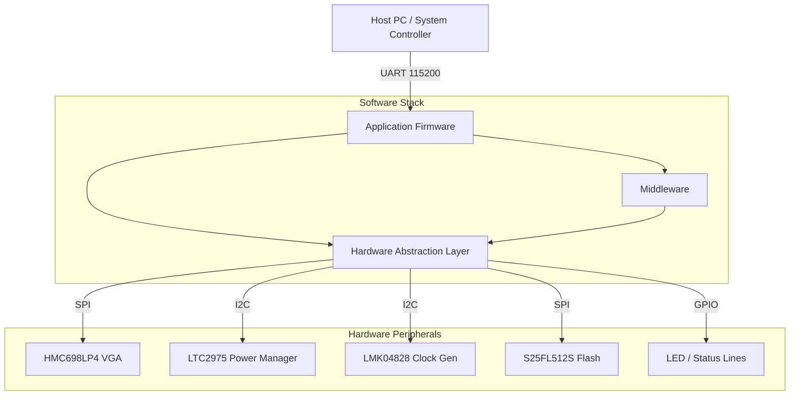
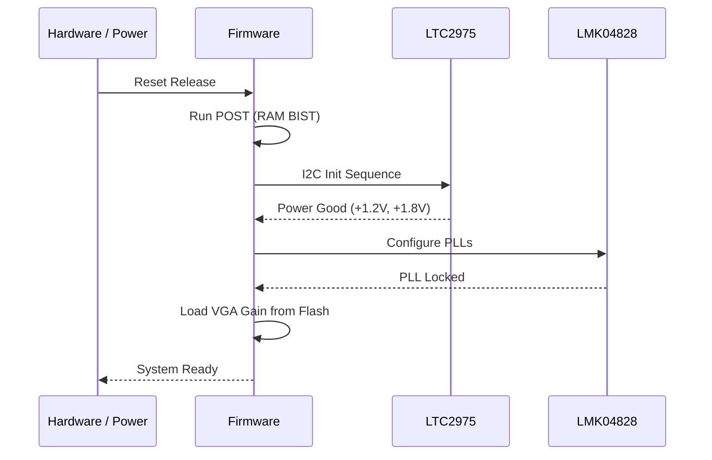
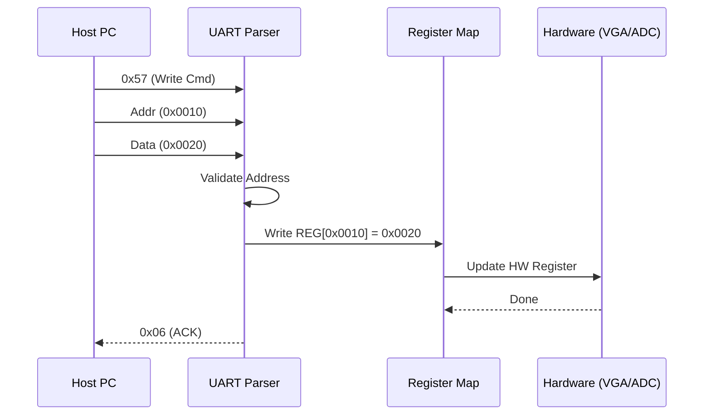
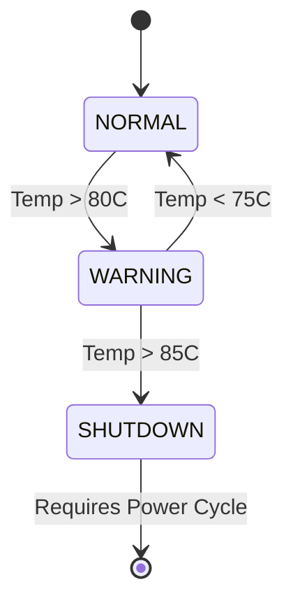
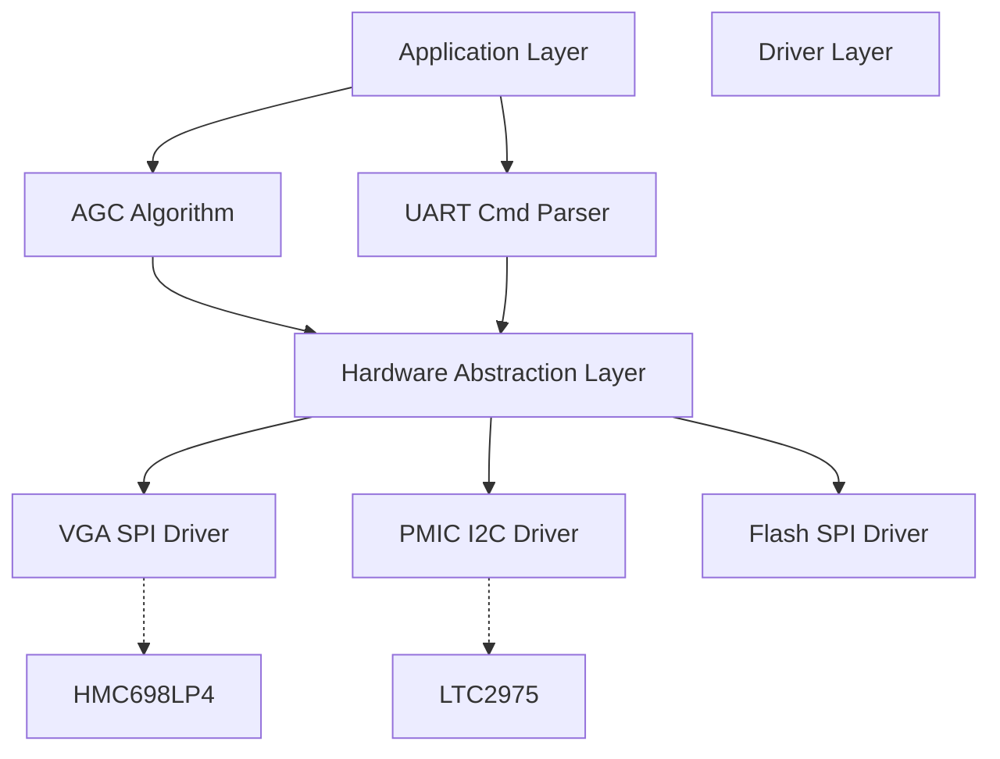

# Software Requirements Specification (SRS)

**Project:** kh (Wideband RF Receiver Module)
**Version:** 1.0
**Date:** 15 April 2026
**Author:** Senior Software Architect

---

## Document Control
| Version | Date | Author | Changes |
|---------|------|--------|---------|
| 1.0 | 15 April 2026 | — | Initial Release compliant with IEEE 29148:2018 |

---

# 1. Introduction

## 1.1 Purpose
This Software Requirements Specification (SRS) defines the comprehensive software and firmware requirements for the **kh** Wideband RF Receiver Module. This document specifies the requirements for the embedded firmware running on the FPGA (XC7K325T) and the associated microcontroller subsystems responsible for power management, RF control, and communication.

This document will be used by:
*   **Firmware Engineers:** To implement the embedded C firmware and RTL logic.
*   **Test Engineers:** To develop the Hardware-in-Loop (HIL) test plans.
*   **System Integrators:** To integrate the **kh** module into the larger platform.
*   **Verification Teams:** To validate that the software meets the system-level needs derived from the Hardware Requirements Specification (HRS).

## 1.2 Scope
The software scope includes the control and monitoring logic for the **kh** RF receiver.
*   **Included:**
    *   Embedded C firmware for MicroBlaze/Soft-core (or equivalent host MCU).
    *   Hardware Abstraction Layer (HAL) for UART, I2C, and SPI peripherals.
    *   Digital Gain Control (DGC) algorithms for the HMC698LP4 VGA.
    *   Power sequencing and monitoring via the LTC2975.
    *   Clock configuration for the LMK04828BKNQ.
    *   JESD204B link initialization and monitoring status.
    *   Non-Volatile Memory (Flash) management for calibration data.
*   **Excluded:**
    *   High-speed DSP signal processing algorithms implemented in RTL (outside the scope of this C-based SRS).
    *   PC-based Host GUI software.

## 1.3 Definitions, Acronyms, and Abbreviations

| Term | Definition |
| :--- | :--- |
| **ADC** | Analog-to-Digital Converter |
| **AGC** | Automatic Gain Control |
| **API** | Application Programming Interface |
| **BIST** | Built-In Self-Test |
| **BSP** | Board Support Package |
| **CBR** | Constant Bit Rate |
| **CRC** | Cyclic Redundancy Check |
| **DAC** | Digital-to-Analog Converter |
| **DC** | Direct Current |
| **DMA** | Direct Memory Access |
| **DRC** | Design Rule Check |
| **DSP** | Digital Signal Processing |
| **EEPROM** | Electrically Erasable Programmable Read-Only Memory |
| **EMC** | Electromagnetic Compatibility |
| **EOF** | End of Frame |
| **FIFO** | First-In, First-Out buffer |
| **FPGA** | Field-Programmable Gate Array |
| **FSM** | Finite State Machine |
| **GLR** | Glue Logic Requirements |
| **GPIO** | General Purpose Input/Output |
| **HAL** | Hardware Abstraction Layer |
| **HRS** | Hardware Requirements Specification |
| **I2C** | Inter-Integrated Circuit (Serial Interface) |
| **IC** | Integrated Circuit |
| **ID** | Identifier |
| **IO** | Input/Output |
| **IP** | Intellectual Property Core |
| **IRQ** | Interrupt Request |
| **ISR** | Interrupt Service Routine |
| **JTAG** | Joint Test Action Group |
| **LVDS** | Low-Voltage Differential Signaling |
| **MCU** | Microcontroller Unit |
| **MISR** | Multiple Input Signature Register |
| **MISO** | Master In Slave Out |
| **MOSI** | Master Out Slave In |
| **MSPS** | Mega-Samples Per Second |
| **NF** | Noise Figure |
| **NVM** | Non-Volatile Memory |
| **OS** | Operating System |
| **PCB** | Printed Circuit Board |
| **PLL** | Phase-Locked Loop |
| **POST** | Power-On Self-Test |
| **RAM** | Random Access Memory |
| **RF** | Radio Frequency |
| **ROM** | Read-Only Memory |
| **RTL** | Register Transfer Level |
| **RTOS** | Real-Time Operating System |
| **RX** | Receive |
| **SFR** | Special Function Register |
| **SFDR** | Spurious-Free Dynamic Range |
| **SNR** | Signal-to-Noise Ratio |
| **SPI** | Serial Peripheral Interface |
| **SRAM** | Static Random Access Memory |
| **SRS** | Software Requirements Specification |
| **StRS** | Stakeholder Requirements Specification |
| **SyRS** | System Requirements Specification |
| **TCP** | Transmission Control Protocol |
| **TEMP** | Temperature |
| **TX** | Transmit |
| **UART** | Universal Asynchronous Receiver/Transmitter |
| **USB** | Universal Serial Bus |
| **VCD** | Value Change Dump |
| **VGA** | Variable Gain Amplifier |
| **VHDL** | VHSIC Hardware Description Language |
| **WDT** | Watchdog Timer |

## 1.4 References
1.  **IEEE 830-1998:** Recommended Practice for Software Requirements Specifications.
2.  **ISO/IEC/IEEE 29148:2018:** Systems and software engineering — Life cycle processes — Requirements engineering.
3.  **HRS (P2):** kh Hardware Requirements Specification, Rev 1.0, 15 April 2026.
4.  **GLR (P6):** kh Glue Logic Requirements, Rev 0V01, 15 April 2026.
5.  **MISRA C:2012:** Guidelines for the use of the C language in critical systems.
6.  **Datasheet:** HMC698LP4 - 6-18 GHz Digital VGA (Analog Devices).
7.  **Datasheet:** LTC2975 - Quad Power System Manager (Analog Devices).
8.  **Datasheet:** LMK04828BKNQ - JESD204B Clock Jitter Cleaner (Texas Instruments).
9.  **Datasheet:** S25FL512S - 512 Mb Configuration Flash (Cypress/Infineon).
10. **JESD204B Standard:** JEDEC Standard No. 204B (Serial Interface for Data Converters).

## 1.5 Overview
The remainder of this document is organized as follows:
*   **Section 2 (Overall Description):** Describes the product context, functions, and constraints from a system-level view.
*   **Section 3 (Specific Requirements):** Contains the detailed software requirements (REQ-SW-001 to REQ-SW-100+), grouped by functional subsystem (Initialization, Communication, RF Control, Diagnostics).
*   **Section 4 (Verification):** Defines the methods for validating the requirements.
*   **Section 5 (Traceability):** Maps software requirements to the originating Hardware Requirements (HRS) and Glue Logic Requirements (GLR).

---

# 2. Overall Description

## 2.1 Product Perspective
The **kh** software operates as the embedded control firmware within the FPGA and supporting logic. The system is a layered architecture:
1.  **Hardware Layer:** RF Components (LNA, VGA, Mixer, ADC), Power Management ICs, Clock Generators.
2.  **Hardware Abstraction Layer (HAL):** Drivers for SPI, I2C, UART, and GPIO.
3.  **Middleware Layer:** Protocol handlers (JESD204B monitoring, UART Frame parsing) and NVM management.
4.  **Application Layer:** Initialization sequencing, AGC loop, State Machine control, and Error Handling.



## 2.2 Product Functions
The software performs the following major functions:
1.  **System Initialization:** Configures clocks, power rails, and PLLs.
2.  **JESD204B Link Management:** Brings up the ADC link and monitors alignment.
3.  **RF Calibration & Control:** Sets VGA gain based on stored calibration tables.
4.  **Power Monitoring:** Continuously polls voltages/currents via I2C.
5.  **Thermal Management:** Monitors board temperature and throttles/shuts down if thresholds exceeded.
6.  **UART Command Interface:** Processes register read/write commands from the host.
7.  **Flash Management:** Reads/Writes configuration data to non-volatile memory.
8.  **Watchdog Maintenance:** Kicks the watchdog timer periodically.
9.  **Error Logging:** Records faults to a circular buffer in RAM/Flash.

## 2.3 User Characteristics
*   **System Integrator:** Uses the UART interface to configure the module for specific frequency bands.
*   **Field Engineer:** Uses status registers (LEDs, UART queries) to diagnose faults.
*   **Automated Test Equipment (ATE):** Scripts interact with the UART interface for production verification.

## 2.4 Constraints
1.  **MISRA-C Compliance:** All C code shall adhere to MISRA C:2012 standards.
2.  **Real-Time Response:** UART commands must be acknowledged within 10ms.
3.  **Memory Limits:** Firmware footprint must fit within the allocated FPGA Block RAM (typically < 64KB for code, 16KB for data).
4.  **Timing:** I2C transactions must not block the main loop for more than 5ms.
5.  **Environment:** Software must operate reliably from -40°C to +85°C (Industrial).
6.  **Power State:** The software must ensure the RF chain is disabled (Gain = min) until power rails are stable.

## 2.5 Assumptions and Dependencies
1.  The 10 MHz reference clock is stable and locked before the software attempts to configure the LMK04828.
2.  The FPGA bitstream is loaded successfully before the C firmware begins execution (assuming Soft-core processor).
3.  The UART host utilizes a standard 8-N-1 format at 115200 baud.

---

# 3. Specific Requirements

## 3.1 External Interface Requirements

### 3.1.1 Hardware Interfaces

#### 3.1.1.1 UART Interface (Command & Control)
The physical interface is 3.3V LVTTL.
**Driver API Definition:**
```c
#include <stdint.h>
#include <stddef.h>

/**
 * @brief Initialize the UART peripheral
 * @param baud_rate The desired baud rate (e.g., 115200)
 * @return 0 on success, -1 on error
 */
int32_t UART_Init(uint32_t baud_rate);

/**
 * @brief Write a single byte to the UART TX FIFO
 * @param data Byte to transmit
 * @return 0 on success, -1 if FIFO full
 */
int32_t UART_WriteByte(uint8_t data);

/**
 * @brief Read a single byte from the UART RX FIFO
 * @param data Pointer to store received byte
 * @return 0 on success, -1 if FIFO empty
 */
int32_t UART_ReadByte(uint8_t *data);

/**
 * @brief Register Map Structure (Memory Mapped)
 * Note: This maps to the FPGA address space.
 */
typedef struct {
    volatile uint16_t UART_CLK_DIV;  // 0x00: Clock Divisor
    volatile uint16_t UART_CTRL;     // 0x01: Control Register
    volatile uint16_t UART_STATUS;   // 0x02: Status [Bit 0: TX_Empty, Bit 1: RX_Avail]
    volatile uint16_t UART_TX_DATA;  // 0x03: TX Data Register
    volatile uint16_t UART_RX_DATA;  // 0x04: RX Data Register
    volatile uint16_t UART_IRQ_EN;   // 0x05: IRQ Enable
} UART_RegMap_t;
```

#### 3.1.1.2 I2C Interface (Power & Clock)
**Driver API Definition:**
```c
/**
 * @brief Initialize I2C controller for 100kHz/400kHz operation
 */
int32_t I2C_Init(uint32_t speed_hz);

/**
 * @brief Write to a device register
 * @param dev_addr 7-bit I2C device address
 * @param reg_addr Internal register address
 * @param data Data to write
 * @return 0 on ACK received, -1 on NAK/Timeout
 */
int32_t I2C_WriteReg8(uint8_t dev_addr, uint8_t reg_addr, uint8_t data);

/**
 * @brief Read from a device register
 * @param dev_addr 7-bit I2C device address
 * @param reg_addr Internal register address
 * @param data Pointer to store read data
 */
int32_t I2C_ReadReg8(uint8_t dev_addr, uint8_t reg_addr, uint8_t *data);

/**
 * @brief Read 16-bit data (Big Endian) from device
 */
int32_t I2C_ReadReg16_BE(uint8_t dev_addr, uint8_t reg_addr, uint16_t *data);
```

#### 3.1.1.3 SPI Interface (VGA & Flash)
**Driver API Definition:**
```c
/**
 * @brief Initialize SPI for VGA (Mode 0) and Flash (Mode 0)
 */
int32_t SPI_Init(void);

/**
 * @brief Transfer a byte on SPI (Full Duplex)
 * @param tx_byte Data to transmit
 * @return Byte received during transmission
 */
uint8_t SPI_Transfer(uint8_t tx_byte);

/**
 * @brief Write to HMC698LP4 VGA
 * The VGA uses a 16-bit shift register: [1-bit MSB][6-bit Addr][9-bit Data]
 * @param gain_code 0 to 63 (6-bit gain setting)
 */
void VGA_WriteGain(uint8_t gain_code);
```

### 3.1.2 Software Interfaces
*   **Standard Library:** Standard ISO C99 library (`<stdint.h>`, `<string.h>`). Dynamic memory allocation (`malloc`) is prohibited.
*   **RTOS:** None (Bare-metal scheduling or simple super-loop).

### 3.1.3 Communication Interfaces
**Protocol:** UART Register Protocol (defined in GLR §7).
**Frame Formats:**

| Command | CMD Byte | Frame Structure | Response |
| :--- | :--- | :--- | :--- |
| **Single Write** | 0x57 ('W') | `[0x57][ADDR_H][ADDR_L][DATA_H][DATA_L]` | `[0x06]` (ACK) |
| **Single Read** | 0x52 ('R') | `[0x52][ADDR_H\|0x80][ADDR_L]` | `[DATA_H][DATA_L]` |
| **Bulk Write** | 0x42 ('B') | `[0x42][ADDR_H][ADDR_L][N][D0_H][D0_L]...[Dn_H][Dn_L]` | `[0x06]` (ACK) |
| **Bulk Read** | 0x62 ('b') | `[0x62][ADDR_H\|0x80][ADDR_L][N]` | `[D0_H][D0_L]...[Dn_H][Dn_L]` |
| **Error NAK** | 0x15 | Sent by FPGA on invalid command/address | — |

*   **Address Space:** 16-bit (0x0000–0xFFFF).
*   **Read Flag:** Bit 15 of the address field must be set (`OR 0x8000`) for read operations.
*   **Bulk Count:** `N` is the number of *register pairs* (16-bit words), max 64.
*   **Timeout:** Inter-byte gap > 50ms resets the parser state machine.

## 3.2 Functional Requirements

### 3.2.1 System Initialization (REQ-SW-001 to REQ-SW-010)

| ID | Requirement Statement | Source | Priority | Verification |
| :--- | :--- | :--- | :--- | :--- |
| **REQ-SW-001** | The software SHALL perform a Power-On Self-Test (POST) within 500ms of reset release. | HRS §3.1 | M | T |
| **REQ-SW-002** | The software SHALL verify the FPGA Board ID register at `0x0000` matches `0xKH01`. | GLR §8.1 | M | T |
| **REQ-SW-003** | The software SHALL initialize the I2C peripheral to 100kHz Standard Speed. | GLR §5 | M | D |
| **REQ-SW-004** | The software SHALL configure the LTC2975 Power Manager via I2C to sequence the +1.8V and +1.2V rails. | HRS §3.1 | M | T |
| **REQ-SW-005** | The software SHALL poll the LTC2975 `STATUS_BYTE` register until the `POWER_GOOD` bit is asserted. | HRS §3.1 | M | T |
| **REQ-SW-006** | The software SHALL initialize the SPI peripheral to a maximum frequency of 10 MHz (VGA limit). | Datasheet | M | I |
| **REQ-SW-007** | The software SHALL load the default gain setting for the VGA from Flash Address `0x001000` and apply it. | HRS §3.1 | M | T |
| **REQ-SW-008** | The software SHALL initialize the LMK04828 Clock Generator to produce the ADC Sample Clock (500 MHz). | HRS §3.2 | M | T |
| **REQ-SW-009** | The software SHALL enable the Watchdog Timer (WDT) with a 100ms timeout during init, then extend to 1s in main loop. | Safety Req | M | T |
| **REQ-SW-010** | The software SHALL set the System Status LED to "Solid ON" upon successful completion of POST. | GLR §8 | M | D |

### 3.2.2 RF Control & Monitoring (REQ-SW-011 to REQ-SW-020)

| ID | Requirement Statement | Source | Priority | Verification |
| :--- | :--- | :--- | :--- | :--- |
| **REQ-SW-011** | The software SHALL provide a function to set the HMC698LP4 VGA gain from 0dB to 31dB in 1dB steps. | HRS §3.1 | M | T |
| **REQ-SW-012** | The software SHALL assert the VGA chip-select line low for a minimum of 20ns during write operations. | Datasheet | M | I |
| **REQ-SW-013** | The software SHALL implement an Automatic Gain Control (AGC) loop that adjusts VGA gain based on ADC signal level. | HRS §3.1 | D | A |
| **REQ-SW-014** | The AGC loop SHALL have a target range of -10 dBFS to -6 dBFS (relative to ADC Full Scale). | HRS §3.2 | D | T |
| **REQ-SW-015** | The software SHALL monitor the RF input frequency range validity (10–15 GHz) via a configuration register check. | HRS §3.1 | M | I |
| **REQ-SW-016** | The software SHALL provide a register map entry `REG_RF_GAIN` (Address `0x0010`) readable/writable via UART. | GLR §7 | M | T |
| **REQ-SW-017** | The software SHALL read the internal temperature sensor of the LTC2975 every 1 second. | HRS §3.4 | M | T |
| **REQ-SW-018** | If the temperature exceeds +85°C, the software SHALL disable the RF Amplifiers (set gain to min). | HRS §3.4 | M | T |
| **REQ-SW-019** | The software SHALL log a fault code `ERR_TEMP_EXCEEDED` to the error log if the shutdown threshold is hit. | HRS §3.4 | M | T |
| **REQ-SW-020** | The software SHALL re-enable the RF chain when temperature drops below +80°C (Hysteresis). | HRS §3.4 | M | T |

### 3.2.3 JESD204B Interface (REQ-SW-021 to REQ-SW-030)

| ID | Requirement Statement | Source | Priority | Verification |
| :--- | :--- | :--- | :--- | :--- |
| **REQ-SW-021** | The software SHALL initiate the JESD204B link initialization sequence upon power-up. | GLR §4 | M | T |
| **REQ-SW-022** | The software SHALL poll the ADC JESD204B `SYSREF` alignment status bit. | Datasheet | M | T |
| **REQ-SW-023** | The software SHALL assert a `LINK_LOCKED` status flag in Register `0x0020` when the link is stable. | GLR §8 | M | D |
| **REQ-SW-024** | If JESD204B link is not locked within 100ms of release, the software SHALL log `ERR_LINK_FAIL`. | HRS §3.2 | M | T |
| **REQ-SW-025** | The software SHALL monitor the JESD204B `DISPERR` (Disparity Error) flag during operation. | Datasheet | M | A |
| **REQ-SW-026** | The software SHALL increment a `FRAME_ERROR_CNT` counter (Address `0x0022`) upon detecting a disparity error. | GLR §8 | M | T |
| **REQ-SW-027** | The software SHALL support configuration of the ADC Lane Rate via register `REG_LANE_CFG`. | HRS §3.2 | D | T |
| **REQ-SW-028** | The software SHALL support Subclass 1 deterministic latency configuration. | HRS §3.2 | M | I |
| **REQ-SW-029** | The software SHALL reset the JESD204B link via a soft-reset command if the `FRAME_ERROR_CNT` exceeds 100. | Safety Req | M | T |
| **REQ-SW-030** | The software SHALL report the Link Rate (Gbps) in the STATUS register block. | GLR §8 | O | I |

### 3.2.4 Memory Management (REQ-SW-031 to REQ-SW-040)

| ID | Requirement Statement | Source | Priority | Verification |
| :--- | :--- | :--- | :--- | :--- |
| **REQ-SW-031** | The software SHALL implement a driver for the S25FL512S SPI Flash. | HRS §3.1 | M | T |
| **REQ-SW-032** | The software SHALL read the Manufacturer ID from the Flash during POST. | GLR §5 | M | T |
| **REQ-SW-033** | The software SHALL write calibration data only to Flash sectors 0x10 to 0x1F (reserved for user data). | GLR §9 | M | I |
| **REQ-SW-034** | The software SHALL perform a CRC-32 check on any data read from Flash before applying it. | Safety Req | M | T |
| **REQ-SW-035** | The software SHALL implement a Flash Erase function that erases 64KB sectors. | Datasheet | M | T |
| **REQ-SW-036** | The software SHALL protect Sector 0x00 (Boot sector) from accidental erase commands. | Safety Req | M | T |
| **REQ-SW-037** | The software SHALL store the system serial number (32-bit) at Flash Address `0x001000`. | GLR §9 | M | T |
| **REQ-SW-038** | The software SHALL allow the host to read the Serial Number via UART Command `CMD_READ_SN` (0xA0). | GLR §7 | M | T |
| **REQ-SW-039** | The software SHALL handle the Flash "Busy" bit by polling status register `0x05` before issuing next command. | Datasheet | M | I |
| **REQ-SW-040** | The software SHALL limit Flash write operations to a maximum of 1 per second to prevent wear. | Safety Req | D | A |

### 3.2.5 UART Communication (REQ-SW-041 to REQ-SW-050)

| ID | Requirement Statement | Source | Priority | Verification |
| :--- | :--- | :--- | :--- | :--- |
| **REQ-SW-041** | The software SHALL respond to Single Write (0x57) commands within 1ms. | GLR §7 | M | T |
| **REQ-SW-042** | The software SHALL return an ACK (0x06) for every successfully processed Write command. | GLR §7 | M | T |
| **REQ-SW-043** | The software SHALL return a NAK (0x15) if the Write address is out of bounds (>0xFFFF). | GLR §7 | M | T |
| **REQ-SW-044** | The software SHALL set the MSB (Bit 15) of the address byte high for internal handling of Read commands. | GLR §7 | M | I |
| **REQ-SW-045** | The software SHALL implement the Bulk Read command (0x62) transferring up to 64 words. | GLR §7 | M | T |
| **REQ-SW-046** | The software SHALL reset the command parser state machine if an inter-byte delay exceeds 50ms. | GLR §7 | M | T |
| **REQ-SW-047** | The software SHALL provide a custom command `0xA0` to retrieve the System Status Log. | HRS §3.5 | D | T |
| **REQ-SW-048** | The software SHALL use a 256-byte circular buffer for UART RX data. | Design | M | I |
| **REQ-SW-049** | The software SHALL support changing the baud rate to 921600 bps via a Register Write. | GLR §5 | O | T |
| **REQ-SW-050** | The software SHALL echo received data in Loopback Mode (Reg `0x0001` Bit 7 = 1). | Test Req | M | T |

### 3.2.6 Power Management (REQ-SW-051 to REQ-SW-060)

| ID | Requirement Statement | Source | Priority | Verification |
| :--- | :--- | :--- | :--- | :--- |
| **REQ-SW-051** | The software SHALL read all voltage rails via the LTC2975 `READ_VOUT` command every 500ms. | HRS §3.1 | M | T |
| **REQ-SW-052** | The software SHALL read the total current via LTC2975 `READ_IOUT` every 500ms. | HRS §3.1 | M | T |
| **REQ-SW-053** | The software SHALL assert a fault if the +12V input drops below 10.8V. | HRS §3.1 | M | T |
| **REQ-SW-054** | The software SHALL assert a fault if the total current exceeds 2.0A (approx 24W limit). | HRS §3.5 | M | T |
| **REQ-SW-055** | The software SHALL expose current/power values via UART registers `0x0030` (Current LSB) and `0x0031` (Current MSB). | GLR §8 | M | T |
| **REQ-SW-056** | The software SHALL implement a "Soft Power Down" command (0x99) via UART to shut down the RF chain. | HRS §3.1 | D | T |
| **REQ-SW-057** | The software SHALL keep the I2C bus alive during Soft Power Down for communication. | HRS §3.1 | M | D |
| **REQ-SW-058** | The software SHALL log the last 10 power faults (timestamp and rail ID) to Flash. | HRS §3.1 | D | T |
| **REQ-SW-059** | The software SHALL clear the `POWER_GOOD` flag in the status register upon detecting an over-voltage event. | Safety Req | M | T |
| **REQ-SW-060** | The software SHALL use the LTC2975 `CLEAR_FAULTS` command to reset hardware latches after a fault. | Datasheet | M | T |

### 3.2.7 Diagnostics & Maintenance (REQ-SW-061 to REQ-SW-075)

| ID | Requirement Statement | Source | Priority | Verification |
| :--- | :--- | :--- | :--- | :--- |
| **REQ-SW-061** | The software SHALL maintain an `UPTIME_CNT` (seconds) in Register `0x0040`. | HRS §3.5 | M | T |
| **REQ-SW-062** | The software SHALL increment a `WDT_RESET_CNT` every time the watchdog resets the CPU. | Safety Req | M | T |
| **REQ-SW-063** | The software SHALL support a factory reset command (0xFF) that reloads default config from Flash. | GLR §9 | D | T |
| **REQ-SW-064** | The software SHALL perform a RAM BIST (March C-) test on startup. | Safety Req | M | T |
| **REQ-SW-065** | The software SHALL lock the SPI Flash write protection bit after configuration loading. | Safety Req | M | T |
| **REQ-SW-066** | The software SHALL report the FPGA Die Temperature via Register `0x0050`. | HRS §3.4 | M | T |
| **REQ-SW-067** | The software SHALL support a "Get Version" command (0x01) returning the Firmware Git Hash. | GLR §7 | M | T |
| **REQ-SW-068** | The software SHALL implement a cyclic redundancy check (CRC-16) on the UART frame if configured. | GLR §7 | O | T |
| **REQ-SW-069** | The software SHALL provide a unique identifier for each fault log entry. | HRS §3.5 | D | I |
| **REQ-SW-070** | The software SHALL limit the error log size to 50 entries (FIFO). | Design | M | I |
| **REQ-SW-071** | The software SHALL support reading the ADC12DJ5200RF internal temperature via SPI. | Datasheet | D | T |
| **REQ-SW-072** | The software SHALL toggle a debug GPIO (GPIO_0) at 1Hz in "Test Mode". | Test Req | O | D |
| **REQ-SW-073** | The software SHALL verify the Clock Generator (LMK04828) PLL lock status. | HRS §3.1 | M | T |
| **REQ-SW-074** | The software SHALL prevent writes to Read-Only registers (returning NAK). | GLR §7 | M | T |
| **REQ-SW-075** | The software SHALL implement a command to dump the full register map (0x0000-0x00FF). | HRS §3.5 | D | T |

## 3.3 Performance Requirements

| ID | Requirement Statement | Source | Verification |
| :--- | :--- | :--- | :--- |
| **REQ-PERF-001** | UART Command Response Time (ACK generation) SHALL be < 1ms. | GLR §7 | T |
| **REQ-PERF-002** | I2C Write Cycle (to PMIC) SHALL complete in < 2ms. | HRS §3.1 | T |
| **REQ-PERF-003** | Flash Sector Erase (64KB) SHALL complete in < 500ms. | Datasheet | T |
| **REQ-PERF-004** | System Boot Time (Reset to Ready) SHALL be < 500ms. | HRS §3.1 | T |
| **REQ-PERF-005** | AGC Response Time (Gain Step) SHALL be < 10ms. | HRS §3.2 | T |
| **REQ-PERF-006** | Main Loop Frequency SHALL be > 100Hz. | Design | A |
| **REQ-PERF-007** | Watchdog Timer Refresh SHALL occur every < 500ms. | Safety Req | A |
| **REQ-PERF-008** | JESD204B Link Lock Time SHALL be < 100ms. | Datasheet | T |
| **REQ-PERF-009** | The software SHALL support continuous UART operation without data loss at 115200 baud. | GLR §5 | T |
| **REQ-PERF-010** | SPI Flash Read (256 Bytes) SHALL complete in < 2ms. | Datasheet | T |
| **REQ-PERF-011** | Interrupt Latency (UART RX) SHALL be < 50us. | Design | A |
| **REQ-PERF-012** | Total Power Consumption of the Logic (FPGA) SHALL be < 3W. | HRS §3.5 | T |

## 3.4 Design Constraints

1.  **Compiler:** GCC for ARM/RISC-V or Xilinx Vitis工具链.
2.  **Language:** C99 standard. C++ is not permitted.
3.  **Static Analysis:** Code must pass PC-Lint or Coverity scan with 0 errors.
4.  **Stack Size:** Maximum stack depth per task shall not exceed 4KB.
5.  **Heap:** No dynamic heap usage (`malloc` prohibited).
6.  **Interrupts:** ISRs must be minimal (copy data to buffer, set flag). No heavy processing in ISR.
7.  **Register Access:** All hardware access must go through volatile pointers or HAL macros.

## 3.5 Software System Attributes

### 3.5.1 Reliability
*   **MTBF:** The software shall contribute to a system MTBF of > 10,000 hours.
*   **Recovery:** The software must automatically recover from single-event upsets (SEU) in configuration registers by periodic scrubbing (if applicable).

### 3.5.2 Availability
*   The system shall be available 99.9% of the time during operating conditions.

### 3.5.3 Security
*   **Write Protection:** Firmware write to Flash must be enabled only via a specific unlock sequence.
*   **Command Validation:** All UART commands must validate address ranges before execution.

### 3.5.4 Maintainability
*   **Modularity:** Drivers shall be separated from application logic.
*   **Documentation:** All public APIs shall have Doxygen headers.

### 3.5.5 Portability
*   The HAL layer shall abstract the specific FPGA family (e.g., easily portable from Kintex-7 to Artix-7).

---

# 4. Verification and Validation

## 4.1 Unit Test Requirements
*   **UART Driver Test:** Verify loopback with 256 random bytes.
*   **I2C Driver Test:** Mock the PMIC response and verify read/write functions.
*   **CRC Module Test:** Verify correct checksum generation for known vectors.
*   **Flash Driver Test:** Verify erase/write/read cycle integrity.

## 4.2 Integration Test Requirements
*   **Power Sequencing:** Verify that the software correctly enables rails in the order mandated by LTC2975 config.
*   **JESD204B Link:** Verify that the FPGA reports Link Locked when connected to a pattern generator.
*   **RF Path:** Verify that writing to the Gain register changes the VGA attenuation measured on a spectrum analyzer.

## 4.3 System Test Requirements
*   **Thermal Chamber:** Run the module at -40°C and +85°C; verify functionality and UART reporting.
*   **Longevity:** Run for 72 hours at max load; monitor for WDT resets.
*   **EMC:** Verify no data corruption during radiated susceptibility testing.

---

# 5. Requirements Traceability Matrix

| REQ-SW-xxx | Description | Traces To (REQ-HW-xxx / GLR Section) |
| :--- | :--- | :--- |
| **REQ-SW-001** | POST Execution | HRS §3.1 |
| **REQ-SW-002** | Board ID Check | GLR §8.1 |
| **REQ-SW-004** | LTC2975 Init | HRS §3.1 |
| **REQ-SW-005** | Power Good Polling | HRS §3.1 |
| **REQ-SW-007** | VGA Load Config | HRS §3.1 |
| **REQ-SW-008** | LMK04828 Config | HRS §3.2 |
| **REQ-SW-011** | VGA Gain Control | HRS §3.1 |
| **REQ-SW-017** | Temp Monitoring | HRS §3.4 |
| **REQ-SW-021** | JESD204B Init | GLR §4 |
| **REQ-SW-023** | Link Locked Status | GLR §8 |
| **REQ-SW-031** | Flash Driver | HRS §3.1 |
| **REQ-SW-041** | UART Write Response | GLR §7 |
| **REQ-SW-046** | Parser Timeout | GLR §7 |
| **REQ-SW-051** | Rail Monitoring | HRS §3.1 |
| **REQ-SW-056** | Soft Power Down | HRS §3.1 |
| **REQ-PERF-004** | Boot Time < 500ms | HRS §3.1 |

---

# 6. Appendices

## Appendix A — Error Codes
```c
typedef enum {
    ERR_OK               = 0x00,
    ERR_TIMEOUT          = 0x01,
    ERR_COMM_NAK         = 0x02,
    ERR_CHECKSUM         = 0x03,
    ERR_INVALID_PARAM    = 0x04,
    ERR_NOT_INIT         = 0x05,
    ERR_RESOURCE_BUSY    = 0x06,
    ERR_HARDWARE_FAIL    = 0x07,
    ERR_FLASH_WRITE      = 0x0A,
    ERR_FLASH_ERASE      = 0x0B,
    ERR_I2C_LOCKUP       = 0x0C,
    ERR_PLL_UNLOCK       = 0x0D,
    ERR_TEMP_HIGH        = 0x0E,
    ERR_VOLT_FAULT       = 0x0F,
    ERR_JESD_LINK_FAIL   = 0x10,
    ERR_POST_FAIL        = 0x11,
    ERR_WDT_RESET        = 0x12,
    ERR_ADDR_INVALID     = 0x13
} ErrorCode_t;
```

## Appendix B — Register Map Summary

| Base Address | Block | Offset | Register Name | Width | R/W | Reset Value | Description |
| :--- | :--- | :--- | :--- | :--- | :--- | :--- | :--- |
| `0x0000` | SYS | 0x00 | `BOARD_ID` | 16 | R | 0xKH01 | Board Identifier |
| `0x0000` | SYS | 0x01 | `SYS_CTRL` | 16 | R/W | 0x0000 | System Control Bits |
| `0x0000` | SYS | 0x02 | `SYS_STATUS` | 16 | R | 0x0001 | Power Good, PLL Lock |
| `0x0010` | RF | 0x00 | `VGA_GAIN` | 16 | R/W | 0x001F | HMC698LP4 Gain Setting |
| `0x0020` | JESD | 0x00 | `LINK_STATUS` | 16 | R | 0x0000 | Link Locked, Error Count |
| `0x0022` | JESD | 0x02 | `FRAME_ERR_CNT`| 16 | R | 0x0000 | Reset on Read |
| `0x0030` | PWR | 0x00 | `IOUT_LSB` | 16 | R | 0x0000 | Total Current LSB |
| `0x0031` | PWR | 0x01 | `IOUT_MSB` | 16 | R | 0x0000 | Total Current MSB |
| `0x0040` | DBG | 0x00 | `UPTIME` | 32 | R | 0x0000 | Seconds since boot |
| `0x0050` | SEN | 0x00 | `TEMP_FPGA` | 16 | R | 0x0000 | FPGA Die Temp (0.1C units) |

## Appendix C — Mermaid Diagrams

### System Initialization Sequence


### UART Register Write Flow


### Temperature Protection State Machine


### Software Layer Architecture


## Appendix D — Revision History
| Rev | Date | Author | Description |
| :--- | :--- | :--- | :--- |
| 1.0 | 15 April 2026 | Senior Architect | Initial SRS Release for kh Module |