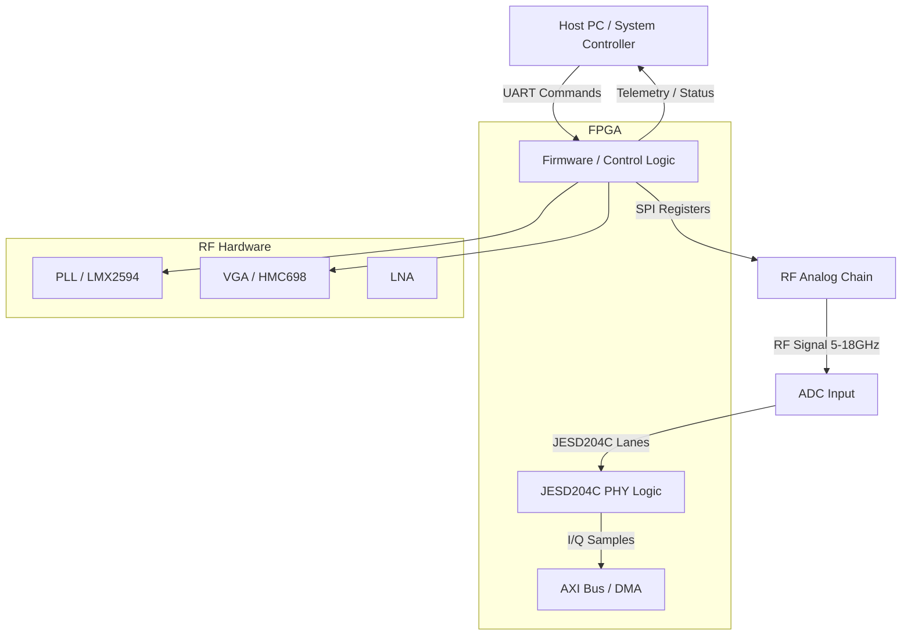
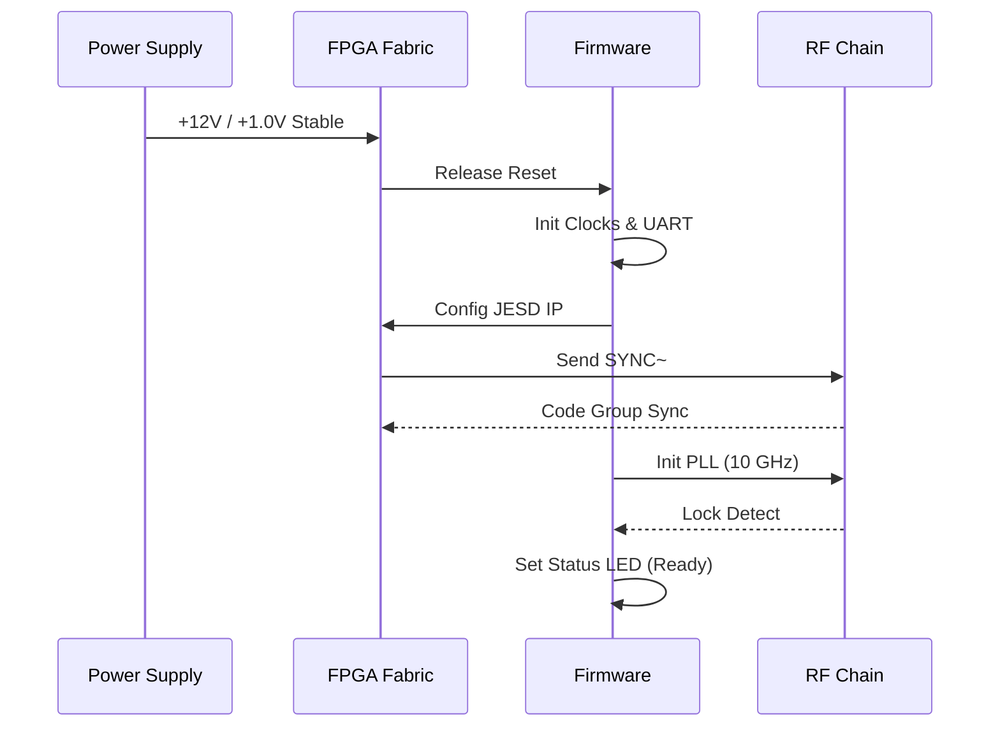
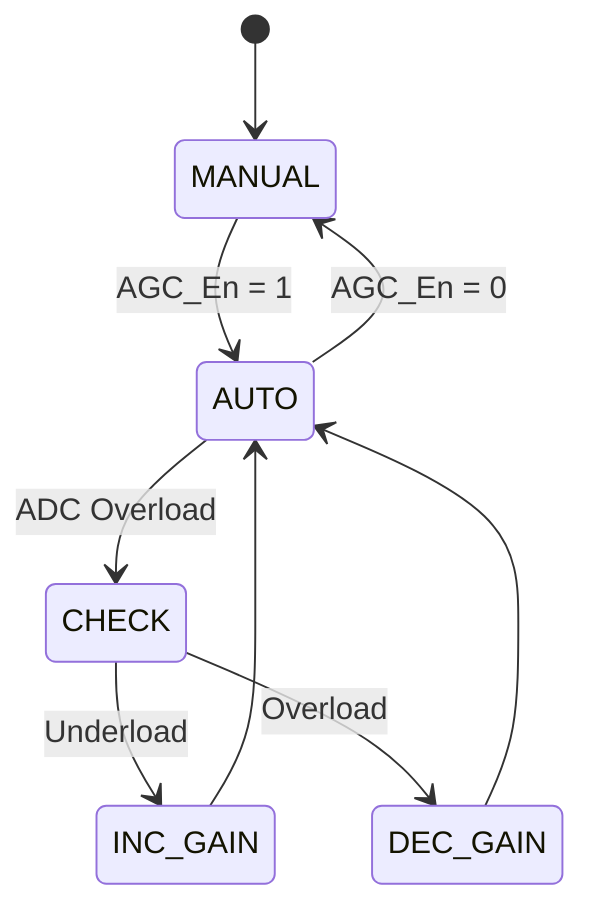
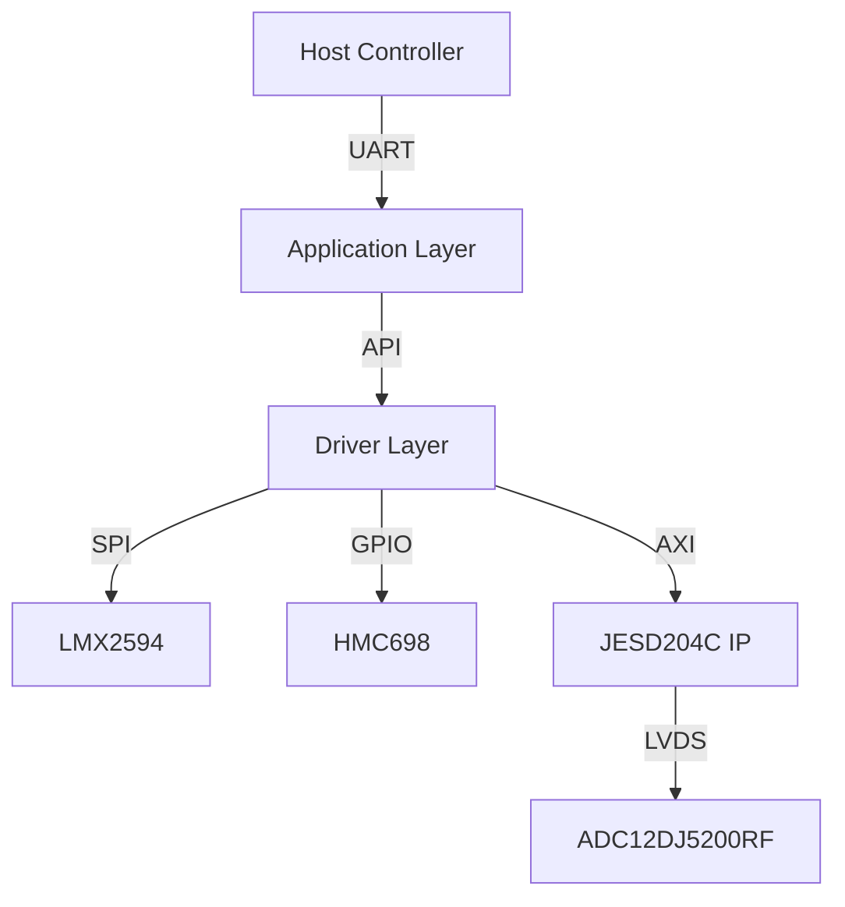

# Software Requirements Specification (SRS)

**Project:** khg Wideband RF Receiver
**Version:** 1.0
**Date:** 16 April 2026
**Status:** Initial Release

---

## Document Control

| Version | Date | Author | Changes |
|---------|------|--------|---------|
| 1.0 | 16 April 2026 | System Architect | Initial Release derived from HRS (P2) and GLR (P6) |

---

# 1. Introduction

## 1.1 Purpose
This Software Requirements Specification (SRS) defines the comprehensive software and firmware requirements for the **khg** Wideband RF Receiver Front-End system. This document specifies the requirements for the embedded firmware running on the Xilinx XQRKU060 FPGA and the associated micro-controller subsystem (if applicable or soft-core).

The purpose of this SRS is to:
1.  Define the behavioral and functional requirements for the firmware controlling the RF signal chain (LNA, Mixer, PLL).
2.  Specify the software requirements for the JESD204C Subclass 1 interface implementation.
3.  Establish requirements for the control plane UART protocol and telemetry monitoring.
4.  Ensure the software satisfies the hardware constraints defined in the Hardware Requirements Specification (HRS) P2 and the Glue Logic Requirements (GLR) P6.

This document is intended for embedded firmware engineers, system verification engineers, and hardware integration teams.

## 1.2 Scope
The software scope encompasses the low-level drivers, hardware abstraction layer (HAL), and control logic necessary to operate the **khg** receiver module.

**In-Scope:**
*   **FPGA Firmware:** RTL logic for interfacing with the ADC12DJ5200RF (JESD204C PHY/Bridge).
*   **Embedded Software (C):** Control algorithms for the LMX2594 PLL synthesizer via SPI.
*   **Embedded Software (C):** Gain control logic for the HMC698LP4 digital attenuator.
*   **Embedded Software (C):** UART command parser for host interaction.
*   **Firmware:** Power sequencing logic and health monitoring (telemetry).
*   **Diagnostics:** Built-In Self-Test (BIST) and fault logging.

**Out-of-Scope:**
*   Signal processing algorithms (FFT, demodulation) performed on the digitized I/Q data *after* the JESD204C interface (this is considered Host/Downstream processing).
*   Mechanical housing or external chassis control software.
*   Host PC driver software (beyond the wire protocol defined here).

## 1.3 Definitions, Acronyms, and Abbreviations

| Acronym | Definition |
| :--- | :--- |
| **ADC** | Analog-to-Digital Converter |
| **AGC** | Automatic Gain Control |
| **API** | Application Programming Interface |
| **AU** | Architectural Unit (Design element) |
| **BGA** | Ball Grid Array |
| **BIST** | Built-In Self Test |
| **BOM** | Bill of Materials |
| **BRAM** | Block RAM (FPGA on-chip memory) |
| **CI** | Configuration Item |
| **CLB** | Configurable Logic Block |
| **COTS** | Commercial Off-The-Shelf |
| **CRC** | Cyclic Redundancy Check |
| **DAC** | Digital-to-Analog Converter |
| **DC** | Direct Current |
| **DMA** | Direct Memory Access |
| **DSP** | Digital Signal Processing |
| **EMI** | Electromagnetic Interference |
| **ESD** | Electrostatic Discharge |
| **FPGA** | Field-Programmable Gate Array |
| **FRR** | Failure Review Board |
| **GLR** | Glue Logic Requirements |
| **GPIO** | General Purpose Input/Output |
| **HAL** | Hardware Abstraction Layer |
| **HRS** | Hardware Requirements Specification |
| **I2C** | Inter-Integrated Circuit |
| **ICD** | Interface Control Document |
|**IEEE** | Institute of Electrical and Electronics Engineers |
| **IIP3** | Input Third-Order Intercept Point |
| **I/O** | Input/Output |
| **IP** | Intellectual Property |
| **IRQ** | Interrupt Request |
| **ISR** | Interrupt Service Routine |
| **JESD204C** | JEDEC Standard High-Speed Serial Interface |
| **LED** | Light Emitting Diode |
| **LFSR** | Linear Feedback Shift Register |
| **LNA** | Low Noise Amplifier |
| **LO** | Local Oscillator |
| **LVDS** | Low-Voltage Differential Signaling |
| **MISR** | Management Information Systems Requirement |
| **MOSI** | Master Out Slave In (SPI) |
| **MISO** | Master In Slave Out (SPI) |
| **MSB** | Most Significant Bit |
| **MUX** | Multiplexer |
| **NF** | Noise Figure |
| **NVM** | Non-Volatile Memory |
| **PCB** | Printed Circuit Board |
| **PHY** | Physical Layer |
| **PLL** | Phase-Locked Loop |
| **POR** | Power-On Reset |
| **POST** | Power-On Self Test |
| **RF** | Radio Frequency |
| **RAM** | Random Access Memory |
| **ROM** | Read-Only Memory |
| **RTL** | Register Transfer Level |
| **RX** | Receive |
| **SFDR** | Spurious-Free Dynamic Range |
| **SNR** | Signal-to-Noise Ratio |
| **SPI** | Serial Peripheral Interface |
| **SR** | Stakeholder Requirements |
| **SRS** | Software Requirements Specification |
| **StRS** | Stakeholder Requirements Specification |
| **SyRS** | System Requirements Specification |
| **SYSREF** | System Reference (JESD204C) |
| **TPS** | Test Procedure Specification |
| **TRP** | Transmit/Receive Point |
| **UART** | Universal Asynchronous Receiver/Transmitter |
| **UDP** | User Datagram Protocol |
| **USB** | Universal Serial Bus |
| **VCO** | Voltage-Controlled Oscillator |
| **VHDL** | VHSIC Hardware Description Language |
| **WDT** | Watchdog Timer |

## 1.4 References
1.  **IEEE 830-1998**: Recommended Practice for Software Requirements Specifications.
2.  **ISO/IEC/IEEE 29148:2018**: Systems and software engineering — Life cycle processes — Requirements engineering.
3.  **MISRA C:2012**: Guidelines for the Use of the C Language in Critical Systems.
4.  **JEDEC JESD204C.01**: Standard for High-Speed Serial Interface for Data Converters.
5.  **khg Hardware Requirements Specification (HRS)**: Document P2, Rev 1.0, 16 April 2026.
6.  **khg Glue Logic Requirements (GLR)**: Document P6, Rev 0V01, 16 April 2026.
7.  **Texas Instruments LMX2594 Datasheet**: Wideband PLL with Integrated VCO.
8.  **Analog Devices HMC698LP4 Datasheet**: 6-Bit Digital Attenuator.
9.  **TI ADC12DJ5200RF Datasheet**: 12-Bit, 10.4 GSPS, Dual ADC.
10. **Xilinx UG576**: XQRKU060 FPGA Data Sheet and DC/AC Switching Characteristics.

## 1.5 Overview
The remainder of this document is organized as follows:
*   **Section 2 (Overall Description)**: Provides the product perspective, context diagrams, and high-level functions. It details the relationship between the embedded software and the analog/digital hardware.
*   **Section 3 (Specific Requirements)**: Contains the detailed functional requirements (REQ-SW-001 through REQ-SW-075), performance constraints, and design constraints.
*   **Section 4 (Verification and Validation)**: Defines the testing strategy, unit tests, and integration requirements.
*   **Section 5 (Traceability Matrix)**: Maps software requirements to hardware and system sources.
*   **Appendices**: Contains register maps, error codes, and architectural diagrams.

---

# 2. Overall Description

## 2.1 Product Perspective
The **khg** software is embedded firmware residing on the Xilinx XQRKU060 FPGA (Soft-core MicroBlaze or Hard-core RISC-V) and associated RTL logic. It operates as the control plane for the analog RF chain and the data plane manager for the JESD204C link.

**System Context Diagram:**


The firmware does not perform signal processing on the I/Q data but ensures the integrity of the transport layer and configures the analog frontend to optimize signal quality.

## 2.2 Product Functions
A summary of the major software functions:

1.  **System Initialization**: Executes POR (Power-On Reset) sequence, configures clocks (PLL), and initializes external peripherals (SPI, I2C).
2.  **JESD204C Link Management**: Brings up the high-speed link to the ADC12DJ5200RF. Handles Subclass 1 alignment using SYSREF.
3.  **Frequency Synthesis**: Configures the LMX2594 PLL frequency based on host requests.
4.  **Gain Control**: Adjusts the HMC698LP4 attenuator based on manual commands or AGC algorithms.
5.  **Telemetry Monitoring**: Periodically polls ADC internal sensors (temperature, voltage) via SPI.
6.  **Fault Management**: Detects loss of lock, ADC over-range, or temperature excursions and triggers safety shutdowns.
7.  **UART Command Processor**: Parses binary commands from the host to read/write registers and configuration memory.
8.  **Non-Volatile Memory Management**: Loads calibration coefficients from external Flash/EEPROM at startup.
9.  **Watchdog Timer**: Maintains system health; resets the FPGA if the main loop stalls.

## 2.3 User Characteristics
*   **Firmware Engineers**: Develop and maintain the C/HDL code. Require low-level register access documentation.
*   **System Integrators**: Integrate the **khg** module into a larger chassis. Use the UART API for high-level control.
*   **Test Engineers**: Validate RF performance. Use diagnostic commands to loop back data and inject test tones.

## 2.4 Constraints
1.  **Compliance**: Software must comply with MISRA-C:2012 guidelines (safety-critical coding standard).
2.  **Memory**: Firmware footprint must fit within 256 KB of Block RAM and 64 KB of L2 Cache/DDR if available.
3.  **Timing**: SPI transactions to the PLL must complete within 10 µs to ensure fast frequency hopping.
4.  **Environment**: Software must be robust to military temperature ranges (-55°C to +125°C), requiring no dynamic memory allocation (heap) after initialization.
5.  **Latency**: AGC adjustments must settle within the 1 µs RF envelope requirement.

## 2.5 Assumptions and Dependencies
1.  The Hardware Power Sequencer ensures +12V is stable and +1.0V FPGA core is stable before FPGA logic begins execution.
2.  The 100 MHz reference clock input to the FPGA is stable and within ±20 ppm.
3.  The Host system supports 3.3V LVDS UART levels.
4.  JESD204C Lane rates will not exceed 12.5 Gbps.

---

# 3. Specific Requirements

## 3.1 External Interface Requirements

### 3.1.1 Hardware Interfaces

#### 3.1.1.1 UART Interface
The control interface uses a 3.3V LVCMOS UART running at 115200 baud, 8-N-1.

**C Structure Definition:**
```c
/**
 * @brief UART Register Map Structure
 * @note Memory mapped to FPGA AXI Lite Base Address
 */
typedef struct {
    volatile uint32_t BAUD_DIV;    /* Offset 0x00: Baud rate divisor */
    volatile uint32_t CTRL;        /* Offset 0x04: Control register (Bit 0: Enable) */
    volatile uint32_t STATUS;      /* Offset 0x08: Status register (Bit 0: RX Empty) */
    volatile uint32_t TX_DATA;     /* Offset 0x0C: TX Data FIFO */
    volatile uint32_t RX_DATA;     /* Offset 0x10: RX Data FIFO */
    volatile uint32_t IRQ_EN;      /* Offset 0x14: Interrupt Enable */
} UART_RegMap_t;

/* Base Address defined in GLR Section 7 */
#define UART_BASE_ADDR 0x42C10000

/* Driver API */
int32_t UART_Init(uint32_t baud_rate);
int32_t UART_WriteByte(uint8_t data);
int32_t UART_ReadByte(uint8_t *data, uint32_t timeout_ms);
```

#### 3.1.1.2 SPI Interface (PLL/VGA/ADC)
The firmware controls three SPI devices: LMX2594 (PLL), HMC698LP4 (VGA), and ADC12DJ5200RF (ADC). These share a bus or use separate chip selects.

**C Structure Definition:**
```c
typedef struct {
    volatile uint32_t SPI_CTRL;    /* Control: Start, Polarity, Phase */
    volatile uint32_t SPI_DIV;     /* Clock Divider (SCK = Bus_Clk / (2 * (DIV+1))) */
    volatile uint32_t SPI_SS;      /* Slave Select (Bit 0: PLL, Bit 1: VGA, Bit 2: ADC) */
    volatile uint32_t SPI_TXD;     /* Transmit Data (32-bit) */
    volatile uint32_t SPI_RXD;     /* Receive Data (32-bit) */
    volatile uint32_t SPI_STATUS;  /* Status: Busy, TX Full */
} SPI_RegMap_t;

#define SPI_BASE_ADDR 0x42C20000

/* Driver API */
int32_t SPI_Init(void);
int32_t SPI_Transfer(uint32_t tx_data, uint32_t *rx_data, uint8_t slave_id);
/* Specific Device Helpers */
int32_t LMX2594_WriteReg(uint16_t reg_addr, uint32_t value);
int32_t HMC698_WriteGain(uint8_t gain_index); /* 0 to 63 for 0.5dB steps */
int32_t ADC_SoftReset(void);
```

#### 3.1.1.3 JESD204C Interface
Controlled primarily via RTL, but firmware accesses configuration registers.

**C Structure Definition:**
```c
typedef struct {
    volatile uint32_t JESD_CTRL;      /* Enable, Link Reset */
    volatile uint32_t JESD_STATUS;    /* Link Ready, ALIGN status */
    volatile uint32_t JESD_ERR_COUNT; /* Disparity errors, Not-in-table errors */
    volatile uint32_t SYSREF_CTRL;    /* SYSREF generation enable */
} JESD_RegMap_t;

#define JESD_BASE_ADDR 0x42C30000

/* Driver API */
int32_t JESD_Init(void);
int32_t JESD_WaitAlign(uint32_t timeout_ms);
```

### 3.1.2 Software Interfaces
*   **Xilinx Standalone OS**: Used for basic hardware drivers (e.g., xuartps.c, xspips.c).
*   **Standard C Library (libc)**: Used for string manipulation and standard math functions.

### 3.1.3 Communication Interfaces

**Frame Formats (from GLR Section 5.2):**

The firmware implements a binary protocol over the UART interface.

| Command | CMD byte | Frame Structure | Response |
|---------|----------|-----------------|----------|
| Single Write | 0x57 ('W') | `[0x57][ADDR_H][ADDR_L][DATA_H][DATA_L]` | `[0x06] ACK` |
| Single Read  | 0x52 ('R') | `[0x52][ADDR_H\|0x80][ADDR_L]` | `[DATA_H][DATA_L]` |
| Bulk Write   | 0x42 ('B') | `[0x42][ADDR_H][ADDR_L][N][D0_H][D0_L]...[Dn_H][Dn_L]` | `[0x06] ACK` |
| Bulk Read    | 0x62 ('b') | `[0x62][ADDR_H\|0x80][ADDR_L][N]` | `[D0_H][D0_L]...[Dn_H][Dn_L]` |
| Error NAK    | 0x15 | Sent by FPGA on invalid command/address | — |

*   **Address Space**: 16-bit (0x0000–0xFFFF).
*   **Read Flag**: Bit 15 set (OR 0x8000).
*   **Max Bulk Count (N)**: 64 registers.
*   **Timeout**: Host inter-byte timeout 50ms.
*   **ACK**: 0x06; **NAK**: 0x15.

## 3.2 Functional Requirements

### 3.2.1 System Initialization (REQ-SW-001 to REQ-SW-010)

| ID | Requirement Statement | Source | Priority | Verification |
|----|------------------------|--------|----------|--------------|
| **REQ-SW-001** | The software SHALL complete the Power-On Self-Test (POST) within 500ms of 3.3V rail stabilization. | HRS §3.5 | Mandatory | T (Test) |
| **REQ-SW-002** | The software SHALL configure the LMX2594 PLL to the default frequency of 10.0 GHz upon startup. | HRS §3.1 | Mandatory | A (Analysis) |
| **REQ-SW-003** | The software SHALL verify the PLL Lock Detect bit is set before enabling the RF frontend. | LMX2594 DS | Mandatory | T (Test) |
| **REQ-SW-004** | The software SHALL initialize the HMC698LP4 VGA to 0dB attenuation (Max Gain) on startup. | HRS §3.1 | Mandatory | I (Inspection) |
| **REQ-SW-005** | The software SHALL enable the JESD204C PHY layer and wait for "Code Group Sync" before proceeding. | GLR §4 | Mandatory | T (Test) |
| **REQ-SW-006** | The software SHALL load configuration parameters (Default Frequency, Gain) from non-volatile Flash memory at address 0x00000000. | HRS §3.1 | Mandatory | T (Test) |
| **REQ-SW-007** | The software SHALL initialize the Watchdog Timer with a 100ms timeout before entering the main loop. | HRS §3.5 | Mandatory | T (Test) |
| **REQ-SW-008** | If Flash checksum fails, the software SHALL revert to hardcoded safe default parameters. | HRS §3.4 | Mandatory | T (Test) |
| **REQ-SW-009** | The software SHALL configure the Multi-Gigabit Transceivers (MGTs) to 12.5 Gbps based on the onboard oscillator. | GLR §4 | Mandatory | I (Inspection) |
| **REQ-SW-010** | The software SHALL set the STATUS_LED to a solid ON state upon successful completion of initialization. | GLR §4 | Mandatory | D (Demo) |

### 3.2.2 RF Control & PLL (REQ-SW-011 to REQ-SW-020)

| ID | Requirement Statement | Source | Priority | Verification |
|----|------------------------|--------|----------|--------------|
| **REQ-SW-011** | The software SHALL provide an API function `RF_SetFrequency(uint64_t freq_hz)` that programs the LMX2594. | HRS §3.1 | Mandatory | T (Test) |
| **REQ-SW-012** | The software SHALL calculate the required PLL integer divider (N) and fractional divider (F) with a precision of < 1 kHz error. | HRS §3.1 | Mandatory | A (Analysis) |
| **REQ-SW-013** | The software SHALL assert the `RF_MUTE` signal during frequency changes to suppress transients. | HRS §3.1 | Mandatory | D (Demo) |
| **REQ-SW-014** | The software SHALL poll the `MUXOUT` register of the LMX2594 to verify Lock Detect within 100 µs of programming. | LMX2594 DS | Mandatory | T (Test) |
| **REQ-SW-015** | If the PLL fails to lock after 3 attempts, the software SHALL flag a critical fault (ERR_PLL_LOSS). | HRS §3.5 | Mandatory | T (Test) |
| **REQ-SW-016** | The software SHALL allow writing to the 64-bit frequency register via the UART Bulk Write command. | GLR §5 | Mandatory | T (Test) |
| **REQ-SW-017** | The software SHALL support frequency hopping across the 5-18 GHz band with a settling time < 10 µs. | HRS §3.1 | Mandatory | T (Test) |
| **REQ-SW-018** | The software SHALL initialize the LMX2594 SPI bus to a maximum clock speed of 10 MHz. | LMX2594 DS | Mandatory | I (Inspection) |
| **REQ-SW-019** | The software SHALL configure the PLL output power to +5 dBm (default) to match the Mixer LO drive requirements. | MWC-1440+ DS | Mandatory | T (Test) |
| **REQ-SW-020** | The software SHALL read back the PLL frequency register and compare it against the requested value for verification. | HRS §3.2 | Mandatory | T (Test) |

### 3.2.3 Gain Control & AGC (REQ-SW-021 to REQ-SW-030)

| ID | Requirement Statement | Source | Priority | Verification |
|----|------------------------|--------|----------|--------------|
| **REQ-SW-021** | The software SHALL provide an API function `RF_SetGain(uint8_t gain_db)` controlling the HMC698LP4. | HRS §3.1 | Mandatory | T (Test) |
| **REQ-SW-022** | The HMC698LP4 driver SHALL map input gain (0-31.5 dB) to the 6-bit parallel control word (1 LSB = 0.5 dB). | HMC698 DS | Mandatory | I (Inspection) |
| **REQ-SW-023** | The software SHALL update the gain setting within 100 ns of the register write (limited by FPGA logic). | HRS §3.1 | Mandatory | A (Analysis) |
| **REQ-SW-024** | The software SHALL implement an Automatic Gain Control (AGC) loop if enabled by register bit 0x00[0]. | HRS §3.1 | Optional | T (Test) |
| **REQ-SW-025** | The AGC algorithm SHALL target the ADC full-scale range (-1 dBFS) for optimal SNR. | HRS §3.1 | Mandatory | T (Test) |
| **REQ-SW-026** | The AGC loop SHALL adjust gain in 1 dB steps based on the ADC's overflow flag. | HRS §3.1 | Mandatory | T (Test) |
| **REQ-SW-027** | The software SHALL prevent the gain from exceeding 31.5 dB or dropping below 0 dB. | HMC698 DS | Mandatory | T (Test) |
| **REQ-SW-028** | The software shall provide a 'Hold Gain' mode where AGC is suspended and manual gain is accepted. | GLR §5 | Mandatory | D (Demo) |
| **REQ-SW-029** | The software SHALL log the last 100 gain changes to a circular buffer for diagnostics. | HRS §3.2 | Mandatory | I (Inspection) |
| **REQ-SW-030** | The software shall drive the parallel gain control lines (GPIO[5:0]) directly from the FPGA fabric to minimize latency. | GLR §4 | Mandatory | I (Inspection) |

### 3.2.4 JESD204C Data Interface (REQ-SW-031 to REQ-SW-040)

| ID | Requirement Statement | Source | Priority | Verification |
|----|------------------------|--------|----------|--------------|
| **REQ-SW-031** | The software SHALL initialize the JESD204C IP core with parameters: L=4, M=2, F=2, S=1. | ADC12DJ DS | Mandatory | T (Test) |
| **REQ-SW-032** | The software SHALL assert the SYNC~ signal to the ADC to initiate code group synchronization. | JESD204C Std | Mandatory | D (Demo) |
| **REQ-SW-033** | The software SHALL monitor the `ALIGN` status bit; initialization is complete only when all 4 lanes report alignment. | GLR §4 | Mandatory | T (Test) |
| **REQ-SW-034** | The software SHALL configure the Subclass 1 deterministic latency mode. | HRS §3.2 | Mandatory | I (Inspection) |
| **REQ-SW-035** | The software shall generate SYSREF pulses (one-shot or continuous) based on register 0x50[0]. | GLR §4 | Mandatory | T (Test) |
| **REQ-SW-036** | The software SHALL report a Lane 0 Disparity Error if the error counter increments > 10 times/sec. | HRS §3.5 | Mandatory | T (Test) |
| **REQ-SW-037** | The software SHALL monitor the ADC `CLK` input via the FPGA clock status register. | GLR §4 | Mandatory | I (Inspection) |
| **REQ-SW-038** | Upon loss of link, the software SHALL attempt a full link reset without requiring a system power cycle. | HRS §3.1 | Mandatory | T (Test) |
| **REQ-SW-039** | The software SHALL read the ADC device ID (0x5355) via SPI to verify communication. | ADC12DJ DS | Mandatory | T (Test) |
| **REQ-SW-040** | The software SHALL buffer the I/Q data in FPGA BRAM before transmitting it off-chip if backpressure is detected. | GLR §4 | Mandatory | T (Test) |

### 3.2.5 UART Command Processor (REQ-SW-041 to REQ-SW-050)

| ID | Requirement Statement | Source | Priority | Verification |
|----|------------------------|--------|----------|--------------|
| **REQ-SW-041** | The software SHALL implement a UART Rx interrupt service routine (ISR) to parse incoming bytes. | GLR §5 | Mandatory | T (Test) |
| **REQ-SW-042** | The parser SHALL reject any command with an invalid CMD byte and return NAK (0x15). | GLR §5 | Mandatory | T (Test) |
| **REQ-SW-043** | The software SHALL interpret address 0xFFFF as a broadcast address for all writable registers. | GLR §5 | Mandatory | T (Test) |
| **REQ-SW-044** | For Bulk Read commands, the software SHALL wait for N bytes before transmitting the response payload. | GLR §5 | Mandatory | T (Test) |
| **REQ-SW-045** | The software SHALL support the Single Write command (0x57) with a payload size of 4 bytes. | GLR §5 | Mandatory | T (Test) |
| **REQ-SW-046** | The software SHALL support the Single Read command (0x52) returning 2 bytes of data. | GLR §5 | Mandatory | T (Test) |
| **REQ-SW-047** | The software SHALL implement a 10ms inter-character timeout to reset the state machine. | GLR §5 | Mandatory | T (Test) |
| **REQ-SW-048** | The software SHALL echo the command byte in the response packet if configured for debug mode. | GLR §5 | Optional | T (Test) |
| **REQ-SW-049** | The software SHALL allow writing to the "Test Pattern Register" (0x0100) to enable ADC PRBS patterns. | GLR §5 | Mandatory | T (Test) |
| **REQ-SW-050** | The UART driver SHALL use a 256-byte deep FIFO for both TX and RX. | GLR §4 | Mandatory | I (Inspection) |

### 3.2.6 Telemetry & Diagnostics (REQ-SW-051 to REQ-SW-060)

| ID | Requirement Statement | Source | Priority | Verification |
|----|------------------------|--------|----------|--------------|
| **REQ-SW-051** | The software SHALL read the on-board temperature sensor every 1 second. | HRS §3.4 | Mandatory | T (Test) |
| **REQ-SW-052** | The software SHALL assert a critical fault if the temperature exceeds +120°C. | HRS §3.4 | Mandatory | T (Test) |
| **REQ-SW-053** | The software SHALL measure the +12V supply rail using the ADC's auxiliary ADC input. | HRS §3.3 | Mandatory | T (Test) |
| **REQ-SW-054** | The software SHALL store the last 64 fault log entries in Flash with a timestamp. | HRS §3.2 | Mandatory | I (Inspection) |
| **REQ-SW-055** | The software SHALL provide a UART command (0x99) to dump the fault log. | GLR §5 | Mandatory | T (Test) |
| **REQ-SW-056** | The software SHALL expose a software version register at address 0x0000 (e.g., 0x0100 for v1.0.0). | GLR §5 | Mandatory | T (Test) |
| **REQ-SW-057** | The software SHALL calculate and update a CRC-32 of the firmware image in RAM every hour. | HRS §3.5 | Mandatory | T (Test) |
| **REQ-SW-058** | The software SHALL monitor the PLL VCO voltage for out-of-bounds conditions if available. | LMX2594 DS | Optional | A (Analysis) |
| **REQ-SW-059** | The software shall increment an "Uptime Counter" register every second. | GLR §5 | Mandatory | I (Inspection) |
| **REQ-SW-060** | The software SHALL support a "Reset to Factory Defaults" command (0xFF). | GLR §5 | Mandatory | D (Demo) |

### 3.2.7 Safety & Power Management (REQ-SW-061 to REQ-SW-075)

| ID | Requirement Statement | Source | Priority | Verification |
|----|------------------------|--------|----------|--------------|
| **REQ-SW-061** | The software SHALL service the Watchdog Timer at least once every 50ms. | HRS §3.5 | Mandatory | T (Test) |
| **REQ-SW-062** | If the Watchdog expires, the software SHALL assert a global reset and log a "WDT Reset" fault. | HRS §3.5 | Mandatory | T (Test) |
| **REQ-SW-063** | The software SHALL implement a brown-out detect for the 1.0V core rail. | HRS §3.3 | Mandatory | T (Test) |
| **REQ-SW-064** | The software SHALL disable the RF output (set Gain to 0 dB max attenuation) upon detecting a fault. | HRS §3.1 | Mandatory | T (Test) |
| **REQ-SW-065** | The software SHALL use MISRA-C compliant syntax for all control logic. | HRS §3.6 | Mandatory | I (Inspection) |
| **REQ-SW-066** | The software SHALL not use dynamic memory allocation (`malloc`/`free`) after the initialization phase. | HRS §3.2 | Mandatory | I (Inspection) |
| **REQ-SW-067** | The software SHALL ensure all interrupt service routines (ISRs) complete within 10 µs. | HRS §3.1 | Mandatory | A (Analysis) |
| **REQ-SW-068** | The software SHALL mask all interrupts during the critical PLL frequency update phase. | HRS §3.1 | Mandatory | I (Inspection) |
| **REQ-SW-069** | The software SHALL verify the integrity of the Flash memory before loading configuration. | HRS §3.2 | Mandatory | T (Test) |
| **REQ-SW-070** | The software SHALL implement a software interlock to prevent tuning the PLL outside the 5-18 GHz range. | HRS §3.1 | Mandatory | T (Test) |
| **REQ-SW-071** | The software SHALL allow the host to override the interlock via a secure unlock sequence. | GLR §5 | Optional | T (Test) |
| **REQ-SW-072** | The software SHALL configure the FPGA IO banks to the correct VCCO voltages (1.8V/2.5V) via internal logic. | GLR §4 | Mandatory | I (Inspection) |
| **REQ-SW-073** | The software SHALL initialize the system clocks to derive a 100 MHz AXI clock from the onboard oscillator. | GLR §4 | Mandatory | I (Inspection) |
| **REQ-SW-074** | The software SHALL provide a status register bit indicating "RF Ready" (LO Locked AND JESD Aligned). | HRS §3.1 | Mandatory | D (Demo) |
| **REQ-SW-075** | The software SHALL respond to a Ping command (0x50) with a Pong (0x55) within 5ms. | GLR §5 | Mandatory | T (Test) |

## 3.3 Performance Requirements

| ID | Requirement | Metric | Value | Verification |
|----|-------------|--------|-------|--------------|
| **REQ-PERF-001** | Boot Time | Time from +12V stable to RF Ready | < 500 ms | Test |
| **REQ-PERF-002** | Frequency Tuning Speed | Time from SPI write to Lock Detect | < 10 µs | Test |
| **REQ-PERF-003** | Gain Settling Time | Time from gain write to analog stable | < 1 µs | Analysis |
| **REQ-PERF-004** | JESD Link Latency | Deterministic latency per Subclass 1 | < 1 ms (fixed) | Test |
| **REQ-PERF-005** | UART Throughput | Max sustained bytes/sec | > 10 KB/s | Test |
| **REQ-PERF-006** | SPI Clock Frequency | Max SPI SCK to PLL/VGA | 10 MHz | Inspection |
| **REQ-PERF-007** | AGC Reaction Time | Time to respond to ADC overflow | < 500 ns | Test |
| **REQ-PERF-008** | Watchdog Pet Interval | Maximum time between WDT refresh | 50 ms | Test |
| **REQ-PERF-009** | ISR Latency | Max interrupt response delay | < 5 µs | Analysis |
| **REQ-PERF-010** | Power Consumption | Software processing logic contribution | < 1.5 W | Analysis |

## 3.4 Design Constraints
1.  **Language**: C99 for firmware; VHDL-2008 or Verilog-2001 for RTL.
2.  **Compiler**: Xilinx Vitis (GCC based) with `-Wall -Werror` flags.
3.  **Static Analysis**: Code must pass Coverity or Polyspace analysis with 0 critical defects.
4.  **Stack Size**: Total stack usage per thread must not exceed 16 KB.
5.  **Heap**: Heap size shall be 0 bytes (static allocation only).
6.  **Timing Closure**: FPGA logic must meet timing at 12.5 Gbps (MGT) and 100 MHz (Logic).

## 3.5 Software System Attributes

### 3.5.1 Reliability
The software shall achieve a Mean Time Between Failures (MTBF) of 50,000 hours during continuous operation. All critical errors (PLL unlock, JESD link down) shall be recoverable without hardware power cycling (unless latched hardware fault).

### 3.5.2 Availability
The system shall be available for operation 99.9% of the time. Restart time (fast boot) shall be < 200ms for warm restarts.

### 3.5.3 Security
The software shall validate all UART register addresses. Writes to undefined address space shall be ignored. The firmware image shall be protected by a CRC-32 check on boot.

### 3.5.4 Maintainability
All code modules shall have a Cyclomatic Complexity ≤ 15. All functions shall be documented with Doxygen headers.

---

# 4. Verification and Validation

## 4.1 Unit Test Requirements
*   **SPI Driver**: Verify read/write to LMX2594 register 0x00 with loopback.
*   **JESD Core**: Verify state machine transitions from Reset to Synced.
*   **UART Parser**: Inject malformed frames (wrong checksum, bad length) and verify NAK response.

## 4.2 Integration Test Requirements
*   **RF Chain**: Program PLL to 8 GHz; verify Lock Detect active.
*   **JESD Link**: Verify Subclass 1 alignment with SYSREF and capture ADC samples.
*   **Thermal**: Heat sensor to +125°C; verify FAULT flag and RF shutdown.

## 4.3 System Test Requirements
*   **Full Band Sweep**: Sweep 5-18 GHz in 10 MHz steps; verify no lock loss.
*   **Endurance**: Run continuous data capture for 72 hours at 80°C ambient.

---

# 5. Requirements Traceability Matrix

| REQ-SW-xxx | Description | Source (REQ-HW/GLR §) | Priority | Verification |
|-----------|-------------|----------------------|----------|-------------|
| REQ-SW-001 | POST completion < 500ms | HRS §3.5 | Mandatory | T |
| REQ-SW-002 | Init PLL to 10 GHz | HRS §3.1 | Mandatory | A |
| REQ-SW-003 | Verify PLL Lock | HRS §3.1 | Mandatory | T |
| REQ-SW-004 | Init VGA to 0dB | HRS §3.1 | Mandatory | I |
| REQ-SW-005 | JESD Code Group Sync | GLR §4 | Mandatory | T |
| REQ-SW-006 | Load Flash Config | HRS §3.1 | Mandatory | T |
| REQ-SW-007 | Init Watchdog 100ms | HRS §3.5 | Mandatory | T |
| REQ-SW-008 | Fallback on Flash Fail | HRS §3.4 | Mandatory | T |
| REQ-SW-009 | MGT Config 12.5Gbps | GLR §4 | Mandatory | I |
| REQ-SW-010 | LED Status Indication | GLR §4 | Mandatory | D |
| REQ-SW-011 | RF_SetFrequency API | HRS §3.1 | Mandatory | T |
| REQ-SW-012 | PLL Calc Precision | HRS §3.1 | Mandatory | A |
| REQ-SW-013 | RF Mute during Tune | HRS §3.1 | Mandatory | D |
| REQ-SW-014 | Poll Lock Detect | LMX2594 DS | Mandatory | T |
| REQ-SW-015 | Fault on Unlock | HRS §3.5 | Mandatory | T |
| REQ-SW-016 | UART Freq Write | GLR §5 | Mandatory | T |
| REQ-SW-017 | Hop Time < 10us | HRS §3.1 | Mandatory | T |
| REQ-SW-018 | SPI Init 10MHz | LMX2594 DS | Mandatory | I |
| REQ-SW-019 | LO Power +5dBm | MWC1440 DS | Mandatory | T |
| REQ-SW-020 | Readback Freq | HRS §3.2 | Mandatory | T |
| REQ-SW-021 | RF_SetGain API | HRS §3.1 | Mandatory | T |
| REQ-SW-022 | VGA Map 6-bit | HMC698 DS | Mandatory | I |
| REQ-SW-023 | Gain Latency < 100ns | HRS §3.1 | Mandatory | A |
| REQ-SW-024 | AGC Mode Enable | HRS §3.1 | Optional | T |
| REQ-SW-025 | AGC Target -1dBFS | HRS §3.1 | Mandatory | T |
| REQ-SW-026 | AGC Step 1dB | HRS §3.1 | Mandatory | T |
| REQ-SW-027 | Gain Limits 0-31.5dB | HMC698 DS | Mandatory | T |
| REQ-SW-028 | Hold Gain Mode | GLR §5 | Mandatory | D |
| REQ-SW-029 | Log Gain Changes | HRS §3.2 | Mandatory | I |
| REQ-SW-030 | GPIO Parallel Gain | GLR §4 | Mandatory | I |
| REQ-SW-031 | JESD Config L=4,M=2 | ADC12DJ DS | Mandatory | T |
| REQ-SW-032 | Assert SYNC~ | JESD204C Std | Mandatory | D |
| REQ-SW-033 | Align Status | GLR §4 | Mandatory | T |
| REQ-SW-034 | Subclass 1 Mode | HRS §3.2 | Mandatory | I |
| REQ-SW-035 | SYSREF Generation | GLR §4 | Mandatory | T |
| REQ-SW-036 | Disparity Error Mon | HRS §3.5 | Mandatory | T |
| REQ-SW-037 | CLK Mon | GLR §4 | Mandatory | I |
| REQ-SW-038 | Link Reset | HRS §3.1 | Mandatory | T |
| REQ-SW-039 | Read ADC ID | ADC12DJ DS | Mandatory | T |
| REQ-SW-040 | BRAM Backpressure | GLR §4 | Mandatory | T |
| REQ-SW-041 | UART RX ISR | GLR §5 | Mandatory | T |
| REQ-SW-042 | Reject Invalid CMD | GLR §5 | Mandatory | T |
| REQ-SW-043 | Broadcast 0xFFFF | GLR §5 | Mandatory | T |
| REQ-SW-044 | Bulk Read Wait | GLR §5 | Mandatory | T |
| REQ-SW-045 | Single Write 0x57 | GLR §5 | Mandatory | T |
| REQ-SW-046 | Single Read 0x52 | GLR §5 | Mandatory | T |
| REQ-SW-047 | 10ms Interchar | GLR §5 | Mandatory | T |
| REQ-SW-048 | Debug Echo | GLR §5 | Optional | T |
| REQ-SW-049 | Test Pattern Reg | GLR §5 | Mandatory | T |
| REQ-SW-050 | FIFO 256 Bytes | GLR §4 | Mandatory | I |
| REQ-SW-051 | Temp Read 1s | HRS §3.4 | Mandatory | T |
| REQ-SW-052 | Overtemp Fault | HRS §3.4 | Mandatory | T |
| REQ-SW-053 | Measure 12V Rail | HRS §3.3 | Mandatory | T |
| REQ-SW-054 | Fault Log 64 Ent | HRS §3.2 | Mandatory | I |
| REQ-SW-055 | Dump Fault Log | GLR §5 | Mandatory | T |
| REQ-SW-056 | Ver Reg @ 0x0000 | GLR §5 | Mandatory | T |
| REQ-SW-057 | CRC-32 Check | HRS §3.5 | Mandatory | T |
| REQ-SW-058 | VCO Volt Mon | LMX2594 DS | Optional | A |
| REQ-SW-059 | Uptime Counter | GLR §5 | Mandatory | I |
| REQ-SW-060 | Factory Reset | GLR §5 | Mandatory | D |
| REQ-SW-061 | WDT Service 50ms | HRS §3.5 | Mandatory | T |
| REQ-SW-062 | WDT Reset Log | HRS §3.5 | Mandatory | T |
| REQ-SW-063 | Brown-out Det | HRS §3.3 | Mandatory | T |
| REQ-SW-064 | RF Disable Fault | HRS §3.1 | Mandatory | T |
| REQ-SW-065 | MISRA Compliance | HRS §3.6 | Mandatory | I |
| REQ-SW-066 | No Malloc | HRS §3.2 | Mandatory | I |
| REQ-SW-067 | ISR < 10us | HRS §3.1 | Mandatory | A |
| REQ-SW-068 | Mask IRQ for PLL | HRS §3.1 | Mandatory | I |
| REQ-SW-069 | Flash CRC | HRS §3.2 | Mandatory | T |
| REQ-SW-070 | Freq Interlock | HRS §3.1 | Mandatory | T |
| REQ-SW-071 | Override Interlock | GLR §5 | Optional | T |
| REQ-SW-072 | Bank IO Config | GLR §4 | Mandatory | I |
| REQ-SW-073 | Clock Init 100MHz | GLR §4 | Mandatory | I |
| REQ-SW-074 | RF Ready Bit | HRS §3.1 | Mandatory | D |
| REQ-SW-075 | Ping/Pong | GLR §5 | Mandatory | T |

---

# 6. Appendices

## Appendix A: Error Codes
```c
typedef enum {
    ERR_OK              = 0x00,
    ERR_TIMEOUT         = 0x01,
    ERR_COMM_SPI        = 0x02,
    ERR_CHECKSUM        = 0x03,
    ERR_PARAM           = 0x04,
    ERR_NOT_INIT        = 0x05,
    ERR_HARDWARE        = 0x07,
    ERR_OVERFLOW        = 0x08,
   _ERR_FLASH_WRITE     = 0x0A,
    ERR_PLL_UNLOCK      = 0x0D,
    ERR_TEMP_HIGH       = 0x0E,
    ERR_VOLT_FAULT      = 0x0F,
    ERR_WDT_EXPIRED     = 0x12,
    ERR_JESD_ALIGN      = 0x14
} ErrorCode_t;
```

## Appendix B: Register Map Summary
| Address | Name | R/W | Reset | Description |
|---------|------|-----|-------|-------------|
| 0x0000 | FIRMWARE_VER | R | 0x0100 | Firmware Version |
| 0x0001 | STATUS | R | - | RF Ready, PLL Lock, JESD Align bits |
| 0x0010 | FREQ_H | W | 0x00 | Frequency High Word (32-bit) |
| 0x0011 | FREQ_L | W | 0x00 | Frequency Low Word (32-bit) |
| 0x0020 | GAIN_CTRL | W | 0x3F | VGA Gain Setting (6-bit) |
| 0x0030 | AGC_EN | W | 0x01 | AGC Enable (1=On) |
| 0x0100 | TEST_MODE | W | 0x00 | Enable ADC PRBS |
| 0xFFFF | BROADCAST | W | - | Write all registers |

## Appendix C: Mermaid Diagrams

### Boot Sequence


### AGC State Machine


### Software Architecture
