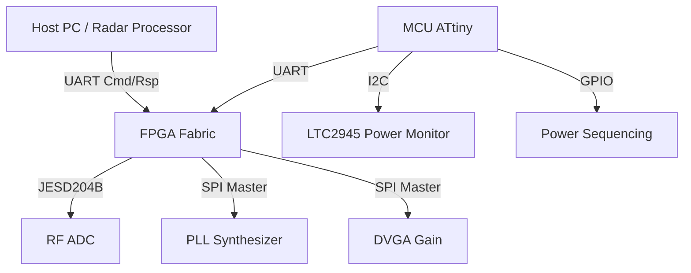
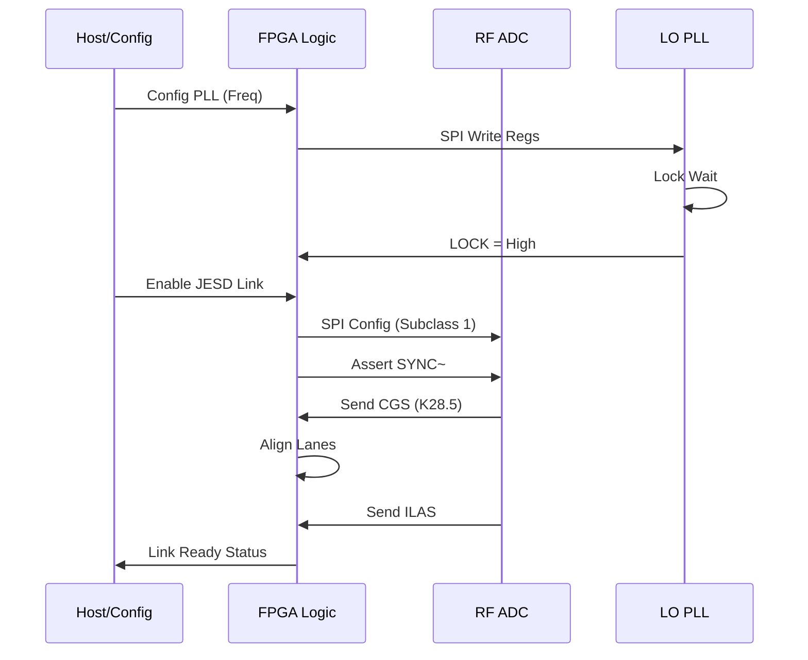
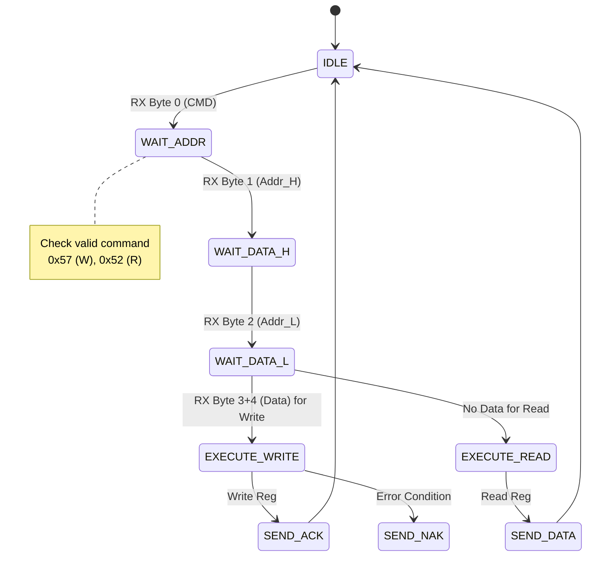
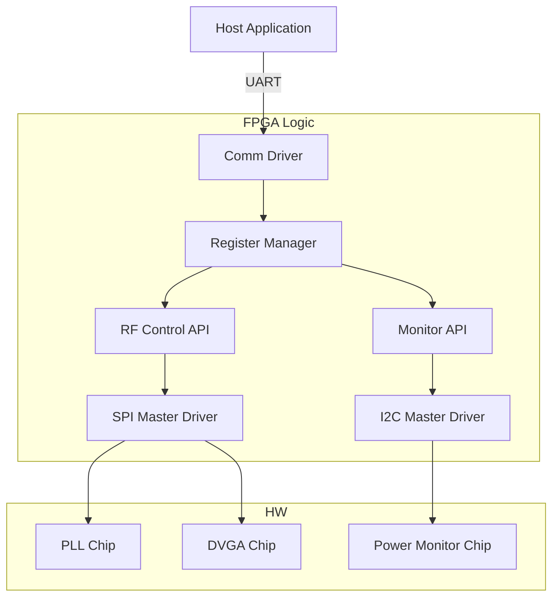
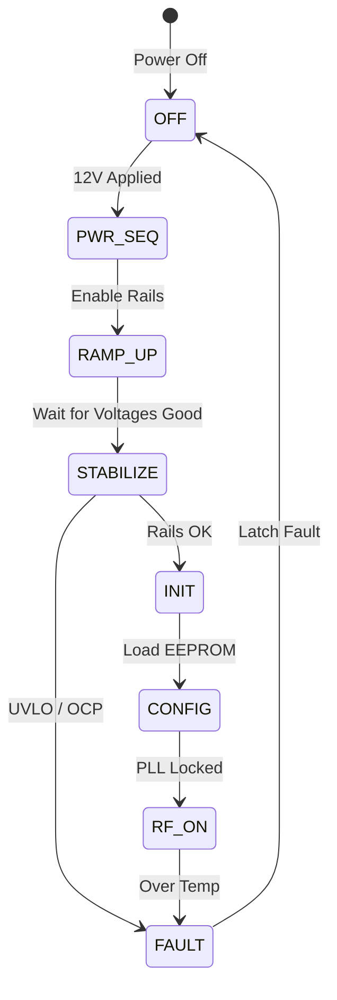

# Software Requirements Specification (SRS)

**Project:** khgk Wideband RF Receiver
**Date:** 16 April 2026
**Version:** 1.0
**Status:** Initial Release
**Compliance:** IEEE 830-1998 / ISO/IEC/IEEE 29148:2018

---

## Document Control

| Version | Date | Author | Changes |
|---------|------|--------|---------|
| 1.0 | 16 April 2026 | Sr. Architect | Initial Release based on HRS v1.0 and GLR v0V01 |

---

# 1. Introduction

## 1.1 Purpose
This Software Requirements Specification (SRS) defines the comprehensive software and firmware requirements for the **khgk Wideband RF Receiver Module**. This document specifies the requirements for the embedded control software (running on the Housekeeping MCU) and the FPGA firmware logic responsible for glue logic, data acquisition, and interface management.

The purpose of this SRS is to:
1.  Define the **Software Requirements (Level 3)** and **Software Architecture Requirements (Level 4)** as defined by IEEE 29148:2018.
2.  Establish a baseline for the implementation of the JESD204B interface, SPI control drivers, and power management logic.
3.  Ensure traceability between the Hardware Requirements Specification (HRS) [P2], Glue Logic Requirements (GLR) [P6], and the software implementation.
4.  Serve as the binding agreement for verification testing (Unit, Integration, and System).

## 1.2 Scope
The software system scope encompasses the control loop, data path management, and housekeeping functions of the khgk module.

**In-Scope Software Elements:**
*   **FPGA Firmware:**
    *   JESD204B Link Layer (Transport, IP core wrapper).
    *   SPI Master Controllers for PLL (LMX2594), DVGA (HMC698LP4), and ADC (ADC12J4000).
    *   Register Map Interface (UART-to-Register bridge).
    *   Data buffering and throughput management.
*   **Embedded MCU Software (ATtiny1606):**
    *   Power sequencing logic.
    *   I2C Housekeeping (LTC2945 power monitor).
    *   Non-Volatile Memory (EEPROM) management for calibration tables.
    *   Watchdog and fault handling.

**Out-of-Scope Elements:**
*   Host PC application software (e.g., LabVIEW GUI).
*   Signal processing algorithms (DSP) performed *inside* the FPGA (e.g., FFT, filtering) are defined in a separate Algorithm Requirements Document.
*   High-speed PCB layout constraints.

## 1.3 Definitions, Acronyms, and Abbreviations

| Term | Definition |
| :--- | :--- |
| **ADC** | Analog-to-Digital Converter |
| **API** | Application Programming Interface |
| **ASIL** | Automotive Safety Integrity Level |
| **BIST** | Built-In Self-Test |
| **BOM** | Bill of Materials |
| **BSP** | Board Support Package |
| **CE102** | Conducted Emissions, Power Leads |
| **CPLD** | Complex Programmable Logic Device |
| **CRC** | Cyclic Redundancy Check |
| **DAC** | Digital-to-Analog Converter |
| **DMA** | Direct Memory Access |
| **DVGA** | Digital Variable Gain Amplifier |
| **EMI** | Electromagnetic Interference |
| **ENOB** | Effective Number Of Bits |
| **FIFO** | First-In, First-Out |
| **FPGA** | Field-Programmable Gate Array |
| **GLR** | Glue Logic Requirements |
| **GPIO** | General Purpose Input/Output |
| **GSPS** | Giga-Samples Per Second |
| **HAL** | Hardware Abstraction Layer |
| **HRS** | Hardware Requirements Specification |
| **I2C** | Inter-Integrated Circuit |
| **IP** | Intellectual Property (Core) |
| **IPC** | Inter-Process Communication |
| **ISR** | Interrupt Service Routine |
| **JTAG** | Joint Test Action Group |
| **JESD204B/C** | JEDEC Standard for High-Speed Data Converters |
| **LFSR** | Linear Feedback Shift Register |
| **LO** | Local Oscillator |
| **LUT** | Look-Up Table |
| **MCU** | Microcontroller Unit |
| **MISRA** | Motor Industry Software Reliability Association |
| **NVM** | Non-Volatile Memory |
| **PLL** | Phase-Locked Loop |
| **POST** | Power-On Self-Test |
| **QSPI** | Quad Serial Peripheral Interface |
| **RE102** | Radiated Emissions |
| **RF** | Radio Frequency |
| **RoHS** | Restriction of Hazardous Substances |
| **RTOS** | Real-Time Operating System |
| **RTL** | Register Transfer Level |
| **SFDR** | Spurious-Free Dynamic Range |
| **SIL** | Safety Integrity Level |
| **SNR** | Signal-to-Noise Ratio |
| **SPI** | Serial Peripheral Interface |
| **SRS** | Software Requirements Specification |
| **StRS** | Stakeholder Requirements Specification |
| **SyRS** | System Requirements Specification |
| **TRP** | Transmit/Receive Point |
| **UART** | Universal Asynchronous Receiver/Transmitter |
| **VCO** | Voltage-Controlled Oscillator |
| **WDT** | Watchdog Timer |

## 1.4 References

| ID | Document Title | Document Number | Version/Date | Applicability |
|:---|:---|---|---|---|
| **R1** | Systems and Software Engineering — Life Cycle Processes — Requirements Engineering | **IEEE 29148** | 2018 | SRS Structure & Traceability |
| **R2** | Recommended Practice for Software Requirements Specifications | **IEEE 830** | 1998 | SRS Organization |
| **R3** | Guidelines for the Use of the C Language in Critical Systems | **MISRA C:2012** | 2012 | Coding Standards (C) |
| **R4** | Hardware Requirements Specification (khgk) | **HRS P2** | 16 Apr 2026 | HW Interface Definition |
| **R5** | Glue Logic Requirements (khgk) | **GLR P6** | 16 Apr 2026 | Register Map & Protocol |
| **R6** | Functional Safety of E/E/PE Safety-related Systems | **IEC 61508** | 2010 | Safety Processes (if SIL applicable) |
| **R7** | ADC12DJ3200/ADC12J4000 Datasheet | **TI** | SBAS904B | JESD204B Interface Timing |
| **R8** | LMX2594 Datasheet | **TI** | SNAS674D | PLL Register Programming Guide |
| **R9** | HMC698LP4 Datasheet | **Analog Devices** | 2017 | DVGA SPI Protocol |
| **R10** | LTC2945 Datasheet | **Analog Devices** | - | I2C Power Monitor Protocol |

## 1.5 Overview
Section 2 describes the overall system architecture, hardware interfaces, and constraints.
Section 3 provides the detailed specific requirements, including functional, performance, and design constraints.
Section 4 outlines the verification and validation strategy.
Section 5 provides the Requirements Traceability Matrix (RTM).
Appendices include data structures, error codes, and diagrams.

This SRS covers both the **FPGA Firmware** (responsible for high-speed data link and configuration) and the **MCU Firmware** (responsible for power sequencing and housekeeping).

---

# 2. Overall Description

## 2.1 Product Perspective
The khgk software operates as a distributed embedded system consisting of a Host Controller (via UART), an FPGA (Data Plane), and an MCU (Control Plane).

### System Context


### Hardware Interfaces
*   **RF Interface:** 5–18 GHz input, down-converted to IF/BB.
*   **Digital Interface:** JESD204B (4 lanes) to FPGA.
*   **Control Interface:** UART (3.3V CMOS) for Register Read/Write.
*   **SPI Bus:** Shared bus for PLL, DVGA, and ADC configuration.
*   **I2C Bus:** Dedicated to Power Monitor and Temperature sensors.

### Software Stack Layers
1.  **Application Layer (Host):** Command parsing, telemetry display.
2.  **Firmware Layer (FPGA/MCU):**
    *   **FPGA:** JESD204B IP, SPI Drivers, Register Map, UART Parser.
    *   **MCU:** Power Sequencing State Machine, I2C Drivers, EEPROM Manager.
3.  **Hardware Abstraction Layer (HAL):** GPIO drivers, SPI/I2C bit-bang or peripheral drivers.
4.  **Hardware Layer:** ADC, PLL, LNA, Power Supplies.

## 2.2 Product Functions
1.  **System Initialization:** Execute power-up sequence, verify PLL lock, download ADC coefficients.
2.  **JESD204B Link Management:** Establish lane alignment, verify deterministic latency (Subclass 1).
3.  **RF Configuration:** Set LO frequency (LMX2594), Set Gain (HMC698LP4), Enable/Disable RF Path.
4.  **Telemetry Reporting:** Monitor current/voltage (LTC2945), temperature (On-die sensors).
5.  **Fault Management:** Detect over-current, over-temp, PLL unlock; assert hardware fault pins.
6.  **Calibration Management:** Store/Retrieve gain calibration tables from EEPROM.

## 2.3 User Characteristics
*   **Firmware Engineers:** Develop VHDL/Verilog code for FPGA and C code for MCU using this spec.
*   **Test Engineers:** Validate RF performance and digital interface timing using requirements defined herein.
*   **System Integrators:** Integrate the module into a larger radar/EW chassis via UART.

## 2.4 Constraints
1.  **MISRA-C:** All MCU C code shall adhere to MISRA C:2012 guidelines.
2.  **Timing:** PLL tuning must complete within 5 µs (REQ-HW-014) excluding T settles time.
3.  **Memory:** FPGA Block RAM usage shall not exceed 80% to allow for routing.
4.  **Environment:** Software must function reliably from -55°C to +125°C (REQ-HW-009).
5.  **Determinism:** JESD204B latency must be deterministic.

## 2.5 Assumptions and Dependencies
*   The host supplies a stable 12V or 15V input.
*   The reference clock for the PLL and ADC is stable (e.g., 100 MHz, <1 ppm).
*   The FPGA is configured from a local flash (not covered in this SRS) before the software initializes the RF path.

---

# 3. Specific Requirements

## 3.1 External Interface Requirements

### 3.1.1 Hardware Interfaces

**3.1.1.1 JESD204B Interface (FPGA to ADC)**
*   **Electrical:** 1.2V CML 100Ω differential.
*   **Protocol:** JESD204B Subclass 1.
*   **Lanes:** 4 Lanes.
*   **Data Rate:** Configurable up to 12.5 Gbps.
*   **SYSREF:** Supports continuous and periodic SYSREF for device sync.

**3.1.1.2 SPI Interface (FPGA/MCU to RF ICs)**
*   **Protocol:** SPI Mode 0 (CPOL=0, CPHA=0).
*   **Clock Frequency:** Max 10 MHz (LMX2594 supports higher, but shared bus limit is 10 MHz).
*   **Bit Width:** 8-bit and 24-bit transactions depending on device.

```c
// Hardware Abstraction Definition
typedef struct {
    volatile uint8_t CTRL;    // 0x00: Control Register (CS Polarity, SPI Mode)
    volatile uint8_t DIVIDER; // 0x01: Clock Divider (SCK = PCLK / (2*(DIVIDER+1)))
    volatile uint8_t TX_FIFO; // 0x02: Transmit Data FIFO
    volatile uint8_t RX_FIFO; // 0x03: Receive Data FIFO
    volatile uint8_t STATUS;  // 0x04: Status Flags (TX_EMPTY, RX_FULL)
} SPI_RegMap_t;

// Driver API
/**
 * @brief Initializes the SPI controller for RF control.
 * @param clk_hz Target SPI clock frequency in Hz.
 * @return 0 on success, error code on failure.
 */
int32_t RF_SPI_Init(uint32_t clk_hz);

/**
 * @brief Writes a register to a specified RF device via SPI.
 * @param device_id Device Select Line (0=PLL, 1=DVGA, 2=ADC).
 * @param reg_addr Register address.
 * @param data Data to write.
 * @return 0 on success, negative on timeout.
 */
int32_t RF_SPI_WriteReg(uint8_t device_id, uint8_t reg_addr, uint32_t data);

/**
 * @brief Reads a register from a specified RF device via SPI.
 * @param device_id Device Select Line.
 * @param reg_addr Register address.
 * @param data Pointer to store read data.
 * @return 0 on success, negative on timeout.
 */
int32_t RF_SPI_ReadReg(uint8_t device_id, uint8_t reg_addr, uint32_t *data);
```

**3.1.1.3 I2C Interface (MCU to Power Monitor)**
*   **Protocol:** I2C Standard-mode (100 kHz).
*   **Voltage:** 3.3V.
*   **Address:** LTC2945 @ 0x6E (Write) / 0x6F (Read).

```c
// I2C Driver API
/**
 * @brief Initializes the I2C peripheral for housekeeping.
 * @param clk_hz Clock frequency (100000).
 */
int32_t HK_I2C_Init(uint32_t clk_hz);

/**
 * @brief Reads a 16-bit register from the Power Monitor.
 * @param reg_addr Register address (e.g., VOLTAGE_MSB).
 * @param value Pointer to store 16-bit result.
 */
int32_t HK_I2C_ReadPWR(uint8_t reg_addr, uint16_t *value);
```

### 3.1.2 Software Interfaces
*   **JESD204B IP Core:** Uses Xilinx/Intel standard IP core interface (TX/RX data bus, CGS/SYNC state machine hooks).
*   **UART Protocol:** Custom binary frame format defined in Section 3.1.3.

### 3.1.3 Communication Interfaces
The primary control interface is a UART-based register access protocol.

**Frame Formats:**

| Command | CMD Byte | Frame Structure | Response |
|:---|:---|:---|:---|
| **Single Write** | 0x57 ('W') | `[0x57][ADDR_H][ADDR_L][DATA_H][DATA_L]` | `[0x06]` (ACK) |
| **Single Read** | 0x52 ('R') | `[0x52][ADDR_H\|0x80][ADDR_L]` | `[DATA_H][DATA_L]` |
| **Bulk Write** | 0x42 ('B') | `[0x42][ADDR_H][ADDR_L][N][D0_H][D0_L]...[Dn_H][Dn_L]` | `[0x06]` (ACK) |
| **Bulk Read** | 0x62 ('b') | `[0x62][ADDR_H\|0x80][ADDR_L][N]` | `[D0_H][D0_L]...[Dn_H][Dn_L]` |
| **Error NAK** | 0x15 | Sent by FPGA on invalid command/address | — |

*   **Address Space:** 16-bit (0x0000–0xFFFF).
*   **Read Flag:** Bit 15 set (OR with 0x8000) indicates a Read operation.
*   **Bulk Count (N):** Maximum 64 registers (128 bytes) per transaction.
*   **Inter-Byte Timeout:** FPGA parser resets if inter-byte gap > 10ms.
*   **ACK/NAK:** 0x06 = Success, 0x15 = Failure.

## 3.2 Functional Requirements

### 3.2.1 System Initialization (REQ-SW-001 to REQ-SW-010)

| ID | Requirement | Source | Priority | Verification |
|:---|:---|:---|:---|---|
| **REQ-SW-001** | The software SHALL complete Power-On Self-Test (POST) within 500ms of power rail stable. | HRS §2 | Mandatory | Demonstration |
| **REQ-SW-002** | The software SHALL verify the PLL LOCK status bit (LMX2594) and assert a FAULT flag if not locked after 100ms. | HRS §2.1, GLR §4 | Mandatory | Test |
| **REQ-SW-003** | The software SHALL configure the ADC JESD204B link to Subclass 1 deterministic latency mode on startup. | HRS §3.2 | Mandatory | Inspection |
| **REQ-SW-004** | The software SHALL apply a default 30dB gain setting to the DVGA (HMC698LP4) upon initialization. | HRS §3.1 | Mandatory | Test |
| **REQ-SW-005** | The software SHALL read the BOARD_ID register from EEPROM and log it to the UART status interface. | GLR §4 | Mandatory | Test |
| **REQ-SW-006** | The software SHALL initialize the I2C bus to 100kHz and verify communication with the LTC2945. | HRS §2.3 | Mandatory | Test |
| **REQ-SW-007** | The software SHALL configure the MCU Watchdog Timer to 100ms timeout during init, extending to 1s in normal operation. | HRS §2.4 | Mandatory | Test |
| **REQ-SW-008** | The software SHALL enable the RF Output path only after PLL Lock and ADC CGS (Code Group Sync) are achieved. | HRS §3.2 | Mandatory | Analysis |
| **REQ-SW-009** | The software SHALL load calibration coefficients (Gain Slope vs Freq) from EEPROM into SRAM. | HRS §3.1 | Mandatory | Test |
| **REQ-SW-010** | The software SHALL set the System Status LED to steady ON if POST passes, or BLINKING (1Hz) if failed. | GLR §4 | Mandatory | Demonstration |

### 3.2.2 JESD204B Data Link (REQ-SW-011 to REQ-SW-020)

| ID | Requirement | Source | Priority | Verification |
|:---|:---|:---|:---|---|
| **REQ-SW-011** | The software SHALL implement a JESD204B Subclass 1 receiver supporting up to 12.5 Gbps per lane. | HRS §3.2 | Mandatory | Test |
| **REQ-SW-012** | The software SHALL monitor the SYNC~ signal and assert CGS complete when all lanes achieve /K/ code alignment. | GLR §6 | Mandatory | Analysis |
| **REQ-SW-013** | The software SHALL verify ILAS (Initial Lane Alignment Sequence) status for all 4 lanes before enabling data capture. | JESD204B Std | Mandatory | Test |
| **REQ-SW-014** | The software SHALL calculate and apply deterministic latency based on the received SYSREF and local LMFC settings. | HRS §3.2 | Mandatory | Test |
| **REQ-SW-015** | The software SHALL report a Link Error (LANE_ERR = 1) if disparity error or not-in-table error is detected. | GLR §8 | Mandatory | Test |
| **REQ-SW-016** | The software SHALL support elastic buffer overflow/underflow detection in the JESD204B PHY. | HRS §3.2 | Mandatory | Analysis |
| **REQ-SW-017** | The software SHALL transmit test patterns (Ramp or PN9) when commanded via Register `TEST_MODE` (Addr 0x0010). | GLR §9 | Mandatory | Test |
| **REQ-SW-018** | The software SHALL align the SYSREF edge to the local device clock domain using a dual-flop synchronizer. | HRS §3.2 | Mandatory | Inspection |
| **REQ-SW-019** | The software SHALL disable the ADC outputs (via SPI) if the JESD204B link remains down for >100ms. | HRS §3.2 | Mandatory | Test |
| **REQ-SW-020** | The software SHALL log the number of received Lane 0 disparity errors to register `LANE0_ERR_CNT`. | GLR §9 | Mandatory | Test |

### 3.2.3 RF Control (SPI) Drivers (REQ-SW-021 to REQ-SW-030)

| ID | Requirement | Source | Priority | Verification |
|:---|:---|:---|:---|---|
| **REQ-SW-021** | The software SHALL implement an SPI Master capable of 8-bit and 24-bit write operations for the LMX2594. | GLR §4 | Mandatory | Test |
| **REQ-SW-022** | The software SHALL calculate and program the LMX2594 N-divider and INT-divider registers based on a target frequency `F_LO` input. | HRS §3.1 | Mandatory | Analysis |
| **REQ-SW-023** | The software SHALL toggle the LMX2594 `RESET` bit low then high prior to frequency programming. | LMX2594 DS | Mandatory | Inspection |
| **REQ-SW-024** | The software SHALL verify the `MUXOUT` state or `LD_VT` (Lock Detect) pin via GPIO before asserting RF Enable. | HRS §3.1 | Mandatory | Test |
| **REQ-SW-025** | The software SHALL write to HMC698LP4 registers (Gain Index 0-31) with 1 LSB = 1 dB gain change. | HMC698 DS | Mandatory | Test |
| **REQ-SW-026** | The software SHALL limit the HMC698LP4 gain index to a maximum of 30 (31dB) to prevent overdrive. | HRS §3.1 | Mandatory | Test |
| **REQ-SW-027** | The software SHALL support automatic gain adjustment if `AUTO_GAIN_EN` bit is set in the Control Register. | GLR §7 | Optional | Test |
| **REQ-SW-028** | The software SHALL configure the ADC12J4000 input multiplexer to connect to the I/Q Downconverter output. | HRS §2.1 | Mandatory | Inspection |
| **REQ-SW-029** | The software SHALL apply a soft-reset to the JESD204B PHY by toggling the `PHY_RST` register bit upon receiving a Link Reset command (UART 0x99). | GLR §8 | Mandatory | Test |
| **REQ-SW-030** | The software SHALL update the LO frequency within 5µs of receiving the `SET_FREQ` command, excluding PLL lock time. | HRS §3.1 | Mandatory | Test |

### 3.2.4 Power and Thermal Management (REQ-SW-031 to REQ-SW-040)

| ID | Requirement | Source | Priority | Verification |
|:---|:---|:---|:---|---|
| **REQ-SW-031** | The software SHALL poll the LTC2945 `VSense` register every 100ms to monitor input voltage (12V/15V). | HRS §2.3 | Mandatory | Test |
| **REQ-SW-032** | The software SHALL poll the LTC2945 `CSense` register every 100ms to monitor total current draw. | HRS §2.3 | Mandatory | Test |
| **REQ-SW-033** | The software SHALL trigger a hardware shutdown (open `EN_PIN`) if input voltage < 10.5V (Undervoltage). | HRS §2.3 | Mandatory | Test |
| **REQ-SW-034** | The software SHALL trigger a hardware shutdown if input current > 3.5A (Overcurrent). | HRS §2.3 | Mandatory | Test |
| **REQ-SW-035** | The software SHALL read the on-board temperature sensor (ADC internal or MCU) every 1 second. | HRS §3.4 | Mandatory | Test |
| **REQ-SW-036** | The software SHALL assert a `TEMP_WARNING` flag if temperature > 100°C. | HRS §3.4 | Mandatory | Test |
| **REQ-SW-037** | The software SHALL assert `TEMP_CRITICAL` and disable the RF PA/LNA if temperature > 115°C. | HRS §3.4 | Mandatory | Test |
| **REQ-SW-038** | The software SHALL implement hysteresis for temperature alerts (Warning clears at 90°C). | HRS §3.4 | Mandatory | Analysis |
| **REQ-SW-039** | The software SHALL log power-on hours (POH) to a non-volatile register in EEPROM, incrementing every hour. | GLR §4 | Mandatory | Test |
| **REQ-SW-040** | The software SHALL perform a periodic keep-alive (toggle heartbeat LED) every 500ms in the main loop. | GLR §4 | Mandatory | Demonstration |

### 3.2.5 Memory and Calibration Management (REQ-SW-041 to REQ-SW-050)

| ID | Requirement | Source | Priority | Verification |
|:---|:---|:---|:---|---|
| **REQ-SW-041** | The software SHALL store Factory Gain Calibration data in the first 1KB of EEPROM. | GLR §4 | Mandatory | Inspection |
| **REQ-SW-042** | The software SHALL calculate CRC-16-CCITT for the calibration block on boot. | HRS §3.3 | Mandatory | Test |
| **REQ-SW-043** | The software SHALL load default "flat" calibration values if CRC check fails. | HRS §3.3 | Mandatory | Test |
| **REQ-SW-044** | The software SHALL allow the host to write calibration tables via UART Bulk Write to address range `0xE000` - `0xEFFF`. | GLR §8 | Mandatory | Test |
| **REQ-SW-045** | The software SHALL map EEPROM writes to RAM shadow registers to prevent wear-out during frequent gain changes. | HRS §3.3 | Mandatory | Analysis |
| **REQ-SW-046** | The software SHALL implement wear-leveling if EEPROM write cycles exceed 10k in the design life. | HRS §2.4 | Desirable | Analysis |
| **REQ-SW-047** | The software SHALL save the last known frequency setting to EEPROM and restore it on reboot. | GLR §4 | Desirable | Test |
| **REQ-SW-048** | The software SHALL lock the EEPROM write enable bit after initialization to prevent accidental corruption. | HRS §3.3 | Mandatory | Inspection |
| **REQ-SW-049** | The software SHALL expose a "Save Config" command (0xAA) to explicitly persist current settings to NVM. | GLR §8 | Mandatory | Test |
| **REQ-SW-050** | The software SHALL invalidate the EEPROM cache if the MCU Watchdog resets occur >5 times in 1 minute. | HRS §3.3 | Mandatory | Analysis |

### 3.2.6 Diagnostics and Reporting (REQ-SW-051 to REQ-SW-060)

| ID | Requirement | Source | Priority | Verification |
|:---|:---|:---|:---|---|
| **REQ-SW-051** | The software SHALL maintain a circular log of the last 16 fault events (timestamped with uptime counter). | GLR §8 | Mandatory | Test |
| **REQ-SW-052** | The software SHALL clear the fault log upon receipt of the `CLEAR_LOG` command (0x55). | GLR §8 | Mandatory | Test |
| **REQ-SW-053** | The software SHALL report Firmware Version `MAJ.MIN.PAT` (e.g., 1.0.0) at registers 0x0000-0x0002. | GLR §9 | Mandatory | Inspection |
| **REQ-SW-054** | The software SHALL report Hardware Revision ID from the PCB strapping pins at register 0x0003. | GLR §4 | Mandatory | Test |
| **REQ-SW-055** | The software SHALL provide a loopback mode for UART where RX is internally connected to TX for testing. | GLR §8 | Desirable | Test |
| **REQ-SW-056** | The software SHALL set a `POST_FAIL` bit in the Status Register if any BIST test fails. | HRS §3.3 | Mandatory | Test |
| **REQ-SW-057** | The software SHALL execute RAM BIST (March C-) on the FPGA Block RAM used for packet buffering. | HRS §3.3 | Mandatory | Test |
| **REQ-SW-058** | The software SHALL generate a unique 64-bit serial number based on the MCU ID and fuse settings. | GLR §4 | Mandatory | Inspection |
| **REQ-SW-059** | The software SHALL support a "Factory Reset" command (0xFF) that restores all NVM registers to factory defaults. | GLR §8 | Mandatory | Test |
| **REQ-SW-060** | The software SHALL transmit the "ALIVE" byte (0xDE) on UART every 1 second if `DEBUG_MODE` is enabled. | GLR §8 | Optional | Test |

### 3.2.7 Host Communication Protocol (REQ-SW-061 to REQ-SW-070)

| ID | Requirement | Source | Priority | Verification |
|:---|:---|:---|:---|---|
| **REQ-SW-061** | The software SHALL interpret any command with MSB of Address set as a READ request. | GLR §8 | Mandatory | Test |
| **REQ-SW-062** | The software SHALL ignore NULL bytes (0x00) received on the UART RX line. | GLR §8 | Mandatory | Test |
| **REQ-SW-063** | The software SHALL respond to a Single Read with `[DATA_H][DATA_L]` within 1ms of receipt. | GLR §8 | Mandatory | Test |
| **REQ-SW-064** | The software SHALL respond with NAK (0x15) if the frame checksum is invalid (if checksum mode enabled). | GLR §8 | Mandatory | Test |
| **REQ-SW-065** | The software SHALL support a maximum bulk read/write of 64 words (128 bytes). | GLR §8 | Mandatory | Test |
| **REQ-SW-066** | The software SHALL increment the internal transaction counter after every successful command. | GLR §9 | Mandatory | Inspection |
| **REQ-SW-067** | The software SHALL reset the UART state machine if the inter-character delay exceeds 10ms. | GLR §8 | Mandatory | Test |
| **REQ-SW-068** | The software SHALL support a "Fast Mode" where ACKs are suppressed for bulk writes. | GLR §8 | Optional | Test |
| **REQ-SW-069** | The software SHALL handle invalid addresses (0x0000 - 0x0FFF reserved for future) gracefully with NAK. | GLR §9 | Mandatory | Test |
| **REQ-SW-070** | The software SHALL allow the host to change the UART baud rate dynamically by writing to `BAUD_DIV` register. | GLR §9 | Desirable | Test |

### 3.2.8 FPGA Specific Logic (REQ-SW-071 to REQ-SW-075)

| ID | Requirement | Source | Priority | Verification |
|:---|:---|:---|:---|---|
| **REQ-SW-071** | The software SHALL infer PLLs using the Xilinx Clocking Wizard for the JESD204B RefClk (40 MHz to 500 MHz). | GLR §6 | Mandatory | Inspection |
| **REQ-SW-072** | The software SHALL use Synchronous Reset logic for all state machines to ensure recovery from SEUs. | HRS §3.4 | Mandatory | Analysis |
| **REQ-SW-073** | The software SHALL implement Input/Output registers (IOB flip-flops) for all SPI and UART signals to manage timing. | HRS §2.1 | Mandatory | Inspection |
| **REQ-SW-074** | The software SHALL constrain the JESD204B lanes to use only PMA nibbles 0 and 1 (if applicable to transceiver type). | GLR §6 | Mandatory | Inspection |
| **REQ-SW-075** | The software SHALL assert a global `SYSTEM_READY` output pin when all initialization sequences complete successfully. | GLR §4 | Mandatory | Demonstration |

## 3.3 Performance Requirements

| ID | Requirement | Measurement | Target Value | Verification |
|:---|:---|:---|:---|---|
| **REQ-PERF-001** | SPI Write Latency | Time from CMD valid to CS High | < 500 ns | Test |
| **REQ-PERF-002** | Register Access Latency | Time from UART RX to UART TX | < 1 ms | Test |
| **REQ-PERF-003** | JESD204B Link Latency | Fixed latency (deterministic) | < 20 frames | Test |
| **REQ-PERF-004** | PLL Retune Time | Time from Freq Write to Lock Detect | < 5 µs | Test |
| **REQ-PERF-005** | Gain Settling Time | Time from DVGA write to RF settle | < 1 µs | Test |
| **REQ-PERF-006** | Boot Time | Time from Power On to SYSTEM_READY | < 500 ms | Test |
| **REQ-PERF-007** | JESD204B Lane BER | Bit Error Rate | < 10^-12 | Analysis |
| **REQ-PERF-008** | Throughput | JESD204B Lane Data Rate | 12.5 Gbps | Test |
| **REQ-PERF-009** | UART Speed | Max Baud Rate | 921600 bps | Test |
| **REQ-PERF-010** | Current Consumption | Total Idd (FPGA + MCU) | < 3.0 A | Test |

## 3.4 Design Constraints

1.  **MISRA Compliance:** All embedded C code shall pass PC-Lint or Coverity with 0 deviations.
2.  **Clock Domain Crossing (CDC):** All signals crossing clock domains (e.g., UART to SPI) must use Gray-code registers or dual-flop synchronizers. (Verification: Static Analysis).
3.  **Resource Usage:** FPGA logic utilization shall not exceed 75% of LUTs/FFs to allow for future expansion.
4.  **Timing Closure:** All paths must meet setup/hold times at the worst-case industrial temperature (-55°C).
5.  **Memory:** RTOS usage is prohibited on the MCU (bare-metal only) due to stack size constraints.

## 3.5 Software System Attributes

### 3.5.1 Reliability
*   The software shall support a Watchdog Timer (WDT) that reboots the MCU/FPGA if the main loop hangs for > 100ms.
*   Single Event Upset (SEU) mitigation: Critical registers in FPGA shall be protected by Triple Modular Redundancy (TMR) or scrubbing.

### 3.5.2 Availability
*   The system shall be available for operation within 500ms of power application.
*   MTBF (Mean Time Between Failures) target: 10,000 hours.

### 3.5.3 Security
*   No firmware updates shall be accepted via the UART interface without a valid 128-bit AES signature.
*   Write access to calibration EEPROM shall be protected by a software "Unlock" sequence.

### 3.5.4 Maintainability
*   All code shall be documented with Doxygen headers.
*   Cyclomatic complexity of any C function shall be ≤ 15.

---

# 4. Verification and Validation

## 4.1 Unit Test Requirements
*   **Driver Tests:** Verify SPI read/write to known dummy registers.
*   **Protocol Tests:** Verify UART frame parser with valid/invalid checksums.
*   **Logic Tests:** Simulate JESD204B Link state machine in ModelSim/Questa.

## 4.2 Integration Test Requirements
*   **End-to-End Test:** Host sends "Set Frequency" -> FPGA writes PLL -> PLL locks -> FPGA reads status.
*   **Data Path Test:** Inject known RF tone -> Verify ADC data via JESD204B output.

## 4.3 System Test Requirements
*   **Environmental:** Cold soak (-55°C) and Hot soak (+125°C) full functional test.
*   **EMC:** Verify no data corruption during RE102 radiated susceptibility test.

---

# 5. Requirements Traceability Matrix

| REQ-SW ID | Software Requirement Summary | Source (HRS/GLR) | Priority | Verification |
|:---|:---|:---|:---|---|
| REQ-SW-001 | Complete POST within 500ms | HRS §2 | Mandatory | Demonstration |
| REQ-SW-002 | Verify PLL Lock or Fault | GLR §4 | Mandatory | Test |
| REQ-SW-003 | Config JESD204B Subclass 1 | HRS §3.2 | Mandatory | Inspection |
| REQ-SW-004 | Set DVGA default 30dB | HRS §3.1 | Mandatory | Test |
| REQ-SW-005 | Read BOARD_ID from EEPROM | GLR §4 | Mandatory | Test |
| REQ-SW-006 | Init I2C & Verify LTC2945 | HRS §2.3 | Mandatory | Test |
| REQ-SW-007 | Init WDT 100ms/1s | HRS §2.4 | Mandatory | Test |
| REQ-SW-008 | Enable RF only after Locked | HRS §3.2 | Mandatory | Analysis |
| REQ-SW-009 | Load Cal Tables | HRS §3.1 | Mandatory | Test |
| REQ-SW-010 | LED Status (POST) | GLR §4 | Mandatory | Demonstration |
| REQ-SW-011 | Implement JESD204B Rx | HRS §3.2 | Mandatory | Test |
| REQ-SW-012 | Monitor SYNC~ | GLR §6 | Mandatory | Analysis |
| REQ-SW-013 | Verify ILAS | JESD204B Std | Mandatory | Test |
| REQ-SW-014 | Deterministic Latency | HRS §3.2 | Mandatory | Test |
| REQ-SW-015 | Report Link Error | GLR §8 | Mandatory | Test |
| REQ-SW-016 | Detect Elastic Buffer Err | HRS §3.2 | Mandatory | Analysis |
| REQ-SW-017 | Support Test Patterns | GLR §9 | Mandatory | Test |
| REQ-SW-018 | Sync SYSREF | HRS §3.2 | Mandatory | Inspection |
| REQ-SW-019 | Disable ADC on Link Down | HRS §3.2 | Mandatory | Test |
| REQ-SW-020 | Log Lane Errors | GLR §9 | Mandatory | Test |
| REQ-SW-021 | SPI Master LMX2594 | GLR §4 | Mandatory | Test |
| REQ-SW-022 | Calc PLL Dividers | HRS §3.1 | Mandatory | Analysis |
| REQ-SW-023 | Toggle RESET | LMX2594 DS | Mandatory | Inspection |
| REQ-SW-024 | Check LD Pin | HRS §3.1 | Mandatory | Test |
| REQ-SW-025 | HMC698LP4 Gain Write | HMC698 DS | Mandatory | Test |
| REQ-SW-026 | Limit Gain Index | HRS §3.1 | Mandatory | Test |
| REQ-SW-027 | Auto Gain Mode | GLR §7 | Optional | Test |
| REQ-SW-028 | Config ADC Mux | HRS §2.1 | Mandatory | Inspection |
| REQ-SW-029 | Soft Reset PHY | GLR §8 | Mandatory | Test |
| REQ-SW-030 | Update LO in 5us | HRS §3.1 | Mandatory | Test |
| REQ-SW-031 | Poll VSense | HRS §2.3 | Mandatory | Test |
| REQ-SW-032 | Poll CSense | HRS §2.3 | Mandatory | Test |
| REQ-SW-033 | UVLO Shutdown | HRS §2.3 | Mandatory | Test |
| REQ-SW-034 | OCP Shutdown | HRS §2.3 | Mandatory | Test |
| REQ-SW-035 | Read Temp Sensor | HRS §3.4 | Mandatory | Test |
| REQ-SW-036 | Temp Warning | HRS §3.4 | Mandatory | Test |
| REQ-SW-037 | Temp Critical Shutdown | HRS §3.4 | Mandatory | Test |
| REQ-SW-038 | Temp Hysteresis | HRS §3.4 | Mandatory | Analysis |
| REQ-SW-039 | Log POH to EEPROM | GLR §4 | Mandatory | Test |
| REQ-SW-040 | Heartbeat LED | GLR §4 | Mandatory | Demonstration |
| REQ-SW-041 | Store Cal Data | GLR §4 | Mandatory | Inspection |
| REQ-SW-042 | CRC Cal Block | HRS §3.3 | Mandatory | Test |
| REQ-SW-043 | Fallback Flat Cal | HRS §3.3 | Mandatory | Test |
| REQ-SW-044 | Write Cal via UART | GLR §8 | Mandatory | Test |
| REQ-SW-045 | Shadow EEPROM | HRS §3.3 | Mandatory | Analysis |
| REQ-SW-046 | Wear Leveling | HRS §2.4 | Desirable | Analysis |
| REQ-SW-047 | Restore Last Freq | GLR §4 | Desirable | Test |
| REQ-SW-048 | Lock EEPROM | HRS §3.3 | Mandatory | Inspection |
| REQ-SW-049 | Save Config Cmd | GLR §8 | Mandatory | Test |
| REQ-SW-050 | Invalidate on WDT | HRS §3.3 | Mandatory | Analysis |
| REQ-SW-051 | Fault Log (16 events) | GLR §8 | Mandatory | Test |
| REQ-SW-052 | Clear Fault Log | GLR §8 | Mandatory | Test |
| REQ-SW-053 | Report FW Version | GLR §9 | Mandatory | Inspection |
| REQ-SW-054 | Report PCB Rev | GLR §4 | Mandatory | Test |
| REQ-SW-055 | UART Loopback | GLR §8 | Desirable | Test |
| REQ-SW-056 | POST Fail Bit | HRS §3.3 | Mandatory | Test |
| REQ-SW-057 | RAM BIST | HRS §3.3 | Mandatory | Test |
| REQ-SW-058 | Unique Serial Num | GLR §4 | Mandatory | Inspection |
| REQ-SW-059 | Factory Reset | GLR §8 | Mandatory | Test |
| REQ-SW-060 | Debug ALIVE | GLR §8 | Optional | Test |
| REQ-SW-061 | Read Flag Logic | GLR §8 | Mandatory | Test |
| REQ-SW-062 | Ignore NULL Bytes | GLR §8 | Mandatory | Test |
| REQ-SW-063 | Read Resp Time | GLR §8 | Mandatory | Test |
| REQ-SW-064 | NAK on Bad CRC | GLR §8 | Mandatory | Test |
| REQ-SW-065 | Bulk Limit 64 | GLR §8 | Mandatory | Test |
| REQ-SW-066 | Trans Counter | GLR §9 | Mandatory | Inspection |
| REQ-SW-067 | Reset on Timeout | GLR §8 | Mandatory | Test |
| REQ-SW-068 | Fast Mode No ACK | GLR §8 | Optional | Test |
| REQ-SW-069 | Invalid Addr NAK | GLR §9 | Mandatory | Test |
| REQ-SW-070 | Dynamic Baud | GLR §9 | Desirable | Test |
| REQ-SW-071 | FPGA PLL Usage | GLR §6 | Mandatory | Inspection |
| REQ-SW-072 | Sync Resets | HRS §3.4 | Mandatory | Analysis |
| REQ-SW-073 | IOB Registers | HRS §2.1 | Mandatory | Inspection |
| REQ-SW-074 | Transceiver Constraints| GLR §6 | Mandatory | Inspection |
| REQ-SW-075 | System Ready Pin | GLR §4 | Mandatory | Demonstration |

---

# 6. Appendices

## Appendix A — Error Codes
```c
typedef enum {
    ERR_OK           = 0x00,
    ERR_TIMEOUT      = 0x01,
    ERR_COMM_UART    = 0x02,
    ERR_COMM_SPI     = 0x03,
    ERR_COMM_I2C     = 0x04,
    ERR_CHECKSUM     = 0x05,
    ERR_PARAM        = 0x06,
    ERR_NOT_INIT     = 0x07,
    ERR_RESOURCE     = 0x08,
    ERR_HARDWARE     = 0x09,
    ERR_PLL_UNLOCK   = 0x0A,
    ERR_TEMP_HIGH    = 0x0B,
    ERR_VOLT_LOW     = 0x0C,
    ERR_CURRENT_HIGH = 0x0D,
    ERR_EEPROM_FAIL  = 0x0E,
    ERR_JESD_LINK    = 0x0F,
    ERR_POST_FAIL    = 0x10,
    ERR_WATCHDOG     = 0x11,
    ERR_ADDR_RANGE   = 0x12
} ErrorCode_t;
```

## Appendix B — Register Map Summary (FPGA)
| Base Address | Block | Offset | Register Name | Width | R/W | Reset | Description |
|:---|:---|:---|:---|---|:---|:---|:---|
| 0x0000 | SYS | 0x00 | FIRMWARE_VER_MAJ | 8 | RO | 0x01 | Firmware Version Major |
| 0x0000 | SYS | 0x01 | FIRMWARE_VER_MIN | 8 | RO | 0x00 | Firmware Version Minor |
| 0x0000 | SYS | 0x02 | STATUS | 8 | RO | 0x00 | System Status (Bit 0: READY) |
| 0x0000 | SYS | 0x03 | HW_REV_ID | 8 | RO | PCB_ID | Hardware Strap Pins |
| 0x0100 | RF | 0x00 | FREQ_H | 16 | WO | - | LO Freq High Word (Hz) |
| 0x0100 | RF | 0x02 | FREQ_L | 16 | WO | - | LO Freq Low Word (Hz) |
| 0x0100 | RF | 0x04 | GAIN_IDX | 8 | WO | 0x1E | DVGA Gain Index (0-31) |
| 0x0100 | RF | 0x05 | RF_ENABLE | 8 | WO | 0x00 | 0x01 = RF On |
| 0x0200 | DBG | 0x00 | TEST_MODE | 8 | WO | 0x00 | 0x01 = Ramp Mode |
| 0x0200 | DBG | 0x01 | LOOPBACK_EN | 8 | WO | 0x00 | UART Loopback |
| 0xE000 | NVM | 0x00 | CAL_BLK_0 | 16 | RW | - | Calibration Data Block 0 |

## Appendix C — Mermaid Diagrams

### JESD204B Initialization Sequence


### UART Command Processing Flow


### Software Architecture Layer Diagram


### Power Sequencing State Machine


## Appendix D — Revision History
| Rev | Date | Author | Description |
|-----|------|--------|-------------|
| 1.0 | 16 Apr 2026 | Sr. Architect | Initial Release for khgk Project |