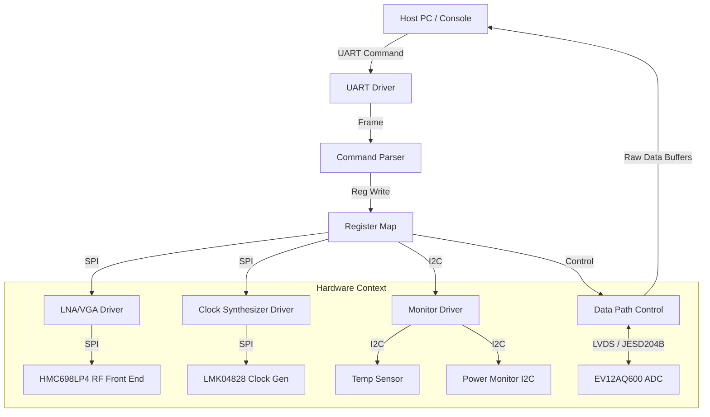
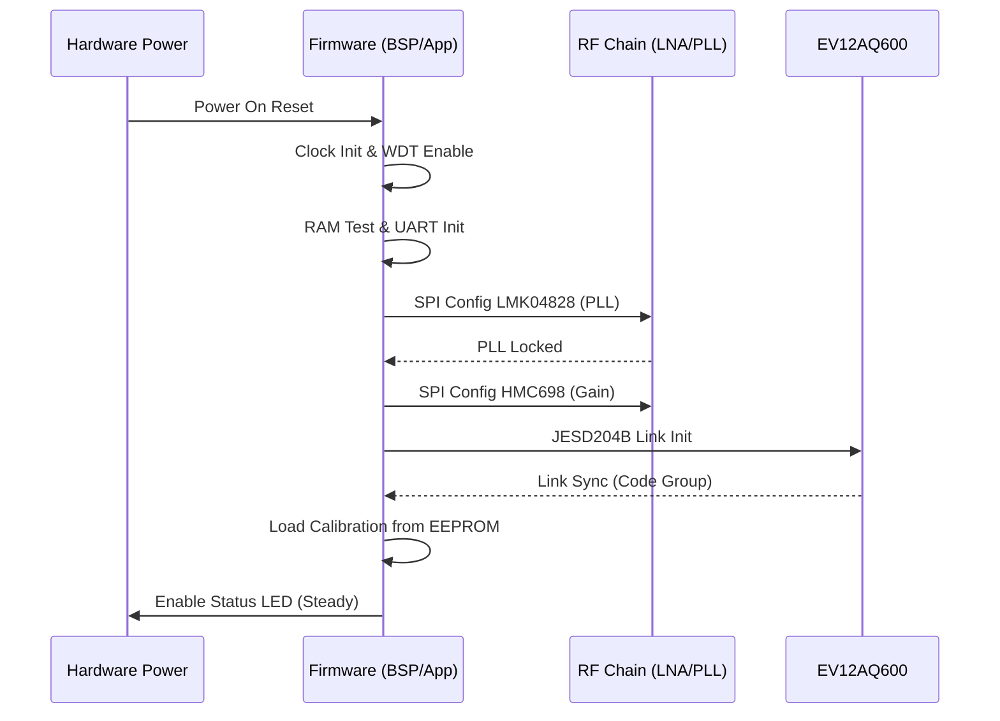
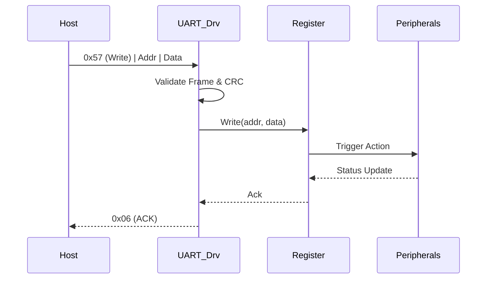
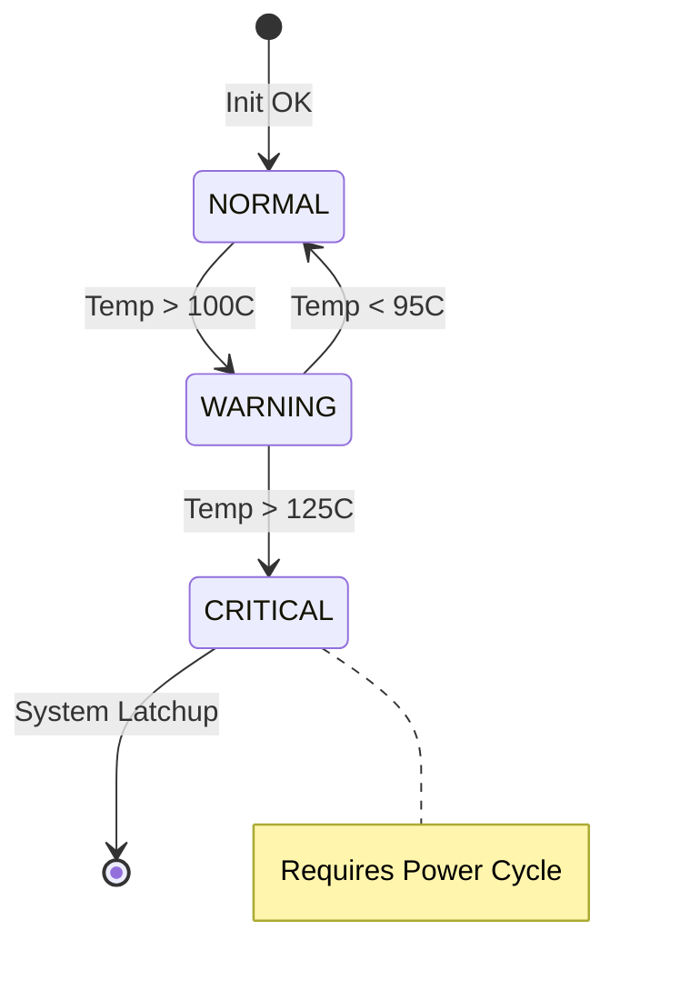
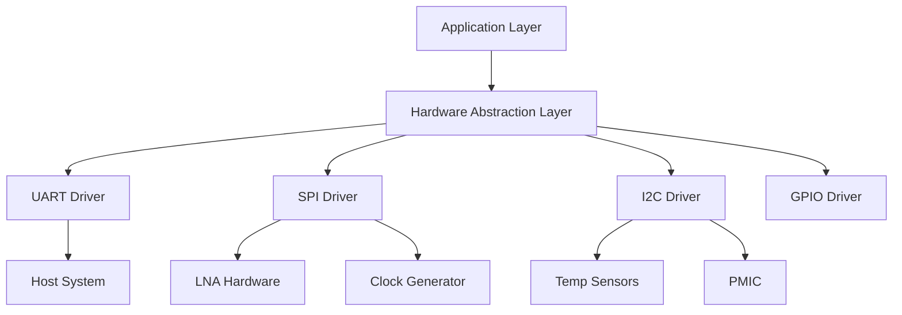

# Software Requirements Specification (SRS)

**Project:** khv Wideband RF Receiver Firmware
**Version:** 1.0
**Date:** 16 April 2026
**Author:** System Architecture Team

---

## Document Control
| Version | Date | Author | Changes |
|---------|------|--------|---------|
| 1.0 | 16 April 2026 | Lead Architect | Initial Release compliant with IEEE 29148:2018 |

---

# 1. Introduction

## 1.1 Purpose
This Software Requirements Specification (SRS) defines the comprehensive software and firmware requirements for the **khv** Wideband RF Receiver system. The purpose of this document is to specify the functional behavior, performance constraints, and interface protocols for the embedded firmware running on the Xilinx XQKU5P FPGA and its associated microcontroller subsystem (if applicable).

This document serves as the baseline for:
- Firmware design and implementation (C/HDL).
- System Integration and Testing.
- Verification that the software meets the hardware capabilities defined in the Hardware Requirements Specification (HRS).
- Validation that the system fulfills stakeholder needs for high-reliability RF signal capture.

## 1.2 Scope
The scope of this SRS encompasses the control logic, data path management, and health monitoring software for the khv receiver.
**In-Scope Items:**
- **FPGA Firmware:** Logic for receiving high-speed LVDS data from the EV12AQ600 ADC, buffering, and transmitting to downstream processing.
- **Embedded Control Software:** C-based application running on the embedded processor (MicroBlaze or soft-core) within the FPGA.
- **Hardware Abstraction Layer (HAL):** Drivers for SPI (LNA/Clock), I2C (Sensors), UART (Host Comms), and GPIO.
- **Power Management:** Supervision of power rails and sequencing.
- **Configuration Management:** Loading calibration data, setting gain, and configuring PLLs.

**Out-of-Scope Items:**
- High-level DSP algorithms (e.g., FFT, demodulation) performed downstream of this receiver.
- PC/Host application software.
- FPGA bitstream implementation details (covered in SDD).

## 1.3 Definitions, Acronyms, and Abbreviations

| Term | Definition |
| :--- | :--- |
| **ADC** | Analog-to-Digital Converter (EV12AQ600). |
| **API** | Application Programming Interface. |
| **ASIL** | Automotive Safety Integrity Level. |
| **BGA** | Ball Grid Array. |
| **BIST** | Built-In Self-Test. |
| **BSP** | Board Support Package. |
| **CLB** | Configurable Logic Block. |
| **CML** | Current Mode Logic. |
| **ConOps** | Concept of Operations. |
| **CRC** | Cyclic Redundancy Check. |
| **DAC** | Digital-to-Analog Converter. |
| **DMA** | Direct Memory Access. |
| **DSP** | Digital Signal Processing. |
| **EEPROM** | Electrically Erasable Programmable Read-Only Memory. |
| **EMC** | Electromagnetic Compatibility. |
| **ENOB** | Effective Number of Bits. |
| **FIFO** | First-In, First-Out buffer. |
| **Flash** | Non-volatile memory. |
| **FPGA** | Field-Programmable Gate Array (XQKU5P). |
| **GLR** | Glue Logic Requirements. |
| **GPIO** | General Purpose Input/Output. |
| **GSPS** | Giga-Samples Per Second. |
| **HAL** | Hardware Abstraction Layer. |
| **HDL** | Hardware Description Language. |
| **HRS** | Hardware Requirements Specification. |
| **I2C** | Inter-Integrated Circuit (Serial Protocol). |
| **IIP3** | Third-order Intercept Point (Input). |
| **IPC** | Inter-Process Communication. |
| **ISR** | Interrupt Service Routine. |
| **JESD204B** | High-speed data interface standard. |
| **JTAG** | Joint Test Action Group (Debug interface). |
| **LNA** | Low Noise Amplifier (HMC698LP4). |
| **LVDS** | Low-Voltage Differential Signaling. |
| **MIL-STD** | Military Standard. |
| **MISRA** | Motor Industry Software Reliability Association (Coding Standard). |
| **MMCM** | Mixed-Mode Clock Manager. |
| **MCU** | Microcontroller Unit. |
| **NVM** | Non-Volatile Memory. |
| **PCB** | Printed Circuit Board. |
| **PLL** | Phase-Locked Loop (LMK04828). |
| **POST** | Power-On Self-Test. |
| **QSPI** | Quad Serial Peripheral Interface. |
| **RAM** | Random Access Memory. |
| **RF** | Radio Frequency. |
| **ROM** | Read-Only Memory. |
| **RPC** | Remote Procedure Call. |
| **RTOS** | Real-Time Operating System. |
| **RTM** | Requirements Traceability Matrix. |
| **SFDR** | Spurious-Free Dynamic Range. |
| **SIL** | Safety Integrity Level. |
| **SNR** | Signal-to-Noise Ratio. |
| **SPI** | Serial Peripheral Interface. |
| **StRS** | Stakeholder Requirements Specification. |
| **SyRS** | System Requirements Specification. |
| **SRS** | Software Requirements Specification. |
| **SDD** | Software Design Description. |
| **TRP** | Transmit/Receive Power. |
| **UART** | Universal Asynchronous Receiver-Transmitter. |
| **VGA** | Variable Gain Amplifier. |
| **VSWR** | Voltage Standing Wave Ratio. |
| **WDT** | Watchdog Timer. |

## 1.4 References
1.  **IEEE 830-1998**: Recommended Practice for Software Requirements Specifications.
2.  **ISO/IEC/IEEE 29148:2018**: Systems and Software Engineering — Life Cycle Processes — Requirements Engineering.
3.  **IEEE 1016-2009**: Standard for Software Design Descriptions.
4.  **MISRA C:2012**: Guidelines for the Use of the C Language in Critical Systems.
5.  **IEC 61508**: Functional Safety of E/E/PE Safety-related Systems.
6.  **JESD204B (JEDEC Standard)**: Serial Interface for Data Converters.
7.  **khv Hardware Requirements Specification (HRS)**: Doc ID HRS-KHV-1.0, 27 Oct 2023.
8.  **khv Glue Logic Requirements (GLR)**: Doc ID GLR-KHV-0V01, 16 Apr 2026.
9.  **EV12AQ600 Datasheet**: Teledyne e2v, Quad-channel ADC.
10. **LMK04828 Datasheet**: Texas Instruments, Jitter Cleaner.
11. **HMC698LP4 Datasheet**: Analog Devices, Wideband LNA/VGA.

## 1.5 Overview
This document is organized into six major sections:
- **Section 1 (Introduction):** Defines the purpose, scope, and context of the software.
- **Section 2 (Overall Description):** Describes the product perspective, functions, user characteristics, constraints, and assumptions. It details the software's relationship to the FPGA hardware (XQKU5P) and the RF chain.
- **Section 3 (Specific Requirements):** Contains the detailed software requirements. These are divided into External Interfaces, Functional Requirements (Level 3 SRS), Performance Requirements, Design Constraints, and Software Attributes.
- **Section 4 (Verification & Validation):** Outlines the testing strategy for units, integration, and system-level validation.
- **Section 5 (Traceability):** Maps software requirements to hardware and system sources.
- **Section 6 (Appendices):** Contains error codes, register maps, and diagrams.

---

# 2. Overall Description

## 2.1 Product Perspective
The **khv** firmware is an embedded real-time system operating within the Xilinx XQKU5P FPGA. The system utilizes a hybrid architecture:
1.  **High-Speed Data Path:** Implemented in RTL (VHDL/Verilog) within the FPGA fabric to handle the JESD204B/LVDS interface from the ADC (EV12AQ600).
2.  **Control Plane:** Implemented in C (running on a soft-core MicroBlaze or hard-core ARM, if present) to manage configuration, health monitoring, and host communication.



## 2.2 Product Functions
The firmware provides the following major functions:
1.  **System Initialization:** Automated boot sequence configuring PLLs, resetting the ADC, and loading gain tables.
2.  **Hardware Abstraction:** Standardized drivers for SPI, I2C, UART, and GPIO peripherals.
3.  **UART Command Interface:** Handles register read/write protocols for the host system.
4.  **JESD204B Lane Management:** Aligns and monitors the high-speed data link from the ADC.
5.  **RF Gain Control:** Adjusts the HMC698LP4 gain based on host commands or automatic gain control (AGC) algorithms.
6.  **Clock Management:** Programs the LMK04828 for specific sampling frequencies (5-10 GSPS).
7.  **Thermal Monitoring:** Polls temperature sensors via I2C.
8.  **Power Sequencing:** Manages the enable pins for the LTM4644 DC-DC converters.
9.  **Fault Detection:** Monitors the ADC OR (Over-Range) flags and FPGA lock status.
10. **Data Buffering:** Manages circular buffers for captured ADC samples.
11. **Configuration Storage:** Reads/Writes calibration data to non-volatile memory (EEPROM/Flash).
12. **Watchdog Management:** Kicks the watchdog timer within the safety window.
13. **LED Status Indication:** Controls system status LEDs (Heartbeat, Error, Data Active).
14. **Diagnostics:** Executes POST and user-triggered built-in tests (BIT).
15. **Log Management:** Stores error events in a non-volatile fault log.

## 2.3 User Characteristics
- **Firmware Engineers:** Develop and maintain the C code and RTL.
- **Test Engineers:** Utilize the UART interface to verify hardware functionality and validate performance (SFDR, SNR).
- **System Integrators:** Integrate the khv module into larger SIGINT/EW payloads.
- **End-Users (Host System):** Interact via remote API calls translated to UART commands.

## 2.4 Constraints
1.  **MISRA-C Compliance:** All C code shall adhere to MISRA-C:2012 standards (mandatory for safety-critical deployment).
2.  **Real-Time Latency:** interrupts handling ADC data flags must execute within 10 µs.
3.  **Memory Resources:** FPGA Block RAM usage shall not exceed 80% to allow for future expansion.
4.  **Timing Closure:** All FPGA logic must meet timing at the target clock frequency (e.g., 250 MHz for control logic, >200 MHz for deserialization).
5.  **Power Consumption:** The firmware shall manage clock gating to keep dynamic power under the specified limit defined in HRS.
6.  **Environment:** The software must account for military temperature ranges (-55°C to +125°C), potentially requiring dynamic frequency throttling if Tj exceeds 110°C.
7.  **Toolchain:** Xilinx Vitis/Vivado 2023.1 or later.

## 2.5 Assumptions and Dependencies
1.  **Hardware Stability:** The 12V supply is assumed to be stable within ±5% before the firmware initiates power sequencing.
2.  **Reference Clock:** A stable 10 MHz or 100 MHz reference clock is present at the FPGA input before boot.
3.  **JESD204B IP:** The core FPGA logic relies on a licensed JESD204B IP core (Xilinx or GSI).
4.  **EEPROM Availability:** Calibration data is assumed to be pre-programmed in the EEPROM at address 0x0000.

---

# 3. Specific Requirements

## 3.1 External Interface Requirements

### 3.1.1 Hardware Interfaces

**3.1.1.1 UART Interface (Control Plane)**
The primary control interface operates at 115200 baud, 8N1. The software implements a packet-based protocol.

```c
/* UART Register Map Overlay (Logical) */
typedef struct {
    volatile uint32_t CTRL;      // 0x00: Control Register (Soft Reset, Enable)
    volatile uint32_t STATUS;    // 0x04: Status (Locked, Error, Temp)
    volatile uint32_t GAIN_CTRL; // 0x08: LNA Gain Setting
    volatile uint32_t CLK_DIV;   // 0x0C: ADC Clock Divisor
    volatile uint32_t TEST_REG;  // 0x10: Loopback Test Register
} khv_reg_map_t;

/* Driver API */
int32_t UART_Init(uint32_t baud_rate);
int32_t UART_WriteReg(uint16_t addr, uint32_t data);
int32_t UART_ReadReg(uint16_t addr, uint32_t *data);
```

**3.1.1.2 SPI Interface (LNA & Clock)**
The software manages two SPI slaves: the HMC698LP4 (LNA) and LMK04828 (Clock).

```c
typedef struct {
    volatile uint32_t SPI_CTRL;  // Control: CS, CLK polarity
    volatile uint32_t SPI_TX;    // Transmit Data
    volatile uint32_t SPI_RX;    // Receive Data
    volatile uint32_t SPI_STATUS;// Status: TX Empty, RX Full
} SPI_RegMap_t;

/* API for HMC698LP4 */
int32_t LNA_SetGain(float gain_db);
int32_t LNA_Enable(uint8_t enable);
int32_t LNA_ReadStatus(uint8_t *status);

/* API for LMK04828 */
int32_t CLK_SetFrequency(uint32_t target_freq_hz);
int32_t CLK_EnableOutput(uint8_t out_num, uint8_t enable);
```

**3.1.1.3 I2C Interface (Sensors)**
Standard I2C (100kHz) for temperature and power monitors.

```c
int32_t I2C_Init(uint32_t clock_hz);
int32_t I2C_ReadReg8(uint8_t dev_addr, uint8_t reg, uint8_t *data);
int32_t I2C_WriteReg8(uint8_t dev_addr, uint8_t reg, uint8_t data);

/* Specific Device APIs */
int32_t TEMP_ReadFPGA(float *temp_c);
int32_t TEMP_ReadRFChain(float *temp_c);
int32_t POWER_ReadRails(float *v_rail, float *i_rail);
```

### 3.1.2 Software Interfaces
- **Xilinx Standalone OS:** For hardware abstraction (drivers).
- **lwIP or PetaLinux:** (Optional) If high-speed Ethernet transport is required instead of raw LVDS.

### 3.1.3 Communication Interfaces

**Frame Formats (from GLR §6):**

| Command | CMD byte | Frame Structure | Response |
|---------|----------|-----------------|----------|
| Single Write | 0x57 ('W') | `[0x57][ADDR_H][ADDR_L][DATA_H][DATA_L]` | `[0x06]` ACK |
| Single Read  | 0x52 ('R') | `[0x52][ADDR_H\|0x80][ADDR_L]` | `[DATA_H][DATA_L]` |
| Bulk Write   | 0x42 ('B') | `[0x42][ADDR_H][ADDR_L][N][D0_H][D0_L]...[Dn_H][Dn_L]` | `[0x06]` ACK |
| Bulk Read    | 0x62 ('b') | `[0x62][ADDR_H\|0x80][ADDR_L][N]` | `[D0_H][D0_L]...[Dn_H][Dn_L]` |
| Error NAK    | 0x15 | Sent by khv on invalid command/address | — |

*Constraints:*
- **Address Map:** 16-bit (0x0000–0xFFFF).
- **Read Flag:** Bit 15 of Address must be set (OR 0x8000).
- **Bulk Count:** Maximum N = 64 registers per transaction.
- **Timeout:** Inter-byte gap timeout is 50ms. Parser resets on timeout.
- **ACK/NAK:** ACK = 0x06, NAK = 0x15.
- **CRC:** Optional CRC-16-CCITT (Polynomial 0x1021) enabled via Config Register Bit 0.

## 3.2 Functional Requirements

### 3.2.1 System Initialization (REQ-SW-001 to REQ-SW-010)
**REQ-SW-001:** The software SHALL complete power-on self-test (POST) within 500ms of reset de-assertion.
- *Source:* HRS §3.1 (Boot Time)
- *Priority:* [M]andatory
- *Verification:* [T]est

**REQ-SW-002:** The software SHALL verify the Board ID FPGA register (`BOARD_ID`) matches the expected value `0x5A5A` on startup.
- *Source:* GLR §8 (Identification)
- *Priority:* [M]andatory
- *Verification:* [T]est

**REQ-SW-003:** The software SHALL configure the LMK04828 PLL to generate a sampling clock of 5.0 GSPS (default) within 100ms of PLL config command.
- *Source:* HRS §2 (Sampling Rate)
- *Priority:* [M]andatory
- *Verification:* [A]nalysis (Scope Measurement)

**REQ-SW-004:** The software SHALL poll the LMK04828 PLL_STATUS.LOCKED bit; if timeout >200ms occurs, system shall enter FAULT state.
- *Source:* GLR §4 (Clock Module)
- *Priority:* [M]andatory
- *Verification:* [T]est

**REQ-SW-005:** The software SHALL initialize the SPI peripherals for LNA and Clock configuration before enabling the RF path.
- *Source:* GLR §5 (Feature List)
- *Priority:* [M]andatory
- *Verification:* [I]nspection

**REQ-SW-006:** The software SHALL load calibration data (Gain Tables, Offset corrections) from EEPROM address `0x1000` into RAM during boot.
- *Source:* HRS §3.2 (Calibration)
- *Priority:* [M]andatory
- *Verification:* [D]emonstration

**REQ-SW-007:** The software SHALL initialize the Watchdog Timer (WDT) with a 100ms timeout before entering the main loop.
- *Source:* HRS §3.1 (Reliability)
- *Priority:* [M]andatory
- *Verification:* [I]nspection

**REQ-SW-008:** The software SHALL log the Firmware Version string "khv-FW-1.0" to the UART debug interface on startup.
- *Source:* GLR §10 (Comms)
- *Priority:* [D]esirable
- *Verification:* [I]nspection

**REQ-SW-009:** The software SHALL perform a RAM BIST (March C-) on the first 64KB of SRAM available to the MicroBlaze.
- *Source:* HRS §3.1 (Diagnostics)
- *Priority:* [D]esirable
- *Verification:* [T]est

**REQ-SW-010:** The software SHALL set LED_STATUS (GPIO) to a 1Hz blink pattern during initialization and steady ON upon successful completion.
- *Source:* GLR §8 (LEDs)
- *Priority:* [D]esirable
- *Verification:* [D]emonstration

### 3.2.2 UART Communication Driver (REQ-SW-011 to REQ-SW-020)
**REQ-SW-011:** The UART driver SHALL support baud rates of 9600, 115200 (default), and 921600.
- *Source:* GLR §6 (UART Spec)
- *Priority:* [M]andatory
- *Verification:* [T]est

**REQ-SW-012:** The driver SHALL implement the Single Write command (0x57) strictly adhering to the frame format `[CMD][ADDR_H][ADDR_L][DATA_H][DATA_L]`.
- *Source:* GLR §6
- *Priority:* [M]andatory
- *Verification:* [T]est

**REQ-SW-013:** The driver SHALL implement the Single Read command (0x52) requiring Bit 15 of the Address to be set.
- *Source:* GLR §6
- *Priority:* [M]andatory
- *Verification:* [T]est

**REQ-SW-014:** The driver SHALL implement the Bulk Write command (0x42) supporting up to 64 consecutive registers.
- *Source:* GLR §6
- *Priority:* [M]andatory
- *Verification:* [T]est

**REQ-SW-015:** The driver SHALL implement the Bulk Read command (0x62) returning 2 bytes per register.
- *Source:* GLR §6
- *Priority:* [M]andatory
- *Verification:* [T]est

**REQ-SW-016:** The driver SHALL respond to an invalid command byte with NAK (0x15) within 50µs of receipt.
- *Source:* GLR §6 (Error Handling)
- *Priority:* [M]andatory
- *Verification:* [T]est

**REQ-SW-017:** The driver SHALL support a hardware TX FIFO of at least 16 bytes to minimize interrupt overhead.
- *Source:* GLR §5 (Features)
- *Priority:* [D]esirable
- *Verification:* [I]nspection

**REQ-SW-018:** The driver SHALL support an RX FIFO of at least 16 bytes.
- *Source:* GLR §5
- *Priority:* [D]esirable
- *Verification:* [I]nspection

**REQ-SW-019:** The driver SHALL clear the UART_STATUS.FRAME_ERR flag automatically upon reading the STATUS register.
- *Source:* GLR §8 (Registers)
- *Priority:* [M]andatory
- *Verification:* [T]est

**REQ-SW-020:** The driver SHALL recover from framing errors by flushing the RX FIFO without requiring a system reset.
- *Source:* GLR §6
- *Priority:* [M]andatory
- *Verification:* [T]est

### 3.2.3 Temperature Monitoring (REQ-SW-021 to REQ-SW-030)
**REQ-SW-021:** The software SHALL read the FPGA internal temperature (XADC) every 1.0 seconds.
- *Source:* HRS §3.4 (Env)
- *Priority:* [M]andatory
- *Verification:* [A]nalysis

**REQ-SW-022:** The software SHALL read the RF Front-End temperature (External I2C Sensor) every 1.0 seconds.
- *Source:* HRS §3.4
- *Priority:* [M]andatory
- *Verification:* [A]nalysis

**REQ-SW-023:** The software SHALL generate a TEMP_ALERT interrupt (or set Status Flag) if the RF Front-End temperature exceeds +110°C.
- *Source:* HRS §3.4 (Max Temp)
- *Priority:* [M]andatory
- *Verification:* [T]est (Chamber)

**REQ-SW-024:** The software SHALL disable the RF Amplifier (LNA) via SPI when temperature exceeds +125°C (Latch-up protection).
- *Source:* HRS §3.4
- *Priority:* [M]andatory
- *Verification:* [T]est

**REQ-SW-025:** The software SHALL re-enable the RF path automatically when temperature drops below +115°C (Hysteresis).
- *Source:* HRS §3.4
- *Priority:* [M]andatory
- *Verification:* [T]est

**REQ-SW-026:** The software SHALL report the temperature values in 0.1°C resolution in the STATUS register.
- *Source:* GLR §8
- *Priority:* [M]andatory
- *Verification:* [I]nspection

**REQ-SW-027:** The software SHALL log a thermal event to the EEPROM Fault Log with a timestamp.
- *Source:* HRS §3.1 (Logging)
- *Priority:* [D]esirable
- *Verification:* [T]est

**REQ-SW-028:** The software SHALL throttle the FPGA clock speed if FPGA junction temperature exceeds 100°C.
- *Source:* HRS §3.4 (Derating)
- *Priority:* [O]ptional
- *Verification:* [D]emonstration

**REQ-SW-029:** The software SHALL filter temperature readings using a moving average filter (N=4) to prevent noise triggers.
- *Source:* HRS §3.2 (Stability)
- *Priority:* [D]esirable
- *Verification:* [A]nalysis

**REQ-SW-030:** The software SHALL expose a dedicated UART alarm register bit BIT_OVERTEMP.
- *Source:* GLR §8
- *Priority:* [M]andatory
- *Verification:* [I]nspection

### 3.2.4 Flash/EEPROM Management (REQ-SW-031 to REQ-SW-040)
**REQ-SW-031:** The Flash driver SHALL support read, write, and sector-erase operations for the configuration SPI Flash.
- *Source:* GLR §5 (Storage)
- *Priority:* [M]andatory
- *Verification:* [T]est

**REQ-SW-032:** The Flash driver SHALL verify written data with a read-back CRC-32 check.
- *Source:* HRS §3.1 (Data Integrity)
- *Priority:* [M]andatory
- *Verification:* [T]est

**REQ-SW-033:** The software SHALL load the default RF Gain Table from SPI Flash sector 0x0F on boot.
- *Source:* HRS §3.2 (Config)
- *Priority:* [M]andatory
- *Verification:* [T]est

**REQ-SW-034:** The software SHALL allow the host to write new Gain Tables to Flash via UART Bulk Write command.
- *Source:* GLR §6
- *Priority:* [D]esirable
- *Verification:* [D]emonstration

**REQ-SW-035:** The software SHALL protect the Boot Sector (0x00-0x0F) from accidental erase via UART command.
- *Source:* HRS §3.1 (Security)
- *Priority:* [M]andatory
- *Verification:* [T]est

**REQ-SW-036:** The software SHALL store the Fault Log in the last 4KB of EEPROM.
- *Source:* HRS §3.1
- *Priority:* [M]andatory
- *Verification:* [I]nspection

**REQ-SW-037:** The software SHALL implement a circular buffer for the Fault Log (overwrite oldest).
- *Source:* HRS §3.1
- *Priority:* [D]esirable
- *Verification:* [T]est

**REQ-SW-038:** The software SHALL clear the Fault Log only on explicit Factory Reset command (0xFF).
- *Source:* GLR §6
- *Priority:* [M]andatory
- *Verification:* [T]est

**REQ-SW-039:** The software shall reject Flash Write commands if the Write Protect (WP) pin is active.
- *Source:* GLR §5
- *Priority:* [M]andatory
- *Verification:* [T]est

**REQ-SW-040:** The software SHALL implement wear leveling by cycling writes through 3 different logical sectors.
- *Source:* HRS §3.1 (Reliability)
- *Priority:* [O]ptional
- *Verification:* [A]nalysis

### 3.2.5 Power Management (REQ-SW-041 to REQ-SW-050)
**REQ-SW-041:** The software SHALL monitor the 12V input rail via I2C ADC every 100ms.
- *Source:* HRS §3.5 (Power)
- *Priority:* [M]andatory
- *Verification:* [T]est

**REQ-SW-042:** The software SHALL monitor the 1.0V FPGA Core rail via I2C ADC every 100ms.
- *Source:* HRS §3.5
- *Priority:* [M]andatory
- *Verification:* [T]est

**REQ-SW-043:** The software SHALL assert a FAULT condition if the 1.0V rail deviates by >5% (0.95V - 1.05V).
- *Source:* HRS §3.5
- *Priority:* [M]andatory
- *Verification:* [T]est

**REQ-SW-044:** The software SHALL sequence the LTM4644 enable pins: Order 1.0V -> 3.3V -> 5.0V (RF) with 10ms delays.
- *Source:* GLR §5 (Power Seq)
- *Priority:* [M]andatory
- *Verification:* [A]nalysis (Scope)

**REQ-SW-045:** The software SHALL read the Power Good (PG) flags from LTM4644 via GPIO before enabling the ADC.
- *Source:* GLR §4 (Power)
- *Priority:* [M]andatory
- *Verification:* [T]est

**REQ-SW-046:** The software SHALL log undervoltage events to the Fault Log.
- *Source:* HRS §3.1
- *Priority:* [M]andatory
- *Verification:* [T]est

**REQ-SW-047:** The software SHALL support a software-initiated shutdown command (0xDEAD).
- *Source:* GLR §6
- *Priority:* [D]esirable
- *Verification:* [D]emonstration

**REQ-SW-048:** The software SHALL disable the RF outputs (LNA) immediately upon power fault detection.
- *Source:* HRS §3.5 (Safety)
- *Priority:* [M]andatory
- *Verification:* [T]est

**REQ-SW-049:** The software SHALL calculate total power consumption based on I2C sense resistor readings.
- *Source:* HRS §3.5
- *Priority:* [D]esirable
- *Verification:* [A]nalysis

**REQ-SW-050:** The software SHALL report current consumption (mA) via UART Register 0x20.
- *Source:* GLR §8
- *Priority:* [D]esirable
- *Verification:* [T]est

### 3.2.6 RF / Application-Specific (REQ-SW-051 to REQ-SW-065)
**REQ-SW-051:** The software SHALL configure the EV12AQ600 for Single Channel Mode (Deserializing 12-bit data).
- *Source:* HRS §3.2 (ADC)
- *Priority:* [M]andatory
- *Verification:* [I]nspection

**REQ-SW-052:** The software SHALL support setting the sampling rate to 5.0 GSPS via the LMK04828 divider.
- *Source:* HRS §2 (Param)
- *Priority:* [M]andatory
- *Verification:* [T]est

**REQ-SW-053:** The software SHALL support setting the sampling rate to 10.0 GSPS via the LMK04828 divider.
- *Source:* HRS §2
- *Priority:* [M]andatory
- *Verification:* [T]est

**REQ-SW-054:** The software SHALL verify the JESD204B Link Lane 0 alignment (Code Group Sync) within 50ms of ADC enable.
- *Source:* GLR §5 (Interface)
- *Priority:* [M]andatory
- *Verification:* [T]est

**REQ-SW-055:** The software SHALL report the JESD204B Link Status (SYNC~) in the STATUS register.
- *Source:* GLR §8
- *Priority:* [M]andatory
- *Verification:* [I]nspection

**REQ-SW-056:** The software SHALL set the HMC698LP4 Gain to 20dB (default) on startup.
- *Source:* HRS §3.1
- *Priority:* [M]andatory
- *Verification:* [T]est

**REQ-SW-057:** The software SHALL support 256 programmable gain steps for the HMC698LP4.
- *Source:* GLR §4 (RF)
- *Priority:* [D]esirable
- *Verification:* [T]est

**REQ-SW-058:** The software SHALL assert the ADC reset if the JESD204B link remains unlocked for >100ms.
- *Source:* GLR §5
- *Priority:* [M]andatory
- *Verification:* [T]est

**REQ-SW-059:** The software SHALL calculate SNR (Signal-to-Noise Ratio) based on ADC capture (debug mode).
- *Source:* HRS §3.2
- *Priority:* [O]ptional
- *Verification:* [A]nalysis

**REQ-SW-060:** The software SHALL calculate SFDR (Spurious Free Dynamic Range) based on ADC capture (debug mode).
- *Source:* HRS §3.2
- *Priority:* [O]ptional
- *Verification:* [A]nalysis

**REQ-SW-061:** The software SHALL bypass the FIR filter in the ADC path when configured for "Wideband" mode.
- *Source:* HRS §3.2
- *Priority:* [M]andatory
- *Verification:* [I]nspection

**REQ-SW-062:** The software SHALL enable the clock dithering feature of LMK04828 to reduce EMI.
- *Source:* HRS §3.5 (EMC)
- *Priority:* [D]esirable
- *Verification:* [T]est

**REQ-SW-063:** The software SHALL support a "Test Tone" injection mode (DAC output if available).
- *Source:* GLR §4
- *Priority:* [O]ptional
- *Verification:* [D]emonstration

**REQ-SW-064:** The software SHALL update the RF Gain based on a look-up table indexed by frequency.
- *Source:* HRS §3.2 (Flatness)
- *Priority:* [D]esirable
- *Verification:* [A]nalysis

**REQ-SW-065:** The software SHALL provide a raw data dump of the last 1024 ADC samples via UART Bulk Read.
- *Source:* GLR §6
- *Priority:* [D]esirable
- *Verification:* [D]emonstration

### 3.2.7 Diagnostics and Built-In Test (REQ-SW-066 to REQ-SW-075)
**REQ-SW-066:** The software SHALL implement a Power-On Self-Test (POST) covering RAM, ROM Checksum, and Peripheral ID check.
- *Source:* HRS §3.1
- *Priority:* [M]andatory
- *Verification:* [T]est

**REQ-SW-067:** The software SHALL log all detected POST faults to the Fault Log.
- *Source:* HRS §3.1
- *Priority:* [M]andatory
- *Verification:* [T]est

**REQ-SW-068:** The software SHALL expose a UART diagnostic command (0xD0) that dumps the Fault Log.
- *Source:* GLR §6
- *Priority:* [M]andatory
- *Verification:* [T]est

**REQ-SW-069:** The software SHALL maintain a software uptime counter (seconds) readable via UART Register.
- *Source:* GLR §8
- *Priority:* [D]esirable
- *Verification:* [I]nspection

**REQ-SW-070:** The software SHALL implement a built-in loopback test for the UART driver (internal Tx→Rx).
- *Source:* HRS §3.1
- *Priority:* [M]andatory
- *Verification:* [T]est

**REQ-SW-071:** The software SHALL perform a periodic JESD204B link integrity check every 1 second.
- *Source:* GLR §5
- *Priority:* [M]andatory
- *Verification:* [T]est

**REQ-SW-072:** The software SHALL reset the ADC link if 10 consecutive integrity checks fail.
- *Source:* GLR §5
- *Priority:* [M]andatory
- *Verification:* [T]est

**REQ-SW-073:** The software SHALL allow the host to trigger a calibration sequence via UART command (0xC0).
- *Source:* GLR §6
- *Priority:* [D]esirable
- *Verification:* [D]emonstration

**REQ-SW-074:** The software SHALL verify the oscillator frequency against an internal counter at startup.
- *Source:* HRS §3.1
- *Priority:* [D]esirable
- *Verification:* [T]est

**REQ-SW-075:** The software SHALL support a Firmware Update mode where the UART accepts a binary image to write to Flash.
- *Source:* GLR §6
- *Priority:* [O]ptional
- *Verification:* [D]emonstration

## 3.3 Performance Requirements

| ID | Requirement | Metric | Verification |
|----|-------------|--------|--------------|
| REQ-PERF-001 | Main Loop Execution | Complete cycle within 10 ms | [T]est |
| REQ-PERF-002 | UART Command Response | ACK sent within 200 µs of valid frame | [T]est |
| REQ-PERF-003 | Temp Read Cycle | I2C read complete within 5 ms | [T]est |
| REQ-PERF-004 | SPI Flash Write | Page (256B) write complete within 5 ms | [T]est |
| REQ-PERF-005 | PLL Lock Time | LMK04828 lock within 100 ms | [A]nalysis |
| REQ-PERF-006 | System Startup | Time from Power Good to Data Valid < 1.0 s | [T]est |
| REQ-PERF-007 | JESD204B Link Latency | Time to sync < 50 ms | [T]est |
| REQ-PERF-008 | Watchdog Pet | WDT kicked every 50 ms | [I]nspection |
| REQ-PERF-009 | RAM Usage | Static RAM < 128KB (MicroBlaze) | [A]nalysis |
| REQ-PERF-010 | Flash Usage | Code + Const < 2MB | [A]nalysis |
| REQ-PERF-011 | Interrupt Latency | Max latency 20 µs for High-Prio IRQs | [A]nalysis |
| REQ-PERF-012 | Context Switch | RTOS switch < 10 µs | [T]est |

## 3.4 Design Constraints
1.  **Coding Standard:** Source code SHALL comply with MISRA-C:2012.
2.  **Language:** C99 for embedded logic; VHDL-2008 or Verilog-2001 for RTL.
3.  **Dynamic Memory:** Heap allocation (`malloc`, `free`) is strictly forbidden in the runtime firmware.
4.  **Stack:** Maximum stack depth per task shall be statically analyzed and bounded at 80% utilization.
5.  **Interrupts:** All ISRs shall execute to completion within 50 µs.
6.  **Variables:** All hardware-mapped variables shall be `volatile` qualified.
7.  **Recursion:** Recursive function calls are prohibited.
8.  **Data Integrity:** All writes to NVM shall be protected by CRC-32.

## 3.5 Software System Attributes
### 3.5.1 Reliability
- **MTBF:** Target MTBF > 20,000 hours.
- **WDT:** The system shall automatically recover from a firmware hang via the Watchdog Timer within 100ms.

### 3.5.2 Availability
- **Target:** 99.9% uptime excluding maintenance.
- **Restart:** Auto-recovery from non-critical faults without power cycling.

### 3.5.3 Security
- **Access:** Valid address ranges for UART writes must be enforced to prevent register corruption.
- **Update:** Firmware images must be authenticated via CRC before boot.

### 3.5.4 Maintainability
- **Complexity:** Cyclomatic complexity < 15 per function.
- **Docs:** All functions shall have Doxygen headers.

### 3.5.5 Portability
- **HAL:** All hardware specifics shall be abstracted via `khv_hal.h`.

---

# 4. Verification and Validation

## 4.1 Unit Test Requirements
*   **UART Driver:**
    *   Test Case 1: Send valid Single Write command, verify ACK and register state.
    *   Test Case 2: Send invalid checksum (if enabled), verify NAK.
    *   Test Case 3: Send Bulk Write with N=64, verify all addresses updated.
*   **SPI Driver:**
    *   Test Case 1: Write 0x00 to LNA Gain register, read back verify.
    *   Test Case 2: Attempt write to invalid SPI address, check error handling.
*   **I2C Driver:**
    *   Test Case 1: Read Temperature Sensor, verify valid range (-55 to +125).
    *   Test Case 2: Simulate NACK from device, verify retry logic (3x).

## 4.2 Integration Test Requirements
*   **Link Test:** Verify Host -> FPGA -> UART Command flow.
*   **RF Chain:** Verify Host sends Gain Set -> FPGA SPI -> LNA responds -> Measured Gain changes.
*   **Clock Path:** Verify Host sends Freq Set -> FPGA SPI -> LMK04828 locks -> FPGA locks to LVDS.

## 4.3 System Test Requirements
*   **Power Cycle:** 100 cycles of On/Off at -40C, 25C, and 85C.
*   **Signal Integrity:** Inject -30dBm tone at 10GHz, verify digital data matches expected SFDR (>80dB).
*   **Thermal Runaway:** Heat unit to 130C, verify safe shutdown (LNA off).

---

# 5. Requirements Traceability Matrix

| REQ-SW-xxx | Description | Traces To (REQ-HW/GLR) | Priority | Verification |
|-----------|-------------|------------------------|----------|-------------|
| REQ-SW-001 | POST within 500ms | HRS §3.1 | M | Test |
| REQ-SW-002 | Board ID Check 0x5A5A | GLR §8 | M | Test |
| REQ-SW-003 | PLL Config 5 GSPS | HRS §2 | M | Analysis |
| REQ-SW-004 | PLL Lock Timeout | GLR §4 | M | Test |
| REQ-SW-005 | SPI Init Sequence | GLR §5 | M | Inspection |
| REQ-SW-006 | Load Cal from EEPROM | HRS §3.2 | M | Demo |
| REQ-SW-007 | WDT Init | HRS §3.1 | M | Inspection |
| REQ-SW-011 | UART Baud Rates | GLR §6 | M | Test |
| REQ-SW-012 | UART Single Write (0x57) | GLR §6 | M | Test |
| REQ-SW-021 | FPGA Temp Read (1s) | HRS §3.4 | M | Analysis |
| REQ-SW-022 | RF Temp Read (1s) | HRS §3.4 | M | Analysis |
| REQ-SW-023 | Overtemp Alert 110C | HRS §3.4 | M | Test |
| REQ-SW-031 | Flash R/W Support | GLR §5 | M | Test |
| REQ-SW-041 | Monitor 12V Rail | HRS §3.5 | M | Test |
| REQ-SW-044 | Power Sequencing | GLR §5 | M | Analysis |
| REQ-SW-051 | ADC Single Ch Mode | HRS §3.2 | M | Inspection |
| REQ-SW-054 | JESD204B Link Sync | GLR §5 | M | Test |
| REQ-SW-056 | Default Gain 20dB | HRS §3.1 | M | Test |

---

# 6. Appendices

## Appendix A — Error Codes
```c
typedef enum {
    ERR_OK           = 0x00, // No Error
    ERR_TIMEOUT      = 0x01, // Command Timeout
    ERR_COMM         = 0x02, // UART Comm Error
    ERR_CHECKSUM     = 0x03, // Data Checksum Mismatch
    ERR_PARAM        = 0x04, // Invalid Parameter
    ERR_NOT_INIT     = 0x05, // Peripheral Not Init
    ERR_RESOURCE     = 0x06, // Resource Busy
    ERR_HARDWARE     = 0x07, // HW Failure Detected
    ERR_OVERFLOW     = 0x08, // FIFO Overflow
    ERR_UNDERFLOW    = 0x09, // FIFO Underflow
    ERR_FLASH_WRITE  = 0x0A, // Flash Write Failed
    ERR_FLASH_ERASE  = 0x0B, // Flash Erase Failed
    ERR_EEPROM       = 0x0C, // EEPROM Access Fail
    ERR_PLL          = 0x0D, // PLL Unlock
    ERR_TEMP_ALERT   = 0x0E, // Over Temperature
    ERR_VOLT_FAULT   = 0x0F, // Voltage Fault
    ERR_LOOPBACK     = 0x10, // Loopback Test Fail
    ERR_POST_FAIL    = 0x11, // POST Failure
    ERR_WATCHDOG     = 0x12, // WDT Reset
    ERR_ADDR_RANGE   = 0x13, // Invalid Address
} ErrorCode_t;
```

## Appendix B — Register Map Summary (FPGA)

| Base | Offset | Name | Width | R/W | Reset | Description |
|------|--------|------|-------|-----|-------|-------------|
| 0x0000 | 0x00 | `CTRL` | 16 | RW | 0x0000 | Global Control (Bit 0: Reset) |
| 0x0000 | 0x01 | `STATUS` | 16 | R | 0x0001 | Status Flags (Bit 0: Locked) |
| 0x0000 | 0x02 | `GAIN_LNA` | 16 | RW | 0x0014 | LNA Gain (Default 20dB) |
| 0x0000 | 0x03 | `CLK_DIV` | 16 | RW | 0x0002 | Clock Divisor |
| 0x0000 | 0x04 | `TEMP_FPGA` | 16 | R | - | FPGA Temp (0.1C LSB) |
| 0x0000 | 0x05 | `TEMP_RF` | 16 | R | - | RF Chain Temp (0.1C LSB) |
| 0x0000 | 0x06 | `FAULT_LOG` | 32 | R | - | Fault Log Pointer |
| 0x0000 | 0x10 | `UART_BAUD` | 16 | RW | 0x0001 | Baud Rate Divisor |

## Appendix C — Mermaid Diagrams

### System Initialization Sequence


### UART Command Flow


### Temperature Protection State Machine


### Software Architecture
