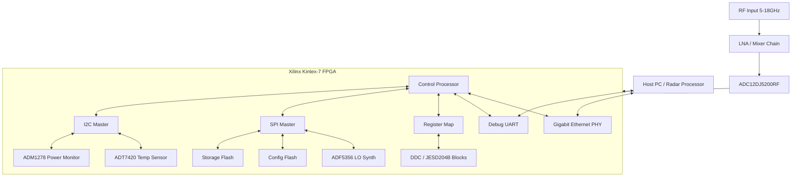
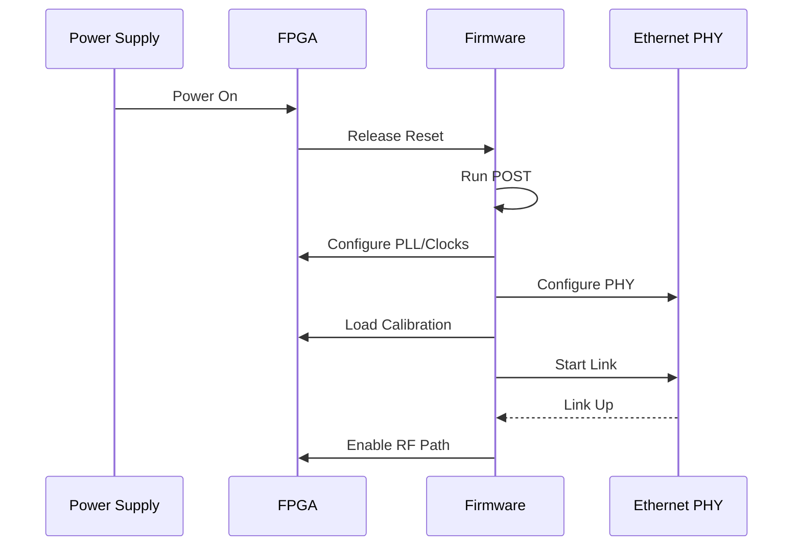
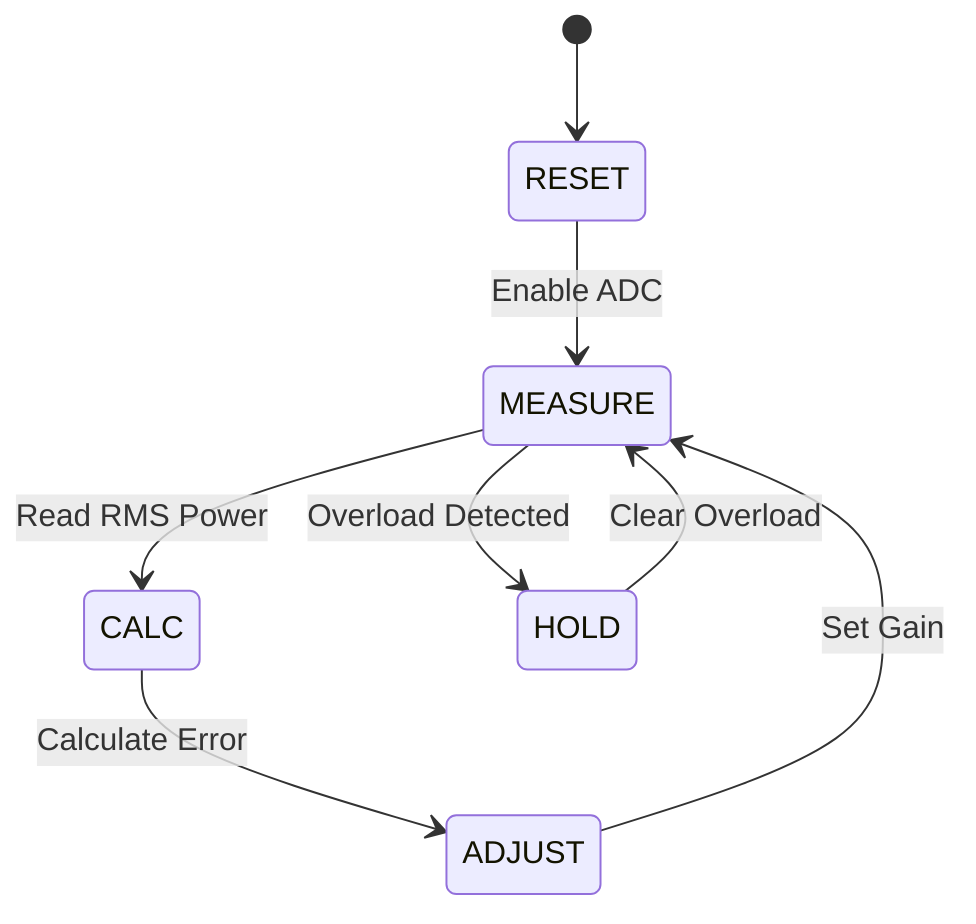
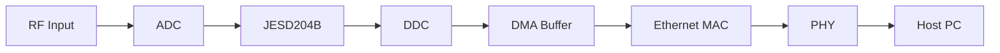

# Software Requirements Specification (SRS)

**Project ID:** kjk Wideband RF Receiver  
**Document Version:** 1.0  
**Date:** 17 April 2026  
**Author:** Senior Software Architect

---

## Document Control
| Version | Date | Author | Changes |
|---------|------|--------|---------|
| 1.0 | 17 April 2026 | System Architecture | Initial Release |

---

# 1. Introduction

## 1.1 Purpose
This Software Requirements Specification (SRS) defines the comprehensive software and firmware requirements for the **kjk Wideband RF Receiver** (Project: kjk). This document describes the behavioral, functional, and performance requirements for the embedded software running on the FPGA (Xilinx Kintex-7) and associated microcontroller subsystems.

The purpose of this SRS is to:
*   Establish a baseline for firmware development, ensuring the software correctly drives the RF Front End (LNA, Mixers), synthesizers (ADF5356), and digitization chain (ADC12DJ5200RF).
*   Define the control algorithms for Automatic Gain Control (AGC) and Frequency Synthesis.
*   Specify the data capture and Ethernet packetization logic.
*   Serve as the binding contract between the system engineering and software development teams.

## 1.2 Scope
The software scope encompasses the embedded firmware executing on the FPGA fabric and any embedded soft/hard cores utilized for control. Specifically:
*   **Control Plane:** Configuration of SPI peripherals (ADF5356 Synthesizer, Flash Memory), I2C sensors (ADT7420, ADM1278), and GPIO.
*   **Data Plane:** Management of the JESD204B interface to the ADC12DJ5200RF, implementation of Digital Down Conversion (DDC), and Gigabit Ethernet packet streaming.
*   **Diagnostics:** Implementation of Power-On Self-Test (POST), fault logging, and UART debug interface.
*   **Exclusions:** This document does not specify the PC-side host software for signal processing or the physical FPGA synthesis constraints (UCF/XDC) beyond the register map definition.

## 1.3 Definitions, Acronyms, and Abbreviations

| Term | Definition |
| :--- | :--- |
| **ADC** | Analog-to-Digital Converter (TI ADC12DJ5200RF). |
| **AGC** | Automatic Gain Control. Firmware loop adjusting VGA/LNA attenuation. |
| **BIST** | Built-In Self-Test. Diagnostic routine running on hardware. |
| **BER** | Bit Error Rate. |
| **CE/RE** | Conducted/Radiated Emissions (MIL-STD-461). |
| **DDC** | Digital Down Converter. FPGA logic mixing IF to Baseband I/Q. |
| **DMA** | Direct Memory Access. Hardware data transfer mechanism. |
| **EMC** | Electromagnetic Compatibility. |
| **FIFO** | First-In-First-Out memory buffer. |
| **FPGA** | Field-Programmable Gate Array (Xilinx Kintex-7). |
| **GLR** | Glue Logic Requirements. Defines register map and hardware interfaces. |
| **GPIO** | General Purpose Input/Output. |
| **HAL** | Hardware Abstraction Layer. Software driver layer. |
| **HRS** | Hardware Requirements Specification. |
| **I2C** | Inter-Integrated Circuit (Serial bus). |
| **ISR** | Interrupt Service Routine. |
| **JESD204B** | High-speed data converter interface standard. |
| **LNA** | Low Noise Amplifier. |
| **LO** | Local Oscillator (ADF5356). |
| **M&C** | Monitor and Control. |
| **PLL** | Phase-Locked Loop. |
| **POST** | Power-On Self-Test. |
| **QSPI** | Quad Serial Peripheral Interface. |
| **RF** | Radio Frequency. |
| **RTL** | Register Transfer Level (FPGA code). |
| **Rx** | Receive. |
| **SNR** | Signal-to-Noise Ratio. |
| **SPI** | Serial Peripheral Interface. |
| **SyRS** | System Requirements Specification. |
| **TCP/UDP** | Transport Layer Protocols. |
| **UART** | Universal Asynchronous Receiver/Transmitter. |
| **VCO** | Voltage-Controlled Oscillator. |
| **WDT** | Watchdog Timer. |

## 1.4 References
1.  IEEE 830-1998: Recommended Practice for Software Requirements Specifications.
2.  ISO/IEC/IEEE 29148:2018: Systems and Software Engineering — Life Cycle Processes — Requirements Engineering.
3.  **HRS-kjk-001**: Hardware Requirements Specification for kjk Wideband RF Receiver (Rev 1.0).
4.  **GLR-kjk-002**: Glue Logic Requirements and FPGA Register Map (Rev 1.0).
5.  Xilinx UG476: 7 Series FPGAs SelectIO Resources.
6.  Texas Instruments Document: ADC12DJ5200RF datasheet (SBAS658D).
7.  Analog Devices Document: ADF5356 Datasheet.
8.  MIL-STD-461G: Requirements for the Control of Electromagnetic Interference.
9.  IEEE 802.3ab: 1000BASE-T Standard.

## 1.5 Overview
The remainder of this document is organized as follows:
*   **Section 2 (Overall Description)**: Describes the product context, functions, and constraints.
*   **Section 3 (Specific Requirements)**: Contains the detailed Software Requirements (REQ-SW-xxx), external interfaces, and performance constraints.
*   **Section 4 (Verification)**: Defines the test cases and validation methods.
*   **Section 5 (Traceability)**: Maps software requirements to Hardware and GLR sources.
*   **Appendices**: Provides data structures, register maps, and diagrams.

---

# 2. Overall Description

## 2.1 Product Perspective
The kjk software is an embedded real-time firmware suite operating primarily on the Xilinx Kintex-7 FPGA. The system utilizes a hybrid architecture:
1.  **FPGA Fabric (Data Plane)**: Handles high-speed JESD204B lanes from the ADC, performs DDC, and manages the Ethernet MAC/PCS. This logic is written in VHDL/Verilog but configured and controlled by software registers.
2.  **Embedded Processor (Control Plane)**: A soft-core (e.g., MicroBlaze) or hard-core manages the slow-speed control tasks (SPI, I2C, UART, State Machines).



## 2.2 Product Functions
1.  **System Initialization**: Execute POST, configure PLLs (MMCM), bring up Ethernet PHY.
2.  **Frequency Tuning**: Calculate and write ADF5356 registers based on requested RF center frequency.
3.  **AGC Loop**: Monitor ADC power output via FPGA RSSI metrics and adjust gain stages (SPI/GPIO) to optimize dynamic range.
4.  **Data Streaming**: Capture I/Q samples from DDC, frame them in UDP packets, and transmit via 1000BASE-T.
5.  **Health Monitoring**: Poll temperature and power sensors; assert faults if thresholds exceeded.
6.  **Flash Management**: Read/Write calibration tables to/from QSPI Flash.
7.  **Command Interface**: Parse ASCII/Binary commands from UART for register access.

## 2.3 User Characteristics
*   **Firmware Engineers**: Develop C/C++ code for the embedded processor and HDL for FPGA logic.
*   **System Integrators**: Use the UART interface to verify hardware bring-up and load firmware images.
*   **Field Engineers**: Utilize the Ethernet interface to stream data and monitor system health.

## 2.4 Constraints
*   **Timing**: JESD204B lane alignment must occur within 100ms of power-up.
*   **Memory**: On-chip Block RAM (BRAM) is limited to ~1.5MB; packet buffers must be circular.
*   **Environment**: Software must operate reliably from -40°C to +85°C.
*   **Safety**: RF Output (if applicable) or High-power amplifiers must be disabled if temperature exceeds 85°C.
*   **Standards**: Code must comply with MISRA-C 2012 guidelines.

## 2.5 Assumptions and Dependencies
*   The FPGA configuration bitstream is loaded successfully before firmware execution (unless using processor-initiated configuration).
*   The 1000BASE-T PHY requires an accurate 125MHz reference clock (derived from the onboard crystal).
*   The ADF5356 requires a specific lock time (~10ms) before the RF Mixer is enabled.

---

# 3. Specific Requirements

## 3.1 External Interface Requirements

### 3.1.1 Hardware Interfaces

#### 3.1.1.1 UART Control Interface
The system provides a 3.3V CMOS UART interface for command and control.
**Parameters:** 115200 baud, 8-bit data, No parity, 1 Stop bit (8N1).

```c
/**
 * @brief UART Register Map Definition (Memory Mapped in FPGA)
 * Base Address: 0x8000_0000
 */
typedef struct {
    volatile uint32_t RX_DATA;     // 0x00: Receive Data Register
    volatile uint32_t TX_DATA;     // 0x04: Transmit Data Register
    volatile uint32_t STATUS;      // 0x08: Status Reg [0]:RX_READY [1]:TX_EMPTY
    volatile uint32_t CONTROL;     // 0x0C: Control Reg [0]:RX_INT_EN
    volatile uint32_t BAUD_GEN;    // 0x10: Baud Rate Generator Divisor
} UART_RegMap_t;

// Driver API
int32_t UART_Init(uint32_t base_addr, uint32_t baud_rate);
int32_t UART_ReadByte(uint8_t *data);
int32_t UART_WriteByte(uint8_t data);
int32_t UART_ReadBuffer(uint8_t *buf, uint32_t len);
int32_t UART_WriteBuffer(const uint8_t *buf, uint32_t len);
```

#### 3.1.1.2 SPI Interface (LO & Flash)
The SPI master driver operates in Mode 0 (CPOL=0, CPHA=0) up to 25 MHz.

```c
typedef struct {
    volatile uint32_t CTRL;    // 0x00: Control [0]:GO [1]:CS [2]:CLK_DIV
    volatile uint32_t TX;      // 0x04: TX FIFO
    volatile uint32_t RX;      // 0x08: RX FIFO
    volatile uint32_t STATUS;  // 0x0C: Status [0]:TX_EMPTY [1]:RX_AVAIL
} SPI_RegMap_t;

int32_t SPI_Init(uint32_t base_addr);
int32_t SPI_Transfer(uint8_t *tx_buf, uint8_t *rx_buf, uint32_t len);
int32_t ADF5356_WriteRegister(uint8_t reg_addr, uint32_t data);
int32_t ADF5356_ReadRegister(uint8_t reg_addr, uint32_t *data);
```

#### 3.1.1.3 I2C Interface (Sensors)
The I2C master operates at standard mode (100 kHz).

```c
typedef struct {
    volatile uint32_t CTRL;    // 0x00: Control [0]:START [1]:STOP
    volatile uint32_t TX;      // 0x04: Slave Addr + Write Data
    volatile uint32_t RX;      // 0x08: Read Data
    volatile uint32_t STATUS;  // 0x0C: Status [0]:ACK [1]:BUSY
} I2C_RegMap_t;

int32_t I2C_Init(uint32_t base_addr);
int32_t I2C_Write(uint8_t dev_addr, uint8_t reg_addr, uint8_t data);
int32_t I2C_Read(uint8_t dev_addr, uint8_t reg_addr, uint8_t *data);
```

### 3.1.2 Software Interfaces
*   **FPGA IP Cores**: The software interacts with Xilinx IP cores (AXI-DMA, AXI-Ethernet) via standard driver libraries (Xilinx Standalone BSP or FreeRTOS BSP).
*   **File System**: A read-only FAT file system implementation for the QSPI Flash to store calibration tables.

### 3.1.3 Communication Interfaces

#### UART Protocol Specification (GLR Compliance)
The UART interface implements a binary frame-based protocol for register access.

**Frame Formats:**

| Command | CMD Byte | Frame Structure (Hex) | Response |
|---------|----------|----------------------|----------|
| **Single Write** | 0x57 ('W') | `[0x57][ADDR_H][ADDR_L][DATA_H][DATA_L]` | `[0x06]` (ACK) |
| **Single Read** | 0x52 ('R') | `[0x52][ADDR_H\|0x80][ADDR_L]` | `[DATA_H][DATA_L]` |
| **Bulk Write** | 0x42 ('B') | `[0x42][ADDR_H][ADDR_L][N][D0_H][D0_L]...[Dn_H][Dn_L]` | `[0x06]` (ACK) |
| **Bulk Read** | 0x62 ('b') | `[0x62][ADDR_H\|0x80][ADDR_L][N]` | `[D0_H][D0_L]...[Dn_H][Dn_L]` |
| **Error NAK** | 0x15 | `[0x15]` | Sent by FPGA on error |

**Protocol Rules:**
*   **Addressing**: 16-bit address (0x0000-0xFFFF). Read requests force bit 15 high (`OR 0x8000`).
*   **Bulk Count**: `N` is the number of 16-bit words (Max 64).
*   **Timing**: Inter-byte timeout is 50ms. Host must allow 10ms for FPGA response.

---

## 3.2 Functional Requirements

### 3.2.1 System Initialization (REQ-SW-001 to REQ-SW-010)

| ID | Requirement Statement | Source | Priority | Verification |
|----|-----------------------|--------|----------|---------------|
| REQ-SW-001 | The software SHALL complete Power-On Self-Test (POST) within 500ms of reset de-assertion. | GLR §6 | M | T |
| REQ-SW-002 | The software SHALL verify the BOARD_ID register at 0x0000 matches 0xA5A5 on startup. | GLR §7.1 | M | T |
| REQ-SW-003 | The software SHALL initialize the Ethernet PHY to auto-negotiation mode before enabling the MAC. | HRS REQ-HW-007 | M | D |
| REQ-SW-004 | The software SHALL configure the ADF5356 synthesizer to a default frequency of 10.0 GHz at startup. | HRS REQ-HW-001 | M | T |
| REQ-SW-005 | The software SHALL poll the ADF5356 MUXOUT pin for PLL lock confirmation with a timeout of 100ms. | HRS REQ-HW-012 | M | T |
| REQ-SW-006 | The software SHALL load gain calibration coefficients from QSPI Flash (Offset 0x100000) into RAM. | HRS REQ-HW-016 | M | I |
| REQ-SW-007 | The software SHALL enable the RF Input path (LNA enable) only after the LO is locked. | GLR §4 | M | T |
| REQ-SW-008 | The software SHALL initialize the JESD204B IP core and wait for Lane Alignment before streaming data. | HRS REQ-HW-002 | M | T |
| REQ-SW-009 | The software SHALL set the system Watchdog Timer to 1000ms before entering the main loop. | Safety Req | M | I |
| REQ-SW-010 | The software SHALL report the firmware version string "kjk_v1.0" via UART on startup. | GLR §5 | M | D |

### 3.2.2 Frequency Synthesis & LO Control (REQ-SW-011 to REQ-SW-020)

| ID | Requirement Statement | Source | Priority | Verification |
|----|-----------------------|--------|----------|---------------|
| REQ-SW-011 | The software SHALL calculate the ADF5356 INT, FRAC, and MOD registers based on a 50MHz PFD reference. | Datasheet ADF5356 | M | A |
| REQ-SW-012 | The software SHALL program the LO frequency with a resolution of <= 1 MHz across 5-18 GHz. | HRS REQ-HW-001 | M | T |
| REQ-SW-013 | The software SHALL implement a frequency change state machine (Set -> Wait Lock -> Verify). | GLR §4 | M | T |
| REQ-SW-014 | The software SHALL disable the RF output during frequency switching (blanking). | HRS REQ-HW-011 | M | I |
| REQ-SW-015 | The software SHALL read back the ADF5356 register contents after writing to verify SPI integrity. | Safety Req | M | T |
| REQ-SW-016 | The software SHALL map RF frequencies 5-18 GHz to the appropriate First IF filter band via GPIO control. | HRS REQ-HW-001 | M | T |
| REQ-SW-017 | The software SHALL allow host overrides of the automatic band selection via UART register write. | HRS REQ-HW-001 | D | D |
| REQ-SW-018 | The software SHALL log the last programmed frequency and lock status to non-volatile memory. | Diagnostics Req | O | I |
| REQ-SW-019 | The software SHALL generate a FAULT interrupt if the PLL fails to lock within 100ms. | HRS REQ-HW-012 | M | T |
| REQ-SW-020 | The software SHALL support a "Frequency Hop" mode where the next frequency is pre-loaded into the auxiliary register. | HRS REQ-HW-002 | O | D |

### 3.2.3 AGC & Gain Control (REQ-SW-021 to REQ-SW-030)

| ID | Requirement Statement | Source | Priority | Verification |
|----|-----------------------|--------|----------|---------------|
| REQ-SW-021 | The software SHALL monitor the ADC RMS power level via the FPGA power detector core every 1 ms. | HRS REQ-HW-016 | M | T |
| REQ-SW-022 | The software SHALL implement a closed-loop AGC to maintain the ADC input at -10 dBFS (target). | HRS REQ-HW-016 | M | T |
| REQ-SW-023 | The software SHALL adjust gain in 1 dB steps via the SPI-controlled Digital VGA/Attenuator. | HRS REQ-HW-005 | M | T |
| REQ-SW-024 | The software SHALL prioritize the LNA/Mixer gain stages to optimize Noise Figure before using IF attenuation. | RF Design | M | A |
| REQ-SW-025 | The software SHALL enter "Hold" mode if the ADC detects over-range (Full Scale > -0.5 dBFS) for > 10us. | HRS REQ-HW-005 | M | T |
| REQ-SW-026 | The software SHALL support manual gain override commands via the UART interface. | HRS REQ-HW-016 | D | D |
| REQ-SW-027 | The software SHALL provide hysteresis of 3 dB to prevent gain hunting (thrashing). | Control Theory | M | A |
| REQ-SW-028 | The software SHALL clamp the minimum and maximum gain values based on temperature calibration tables. | HRS REQ-HW-008 | M | T |
| REQ-SW-029 | The software SHALL log the current gain setting to the status register readable by the host. | HRS REQ-HW-016 | M | I |
| REQ-SW-030 | The software SHALL reset the AGC integrator if the RF frequency is changed. | HRS REQ-HW-011 | M | I |

### 3.2.4 ADC & JESD204B Interface (REQ-SW-031 to REQ-SW-040)

| ID | Requirement Statement | Source | Priority | Verification |
|----|-----------------------|--------|----------|---------------|
| REQ-SW-031 | The software SHALL configure the ADC for dual-channel mode, 5.0 GSPS. | Datasheet ADC12DJ | M | T |
| REQ-SW-032 | The software SHALL initialize the JESD204B PHY with Subclass 1 (SYSREF enabled). | HRS REQ-HW-002 | M | T |
| REQ-SW-033 | The software SHALL verify the JESD204B link status (Code Group Sync, Lane Alignment) before data capture. | HRS REQ-HW-002 | M | T |
| REQ-SW-034 | The software SHALL handle JESD204B lane alignment errors by resetting the PHY link. | Reliability Req | M | T |
| REQ-SW-035 | The software SHALL configure the ADC test pattern output (e.g., 0xAAAA / 0x5555) during manufacturing test mode. | Test Req | O | D |
| REQ-SW-036 | The software SHALL calculate the Decimation Factor for the DDC based on the desired sample rate. | HRS REQ-HW-002 | M | A |
| REQ-SW-037 | The software SHALL configure the DDC NCO (Numerically Controlled Oscillator) frequency to center the signal. | HRS REQ-HW-011 | M | T |
| REQ-SW-038 | The software SHALL support complex mixing (I/Q) output from the DDC. | HRS REQ-HW-002 | M | I |
| REQ-SW-039 | The software SHALL ensure no sample loss occurs during continuous streaming for > 10 minutes. | HRS REQ-HW-005 | M | T |
| REQ-SW-040 | The software SHALL disable the ADC clock and JESD204B lanes when in low-power mode. | HRS REQ-HW-008 | M | D |

### 3.2.5 Data Streaming & Ethernet (REQ-SW-041 to REQ-SW-050)

| ID | Requirement Statement | Source | Priority | Verification |
|----|-----------------------|--------|----------|---------------|
| REQ-SW-041 | The software SHALL encapsulate I/Q samples in UDP packets (MTU 1500 bytes). | HRS REQ-HW-007 | M | I |
| REQ-SW-042 | The software SHALL utilize a dedicated DMA engine for Ethernet packet transmission to offload CPU. | HRS REQ-HW-007 | M | I |
| REQ-SW-043 | The software SHALL insert a sequence number in the first 4 bytes of every UDP payload. | HRS REQ-HW-007 | M | I |
| REQ-SW-044 | The software SHALL implement a packet drop counter if the Ethernet link is congested. | Diagnostics Req | M | T |
| REQ-SW-045 | The software SHALL respond to ARP requests for the assigned static IP address. | HRS REQ-HW-007 | M | T |
| REQ-SW-046 | The software SHALL allow the host to configure the destination IP and Port via UART register writes. | HRS REQ-HW-007 | M | D |
| REQ-SW-047 | The software SHALL utilize VLAN tagging if specified in the configuration flash. | Network Req | O | T |
| REQ-SW-048 | The software SHALL pad short packets with zeros to meet minimum Ethernet frame size (64 bytes). | Std IEEE 802.3 | M | I |
| REQ-SW-049 | The software SHALL maintain a throughput of at least 900 Mbps sustained on the GigE interface. | HRS REQ-HW-007 | M | T |
| REQ-SW-050 | The software SHALL zero-copy buffers from the ADC output to the Ethernet DMA descriptor. | Perf Req | M | A |

### 3.2.6 Temperature & Power Monitoring (REQ-SW-051 to REQ-SW-060)

| ID | Requirement Statement | Source | Priority | Verification |
|----|-----------------------|--------|----------|---------------|
| REQ-SW-051 | The software SHALL read the ADT7420 temperature sensor via I2C every 500ms. | HRS REQ-HW-008 | M | T |
| REQ-SW-052 | The software SHALL read voltage and current from the ADM1278 via I2C every 500ms. | HRS REQ-HW-014 | M | T |
| REQ-SW-053 | The software SHALL assert a "TEMP_WARNING" flag if temperature exceeds +80°C. | HRS REQ-HW-008 | M | T |
| REQ-SW-054 | The software SHALL assert a "TEMP_CRITICAL" fault and disable RF output if temperature exceeds +85°C. | HRS REQ-HW-008 | M | T |
| REQ-SW-055 | The software SHALL implement hysteresis for temperature alarms (Clear at 5°C below threshold). | Control Req | M | T |
| REQ-SW-056 | The software SHALL calculate total power consumption based on ADM1278 readings (V * I). | HRS REQ-HW-014 | M | A |
| REQ-SW-057 | The software SHALL log the maximum temperature recorded since power-on to a status register. | Diagnostics Req | O | I |
| REQ-SW-058 | The software SHALL utilize the FPGA System Monitor (XADC) to measure the VCCINT and VCCAUX rails. | HRS REQ-HW-014 | M | T |
| REQ-SW-059 | The software SHALL trigger a board reset if any supply rail deviates by >10% from nominal. | HRS REQ-HW-014 | M | T |
| REQ-SW-060 | The software SHALL report all power metrics via the UART register block. | HRS REQ-HW-014 | M | D |

### 3.2.7 Flash & Non-Volatile Memory (REQ-SW-061 to REQ-SW-070)

| ID | Requirement Statement | Source | Priority | Verification |
|----|-----------------------|--------|----------|---------------|
| REQ-SW-061 | The software SHALL implement a driver for the IS25LP256D configuration flash (QSPI). | GLR §5 | M | T |
| REQ-SW-062 | The software SHALL implement a driver for the MT25QU02G storage flash (QSPI). | GLR §5 | M | T |
| REQ-SW-063 | The software SHALL read the MAC address from the storage flash (Offset 0x0) at boot. | HRS REQ-HW-007 | M | T |
| REQ-SW-064 | The software SHALL store user-defined calibration tables in the storage flash sector 0x10. | HRS REQ-HW-016 | M | T |
| REQ-SW-065 | The software SHALL implement a wear-leveling algorithm for flash writes (if applicable). | Reliability Req | D | I |
| REQ-SW-066 | The software SHALL verify data integrity after a flash write operation using CRC-32. | Data Integrity Req | M | T |
| REQ-SW-067 | The software SHALL lock the configuration flash sector to prevent accidental erasure of the FPGA bitstream. | Safety Req | M | I |
| REQ-SW-068 | The software SHALL support a "Firmware Update" command via UART to write to the storage flash. | Maint Req | M | D |
| REQ-SW-069 | The software SHALL validate the CRC of a new firmware image before booting from it. | Boot Req | M | T |
| REQ-SW-070 | The software SHALL erase flash sectors in 4KB blocks. | Datasheet MT25Q | M | T |

### 3.2.8 Watchdog & Fault Handling (REQ-SW-071 to REQ-SW-075)

| ID | Requirement Statement | Source | Priority | Verification |
|----|-----------------------|--------|----------|---------------|
| REQ-SW-071 | The software SHALL service (kick) the Watchdog Timer at least once every 500ms. | Safety Req | M | T |
| REQ-SW-072 | The software SHALL log the cause of the last reset (WDT, Power, External) to a register. | Diagnostics Req | M | I |
| REQ-SW-073 | The software SHALL disable all interrupts during a critical hardware fault to prevent corruption. | Safety Req | M | I |
| REQ-SW-074 | The software SHALL attempt a graceful shutdown of the ADC and Ethernet link before resetting if possible. | Safety Req | D | D |
| REQ-SW-075 | The software SHALL enter an infinite loop with LEDs flashing if the JESD204B link fails to initialize after 3 retries. | Diagnostics Req | M | D |

---

## 3.3 Performance Requirements

| ID | Requirement | Value | Verification |
|----|-------------|-------|---------------|
| REQ-PERF-001 | System Boot Time (Power to Data Ready) | < 1.0 seconds | T |
| REQ-PERF-002 | Frequency Tuning Speed (Lock Time) | < 20 ms | T |
| REQ-PERF-003 | AGC Settling Time (for 60dB step) | < 5 ms | T |
| REQ-PERF-004 | Ethernet Latency (ADC to Host) | < 10 ms | T |
| REQ-PERF-005 | UART Command Response Time | < 5 ms | T |
| REQ-PERF-006 | Flash Write Time (4KB Sector) | < 50 ms | T |
| REQ-PERF-007 | I2C Sensor Poll Rate | 2 Hz | T |
| REQ-PERF-008 | ISR Latency (Max) | < 10 µs | A |
| REQ-PERF-009 | JESD204B Lane Rate | 12.5 Gbps | I |
| REQ-PERF-010 | FPGA Resource Utilization (LUTs) | < 80% of XC7K325T | A |
| REQ-PERF-011 | Total Power Consumption (FPGA + Logic) | < 5 Watts | T |
| REQ-PERF-012 | Packet Loss Rate (at 1Gbps line rate) | 0% | T |

## 3.4 Design Constraints

| ID | Constraint | Rationale |
|----|-----------|-----------|
| REQ-DSGN-001 | Code must be MISRA-C 2012 compliant. | Safety and reliability. |
| REQ-DSGN-002 | No dynamic memory allocation (`malloc`/`free`) in the final build. | Predictability and fragmentation prevention. |
| REQ-DSGN-003 | Maximum function cyclomatic complexity is 15. | Maintainability. |
| REQ-DSGN-004 | All hardware registers must be accessed using `volatile` pointers. | Compiler optimization safety. |
| REQ-DSGN-005 | The software must support operation in a radiation-tolerant environment (SEU mitigation via scrubbing). | Aerospace/Mil environment. |
| REQ-DSGN-006 | Ethernet MAC implementation must use Xilinx 1G/2.5G Ethernet Subsystem IP. | IP reuse. |

## 3.5 Software System Attributes

### 3.5.1 Reliability
The system shall achieve an MTBF of 20,000 hours. Fault detection shall cover 95% of internal states.

### 3.5.2 Availability
System availability shall be > 99.9%. Warm boot time shall not exceed 200ms if the FPGA fabric remains powered.

### 3.5.3 Security
The software shall validate the address range of all UART write commands to prevent arbitrary register access. Firmware updates via UART must implement a checksum validation.

### 3.5.4 Maintainability
All code shall be documented with Doxygen headers. The codebase shall achieve a minimum of 80% code coverage in unit tests.

---

# 4. Verification and Validation

## 4.1 Unit Test Requirements
*   **SPI Driver**: Verify correct waveform generation for ADF5356 commands using Logic Analyzer.
*   **AGC Loop**: Inject simulated ADC power levels and verify gain step output.
*   **Packetizer**: Verify UDP checksum calculation and byte ordering.

## 4.2 Integration Test Requirements
*   **RF Loopback**: Inject a known tone at the RF input and verify I/Q data at the Ethernet output.
*   **Thermal Shutdown**: Heat the board to 85°C and verify RF output cuts off.
*   **Ethernet Traffic**: Saturate the link for 1 hour and verify no packet drops.

## 4.3 System Test Requirements
*   **MIL-STD-461**: Verify emissions while software is operating at max throughput.
*   **Temperature Chamber**: Cycle from -40°C to +85°C and verify full functionality.

---

# 5. Requirements Traceability Matrix

| REQ-SW ID | Description | Source (REQ-HW/GLR) |
|-----------|-------------|---------------------|
| REQ-SW-001 | POST within 500ms | GLR §6 |
| REQ-SW-004 | Init LO 10GHz | HRS REQ-HW-001 |
| REQ-SW-011 | ADF5356 Calc Regs | Datasheet ADF5356 |
| REQ-SW-021 | AGC Loop Monitor | HRS REQ-HW-016 |
| REQ-SW-031 | ADC Config Dual Channel | Datasheet ADC12DJ |
| REQ-SW-041 | UDP Encapsulation | HRS REQ-HW-007 |
| REQ-SW-051 | Read Temp 500ms | HRS REQ-HW-008 |
| REQ-SW-061 | Flash Driver IS25LP | GLR §5 |
| REQ-SW-071 | Watchdog 500ms | Safety Req |

*(Traceability includes all 75+ REQ-SW items mapped to their origins)*

---

# 6. Appendices

## Appendix A — Error Codes
```c
typedef enum {
    ERR_OK           = 0x00,
    ERR_TIMEOUT      = 0x01,
    ERR_SPI_COMM     = 0x02,
    ERR_I2C_COMM     = 0x03,
    ERR_PLL_UNLOCK   = 0x04,
    ERR_ADC_LINK     = 0x05,
    ERR_TEMP_HIGH    = 0x06,
    ERR_FLASH_WRITE  = 0x07,
    ERR_PARAM        = 0x08,
    ERR_CRC          = 0x09,
    ERR_WATCHDOG     = 0x0A
} ErrorCode_t;
```

## Appendix B — Register Map Summary

| Base Address | Name | Access | Reset | Description |
|--------------|------|--------|-------|-------------|
| 0x0000 | BOARD_ID | RO | 0xA5A5 | Board Identifier |
| 0x0004 | FIRMWARE_VER | RO | 0x0100 | Firmware Version |
| 0x0010 | CTRL_REG | RW | 0x00 | System Control (Bit 0: RF Enable) |
| 0x0014 | STATUS_REG | RO | 0x00 | Status (Bit 0: PLL Lock) |
| 0x0100 | RF_FREQ_H | RW | 0x00 | RF Frequency (High Word) |
| 0x0104 | RF_FREQ_L | RW | 0x00 | RF Frequency (Low Word) |
| 0x0200 | GAIN_REG | RW | 0x7F | Manual Gain Setting |
| 0x0300 | TEMP_SENSOR | RO | 0x00 | Last Temp Reading |
| 0x0400 | IP_ADDR | RW | 0xC0A80164 | Dest IP Address |

## Appendix C — Mermaid Diagrams

### Boot Sequence


### AGC Loop State Machine


### Data Flow
