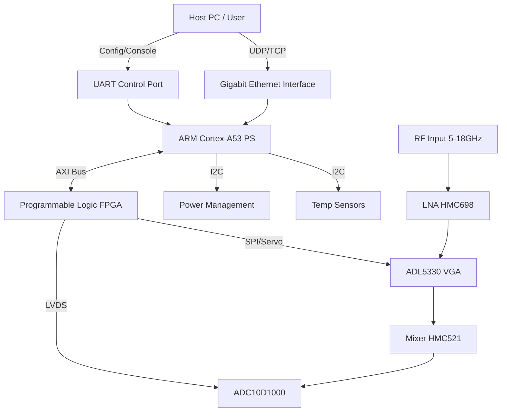
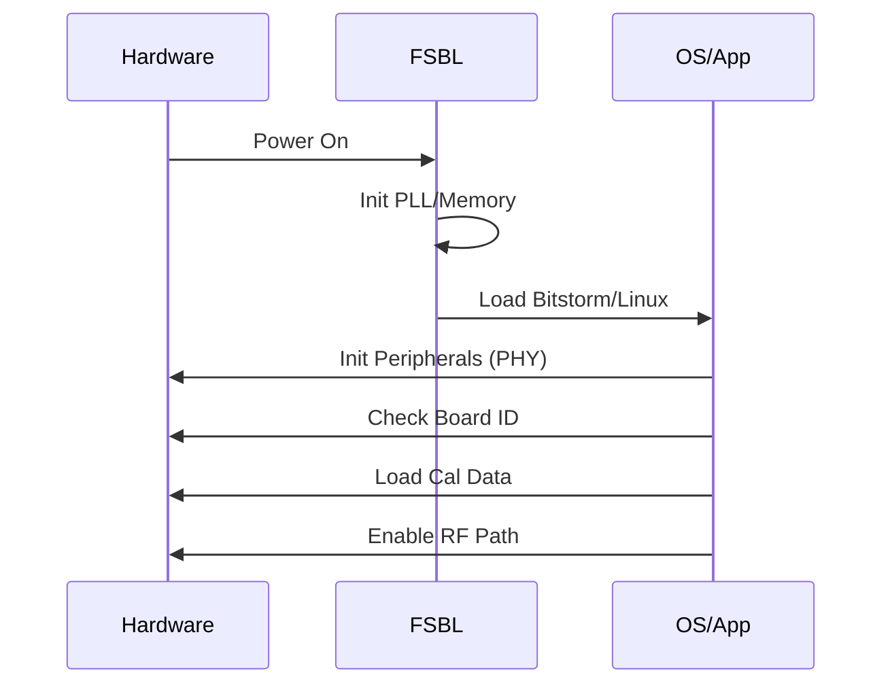
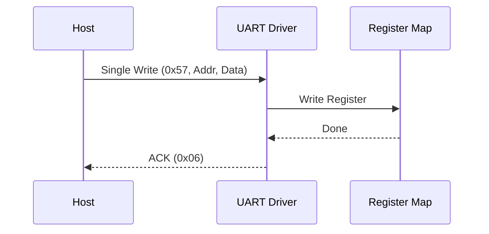
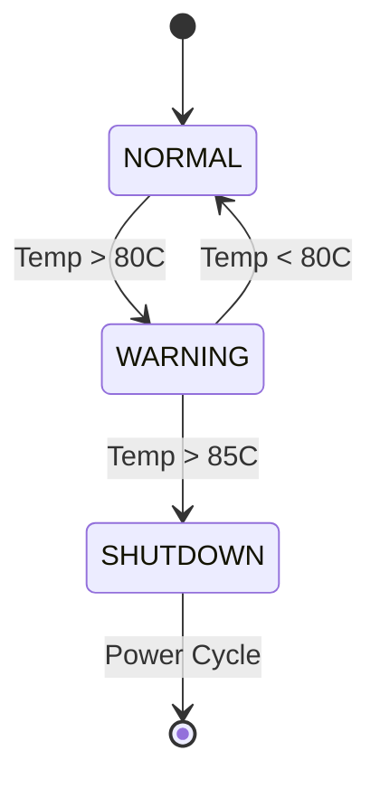
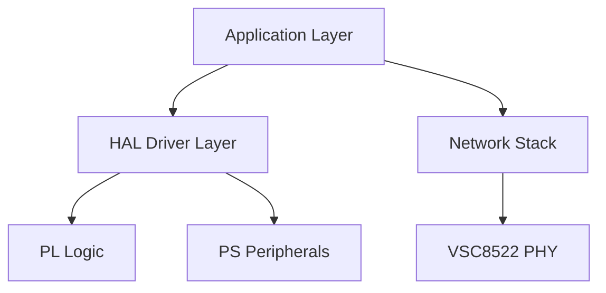

# Software Requirements Specification (SRS)

## Document Control
| Version | Date | Author | Changes |
|---------|------|--------|---------|
| 1.0 | 17 April 2026 | Senior Architect | Initial Release for Project mn |

---

# 1. Introduction

## 1.1 Purpose
This Software Requirements Specification (SRS) defines the comprehensive software and firmware requirements for the **Project mn Wideband RF Receiver System**. The purpose of this document is to specify the functional behavior, performance constraints, and interface definitions for the embedded software running on the XCZU4EV-SFVC784 Zynq UltraScale+ MPSoC and associated microcontroller/digital logic resources.

This document is intended for:
*   **Firmware Engineers:** Responsible for C/C++ implementation and HDL logic design.
*   **Test Engineers:** Responsible for developing test plans and verification procedures.
*   **System Integrators:** Responsible for integrating the RF board with host systems.
*   **Project Stakeholders:** To verify that the software implementation meets the Level 2 System Requirements (SyRS) and Level 1 Stakeholder Requirements (StRS).

## 1.2 Scope
The scope of this software specification covers the complete embedded firmware stack for Project mn.
This includes:
1.  **Board Support Package (BSP):** Initialization of clocks, PLLs, DDR memory, and interrupt controllers.
2.  **Hardware Abstraction Layer (HAL):** Drivers for the ADC10D1000 (LVDS interface), VSC8522 (GigE PHY/RGMII), ADL5330 (VGA), HMC521 (Mixer/Bias), and I2C/SPI peripherals.
3.  **Digital Signal Processing (PL Logic):** Firmware/HDL requirements for the data path (ADC capture, buffering, DMA).
4.  **Control & Telemetry:** UART command protocol implementation for register access and status reporting.
5.  **Power & Thermal Management:** Monitoring rails via I2C PMIC and thermal sensors.

**Exclusions:**
*   Host PC drivers and API libraries (defined in separate ICD).
*   FPGA bitstream synthesis tools ( Vivado project files).

## 1.3 Definitions, Acronyms, and Abbreviations

| Term | Definition |
| :--- | :--- |
| **ADC** | Analog-to-Digital Converter (ADC10D1000). |
| **API** | Application Programming Interface. |
| **ASIL** | Automotive Safety Integrity Level. |
| **BIST** | Built-In Self-Test. |
| **BOM** | Bill of Materials. |
| **BSP** | Board Support Package. |
| **CPLD** | Complex Programmable Logic Device. |
| **CRC** | Cyclic Redundancy Check. |
| **DAC** | Digital-to-Analog Converter. |
| **DMA** | Direct Memory Access. |
| **DSP** | Digital Signal Processing. |
| **DUT** | Device Under Test. |
| **EMC** | Electromagnetic Compatibility. |
| **FIFO** | First-In-First-Out memory buffer. |
| **FPGA** | Field-Programmable Gate Array. |
| **FSBL** | First Stage Boot Loader. |
| **GLR** | Glue Logic Requirements Document. |
| **GPIO** | General Purpose Input/Output. |
| **HAL** | Hardware Abstraction Layer. |
| **HRS** | Hardware Requirements Specification. |
| **ICD** | Interface Control Document. |
| **I2C** | Inter-Integrated Circuit (Serial Bus). |
| **IF** | Intermediate Frequency. |
| **IP** | Intellectual Property (FPGA cores). |
| **IPC** | Inter-Process Communication. |
| **ISR** | Interrupt Service Routine. |
| **JTAG** | Joint Test Action Group (Debug interface). |
| **LNA** | Low Noise Amplifier (HMC698LP4). |
| **LVDS** | Low-Voltage Differential Signaling. |
| **MCU** | Microcontroller Unit (referring to the PS side of Zynq). |
| **MISRA** | Motor Industry Software Reliability Association (C Coding Standard). |
| **MMCM** | Mixed-Mode Clock Manager (Xilinx primitive). |
| **MPSoC** | Multi-Processor System-on-Chip. |
| **NVM** | Non-Volatile Memory (Flash/EEPROM). |
| **OS** | Operating System (Linux/FreeRTOS). |
| **PCB** | Printed Circuit Board. |
| **PHY** | Physical Layer Transceiver (Ethernet). |
| **PLL** | Phase-Locked Loop. |
| **POST** | Power-On Self-Test. |
| **PS** | Processing System (ARM cores in Zynq). |
| **QSPI** | Quad Serial Peripheral Interface. |
| **RAM** | Random Access Memory. |
| **RF** | Radio Frequency. |
| **RGMII** | Reduced Gigabit Media Independent Interface. |
| **ROM** | Read-Only Memory. |
| **RTL** | Register Transfer Level (HDL code). |
| **RTOS** | Real-Time Operating System. |
| **Rx** | Receive. |
| **SFR** | Special Function Register. |
| **SIL** | Safety Integrity Level. |
| **SNR** | Signal-to-Noise Ratio. |
| **SPI** | Serial Peripheral Interface. |
| **SRS** | Software Requirements Specification. |
| **StRS** | Stakeholder Requirements Specification. |
| **SyRS** | System Requirements Specification. |
| **TCP** | Transmission Control Protocol. |
| **TRP** | Transmit/Receive Point (RF control). |
| **UART** | Universal Asynchronous Receiver/Transmitter. |
| **UDP** | User Datagram Protocol. |
| **VGA** | Variable Gain Amplifier (ADL5330). |
| **WDT** | Watchdog Timer. |

## 1.4 References
1.  **IEEE Std 830-1998:** Recommended Practice for Software Requirements Specifications.
2.  **ISO/IEC/IEEE 29148:2018:** Systems and software engineering — Life cycle processes — Requirements engineering.
3.  **MISRA C:2012:** Guidelines for the Use of the C Language in Critical Systems.
4.  **Project mn Hardware Requirements Specification (HRS)** Rev 1.0.
5.  **Project mn Glue Logic Requirements (GLR)** Rev 0V01.
6.  **XCZU4EV-SFVC784 Datasheet:** Xilinx Zynq UltraScale+ MPSoC.
7.  **ADC10D1000 Datasheet:** Texas Instruments (Dual 10-bit 1.0 Gsps ADC).
8.  **ADL5330 Datasheet:** Analog Devices (VGA).
9.  **VSC8522 Datasheet:** Microchip (Gigabit Ethernet PHY).
10. **UG1085 (Zynq UltraScale+ Device Technical Reference Manual)**.

## 1.5 Overview
Section 2 provides an overall description of the product perspective, functions, and constraints.
Section 3 details the specific requirements, including external interfaces (UART, Ethernet, I2C) and functional requirements (ID REQ-SW-xxx) grouped by subsystem.
Section 4 defines verification methods.
Section 5 provides the Requirements Traceability Matrix (RTM), mapping software requirements to hardware and system sources.
Appendices provide data structures, register maps, and diagrams.

---

# 2. Overall Description

## 2.1 Product Perspective

**System Context:**
The Project mn firmware executes on a Xilinx Zynq UltraScale+ MPSoC (XCZU4EV). This device features a Processing System (PS) with dual-core ARM Cortex-A53 and a Programmable Logic (PL) fabric for high-speed DSP.



**Software Stack Layers:**
1.  **Hardware Layer:** Physical components (ADC, PHY, PS, PL).
2.  **HDL/PL Layer:** Logic for ADC interface deserialization, FIFO buffering, and DMA.
3.  **Driver Layer (BSP):** Linux kernel drivers or bare-metal drivers for AXI-GPIO, AXI-DMA, UART, I2C, SPI.
4.  **Application Layer (Firmware):**
    *   **Control Task:** Handles UART packets (GLR protocol), gain control, and state machines.
    *   **Data Task:** Manages Ethernet socket connections and PL DMA transfers.
    *   **Monitor Task:** Handles periodic temperature and voltage polling.

## 2.2 Product Functions
Major software functions include:
1.  **System Initialization:** Boot sequence, PLL locking, DDR calibration.
2.  **RF Control:** Programming the ADL5330 VGA gain via SPI/GPIO.
3.  **Data Capture:** Configuring ADC10D1000 (DDR LVDS) and streaming to PL DDR.
4.  **Network Streaming:** Encapsulating IQ data in UDP frames and transmitting via VSC8522.
5.  **Control Interface:** Interpreting UART commands (Read/Write) per GLR frame format.
6.  **Thermal Protection:** Monitoring sensors and shutting down RF power if thresholds exceeded.
7.  **Configuration Management:** Loading settings from non-volatile Flash (QSPI).
8.  **Self-Diagnostics:** POST execution and error logging.

## 2.3 User Characteristics
*   **Firmware Engineers:** Develop and debug the C/C++ code and HDL.
*   **Test Engineers:** Utilize the UART console to inject commands and verify responses.
*   **System Integrators:** Configure IP addresses and gain settings via the Ethernet/UDP interface.

## 2.4 Constraints
1.  **Compliance:** Software written in C shall comply with MISRA-C:2012 guidelines.
2.  **Environment:** Embedded Linux (PetaLinux) on ARM Cortex-A53; Real-time constraints in PL logic.
3.  **Memory:** Limited on-chip memory in PL; efficient DMA usage required to prevent buffer overruns.
4.  **Timing:** RF Control loop must respond within 1ms.
5.  **Power:** Total system power constrained to 25W (HRS REQ-HW-014); software must manage power states efficiently.

## 2.5 Assumptions and Dependencies
1.  The Hardware design provides the GLR-specified register map at AXI base address `0x8000_0000`.
2.  The 125MHz reference clock is stable and jitter-free within 50ppm.
3.  The Host PC has a compatible Gigabit Ethernet NIC.
4.  External LO is stable and within power limits before Mixer enable.

---

# 3. Specific Requirements

## 3.1 External Interface Requirements

### 3.1.1 Hardware Interfaces

#### 3.1.1.1 UART Interface (Control & Debug)
The software shall implement a UART driver for the PS UART0 (16550 compatible) at 115200 baud, 8N1.

**Register Map Definition (Logic Overlay in PL):**
```c
/**
 * @file uart_regs.h
 * @brief Memory-mapped structure for the UART Control Block in FPGA.
 * Base Address: 0x8000_1000 (Example, see GLR for specific)
 */
typedef struct {
    volatile uint32_t BAUD_DIV;    // 0x00: Baud rate divisor
    volatile uint32_t CTRL;        // 0x04: Control register (Bit 0: Enable)
    volatile uint32_t STATUS;      // 0x08: Status register (Bit 0: RX_EMPTY)
    volatile uint32_t TX_FIFO;     // 0x0C: TX FIFO Write
    volatile uint32_t RX_FIFO;     // 0x10: RX FIFO Read
    volatile uint32_t IRQ_EN;      // 0x14: Interrupt Enable
    volatile uint32_t IRQ_STATUS;  // 0x18: Interrupt Status
} UART_RegMap_t;

// Driver API
int32_t UART_Init(uint32_t base_addr, uint32_t baud_rate);
int32_t UART_WriteByte(uint8_t data);
int32_t UART_ReadByte(uint8_t *data, uint32_t timeout_ms);
void    UART_Handler(void); // ISR
```

#### 3.1.1.2 SPI Interface (VGA & Flash)
The software shall implement an SPI master driver to control the ADL5330 VGA gain and read/write configuration Flash.

```c
typedef struct {
    volatile uint32_t CTRL;    // 0x00: Control (CS, Clock Polarity)
    volatile uint32_t STATUS;  // 0x04: Status (TX FIFO empty)
    volatile uint32_t TX_DATA; // 0x08: Data to transmit
    volatile uint32_t RX_DATA; // 0x0C: Data received
    volatile uint32_t SS;      // 0x10: Slave Select (Multi-target)
} SPI_RegMap_t;

/**
 * @brief Set the Gain of the ADL5330
 * @param gain_code 6-bit gain code (0-63) mapped to -11dB to +25dB approx
 */
int32_t VGA_SetGain(uint8_t gain_code);

/**
 * @brief Read Status Register from Flash
 */
int32_t Flash_ReadStatus(uint8_t *status);
```

#### 3.1.1.3 I2C Interface (Sensors)
The software shall utilize the ARM PS I2C controller to read temperature sensors (e.g., LM75, ADT7410) and Power Monitors (e.g., INA219).

```c
/**
 * @brief Read temperature from I2C sensor
 * @param sensor_id I2C 7-bit address
 * @param temp_c Pointer to store temperature in Celsius
 */
int32_t TempSensor_Read(uint8_t sensor_id, float *temp_c);

/**
 * @brief Read Voltage/Current from I2C Power Monitor
 * @param rail_id Register index for the specific rail
 */
int32_t PowerMon_Read(uint8_t rail_id, float *volts, float *amps);
```

### 3.1.2 Software Interfaces
*   **AXI DMA Driver:** Standard Xilinx AXI DMA driver for transferring packets between PL FIFOs and PS DDR.
*   **Socket API:** Standard POSIX Berkeley sockets (`sys/socket.h`) for UDP transmission.

### 3.1.3 Communication Interfaces
The primary command interface is UART. The software shall implement the protocol defined in GLR §6.

**Frame Format:**

| Command | CMD byte | Frame Structure | Response |
|---------|----------|-----------------|----------|
| Single Write | 0x57 ('W') | `[0x57][ADDR_H][ADDR_L][DATA_H][DATA_L]` | `[0x06]` ACK |
| Single Read  | 0x52 ('R') | `[0x52][ADDR_H\|0x80][ADDR_L]` | `[DATA_H][DATA_L]` |
| Bulk Write   | 0x42 ('B') | `[0x42][ADDR_H][ADDR_L][N][D0_H][D0_L]...[Dn_H][Dn_L]` | `[0x06]` ACK |
| Bulk Read    | 0x62 ('b') | `[0x62][ADDR_H\|0x80][ADDR_L][N]` | `[D0_H][D0_L]...[Dn_H][Dn_L]` |
| Error NAK    | 0x15 | Sent by FPGA on invalid command/address | — |

*   **Addressing:** 16-bit address space. Reads require Bit 15 to be set.
*   **Timing:** Inter-byte timeout 50ms. Transaction timeout 10ms.
*   **UDP Stream:** Format is `[Header 4B][Payload 1024B][Footer 4B]`.

## 3.2 Functional Requirements

### 3.2.1 System Initialization (REQ-SW-001 to REQ-SW-010)

| ID | Requirement | Source | Prio | Verif |
|----|-------------|--------|------|-------|
| REQ-SW-001 | The software SHALL complete the FSBL boot sequence and load the OS/Application bitstream within 2 seconds of power-on. | HRS 2.0 | M | T |
| REQ-SW-002 | The software SHALL verify the Board ID register (`BOARD_ID`) at address `0xFFFF` matches `0x4D4E` ("mn") during startup. | GLR 8.1 | M | T |
| REQ-SW-003 | The software SHALL configure the ARM PS PLLs to generate 1.2GHz CPU clocks before initializing peripherals. | UG1085 | M | I |
| REQ-SW-004 | The software SHALL initialize the VSC8522 Gigabit Ethernet PHY via RGMII and wait for Link Up status before attempting data transmission. | HRS REQ-HW-009 | M | T |
| REQ-SW-005 | The software SHALL load calibration data (Gain Lookup Tables) from SPI Flash into DDR RAM. | GLR 5.0 | M | T |
| REQ-SW-006 | The software SHALL perform a RAM BIST (Built-In Self Test) on the first 1MB of DDR RAM. | HRS 3.0 | D | T |
| REQ-SW-007 | The software SHALL initialize the Watchdog Timer (WDT) with a 5-second timeout. | GLR 5.0 | M | I |
| REQ-SW-008 | The software SHALL enable the ADC data capture path only after the "System Ready" flag is set. | GLR 6.0 | M | I |
| REQ-SW-009 | The software SHALL set the Status LED to AMBER (Blinking) during the boot phase. | HRS 3.1 | D | D |
| REQ-SW-010 | The software SHALL set the Status LED to GREEN (Solid) upon successful completion of POST. | HRS 3.1 | M | D |

### 3.2.2 UART Communication Driver (REQ-SW-011 to REQ-SW-020)

| ID | Requirement | Source | Prio | Verif |
|----|-------------|--------|------|-------|
| REQ-SW-011 | The software SHALL implement a UART receiver ISR that buffers bytes into a circular FIFO. | GLR 6.2 | M | T |
| REQ-SW-012 | The software SHALL parse the Single Write command (0x57) and write the data word to the specified AXI register. | GLR 6.3 | M | T |
| REQ-SW-013 | The software SHALL parse the Single Read command (0x52) and return the content of the requested AXI register. | GLR 6.3 | M | T |
| REQ-SW-014 | The software SHALL support the Bulk Write command (0x42) for up to 64 registers in a single transaction. | GLR 6.4 | M | T |
| REQ-SW-015 | The software SHALL verify the checksum of the Bulk Write packet if the CRC_Enable bit is set. | GLR 6.4 | D | T |
| REQ-SW-016 | The software SHALL respond to any malformed command with a NAK (0x15) byte within 1ms. | GLR 6.5 | M | T |
| REQ-SW-017 | The software SHALL lock the register map access if the System State is "RX_ACTIVE" to prevent gain glitches. | HRS REQ-HW-013 | M | I |
| REQ-SW-018 | The software SHALL provide a "Loopback Mode" where received UART bytes are echoed back for connectivity testing. | GLR 6.0 | O | T |
| REQ-SW-019 | The UART driver SHALL recover from framing errors by flushing the RX FIFO. | HRS 3.1 | M | T |
| REQ-SW-020 | The software SHALL implement a command parser that treats addresses with Bit 15 set as READ operations. | GLR 6.3 | M | I |

### 3.2.3 RF Control & Gain Management (REQ-SW-021 to REQ-SW-030)

| ID | Requirement | Source | Prio | Verif |
|----|-------------|--------|------|-------|
| REQ-SW-021 | The software SHALL control the ADL5330 VGA gain via a 6-bit parallel GPIO interface or SPI (whichever is implemented in GLR). | HRS REQ-HW-013 | M | T |
| REQ-SW-022 | The software SHALL update the VGA gain only when the ADC is not sampling to prevent transients. | HRS REQ-HW-013 | M | I |
| REQ-SW-023 | The software SHALL maintain a "Current Gain" variable in software state, readable via UART register `0x0010`. | GLR 8.2 | M | T |
| REQ-SW-024 | The software shall accept a "Target Gain" command via UART (0x57) and slew the hardware gain at a max rate of 10dB/us. | HRS REQ-HW-013 | M | T |
| REQ-SW-025 | The software SHALL assert the Mixer Enable pin (GPIO) only when the LO input is stable. | HRS 3.1 | M | I |
| REQ-SW-026 | The software SHALL implement an Automatic Gain Control (AGC) loop if enabled by Config Bit `0x0020:0`. | HRS REQ-HW-013 | O | T |
| REQ-SW-027 | The AGC loop SHALL attempt to maximize the ADC SNR while keeping the signal below -1dBFS. | HRS REQ-HW-004 | M | A |
| REQ-SW-028 | The software SHALL disable the RF Front End (set gain to min) if a fault is detected. | HRS REQ-HW-003 | M | T |
| REQ-SW-029 | The software SHALL log the last 100 gain changes to a circular buffer in RAM. | GLR 5.0 | D | I |
| REQ-SW-030 | The software SHALL read the LNA bias current via ADC and report it via UART. | HRS 3.1 | M | T |

### 3.2.4 Temperature Monitoring & Protection (REQ-SW-031 to REQ-SW-040)

| ID | Requirement | Source | Prio | Verif |
|----|-------------|--------|------|-------|
| REQ-SW-031 | The software SHALL poll the on-die ARM temperature sensor every 500ms. | HRS REQ-HW-008 | M | T |
| REQ-SW-032 | The software SHALL poll the external I2C temperature sensor (near RF front end) every 500ms. | HRS REQ-HW-008 | M | T |
| REQ-SW-033 | The software SHALL trigger a "Thermal Warning" (UART Event 0xE0) if temperature exceeds 80°C. | HRS REQ-HW-008 | M | T |
| REQ-SW-034 | The software SHALL trigger a "Thermal Shutdown" if temperature exceeds 85°C. | HRS REQ-HW-008 | M | T |
| REQ-SW-035 | Upon Thermal Shutdown, the software SHALL power down the RF front end (LNA/Mixer off) but keep the CPU running. | HRS REQ-HW-008 | M | T |
| REQ-SW-036 | The software SHALL implement a hysteresis of 5°C for thermal shutdown (do not restart until temp < 80°C). | HRS REQ-HW-008 | M | A |
| REQ-SW-037 | The software SHALL make the current temperature value available at UART register `0x0030`. | GLR 8.2 | M | T |
| REQ-SW-038 | The software SHALL assert the FAN_SPEED signal to HIGH if temperature > 70°C. | HRS 3.1 | M | T |
| REQ-SW-039 | The software SHALL log the maximum temperature experienced since boot (register `0x0032`). | GLR 8.2 | M | T |
| REQ-SW-040 | The software SHALL generate a critical interrupt if the temperature sensor fails to respond (I2C NACK). | HRS REQ-HW-008 | M | T |

### 3.2.5 Data Acquisition & DSP (REQ-SW-041 to REQ-SW-050)

| ID | Requirement | Source | Prio | Verif |
|----|-------------|--------|------|-------|
| REQ-SW-041 | The software SHALL configure the ADC10D1000 for Dual Edge (DDR) mode via SPI. | HRS REQ-HW-006 | M | I |
| REQ-SW-042 | The software SHALL set the ADC sampling clock to 1.0 Gsps on startup. | HRS REQ-HW-006 | M | T |
| REQ-SW-043 | The software SHALL capture the ADC data via the PL LVDS interface and write it to a 4KB FIFO. | GLR 4.0 | M | T |
| REQ-SW-044 | The software SHALL use the AXI DMA engine to move data from the PL FIFO to DDR RAM when the FIFO reaches Half Full. | GLR 4.0 | M | T |
| REQ-SW-045 | The software SHALL implement a Packet Builder that wraps 1024 samples in a UDP frame. | HRS REQ-HW-009 | M | I |
| REQ-SW-046 | The software SHALL transmit the UDP frames to the IP address stored in `CFG_NET_DST_IP` (Register `0x0100`). | GLR 8.2 | M | T |
| REQ-SW-047 | The software SHALL insert a sequence number (0-65535) in the UDP header. | GLR 6.0 | M | I |
| REQ-SW-048 | The software SHALL calculate and insert a CRC32 checksum in the UDP footer. | GLR 6.4 | M | T |
| REQ-SW-049 | The software SHALL handle Ethernet link loss by pausing the DMA and buffering in PL until link recovers. | HRS REQ-HW-009 | M | T |
| REQ-SW-050 | The software SHALL support a "Stream Mode" bit in the Control Register to start/stop data flow. | GLR 8.1 | M | T |

### 3.2.6 Power Management (REQ-SW-051 to REQ-SW-060)

| ID | Requirement | Source | Prio | Verif |
|----|-------------|--------|------|-------|
| REQ-SW-051 | The software SHALL monitor the 5V, 3.3V, 1.8V, and 1.0V rails via I2C PMIC. | HRS REQ-HW-014 | M | T |
| REQ-SW-052 | The software SHALL assert a Fault if any rail deviates by >5% from nominal. | HRS REQ-HW-014 | M | T |
| REQ-SW-053 | The software SHALL log the total power consumption (Watts) to register `0x0040`. | GLR 8.2 | M | A |
| REQ-SW-054 | The software SHALL implement a software-controlled "Soft Power Down" sequence. | HRS REQ-HW-014 | M | T |
| REQ-SW-055 | The software SHALL prioritize power sequencing: Core Rails (1.0V) before IO Rails (3.3V) during wake-up. | HRS 3.1 | M | I |
| REQ-SW-056 | The software SHALL read the current consumption of the RF Front end specifically. | HRS REQ-HW-014 | M | T |
| REQ-SW-057 | The software SHALL throttle the Ethernet packet rate if total power exceeds 24W. | HRS REQ-HW-014 | D | T |
| REQ-SW-058 | The software SHALL enter a "Sleep Mode" where the PL is unclocked if no UDP traffic is received for 10 seconds (Optional). | GLR 5.0 | O | D |
| REQ-SW-059 | The software SHALL wake from Sleep Mode instantly upon UART interrupt. | GLR 5.0 | O | T |
| REQ-SW-060 | The software SHALL maintain a "Boot Count" in Flash to track power cycles. | GLR 5.0 | D | I |

### 3.2.7 Diagnostics and POST (REQ-SW-061 to REQ-SW-075)

| ID | Requirement | Source | Prio | Verif |
|----|-------------|--------|------|-------|
| REQ-SW-061 | The software SHALL run POST on every power-up. | HRS 3.1 | M | T |
| REQ-SW-062 | The POST sequence SHALL include a UART Loopback test (TX connected to RX internally via jumper). | HRS 3.1 | M | T |
| REQ-SW-063 | The POST sequence SHALL verify the external Flash ID via SPI. | HRS 3.1 | M | T |
| REQ-SW-064 | The POST sequence SHALL verify the Ethernet PHY ID via MDIO read. | HRS 3.1 | M | T |
| REQ-SW-065 | The POST sequence SHALL check the PLL lock status of the ADC clock. | HRS REQ-HW-006 | M | T |
| REQ-SW-066 | The software SHALL write the POST result code to register `0x0050`. | GLR 8.2 | M | T |
| REQ-SW-067 | The software SHALL set the System Status LED to RED if POST fails. | HRS 3.1 | M | D |
| REQ-SW-068 | The software SHALL implement a "Heartbeat" counter that increments every 1ms (Register `0x0054`). | GLR 8.2 | M | T |
| REQ-SW-069 | The software SHALL support a "Factory Reset" command via UART (Special Write to `0xFFFF`). | GLR 6.3 | M | T |
| REQ-SW-070 | The software SHALL allow firmware update via TFTP over Ethernet if the Boot Mode jumper is set. | GLR 5.0 | M | T |
| REQ-SW-071 | The software SHALL implement a Watchdog Pet routine in the main loop. | HRS 3.1 | M | I |
| REQ-SW-072 | The software SHALL halt the Watchdog if the debugger is attached (via DAP register check). | HRS 3.1 | D | I |
| REQ-SW-073 | The software SHALL provide a stack dump (via UART) if a Hard Fault occurs. | HRS 3.1 | M | T |
| REQ-SW-074 | The software SHALL log the last 32 error codes to a non-volatile register block. | GLR 5.0 | M | I |
| REQ-SW-075 | The software SHALL provide a command to read the Firmware Version string. | HRS 3.1 | M | T |

## 3.3 Performance Requirements

| ID | Requirement | Verif |
|----|-------------|-------|
| REQ-PERF-001 | The software SHALL process a UART Single Read command and respond within 200 microseconds. | T |
| REQ-PERF-002 | The software SHALL sustain UDP data throughput of 800 Mbps (aggregate) on the GigE interface. | T |
| REQ-PERF-003 | The software SHALL complete a VGA gain change command within 1ms. | T |
| REQ-PERF-004 | The interrupt latency for the AXI DMA transfer complete SHALL be less than 50 microseconds. | A |
| REQ-PERF-005 | The software SHALL boot to "Data Ready" state within 4 seconds of power application. | T |
| REQ-PERF-006 | The software SHALL not use more than 80% of the ARM CPU capacity (leaving 20% headroom). | A |
| REQ-PERF-007 | The software SHALL handle the UART command parser without blocking the main loop for more than 5ms. | A |
| REQ-PERF-008 | The software SHALL allocate no more than 200MB of DDR RAM for buffering. | I |
| REQ-PERF-009 | The software SHALL complete a Full EEPROM read (64KB) within 500ms. | T |
| REQ-PERF-010 | The software SHALL update the temperature display/registers at a rate of 2Hz. | T |

## 3.4 Design Constraints
1.  **Coding Standard:** All C code shall adhere to MISRA-C:2012. Deviations must be documented.
2.  **Dynamic Memory:** `malloc` and `free` are prohibited after the initialization phase.
3.  **Concurrency:** Shared data structures must be protected by mutexes or atomic operations.
4.  **Interrupts:** Interrupt Service Routines (ISRs) shall execute for no longer than 100 microseconds.
5.  **Stack Size:** The main task stack shall be sized for 64KB minimum; ISR stack for 8KB.
6.  **Float:** Floating point operations shall be avoided in the PL data path; use fixed-point logic.
7.  **Toolchain:** Xilinx Vitis 2023.1 or later for compilation.
8.  **Watchdog:** The Watchdog Timer SHALL be enabled in hardware and cannot be disabled by software.

## 3.5 Software System Attributes

### 3.5.1 Reliability
The software shall achieve a Mean Time Between Failures (MTBF) of 10,000 hours. All critical errors (e.g., DMA errors, Parity errors) shall be logged to non-volatile memory. The system shall implement a "Graceful Degradation" mode where data capture continues even if the Ethernet link is down (buffering to local RAM if available).

### 3.5.2 Availability
The system shall be available for operation 99.5% of the time. Restart time after a fault reset shall be less than 5 seconds.

### 3.5.3 Security
Write access to configuration registers via UART shall be disabled (Read-Only) unless the user sends a specific "Unlock" sequence (0xAA, 0x55). Firmware updates via TFTP shall require a cryptographic signature check (CRC-32) before applying.

### 3.5.4 Maintainability
All software modules shall be partitioned such that a change in the Ethernet PHY driver does not require recompilation of the RF control logic. Code comments shall be generated via Doxygen.

### 3.5.5 Portability
The HAL layer shall abstract the specific Xilinx OS drivers, allowing potential porting to a different ARM Cortex-A platform in the future.

---

# 4. Verification and Validation

## 4.1 Unit Test Requirements
Each driver module (UART, SPI, I2C, DMA) shall have a unit test suite covering:
*   **Normal Operation:** API calls with valid parameters.
*   **Edge Cases:** Max buffer sizes, zero-length packets.
*   **Error Injection:** Hardware timeout simulation, NACK simulation.

## 4.2 Integration Test Requirements
*   **UART Protocol:** Verify all 4 defined frame formats with a logic analyzer.
*   **Data Path:** Inject a known sine wave into the ADC, capture UDP packets on Host PC, verify signal integrity (SNR).
*   **Thermal:** Heat the board with a heat gun; verify fan speed up and shutdown threshold.

## 4.3 System Test Requirements
*   **Duration:** 72-hour continuous soak test at nominal temperature (25°C).
*   **Stress:** Max input power (-10dBm) while changing gain rapidly.
*   **Compliance:** Verify emissions do not exceed limits while software is active.

---

# 5. Requirements Traceability Matrix

| REQ-SW-xxx | Description | Source (REQ-HW/GLR) |
|-----------|-------------|----------------------|
| REQ-SW-001 | Boot sequence timing | HRS 2.0 |
| REQ-SW-002 | Board ID check | GLR 8.1 |
| REQ-SW-003 | PLL Config | UG1085 |
| REQ-SW-004 | PHY Init | HRS REQ-HW-009 |
| REQ-SW-005 | Cal Load | GLR 5.0 |
| REQ-SW-011 | UART ISR | GLR 6.2 |
| REQ-SW-012 | Single Write | GLR 6.3 |
| REQ-SW-021 | VGA Control | HRS REQ-HW-013 |
| REQ-SW-031 | Temp Poll | HRS REQ-HW-008 |
| REQ-SW-041 | ADC Config | HRS REQ-HW-006 |
| REQ-SW-043 | FIFO Capture | GLR 4.0 |
| REQ-SW-051 | Rail Monitor | HRS REQ-HW-014 |
| REQ-SW-061 | POST | HRS 3.1 |

---

# 6. Appendices

## Appendix A — Error Codes
```c
typedef enum {
    ERR_OK           = 0x00, // No error
    ERR_TIMEOUT      = 0x01, // Timeout waiting for HW
    ERR_COMM_UART    = 0x02, // UART Framing/Parity
    ERR_COMM_SPI     = 0x03, // SPI NACK
    ERR_CRC          = 0x04, // Checksum mismatch
    ERR_PARAM        = 0x05, // Invalid parameter
   _ERR_NOT_INIT     = 0x06, // Driver not init
    ERR_HARDWARE     = 0x07, // HW Fault
    ERR_OVERFLOW     = 0x08, // FIFO overflow
    ERR_FLASH        = 0x09, // Flash write fail
    ERR_TEMP_HIGH    = 0x0A, // Overtemp
    ERR_POWER_LOW    = 0x0B, // Brownout
    ERR_DMA          = 0x0C, // DMA Error
} ErrorCode_t;
```

## Appendix B — FPGA Register Map Summary

| Address | Name | Width | R/W | Description |
|---------|------|-------|-----|-------------|
| 0x0000 | CTRL_REG | 16 | RW | Control Register (Bit 0: Enable) |
| 0x0001 | STATUS | 16 | R | Status Flags (Bit 0: Locked) |
| 0x0002 | GAIN_LSB | 16 | RW | VGA Gain Code LSB |
| 0x0003 | GAIN_MSB | 16 | RW | VGA Gain Code MSB |
| 0x0010 | CURR_GAIN | 16 | R | Current Gain Reading |
| 0x0020 | TEMP_VAL | 16 | R | Temperature (C * 10) |
| 0x0030 | ADC_RATE | 32 | RW | ADC Sampling Rate (Hz) |
| 0x0100 | DST_IP | 32 | RW | Dest IP Address |
| 0xFFFF | BOARD_ID | 16 | R | Fixed ID 0x4D4E |

## Appendix C — Mermaid Diagrams

### System Initialization Sequence


### UART Command Flow


### Temperature State Machine


### Software Stack Architecture
