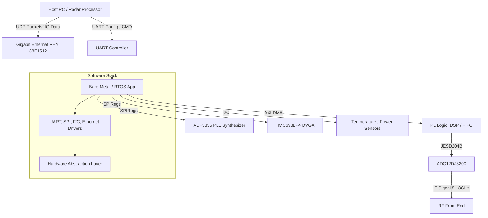
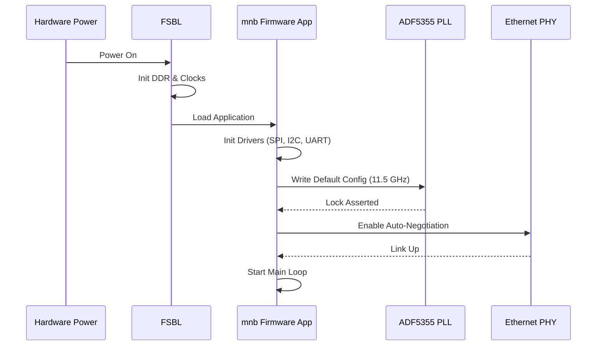
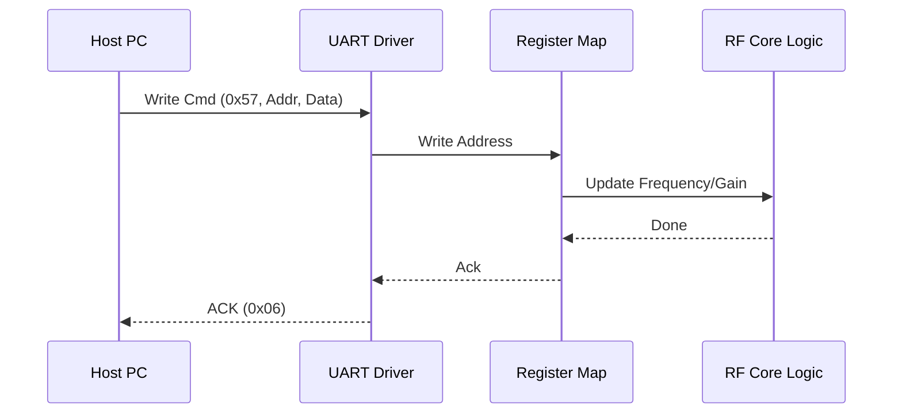
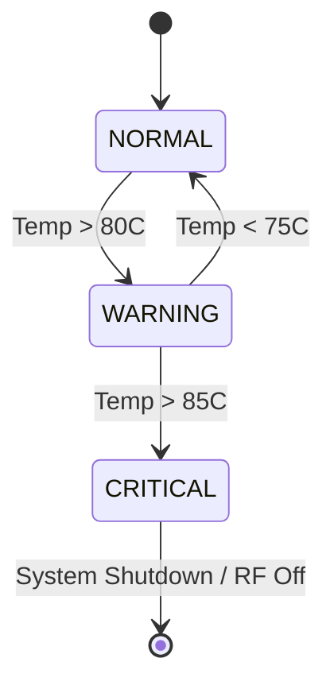
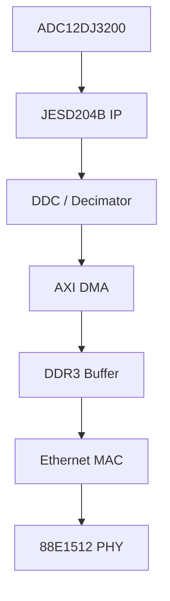

# Software Requirements Specification (SRS)

**Project ID:** mnb  
**Document Title:** Software Requirements Specification for Wideband RF Receiver Firmware  
**Version:** 1.0  
**Date:** 17 April 2026  

---

## Document Control
| Version | Date | Author | Changes |
|---------|------|--------|---------|
| 1.0 | 17 April 2026 | System Architect | Initial Release for mnb RF Receiver Firmware |

---

# 1. Introduction

## 1.1 Purpose
This Software Requirements Specification (SRS) defines the comprehensive software requirements for the **mnb Wideband RF Receiver Module** firmware. This document describes the software functions necessary to control the RF signal chain (LNA, Mixer, PLL), manage high-speed data acquisition via the JESD204B interface, perform Digital Signal Processing (DSP) on the Xilinx Zynq UltraScale+ FPGA, and stream I/Q data via Gigabit Ethernet.

This specification is intended for:
*   **Firmware Engineers:** Implementing the bare-metal drivers, RTL logic, and high-level software on the ARM Cortex-A53.
*   **Test Engineers:** Developing verification test plans and automated test scripts.
*   **System Integrators:** Integrating the module into larger signal intelligence or communications systems.
*   **Hardware Engineers:** Understanding the software assumptions regarding timing, register access, and data protocols.

## 1.2 Scope
The software scope encompasses the firmware running on the **XCZU4EG-SFVC784** MPSoC. This includes:
*   **Processing System (PS) Software:** Bare-metal/RTOS initialization running on the ARM Cortex-A53 cores.
*   **Hardware Drivers:** Low-level drivers for SPI (PLL, VGA), I2C (Sensors), UART (Control Interface), and GPIO.
*   **Programmable Logic (PL) Configuration:** Bitstream loading and configuration of the FPGA fabric.
*   **Data Path:** Control of the JESD204B RX IP, DDC (Digital Down Converter), and Ethernet DMA.
*   **Communication:** Implementation of the UART Command Protocol and Gigabit Ethernet streaming (UDP/IP).
*   **Diagnostics:** Built-In Self-Test (BIST), fault logging, and power management.

The scope explicitly excludes the host-side PC application software that receives the Ethernet data, though the protocol format is defined.

## 1.3 Definitions, Acronyms, and Abbreviations

| Term | Definition |
| :--- | :--- |
| **ADC** | Analog-to-Digital Converter (TI ADC12DJ3200). |
| **AGC** | Automatic Gain Control. |
| **API** | Application Programming Interface. |
| **AXI** | Advanced Extensible Interface (Xilinx bus standard). |
| **BIST** | Built-In Self-Test. |
| **BSP** | Board Support Package. |
| **DDR** | Double Data Rate SDRAM. |
| **DMA** | Direct Memory Access. |
| **DSP** | Digital Signal Processing. |
| **DUT** | Device Under Test. |
| **EEPROM** | Electrically Erasable Programmable Read-Only Memory. |
| **EMC** | Electromagnetic Compatibility. |
| **FIFO** | First-In-First-Out buffer. |
| **FPGA** | Field-Programmable Gate Array. |
| **FSBL** | First Stage Boot Loader (Xilinx). |
| **GSPS** | Giga-Samples Per Second. |
| **HAL** | Hardware Abstraction Layer. |
| **HRS** | Hardware Requirements Specification. |
| **I2C** | Inter-Integrated Circuit (Serial Bus). |
| **IF** | Intermediate Frequency. |
| **IO** | Input/Output. |
| **IRQ** | Interrupt Request. |
| **ISR** | Interrupt Service Routine. |
| **JTAG** | Joint Test Action Group (Debug Interface). |
| **LVDS** | Low-Voltage Differential Signaling. |
| **MAC** | Media Access Control. |
| **MISRA** | Motor Industry Software Reliability Association (C Coding Standard). |
| **MMIC** | Monolithic Microwave Integrated Circuit. |
| **NVM** | Non-Volatile Memory. |
| **OS** | Operating System. |
| **PCB** | Printed Circuit Board. |
| **PHY** | Physical Layer Transceiver. |
| **PLL** | Phase-Locked Loop. |
| **POR** | Power-On Reset. |
| **PS** | Processing System (ARM cores in Zynq). |
| **QSPI** | Quad Serial Peripheral Interface. |
| **RAM** | Random Access Memory. |
| **RF** | Radio Frequency. |
| **ROM** | Read-Only Memory. |
| **RTL** | Register Transfer Logic. |
| **Rx** | Receive. |
| **SPI** | Serial Peripheral Interface. |
| **SRAM** | Static Random Access Memory. |
| **SRS** | Software Requirements Specification. |
| **SyRS** | System Requirements Specification. |
| **TCP/IP** | Transmission Control Protocol/Internet Protocol. |
| **TRP** | Transmit/Receive Pulse (RF Enable). |
| **UART** | Universal Asynchronous Receiver/Transmitter. |
| **UDP** | User Datagram Protocol. |
| **VCO** | Voltage-Controlled Oscillator. |
| **VGA** | Variable Gain Amplifier. |
| **WDT** | Watchdog Timer. |

## 1.4 References
1.  **IEEE Std 830-1998**: Recommended Practice for Software Requirements Specifications.
2.  **ISO/IEC/IEEE 29148:2018**: Systems and software engineering — Life cycle processes — Requirements engineering.
3.  **IEEE 1016-2009**: Standard for Software Design Descriptions.
4.  **MISRA-C:2012**: Guidelines for the use of the C language in critical systems.
5.  **HRS-mnb-1.0**: Hardware Requirements Specification for mnb Receiver (P2).
6.  **GLR-mnb-0V01**: Glue Logic Requirements for mnb FPGA (P6).
7.  **Xilinx UG1085**: Zynq UltraScale+ Device Technical Reference Manual.
8.  **TI ADC12DJ3200 Datasheet**: SBAS657D (FEB 2013).
9.  **Analog Devices ADF5355 Datasheet**: Wideband Synthesizer with Integrated VCO.
10. **Analog Devices HMC698LP4 Datasheet**: GaAs MMIC PHEMT Amplifier.
11. **RFC 791**: Internet Protocol (IP).
12. **RFC 768**: User Datagram Protocol (UDP).

## 1.5 Overview
Section 2 provides a high-level description of the software architecture, including the hardware context, major functions, and user characteristics.
Section 3 details the specific requirements. Section 3.1 defines hardware interfaces and protocols (UART, SPI, I2C). Section 3.2 lists the functional requirements (ID: REQ-SW-001 through REQ-SW-085) mapped to hardware features.
Section 4 outlines verification and validation methods.
Section 5 provides the Requirements Traceability Matrix (RTM).
Appendices provide error codes, register maps, state diagrams, and protocol definitions.

---

# 2. Overall Description

## 2.1 Product Perspective

The mnb firmware resides on the Xilinx Zynq UltraScale+ MPSoC (XCZU4EG), which acts as the system controller and data processor. The software operates across two domains:

1.  **PS (Processing System):** The dual-core ARM Cortex-A53 runs the control logic. It handles the UART command interface, SPI configuration of the RF PLL/VGA, I2C sensor polling, and Ethernet UDP packet construction.
2.  **PL (Programmable Logic):** The FPGA fabric handles high-speed data paths: JESD204B interfacing to the ADC, Real-Time DSP (DDC, Filtering), and Ethernet DMA offload.

The software does not run a standard OS (like Linux) but rather a high-reliability bare-metal environment or lightweight RTOS to meet real-time deadlines (latency < 1ms for control commands).

**System Context Diagram:**


## 2.2 Product Functions
The major software functions include:
1.  **System Initialization:** Boot sequence, PLL locking, ADC calibration.
2.  **RF Control:** Tuning LO frequency (5-18 GHz), setting gain (0-60 dB).
3.  **Data Acquisition:** Configuring ADC for 2.0+ GSPS, capturing I/Q data.
4.  **Data Streaming:** Packetizing I/Q samples and streaming via Gigabit Ethernet.
5.  **UART Command Handler:** Parsing register read/write commands.
6.  **Health Monitoring:** Polling temperature sensors and power rails.
7.  **Fault Management:** Watchdog servicing and error logging.

## 2.3 User Characteristics
*   **Firmware Engineers:** Develop and debug code using JTAG and SDK tools. Require visibility into registers and memory.
*   **System Integrators:** Control the device via high-level UART commands or Ethernet API. Expect deterministic behavior (ACK/NAK).
*   **Field Engineers:** Use the device for signal capture. Require robust error handling if the unit overheats or loses lock.

## 2.4 Constraints
1.  **Real-Time Latency:** Ethernet packets must be transmitted within strict timing bounds to prevent DMA FIFO overflow.
2.  **Memory:** The XCZU4EG has limited on-chip memory; efficient use of DDR3 is required for buffering.
3.  **Safety:** The software must prevent accidental transmission if the RF chain is malfunctioning (e.g., infinite gain loops).
4.  **Compliance:** MISRA-C compliance for all control code.

## 2.5 Assumptions and Dependencies
1.  The hardware power sequence (3.3V -> 1.0V) is guaranteed by the PCB design before software starts.
2.  A 10 MHz reference clock is externally supplied or generated by the onboard oscillator.
3.  The Host PC is configured with a static IP in the same subnet as the mnb module.

---

# 3. Specific Requirements

## 3.1 External Interface Requirements

### 3.1.1 Hardware Interfaces

#### 3.1.1.1 UART Interface (Control)
**Protocol:** RS-232 compatible, 8-N-1.
**Baud Rate:** 115200 bps (default), configurable via NVM.

**C Struct Definition (Memory Mapped in PL):**
```c
/**
 * @struct UART_RegMap_t
 * @brief Memory map for the UART Controller instance.
 * Base Address: 0xFF010000 (Example PL Block)
 */
typedef struct {
    volatile uint32_t BAUD_DIV;    // 0x00: Baud Rate Divisor
    volatile uint32_t CTRL;        // 0x04: Control Register (Bit 0: TX_EN, Bit 1: RX_EN)
    volatile uint32_t STATUS;      // 0x08: Status (Bit 0: TX_DONE, Bit 1: RX_READY)
    volatile uint32_t TX_DATA;     // 0x0C: Write Byte to Transmit
    volatile uint32_t RX_DATA;     // 0x10: Read Byte from Received
    volatile uint32_t FIFO_COUNT;  // 0x14: RX FIFO Level
} UART_RegMap_t;

/* Driver API */
int32_t UART_Init(uint32_t base_addr, uint32_t baud_rate);
int32_t UART_SendByte(uint8_t data);
int32_t UART_ReadByte(uint8_t *data, uint32_t timeout_ms);
int32_t UART_FlushRX(void);
```

#### 3.1.1.2 SPI Interface (PLL & VGA)
**Protocol:** Standard SPI Mode 0 (CPOL=0, CPHA=0).
**Clock Speed:** Max 25 MHz.

**C Struct Definition:**
```c
/**
 * @struct SPI_RegMap_t
 * @brief Generic SPI Controller Register Map
 */
typedef struct {
    volatile uint32_t CTRL;     // 0x00: Control (Start, Polarity)
    volatile uint32_t STATUS;   // 0x04: Status (Busy, TX Empty)
    volatile uint32_t TX_FIFO;  // 0x08: Transmit Data
    volatile uint32_t RX_FIFO;  // 0x0C: Receive Data
    volatile uint32_t CLK_DIV;  // 0x10: Clock Divider
} SPI_RegMap_t;

/* Device Specific APIs */
int32_t SPI_WritePLL(uint8_t reg_addr, uint32_t data); // For ADF5355
int32_t SPI_WriteVGA(uint8_t reg_addr, uint8_t data);  // For HMC698LP4
int32_t SPI_ReadPLL(uint8_t reg_addr, uint32_t *data);
```

#### 3.1.1.3 I2C Interface (Sensors)
**Protocol:** I2C Standard Mode (100 kHz).
**Devices:** Temp Sensor (address 0x48), Power Monitor (address 0x40).

```c
/**
 * @brief I2C API
 */
int32_t I2C_Init(uint32_t base_addr);
int32_t I2C_WriteReg(uint8_t dev_addr, uint8_t reg, uint8_t data);
int32_t I2C_ReadReg(uint8_t dev_addr, uint8_t reg, uint8_t *data);

/* Helper Functions */
int32_t Sensor_ReadTemp(float *temp_c);
int32_t PowerMon_ReadVoltage(float *voltage_v);
```

### 3.1.2 Software Interfaces
*   **Xilinx Standalone OS:** Used for hardware abstraction (Xil_printf, Xil_Exception handlers).
*   **LwIP (Lightweight IP):** Used for the UDP/IP stack.

### 3.1.3 Communication Interfaces

**UART Command Protocol (Byte-Level):**
The protocol implements a register-based read/write interface.

| Command | CMD Byte | Frame Structure (Hex) | Response |
|---------|----------|----------------------|----------|
| Single Write | 0x57 ('W') | `[0x57][ADDR_H][ADDR_L][DATA_H][DATA_L]` | `[0x06]` (ACK) |
| Single Read | 0x52 ('R') | `[0x52][ADDR_H\|0x80][ADDR_L]` | `[DATA_H][DATA_L]` |
| Bulk Write | 0x42 ('B') | `[0x42][ADDR_H][ADDR_L][N][D0_H][D0_L]...[Dn_H][Dn_L]` | `[0x06]` (ACK) |
| Bulk Read | 0x62 ('b') | `[0x62][ADDR_H\|0x80][ADDR_L][N]` | `[Len][D0_H][D0_L]...[Dn_H][Dn_L]` |
| Error NAK | 0x15 | Sent by FPGA on invalid command/address | — |

**Notes:**
*   **ADDR**: 16-bit address space. Read addresses must have bit 15 set (OR with 0x8000).
*   **N**: Count of registers (max 64).
*   **Timeout**: Inter-byte timeout is 50ms. Parser resets on timeout.
*   **Checksum**: Optional CRC-16 (Polynomial 0x1021) enabled via Config Bit 0x0001.

## 3.2 Functional Requirements

### 3.2.1 System Initialization (REQ-SW-001 to REQ-SW-010)

| ID | Requirement Text | Source | Priority | Verification |
|----|------------------|--------|----------|--------------|
| REQ-SW-001 | The software SHALL complete the Power-On Self-Test (POST) within 500ms of power-up. | HRS 3.1 | M | T |
| REQ-SW-002 | The software SHALL verify the BOARD_ID register (0x0000) equals 0xDEADBEEF on startup. | GLR 4 | M | T |
| REQ-SW-003 | The software SHALL configure the ADF5355 PLL to the default frequency of 11.5 GHz with <100 kHz settling time. | HRS 3.1(REQ-HW-009) | M | A |
| REQ-SW-004 | The software SHALL poll the MUXOUT pin of the ADF5355 to verify PLL Lock before enabling the RF path. | HRS 3.1 | M | T |
| REQ-SW-005 | The software SHALL initialize the DDR3 PHY and complete memory calibration before loading application code. | XCZU4EG Datasheet | M | I |
| REQ-SW-006 | The software SHALL enable the Watchdog Timer (WDT) with a 1-second timeout after initialization. | HRS 3.2 | M | T |
| REQ-SW-007 | The software SHALL load the FPGA bitstream from QSPI Flash if the FPGA is not configured. | GLR 4 | M | I |
| REQ-SW-008 | The software SHALL initialize the Gigabit Ethernet PHY to Auto-Negotiation mode. | HRS 3.1(REQ-HW-027) | M | I |
| REQ-SW-009 | The software SHALL set the default Variable Gain Amplifier (VGA) attenuation to 10 dB (Mid-range). | HRS 3.1(REQ-HW-011) | M | T |
| REQ-SW-010 | The software SHALL read the MAC address from EEPROM and assign it to the Ethernet interface. | GLR 5 | M | T |

### 3.2.2 RF Control & Synthesizer (REQ-SW-011 to REQ-SW-020)

| ID | Requirement Text | Source | Priority | Verification |
|----|------------------|--------|----------|--------------|
| REQ-SW-011 | The software SHALL provide a function `RF_SetTune(float freq_ghz)` accepting values 5.0 to 18.0 GHz. | HRS 3.1(REQ-HW-001) | M | T |
| REQ-SW-012 | The software SHALL calculate and write the INT, FRAC, and MOD registers of the ADF5355 based on the requested frequency. | ADF5355 Datasheet | M | A |
| REQ-SW-013 | The software SHALL wait for PLL Lock (MUXOUT = 0x01) or timeout after 100ms. | HRS 3.1(REQ-HW-009) | M | T |
| REQ-SW-014 | The software SHALL provide a function `RF_SetGain(int8_t gain_db)` accepting range -10 to +40 dB. | HRS 3.1(REQ-HW-011) | M | T |
| REQ-SW-015 | The software SHALL write the gain value to the HMC698LP4 SPI register (Address 0x00). | HMC698LP4 Datasheet | M | I |
| REQ-SW-016 | The software SHALL implement a hysteresis check on the gain control to prevent rapid oscillation. | HRS 3.2 | D | T |
| REQ-SW-017 | The software SHALL disable the RF front-end (set TRP pin LOW) if the PLL loses lock during operation. | HRS 3.2 | M | T |
| REQ-SW-018 | The software SHALL log the last tuned frequency to NVM every 10 seconds. | HRS 3.1(REQ-HW-024) | D | I |
| REQ-SW-019 | The software SHALL support frequency steps of ≤1 MHz as per system requirement. | HRS 3.1(REQ-HW-009) | M | A |
| REQ-SW-020 | The software shall verify the synthesizer is within the 5-18 GHz range; if out of bounds, return ERR_PARAM. | HRS 3.1 | M | T |

### 3.2.3 Data Acquisition & ADC (REQ-SW-021 to REQ-SW-030)

| ID | Requirement Text | Source | Priority | Verification |
|----|------------------|--------|----------|--------------|
| REQ-SW-021 | The software SHALL configure the ADC12DJ3200 for Dual Channel Mode (I/Q) via SPI. | HRS 3.2(REQ-HW-008) | M | I |
| REQ-SW-022 | The software SHALL configure the ADC sampling rate to 2.4 GSPS (1200 MHz Complex Bandwidth). | HRS 3.2(REQ-HW-030) | M | A |
| REQ-SW-023 | The software SHALL enable the JESD204B PHY lane and verify Code Group Sync (CGS = 0x1). | ADC12DJ3200 Datasheet | M | T |
| REQ-SW-024 | The software SHALL initialize the Digital Down Converter (DDC) in the PL to decimate by a factor of 4. | GLR 6 | M | T |
| REQ-SW-025 | The software SHALL configure the NCO (Numerically Controlled Oscillator) frequency to 0 Hz for baseband output. | GLR 6 | M | T |
| REQ-SW-026 | The software SHALL monitor the ADC overflow flag and set an interrupt if asserted. | HRS 3.1(REQ-HW-005) | M | T |
| REQ-SW-027 | The software SHALL perform a background offset calibration routine every 60 seconds. | HRS 3.1(REQ-HW-024) | D | T |
| REQ-SW-028 | The software SHALL map the ADC I/Q data to a signed 16-bit integer format (14-bit padded). | HRS 3.2 | M | I |
| REQ-SW-029 | The software SHALL calculate the instantaneous signal power (sum of I^2 + Q^2) for AGC use. | HRS 3.1(REQ-HW-011) | M | A |
| REQ-SW-030 | The software SHALL support start/stop of data acquisition via UART command bit 0x0002. | GLR 7 | M | T |

### 3.2.4 Data Streaming & Ethernet (REQ-SW-031 to REQ-SW-040)

| ID | Requirement Text | Source | Priority | Verification |
|----|------------------|--------|----------|--------------|
| REQ-SW-031 | The software SHALL transmit I/Q data frames using UDP protocol. | HRS 3.1(REQ-HW-007) | M | I |
| REQ-SW-032 | The software SHALL pack the UDP payload with 1024 I/Q samples (4096 bytes) per packet. | GLR 6 | M | I |
| REQ-SW-033 | The software SHALL include an 8-bit Packet Counter and 32-bit Timestamp in the UDP header. | GLR 6 | M | I |
| REQ-SW-034 | The software SHALL use destination IP 192.168.1.100 and Port 5000 (configurable). | GLR 6 | D | I |
| REQ-SW-035 | The software SHALL utilize the AXI DMA to transfer data from PL FIFO to DDR memory without CPU intervention. | Xilinx UG1085 | M | I |
| REQ-SW-036 | The software SHALL set the Ethernet MTU to 9000 bytes (Jumbo Frames). | HRS 3.1(REQ-HW-007) | D | I |
| REQ-SW-037 | The software SHALL handle UDP packet buffer overflow by dropping the oldest packet. | HRS 3.2 | M | T |
| REQ-SW-038 | The software SHALL calculate and embed a CRC32 checksum in the UDP payload footer. | GLR 7 | D | I |
| REQ-SW-039 | The software SHALL achieve a sustained throughput of 800 Mbps on the Ethernet interface. | HRS 3.2(REQ-HW-002) | M | T |
| REQ-SW-040 | The software SHALL support IPv4 only. | GLR 6 | M | I |

### 3.2.5 UART Command Handler (REQ-SW-041 to REQ-SW-050)

| ID | Requirement Text | Source | Priority | Verification |
|----|------------------|--------|----------|--------------|
| REQ-SW-041 | The software SHALL implement the UART driver as defined in Section 3.1.1.1. | GLR 7 | M | I |
| REQ-SW-042 | The software SHALL respond to the Single Write command (0x57) within 1ms. | GLR 7 | M | T |
| REQ-SW-043 | The software SHALL respond to the Single Read command (0x52) with the register value. | GLR 7 | M | T |
| REQ-SW-044 | The software SHALL respond to Bulk Write (0x42) by writing N consecutive registers. | GLR 7 | M | T |
| REQ-SW-045 | The software SHALL respond to Bulk Read (0x62) by returning N consecutive values. | GLR 7 | M | T |
| REQ-SW-046 | The software SHALL validate the address range (0x0000-0xFFFF) for all commands. | GLR 7 | M | T |
| REQ-SW-047 | The software SHALL transmit 0x15 (NAK) if the command byte is invalid or address is out of bounds. | GLR 7 | M | T |
| REQ-SW-048 | The software SHALL provide a mechanism to reset the device via address 0xFFFF (Soft Reset). | GLR 7 | M | T |
| REQ-SW-049 | The software SHALL disable command processing during FPGA reconfiguration. | GLR 7 | M | T |
| REQ-SW-050 | The software SHALL echo the address in the response frame for Read commands. | GLR 7 | D | I |

### 3.2.6 Diagnostics & Health Monitoring (REQ-SW-051 to REQ-SW-060)

| ID | Requirement Text | Source | Priority | Verification |
|----|------------------|--------|----------|--------------|
| REQ-SW-051 | The software SHALL read the internal Zynq temperature sensor every 1 second. | HRS 3.2 | M | T |
| REQ-SW-052 | The software SHALL assert a critical fault if the temperature exceeds 85°C. | HRS 3.2 | M | T |
| REQ-SW-053 | The software SHALL read the external I2C temperature sensor (Zone 1) every 5 seconds. | GLR 3 | M | T |
| REQ-SW-054 | The software SHALL monitor the 12V, 5V, and 3.3V power rails via the I2C Power Monitor IC. | HRS 3.1(REQ-HW-016) | M | T |
| REQ-SW-055 | The software SHALL log up to 64 fault events to a circular buffer in EEPROM. | HRS 3.1(REQ-HW-024) | D | I |
| REQ-SW-056 | The software SHALL store a timestamp (uptime seconds) and Error Code for each fault. | GLR 7 | M | I |
| REQ-SW-057 | The software SHALL support a UART diagnostic command (0xD0) to dump the fault log. | GLR 7 | M | T |
| REQ-SW-058 | The software SHALL service the Watchdog Timer (WDT) every 500ms in the main loop. | HRS 3.2 | M | T |
| REQ-SW-059 | The software SHALL increment a "Heartbeat" counter register visible via UART. | GLR 7 | M | I |
| REQ-SW-060 | The software SHALL perform a RAM BIST (March C-) test on startup. | HRS 3.1 | D | T |

### 3.2.7 Non-Flash Memory (NVM) Management (REQ-SW-061 to REQ-SW-065)

| ID | Requirement Text | Source | Priority | Verification |
|----|------------------|--------|----------|--------------|
| REQ-SW-061 | The software SHALL store user configuration (IP, MAC, Default Freq) in the AT25M01 EEPROM. | GLR 4 | M | T |
| REQ-SW-062 | The software SHALL verify the integrity of EEPROM data using a CRC-16 checksum. | GLR 4 | M | A |
| REQ-SW-063 | The software SHALL load factory defaults from the "Factory" sector if the "User" sector CRC fails. | GLR 4 | M | T |
| REQ-SW-064 | The software SHALL implement wear leveling by writing to the next available page. | AT25M01 Datasheet | D | I |
| REQ-SW-065 | The software SHALL prevent writes to the bootloader region of the QSPI Flash. | XCZU4EG Datasheet | M | T |

### 3.2.8 Safety & Compliance (REQ-SW-066 to REQ-SW-075)

| ID | Requirement Text | Source | Priority | Verification |
|----|------------------|--------|----------|--------------|
| REQ-SW-066 | The software SHALL ensure the RF output is disabled (TRP=0) during configuration changes. | HRS 3.2 | M | T |
| REQ-SW-067 | The software SHALL limit the maximum gain setting to +40 dB to prevent saturation. | HRS 3.1(REQ-HW-011) | M | T |
| REQ-SW-068 | The software SHALL comply with MISRA-C:2012 rules for all C source files. | HRS 3.2 | M | I |
| REQ-SW-069 | The software SHALL ensure all interrupt priorities are assigned to prevent starvation. | Xilinx UG1085 | M | I |
| REQ-SW-070 | The software SHALL initialize the stack pointer and heap before C library usage. | ARM Architecture | M | I |
| REQ-SW-071 | The software SHALL use volatile qualifiers for all memory-mapped register access. | C Standard | M | I |
| REQ-SW-072 | The software SHALL avoid dynamic memory allocation (malloc) after initialization. | HRS 3.2 | M | I |
| REQ-SW-073 | The software SHALL provide a graceful shutdown sequence upon receiving a shutdown command. | HRS 3.1 | D | T |
| REQ-SW-074 | The software SHALL mask unused interrupts during startup. | Xilinx UG1085 | M | I |
| REQ-SW-075 | The software SHALL implement the loopback mode for self-test as defined in GLR section 8. | GLR 8 | M | T |

### 3.2.9 Additional Derived Requirements (REQ-SW-076 to REQ-SW-085)

| ID | Requirement Text | Source | Priority | Verification |
|----|------------------|--------|----------|--------------|
| REQ-SW-076 | The software SHALL support a "Transparent Mode" where raw ADC data is streamed without DDC. | GLR 6 | D | T |
| REQ-SW-077 | The software SHALL allow the Host to override the AGC via UART register 0x0010. | HRS 3.1(REQ-HW-011) | D | T |
| REQ-SW-078 | The software SHALL support a sample rate interpolation mode to decimate by 2, 4, or 8. | GLR 6 | D | T |
| REQ-SW-079 | The software SHALL implement a spectral inversion flag in the packet header. | GLR 6 | D | I |
| REQ-SW-080 | The software SHALL detect the absence of Ethernet link and enter low-power mode after 10 seconds. | HRS 3.1(REQ-HW-016) | D | T |
| REQ-SW-081 | The software SHALL reset the Ethernet PHY if the link is down for >5 seconds. | 88E1512 Datasheet | D | T |
| REQ-SW-082 | The software SHALL log the PLL lock time to a register for diagnostics. | HRS 3.2 | D | A |
| REQ-SW-083 | The software SHALL verify the integrity of the QSPI Flash bitstream on boot. | Xilinx FSBL | M | I |
| REQ-SW-084 | The software SHALL support a debug mode where UART output is verbose. | GLR 7 | D | T |
| REQ-SW-085 | The software SHALL maintain a system uptime counter in seconds (uint32_t) at 0x0004. | GLR 7 | M | I |

## 3.3 Performance Requirements

| ID | Metric | Requirement | Verification |
|----|--------|-------------|--------------|
| REQ-PERF-001 | Command Latency | UART command response time < 5ms. | T |
| REQ-PERF-002 | Tuning Speed | Frequency switching (including PLL lock) < 100µs. | T |
| REQ-PERF-003 | Throughput | Ethernet UDP throughput > 800 Mbps sustained. | T |
| REQ-PERF-004 | Latency (Path) | RF Input to Ethernet Packet Output latency < 2ms. | T |
| REQ-PERF-005 | Initialization | Cold boot to data streaming < 2 seconds. | T |
| REQ-PERF-006 | Jitter | ADC Jitter < 500 fs (ensured by clock hardware). | A |
| REQ-PERF-007 | CPU Load | ARM Core 0 load < 60% during streaming. | A |
| REQ-PERF-008 | Memory | DDR3 usage < 80% of total available memory. | T |

## 3.4 Design Constraints

*   **C Standard:** ISO/IEC 9899:1999 (C99).
*   **Compiler:** Xilinx ARM GNU Toolchain (gcc).
*   **Architecture:** No Operating System (Bare-metal) or FreeRTOS.
*   **Endianness:** Little Endian.
*   **Stack Size:** Minimum 64KB per core.
*   **Heap Size:** 8MB (configured in linker script).

## 3.5 Software System Attributes

### 3.5.1 Reliability
*   **MTBF:** The software shall facilitate a system MTBF of >10,000 hours by minimizing dynamic state usage.
*   **Recovery:** The system shall automatically recover from Ethernet link loss by resetting the PHY.
*   **WDT:** The watchdog timer must reset the system if the main loop hangs for >1 second.

### 3.5.2 Availability
*   **Boot Time:** System must be ready to receive commands within 2 seconds of power application.

### 3.5.3 Security
*   **Access:** No authentication is required on the UART interface (physical security assumed).
*   **Validation:** All SPI and I2C writes shall be validated against a register whitelist.

### 3.5.4 Maintainability
*   **Modularity:** Drivers for peripherals shall be separated from application logic.
*   **Comments:** All public APIs shall be documented with Doxygen comments.

---

# 4. Verification and Validation

## 4.1 Unit Test Requirements
*   **UART Module:** Test frame parsing with valid commands, invalid checksums, and malformed lengths.
*   **SPI Driver:** Verify SPI write transactions to the PLL using a logic analyzer (SPI bus capture).
*   **Math Utilities:** Verify frequency tuning word calculations using known reference frequencies (e.g., 6.0 GHz, 12.5 GHz).

## 4.2 Integration Test Requirements
*   **RF Path:** Tune the synthesizer to 10 GHz and verify output spectrum with a Spectrum Analyzer.
*   **Data Loopback:** Connect the Ethernet output to a host PC and verify UDP packet counters increment without loss.
*   **Thermal:** Force the temperature sensor reading to 90°C (via simulator) and verify the system shuts down the RF path.

## 4.3 System Test Requirements
*   **Endurance:** Run a continuous 72-hour soak test streaming maximum bandwidth data.
*   **Environmental:** Test operation at -40°C and +85°C in an environmental chamber.

---

# 5. Requirements Traceability Matrix

| REQ-SW-ID | Description | Traces To (HRS/GLR) |
|-----------|-------------|---------------------|
| REQ-SW-001 | POST within 500ms | HRS 3.1 |
| REQ-SW-002 | Verify Board ID | GLR 4 |
| REQ-SW-003 | Configure PLL to 11.5 GHz | HRS 3.1 (REQ-HW-009) |
| REQ-SW-004 | Poll PLL Lock | HRS 3.1 |
| REQ-SW-005 | DDR3 Init | XCZU4EG Datasheet |
| REQ-SW-006 | Watchdog Enable | HRS 3.2 |
| REQ-SW-007 | Load FPGA Bitstream | GLR 4 |
| REQ-SW-008 | Ethernet Auto-Neg | HRS 3.1 (REQ-HW-027) |
| REQ-SW-009 | Default Gain 10dB | HRS 3.1 (REQ-HW-011) |
| REQ-SW-010 | Load MAC from EEPROM | GLR 5 |
| REQ-SW-011 | Tune Function 5-18GHz | HRS 3.1 (REQ-HW-001) |
| REQ-SW-012 | Calc PLL Registers | ADF5355 Datasheet |
| REQ-SW-013 | PLL Lock Timeout | HRS 3.1 (REQ-HW-009) |
| REQ-SW-014 | Gain Set Function | HRS 3.1 (REQ-HW-011) |
| REQ-SW-015 | Write to VGA | HMC698LP4 Datasheet |
| REQ-SW-016 | Gain Hysteresis | HRS 3.2 |
| REQ-SW-017 | RF Disable on Unlock | HRS 3.2 |
| REQ-SW-018 | Save Freq to NVM | HRS 3.1 (REQ-HW-024) |
| REQ-SW-019 | Freq Step <= 1MHz | HRS 3.1 (REQ-HW-009) |
| REQ-SW-020 | Range Check | HRS 3.1 |
| REQ-SW-021 | ADC Config I/Q | HRS 3.2 (REQ-HW-008) |
| REQ-SW-022 | Sample Rate 2.4GSPS | HRS 3.2 (REQ-HW-030) |
| REQ-SW-023 | JESD204B Sync | ADC12DJ3200 Datasheet |
| REQ-SW-024 | DDC Decimate 4 | GLR 6 |
| REQ-SW-025 | NCO Freq 0 | GLR 6 |
| REQ-SW-026 | ADC Overflow IRQ | HRS 3.1 (REQ-HW-005) |
| REQ-SW-027 | Auto-Cal | HRS 3.1 (REQ-HW-024) |
| REQ-SW-028 | Format 16-bit | HRS 3.2 |
| REQ-SW-029 | Calc Power | HRS 3.1 (REQ-HW-011) |
| REQ-SW-030 | Start/Stop Cmd | GLR 7 |
| REQ-SW-031 | UDP Protocol | HRS 3.1 (REQ-HW-007) |
| REQ-SW-032 | Payload Size | GLR 6 |
| REQ-SW-033 | Header Fields | GLR 6 |
| REQ-SW-034 | IP Config | GLR 6 |
| REQ-SW-035 | DMA Usage | Xilinx UG1085 |
| REQ-SW-036 | Jumbo Frames | HRS 3.1 (REQ-HW-007) |
| REQ-SW-037 | Overflow Drop | HRS 3.2 |
| REQ-SW-038 | Payload CRC | GLR 7 |
| REQ-SW-039 | Throughput 800Mbps | HRS 3.2 (REQ-HW-002) |
| REQ-SW-040 | IPv4 Only | GLR 6 |
| REQ-SW-041 | UART Init | GLR 7 |
| REQ-SW-042 | Cmd 0x57 Resp Time | GLR 7 |
| REQ-SW-043 | Cmd 0x52 | GLR 7 |
| REQ-SW-044 | Cmd 0x42 | GLR 7 |
| REQ-SW-045 | Cmd 0x62 | GLR 7 |
| REQ-SW-046 | Address Validate | GLR 7 |
| REQ-SW-047 | NAK 0x15 | GLR 7 |
| REQ-SW-048 | Soft Reset | GLR 7 |
| REQ-SW-049 | Stop on Config | GLR 7 |
| REQ-SW-050 | Echo Read Addr | GLR 7 |
| REQ-SW-051 | Internal Temp 1s | HRS 3.2 |
| REQ-SW-052 | Max Temp 85C | HRS 3.2 |
| REQ-SW-053 | Ext Temp 5s | GLR 3 |
| REQ-SW-054 | Power Mon | HRS 3.1 (REQ-HW-016) |
| REQ-SW-055 | Log 64 Faults | HRS 3.1 (REQ-HW-024) |
| REQ-SW-056 | Log Timestamp | GLR 7 |
| REQ-SW-057 | Dump Log Cmd 0xD0 | GLR 7 |
| REQ-SW-058 | WDT Service | HRS 3.2 |
| REQ-SW-059 | Heartbeat Reg | GLR 7 |
| REQ-SW-060 | RAM BIST | HRS 3.1 |
| REQ-SW-061 | EEPROM Config | GLR 4 |
| REQ-SW-062 | EEPROM CRC | GLR 4 |
| REQ-SW-063 | Factory Fallback | GLR 4 |
| REQ-SW-064 | Wear Leveling | AT25M01 DS |
| REQ-SW-065 | Protect Bootloader | XCZU4EG DS |
| REQ-SW-066 | Safe Mode | HRS 3.2 |
| REQ-SW-067 | Max Gain Limit | HRS 3.1 (REQ-HW-011) |
| REQ-SW-068 | MISRA | HRS 3.2 |
| REQ-SW-069 | IRQ Priority | Xilinx UG1085 |
| REQ-SW-070 | Stack Init | ARM Arch |
| REQ-SW-071 | Volatile Access | C Standard |
| REQ-SW-072 | No Malloc | HRS 3.2 |
| REQ-SW-073 | Graceful Shutdown | HRS 3.1 |
| REQ-SW-074 | IRQ Masking | Xilinx UG1085 |
| REQ-SW-075 | Loopback Mode | GLR 8 |
| REQ-SW-076 | Transparent Mode | GLR 6 |
| REQ-SW-077 | Manual AGC | HRS 3.1 (REQ-HW-011) |
| REQ-SW-078 | Decimation 2/4/8 | GLR 6 |
| REQ-SW-079 | Spec Inv Flag | GLR 6 |
| REQ-SW-080 | Low Power Mode | HRS 3.1 (REQ-HW-016) |
| REQ-SW-081 | PHY Reset | 88E1512 DS |
| REQ-SW-082 | Lock Time Log | HRS 3.2 |
| REQ-SW-083 | Bitstream CRC | Xilinx FSBL |
| REQ-SW-084 | Debug Mode | GLR 7 |
| REQ-SW-085 | Uptime Counter | GLR 7 |

---

# 6. Appendices

## Appendix A — Error Codes

```c
typedef enum {
    ERR_OK              = 0x00,
    ERR_TIMEOUT         = 0x01,
    ERR_COMM            = 0x02,
    ERR_CHECKSUM        = 0x03,
    ERR_PARAM           = 0x04,
    ERR_NOT_INIT        = 0x05,
    ERR_RESOURCE        = 0x06,
    ERR_HARDWARE        = 0x07,
    ERR_OVERFLOW        = 0x08,
   _ERR_UNDERFLOW       = 0x09,
    ERR_FLASH_WRITE     = 0x0A,
    ERR_FLASH_ERASE     = 0x0B,
    ERR_EEPROM          = 0x0C,
    ERR_PLL             = 0x0D,
    ERR_TEMP_ALERT      = 0x0E,
    ERR_VOLT_FAULT      = 0x0F,
    ERR_LOOPBACK        = 0x10,
    ERR_POST_FAIL       = 0x11,
    ERR_WATCHDOG        = 0x12,
    ERR_ADDR_RANGE      = 0x13,
    ERR_ADC_UNLOCKED    = 0x14,
    ERR_DMA_FAILURE     = 0x15
} ErrorCode_t;
```

## Appendix B — Register Map Summary (Software View)

| Base Address | Block | Offset | Register Name | Width | R/W | Reset Value | Description |
|-------------|-------|--------|--------------|-------|-----|-------------|-------------|
| 0x0000 | SYSTEM | 0x00 | BOARD_ID | 32 | RO | 0xDEADBEEF | Board Identifier |
| 0x0000 | SYSTEM | 0x04 | Uptime | 32 | RO | 0 | Seconds since boot |
| 0x0000 | SYSTEM | 0x08 | FW_Version | 32 | RO | 0x0100 | Firmware Version 1.0 |
| 0x0010 | RF_CTRL | 0x00 | FREQ_MHZ | 32 | RW | 11500 | LO Frequency in MHz |
| 0x0010 | RF_CTRL | 0x04 | GAIN_DB | 32 | RW | 10 | Gain Setting |
| 0x0010 | RF_CTRL | 0x08 | FLAGS | 32 | RW | 0 | Bit 0: RF Enable |
| 0x0020 | ADC_CTRL | 0x00 | DECIMATION | 32 | RW | 4 | Decimation Factor |
| 0x0020 | ADC_CTRL | 0x04 | DDC_FREQ | 32 | RW | 0 | NCO Frequency Offset |
| 0x0030 | ETH_CTRL | 0x00 | DEST_IP | 32 | RW | 0xC0A80164 | Dest IP 192.168.1.100 |
| 0x0030 | ETH_CTRL | 0x04 | DEST_PORT | 32 | RW | 5000 | UDP Port |
| 0x0040 | STATUS | 0x00 | PLL_LOCK | 32 | RO | 0 | Bit 0: Locked |
| 0x0040 | STATUS | 0x04 | TEMP_C | 32 | RO | 25 | Internal Temperature |
| 0x0040 | STATUS | 0x08 | FPGA_TEMP | 32 | RO | 30 | PL Temperature |
| 0xFF00 | UART | 0x00 | UART_DATA | 8 | RW | 0 | UART Data Fifo (Debug) |

## Appendix C — Mermaid Diagrams

### System Initialization Sequence


### UART Register Command Flow


### Temperature Alert State Machine


### Data Flow Architecture


## Appendix D — Acronyms and Glossary
(See Section 1.3)

## Appendix E — Document Revision History
| Rev | Date | Author | Description |
|-----|------|--------|-------------|
| 1.0 | 17 April 2026 | System Architect | Initial Release for mnb SRS |