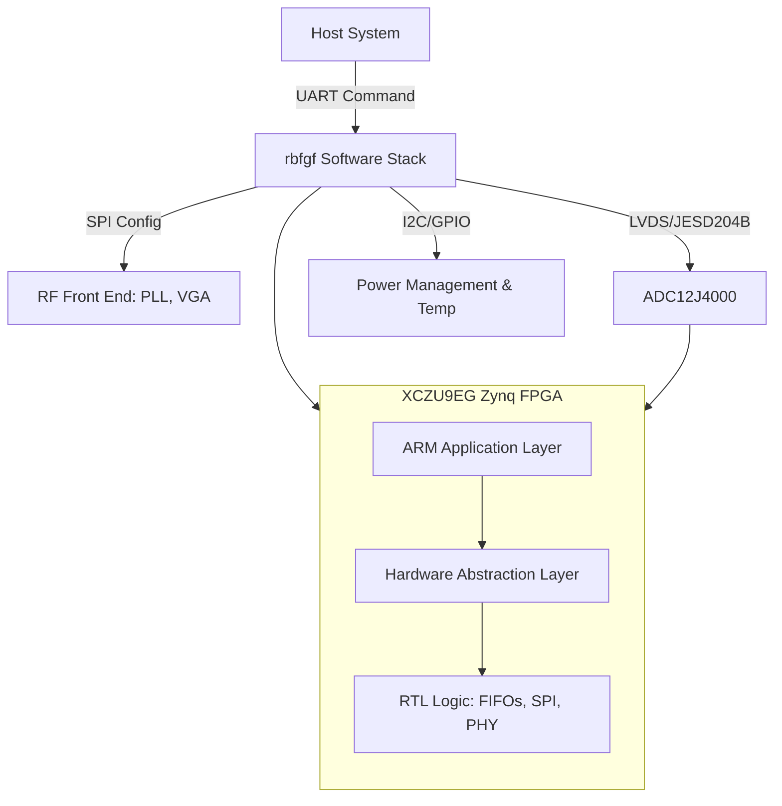
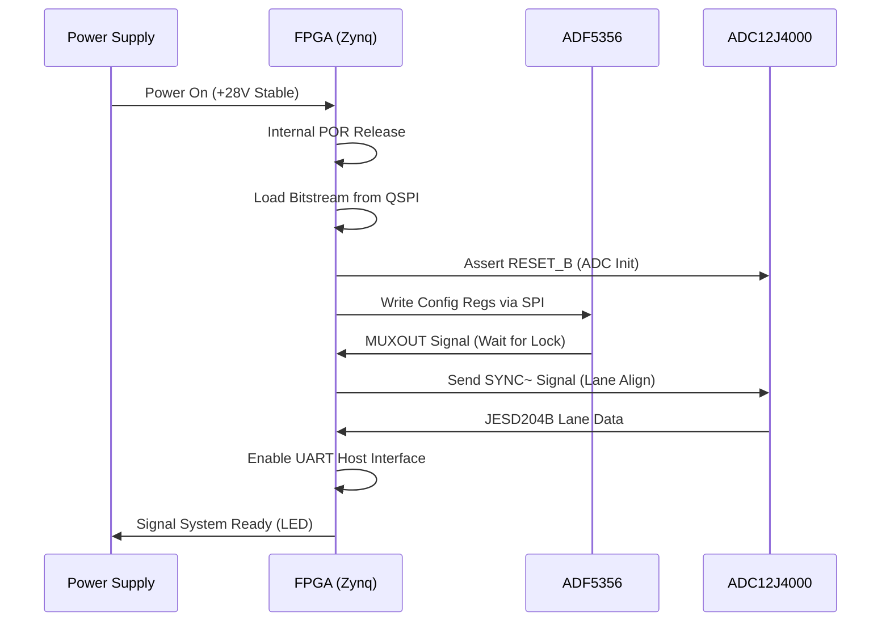
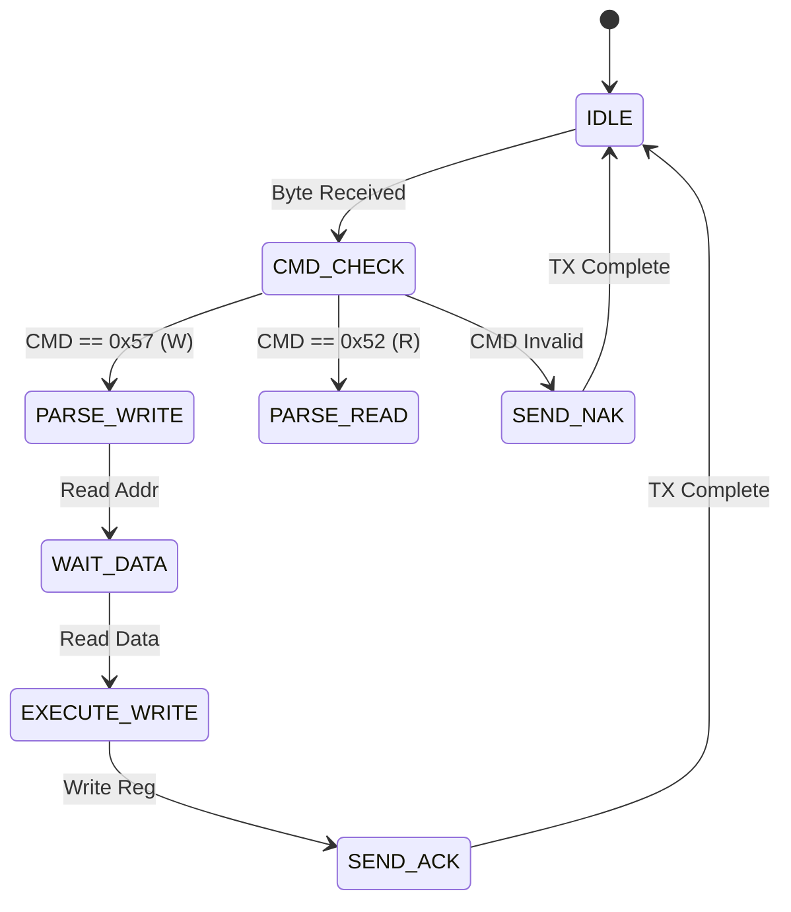
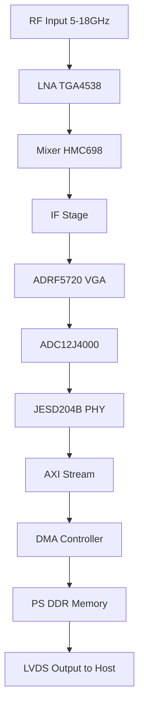
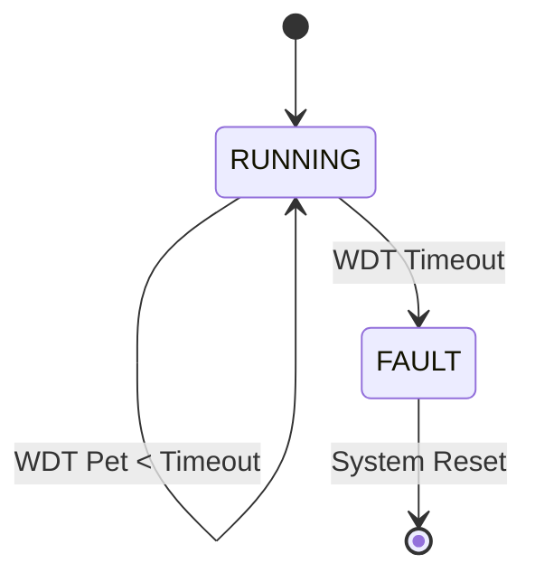

# Software Requirements Specification (SRS)

**Project:** rbfgf Wideband RF Receiver
**Version:** 1.0
**Date:** 16 April 2026
**Author:** System Architecture Team

---

## Document Control

| Version | Date | Author | Changes |
|---------|------|--------|---------|
| 1.0 | 16 Apr 2026 | Lead Architect | Initial Release of SRS for rbfgf FPGA/Embedded Software |

---

# 1. Introduction

## 1.1 Purpose
This Software Requirements Specification (SRS) defines the comprehensive software and firmware requirements for the **rbfgf** project, a 5–18 GHz wideband RF receiver module. This document serves as the baseline for the software development lifecycle, detailing the logic implementation within the XCZU9EG FPGA and associated embedded control tasks. The purpose is to ensure the software correctly implements the hardware abstraction layer (HAL), signal processing data paths, and control interfaces defined by the Hardware Requirements Specification (HRS) and Glue Logic Requirements (GLR). This document will be used by firmware engineers, verification engineers, and system integrators to validate the functional and performance correctness of the embedded logic.

## 1.2 Scope
The scope of this software specification covers the following functional areas:
1.  **FPGA Firmware:** RTL logic for the XCZU9EG-FFVB1156 device, including SPI drivers for RF components (PLL, VGA, ADC), JESD204B/LVDS data capture from the ADC12J4000, and UART packet processing.
2.  **Embedded Control Software:** C/C++ based control logic running on the FPGA's Processing System (PS) for hardware initialization, health monitoring, and communication handling.
3.  **Hardware Abstraction:** Drivers for the ADF5356 (PLL), ADRF5720 (VGA), ADC12J4000, and power monitoring subsystems.

**Exclusions:**
*   High-level DSP algorithms for signal demodulation (these are performed by downstream assets).
*   PC-side Host GUI software.
*   Physical layer hardware design (covered in HRS P2).

## 1.3 Definitions, Acronyms, and Abbreviations

| Term | Definition |
| :--- | :--- |
| **AGC** | Automatic Gain Control |
| **BER** | Bit Error Rate |
| **BIST** | Built-In Self-Test |
| **BRAM** | Block RAM (Xilinx FPGA primitive) |
| **CDC** | Clock Domain Crossing |
| **DSP** | Digital Signal Processing |
| **FIFO** | First-In-First-Out Memory Buffer |
| **FPGA** | Field-Programmable Gate Array |
| **FSM** | Finite State Machine |
| **GLR** | Glue Logic Requirements Document (Project P6) |
| **GPIO** | General Purpose Input/Output |
| **HAL** | Hardware Abstraction Layer |
| **HRS** | Hardware Requirements Specification (Project P2) |
| **I2C** | Inter-Integrated Circuit (Serial Protocol) |
| **ISR** | Interrupt Service Routine |
| **JTAG** | Joint Test Action Group (Debug Interface) |
| **LVDS** | Low-Voltage Differential Signaling |
| **LUT** | Look-Up Table |
| **MAC** | Multiply-Accumulate (DSP Operation) |
| **MIPI** | Mobile Industry Processor Interface (Alliance) |
| **NCO** | Numerically Controlled Oscillator |
| **NV** | Non-Volatile (Memory) |
| **POR** | Power-On Reset |
| **PS** | Processing System (ARM Core in Zynq) |
| **PL** | Programmable Logic (FPGA Fabric in Zynq) |
| **RTL** | Register Transfer Level |
| **RX** | Receive / Receiver |
| **SRS** | Software Requirements Specification (This Document) |
| **SyRS** | System Requirements Specification |
| **UART** | Universal Asynchronous Receiver-Transmitter |
| **VGA** | Variable Gain Amplifier |
| **WDT** | Watchdog Timer |

## 1.4 References
| ID | Document Title | Document Number / Source |
| :--- | :--- | :--- |
| **R1** | **Hardware Requirements Specification (rbfgf)** | Project Internal P2 |
| **R2** | **Glue Logic Requirements (rbfgf)** | Project Internal P6 |
| **R3** | **IEEE Std 830-1998** | IEEE Recommended Practice for Software Requirements Specifications |
| **R4** | **ISO/IEC/IEEE 29148:2018** | Systems and Software Engineering — Life Cycle Processes — Requirements Engineering |
| **R5** | **MISRA C:2012** | Guidelines for the Use of the C Language in Critical Systems |
| **R6** | **XCZU9EG Data Sheet** | Xilinx/AMD, UG1075 (Zynq UltraScale+ Device) |
| **R7** | **ADF5356 Data Sheet** | Analog Devices, Wideband Synthesizer with Integrated VCO |
| **R8** | **ADC12J4000 Data Sheet** | Texas Instruments, 12-Bit, 4-GSPS ADC |
| **R9** | **JESD204B Standard** | JEDEC Standard JS-001 |
| **R10** | **MIL-STD-883** | Test Method Standard for Microcircuits |

## 1.5 Overview
Section 2 provides a high-level description of the software architecture, including the interaction between the ARM Processing System (PS) and the Programmable Logic (PL), as well as the external hardware interfaces. Section 3 details the specific requirements, organized by external interfaces, functional subsystems, performance constraints, and quality attributes. Section 4 outlines the verification and validation strategy. Finally, Section 5 provides the Requirements Traceability Matrix (RTM) linking software requirements to the hardware and glue logic specifications.

---

# 2. Overall Description

## 2.1 Product Perspective
The **rbfgf** software is a critical component of the RF receiver module. It operates on a heterogeneous computing platform (Xilinx Zynq UltraScale+).

**System Context:**
The software acts as the bridge between the high-speed analog signal path (RF Chain) and the digital host interface.



**Software Layers:**
1.  **Application Layer (C):** Runs on the ARM Cortex-A53 (or R5). Handles system state, UART protocol decoding, and high-level AGC loops.
2.  **Hardware Abstraction Layer (C):** Provides register-mapped access to the PL peripherals.
3.  **RTL Logic (VHDL/Verilog):** Implements high-speed interfaces (SPI, JESD204B PHY, Register Map).

## 2.2 Product Functions
The major software functions are:
1.  **System Initialization:** Power sequencing validation, PLL locking, and FIFO reset.
2.  **RF Control:** Programming the ADF5356 PLL for frequency selection and ADRF5720 for gain setting.
3.  **Data Capture:** Managing the JESD204B interface to the ADC12J4000 and buffering data.
4.  **Communication:** Implementing the register read/write protocol via UART.
5.  **Health Monitoring:** Polling temperature sensors and power rails via I2C.
6.  **Fault Management:** Watchdog handling and error logging to NVM.

## 2.3 User Characteristics
*   **Firmware Engineers:** Develop and maintain the C code and RTL. Need detailed register maps and state machine descriptions.
*   **Test Engineers:** Interface via UART to validate RF performance. Require a stable, responsive command interface.
*   **System Integrators:** Integrate the module into a larger chassis. Rely on standardized power-on behavior and status reporting.

## 2.4 Constraints
*   **Timing:** JESD204B lane alignment must occur within 100ms of power-up.
*   **Memory:** On-chip BRAM limited to 500KB for data buffers; rest must stream to LVDS output.
*   **Environment:** Software must operate reliably at ambient temperatures up to +85°C (junction temp higher).
*   **Compliance:** MISRA-C:2012 compliance for all safety-critical control code.

## 2.5 Assumptions and Dependencies
*   The **HRS** assumption that the +28V rail is stable and ripple-free is outside software control, but software monitors it.
*   The **GLR** register map is static; changes require a coordinated SRS update.
*   The Host system UART driver operates at standard baud rates (921.6k or 115.2k) with 8N1 configuration.

---

# 3. Specific Requirements

## 3.1 External Interface Requirements

### 3.1.1 Hardware Interfaces

#### 3.1.1.1 UART Control Interface
The primary control interface is a UART operating at 3.3V CMOS levels.

**C Struct Definition:**
```c
/**
 * @brief UART Register Map Structure
 * Base Address: 0x8000_0000 (Mapped in PS via AXI)
 */
typedef struct {
    volatile uint32_t BAUD_DIV;    // 0x00: Baud Rate Divisor
    volatile uint32_t CTRL;        // 0x04: Control Register (Bit 0: TX_EN, Bit 1: RX_EN)
    volatile uint32_t STATUS;      // 0x08: Status Register (Bit 0: TX_BUSY, Bit 1: RX_READY)
    volatile uint32_t TX_BUFF;     // 0x0C: TX Data Buffer
    volatile uint32_t RX_BUFF;     // 0x10: RX Data Buffer
    volatile uint32_t IRQ_EN;      // 0x14: Interrupt Enable
    volatile uint32_t IRQ_STAT;    // 0x18: Interrupt Status
} UART_RegMap_t;

/**
 * @brief Initialize UART Controller
 * @param baud_rate Target baud rate (e.g., 921600)
 * @return 0 on success, -1 on timeout
 */
int32_t UART_Init(uint32_t baud_rate);

/**
 * @brief Write to a specific hardware register via UART Protocol
 * @param addr 16-bit register address
 * @param data 16-bit data word
 * @return 0 on ACK, -1 on NAK/Timeout
 */
int32_t UART_WriteReg(uint16_t addr, uint16_t data);
```

#### 3.1.1.2 RF PLL Interface (ADF5356)
The ADF5356 is controlled via a 3-wire SPI interface.

**C Struct Definition:**
```c
typedef struct {
    volatile uint32_t SPI_CTRL;   // 0x100: Control (CSB, CLK polarity)
    volatile uint32_t SPI_TX;     // 0x104: TX Data (32-bit shift register)
    volatile uint32_t SPI_RX;     // 0x108: RX Data (MISO)
    volatile uint32_t SPI_STATUS; // 0x10C: Transaction complete flag
} PLL_SPI_RegMap_t;

/**
 * @brief Write 32-bit register to ADF5356
 * @param reg_addr 4-bit register address (encoded in 32-bit word)
 * @param data 28-bit register data
 * @return Status code
 */
int32_t PLL_WriteReg(uint8_t reg_addr, uint32_t data);

/**
 * @brief Poll the MUXOUT pin for Lock Detect
 * @return 1 if Locked, 0 if Unlocked
 */
int32_t PLL_IsLocked(void);
```

#### 3.1.1.3 VGA / IF Interface (ADRF5720)
The ADRF5720 uses LVDS parallel control lines.

**C Struct Definition:**
```c
typedef struct {
    volatile uint32_t VGA_GAIN;   // 0x200: 6-bit gain control word
    volatile uint32_t VGA_EN;     // 0x204: Enable bit (1=ON, 0=PD)
} VGA_RegMap_t;

/**
 * @brief Set IF Gain
 * @param gain_db Desired gain in dB (mapped to 6-bit code)
 * @return 0 on success
 */
int32_t VGA_SetGain(float gain_db);
```

#### 3.1.1.4 Data Interface (JESD204B)
The ADC connects via high-speed serial lanes.

**C Struct Definition:**
```c
typedef struct {
    volatile uint32_t JESD_CTRL;  // 0x300: Enable, Reset
    volatile uint32_t JESD_STAT;  // 0x304: Lane alignment status
    volatile uint32_t BUFFER_CNT; // 0x308: PL FIFO Word Count
} JESD_RegMap_t;
```

### 3.1.2 Software Interfaces
*   **Xilinx Standalone OS:** For hardware abstraction (xil_printf, xil_io).
*   **CMSIS:** Not applicable (vendor specific HAL used).

### 3.1.3 Communication Interfaces
**UART Protocol Specification (GLR P6 §4):**
The Host communicates with the rbfgf module using variable-length binary frames.

**Frame Formats:**

| Command | CMD byte | Frame Structure | Response |
|---------|----------|-----------------|----------|
| Single Write | 0x57 ('W') | `[0x57][ADDR_H][ADDR_L][DATA_H][DATA_L]` | `[0x06]` (ACK) |
| Single Read  | 0x52 ('R') | `[0x52][ADDR_H\|0x80][ADDR_L]` | `[DATA_H][DATA_L]` |
| Bulk Write   | 0x42 ('B') | `[0x42][ADDR_H][ADDR_L][N][D0_H][D0_L]...` | `[0x06]` (ACK) |
| Bulk Read    | 0x62 ('b') | `[0x62][ADDR_H\|0x80][ADDR_L][N]` | `[D0_H][D0_L]...[Dn_H][Dn_L]` |
| Error NAK    | 0x15 | Sent by FPGA on invalid command/address | — |

*   **Addressing:** 16-bit address space. Bit 15 (0x8000) is ORed to indicate a Read operation.
*   **Bulk Count N:** Number of 16-bit registers (Max N=64).
*   **Timeout:** Inter-byte timeout is 50ms. Parser resets on timeout.

## 3.2 Functional Requirements

### 3.2.1 System Initialization (REQ-SW-001 to REQ-SW-010)

| ID | Requirement | Source | Priority | Verification |
|----|-------------|--------|----------|---------------|
| REQ-SW-001 | The software SHALL complete the Power-On Self-Test (POST) within 500ms of +28V power stabilization. | HRS REQ-HW-006 | Mandatory | Test |
| REQ-SW-002 | The software SHALL verify the BOARD_ID FPGA register reads 0xA5A5 before enabling RF outputs. | GLR §5 | Mandatory | Test |
| REQ-SW-003 | The software SHALL configure the ADF5356 PLL to the frequency stored in non-volatile memory (default 10 GHz). | HRS REQ-HW-001 | Mandatory | Test |
| REQ-SW-004 | The software SHALL poll the PLL_LOCK_STATUS bit; if not locked within 100ms, the software SHALL assert a SYSTEM_FAULT flag. | HRS REQ-HW-015 | Mandatory | Test |
| REQ-SW-005 | The software SHALL initialize the SPI buses for PLL, VGA, and ADC before asserting the CS lines. | GLR §4.2 | Mandatory | Inspection |
| REQ-SW-006 | The software SHALL load calibration coefficients (Gain lookup tables) from the EEPROM at 0x50 via I2C. | HRS REQ-HW-011 | Mandatory | Test |
| REQ-SW-007 | The software SHALL initialize the Watchdog Timer (WDT) to 1 second before entering the main loop. | Design Constr. | Mandatory | Test |
| REQ-SW-008 | The software SHALL log the Firmware Version string to the UART debug port at 115200 baud upon startup. | HRS REQ-HW-012 | Mandatory | Demonstration |
| REQ-SW-009 | The software SHALL perform a RAM BIST (March C-) on the critical stack memory region. | Design Constr. | Mandatory | Test |
| REQ-SW-010 | The software SHALL set the Status LED to a slow blink (1Hz) during the initialization phase. | GLR §5 | Mandatory | Demonstration |

### 3.2.2 UART Communication Driver (REQ-SW-011 to REQ-SW-020)

| ID | Requirement | Source | Priority | Verification |
|----|-------------|--------|----------|---------------|
| REQ-SW-011 | The UART driver SHALL support baud rates of 9600, 115200, and 921600 baud. | HRS REQ-HW-012 | Mandatory | Test |
| REQ-SW-012 | The driver SHALL implement the Single Write command (0x57) logic as per GLR frame format. | GLR §4 | Mandatory | Test |
| REQ-SW-013 | The driver SHALL implement the Single Read command (0x52) with address bit15 set. | GLR §4 | Mandatory | Test |
| REQ-SW-014 | The driver SHALL implement the Bulk Write command (0x42) for up to 64 registers. | GLR §4 | Mandatory | Test |
| REQ-SW-015 | The driver SHALL implement the Bulk Read command (0x62) for up to 64 registers. | GLR §4 | Mandatory | Test |
| REQ-SW-016 | The driver SHALL respond to an invalid command byte with a NAK (0x15) within 50 microseconds. | GLR §4 | Mandatory | Test |
| REQ-SW-017 | The driver SHALL utilize a 256-byte TX FIFO for buffering outgoing data. | Design Constr. | Desirable | Analysis |
| REQ-SW-018 | The driver SHALL utilize a 256-byte RX FIFO for buffering incoming data. | Design Constr. | Desirable | Analysis |
| REQ-SW-019 | The driver SHALL clear the UART_STATUS.FRAME_ERR flag on read. | GLR §4 | Mandatory | Inspection |
| REQ-SW-020 | The driver SHALL recover from framing errors by flushing the RX buffer without resetting the CPU. | Design Constr. | Mandatory | Test |

### 3.2.3 RF Control & Frequency Synthesis (REQ-SW-021 to REQ-SW-030)

| ID | Requirement | Source | Priority | Verification |
|----|-------------|--------|----------|---------------|
| REQ-SW-021 | The software SHALL calculate the ADF5356 INT, FRAC, and MOD registers based on a 50MHz reference clock input. | Datasheet R7 | Mandatory | Analysis |
| REQ-SW-022 | The software SHALL assert the ADF5356 MUXOUT pin to "Digital Lock Detect" mode during initialization. | Datasheet R7 | Mandatory | Inspection |
| REQ-SW-023 | The software SHALL not change the PLL frequency while the TX/RX path is enabled (Hot-switching prohibited). | HRS REQ-HW-001 | Mandatory | Test |
| REQ-SW-024 | The software SHALL provide a "Sweep Mode" where the frequency increments by a programmable step size (default 10 MHz) every 1ms. | HRS REQ-HW-002 | Desirable | Test |
| REQ-SW-025 | The software SHALL update the ADRF5720 VGA gain setting within 100 microseconds of receiving a gain command. | HRS REQ-HW-011 | Mandatory | Test |
| REQ-SW-026 | The software SHALL clamp the VGA gain value to a maximum safe limit defined in the EEPROM configuration. | HRS REQ-HW-004 | Mandatory | Test |
| REQ-SW-027 | The software SHALL verify the frequency setting integrity by reading back the PLL registers via SPI MISO. | Datasheet R7 | Desirable | Test |
| REQ-SW-028 | The software SHALL disable the LNA bias if the input power detector exceeds +15 dBm (overload protection). | HRS REQ-HW-016 | Mandatory | Test |
| REQ-SW-029 | The software SHALL support storing up to 10 preset frequency/gain configurations in Flash. | User Need | Desirable | Test |
| REQ-SW-030 | The software SHALL ramp the VGA gain up/down in 1dB steps to prevent abrupt output transients. | Design Constr. | Mandatory | Test |

### 3.2.4 Data Acquisition & ADC Interface (REQ-SW-031 to REQ-SW-040)

| ID | Requirement | Source | Priority | Verification |
|----|-------------|--------|----------|---------------|
| REQ-SW-031 | The software SHALL initialize the ADC12J4000 via SPI to JESD204B subclass 1 mode. | Datasheet R8 | Mandatory | Test |
| REQ-SW-032 | The software SHALL send the SYNC~ signal to the ADC to align the JESD204B lanes. | Datasheet R8 | Mandatory | Test |
| REQ-SW-033 | The software SHALL monitor the JESD204B RX_ALARM output from the FPGA PHY; if set, it shall trigger a lane re-initialization. | GLR §4 | Mandatory | Test |
| REQ-SW-034 | The software SHALL transfer captured ADC data from the PL BRAM to the PS DDR via AXI DMA when the watermark is reached. | GLR §4 | Mandatory | Test |
| REQ-SW-035 | The software SHALL implement a circular buffer in DDR memory for continuous streaming. | Design Constr. | Mandatory | Analysis |
| REQ-SW-036 | The software SHALL discard ADC data if the DMA buffer is full (flow control). | Design Constr. | Mandatory | Test |
| REQ-SW-037 | The software SHALL calculate the average sample rate and report it in a status register every second. | HRS REQ-HW-002 | Desirable | Demonstration |
| REQ-SW-038 | The software SHALL support a "Data Capture Trigger" based on a programmable threshold level in the ADC data. | HRS REQ-HW-002 | Desirable | Test |
| REQ-SW-039 | The software SHALL format the output data packets with a 64-bit header (Timestamp, ID) and 12-bit payload samples. | Interface Spec | Mandatory | Inspection |
| REQ-SW-040 | The software SHALL pad the 12-bit samples to 16-bit words for LVDS transmission. | Interface Spec | Mandatory | Inspection |

### 3.2.5 Power Management & Monitoring (REQ-SW-041 to REQ-SW-050)

| ID | Requirement | Source | Priority | Verification |
|----|-------------|--------|----------|---------------|
| REQ-SW-041 | The software SHALL monitor the +28V input voltage rail via the ADC every 100ms. | HRS REQ-HW-014 | Mandatory | Test |
| REQ-SW-042 | The software SHALL assert a FAULT condition if the +28V rail drops below 20V or exceeds 36V. | HRS REQ-HW-014 | Mandatory | Test |
| REQ-SW-043 | The software SHALL read the internal FPGA temperature via the XADC block every 500ms. | HRS REQ-HW-005 | Mandatory | Test |
| REQ-SW-044 | The software SHALL assert a warning if the FPGA temperature exceeds 100°C. | HRS REQ-HW-005 | Mandatory | Test |
| REQ-SW-045 | The software SHALL shut down RF power amplifiers if the temperature exceeds 110°C. | HRS REQ-HW-005 | Mandatory | Test |
| REQ-SW-046 | The software SHALL sequence the +1.0V FPGA rail power-up before the +3.3V I/O rails via GPIO control. | Datasheet R6 | Mandatory | Inspection |
| REQ-SW-047 | The software SHALL log power-on events and undervoltage faults to the EEPROM log. | Design Constr. | Desirable | Test |
| REQ-SW-048 | The software SHALL read current consumption from the LTM4644 PMBus (I2C) interface. | GLR §4.3 | Desirable | Test |
| REQ-SW-049 | The software SHALL implement a hysteresis of 5°C for temperature alarm reset conditions. | Design Constr. | Mandatory | Test |
| REQ-SW-050 | The software SHALL put the ADC into power-down mode if the system enters "Standby" mode. | Design Constr. | Mandatory | Test |

### 3.2.6 Diagnostics & Maintenance (REQ-SW-051 to REQ-SW-060)

| ID | Requirement | Source | Priority | Verification |
|----|-------------|--------|----------|---------------|
| REQ-SW-051 | The software SHALL maintain an uptime counter in seconds, accessible via register 0x0010. | GLR §5 | Desirable | Test |
| REQ-SW-052 | The software SHALL increment a "Packet Count" register for every valid UART packet received. | GLR §5 | Desirable | Test |
| REQ-SW-053 | The software SHALL implement a "Factory Reset" command that restores default EEPROM settings. | User Need | Desirable | Test |
| REQ-SW-054 | The software SHALL perform a CRC-16 check on the EEPROM configuration block at startup. | Design Constr. | Mandatory | Test |
| REQ-SW-055 | The software SHALL report the PLL lock status in real-time on register 0x0020 (Bit 0). | GLR §5 | Mandatory | Test |
| REQ-SW-056 | The software SHALL generate a heartbeat pulse on a GPIO pin every 1 second (Watchdog toggle). | Design Constr. | Mandatory | Demonstration |
| REQ-SW-057 | The software SHALL support a firmware upgrade mode entered by holding a specific GPIO high during reset. | User Need | Desirable | Test |
| REQ-SW-058 | The software SHALL store the last 10 error codes (ADC Overrange, Temp Fault) in a history buffer. | Design Constr. | Desirable | Test |
| REQ-SW-059 | The software SHALL implement a built-in self-test (BIST) loopback for the UART TX to RX path. | Design Constr. | Mandatory | Test |
| REQ-SW-060 | The software SHALL allow the Host to read the FPGA DNA (Device ID) for anti-counterfeiting verification. | GLR §5 | Desirable | Test |

### 3.2.7 Signal Processing / DSP (REQ-SW-061 to REQ-SW-065)

| ID | Requirement | Source | Priority | Verification |
|----|-------------|--------|----------|---------------|
| REQ-SW-061 | The software (RTL) SHALL implement a Digital Down Converter (DDC) if the FPGA resources permit (optional). | User Need | Optional | Analysis |
| REQ-SW-062 | The software SHALL calculate the instantaneous signal power (sum of squares) over 1024 samples. | HRS REQ-HW-008 | Desirable | Test |
| REQ-SW-063 | The software SHALL implement a decimation filter (factor 4) to reduce data throughput for narrowband modes. | HRS REQ-HW-002 | Optional | Test |
| REQ-SW-064 | The software SHALL provide a complex FFT output (magnitude/phase) if specifically commanded. | User Need | Optional | Analysis |
| REQ-SW-065 | The software SHALL output raw I/Q data via LVDS when FFT mode is disabled. | HRS REQ-HW-007 | Mandatory | Test |

### 3.2.8 Watchdog & Safety (REQ-SW-066 to REQ-SW-070)

| ID | Requirement | Source | Priority | Verification |
|----|-------------|--------|----------|---------------|
| REQ-SW-066 | The software SHALL service the watchdog timer every 500ms within the main loop. | Design Constr. | Mandatory | Test |
| REQ-SW-067 | The software SHALL log the watchdog reset reason in a non-volatile register if a reset occurs. | Design Constr. | Mandatory | Test |
| REQ-SW-068 | The software SHALL disable watchdog servicing during the firmware upgrade mode. | Design Constr. | Mandatory | Test |
| REQ-SW-069 | The software SHALL assert a global reset if the JESD204B link remains down for >1 second. | HRS REQ-HW-008 | Mandatory | Test |
| REQ-SW-070 | The software SHALL ensure all register writes are atomic (32-bit aligned) to prevent bus corruption. | Design Constr. | Mandatory | Analysis |

### 3.2.9 Glue Logic Requirements Implementation (REQ-SW-071 to REQ-SW-075)

| ID | Requirement | Source | Priority | Verification |
|----|-------------|--------|----------|---------------|
| REQ-SW-071 | The software SHALL map the ADF5356 SPI chip select to PS MIO pin 12. | GLR §6 | Mandatory | Inspection |
| REQ-SW-072 | The software SHALL map the ADRF5720 LVDS outputs to PL Bank 65 pins. | GLR §6 | Mandatory | Inspection |
| REQ-SW-073 | The software SHALL utilize the 100MHz oscillator input as the reference for both PS and PL clocks. | GLR §6 | Mandatory | Test |
| REQ-SW-074 | The software SHALL assign the AXI Base Address for the UART peripheral to 0x42C0_0000. | GLR §8 | Mandatory | Inspection |
| REQ-SW-075 | The software SHALL expose the raw ADC I/Q data on the high-speed SMA connectors (if present) for debugging. | GLR §5 | Optional | Test |

## 3.3 Performance Requirements

| ID | Requirement | Verification |
|----|-------------|---------------|
| REQ-PERF-001 | The main control loop SHALL execute with a maximum period of 10ms. | Test (Scope) |
| REQ-PERF-002 | The register write command (UART) SHALL be acknowledged within 200 microseconds end-to-end. | Test |
| REQ-PERF-003 | The PLL re-lock time after a frequency change SHALL be less than 50 microseconds. | Test |
| REQ-PERF-004 | The SPI transaction to the ADC (32-bit) SHALL complete in less than 1 microsecond at 50MHz SCK. | Analysis |
| REQ-PERF-005 | The system SHALL be fully operational (RF path enabled) within 1 second of power application. | Test |
| REQ-PERF-006 | The JESD204B link SHALL achieve lane alignment within 100ms of SYNC~ assertion. | Test |
| REQ-PERF-007 | The software SHALL handle interrupts with a latency of less than 5 microseconds. | Analysis |
| REQ-PERF-008 | The Watchdog timer SHALL be capable of 1ms resolution. | Inspection |
| REQ-PERF-009 | Total Flash usage for the application bitstream SHALL not exceed 90% of the available QSPI flash. | Analysis |
| REQ-PERF-010 | The DMA transfer SHALL sustain a rate of 400 MB/s to DDR memory. | Test |

## 3.4 Design Constraints
1.  **Compiler:** Xilinx Vitis (GCC) or IAR Embedded Workbench.
2.  **Language:** C99 for application code; VHDL-2008 or Verilog-2001 for RTL.
3.  **Stack Size:** Minimum 64KB reserved for the main application task.
4.  **Dynamic Memory:** Use of `malloc`/`free` is prohibited in the operational firmware (static allocation only).
5.  **Coding Standard:** MISRA-C:2012 compliance enforced with deviation review.
6.  **Interrupts:** Maximum nesting level of 3 interrupts.
7.  **Registers:** All hardware registers must be declared `volatile`.
8.  **FPGA Resources:** DSP slice usage shall not exceed 80% to allow for future safety margin.

## 3.5 Software System Attributes

### 3.5.1 Reliability
*   **MTBF:** Target > 20,000 hours at 85°C ambient.
*   **Recovery:** The software shall automatically attempt to reset the JESD204B link if a deskew error occurs.

### 3.5.2 Availability
*   **Boot Time:** System shall be ready to accept commands within 1.5 seconds.
*   **Redundancy:** Not applicable (single string architecture).

### 3.5.3 Security
*   **Access Control:** No password protection on UART (physical security assumed).
*   **Firmware:** Bitstream encryption (eFUSE) shall be enabled to prevent IP theft.
*   **Writes:** All write commands via UART shall check address range (0x0000-0xFFFF) to prevent pointer exploits.

### 3.5.4 Maintainability
*   **Documentation:** Doxygen comments for all public APIs.
*   **Modularity:** Drivers for PLL, VGA, ADC, and UART shall be isolated in separate source files.

---

# 4. Verification and Validation

## 4.1 Unit Test Requirements
*   **PLL Driver:** Test calculation of INT/FRAC registers for corner frequencies (5GHz, 18GHz).
*   **CRC Module:** Verify checksum generation against known NIST vectors.
*   **Ring Buffer:** Verify wrap-around logic and overwriting protection.

## 4.2 Integration Test Requirements
*   **Frequency Sweep:** Command the system to sweep from 5 to 18 GHz in 1GHz steps; verify lock at every step.
*   **UART Protocol:** Inject malformatted packets (short frame, invalid CRC) and verify NAK response.
*   **Thermal Trip:** Place module in thermal chamber; verify RF cutoff at T > 110°C.

## 4.3 System Test Requirements
*   **Full RX Chain:** Inject a calibrated -60dBm tone at 10GHz; verify ADC output levels and SFDR metrics.
*   **Endurance:** Run 48-hour continuous operation with frequency hopping every 100ms.

---

# 5. Requirements Traceability Matrix

| REQ-SW ID | Description | Source (REQ-HW/GLR) |
|-----------|-------------|---------------------|
| REQ-SW-001 | POST within 500ms | HRS REQ-HW-006 |
| REQ-SW-002 | Verify Board ID | GLR §5 |
| REQ-SW-003 | Config PLL to NV Freq | HRS REQ-HW-001 |
| REQ-SW-004 | Poll PLL Lock | HRS REQ-HW-015 |
| REQ-SW-005 | Init SPI Peripherals | GLR §4.2 |
| REQ-SW-006 | Load Cal from EEPROM | HRS REQ-HW-011 |
| REQ-SW-007 | Init WDT | Design |
| REQ-SW-008 | Log FW Version | HRS REQ-HW-012 |
| REQ-SW-009 | RAM BIST | Design |
| REQ-SW-010 | LED Status | GLR §5 |
| REQ-SW-011 | UART Baud Rates | HRS REQ-HW-012 |
| REQ-SW-012 | Single Write Cmd | GLR §4 |
| REQ-SW-013 | Single Read Cmd | GLR §4 |
| REQ-SW-014 | Bulk Write Cmd | GLR §4 |
| REQ-SW-015 | Bulk Read Cmd | GLR §4 |
| REQ-SW-016 | Invalid Cmd NAK | GLR §4 |
| REQ-SW-021 | Calc PLL Registers | Datasheet R7 |
| REQ-SW-022 | MUXOUT Lock Detect | Datasheet R7 |
| REQ-SW-025 | Update VGA Gain | HRS REQ-HW-011 |
| REQ-SW-028 | LNA Overload Prot. | HRS REQ-HW-016 |
| REQ-SW-031 | Init ADC JESD204B | Datasheet R8 |
| REQ-SW-032 | ADC Sync Signal | Datasheet R8 |
| REQ-SW-039 | Data Packet Header | Interface Spec |
| REQ-SW-041 | Monitor +28V | HRS REQ-HW-014 |
| REQ-SW-043 | Monitor FPGA Temp | HRS REQ-HW-005 |
| REQ-SW-045 | High Temp Shutdown | HRS REQ-HW-005 |
| REQ-SW-062 | Calc Signal Power | HRS REQ-HW-008 |

---

# 6. Appendices

## Appendix A — Error Codes
```c
typedef enum {
    ERR_OK           = 0x00,
    ERR_TIMEOUT      = 0x01,
    ERR_COMM_UART    = 0x02,
    ERR_CHECKSUM     = 0x03,
    ERR_PARAM        = 0x04,
   _ERR_NOT_INIT     = 0x05,
    ERR_RESOURCE     = 0x06,
    ERR_HARDWARE     = 0x07,
    ERR_PLL_UNLOCK   = 0x0D,
    ERR_TEMP_HIGH    = 0x0E,
    ERR_VOLT_FAULT   = 0x0F,
    ERR_ADC_LINK     = 0x10,
    EEPROM_CORRUPT   = 0x11
} ErrorCode_t;
```

## Appendix B — FPGA Register Map Summary

| Base Address | Block | Offset | Register Name | Width | R/W | Reset Value | Description |
|-------------|-------|--------|--------------|-------|-----|-------------|-------------|
| 0x8000_0000 | UART | 0x00 | BAUD_DIV | 32 | RW | 0x0000_1450 | Baud Divisor |
| 0x8000_0000 | UART | 0x04 | CTRL | 32 | RW | 0x0000_0003 | Control (Enable) |
| 0x8000_1000 | PLL | 0x00 | SPI_TX | 32 | WO | 0x0000_0000 | PLL Data Tx |
| 0x8000_1000 | PLL | 0x04 | LOCK_STAT | 32 | RO | 0x0000_0000 | PLL Lock Status |
| 0x8000_2000 | VGA | 0x00 | GAIN_CTRL | 6 | RW | 0x00 | VGA Gain Code |
| 0x8000_3000 | ADC | 0x00 | JESD_CTRL | 32 | RW | 0x0000_0001 | JESD Enable |
| 0x8000_3000 | ADC | 0x10 | FIFO_COUNT | 16 | RO | 0x0000 | PL FIFO Level |
| 0x8000_4000 | SYS | 0x00 | BOARD_ID | 32 | RO | 0xA5A5 | ID Register |
| 0x8000_4000 | SYS | 0x10 | Uptime | 32 | RO | 0x0000_0000 | Uptime Seconds |
| 0x8000_5000 | PWR | 0x00 | VIN_ADC | 12 | RO | 0x000 | Input Voltage |

## Appendix C — Mermaid Diagrams

### System Initialization Sequence


### UART Protocol State Machine


### Data Path Architecture


### Watchdog State Machine
