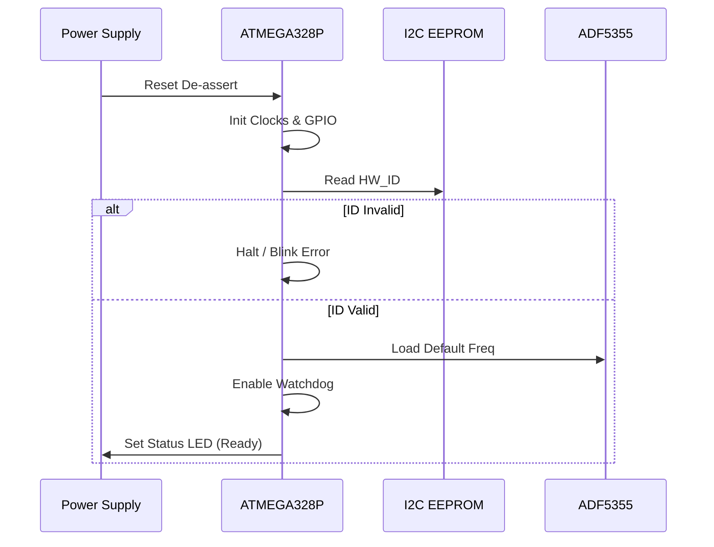
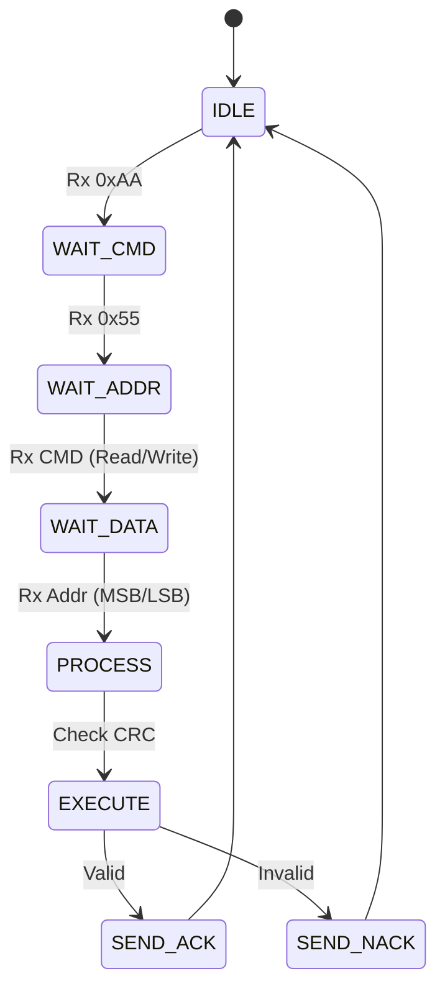
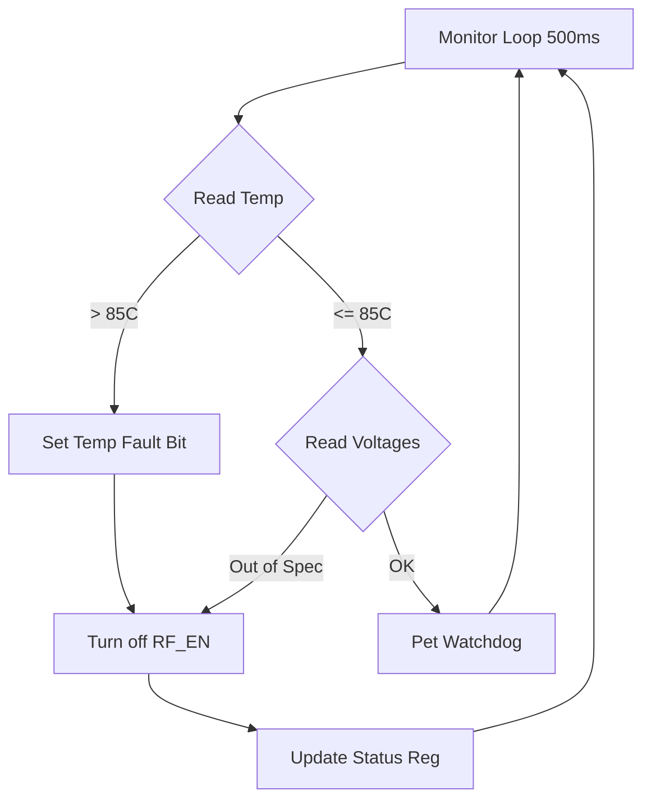

# Software Requirements Specification (SRS)

**Project:** rbhjdaz Wideband RF Receiver
**Title:** Embedded Control & Interface Software Requirements
**Version:** 1.0
**Date:** 14 April 2026

---

## Document Control
| Version | Date | Author | Changes |
|---------|------|--------|---------|
| 1.0 | 14 Apr 2026 | Sr. Architect | Initial Release based on HRS v1.0 & GLR v0V01 |

---

# 1. Introduction

## 1.1 Purpose
This Software Requirements Specification (SRS) defines the functional, performance, and interface requirements for the embedded firmware running on the ATMEGA328P-AU microcontroller within the **rbhjdaz Wideband RF Receiver**.

The purpose of this software is to:
1.  Control the RF signal chain, including the LNA enable and Digital VGAs (HMC698LP4).
2.  Configure the frequency synthesis chain (ADF5355 PLL and LMK04828 Clock Generator).
3.  Manage the ADC interface (AD9208 JESD204B link training).
4.  Provide a robust communication interface (UART) for register access and telemetry.
5.  Perform continuous health monitoring (Power Supply, Temperature) via I2C.

This document serves as the single source of truth for firmware developers, test engineers, and system integrators.

## 1.2 Scope
The software operates as the "System Controller" on the rbhjdaz hardware.
**In Scope:**
*   Bootloader and Power-On Self-Test (POST).
*   Hardware Abstraction Layer (HAL) for ATMEGA328P peripherals (UART, SPI, I2C, GPIO).
*   Driver logic for ADF5355 (PLL), HMC698LP4 (VGA), and ADP5054 (PMIC).
*   UART protocol handling (Packet parsing, register read/write).
*   Fault detection and LED status indication.
*   Non-volatile memory management (EEPROM) for calibration storage.

**Out of Scope:**
*   DSP algorithms for signal processing (handled by external FPGA/Host).
*   RF circuit design (defined in HRS).
*   PC-side Host GUI software.

## 1.3 Definitions, Acronyms, and Abbreviations

| Acronym | Definition |
| :--- | :--- |
| **SRS** | Software Requirements Specification |
| **HRS** | Hardware Requirements Specification |
| **GLR** | Glue Logic Requirements |
| **HAL** | Hardware Abstraction Layer |
| **BSP** | Board Support Package |
| **RTOS** | Real-Time Operating System (N/A - Bare metal) |
| **ISR** | Interrupt Service Routine |
| **MISRA** | Motor Industry Software Reliability Association (C Coding Standard) |
| **UART** | Universal Asynchronous Receiver-Transmitter |
| **SPI** | Serial Peripheral Interface |
| **I2C** | Inter-Integrated Circuit |
| **GPIO** | General Purpose Input/Output |
| **ADC** | Analog-to-Digital Converter (External AD9208) |
| **DAC** | Digital-to-Analog Converter (Internal MCU) |
| **DMA** | Direct Memory Access |
| **FIFO** | First-In, First-Out Buffer |
| **NVM** | Non-Volatile Memory (EEPROM) |
| **CRC** | Cyclic Redundancy Check |
| **WDT** | Watchdog Timer |
| **PLL** | Phase-Locked Loop |
| **MCU** | Microcontroller Unit (ATMEGA328P) |
| **FPGA** | Field Programmable Gate Array (External Interface) |
| **API** | Application Programming Interface |
| **LNA** | Low Noise Amplifier |
| **VGA** | Variable Gain Amplifier |
| **TRP** | Transmit/Receive Protect (RF Enable) |
| **EW** | Electronic Warfare |
| **JESD** | JESD204B High-Speed Data Interface Standard |
| **LVDS** | Low-Voltage Differential Signaling |
| **PMIC** | Power Management IC (ADP5054) |
| **BIST** | Built-In Self-Test |
| **C99** | ISO/IEC 9899:1999 C Programming Language Standard |

## 1.4 References
1.  IEEE Std 830-1998: IEEE Recommended Practice for Software Requirements Specifications.
2.  IEEE Std 29148:2018: Systems and software engineering — Life cycle processes — Requirements engineering.
3.  MISRA C:2012 - Guidelines for the use of the C language in critical systems.
4.  **rbhjdaz Hardware Requirements Specification (HRS)**, Rev 1.0, 2023.
5.  **rbhjdaz Glue Logic Requirements (GLR)**, Rev 0V01, 14 April 2026.
6.  Atmel ATMEGA328P-AU Datasheet, Rev 8271D-AVR-08/2013.
7.  Analog Devices ADF5355 Wideband Synthesizer Datasheet, Rev 0.
8.  Hittite HMC698LP4 Digital VGA Datasheet, Rev 0.
9.  Texas Instruments ADS1115 (I2C ADC) Datasheet.

## 1.5 Overview
The remainder of this document is organized as follows:
*   **Section 2: Overall Description** provides a high-level view of the system architecture, interfaces, and constraints.
*   **Section 3: Specific Requirements** details the functional, performance, and design constraints.
*   **Section 4: Verification and Validation** outlines test cases.
*   **Section 5: Traceability Matrix** Maps software requirements to Hardware/GLR sources.

---

# 2. Overall Description

## 2.1 Product Perspective
The rbhjdaz firmware is a bare-metal embedded application running on the ATMEGA328P. It acts as the configuration master for the RF Front End and the Power Management subsystem.

```mermaid
flowchart TD
    Host[Host PC / FPGA] -->|UART Command| ATMEGA[ATMEGA328P Firmware]
    
    subgraph Firmware_Layers
        ATMEGA --> UART[UART Driver]
        ATMEGA --> SPI[SPI Driver]
        ATMEGA --> I2C[I2C Driver]
        ATMEGA -> MON[Monitoring Task]
    end

    SPI --> PLL[ADF5355 PLL]
    SPI --> VGA1[VGA 1 (HMC698)]
    SPI --> VGA2[VGA 2 (HMC698)]
    
    I2C --> PMIC[ADP5054 PMIC]
    I2C --> TEMP[Temp Sensors]
    I2C --> PROM[EEPROM]

    ATMEGA -->|GPIO| LED[Status LEDs]
    ATMEGA -->|GPIO| RST[ADC Reset / FPGA SysRef]
```

## 2.2 Product Functions
1.  **System Initialization:** Configure clocks, GPIOs, and peripherals. Execute POST.
2.  **Communication:** Listen for UART commands (Read/Write) from the host system.
3.  **Frequency Synthesis:** Calculate and write register maps to ADF5355 based on requested LO frequency.
4.  **Gain Control:** Set attenuation levels for HMC698LP4 VGAs via SPI.
5.  **Power Management:** Monitor voltage/current rails via PMIC and temperature sensors.
6.  **Fault Handling:** Detect over-temperature or power faults and trigger hardware shutdown (RF Mute).
7.  **Data Storage:** Read/Write calibration tables (Gain correction vs Frequency) from I2C EEPROM.
8.  **LED Indication:** Blink heartbeat, steady on for OK, fast blink for fault.

## 2.3 User Characteristics
*   **Firmware Engineers:** Debug and maintain the code using JTAG/DebugWire.
*   **Test Engineers:** Interact via UART using terminal software or Python scripts to validate RF performance.
*   **System Integrators:** Integrate the module into larger EW chassis; rely on LEDs and textual status feedback.

## 2.4 Constraints
*   **Processor:** ATMEGA328P-AU (20 MHz max, 32KB Flash, 2KB SRAM).
*   **Memory:** No dynamic memory allocation (`malloc` is prohibited).
*   **Compliance:** MISRA-C:2012 strict adherence.
*   **Timing:** PLL lock must be verified within 100ms of frequency change.
*   **Environment:** Operating range -40°C to +85°C.

## 2.5 Assumptions and Dependencies
*   The external 16.000 MHz crystal oscillator is stable and within ±20ppm.
*   The +28V DC input is regulated to +5V and +3.3V by the hardware power supply before MCU reset is released.
*   The Host system uses 8-N-1 UART framing at 115200 baud (default).

---

# 3. Specific Requirements

## 3.1 External Interface Requirements

### 3.1.1 Hardware Interfaces

#### 3.1.1.1 UART Interface (Host Communication)
The firmware implements a packet-based protocol over UART.

**C Struct Definition (Memory Map):**
```c
/* Register Map Definition (Offsets in Address Space) */
#define REG_RW_LED_STATUS       0x0001  // R/W: LED Control
#define REG_RW_RF_ENABLE        0x0002  // R/W: RF Chain Enable (1=On)
#define REG_RW_LO_FREQ_MHz      0x0003  // R/W: LO Frequency (Integer MHz)
#define REG_RW_VGA1_GAIN        0x0004  // R/W: VGA1 Gain (0-63)
#define REG_RW_VGA2_GAIN        0x0005  // R/W: VGA2 Gain (0-63)

#define REG_R_HW_ID             0x0010  // R:   Hardware ID Code
#define REG_R_FW_VER            0x0011  // R:   Firmware Version
#define REG_R_TEMP_BOARD        0x0012  // R:   Board Temp (0.1 C)
#define REG_R_VOLT_5V           0x0013  // R:   5V Rail (mV)
#define REG_R_STATUS_PLL_LOCK   0x0014  // R:   PLL Lock Status (Bit 0)
#define REG_R_STATUS_FAULT      0x0015  // R:   Fault Flags
```

**Driver API:**
```c
// Initialization
int32_t UART_Init(uint32_t baud_rate);

// Data Transfer
int32_t UART_ReadByte(uint8_t *data, uint32_t timeout_ms);
int32_t UART_WriteByte(uint8_t data);

// Protocol Handling
void UART_ProcessPacket(void); 
```

**Protocol Frame Format:**
*   **Header:** `0xAA 0x55` (2 bytes)
*   **Cmd:** `READ (0x52)` or `WRITE (0x57)` (1 byte)
*   **Addr:** `MSB LSB` (2 bytes, Big Endian)
*   **Data:** `MSB LSB` (2 bytes, Big Endian, value only for Write)
*   **CRC:** `CRC-16` (2 bytes)

#### 3.1.1.2 SPI Interface (PLL & VGA)
The MCU acts as SPI Master. The GLR defines Chip Select (CS) lines for PLL, VGA1, and VGA2.

**C Struct Definitions:**
```c
/* HMC698LP4 VGA Register Map */
typedef struct {
    uint8_t gain_val;     // 6-bit gain (0-63dB)
    uint8_t reg_ctrl;     // Control bits
} HMC698_Regs_t;

/* ADF5355 PLL requires 34-bit data load */
typedef struct {
    uint32_t low_word;
    uint32_t high_word;
    uint8_t  addr;        // Register index
} ADF5355_Msg_t;
```

**Driver API:**
```c
int32_t SPI_Init(void);
int32_t SPI_Transfer(uint8_t *tx_buf, uint8_t *rx_buf, uint16_t len);

// Specific Device Drivers
int32_t VGA_SetGain(uint8_t vga_id, int8_t gain_db);
int32_t PLL_SetFreq(uint32_t freq_hz);
int32_t PLL_IsLocked(bool *locked);
```

#### 3.1.1.3 I2C Interface (PMIC & EEPROM)
**Driver API:**
```c
int32_t I2C_Init(uint32_t clock_khz);
int32_t I2C_WriteReg(uint8_t dev_addr, uint8_t reg, uint8_t val);
int32_t I2C_ReadReg(uint8_t dev_addr, uint8_t reg, uint8_t *val);

// Wrapper Functions
int32_t PMIC_EnableRail(uint8_t rail_id, bool enable);
int32_t PMIC_ReadCurrent(uint8_t rail_id, float *current_A);
int32_t EEPROM_WriteUint16(uint16_t addr, uint16_t data);
int32_t EEPROM_ReadUint16(uint16_t addr, uint16_t *data);
```

### 3.1.2 Software Interfaces
*   **Standard Library:** `<avr/io.h>`, `<avr/interrupt.h>`, `<util/delay.h>` (limited usage).
*   **Logging:** Internal circular buffer for debug messages transmitted via UART on request.

### 3.1.3 Communication Interfaces
*   **Baud Rate:** 115200 bps (8N1).
*   **Flow Control:** None.
*   **Error Detection:** CRC-16-CCITT for UART packets.

## 3.2 Functional Requirements

### 3.2.1 System Initialization (REQ-SW-001 to REQ-SW-010)
**REQ-SW-001:** The software SHALL configure the MCU system clock to 16 MHz within 5ms of reset release.
**REQ-SW-002:** The software SHALL initialize the UART peripheral to 115200 baud, 8 data bits, no parity, 1 stop bit.
**REQ-SW-003:** The software SHALL initialize the SPI peripheral to Mode 0 (CPOL=0, CPHA=0) with a clock frequency of 4 MHz max (F_CPU/4).
**REQ-SW-004:** The software SHALL initialize the I2C peripheral to 100 kHz (Standard Speed).
**REQ-SW-005:** The software SHALL read the Hardware ID from the EEPROM at address `0x0000` and verify it matches `0xABCD`.
**REQ-SW-006:** The software SHALL enable the Watchdog Timer (WDT) with a 250ms timeout after successful initialization of peripherals.
**REQ-SW-007:** The software SHALL disable the RF Output (set `RF_EN` pin LOW) during the boot sequence.
**REQ-SW-008:** The software SHALL configure the ADF5355 SPI Chip Select (CS_PLL) and HMC698 Chip Selects (CS_VGA1, CS_VGA2) as GPIO outputs HIGH (inactive).
**REQ-SW-009:** The software SHALL perform a RAM BIST (March C-) test on the internal 2KB SRAM.
**REQ-SW-010:** The software SHALL report "Boot Complete" by setting `REG_R_STATUS` register to `0x01`.

### 3.2.2 RF and Frequency Control (REQ-SW-011 to REQ-SW-020)
**REQ-SW-011:** The software SHALL calculate the Integer-N and Frac-N values for the ADF5355 PLL based on a requested frequency input (5000 MHz - 18000 MHz).
**REQ-SW-012:** The software SHALL write the 34-bit register map to the ADF5355 via SPI when `REG_RW_LO_FREQ_MHz` is written.
**REQ-SW-013:** The software SHALL assert the `PLL_MUX` pin to read the lock detect status.
**REQ-SW-014:** The software SHALL set `REG_R_STATUS_PLL_LOCK` bit to 1 if lock is detected, or 0 if not.
**REQ-SW-015:** The software SHALL not enable RF output (`RF_EN` HIGH) unless `REG_R_STATUS_PLL_LOCK` is 1.
**REQ-SW-016:** The software SHALL configure the HMC698LP4 VGA gain in 1 dB steps from 0 dB to 31 dB.
**REQ-SW-017:** The software SHALL implement a gain lookup table (LUT) in EEPROM to flatten frequency response.
**REQ-SW-018:** The software SHALL apply the gain correction from the LUT automatically when the LO frequency changes.
**REQ-SW-019:** The software SHALL limit the maximum total gain (VGA1 + VGA2) to 60 dB.
**REQ-SW-020:** The software SHALL slew the gain changes (ramp up/down) over a period of 10 µs to prevent transient spikes.

### 3.2.3 Data Acquisition & Telemetry (REQ-SW-021 to REQ-SW-030)
**REQ-SW-021:** The software SHALL query the ADP5054 PMIC via I2C every 500 ms to read voltage and current of the 5V rail.
**REQ-SW-022:** The software SHALL query the ADP5054 PMIC via I2C every 500 ms to read the temperature of the PMIC die.
**REQ-SW-023:** The software SHALL update the `REG_R_TEMP_BOARD` register with the latest temperature reading scaled to 0.1°C units.
**REQ-SW-024:** The software SHALL update the `REG_R_VOLT_5V` register with the voltage in milliVolts.
**REQ-SW-025:** The software SHALL assert a FAULT condition if the 5V rail drops below 4.75V or exceeds 5.25V.
**REQ-SW-026:** The software SHALL assert a FAULT condition if the detected temperature exceeds +85°C.
**REQ-SW-027:** The software SHALL read the external ADC (ADS1115) to monitor the +28V input voltage (via resistor divider).
**REQ-SW-028:** The software SHALL perform an ADC conversion on the internal MCU temperature sensor every 1 second.
**REQ-SW-029:** The software SHALL map the `REG_R_STATUS_FAULT` register bits as follows: Bit 0=Temp, Bit 1=Volt_5V, Bit 2=Volt_28V.
**REQ-SW-030:** The software SHALL clear the Fault condition only if the fault clears AND a specific "Clear Fault" command is received via UART.

### 3.2.4 UART Communication Driver (REQ-SW-031 to REQ-SW-040)
**REQ-SW-031:** The software SHALL implement a UART RX interrupt service routine (ISR) to buffer incoming bytes.
**REQ-SW-032:** The software SHALL implement a command parser that checks for the `0xAA 0x55` header.
**REQ-SW-033:** The software SHALL validate the CRC-16 of the received packet before acting on the command.
**REQ-SW-034:** The software SHALL send a NACK (0xAA 0xFF 0xXX) if the CRC is incorrect.
**REQ-SW-035:** The software SHALL process WRITE commands by updating the internal register map and calling the respective hardware driver.
**REQ-SW-036:** The software SHALL process READ commands by formatting a response packet with Header, Addr, Data, and CRC.
**REQ-SW-037:** The software SHALL prevent writing to Read-Only (`REG_R_*`) registers.
**REQ-SW-038:** The software SHALL respond to a WRITE command with an ACK (0xAA 0x06 0x00).
**REQ-SW-039:** The software SHALL implement a 50ms timeout for packet reception; if incomplete, the buffer is flushed.
**REQ-SW-040:** The software SHALL support the "Bulk Write" command (0x42) for writing consecutive registers.

### 3.2.5 Non-Volatile Memory Management (REQ-SW-041 to REQ-SW-050)
**REQ-SW-041:** The software SHALL implement a wear-leveling algorithm for EEPROM writes to extend lifespan.
**REQ-SW-042:** The software SHALL store the default frequency (16 GHz) in EEPROM at address `0x0010`.
**REQ-SW-043:** The software SHALL store the serial number of the unit in EEPROM at address `0x0020`.
**REQ-SW-044:** The software SHALL load calibration coefficients (Gain vs Freq) from EEPROM address block `0x0100 - 0x02FF` on boot.
**REQ-SW-045:** The software SHALL verify EEPROM writes by reading back the data and comparing.
**REQ-SW-046:** The software SHALL use the I2C 24AA256 EEPROM with a 10ms write cycle wait time.
**REQ-SW-047:** The software SHALL lock the EEPROM (write protect) after boot-up to prevent accidental corruption.
**REQ-SW-048:** The software SHALL provide a command to save the current Gain settings to EEPROM as "User Preset".
**REQ-SW-049:** The software SHALL calculate a CRC-8 over the EEPROM configuration block and store it at the end of the block.
**REQ-SW-050:** The software SHALL flag a configuration error if the EEPROM CRC does not match on boot.

## 3.3 Performance Requirements
| ID | Requirement | Metric | Condition |
|----|-------------|--------|-----------|
| REQ-PERF-001 | Command Response Time | < 5 ms | UART Write to Register to ACK |
| REQ-PERF-002 | Frequency Switching Time | < 100 ms | PLL Register Write to Lock Detect |
| REQ-PERF-003 | Gain Settling Time | < 20 µs | VGA SPI Write to Analog Settled |
| REQ-PERF-004 | Boot Time | < 500 ms | Power-On to "Ready" Status |
| REQ-PERF-005 | Interrupt Latency | < 10 µs | Max ISR execution time blocked |
| REQ-PERF-006 | I2C Polling Rate | 2 Hz | Temp/Voltage monitoring loop |
| REQ-PERF-007 | SPI Throughput | > 1 MHz | Effective Clock Rate |
| REQ-PERF-008 | Power Consumption | < 100 mW | MCU + IO current draw |
| REQ-PERF-009 | Watchdog Pet Interval | < 125 ms | Max time between WDT resets |
| REQ-PERF-010 | CRC Calculation Time | < 1 ms | For 64-byte packet |

## 3.4 Design Constraints
*   **Language:** C99 compliant (AVR-GCC).
*   **Compiler:** `avr-gcc` with `-std=c99 -Wall -Wextra`.
*   **Static Analysis:** Must pass PC-Lint or Coverity scan.
*   **No Recursion:** Function call depth limited by hardware stack.
*   **Atomic Access:** 16-bit register reads must be protected by disabling interrupts during access.
*   **Float Usage:** Avoid floating point in ISR; use fixed-point (16.16) for math.

## 3.5 Software System Attributes

### 3.5.1 Reliability
*   MTBF: > 50,000 hours.
*   Recovery: Watchdog timeout triggers a graceful reset and safe state (RF OFF).

### 3.5.2 Availability
*   System Up-time: 99.9% (excluding scheduled maintenance).

### 3.5.3 Security
*   Input Validation: All UART writes to addresses outside `0x0000-0x00FF` must be rejected.

### 3.5.4 Maintainability
*   Comments: Minimum 1 comment per 5 lines of code.
*   Modules: Separated into `uart.c`, `spi.c`, `i2c.c`, `app.c`.

---

# 4. Verification and Validation

## 4.1 Unit Test Requirements
*   **UART Driver:** Inject framing errors; verify NACK generation.
*   **SPI Driver:** Loopback test (MOSI connected to MISO) to verify bit integrity.
*   **Math Lib:** Verify PLL Integer/Frac calculation for corner frequencies (5 GHz, 18 GHz).

## 4.2 Integration Test Requirements
*   **Host Integration:** Connect to Host PC; send "Read ID" command; verify correct version response.
*   **RF Path:** Set frequency to 10 GHz; verify lock detect is asserted and AD9208 outputs data (via LED status).
*   **Thermal:** Heat gun to 90°C; verify `REG_R_STATUS_FAULT` Temp bit asserts and RF Mutes.

---

# 5. Requirements Traceability Matrix

| REQ-SW ID | Description | Traces To (HRS/GLR) |
|-----------|-------------|---------------------|
| REQ-SW-001 | MCU Clock Config | GLR Sec 4 (Oscillator) |
| REQ-SW-003 | SPI Mode 0 Init | HRS REQ-HW-013 (Clk Gen) |
| REQ-SW-011 | PLL Calculation | HRS REQ-HW-007 (Downconv) |
| REQ-SW-012 | ADF5355 SPI Write | GLR Sec 4 (U7 ADF5355) |
| REQ-SW-015 | RF Enable Logic | HRS REQ-HW-021 (Input Prot) |
| REQ-SW-016 | VGA Gain Step | GLR Sec 4 (U3/U4 HMC698) |
| REQ-SW-021 | PMIC Monitoring | HRS Power Budget (50W) |
| REQ-SW-025 | Volt Fault Detect | HRS Input Supply (+28V) |
| REQ-SW-031 | UART ISR | GLR Sec 4 (Comms) |
| REQ-SW-041 | EEPROM Wear Level | HRS Reliability (MIL-STD) |

---

# 6. Appendices

## Appendix A: Error Codes
```c
typedef enum {
    ERR_OK = 0x00,
    ERR_TIMEOUT = 0x01,
    ERR_CRC = 0x02,
    ERR_INVALID_ADDR = 0x03,
    ERR_PLL_UNLOCK = 0x04,
    ERR_TEMP_HIGH = 0x05,
    ERR_I2C_NACK = 0x06
} ErrorCode_t;
```

## Appendix B: Mermaid Diagrams

### System Boot Sequence


### UART Command Handler State Machine


### Fault Handling Flowchart
