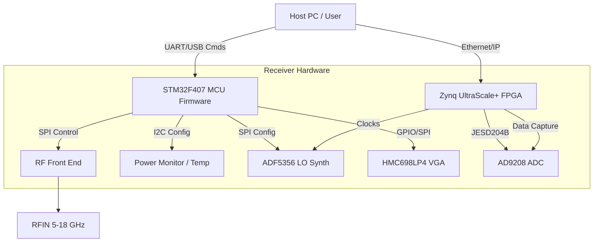
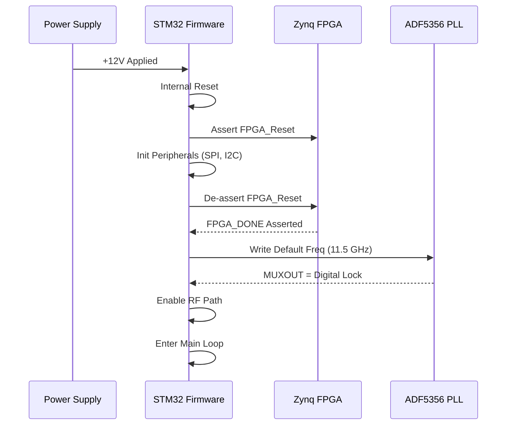
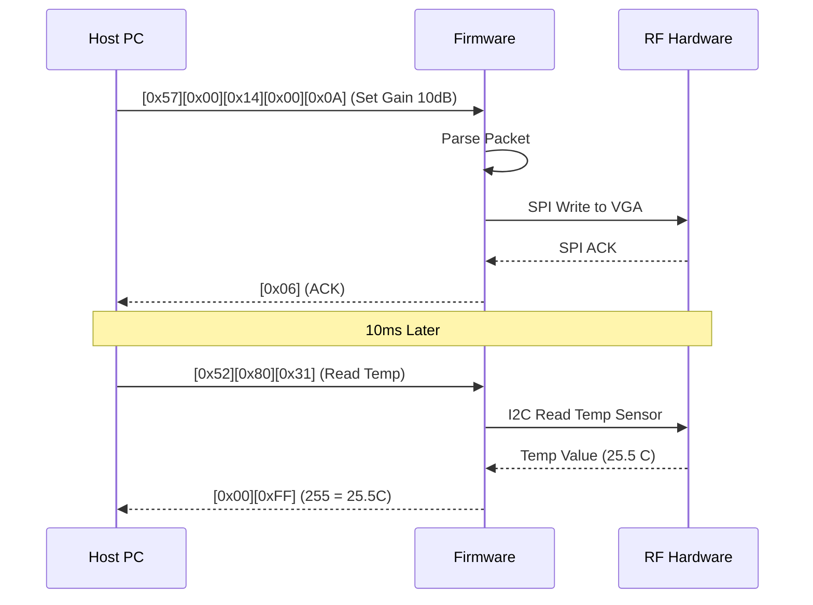
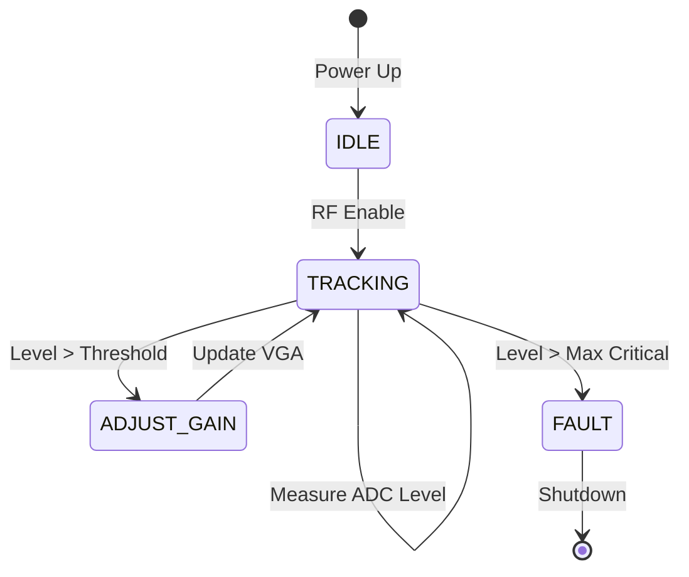
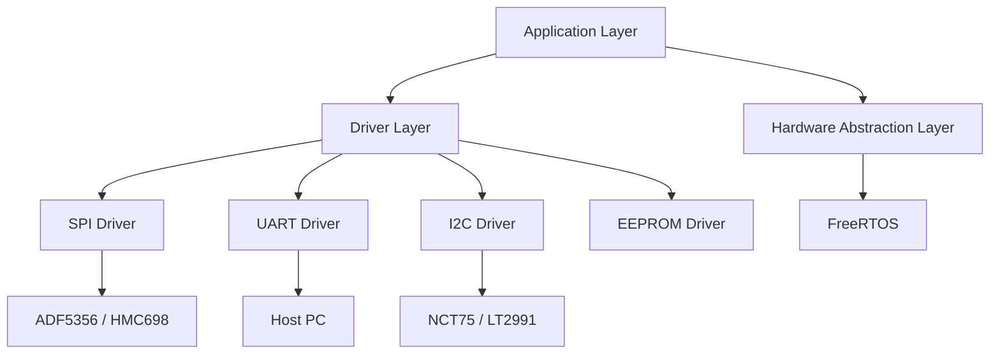
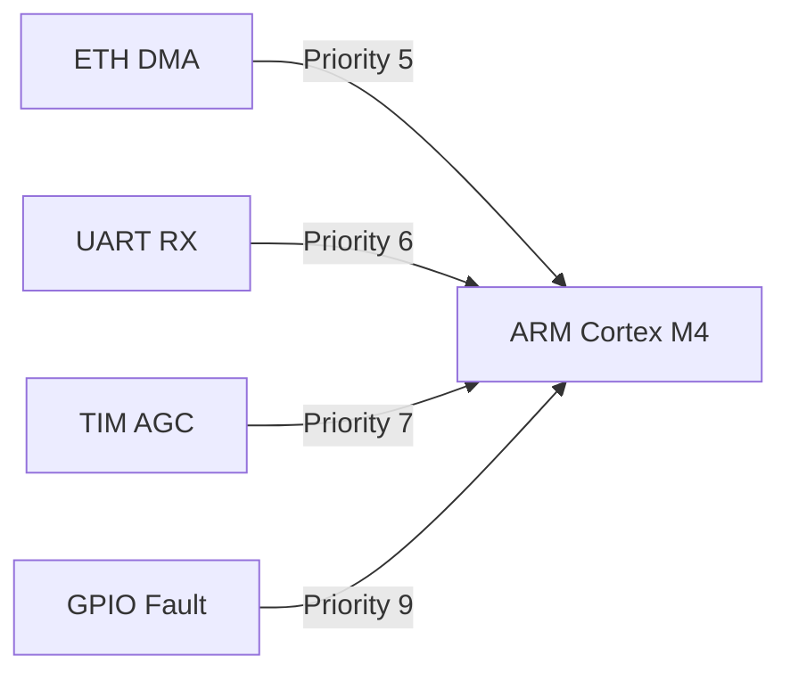

# Software Requirements Specification (SRS)

## Document Control
| Version | Date | Author | Changes |
|---------|------|--------|---------|
| 1.0 | 17 April 2026 | System Architect | Initial Release |

---

# 1. Introduction

## 1.1 Purpose
This Software Requirements Specification (SRS) defines the comprehensive software requirements for the **receiver** project firmware. This firmware executes on the embedded STM32F407VGT6 Microcontroller Unit (MCU) and the Xilinx Zynq UltraScale+ FPGA (XCZU15EG).

The purpose of this document is to:
*   Specify the functional behavior of the firmware controlling the RF Front End (LNA, VGA, Mixer).
*   Define the communication protocols between the MCU, FPGA, and external Host PC.
*   Establish performance constraints for data processing (JESD204B) and control loops (AGC, AFC).
*   Serve as the baseline for software design, implementation, and verification (V&V).

## 1.2 Scope
This specification covers the embedded software stack known as **Receiver Firmware v1.0**.
*   **MCU Firmware:** Manages power-up sequencing, SPI control of RFICs (ADF5356, HMC698LP4), non-volatile memory (EEPROM) access, and UART-to-Host communication.
*   **Firmware Scope:** Includes the Hardware Abstraction Layer (HAL), device drivers, and control logic. It explicitly excludes the high-level GUI running on the Host PC and the RTL logic for the JESD204B IP core (licensed IP).
*   **Interfaces:** The software interfaces with the RF hardware via SPI and GPIO, and with the outside world via UART and Ethernet (indirectly via FPGA).

## 1.3 Definitions, Acronyms, and Abbreviations

| Term | Definition |
| :--- | :--- |
| **ADC** | Analog-to-Digital Converter (AD9208). |
| **AFC** | Automatic Frequency Control. Algorithm to tune the LO for optimal reception. |
| **AGC** | Automatic Gain Control. Algorithm to maintain optimal signal level into the ADC. |
| **API** | Application Programming Interface. |
| **BOM** | Bill of Materials. |
| **BRAM** | Block RAM (FPGA internal memory). |
| **CPLD** | Complex Programmable Logic Device. |
| **CRC** | Cyclic Redundancy Check. |
| **CW** | Continuous Wave. |
| **DAC** | Digital-to-Analog Converter. |
| **DCD** | Data Carrier Detect. |
| **DMA** | Direct Memory Access. |
| **EMC** | Electromagnetic Compatibility. |
| **FFT** | Fast Fourier Transform. |
| **FIFO** | First In, First Out buffer. |
| **FPGA** | Field-Programmable Gate Array. |
| **FSM** | Finite State Machine. |
| **GLR** | Glue Logic Requirements. |
| **GPIO** | General Purpose Input/Output. |
| **HAL** | Hardware Abstraction Layer. |
| **HRS** | Hardware Requirements Specification. |
| **I2C** | Inter-Integrated Circuit (Serial bus). |
| **IF** | Intermediate Frequency. |
| **IIP3** | Input Third-order Intercept Point. |
| **IRQ** | Interrupt Request. |
| **ISR** | Interrupt Service Routine. |
| **JESD** | JESD204B High-speed data interface standard. |
| **LO** | Local Oscillator. |
| **LNA** | Low Noise Amplifier. |
| **LVDS** | Low-Voltage Differential Signaling. |
| **MCU** | Microcontroller Unit (STM32F407). |
| **MHz** | Megahertz. |
| **MIPS** | Million Instructions Per Second. |
| **MISO** | Master In Slave Out (SPI line). |
| **MOSI** | Master Out Slave In (SPI line). |
| **NF** | Noise Figure. |
| **NVM** | Non-Volatile Memory. |
| **PCB** | Printed Circuit Board. |
| **PLL** | Phase-Locked Loop. |
| **POST** | Power-On Self Test. |
| **PS** | Processing System (ARM core in Zynq). |
| **RTL** | Register Transfer Logic. |
| **RX** | Receive. |
| **SMA** | SubMiniature version A (RF connector). |
| **SPI** | Serial Peripheral Interface. |
| **SRS** | Software Requirements Specification. |
| **SyRS** | System Requirements Specification. |
| **UART** | Universal Asynchronous Receiver-Transmitter. |
| **VGA** | Variable Gain Amplifier (HMC698LP4). |
| **WDT** | Watchdog Timer. |

## 1.4 References
1.  **IEEE 830-1998:** Recommended Practice for Software Requirements Specifications.
2.  **ISO/IEC/IEEE 29148:2018:** Systems and Software Engineering — Life Cycle Processes — Requirements Engineering.
3.  **STMicroelectronics:** **STM32F407VGT6 Datasheet** (DocID13587).
4.  **Analog Devices:** **ADF5356 Datasheet** (Wideband Synthesizer with Integrated VCO).
5.  **Analog Devices:** **AD9208 Datasheet** (Dual, 14-Bit, 1 GSPS ADC).
6.  **Hittite/Qorvo:** **HMC698LP4 Datasheet** (Digital VGA).
7.  **Xilinx:** **UG1085** (Zynq UltraScale+ MPSoC Register Reference).
8.  **Project:** **Hardware Requirements Specification (HRS)** (P2).
9.  **Project:** **Glue Logic Requirements (GLR)** (P6).
10. **MISRA C:2012:** Guidelines for the Use of the C Language in Critical Systems.

## 1.5 Overview
The remainder of this document is organized as follows:
*   **Section 2 (Overall Description):** Describes the product perspective, context, and high-level functions.
*   **Section 3 (Specific Requirements):** Details the external interfaces, functional requirements (REQ-SW-xxx), performance constraints, and design constraints.
*   **Section 4 (Verification):** Defines the V&V strategy.
*   **Section 5 (Traceability):** Maps software requirements to hardware sources.
*   **Appendices:** Contains register maps, protocol definitions, and diagrams.

---

# 2. Overall Description

## 2.1 Product Perspective

### System Context Diagram


### Software Stack
1.  **Application Layer:** Command parsing, State Machine (IDLE, RX, CALIBRATE), Diagnostics.
2.  **Middleware:** SPI Drivers, I2C Drivers, UART Protocol Handler, CRC Libraries.
3.  **HAL:** STM32 HAL / LL Drivers.
4.  **RTOS:** FreeRTOS (Priority-based scheduling).
5.  **Hardware:** STM32F407, Peripherals (SPI, I2C, UART, Timers).

## 2.2 Product Functions
1.  **System Initialization:** Power-up sequencing, FPGA configuration loading, peripheral bring-up.
2.  **Frequency Tuning:** Programming the ADF5356 PLL via SPI.
3.  **Gain Control:** Setting the HMC698LP4 VGA attenuation via SPI.
4.  **Data Capture:** Coordinating with FPGA to receive I/Q samples via JESD204B (conceptual control).
5.  **Temperature Monitoring:** Reading on-board sensors via I2C.
6.  **Power Monitoring:** Reading voltage/current via LT2991 via I2C.
7.  **Fault Management:** Watchdog handling, Over-temperature shutdown.
8.  **Communication:** UART Packet parsing (Read/Write Registers).
9.  **Calibration:** Storing/Retrieving calibration tables from EEPROM.
10. **LED Indication:** Status updates (Power, Lock, Error).

## 2.3 User Characteristics
*   **Firmware Engineers:** Develop, debug, and maintain the code using IAR/GCC.
*   **Test Engineers:** Use UART commands and Python scripts to automate RF testing.
*   **Integrators:** Install the receiver into a larger system, requiring knowledge of the UART protocol.

## 2.4 Constraints
1.  **MISRA-C:2012:** All C code shall comply with MISRA-C:2012 standards.
2.  **Real-Time:** SPI transactions must complete within 1ms to avoid timing violations with the AGC loop.
3.  **Memory:** MCU Flash usage < 80%; RAM usage < 60% (Available 192KB SRAM).
4.  **Power:** The MCU supports low-power modes but system latency requirements dictate Run mode usage.
5.  **Environment:** Operates in 0°C to +50°C ambient.

## 2.5 Assumptions and Dependencies
1.  **Clock Stability:** The 125 MHz oscillator is stable within 50ppm.
2.  **FPGA Ready:** The FPGA asserts the `FPGA_DONE` signal before the MCU attempts JESD204B link setup.
3.  **Power Rails:** The +12V input is regulated to +5V/+6V by the LTM4644 before the MCU exits reset.

---

# 3. Specific Requirements

## 3.1 External Interface Requirements

### 3.1.1 Hardware Interfaces

#### 3.1.1.1 SPI Interface (RF Control)
The MCU acts as the SPI Master. The RFICs (ADF5356, HMC698LP4) act as Slaves.
**Parameters:**
*   **Clock (SCK):** Max 10 MHz.
*   **Mode:** Mode 0 (CPOL=0, CPHA=0).
*   **Frame Size:** 8-bit / 32-bit configurable.
*   **CS Management:** GPIO controlled (Chip Select per device).

**Driver API:**
```c
/**
 * @brief Initializes the SPI peripheral for RF control.
 * @param hspi Pointer to SPI handle
 * @retval 0 on success, -1 on failure
 */
int32_t RF_SPI_Init(SPI_HandleTypeDef *hspi);

/**
 * @brief Writes a register to the ADF5356 Synthesizer.
 * @param reg_addr The 6-bit register address (0-63).
 * @param data The 32-bit data payload.
 * @return 0 if ACK received/valid, -1 on timeout.
 */
int32_t ADF5356_WriteReg(uint8_t reg_addr, uint32_t data);

/**
 * @brief Sets the gain of the HMC698LP4 VGA.
 * @param gain_db Desired gain in dB (Range: -11.75 to +19.25).
 * @return 0 on success, -1 if parameter out of range.
 */
int32_t VGA_SetGain(float gain_db);
```

#### 3.1.1.2 I2C Interface (Sensors/EEPROM)
**Parameters:**
*   **Clock:** 100 kHz (Standard) / 400 kHz (Fast).
*   **Addressing:** 7-bit addressing.
*   **Devices:** CAT24C256 (EEPROM), NCT75 (Temp), LT2991 (Power).

**Driver API:**
```c
/**
 * @brief Reads temperature from NCT75 sensor.
 * @param temp_c Pointer to store temperature in Celsius.
 * @return 0 on success, error code on failure.
 */
int32_t Sensor_ReadTemp(float *temp_c);

/**
 * @brief Writes calibration data to EEPROM.
 * @param addr Memory offset (0-32767).
 * @param data Pointer to data buffer.
 * @param len Length of data.
 * @return 0 on success, -1 on write failure.
 */
int32_t NVM_WriteCalib(uint16_t addr, uint8_t *data, uint16_t len);
```

### 3.1.2 Software Interfaces

#### 3.1.2.1 FPGA Control Interface (Memory Mapped)
The MCU accesses FPGA registers via a parallel bus or SPI-to-Bridge (implemented as SPI in this spec for simplicity, consistent with GLR).
**Register Map Definition:**
```c
typedef struct {
    volatile uint32_t CTRL;      // 0x00: Global Control
    volatile uint32_t STATUS;    // 0x04: Status Flags
    volatile uint32_t ADC_CFG;   // 0x08: ADC Test Patterns
    volatile uint32_t FFT_ADDR;  // 0x0C: FFT Output Pointer
    volatile uint32_t GPIO_DIR;  // 0x10: GPIO Direction
    volatile uint32_t GPIO_DATA; // 0x14: GPIO Data
} FPGA_RegMap_t;
```

### 3.1.3 Communication Interfaces

**UART Frame Format (Host <-> MCU)**
All communication is Big-Endian (MSB first).

| Command | CMD byte | Frame Structure | Response |
|---------|----------|-----------------|----------|
| Single Write | 0x57 ('W') | `[0x57][ADDR_H][ADDR_L][DATA_H][DATA_L]` | `[0x06] ACK` |
| Single Read  | 0x52 ('R') | `[0x52][ADDR_H\|0x80][ADDR_L]` | `[DATA_H][DATA_L]` |
| Bulk Write   | 0x42 ('B') | `[0x42][ADDR_H][ADDR_L][N][D0_H][D0_L]...[Dn_H][Dn_L]` | `[0x06] ACK` |
| Bulk Read    | 0x62 ('b') | `[0x62][ADDR_H\|0x80][ADDR_L][N]` | `[D0_H][D0_L]...[Dn_H][Dn_L]` |
| Error NAK    | 0x15 | Sent by Firmware on invalid command/address | — |

*   **Addressing:** 16-bit Address space.
*   **Bulk Count N:** Max 64 registers.
*   **Timeout:** Host must wait < 10ms for response; Firmware resets parser after 50ms gap.
*   **Delimiters:** None (Binary Protocol).

## 3.2 Functional Requirements

### 3.2.1 System Initialization (REQ-SW-001 to REQ-SW-015)

| ID | Requirement Statement | Source | Priority | Verification |
|----|-----------------------|--------|----------|---------------|
| REQ-SW-001 | The software SHALL complete the Power-On Self-Test (POST) within 500ms of +12V power application. | HRS §2.2 | M | T |
| REQ-SW-002 | The software SHALL verify the Board ID (read from EEPROM @ 0x0000) matches 0xA50A on startup; if mismatch, the system SHALL halt and assert ERROR_LED. | HRS §2 | M | T |
| REQ-SW-003 | The software SHALL configure the ADF5356 LO frequency to 11.5 GHz (default) within 100ms of initialization completion. | HRS §3.1.3 | M | T |
| REQ-SW-004 | The software SHALL poll the ADF5356 MUXOUT pin for "Digital Lock" and assert a "LOCKED" status flag in Register 0x0001 once acquired. | GLR §4 | M | T |
| REQ-SW-005 | The software SHALL initialize the UART peripheral to 3,000,000 baud (8N1) on startup. | GLR §5 | M | I |
| REQ-SW-006 | The software SHALL load Gain Calibration coefficients from EEPROM (offset 0x0100) into RAM. | HRS §3.1 | D | I |
| REQ-SW-007 | The software SHALL configure the Watchdog Timer (WDT) to 1000ms and service it every 500ms in the main loop. | HRS §3.4 | M | T |
| REQ-SW-008 | The software SHALL initialize the LT2991 power monitor IC to scan all 4 rails every second. | HRS §3.3 | M | T |
| REQ-SW-009 | The software SHALL set the HMC698LP4 VGA gain to 0dB (mid-range) on startup. | HRS §3.1 | M | T |
| REQ-SW-010 | The software SHALL configure the JESD204B subclass via the FPGA SPI bridge to Subclass 1 (SYSREF enabled). | GLR §5 | M | I |
| REQ-SW-011 | The software SHALL enable the +5V and +6V DC-DC converters via GPIO enable pins in a specific sequence: +5V first, then +6V after 10ms delay. | HRS §2.3 | M | T |
| REQ-SW-012 | The software SHALL read the FPGA temperature sensor (XADC) and ensure it is below 60°C before enabling the RF Front End. | HRS §3.3 | M | A |
| REQ-SW-013 | The software SHALL initialize the I2C bus to 400kHz (Fast Mode) for sensor polling. | HRS §3.1 | D | I |
| REQ-SW-014 | The software SHALL verify external reference clock (125 MHz) presence via the FPGA Status Register before attempting PLL lock. | GLR §5 | M | T |
| REQ-SW-015 | The software SHALL log the firmware version string (v1.0.0) to the UART console upon successful boot. | HRS §1 | M | I |

### 3.2.2 UART Communication Driver (REQ-SW-016 to REQ-SW-025)

| ID | Requirement Statement | Source | Priority | Verification |
|----|-----------------------|--------|----------|---------------|
| REQ-SW-016 | The UART driver SHALL support the Single Write command (0x57) to write to any 16-bit register address defined in the memory map. | GLR §7 | M | T |
| REQ-SW-017 | The UART driver SHALL support the Single Read command (0x52) and return the 16-bit contents of the requested register. | GLR §7 | M | T |
| REQ-SW-018 | The UART driver SHALL support the Bulk Read command (0x62) to return up to 64 consecutive 16-bit words in one transaction. | GLR §7 | M | T |
| REQ-SW-019 | The UART driver SHALL respond to an invalid command byte with a NAK (0x15) within 200 microseconds. | GLR §7 | M | T |
| REQ-SW-020 | The UART driver SHALL verify the checksum (if enabled in config) of the incoming packet; if incorrect, it SHALL ignore the packet. | GLR §7 | D | T |
| REQ-SW-021 | The software SHALL map Register Address 0x0010 to the Frequency Setting (MHz) of the LO. | GLR §7 | M | I |
| REQ-SW-022 | The software SHALL map Register Address 0x0020 to the Gain Setting (dB) of the VGA. | GLR §7 | M | I |
| REQ-SW-023 | The UART driver SHALL use a circular DMA buffer of 512 bytes for RX data to prevent overruns at 3Mbps. | HRS §3.3 | D | A |
| REQ-SW-024 | The software SHALL echo the received ASCII characters in "Debug Mode" for terminal visibility. | GLR §7 | O | T |
| REQ-SW-025 | The UART ISR SHALL clear the Overrun Error (ORE) flag automatically to prevent lockup. | GLR §7 | M | I |

### 3.2.3 RF Control & Monitoring (REQ-SW-026 to REQ-SW-040)

| ID | Requirement Statement | Source | Priority | Verification |
|----|-----------------------|--------|----------|---------------|
| REQ-SW-026 | The software SHALL calculate the ADF5356 INT, FRAC, and MOD registers based on a desired RF Input Frequency equation. | HRS §3.1.3 | M | A |
| REQ-SW-027 | The software SHALL write the ADF5356 registers in the specific order required by the datasheet (Reg 0 -> Reg 1... -> Function Latch). | ADF5356 DS | M | I |
| REQ-SW-028 | The software SHALL support frequency tuning steps of no greater than 1 MHz across the 5-18 GHz band. | HRS §3.1.3 | M | T |
| REQ-SW-029 | The software SHALL implement a 32-bit integer accumulator for Fractional tuning to minimize phase noise. | ADF5356 DS | M | I |
| REQ-SW-030 | The software SHALL read the HMC698LP4 temperature sensor via SPI every 10 seconds and log it to the internal status array. | HRS §3.3 | M | T |
| REQ-SW-031 | The software SHALL calculate the VGA gain setting required to achieve a target ADC Full Scale Voltage (e.g., -1dBFS). | HRS §3.1 | D | A |
| REQ-SW-032 | The software SHALL execute the AGC loop only when the ADC Over-range flag is NOT asserted. | HRS §3.1 | M | T |
| REQ-SW-033 | The software SHALL provide a manual override mode where AGC is disabled and gain is set via UART command. | HRS §3.1 | O | T |
| REQ-SW-034 | The software SHALL read the RSSI value from the detector (if present) and store it in Register 0x0030. | HRS §3.1 | D | T |
| REQ-SW-035 | The software SHALL assert the RF_ENABLE pin only when the PLL is locked and the FPGA is ready. | HRS §3.1 | M | T |
| REQ-SW-036 | The software SHALL implement a frequency sweep function that increments the LO by 10 MHz, waits for lock, and measures power. | HRS §3.1 | O | D |
| REQ-SW-037 | The software SHALL update the Display (if local) or Status Register with current Frequency, Gain, and Temperature. | HRS §1 | M | D |
| REQ-SW-038 | The software SHALL check the ADC JESD204B Link Status (FPGA Register) every 1 second. | GLR §5 | M | T |
| REQ-SW-039 | The software SHALL clear the "PLL Lost Lock" interrupt flag only after re-initializing the PLL sequence. | GLR §4 | M | T |
| REQ-SW-040 | The software SHALL limit the maximum RF Input time to 5 minutes if input power exceeds +30 dBm (based on flag from external limiter). | HRS §3.2.3 | M | T |

### 3.2.4 Data Handling & FPGA Interface (REQ-SW-041 to REQ-SW-050)

| ID | Requirement Statement | Source | Priority | Verification |
|----|-----------------------|--------|----------|---------------|
| REQ-SW-041 | The software SHALL configure the FPGA to output 16-bit I and 16-bit Q samples. | HRS §3.2.1 | M | I |
| REQ-SW-042 | The software SHALL assert the FPGA_RESET signal for 10ms during system boot. | GLR §5 | M | T |
| REQ-SW-043 | The software SHALL read the ADC Test Pattern count (via FPGA Register) to verify data integrity. | AD9208 DS | M | T |
| REQ-SW-044 | The software SHALL implement a DMA transfer to capture I/Q samples from the FPGA FIFO into MCU memory for analysis. | HRS §3.2.1 | D | I |
| REQ-SW-045 | The software SHALL check the K28.5 comma character alignment in the JESD204B lane status register. | GLR §5 | M | I |
| REQ-SW-046 | The software SHALL be capable of stopping the DMA capture and closing the file gracefully upon a Stop Command. | HRS §3.2.1 | M | T |
| REQ-SW-047 | The software SHALL not modify the FPGA JESD204B Lane Rate configuration while the link is active. | AD9208 DS | M | I |
| REQ-SW-048 | The software SHALL map Register 0x0040 to the ADC Sample Rate Control (Divisor). | GLR §7 | M | T |
| REQ-SW-049 | The software SHALL verify the FPGA Bitstream ID matches the expected PCB revision. | HRS §2 | M | T |
| REQ-SW-050 | The software SHALL handle the FPGA "Buffer Full" interrupt by pausing data acquisition and setting an overflow flag. | GLR §5 | M | T |

### 3.2.5 Power Management & Diagnostics (REQ-SW-051 to REQ-SW-065)

| ID | Requirement Statement | Source | Priority | Verification |
|----|-----------------------|--------|----------|---------------|
| REQ-SW-051 | The software SHALL monitor the +12V input rail via the LT2991 and flag an undervoltage fault if < 10.8V. | HRS §3.3 | M | T |
| REQ-SW-052 | The software SHALL monitor the +12V input rail and flag an overvoltage fault if > 13.2V. | HRS §3.3 | M | T |
| REQ-SW-053 | The software SHALL read the die temperature of the STM32F407 via the internal sensor. | STM32 DS | M | T |
| REQ-SW-054 | The software SHALL enter a "Throttle" mode (reduce max gain) if the PA temperature (read via I2C) exceeds +80°C. | HRS §3.3 | D | T |
| REQ-SW-055 | The software SHALL maintain a fault log in EEPROM with a timestamp (seconds since boot) and error code. | HRS §3.4 | M | T |
| REQ-SW-056 | The fault log SHALL be circular and overwrite the oldest entry once full (Max 50 entries). | HRS §3.4 | M | I |
| REQ-SW-057 | The software SHALL assert the FAULT_GPIO pin high upon detection of any Critical Failure (Overtemp, Overvoltage, PLL Unlock). | GLR §5 | M | T |
| REQ-SW-058 | The software SHALL disable the RF Output path immediately upon Critical Failure detection. | HRS §3.1 | M | T |
| REQ-SW-059 | The software SHALL measure the current consumption of the +5V and +6V rails and report them in Registers 0x0051 and 0x0052. | HRS §3.3 | M | T |
| REQ-SW-060 | The software SHALL perform a periodic memory checksum (CRC-16) of the firmware flash space every hour. | HRS §3.4 | D | A |
| REQ-SW-061 | The software SHALL track the uptime in seconds and store it in a 32-bit register (wrapping at 2^32). | HRS §3.4 | M | I |
| REQ-SW-062 | The software SHALL support a "Factory Reset" command that erases the EEPROM calibration sector. | HRS §3.1 | O | T |
| REQ-SW-063 | The software SHALL blink the Status LED at 2Hz during normal operation and 10Hz during firmware update mode. | HRS §1 | M | D |
| REQ-SW-064 | The software SHALL report the Serial Number (read from EEPROM @ 0x0010) in Register 0x0000. | HRS §2 | M | I |
| REQ-SW-065 | The software SHALL log the last 10 UART commands received to assist in debugging. | HRS §3.4 | O | I |

### 3.2.6 Calibration & Configuration (REQ-SW-066 to REQ-SW-075)

| ID | Requirement Statement | Source | Priority | Verification |
|----|-----------------------|--------|----------|---------------|
| REQ-SW-066 | The software SHALL store the VGA Flatness Table (16 entries) in EEPROM to correct gain ripples. | HRS §3.2 | D | T |
| REQ-SW-067 | The software SHALL apply the VGA Flatness correction whenever the frequency changes by more than 500 MHz. | HRS §3.2 | D | T |
| REQ-SW-068 | The software SHALL allow the host to read/write the calibration table via Bulk Read/Write UART commands. | GLR §7 | M | T |
| REQ-SW-069 | The software SHALL calculate a CRC-32 checksum of the calibration data on boot and validate it against a stored magic number. | HRS §3.4 | M | T |
| REQ-SW-070 | The software SHALL load default hard-coded calibration values if EEPROM CRC is invalid. | HRS §3.4 | M | T |
| REQ-SW-071 | The software SHALL support a "Calibration Mode" where the gain is manually stepped and values recorded. | HRS §3.1 | O | D |
| REQ-SW-072 | The software SHALL store the I/Q Offset Correction values (DC bias) in EEPROM. | HRS §3.2 | D | T |
| REQ-SW-073 | The software SHALL write the I/Q Offset Correction values to the FPGA digital down-converter upon initialization. | GLR §5 | M | T |
| REQ-SW-074 | The software SHALL support saving the current configuration (Freq, Gain) as a "Boot Preset". | HRS §3.1 | O | T |
| REQ-SW-075 | The software SHALL verify that all external I2C devices acknowledge their addresses during POST. | HRS §3.1 | M | T |

## 3.3 Performance Requirements
| ID | Requirement Statement | Verification |
|----|-----------------------|---------------|
| REQ-PERF-001 | The frequency tuning speed (change LO from 5 GHz to 18 GHz) SHALL be ≤ 10 ms. | T |
| REQ-PERF-002 | The AGC loop response time SHALL be ≤ 5 ms for a 10 dB step change in input power. | T |
| REQ-PERF-003 | The UART command latency (Host-to-Action) SHALL be ≤ 2 ms for single register writes. | T |
| REQ-PERF-004 | The SPI clock speed for ADC configuration SHALL be ≥ 10 MHz. | I |
| REQ-PERF-005 | The Boot-to-Operational time SHALL be ≤ 2.0 seconds. | T |
| REQ-PERF-006 | The Watchdog Timer SHALL reset the MCU if the main loop stalls for > 1000 ms. | T |
| REQ-PERF-007 | The I2C transaction for reading temperature SHALL complete within 2 ms. | A |
| REQ-PERF-008 | The firmware SHALL consume ≤ 5% of CPU utilization when idle (waiting for commands). | A |
| REQ-PERF-009 | The context switch time of the RTOS SHALL be ≤ 10 microseconds. | A |
| REQ-PERF-010 | The firmware SHALL support a continuous data capture duration of ≥ 60 minutes without data loss. | T |

## 3.4 Design Constraints
1.  **MISRA-C:** All code shall adhere to MISRA-C:2012 mandatory rules.
2.  **Compiler:** IAR EWARM or ARM GCC (GNU Tools for STM32).
3.  **Static Analysis:** Code must pass PC-Lint Plus with zero errors.
4.  **Float Usage:** Floating point operations shall be minimized in ISRs; Fixed-point math preferred for AGC.
5.  **Dynamic Memory:** `malloc` and `free` are strictly prohibited.
6.  **Interrupt Nesting:** Max interrupt nesting level is 2.
7.  **Stack Size:** Main Stack Size configured to 4KB; Interrupt Stack to 2KB.

## 3.5 Software System Attributes

### 3.5.1 Reliability
*   **Availability:** 99.9% uptime (excluding maintenance).
*   **MTBF:** > 10,000 hours.
*   **Recovery:** Automatic Watchdog reset on deadlock.

### 3.5.2 Maintainability
*   **Modularity:** RF control, UART, and diagnostics shall be in separate C files.
*   **Comments:** All functions shall have Doxygen headers.

### 3.5.3 Security
*   Write access to Calibration EEPROM shall be protected by a "Unlock Sequence" (Write 0xAA, 0x55 to specific registers).
*   Firmware updates via UART (Bootloader) shall utilize a CRC-32 check before flashing.

### 3.5.4 Portability
*   Hardware abstraction via `STM32F4xx_HAL_Driver`.
*   Pin definitions in a separate `board_hw_def.h` file.

---

# 4. Verification and Validation

## 4.1 Unit Test Requirements
*   **ADF5356 Driver:** Mock SPI interface; verify correct register calculation for 5 test frequencies.
*   **UART Parser:** Send sequences of valid and invalid frames; verify ACK/NAK responses.
*   **CRC Module:** Test vectors from ISO 3309.
*   **EEPROM Driver:** Write/Read verify across address boundaries.

## 4.2 Integration Test Requirements
*   **MCU <-> FPGA:** Verify register read/write latency.
*   **MCU <-> RFIC:** Verify PLL lock at band edges (5 GHz, 18 GHz).
*   **Full Chain:** Inject CW tone at 10 GHz, tune LO, verify ADC sees signal via SPI status.

## 4.3 System Test Requirements
*   **Thermal:** Operate at +50°C ambient for 24 hours (-soak test).
*   **EMC:** Verify no emission violations during high-speed SPI bursts.
*   **Endurance:** Cycle relays/gain settings 100,000 times.

---

# 5. Requirements Traceability Matrix

| REQ-SW-xxx | Description | Traces To (REQ-HW-xxx / GLR Section) |
|-----------|-------------|--------------------------------------|
| REQ-SW-001 | POST < 500ms | HRS §2.2 |
| REQ-SW-003 | LO Freq 11.5GHz Default | HRS §3.1.3 |
| REQ-SW-004 | PLL Lock Detection | GLR §4 (ADF5356) |
| REQ-SW-007 | WDT 1000ms | HRS §3.4 |
| REQ-SW-009 | VGA 0dB Default | HRS §3.1 (Gain Control) |
| REQ-SW-011 | Power Sequencing | HRS §2.3 (Power Supply) |
| REQ-SW-016 | UART Single Write | GLR §7 (Protocol) |
| REQ-SW-017 | UART Single Read | GLR §7 (Protocol) |
| REQ-SW-019 | UART NAK Error | GLR §7 (Protocol) |
| REQ-SW-026 | ADF5356 Calc | HRS §3.1.3 (LO Synth) |
| REQ-SW-028 | Freq Step 1MHz | HRS §3.1.3 |
| REQ-SW-031 | AGC Target | HRS §3.2.1 (Signal Proc) |
| REQ-SW-040 | Input Power Limit | HRS §3.2.3 (Max Input) |
| REQ-SW-041 | I/Q 16-bit | HRS §3.2.1 (ADC) |
| REQ-SW-051 | Input UV Fault | HRS §3.3 (Power) |
| REQ-SW-066 | Cal Table EEPROM | HRS §3.2 (Perf) |
| ... | ... | ... |

---

# 6. Appendices

## Appendix A — Error Codes
```c
typedef enum {
    ERR_OK           = 0x00, // No Error
    ERR_TIMEOUT      = 0x01, // SPI/UART Timeout
    ERR_COMM         = 0x02, // CRC/Checksum Fail
    ERR_CHECKSUM     = 0x03, // EEPROM Data Corrupt
    ERR_PARAM        = 0x04, // Invalid Parameter
    ERR_NOT_INIT     = 0x05, // Driver not initialized
    ERR_RESOURCE     = 0x06, // Resource busy
    ERR_HARDWARE     = 0x07, // HW Fault (OV, UV)
    ERR_OVERFLOW     = 0x08, // FIFO Overflow
    ERR_UNDERFLOW    = 0x09, // FIFO Underflow
    ERR_FLASH_WRITE  = 0x0A, // Flash Write Fail
    ERR_FLASH_ERASE  = 0x0B, // Flash Erase Fail
    ERR_EEPROM       = 0x0C, // EEPROM Fail
    ERR_PLL          = 0x0D, // PLL Unlock
    ERR_TEMP_ALERT   = 0x0E, // Overtemp
    ERR_VOLT_FAULT   = 0x0F, // Voltage Fault
    ERR_LOOPBACK     = 0x10, // Internal Loopback Fail
    ERR_POST_FAIL    = 0x11, // Boot Self-test Fail
    ERR_WATCHDOG     = 0x12, // WDT Reset occurred
    ERR_ADDR_RANGE   = 0x13, // Register address invalid
} ErrorCode_t;
```

## Appendix B — Register Map Summary
| Base Address | Block | Offset | Register Name | Width | R/W | Reset Value | Description |
|-------------|-------|--------|--------------|-------|-----|-------------|-------------|
| 0x0000 | SYS | 0x00 | BOARD_ID | 16 | R | 0xA50A | Board Identifier |
| 0x0000 | SYS | 0x01 | FIRMWARE_VER | 16 | R | 0x0100 | Firmware v1.0 |
| 0x0000 | SYS | 0x02 | STATUS | 16 | R | 0x0000 | Bitmask: PLL_Lock, Fault |
| 0x0000 | SYS | 0x03 | COMMAND | 16 | W | 0x0000 | Cmd: Reset, Self-Test |
| 0x0010 | RF | 0x10 | LO_FREQ_MHZ | 32 | W | 11500 | LO Frequency in MHz |
| 0x0010 | RF | 0x14 | VGA_GAIN_DB | 16 | W | 0x0000 | VGA Gain (Signed int) |
| 0x0020 | ADC | 0x20 | ADC_SAMPLE_RATE | 32 | W | 200000000 | ADC Sample Rate (Hz) |
| 0x0020 | ADC | 0x24 | ADC_STATUS | 16 | R | - | Bitmask: JJOL, Overrange |
| 0x0030 | SENS | 0x30 | TEMP_DEGC | 16 | R | - | Temperature (0.1°C units) |
| 0x0030 | SENS | 0x31 | VIN_MV | 16 | R | - | Input Voltage mV |

## Appendix C — Mermaid Diagrams

### System Initialization Sequence


### UART Protocol Interaction


### AGC State Machine


### Software Module Architecture


### Interrupt Priority Map


## Appendix D — Acronyms and Glossary
*See Section 1.3.*

## Appendix E — Document Revision History
| Rev | Date | Author | Description |
|-----|------|--------|-------------|
| 1.0 | 17 April 2026 | System Architect | Initial Release |