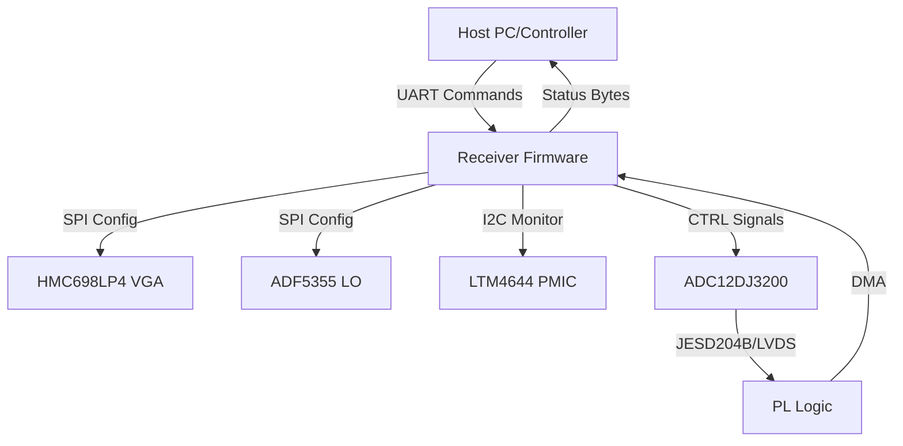
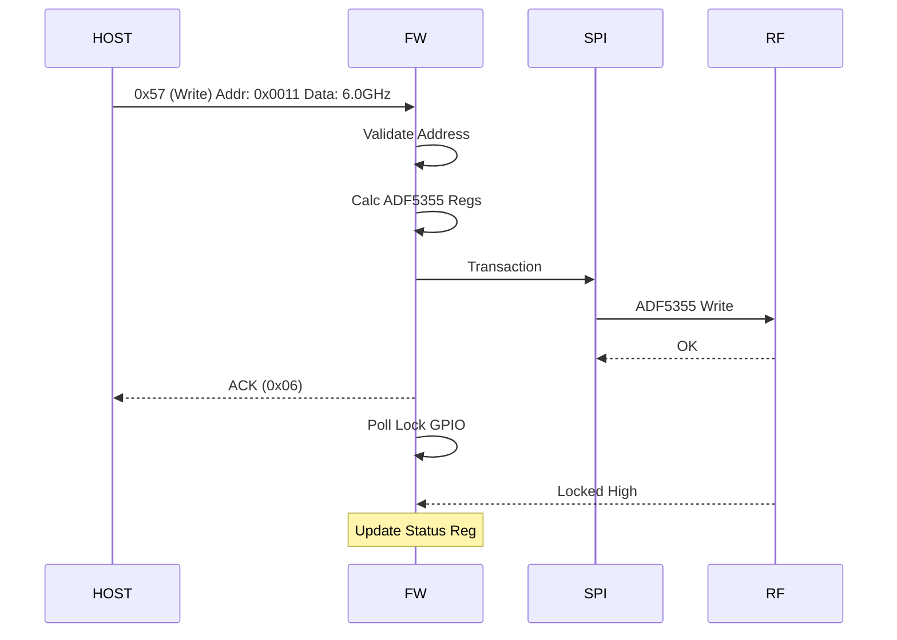
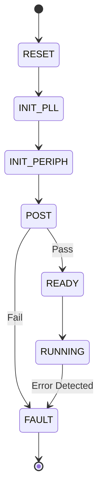
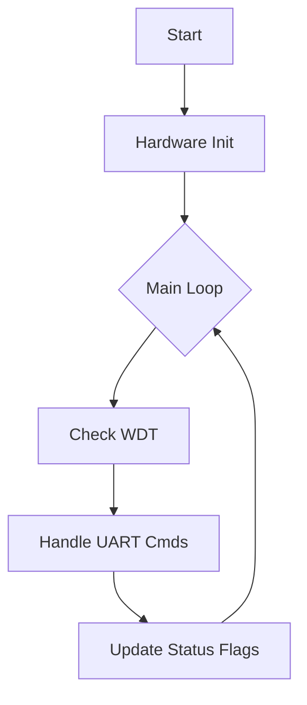

# Software Requirements Specification (SRS)

## Document Control
| Version | Date | Author | Changes |
|---------|------|--------|---------|
| 1.0 | 17 April 2026 | Senior Architect | Initial Release for Wideband RF Receiver Project |

---

# 1. Introduction

## 1.1 Purpose
This Software Requirements Specification (SRS) document defines the system and software requirements for the firmware embedded within the **Wideband RF Receiver (Project: Receiver)**. This firmware executes on the **XCZU3EG-SFVA784** Zynq UltraScale+ MPSoC.

The purpose of this document is to:
1.  Specify the software behavior required to control the RF signal chain (LNA, Mixer, LO).
2.  Define the communication protocol for host interaction via UART.
3.  Detail the data acquisition requirements from the ADC12DJ3200.
4.  Establish a baseline for software validation and traceability to the Hardware Requirements Specification (HRS) and Glue Logic Requirements (GLR).

## 1.2 Scope
The software scope encompasses the bare-metal/RTOS firmware running on the ARM Cortex-R5 cores within the Zynq MPSoC.
**Inclusions:**
*   Drivers for SPI peripherals (HMC698LP4 VGA, ADF5355 Synthesizer).
*   Drivers for I2C peripherals (LTM4644 Power Supply).
*   UART command parser and register access handler.
*   JESD204B/DDR interface initialization and data buffering logic.
*   System monitoring (Temperature, Voltage).
**Exclusions:**
*   Host PC application software.
*   High-level signal processing algorithms (demodulation, DSP) executed on the host or external FPGA fabric IP.

## 1.3 Definitions, Acronyms, and Abbreviations

| Term | Definition |
| :--- | :--- |
| **ADC** | Analog-to-Digital Converter (TI ADC12DJ3200). |
| **AGC** | Automatic Gain Control. |
| **API** | Application Programming Interface. |
| **ASIL** | Automotive Safety Integrity Level. |
| **BIST** | Built-In Self-Test. |
| **BOM** | Bill of Materials. |
| **BRAM** | Block RAM (FPGA on-chip memory). |
| **BSP** | Board Support Package. |
| **CPLD** | Complex Programmable Logic Device. |
| **CPU** | Central Processing Unit. |
| **DAC** | Digital-to-Analog Converter. |
| **DDR** | Double Data Rate (SDRAM interface). |
| **DMA** | Direct Memory Access. |
| **EMC** | Electromagnetic Compatibility. |
| **ESD** | Electrostatic Discharge. |
| **FCC** | Federal Communications Commission. |
| **FIFO** | First-In-First-Out data buffer. |
| **FIR** | Finite Impulse Response (Filter type). |
| **FPGA** | Field-Programmable Gate Array. |
| **FSM** | Finite State Machine. |
| **GBE** | Gigabit Ethernet. |
| **GLR** | Glue Logic Requirements (Input document P6). |
| **GPIO** | General Purpose Input/Output. |
| **HAL** | Hardware Abstraction Layer. |
| **HRS** | Hardware Requirements Specification (Input document P2). |
| **I2C** | Inter-Integrated Circuit (Serial Interface). |
| **IC** | Integrated Circuit. |
| **IF** | Intermediate Frequency. |
| **IIP3** | Input Third-order Intercept Point. |
| **IP** | Intellectual Property (Core). |
| **ISR** | Interrupt Service Routine. |
| **JTAG** | Joint Test Action Group (Debug interface). |
| **JESD** | JEDEC Standard for Serial Data Converter Interface. |
| **LED** | Light Emitting Diode. |
| **LNA** | Low Noise Amplifier. |
| **LO** | Local Oscillator. |
| **LUT** | Look-Up Table. |
| **LVTTL** | Low Voltage Transistor-Transistor Logic. |
| **LVDS** | Low Voltage Differential Signaling. |
| **MAC** | Media Access Control. |
| **MCU** | Microcontroller Unit. |
| **MIMO** | Multiple Input Multiple Output. |
| **MISRA** | Motor Industry Software Reliability Association (C Coding Standard). |
| **MSPS** | Mega Samples Per Second. |
| **NF** | Noise Figure. |
| **NVM** | Non-Volatile Memory (Flash/EEPROM). |
| **PCB** | Printed Circuit Board. |
| **PLL** | Phase-Locked Loop. |
| **POST** | Power-On Self-Test. |
| **PS** | Processing System (ARM in Zynq). |
| **QFN** | Quad Flat No-leads package. |
| **RAM** | Random Access Memory. |
| **RF** | Radio Frequency. |
| **ROM** | Read-Only Memory. |
| **RTOS** | Real-Time Operating System. |
| **RX** | Receiver. |
| **SNR** | Signal-to-Noise Ratio. |
| **SPI** | Serial Peripheral Interface. |
| **SRAM** | Static Random Access Memory. |
| **SRS** | Software Requirements Specification. |
| **StRS** | Stakeholder Requirements Specification. |
| **SyRS** | System Requirements Specification. |
| **TRP** | Transmit/Receive Pulse. |
| **UART** | Universal Asynchronous Receiver-Transmitter. |
| **VCO** | Voltage-Controlled Oscillator. |
| **VGA** | Variable Gain Amplifier. |

## 1.4 References
1.  IEEE Std 830-1998: Recommended Practice for Software Requirements Specifications.
2.  ISO/IEC/IEEE 29148:2018: Systems and software engineering — Life cycle processes — Requirements engineering.
3.  **HRS-REV-001**: Hardware Requirements Specification for Project: Receiver (2023-10-27).
4.  **GLR-0V01**: Glue Logic Requirements for Project: Receiver (17.04.2026).
5.  MISRA-C:2012: Guidelines for the use of the C language in critical systems.
6.  **XCZU3EG Datasheet**: Zynq UltraScale+ MPSoC Data Sheet (DS925).
7.  **ADC12DJ3200 Datasheet**: 12-Bit, 3.2 GSPS, Dual ADC (Texas Instruments).
8.  **ADF5355 Datasheet**: Wideband Synthesizer with Integrated VCO (Analog Devices).
9.  **HMC698LP4 Datasheet**: GaAs MMIC PHEMT Wideband Variable Gain Amplifier (Analog Devices).
10. **LTM4644 Datasheet**: Quad 4A DC-DC Converter (Analog Devices).

## 1.5 Overview
The remainder of this document is organized as follows:
*   **Section 2 (Overall Description):** Describes the system context, product functions, user characteristics, and constraints.
*   **Section 3 (Specific Requirements):** Contains the detailed software requirements, including external interfaces and 75+ functional requirements (REQ-SW-xxx).
*   **Section 4 (Verification and Validation):** Defines the testing strategy for unit, integration, and system levels.
*   **Section 5 (Requirements Traceability Matrix):** Maps software requirements to hardware sources.
*   **Appendices:** Contains error codes, register maps, and architectural diagrams.

---

# 2. Overall Description

## 2.1 Product Perspective
The Receiver Firmware is an embedded real-time system operating on the Processing System (PS) of the Xilinx Zynq UltraScale+ FPGA. It acts as the bridge between a host control computer (via UART) and the high-speed analog/digital subsystem.

**System Context:**


## 2.2 Product Functions
The firmware performs the following major functions:
1.  **System Initialization:** Configures clocks, PLLs, and peripheral GPIOs.
2.  **Hardware Abstraction (HAL):** Provides low-level drivers for UART, SPI, I2C, and GPIO.
3.  **RF Control:** Sets LO frequency (ADF5355) and Gain (HMC698LP4) based on host commands.
4.  **Power Management:** Monitors voltage/current via I2C and manages power sequencing.
5.  **Data Acquisition:** Manages the ADC interface and data buffer readiness.
6.  **Host Communication:** Implements the UART Register Protocol (Read/Write).
7.  **Fault Management:** Watchdog servicing, temperature monitoring, and error logging.

## 2.3 User Characteristics
*   **Firmware Engineers:** Develop and maintain the code using the SRS and HAL documentation.
*   **Test Engineers:** Validate performance using RF test equipment and the UART interface.
*   **System Integrators:** Integrate the receiver module into larger radar or comms systems.

## 2.4 Constraints
*   **Standards Compliance:** Code must comply with MISRA-C:2012.
*   **Environment:** Industrial temperature range (-40°C to +85°C).
*   **Performance:** RF configuration must complete within 1ms (REQ-HW-012).
*   **Resources:** 256KB On-Chip Memory (OCM), 1GB DDR4 available. Code footprint must fit in allocated Flash.
*   **Toolchain:** Xilinx Vitis/Vivado 2023.2 or later.

## 2.5 Assumptions and Dependencies
*   The Hardware assumes the +12V rail is stable and within ±5% tolerance before software starts.
*   The FPGA bitstream is loaded prior to software execution (or by FSBL).
*   The UART Host operates at 115200 baud, 8N1.

---

# 3. Specific Requirements

## 3.1 External Interface Requirements

### 3.1.1 Hardware Interfaces

#### 3.1.1.1 UART Interface (Host Command)
The primary control interface uses UART.
```c
typedef struct {
    volatile uint32_t CTRL;     // 0xFF00: Control Register
    volatile uint32_t STATUS;   // 0xFF04: Status Register
    volatile uint32_t TX_FIFO;  // 0xFF08: TX FIFO
    volatile uint32_t RX_FIFO;  // 0xFF0C: RX FIFO
    volatile uint32_t BAUD_GEN; // 0xFF10: Baud Rate Generator
} UART_RegMap_t;

// API
int32_t UART_Init(uint32_t baud_rate);
int32_t UART_ReadByte(uint8_t *data);
int32_t UART_WriteByte(uint8_t data);
```

#### 3.1.1.2 SPI Interface (RF Control)
SPI Master interface for ADF5355 and HMC698LP4.
```c
typedef struct {
    volatile uint32_t CTRL;     // Control: CPOL, CPHA, LSB/MSB
    volatile uint32_t STATUS;   // TX/RX Empty flags
    volatile uint32_t TX_DATA;  // 32-bit write
    volatile uint32_t RX_DATA;  // 32-bit read
    volatile uint32_t SS;       // Slave Select mask
} SPI_RegMap_t;

// API
int32_t RF_Init(void);
int32_t RF_SetLO_Frequency(uint64_t freq_hz);
int32_t RF_SetGain(int8_t gain_db);
```

#### 3.1.1.3 I2C Interface (Power Monitor)
I2C Master for LTM4644 PMBus commands.
```c
typedef struct {
    volatile uint32_t CTRL;     // Enable, 7/10 bit addr
    volatile uint32_t STATUS;   // ACK, Bus Busy
    volatile uint32_t DATA;     // Byte to write
    volatile uint32_t CMD;      // Command/Address
} I2C_RegMap_t;

// API
int32_t PWR_ReadVoltage(uint8_t rail_idx, float *volts);
int32_t PWR_ReadCurrent(uint8_t rail_idx, float *amps);
```

### 3.1.2 Software Interfaces
*   **Xilinx Standalone BSP:** Provides drivers for UART, SPI, I2C, GIC (Interrupt Controller).
*   **Xilinx SCUFW:** System Controller Unit Firmware for MIO configuration.

### 3.1.3 Communication Interfaces
**UART Protocol Frame Formats:**

| Command | CMD byte | Frame Structure | Response |
|---------|----------|-----------------|----------|
| Single Write | 0x57 ('W') | [0x57][ADDR_H][ADDR_L][DATA_H][DATA_L] | [0x06] ACK |
| Single Read  | 0x52 ('R') | [0x52][ADDR_H\|0x80][ADDR_L] | [DATA_H][DATA_L] |
| Bulk Write   | 0x42 ('B') | [0x42][ADDR_H][ADDR_L][N][D0_H][D0_L]... | [0x06] ACK |
| Bulk Read    | 0x62 ('b') | [0x62][ADDR_H\|0x80][ADDR_L][N] | [D0_H][D0_L]... |
| Error NAK    | 0x15 | Sent by receiver on invalid command/address | — |

*   **Address Map:** 16-bit (0x0000–0xFFFF). Read addresses have bit15 set.
*   **Limits:** Max bulk count N = 64 registers.
*   **Timing:** Inter-byte timeout = 50ms.

---

## 3.2 Functional Requirements

### 3.2.1 System Initialization (REQ-SW-001 to REQ-SW-010)
**REQ-SW-001:** The software SHALL perform a Power-On Self-Test (POST) within 500ms of reset de-assertion.
*   **Source:** HRS §3.1
*   **Priority:** M
*   **Verification:** T

**REQ-SW-002:** The software SHALL verify the FPGA Board ID register matches the expected value `0xREC5` during POST.
*   **Source:** GLR §6
*   **Priority:** M
*   **Verification:** I

**REQ-SW-003:** The software SHALL configure the UART baud rate to 115200 bps, 8 data bits, no parity, 1 stop bit during initialization.
*   **Source:** GLR §4
*   **Priority:** M
*   **Verification:** T

**REQ-SW-004:** The software SHALL initialize the SPI Master interfaces for the ADF5355 and HMC698LP4 with a clock frequency of 10 MHz max.
*   **Source:** GLR §4.2
*   **Priority:** M
*   **Verification:** T

**REQ-SW-005:** The software SHALL enable the Watchdog Timer (WDT) with a 1-second timeout during the init sequence.
*   **Source:** HRS §3.2
*   **Priority:** M
*   **Verification:** A

**REQ-SW-006:** The software SHALL initialize the I2C controller to 100 kHz standard speed to communicate with the LTM4644.
*   **Source:** GLR §4.2
*   **Priority:** M
*   **Verification:** T

**REQ-SW-007:** The software SHALL read the temperature sensor value and log it to the internal status register on startup.
*   **Source:** HRS §3.4
*   **Priority:** M
*   **Verification:** D

**REQ-SW-008:** The software SHALL configure the MIO GPIO pins to drive the Status LED to a steady ON state upon successful init.
*   **Source:** GLR §7
*   **Priority:** D
*   **Verification:** D

**REQ-SW-009:** The software SHALL initialize the PLL to generate a 500 MHz system clock for the PL (Programmable Logic) side.
*   **Source:** GLR §5
*   **Priority:** M
*   **Verification:** A

**REQ-SW-010:** The software SHALL clear all internal status registers and error flags before entering the main loop.
*   **Source:** General Safety
*   **Priority:** M
*   **Verification:** I

### 3.2.2 UART Communication Driver (REQ-SW-011 to REQ-SW-020)
**REQ-SW-011:** The UART driver SHALL implement the Single Write command (0x57) as defined in 3.1.3.
*   **Source:** GLR §8
*   **Priority:** M
*   **Verification:** T

**REQ-SW-012:** The UART driver SHALL implement the Single Read command (0x52) returning the contents of the requested address.
*   **Source:** GLR §8
*   **Priority:** M
*   **Verification:** T

**REQ-SW-013:** The UART driver SHALL verify the Checksum/CRC of incoming packets (if enabled in config).
*   **Source:** HRS §3.6
*   **Priority:** O
*   **Verification:** T

**REQ-SW-014:** The UART driver SHALL respond to an invalid command byte with a NAK (0x15) within 100 microseconds.
*   **Source:** GLR §8
*   **Priority:** M
*   **Verification:** T

**REQ-SW-015:** The UART driver SHALL support bulk write operations of up to 64 registers in a single transaction.
*   **Source:** GLR §8
*   **Priority:** M
*   **Verification:** T

**REQ-SW-016:** The UART driver SHALL service the Receive FIFO interrupt every 10ms to prevent data overrun.
*   **Source:** Latency Req
*   **Priority:** M
*   **Verification:** A

**REQ-SW-017:** The UART driver SHALL discard bytes received if the inter-byte gap exceeds 50ms.
*   **Source:** GLR §8
*   **Priority:** M
*   **Verification:** T

**REQ-SW-018:** The software SHALL provide a register map location (0x0001) that returns the Firmware Version Number.
*   **Source:** GLR §6
*   **Priority:** M
*   **Verification:** T

**REQ-SW-019:** The software SHALL provide a register map location (0x0002) that returns the Hardware Revision ID.
*   **Source:** GLR §6
*   **Priority:** M
*   **Verification:** I

**REQ-SW-020:** The UART driver SHALL mask write attempts to Read-Only (RO) registers without generating an error.
*   **Source:** Robustness
*   **Priority:** D
*   **Verification:** T

### 3.2.3 RF Control - SPI Drivers (REQ-SW-021 to REQ-SW-030)
**REQ-SW-021:** The software SHALL calculate the ADF5355 register values for a given target frequency using the integer-N or fractional-N formula.
*   **Source:** HRS §3.2 (REQ-HW-001)
*   **Priority:** M
*   **Verification:** A

**REQ-SW-022:** The software SHALL write the ADF5355 configuration registers via SPI within 1ms of receiving the frequency change command.
*   **Source:** HRS §3.2 (REQ-HW-012)
*   **Priority:** M
*   **Verification:** T

**REQ-SW-023:** The software SHALL poll the ADF5355 MUXOUT pin (via GPIO) to verify PLL lock (Digital Lock Detect = High) before asserting RF Ready status.
*   **Source:** HRS §3.2 (REQ-HW-013)
*   **Priority:** M
*   **Verification:** T

**REQ-SW-024:** The software SHALL control the HMC698LP4 gain by writing a 6-bit code to the SPI register corresponding to the desired dB attenuation.
*   **Source:** HRS §3.2 (REQ-HW-003)
*   **Priority:** M
*   **Verification:** T

**REQ-SW-025:** The software SHALL support a gain range of 0 to 16dB in 1dB steps for the HMC698LP4.
*   **Source:** HMC698LP4 Datasheet
*   **Priority:** M
*   **Verification:** T

**REQ-SW-026:** The software SHALL map the Host "Gain Index" register (0x0010) directly to the HMC698LP4 SPI write.
*   **Source:** GLR §6
*   **Priority:** M
*   **Verification:** I

**REQ-SW-027:** The software SHALL assert the RF_Enable signal only after LO lock is confirmed.
*   **Source:** Safety Constraint
*   **Priority:** M
*   **Verification:** A

**REQ-SW-028:** The software SHALL verify that the requested frequency is within the 5.0 GHz to 18.0 GHz range before programming the ADF5355.
*   **Source:** HRS §3.2 (REQ-HW-001)
*   **Priority:** M
*   **Verification:** T

**REQ-SW-029:** The software SHALL store the last 10 frequency/gain settings in non-volatile (NVM) backup.
*   **Source:** Usability
*   **Priority:** O
*   **Verification:** D

**REQ-SW-030:** The software SHALL update the "Current Frequency" register (0x0011) with the actual frequency value (in Hz) after successful lock.
*   **Source:** GLR §6
*   **Priority:** M
*   **Verification:** T

### 3.2.4 Power Management (REQ-SW-031 to REQ-SW-040)
**REQ-SW-031:** The software SHALL read the output voltage of the +12V, +5V, +3.3V, and -5V rails via I2C every 500ms.
*   **Source:** HRS §3.2
*   **Priority:** M
*   **Verification:** T

**REQ-SW-032:** The software SHALL trigger a "Power Fault" flag if any rail deviates by >5% from nominal.
*   **Source:** HRS §3.2 (REQ-HW-009)
*   **Priority:** M
*   **Verification:** T

**REQ-SW-033:** The software SHALL disable the RF Output drive via GPIO if a Power Fault is detected.
*   **Source:** Safety Constraint
*   **Priority:** M
*   **Verification:** D

**REQ-SW-034:** The software SHALL implement a delayed power-up sequence: +3.3V -> +1.0V FPGA Core -> +5V RF.
*   **Source:** LTM4644 Datasheet
*   **Priority:** M
*   **Verification:** T

**REQ-SW-035:** The software SHALL report the total system current (sum of all rails) in register 0x0020.
*   **Source:** GLR §6
*   **Priority:** D
*   **Verification:** T

**REQ-SW-036:** The software SHALL support an "Emergency Shutdown" command (UART 0xFF) that immediately gates all LTM4644 outputs.
*   **Source:** Safety
*   **Priority:** M
*   **Verification:** D

**REQ-SW-037:** The software SHALL log the timestamp of any power fault event to the internal fault log.
*   **Source:** Diagnostics
*   **Priority:** D
*   **Verification:** I

**REQ-SW-038:** The software SHALL utilize the PMBus PAGE command to address individual outputs of the LTM4644.
*   **Source:** LTM4644 Datasheet
*   **Priority:** M
*   **Verification:** I

**REQ-SW-039:** The software SHALL verify that the -5V rail is below -4.5V before enabling the Bias_Tee supply.
*   **Source:** Hardware Constraint
*   **Priority:** M
*   **Verification:** T

**REQ-SW-040:** The software SHALL clear the Power Fault flag only if the reset condition is cleared and voltages are stable.
*   **Source:** State Machine Logic
*   **Priority:** M
*   **Verification:** A

### 3.2.5 ADC Interface (REQ-SW-041 to REQ-SW-050)
**REQ-SW-041:** The software SHALL initialize the ADC12DJ3200 via SPI to DDR LVDS mode, 500 MSPS.
*   **Source:** HRS §3.2 (REQ-HW-006)
*   **Priority:** M
*   **Verification:** T

**REQ-SW-042:** The software SHALL configure the JESD204B Subclass to match the FPGA receiver IP core.
*   **Source:** GLR §5
*   **Priority:** M
*   **Verification:** T

**REQ-SW-043:** The software SHALL monitor the ADC Sync~ signal status via GPIO.
*   **Source:** ADC12DJ3200 Datasheet
*   **Priority:** M
*   **Verification:** I

**REQ-SW-044:** The software SHALL not modify RF gain or frequency during an active ADC data capture burst.
*   **Source:** Data Integrity
*   **Priority:** M
*   **Verification:** A

**REQ-SW-045:** The software SHALL expose a "Data Ready" bit in the Status Register indicating valid FIFO data.
*   **Source:** GLR §6
*   **Priority:** M
*   **Verification:** T

**REQ-SW-046:** The software SHALL implement a test pattern generator check (ramp or 1A1B) for the ADC link during POST.
*   **Source:** Diagnostics
*   **Priority:** D
*   **Verification:** T

**REQ-SW-047:** The software SHALL allow the host to override the decimation filter settings via register 0x0030.
*   **Source:** Configurability
*   **Priority:** O
*   **Verification:** I

**REQ-SW-048:** The software SHALL reset the ADC data FIFO on a link error (disparity error).
*   **Source:** Robustness
*   **Priority:** M
*   **Verification:** T

**REQ-SW-049:** The software SHALL log the number of ADC overflow events in register 0x0031.
*   **Source:** Diagnostics
*   **Priority:** D
*   **Verification:** T

**REQ-SW-050:** The software SHALL ensure the ADC clock is stable before enabling the JESD204B lane.
*   **Source:** GLR §5
*   **Priority:** M
*   **Verification:** A

### 3.2.6 Watchdog and Diagnostics (REQ-SW-051 to REQ-SW-060)
**REQ-SW-051:** The software SHALL service the Watchdog Timer (kick the dog) every 500ms in the main loop.
*   **Source:** Safety Requirement
*   **Priority:** M
*   **Verification:** A

**REQ-SW-052:** The software SHALL utilize a dedicated hardware timer for the WDT, not a software counter.
*   **Source:** Safety Requirement
*   **Priority:** M
*   **Verification:** I

**REQ-SW-053:** The software SHALL increment an "Uptime Counter" (seconds) in register 0x0040.
*   **Source:** GLR §6
*   **Priority:** D
*   **Verification:** D

**REQ-SW-054:** The software SHALL calculate a CRC-16 checksum of the internal firmware flash memory on boot.
*   **Source:** Diagnostics
*   **Priority:** D
*   **Verification:** I

**REQ-SW-055:** The software SHALL assert a "System Health" bit in the status register if POST fails.
*   **Source:** Diagnostics
*   **Priority:** M
*   **Verification:** T

**REQ-SW-056:** The software SHALL implement a loopback mode where UART Rx is internally tied to UART Tx for testing.
*   **Source:** Diagnostics
*   **Priority:** D
*   **Verification:** D

**REQ-SW-057:** The software SHALL log the last 5 Watchdog Resets to NVM.
*   **Source:** Reliability
*   **Priority:** D
*   **Verification:** T

**REQ-SW-058:** The software SHALL allow the Watchdog to be disabled via a One-Time Programmable (OTP) fuse for factory debug only.
*   **Source:** Manufacturing
*   **Priority:** O
*   **Verification:** I

**REQ-SW-059:** The software SHALL generate a heartbeat pulse on a GPIO LED every 1 second.
*   **Source:** HRS §3.1
*   **Priority:** D
*   **Verification:** D

**REQ-SW-060:** The software SHALL halt the CPU and trigger an interrupt if a Memory Protection Unit (MPU) fault occurs.
*   **Source:** Safety
*   **Priority:** M
*   **Verification:** T

### 3.2.7 Environmental Monitoring (REQ-SW-061 to REQ-SW-070)
**REQ-SW-061:** The software SHALL read the on-board temperature sensor every 2 seconds.
*   **Source:** HRS §3.4
*   **Priority:** M
*   **Verification:** T

**REQ-SW-062:** The software SHALL assert an "Overtemp Warning" if the temperature exceeds +80°C.
*   **Source:** HRS §3.4
*   **Priority:** M
*   **Verification:** T

**REQ-SW-063:** The software SHALL shut down the RF chain and enter low-power state if temperature exceeds +85°C.
*   **Source:** HRS §3.4 (REQ-HW-007)
*   **Priority:** M
*   **Verification:** T

**REQ-SW-064:** The software SHALL apply hysteresis to the temperature trip point (reset warning at 75°C).
*   **Source:** Control Theory
*   **Priority:** M
*   **Verification:** A

**REQ-SW-065:** The software SHALL report the temperature in 0.5°C resolution via register 0x0050.
*   **Source:** GLR §6
*   **Priority:** D
*   **Verification:** T

**REQ-SW-066:** The software SHALL monitor the FPGA core voltage (1.0V) for undervoltage using the Xilinx ADC.
*   **Source:** Reliability
*   **Priority:** M
*   **Verification:** T

**REQ-SW-067:** The software SHALL reduce the RF Gain to minimum if the system is in Overtemp state.
*   **Source:** Derating
*   **Priority:** M
*   **Verification:** A

**REQ-SW-068:** The software SHALL expose a "Max Temperature" register (0x0051) logging the highest temp since boot.
*   **Source:** Field Data
*   **Priority:** O
*   **Verification:** I

**REQ-SW-069:** The software SHALL measure the internal VCCINT and VCCAUX rails via the SYSMON ADC.
*   **Source:** Xilinx Requirement
*   **Priority:** D
*   **Verification:** T

**REQ-SW-070:** The software SHALL generate a critical alarm if VCCINT drops below 0.95V.
*   **Source:** Stability
*   **Priority:** M
*   **Verification:** T

### 3.2.8 Calibration and Configuration (REQ-SW-071 to REQ-SW-075)
**REQ-SW-071:** The software SHALL store default calibration constants in the QSPI Flash memory.
*   **Source:** Production
*   **Priority:** D
*   **Verification:** I

**REQ-SW-072:** The software SHALL allow the host to write calibration data to the Flash via a specific UART command (0xC0).
*   **Source:** Manufacturing
*   **Priority:** O
*   **Verification:** T

**REQ-SW-073:** The software SHALL verify the Flash sector is erased before writing new calibration data.
*   **Source:** Robustness
*   **Priority:** M
*   **Verification:** T

**REQ-SW-074:** The software SHALL load calibration data into SRAM on power-up to flatten the gain response.
*   **Source:** HRS §3.2 (REQ-HW-003)
*   **Priority:** D
*   **Verification:** T

**REQ-SW-075:** The software SHALL provide a "Factory Reset" command (0xFE) that restores default EEPROM/Flash values.
*   **Source:** Usability
*   **Priority:** D
*   **Verification:** D

## 3.3 Performance Requirements
**REQ-PERF-001:** The software SHALL respond to a UART Single Read command within 2ms.
*   **Verification:** T

**REQ-PERF-002:** The software SHALL complete the frequency tuning sequence (SPI Write + Lock Detect) within 5ms.
*   **Source:** HRS §3.2 (REQ-HW-012)
*   **Verification:** T

**REQ-PERF-003:** The software SHALL not block the main loop for more than 100ms during any SPI transaction.
*   **Verification:** A

**REQ-PERF-004:** The software SHALL maintain a WDT servicing accuracy of ±10%.
*   **Verification:** T

**REQ-PERF-005:** The software SHALL boot and enter the Ready state within 1 second of power application.
*   **Source:** HRS §3.2
*   **Verification:** T

**REQ-PERF-006:** The SPI clock frequency SHALL be set to 10 MHz (Safe operating freq for ADF5355).
*   **Source:** Datasheet Constraints
*   **Verification:** I

**REQ-PERF-007:** The UART interrupt latency SHALL not exceed 50 microseconds.
*   **Verification:** A

**REQ-PERF-008:** The software SHALL consume no more than 50% of the ARM Cortex-R5 CPU capacity when idle.
*   **Verification:** A

**REQ-PERF-009:** The software SHALL update the ADC Data FIFO pointer every 1ms.
*   **Verification:** A

**REQ-PERF-010:** The software SHALL complete I2C Power Monitor transactions within 10ms total for all 4 rails.
*   **Verification:** T

## 3.4 Design Constraints
*   **DC-001:** The code SHALL be written in C99 standard. (M)
*   **DC-002:** Dynamic memory allocation (malloc/free) SHALL NOT be used. (M)
*   **DC-003:** The code SHALL comply with MISRA-C:2012 mandatory rules. (M)
*   **DC-004:** All ISRs SHALL be as short as possible (data only, no processing). (M)
*   **DC-005:** Direct register access SHALL be used for critical GPIO toggling. (M)
*   **DC-006:** Floating point operations SHALL be minimized in interrupt contexts. (D)

## 3.5 Software System Attributes
### 3.5.1 Reliability
MTBF target: 10,000 hours. Watchdog recovery mandatory. Automatic retry for SPI comms fails.

### 3.5.2 Availability
System uptime > 99.9%. Reboot time < 1s.

### 3.5.3 Security
UART commands do not implement authentication (Physical security required). Firmware update via JTAG only (no remote OTA).

### 3.5.4 Maintainability
Modular HAL design. Doxygen comments mandatory for all public APIs.

---

# 4. Verification and Validation

## 4.1 Unit Test Requirements
*   **UT-001:** Verify SPI Write/Read loopback with logic analyzer.
*   **UT-002:** Verify I2C ACK/NACK handling for PMBus.
*   **UT-003:** Verify CRC calculation for command packets.

## 4.2 Integration Test Requirements
*   **IT-001:** Host PC sends Single Write to ADF5355 freq register; Measure LO output with Spectrum Analyzer.
*   **IT-002:** Host PC sends Gain command; Measure Gain change with VNA.
*   **IT-003:** Disconnect 12V Power; Verify fault flag and safe shutdown.

## 4.3 System Test Requirements
*   **ST-001:** 24-hour soak test at max temperature (+85°C).
*   **ST-002:** Frequency sweep 5-18 GHz in 10 MHz steps; verify lock at every step.
*   **ST-003:** UART Fuzzing (Invalid commands) to ensure robustness.

---

# 5. Requirements Traceability Matrix

| REQ-SW-xxx | Description | Source (REQ-HW/GLR) | Priority | Verification |
|-----------|-------------|---------------------|----------|-------------|
| REQ-SW-001 | POST within 500ms | HRS §3.1 | M | T |
| REQ-SW-002 | Board ID Check | GLR §6 | M | I |
| REQ-SW-003 | UART Init 115200 | GLR §4 | M | T |
| REQ-SW-011 | UART Single Write | GLR §8 | M | T |
| REQ-SW-012 | UART Single Read | GLR §8 | M | T |
| REQ-SW-021 | ADF5355 Calc Freq | HRS §3.2 | M | A |
| REQ-SW-022 | Freq Set within 1ms | HRS §3.2 (REQ-HW-012) | M | T |
| REQ-SW-024 | HMC698LP4 Gain Ctrl | HRS §3.2 (REQ-HW-003) | M | T |
| REQ-SW-031 | Monitor Power Rails | HRS §3.2 | M | T |
| REQ-SW-041 | ADC Init 500MSPS | HRS §3.2 (REQ-HW-006) | M | T |
| REQ-SW-061 | Read Temp Sensor | HRS §3.4 | M | T |
| REQ-SW-063 | Overtemp Shutdown | HRS §3.4 (REQ-HW-007) | M | T |

---

# 6. Appendices

## Appendix A — Error Codes
```c
typedef enum {
    ERR_OK           = 0x00,
    ERR_TIMEOUT      = 0x01,
    ERR_SPI_COMM     = 0x02,
    ERR_I2C_COMM     = 0x03,
    ERR_CHECKSUM     = 0x04,
    ERR_INVALID_ADDR = 0x05,
    ERR_PLL_UNLOCK   = 0x06,
    ERR_OVERTEMP     = 0x07,
    ERR_POWER_FAULT  = 0x08,
    ERR_ADC_LINK     = 0x09,
    ERR_WATCHDOG     = 0x0A,
} ErrorCode_t;
```

## Appendix B — Register Map Summary (Memory Mapped)
FPGA Base Address: `0x4000_0000`

| Offset | Register Name | Access | Reset | Description |
|--------|---------------|--------|-------|-------------|
| 0x0000 | REG_FW_VER | R | 0x0100 | Firmware Version (1.0) |
| 0x0001 | REG_HW_ID | R | 0xREC5 | Hardware ID |
| 0x0002 | REG_STATUS | R | 0x00 | Status Flags (Bit 0: Lock, Bit 1: Fault) |
| 0x0010 | REG_GAIN | R/W | 0x00 | VGA Gain Setting (0-16dB) |
| 0x0011 | REG_FREQ_LO | R/W | 0x00 | LO Frequency (Hz) |
| 0x0020 | REG_IOUT | R | - | Total Current (mA) |
| 0x0040 | REG_UPTIME | R | 0x00 | Seconds since boot |
| 0x0050 | REG_TEMP | R | - | Board Temp (0.5C res) |
| 0x0100 | UART_CTRL | W | - | UART Control Register |
| 0x0104 | UART_STATUS | R | - | UART Status |

## Appendix C — Mermaid Diagrams

### UART Protocol Sequence


### Initialization State Machine


### Main Loop Architecture
