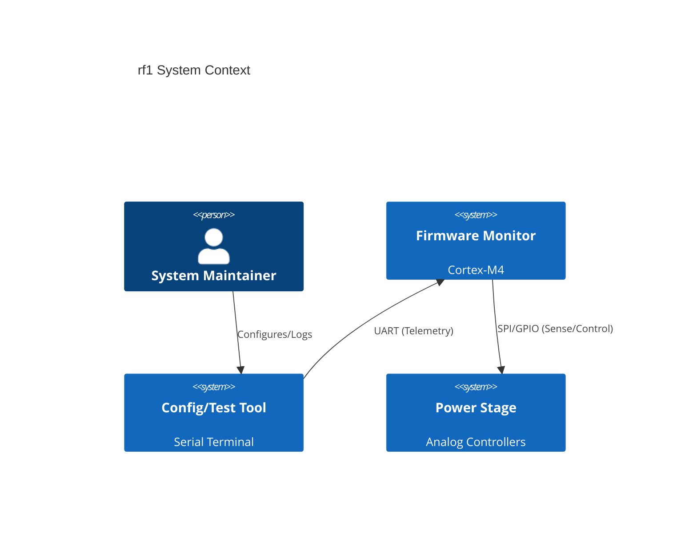
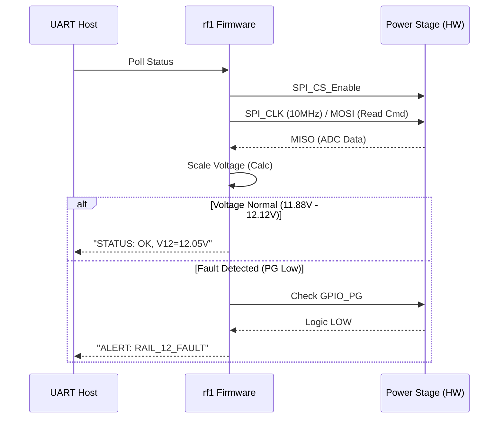

# Software Requirements Specification (SRS)
**Project:** rf1
**Version:** 1.0
**Date:** 2026-03-23
**Status:** DRAFT

---

# 1. Introduction

## 1.1 Purpose
This Software Requirements Specification (SRS) describes the software and firmware requirements for the **rf1** Embedded Monitor and Control System. The purpose of this document is to define the software architecture, external interfaces, functional requirements, and verification criteria for the microcontroller (MCU) responsible for monitoring the multi-rail DC-DC converter hardware.

While the power conversion is handled by analog/hardware controllers (LT8645S/LM25145), the firmware is responsible for **telemetry acquisition, fault logging, digital management of the Enable interface (if utilized for sequencing), and communication with the host system**.

## 1.2 Scope
The software scope includes:
*   **Firmware Base:** Low-level drivers for MCU peripherals (GPIO, SPI, I2C, ADC, DMA).
*   **Monitoring Loop:** Periodic polling of voltage, current, and temperature sensors via the SPI interface defined in the GLR.
*   **Protection Logic:** Software-based debouncing and logging of hardware fault signals (UVLO, OCP).
*   **Communication:** Providing a status interface (UART/USB-CDC) to the host system for debugging and health monitoring.

**Exclusions:** The software does **not** implement closed-loop PWM control for the buck converters, as this is handled autonomously by the hardware controllers (LT8645S, LM25145) to ensure >90% efficiency and fast transient response.

## 1.3 Definitions, Acronyms, and Abbreviations

| Term | Definition |
| :--- | :--- |
| **ADC** | Analog-to-Digital Converter: Used for reading analog voltage/current sensors. |
| **DMA** | Direct Memory Access: Used for transferring ADC data without CPU intervention. |
| **FSM** | Finite State Machine: Logic controlling the system operational modes (Init, Run, Fault). |
| **GLR** | Glue Logic Requirements: Specification defining I/O levels and timing. |
| **HAL** | Hardware Abstraction Layer: Low-level drivers for MCU peripherals. |
| **HRS** | Hardware Requirements Specification. |
| **ISR** | Interrupt Service Routine: Handlers for asynchronous hardware events. |
| **MISO/MOSI** | Master-In-Slave-Out / Master-Out-Slave-In (SPI signals). |
| **OCP** | Over-Current Protection. |
| **PG** | Power Good. |
| **RTD** | Real-Time Data: Live telemetry stream. |
| **SPI** | Serial Peripheral Interface. |
| **TIVA** | Texas Instruments TM4C (example MCU target) or generic ARM Cortex-M4. |
| **UART** | Universal Asynchronous Receiver-Transmitter. |
| **UVLO** | Under-Voltage Lockout. |

## 1.4 References
1.  **IEEE 29148-2018:** Systems and software engineering — Life cycle processes — Requirements engineering.
2.  **rf1 Hardware Requirements Specification (P2):** Datasheet constraints for 48V->12V/5V/3.3V rails.
3.  **rf1 Glue Logic Requirements (P6):** I/O timing and voltage level definitions.
4.  **Cortex-M4 Programming Manual:** ARMv7E-M architecture reference.

## 1.5 Overview
The remainder of this document is organized as follows:
*   **Section 2** describes the system architecture, context, and user characteristics.
*   **Section 3** details the specific software requirements, including C-struct mappings for hardware registers, API definitions, and performance constraints.
*   **Section 4** outlines the verification strategy.
*   **Section 5** provides the traceability matrix mapping software requirements to hardware sources.

---

# 2. Overall Description

## 2.1 Product Perspective
The rf1 software resides on an embedded microcontroller (MCU) situated on the power supply board. It acts as a "Guardian" and "Reporter". It does not control the switching loop directly but monitors the health of the hardware controllers and the load conditions.



## 2.2 Product Functions
1.  **Telemetry:** Read Vin, Vout (12V, 5V, 3.3V), Iout, and Temperature.
2.  **Fault Detection:** Detect UVLO (Input < 36V) and OCP (Latch) signals via GPIO.
3.  **Communication:** Transmit status packets to Host via UART.
4.  **Housekeeping:** Manage internal watchdog timers and LED status indicators.

## 2.3 User Characteristics
*   **Field Engineer:** Connects via UART to diagnose rail voltages. Requires clear text or structured binary logging.
*   **Host System:** An automated test harness (ATE) that may parse UART logs to validate pass/fail criteria.

## 2.4 Constraints
1.  **Electrical:** The MCU operates at 3.3V logic levels. Input signals from the 48V domain must be level-shifted (per GLR P6).
2.  **Timing:** Sensor polling via SPI must not exceed 10 MHz (per GLR P6).
3.  **Environment:** Software must account for industrial temperature ranges (-40°C to +85°C) affecting clock drift and sensor accuracy.

## 2.5 Assumptions and Dependencies
1.  **Hardware Independence:** The buck controllers are assumed to regulate voltage without software intervention.
2.  **Sensor Availability:** It is assumed the hardware design includes sense resistors and amplifier circuits scaling 0-10A to 0-3.3V for the ADC.

---

# 3. Specific Requirements

## 3.1 External Interface Requirements

### 3.1.1 Hardware Interfaces
The firmware shall interface with the hardware memory map derived from the GLR and HRS.

**SPI Sensor Interface (Glue Logic Map)**
The telemetry sensor is assumed to be an ADC (e.g., TI ADS7042 or similar SPI ADC) reporting rail data.

| Register Offset | Bit Field | Description | Type |
|-----------------|-----------|-------------|------|
| `0x00` | `[15:0]` | ADC Conversion Result (Raw) | Ro |

**C-Struct Definition (Memory Map)**
```c
/**
 * @brief  Hardware Register Map for SPI Telemetry Sensor
 * @note   Maps to SPI Interface defined in GLR P6
 */
typedef struct __attribute__((packed)) {
    volatile uint16_t ADC_RAW_DATA;  /* Offset 0x00: Raw 12-bit Value */
    uint8_t         RESERVED[2];     /* Padding to align 32-bit access if needed */
} SensorRegisters_t;

/* Base address assigned to SPI Device 0 */
#define SENSOR_BASE_ADDR  (0x40000000UL) 
```

**GPIO Mapping (Discrete IO)**
| Pin Name | Direction | Active State | Function |
|----------|-----------|--------------|----------|
| `GPIO_UVLO_FAULT` | Input | HIGH | Detect Input < 36V (Mapped from HW Comparator) |
| `GPIO_12V_PG` | Input | HIGH | 12V Power Good Status |
| `GPIO_5V_PG` | Input | HIGH | 5V Power Good Status |
| `GPIO_SYS_EN` | Output | HIGH | Main System Enable (Soft Start Control) |

### 3.1.2 Software Interfaces

**Driver API Signatures**

```c
/* --- HAL Layer --- */

/**
 * @brief  Initialize the SPI peripheral for Sensor communication.
 * @param  clk_hz: Clock speed in Hz (Max 10MHz per GLR).
 * @retval 0 on success, -1 on error.
 */
int32_t HAL_SPI_Init(uint32_t clk_hz);

/**
 * @brief  Read raw data from the SPI ADC.
 * @param  reg_addr: Register address (e.g., 0x00).
 * @param  data: Pointer to store 16-bit result.
 * @retval 0 on success, -1 on timeout.
 */
int32_t HAL_SPI_Read(uint8_t reg_addr, uint16_t* data);

/**
 * @brief  Initialize ADC for internal MCU diagnostics (Vref, Temp).
 */
void HAL_ADC_Init(void);

/* --- Application Layer --- */

/**
 * @brief  Initialize the rf1 Monitor Firmware.
 * @note   Configures GPIO, UART, SPI, and Checksums.
 */
void RF1_Init(void);

/**
 * @brief  Main State Machine Loop.
 * @note   Handles periodic polling and fault checking.
 */
void RF1_Task(void);

/**
 * @brief  Process telemetry data and apply scaling factors.
 * @param  raw: 16-bit raw ADC value.
 * @param  rail_id: Enum for 12V, 5V, or 3.3V rail.
 * @return Scaled voltage in millivolts (mV).
 */
uint16_t RF1_ScaleVoltage(uint16_t raw, RailId_t rail_id);

/**
 * @brief  UART Transmission of Status Packet.
 * @param  packet: Pointer to structured data buffer.
 */
void RF1_TransmitStatus(StatusPacket_t* packet);
```

### 3.1.3 Communication Interfaces
*   **Protocol:** UART (Universal Asynchronous Receiver-Transmitter).
*   **Baud Rate:** 115200 bps (Standard), 8N1.
*   **Format:** ASCII Text (Human readable) or Binary (efficiency). Assumed ASCII for initial requirement.
    *   Example: `STATUS: VIN=48.1V, V12=12.05V, I12=2.1A, OK`

## 3.2 Functional Requirements

### 3.2.1 Initialization
**REQ-SW-001:** The firmware shall initialize all GPIO peripherals within **100ms** of power-up.
*   *Trace:* REQ-HW-001 (Input Range), REQ-HW-009 (UVLO).

**REQ-SW-002:** The firmware shall configure the SPI interface to a maximum clock speed of **10 MHz**.
*   *Trace:* GLR P6 (Timing Constraints).

### 3.2.2 Voltage Monitoring
**REQ-SW-003:** The firmware shall poll the 12V rail voltage sensor via SPI at a rate of **10 Hz** (once every 100ms).
*   *Trace:* REQ-HW-002 (12V Output Rail).

**REQ-SW-004:** The firmware shall apply a scaling factor to convert the raw 16-bit SPI ADC value to engineering units (millivolts) with an accuracy of **±1%**.
*   *Trace:* REQ-HW-002 (Regulation).

**REQ-SW-005:** The firmware shall monitor the `GPIO_UVLO_FAULT` pin. If the pin is asserted HIGH, the firmware shall set the System Status to **FAULT**.
*   *Trace:* REQ-HW-009 (UVLO).

### 3.2.3 Protection Logic
**REQ-SW-006:** Upon detecting a Latch-Off fault (OCP) via the loss of the Power Good signal (`GPIO_12V_PG` = LOW), the firmware shall halt normal transmission and transmit a specific "**FATAL_OCP**" error string via UART.
*   *Trace:* REQ-HW-008 (Overcurrent Protection).

**REQ-SW-007:** The firmware shall implement a debounce timer of **5ms** on all fault input pins to prevent noise-induced triggering.
*   *Trace:* Derived Design Constraint.

### 3.2.4 Communication
**REQ-SW-008:** The firmware shall transmit a status string containing Vin, Vout, and Temperature every **1 second** (1 Hz).
*   *Trace:* Derived Product Function.

## 3.3 Performance Requirements

| Requirement ID | Metric | Value | Condition |
|----------------|--------|-------|-----------|
| **PERF-001** | SPI Transaction Speed | < 20 µs | 10 MHz CLK, 16-bit transfer |
| **PERF-002** | Main Loop Jitter | < 1 ms | RTOS or Super-loop context |
| **PERF-003** | Boot Time | < 500 ms | Until first valid UART TX |

## 3.4 Design Constraints
1.  **Memory:** Code size must fit within 64KB Flash; Data usage within 8KB RAM (Typical Cortex-M4 limits).
2.  **Math:** Floating point operations should be minimized; fixed-point arithmetic (e.g., millivolts) is preferred for voltage scaling to save CPU cycles.

## 3.5 Software System Attributes

### 3.5.1 Reliability
The firmware shall utilize a Watchdog Timer (WDT) with a timeout of **100 ms**. The WDT must be refreshed (kicked) inside the main loop. If the loop hangs, the system shall reset and attempt to re-initialize.

### 3.5.2 Availability
Mean Time Between Failures (MTBF) for the software component (ignoring HW faults) shall be > **10,000 hours**.

### 3.5.3 Security
No specific encryption required for this isolated project, but the UART parser shall perform bounds checking on received bytes to prevent buffer overflow vulnerabilities.

### 3.5.4 Maintainability
Code shall be segmented into Modules (HAL, Driver, App) to allow updating the telemetry logic without rewriting SPI drivers.

---

# 4. Verification and Validation

## 4.1 Unit Test Requirements
*   **UT-001:** Verify `RF1_ScaleVoltage` function with inputs 0x0000 (expect 0V) and 0xFFFF (expect Max Scale).
*   **UT-002:** Verify SPI driver timing using an oscilloscope to confirm clock frequency does not exceed 10 MHz.

## 4.2 Integration Test Requirements
*   **IT-001:** Connect MCU to a Spice Model of the Sensor. Verify correct read/write transactions.
*   **IT-002:** Inject a logic HIGH on `GPIO_UVLO_FAULT` pin and verify UART outputs "FATAL_UVLO".

## 4.3 System Test Requirements
*   **ST-001:** Load the 12V rail to 10A. Verify UART logs show **12.00V ± 0.12V** (meeting ±1% regulation).
    *   *Validation of REQ-HW-002 & REQ-SW-004.*

## 4.4 Key Interaction Sequence (Mermaid)


---

# 5. Traceability Matrix

| Software ID | Software Requirement Text | Hardware Traceability |
| :--- | :--- | :--- |
| **REQ-SW-001** | Init GPIOs within 100ms | REQ-HW-001 (Input Range) |
| **REQ-SW-002** | Config SPI <= 10 MHz | GLR P6 (SPI_CLK) |
| **REQ-SW-003** | Poll 12V Rail @ 10Hz | REQ-HW-002 (12V Rail) |
| **REQ-SW-004** | Scale ADC with 1% Acc | REQ-HW-002 (Regulation) |
| **REQ-SW-005** | Monitor UVLO Fault Pin | REQ-HW-009 (UVLO) |
| **REQ-SW-006** | Detect Latch-off OCP | REQ-HW-008 (Overcurrent) |
| **REQ-SW-007** | 5ms Fault Debounce | Derived Design Constraint |
| **REQ-SW-008** | TX Status @ 1Hz | General Functional Req |

---

# 6. Appendices

## A. Error Codes
| Error ID | Name | Description |
|----------|------|-------------|
| `ERR_NONE` | 0x00 | Operation Successful |
| `ERR_SPI_TIMEOUT` | 0x01 | Sensor did not respond within 20us |
| `ERR_UVLO_TRIP` | 0x10 | Input Voltage < 36V detected |
| `ERR_OCP_12V` | 0x11 | 12V Rail Current Limit Tripped |
| `ERR_OCP_5V` | 0x12 | 5V Rail Current Limit Tripped |

## B. Scaling Calculation (12V Rail)
*   **Sensor:** 12-bit Differential ADC.
*   **Reference:** 2.048V Internal Ref.
*   **Input Range:** ±15V scaled to ±2.048V (Gain = 1/7.5 approx).
*   **Formula:** `V_mV = (RawADC * 2048mV / 4096) * ScalingFactor`