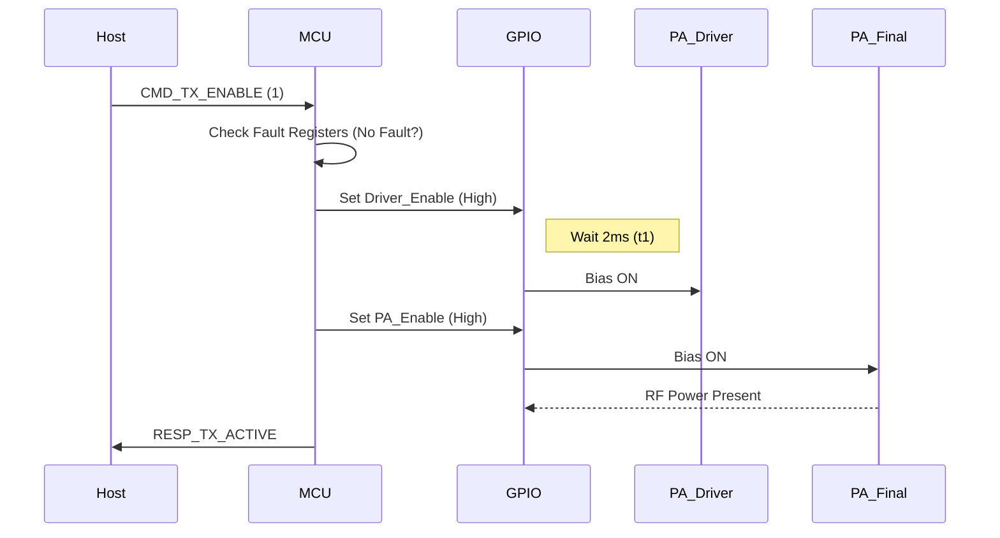

```markdown
# Software Requirements Specification (SRS) for rf4 Control System

**Project:** rf4 High-Power RF Amplifier Firmware  
**Version:** 1.0  
**Date:** 2026-03-24  
**Status:** DRAFT  
**Compliance:** IEEE 830 / IEEE 29148:2018

---

## 1. Introduction

### 1.1 Purpose
This document specifies the software and firmware requirements for the **rf4** High-Power RF Amplifier control system. It defines the behavior of the embedded controller responsible for bias sequencing, thermal monitoring, protection logic, and digital communication interfaces. The SRS serves as the baseline for software design, implementation, and verification.

### 1.2 Scope
The software in scope includes the Embedded Control Unit (ECU) firmware, peripheral drivers (GPIO, ADC, SPI/I2C), and the communication protocol stack for the system host. The software is responsible for the safe operation of the RF chain, ensuring that the High Power Amplifier (HPA) is enabled only when thermal and electrical conditions are within safe operating limits.

**Exclusions:**
*   RF signal processing algorithms (modulation/demodulation).
*   PC-side host application software (beyond protocol definition).
*   Bootloader implementation details (unless critical for safety).

### 1.3 Definitions, Acronyms, and Abbreviations

| Term | Definition |
| :--- | :--- |
| **API** | Application Programming Interface |
|**Duty Cycle** | Ratio of pulse width to period for the RF signal (relevant for thermal averaging). |
| **ECU** | Embedded Control Unit (Microcontroller). |
| **FAULT** | A latched error condition requiring user intervention to reset. |
| **GLR** | Glue Logic Requirements. |
| **HPA** | High Power Amplifier (Final Stage). |
| **LDO** | Low Dropout Regulator. |
| **MMIC** | Monolithic Microwave Integrated Circuit (Driver Stage). |
| **NTC** | Negative Temperature Coefficient Thermistor. |
| **PAE** | Power Added Efficiency. |
| **PWM** | Pulse Width Modulation. |
| **TTL** | Transistor-Transistor Logic. |

### 1.4 References
*   IEEE Std 830-1998: IEEE Recommended Practice for Software Requirements Specifications.
*   IEEE Std 29148-2018: Systems and software engineering — Life cycle processes — Requirements engineering.
*   **rf4 Hardware Requirements Specification (P2)**, Rev DRAFT.
*   **rf4 Glue Logic Requirements (GLR - P6)**, Rev 1.0.

### 1.5 Overview
Section 2 provides a high-level description of the system architecture and interfaces. Section 3 details the specific software requirements, mapped to hardware IDs. Section 4 outlines verification methods, and Section 5 provides the traceability matrix.

---

## 2. Overall Description

### 2.1 Product Perspective
The rf4 software is an embedded real-time control system executing on a 32-bit ARM Cortex-M microcontroller (e.g., STM32G4 series). The system does not operate standalone; it acts as a safety controller for the analog RF hardware.

### 2.2 Product Functions
1.  **Sequencing:** Control the timing of Driver and PA bias voltages to prevent "pop" noise or current surge.
2.  **Protection:** Monitor input voltage, current, and temperature. Disable RF output immediately if limits are exceeded.
3.  **Telemetry:** Report status (Temp, V, I, Faults) to the host system via digital interface.
4.  **Control:** Respond to TX Enable commands from the host.

### 2.3 User Characteristics
*   **System Integrator:** Configures the device via host commands (UART/SPI).
*   **Operator:** Monitors LED indicators (Power/TX/Fault) on the hardware.
*   **Maintenance:** Uses the interface to read diagnostic logs.

### 2.4 Constraints
*   **Real-Time Latency:** Fault detection must occur within **100 µs** of over-current/over-thermal event to protect GaN devices.
*   **Memory:** Firmware must fit within 256KB Flash, 64KB SRAM.
*   **Power:** The MCU operates on a derived 3.3V rail from the main 12V input.

### 2.5 Assumptions and Dependencies
*   The host system provides a valid 3.3V logic level for the TX_Enable signal if hardware override is used.
*   The +12V DC input can be disconnected; the firmware must handle brownout conditions gracefully.

---

## 3. Specific Requirements

### 3.1 External Interface Requirements

#### 3.1.1 Hardware Interfaces (HRS/GLR Mapping)
The firmware interacts with hardware via Memory Mapped I/O (MMIO). The following struct definitions map the hardware registers defined in the GLR to the software abstraction.

```c
/**
 * @brief rf4 Hardware Register Map Definition
 * Base Address: 0x40000000 (AHB1 Peripheral)
 */
typedef struct {
    __IO uint32_t CTRL;      /* 0x00: Control Register */
    __IO uint32_t STATUS;    /* 0x04: Status Register (Read Only) */
    __IO uint32_t ADC_VAL;   /* 0x08: ADC Data Register */
    __IO uint32_t FAULT_MSK; /* 0x0C: Fault Mask Register */
    __IO uint32_t RNG_CTRL;  /* 0x10: Regulator Enable GPIOs */
} rf4_hw_regs_t;

#define RF4_BASE   ((rf4_hw_regs_t *) 0x40000000)

/* Control Register Bit Fields */
#define RF4_CTRL_TX_EN    (1 << 0)  /* TX Enable Pin */
#define RF4_CTRL_RESET    (1 << 1)  /* System Reset */

/* Status Register Bit Fields (Mapped to REQ-HW-017) */
#define RF4_STAT_OT_FAULT (1 << 0)  /* Overtemp Fault (NTC) */
#define RF4_STAT_OC_FAULT (1 << 1)  /* Overcurrent Fault */
#define RF4_STAT_UV_FAULT (1 << 2)  /* Undervoltage Fault (<10.8V) */
```

#### 3.1.2 Software Interfaces
The firmware exposes the following Driver API to the application layer.

```c
/* Driver API Prototypes */

/**
 * @brief Initialize the rf4 control logic and GPIOs.
 * @return 0 on success, -1 on HAL failure.
 */
int32_t RF4_Driver_Init(void);

/**
 * @brief Enable or Disable the RF Chain.
 * @param enable 1 to transmit, 0 to shutdown.
 */
void RF4_Set_TX_State(uint8_t enable);

/**
 * @brief Read current system status.
 * @param status Pointer to store status register value.
 */
void RF4_Get_Status(uint32_t* status);

/**
 * @brief Read temperature from NTC sensor.
 * @return Temperature in Celsius (int16_t).
 */
int16_t RF4_Get_Temperature(void);

/**
 * @brief Handle fault conditions. Called by ISR.
 */
void RF4_Fault_Handler(void);
```

#### 3.1.3 Communication Interfaces
The system communicates via a UART interface to a Host PC.
*   **Baud Rate:** 115200
*   **Data Bits:** 8
*   **Parity:** None
*   **Stop Bits:** 1
*   **Protocol:** Binary packet structure.

```c
/* Packet Definition for Host Comms */
typedef struct __attribute__((packed)) {
    uint8_t start_byte;     /* 0xAA */
    uint8_t msg_id;         /* CMD or TELEM */
    uint8_t length;
    uint8_t data[16];       /* Payload */
    uint16_t crc;           /* CRC16-CCITT */
} rf4_packet_t;
```

### 3.2 Functional Requirements

| ID | Title | Description | Traceability (HRS/GLR) |
|:---|:---|:---|:---|
| **REQ-SW-001** | **Initialization Sequence** | Upon power-on, the MCU shall hold the PA in RESET state for a minimum of **10 ms** before enabling bias voltages. | REQ-HW-007, GLR Timing |
| **REQ-SW-002** | **Bias Sequencing** | The firmware shall enable the Driver Stage (MMIC) bias **t1** ms before the Final Stage (PA) bias, where **2 ms ≤ t1 ≤ 5 ms**. | REQ-HW-003, REQ-HW-010 |
| **REQ-SW-003** | **Thermal Monitoring Loop** | The firmware shall sample the NTC thermistor via ADC at **10 Hz**. | REQ-HW-010, GLR ADC |
| **REQ-SW-004** | **Over-Temperature Protection** | If the reported temperature exceeds **+90°C**, the firmware shall immediately clear `RF4_CTRL_TX_EN` and set the `RF4_STAT_OT_FAULT` latch. | REQ-HW-010, Safety |
| **REQ-SW-005** | **TX Enable Response** | When a valid TX Enable command is received, the RF output must be active within **1 ms** (assuming no fault). | REQ-HW-010 |
| **REQ-SW-006** | **Command Handling** | The firmware shall validate the CRC of incoming packets. If invalid, the packet is discarded, and an error counter is incremented. | GLR Comms |
| **REQ-SW-007** | **Watchdog Timer** | The firmware shall service an Independent Watchdog (IWDG) every **10 ms**. Failure to kick the watchdog resets the MCU and disables RF outputs. | REQ-HW-017 (Stability) |

### 3.3 Performance Requirements
*   **ADC Sampling Rate:** The SPI_CLK for the temperature sensor shall not exceed **10 MHz** (per GLR).
*   **Latency:** The time from an Over-Current fault assertion to the PA Enable pin going low must be **< 50 µs**.
*   **Telemetry Update Rate:** Status messages sent to host shall not exceed 10 Hz to prevent bus saturation.

### 3.4 Design Constraints
*   **Compiler:** GCC ARM Embedded (v10+).
*   **Coding Standard:** MISRA C:2012 (Compliance level required).
*   **RTOS:** FreeRTOS (v10 or higher) to manage the telemetry task and control loop prioritization.

### 3.5 Software System Attributes

#### 3.5.1 Reliability
The software must detect latch-up conditions or hardware faults and assert a hardware reset if software recovery fails three times.

#### 3.5.2 Availability
The RF4 system must be operational (ready to transmit) within **100 ms** of +12V power application.

#### 3.5.3 Security
Write access to the `FAULT_MSK` register is restricted. Commands attempting to unmask critical safety faults (Overtemp) are ignored.

#### 3.5.4 Maintainability
All error codes are logged to a non-volatile memory register (Flash/EEPROM) for post-mortem analysis via JTAG/SWD.

---

## 4. Verification and Validation

### 4.1 Unit Test Requirements
*   **Test-001:** Verify `RF4_Driver_Init` sets all GPIOs to safe state (Low) using Hardware-In-Loop (HIL) simulation.
*   **Test-002:** Verify `RF4_Get_Temperature` returns correct Celsius values for a lookup table of ADC counts.

### 4.2 Integration Test Requirements
*   **Test-101:** Connect MCU to real rf4 PA module. Verify that enabling TX results in **+40 dBm** output measured at the SMA port (aligns with REQ-HW-001).
*   **Test-102:** Inject a logic '1' on the NTC line (simulating max temp) and verify RF output cuts within **50 µs**.

### 4.3 System Test Requirements
*   **Test-201:** Thermal Runaway Test. Operate PA at max power into mismatched load (VSWR 3:1) until thermal shutdown. Verify unit recovers after cooling without physical damage.

---

## 5. Traceability Matrix

| Software ID | Requirement Text | Hardware ID (Trace) |
| :--- | :--- | :--- |
| **REQ-SW-001** | Init Sequence (10ms hold) | REQ-HW-007 |
| **REQ-SW-002** | Bias Sequencing (Driver then PA) | REQ-HW-003, REQ-HW-010 |
| **REQ-SW-003** | Temp Sampling (10 Hz) | REQ-HW-010, GLR-Sensor |
| **REQ-SW-004** | Overtemp Shutdown (>90°C) | REQ-HW-010 |
| **REQ-SW-005** | TX Enable Latency (<1ms) | REQ-HW-010 |
| **REQ-SW-006** | UART CRC Validation | GLR-SPI (Comms) |
| **REQ-SW-007** | Watchdog / Stability | REQ-HW-017 |

---

## 6. Appendices

### Appendix A: Sequence Diagram - TX Enable Flow


### Appendix B: Error Codes

| Code | Name | Description |
|:---|:---|:---|
| **0x01** | `ERR_OT` | Over-Temperature Shutdown triggered. |
| **0x02** | `ERR_OC` | Over-Current detected. |
| **0x03** | `ERR_CRC` | Communication CRC Mismatch. |
| **0x04** | `ERR_SEQ` | Bias Sequencing Violation (Driver failed to enable). |

### Appendix C: GLR to Pin Mapping (Software View)
*   **SPI_CLK** (PB3) -> AF0 (SPI1)
*   **SPI_MISO** (PB4) -> AF0 (SPI1)
*   **TX_Enable** (PA8) -> GPIO_Output (Push-Pull)
*   **NTC_Sense** (PA0) -> ADC1_IN0
```