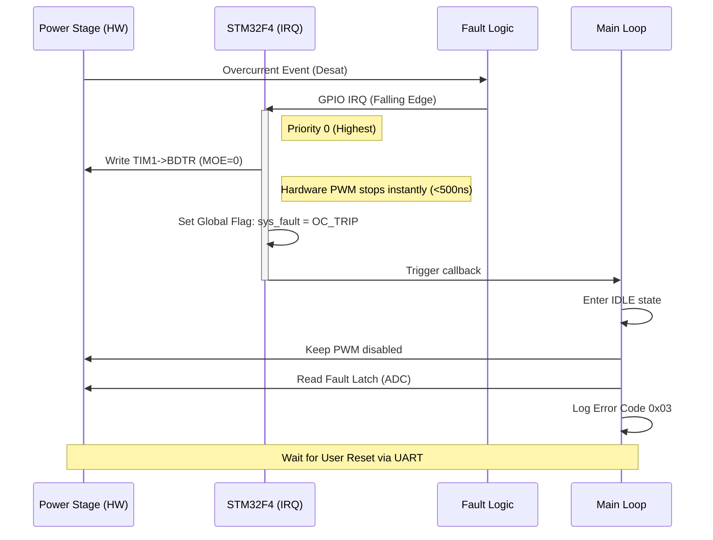

# SOFTWARE REQUIREMENTS SPECIFICATION (SRS)

**Project:** rf44 10kW BLDC Controller
**Version:** 1.0
**Date:** 2026-03-27
**Status:** Preliminary
**Standard:** IEEE 830-1998 / IEEE 29148:2018

---

# 1. Introduction

## 1.1 Purpose
This Software Requirements Specification (SRS) describes the software requirements for the **rf44** embedded motor controller firmware. Its purpose is to define the functional behavior, performance constraints, and interface protocols required to control a 10kW 3-phase BLDC motor via Field-Oriented Control (FOC) on an STM32F405RGT6 microcontroller.

## 1.2 Scope
The firmware covers the complete control loop including sensor acquisition, FOC algorithm execution, PWM generation, communication handling, and fault management. The software interacts directly with the hardware defined in the associated Hardware Requirements Specification (HRS) and Glue Logic Requirements (GLR).

## 1.3 Definitions, Acronyms, and Abbreviations

| Term | Definition |
| :--- | :--- |
| **API** | Application Programming Interface |
| **DWT** | Data Watchpoint and Trace Unit (ARM Cortex-M4 cycle counter) |
| **FOC** | Field-Oriented Control |
| **ISR** | Interrupt Service Routine |
| **PL** | Physical Layer (RS-485) |
| **SVPWM** | Space Vector Pulse Width Modulation |
| **Tj** | Junction Temperature |
| **UART** | Universal Asynchronous Receiver-Transmitter |

## 1.4 References
1.  **STMicroelectronics**, RM0090 Reference Manual for STM32F405/415.
2.  **STMicroelectronics**, UM1052 User Manual: STM32F4 DSP and Standard Peripherals Library.
3.  **Project rf44 HRS**, Hardware Requirements Specification (Rev A).
4.  **Project rf44 GLR**, Glue Logic Requirements (Rev A).
5.  **IEC 60730-1**, Annex H (Software validation requirements for motor controls).

## 1.5 Overview
Section 2 provides a high-level description of the system architecture, including the mapping of hardware peripherals to software drivers. Section 3 details specific requirements, categorized by interface, functional, performance, and safety attributes. Section 4 outlines verification methods, and Section 5 provides the traceability matrix mapping software requirements to hardware requirements.

---

# 2. Overall Description

## 2.1 Product Perspective
The **rf44** software is a bare-metal/RTOS-based embedded application running on the STM32F405RGT6. It abstracts the hardware complexity of the 3-phase inverter and analog front-end into a cohesive control system.

## 2.2 Product Functions
1.  **Motor Control:** Execute 20 kHz FOC control loop.
2.  **Communication:** Handle UART/RS-485 commands for setpoints and configuration.
3.  **Safety:** Monitor hardware faults and trigger safe shutdown within 5 µs.
4.  **Diagnostics:** Report real-time telemetry (Voltage, Current, Temp, Speed).

## 2.3 User Characteristics
The primary users are system integrators and test engineers interacting via a serial console (UART/RS-485) at 115200 baud. The secondary "user" is the host MCU sending binary commands.

## 2.4 Constraints
1.  **Compute Budget:** 20 kHz loop frequency (50 µs period). FOC math must complete within 40 µs to leave headroom for ISR overhead.
2.  **Memory:** Total Flash usage must not exceed 80% (to leave room for bootloader). RAM usage must not exceed 70%.
3.  **Latency:** Critical fault response (overcurrent) must trigger hardware shutdown immediately; software acknowledgment must occur within 100 µs.

## 2.5 Assumptions and Dependencies
1.  The external position sensor provides an ABI (Encoder) or SPI (MA) interface.
2.  The DC Bus voltage is stabilized within the 36V–60V range by an external supply.
3.  The system clock is configured to 168 MHz using the external 25 MHz crystal.

---

# 3. Specific Requirements

## 3.1 External Interface Requirements

### 3.1.1 Hardware Interfaces (Map from HRS/GLR registers to software APIs)

The firmware shall abstract the hardware registers defined in the GLR and HRS into the following C-structs and Function Prototypes.

#### A. ADC Interface (Phase Current & Voltage)
*Derived from REQ-HW-004, REQ-HW-007*

**Memory Map Definition:**
```c
/* Analog Front-End Register Map */
typedef struct {
    __IO uint32_t ADC1_INJECT;  /* Phase U Current */
    __IO uint32_t ADC2_INJECT;  /* Phase V Current */
    __IO uint32_t ADC3_INJECT;  /* Phase W Current */
    __IO uint32_t ADC1_REGULAR; /* DC Bus Voltage */
    __IO uint32_t ADC_TEMP;     /* Heatsink Temp (NTC) */
} AFE_Registers_t;

/* Virtual Address mapped via SVD */
#define AFE_BASE 0x40012000 
#define AFE      ((AFE_Registers_t *) AFE_BASE)
```

**Driver API:**
```c
/**
 * @brief Initializes the ADC peripherals for 3-phase simultaneous sampling.
 * @param sampling_freq_hz Desired frequency (typically 20kHz or 40kHz)
 * @return 0 on success, -1 on clock error.
 */
int32_t DRV_ADC_Init(uint32_t sampling_freq_hz);

/**
 * @brief Reads the latest calibrated phase currents.
 * @param I_u Pointer to store Phase U current in Amps.
 * @param I_v Pointer to store Phase V current in Amps.
 * @param I_w Pointer to store Phase W current in Amps.
 * @note I_w is calculated as -(I_u + I_v) if hardware 3rd shunt is noisy.
 */
void DRV_ADC_GetPhaseCurrents(float *I_u, float *I_v, float *I_w);

/**
 * @brief Calibrates the ADC offset (zero current).
 * @pre Inverter PWM must be disabled.
 */
void DRV_ADC_CalibrateOffset(void);
```

#### B. PWM Interface (Gate Drivers)
*Derived from REQ-HW-005*

**Register Map:**
```c
/* Timer 1 Register Map for PWM */
typedef struct {
    __IO uint32_t CR1;   /* Control Register 1 */
    __IO uint32_t ARR;   /* Auto-Reload Register (Period) */
    __IO uint32_t CCR1;  /* Capture/Compare Phase U High */
    __IO uint32_t CCR2;  /* Capture/Compare Phase U Low */
    /* ... CCR3-CCR6 for V and W phases ... */
    __IO uint32_t BDTR;  /* Break & Dead-Time Register */
} PWM_Registers_t;
```

**Driver API:**
```c
/**
 * @brief Set Timer 1 PWM duty cycles for 3 phases.
 * @param duty_a 0.0 to 1.0 float for Phase A
 * @param duty_b 0.0 to 1.0 float for Phase B
 * @param duty_c 0.0 to 1.0 float for Phase C
 */
void DRV_PWM_SetDutyCycle(float duty_a, float duty_b, float duty_c);

/**
 * @brief Enable or disable PWM outputs and release safety brake.
 * @param enable TRUE to start, FALSE to force low-impedance stop.
 */
void DRV_PWM_EnableOutput(bool enable);

/**
 * @brief Configure dead-time insertion.
 * @param ns Dead time in nanoseconds (e.g., 500ns).
 */
void DRV_PWM_SetDeadTime(uint32_t ns);
```

#### C. Gate Drive / Fault Interface
*Derived from REQ-HW-008*

```c
/**
 * @brief Initializes the external interrupt for the FAULT signal.
 * @param callback Function pointer to execute on fault (ISR context).
 */
void DRV_Fault_Init(void (*callback)(void));

/**
 * @brief Checks the status of the Fault latch.
 * @return true if hardware fault is active, false otherwise.
 */
bool DRV_Fault_IsActive(void);
```

### 3.1.2 Software Interfaces

**Internal Application API:**

```c
/* Motor Control Application Layer */

typedef enum {
    MC_STATE_IDLE = 0,
    MC_STATE_CALIBRATION,
    MC_STATE_ALIGNING,
    MC_STATE_CLOSED_LOOP,
    MC_STATE_FAULT
} MC_State_e;

/**
 * @brief Main FOC math loop. To be called every 50us (20kHz).
 * @param v_bus Current DC Bus Voltage in Volts.
 * @param angle_ew Electrical angle in Radians.
 */
void APP_FOC_Execute(float v_bus, float angle_ew);

/**
 * @brief Set Torque setpoint.
 * @param iq_target Target Quadrature current (Amps).
 */
void APP_FOC_SetTorque(float iq_target);
```

### 3.1.3 Communication Interfaces
*Derived from REQ-HW-006*

The system shall use UART3 mapped to the RS-485 transceiver.

**Protocol Parameters:**
*   **Baud Rate:** 115200 bps
*   **Data Bits:** 8
*   **Parity:** None
*   **Stop Bits:** 1
*   **Flow Control:** None

```c
/**
 * @brief Initialize UART for RS-485 half-duplex.
 */
void COMM_Init(void);

/**
 * @brief Process pending RX data.
 */
void COMM_Task(void);
```

---

## 3.2 Functional Requirements

### REQ-SW-001: System Initialization
**Description:** Upon power-on or reset, the firmware shall initialize all GPIO, clocks, and peripherals before enabling the PWM stage.
**Traceability:** REQ-HW-005 (Power Stage)
**Priority:** High
**Verification:** Unit test checking register states.

### REQ-SW-002: ADC Synchronization
**Description:** The firmware shall trigger ADC conversion of Phase U, V, and W currents synchronized with the PWM timer in the center of the PWM period (center-aligned).
**Rationale:** Ensures current sampling occurs when switching noise is minimal.
**Traceability:** REQ-HW-004 (Current Sensing)
**Value:** Maximum sampling jitter ±100 ns.

### REQ-SW-003: FOC Execution Rate
**Description:** The Field-Oriented Control (Clarke/Park transforms, PID, SVPWM) shall execute at a deterministic frequency of 20 kHz.
**Traceability:** REQ-HW-002 (FOC), REQ-HW-005 (Gate Drive Freq)
**Priority:** Critical
**Verification:** Logic analyzer toggle pin in ISR loop.

### REQ-SW-004: Position Sensor Decoding
**Description:** The firmware shall decode the external position sensor (Encoder/Hall) and calculate the electrical angle with a resolution of at least 12 bits.
**Traceability:** REQ-HW-003 (Position Sensor)
**Input:** Quadrature Encoder (ABI) or SPI (MA12040).

### REQ-SW-005: RS-485 Command Processing
**Description:** The firmware shall implement a binary protocol supporting "Set Torque", "Set Velocity", "Get Telemetry", and "Reset Fault".
**Traceability:** REQ-HW-006 (UART/RS-485)
**Latency:** Acknowledgment shall be sent within 5 ms of command reception.

### REQ-SW-006: Overcurrent Fault Reaction
**Description:** Upon receiving the hardware FAULT signal (DRV_Fault_IsActive == true), the firmware shall immediately disable PWM outputs and latch the error code.
**Traceability:** REQ-HW-008 (Overcurrent Protection)
**Response Time:** Interrupt latency < 1 µs.

### REQ-SW-007: Thermal Protection
**Description:** The firmware shall monitor the heatsink temperature sensor (ADC). If T > 100°C, torque shall be derated by 50%. If T > 110°C, PWM shall be disabled.
**Traceability:** REQ-HW-001 (Thermal constraints)

### REQ-SW-008: Bootstrapping (Pre-charge)
**Description:** Before switching to high-frequency PWM, the firmware shall execute a "Charge Bootstrap" sequence where low-side MOSFETs are toggled to charge the bootstrap capacitors.
**Traceability:** REQ-HW-005 (Bootstrap Gate Drive)
**Duration:** 50 ms sequence duration.

---

## 3.3 Performance Requirements

| ID | Metric | Requirement | Condition |
|---|------|---|---|
| **PERF-001** | Control Loop Jitter | < 1 µs | Max load |
| **PERF-002** | Current Sense Bandwidth | > 2 kHz | -3dB point |
| **PERF-003** | Communication Throughput | > 100 Hz Telemetry update rate | Full JSON packet |
| **PERF-004** | Startup Time | < 500 ms | Power applied to Motor Idle |

## 3.4 Design Constraints
1.  **Toolchain:** ARM GCC (GNU Tools for STM32) or Keil MDK-ARM v5.
2.  **Standards Compliance:** C99/C11 standard compliance. MISRA C:2012 guidelines recommended.
3.  **Floating Point:** Must use hardware FPU (Single Precision).

## 3.5 Software System Attributes

### 3.5.1 Reliability
The firmware shall implement a Watchdog Timer (IWDG) with a 10 ms timeout. The control loop must kick the watchdog every cycle. Failure to kick implies a deadlock, causing a system reset.

### 3.5.2 Availability
MTBF (Mean Time Between Failures) target > 10,000 hours.

### 3.5.3 Security
1.  UART commands shall implement a basic checksum (CRC-8) to reject corrupted packets.
2.  Write access to Flash memory (parameter storage) shall be protected by a lock sequence.

### 3.5.4 Maintainability
Code shall be modularized (HAL Layer, Driver Layer, App Layer). Doxygen comments shall be generated for all public APIs.

### 3.5.5 Portability
Hardware Abstraction Layer (HAL) shall isolate STM32 specific code from the generic FOC algorithm to allow porting to other MCUs (e.g., TI C2000).

---

# 4. Verification and Validation

## 4.1 Unit Test Requirements
*   **Test Case UT-001:** Verify `DRV_ADC_GetPhaseCurrents` returns correct float values for known fixed inputs using a signal generator.
*   **Test Case UT-002:** Verify `SVPWM_Calculate` outputs duty cycles that sum to the expected vector length.

## 4.2 Integration Test Requirements
*   **IT-001:** Inject a square wave signal into the Encoder input and verify the electrical angle tracks with < 1% phase error.
*   **IT-002:** Connect a resistive load to phases and verify current limits are enforced (REQ-SW-006).

## 4.3 System Test Requirements
*   **ST-001:** Full power run: Drive a 10kW dynamometer at 48V bus for 1 hour. Verify MCU temperature and MOSFET Tj remain within limits.

---

# 5. Traceability Matrix

| Software ID | Software Requirement | Trace to Hardware ID | Description |
| :--- | :--- | :--- | :--- |
| **REQ-SW-001** | System Init | REQ-HW-001, REQ-HW-005 | MCU init matching Power Stage constraints. |
| **REQ-SW-002** | ADC Sync | REQ-HW-004 | Shunt amplifier interface. |
| **REQ-SW-003** | FOC Loop | REQ-HW-002 | Math acceleration (FPU). |
| **REQ-SW-004** | Sensor Decode | REQ-HW-003 | Encoder/Hall inputs. |
| **REQ-SW-005** | Comm Protocol | REQ-HW-006 | UART/RS-485 Physical Layer. |
| **REQ-SW-006** | Fault Reaction | REQ-HW-008 | Hardware comparator latch. |
| **REQ-SW-007** | Thermal Monitor | REQ-HW-001 | NTC Thermistor input. |
| **REQ-SW-008** | Bootstrap | REQ-HW-005 | Gate drive capacitor charging. |

---

# 6. Appendices

## Appendix A: Mermaid Sequence Diagram - Fault Handling



## Appendix B: Error Codes Definition

| Code | Name | Description |
| :--- | :--- | :--- |
| **E_OK** | 0x00 | No Error |
| **E_OVERCURRENT** | 0x01 | Phase current > 250A (Hardware trip) |
| **E_OVERVOLTAGE** | 0x02 | DC Bus > 65V |
| **E_UNDERVOLTAGE** | 0x03 | DC Bus < 20V |
| **E_OVERTEMP** | 0x04 | Heatsink > 110°C |
| **E_SENSOR** | 0x05 | No signal from position sensor |
| **E_COMMS** | 0x06 | UART CRC error / Timeout |

## Appendix C: FOC Math Constraints (Derived from HW)

Based on STM32F405 @ 168MHz:
*   **Inverse Park Transform:** ~200 ns (Using FPU)
*   **SVPWM Calculation:** ~500 ns (Using FPU)
*   **PI Controller Update:** ~300 ns
*   **Total Math Time:** ~1.0 µs (Leaves 49 µs margin for interrupts)