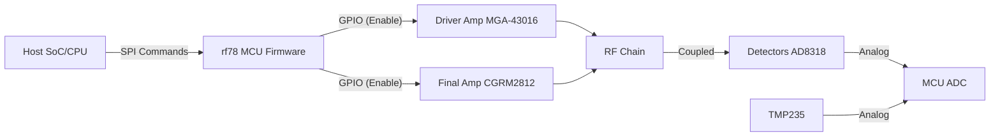

# Software Requirements Specification (SRS) for rf78

**Document Status:** AI-GENERATED
**Version:** 1.0
**Date:** 2026-04-01

---

# 1. Introduction

## 1.1 Purpose
The purpose of this Software Requirements Specification (SRS) is to define the firmware requirements for the **rf78** embedded controller. This document describes the software architecture, interfaces, and functional behaviors required to manage the hardware RF Power Amplifier (PA) module defined in the accompanying Hardware Requirements Specification (HRS).

## 1.2 Scope
The software scope includes the control loop for the rf78 PA module, managing bias sequencing, thermal protection, VSWR foldback, and status reporting via a Serial Peripheral Interface (SPI). The software will run on a bare-metal or lightweight RTOS environment embedded within the host system or a dedicated microcontroller on the rf78 module.

**Key Responsibilities:**
*   **Power Sequencing:** Controlling the enable pins for the Driver (MGA-43016) and Final Stage (CGRM2812).
*   **Protection Logic:** Real-time monitoring of temperature and VSWR; triggering shutdown or foldback if thresholds are exceeded.
*   **Telemetry:** Exposing analog sensor data (Forward Power, Reverse Power, Temperature) to the host via SPI.

## 1.3 Definitions, Acronyms, and Abbreviations

| Term | Definition |
| :--- | :--- |
| **ADC** | Analog-to-Digital Converter. |
| **DAC** | Digital-to-Analog Converter. |
| **EVM** | Error Vector Magnitude. |
| **FA** | Final Amplifier (Power Stage). |
| **HRS** | Hardware Requirements Specification. |
| **IRQ** | Interrupt Request. |
| **MCU** | Microcontroller Unit. |
| **PA** | Power Amplifier. |
| **PAE** | Power-Added Efficiency. |
| **SPI** | Serial Peripheral Interface. |
| **VSWR** | Voltage Standing Wave Ratio. |
| **GLR** | Glue Logic Requirements. |

## 1.4 References
1.  **IEEE 29148-2018:** Systems and software engineering — Life cycle processes — Requirements engineering.
2.  **rf78 HRS (P2):** Hardware Requirements Specification for the rf78 Project.
3.  **rf78 GLR (P6):** Glue Logic Requirements Specification.

## 1.5 Overview
The remainder of this document is organized as follows:
*   **Section 2** describes the overall product perspective, functions, and constraints.
*   **Section 3** details the specific software requirements, including external interfaces, functional requirements (ID: REQ-SW-xxx), and performance attributes.
*   **Section 4** outlines verification and validation methods.
*   **Section 5** provides the traceability matrix mapping software to hardware requirements.

---

# 2. Overall Description

## 2.1 Product Perspective
The rf78 firmware acts as the "Safety Controller" for the RF PA module. It sits between the Host System (Bluetooth SoC/Baseband) and the RF Power Hardware. The MCU monitors the physical health of the PA (Temperature, VSWR) and regulates the RF biasing to ensure the hardware operates within the Safe Operating Area (SOA).



## 2.2 Product Functions
1.  **Initialization:** Configures GPIOs, ADCs, and SPI interface. Ensures PA is OFF at startup.
2.  **Sequencing:** Enables Driver Stage, waits for settling ($T_{delay}$), then enables Final Stage.
3.  **Monitoring:** Continuously samples Temperature and VSWR sensors.
4.  **Protection:** If Temperature > 105°C or VSWR > Limit, force-disable PA.
5.  **Communication:** Responds to Host queries regarding PA status and health.

## 2.3 User Characteristics
The primary users are系统集成 and test engineers utilizing the SPI interface to integrate the PA module into a larger Bluetooth transmission system.

## 2.4 Constraints
*   **Processor:** Must support 10 MHz SPI (Slave mode) and fast ADC sampling (> 100 kSPS).
*   **Latency:** Protection triggers (IRQ-based) must execute within 10 $\mu$s.
*   **Memory:** Optimized for footprint < 64 KB Flash, < 8 KB RAM.

## 2.5 Assumptions and Dependencies
*   The Host provides a stable 3.3V logic level for SPI.
*   The 28V DC supply is monitored by hardware brown-out detection independent of firmware.
*   A 10 MHz reference clock is available for ADC timing if external ADC is used.

---

# 3. Specific Requirements

## 3.1 External Interface Requirements

### 3.1.1 Hardware Interfaces
The MCU shall interface with the hardware via memory-mapped GPIO and ADC registers.

**Memory Map (Mock Definition for Cortex-M):**
```c
// Base Address 0x40000000 assumed for GPIO
#define GPIO_BASE   0x40020000
#define PA_DRIVER_EN_PIN  (1 << 5)   // PA Driver Enable (Output)
#define PA_FINAL_EN_PIN   (1 << 6)   // PA Final Enable (Output)
#define PA_FAULT_PIN      (1 << 7)   // Status LED/Fault Indicator (Output)

// ADC Base Address 0x40022000
#define ADC_BASE         0x40022000
#define ADC_TEMP_CH      0   // TMP235 Analog Output
#define ADC_FWD_PWR_CH   1   // AD8318 Forward Power
#define ADC_REV_PWR_CH   2   // AD8318 Reverse Power
```

### 3.1.2 Software Interfaces
**Driver API:**
The firmware shall expose the following C-interface for internal use by the state machine:

```c
#include <stdint.h>
#include <stdbool.h>

// Error Codes
typedef enum {
    RF78_OK = 0,
    RF78_ERR_TEMP_HIGH,
    RF78_ERR_VSWR_HIGH,
    RF78_ERR_SEQ_TIMEOUT,
    RF78_ERR_SPI_CRC
} rf78_status_t;

// Hardware Abstraction Layer
void rf78_hal_init(void);
void rf78_hal_set_driver_enable(bool state);
void rf78_hal_set_final_enable(bool state);
uint16_t rf78_hal_read_adc(uint8_t channel);

// Logic Control
rf78_status_t rf78_power_up(void);
rf78_status_t rf78_power_down(void);
void rf78_protection_task(void); // Called in main loop or IRQ
```

### 3.1.3 Communication Interfaces
**SPI Protocol (Host to MCU):**
*   **Mode:** Mode 0 (CPOL=0, CPHA=0).
*   **Frequency:** 10 MHz max.
*   **Frame Format:** 16-bit Command/Response.

**SPI Command Structure:**
| Bits [15:8] | Bits [7:0] |
| :--- | :--- |
| Opcode | Data/Address |

**Opcodes:**
*   `0x01`: READ_STATUS (Returns byte: Bit 0=PA_ON, Bit 1=FAULT_TEMP, Bit 2=FAULT_VSWR)
*   `0x02`: READ_TEMP (Returns 2 bytes: ADC value)
*   `0x03`: READ_FWD_PWR (Returns 2 bytes: ADC value)
*   `0x10`: SET_PA_ENABLE (Data: 0x01=On, 0x00=Off)

## 3.2 Functional Requirements

### REQ-SW-001: Bias Sequencing Control
The software shall control the RF PA bias sequence to prevent power spikes and ensure linear operation.
*   **Rational:** Traces to **REQ-HW-017** (Bias Sequencing).
*   **Description:** Upon receiving the `SET_PA_ENABLE(On)` command, the software shall:
    1.  Assert `PA_DRIVER_EN_PIN` (High).
    2.  Wait for a fixed delay of **5 ms** (allowing MGA-43016 bias to stabilize).
    3.  Assert `PA_FINAL_EN_PIN` (High).
    4.  If shutdown is requested, reverse the order (Final Off, then Driver Off).

### REQ-SW-002: Thermal Monitoring & Shutdown
The software shall continuously monitor the PCB temperature.
*   **Rational:** Traces to **REQ-HW-012** (Thermal Protection).
*   **Description:**
    1.  Sample `ADC_TEMP_CH` every **100 ms**.
    2.  Convert ADC value to Celsius using linear equation: $T(°C) = (ADC_{mV} - 500) / 10$.
    3.  If $T > 105°C$, immediately clear `PA_DRIVER_EN_PIN` and `PA_FINAL_EN_PIN`.
    4.  Set `PA_FAULT_PIN` High.
    5. Latch the fault state. PA shall not restart until $T < 85°C$ AND a manual `SET_PA_ENABLE(On)` command is received (Hysteresis).

### REQ-SW-003: VSWR Foldback Protection
The software shall monitor Forward and Reverse power to calculate VSWR.
*   **Rational:** Traces to **REQ-HW-011** (VSWR Protection).
*   **Description:**
    1.  Read `ADC_FWD_PWR_CH` and `ADC_REV_PWR_CH`.
    2.  Compute VSWR $\rho = |\Gamma|$ based on detector slope (approx -22 mV/dB for AD8318).
    3.  If computed VSWR > **3.0**, trigger immediate shutdown (Set Enable pins Low).
    4.  (Optional) If VSWR > **2.0** but < 3.0, reduce gain by lowering bias voltage (if DAC controlled) or flag warning.

### REQ-SW-004: SPI Slave Communication
The software shall implement a SPI slave interface to accept commands from the host.
*   **Rational:** Enables control by Host SoC.
*   **Description:**
    1.  Initialize SPI Slave at 10MHz.
    2.  On Chip Select (CS) assertion, load response buffer.
    3.  On transaction completion, parse Command Byte.
    4.  Execute command (e.g., Enable PA, Read Telemetry).

```mermaid
sequenceDiagram
    participant Host as Host SoC
    participant MCU as rf78 MCU
    participant HW as RF PA HW

    Host->>MCU: SPI CMD: SET_PA_ENABLE(On)
    MCU->>HW: GPIO: Driver Enable (High)
    Note over MCU,HW: Wait 5ms
    MCU->>HW: GPIO: Final Enable (High)
    MCU-->>Host: SPI Response: ACK
    
    loop Every 100ms
        MCU->>HW: ADC Read Temp
        HW-->>MCU: 25°C
    alt Temp > 105°C
        MCU->>HW: GPIO: Driver Enable (Low)
        MCU->>HW: GPIO: Final Enable (Low)
        MCU-->>Host: SPI Status: FAULT_TEMP
    end
```

## 3.3 Performance Requirements

| ID | Metric | Value | Condition |
| :--- | :--- | :--- | :--- |
| **REQ-SW-101** | Fault Response Time | < 10 $\mu$s | From ADC reading to GPIO output toggling (IRQ context). |
| **REQ-SW-102** | SPI Throughput | 10 MHz max | Clock frequency as per GLR. |
| **REQ-SW-103** | ADC Sampling Rate | > 10 kSPS | To capture burst RF envelopes for VSWR calc. |
| **REQ-SW-104** | Boot Time | < 100 ms | Time from VDD stable to SPI Ready. |

## 3.4 Design Constraints
*   **Compiler:** Must support C99 standard (e.g., GCC ARM Embedded).
*   **Architecture:** 32-bit ARM Cortex-M0 or M3 recommended.
*   **Interrupt Priority:** ADC Timer Interrupt must have higher priority than SPI IRQ.

## 3.5 Software System Attributes

### 3.5.1 Reliability
The software must implement a Watchdog Timer (WDT) with a 10 ms timeout. If the protection task hangs, the WDT must reset the MCU and default all GPIOs to Safe State (OFF).

### 3.5.2 Availability
The firmware must be available 100% of the time during Host operation. No sleep modes are permitted for the MCU while the Host is powered.

### 3.5.3 Security
*   **Write Protection:** The `SET_PA_ENABLE` command should require a valid magic byte (e.g., `0xA5`) to prevent accidental triggering by noise.
*   **Read-Only Telemetry:** Calibration data stored in Flash should be write-protected.

### 3.5.4 Maintainability
Code must be modular, separating the Hardware Abstraction Layer (HAL) from the Logic Control Layer.

### 3.5.5 Portability
The HAL shall use macros for hardware registers to allow porting between different MCU families (e.g., STM32 vs. TI MSP430).

---

# 4. Verification and Validation

## 4.1 Unit Test Requirements
*   **Test Case UT-001:** Verify `rf78_power_up` sequence timing using logic analyzer. Driver Enable must precede Final Enable by $5.0 \pm 0.5$ ms.
*   **Test Case UT-002:** Inject ADC value corresponding to 110°C. Verify GPIO outputs go Low within 10 $\mu$s.

## 4.2 Integration Test Requirements
*   **Test Case IT-001:** Connect Host SPI. Send valid command stream and verify CRC/ACK.
*   **Test Case IT-002:** Integrate with actual RF Hardware. Apply VSWR load (mismatch). Verify Foldback triggers before PA damage.

## 4.3 System Test Requirements
*   **Test Case ST-001:** Full power thermal cycle. Operate PA at 40 dBm in 85°C ambient chamber. Verify Thermal Shutdown triggers accurately.

---

# 5. Traceability Matrix

| Software Req ID | Description | Linked HW Req ID | Verification Method |
| :--- | :--- | :--- | :--- |
| **REQ-SW-001** | Bias Sequencing | REQ-HW-017 | Logic Analyzer |
| **REQ-SW-002** | Thermal Protection | REQ-HW-012 | Thermal Chamber |
| **REQ-SW-003** | VSWR Protection | REQ-HW-011 | VSWR Bridge Test |
| **REQ-SW-004** | SPI Interface | GLR Section 2 (Pin Assign) | SPI Protocol Analyzer |
| **REQ-SW-101** | Fault Response Time | REQ-HW-011, REQ-HW-012 | Oscilloscope |

---

# 6. Appendices

## Appendix A: RF Power Calculation (Algorithm)
```c
// P_dBm = (V_out - Intercept) / Slope
// AD8318: Intercept ~ 1.5V, Slope ~ -22mV/dB at 2.4GHz
float read_rf_power_dBm(uint16_t adc_raw) {
    float v_out = (adc_raw / 4096.0) * 3.3; // Assume 12-bit ADC, 3.3V ref
    float slope = -0.022; // V/dB
    float intercept = 1.5; // V
    return (intercept - v_out) / slope;
}
```

## Appendix B: Pin Mapping Table (C Header)
```c
// rf78_board.h
#define RF78_PIN_DRIVER_EN  5
#define RF78_PIN_FINAL_EN   6
#define RF78_PIN_FAULT_IND  7
```