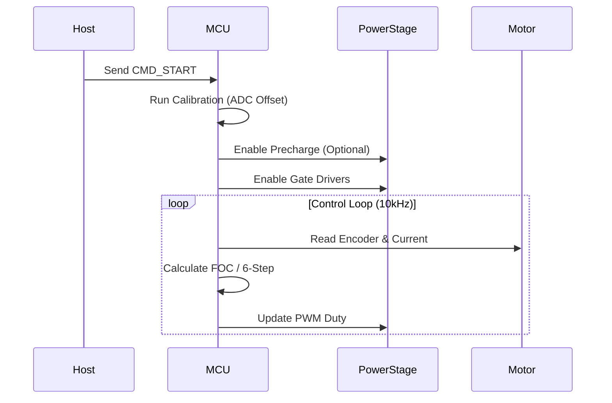
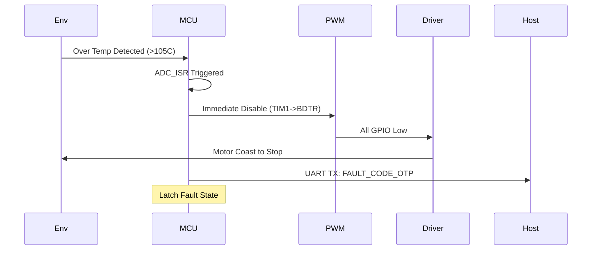

```markdown
# SOFTWARE REQUIREMENTS SPECIFICATION (SRS)
**Project:** rf9 3-Phase BLDC Motor Controller
**Version:** 1.0
**Date:** 2026-03-26
**Status:** DRAFT
**Standard:** IEEE 830-1998 / IEEE 29148:2018

---

# 1. Introduction

## 1.1 Purpose
The purpose of this document is to define the software and firmware requirements for the **rf9 Motor Controller**. This specification serves as the baseline for the design, verification, and validation of the embedded control software running on the STM32F4 microcontroller. It translates the hardware capabilities defined in the HRS (P2) and GLR (P6) into concrete functional and non-functional software requirements.

## 1.2 Scope
The software scope encompasses the embedded firmware responsible for:
*   Real-time control loops for 3-phase BLDC motors (FOC and 6-Step).
*   Hardware abstraction layer (HAL) drivers for the STM32F4 peripheral set.
*   Communication stacks (UART telemetry).
*   Safety and protection logic (Over-current, Over-voltage, Over-temperature).
*   Power management and watchdog services.

This specification excludes the development of the PC-side Graphical User Interface (GUI) but defines the protocol structure required for the GUI to communicate with the rf9.

## 1.3 Definitions, Acronyms, and Abbreviations
| Term | Definition |
| :--- | :--- |
| **BLDC** | Brushless Direct Current Motor. |
| **FOC** | Field-Oriented Control (Vector Control). |
| **QEI** | Quadrature Encoder Interface. |
| **PWM** | Pulse Width Modulation. |
| **ISR** | Interrupt Service Routine. |
| **HAL** | Hardware Abstraction Layer. |
| **UVLO** | Under Voltage Lock Out. |
| **OVLO** | Over Voltage Lock Out. |
| **PFM** | Pulse Frequency Modulation (Fan control). |

## 1.4 References
1.  **rf9 Hardware Requirements Specification (HRS),** Rev DRAFT, P2.
2.  **rf9 Glue Logic Requirements (GLR),** Rev 1.0, P6.
3.  **STM32F4 Reference Manual**, STMicroelectronics, RM0090.
4.  **IEEE 830-1998**, Recommended Practice for Software Requirements Specifications.
5.  **IEEE 29148:2018**, Systems and software engineering — Life cycle processes — Requirements engineering.

## 1.5 Overview
Section 2 provides a high-level description of the system architecture, operating modes, and user characteristics. Section 3 details the specific software requirements, including external interfaces, functional requirements (REQ-SW), and performance constraints. Section 4 outlines the verification and validation matrix.

---

# 2. Overall Description

## 2.1 Product Perspective
The rf9 firmware operates as a closed-loop embedded control system on an STM32F4 MCU. It interfaces directly with hardware peripherals:
*   **Analog Front-End:** 3-Shunt current sensors, DC Bus voltage divider, Thermistors.
*   **Power Stage:** 3-Phase Inverter Bridge (DirectFETs) driven via Isolated Gate Drivers.
*   **Comms:** UART (RS-485/Transceiver level), Quadrature Encoder.

The system is designed to be a "Black Box" motor controller accepting throttle commands and feedback via UART, while managing the high-power physics of the motor.

## 2.2 Product Functions
1.  **Commutation:** Execute 6-Step Trapezoidal or Sinusoidal FOC algorithms based on user selection.
2.  **Torque Control:** Regulate motor current based on throttle input (0-5V) or UART command.
3.  **Protection:** Monitor hardware safety interlocks (OVLO, UVLO, OCP, OTP) and fault the system within 10µs of critical error detection.
4.  **Telemetry:** Stream real-time data (RPM, Bus Voltage, Phase Currents, Temp) to host PC.
5.  **Position Sensing:** Decode QEI signals to determine rotor angle and speed.

## 2.3 User Characteristics
*   **End User:** Industrial machine operator. Interaction limited to throttle input and status LEDs.
*   **Integrator:** Engineer configuring the motor parameters via UART. Requires knowledge of communication protocol.
*   **Test Engineer:** Validates system behavior against specific fault conditions.

## 2.4 Constraints
*   **Processor:** Must use STM32F4xx (Cortex-M4F) with FPU enabled for FOC math.
*   **Latency:** Current control loop (FOC) must execute within 50µs (20kHz PWM).
*   **Memory:** Firmware footprint must fit within 512KB Flash, 128KB SRAM.
*   **Environment:** Must operate reliably in -40°C to +85°C ambient conditions.

## 2.5 Assumptions and Dependencies
*   The hardware design fulfills all voltage ripple and noise requirements defined in HRS P2.
*   The MCU oscillator accuracy is +/- 2%.
*   The user provides a regulated 0-5V signal for throttle input.

---

# 3. Specific Requirements

## 3.1 External Interface Requirements

### 3.1.1 Hardware Interfaces
The firmware shall abstract the physical registers defined in the HRS/GLR into C Structs.

**1. ADC Interface (Current & Voltage Sensing)**
The firmware shall map the internal ADC result registers to physical measurements.
*GLR Mapping:* `ADC1->DR` -> `PhaseCurrent_U_t`

```c
/* C Struct Definition for Analog Inputs */
typedef struct {
    uint16_t raw_u;        // Raw ADC value Phase U
    uint16_t raw_v;        // Raw ADC value Phase V
    uint16_t raw_w;        // Raw ADC value Phase W
    uint16_t raw_vbus;     // Raw DC Bus Voltage
    float    amps_u;       // Scaled Amperes
    float    amps_v;       // Scaled Amperes
    float    amps_w;       // Scaled Amperes
    float    volts_bus;    // Scaled Volts
} ADC_Data_t;

/* Driver Prototype */
void ADC_Init(void);
void ADC_StartConversion(void);
void ADC_UpdateValues(ADC_Data_t* data);
```

**2. Gate Driver Interface (PWM)**
*HW Req Tracing:* REQ-HW-001, REQ-HW-007, REQ-HW-013
The firmware configures the Advanced Timer (TIM1) for Center-Aligned PWM generation.

```c
/* PWM Configuration Struct */
typedef struct {
    uint16_t period;           // Auto-reload register (ARR) value
    uint16_t dead_time_ns;     // Dead-time in nanoseconds
    uint8_t  duty_cycle_A;     // Phase A duty (0-100%)
    uint8_t  duty_cycle_B;     // Phase B duty (0-100%)
    uint8_t  duty_cycle_C;     // Phase C duty (0-100%)
} PWM_Config_t;

/* Driver Prototype */
void PWM_Init(PWM_Config_t* config);
void PWM_SetDuty(uint8_t phase, uint8_t duty);
void PWM_SetDeadTime(uint16_t ns);
```

**3. Quadrature Encoder Interface (QEI)**
*HW Req Tracing:* REQ-HW-003
*GLR Mapping:* `TIM2->CNT` -> `Rotor_Position`

```c
typedef struct {
    int32_t  pulse_count;    // Total pulses
    int32_t  speed_rpm;      // Calculated Speed
    uint16_t angle_deg;      // 0-360 degrees
} Encoder_Data_t;

void ENC_Init(void);
void ENC_Update(Encoder_Data_t* data);
```

### 3.1.2 Software Interfaces
**1. Control Loop API**
Provides the interface between the hardware abstraction layer and the control algorithms (FOC/6-Step).

```c
/* Controller State */
typedef enum {
    STATE_IDLE = 0,
    STATE_CALIBRATION,
    STATE_RUNNING,
    STATE_FAULT,
    STATE_STOPPING
} SystemState_e;

/* Main Control Function - Called by ISR */
void Motor_ControlLoop(void); 
```

**2. UART Communication Protocol**
*HW Req Tracing:* REQ-HW-009
Uses standard Serial Line (8N1). Packet format defined below.

```c
typedef struct {
    uint8_t start_byte;      // 0xAA
    uint8_t msg_id;
    uint8_t length;
    uint8_t data[16];
    uint8_t checksum;        // XOR Sum
} UART_Packet_t;

void UART_Init(uint32_t baud_rate);
void UART_SendPacket(UART_Packet_t* pkt);
bool UART_ReceivePacket(UART_Packet_t* pkt);
```

### 3.1.3 Communication Interfaces
*   **Protocol:** Custom binary protocol over UART.
*   **Baud Rate:** 115200 bps (Default), Configurable down to 9600.
*   **Connection:** 3-Wire (TX, RX, GND).

## 3.2 Functional Requirements

### 3.2.1 Power Management & Initialization
| ID | Requirement | Traceability |
|----|-------------|--------------|
| REQ-SW-001 | The firmware shall initialize the MCU clock tree to 168 MHz using the external 8 MHz crystal within 50ms of power-up. | REQ-HW-001 |
| REQ-SW-002 | The firmware shall configure the Watchdog Timer (IWDG) to reset the system if the main control loop is not executed within 10ms. | REQ-HW-001 |
| REQ-SW-003 | The system shall remain in a **Safe Idle State** (All PWM outputs low, Gate Drive disabled) until a valid "Start Motor" command is received via UART. | REQ-HW-007 |

### 3.2.2 Motor Control (Commutation)
| ID | Requirement | Traceability |
|----|-------------|--------------|
| REQ-SW-004 | The firmware shall implement a Field-Oriented Control (FOC) loop executing at 10 kHz (100 µs period). | REQ-HW-002 |
| REQ-SW-005 | The firmware shall implement a 6-Step Trapezoidal control loop executing at 10 kHz. | REQ-HW-002 |
| REQ-SW-006 | The firmware shall support runtime switching between FOC and 6-Step modes only when the motor speed is zero. | REQ-HW-002 |
| REQ-SW-007 | The firmware shall calculate and apply Space Vector Modulation (SVM) duty cycles based on the Clarke/Park transform results. | REQ-HW-002 |
| REQ-SW-008 | The firmware shall utilize the Quadrature Encoder Interface to determine electrical angle for FOC commutation. | REQ-HW-003 |

### 3.2.3 Sensing & Telemetry
| ID | Requirement | Traceability |
|----|-------------|--------------|
| REQ-SW-009 | The firmware shall sample all three phase currents (U, V, W) synchronously with the PWM center (ADC Trigger). | REQ-HW-004 |
| REQ-SW-010 | The firmware shall perform offset calibration of the current sensors at startup (PWM disabled). | REQ-HW-004 |
| REQ-SW-011 | The firmware shall transmit a telemetry packet containing RPM, Bus Voltage, and Heatsink Temperature via UART at 10 Hz. | REQ-HW-009 |

### 3.2.4 Protection & Safety
| ID | Requirement | Traceability |
|----|-------------|--------------|
| REQ-SW-012 | The firmware shall immediately disable PWM outputs and enter **LATCHED FAULT** state if DC Bus Voltage exceeds 60V. | REQ-HW-011 |
| REQ-SW-013 | The firmware shall immediately disable PWM outputs and enter **LATCHED FAULT** state if DC Bus Voltage drops below 18V (UVLO). | REQ-HW-011 |
| REQ-SW-014 | The firmware shall monitor the Heatsink Thermistor. If temperature exceeds 95°C, the firmware shall reduce max current torque by 50% (Derating). | REQ-HW-010 |
| REQ-SW-015 | If temperature exceeds 105°C, the firmware shall shut down the motor (OTP). | REQ-HW-010 |

## 3.3 Performance Requirements
| ID | Metric | Value | Traceability |
|----|--------|-------|--------------|
| PER-SW-001 | Control Loop Jitter | < 5 µs | REQ-HW-002 |
| PER-SW-002 | Fault Response Time | < 10 µs (Hardware IRQ) | REQ-HW-010 |
| PER-SW-003 | UART Throughput | > 10 packets/sec | REQ-HW-009 |
| PER-SW-004 | FOC Calculation Load | < 40% CPU Utilization | REQ-HW-002 |

## 3.4 Design Constraints
1.  **Toolchain:** GCC ARM Embedded or IAR EWARM.
2.  **Coding Standard:** MISRA C 2012 (Compliance required for safety logic).
3.  **Dead Time:** The firmware shall not program a dead time less than 500ns or greater than 2µs into the TIM1 BDTR register.

## 3.5 Software System Attributes

### 3.5.1 Reliability
The firmware shall implement a CRC check on the Bootloader to ensure flash integrity.

### 3.5.2 Availability
MTBF (Mean Time Between Failures) for the firmware logic shall be > 10,000 hours.

### 3.5.3 Security
1.  The firmware shall implement a read-out protection (RDP Level 1) on the STM32 flash memory.
2.  Valid UART commands must include a correct checksum; invalid packets shall be discarded.

### 3.5.4 Maintainability
The code shall be modularized into HAL, Middleware, and Application layers to facilitate porting to future STM32 generations.

### 3.5.5 Portability
The driver layer shall use STM32Cube HAL to ensure compatibility with other STM32F4 family members.

---

# 4. Verification and Validation

## 4.1 Unit Test Requirements
*   **Math Library:** Verify Park/Clark transform accuracy against reference MATLAB matrices.
*   **CRC:** Verify checksum generation with known-good vectors.

## 4.2 Integration Test Requirements
*   **HIL (Hardware-in-Loop):** Connect STM32 to a simulator. Verify PWM outputs and fault response latency.
*   **Signal Integrity:** Verify ADC sampling occurs at the correct center-aligned timestamp.

## 4.3 System Test Requirements
*   **Thermal Runaway:** Force a heater on the thermistor and verify OTP shutdown (REQ-SW-015).
*   **Load Step:** Apply 0-100% torque step and verify bus voltage sag compensation (if implemented).

---

# 5. Traceability Matrix

| SW Req ID | Description | Source HW Req ID |
|-----------|-------------|------------------|
| REQ-SW-001 | Clock Init | REQ-HW-001 |
| REQ-SW-004 | FOC Loop | REQ-HW-002 |
| REQ-SW-005 | 6-Step Loop | REQ-HW-002 |
| REQ-SW-008 | Encoder Read | REQ-HW-003 |
| REQ-SW-009 | 3-Shunt Sensing | REQ-HW-004 |
| REQ-SW-011 | UART Telemetry | REQ-HW-009 |
| REQ-SW-014 | Thermal Derating | REQ-HW-010 |
| REQ-SW-015 | Over Temp Shutdown | REQ-HW-010 |
| REQ-SW-012 | OVLO Protection | REQ-HW-011 |
| REQ-SW-013 | UVLO Protection | REQ-HW-011 |

---

# 6. Appendices

## Appendix A: Sequence Diagrams

### A.1 Motor Startup Sequence


### A.2 Fault Response Sequence


## Appendix B: Error Codes
```c
typedef enum {
    ERR_NONE = 0x00,
    ERR_OVERVOLTAGE = 0x01,
    ERR_UNDERVOLTAGE = 0x02,
    ERR_OVER_CURRENT = 0x03,
    ERR_OVER_TEMP_MOS = 0x04,
    ERR_OVER_TEMP_MCU = 0x05,
    ERR_ENCODER_LOSS = 0x06,
    ERR_WATCHDOG = 0x07
} ErrorCode_e;
```

## Appendix C: Assumptions & Calculations
*   **PWM Frequency:** 10 kHz selected to balance switching losses (DirectFET) and audible noise.
*   **Dead Time:** Fixed at 1.0 µs in software to satisfy REQ-HW-013 (500ns-2us range).
*   **Stack Size:** RTOS task stack sized at 1024 bytes for Control task, 512 bytes for Comm task.
```