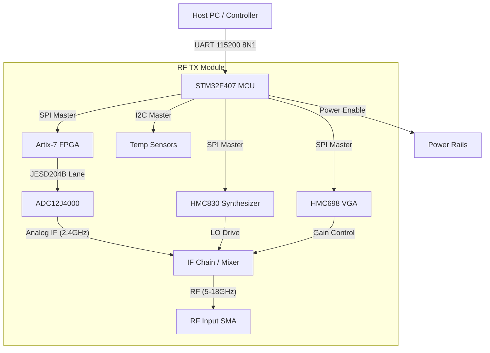
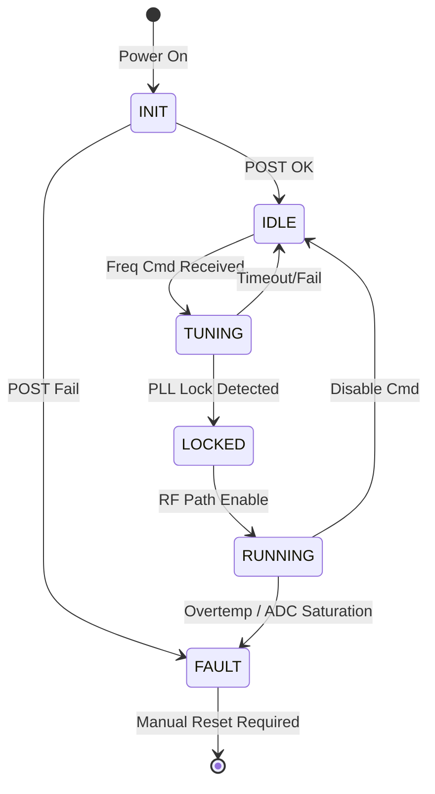
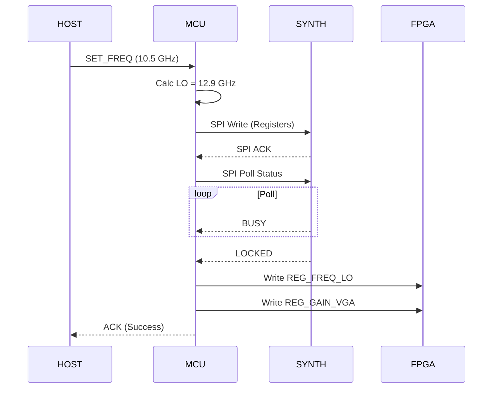
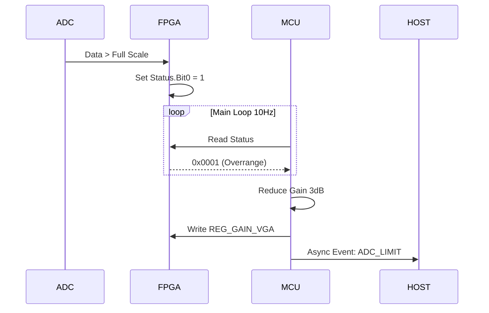

# Software Requirements Specification (SRS)

## Document Control
| Version | Date | Author | Changes |
|---------|------|--------|---------|
| 1.0 | 14 April 2026 | System Architect | Initial Release for RF TX Wideband Receiver |

---

# 1. Introduction

## 1.1 Purpose
This Software Requirements Specification (SRS) defines the comprehensive software requirements for the **rf tx** Wideband Microwave Receiver firmware. This document describes the software architecture, functional requirements, performance constraints, and verification criteria for the embedded system comprising the STM32F407 Microcontroller (MCU) and the Xilinx Artix-7 FPGA. The SRS serves as the contract between the system engineering and development teams, ensuring the control logic, signal processing, and hardware abstraction layers meet the operational needs defined in the Hardware Requirements Specification (HRS).

## 1.2 Scope
The software system specified in this document controls the **rf tx** receiver module, operating from 5.0 GHz to 18.0 GHz.
*   **In Scope:**
    *   **STM32F407 Firmware:** Board Support Package (BSP), Hardware Abstraction Layer (HAL), Real-time control loops, UART command parsing, SPI drivers for MMICs (LNA, Mixer, VGA, Synthesizer), and housekeeping (temperature monitoring, power sequencing).
    *   **FPGA Firmware:** JESD204B interface for the ADC12J4000, DSP datapaths for FFT and CW detection, and register map implementation.
    *   **Communication Protocol:** The binary UART protocol for register read/write and configuration streaming.
*   **Out of Scope:**
    *   Host PC GUI applications (outside the embedded boundary).
    *   High-level RF planning algorithms (assumed provided by Host).
    *   Mechanical design or enclosure firmware.

## 1.3 Definitions, Acronyms, and Abbreviations
| Term | Definition |
| :--- | :--- |
| **API** | Application Programming Interface |
| **BSP** | Board Support Package |
| **CW** | Continuous Wave |
| **DAC** | Digital-to-Analog Converter (Internal to MCU/FPGA) |
| **DDR** | Double Data Rate (Memory interface) |
| **DSP** | Digital Signal Processing |
| **EMC** | Electromagnetic Compatibility |
| **FFT** | Fast Fourier Transform |
| **FIFO** | First-In-First-Out (Buffer) |
| **FPGA** | Field-Programmable Gate Array |
| **FW** | Firmware |
| **GLR** | Glue Logic Requirements |
| **GPIO** | General Purpose Input/Output |
| **HAL** | Hardware Abstraction Layer |
| **HRS** | Hardware Requirements Specification |
| **I2C** | Inter-Integrated Circuit (Serial Bus) |
| **ISR** | Interrupt Service Routine |
| **JESD** | JESD204B High-Speed Data Interface Standard |
| **LFSR** | Linear Feedback Shift Register |
| **LNA** | Low Noise Amplifier |
| **LO** | Local Oscillator |
| **LVDS** | Low-Voltage Differential Signaling |
| **MCU** | Microcontroller Unit (STM32F407) |
| **MMIC** | Monolithic Microwave Integrated Circuit |
| **MSB** | Most Significant Bit |
| **NV** | Non-Volatile (Memory) |
| **NVM** | Non-Volatile Memory |
| **PLL** | Phase Locked Loop |
| **POST** | Power-On Self Test |
| **RF** | Radio Frequency |
| **RX** | Receive / Receiver |
| **SMA** | SubMiniature version A (Connector) |
| **SPI** | Serial Peripheral Interface |
| **SRAM** | Static Random Access Memory |
| **SRS** | Software Requirements Specification |
| **UART** | Universal Asynchronous Receiver-Transmitter |
| **VGA** | Variable Gain Amplifier |
| **WDT** | Watchdog Timer |

## 1.4 References
1.  IEEE Std 830-1998: Recommended Practice for Software Requirements Specifications.
2.  IEEE Std 29148:2018: Systems and software engineering — Life cycle processes — Requirements engineering.
3.  MISRA-C:2012: Guidelines for the use of the C language in critical systems.
4.  **rf tx Hardware Requirements Specification (HRS)**, Rev 1.0, 14 April 2026.
5.  **rf tx Glue Logic Requirements (GLR)**, Rev 0V01, 14 April 2026.
6.  STM32F407 Reference Manual (RM0090), STMicroelectronics.
7.  XC7A35T Artix-7 FPGA Datasheet, Xilinx/AMD.
8.  ADC12J4000 Datasheet, Texas Instruments.

## 1.5 Overview
Section 2 describes the overall product perspective, functions, and constraints. Section 3 details the specific external interfaces and partitions functional requirements into subsystems: Initialization, Communication, RF Control, and FPGA Processing. Section 4 defines verification methods. Section 5 provides the traceability matrix linking software requirements to hardware requirements. Appendices provide data structures, error codes, and state diagrams.

---

# 2. Overall Description

## 2.1 Product Perspective
The **rf tx** software is an embedded distributed system operating across two processing cores.
1.  **Control Plane (STM32F407):** Handles system initialization, peripheral configuration (SPI, I2C, UART), housekeeping, and communication with the external Host. It acts as the master controller for the RF Front-End MMICs.
2.  **Data Plane (Xilinx Artix-7 FPGA):** Handles high-throughput data acquisition from the ADC via JESD204B, performs DSP (FFT, Peak Detect), and exposes a configuration register map via SPI to the MCU.

The system interfaces with external Host equipment via a 3.3V CMOS UART interface and receives RF energy via an SMA connector.



## 2.2 Product Functions
1.  **System Initialization:** Execute POST, configure clocks, verify FPGA bitstream loading.
2.  **Housekeeping:** Monitor board temperature and power rail voltages (+12V, +5V, +3.3V).
3.  **RF Configuration:** Tune the HMC830 LO to specific frequencies (7.4-20.4 GHz).
4.  **Gain Control:** Adjust HMC698 VGA attenuation (0-40dB range).
5.  **Data Acquisition:** Capture 12-bit ADC samples at 4 GSPS effective rate via FPGA.
6.  **Signal Processing:** Compute 4096-point FFT to detect CW signals.
7.  **Communication:** Process ASCII commands and binary register packets over UART.
8.  **Fault Management:** Detect over-temperature or PLL unlock and shut down RF paths safely.
9.  **FPGA Register Access:** Expose FPGA internal registers (FFT config, gain, reset) to MCU.
10. **Non-Volatile Storage:** Store calibration tables and last known configuration in external EEPROM.
11. **Watchdog Management:** Pet the hardware watchdog every < 100ms.
12. **LED Indication:** Blink heartbeat LED; solid LED for fault.
13. **LO Synthesis:** Generate low-phase-noise clock for mixer.
14. **Self-Calibration:** Adjust IF gain based on temperature compensation tables.
15. **Logging:** Append critical errors (temperature, PLL unlock) to internal circular buffer.

## 2.3 User Characteristics
*   **Field Engineers:** Interact via UART to set frequency and read signal strength. Require clear, text-based status codes.
*   **Integration Testers:** Require binary efficiency and precise timing control.
*   **Maintainers:** Require access to low-level registers for diagnostics via JTAG/UART.

## 2.4 Constraints
1.  **MISRA Compliance:** All C code shall adhere to MISRA-C:2012 standards.
2.  **Language:** C99 for MCU; VHDL/Verilog for FPGA.
3.  **Memory:** STM32F407 internal Flash (1MB) and RAM (128KB) limits; Artix-7 BRAM utilization < 80%.
4.  **Timing:** MCU interrupt latency < 10us; JESD204B Lane rate = 4.0 Gbps.
5.  **Power:** System startup current draw must not exceed 2.0A surge on +12V rail.
6.  **Environment:** Software must operate correctly from -40°C to +85°C.
7.  **Clock Source:** System assumes a stable 40MHz reference oscillator is present on the PCB.

## 2.5 Assumptions and Dependencies
1.  The +12V power supply is stable within ±5% before software initializes.
2.  The FPGA bitstream is loaded from external Flash (U23) via the Artix-7 internal boot ROM before MCU initialization completes.
3.  The 40MHz reference clock (TCXO) is stable and within 10ppb accuracy.
4.  The external Host implements the master-side UART timing requirements.

---

# 3. Specific Requirements

## 3.1 External Interface Requirements

### 3.1.1 Hardware Interfaces

#### 3.1.1.1 UART Interface (Host Control)
**Description:** Asynchronous serial interface for configuration and telemetry.
**Protocol:** 115200 baud, 8-bit data, no parity, 1 stop bit.
**Driver API:**
```c
// UART Register Map Definition (Standard)
typedef struct {
    volatile uint32_t STATUS;    // 0x00: Bit 0: TX_RDY, Bit 1: RX_RDY
    volatile uint32_t DATA;      // 0x04: R/W Data
    volatile uint32_t BAUD;      // 0x08: Baud Rate Divisor
    volatile uint32_t CTRL;      // 0x0C: Bit 0: Enable, Bit 1: Loopback
} UART_RegMap_t;

// API Prototypes
int32_t UART_Init(void);
int32_t_UART_Transmit(uint8_t *data, uint16_t len, uint32_t timeout);
int32_t UART_Receive(uint8_t *data, uint16_t len, uint32_t timeout);
```

#### 3.1.1.2 SPI Interface (FPGA & MMICs)
**Description:** 4-wire SPI running at 10 MHz max.
**Protocol:** Mode 0 (CPOL=0, CPHA=0). 16-bit data words.
**Driver API:**
```c
typedef enum {
    SPI_DEV_FPGA = 0,
    SPI_DEV_SYNTH = 1,
    SPI_DEV_VGA = 2
} SPI_Device_t;

typedef struct {
    uint8_t cs_pin;              // GPIO Chip Select Pin
    uint32_t max_clock_hz;       // Max Speed (e.g., 10MHz)
} SPI_Config_t;

// API Prototypes
int32_t SPI_Init(void);
int32_t SPI_Write(SPI_Device_t dev, uint16_t reg_addr, uint16_t data);
int32_t SPI_Read(SPI_Device_t dev, uint16_t reg_addr, uint16_t *data);
int32_t SPI_BurstWrite(SPI_Device_t dev, uint16_t start_addr, const uint16_t *data, uint16_t count);
```

#### 3.1.1.3 I2C Interface (Sensors)
**Description:** Standard 100kHz I2C for temperature/power monitors.
**Driver API:**
```c
typedef struct {
    uint8_t dev_addr;            // 7-bit address
} I2C_Device_t;

int32_t I2C_Init(void);
int32_t I2C_ReadReg(I2C_Device_t dev, uint8_t reg, uint8_t *buf, uint16_t len);
int32_t I2C_WriteReg(I2C_Device_t dev, uint8_t reg, const uint8_t *data, uint16_t len);
```

### 3.1.2 Software Interfaces

#### 3.1.2.1 FPGA Register Map (via SPI)
The MCU controls the FPGA by writing to a memory-mapped register space exposed over SPI.
**Definition:**
```c
// FPGA Register Map Offsets
#define FPGA_REG_ID         0x0000  // R: 0xA5A5 (Magic Number)
#define FPGA_REG_CTRL       0x0001  // RW: Bit 0: Reset DSP, Bit 1: Enable ADC
#define FPGA_REG_FREQ_LO    0x0002  // W: Integer tuning word for local oscillator
#define FPGA_REG_GAIN_VGA   0x0003  // W: VGA Attenuation (0-60dB)
#define FPGA_REG_FFT_CFG    0x0004  // W: FFT Windowing config
#define FPGA_REG_STATUS     0x0005  // R: Bit 0: ADC Overrange, Bit 1: PLL Lock
#define FPGA_REG_PEAK_MAG   0x0010  // R: Magnitude of peak detected (16-bit unsigned)
#define FPGA_REG_PEAK_IDX   0x0011  // R: Frequency bin index of peak
```

### 3.1.3 Communication Interfaces
**Protocol Frame Format (Binary Mode):**
*   **Header:** `[0xA5, 0xA5]`
*   **Cmd:** `[CMD_BYTE]` (0x57=Write, 0x52=Read)
*   **Addr:** `[ADDR_H, ADDR_L]` (Big Endian)
*   **Len:** `[COUNT]`
*   **Data:** `[DATA...]`
*   **CRC:** `[CRC16]`

---

## 3.2 Functional Requirements

### 3.2.1 System Initialization (REQ-SW-001 to REQ-SW-010)
REQ-SW-001: Upon power-on reset, the software SHALL initialize the system clock to 168 MHz using the external 8 MHz crystal and PLL within 20 ms.
REQ-SW-002: The software SHALL verify the FPGA ID register (Offset 0x0000) reads 0xA5A5 to confirm successful FPGA configuration before proceeding.
REQ-SW-003: The software SHALL initialize the UART peripheral to 115200 baud, 8N1 format, enabling RX interrupts.
REQ-SW-004: The software SHALL perform a Power-On Self-Test (POST) that reads the Board ID from EEPROM and compares it against 0x52465458 ("RFTX").
REQ-SW-005: The software SHALL initialize the Watchdog Timer (IWDG) to a 100 ms timeout period.
REQ-SW-006: The software SHALL configure all GPIO pins to their default states (RF Enables LOW, LEDs OFF).
REQ-SW-007: The software SHALL enable the +3.3V and +5V power rails via GPIO enable signals, waiting 10 ms for stabilization before enabling RF components.
REQ-SW-008: The software SHALL initialize the I2C peripheral to 100 kHz to interrogate temperature sensors.
REQ-SW-009: The software SHALL log the firmware version string "RFTX_FW_v1.0.0" to the UART debug console upon startup.
REQ-SW-010: The software SHALL transition to the NORMAL state only if all POST checks pass; otherwise, it shall enter the FAULT state.

### 3.2.2 Communication Driver (REQ-SW-011 to REQ-SW-020)
REQ-SW-011: The UART driver SHALL implement a circular RX buffer of 512 bytes to handle incoming data bursts.
REQ-SW-012: The software SHALL process incoming command packets within 5 ms of reception of the final CRC byte.
REQ-SW-013: The software SHALL validate the CRC-16-CCITT of all incoming command packets; invalid packets SHALL be discarded and a NAK (0x15) sent.
REQ-SW-014: The software SHALL respond to valid Write Commands (0x57) with an ACK (0x06) within 2 ms.
REQ-SW-015: The software SHALL respond to valid Read Commands (0x52) by returning the requested register data payload.
REQ-SW-016: The software SHALL support a "Bulk Write" command for SPI frequencies, allowing updates of up to 64 registers in a single transaction.
REQ-SW-017: The UART interface SHALL support an ASCII debug mode for human interaction (commands like "HELP", "STATUS").
REQ-SW-018: The software SHALL implement a 1-second timeout for incomplete command packets, flushing the RX buffer.
REQ-SW-019: The communication driver SHALL multiplex access to the SPI bus between FPGA, Synth, and VGA devices, ensuring 10 us minimum CS de-assertion time between devices.
REQ-SW-020: The software SHALL prevent SPI bus collisions by using a mutex (semaphore) mechanism if using an RTOS, or a critical section lock in bare-metal.

### 3.2.3 RF Synthesis & Tuning (REQ-SW-021 to REQ-SW-030)
REQ-SW-021: The software SHALL calculate the HMC830 synthesizer frequency register values based on the formula: $f_{RF} - 2.4 \text{ GHz} = f_{LO}$.
REQ-SW-022: The software SHALL write the calculated Integer-N and Fractional values to the HMC830 via SPI.
REQ-SW-023: The software SHALL poll the HMC830 Status register (Bit 0: Digital Lock Detect) until high, with a timeout of 100 ms.
REQ-SW-024: If the PLL fails to lock within 100 ms, the software SHALL increment a retry counter; if retries > 3, flag a PLL_FAULT.
REQ-SW-025: The software SHALL set the RF Path Enable GPIO HIGH only after the PLL_LOCK status is confirmed.
REQ-SW-026: The software SHALL support tuning steps of 10 kHz (HRS Requirement REQ-HW-002) by updating the synthesizer fractional accumulator.
REQ-SW-027: The software SHALL update the FPGA Register `FPGA_REG_FREQ_LO` (0x0002) with the current LO frequency value for DSP reference.
REQ-SW-028: The software shall verify the VCO calibration status of the HMC830 before asserting the RF Enable.
REQ-SW-029: The software SHALL allow the LO frequency to be set between 7.4 GHz and 20.4 GHz inclusive (derived from 5-18 GHz RF + 2.4 GHz IF).
REQ-SW-030: The software SHALL clamp any requested frequency outside the 5.0-18.0 GHz range to the nearest valid limit (5.0 or 18.0 GHz).

### 3.2.4 Gain Control & Calibration (REQ-SW-031 to REQ-SW-040)
REQ-SW-031: The software SHALL set the HMC698 VGA attenuation via SPI to achieve the desired system gain.
REQ-SW-032: The software SHALL map a host request of "Gain 0 dB" to the minimum attenuation setting of the VGA.
REQ-SW-033: The software SHALL map a host request of "Gain -40 dB" to the maximum attenuation setting of the VGA.
REQ-SW-034: The software SHALL implement a calibration lookup table (LUT) in EEPROM mapping temperature (in 5°C steps) to gain offset values.
REQ-SW-035: The software SHALL apply temperature compensation to the VGA setting every time the temperature changes by > 2°C.
REQ-SW-036: The software SHALL write the final gain value to the FPGA Register `FPGA_REG_GAIN_VGA` (0x0003).
REQ-SW-037: The software shall not allow the VGA to be set to a gain that would saturate the ADC (simulated by checking FPGA_REG_STATUS Bit 0).
REQ-SW-038: The software SHALL support a "Gain Sweep" mode where the attenuation cycles through 0 to 60 dB in 1 dB steps for diagnostics.
REQ-SW-039: The software SHALL persist the last used gain setting to NVM and restore it on boot.
REQ-SW-040: The software SHALL log any gain change event to the internal log buffer.

### 3.2.5 Signal Processing & FPGA Interface (REQ-SW-041 to REQ-SW-050)
REQ-SW-041: The software SHALL read the Peak Magnitude register (FPGA_REG_PEAK_MAG) at a rate of 10 Hz.
REQ-SW-042: The software SHALL read the Peak Index register (FPGA_REG_PEAK_IDX) to determine the frequency of the detected CW signal.
REQ-SW-043: The software SHALL convert the Peak Index into a frequency using the formula: $f_{center} + (Index - \frac{N}{2}) \times \frac{F_s}{N}$.
REQ-SW-044: The software SHALL monitor the FPGA Status register (0x0005) for ADC Overrange (Bit 0).
REQ-SW-045: If ADC Overrange is detected, the software SHALL automatically reduce the system gain by 3 dB.
REQ-SW-046: The software SHALL configure the FPGA FFT window type via `FPGA_REG_FFT_CFG` (0: Blackman, 1: Hamming).
REQ-SW-047: The software SHALL reset the FPGA DSP core by toggling `FPGA_REG_CTRL` Bit 0 if the peak data becomes stagnant (0x0000) for 5 seconds.
REQ-SW-048: The software SHALL ensure the JESD204B link status (reported in FPGA Status) shows "Link Up" before processing signal data.
REQ-SW-049: The software SHALL provide the raw IQ data or FFT bins to the Host upon request via a binary bulk read.
REQ-SW-050: The software SHALL implement a "Carrier Detect" boolean flag in the status register if the Peak Magnitude exceeds a configurable threshold.

### 3.2.6 Housekeeping & Diagnostics (REQ-SW-051 to REQ-SW-060)
REQ-SW-051: The software SHALL read the on-board temperature sensor via I2C every 1 second.
REQ-SW-052: If the temperature exceeds +85°C (High Temp), the software SHALL disable the RF Output (RF_Enable = LOW).
REQ-SW-053: If the temperature drops below +80°C (Hysteresis), the software SHALL re-enable the RF Output if it was previously disabled only by temperature.
REQ-SW-054: The software SHALL monitor the +12V input voltage via the ADC (channel 0) every 100 ms.
REQ-SW-055: The software SHALL trigger a hardware fault if the +12V input drops below 10.8V or exceeds 13.2V.
REQ-SW-056: The software SHALL blink the Green LED at 1 Hz in the NORMAL operating state.
REQ-SW-057: The software SHALL turn the Red LED solid ON in any FAULT state.
REQ-SW-058: The software SHALL kick (refresh) the Watchdog Timer every 50 ms within the main loop.
REQ-SW-059: The software SHALL support a firmware upgrade command via UART (Bootloader mode) that jumps to address 0x08000000.
REQ-SW-060: The software SHALL generate a unique Event ID for every fault condition (Over-temp, Voltage Fail, PLL Unlock) stored in a 32-entry history log.

## 3.3 Performance Requirements
REQ-PERF-001: The software SHALL complete the processing of a Set Frequency command (SPI write + Lock verification) within 150 ms.
REQ-PERF-002: The software SHALL service the Watchdog Timer at least once every 90 ms (Timeout set to 100 ms).
REQ-PERF-003: The SPI transaction to the FPGA for a register read SHALL complete within 20 us.
REQ-PERF-004: The UART transmit buffer SHALL not overflow at a continuous incoming data rate of 115200 baud.
REQ-PERF-005: The thermal update loop SHALL read temperature and update compensation parameters within 10 ms.
REQ-PERF-006: The FPGA-to-MCU data polling SHALL occur at a minimum rate of 10 Hz.
REQ-PERF-007: The total firmware boot time (Power-on to UART "Ready") SHALL not exceed 500 ms.
REQ-PERF-008: The memory footprint of the running application SHALL not exceed 80% of total SRAM (102 KB).
REQ-PERF-009: The software SHALL support a minimum of 10,000 write cycles to the EEPROM configuration section.
REQ-PERF-010: The context switch time (if RTOS used) or interrupt latency SHALL be less than 10 us.

## 3.4 Design Constraints
REQ-DC-001: The C code SHALL be compiled using the GNU ARM Embedded Toolchain (gcc-arm-none-eabi) version 10 or later.
REQ-DC-002: The code SHALL strictly adhere to MISRA-C:2012 standards, with no deviations allowed without safety approval.
REQ-DC-003: Dynamic memory allocation (`malloc`, `free`) SHALL NOT be used in the final application binary.
REQ-DC-004: All registers shared between the ISR and Main loop SHALL be declared `volatile`.
REQ-DC-005: The stack size SHALL be statically analyzed to ensure no overflow occurs during worst-case interrupt nesting.
REQ-DC-006: The software SHALL utilize the provided HAL library (e.g., STM32CubeHAL) or register-level equivalents optimized for speed.
REQ-DC-007: All magic numbers SHALL be defined as `#define` constants or `enum` values with clear descriptive names.
REQ-DC-008: The FPGA logic SHALL be implemented in VHDL-2008 or Verilog-2001 compatible syntax.

## 3.5 Software System Attributes

### 3.5.1 Reliability
The software shall achieve a Mean Time Between Failures (MTBF) of 10,000 hours under continuous operation at 25°C. It shall recover from all single-bit upsets in SRAM (via ECC if available) or Watchdog resets.

### 3.5.2 Availability
The system shall be available 99.9% of the time (excluding planned maintenance). Boot time shall be < 500ms to minimize downtime after power loss.

### 3.5.3 Security
The software SHALL verify the integrity of the application Flash image using a CRC-32 check on startup. Unauthorized memory access (outside defined GLR regions) SHALL trigger a bus fault exception.

### 3.5.4 Maintainability
Code modules SHALL have a Cyclomatic Complexity less than 10. All functions SHALL include Doxygen-compatible headers describing inputs, outputs, and return codes.

### 3.5.5 Portability
The Hardware Abstraction Layer (HAL) SHALL isolate all STM32-specific code. Board-specific pin definitions SHALL be contained in a single `board_config.h` file.

---

# 4. Verification and Validation

## 4.1 Unit Test Requirements
*   **SPI Driver Test:** Verify write/read to a known loopback SPI device. Verify CS timing.
*   **CRC Calculation Test:** Inject known bit errors; verify CRC detection logic.
*   **Freq Conversion Test:** Input 6.5 GHz; verify LO calculation results in 9.1 GHz ($6.5+2.4$).
*   **Temp Comp Test:** Input 85°C; verify gain reduction routine triggers.

## 4.2 Integration Test Requirements
*   **MCU-FPGA Integration:** Verify MCU can write to `FPGA_REG_CTRL` and observe FPGA LED change.
*   **RF Chain Integration:** Command a frequency sweep from 5 to 18 GHz; verify PLL Lock bit asserts at every step.
*   **UART Comm Integration:** Send 1000 random write commands from Host; verify 0 CRC errors.

## 4.3 System Test Requirements
*   **Frequency Accuracy Test:** Input a known CW signal at 10.5 GHz. Verify `FPGA_REG_PEAK_IDX` corresponds to 10.5 GHz ± 10 kHz.
*   **Dynamic Range Test:** Input signals at -90 dBm and -10 dBm. Verify system detects both without saturation (using AGC).
*   **Thermal Stress:** Place module in chamber at -40°C and +85°C. Verify UART communication remains stable.

---

# 5. Requirements Traceability Matrix

| REQ-SW-xxx | Description | Traces To (REQ-HW-xxx / GLR Section) |
|-----------|-------------|--------------------------------------|
| REQ-SW-001 | System Clock Init | HRS: System Startup |
| REQ-SW-002 | FPGA ID Verification | GLR: Section 4 (Module Overview) |
| REQ-SW-011 | UART Buffer | HRS: REQ-HW-012 (Control Interface) |
| REQ-SW-021 | LO Calculation | HRS: REQ-HW-008 (LO Generation) |
| REQ-SW-023 | PLL Lock Polling | HRS: REQ-HW-008 (LO Phase Noise/Lock) |
| REQ-SW-031 | VGA Control | HRS: REQ-HW-009 (Gain Control) |
| REQ-SW-034 | Temp Calibration | HRS: REQ-HW-014 (Operating Temp) |
| REQ-SW-041 | Peak Read | HRS: REQ-HW-020 (CW Detection) |
| REQ-SW-044 | ADC Overrange | HRS: ADC12J4000 Datasheet limits |
| REQ-SW-051 | Temp Monitoring | HRS: REQ-HW-014 |

---

# 6. Appendices

## Appendix A — Error Codes
```c
typedef enum {
    ERR_OK           = 0x00, // No Error
    ERR_TIMEOUT      = 0x01, // Operation timed out (e.g. PLL lock)
    ERR_COMM_CRC     = 0x02, // UART CRC Mismatch
    ERR_COMM_FRAMING = 0x03, // UART Framing Error
    ERR_PARAM_RANGE  = 0x04, // Parameter out of bounds (e.g. Freq < 5GHz)
    ERR_HW_FAULT     = 0x05, // Hardware fault detected
    ERR_TEMP_HIGH    = 0x06, // Temperature > 85°C
    ERR_PLL_UNLOCK   = 0x07, // PLL failed to lock
    ERR_SPI_FAIL     = 0x08, // SPI ACK not received
    ERR_FLASH_WRITE  = 0x09  // EEPROM Write failure
} ErrorCode_t;
```

## Appendix B — Mermaid Diagrams

### State Machine: RF Control


### Sequence: Frequency Set Command


### Sequence: ADC Overrange Handling
