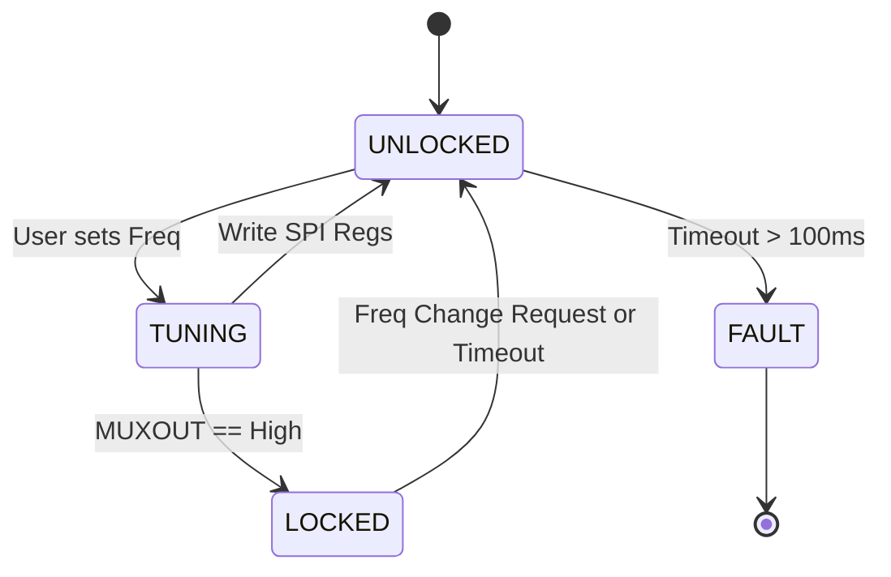
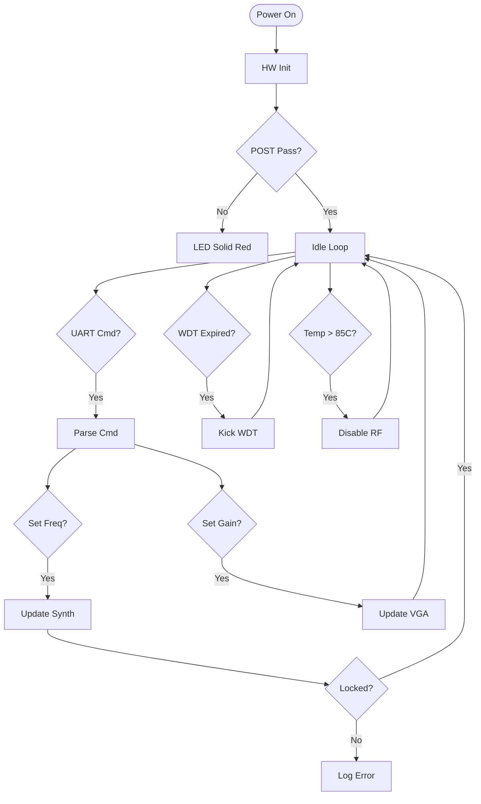
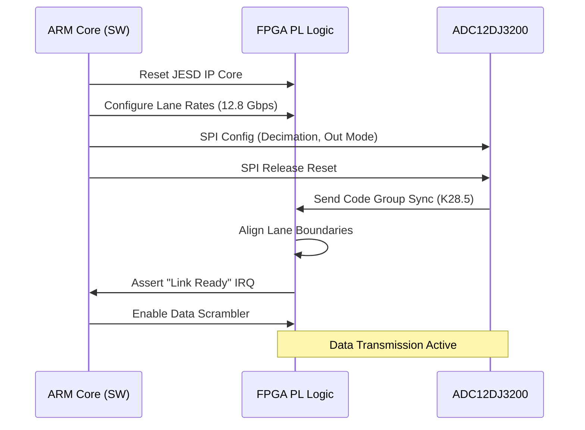

# Software Requirements Specification (SRS)

## Document Control
| Version | Date | Author | Changes |
|---------|------|--------|---------|
| 1.0 | 14 April 2026 | Sr. Software Architect | Initial Release for rf txrxxp Project |

---

# 1. Introduction

## 1.1 Purpose
This Software Requirements Specification (SRS) document defines the software and firmware requirements for the **rf txrxxp** Wideband Microwave Radar Receiver. This document describes the system functionality, performance parameters, interfaces, and verification criteria for the embedded firmware running on the System-on-Chip (SoC/FPGA) controller.

The intended audience includes:
*   **Firmware Engineers:** Responsible for C/C++ and RTL implementation.
*   **Test Engineers:** Responsible for validating the system against these requirements.
*   **System Integrators:** Responsible for integrating the rf txrxxp module into larger radar platforms.
*   **Hardware Engineers:** Responsible for designing the glue logic interfaces defined in Section 3.

This SRS serves as the baseline for all software design activities, including the Software Design Document (SDD) and Verification and Validation (V&V) planning.

## 1.2 Scope
The software scope for **rf txrxxp** encompasses the control loop, data acquisition, and communication interfaces required to operate the 5-18 GHz receiver chain.

**In-Scope Functions:**
*   **FPGA Bitstream Management:** Loading and configuring the Zynq UltraScale+ PS and PL logic.
*   **High-Speed Data Link:** Configuring the JESD204B interface between the TI ADC12DJ3200 and the FPGA GTY transceivers.
*   **RF Control:** SPI drivers for the ADF5356 Synthesizer, HMC698LP4 VGA, and configuration of the HMC1050 Mixer.
*   **Signal Processing:** Digital Down Conversion (DDC), decimation filtering, and data packetization.
*   **Host Communication:** UART command/response protocol for register access and status reporting.
*   **Housekeeping:** Temperature monitoring via I2C, power rail monitoring, and Watchdog Timer (WDT) management.
*   **Non-Volatile Memory:** Management of calibration tables in the onboard EEPROM.

**Out-of-Scope Functions:**
*   High-level radar tracking algorithms (processed by the host system).
*   Mechanical design or RF circuit board layout.
*   PC-based GUI client logic (client-side only).

## 1.3 Definitions, Acronyms, and Abbreviations

| Term | Definition |
| :--- | :--- |
| **ADC** | Analog-to-Digital Converter (TI ADC12DJ3200). |
| **AGC** | Automatic Gain Control. |
| **API** | Application Programming Interface. |
| **BIST** | Built-In Self-Test. |
| **BSP** | Board Support Package. |
| **CRC** | Cyclic Redundancy Check. |
| **DAC** | Digital-to-Analog Converter. |
| **DDC** | Digital Down Converter. |
| **DMA** | Direct Memory Access. |
| **DSP** | Digital Signal Processing. |
| **EEPROM** | Electrically Erasable Programmable Read-Only Memory. |
| **EMIF** | External Memory Interface. |
| **FIFO** | First-In-First-Out buffer. |
| **FIR** | Finite Impulse Response (Filter). |
| **FPGA** | Field-Programmable Gate Array (Xilinx Zynq UltraScale+). |
| **FS** | File System or Full Scale. |
| **GLR** | Glue Logic Requirements. |
| **GPIO** | General Purpose Input/Output. |
| **HAL** | Hardware Abstraction Layer. |
| **HRS** | Hardware Requirements Specification. |
| **I2C** | Inter-Integrated Circuit (Serial Bus). |
| **ICD** | Interface Control Document. |
| **ISR** | Interrupt Service Routine. |
| **JESD** | JESD204B/C High-Speed Data Interface Standard. |
| **LDO** | Low Dropout Regulator. |
| **LFSR** | Linear Feedback Shift Register (PRBS generation). |
| **Linux** | Preferred OS for PS (Processing System). |
| **LSB** | Least Significant Bit. |
| **LUT** | Look-Up Table. |
| **MAC** | Media Access Control or Multiply-Accumulate. |
| **MCB** | Memory Controller Block. |
| **MMCM** | Mixed-Mode Clock Manager. |
| **MSB** | Most Significant Bit. |
| **MTBF** | Mean Time Between Failures. |
| **NV** | Non-Volatile. |
| **OS** | Operating System. |
| **PCIe** | Peripheral Component Interconnect Express. |
| **PLL** | Phase-Locked Loop. |
| **PL** | Programmable Logic (FPGA Fabric). |
| **PRBS** | Pseudo-Random Binary Sequence. |
| **PS** | Processing System (ARM Cores). |
| **PWM** | Pulse Width Modulation. |
| **RAM** | Random Access Memory. |
| **RF** | Radio Frequency. |
| **ROM** | Read-Only Memory. |
| **RTL** | Register Transfer Level. |
| **RTOS** | Real-Time Operating System. |
| **Rx** | Receive. |
| **SMA** | SubMiniature version A (Connector). |
| **SPI** | Serial Peripheral Interface. |
| **SRAM** | Static Random Access Memory. |
| **SRS** | Software Requirements Specification. |
| **SW** | Software. |
| **TRP** | Transmit/Receive Pulse (or RF Enable). |
| **UART** | Universal Asynchronous Receiver-Transmitter. |
| **UDP** | User Datagram Protocol. |
| **VCO** | Voltage Controlled Oscillator. |
| **WDT** | Watchdog Timer. |

## 1.4 References
1.  **IEEE Std 830-1998**: IEEE Recommended Practice for Software Requirements Specifications.
2.  **IEEE Std 29148-2018**: Systems and software engineering — Life cycle processes — Requirements engineering.
3.  **MISRA C:2012**: Guidelines for the use of the C language in critical systems.
4.  **rf txrxxp Hardware Requirements Specification (HRS)**, Rev 1.0, 14 April 2026.
5.  **rf txrxxp Glue Logic Requirements (GLR)**, Rev 0V01, 14 April 2026.
6.  **Texas Instruments ADC12DJ3200 Datasheet**, Literature Number: SWAS584B.
7.  **Analog Devices ADF5356 Datasheet**, Wideband Synthesizer with Integrated VCO.
8.  **Xilinx UG1085**: Zynq UltraScale+ Device Technical Reference Manual.

## 1.5 Overview
The remainder of this document is organized as follows:
*   **Section 2:** Overall description of the product environment, functions, and constraints.
*   **Section 3:** Detailed specific requirements, including external interfaces and 50+ functional requirements.
*   **Section 4:** Verification and validation protocols.
*   **Section 5:** Requirements Traceability Matrix (RTM).
*   **Section 6:** Appendices including error codes, register maps, and diagrams.

---

# 2. Overall Description

## 2.1 Product Perspective

The **rf txrxxp** software is an embedded firmware solution operating on a Xilinx Zynq UltraScale+ MPSoC (XCZU4EV or equivalent). It manages the high-speed digitization of 5-18 GHz RF signals and real-time control of the analog front end.

**System Context:**
The firmware resides between the Host Computer (External Controller) and the RF Hardware.

```mermaid
flowchart TD
    Host[Host PC / Radar Processor] -->|Ethernet / UART| SoC[Zynq UltraScale+ SoC]
    
    subgraph PS [Processing System (ARM)]
        APP[Application Layer<br/>(C/C++)]
        HAL[Hardware Abstraction Layer<br/>(SPI, I2C, UART)]
    end
    
    subgraph PL [Programmable Logic (FPGA)]
        JESD[JESD204B IP Core]
        DDC[DDC / DSP Core]
        DMA[AXI DMA Controller]
    end
    
    SoC -->|SPI Control| RF_ICs[RF Chain<br/>(Synth, VGA, Mixer)]
    SoC -->|I2C| PM[Power Monitor / Temp]
    
    RF_ICs -->|IF Signal| ADC[ADC12DJ3200]
    ADC -->|JESD204B (12.288 Gbps)| JESD
    JESD --> DDC
    DDC --> DMA
    DMA --> APP
    
    APP -->|Processed Data| Host
```

**External Systems:**
*   **Host PC:** Sends configuration commands (frequency, gain) and receives IQ data streams.
*   **Power Supply:** Provides +12V DC; firmware monitors health via PMIC I2C.

## 2.2 Product Functions
1.  **System Initialization:** Boot sequence, PLL locking, DDR calibration, and ADC bring-up.
2.  **JESD204B Link Management:** Establishing the high-speed serial link to the ADC, verifying lane alignment (comma alignment), and monitoring CRC errors.
3.  **Synthesizer Control:** Programming the ADF5356 via SPI to generate the required LO frequency (based on target RF frequency).
4.  **Gain Control:** Setting the HMC698LP4 VGA gain steps (4-bit parallel) to optimize ADC input level (preventing saturation/boosting weak signals).
5.  **Data Capture:** Streaming IQ samples from the FPGA logic to RAM.
6.  **Data Processing:** Digital Down Conversion (DDC), decimation, and filtering.
7.  **Housekeeping:** Monitoring board temperature and +12V/+3.3V current consumption via I2C PMIC.
8.  **Watchdog:** System reset on communication timeout or fault detection.
9.  **Non-Volatile Storage:** Loading/Saving calibration coefficients to EEPROM.
10. **Configuration Management:** Parsing and executing register read/write commands from UART.
11. **Status Reporting:** Heartbeat LED and UART status messages.

## 2.3 User Characteristics
*   **Firmware Engineers:** Modify underlying drivers and FPGA logic. Require access to JTAG and low-level APIs.
*   **Test Engineers:** Perform automated calibration and verification using UART/SCPI commands.
*   **System Integrators:** Treat the module as a "black box" RF front end, configuring frequency/gain via high-level API.

## 2.4 Constraints
1.  **MISRA Compliance:** Firmware SHALL adhere to MISRA C:2012 standards to ensure safety and reliability.
2.  **Real-Time Processing:** The JESD204B interface and interrupt handlers SHALL meet latency requirements to prevent buffer overflows at the maximum data rate (6.4 GSPS raw, decimated in logic).
3.  **Memory:** On-chip memory (BRAM) is limited. High-speed buffers MUST utilize external DDR (ECC enabled).
4.  **Clocking:** All PL clocks derived from a single low-jitter source (e.g., ADC clock or SI5345).
5.  **Power:** Total module power budget < 8W. Firmware must manage clock gating to stay within budget.
6.  **Environment:** Operating range -40°C to +85°C. Software must implement thermal throttling if >85°C is detected.

## 2.5 Assumptions and Dependencies
1.  **Hardware Availability:** The HRS defined components (ADC, Synth, VGA) are present and functional.
2.  **Power Sequencing:** The +12V rail stabilizes before the SoC exits reset.
3.  **Clock Source:** A stable 10 MHz or 100 MHz reference clock is provided to the FPGA/ADC.
4.  **Host Latency:** The Host controller can process data at the rate produced by the rf txrxxp module.

---

# 3. Specific Requirements

## 3.1 External Interface Requirements

### 3.1.1 Hardware Interfaces

**3.1.1.1 JESD204B Interface (ADC)**
Interface to the Texas Instruments ADC12DJ3200.
```c
// JESD204B Lane Status Register Map (Memory Mapped in FPGA)
typedef struct {
    volatile uint32_t CTRL;      // 0x00: Enable, Reset
    volatile uint32_t STATUS;    // 0x04: Link Ready, Alignment Status
    volatile uint32_t ERR_COUNT; // 0x08: Disparity Errors
    volatile uint32_t CTRL_WR;   // 0x0C: Scratch pad test
} JESD_Regs_t;

// Driver API
int32_t JESD_Init(uint32_t lane_rate_khz, uint8_t num_lanes);
int32_t JESD_GetLinkStatus(bool *aligned);
int32_t JESD_EnableRX(void);
```

**3.1.1.2 SPI Interface (Synthesizer & VGA)**
Standard SPI Mode 0/3.
```c
// Generic SPI Definition
typedef struct {
    volatile uint32_t CONFIG; // Polarity, Phase, Prescaler
    volatile uint32_t TX_FIFO;
    volatile uint32_t RX_FIFO;
    volatile uint32_t STATUS; // Busy, Tx Empty, Rx Full
} SPI_Regs_t;

// ADF5356 Specifics
#define ADF5356_ADDR_WIDTH  16
#define ADF5356_DATA_WIDTH  32

// HMC698LP4 Specifics (Parallel to SPI bridge or direct)
// Assuming bridge to SPI for this implementation
int32_t SPI_Init(uint32_t base_addr, uint32_t freq_hz);
int32_t SPI_WriteReg(uint8_t chip_select, uint8_t *data, uint32_t len);
```

**3.1.1.3 I2C Interface (Housekeeping)**
Reading Temperature Sensors (e.g., TI TMP102) and Power Monitors (e.g., LTC2991).
```c
typedef struct {
    volatile uint32_t CTRL;
    volatile uint32_t STATUS;
    volatile uint32_t TX_DATA;
    volatile uint32_t RX_DATA;
} I2C_Regs_t;

int32_t I2C_Init(uint32_t clk_hz);
int32_t I2C_ReadByte(uint8_t dev_addr, uint8_t reg_addr, uint8_t *data);
int32_t I2C_WriteByte(uint8_t dev_addr, uint8_t reg_addr, uint8_t data);
```

### 3.1.2 Software Interfaces
The software will expose a memory-mapped register map to the host system. The host writes to these registers to trigger actions.

```c
// Shared Memory Map Definition (Offset 0x0000_0000)
typedef struct {
    volatile uint32_t DEVICE_ID;       // 0x00: 0x52584D54 ('TXR')
    volatile uint32_t FREQ_MHZ;        // 0x04: Desired RF Freq in MHz
    volatile uint32_t GAIN_INDEX;      // 0x08: 0-255 Gain Setting
    volatile uint32_t ADC_DECIMATION;  // 0x0C: Decimation Factor
    volatile uint32_t TRIGGER;         // 0x10: Write 1 to arm capture
    volatile uint32_t STATUS;          // 0x14: Bit[0]: Ready, Bit[1]: Error
    volatile uint32_t DATA_ADDR;       // 0x18: Physical Addr of DMA buffer
} SystemRegisters_t;
```

### 3.1.3 Communication Interfaces
**UART Control Protocol (Baud 115200, 8N1)**
*   **Packet Structure:** `[HEADER][CMD][LEN][DATA][CRC8]`
*   **CMD Codes:**
    *   `0x01`: Write Register
    *   `0x02`: Read Register
    *   `0x03`: Set Frequency (Specific wrapper for Synth)
    *   `0x04`: Get Status (Temp, Lock, PLL)

## 3.2 Functional Requirements

### 3.2.1 System Initialization (REQ-SW-001 to REQ-SW-010)

*   **REQ-SW-001:** The software SHALL complete the Power-On Self-Test (POST) within 500ms of power application.
*   **REQ-SW-002:** The software SHALL verify the FPGA Device ID matches 0x52584D54 during POST.
*   **REQ-SW-003:** The software SHALL configure the PS (Processing System) clocks to 1.2 GHz (CPU) and 250 MHz (AXI Bus) before initializing peripherals.
*   **REQ-SW-004:** The software SHALL initialize the UART interface to 115200 baud, 8 data bits, no parity, 1 stop bit.
*   **REQ-SW-005:** The software SHALL initialize the I2C interface to 400 kHz (Fast Mode) for sensor polling.
*   **REQ-SW-006:** The software SHALL load the calibration coefficients from non-volatile memory (EEPROM) into SRAM.
*   **REQ-SW-007:** The software SHALL assert the "SYSTEM_READY" bit in the Status Register only after all initializations pass.
*   **REQ-SW-008:** The software SHALL enable the Watchdog Timer (WDT) with a 1-second timeout after POST completion.
*   **REQ-SW-009:** The software SHALL configure all GPIOs to a safe state (default Low) to prevent accidental RF transmission during boot.
*   **REQ-SW-010:** The software SHALL log firmware version string "rf txrxxp FW v1.0.0 [DATE]" to the UART console on startup.

### 3.2.2 RF Control & Synthesis (REQ-SW-011 to REQ-SW-020)

*   **REQ-SW-011:** The software SHALL calculate the ADF5356 synthesizer register values based on a requested RF frequency (5.0 GHz - 18.0 GHz) within 5ms of request.
*   **REQ-SW-012:** The software SHALL write the 68-bit (or required) configuration sequence to the ADF5356 via SPI at a clock rate not exceeding 20 MHz.
*   **REQ-SW-013:** The software SHALL verify the ADF5356 MUXOUT lock status after a frequency change.
*   **REQ-SW-014:** If the PLL fails to lock within 100ms, the software SHALL assert the `ERR_PLL_UNLOCK` fault code and halt further tuning.
*   **REQ-SW-015:** The software SHALL update the HMC698LP4 VGA gain setting by writing to the parallel interface (or SPI bridge) to achieve the requested gain step (0 to 30 dB).
*   **REQ-SW-016:** The software SHALL linearize the gain steps by applying calibration correction factors from the EEPROM table.
*   **REQ-SW-017:** The software SHALL ensure the LO frequency is set such that the IF falls within the DC - 1 GHz range.
*   **REQ-SW-018:** The software SHALL disable the RF front-end (set Gain to min) during frequency tuning to prevent transients.
*   **REQ-SW-019:** The software SHALL support frequency hopping with a maximum latency of 20 microseconds between hops (context switch latency).
*   **REQ-SW-020:** The software SHALL maintain a log of the last 10 frequency tuning commands in a circular buffer for debugging.

### 3.2.3 High-Speed Data Acquisition (REQ-SW-021 to REQ-SW-030)

*   **REQ-SW-021:** The software SHALL configure the JESD204B IP core for Subclass 0 (deterministic latency not required) or Subclass 1 (SYSREF) as defined in GLR.
*   **REQ-SW-022:** The software SHALL initialize the ADC12DJ3200 to Dual-Channel mode, 12-bit resolution, and decimation factor of 2 or 4.
*   **REQ-SW-023:** The software SHALL monitor the JESD204B link status (Code Group Sync) and report a fault if synchronization is lost after 10ms.
*   **REQ-SW-024:** The software SHALL establish the AXI-DMA channel to transfer data from the FPGA RX FIFO to DDR memory.
*   **REQ-SW-025:** The software SHALL allocate non-cached, physically contiguous memory buffers of size 16 MB for data capture.
*   **REQ-SW-026:** Upon receiving a Trigger command, the software SHALL start the DMA transfer.
*   **REQ-SW-027:** The software SHALL halt DMA transfer automatically when the buffer is full or an external trigger stop condition is met.
*   **REQ-SW-028:** The software SHALL calculate and append a CRC-32 checksum to the captured data packet.
*   **REQ-SW-029:** The software SHALL support "IQ Swap" logic in the FPGA to correct for I/Q reversal (configurable bit).
*   **REQ-SW-030:** The software SHALL perform a PRBS (Pseudo-Random Binary Sequence) check on the ADC link during BIST to verify data integrity.

### 3.2.4 Host Communication & Control (REQ-SW-031 to REQ-SW-040)

*   **REQ-SW-031:** The software SHALL implement a UART command parser to interpret incoming packet frames.
*   **REQ-SW-032:** The software SHALL respond to a "Write Register" command (0x01) with an ACK (0x06) byte within 1ms.
*   **REQ-SW-033:** The software SHALL respond to a "Read Register" command (0x02) with [ACK][DATA_H][DATA_L][CRC] within 1ms.
*   **REQ-SW-034:** The software SHALL ignore commands with invalid CRC and increment the `ERR_COMM_CRC` counter.
*   **REQ-SW-035:** The software SHALL allow the host to configure the decimation rate (0, 2, 4, 8) via register write.
*   **REQ-SW-036:** The software SHALL update the "Sample Rate" register to reflect the effective post-decimation sample rate.
*   **REQ-SW-037:** The software SHALL mask (not process) UART commands while a high-priority DMA transfer is active if buffering constraints exist.
*   **REQ-SW-038:** The software SHALL provide a "Status Query" command that returns [Temp][Lock Status][Uptime].
*   **REQ-SW-039:** The software SHALL implement a software reset (Soft-Reboot) upon receiving command 0xFF.
*   **REQ-SW-040:** The software SHALL use DMA for UART TX to prevent CPU overhead during high-speed status logging.

### 3.2.5 Environmental Monitoring & Protection (REQ-SW-041 to REQ-SW-050)

*   **REQ-SW-041:** The software SHALL poll the on-board temperature sensor every 500ms.
*   **REQ-SW-042:** If the temperature exceeds +85°C, the software SHALL assert the `OVERTEMP` alarm and disable the RF Amplifier.
*   **REQ-SW-043:** The software SHALL re-enable the RF Amplifier only when temperature drops below +75°C (hysteresis).
*   **REQ-SW-044:** The software SHALL monitor the +12V current via the I2C power monitor.
*   **REQ-SW-045:** If current consumption exceeds 2.0A (approx > 24W limit violation or fault), the software SHALL disable the DC-DC converters via GPIO.
*   **REQ-SW-046:** The software SHALL implement a heartbeat LED toggling at 1Hz when the system is healthy.
*   **REQ-SW-047:** The software SHALL drive the heartbeat LED solid ON if a fatal fault occurs.
*   **REQ-SW-048:** The software SHALL log the minimum and maximum temperatures since boot to non-volatile memory.
*   **REQ-SW-049:** The software SHALL feed the Watchdog Timer (Kick the dog) every 500ms in the main loop.
*   **REQ-SW-050:** If the Main Loop blocks for > 1 second (Watchdog timeout), the system SHALL automatically reset.

### 3.2.6 Memory & Data Management (REQ-SW-051 to REQ-SW-060)

*   **REQ-SW-051:** The software SHALL store calibration data in the last 4KB sector of the EEPROM.
*   **REQ-SW-052:** The software SHALL verify the integrity of calibration data using a CRC-16 check on load.
*   **REQ-SW-053:** If calibration data is invalid (CRC fail), the software SHALL load default "safe" calibration values.
*   **REQ-SW-054:** The software SHALL implement wear-leveling if the EEPROM is written frequently (or restrict writes to < 10,000 cycles lifetime).
*   **REQ-SW-055:** The software SHALL use ECC (Error Correcting Code) memory for DDR data buffers.
*   **REQ-SW-056:** The software SHALL scrub the DDR memory for errors every 24 hours of operation.
*   **REQ-SW-057:** The software SHALL align all 128-bit data transfers to 16-byte boundaries for DMA efficiency.
*   **REQ-SW-058:** The software SHALL flush the CPU data cache (D-Cache) before handing over a DMA buffer descriptor to the hardware.
*   **REQ-SW-059:** The software SHALL implement a circular buffer management scheme for continuous streaming mode.
*   **REQ-SW-060:** The software SHALL provide a "Memory Dump" command to output the contents of a specific memory range over UART for diagnostics.

## 3.3 Performance Requirements

*   **REQ-PERF-001:** The software SHALL achieve a system boot time (Power to Ready) of < 2.0 seconds.
*   **REQ-PERF-002:** The frequency tuning latency (Command to PLL Lock) SHALL be < 20 ms.
*   **REQ-PERF-003:** The interrupt latency for the JESD204B data path SHALL be < 5 microseconds to prevent FIFO overflow.
*   **REQ-PERF-004:** The software SHALL support a sustained data throughput of 800 MB/s to the Host interface (assuming DDR and PCIe/Ethernet limits).
*   **REQ-PERF-005:** The UART command response time SHALL be < 2 ms for non-blocking commands.
*   **REQ-PERF-006:** The CPU load (ARM Core 0) SHALL remain below 40% during idle conditions (no RX).
*   **REQ-PERF-007:** The CPU load during high-speed RX (Full Rate) SHALL remain below 80% to allow headroom for the control stack.
*   **REQ-PERF-008:** The JESD204B link initialization SHALL complete within 100ms of module power-up.
*   **REQ-PERF-009:** Context switching time in the RTOS (if used) SHALL be < 10 microseconds.
*   **REQ-PERF-010:** The software SHALL perform a full register dump over UART in under 500ms.

## 3.4 Design Constraints
*   **MISRA-C:** All code shall comply with MISRA C:2012.
*   **Compiler:** Xilinx Vitis GCC 2022.1 or later.
*   **Memory:** No dynamic memory allocation (`malloc`/`free`) is permitted in the interrupt service routines or high-speed data paths. Static buffers only.
*   **Stack Size:** The main stack size SHALL be configured to 64KB minimum to handle nested interrupts.
*   **Interrupts:** All ISRs shall be written to be re-entrant and minimized in complexity.
*   **Floating Point:** Hardware floating point SHALL be enabled for the ARM core for efficient gain calculations.

## 3.5 Software System Attributes

### 3.5.1 Reliability
*   The system SHALL implement a Watchdog Timer with a 1-second timeout.
*   The system SHALL survive a continuous operation of 48 hours at maximum temperature (+85°C) without memory corruption (MTBF > 10,000 hours).

### 3.5.2 Availability
*   System Availability target: 99.9%.
*   Restart time after Watchdog reset: < 2 seconds.

### 3.5.3 Security
*   Firmware SHALL validate the CRC of the bitstream loaded from Flash.
*   Write access to configuration registers SHALL be protected by a write-enable sequence (magic number unlock).

### 3.5.4 Maintainability
*   Code SHALL be modularized with clear separation between HAL, Drivers, and Application layers.
*   All functions SHALL contain Doxygen comments describing Inputs, Outputs, and Return Codes.

---

# 4. Verification and Validation

## 4.1 Unit Test Requirements
*   **ADC Interface:** Simulate JESD204B IP with randomized valid data. Verify CRC mismatch detection.
*   **SPI Driver:** Mock a SPI transaction. Verify correct clock polarity and bit ordering (MSB first).
*   **Math Library:** Verify frequency tuning word calculation for ADF5356 against known reference values (e.g., 10 GHz).

## 4.2 Integration Test Requirements
*   **Loopback Test:** Connect ADC output (via loopback mode in ADC) to FPGA. Verify data capture integrity.
*   **Thermal Test:** Place module in thermal chamber. Ramp to 85°C. Verify software forces thermal shutdown.
*   **Host Interface Test:** Send 10,000 random UART commands. Verify 0% CRC error count in device logs.

## 4.3 System Test Requirements
*   **RF Performance:** Inject a known CW tone at 10 GHz. Verify software configures PLL correctly and FFT of captured data shows correct frequency and SNR > 80 dB.
*   **Latency:** Measure time from Host Frequency Command to ADC settling time using an oscilloscope on a GPIO flag pin.

---

# 5. Requirements Traceability Matrix

| REQ-SW ID | Description | Traces To (REQ-HW / GLR) |
|-----------|-------------|---------------------------|
| REQ-SW-001 | POST completion < 500ms | REQ-HW-0xx (General) |
| REQ-SW-002 | Device ID Check | GLR Section 4 (Reg Map) |
| REQ-SW-003 | PS Clock Config | Zynq Ref Manual (UG1085) |
| REQ-SW-011 | Freq Calc 5-18 GHz | REQ-HW-001 (Freq Range) |
| REQ-SW-012 | ADF5356 SPI Write | GLR Section 4.2 (SPI Interfaces) |
| REQ-SW-013 | PLL Lock Detect | REQ-HW-015 (Phase Noise/Lock) |
| REQ-SW-015 | VGA Gain Control | REQ-HW-008 (IIP3/Gain) |
| REQ-SW-021 | JESD204B Init | REQ-HW-005 (ADC Sampling) |
| REQ-SW-022 | ADC Config (12-bit) | REQ-HW-006 (ADC Resolution) |
| REQ-SW-041 | Temp Monitor | REQ-HW-0xx (Operating Temp) |
| REQ-SW-042 | Overtemp Shutdown | REQ-HW-0xx (Operating Temp) |
| REQ-SW-051 | EEPROM Cal Store | GLR Section 4.3 (Memory Map) |

---

# 6. Appendices

## Appendix A — Error Codes
```c
typedef enum {
    ERR_OK                  = 0x00,
    ERR_TIMEOUT             = 0x01,
    ERR_COMM_CRC            = 0x02,
    ERR_PLL_UNLOCK          = 0x03,
    ERR_PARAM               = 0x04,
   _ERR_NOT_INIT           = 0x05,
    ERR_RESOURCE            = 0x06,
    ERR_HARDWARE            = 0x07,
    ERR_OVERFLOW            = 0x08,
    ERR_UNDERFLOW           = 0x09,
    ERR_FLASH_WRITE         = 0x0A,
    ERR_EEPROM              = 0x0B,
    ERR_TEMP_ALERT          = 0x0C,
    ERR_VOLT_FAULT          = 0x0D,
    ERR_JESD_LINK_DOWN      = 0x0E,
    ERR_DMA_FAIL            = 0x0F
} ErrorCode_t;
```

## Appendix B — Mermaid State Machine

### PLL Lock State Machine


### Main System Loop Flowchart


### JESD204B Initialization Sequence
