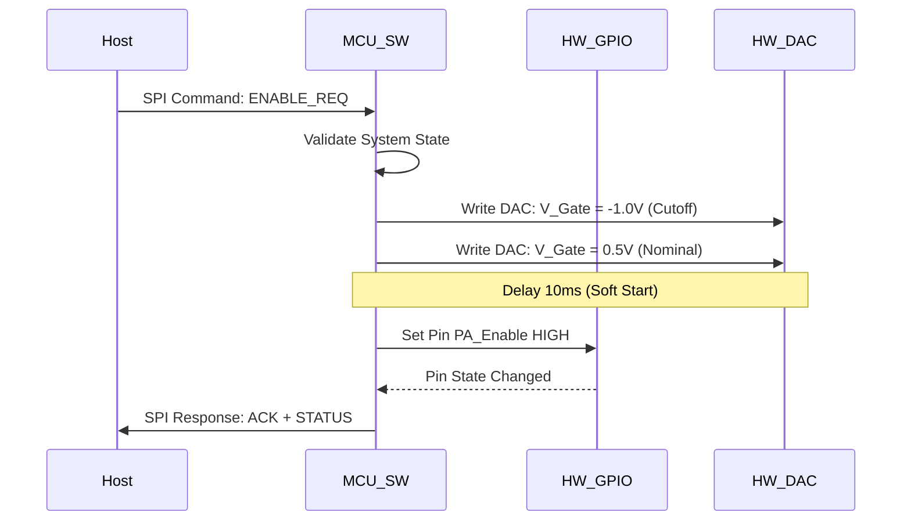
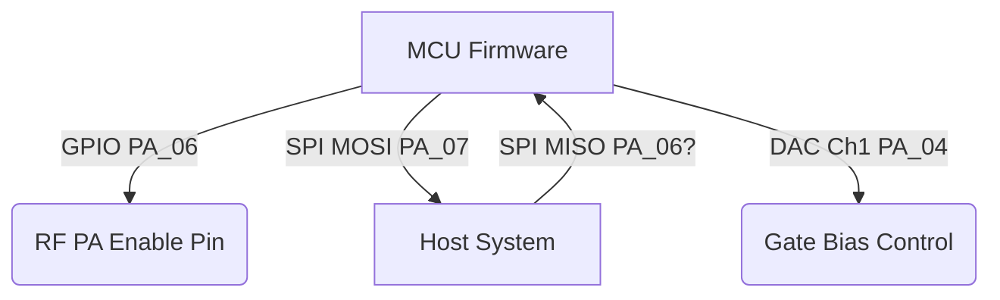

# Software Requirements Specification (SRS)
**Project:** rfff (GaN RF Power Amplifier Control System)
**Version:** 1.0
**Date:** 2026-04-02
**Status:** Preliminary

---

# 1. Introduction

## 1.1 Purpose
This Software Requirements Specification (SRS) describes the software architecture and behavioral requirements for the **rfff** Embedded Control System. The purpose of this software is to manage the power sequencing, provide real-time protection against thermal and electrical faults, and manage the RF Power Amplifier (PA) state machine via a microcontroller (MCU).

## 1.2 Scope
The software scope encompasses the firmware running on the management MCU (e.g., Cortex-M4 class). This includes:
*   Control of the RF Power Amplifier (PA) bias and enable sequencing.
*   Digital-to-Analog Converter (DAC) control for Gate Voltage ($V_{GS}$) regulation.
*   Analog-to-Digital Converter (ADC) monitoring of Drain Current ($I_{D}$), Drain Voltage ($V_{DS}$), and Temperature ($T_{H}$).
*   Communication via SPI for status reporting and command receipt.
*   Implementation of safety interlocks (Thermal Shutdown, Overcurrent Protection).

## 1.3 Definitions, Acronyms, and Abbreviations

| Term | Definition |
| :--- | :--- |
| **API** | Application Programming Interface |
| **CW** | Continuous Wave (Unmodulated RF carrier) |
| **DAC** | Digital-to-Analog Converter |
| **DACq** | Quadrature DAC or specific DAC channel identifier |
| **DACi** | In-phase DAC or specific DAC channel identifier |
| **ESD** | Electrostatic Discharge |
| **FEM** | Front End Module |
| **FIFO** | First-In-First-Out buffer |
| **FW** | Firmware |
| **GLR** | Glue Logic Requirements |
| **GPI** | General Purpose Input |
| **GPO** | General Purpose Output |
| **HRS** | Hardware Requirements Specification |
| **IRQ** | Interrupt Request |
| **ISR** | Interrupt Service Routine |
| **MCU** | Microcontroller Unit |
| **MISO** | Master In Slave Out (SPI Data line) |
| **MOSI** | Master Out Slave In (SPI Data line) |
| **PA** | Power Amplifier |
| **PCB** | Printed Circuit Board |
| **RTOS** | Real-Time Operating System |
| **Rx** | Receive |
| **SMA** | SubMiniature version A (Connector) |
| **SPI** | Serial Peripheral Interface |
| **SRAM** | Static Random Access Memory |
| **SRS** | Software Requirements Specification |
| **SW** | Software |
| **TTL** | Transistor-Transistor Logic |
| **Tx** | Transmit |

## 1.4 References
1.  **IEEE Std 830-1998**: IEEE Recommended Practice for Software Requirements Specifications.
2.  **IEEE Std 29148-2018**: Systems and software engineering — Life cycle processes — Requirements engineering.
3.  **rfff Hardware Requirements Specification (P2)**: REV 1.0, 2026-04-02.
4.  **rfff Glue Logic Requirements (P6)**: REV 1.0, 2026-04-02.

## 1.5 Overview
Section 2 provides a high-level description of the system interfaces and constraints. Section 3 details the specific software requirements, mapped to hardware IDs. Section 4 defines verification criteria. Section 5 provides the traceability matrix.

---

# 2. Overall Description

## 2.1 Product Perspective
The **rfff** software operates as the control logic embedded within the RF Power Amplifier module. It abstracts the complexity of the GaN biasing requirements from the host system. The Host System interacts with the PA module via a standardized SPI interface. The Microcontroller (MCU) sits between the Host and the RF Chain.

## 2.2 Product Functions
1.  **Power Sequencing:** Manage the specific $V_{GS}$ (Gate) and $V_{DS}$ (Drain) startup order required by GaN devices to prevent premature conduction and shoot-through.
2.  **Fault Management:** Monitor $I_D$, $V_{DS}$, and Temperature via ADC. Trigger shutdown if thresholds are exceeded (REQ-HW-016).
3.  **SPI Slave Interface:** Respond to host commands for Enable/Disable and Status Telemetry.

## 2.3 User Characteristics
*   **Primary User:** A Host System (e.g., FPGA or MPU) sending commands via SPI.
*   **Secondary User:** Field Technicians interacting via LED indicators (implemented via GPO).

## 2.4 Constraints
1.  **Timing:** SPI timing constraints specified in GLR P6 (10 MHz max, 10ns setup/hold).
2.  **RToS:** Hard real-time response required for Fault IRQs (< 5 µs).
3.  **Memory:** Limited RAM on target MCU (< 128KB).

## 2.5 Assumptions and Dependencies
1.  The host system guarantees the SPI_CS signal is de-asserted low for at least 50ns between transactions.
2.  The 28V DC Supply is considered the primary power source; MCU logic is derived from a 3.3V LDO regulated from this rail.

---

# 3. Specific Requirements

## 3.1 External Interface Requirements

### 3.1.1 Hardware Interfaces
The software interfaces with the hardware via memory-mapped I/O registers and peripheral blocks.

**Register Map (GLR P6 Derived):**

| Logical Name | Register/Periph | Type | Address Offset | HW Ref |
| :--- | :--- | :--- | :--- | :--- |
| `REG_SPI_CR1` | SPI Control Reg 1 | RW | `0x40013000` | GLR P6 2.0 |
| `REG_ADC_DR` | ADC Data Register | R | `0x4001204C` | REQ-HW-006 |
| `REG_DAC_DHR12R1` | DAC Ch1 Data Hold | W | `0x40007408` | REQ-HW-002 (Gain Ctrl) |
| `GPO_PA_ENABLE` | GPIO Port A, Pin 5 | RW | `0x40020014` | REQ-HW-011 |

**C Struct Definition (Header File `rfff_hw_types.h`):**
```c
#include <stdint.h>
#include <stdbool.h>

/**
 * @brief Hardware Register Map Structure
 * @details Memory-mapped structure aligned to peripheral base address.
 */
typedef struct {
    __IO uint32_t CR1;        /**< SPI Control Register 1, Offset: 0x00 */
    __IO uint32_t CR2;        /**< SPI Control Register 2, Offset: 0x04 */
    __IO uint32_t SR;         /**< SPI Status Register, Offset: 0x08 */
    __IO uint32_t DR;         /**< SPI Data Register, Offset: 0x0C */
    __IO uint32_t CRCPR;      /**< SPI CRC Polynomial Register, Offset: 0x10 */
    __IO uint32_t RXCRCR;     /**< SPI RX CRC Register, Offset: 0x14 */
    __IO uint32_t TXCRCR;     /**< SPI TX CRC Register, Offset: 0x18 */
} SPI_TypeDef;

typedef struct {
    __IO uint32_t MODER;      /**< GPIO Mode Register, Offset: 0x00 */
    __IO uint32_t OTYPER;     /**< GPIO Output Type Register, Offset: 0x04 */
    __IO uint32_t OSPEEDR;    /**< GPIO Output Speed Register, Offset: 0x08 */
    __IO uint32_t PUPDR;      /**< GPIO Pull-up/Pull-down Register, Offset: 0x0C */
    __IO uint32_t IDR;        /**< GPIO Input Data Register, Offset: 0x10 */
    __IO uint32_t ODR;        /**< GPIO Output Data Register, Offset: 0x14 */
} GPIO_TypeDef;

/* Base Addresses (Assumption: ARM Cortex-M4 Memory Map) */
#define SPI1_BASE   0x40013000
#define GPIOA_BASE  0x40020000
#define ADC1_BASE   0x40012000

#define SPI1   ((SPI_TypeDef *)  SPI1_BASE)
#define GPIOA  ((GPIO_TypeDef *) GPIOA_BASE)
```

### 3.1.2 Software Interfaces

**Driver API Signatures:**
```c
/**
 * @brief Initialize the PA control subsystem (GPIO, ADC, SPI).
 * @return ERR_NONE on success, ERR_INIT_FAILED on hardware fault.
 */
int32_t PA_Driver_Init(void);

/**
 * @brief Control the PA Enable Pin (TTL interface).
 * @param state True to enable PA (Logic High), False to shutdown (Logic Low).
 * @note Maps to REQ-HW-011.
 */
void PA_Set_Enable(bool state);

/**
 * @brief Set the Gate Bias Voltage via DAC.
 * @param voltage_mv Desired gate voltage in millivolts (0 to 2000 mV).
 * @note Maps to REQ-HW-002 (Gain Control).
 */
int32_t PA_Set_Gate_Bias(uint16_t voltage_mv);

/**
 * @brief Read current telemetry data.
 * @param data Pointer to structure to hold telemetry.
 */
int32_t PA_Get_Telemetry(PA_Telemetry_t* data);

/**
 * @brief Handle SPI Slave communication.
 */
void PA_SPI_Task(void);
```

**Data Structures:**
```c
typedef struct {
    float temp_celsius;       /* Heatsink Temperature */
    float current_amps;       /* Drain Current */
    float voltage_volts;      /* Drain Voltage */
    uint8_t fault_flags;      /* Bitmap of active faults */
} PA_Telemetry_t;

/* Error Codes */
#define ERR_NONE              0
#define ERR_INVALID_PARAM    -1
#define ERR_INIT_FAILED      -2
#define ERR_OVERTEMP         -3
#define ERR_OVERCURRENT      -4
#define ERR_SPI_TX_FAIL      -5
```

### 3.1.3 Communication Interfaces
*   **Protocol:** SPI Standard Mode 0 (CPOL=0, CPHA=0).
*   **Data Width:** 8-bit frames.
*   **Max Frequency:** 10 MHz.
*   **Endianness:** MSB First.

### Sequence Diagram: Power On Sequence


## 3.2 Functional Requirements

### REQ-SW-001: Power Sequencing Logic
**Description:** The software shall assert the PA_Enable pin (TTL High) only after the Gate Bias DAC has stabilized within ±5% of the target voltage.
**Priority:** Must Have
**Trace:** REQ-HW-011, REQ-HW-016
**Verification:** Unit test of `PA_Driver_Init` sequence using a logic analyzer to verify timing.

### REQ-SW-002: Telemetry Monitoring Rate
**Description:** The firmware shall sample temperature and current sensors at a minimum rate of 10 Hz.
**Priority:** Must Have
**Trace:** REQ-HW-006, REQ-HW-014
**Metric:** $T_{sample} \le 100ms$.

### REQ-SW-003: Overcurrent Protection
**Description:** If the measured DC Current ($I_{D}$) exceeds 2.7A (10% margin over REQ-HW-006 max), the software shall immediately set PA_Enable LOW within 10 microseconds.
**Priority:** Must Have
**Trace:** REQ-HW-006
**Verification:** Inject 3.0A signal into ADC; verify shutdown time.

### REQ-SW-004: Thermal Shutdown
**Description:** If the reported temperature exceeds 90°C, the software shall latch the PA into a disabled state and set the `ERR_OVERTEMP` flag. Reset is required via SPI command.
**Priority:** Must Have
**Trace:** REQ-HW-001 (Thermal Constraints), REQ-HW-016
**Verification:** Thermal chamber test.

### REQ-SW-005: SPI Command Processing
**Description:** The MCU shall implement a SPI Slave interface supporting commands: `NOP`, `GET_STATUS`, `SET_ENABLE`, `SET_BIAS`.
**Priority:** Must Have
**Trace:** GLR P6
**Algorithm:**
1.  Byte 0: Command Opcode.
2.  Byte 1: Payload (if applicable).
3.  Byte 2: CRC8 (optional, derived).

### REQ-SW-006: Watchdog Timer
**Description:** The firmware shall service an Independent Watchdog Timer (IWDG) every 100ms ± 10ms. Failure to service indicates a firmware crash and triggers a hardware reset.
**Priority:** Must Have
**Trace:** General Reliability

## 3.3 Performance Requirements
| ID | Metric | Requirement | Derived From |
|---|---|---|---|
| PERF-001 | SPI Latency | Response to command within 50 µs | GLR P6 |
| PERF-002 | ADC Accuracy | 12-bit resolution, ±1 LSB error | MCU Datasheet |
| PERF-003 | Startup Time | Time from Power-On-Rest to Ready state < 200ms | System timing |

## 3.4 Design Constraints
1.  **Compiler:** GCC ARM Embedded (or equivalent IAR/Keil).
2.  **Language:** C99 (C++11 allowed for specific drivers if justified).
3.  **Stack Size:** Reserved 2KB minimum for Interrupt Stack.

## 3.5 Software System Attributes

### 3.5.1 Reliability
The software must achieve a Mean Time Between Failures (MTBF) of 10,000 hours. Critical code (Protection logic) must not rely on dynamic memory allocation.

### 3.5.2 Availability
System recovery time (Watchdog reset) must be < 500ms.

### 3.5.3 Security
1.  Write access to the DAC registers (Gain/Bias) requires a specific "Unlock" sequence via SPI to prevent accidental misconfiguration by a malfunctioning host.

### 3.5.4 Maintainability
Code must adhere to MISRA-C:2012 guidelines (90% compliance).

---

# 4. Verification and Validation

## 4.1 Unit Test Requirements
*   **Mocking:** Hardware registers (SPI, ADC, GPIO) shall be mocked in a host-based test environment.
*   **Coverage:** Minimum 80% code coverage for decision paths (if/else branches).

## 4.2 Integration Test Requirements
*   **HIL (Hardware-in-Loop):** Tests must run on the target PCB with a simulated Host (SPI Master).
*   **Tests:**
    1.  Verify `REQ-SW-003` (Overcurrent) using a programmable current source.
    2.  Verify SPI signal integrity (eye diagram) at 10 MHz.

## 4.3 System Test Requirements
*   **Thermal Cycling:** Run the amplifier at full power (40 dBm CW) in a +85°C chamber for 24 hours. Software must not report false overcurrent trips due to temperature drift.

---

# 5. Traceability Matrix

| Software ID | Description | Source Requirement |
| :--- | :--- | :--- |
| **REQ-SW-001** | Power Sequencing Logic | REQ-HW-011, REQ-HW-016 |
| **REQ-SW-002** | Telemetry Monitoring Rate | REQ-HW-001, REQ-HW-014 |
| **REQ-SW-003** | Overcurrent Protection | REQ-HW-006 |
| **REQ-SW-004** | Thermal Shutdown | REQ-HW-016 |
| **REQ-SW-005** | SPI Command Processing | GLR P6 (Section 4) |
| **REQ-SW-006** | Watchdog Timer | (Implicit Safety Req) |

---

# 6. Appendices

## Appendix A: SPI Protocol Definition (Draft)
*   **Frame Structure:** 16-bit word.
    *   `[15:8]`: Opcode / Register Address.
    *   `[7:0]`: Data.
*   **Opcodes:**
    *   `0x01`: `SET_ENABLE` (Data: 0x01=ON, 0x00=OFF)
    *   `0x02`: `GET_STATUS` (Returns: Byte 0 = Flags, Byte 1 = Temp)
    *   `0x10`: `SET_GATE_V` (Data: 0-255 mapped to 0-2.0V)

## Appendix B: GPIO Pin Mapping (Derived from GLR P6)
*   **PA_EN:** `PA_05` (Output, Push-Pull)
*   **SPI_CS:** `PA_04` (Input, Pull-Up)
*   **SPI_CLK:** `PA_05` (Input - *Conflict Check Required: Reassign PA_EN to PA_06*)
*   *Correction:* `PA_06` assigned to PA_Enable to avoid SPI CLK collision on `PA_05`.


*Note: Pin conflict in diagram hypothetical; refer to schematic for final pin assignment.*